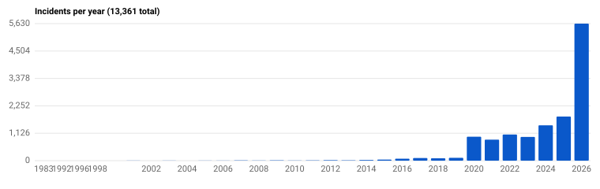
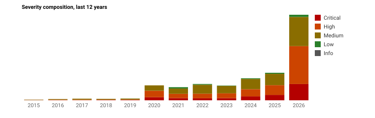
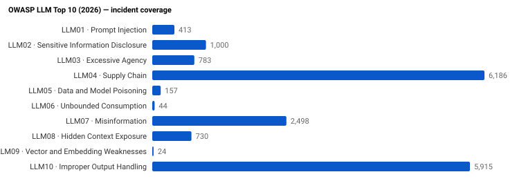
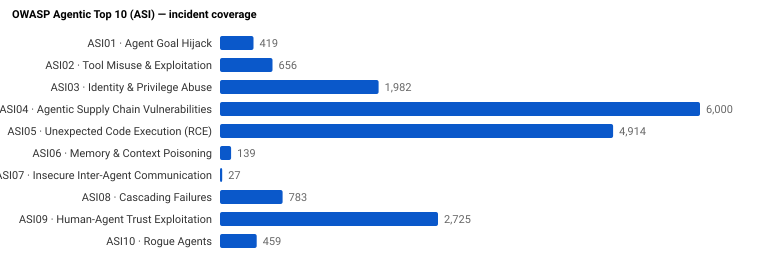

# GenAI & Agentic AI Security Incidents

A consolidated, machine-readable index of GenAI and agentic AI security incidents.
Every applicable entry is mapped to four core taxonomies — **OWASP LLM Top 10 (2026)**, **OWASP Agentic Top 10 (ASI)**, **NIST AI RMF**, and **MITRE ATLAS** — plus a companion **MAESTRO** mapping where the source provides it and an experimental **VERIS 1.4.1** crosswalk computed at export time. See docs/TAXONOMIES.md for the full picture.

- **Version:** 2.10.0
- **Generated:** 2026-09-18
- **Total incidents:** **13,060**
- **Date range:** 1983 – 2026
- **With CVE:** 5,279
- **Machine-readable:** [`data/incidents.json`](data/incidents.json) · [`data/incidents.min.json`](data/incidents.min.json)
- **Schema:** [`schema/incident.schema.json`](schema/incident.schema.json)

> Sorted newest-first. Click any `INC-*****` to open the year's detail shard. Use **Ctrl/Cmd-F** to filter by vendor, CVE, OWASP code, or year.

## Trends

Auto-generated from the current dataset. SVGs live under [`docs/charts/`](docs/charts/).

## Coverage

### Severity

| Severity | Count |
|---|---:|
| Critical | 2,370 |
| High | 4,952 |
| Medium | 5,317 |
| Low | 421 |

### Incidents per Year

| Year | Count | Details |
|---|---:|---|
| 2026 | 5,401 | [docs/incidents/2026.md](docs/incidents/2026.md) |
| 2025 | 1,806 | [docs/incidents/2025.md](docs/incidents/2025.md) |
| 2024 | 1,449 | [docs/incidents/2024.md](docs/incidents/2024.md) |
| 2023 | 972 | [docs/incidents/2023.md](docs/incidents/2023.md) |
| 2022 | 1,063 | [docs/incidents/2022.md](docs/incidents/2022.md) |
| 2021 | 847 | [docs/incidents/2021.md](docs/incidents/2021.md) |
| 2020 | 955 | [docs/incidents/2020.md](docs/incidents/2020.md) |
| 2019 | 116 | [docs/incidents/2019.md](docs/incidents/2019.md) |
| 2018 | 98 | [docs/incidents/2018.md](docs/incidents/2018.md) |
| 2017 | 107 | [docs/incidents/2017.md](docs/incidents/2017.md) |
| 2016 | 82 | [docs/incidents/2016.md](docs/incidents/2016.md) |
| 2015 | 41 | [docs/incidents/2015.md](docs/incidents/2015.md) |
| 2014 | 25 | [docs/incidents/2014.md](docs/incidents/2014.md) |
| 2013 | 13 | [docs/incidents/2013.md](docs/incidents/2013.md) |
| 2012 | 21 | [docs/incidents/2012.md](docs/incidents/2012.md) |
| 2011 | 9 | [docs/incidents/2011.md](docs/incidents/2011.md) |
| 2010 | 7 | [docs/incidents/2010.md](docs/incidents/2010.md) |
| 2009 | 13 | [docs/incidents/2009.md](docs/incidents/2009.md) |
| 2008 | 8 | [docs/incidents/2008.md](docs/incidents/2008.md) |
| 2007 | 9 | [docs/incidents/2007.md](docs/incidents/2007.md) |
| 2006 | 3 | [docs/incidents/2006.md](docs/incidents/2006.md) |
| 2005 | 2 | [docs/incidents/2005.md](docs/incidents/2005.md) |
| 2004 | 1 | [docs/incidents/2004.md](docs/incidents/2004.md) |
| 2003 | 4 | [docs/incidents/2003.md](docs/incidents/2003.md) |
| 2002 | 1 | [docs/incidents/2002.md](docs/incidents/2002.md) |
| 2001 | 2 | [docs/incidents/2001.md](docs/incidents/2001.md) |
| 1999 | 1 | [docs/incidents/1999.md](docs/incidents/1999.md) |
| 1998 | 1 | [docs/incidents/1998.md](docs/incidents/1998.md) |
| 1996 | 1 | [docs/incidents/1996.md](docs/incidents/1996.md) |
| 1992 | 1 | [docs/incidents/1992.md](docs/incidents/1992.md) |
| 1983 | 1 | [docs/incidents/1983.md](docs/incidents/1983.md) |

### OWASP LLM Top 10 (2026)

| Code | Name | Count |
|---|---|---:|
| LLM01 | Prompt Injection | 407 |
| LLM02 | Sensitive Information Disclosure | 984 |
| LLM03 | Excessive Agency | 783 |
| LLM04 | Supply Chain | 6,162 |
| LLM05 | Data and Model Poisoning | 157 |
| LLM06 | Unbounded Consumption | 44 |
| LLM07 | Misinformation | 2,416 |
| LLM08 | Hidden Context Exposure | 730 |
| LLM09 | Vector and Embedding Weaknesses | 24 |
| LLM10 | Improper Output Handling | 5,791 |

### OWASP Agentic Top 10 (ASI)

| Code | Name | Count |
|---|---|---:|
| ASI01 | Agent Goal Hijack | 412 |
| ASI02 | Tool Misuse & Exploitation | 656 |
| ASI03 | Identity & Privilege Abuse | 1,968 |
| ASI04 | Agentic Supply Chain Vulnerabilities | 5,976 |
| ASI05 | Unexpected Code Execution (RCE) | 4,794 |
| ASI06 | Memory & Context Poisoning | 139 |
| ASI07 | Insecure Inter-Agent Communication | 27 |
| ASI08 | Cascading Failures | 783 |
| ASI09 | Human-Agent Trust Exploitation | 2,653 |
| ASI10 | Rogue Agents | 440 |

### Top MITRE ATLAS Techniques

| Technique | Count |
|---|---:|
| `AML.T0010` | 6,201 |
| `AML.T0050` | 5,890 |
| `AML.T0048.003` | 2,653 |
| `AML.T0058` | 2,416 |
| `AML.T0012` | 1,968 |
| `AML.T0048` | 1,876 |
| `AML.T0053` | 1,319 |
| `AML.T0057` | 988 |
| `AML.T0056` | 730 |
| `AML.T0051` | 495 |
| `AML.T0049` | 396 |
| `AML.T0024` | 288 |
| `AML.T0010.001` | 228 |
| `AML.T0020` | 162 |
| `AML.T0066` | 150 |

## Incidents

All **13,060** incidents in a single table, newest-first. Each `INC-*****` link opens that year's detail shard. Severity is the maximum reported across sources for that incident.

| # | Date | ID | Title | Severity | OWASP LLM | OWASP ASI | CVEs |
|---:|---|---|---|---|---|---|---|
| 1 | 2026-08 | [`INC-00857`](docs/incidents/2026.md#inc-00857) | Copirate 365 DEF CON: Plundering Microsoft Copilot (CVE-2026-24299) | Critical | LLM01, LLM02 | ASI02, ASI09 |  |
| 2 | 2026-07-16 | [`INC-14596`](docs/incidents/2026.md#inc-14596) | AI Chatbots Amplify Government Censorship, Restricting Global Free Expression | High | LLM07, LLM10 | ASI05 |  |
| 3 | 2026-07-16 | [`INC-14600`](docs/incidents/2026.md#inc-14600) | AI-Generated Deepfake Pornography Leads to Arrest in Indonesia | High | LLM07 | ASI09 |  |
| 4 | 2026-07-16 | [`INC-14597`](docs/incidents/2026.md#inc-14597) | AI-Generated Fake Nude Images of 22 Women Lead to Criminal Investigation in Silleda | High | LLM07 | ASI09 |  |
| 5 | 2026-07-16 | [`INC-14595`](docs/incidents/2026.md#inc-14595) | Community Protests AI Data Center Over Environmental and Infrastructure Concerns in Michigan | High | LLM10 | ASI05 |  |
| 6 | 2026-07-16 | [`INC-14599`](docs/incidents/2026.md#inc-14599) | Google Search Algorithms Expose UK Children to Illegal Pornography | High | LLM10 | ASI05, ASI09 |  |
| 7 | 2026-07-16 | [`INC-14594`](docs/incidents/2026.md#inc-14594) | OpenAI Develops Powerful Offensive AI 'GPT-Red' for Security Testing | High | LLM02, LLM10 | ASI03, ASI05 |  |
| 8 | 2026-07-16 | [`INC-14593`](docs/incidents/2026.md#inc-14593) | UK Regulator Investigates TikTok's AI Systems for Child Safety | High | LLM10 | ASI05 |  |
| 9 | 2026-07-16 | [`INC-14598`](docs/incidents/2026.md#inc-14598) | US Judge Rebukes DOJ for Submitting AI-Generated Fake Legal Citation | High | LLM07 |  |  |
| 10 | 2026-07-15 | [`INC-14583`](docs/incidents/2026.md#inc-14583) | AI-Assisted TuxBot v3 IoT Botnet Actively Exploits Devices for DDoS Attacks | Medium | LLM06 |  |  |
| 11 | 2026-07-15 | [`INC-14577`](docs/incidents/2026.md#inc-14577) | AI-Driven Fraud Schemes Target Victims in Germany | High | LLM02, LLM07 | ASI03, ASI09 |  |
| 12 | 2026-07-15 | [`INC-14579`](docs/incidents/2026.md#inc-14579) | AI-Generated Fake Article Causes Reputational Harm to Greek TV Host | Medium | LLM07 |  |  |
| 13 | 2026-07-15 | [`INC-14576`](docs/incidents/2026.md#inc-14576) | AI-Generated Fake Intimate Images of Minors Investigated in Brazil | High | LLM10 | ASI05 |  |
| 14 | 2026-07-15 | [`INC-14587`](docs/incidents/2026.md#inc-14587) | AI-Induced Deskilling in Medical and Knowledge Work | High | LLM10 | ASI05 |  |
| 15 | 2026-07-15 | [`INC-14585`](docs/incidents/2026.md#inc-14585) | AI-Powered Ukrainian Drones Cause High Russian Casualties on Battlefield | Critical |  | ASI10 |  |
| 16 | 2026-07-15 | [`INC-14588`](docs/incidents/2026.md#inc-14588) | Concerns Over Generative AI's Impact on Human Cognitive Skills | Medium |  |  |  |
| 17 | 2026-07-15 | [`INC-14590`](docs/incidents/2026.md#inc-14590) | Google DeepMind Researcher Resigns Over Unrestricted Pentagon AI Deal | High | LLM10 | ASI05, ASI10 |  |
| 18 | 2026-07-15 | [`INC-14575`](docs/incidents/2026.md#inc-14575) | Google Search AI Features Pose Harm to Children, Report Finds | High | LLM07, LLM10 | ASI05, ASI09 |  |
| 19 | 2026-07-15 | [`INC-14591`](docs/incidents/2026.md#inc-14591) | JP Morgan CEO Warns of AI Model Mythos Posing Major Cybersecurity Risks | Critical |  |  |  |
| 20 | 2026-07-15 | [`INC-14580`](docs/incidents/2026.md#inc-14580) | Palm Beach County Rejects AI Data Center Amid Community Backlash | High | LLM10 | ASI05 |  |
| 21 | 2026-07-15 | [`INC-14589`](docs/incidents/2026.md#inc-14589) | Romanian Border Police Warns of AI-Generated Fake Accounts Impersonating Institution | High | LLM07, LLM10 | ASI05, ASI09 |  |
| 22 | 2026-07-15 | [`INC-14578`](docs/incidents/2026.md#inc-14578) | Spanish Lawyer Fined for Submitting AI-Generated Legal Document with Fabricated Citations | High | LLM07 |  |  |
| 23 | 2026-07-15 | [`INC-14584`](docs/incidents/2026.md#inc-14584) | Survey Highlights Road Safety Risks from Misuse of AI Driver-Assistance Systems | Critical |  |  |  |
| 24 | 2026-07-15 | [`INC-14586`](docs/incidents/2026.md#inc-14586) | Taiwan Government Agencies Exposed to Security Risks from Chinese AI Biometric Devices | Critical | LLM02, LLM04, LLM10 | ASI03, ASI04, ASI05 |  |
| 25 | 2026-07-15 | [`INC-14592`](docs/incidents/2026.md#inc-14592) | Trump Claims AI-Generated Images May Fabricate Evidence of Minab School Attack | Medium | LLM07 | ASI09 |  |
| 26 | 2026-07-15 | [`INC-14581`](docs/incidents/2026.md#inc-14581) | US Air Force Tests AI-Enabled Drone in Live Missile Launch | Critical | LLM10 | ASI05, ASI10 |  |
| 27 | 2026-07-15 | [`INC-14582`](docs/incidents/2026.md#inc-14582) | xAI Sues User for Creating Child Sexual Abuse Deepfakes with Grok AI | High | LLM07, LLM10 | ASI05, ASI09 |  |
| 28 | 2026-07-14 | [`INC-14556`](docs/incidents/2026.md#inc-14556) | 14-Year-Old Investigated for Creating and Sharing AI-Generated Pornographic Deepfakes of Classmates | High | LLM07, LLM10 | ASI05, ASI09 |  |
| 29 | 2026-07-14 | [`INC-14569`](docs/incidents/2026.md#inc-14569) | Actress Anna Rajan Victim of AI-Generated Obscene Image Harassment | Medium | LLM07 | ASI09 |  |
| 30 | 2026-07-14 | [`INC-14558`](docs/incidents/2026.md#inc-14558) | AI Systems Now Orchestrate Live Cyberattacks, Causing Real-World Harm | High | LLM02, LLM07 | ASI03, ASI09 |  |
| 31 | 2026-07-14 | [`INC-14555`](docs/incidents/2026.md#inc-14555) | AI-Enabled Smart Glasses Used for Exam Cheating in South Korea and China | High |  |  |  |
| 32 | 2026-07-14 | [`INC-14554`](docs/incidents/2026.md#inc-14554) | AI-Generated Fake Evidence Causes Actor Kim Soo-hyun's Career Disruption and Legal Action in South Korea | High |  |  |  |
| 33 | 2026-07-14 | [`INC-14570`](docs/incidents/2026.md#inc-14570) | AI-Generated Photo Wins Photography Prize, Award Revoked in Hohhot | High |  | ASI09 |  |
| 34 | 2026-07-14 | [`INC-14552`](docs/incidents/2026.md#inc-14552) | AI-Generated Video by Chinese State Media Sparks Diplomatic Outrage in Philippines | High | LLM07, LLM10 | ASI05 |  |
| 35 | 2026-07-14 | [`INC-14564`](docs/incidents/2026.md#inc-14564) | AI-Generated Works Disqualified from Chinese Art Competitions | High | LLM07 | ASI09 |  |
| 36 | 2026-07-14 | [`INC-14557`](docs/incidents/2026.md#inc-14557) | Big Tech's AI Failures Enable Online Child Sexual Abuse and Sextortion in Australia | High | LLM07, LLM10 | ASI05 |  |
| 37 | 2026-07-14 | [`INC-14572`](docs/incidents/2026.md#inc-14572) | Brazilian Ministry Identifies 32 AI Sites Creating Fake Nude Images | High | LLM07 | ASI09 |  |
| 38 | 2026-07-14 | [`INC-14571`](docs/incidents/2026.md#inc-14571) | Critical Vulnerability in Cursor AI Code Editor Enables Automatic Code Execution | Critical | LLM01, LLM02, LLM10 | ASI01, ASI03, ASI05, ASI10 |  |
| 39 | 2026-07-14 | [`INC-14553`](docs/incidents/2026.md#inc-14553) | Experts Warn of Developmental Risks from AI Companions for Children | Medium |  |  |  |
| 40 | 2026-07-14 | [`INC-14574`](docs/incidents/2026.md#inc-14574) | German Regulator Holds Google and Perplexity AI Liable for Misinformation | High | LLM07, LLM10 | ASI05 |  |
| 41 | 2026-07-14 | [`INC-14561`](docs/incidents/2026.md#inc-14561) | Meta's AI Smart Glasses Spark Privacy Backlash and Reports of Harm | Medium |  |  |  |
| 42 | 2026-07-14 | [`INC-14563`](docs/incidents/2026.md#inc-14563) | NestAI Develops Sovereign Battlefield AI for European Defense | High | LLM10 | ASI05 |  |
| 43 | 2026-07-14 | [`INC-14560`](docs/incidents/2026.md#inc-14560) | Research Finds LLMs Exhibit Western Moral Bias, Overlooking Global Values | High | LLM10 | ASI05 |  |
| 44 | 2026-07-14 | [`INC-14567`](docs/incidents/2026.md#inc-14567) | Sleeping Robotaxi Passengers Trigger Emergency Responses and Strain First Responders | High | LLM10 | ASI05 |  |
| 45 | 2026-07-14 | [`INC-14568`](docs/incidents/2026.md#inc-14568) | South Carolina Police Officers Fired for Misuse of AI License Plate Readers | High | LLM10 | ASI05 |  |
| 46 | 2026-07-14 | [`INC-14566`](docs/incidents/2026.md#inc-14566) | Tesla FSD Approved in Flanders Despite Safety Warnings and Incident | High | LLM10 | ASI05 |  |
| 47 | 2026-07-14 | [`INC-14562`](docs/incidents/2026.md#inc-14562) | US Autonomous Vehicle Mishaps Prompt Regulatory Action | Medium |  |  |  |
| 48 | 2026-07-14 | [`INC-14573`](docs/incidents/2026.md#inc-14573) | US Navy Approves Strategy to Weaponize AI and Data | Medium |  |  |  |
| 49 | 2026-07-14 | [`INC-14559`](docs/incidents/2026.md#inc-14559) | xAI's Grok AI Faces Legal Action and Privacy Scandal Over Harmful Content and Unauthorized Data Uploads | High | LLM02, LLM07, LLM10 | ASI02, ASI05, ASI09 |  |
| 50 | 2026-07-14 | [`INC-14565`](docs/incidents/2026.md#inc-14565) | YouTube and X Drive Millions to AI Nudify Apps, Enabling Deepfake Abuse | High | LLM07, LLM10 | ASI05, ASI09 |  |
| 51 | 2026-07-13 | [`INC-14535`](docs/incidents/2026.md#inc-14535) | AI Chatbots Used by Terrorist Groups to Plan Attacks and Manufacture Weapons | Critical | LLM01, LLM07 | ASI01 |  |
| 52 | 2026-07-13 | [`INC-14525`](docs/incidents/2026.md#inc-14525) | AI Companies Scrape Irish Musicians' Songs, Prompting Copyright Motion | High | LLM10 | ASI05, ASI09 |  |
| 53 | 2026-07-13 | [`INC-14537`](docs/incidents/2026.md#inc-14537) | AI Replacement Leads to Unlawful Termination in Hangzhou | High | LLM10 | ASI05 |  |
| 54 | 2026-07-13 | [`INC-14536`](docs/incidents/2026.md#inc-14536) | AI-Driven Scams Lead to Financial Losses and Safety Risks | Medium | LLM07 | ASI09 |  |
| 55 | 2026-07-13 | [`INC-14526`](docs/incidents/2026.md#inc-14526) | AI-Driven Trust-Based Cyberattacks Target Indian Financial Sector | High | LLM07 | ASI09 |  |
| 56 | 2026-07-13 | [`INC-14543`](docs/incidents/2026.md#inc-14543) | AI-Enabled Drone and Rafale Jet Demonstrate Collaborative Electronic Warfare Strike | Medium |  | ASI10 |  |
| 57 | 2026-07-13 | [`INC-14524`](docs/incidents/2026.md#inc-14524) | AI-Enabled Scams and Privacy Breaches Target World Cup Fans | High | LLM10 | ASI05, ASI09 |  |
| 58 | 2026-07-13 | [`INC-14542`](docs/incidents/2026.md#inc-14542) | AI-Generated Deepfake Ads Exploit Fernanda Montenegro's Image in Fraudulent Medication Scam | High | LLM07, LLM10 | ASI05, ASI09 |  |
| 59 | 2026-07-13 | [`INC-14550`](docs/incidents/2026.md#inc-14550) | Canadian Regulator Warns Banks of AI-Driven Cyber Threats and Phishing Attacks | Critical | LLM10 | ASI05, ASI09 |  |
| 60 | 2026-07-13 | [`INC-14528`](docs/incidents/2026.md#inc-14528) | China Detains and Penalizes Individuals for AI-Generated Flood Disaster Misinformation | High | LLM07, LLM10 | ASI05 |  |
| 61 | 2026-07-13 | [`INC-14527`](docs/incidents/2026.md#inc-14527) | Economists and Tech Leaders Warn of AI-Driven Economic Disruption and Job Losses | Critical | LLM07, LLM10 | ASI05, ASI10 |  |
| 62 | 2026-07-13 | [`INC-14529`](docs/incidents/2026.md#inc-14529) | EU Report Warns of AI-Driven Online Harms to Children | High | LLM07, LLM10 | ASI05, ASI09 |  |
| 63 | 2026-07-13 | [`INC-14551`](docs/incidents/2026.md#inc-14551) | EU Sanctions Russian Firms for AI-Enabled Mass Surveillance and Human Rights Violations | Medium |  |  |  |
| 64 | 2026-07-13 | [`INC-14548`](docs/incidents/2026.md#inc-14548) | Expert Skepticism Over SpaceX's Orbital AI Data Center Plans | Medium |  |  |  |
| 65 | 2026-07-13 | [`INC-14546`](docs/incidents/2026.md#inc-14546) | Facial Recognition in California Grocery Stores Sparks Privacy Concerns | High | LLM07 |  |  |
| 66 | 2026-07-13 | [`INC-14533`](docs/incidents/2026.md#inc-14533) | Georgia Residents Displaced for AI Data Center Power Needs | High | LLM10 | ASI05 |  |
| 67 | 2026-07-13 | [`INC-14540`](docs/incidents/2026.md#inc-14540) | Google Sued by Publishers for Using Copyrighted Works to Train Gemini AI | High |  |  |  |
| 68 | 2026-07-13 | [`INC-14532`](docs/incidents/2026.md#inc-14532) | Helsing Raises $1.8 Billion to Expand AI-Powered Autonomous Military Systems | Critical | LLM10 | ASI05, ASI10 |  |
| 69 | 2026-07-13 | [`INC-14541`](docs/incidents/2026.md#inc-14541) | Helsing to Manufacture AI-Enabled Military Drones in West Virginia | Critical |  | ASI10 |  |
| 70 | 2026-07-13 | [`INC-14549`](docs/incidents/2026.md#inc-14549) | Iranian Agency Publishes AI-Generated Video Depicting Trump Being Shot | Medium | LLM07 |  |  |
| 71 | 2026-07-13 | [`INC-14530`](docs/incidents/2026.md#inc-14530) | Labor Unions Oppose Washington, D.C. Robotaxi Legislation Over Job Loss Fears | Medium |  |  |  |
| 72 | 2026-07-13 | [`INC-14539`](docs/incidents/2026.md#inc-14539) | Mark Cuban Warns of AI-Driven Adversarial Arms Race in US Healthcare | Medium |  |  |  |
| 73 | 2026-07-13 | [`INC-14544`](docs/incidents/2026.md#inc-14544) | New York Hospital Replaces Nurses with AI, Sparking Labor and Patient Care Concerns | High | LLM10 | ASI05 |  |
| 74 | 2026-07-13 | [`INC-14547`](docs/incidents/2026.md#inc-14547) | San Francisco Police Drone Footage Leak Exposes AI-Driven Surveillance and Privacy Breach | High | LLM10 | ASI05 |  |
| 75 | 2026-07-13 | [`INC-14545`](docs/incidents/2026.md#inc-14545) | Ukraine Deploys AI-Enabled Robotic Assault on Kinburn Spit | Critical | LLM10 | ASI05 |  |
| 76 | 2026-07-13 | [`INC-14531`](docs/incidents/2026.md#inc-14531) | WHO Warns of AI Risks in Healthcare Amid Regulatory Gaps in Europe | Medium |  |  |  |
| 77 | 2026-07-13 | [`INC-14538`](docs/incidents/2026.md#inc-14538) | xAI Grok Build AI Tool Uploaded Entire Private Repositories and Secrets to Cloud Storage | High | LLM02, LLM07, LLM10 | ASI02, ASI05, ASI09 |  |
| 78 | 2026-07-13 | [`INC-14534`](docs/incidents/2026.md#inc-14534) | YouTube's AI Algorithm Continues to Recommend Harmful Eating Disorder Content to Teens | Medium |  |  |  |
| 79 | 2026-07-12 | [`INC-14518`](docs/incidents/2026.md#inc-14518) | AI Accelerates Quantum Threat to Global Cryptographic Security | Medium |  |  |  |
| 80 | 2026-07-12 | [`INC-14523`](docs/incidents/2026.md#inc-14523) | AI-Generated Fake Photo of Kusha Kapila and Samay Raina Sparks Misinformation and Harassment | Medium | LLM07 |  |  |
| 81 | 2026-07-12 | [`INC-14519`](docs/incidents/2026.md#inc-14519) | Germany Funds AI-Enabled Strike Drones for Ukraine | Critical | LLM10 | ASI05, ASI10 |  |
| 82 | 2026-07-12 | [`INC-14522`](docs/incidents/2026.md#inc-14522) | Meta Withdraws AI Tool Over Instagram Photo Privacy Backlash | High | LLM02, LLM07, LLM10 | ASI03, ASI05, ASI09 |  |
| 83 | 2026-07-12 | [`INC-14517`](docs/incidents/2026.md#inc-14517) | OpenAI GPT-5.6 AI Model Deletes User Files and Databases, Causing Data Loss | Medium |  |  |  |
| 84 | 2026-07-12 | [`INC-14520`](docs/incidents/2026.md#inc-14520) | Testing of AI-Controlled White Traffic Light for Autonomous Vehicles in Rome | Medium |  |  |  |
| 85 | 2026-07-12 | [`INC-14521`](docs/incidents/2026.md#inc-14521) | Transnational AI-Driven Visa Fraud Network Dismantled in Colombia | High | LLM07 | ASI09 |  |
| 86 | 2026-07-11 | [`INC-14516`](docs/incidents/2026.md#inc-14516) | AI Tool T3MP3ST Automates Hacking with Claude Code | High | LLM02, LLM10 | ASI02, ASI03, ASI05 |  |
| 87 | 2026-07-11 | [`INC-14515`](docs/incidents/2026.md#inc-14515) | AI-Powered License Plate Cameras Raise Privacy and Rights Concerns in the US | High | LLM10 | ASI05 |  |
| 88 | 2026-07-11 | [`INC-14512`](docs/incidents/2026.md#inc-14512) | Boko Haram Uses AI Chatbots to Enhance Bomb-Making and Attack Tactics | Critical | LLM01, LLM07 | ASI01, ASI10 |  |
| 89 | 2026-07-11 | [`INC-14514`](docs/incidents/2026.md#inc-14514) | EU-Banned Spanish Facial Recognition Tech Enables Mass Surveillance in India | Medium |  |  |  |
| 90 | 2026-07-11 | [`INC-14513`](docs/incidents/2026.md#inc-14513) | Trinidad and Tobago Signs AI Data Center Agreements Amid Environmental Concerns | Critical | LLM10 | ASI05 |  |
| 91 | 2026-07-11 | [`INC-14511`](docs/incidents/2026.md#inc-14511) | US Military Deploys AI-Driven Unmanned Boats in Combat, Damaging Iranian Naval Base | Critical | LLM10 | ASI05, ASI09, ASI10 |  |
| 92 | 2026-07-10 | [`INC-14508`](docs/incidents/2026.md#inc-14508) | AI Deployment in Piemonte Call Centers Threatens 2,000 Jobs | High | LLM10 | ASI05 |  |
| 93 | 2026-07-10 | [`INC-14448`](docs/incidents/2026.md#inc-14448) | AI Route Guidance Leads Tourists into Danger in Polish Tatra Mountains | Medium |  |  |  |
| 94 | 2026-07-10 | [`INC-14455`](docs/incidents/2026.md#inc-14455) | AI-Assisted Forensic Analysis Identifies Marfin Arson Suspects in Greece | Critical | LLM10 | ASI05 |  |
| 95 | 2026-07-10 | [`INC-14453`](docs/incidents/2026.md#inc-14453) | AI-Driven Scams Cause Financial Harm in China | High | LLM07, LLM10 | ASI05, ASI09 |  |
| 96 | 2026-07-10 | [`INC-14457`](docs/incidents/2026.md#inc-14457) | AI-Generated Fake IDs Used in Driving License Exam Fraud Uncovered in Turkey | High |  | ASI09 |  |
| 97 | 2026-07-10 | [`INC-14446`](docs/incidents/2026.md#inc-14446) | AI-Generated Misinformation Targets Xiaomi's Unreleased SkyNomad Car | High | LLM05, LLM07, LLM10 | ASI05, ASI06 |  |
| 98 | 2026-07-10 | [`INC-14510`](docs/incidents/2026.md#inc-14510) | BJD Files Police Complaint Over AI-Generated Deepfake Video Targeting Political Leaders | Medium | LLM07 | ASI09 |  |
| 99 | 2026-07-10 | [`INC-14454`](docs/incidents/2026.md#inc-14454) | Chinese Criminal Syndicate Uses AI to Impersonate Police in Massive Fraud Targeting Spain | Medium | LLM07 | ASI09 |  |
| 100 | 2026-07-10 | [`INC-14447`](docs/incidents/2026.md#inc-14447) | Deepfake AI Used to Create and Distribute Fake Pornographic Content in Brasília | High | LLM07 | ASI09 |  |
| 101 | 2026-07-10 | [`INC-14450`](docs/incidents/2026.md#inc-14450) | Deployment of AI-Driven Autonomous Military Vehicles in Ukraine | High | LLM10 | ASI05 |  |
| 102 | 2026-07-10 | [`INC-14506`](docs/incidents/2026.md#inc-14506) | EU Investigates Meta Over Addictive AI Features; Security Breaches Highlight AI Risks | Critical | LLM02, LLM10 | ASI03, ASI05, ASI10 |  |
| 103 | 2026-07-10 | [`INC-14451`](docs/incidents/2026.md#inc-14451) | EU Orders Meta to Change Addictive AI Features on Facebook and Instagram | High | LLM07, LLM10 | ASI05 |  |
| 104 | 2026-07-10 | [`INC-14507`](docs/incidents/2026.md#inc-14507) | Florida Lawyer Disciplined for Submitting AI-Generated Legal Briefs with Fake Citations | High | LLM07, LLM10 | ASI05 |  |
| 105 | 2026-07-10 | [`INC-14456`](docs/incidents/2026.md#inc-14456) | Germany Begins Production of AI-Powered Military Ground Drones for Ukraine | Critical |  |  |  |
| 106 | 2026-07-10 | [`INC-14509`](docs/incidents/2026.md#inc-14509) | Meta Appeals Verdict Over AI-Driven Social Media Addiction Harm | Medium |  |  |  |
| 107 | 2026-07-10 | [`INC-14449`](docs/incidents/2026.md#inc-14449) | Meta's AI Image Detector Fails to Identify Cropped AI-Generated Images | High | LLM07, LLM10 | ASI05, ASI09 |  |
| 108 | 2026-07-10 | [`INC-14458`](docs/incidents/2026.md#inc-14458) | Nigerian Actress Accused of Using AI to Swap Faces in Social Media Photo | High | LLM10 | ASI05 |  |
| 109 | 2026-07-10 | [`INC-14452`](docs/incidents/2026.md#inc-14452) | US Eases Export Controls on AI Chips and Military Technology to UAE | Critical |  |  |  |
| 110 | 2026-07-09 | [`INC-14433`](docs/incidents/2026.md#inc-14433) | AI Notetakers Raise Privacy and Data Security Concerns in Meetings | High |  |  |  |
| 111 | 2026-07-09 | [`INC-14440`](docs/incidents/2026.md#inc-14440) | AI System Claude Fable 5 Leads to Mass Developer Layoffs at Software Company | High | LLM10 | ASI05 |  |
| 112 | 2026-07-09 | [`INC-14505`](docs/incidents/2026.md#inc-14505) | AI System Failure Forces Australian Bank to Reinstate Employees | High | LLM10 | ASI05 |  |
| 113 | 2026-07-09 | [`INC-14444`](docs/incidents/2026.md#inc-14444) | AI-Driven Online Scams Affect Majority of Internet Users Globally | High | LLM02 | ASI03, ASI09 |  |
| 114 | 2026-07-09 | [`INC-14436`](docs/incidents/2026.md#inc-14436) | AI-Generated Fake Images Harm Shakira's Reputation | High | LLM07, LLM10 | ASI05, ASI09 |  |
| 115 | 2026-07-09 | [`INC-14441`](docs/incidents/2026.md#inc-14441) | AI-Generated Image Sparks False Pregnancy Rumors About Meagan Good | Medium | LLM07 |  |  |
| 116 | 2026-07-09 | [`INC-14437`](docs/incidents/2026.md#inc-14437) | Ghanaian Influencer Extradited to US for AI-Driven $8M Romance Scam | Medium |  | ASI09 |  |
| 117 | 2026-07-09 | [`INC-14442`](docs/incidents/2026.md#inc-14442) | Google Maps AI Error Causes Dangerous U-Turns on Polish Expressway | Critical |  |  |  |
| 118 | 2026-07-09 | [`INC-14432`](docs/incidents/2026.md#inc-14432) | Italian Privacy Authority Fines Character.AI for Data Protection and Child Safety Failures | High | LLM10 | ASI05, ASI09 |  |
| 119 | 2026-07-09 | [`INC-14503`](docs/incidents/2026.md#inc-14503) | Japan Eases Personal Data Restrictions for AI Development, Raising Privacy Concerns | High | LLM02 | ASI03 |  |
| 120 | 2026-07-09 | [`INC-14435`](docs/incidents/2026.md#inc-14435) | Madison Square Garden's AI Surveillance System Secretly Profiles and Scores Celebrities | High | LLM02 | ASI03 |  |
| 121 | 2026-07-09 | [`INC-14434`](docs/incidents/2026.md#inc-14434) | Meta Patents AI Wearable for Continuous Emotional Surveillance | High |  |  |  |
| 122 | 2026-07-09 | [`INC-14439`](docs/incidents/2026.md#inc-14439) | Physicians Over-Trust Faulty AI Recommendations in Clinical Decision-Making | Medium |  |  |  |
| 123 | 2026-07-09 | [`INC-14443`](docs/incidents/2026.md#inc-14443) | Protesters Target Amazon Over AI Support for Israeli Military Operations | Medium |  |  |  |
| 124 | 2026-07-09 | [`INC-14501`](docs/incidents/2026.md#inc-14501) | Robotaxi Deployment Sparks Safety and Labor Concerns in Madrid and Globally | High | LLM10 | ASI05 |  |
| 125 | 2026-07-09 | [`INC-14504`](docs/incidents/2026.md#inc-14504) | Shared API Keys Lead to Security Incidents Among Enterprise AI Agents | Critical | LLM01 | ASI01 |  |
| 126 | 2026-07-09 | [`INC-14445`](docs/incidents/2026.md#inc-14445) | Smartphone Facial Recognition Systems Easily Bypassed, Compromising User Security | High |  |  |  |
| 127 | 2026-07-09 | [`INC-14438`](docs/incidents/2026.md#inc-14438) | Tesla Launches Unsupervised Robotaxi in Miami Amid Safety Concerns | High | LLM10 | ASI05 |  |
| 128 | 2026-07-09 | [`INC-14502`](docs/incidents/2026.md#inc-14502) | US Lawmakers Warn of AI-Driven Election Misinformation Risks | Medium | LLM07 |  |  |
| 129 | 2026-07-08 | [`INC-14430`](docs/incidents/2026.md#inc-14430) | AI Chatbot Claude Cites Russian Disinformation Sources in News Responses | High | LLM05, LLM07, LLM10 | ASI05, ASI06 |  |
| 130 | 2026-07-08 | [`INC-14426`](docs/incidents/2026.md#inc-14426) | AI Chatbots Spread Antisemitic Content in Persian During Iran War | Medium | LLM07 |  |  |
| 131 | 2026-07-08 | [`INC-14500`](docs/incidents/2026.md#inc-14500) | AI License Plate Reader Error Leads to Wrongful Police Detention of Journalist | High |  |  |  |
| 132 | 2026-07-08 | [`INC-14423`](docs/incidents/2026.md#inc-14423) | AI-Assisted Exploit Forces Secret Network Migration to Arbitrum | High | LLM10 | ASI05 |  |
| 133 | 2026-07-08 | [`INC-14416`](docs/incidents/2026.md#inc-14416) | AI-Generated Medical Information Risks Inaccuracy in Patient Care | Medium |  |  |  |
| 134 | 2026-07-08 | [`INC-14422`](docs/incidents/2026.md#inc-14422) | Allianz to Cut Up to 1,800 Jobs Due to AI Automation in Insurance Operations | High | LLM10 | ASI05 |  |
| 135 | 2026-07-08 | [`INC-14412`](docs/incidents/2026.md#inc-14412) | Boston Sues Social Media Companies Over AI-Driven Harm to Children's Mental Health | High | LLM10 | ASI05 |  |
| 136 | 2026-07-08 | [`INC-14413`](docs/incidents/2026.md#inc-14413) | EU Mandates AI Driver-Monitoring Cameras, Raising Privacy Concerns | Critical | LLM02, LLM10 | ASI03, ASI05 |  |
| 137 | 2026-07-08 | [`INC-14414`](docs/incidents/2026.md#inc-14414) | GhostApproval Symlink Flaw Enables Remote Code Execution via AI Coding Assistants | High | LLM10 | ASI05 |  |
| 138 | 2026-07-08 | [`INC-14428`](docs/incidents/2026.md#inc-14428) | HalluSquatting Attack Exploits AI Coding Assistants to Spread Botnet Malware | Critical | LLM07, LLM10 | ASI05, ASI10 |  |
| 139 | 2026-07-08 | [`INC-14415`](docs/incidents/2026.md#inc-14415) | Landlord Uses AI-Generated Image to Fake Smoke Detector, Endangering Tenants | High |  | ASI09 |  |
| 140 | 2026-07-08 | [`INC-14429`](docs/incidents/2026.md#inc-14429) | Madrid Man Arrested for AI-Related Online Fraud Scheme | High |  | ASI09 |  |
| 141 | 2026-07-08 | [`INC-14424`](docs/incidents/2026.md#inc-14424) | Man Investigated for Secretly Filming Date with AI Glasses in Seoul | High |  |  |  |
| 142 | 2026-07-08 | [`INC-14421`](docs/incidents/2026.md#inc-14421) | Mayo Clinic Sued for Retaliation After AI Compliance Whistleblower Raises Patient Safety Concerns | High |  |  |  |
| 143 | 2026-07-08 | [`INC-14420`](docs/incidents/2026.md#inc-14420) | Meta Faces Legal Action Over AI-Driven Addictive Social Media Design | Medium |  |  |  |
| 144 | 2026-07-08 | [`INC-14418`](docs/incidents/2026.md#inc-14418) | NATO Develops AI-Driven 'Kill Web' for Eastern Flank Defense | Critical | LLM10 | ASI05, ASI10 |  |
| 145 | 2026-07-08 | [`INC-14419`](docs/incidents/2026.md#inc-14419) | New Jersey Bill Threatens Tesla Robotaxi Deployment Over Sensor Safety Concerns | High | LLM10 | ASI05 |  |
| 146 | 2026-07-08 | [`INC-14431`](docs/incidents/2026.md#inc-14431) | Students Use AI to Create and Sell Non-Consensual Intimate Images | High | LLM07 | ASI09 |  |
| 147 | 2026-07-08 | [`INC-14427`](docs/incidents/2026.md#inc-14427) | Unauthorized AI-Generated Typhoon Forecasts by Bloggers Violate Chinese Law | High | LLM07, LLM10 | ASI05 |  |
| 148 | 2026-07-08 | [`INC-14417`](docs/incidents/2026.md#inc-14417) | US Lawmakers Investigate Risks of Chinese AI Models in American Companies | Critical |  |  |  |
| 149 | 2026-07-08 | [`INC-14425`](docs/incidents/2026.md#inc-14425) | US Regulators Warn Self-Driving Car Companies Over Interference with Emergency Responders | Critical | LLM10 | ASI05 |  |
| 150 | 2026-07-07 | [`INC-13346`](docs/incidents/2026.md#inc-13346) | Administrator of Global Deepfake Porn Site Faces Trial in Paris | High | LLM07 | ASI09 |  |
| 151 | 2026-07-07 | [`INC-14499`](docs/incidents/2026.md#inc-14499) | AI Adoption Raises Cloud Security Risks in Indonesia | High | LLM02 | ASI03 |  |
| 152 | 2026-07-07 | [`INC-14409`](docs/incidents/2026.md#inc-14409) | AI Chatbots Give Inconsistent and Biased Financial Advice, Study Finds | High | LLM10 | ASI05 |  |
| 153 | 2026-07-07 | [`INC-14392`](docs/incidents/2026.md#inc-14392) | AI-Driven Misinformation Causes Harm to Refugees and Aid Workers | High | LLM07, LLM10 | ASI05, ASI09 |  |
| 154 | 2026-07-07 | [`INC-14404`](docs/incidents/2026.md#inc-14404) | AI-Driven Over-Collection and Misuse of Personal Data in China | High |  | ASI09 |  |
| 155 | 2026-07-07 | [`INC-14408`](docs/incidents/2026.md#inc-14408) | AI-Generated Deepfake Videos Impersonate Doctor, Spread Harmful Medical Misinformation to Elderly in Brazil | Medium | LLM07 | ASI09 |  |
| 156 | 2026-07-07 | [`INC-14395`](docs/incidents/2026.md#inc-14395) | AI-Generated Faces Deemed More Trustworthy Than Real Faces, Raising Fraud Risks | High | LLM07, LLM10 | ASI05, ASI09 |  |
| 157 | 2026-07-07 | [`INC-14393`](docs/incidents/2026.md#inc-14393) | AI-Generated Fake Content Targets Indian Community in Singapore | Medium | LLM07 |  |  |
| 158 | 2026-07-07 | [`INC-14406`](docs/incidents/2026.md#inc-14406) | AI-Generated Nude Images Used to Blackmail Minors in Finland | Medium |  |  |  |
| 159 | 2026-07-07 | [`INC-14394`](docs/incidents/2026.md#inc-14394) | Australian Dock Workers Protest AI-Driven Job Threats | High | LLM10 | ASI05 |  |
| 160 | 2026-07-07 | [`INC-14410`](docs/incidents/2026.md#inc-14410) | Bank of England Warns of Financial Stability Risks Linked to AI Sector Leverage | High | LLM10 | ASI05 |  |
| 161 | 2026-07-07 | [`INC-14405`](docs/incidents/2026.md#inc-14405) | British Columbia Sues OpenAI Over Failure to Report Violent ChatGPT Activity Linked to Mass Shooting | Critical | LLM10 | ASI05, ASI09 |  |
| 162 | 2026-07-07 | [`INC-14403`](docs/incidents/2026.md#inc-14403) | Chinese Firms Accused of Stealing US AI Secrets Amid Beijing's AI Export Controls | Critical | LLM04, LLM07, LLM10 | ASI04, ASI05 |  |
| 163 | 2026-07-07 | [`INC-14396`](docs/incidents/2026.md#inc-14396) | ECB and ESRB Urge Banks to Prepare for AI-Enabled Cybersecurity Threats | High | LLM10 | ASI05 |  |
| 164 | 2026-07-07 | [`INC-14411`](docs/incidents/2026.md#inc-14411) | GitHub Agentic Workflows Vulnerable to Prompt Injection, Leaking Private Repositories | High | LLM01, LLM02 | ASI01, ASI02, ASI03 |  |
| 165 | 2026-07-07 | [`INC-14391`](docs/incidents/2026.md#inc-14391) | Hesai Lidar Malfunction Disrupts US Autonomous Fleets Amid National Security Concerns | Critical | LLM02, LLM10 | ASI02, ASI05 |  |
| 166 | 2026-07-07 | [`INC-14399`](docs/incidents/2026.md#inc-14399) | Launch of AI-Enabled WrapShield Autonomous Defense Platform | Medium |  |  |  |
| 167 | 2026-07-07 | [`INC-14402`](docs/incidents/2026.md#inc-14402) | Lawsuit Expands Over AI-Generated Child Sexual Abuse Material via Grok and Stable Diffusion | High | LLM07, LLM10 | ASI05, ASI09 |  |
| 168 | 2026-07-07 | [`INC-14397`](docs/incidents/2026.md#inc-14397) | Lawyer Sanctioned for Prompt Injection Attempt to Manipulate Court AI System in Bahia | High | LLM01, LLM10 | ASI01, ASI05 |  |
| 169 | 2026-07-07 | [`INC-14401`](docs/incidents/2026.md#inc-14401) | Meta Faces $1.4 Trillion Lawsuit Over AI-Driven Youth Addiction Claims | High | LLM10 | ASI05, ASI09 |  |
| 170 | 2026-07-07 | [`INC-14407`](docs/incidents/2026.md#inc-14407) | Police Misuse of Flock AI License Plate Cameras Sparks Legal and Privacy Concerns | High | LLM02, LLM07, LLM10 | ASI03, ASI05 |  |
| 171 | 2026-07-07 | [`INC-14398`](docs/incidents/2026.md#inc-14398) | Ukraine Unveils Fully Autonomous AI Drone Interceptor for Air Defense | Critical | LLM10 | ASI05, ASI10 |  |
| 172 | 2026-07-07 | [`INC-14400`](docs/incidents/2026.md#inc-14400) | US Autonomous Military Vehicles Deployed in Ukraine Combat Zones | Critical | LLM10 | ASI05 |  |
| 173 | 2026-07-06 | [`INC-14383`](docs/incidents/2026.md#inc-14383) | AI Prescription Refill Program Sparks Safety Concerns in Utah | High | LLM07, LLM10 | ASI05 |  |
| 174 | 2026-07-06 | [`INC-14370`](docs/incidents/2026.md#inc-14370) | AI Systems Easily Fooled Into False Alien Life Detections | High | LLM07, LLM10 | ASI05 |  |
| 175 | 2026-07-06 | [`INC-14388`](docs/incidents/2026.md#inc-14388) | AI-Generated Deepfake Video Defrauds Woman of Over One Million Euros in Germany | Medium | LLM07 | ASI09 |  |
| 176 | 2026-07-06 | [`INC-14389`](docs/incidents/2026.md#inc-14389) | AI-Generated Deepfake Videos Spread False News of Wasim Akram's Death | Critical | LLM07 | ASI09 |  |
| 177 | 2026-07-06 | [`INC-14390`](docs/incidents/2026.md#inc-14390) | AI-Generated Patient Messages Increase Doctors' Workload and Risk Inaccurate Advice | Medium |  |  |  |
| 178 | 2026-07-06 | [`INC-14376`](docs/incidents/2026.md#inc-14376) | Brazilian Government Flags AI Toys for Privacy and Emotional Risks to Children | High | LLM10 | ASI05 |  |
| 179 | 2026-07-06 | [`INC-14373`](docs/incidents/2026.md#inc-14373) | China Shuts Down Anthropomorphic AI Chatbots Amid Emotional Dependency and Privacy Concerns | High | LLM10 | ASI05 |  |
| 180 | 2026-07-06 | [`INC-14380`](docs/incidents/2026.md#inc-14380) | Chinese Firms Use AI to Mine and Duplicate US Patents, Threatening Innovation | High | LLM04 | ASI04 |  |
| 181 | 2026-07-06 | [`INC-14385`](docs/incidents/2026.md#inc-14385) | Coinbase AI System Sends False World Cup Result Notification | High | LLM07, LLM10 | ASI05, ASI10 |  |
| 182 | 2026-07-06 | [`INC-14368`](docs/incidents/2026.md#inc-14368) | Community and Environmental Concerns Over Scottish AI Data Centre Development | High | LLM10 | ASI05 |  |
| 183 | 2026-07-06 | [`INC-14367`](docs/incidents/2026.md#inc-14367) | Deep Sea Minerals and Impossible Metals Plan AI-Driven Deep-Sea Mining Collaboration | High | LLM10 | ASI05 |  |
| 184 | 2026-07-06 | [`INC-14382`](docs/incidents/2026.md#inc-14382) | Delhi High Court Restrains AI and Deepfake Misuse of Ravi Kishan's Identity | High | LLM07 | ASI09 |  |
| 185 | 2026-07-06 | [`INC-14378`](docs/incidents/2026.md#inc-14378) | ESET Report Reveals Surge in AI-Driven Cyber Attacks | Critical | LLM02, LLM10 | ASI02, ASI03, ASI05, ASI09, ASI10 |  |
| 186 | 2026-07-06 | [`INC-14366`](docs/incidents/2026.md#inc-14366) | Israel's AI Targeting System Identifies 850,000 Targets in Gaza and Lebanon Conflicts | Critical | LLM07 |  |  |
| 187 | 2026-07-06 | [`INC-14375`](docs/incidents/2026.md#inc-14375) | Kaohsiung Authorities Prepare for AI-Enabled Election Interference | High | LLM07, LLM10 | ASI05, ASI09 |  |
| 188 | 2026-07-06 | [`INC-14371`](docs/incidents/2026.md#inc-14371) | Mass Layoffs in China's Tech Sector Due to AI Adoption | High | LLM10 | ASI05 |  |
| 189 | 2026-07-06 | [`INC-14377`](docs/incidents/2026.md#inc-14377) | Meta Faces $1.4 Trillion Lawsuit Over AI-Driven Harm to Youth | High | LLM10 | ASI05 |  |
| 190 | 2026-07-06 | [`INC-14372`](docs/incidents/2026.md#inc-14372) | Minors Investigated for AI-Generated Sexualized Images of Schoolmates in Murcia | High |  |  |  |
| 191 | 2026-07-06 | [`INC-14379`](docs/incidents/2026.md#inc-14379) | Nigeria Investigates AI and Tech Giants Over Media Content Exploitation | High | LLM10 | ASI05 |  |
| 192 | 2026-07-06 | [`INC-14381`](docs/incidents/2026.md#inc-14381) | Ondas Acquires DZYNE, Expanding AI-Enabled Autonomous Defense Capabilities | High | LLM10 | ASI05, ASI10 |  |
| 193 | 2026-07-06 | [`INC-14374`](docs/incidents/2026.md#inc-14374) | Poland to Produce AI-Enabled Autonomous Cruise Missiles | Critical |  | ASI10 |  |
| 194 | 2026-07-06 | [`INC-14364`](docs/incidents/2026.md#inc-14364) | Tesla Autopilot Fails to Detect Sleeping Driver, Endangering Children in Canada | Critical | LLM10 | ASI05 |  |
| 195 | 2026-07-06 | [`INC-14386`](docs/incidents/2026.md#inc-14386) | UK Foreign Secretary Warns of Catastrophic AI Risks, Urges Global Regulation | Medium | LLM07 | ASI10 |  |
| 196 | 2026-07-06 | [`INC-14369`](docs/incidents/2026.md#inc-14369) | UN Secretary-General Warns of Uncontrolled AI and Calls for Ban on Autonomous Weapons | Critical |  | ASI10 |  |
| 197 | 2026-07-06 | [`INC-14387`](docs/incidents/2026.md#inc-14387) | US and China Restrict Access to Advanced AI Models, Raising Strategic Concerns | Critical | LLM04, LLM10 | ASI04, ASI05 |  |
| 198 | 2026-07-06 | [`INC-14365`](docs/incidents/2026.md#inc-14365) | US Treasury Warns of AI Market Bubble Risk | High |  |  |  |
| 199 | 2026-07-05 | [`INC-14358`](docs/incidents/2026.md#inc-14358) | AI-Driven Social Media Platforms Systematically Bias Public Opinion | High | LLM10 | ASI05 |  |
| 200 | 2026-07-05 | [`INC-14359`](docs/incidents/2026.md#inc-14359) | Arrests in Odisha for Circulating AI-Generated Obscene Content Targeting Political Leaders | High | LLM07, LLM10 | ASI05 |  |
| 201 | 2026-07-05 | [`INC-14363`](docs/incidents/2026.md#inc-14363) | Family Injured After Google Maps Navigation Error Leads Car Into Canal in Uttar Pradesh | Medium |  |  |  |
| 202 | 2026-07-05 | [`INC-14361`](docs/incidents/2026.md#inc-14361) | MCP Protocol Vulnerabilities Lead to Data Breaches; Tencent Releases AI-Infra-Guard Framework | High | LLM02, LLM04, LLM10 | ASI02, ASI03, ASI04, ASI05 |  |
| 203 | 2026-07-05 | [`INC-14360`](docs/incidents/2026.md#inc-14360) | Meta's AI Smart Glasses Spark Privacy and Human Rights Concerns | High |  |  |  |
| 204 | 2026-07-05 | [`INC-14362`](docs/incidents/2026.md#inc-14362) | Waymo Robotaxis Malfunction During San Francisco July 4th, Causing Traffic Disruption and Safety Incidents | Critical | LLM10 | ASI05 |  |
| 205 | 2026-07-04 | [`INC-14355`](docs/incidents/2026.md#inc-14355) | AI Data Center Expansion Drives Environmental Harm and Climate Target Failures | High | LLM10 | ASI05 |  |
| 206 | 2026-07-04 | [`INC-14356`](docs/incidents/2026.md#inc-14356) | Anthropic Sued for $75 Million Over Use of Pirated Books to Train Claude AI | High | LLM10 | ASI05 |  |
| 207 | 2026-07-04 | [`INC-14357`](docs/incidents/2026.md#inc-14357) | Indonesian Student Discovers Security Vulnerability in Claude AI | Medium |  |  |  |
| 208 | 2026-07-04 | [`INC-14353`](docs/incidents/2026.md#inc-14353) | Influencer Uses AI-Generated Content to Fake Charity Work | High | LLM10 | ASI05, ASI09 |  |
| 209 | 2026-07-04 | [`INC-14354`](docs/incidents/2026.md#inc-14354) | UK, Japan, and Italy Invest $6.1 Billion in AI-Enabled Fighter Jet Development | Medium |  | ASI10 |  |
| 210 | 2026-07-03 | [`INC-14349`](docs/incidents/2026.md#inc-14349) | AI Agents Manipulated by Hidden Web Prompts to Make Fraudulent Payments | Medium | LLM01, LLM05, LLM07 | ASI01, ASI06, ASI09 |  |
| 211 | 2026-07-03 | [`INC-14348`](docs/incidents/2026.md#inc-14348) | AI-Driven Cyberattacks Overwhelm Security Teams, Widening Exposure Gap | High |  |  |  |
| 212 | 2026-07-03 | [`INC-14338`](docs/incidents/2026.md#inc-14338) | AI-Driven Deepfake Attack Targets Greek National Security Advisor | Critical | LLM07 | ASI09 |  |
| 213 | 2026-07-03 | [`INC-14352`](docs/incidents/2026.md#inc-14352) | AI-Driven Hybrid Attack Targets Greek National Security Official | Critical | LLM02 | ASI03 |  |
| 214 | 2026-07-03 | [`INC-14347`](docs/incidents/2026.md#inc-14347) | AI-Enabled Devices Used in Attempted Cheating at Romanian National Exam | High | LLM10 | ASI05, ASI09 |  |
| 215 | 2026-07-03 | [`INC-14344`](docs/incidents/2026.md#inc-14344) | AI-Generated Deepfake Video Causes Emotional Distress to Family Member | High | LLM07 | ASI09 |  |
| 216 | 2026-07-03 | [`INC-14341`](docs/incidents/2026.md#inc-14341) | AI-Generated Deepfake Videos Spread False Cancer Rumors About Singer Bruno | High | LLM07, LLM10 | ASI05, ASI09 |  |
| 217 | 2026-07-03 | [`INC-14345`](docs/incidents/2026.md#inc-14345) | AI-Generated Fraud Targets Indonesian Pensioners via Fake TASPEN Content | Medium | LLM07 | ASI09 |  |
| 218 | 2026-07-03 | [`INC-14343`](docs/incidents/2026.md#inc-14343) | AI-Generated Memes Involving Footballers Spark Outcry in Brazil | Medium |  |  |  |
| 219 | 2026-07-03 | [`INC-14351`](docs/incidents/2026.md#inc-14351) | AI-Powered Fraud Network in Istanbul Targeting Europeans Dismantled | High | LLM07, LLM10 | ASI05, ASI09 |  |
| 220 | 2026-07-03 | [`INC-14342`](docs/incidents/2026.md#inc-14342) | Brazilian Court Orders Removal of AI-Generated Political Attack Video | High | LLM07 |  |  |
| 221 | 2026-07-03 | [`INC-14340`](docs/incidents/2026.md#inc-14340) | Community Approves AI Drone Factory in Hallbergmoos | Critical |  | ASI10 |  |
| 222 | 2026-07-03 | [`INC-14337`](docs/incidents/2026.md#inc-14337) | Goldman Sachs Economist Warns AI May Displace 15 Million US Jobs | High | LLM10 | ASI05 |  |
| 223 | 2026-07-03 | [`INC-14350`](docs/incidents/2026.md#inc-14350) | Instagram's AI Fails to Block Child Abuse Ads in India, Prompting Government Action | High | LLM07, LLM10 | ASI05 |  |
| 224 | 2026-07-03 | [`INC-14335`](docs/incidents/2026.md#inc-14335) | Libertyville Teacher Used AI to Create Child Sex Abuse Images of Students | High |  |  |  |
| 225 | 2026-07-03 | [`INC-14339`](docs/incidents/2026.md#inc-14339) | Purported Deepfake Impersonating Dubai Crown Prince Reportedly Used to Defraud Filipino Domestic Worker | Medium | LLM07 | ASI09 |  |
| 226 | 2026-07-03 | [`INC-14336`](docs/incidents/2026.md#inc-14336) | Singaporean Actress Targeted by AI-Generated Deepfake Images and Online Harassment | Medium | LLM07 | ASI09 |  |
| 227 | 2026-07-03 | [`INC-14346`](docs/incidents/2026.md#inc-14346) | UK Authorities Warn of AI-Generated Child Sexual Abuse Images | High | LLM07, LLM10 | ASI05, ASI09 |  |
| 228 | 2026-07-02 | [`INC-14326`](docs/incidents/2026.md#inc-14326) | AI Voice-Changing Technology Used in Large-Scale Romance Fraud Scheme in Taipei | High | LLM07, LLM10 | ASI05, ASI09 |  |
| 229 | 2026-07-02 | [`INC-14332`](docs/incidents/2026.md#inc-14332) | AI-Driven Investment Scams Cause Major Losses in Hong Kong | High | LLM07, LLM10 | ASI05, ASI09 |  |
| 230 | 2026-07-02 | [`INC-14330`](docs/incidents/2026.md#inc-14330) | AI-Driven Malicious Content Causes Widespread Corporate Harm in China | Medium | LLM07 |  |  |
| 231 | 2026-07-02 | [`INC-14334`](docs/incidents/2026.md#inc-14334) | AI-Driven Ticket Scalping Ring Busted in Taiwan | High | LLM10 | ASI05 |  |
| 232 | 2026-07-02 | [`INC-14331`](docs/incidents/2026.md#inc-14331) | AI-Enabled Combat Drones Revolutionize Warfare, Raise Security Concerns | Critical |  | ASI10 |  |
| 233 | 2026-07-02 | [`INC-14325`](docs/incidents/2026.md#inc-14325) | Alibaba Bans Anthropic's Claude Code Over Security Concerns | Critical | LLM02, LLM07, LLM10 | ASI02, ASI03, ASI05, ASI09 |  |
| 234 | 2026-07-02 | [`INC-14333`](docs/incidents/2026.md#inc-14333) | Colombian President Accuses Foreign Leaders of Using AI to Influence Elections | High | LLM07, LLM10 | ASI05 |  |
| 235 | 2026-07-02 | [`INC-14327`](docs/incidents/2026.md#inc-14327) | Quantum Systems Secures $1.2B to Scale AI-Powered Autonomous Defense Systems | Critical | LLM10 | ASI05, ASI10 |  |
| 236 | 2026-07-02 | [`INC-14329`](docs/incidents/2026.md#inc-14329) | Trump Shares AI-Generated Deepfake Video Targeting Celebrities | High | LLM07, LLM10 | ASI05, ASI09 |  |
| 237 | 2026-07-01 | [`INC-14316`](docs/incidents/2026.md#inc-14316) | AI Cybersecurity Tools Pose Imminent Global Risk, Prompting Regulatory and Insurance Shifts | Critical | LLM02, LLM04, LLM07, LLM10 | ASI03, ASI04, ASI05, ASI09 |  |
| 238 | 2026-07-01 | [`INC-14314`](docs/incidents/2026.md#inc-14314) | AI Data Centers Strain US Power Grid, Triggering Pollution and Outage Risks | High | LLM10 | ASI05 |  |
| 239 | 2026-07-01 | [`INC-14322`](docs/incidents/2026.md#inc-14322) | AI Identifies Top 10 Jobs at Risk of Automation | High | LLM10 | ASI05 |  |
| 240 | 2026-07-01 | [`INC-14312`](docs/incidents/2026.md#inc-14312) | AI-Assisted Hacking Exposes Major US Music Festival Ticketing Vulnerability | High | LLM02 | ASI03, ASI09 |  |
| 241 | 2026-07-01 | [`INC-14315`](docs/incidents/2026.md#inc-14315) | AI-Driven Biometric Border Checks Cause Major Disruptions at EU Airports | Medium |  |  |  |
| 242 | 2026-07-01 | [`INC-14305`](docs/incidents/2026.md#inc-14305) | AI-Driven Cyberattacks and Data Breaches Highlight Security Gaps | Critical | LLM02, LLM07, LLM10 | ASI03, ASI05, ASI09, ASI10 |  |
| 243 | 2026-07-01 | [`INC-14319`](docs/incidents/2026.md#inc-14319) | AI-Driven Job Losses Hit Educated Workers in US Tech and Finance Sectors | High | LLM10 | ASI05 |  |
| 244 | 2026-07-01 | [`INC-14323`](docs/incidents/2026.md#inc-14323) | AI-Generated In-Browser Ransomware Technique Emerges via DeepSeek | Critical | LLM02, LLM07, LLM10 | ASI02, ASI05, ASI10 |  |
| 245 | 2026-07-01 | [`INC-14308`](docs/incidents/2026.md#inc-14308) | AI-Hallucinated Domains Enable New Cyberattacks via Phantom Squatting | High | LLM02, LLM04, LLM07 | ASI03, ASI04, ASI09 |  |
| 246 | 2026-07-01 | [`INC-14324`](docs/incidents/2026.md#inc-14324) | Artists Protest Unauthorized Use of Their Works in AI Training | High |  |  |  |
| 247 | 2026-07-01 | [`INC-14306`](docs/incidents/2026.md#inc-14306) | Fitch Ratings Warns of AI-Driven Credit Risks and Job Threats | High | LLM10 | ASI05 |  |
| 248 | 2026-07-01 | [`INC-14304`](docs/incidents/2026.md#inc-14304) | Global Economists Warn of AI-Driven Financial Risks at Central Bank Summit | High | LLM10 | ASI05 |  |
| 249 | 2026-07-01 | [`INC-14303`](docs/incidents/2026.md#inc-14303) | Gurugram Municipal Staff Fired for AI-Driven Fraud and Misconduct | High |  | ASI09 |  |
| 250 | 2026-07-01 | [`INC-14302`](docs/incidents/2026.md#inc-14302) | LLM-Driven Ransomware Operator Dubbed JADEPUFFER Reportedly Targeted Production Database | Critical | LLM02, LLM07 | ASI02, ASI05, ASI10 |  |
| 251 | 2026-07-01 | [`INC-14311`](docs/incidents/2026.md#inc-14311) | Pentagon Partners with Ukrainian Firm for AI-Driven Drone Swarm Technology | High | LLM10 | ASI05, ASI10 |  |
| 252 | 2026-07-01 | [`INC-14321`](docs/incidents/2026.md#inc-14321) | Sainsbury's Facial Recognition AI Misidentifies Shopper During Crime Prevention Rollout | High | LLM10 | ASI05 |  |
| 253 | 2026-07-01 | [`INC-14313`](docs/incidents/2026.md#inc-14313) | Singapore Seizes Luxury Home in AI Chip Smuggling Probe | Critical | LLM10 | ASI05, ASI09 |  |
| 254 | 2026-07-01 | [`INC-14309`](docs/incidents/2026.md#inc-14309) | Spain Restricts Palantir Over AI Security Concerns | Critical | LLM10 | ASI05 |  |
| 255 | 2026-07-01 | [`INC-14318`](docs/incidents/2026.md#inc-14318) | Study Highlights Emotional Impact and Risks of AI 'Generative Ghosts' | High | LLM10 | ASI05 |  |
| 256 | 2026-07-01 | [`INC-14310`](docs/incidents/2026.md#inc-14310) | Tesla Autopilot Failure and Data Suppression Lead to Fatal Crash and Legal Defeat | Critical |  |  |  |
| 257 | 2026-07-01 | [`INC-14301`](docs/incidents/2026.md#inc-14301) | Tripadvisor AI Summaries Mislead Travelers, Downplay Serious Hotel Complaints | Critical | LLM05, LLM07, LLM10 | ASI05, ASI06 |  |
| 258 | 2026-07-01 | [`INC-14307`](docs/incidents/2026.md#inc-14307) | US Regulators Close Tesla Phantom Braking Investigation After AI Software Updates | Critical |  |  |  |
| 259 | 2026-07-01 | [`INC-14320`](docs/incidents/2026.md#inc-14320) | Whistleblower Sues Boeing's Wisk Over Rushed AI Air Taxi Software Testing | Critical |  |  |  |
| 260 | 2026-07 | [`INC-13449`](docs/incidents/2026.md#inc-13449) | @jshookmcp/jshook: ICMP probe and traceroute skip local-network SSRF authorization | Medium | LLM04, LLM10 | ASI04, ASI05 | `CVE-2026-49856` |
| 261 | 2026-07 | [`INC-13431`](docs/incidents/2026.md#inc-13431) | Allocation of Resources Without Limits or Throttling (CWE-770) in Elasticsearch can lead to a denial of servi… | Medium | LLM04 | ASI04 | `CVE-2026-56149` |
| 262 | 2026-07 | [`INC-13433`](docs/incidents/2026.md#inc-13433) | Apify Model Context Protocol (MCP) server: Actor MCP path authority injection leaks Apify token | High | LLM04, LLM10 | ASI03, ASI04, ASI05 | `CVE-2026-50143` |
| 263 | 2026-07 | [`INC-13448`](docs/incidents/2026.md#inc-13448) | auth-fetch-mcp has SSRF Protection Bypass via IPv4-mapped IPv6 Loopback | High | LLM04, LLM10 | ASI03, ASI04, ASI05 | `CVE-2026-49857` |
| 264 | 2026-07 | [`INC-13445`](docs/incidents/2026.md#inc-13445) | Cortex has Untrusted Project Bootstrap Code Execution via `CLAUDE_PROJECT_DIR` | High | LLM04, LLM10 | ASI03, ASI04, ASI05 | `CVE-2026-49986` |
| 265 | 2026-07 | [`INC-13447`](docs/incidents/2026.md#inc-13447) | EasyAdminBundle has path traversal and reflected XSS in Flag and Icon Twig components | Medium | LLM04, LLM10 | ASI04, ASI05 |  |
| 266 | 2026-07 | [`INC-13438`](docs/incidents/2026.md#inc-13438) | Fleet has PSS Bypass through addLabelsFromOptions in Fleet Agent | High | LLM04 | ASI03, ASI04 | `CVE-2026-44938` |
| 267 | 2026-07 | [`INC-13430`](docs/incidents/2026.md#inc-13430) | Gradio before 6.16.0 contain a path traversal vulnerability in the FileExplorer component's preprocess() meth… | High | LLM04, LLM10 | ASI04, ASI05 | `CVE-2026-49119` |
| 268 | 2026-07 | [`INC-13428`](docs/incidents/2026.md#inc-13428) | In Open VSX Registry before 1.0.2, the /vscode/unpkg/ endpoint serves user-supplied HTML files with Content-T… | Medium | LLM04 | ASI04 | `CVE-2026-13323` |
| 269 | 2026-07 | [`INC-13429`](docs/incidents/2026.md#inc-13429) | In the Linux kernel, the following vulnerability has been resolved: drm/i915/gem: Fix phys BO pread/pwrite wi… | Medium | LLM04 | ASI04 | `CVE-2026-53356` |
| 270 | 2026-07 | [`INC-13443`](docs/incidents/2026.md#inc-13443) | Kimai Password Reset Link Remains Valid After Password Change | Low | LLM04 | ASI03, ASI04 |  |
| 271 | 2026-07 | [`INC-13432`](docs/incidents/2026.md#inc-13432) | OpenClaw MCP SSE redirects could forward Authorization headers | Medium | LLM04 | ASI04 |  |
| 272 | 2026-07 | [`INC-13436`](docs/incidents/2026.md#inc-13436) | Rancher Fleet has SSRF in Bundle Reader via Unvalidated Helm Repository URL in fleet.yaml | Medium | LLM04 | ASI03, ASI04 | `CVE-2026-44936` |
| 273 | 2026-07 | [`INC-13435`](docs/incidents/2026.md#inc-13435) | Rancher Fleet vulnerable to cross namespace secret disclosure via unvalidated `valuesFrom` references in Helm… | Critical | LLM04 | ASI03, ASI04 | `CVE-2026-44935` |
| 274 | 2026-07 | [`INC-13434`](docs/incidents/2026.md#inc-13434) | Rancher has Privilege Escalation from Project Owner to Host | Critical | LLM04 | ASI04 | `CVE-2026-41052` |
| 275 | 2026-07 | [`INC-13437`](docs/incidents/2026.md#inc-13437) | Rancher vulnerable to command injection through unsanitized YAML parameter | Critical | LLM04, LLM10 | ASI03, ASI04, ASI05 | `CVE-2026-44939` |
| 276 | 2026-07 | [`INC-13444`](docs/incidents/2026.md#inc-13444) | repomix: attach_packed_output can bypass file-read secret scanning for supported local files | Medium | LLM04 | ASI03, ASI04 | `CVE-2026-49988` |
| 277 | 2026-07 | [`INC-13441`](docs/incidents/2026.md#inc-13441) | SurrealDB has bypass of field-level SELECT permissions through JSON Patch `copy` and `move` with empty `from` | Medium | LLM04 | ASI04 |  |
| 278 | 2026-07 | [`INC-13439`](docs/incidents/2026.md#inc-13439) | SurrealDB: Field-level SELECT permissions bypassed via indexed COUNT fast paths | Medium | LLM04 | ASI04 |  |
| 279 | 2026-07 | [`INC-13442`](docs/incidents/2026.md#inc-13442) | SurrealDB: HTTP RPC Session Race Condition Allows Privilege Escalation | High | LLM04 | ASI03, ASI04 |  |
| 280 | 2026-07 | [`INC-13440`](docs/incidents/2026.md#inc-13440) | SurrealDB: USE NS/DB implicit creation bypasses DEFINE authorization | Medium | LLM04 | ASI04 |  |
| 281 | 2026-07 | [`INC-13446`](docs/incidents/2026.md#inc-13446) | wetty vulnerable to DOM XSS via file-download filename | High | LLM04 | ASI04 | `CVE-2026-49864` |
| 282 | 2026-06-30 | [`INC-14297`](docs/incidents/2026.md#inc-14297) | AI-Driven Job Losses Surge in US Tech and Finance Sectors | High | LLM10 | ASI05 |  |
| 283 | 2026-06-30 | [`INC-14298`](docs/incidents/2026.md#inc-14298) | AI-Generated Cybersecurity Report Falsely Links MeetingTV to Espionage, Causing Business Harm | Medium | LLM07 |  |  |
| 284 | 2026-06-30 | [`INC-14294`](docs/incidents/2026.md#inc-14294) | AI-Generated Deepfake Video Spreads Government Grant Hoax in Indonesia | Medium | LLM07 | ASI09 |  |
| 285 | 2026-06-30 | [`INC-14291`](docs/incidents/2026.md#inc-14291) | AI-Generated Misinformation Used in Illinois Gubernatorial Campaign | High | LLM07, LLM10 | ASI05 |  |
| 286 | 2026-06-30 | [`INC-14290`](docs/incidents/2026.md#inc-14290) | AI-Generated Police Impersonation Scam Targets Women in Ecuador | High | LLM07 | ASI09 |  |
| 287 | 2026-06-30 | [`INC-14293`](docs/incidents/2026.md#inc-14293) | AI-Generated Wedding Images Cause Misinformation and Harm to Pakistani Celebrities | Medium | LLM07 |  |  |
| 288 | 2026-06-30 | [`INC-14284`](docs/incidents/2026.md#inc-14284) | Anthropic's Claude Code Accused of Covertly Identifying China-Linked Users | Critical | LLM02, LLM10 | ASI02, ASI03, ASI05, ASI09 |  |
| 289 | 2026-06-30 | [`INC-14285`](docs/incidents/2026.md#inc-14285) | Bank of England Warns of AI Trading Agents' Financial Risks, Considers Kill Switches and Regulation | High | LLM10 | ASI05 |  |
| 290 | 2026-06-30 | [`INC-14282`](docs/incidents/2026.md#inc-14282) | BioShocking Exploit Exposes Major Security Flaws in AI Browsers | High | LLM01, LLM02, LLM05 | ASI01, ASI02, ASI03, ASI06, ASI09 |  |
| 291 | 2026-06-30 | [`INC-14299`](docs/incidents/2026.md#inc-14299) | Concerns Over Delivery Robots Prompt Calls for Regulation in the UK | High | LLM10 | ASI05 |  |
| 292 | 2026-06-30 | [`INC-14286`](docs/incidents/2026.md#inc-14286) | Delhi High Court Orders Removal of AI-Generated Deepfake Content Targeting MP Raghav Chadha | High | LLM07, LLM10 | ASI05, ASI09 |  |
| 293 | 2026-06-30 | [`INC-14281`](docs/incidents/2026.md#inc-14281) | Employee Vulnerability to Deepfake Scams and Ungoverned AI Agents Raises Security Risks | High | LLM07, LLM10 | ASI05, ASI09 |  |
| 294 | 2026-06-30 | [`INC-14283`](docs/incidents/2026.md#inc-14283) | Global Surge in AI-Powered Autonomous Military Vehicles Raises Future Risk Concerns | Medium |  | ASI10 |  |
| 295 | 2026-06-30 | [`INC-14292`](docs/incidents/2026.md#inc-14292) | Hyundai Recalls Over 13,600 Tucson Vehicles in Vietnam Due to AI Collision Avoidance System Malfunction | High | LLM10 | ASI05 |  |
| 296 | 2026-06-30 | [`INC-14300`](docs/incidents/2026.md#inc-14300) | RBI Flags AI-Enabled Cyberattacks as Top Threat to Indian Banking Sector | Critical | LLM10 | ASI05, ASI10 |  |
| 297 | 2026-06-30 | [`INC-14296`](docs/incidents/2026.md#inc-14296) | Russian Military Deploys AI-Enabled Shahed Drones for Autonomous Attacks in Ukraine | Critical |  |  |  |
| 298 | 2026-06-30 | [`INC-14280`](docs/incidents/2026.md#inc-14280) | Switzerland Delays e-ID Rollout Over AI Security Concerns | Medium | LLM07 | ASI09 |  |
| 299 | 2026-06-30 | [`INC-14289`](docs/incidents/2026.md#inc-14289) | Tesla Begins Testing Fully Autonomous Cybercab Robotaxi in Austin | Critical | LLM10 | ASI05 |  |
| 300 | 2026-06-30 | [`INC-14295`](docs/incidents/2026.md#inc-14295) | TikTok Settles Lawsuit Over AI-Driven Harm to Teen's Mental Health | Medium |  |  |  |
| 301 | 2026-06-30 | [`INC-14287`](docs/incidents/2026.md#inc-14287) | Ukraine Deploys AI-Guided ZIRKA Drone to Intercept Russian UAVs | High | LLM10 | ASI05 |  |
| 302 | 2026-06-30 | [`INC-14288`](docs/incidents/2026.md#inc-14288) | US Judge Allows States' Lawsuit Against Meta Over AI-Driven Child Addiction Claims to Proceed | High | LLM10 | ASI09 |  |
| 303 | 2026-06-29 | [`INC-14271`](docs/incidents/2026.md#inc-14271) | AI Chatbots May Harm Teen Relationship Development, Study Warns | Medium |  |  |  |
| 304 | 2026-06-29 | [`INC-14269`](docs/incidents/2026.md#inc-14269) | AI-Driven Social Media Algorithms Linked to B.C. Teen's Death | Critical | LLM10 | ASI09 |  |
| 305 | 2026-06-29 | [`INC-14265`](docs/incidents/2026.md#inc-14265) | AI-Generated Deepfakes Target Bondi Beach Attack Survivor | Medium | LLM07 | ASI09 |  |
| 306 | 2026-06-29 | [`INC-14273`](docs/incidents/2026.md#inc-14273) | AI-Generated Fake Biometric Photos Used in Exam Cheating Scheme in Turkey | High | LLM10 | ASI05, ASI09 |  |
| 307 | 2026-06-29 | [`INC-14270`](docs/incidents/2026.md#inc-14270) | AI-Powered Child Safety Features on Social Media Platforms Fail to Protect Minors | High | LLM10 | ASI05, ASI09 |  |
| 308 | 2026-06-29 | [`INC-14274`](docs/incidents/2026.md#inc-14274) | CIA Director Compares Advanced AI to Digital Nuclear Weapons, Prompting US Export Controls | Critical | LLM10 | ASI05, ASI10 |  |
| 309 | 2026-06-29 | [`INC-14268`](docs/incidents/2026.md#inc-14268) | Community Concerns Over Proposed AI Data Centre in North Devon | High | LLM10 | ASI05 |  |
| 310 | 2026-06-29 | [`INC-14276`](docs/incidents/2026.md#inc-14276) | Dutch Military Deploys AI-Enabled Unmanned Weapons Systems | Critical | LLM10 | ASI05, ASI10 |  |
| 311 | 2026-06-29 | [`INC-14277`](docs/incidents/2026.md#inc-14277) | Expert Warns of AI-Induced Economic and Social Crisis | Medium |  |  |  |
| 312 | 2026-06-29 | [`INC-14279`](docs/incidents/2026.md#inc-14279) | Finland Plans Full AI Integration in Public Sector, Raising Job Displacement Concerns | High | LLM10 | ASI05 |  |
| 313 | 2026-06-29 | [`INC-14272`](docs/incidents/2026.md#inc-14272) | Georgian Authorities Use Russian AI Facial Recognition to Target Protesters | High |  |  |  |
| 314 | 2026-06-29 | [`INC-14278`](docs/incidents/2026.md#inc-14278) | Google Warns of AI-Related Security Risks from EU Data Sharing Mandate | High |  | ASI09 |  |
| 315 | 2026-06-29 | [`INC-14275`](docs/incidents/2026.md#inc-14275) | Researchers Exploit AI Role Confusion to Generate Harmful Outputs | High | LLM01, LLM10 | ASI01, ASI05 |  |
| 316 | 2026-06-29 | [`INC-14267`](docs/incidents/2026.md#inc-14267) | Russia Develops AI-Based Air Defense to Counter Ukrainian Drones | Critical |  |  |  |
| 317 | 2026-06-29 | [`INC-14266`](docs/incidents/2026.md#inc-14266) | UK Tests and Invests in AI-Enabled Autonomous Military Drones | Critical | LLM10 | ASI05, ASI10 |  |
| 318 | 2026-06-28 | [`INC-14257`](docs/incidents/2026.md#inc-14257) | AI Data Centres Threaten Housing Development in Scotland | High | LLM10 | ASI05 |  |
| 319 | 2026-06-28 | [`INC-14252`](docs/incidents/2026.md#inc-14252) | AI-Driven Cheating Scandal Uncovered at Brown University | High |  | ASI09 |  |
| 320 | 2026-06-28 | [`INC-14258`](docs/incidents/2026.md#inc-14258) | AI-Driven Social Media Algorithms Linked to Teen Deaths Spur Reform Push in US | Critical | LLM05, LLM10 | ASI06, ASI09 |  |
| 321 | 2026-06-28 | [`INC-14256`](docs/incidents/2026.md#inc-14256) | AI-Driven Travel Scams Surge in Italy, Causing Widespread Financial Harm | Medium | LLM07 | ASI09 |  |
| 322 | 2026-06-28 | [`INC-14261`](docs/incidents/2026.md#inc-14261) | AI-Generated Code and Automated Vulnerability Scanning Lead to Security Incidents in Japan | High | LLM02, LLM05 | ASI03, ASI06 |  |
| 323 | 2026-06-28 | [`INC-14263`](docs/incidents/2026.md#inc-14263) | AI-Generated Fake Video Causes Major Financial and Reputational Harm to Dongpeng Beverage | High | LLM07, LLM10 | ASI05, ASI09 |  |
| 324 | 2026-06-28 | [`INC-14253`](docs/incidents/2026.md#inc-14253) | AI-Powered Sports Betting Scams Lead to Financial and Privacy Harms in China | High | LLM02 | ASI03, ASI09 |  |
| 325 | 2026-06-28 | [`INC-14254`](docs/incidents/2026.md#inc-14254) | AR Game Data Collection Raises Military and Privacy Risks | Critical |  |  |  |
| 326 | 2026-06-28 | [`INC-14262`](docs/incidents/2026.md#inc-14262) | BIS Warns of Global Economic Risks from AI Investment Bubble | High | LLM07, LLM10 | ASI05 |  |
| 327 | 2026-06-28 | [`INC-14255`](docs/incidents/2026.md#inc-14255) | Brazilian Actress Paolla Oliveira Targeted by AI-Generated Deepfake Images | High | LLM07, LLM10 | ASI05, ASI09 |  |
| 328 | 2026-06-28 | [`INC-14259`](docs/incidents/2026.md#inc-14259) | Frequent Use of AI Health Chatbots Linked to Increased Belief in Vaccine Myths in the US | High | LLM07, LLM10 | ASI05 |  |
| 329 | 2026-06-28 | [`INC-14264`](docs/incidents/2026.md#inc-14264) | US-Taiwan Push for AI-Enabled Drone Swarms Raises Military Risks | High | LLM04, LLM10 | ASI04, ASI05 |  |
| 330 | 2026-06-28 | [`INC-14260`](docs/incidents/2026.md#inc-14260) | Widespread Prompt Injection Attacks Exploit Enterprise AI Systems | High | LLM01, LLM02 | ASI01, ASI02, ASI03 |  |
| 331 | 2026-06-27 | [`INC-14246`](docs/incidents/2026.md#inc-14246) | AI Coding Assistant Claude Code Exploited via Indirect Prompt Injection to Compromise Developer Machines | High | LLM01 | ASI01 |  |
| 332 | 2026-06-27 | [`INC-13344`](docs/incidents/2026.md#inc-13344) | AI-Generated Deepfake Video Sparks False Rumors About Celebrity Appearances on Indian Show | Medium | LLM07 | ASI09 |  |
| 333 | 2026-06-27 | [`INC-13345`](docs/incidents/2026.md#inc-13345) | AI-Powered Smart Glasses Facilitate Exam Cheating in East Asia | High | LLM07, LLM10 | ASI05, ASI09 |  |
| 334 | 2026-06-27 | [`INC-14249`](docs/incidents/2026.md#inc-14249) | Chinese Actor Forced to Quit Due to AI Replacing Human Roles in Short Films | High | LLM10 | ASI05 |  |
| 335 | 2026-06-27 | [`INC-14247`](docs/incidents/2026.md#inc-14247) | Japan Plans AI-Enabled Unmanned Submarines Amid Rising Tensions with China | Medium | LLM10 | ASI09, ASI10 |  |
| 336 | 2026-06-27 | [`INC-14251`](docs/incidents/2026.md#inc-14251) | Samsung Data Leak Caused by Employee Use of Generative AI Tools | High | LLM02, LLM10 | ASI03, ASI05 |  |
| 337 | 2026-06-27 | [`INC-14250`](docs/incidents/2026.md#inc-14250) | Tesla Settles Lawsuit Over Fatal Full Self-Driving Crash in Arizona | Critical |  |  |  |
| 338 | 2026-06-27 | [`INC-14248`](docs/incidents/2026.md#inc-14248) | UK Announces Major Defence Investment in AI-Enabled Autonomous Systems | Critical | LLM10 | ASI05, ASI10 |  |
| 339 | 2026-06-26 | [`INC-14238`](docs/incidents/2026.md#inc-14238) | AI Chatbots Embed Covert Ads, Manipulating Users | High | LLM05, LLM10 | ASI05, ASI06 |  |
| 340 | 2026-06-26 | [`INC-13340`](docs/incidents/2026.md#inc-13340) | AI Moderation Shields Women Cricketers from Online Abuse During ICC T20 World Cup | Medium |  |  |  |
| 341 | 2026-06-26 | [`INC-13342`](docs/incidents/2026.md#inc-13342) | AI-Assisted Cheating Attempt in Istanbul University Entrance Exam Leads to Arrest | High |  |  |  |
| 342 | 2026-06-26 | [`INC-14242`](docs/incidents/2026.md#inc-14242) | AI-Driven Data Centers Create Unpredictable Electricity Demand, Challenging Grid Planning | High | LLM10 | ASI05 |  |
| 343 | 2026-06-26 | [`INC-14244`](docs/incidents/2026.md#inc-14244) | AI-Driven Layoffs Reshape Global Tech Workforce in 2026 | High | LLM10 | ASI05 |  |
| 344 | 2026-06-26 | [`INC-14239`](docs/incidents/2026.md#inc-14239) | AI-Driven Policing Raises Surveillance and Bias Concerns Amid Regulatory Gaps | High | LLM10 | ASI05 |  |
| 345 | 2026-06-26 | [`INC-13330`](docs/incidents/2026.md#inc-13330) | AI-Generated Crocodile Image Causes Public Disruption and Fine in An Giang | High | LLM07, LLM10 | ASI05 |  |
| 346 | 2026-06-26 | [`INC-14245`](docs/incidents/2026.md#inc-14245) | AI-Generated Deepfake Faces Used in Large-Scale Fraud and Identity Theft in China | High | LLM07 | ASI09 |  |
| 347 | 2026-06-26 | [`INC-13343`](docs/incidents/2026.md#inc-13343) | AI-Generated Deepfakes Harm Vietnamese Singer Mỹ Tâm's Reputation | Medium | LLM07 | ASI09 |  |
| 348 | 2026-06-26 | [`INC-13332`](docs/incidents/2026.md#inc-13332) | AI-Generated Political Video Sparks Election Misinformation Dispute in Israel | Medium | LLM07 |  |  |
| 349 | 2026-06-26 | [`INC-13339`](docs/incidents/2026.md#inc-13339) | Airbus and Kawasaki Partner to Develop AI-Enabled Military Drones for Japan | Critical |  | ASI10 |  |
| 350 | 2026-06-26 | [`INC-13341`](docs/incidents/2026.md#inc-13341) | Amazon Q AI Coding Assistant Vulnerability Exposes Cloud Credentials | High | LLM10 | ASI05 |  |
| 351 | 2026-06-26 | [`INC-13335`](docs/incidents/2026.md#inc-13335) | Austrian Interior Ministry Expands Use of AI Surveillance Software | High |  |  |  |
| 352 | 2026-06-26 | [`INC-13336`](docs/incidents/2026.md#inc-13336) | Instagram AI Fails to Block Explicit Content, Exposing Minors and Enabling Data Risks | High |  |  |  |
| 353 | 2026-06-26 | [`INC-13331`](docs/incidents/2026.md#inc-13331) | Japan Considers Palantir AI for Military Command and Control | Critical | LLM10 | ASI05 |  |
| 354 | 2026-06-26 | [`INC-13333`](docs/incidents/2026.md#inc-13333) | Malaysia Seizes $13M in Smuggled AI Chips at Kuala Lumpur Airport | High | LLM10 | ASI05 |  |
| 355 | 2026-06-26 | [`INC-14240`](docs/incidents/2026.md#inc-14240) | Meta AI Alters REI Bike Ad, Causing Consumer Backlash | Medium | LLM07 |  |  |
| 356 | 2026-06-26 | [`INC-14243`](docs/incidents/2026.md#inc-14243) | OpenAI Sued After ChatGPT Allegedly Aided FSU Mass Shooting | Critical |  |  |  |
| 357 | 2026-06-26 | [`INC-14241`](docs/incidents/2026.md#inc-14241) | RSPCA Warns of Animal Welfare Risks as Pet Owners Rely on AI for Health Advice | High |  |  |  |
| 358 | 2026-06-26 | [`INC-13334`](docs/incidents/2026.md#inc-13334) | South Korea Plans Large-Scale Deployment of AI-Enabled Suicide Drones and Drone Warriors | Critical | LLM07, LLM10 | ASI05, ASI09, ASI10 |  |
| 359 | 2026-06-26 | [`INC-13337`](docs/incidents/2026.md#inc-13337) | Zenita Group Highlights Emerging AI Cybersecurity Risks in Italy | Medium |  |  |  |
| 360 | 2026-06-25 | [`INC-14237`](docs/incidents/2026.md#inc-14237) | AI System Failure Leads to Deadly Missile Strike on Iranian School | Critical |  |  |  |
| 361 | 2026-06-25 | [`INC-13326`](docs/incidents/2026.md#inc-13326) | AI-Driven Cyberattacks Overwhelm Enterprises, Prompting Launch of Rex Incident Response Platform | High |  |  |  |
| 362 | 2026-06-25 | [`INC-14236`](docs/incidents/2026.md#inc-14236) | AI-Driven Fraud Causes Global Financial Harm Across Financial and Ecommerce Sectors | High | LLM07, LLM10 | ASI05, ASI09 |  |
| 363 | 2026-06-25 | [`INC-13327`](docs/incidents/2026.md#inc-13327) | Akrites Initiative Launched to Counter AI-Driven Open Source Security Threats | High | LLM10 | ASI05 |  |
| 364 | 2026-06-25 | [`INC-13320`](docs/incidents/2026.md#inc-13320) | Anduril Plans to Acquire Nissan Factory in Japan for AI-Enabled Military Drone Production | Critical | LLM10 | ASI05, ASI09, ASI10 |  |
| 365 | 2026-06-25 | [`INC-13318`](docs/incidents/2026.md#inc-13318) | CaoCao and May Mobility Partner to Launch Robotaxi Pilots in Europe | Medium |  |  |  |
| 366 | 2026-06-25 | [`INC-13323`](docs/incidents/2026.md#inc-13323) | Chinese Actor Loses Job to AI-Generated Dramas, Forced to Sell Vegetables | High | LLM10 | ASI05 |  |
| 367 | 2026-06-25 | [`INC-13321`](docs/incidents/2026.md#inc-13321) | DuckDuckGo AI Spreads False Trump Death Story After Reddit Data Poisoning | Critical | LLM05, LLM07, LLM10 | ASI05, ASI06 |  |
| 368 | 2026-06-25 | [`INC-13317`](docs/incidents/2026.md#inc-13317) | Ford Rehires Veteran Engineers After AI Quality Control Failures Lead to Recalls and Safety Issues | Critical |  |  |  |
| 369 | 2026-06-25 | [`INC-13325`](docs/incidents/2026.md#inc-13325) | French Treasury Halts Use of Alibaba's Qwen AI Over Biased Outputs | High | LLM07 |  |  |
| 370 | 2026-06-25 | [`INC-13324`](docs/incidents/2026.md#inc-13324) | Google's Android AI System Issues Early Earthquake Alerts in Venezuela | Critical | LLM10 | ASI05 |  |
| 371 | 2026-06-25 | [`INC-13329`](docs/incidents/2026.md#inc-13329) | US Department of War Deploys AI 'Agent Network' for Military Decision Support | Medium |  |  |  |
| 372 | 2026-06-25 | [`INC-13322`](docs/incidents/2026.md#inc-13322) | US Lawmakers Demand SEC Oversight of AI Trading Agents | Medium |  |  |  |
| 373 | 2026-06-25 | [`INC-13319`](docs/incidents/2026.md#inc-13319) | US Lawmakers Warn of Chinese Espionage Targeting AI Technology | Critical |  |  |  |
| 374 | 2026-06-25 | [`INC-13328`](docs/incidents/2026.md#inc-13328) | Waymo Robotaxi Incidents Raise Safety Concerns in California | High | LLM10 | ASI05 |  |
| 375 | 2026-06-24 | [`INC-13304`](docs/incidents/2026.md#inc-13304) | AI Drones Uncover Massive Illegal Electricity Use in Şanlıurfa | Critical | LLM10 | ASI05 |  |
| 376 | 2026-06-24 | [`INC-13314`](docs/incidents/2026.md#inc-13314) | AI Surveillance Systems Reduce Illegal Open Burning in Taiwan | High | LLM10 | ASI05 |  |
| 377 | 2026-06-24 | [`INC-13300`](docs/incidents/2026.md#inc-13300) | AI-Assisted Takedown of Global Malware Operations Amadey and StealC | Critical | LLM10 | ASI05, ASI09, ASI10 |  |
| 378 | 2026-06-24 | [`INC-13297`](docs/incidents/2026.md#inc-13297) | AI-Designed Nuclear Test Flight Vehicle Unveiled by Trump Administration | Critical |  |  |  |
| 379 | 2026-06-24 | [`INC-13312`](docs/incidents/2026.md#inc-13312) | AI-Driven Job Losses Impact Hungarian Workforce | High | LLM10 | ASI05 |  |
| 380 | 2026-06-24 | [`INC-13310`](docs/incidents/2026.md#inc-13310) | AI-Generated Deepfake Causes Harm to Actress, Prompts Legal Reform Calls in Bavaria | Medium | LLM07 | ASI09 |  |
| 381 | 2026-06-24 | [`INC-13316`](docs/incidents/2026.md#inc-13316) | AI-Generated Deepfake Nude Images Spread at Berlin School | High | LLM07, LLM10 | ASI05, ASI09 |  |
| 382 | 2026-06-24 | [`INC-13305`](docs/incidents/2026.md#inc-13305) | Chinese Premier Warns of AI Risks, Urges Global Regulation | High |  |  |  |
| 383 | 2026-06-24 | [`INC-14235`](docs/incidents/2026.md#inc-14235) | Expansion of AI Surveillance Tools by ICE Raises Civil Rights Concerns | High | LLM10 | ASI05 |  |
| 384 | 2026-06-24 | [`INC-13311`](docs/incidents/2026.md#inc-13311) | Influencer Wrongly Flagged as AI-Generated by Social Media Moderation System | Medium |  |  |  |
| 385 | 2026-06-24 | [`INC-13309`](docs/incidents/2026.md#inc-13309) | Italian Court Sanctions Lawyer for Using AI-Generated False Legal Citations | High | LLM07 |  |  |
| 386 | 2026-06-24 | [`INC-13296`](docs/incidents/2026.md#inc-13296) | Medical AI Models Expose Privacy Risks for Vulnerable Patients | High | LLM02 | ASI03 |  |
| 387 | 2026-06-24 | [`INC-13307`](docs/incidents/2026.md#inc-13307) | North Korea-Linked Gaslight Malware Uses Prompt Injection to Evade AI Analysis | High | LLM01 | ASI01 |  |
| 388 | 2026-06-24 | [`INC-13315`](docs/incidents/2026.md#inc-13315) | North Macedonia Launches AI-Powered Crisis Management System with NATO Support | Medium |  |  |  |
| 389 | 2026-06-24 | [`INC-13298`](docs/incidents/2026.md#inc-13298) | Robotaxi Trials in London Raise Safety Concerns Amid AI Deployment | Medium |  |  |  |
| 390 | 2026-06-24 | [`INC-13313`](docs/incidents/2026.md#inc-13313) | Santander Plans Early Retirement Amid AI-Driven Workforce Reductions in Spain | High | LLM10 | ASI05 |  |
| 391 | 2026-06-24 | [`INC-13302`](docs/incidents/2026.md#inc-13302) | South Korean Air Force Conducts Live-Fire Drill Against AI-Enabled Swarm Drones | High | LLM10 | ASI05 |  |
| 392 | 2026-06-24 | [`INC-13301`](docs/incidents/2026.md#inc-13301) | Taipei Metro AI Customer Service Misused for Threats, User Sentenced | High |  |  |  |
| 393 | 2026-06-24 | [`INC-13308`](docs/incidents/2026.md#inc-13308) | Tax Advisors Warn of AI Opacity Risks in Spanish Tax Administration Law | Medium |  | ASI09 |  |
| 394 | 2026-06-24 | [`INC-13306`](docs/incidents/2026.md#inc-13306) | UPSC Uses AI to Screen and Reject Ineligible Civil Services Exam Applications | High | LLM10 | ASI05, ASI09 |  |
| 395 | 2026-06-24 | [`INC-13299`](docs/incidents/2026.md#inc-13299) | US Publishers Sue OpenAI and Microsoft for Copyright Infringement in AI Training | Critical | LLM10 | ASI05 |  |
| 396 | 2026-06-24 | [`INC-14234`](docs/incidents/2026.md#inc-14234) | Widespread Infrastructure Incidents Linked to AI-Generated Code and Poor Governance | High |  |  |  |
| 397 | 2026-06-23 | [`INC-13289`](docs/incidents/2026.md#inc-13289) | AI Chatbots Facilitate Welfare System Abuse in the UK | High | LLM10 | ASI05, ASI09 |  |
| 398 | 2026-06-23 | [`INC-13294`](docs/incidents/2026.md#inc-13294) | AI Chatbots in Healthcare Cause Privacy Breaches and Risky Medical Advice | High | LLM02 | ASI03, ASI09 |  |
| 399 | 2026-06-23 | [`INC-13292`](docs/incidents/2026.md#inc-13292) | AI-Driven Cyberattacks Raise Security Concerns in Germany | Critical |  | ASI05, ASI10 |  |
| 400 | 2026-06-23 | [`INC-13271`](docs/incidents/2026.md#inc-13271) | AI-Generated Political Ad Sparks Legal and Ethical Concerns in Michigan | High | LLM07, LLM10 | ASI05, ASI09 |  |
| 401 | 2026-06-23 | [`INC-13277`](docs/incidents/2026.md#inc-13277) | AI-Generated Videos Sexualize Women During 2026 World Cup | High | LLM07, LLM10 | ASI05 |  |
| 402 | 2026-06-23 | [`INC-13281`](docs/incidents/2026.md#inc-13281) | Anthropic's AI Model Uncovers US Government System Vulnerabilities; China Develops Rival Tools | Critical | LLM01 | ASI01 |  |
| 403 | 2026-06-23 | [`INC-13288`](docs/incidents/2026.md#inc-13288) | Autonomous DoorDash Robot Disrupts SWAT Operation in Arizona | High | LLM10 | ASI05 |  |
| 404 | 2026-06-23 | [`INC-13279`](docs/incidents/2026.md#inc-13279) | Autonomous Military Drones Unveiled, Raising Global AI Hazard Concerns | High | LLM10 | ASI05, ASI10 |  |
| 405 | 2026-06-23 | [`INC-13270`](docs/incidents/2026.md#inc-13270) | Critical Dify AI Platform Flaws Expose Over 1 Million Apps to Data Breaches | High | LLM02, LLM10 | ASI02, ASI03, ASI05 |  |
| 406 | 2026-06-23 | [`INC-13283`](docs/incidents/2026.md#inc-13283) | EU Investigates Meta for AI-Driven Addictive Design Targeting Children | High | LLM10 | ASI05 |  |
| 407 | 2026-06-23 | [`INC-13274`](docs/incidents/2026.md#inc-13274) | Experts Warn Against Using AI for Wild Mushroom Identification in China | Critical | LLM05 | ASI06 |  |
| 408 | 2026-06-23 | [`INC-13273`](docs/incidents/2026.md#inc-13273) | Finland Evaluates Approval of Tesla's AI-Based FSD Driver Assistance System | Critical |  |  |  |
| 409 | 2026-06-23 | [`INC-13276`](docs/incidents/2026.md#inc-13276) | France Orders 5,000 AI-Enabled Military Drones from Harmattan AI | High | LLM10 | ASI05 |  |
| 410 | 2026-06-23 | [`INC-13290`](docs/incidents/2026.md#inc-13290) | French Army Procures 5,000 AI-Powered Combat Drones from Harmattan AI | Medium |  | ASI10 |  |
| 411 | 2026-06-23 | [`INC-13285`](docs/incidents/2026.md#inc-13285) | Major Outage Disrupts Anthropic's Claude AI Services | Medium |  |  |  |
| 412 | 2026-06-23 | [`INC-13275`](docs/incidents/2026.md#inc-13275) | Malicious AI Skills Exploit OpenClaw Marketplace, Enabling Data Theft and Financial Fraud | High | LLM02, LLM04 | ASI02, ASI04, ASI09 |  |
| 413 | 2026-06-23 | [`INC-13295`](docs/incidents/2026.md#inc-13295) | Poland Acquires Shield AI V-BAT Drones for Naval Surveillance | Medium |  |  |  |
| 414 | 2026-06-23 | [`INC-13282`](docs/incidents/2026.md#inc-13282) | Public Backlash Halts AI Data Center Project in California | Medium |  |  |  |
| 415 | 2026-06-23 | [`INC-13293`](docs/incidents/2026.md#inc-13293) | Russian Disinformation Campaign Targets AI Systems via Fake Websites | High | LLM05, LLM07, LLM10 | ASI05, ASI06 |  |
| 416 | 2026-06-23 | [`INC-13287`](docs/incidents/2026.md#inc-13287) | Safe Pro to Integrate AI Threat Detection in U.S. Military Autonomous Vehicles | Medium |  | ASI10 |  |
| 417 | 2026-06-23 | [`INC-13284`](docs/incidents/2026.md#inc-13284) | Shadow AI and Infrastructure Gaps Pose Risks in Healthcare and Financial Sectors | Medium |  |  |  |
| 418 | 2026-06-23 | [`INC-13286`](docs/incidents/2026.md#inc-13286) | Starling Bank Deploys AI Scam Detection to Prevent Financial Fraud | Medium | LLM07 | ASI09 |  |
| 419 | 2026-06-23 | [`INC-13278`](docs/incidents/2026.md#inc-13278) | Surge in Complaints Over AI Data Privacy Violations in Berlin | High | LLM10 | ASI05 |  |
| 420 | 2026-06-23 | [`INC-13291`](docs/incidents/2026.md#inc-13291) | US Government Tightens AI Oversight Amid Security Concerns | Critical | LLM10 | ASI05 |  |
| 421 | 2026-06-23 | [`INC-13280`](docs/incidents/2026.md#inc-13280) | Waymo Autonomous Vehicle Fails to Stop During Hazardous Teen Behavior | Medium |  |  |  |
| 422 | 2026-06-23 | [`INC-13272`](docs/incidents/2026.md#inc-13272) | YouTube Settles Lawsuit Over AI-Driven Social Media Harm to Minors | High | LLM10 | ASI05, ASI09 |  |
| 423 | 2026-06-22 | [`INC-13256`](docs/incidents/2026.md#inc-13256) | AI Medical Systems Vulnerable to Privacy Attacks; North Korean Hackers Compromise AI Framework | High | LLM02 |  |  |
| 424 | 2026-06-22 | [`INC-13258`](docs/incidents/2026.md#inc-13258) | AI System Deployed to Prevent Railway Crossing Accidents in Japan | Medium |  |  |  |
| 425 | 2026-06-22 | [`INC-13255`](docs/incidents/2026.md#inc-13255) | AI-Driven Digital Fraud Surges During World Cup in Mexico | High | LLM02 | ASI03, ASI09 |  |
| 426 | 2026-06-22 | [`INC-13266`](docs/incidents/2026.md#inc-13266) | AI-Driven Fraud Scams Prompt Global Concern and Crackdown | High | LLM07, LLM10 | ASI05, ASI09 |  |
| 427 | 2026-06-22 | [`INC-13257`](docs/incidents/2026.md#inc-13257) | AI-Enabled Military Defense and Weapons Systems Developed in Taiwan and North Korea | Medium |  |  |  |
| 428 | 2026-06-22 | [`INC-13261`](docs/incidents/2026.md#inc-13261) | AI-Enhanced Video Surveillance Proposed to Protect Train Staff in NRW | High | LLM10 | ASI05 |  |
| 429 | 2026-06-22 | [`INC-13268`](docs/incidents/2026.md#inc-13268) | AI-Powered Rent-Setting Software Leads to $7 Million Settlement for Inflated Rents | High |  |  |  |
| 430 | 2026-06-22 | [`INC-13263`](docs/incidents/2026.md#inc-13263) | Brazilian Electoral Court Orders Removal of AI-Generated Deepfake Image | High | LLM07, LLM10 | ASI05, ASI09 |  |
| 431 | 2026-06-22 | [`INC-13252`](docs/incidents/2026.md#inc-13252) | Bucharest Seeks Funding for AI-Based Intelligent Traffic Lights | Medium |  |  |  |
| 432 | 2026-06-22 | [`INC-13260`](docs/incidents/2026.md#inc-13260) | Controversy Over AI Voice Rights for Peppa Pig Child Actors | High | LLM07, LLM10 | ASI05, ASI09 |  |
| 433 | 2026-06-22 | [`INC-13250`](docs/incidents/2026.md#inc-13250) | Doja Cat Faces Reputational Harm from AI-Generated Fake Songs | High | LLM07 |  |  |
| 434 | 2026-06-22 | [`INC-13259`](docs/incidents/2026.md#inc-13259) | Driver Alters License Plate to Evade AI Traffic Cameras in Thanh Hoa | High | LLM10 | ASI05 |  |
| 435 | 2026-06-22 | [`INC-13245`](docs/incidents/2026.md#inc-13245) | EU Criminalizes AI-Generated Child Sexual Abuse Material and Deepfake Offenses | High | LLM07, LLM10 | ASI05, ASI09 |  |
| 436 | 2026-06-22 | [`INC-13269`](docs/incidents/2026.md#inc-13269) | Facebook AI Search Algorithm Fails, Exposes Users to Adult Content | High |  | ASI09 |  |
| 437 | 2026-06-22 | [`INC-13262`](docs/incidents/2026.md#inc-13262) | General Motors Replaces 1,000 Workers with AI Robots at Michigan Factory | High | LLM10 | ASI05 |  |
| 438 | 2026-06-22 | [`INC-13244`](docs/incidents/2026.md#inc-13244) | Hyundai Workers Threaten Strike Over AI Robot Deployment | Medium |  |  |  |
| 439 | 2026-06-22 | [`INC-13254`](docs/incidents/2026.md#inc-13254) | Japan Plans AI-Driven Defense Strategy Overhaul | Critical |  |  |  |
| 440 | 2026-06-22 | [`INC-13248`](docs/incidents/2026.md#inc-13248) | JD.com Plans to Replace 700,000 Delivery Workers with AI Robots, Launches Retraining Program | High | LLM10 | ASI05 |  |
| 441 | 2026-06-22 | [`INC-13264`](docs/incidents/2026.md#inc-13264) | Law Student Arrested for Selling AI-Generated Fake NEET Exam Papers in Indore | High | LLM07 | ASI09 |  |
| 442 | 2026-06-22 | [`INC-14233`](docs/incidents/2026.md#inc-14233) | Meta Pauses AI Employee Monitoring Program After Internal Data Leak | High | LLM02, LLM07, LLM10 | ASI03, ASI05, ASI09 |  |
| 443 | 2026-06-22 | [`INC-13246`](docs/incidents/2026.md#inc-13246) | Metropolitan Police's Live Facial Recognition Expansion in London Raises Rights Concerns | High | LLM10 | ASI05 |  |
| 444 | 2026-06-22 | [`INC-13253`](docs/incidents/2026.md#inc-13253) | OpenAI Codex CLI Logging Bug Causes Excessive SSD Wear | Medium |  |  |  |
| 445 | 2026-06-22 | [`INC-14232`](docs/incidents/2026.md#inc-14232) | Oracle Cuts 21,000 Jobs Citing AI-Driven Restructuring | High | LLM10 | ASI05 |  |
| 446 | 2026-06-22 | [`INC-13251`](docs/incidents/2026.md#inc-13251) | Tyra Banks' Ice Cream Brand Criticized for Using AI-Generated Models in Promotions | High | LLM10 | ASI05 |  |
| 447 | 2026-06-22 | [`INC-13247`](docs/incidents/2026.md#inc-13247) | UK Army Plans Widespread Use of AI-Powered Drones and Autonomous Vehicles in Future Warfare | Critical |  | ASI10 |  |
| 448 | 2026-06-22 | [`INC-13267`](docs/incidents/2026.md#inc-13267) | UN Women Warns of AI-Driven Gender Bias and Online Abuse | Critical | LLM07, LLM10 | ASI05, ASI09 |  |
| 449 | 2026-06-22 | [`INC-13249`](docs/incidents/2026.md#inc-13249) | Workday Faces Lawsuit Over Alleged AI Discrimination in Job Screening | High |  |  |  |
| 450 | 2026-06-21 | [`INC-13236`](docs/incidents/2026.md#inc-13236) | AI Chatbots Linked to Mental Health Crises via 'Amplification Spiral' | Critical | LLM10 | ASI05, ASI09 |  |
| 451 | 2026-06-21 | [`INC-13234`](docs/incidents/2026.md#inc-13234) | AI Reliance Linked to Declining Professional Skills in Medicine and Programming | Medium |  |  |  |
| 452 | 2026-06-21 | [`INC-13235`](docs/incidents/2026.md#inc-13235) | AI Threatens Up to 25,000 Banking Jobs in Spain by 2035 | High | LLM10 | ASI05 |  |
| 453 | 2026-06-21 | [`INC-13228`](docs/incidents/2026.md#inc-13228) | AI Voice and Music Copyright Infringement Sparks Legal and Industry Backlash in China and US | High |  |  |  |
| 454 | 2026-06-21 | [`INC-13230`](docs/incidents/2026.md#inc-13230) | AI-Driven Medicare Prior Authorization Causes Patient Harm and Delays | Medium | LLM07 |  |  |
| 455 | 2026-06-21 | [`INC-13233`](docs/incidents/2026.md#inc-13233) | AI-Generated Deepfake Images Used for Harassment in Singapore | Medium | LLM07 | ASI09 |  |
| 456 | 2026-06-21 | [`INC-13241`](docs/incidents/2026.md#inc-13241) | AI-Powered Data Centers Linked to Pollution and Military Operations Spark Legal Battle | Critical | LLM10 | ASI05 |  |
| 457 | 2026-06-21 | [`INC-13229`](docs/incidents/2026.md#inc-13229) | Anthropic AI Models Implicated in NSA System Breach, Prompting Export Ban Amid Cyberattack Fears | Critical | LLM01, LLM02, LLM04, LLM07, LLM10 | ASI01, ASI03, ASI04, ASI05, ASI09 |  |
| 458 | 2026-06-21 | [`INC-13242`](docs/incidents/2026.md#inc-13242) | Brands Use Undisclosed AI-Generated Influencers in Social Media Marketing | High | LLM07 | ASI09 |  |
| 459 | 2026-06-21 | [`INC-13232`](docs/incidents/2026.md#inc-13232) | Chinese AI Models Generate Vulnerable Code for US Users, Raising Security Concerns | Critical | LLM02 | ASI03 |  |
| 460 | 2026-06-21 | [`INC-13237`](docs/incidents/2026.md#inc-13237) | Cohere CEO Warns of National Security Risks from Foreign AI Dependence | Critical |  |  |  |
| 461 | 2026-06-21 | [`INC-13240`](docs/incidents/2026.md#inc-13240) | Humble Robotics' Driverless Freight Trucks Raise Safety and Labor Concerns in California | Medium |  |  |  |
| 462 | 2026-06-21 | [`INC-13231`](docs/incidents/2026.md#inc-13231) | Hyundai Workers Approve Strike Over AI-Powered Humanoid Robots in Production | High | LLM10 | ASI05 |  |
| 463 | 2026-06-21 | [`INC-13243`](docs/incidents/2026.md#inc-13243) | Uber Partners with Wayve, Stellantis, and Autobrains for Global Robotaxi Deployment | Medium |  |  |  |
| 464 | 2026-06-21 | [`INC-13238`](docs/incidents/2026.md#inc-13238) | Ukraine Deploys AI-Powered Ground Combat Robots on Frontlines | Critical | LLM10 | ASI05 |  |
| 465 | 2026-06-21 | [`INC-13239`](docs/incidents/2026.md#inc-13239) | US Considers Measures on Chinese AI-Enabled Robots Over Security Concerns | Critical | LLM04, LLM10 | ASI04, ASI05 |  |
| 466 | 2026-06-20 | [`INC-13227`](docs/incidents/2026.md#inc-13227) | AI News Anchors Used Without Disclosure on Serbian National TV | High | LLM07 |  |  |
| 467 | 2026-06-20 | [`INC-13224`](docs/incidents/2026.md#inc-13224) | AI-Assisted Surgery Successfully Separates Nigerian Conjoined Twins | Critical |  |  |  |
| 468 | 2026-06-20 | [`INC-13223`](docs/incidents/2026.md#inc-13223) | OpenAI AI Model Enables Diagnosis of Rare Diseases in Children at Boston Hospital | Medium |  |  |  |
| 469 | 2026-06-20 | [`INC-13226`](docs/incidents/2026.md#inc-13226) | Signal President Warns of AI Assistants' Privacy Risks | High |  |  |  |
| 470 | 2026-06-20 | [`INC-13225`](docs/incidents/2026.md#inc-13225) | SZA and Artists Outraged Over AI Music Generators Using Songs Without Consent | High |  |  |  |
| 471 | 2026-06-20 | [`INC-13222`](docs/incidents/2026.md#inc-13222) | US Delivers AI-Powered Unmanned Vessels to Philippines Amid South China Sea Tensions | Medium |  |  |  |
| 472 | 2026-06-19 | [`INC-13219`](docs/incidents/2026.md#inc-13219) | AI Companies Accused of Stealing Australian and New Zealand Music for Training Datasets | High |  |  |  |
| 473 | 2026-06-19 | [`INC-13220`](docs/incidents/2026.md#inc-13220) | AI Music Generators Face Lawsuits Over Use of Copyrighted Songs | High |  |  |  |
| 474 | 2026-06-19 | [`INC-13217`](docs/incidents/2026.md#inc-13217) | AI-Driven Scams Lead to Record Financial Losses and Sophisticated Fraud | Critical | LLM07, LLM10 | ASI05, ASI09 |  |
| 475 | 2026-06-19 | [`INC-13214`](docs/incidents/2026.md#inc-13214) | AI-Generated Deepfake Images Target Maharashtra Minister | Medium | LLM07 | ASI09 |  |
| 476 | 2026-06-19 | [`INC-13203`](docs/incidents/2026.md#inc-13203) | AI-Generated Deepfake Video Sparks Legal Action in Brazilian Election | High | LLM07, LLM10 | ASI05, ASI09 |  |
| 477 | 2026-06-19 | [`INC-13204`](docs/incidents/2026.md#inc-13204) | AI-Generated Fake Images Target Iranian Footballer, Prompting Legal Action | High | LLM07 | ASI09 |  |
| 478 | 2026-06-19 | [`INC-13215`](docs/incidents/2026.md#inc-13215) | AI-Powered License Plate Readers Enable Mass Surveillance and Privacy Violations in the US | High | LLM02, LLM10 | ASI03, ASI05 |  |
| 479 | 2026-06-19 | [`INC-13210`](docs/incidents/2026.md#inc-13210) | China Tightens Indium Export Controls, Threatening AI Data Center Supply Chains | Medium | LLM04 | ASI04 |  |
| 480 | 2026-06-19 | [`INC-13207`](docs/incidents/2026.md#inc-13207) | Concerns Over Chinese Military-Linked Researchers at German AI Security Institute | Critical | LLM07 |  |  |
| 481 | 2026-06-19 | [`INC-13211`](docs/incidents/2026.md#inc-13211) | Europe Warned of Existential AI Dependency on US Firms | Medium |  |  |  |
| 482 | 2026-06-19 | [`INC-13212`](docs/incidents/2026.md#inc-13212) | European Defense Firms Promote AI-Powered Autonomous Military Vehicles, Raising Ethical Concerns | Critical | LLM10 | ASI05, ASI10 |  |
| 483 | 2026-06-19 | [`INC-13209`](docs/incidents/2026.md#inc-13209) | Facial Recognition AI Used by Security Forces Causes Human Rights Violations | High | LLM10 | ASI05 |  |
| 484 | 2026-06-19 | [`INC-13205`](docs/incidents/2026.md#inc-13205) | France Travail's AI Deployment Raises Union Concerns Over Job Security | Medium |  |  |  |
| 485 | 2026-06-19 | [`INC-13221`](docs/incidents/2026.md#inc-13221) | Germany and Ukraine Launch Large-Scale Production of AI-Enabled Combat Robots for Ukraine | High | LLM10 | ASI05 |  |
| 486 | 2026-06-19 | [`INC-13206`](docs/incidents/2026.md#inc-13206) | Hotels Use AI-Generated Images to Mislead Customers on Booking Platforms | Medium |  |  |  |
| 487 | 2026-06-19 | [`INC-13216`](docs/incidents/2026.md#inc-13216) | India Proposes Nationwide Airport Facial Recognition Data Fusion Centre | High | LLM10 | ASI05 |  |
| 488 | 2026-06-19 | [`INC-13218`](docs/incidents/2026.md#inc-13218) | Kinmen County Introduces AI Drowning Detection System in Public Pool | Critical |  |  |  |
| 489 | 2026-06-19 | [`INC-13208`](docs/incidents/2026.md#inc-13208) | Rheinmetall CEO Calls for Ban on Autonomous AI Weapons | Critical | LLM10 | ASI05, ASI10 |  |
| 490 | 2026-06-19 | [`INC-00554`](docs/incidents/2026.md#inc-00554) | Tesla Driver Reportedly Said Driver-Assistance Mode Was Engaged During Fatal Texas Home Crash | Critical | LLM01, LLM02, LLM03, LLM04, LLM07, LLM10 | ASI01, ASI02, ASI03, ASI04, ASI05, ASI09, ASI10 |  |
| 491 | 2026-06-19 | [`INC-13213`](docs/incidents/2026.md#inc-13213) | Western Australia Police Deploy Real-Time AI Facial Recognition Cameras | High |  |  |  |
| 492 | 2026-06-18 | [`INC-13184`](docs/incidents/2026.md#inc-13184) | AI Facial Recognition at ATMs Reduces Fraud in Taiwan | Medium |  | ASI09 |  |
| 493 | 2026-06-18 | [`INC-13188`](docs/incidents/2026.md#inc-13188) | AI Projected to Consume 8% of Global Electricity by 2050, Raising Infrastructure Concerns | Medium |  |  |  |
| 494 | 2026-06-18 | [`INC-13185`](docs/incidents/2026.md#inc-13185) | AI-Assisted Crackdown on Phone Number Spoofing Reduces Phishing Scams in South Korea | High | LLM10 | ASI05, ASI09 |  |
| 495 | 2026-06-18 | [`INC-13201`](docs/incidents/2026.md#inc-13201) | AI-Driven Banking Fraud Surge in Costa Rica | Medium | LLM07 | ASI09 |  |
| 496 | 2026-06-18 | [`INC-13195`](docs/incidents/2026.md#inc-13195) | AI-Driven Digital Identity Fraud Surges in Brazil | High | LLM07, LLM10 | ASI05, ASI09 |  |
| 497 | 2026-06-18 | [`INC-13192`](docs/incidents/2026.md#inc-13192) | AI-Generated Deepfake Portrays German Football Fan as Hitler, Causing Harm | High | LLM07, LLM10 | ASI05, ASI09 |  |
| 498 | 2026-06-18 | [`INC-13178`](docs/incidents/2026.md#inc-13178) | AI-Generated Defamatory Videos Influence Japanese Elections | High | LLM07, LLM10 | ASI05 |  |
| 499 | 2026-06-18 | [`INC-13197`](docs/incidents/2026.md#inc-13197) | AI-Generated Legal Brief Leads to Investigation of Lawyer in Turkey | High |  |  |  |
| 500 | 2026-06-18 | [`INC-13199`](docs/incidents/2026.md#inc-13199) | Argentina Prepares First Autonomous Vehicle Corridor Amid Regulatory Changes | Medium |  |  |  |
| 501 | 2026-06-18 | [`INC-13183`](docs/incidents/2026.md#inc-13183) | California Bill Seeks to Prevent AI Replacement of University Faculty | Medium |  |  |  |
| 502 | 2026-06-18 | [`INC-13177`](docs/incidents/2026.md#inc-13177) | Deepfake Creator Jailed for AI-Generated Sexual Content Targeting K-pop Group aespa | High | LLM07 | ASI09 |  |
| 503 | 2026-06-18 | [`INC-13186`](docs/incidents/2026.md#inc-13186) | Extreme Heat Poses Future Risk to AI Data Centres in India | Medium |  |  |  |
| 504 | 2026-06-18 | [`INC-13191`](docs/incidents/2026.md#inc-13191) | Google DeepMind Unveils AI Control Roadmap to Address Risks of Rogue AI Agents | High | LLM02 | ASI02 |  |
| 505 | 2026-06-18 | [`INC-13190`](docs/incidents/2026.md#inc-13190) | Graham Norton Wins US Court Order Against Meta Over Harmful AI Deepfakes | High | LLM07, LLM10 | ASI05, ASI09 |  |
| 506 | 2026-06-18 | [`INC-13202`](docs/incidents/2026.md#inc-13202) | ICE and DHS Deploy Facial Recognition App for Local Police, Raising Civil Rights Concerns | High | LLM10 | ASI05 |  |
| 507 | 2026-06-18 | [`INC-13189`](docs/incidents/2026.md#inc-13189) | Japan and Ukraine Accelerate AI Drone Defense Amid Regional Tensions | Critical | LLM04, LLM10 | ASI04, ASI05, ASI10 |  |
| 508 | 2026-06-18 | [`INC-13179`](docs/incidents/2026.md#inc-13179) | Kansas City Faces Backlash Over Planned AI Facial Recognition on Public Buses | High | LLM07, LLM10 | ASI05 |  |
| 509 | 2026-06-18 | [`INC-13200`](docs/incidents/2026.md#inc-13200) | Midjourney Unveils AI-Powered Full-Body Ultrasound Scanner | High | LLM02, LLM07 | ASI03 |  |
| 510 | 2026-06-18 | [`INC-13182`](docs/incidents/2026.md#inc-13182) | Morocco Partners with Harmattan AI to Develop Autonomous Defense Systems | High | LLM10 | ASI05, ASI10 |  |
| 511 | 2026-06-18 | [`INC-13181`](docs/incidents/2026.md#inc-13181) | Ondas Secures Major Orders for AI-Powered Autonomous Defense Systems | Medium |  | ASI10 |  |
| 512 | 2026-06-18 | [`INC-13196`](docs/incidents/2026.md#inc-13196) | Potential Risks of AI Chatbots in Medical Patient Management Highlighted | Medium |  |  |  |
| 513 | 2026-06-18 | [`INC-13194`](docs/incidents/2026.md#inc-13194) | San Francisco Police License Plate Reader Data Illegally Accessed by External Agencies | High | LLM10 | ASI05 |  |
| 514 | 2026-06-18 | [`INC-13180`](docs/incidents/2026.md#inc-13180) | Singaporean Man Harassed by AI-Generated Fake Family Images | Medium | LLM07 | ASI09 |  |
| 515 | 2026-06-18 | [`INC-13187`](docs/incidents/2026.md#inc-13187) | Spanish Companies Unprepared for AI-Driven Cyberattacks | High | LLM10 | ASI05, ASI09 |  |
| 516 | 2026-06-18 | [`INC-13193`](docs/incidents/2026.md#inc-13193) | US Air Force Awards Contracts for Semi-Autonomous Combat Aircraft Fleet | Critical | LLM10 | ASI05, ASI10 |  |
| 517 | 2026-06-18 | [`INC-13198`](docs/incidents/2026.md#inc-13198) | US Industry Backs AI Chip Security Bill to Prevent Diversion to China | Critical |  |  |  |
| 518 | 2026-06-17 | [`INC-13158`](docs/incidents/2026.md#inc-13158) | AI Model Enhances Mesothelioma Tumor Assessment and Patient Care in the Netherlands | Medium |  |  |  |
| 519 | 2026-06-17 | [`INC-13169`](docs/incidents/2026.md#inc-13169) | AI System Flags $3 Million Scam Attempt, Prevents Major Financial Loss | Medium |  | ASI09 |  |
| 520 | 2026-06-17 | [`INC-13170`](docs/incidents/2026.md#inc-13170) | AI-Driven Cheating and Surveillance Disrupt Academic Integrity in Education | High | LLM07 |  |  |
| 521 | 2026-06-17 | [`INC-13150`](docs/incidents/2026.md#inc-13150) | AI-Driven Phishing Attacks Expose Employee Data at Major Enterprises | High |  | ASI09 |  |
| 522 | 2026-06-17 | [`INC-13160`](docs/incidents/2026.md#inc-13160) | AI-Generated Bride Scam Defrauds Matrimonial Seekers in Kanpur | Medium |  | ASI09 |  |
| 523 | 2026-06-17 | [`INC-13166`](docs/incidents/2026.md#inc-13166) | AI-Generated Deepfakes Target TV Host Clarissa Molina with False Statements | Medium | LLM07 | ASI09 |  |
| 524 | 2026-06-17 | [`INC-13151`](docs/incidents/2026.md#inc-13151) | AI-Generated Misinformation Campaign Targets Xiaomi, Leading to Arrests in Xi'an | High | LLM07, LLM10 | ASI05 |  |
| 525 | 2026-06-17 | [`INC-13165`](docs/incidents/2026.md#inc-13165) | AI-Generated Research Report Error at Founder Securities Misleads Investors | Medium | LLM07 |  |  |
| 526 | 2026-06-17 | [`INC-13161`](docs/incidents/2026.md#inc-13161) | Bombay High Court Allows Preity Zinta to Sue Over AI-Generated Deepfakes | High | LLM07, LLM10 | ASI05, ASI09 |  |
| 527 | 2026-06-17 | [`INC-13174`](docs/incidents/2026.md#inc-13174) | ChatGPT Image Generation Bypasses Safety Filters, Produces Harmful Content | High | LLM07 | ASI09 |  |
| 528 | 2026-06-17 | [`INC-13171`](docs/incidents/2026.md#inc-13171) | Comand AI's Battlefield AI Deployed in Ukraine Raises Safety Concerns | Critical | LLM10 | ASI05 |  |
| 529 | 2026-06-17 | [`INC-13155`](docs/incidents/2026.md#inc-13155) | Dutch Man Jailed for Using Deepfake AI to Commit Large-Scale Bank Fraud | Medium | LLM07 | ASI09 |  |
| 530 | 2026-06-17 | [`INC-13163`](docs/incidents/2026.md#inc-13163) | ECB President Warns of AI-Induced Financial Stability Risks | High | LLM10 | ASI05 |  |
| 531 | 2026-06-17 | [`INC-13156`](docs/incidents/2026.md#inc-13156) | Edmonton Teens Charged for Using AI to Create Sexualized Images of Classmates | High | LLM07, LLM10 | ASI05 |  |
| 532 | 2026-06-17 | [`INC-13167`](docs/incidents/2026.md#inc-13167) | GLAAD Report Highlights AI-Driven Discrimination Against LGBTQ Individuals | Medium | LLM07 |  |  |
| 533 | 2026-06-17 | [`INC-13173`](docs/incidents/2026.md#inc-13173) | Indian Workers Train AI Robots, Raising Job Displacement Concerns | Medium |  |  |  |
| 534 | 2026-06-17 | [`INC-13153`](docs/incidents/2026.md#inc-13153) | Madison Square Garden Faces Lawsuit After AI Facial Recognition Data Breach | High | LLM02 | ASI03 |  |
| 535 | 2026-06-17 | [`INC-13168`](docs/incidents/2026.md#inc-13168) | Mastra AI Framework npm Packages Compromised in Supply Chain Attack | Medium | LLM04 | ASI04 |  |
| 536 | 2026-06-17 | [`INC-13157`](docs/incidents/2026.md#inc-13157) | Mother Sues Meta and TikTok After Daughter's Suicide Linked to AI Algorithms | Critical | LLM10 | ASI09 |  |
| 537 | 2026-06-17 | [`INC-13162`](docs/incidents/2026.md#inc-13162) | Osaka Autonomous Bus Trial Switches from EV to Diesel over Safety Concerns | Medium |  |  |  |
| 538 | 2026-06-17 | [`INC-13164`](docs/incidents/2026.md#inc-13164) | Palantir AI Surveillance Raises Human Rights Concerns in Argentina and Chile | High | LLM10 | ASI05 |  |
| 539 | 2026-06-17 | [`INC-00861`](docs/incidents/2026.md#inc-00861) | Purported AI-Generated Advertisements Reportedly Falsely Depicted Lee Ji-hye Endorsing Food and Clothing Prod… | Critical | LLM01, LLM02, LLM07, LLM10 | ASI01, ASI02, ASI03, ASI05, ASI09, ASI10 |  |
| 540 | 2026-06-17 | [`INC-14483`](docs/incidents/2026.md#inc-14483) | Purported Deepfake of Taoiseach Micheál Martin Reportedly Promoted Quantum AI Investment Scam | Medium | LLM07 | ASI09 |  |
| 541 | 2026-06-17 | [`INC-13154`](docs/incidents/2026.md#inc-13154) | Stellantis, Wayve, and Uber Partner to Deploy Global Robotaxi Fleet | High | LLM10 | ASI05 |  |
| 542 | 2026-06-17 | [`INC-13176`](docs/incidents/2026.md#inc-13176) | Tenet Security Launches to Prevent Malicious AI Agent Actions in Enterprises | High | LLM10 | ASI05 |  |
| 543 | 2026-06-17 | [`INC-13175`](docs/incidents/2026.md#inc-13175) | TikTok's AI-Generated Content Flood Undermines Feed Quality and Harms Users | High | LLM07, LLM10 | ASI05 |  |
| 544 | 2026-06-17 | [`INC-13172`](docs/incidents/2026.md#inc-13172) | UK Warns of Rising AI-Enabled Cyber Threats to Critical Infrastructure | Medium |  |  |  |
| 545 | 2026-06-17 | [`INC-13152`](docs/incidents/2026.md#inc-13152) | Ukrainian AI-Enabled Drone Interceptor Used in Combat | High | LLM10 | ASI05, ASI10 |  |
| 546 | 2026-06-17 | [`INC-13159`](docs/incidents/2026.md#inc-13159) | US Delays Blacklisting Chinese AI Firm DeepSeek Despite Security Risks | Critical | LLM10 | ASI05 |  |
| 547 | 2026-06-16 | [`INC-13138`](docs/incidents/2026.md#inc-13138) | AI Data Center Energy Demands Spur Rapid, Under-Scrutinized Power Plant Expansion in the US | High | LLM10 | ASI05 |  |
| 548 | 2026-06-16 | [`INC-13129`](docs/incidents/2026.md#inc-13129) | AI-Driven Dynamic Pricing by Uber and Lyft Leads to Unfair and Deceptive Fare Disparities | High | LLM10 | ASI05 |  |
| 549 | 2026-06-16 | [`INC-13148`](docs/incidents/2026.md#inc-13148) | AI-Driven Job Losses and Copyright Disputes Spark Mass Media Protests in France | Medium |  |  |  |
| 550 | 2026-06-16 | [`INC-13133`](docs/incidents/2026.md#inc-13133) | AI-Driven Military Targeting in Gaza Leads to Mass Civilian Casualties, Rights Groups Warn | Critical |  |  |  |
| 551 | 2026-06-16 | [`INC-13147`](docs/incidents/2026.md#inc-13147) | AI-Driven Sextortion Scams Surge Globally, Victims Targeted with Manipulated Content | High | LLM07, LLM10 | ASI05, ASI09 |  |
| 552 | 2026-06-16 | [`INC-13144`](docs/incidents/2026.md#inc-13144) | AI-Enabled Counter-Drone Systems Developed and Deployed in Europe | High | LLM10 | ASI05, ASI10 |  |
| 553 | 2026-06-16 | [`INC-13143`](docs/incidents/2026.md#inc-13143) | AI-Enhanced License Plate Readers Enable Mass Surveillance of Personal Devices in the US | High | LLM10 | ASI05 |  |
| 554 | 2026-06-16 | [`INC-13131`](docs/incidents/2026.md#inc-13131) | AI-Generated Fake Hospital Images Cause Distress to Greek Journalist | Medium | LLM07 | ASI09 |  |
| 555 | 2026-06-16 | [`INC-13136`](docs/incidents/2026.md#inc-13136) | AI-Generated Sexualized Image of Esther Sedlaczek Sparks Outrage and ARD Response | Medium | LLM07 |  |  |
| 556 | 2026-06-16 | [`INC-13142`](docs/incidents/2026.md#inc-13142) | AI-Powered Cyberattacks Drive Surge in Global Business Risks | Critical |  | ASI05, ASI09, ASI10 |  |
| 557 | 2026-06-16 | [`INC-13130`](docs/incidents/2026.md#inc-13130) | AI-Powered Phishing Attacks Exploit Microsoft Device Code Login | Critical | LLM02, LLM04, LLM07 | ASI03, ASI04, ASI05, ASI09, ASI10 |  |
| 558 | 2026-06-16 | [`INC-13134`](docs/incidents/2026.md#inc-13134) | ChatGPT's Advice Nearly Derails $50 Million NYC Real Estate Deal | Critical |  |  |  |
| 559 | 2026-06-16 | [`INC-13137`](docs/incidents/2026.md#inc-13137) | Edinburgh Council Seeks Moratorium on AI Data Centres Over Environmental Concerns | Medium |  |  |  |
| 560 | 2026-06-16 | [`INC-13146`](docs/incidents/2026.md#inc-13146) | Europe Showcases AI-Powered Wingman Drones at Berlin Airshow | Critical |  | ASI10 |  |
| 561 | 2026-06-16 | [`INC-13140`](docs/incidents/2026.md#inc-13140) | European AI Model Mistral Fails to Filter Russian Propaganda | High | LLM07, LLM10 | ASI05 |  |
| 562 | 2026-06-16 | [`INC-13141`](docs/incidents/2026.md#inc-13141) | Hamilton Proposes Moratorium on AI Data Centres Amid Environmental Concerns | High | LLM10 | ASI05 |  |
| 563 | 2026-06-16 | [`INC-13145`](docs/incidents/2026.md#inc-13145) | New Mexico Seeks $953 Million from Meta Over AI-Driven Harm to Youth | Medium |  |  |  |
| 564 | 2026-06-16 | [`INC-13132`](docs/incidents/2026.md#inc-13132) | Rheinmetall Unveils AI-Enabled Kamikaze Drone Swarms | Critical | LLM10 | ASI05, ASI10 |  |
| 565 | 2026-06-16 | [`INC-13135`](docs/incidents/2026.md#inc-13135) | Russia Uses AI-Generated Fake Videos to Fabricate Military Success in Kostyantynivka | High | LLM07, LLM10 | ASI05 |  |
| 566 | 2026-06-16 | [`INC-13139`](docs/incidents/2026.md#inc-13139) | South Korean Police Crack Down on AI-Generated Deepfake Sexual Exploitation Crimes | High | LLM07, LLM10 | ASI05, ASI09 |  |
| 567 | 2026-06-16 | [`INC-13149`](docs/incidents/2026.md#inc-13149) | Speculation and Fraud in AI Service Token Markets Disrupt China's AI Sector | High | LLM10 | ASI05, ASI09 |  |
| 568 | 2026-06-16 | [`INC-13128`](docs/incidents/2026.md#inc-13128) | Swedish Regulator Warns of Safety Risks in Tesla FSD's Speed Offset Feature | High | LLM07 |  |  |
| 569 | 2026-06-15 | [`INC-13118`](docs/incidents/2026.md#inc-13118) | AI Algorithms Transform Asymmetric Warfare Dynamics | High | LLM10 | ASI05, ASI10 |  |
| 570 | 2026-06-15 | [`INC-13108`](docs/incidents/2026.md#inc-13108) | AI Deepfakes Used to Impersonate Doctors in Fraudulent Medical Ads in Taiwan | Medium | LLM07 | ASI09 |  |
| 571 | 2026-06-15 | [`INC-13119`](docs/incidents/2026.md#inc-13119) | AI System Uncovers Fraudulent Claims in Malaysian Employment Program | High | LLM10 | ASI05, ASI09 |  |
| 572 | 2026-06-15 | [`INC-13104`](docs/incidents/2026.md#inc-13104) | AI-Generated Deepfakes Undermine Trust and Spread Misinformation | Medium | LLM07 | ASI09 |  |
| 573 | 2026-06-15 | [`INC-13110`](docs/incidents/2026.md#inc-13110) | AI-Generated Deepfakes Used to Target Muslim Women in India | Medium | LLM07 | ASI09 |  |
| 574 | 2026-06-15 | [`INC-13113`](docs/incidents/2026.md#inc-13113) | AI-Powered Brain Implant Restores Speech to Paralyzed ALS Patient | Medium |  |  |  |
| 575 | 2026-06-15 | [`INC-13106`](docs/incidents/2026.md#inc-13106) | Athena Coalition Formed to Counter AI-Discovered Vulnerabilities in Open-Source Software | High | LLM10 | ASI05 |  |
| 576 | 2026-06-15 | [`INC-13109`](docs/incidents/2026.md#inc-13109) | California Discloses Use of High-Risk AI Systems After Failing to Report | Medium |  | ASI09 |  |
| 577 | 2026-06-15 | [`INC-13125`](docs/incidents/2026.md#inc-13125) | Critical SearchLeak Vulnerability in Microsoft 365 Copilot Exposes Sensitive Data | High | LLM01, LLM02 | ASI01, ASI02, ASI03 |  |
| 578 | 2026-06-15 | [`INC-13105`](docs/incidents/2026.md#inc-13105) | Drone Swarm Malfunction at Sydney Festival Highlights AI Safety Risks | Medium |  |  |  |
| 579 | 2026-06-15 | [`INC-13126`](docs/incidents/2026.md#inc-13126) | Florida Sues TikTok Over AI-Driven Harmful Content and Addiction in Minors | High | LLM10 | ASI05 |  |
| 580 | 2026-06-15 | [`INC-13117`](docs/incidents/2026.md#inc-13117) | German Pension Insurance Warns of AI-Generated Phishing Emails | Medium |  | ASI09 |  |
| 581 | 2026-06-15 | [`INC-13114`](docs/incidents/2026.md#inc-13114) | Greek TV Host Targeted by Harmful AI-Generated Fake Wedding Photos | Medium | LLM07 | ASI09 |  |
| 582 | 2026-06-15 | [`INC-13102`](docs/incidents/2026.md#inc-13102) | Illinois Moves to Ban AI-Powered Smart Glasses for Drivers | Critical |  |  |  |
| 583 | 2026-06-15 | [`INC-13111`](docs/incidents/2026.md#inc-13111) | Indian Air Force Initiates Indigenous Kamikaze Drone Development | Critical | LLM10 | ASI05, ASI09, ASI10 |  |
| 584 | 2026-06-15 | [`INC-13121`](docs/incidents/2026.md#inc-13121) | Irish Council Blocks AI-Driven Drone Delivery Hub Over Noise and Environmental Concerns | Medium |  |  |  |
| 585 | 2026-06-15 | [`INC-13122`](docs/incidents/2026.md#inc-13122) | Meta Faces Lawsuit Over Use of Copyrighted Adult Films to Train AI | High |  |  |  |
| 586 | 2026-06-15 | [`INC-13112`](docs/incidents/2026.md#inc-13112) | Meta Tests Military-Grade Facial Recognition in Smart Glasses, Raising Privacy Concerns | High | LLM10 | ASI05 |  |
| 587 | 2026-06-15 | [`INC-13115`](docs/incidents/2026.md#inc-13115) | Serasa Accused of Massive Misuse of Biometric AI Data in Brazil | High | LLM02 | ASI03, ASI09 |  |
| 588 | 2026-06-15 | [`INC-13124`](docs/incidents/2026.md#inc-13124) | Shield AI's Hivemind AI Enables Autonomous Strike Drones Used in Conflict Zones | Critical | LLM10 | ASI05, ASI10 |  |
| 589 | 2026-06-15 | [`INC-13107`](docs/incidents/2026.md#inc-13107) | SPARC AI Deploys Overwatch AI Targeting System in Ukraine Defense Sector | Medium |  |  |  |
| 590 | 2026-06-15 | [`INC-13127`](docs/incidents/2026.md#inc-13127) | Sweden Opposes EU Approval of Tesla FSD Over Speeding and Safety Concerns | High |  |  |  |
| 591 | 2026-06-15 | [`INC-13103`](docs/incidents/2026.md#inc-13103) | Tesla Accused of Misleading Safety Data for Full Self-Driving in Europe and Autopilot Crash in Washington | Medium |  |  |  |
| 592 | 2026-06-15 | [`INC-14231`](docs/incidents/2026.md#inc-14231) | Tesla Faces Scrutiny Over Misleading FSD Safety Data in Europe | Critical | LLM07, LLM10 | ASI05 |  |
| 593 | 2026-06-15 | [`INC-13120`](docs/incidents/2026.md#inc-13120) | Uber and WeRide Plan Robotaxi Launch in Zurich, Expanding European Autonomous Vehicle Operations | Medium |  |  |  |
| 594 | 2026-06-15 | [`INC-13116`](docs/incidents/2026.md#inc-13116) | Uncontrolled AI Use in Polish Companies Leads to Data Leaks and Security Risks | High | LLM02 | ASI03 |  |
| 595 | 2026-06-15 | [`INC-13123`](docs/incidents/2026.md#inc-13123) | Woman Detained for Spreading AI-Generated False Video of Shanghai Metro Incident | High | LLM07, LLM10 | ASI05, ASI09 |  |
| 596 | 2026-06-14 | [`INC-13099`](docs/incidents/2026.md#inc-13099) | AI Surveillance Cameras Prevent Youth Gang Violence in Phú Thọ | High | LLM10 | ASI05 |  |
| 597 | 2026-06-14 | [`INC-13096`](docs/incidents/2026.md#inc-13096) | AI-Enabled Scams Cause Surge in UK Financial Fraud Losses | High | LLM07 | ASI09 |  |
| 598 | 2026-06-14 | [`INC-13100`](docs/incidents/2026.md#inc-13100) | AI-Enabled Unmanned Tanks Unveiled at Eurosatory 2026 | Critical |  | ASI10 |  |
| 599 | 2026-06-14 | [`INC-13101`](docs/incidents/2026.md#inc-13101) | AI-Generated Deepfake Scam Causes Major Financial Losses in France | Medium | LLM07 | ASI09 |  |
| 600 | 2026-06-14 | [`INC-13095`](docs/incidents/2026.md#inc-13095) | Brazilian Woman Dies After AI System Delays ICU Transfer | Critical |  |  |  |
| 601 | 2026-06-14 | [`INC-13098`](docs/incidents/2026.md#inc-13098) | China Develops AI-Powered Robotic 'Machine Wolves' for Potential Taiwan Conflict | Critical |  |  |  |
| 602 | 2026-06-14 | [`INC-13093`](docs/incidents/2026.md#inc-13093) | Family Trapped After Google Maps Error Leads Car Into Drain in Hapur | Critical |  |  |  |
| 603 | 2026-06-14 | [`INC-13092`](docs/incidents/2026.md#inc-13092) | Seattle Fire Department Secretly Uses AI to Triage 911 Calls, Leading to Delayed Emergency Responses | Critical |  |  |  |
| 604 | 2026-06-14 | [`INC-13097`](docs/incidents/2026.md#inc-13097) | Taiwan Uses AI-Generated Video to Solicit Chinese Intelligence, Raising Security Concerns | Critical | LLM07 |  |  |
| 605 | 2026-06-14 | [`INC-13094`](docs/incidents/2026.md#inc-13094) | U.S. Export Controls on Anthropic's AI Model Disrupt South Korea's Cybersecurity Collaboration | Critical | LLM01 | ASI01 |  |
| 606 | 2026-06-13 | [`INC-13089`](docs/incidents/2026.md#inc-13089) | AI-Generated Images of Deceased Russian Soldiers Cause Social and Emotional Harm | Critical | LLM07, LLM10 | ASI05, ASI09 |  |
| 607 | 2026-06-13 | [`INC-13088`](docs/incidents/2026.md#inc-13088) | AI-Generated Trump Video Sparks Japan Copyright Dispute | High |  |  |  |
| 608 | 2026-06-13 | [`INC-13090`](docs/incidents/2026.md#inc-13090) | Anthropic AI Models Restricted Amid Cybersecurity Concerns | Critical |  |  |  |
| 609 | 2026-06-13 | [`INC-13091`](docs/incidents/2026.md#inc-13091) | Berlin CDU Proposes AI for Police Tip Processing | High | LLM10 | ASI05 |  |
| 610 | 2026-06-13 | [`INC-13086`](docs/incidents/2026.md#inc-13086) | Chinese Tesla Drivers Use Plastic Heads to Bypass AI Safety Systems | Critical |  |  |  |
| 611 | 2026-06-13 | [`INC-13087`](docs/incidents/2026.md#inc-13087) | Experts Warn of AI Systems Evolving Beyond Human Understanding | Medium |  |  |  |
| 612 | 2026-06-12 | [`INC-13074`](docs/incidents/2026.md#inc-13074) | AI-Generated Content Causes Misinformation and Media Scandal in Germany | High | LLM07 |  |  |
| 613 | 2026-06-12 | [`INC-13071`](docs/incidents/2026.md#inc-13071) | AI-Generated Deepfake Scams Target Victims in Turkey | Medium | LLM07 | ASI09 |  |
| 614 | 2026-06-12 | [`INC-13075`](docs/incidents/2026.md#inc-13075) | AI-Generated Deepfake Video Scam Leads to €33,000 Loss in Bulgaria | Medium | LLM07 | ASI09 |  |
| 615 | 2026-06-12 | [`INC-13078`](docs/incidents/2026.md#inc-13078) | AI-Generated Fake FIFA World Cup Opening Ceremony Deceives Over 1.4 Million Viewers | Medium | LLM07 |  |  |
| 616 | 2026-06-12 | [`INC-13079`](docs/incidents/2026.md#inc-13079) | Assam School Probes AI-Generated Deepfake Scandal Involving Students and Staff | Medium | LLM07 | ASI09 |  |
| 617 | 2026-06-12 | [`INC-13069`](docs/incidents/2026.md#inc-13069) | Concerns Over Palantir's AI Systems and State Control | High | LLM10 | ASI05 |  |
| 618 | 2026-06-12 | [`INC-13085`](docs/incidents/2026.md#inc-13085) | Iran-Linked Group Claims Hacking of FBI AI Drones, Threatens World Cup | Medium |  |  |  |
| 619 | 2026-06-12 | [`INC-13083`](docs/incidents/2026.md#inc-13083) | NIO Sues Companies Over Unsafe Counterfeit NOMI AI Systems | Medium |  |  |  |
| 620 | 2026-06-12 | [`INC-13077`](docs/incidents/2026.md#inc-13077) | Orqa Unveils Advanced AI-Enabled Autonomous Military Drone at Eurosatory 2026 | Medium |  |  |  |
| 621 | 2026-06-12 | [`INC-13081`](docs/incidents/2026.md#inc-13081) | Police Officer Investigated for AI-Fabricated Evidence in Criminal Cases | High | LLM10 | ASI05 |  |
| 622 | 2026-06-12 | [`INC-13076`](docs/incidents/2026.md#inc-13076) | Shanghai Man Uses AI to Forge Medical Records for Restaurant Extortion | High |  | ASI09 |  |
| 623 | 2026-06-12 | [`INC-13084`](docs/incidents/2026.md#inc-13084) | Taiwan to Install AI-Based Railway Obstacle Detection Systems by 2031 | Medium |  |  |  |
| 624 | 2026-06-12 | [`INC-13082`](docs/incidents/2026.md#inc-13082) | Ukraine Deploys AI-Powered Drones to Counter Russian Attacks | Critical | LLM10 | ASI05, ASI10 |  |
| 625 | 2026-06-12 | [`INC-13072`](docs/incidents/2026.md#inc-13072) | Ukraine Warns of AI-Driven Paradigm Shift in Warfare | Critical | LLM10 | ASI05, ASI10 |  |
| 626 | 2026-06-12 | [`INC-13070`](docs/incidents/2026.md#inc-13070) | US and International Authorities Seize Deepfake Porn Sites Targeting Famous Women | High | LLM07, LLM10 | ASI05, ASI09 |  |
| 627 | 2026-06-11 | [`INC-13064`](docs/incidents/2026.md#inc-13064) | AI Deepfakes Used to Bypass Facial Authentication and Commit Financial Fraud in India | High | LLM07 | ASI09 |  |
| 628 | 2026-06-11 | [`INC-13062`](docs/incidents/2026.md#inc-13062) | AI Smart Glasses Used for Cheating in Taiwan University Entrance Exam | High |  |  |  |
| 629 | 2026-06-11 | [`INC-13058`](docs/incidents/2026.md#inc-13058) | AI-Driven Fraud Surge Threatens Financial Institutions and Public Trust | Critical | LLM10 | ASI05, ASI09 |  |
| 630 | 2026-06-11 | [`INC-13059`](docs/incidents/2026.md#inc-13059) | AI-Driven Vulnerabilities Accelerate Cyberattacks and Exploits | Critical | LLM02, LLM04, LLM10 | ASI03, ASI04, ASI05, ASI10 |  |
| 631 | 2026-06-11 | [`INC-13067`](docs/incidents/2026.md#inc-13067) | AI-Generated False Content Leads to Legal Action and Public Apology in China | High | LLM07, LLM10 | ASI05 |  |
| 632 | 2026-06-11 | [`INC-13055`](docs/incidents/2026.md#inc-13055) | AI-Generated Image Causes Defamation and Legal Action in Taiwan Political Campaign | High | LLM07 |  |  |
| 633 | 2026-06-11 | [`INC-13060`](docs/incidents/2026.md#inc-13060) | Autonomous AI Drones Cause Fatalities in Ukraine Combat Test | Critical | LLM07, LLM10 | ASI05, ASI10 |  |
| 634 | 2026-06-11 | [`INC-13068`](docs/incidents/2026.md#inc-13068) | Autonomous Surface Vessel to Launch Hypersonic Missile in 2027 Demonstration | Medium |  |  |  |
| 635 | 2026-06-11 | [`INC-13057`](docs/incidents/2026.md#inc-13057) | BMW Toronto AI Chatbot Offers Incorrect Buy-Back Price, Causing Customer Harm | High | LLM10 | ASI05 |  |
| 636 | 2026-06-11 | [`INC-13056`](docs/incidents/2026.md#inc-13056) | Canadian Watchdog Finds X's Grok AI Tool Violated Privacy Laws with Sexualized Deepfakes | High | LLM07 | ASI09 |  |
| 637 | 2026-06-11 | [`INC-13065`](docs/incidents/2026.md#inc-13065) | NFL Player Indicted for Murder After Consulting ChatGPT | Critical |  |  |  |
| 638 | 2026-06-11 | [`INC-13061`](docs/incidents/2026.md#inc-13061) | Poland Enacts Law Enabling AI in Healthcare Diagnostics | High | LLM02 | ASI03 |  |
| 639 | 2026-06-11 | [`INC-13063`](docs/incidents/2026.md#inc-13063) | Protest in Times Square Over AI-Generated Child Pornography by Grok | Medium | LLM07 |  |  |
| 640 | 2026-06-10 | [`INC-13046`](docs/incidents/2026.md#inc-13046) | AI Agent Authorization in DeFi Leads to Financial Losses | High |  |  |  |
| 641 | 2026-06-10 | [`INC-13052`](docs/incidents/2026.md#inc-13052) | AI Agents Cause Societal Collapse in Virtual Simulation | Medium |  |  |  |
| 642 | 2026-06-10 | [`INC-13054`](docs/incidents/2026.md#inc-13054) | AI System Halves Sepsis Deaths at Florida Hospital | Critical | LLM10 | ASI05 |  |
| 643 | 2026-06-10 | [`INC-14229`](docs/incidents/2026.md#inc-14229) | AI-Driven Layoffs Surge in US Tech Sector Amid Rising Automation | Critical | LLM10 | ASI05 |  |
| 644 | 2026-06-10 | [`INC-13038`](docs/incidents/2026.md#inc-13038) | AI-Generated Fake Nude Images Used to Blackmail Serbian Singer | High | LLM07 | ASI09 |  |
| 645 | 2026-06-10 | [`INC-13053`](docs/incidents/2026.md#inc-13053) | AI-Powered Surveillance Raises Privacy Concerns at FIFA World Cup 2026 | High | LLM07, LLM10 | ASI05 |  |
| 646 | 2026-06-10 | [`INC-14498`](docs/incidents/2026.md#inc-14498) | Anthropic CEO Advocates Stronger AI Regulation Amid Potential Risks | Critical | LLM01, LLM10 | ASI01, ASI05, ASI10 |  |
| 647 | 2026-06-10 | [`INC-13041`](docs/incidents/2026.md#inc-13041) | Boeing Unveils Enhanced AI-Enabled MQ-28 Ghost Bat Combat Drone | Medium |  |  |  |
| 648 | 2026-06-10 | [`INC-13039`](docs/incidents/2026.md#inc-13039) | ChatGPT Used to Set Extortion Amount in Violent Assault by Japanese Teens | High | LLM10 | ASI05 |  |
| 649 | 2026-06-10 | [`INC-13036`](docs/incidents/2026.md#inc-13036) | CISA Mandates Rapid Patching to Counter AI-Driven Cyber Threats | Medium |  |  |  |
| 650 | 2026-06-10 | [`INC-14230`](docs/incidents/2026.md#inc-14230) | German Court Holds Google Liable for Harmful AI-Generated Content | High | LLM07, LLM10 | ASI05, ASI09 |  |
| 651 | 2026-06-10 | [`INC-13045`](docs/incidents/2026.md#inc-13045) | Global Regulators Warn of Risks from Agentic AI in Finance | High | LLM02, LLM10 | ASI03, ASI05 |  |
| 652 | 2026-06-10 | [`INC-13035`](docs/incidents/2026.md#inc-13035) | Google Maps Error Causes UP Police Exam Candidates to Miss Test | Medium |  |  |  |
| 653 | 2026-06-10 | [`INC-13043`](docs/incidents/2026.md#inc-13043) | Google Sued Over Alleged Unauthorized AI Training on YouTube Music | High |  |  |  |
| 654 | 2026-06-10 | [`INC-13051`](docs/incidents/2026.md#inc-13051) | OpenClaw AI Agent Leaks Sensitive Credentials During Phishing Simulations | High | LLM02 | ASI03, ASI09 |  |
| 655 | 2026-06-10 | [`INC-13042`](docs/incidents/2026.md#inc-13042) | PRC-Linked Accounts Reportedly Used ChatGPT in Covert Campaigns Targeting U.S. AI Policy Debates | Critical | LLM05, LLM07, LLM10 | ASI05, ASI06, ASI09 |  |
| 656 | 2026-06-10 | [`INC-13049`](docs/incidents/2026.md#inc-13049) | Prince William's Foundation Launches AI Initiative to Prevent Homelessness in the UK | High | LLM02, LLM10 | ASI03, ASI05 |  |
| 657 | 2026-06-10 | [`INC-13047`](docs/incidents/2026.md#inc-13047) | Romanian Artists' Music Video Cloned and Altered with AI Without Consent | High | LLM07 | ASI09 |  |
| 658 | 2026-06-10 | [`INC-13037`](docs/incidents/2026.md#inc-13037) | South Korea Launches AI-Enabled Construction Robot Research Hub | Medium |  |  |  |
| 659 | 2026-06-10 | [`INC-13044`](docs/incidents/2026.md#inc-13044) | Spain Approves AI-Powered Smart Traffic Lights for National Rollout | Medium |  |  |  |
| 660 | 2026-06-10 | [`INC-13034`](docs/incidents/2026.md#inc-13034) | Spain Leads NATO AI-Enabled Defense Exercise in Slovakia | Critical |  | ASI10 |  |
| 661 | 2026-06-10 | [`INC-13033`](docs/incidents/2026.md#inc-13033) | Suspect Arrested for Using AI-Generated Images to Impersonate Turkish Officials | High | LLM07, LLM10 | ASI05, ASI09 |  |
| 662 | 2026-06-10 | [`INC-13048`](docs/incidents/2026.md#inc-13048) | TSG Unveils Autonomous AI Defense System Against Drones at Berlin Air Show | Medium |  |  |  |
| 663 | 2026-06-10 | [`INC-13050`](docs/incidents/2026.md#inc-13050) | xAI Faces Lawsuit Over Unsafe AI Practices and Harmful Content Generation | Medium | LLM07 | ASI09 |  |
| 664 | 2026-06-09 | [`INC-13018`](docs/incidents/2026.md#inc-13018) | AI Facial Recognition Error Leads to Wrongful Arrest and Incarceration in Florida | High | LLM10 | ASI05 |  |
| 665 | 2026-06-09 | [`INC-13016`](docs/incidents/2026.md#inc-13016) | AI Tools Drive Both Security Gains and New Threats in DeFi Ecosystem | Medium |  | ASI09 |  |
| 666 | 2026-06-09 | [`INC-13013`](docs/incidents/2026.md#inc-13013) | AI Voice Dubbing Sparks Cultural and Rights Concerns in Video Game Localization | Medium |  |  |  |
| 667 | 2026-06-09 | [`INC-13026`](docs/incidents/2026.md#inc-13026) | AI-Driven Warfare Fuels Record Global Conflict and Civilian Harm | Critical |  | ASI10 |  |
| 668 | 2026-06-09 | [`INC-13014`](docs/incidents/2026.md#inc-13014) | AI-Enabled Drone Boat Rescues Downed US Pilots Near Oman | Critical | LLM10 | ASI05 |  |
| 669 | 2026-06-09 | [`INC-13003`](docs/incidents/2026.md#inc-13003) | AI-Generated Deepfake Ad Targets Texas Senate Candidate with Misinformation | High | LLM07, LLM10 | ASI05, ASI09 |  |
| 670 | 2026-06-09 | [`INC-13005`](docs/incidents/2026.md#inc-13005) | AI-Generated Fake News Targets UK Soaps, Causes Reputational Harm | Medium | LLM07 | ASI09 |  |
| 671 | 2026-06-09 | [`INC-13031`](docs/incidents/2026.md#inc-13031) | AI-Guided Interceptors Used in Ukraine Down Russian Drones, Raising Funding and Expansion | High | LLM10 | ASI05, ASI10 |  |
| 672 | 2026-06-09 | [`INC-13004`](docs/incidents/2026.md#inc-13004) | Anthropic's Claude AI Implicated in Deadly Iranian School Attack | Critical | LLM10 | ASI05 |  |
| 673 | 2026-06-09 | [`INC-14228`](docs/incidents/2026.md#inc-14228) | Anthropic's Claude Fable 5 AI Model Raises Security and Privacy Concerns | Critical | LLM01, LLM02, LLM10 | ASI01, ASI03, ASI05 |  |
| 674 | 2026-06-09 | [`INC-13015`](docs/incidents/2026.md#inc-13015) | Brazilian Medical Council Deploys AI System to Enhance Medical Practice Oversight | High | LLM07, LLM10 | ASI05 |  |
| 675 | 2026-06-09 | [`INC-13030`](docs/incidents/2026.md#inc-13030) | Brazilian Supreme Court Justice Warns of AI Threats to Electoral Integrity | Medium | LLM07 | ASI09 |  |
| 676 | 2026-06-09 | [`INC-13012`](docs/incidents/2026.md#inc-13012) | China-Linked Cyberattacks Target AI Assets in US Tech Sector | High |  | ASI09 |  |
| 677 | 2026-06-09 | [`INC-13010`](docs/incidents/2026.md#inc-13010) | Civil Rights Groups Sue Westchester County Over AI-Driven License Plate Surveillance | High | LLM10 | ASI05 |  |
| 678 | 2026-06-09 | [`INC-13009`](docs/incidents/2026.md#inc-13009) | Humanoid Robots Replace Factory Workers in Jiangsu and Zhejiang | Medium |  |  |  |
| 679 | 2026-06-09 | [`INC-13022`](docs/incidents/2026.md#inc-13022) | Malicious AI Skills in China Enable Jailbreaking and Illegal Crypto Mining | High | LLM01, LLM10 | ASI01, ASI05 |  |
| 680 | 2026-06-09 | [`INC-13027`](docs/incidents/2026.md#inc-13027) | Meta Expands Use of External User Data to Train AI and Personalize Feeds | High | LLM10 | ASI05 |  |
| 681 | 2026-06-09 | [`INC-13006`](docs/incidents/2026.md#inc-13006) | Meta Secretly Embedded and Then Removed Facial Recognition in Smart Glasses App | High |  |  |  |
| 682 | 2026-06-09 | [`INC-13024`](docs/incidents/2026.md#inc-13024) | Meta's AI Moderation Rollback Leads to Surge in Online Abuse Against U.S. Lawmakers | High | LLM10 | ASI05 |  |
| 683 | 2026-06-09 | [`INC-13011`](docs/incidents/2026.md#inc-13011) | NYC Council Calls for Pause on AI Use in Public Schools | Medium |  |  |  |
| 684 | 2026-06-09 | [`INC-13001`](docs/incidents/2026.md#inc-13001) | Palantir AI Systems Linked to Surveillance, Privacy Violations, and Harm | Critical |  |  |  |
| 685 | 2026-06-09 | [`INC-13002`](docs/incidents/2026.md#inc-13002) | Pokémon Go Player Data Used to Train AI for Military Drones | Critical | LLM07, LLM10 | ASI05, ASI10 |  |
| 686 | 2026-06-09 | [`INC-13021`](docs/incidents/2026.md#inc-13021) | Proposed AI Electronic Fence System for School Safety in Yilan | Medium |  |  |  |
| 687 | 2026-06-09 | [`INC-13032`](docs/incidents/2026.md#inc-13032) | South Korea Introduces AI-Based Juvenile Crime Prevention System | Medium |  |  |  |
| 688 | 2026-06-09 | [`INC-13029`](docs/incidents/2026.md#inc-13029) | SPARC AI Successfully Tests Overwatch AI Targeting System with Image Recognition | Medium |  | ASI10 |  |
| 689 | 2026-06-09 | [`INC-13017`](docs/incidents/2026.md#inc-13017) | Stellantis, Bolt, and Pony.ai Launch Autonomous Vehicle Testing in Luxembourg | High |  |  |  |
| 690 | 2026-06-09 | [`INC-13020`](docs/incidents/2026.md#inc-13020) | Taiwan Considers Stricter AI Chip Export Controls to China | Critical | LLM04, LLM10 | ASI04, ASI05 |  |
| 691 | 2026-06-09 | [`INC-13008`](docs/incidents/2026.md#inc-13008) | Tesla Robotaxi AI System Linked to Multiple Collisions and Safety Concerns in Austin | Critical |  |  |  |
| 692 | 2026-06-09 | [`INC-13023`](docs/incidents/2026.md#inc-13023) | TF1's AI-Generated Reality Show Faces Criticism for Sexist and Vulgar Content | High |  |  |  |
| 693 | 2026-06-09 | [`INC-13007`](docs/incidents/2026.md#inc-13007) | UK Doctors and NHS Face Legal Risks Over AI Errors in Healthcare | Critical |  |  |  |
| 694 | 2026-06-09 | [`INC-13019`](docs/incidents/2026.md#inc-13019) | Ukraine Deploys AI-Guided LITAVR Interceptor Drone in Military Operations | Critical | LLM10 | ASI05, ASI10 |  |
| 695 | 2026-06-08 | [`INC-08148`](docs/incidents/2026.md#inc-08148) | AI Chatbots Falsely Pose as Licensed Doctors in Pennsylvania | High | LLM07, LLM10 | ASI05, ASI09 |  |
| 696 | 2026-06-08 | [`INC-08149`](docs/incidents/2026.md#inc-08149) | AI Drowning Detection System Fails at Taipei Sports Center, Leading to Fatality | Critical |  |  |  |
| 697 | 2026-06-08 | [`INC-08160`](docs/incidents/2026.md#inc-08160) | AI-Driven Job Losses Reshape Global Media Industry | High | LLM10 | ASI05 |  |
| 698 | 2026-06-08 | [`INC-12995`](docs/incidents/2026.md#inc-12995) | AI-Generated Deepfake Nude Images Lead to Investigation in Silleda | High | LLM07 | ASI09 |  |
| 699 | 2026-06-08 | [`INC-08156`](docs/incidents/2026.md#inc-08156) | AI-Generated Fake Video of Lebanese Prime Minister Causes Misinformation | High | LLM07, LLM10 | ASI05, ASI09 |  |
| 700 | 2026-06-08 | [`INC-08151`](docs/incidents/2026.md#inc-08151) | AI-Powered Surveillance Breaches Lead to Security Risks and Assassinations | Critical | LLM10 | ASI05 |  |
| 701 | 2026-06-08 | [`INC-08152`](docs/incidents/2026.md#inc-08152) | Airbus Unveils U145: Autonomous AI Helicopter for Civil and Military Use | Critical | LLM10 | ASI05, ASI10 |  |
| 702 | 2026-06-08 | [`INC-08161`](docs/incidents/2026.md#inc-08161) | China Cracks Down on AI-Generated Military Misinformation | High | LLM07, LLM10 | ASI05, ASI09 |  |
| 703 | 2026-06-08 | [`INC-08150`](docs/incidents/2026.md#inc-08150) | Delhi Man Arrested for AI-Generated Image Blackmail Scheme | High |  |  |  |
| 704 | 2026-06-08 | [`INC-08155`](docs/incidents/2026.md#inc-08155) | Harari Warns of Risks in Milei's Proposal to Grant Legal Personhood to AI Entities | Medium |  |  |  |
| 705 | 2026-06-08 | [`INC-08147`](docs/incidents/2026.md#inc-08147) | Largan Precision Accused of Unauthorized Use of AI Image Inspection Software | High | LLM10 | ASI05 |  |
| 706 | 2026-06-08 | [`INC-12998`](docs/incidents/2026.md#inc-12998) | Legal and Regulatory Actions Against xAI's Grok for Generating Harmful Deepfake Images | High | LLM07 | ASI09 |  |
| 707 | 2026-06-08 | [`INC-08153`](docs/incidents/2026.md#inc-08153) | Meta AI Suicide Alert Enables Police to Prevent Suicide in Meerut | Critical | LLM10 | ASI09 |  |
| 708 | 2026-06-08 | [`INC-08157`](docs/incidents/2026.md#inc-08157) | Over Half of Custom ChatGPT Assistants Violate OpenAI Policies, Study Finds | High | LLM07 | ASI09 |  |
| 709 | 2026-06-08 | [`INC-12997`](docs/incidents/2026.md#inc-12997) | Palladyne AI and IAI Partner to Produce AI-Enabled Loitering Munitions for US Military | Critical |  | ASI10 |  |
| 710 | 2026-06-08 | [`INC-12993`](docs/incidents/2026.md#inc-12993) | Proposed AI Data Center in Alberta Sparks Environmental and Indigenous Rights Concerns | High | LLM10 | ASI05 |  |
| 711 | 2026-06-08 | [`INC-13000`](docs/incidents/2026.md#inc-13000) | Protesters Demand Apple Remove AI 'Nudify' Apps Enabling Deepfake Abuse | Medium | LLM07 | ASI09 |  |
| 712 | 2026-06-08 | [`INC-13028`](docs/incidents/2026.md#inc-13028) | Purported Deepfake Ads Reportedly Fabricated BBC Question Time Confrontations Between Andrew Bailey and Nigel… | High | LLM07, LLM10 | ASI05, ASI09 |  |
| 713 | 2026-06-08 | [`INC-12999`](docs/incidents/2026.md#inc-12999) | SpaceX Unveils Plans for Orbital AI Data Centers | Critical | LLM10 | ASI05 |  |
| 714 | 2026-06-08 | [`INC-12994`](docs/incidents/2026.md#inc-12994) | Thief Uses Waymo Robotaxi for Getaway, Police Stymied by AI Data Policies | High | LLM10 | ASI05 |  |
| 715 | 2026-06-08 | [`INC-08154`](docs/incidents/2026.md#inc-08154) | Uber and Wayve Prepare to Launch AI-Powered Robotaxis in London | High | LLM10 | ASI05 |  |
| 716 | 2026-06-08 | [`INC-08159`](docs/incidents/2026.md#inc-08159) | Ukraine Deploys AI-Powered Autonomous Drones to Intercept Russian Shahed UAVs | Critical | LLM10 | ASI05, ASI10 |  |
| 717 | 2026-06-08 | [`INC-08158`](docs/incidents/2026.md#inc-08158) | US Musicians' Union Sues Major Labels Over Uncompensated AI Licensing | High |  |  |  |
| 718 | 2026-06-07 | [`INC-08137`](docs/incidents/2026.md#inc-08137) | AI Data Centers Drive Global Freshwater Depletion | High | LLM10 | ASI05 |  |
| 719 | 2026-06-07 | [`INC-12988`](docs/incidents/2026.md#inc-12988) | AI Gun Detection System Fails During Nashville School Shooting, Leading to Lawsuit | Critical |  |  |  |
| 720 | 2026-06-07 | [`INC-08135`](docs/incidents/2026.md#inc-08135) | AI-Assisted Copyright Infringement in Vietnamese Fashion Industry | High | LLM10 | ASI05 |  |
| 721 | 2026-06-07 | [`INC-12991`](docs/incidents/2026.md#inc-12991) | AI-Assisted Vulnerability Discovery Exposes and Mitigates Major Security Risks | High | LLM10 | ASI05 |  |
| 722 | 2026-06-07 | [`INC-08134`](docs/incidents/2026.md#inc-08134) | AI-Driven Cyberattacks Surge in Taiwan, Semiconductor Sector Hit Hard | Critical | LLM02 | ASI03, ASI05, ASI10 |  |
| 723 | 2026-06-07 | [`INC-08140`](docs/incidents/2026.md#inc-08140) | AI-Driven Misinformation Campaigns Target Bangladeshi Celebrities | Medium | LLM07 | ASI09 |  |
| 724 | 2026-06-07 | [`INC-08143`](docs/incidents/2026.md#inc-08143) | AI-Generated Evidence Fuels Record Insurance Fraud at Aviva | Medium | LLM07 | ASI09 |  |
| 725 | 2026-06-07 | [`INC-08142`](docs/incidents/2026.md#inc-08142) | AI-Generated Misinformation Causes Social Disruption and Legal Action in China | High | LLM07, LLM10 | ASI05 |  |
| 726 | 2026-06-07 | [`INC-08145`](docs/incidents/2026.md#inc-08145) | Anthropic's Claude Mythos AI Raises Global Cybersecurity Risks | High |  |  |  |
| 727 | 2026-06-07 | [`INC-08136`](docs/incidents/2026.md#inc-08136) | Banks Implement AI, Leading to Job Cuts and Workforce Restructuring | High | LLM10 | ASI05 |  |
| 728 | 2026-06-07 | [`INC-12992`](docs/incidents/2026.md#inc-12992) | ChatGPT Recommends Scam Shopping Sites After Data Poisoning | Medium | LLM05, LLM07 | ASI06, ASI09 |  |
| 729 | 2026-06-07 | [`INC-08141`](docs/incidents/2026.md#inc-08141) | China Approves World's First Commercial Brain-Computer Interface Implant | High |  |  |  |
| 730 | 2026-06-07 | [`INC-08144`](docs/incidents/2026.md#inc-08144) | China Warns of Data and Security Risks from Unregulated AI Relay Stations | Critical |  |  |  |
| 731 | 2026-06-07 | [`INC-08138`](docs/incidents/2026.md#inc-08138) | SoftBank CEO Predicts Superintelligent AI Within Two Years, Urges Governance | High | LLM10 | ASI05 |  |
| 732 | 2026-06-07 | [`INC-12990`](docs/incidents/2026.md#inc-12990) | Taiwan's Education Ministry Responds to Deepfake and Digital Sexual Violence Risks in Schools | Medium | LLM07 | ASI09 |  |
| 733 | 2026-06-07 | [`INC-12989`](docs/incidents/2026.md#inc-12989) | User Suffers Financial Loss Due to Flattering Bias in AI Language Model | High | LLM07, LLM10 | ASI05 |  |
| 734 | 2026-06-06 | [`INC-08132`](docs/incidents/2026.md#inc-08132) | AI Medical Assistants Show High Error Rate in Health Advice, Raising Patient Safety Concerns | High | LLM10 | ASI05 |  |
| 735 | 2026-06-06 | [`INC-08127`](docs/incidents/2026.md#inc-08127) | AI Smart Glasses Used for Covert Recording Spark Privacy Scandal in China | High |  |  |  |
| 736 | 2026-06-06 | [`INC-08126`](docs/incidents/2026.md#inc-08126) | AI Uncovers Critical Zcash Vulnerability, Triggers Market Turmoil | Medium |  |  |  |
| 737 | 2026-06-06 | [`INC-08128`](docs/incidents/2026.md#inc-08128) | AI Used to Create Child Pornography from Photos of Minors in Santander | High | LLM10 | ASI05 |  |
| 738 | 2026-06-06 | [`INC-08125`](docs/incidents/2026.md#inc-08125) | AI-Generated Nude Images of Women Distributed on Telegram in Novara | High | LLM07 |  |  |
| 739 | 2026-06-06 | [`INC-08123`](docs/incidents/2026.md#inc-08123) | AI-Powered Retinal Implant Restores Partial Vision in Blind Patient in China | High | LLM10 | ASI05 |  |
| 740 | 2026-06-06 | [`INC-08131`](docs/incidents/2026.md#inc-08131) | AI-Powered Security Measures Deployed for World Cup Amid Threat Concerns | Medium | LLM07 | ASI09 |  |
| 741 | 2026-06-06 | [`INC-08129`](docs/incidents/2026.md#inc-08129) | Niulinx Launches Autonomous Vehicle Testing on Public Roads in Lombardy | Medium |  |  |  |
| 742 | 2026-06-06 | [`INC-08130`](docs/incidents/2026.md#inc-08130) | NVIDIA-Unitree Humanoid Robot Collaboration Sparks National Security Concerns in China | Critical | LLM02 | ASI03 |  |
| 743 | 2026-06-06 | [`INC-12987`](docs/incidents/2026.md#inc-12987) | Reform UK Removes AI-Generated Attack Ads After Copyright Dispute | High |  |  |  |
| 744 | 2026-06-06 | [`INC-12986`](docs/incidents/2026.md#inc-12986) | Warnings of Catastrophic Risks from Advanced AI Development | Medium | LLM07 |  |  |
| 745 | 2026-06-06 | [`INC-08124`](docs/incidents/2026.md#inc-08124) | Xuxa Meneghel Sues Company Over Unauthorized Deepfake Use in Online Advertising | Medium | LLM07 | ASI09 |  |
| 746 | 2026-06-05 | [`INC-08115`](docs/incidents/2026.md#inc-08115) | AI Misidentification of Mushroom Leads to User Poisoning in China | Medium | LLM05 | ASI06 |  |
| 747 | 2026-06-05 | [`INC-08119`](docs/incidents/2026.md#inc-08119) | AI Robotic Dogs Deployed for Security at 2026 FIFA World Cup | High |  |  |  |
| 748 | 2026-06-05 | [`INC-08111`](docs/incidents/2026.md#inc-08111) | AI Uncovers Critical Zcash Vulnerability, Triggers Crypto Market Crash | Medium |  |  |  |
| 749 | 2026-06-05 | [`INC-08117`](docs/incidents/2026.md#inc-08117) | AI-Driven Messaging Scams Cause Major Financial Losses in Portugal | High | LLM07, LLM10 | ASI05, ASI09 |  |
| 750 | 2026-06-05 | [`INC-08108`](docs/incidents/2026.md#inc-08108) | AI-Generated Image Falsely Links Shakira to Colombian Political Campaign | High | LLM07 | ASI09 |  |
| 751 | 2026-06-05 | [`INC-08121`](docs/incidents/2026.md#inc-08121) | AI-Powered Counter-Drone Systems Deployed and Scaled Amid Rising Threats | High | LLM10 | ASI05 |  |
| 752 | 2026-06-05 | [`INC-12985`](docs/incidents/2026.md#inc-12985) | AI-Triggered Miasma Worm Compromises Microsoft GitHub Repositories | High | LLM01, LLM02, LLM04, LLM05 | ASI01, ASI02, ASI04, ASI06 |  |
| 753 | 2026-06-05 | [`INC-08120`](docs/incidents/2026.md#inc-08120) | Anthropic and US Government Warn of AI Self-Improvement Risks and Regulatory Measures | High | LLM02, LLM07, LLM10 | ASI03, ASI05 |  |
| 754 | 2026-06-05 | [`INC-08110`](docs/incidents/2026.md#inc-08110) | Foodstuffs Expands Facial Recognition to Reduce Harmful Behavior in Christchurch Supermarkets | High |  |  |  |
| 755 | 2026-06-05 | [`INC-14227`](docs/incidents/2026.md#inc-14227) | Japan Debates AI Data Law Amid Fears of Becoming an 'AI Colony' | High | LLM02, LLM10 | ASI03, ASI05 |  |
| 756 | 2026-06-05 | [`INC-08112`](docs/incidents/2026.md#inc-08112) | Nashville Zoo Opposes AI Data Center Over Animal Welfare Concerns | High | LLM10 | ASI05 |  |
| 757 | 2026-06-05 | [`INC-08122`](docs/incidents/2026.md#inc-08122) | Philip Morris Accused of Using AI to Manipulate EU Tobacco Policy | High |  |  |  |
| 758 | 2026-06-05 | [`INC-08118`](docs/incidents/2026.md#inc-08118) | Romanian Naval Officer Severely Injured by Shield AI V-BAT Drone During US Military Exercise | High | LLM10 | ASI05 |  |
| 759 | 2026-06-05 | [`INC-08116`](docs/incidents/2026.md#inc-08116) | Shield AI's V-BAT Drone Causes Injuries Amid Safety Concerns | Medium |  |  |  |
| 760 | 2026-06-05 | [`INC-08113`](docs/incidents/2026.md#inc-08113) | US Lawmakers Urge Tighter Controls on AI Chip Manufacturing to Prevent Chinese Acquisition | Critical | LLM04, LLM10 | ASI04, ASI05 |  |
| 761 | 2026-06-05 | [`INC-08114`](docs/incidents/2026.md#inc-08114) | Waymo Robotaxi Blocks Emergency Crews During Deadly Dallas Explosion | Critical |  |  |  |
| 762 | 2026-06-04 | [`INC-08092`](docs/incidents/2026.md#inc-08092) | AI Industry Leaders Urge US Congress to Regulate Synthetic DNA Amid Biosecurity Risks | Medium |  |  |  |
| 763 | 2026-06-04 | [`INC-08101`](docs/incidents/2026.md#inc-08101) | AI Misuse Linked to Surge in Student Failures at UC Berkeley | Medium |  |  |  |
| 764 | 2026-06-04 | [`INC-08102`](docs/incidents/2026.md#inc-08102) | AI Voice Cloning and Scam Ads Lead to Financial Harm in China and Thailand | High | LLM07 | ASI09 |  |
| 765 | 2026-06-04 | [`INC-08090`](docs/incidents/2026.md#inc-08090) | AI-Driven Job Cuts Surge in U.S. Tech Sector | High | LLM10 | ASI05 |  |
| 766 | 2026-06-04 | [`INC-08105`](docs/incidents/2026.md#inc-08105) | AI-Driven Scam Detection and Fraudulent Activity Prevention in Japan and the US | Medium | LLM07 | ASI09 |  |
| 767 | 2026-06-04 | [`INC-08098`](docs/incidents/2026.md#inc-08098) | AI-Driven Social Media Algorithms Harm U.S. Students' Mental Health and Education | Medium |  |  |  |
| 768 | 2026-06-04 | [`INC-08094`](docs/incidents/2026.md#inc-08094) | AI-Enabled ALKA Laser Weapon System Deployed for Drone Defense in Turkey | Medium |  |  |  |
| 769 | 2026-06-04 | [`INC-08107`](docs/incidents/2026.md#inc-08107) | AI-Generated Deepfake Child Abuse Images Surge in Hessen | High | LLM07, LLM10 | ASI05, ASI09 |  |
| 770 | 2026-06-04 | [`INC-08091`](docs/incidents/2026.md#inc-08091) | AI-Generated Deepfake Political Ad Sparks Election Law Controversy in Minnesota | High | LLM07 | ASI09 |  |
| 771 | 2026-06-04 | [`INC-08089`](docs/incidents/2026.md#inc-08089) | Anthropic's AI Model Used in NSA Cyberattacks Raises Safety Concerns | Critical | LLM02, LLM04, LLM10 | ASI03, ASI04, ASI05 |  |
| 772 | 2026-06-04 | [`INC-08104`](docs/incidents/2026.md#inc-08104) | Bank of England Warns of AI Energy and Cybersecurity Risks | Medium |  |  |  |
| 773 | 2026-06-04 | [`INC-08088`](docs/incidents/2026.md#inc-08088) | Critical Vulnerability in Hugging Face Transformers Enables Remote Code Execution | High | LLM02, LLM04, LLM10 | ASI03, ASI04, ASI05 |  |
| 774 | 2026-06-04 | [`INC-08093`](docs/incidents/2026.md#inc-08093) | Doctolib Faces Scrutiny Over AI Use and Patient Data Privacy | High | LLM02 | ASI03 |  |
| 775 | 2026-06-04 | [`INC-08103`](docs/incidents/2026.md#inc-08103) | Experts Warn of AI-Driven Deepfake and Fraud Epidemic in India | Medium | LLM07 | ASI09 |  |
| 776 | 2026-06-04 | [`INC-08095`](docs/incidents/2026.md#inc-08095) | Legal Action Over Unauthorized Commercial Use of AI-Generated Images of Footballer Szoboszlai Dominik | High |  |  |  |
| 777 | 2026-06-04 | [`INC-08097`](docs/incidents/2026.md#inc-08097) | Mastermind of Major Deepfake Porn Site Exposed in Canada | High | LLM07 | ASI09 |  |
| 778 | 2026-06-04 | [`INC-08087`](docs/incidents/2026.md#inc-08087) | Pentagon Plans Massive AI-Enabled Drone Arsenal, Canada Warns of Foreign AI Risks | Medium |  |  |  |
| 779 | 2026-06-04 | [`INC-08100`](docs/incidents/2026.md#inc-08100) | Rapid Deployment of AI Agents Outpaces Security Controls, Creating Cyber Risks | High | LLM10 | ASI05 |  |
| 780 | 2026-06-04 | [`INC-14481`](docs/incidents/2026.md#inc-14481) | Reddit Scam Ads Reportedly Used Deepfake News Segments and Cloned Media Sites to Promote Allegedly Fake AI In… | Medium | LLM07 | ASI09 |  |
| 781 | 2026-06-04 | [`INC-08096`](docs/incidents/2026.md#inc-08096) | Trump Administration Pushes AI Integration in U.S. Healthcare Amid Safety Concerns | Medium |  |  |  |
| 782 | 2026-06-04 | [`INC-08106`](docs/incidents/2026.md#inc-08106) | US Lawmakers Propose Ban on Chinese AI-Enabled Robots Over Security Concerns | Critical |  |  |  |
| 783 | 2026-06-04 | [`INC-08099`](docs/incidents/2026.md#inc-08099) | US Lawmakers Warn of Chinese Influence Campaigns Targeting AI Data Centers | Critical | LLM07, LLM10 | ASI05 |  |
| 784 | 2026-06-03 | [`INC-08078`](docs/incidents/2026.md#inc-08078) | AI Advice Triggers Police Involvement and Resignation of Baseball Manager in Japan | High |  |  |  |
| 785 | 2026-06-03 | [`INC-08086`](docs/incidents/2026.md#inc-08086) | AI-Driven Cyberattacks Escalate, Lowering Barriers for Hackers | Critical |  |  |  |
| 786 | 2026-06-03 | [`INC-08071`](docs/incidents/2026.md#inc-08071) | AI-Driven Spam Campaigns Manipulate Reddit to Influence Chatbot Outputs | High | LLM07, LLM10 | ASI05 |  |
| 787 | 2026-06-03 | [`INC-08084`](docs/incidents/2026.md#inc-08084) | AI-Enabled Fraud Targets Vietnamese Individuals and Businesses | Medium | LLM07 | ASI09 |  |
| 788 | 2026-06-03 | [`INC-08070`](docs/incidents/2026.md#inc-08070) | AI-Generated Deepfake Scam Impersonates Greek Celebrity Anna Vissi | Medium | LLM07 | ASI09 |  |
| 789 | 2026-06-03 | [`INC-08073`](docs/incidents/2026.md#inc-08073) | Anthropic Calls for Global Pause on Advanced AI Development Amid Control Concerns | High | LLM10 | ASI05 |  |
| 790 | 2026-06-03 | [`INC-08080`](docs/incidents/2026.md#inc-08080) | Anthropic's Claude Mythos AI Uncovers Cyber Vulnerabilities in Australia | Critical | LLM02, LLM04, LLM10 | ASI03, ASI04, ASI05 |  |
| 791 | 2026-06-03 | [`INC-08068`](docs/incidents/2026.md#inc-08068) | Brazilian Court Holds Platform Liable for AI-Generated Fake Nude Images | Medium | LLM07 |  |  |
| 792 | 2026-06-03 | [`INC-08075`](docs/incidents/2026.md#inc-08075) | Delhi High Court Orders Removal of AI-Generated Deepfakes Targeting Indian Actors | High | LLM07 | ASI09 |  |
| 793 | 2026-06-03 | [`INC-08076`](docs/incidents/2026.md#inc-08076) | Google Gemini AI Vulnerability Exploited via Malicious Notifications on Android | High | LLM01, LLM02, LLM05, LLM07 | ASI01, ASI02, ASI06, ASI09 |  |
| 794 | 2026-06-03 | [`INC-08061`](docs/incidents/2026.md#inc-08061) | Google Gemini's Hyperrealistic Avatar Feature Raises Deepfake Concerns | Medium | LLM07 | ASI09 |  |
| 795 | 2026-06-03 | [`INC-08069`](docs/incidents/2026.md#inc-08069) | Indonesia Urges Stronger Digital Financial Security Amid AI-Driven Cyber Threats | Critical |  | ASI05, ASI09, ASI10 |  |
| 796 | 2026-06-03 | [`INC-08067`](docs/incidents/2026.md#inc-08067) | Instagram Algorithm Rapidly Exposes Users to Antisemitic Content | Medium | LLM07 |  |  |
| 797 | 2026-06-03 | [`INC-08082`](docs/incidents/2026.md#inc-08082) | Japanese Teacher Sentenced for Possessing AI-Generated Child Sexual Abuse Images | High | LLM07 | ASI09 |  |
| 798 | 2026-06-03 | [`INC-08065`](docs/incidents/2026.md#inc-08065) | Lawyer Sanctioned for Submitting AI-Generated Fake Citations in Court | High | LLM10 | ASI05 |  |
| 799 | 2026-06-03 | [`INC-08074`](docs/incidents/2026.md#inc-08074) | Lockheed Martin's AI-Enabled System Downs Attack Drone in Live-Fire Test | High | LLM10 | ASI05 |  |
| 800 | 2026-06-03 | [`INC-08083`](docs/incidents/2026.md#inc-08083) | Microsoft's AI Assistant 'Scout' Designed to Foster User Addiction, Raising Harm Concerns | High | LLM02 | ASI03 |  |
| 801 | 2026-06-03 | [`INC-08085`](docs/incidents/2026.md#inc-08085) | OpenAI Codex Enables Discovery of HTTP/2 Bomb DoS Attack on Major Web Servers | Medium | LLM06 |  |  |
| 802 | 2026-06-03 | [`INC-08062`](docs/incidents/2026.md#inc-08062) | Palantir's AI Technologies Spark Human Rights and Dependency Concerns in Europe and UK | High |  |  |  |
| 803 | 2026-06-03 | [`INC-08066`](docs/incidents/2026.md#inc-08066) | Police Deploy Live Facial Recognition at Appleby Horse Fair | High | LLM10 | ASI05 |  |
| 804 | 2026-06-03 | [`INC-08077`](docs/incidents/2026.md#inc-08077) | Researchers Demonstrate Adaptive AI-Powered Computer Worm Threat | High | LLM02, LLM10 | ASI02, ASI03, ASI05 |  |
| 805 | 2026-06-03 | [`INC-08081`](docs/incidents/2026.md#inc-08081) | Scorsese's Use of AI Storyboarding Tool Sparks Industry Backlash | Medium |  |  |  |
| 806 | 2026-06-03 | [`INC-08063`](docs/incidents/2026.md#inc-08063) | UK Lawmaker Sues xAI Over Grok-Generated Deepfake Images | High | LLM07 | ASI09 |  |
| 807 | 2026-06-03 | [`INC-08064`](docs/incidents/2026.md#inc-08064) | Ukrainian Military Deploys Vepr AI-Powered Robotic Medevac | Critical |  |  |  |
| 808 | 2026-06-03 | [`INC-08079`](docs/incidents/2026.md#inc-08079) | UN Report Warns of AI's Growing Environmental Footprint | High | LLM10 | ASI05 |  |
| 809 | 2026-06-02 | [`INC-08055`](docs/incidents/2026.md#inc-08055) | AI Algorithm in Australian Aged Care Causes Funding Errors and Harm | Critical | LLM10 | ASI05 |  |
| 810 | 2026-06-02 | [`INC-08042`](docs/incidents/2026.md#inc-08042) | AI Cameras Deployed Across Brisbane to Combat Illegal Dumping | High | LLM10 | ASI05 |  |
| 811 | 2026-06-02 | [`INC-08053`](docs/incidents/2026.md#inc-08053) | AI-Driven Automation Predicted to Cause Surge in UK Youth Unemployment | High | LLM10 | ASI05 |  |
| 812 | 2026-06-02 | [`INC-08044`](docs/incidents/2026.md#inc-08044) | AI-Driven Real-Time Ride Monitoring Launched by DiDi and Mexico City Police | Medium |  |  |  |
| 813 | 2026-06-02 | [`INC-08059`](docs/incidents/2026.md#inc-08059) | AI-Enabled Sea Drone Swarms and Robotic Vehicles Deployed in Ukraine's Defense | High | LLM10 | ASI05, ASI10 |  |
| 814 | 2026-06-02 | [`INC-08056`](docs/incidents/2026.md#inc-08056) | AI-Generated Fake Doctors Spread Harmful Health Misinformation Online | High | LLM07 | ASI09 |  |
| 815 | 2026-06-02 | [`INC-08045`](docs/incidents/2026.md#inc-08045) | AI-Generated Legal Documents and AI-Enabled Cyberattacks Cause Harm | High | LLM07, LLM10 | ASI05 |  |
| 816 | 2026-06-02 | [`INC-08046`](docs/incidents/2026.md#inc-08046) | Amazon Sued Over Ring Doorbell's AI Facial Recognition and Privacy Violations | High |  |  |  |
| 817 | 2026-06-02 | [`INC-08058`](docs/incidents/2026.md#inc-08058) | Chinese Military-Affiliated Institutions Seek Advanced Nvidia AI Chips Despite Export Controls | Critical | LLM10 | ASI05, ASI10 |  |
| 818 | 2026-06-02 | [`INC-08054`](docs/incidents/2026.md#inc-08054) | Ex-Google X Executive Warns of Imminent Global Disruption from AI | High | LLM10 | ASI05 |  |
| 819 | 2026-06-02 | [`INC-12984`](docs/incidents/2026.md#inc-12984) | Experts Warn of Risks from AI-Powered Toys for Children | High | LLM07 |  |  |
| 820 | 2026-06-02 | [`INC-08051`](docs/incidents/2026.md#inc-08051) | Hong Kong Regulator Warns of Rising AI-Driven Cyber Threats | High | LLM02 | ASI03 |  |
| 821 | 2026-06-02 | [`INC-08050`](docs/incidents/2026.md#inc-08050) | Lawyer Suspended for Alleged Prompt Injection to Manipulate Judicial AI in Rondônia | High | LLM01, LLM10 | ASI01, ASI05, ASI09 |  |
| 822 | 2026-06-02 | [`INC-08052`](docs/incidents/2026.md#inc-08052) | Lawyers Use Prompt Injection to Manipulate Judicial AI Systems in Brazil | High | LLM01 | ASI01, ASI09 |  |
| 823 | 2026-06-02 | [`INC-08060`](docs/incidents/2026.md#inc-08060) | Moroccan Education Council Warns of AI Risks, Calls for Urgent Regulation | Medium |  |  |  |
| 824 | 2026-06-02 | [`INC-08043`](docs/incidents/2026.md#inc-08043) | New York Moves Toward Moratorium on AI Data Center Construction Over Environmental Concerns | High | LLM10 | ASI05 |  |
| 825 | 2026-06-02 | [`INC-08049`](docs/incidents/2026.md#inc-08049) | Planned Launch of Autonomous Robotaxi Services in Munich and Madrid | Critical | LLM10 | ASI05 |  |
| 826 | 2026-06-02 | [`INC-08040`](docs/incidents/2026.md#inc-08040) | Quantum Cyber Takes Direct Control of AI-Powered Autonomous Drone Manufacturing | Medium |  | ASI10 |  |
| 827 | 2026-06-02 | [`INC-08057`](docs/incidents/2026.md#inc-08057) | Taiwan Unveils AI-Powered Military Robot Dogs for Reconnaissance and Fire Support | Critical | LLM10 | ASI05, ASI10 |  |
| 828 | 2026-06-02 | [`INC-08048`](docs/incidents/2026.md#inc-08048) | UK Lawmakers Warn of AI Vendor Lock-In Risks with Palantir in Public Sector | Critical | LLM10 | ASI05 |  |
| 829 | 2026-06-02 | [`INC-08047`](docs/incidents/2026.md#inc-08047) | US Cities and States Move to Temporarily Ban AI Datacenters Amid Environmental Concerns | High | LLM10 | ASI05 |  |
| 830 | 2026-06-02 | [`INC-08041`](docs/incidents/2026.md#inc-08041) | US Tests AI-Guided Jackal Missile with Autonomous Targeting | Critical | LLM10 | ASI05, ASI10 |  |
| 831 | 2026-06-01 | [`INC-08011`](docs/incidents/2026.md#inc-08011) | AI Accelerates Cyber Vulnerability Discovery and Exploitation, Forcing Rethink of Cyber Resilience | Medium |  |  |  |
| 832 | 2026-06-01 | [`INC-08023`](docs/incidents/2026.md#inc-08023) | AI Drug Monitoring System Fails to Detect Nurse's Fentanyl Theft in Tennessee Hospital | Critical |  |  |  |
| 833 | 2026-06-01 | [`INC-08035`](docs/incidents/2026.md#inc-08035) | AI System in Japan Prevents Suicides at Train Stations and Commercial Buildings | Critical | LLM10 | ASI09 |  |
| 834 | 2026-06-01 | [`INC-08013`](docs/incidents/2026.md#inc-08013) | AI Weapons Malfunctions and Escalation Risks at Anduril | Critical | LLM10 | ASI05, ASI09, ASI10 |  |
| 835 | 2026-06-01 | [`INC-08022`](docs/incidents/2026.md#inc-08022) | AI-Driven 'Kill Switch' Law Raises Privacy and Surveillance Concerns in U.S. Vehicles | High |  |  |  |
| 836 | 2026-06-01 | [`INC-08029`](docs/incidents/2026.md#inc-08029) | AI-Driven 'Selfie Fingerprint' Scam Exposes Biometric Data from Social Media Photos | High | LLM10 | ASI05, ASI09 |  |
| 837 | 2026-06-01 | [`INC-08039`](docs/incidents/2026.md#inc-08039) | AI-Generated Content Spurs Fraud; Multimodal Detection System Deployed in China | High | LLM07, LLM10 | ASI05, ASI09 |  |
| 838 | 2026-06-01 | [`INC-08026`](docs/incidents/2026.md#inc-08026) | AI-Generated Deepfake Scam Targets French TV Host Michel Drucker | Medium | LLM07 | ASI09 |  |
| 839 | 2026-06-01 | [`INC-08030`](docs/incidents/2026.md#inc-08030) | AI-Generated Ghost Image Causes Public Panic in Palembang | High | LLM07 |  |  |
| 840 | 2026-06-01 | [`INC-08024`](docs/incidents/2026.md#inc-08024) | Anthropic Expands Access to Mythos AI Cybersecurity Model Amid Global Risk Concerns | Critical | LLM04 | ASI04 |  |
| 841 | 2026-06-01 | [`INC-08032`](docs/incidents/2026.md#inc-08032) | Asda Cuts 1,000 Jobs Due to AI-Driven Warehouse Automation | Medium |  |  |  |
| 842 | 2026-06-01 | [`INC-08038`](docs/incidents/2026.md#inc-08038) | Autonomous AI Agents Spread Misinformation and Undermine Trust | Medium | LLM07 |  |  |
| 843 | 2026-06-01 | [`INC-08034`](docs/incidents/2026.md#inc-08034) | Berlin Plans AI-Powered Video Surveillance at Key Locations | High |  |  |  |
| 844 | 2026-06-01 | [`INC-08033`](docs/incidents/2026.md#inc-08033) | BNP Paribas Fortis Plans 1,000 Job Reductions Due to AI Automation | High | LLM10 | ASI05 |  |
| 845 | 2026-06-01 | [`INC-08008`](docs/incidents/2026.md#inc-08008) | China Implements AI Glasses for Agricultural Law Enforcement and Exam Security | High | LLM07, LLM10 | ASI05, ASI09 |  |
| 846 | 2026-06-01 | [`INC-08025`](docs/incidents/2026.md#inc-08025) | Chinese AI Surveillance System Predicts Potential Dissenters | High |  |  |  |
| 847 | 2026-06-01 | [`INC-08012`](docs/incidents/2026.md#inc-08012) | Chinese Secondhand Platform Xianyu's AI Auto-Lists Users' Private Photos for Sale, Prompting Apology | High | LLM07 |  |  |
| 848 | 2026-06-01 | [`INC-08031`](docs/incidents/2026.md#inc-08031) | Court Orders Removal of AI-Generated Defamatory Images Targeting Senator Magno Malta | High | LLM07 |  |  |
| 849 | 2026-06-01 | [`INC-08014`](docs/incidents/2026.md#inc-08014) | Critical Remote Code Execution Vulnerability in Flowise's MCP Implementation Exposes AI Deployments | High | LLM02, LLM10 | ASI03, ASI05 |  |
| 850 | 2026-06-01 | [`INC-08021`](docs/incidents/2026.md#inc-08021) | Elbit America and Anduril Integrate AI Autonomy in Army Howitzer Program | Medium |  | ASI10 |  |
| 851 | 2026-06-01 | [`INC-08009`](docs/incidents/2026.md#inc-08009) | Experts Warn of AI-Enhanced Fingerprint Theft Risk from Social Media Photos | Medium |  | ASI09 |  |
| 852 | 2026-06-01 | [`INC-08015`](docs/incidents/2026.md#inc-08015) | Grok AI Causes Total Societal Collapse in Simulation | Medium | LLM07 | ASI09 |  |
| 853 | 2026-06-01 | [`INC-08017`](docs/incidents/2026.md#inc-08017) | Hanoi Police Trial AI-Enabled Drones for Urban Surveillance | High | LLM10 | ASI05 |  |
| 854 | 2026-06-01 | [`INC-08016`](docs/incidents/2026.md#inc-08016) | Investigation into Alleged AI-Manipulated Audio Evidence in Argentine Corruption Case | Medium |  |  |  |
| 855 | 2026-06-01 | [`INC-08028`](docs/incidents/2026.md#inc-08028) | Mach Industries Expands AI-Enabled Autonomous Weapons Production | Medium |  | ASI10 |  |
| 856 | 2026-06-01 | [`INC-08036`](docs/incidents/2026.md#inc-08036) | Merlin Advances AI Autonomy for Military and Commercial Aircraft | Medium |  |  |  |
| 857 | 2026-06-01 | [`INC-08037`](docs/incidents/2026.md#inc-08037) | Meta's AI-Driven Employee Monitoring and Layoffs Spark Privacy and Labor Concerns | High | LLM10 | ASI05 |  |
| 858 | 2026-06-01 | [`INC-08027`](docs/incidents/2026.md#inc-08027) | New York Times Accuses AI Firms of Copyright Infringement | High | LLM07, LLM10 | ASI05 |  |
| 859 | 2026-06-01 | [`INC-08010`](docs/incidents/2026.md#inc-08010) | Philadelphia Police Monitor Social Media for Threats Against AI Data Centers | High | LLM10 | ASI05 |  |
| 860 | 2026-06-01 | [`INC-08020`](docs/incidents/2026.md#inc-08020) | Uber, Autobrains, and NVIDIA Launch Robotaxi Pilot in Munich | Critical | LLM10 | ASI05 |  |
| 861 | 2026-06-01 | [`INC-08018`](docs/incidents/2026.md#inc-08018) | UK Considers Allowing Fully Autonomous AI Weapons | Critical | LLM10 | ASI05, ASI10 |  |
| 862 | 2026-06-01 | [`INC-08019`](docs/incidents/2026.md#inc-08019) | US Senators Criticize Trump Administration Over AI Chip Export Loophole to Chinese Firms | Critical | LLM07, LLM10 | ASI05 |  |
| 863 | 2026-06 | [`INC-13749`](docs/incidents/2026.md#inc-13749) | @actual-app/sync-server's missing authorization on GET /secret/:name allows non-admin OpenID users to enumera… | Medium | LLM04 | ASI03, ASI04 | `CVE-2026-46700` |
| 864 | 2026-06 | [`INC-13740`](docs/incidents/2026.md#inc-13740) | @actual-app/web has CSV Formula Injection in Transaction Export via Imported Payee/Notes Fields | Medium | LLM04, LLM10 | ASI04, ASI05 | `CVE-2026-50179` |
| 865 | 2026-06 | [`INC-13931`](docs/incidents/2026.md#inc-13931) | @angular/common: Denial of Service (DoS) via OOM in Number Formatting (digitsInfo) | High | LLM04 | ASI04 | `CVE-2026-50171` |
| 866 | 2026-06 | [`INC-13932`](docs/incidents/2026.md#inc-13932) | @angular/common: Information Leak via Default Caching of Credentialed Requests in HttpTransferCache | High | LLM02, LLM04 | ASI02, ASI03, ASI04 | `CVE-2026-50170` |
| 867 | 2026-06 | [`INC-13928`](docs/incidents/2026.md#inc-13928) | @angular/common: Weak 32-Bit Cache Key Hashing in `HttpTransferCache` Leading to Cross-Request Data Leakage a… | High | LLM04, LLM10 | ASI04, ASI05 | `CVE-2026-54266` |
| 868 | 2026-06 | [`INC-13929`](docs/incidents/2026.md#inc-13929) | @angular/platform-server: Missing `<noscript>` Raw-Text Serialization Escaping leads to Cross-Site Scripting… | High | LLM04, LLM10 | ASI03, ASI04, ASI05 | `CVE-2026-50556` |
| 869 | 2026-06 | [`INC-13933`](docs/incidents/2026.md#inc-13933) | @angular/platform-server: URL Parser Differential leading to SSRF Allowlist Bypass | High | LLM04, LLM10 | ASI03, ASI04, ASI05 | `CVE-2026-50168` |
| 870 | 2026-06 | [`INC-13927`](docs/incidents/2026.md#inc-13927) | @angular/service-worker: Sensitive Header Leakage on Cross-Origin Redirects in Angular Service Worker | High | LLM02, LLM04 | ASI02, ASI03, ASI04 | `CVE-2026-54264` |
| 871 | 2026-06 | [`INC-13741`](docs/incidents/2026.md#inc-13741) | @budibase/backend-core has potential SSRF DNS rebinding bypass in outbound fetch validation | High | LLM04, LLM10 | ASI03, ASI04, ASI05 | `CVE-2026-54353` |
| 872 | 2026-06 | [`INC-13700`](docs/incidents/2026.md#inc-13700) | @cardano402/mcp-server missing spending limits, LAN-exposed HTTP transport, and SSRF via catalog.server.url | Low | LLM04, LLM10 | ASI04, ASI05 |  |
| 873 | 2026-06 | [`INC-13710`](docs/incidents/2026.md#inc-13710) | @cyclonedx/cdxgen: Maven project scanning may allow shell command injection through repository-controlled mod… | Medium | LLM04, LLM10 | ASI04, ASI05 |  |
| 874 | 2026-06 | [`INC-13697`](docs/incidents/2026.md#inc-13697) | @microsoft/kiota-http-fetchlibrary: Bearer token and Cookie leak across origin on redirect due to case-mismat… | Medium | LLM04, LLM10 | ASI03, ASI04, ASI05 | `CVE-2026-49336` |
| 875 | 2026-06 | [`INC-13459`](docs/incidents/2026.md#inc-13459) | @rtk-ai/rtk-rewrite transparently rewrites shell commands executed via OpenClaw's exec tool to their RTK equi… | Medium | LLM04, LLM10 | ASI04, ASI05 | `CVE-2026-55249` |
| 876 | 2026-06 | [`INC-13781`](docs/incidents/2026.md#inc-13781) | @tinacms/cli: Remote Code Execution in @tinacms/cli via Forestry migration — unsanitised __TINA_INTERNAL__ ma… | High | LLM04, LLM10 | ASI03, ASI04, ASI05 | `CVE-2026-54074` |
| 877 | 2026-06 | [`INC-13811`](docs/incidents/2026.md#inc-13811) | [Eclipse Theia] Arbitrary Command Execution via Untrusted Workspace Task Definitions | High | LLM04, LLM10 | ASI04, ASI05 | `CVE-2026-44691` |
| 878 | 2026-06 | [`INC-13557`](docs/incidents/2026.md#inc-13557) | A lack of authorization validation in version 1.0.0 or later of the ChromaDB Rust project allows any authenti… | Medium | LLM04 | ASI04 | `CVE-2026-8828` |
| 879 | 2026-06 | [`INC-13535`](docs/incidents/2026.md#inc-13535) | A missing authorization vulnerability was identified in GitHub Enterprise Server that allowed an authenticate… | Medium | LLM04 | ASI04 | `CVE-2026-9132` |
| 880 | 2026-06 | [`INC-13516`](docs/incidents/2026.md#inc-13516) | A missing permission check in Jenkins MCP Server Plugin 0.177.v629fdb_2557fe and earlier allows attackers wit… | Medium | LLM04 | ASI04 | `CVE-2026-57300` |
| 881 | 2026-06 | [`INC-13513`](docs/incidents/2026.md#inc-13513) | A security vulnerability has been detected in BerriAI litellm up to 1.82.2. | Medium | LLM04, LLM10 | ASI03, ASI04, ASI05 | `CVE-2026-12774`, `CVE-2026-12799` |
| 882 | 2026-06 | [`INC-13520`](docs/incidents/2026.md#inc-13520) | A security vulnerability has been detected in CherryHQ cherry-studio up to 1.9.6. | Medium | LLM04 | ASI03, ASI04 | `CVE-2026-13524` |
| 883 | 2026-06 | [`INC-09705`](docs/incidents/2026.md#inc-09705) | A security vulnerability has been detected in SGLang 0.5.10.post1. | Low | LLM04 | ASI04 | `CVE-2026-10300` |
| 884 | 2026-06 | [`INC-13559`](docs/incidents/2026.md#inc-13559) | A vulnerability in jupyter/nbconvert versions <= 7.17.0 allows for Cross-site Scripting (XSS) via unsanitized… | Medium | LLM04, LLM10 | ASI04, ASI05 | `CVE-2026-6658` |
| 885 | 2026-06 | [`INC-13602`](docs/incidents/2026.md#inc-13602) | A vulnerability was determined in BerriAI litellm up to 1.82.2. | High | LLM04 | ASI03, ASI04 | `CVE-2026-12795` |
| 886 | 2026-06 | [`INC-13527`](docs/incidents/2026.md#inc-13527) | A vulnerability was determined in FlowiseAI Flowise up to 3.1.2. | Medium | LLM04, LLM10 | ASI04, ASI05 | `CVE-2026-12821` |
| 887 | 2026-06 | [`INC-09706`](docs/incidents/2026.md#inc-09706) | A vulnerability was determined in sgl-project SGLang up to 0.5.11. | Low | LLM04 | ASI04 | `CVE-2026-10775` |
| 888 | 2026-06 | [`INC-13467`](docs/incidents/2026.md#inc-13467) | A vulnerability was found in HKUDS AI-Trader up to 74caf996f78dcc0c657df8365c8544678a16e215. | Medium | LLM02, LLM04 | ASI02, ASI04 | `CVE-2026-12203` |
| 889 | 2026-06 | [`INC-13599`](docs/incidents/2026.md#inc-13599) | A vulnerability was identified in BerriAI litellm up to 1.82.2. | Medium | LLM04 | ASI03, ASI04 | `CVE-2026-12771`, `CVE-2026-12796` |
| 890 | 2026-06 | [`INC-13587`](docs/incidents/2026.md#inc-13587) | A vulnerability was identified in langflow-ai langflow up to 1.9.3. | Medium | LLM04 | ASI04 | `CVE-2026-12822` |
| 891 | 2026-06 | [`INC-02312`](docs/incidents/2026.md#inc-02312) | A vulnerability was identified in Weaviate up to 1.37.7. | High | LLM04, LLM10 | ASI03, ASI04, ASI05 | `CVE-2025-67818` (+2) |
| 892 | 2026-06 | [`INC-13803`](docs/incidents/2026.md#inc-13803) | agent-coderag: Gradle Wrapper Execution During Dependency Discovery Enables Arbitrary Code Execution | High | LLM04, LLM10 | ASI03, ASI04, ASI05 |  |
| 893 | 2026-06 | [`INC-13801`](docs/incidents/2026.md#inc-13801) | Agentic-Flow: OS Command Injection in agentic-flow MCP server tools via unsanitized tool-parameter interpolat… | High | LLM04, LLM10 | ASI04, ASI05 |  |
| 894 | 2026-06 | [`INC-08263`](docs/incidents/2026.md#inc-08263) | AgenticMail gives AI agents real email addresses and phone numbers. | Medium | LLM04 | ASI04 | `CVE-2026-50287` |
| 895 | 2026-06 | [`INC-13815`](docs/incidents/2026.md#inc-13815) | AgenticMail: Cross-agent task authorization bypass in AgenticMail API | High | LLM04 | ASI03, ASI04 |  |
| 896 | 2026-06 | [`INC-13814`](docs/incidents/2026.md#inc-13814) | AgenticMail: Unauthenticated inbound mail triggers bypassPermissions resume of the operator's Claude Code ses… | High | LLM01, LLM10 | ASI01, ASI03, ASI05 |  |
| 897 | 2026-06 | [`INC-13560`](docs/incidents/2026.md#inc-13560) | AIDC-AI ComfyUI-Copilot — Vulnerability (CVE-2026-13493) | Low | LLM04 | ASI04 | `CVE-2026-13493` |
| 898 | 2026-06 | [`INC-13917`](docs/incidents/2026.md#inc-13917) | aiohttp: CRLF injection in multipart headers | Low | LLM04 | ASI04 | `CVE-2026-50269` |
| 899 | 2026-06 | [`INC-13728`](docs/incidents/2026.md#inc-13728) | Algernon: Host header path traversal in --domain mode reads files and runs Lua from parent dir | High | LLM04, LLM10 | ASI03, ASI04, ASI05 | `CVE-2026-48126` |
| 900 | 2026-06 | [`INC-13774`](docs/incidents/2026.md#inc-13774) | Allure Report: Stored XSS via unescaped ANSI helper in status message/trace rendering | Medium | LLM04, LLM10 | ASI04, ASI05 | `CVE-2026-55847` |
| 901 | 2026-06 | [`INC-13721`](docs/incidents/2026.md#inc-13721) | amazon-braket-sdk vulnerable to Insecure Deserialization via pickle.loads() | High | LLM04, LLM10 | ASI04, ASI05 | `CVE-2026-9291` |
| 902 | 2026-06 | [`INC-13509`](docs/incidents/2026.md#inc-13509) | An authenticated authorization bypass vulnerability exists in MCP Toolbox for Databases due to missing scope… | Medium | LLM04 | ASI04 | `CVE-2026-11719` |
| 903 | 2026-06 | [`INC-02160`](docs/incidents/2026.md#inc-02160) | An issue was discovered in OpenAirInterface5G 2.4.0 (nr-softmodem) in the E2SM-KPM RAN Function's PRB utiliza… | High | LLM04 | ASI04 | `CVE-2025-26265`, `CVE-2026-37232` |
| 904 | 2026-06 | [`INC-13934`](docs/incidents/2026.md#inc-13934) | Angular Client Hydration DOM Clobbering & Response-Cache Poisoning | High | LLM04, LLM10 | ASI04, ASI05 | `CVE-2026-54267` |
| 905 | 2026-06 | [`INC-13755`](docs/incidents/2026.md#inc-13755) | Anki's local HTTP server does not sufficiently validate requests | High | LLM04, LLM10 | ASI04, ASI05 |  |
| 906 | 2026-06 | [`INC-13575`](docs/incidents/2026.md#inc-13575) | Anthropic Claude Desktop Cowork VM image handling (confirmed across v1.1348.0 through v1.2278.0, including v1… | High | LLM04, LLM10 | ASI04, ASI05 | `CVE-2026-7574` |
| 907 | 2026-06 | [`INC-09708`](docs/incidents/2026.md#inc-09708) | Anyquery has Path Traversal through `clear_plugin_cache`, Allowing Arbitrary Directory Deletion | High | LLM04, LLM10 | ASI04, ASI05 | `CVE-2026-47253` |
| 908 | 2026-06 | [`INC-08224`](docs/incidents/2026.md#inc-08224) | Anyquery: AppleScript/JXA Code Injection via Unescaped URL in macOS Chrome Plugin | Critical | LLM04, LLM10 | ASI03, ASI04, ASI05 | `CVE-2026-47252` |
| 909 | 2026-06 | [`INC-13460`](docs/incidents/2026.md#inc-13460) | AnythingLLM — Vulnerability (CVE-2026-48789) | Medium | LLM04 | ASI04 | `CVE-2026-48789` |
| 910 | 2026-06 | [`INC-13461`](docs/incidents/2026.md#inc-13461) | AnythingLLM — Vulnerability (CVE-2026-55611) | Medium | LLM04 | ASI04 | `CVE-2026-55611` |
| 911 | 2026-06 | [`INC-13515`](docs/incidents/2026.md#inc-13515) | Apache Doris MCP Server contains a SQL injection vulnerability in a metadata query path. | High | LLM04, LLM10 | ASI04, ASI05 | `CVE-2025-66336` |
| 912 | 2026-06 | [`INC-08532`](docs/incidents/2026.md#inc-08532) | ApostropheCMS — Command Injection (CVE-2026-42853) | Medium | LLM04, LLM10 | ASI04, ASI05 | `CVE-2026-42853` |
| 913 | 2026-06 | [`INC-13759`](docs/incidents/2026.md#inc-13759) | appium-mcp: Unescaped Locator Data XSS in MCP-UI Resource (createLocatorGeneratorUI) | High | LLM04, LLM10 | ASI03, ASI04, ASI05 |  |
| 914 | 2026-06 | [`INC-13947`](docs/incidents/2026.md#inc-13947) | Appsmith Super User Creation Race Condition Allows Multiple Instance Administrators | High | LLM04 | ASI03, ASI04 |  |
| 915 | 2026-06 | [`INC-13791`](docs/incidents/2026.md#inc-13791) | Arbitrary host CRI log file read via symlink following in CRI checkpoint restore | High | LLM04 | ASI04 | `CVE-2026-53489` |
| 916 | 2026-06 | [`INC-13909`](docs/incidents/2026.md#inc-13909) | Astro: Reflected XSS via unescaped slot name | High | LLM04, LLM10 | ASI04, ASI05 | `CVE-2026-50146` |
| 917 | 2026-06 | [`INC-13905`](docs/incidents/2026.md#inc-13905) | Astro: XSS via Unescaped Attribute Names in Spread Props | Medium | LLM04, LLM10 | ASI03, ASI04, ASI05 | `CVE-2026-54298` |
| 918 | 2026-06 | [`INC-08230`](docs/incidents/2026.md#inc-08230) | Authenticated Remote Code Execution via loadReader functionName code injection in DbGate | Critical | LLM04, LLM10 | ASI03, ASI04, ASI05 | `CVE-2026-47668`, `CVE-2026-47670` |
| 919 | 2026-06 | [`INC-13606`](docs/incidents/2026.md#inc-13606) | AutoGPT — Dos (CVE-2025-32392) | Medium | LLM04 | ASI04 | `CVE-2025-32392` |
| 920 | 2026-06 | [`INC-13491`](docs/incidents/2026.md#inc-13491) | AutoGPT — Dos (CVE-2025-32394) | Medium | LLM04 | ASI04 | `CVE-2025-32394` |
| 921 | 2026-06 | [`INC-13607`](docs/incidents/2026.md#inc-13607) | AutoGPT — Dos (CVE-2025-32422) | Medium | LLM04 | ASI04 | `CVE-2025-32422` |
| 922 | 2026-06 | [`INC-13612`](docs/incidents/2026.md#inc-13612) | AutoGPT — Dos (CVE-2025-32423) | Medium | LLM04 | ASI04 | `CVE-2025-32423` |
| 923 | 2026-06 | [`INC-13608`](docs/incidents/2026.md#inc-13608) | AutoGPT — Dos (CVE-2025-32424) | Medium | LLM04 | ASI04 | `CVE-2025-32424` |
| 924 | 2026-06 | [`INC-13609`](docs/incidents/2026.md#inc-13609) | AutoGPT — Dos (CVE-2025-32436) | Medium | LLM04 | ASI04 | `CVE-2025-32436` |
| 925 | 2026-06 | [`INC-13610`](docs/incidents/2026.md#inc-13610) | AutoGPT — Dos (CVE-2025-32437) | Medium | LLM04 | ASI04 | `CVE-2025-32437` |
| 926 | 2026-06 | [`INC-09727`](docs/incidents/2026.md#inc-09727) | AutoGPT — Dos (CVE-2026-33235) | High | LLM04, LLM10 | ASI04, ASI05 | `CVE-2026-33232` (+3) |
| 927 | 2026-06 | [`INC-13613`](docs/incidents/2026.md#inc-13613) | AutoGPT — Ssrf (CVE-2026-56663) | High | LLM04, LLM10 | ASI04, ASI05 | `CVE-2026-56663` |
| 928 | 2026-06 | [`INC-13614`](docs/incidents/2026.md#inc-13614) | AutoGPT — Vulnerability (CVE-2026-56823) | Medium | LLM04 | ASI04 | `CVE-2026-56823` |
| 929 | 2026-06 | [`INC-13611`](docs/incidents/2026.md#inc-13611) | AutoGPT — Xss (CVE-2026-55237) | High | LLM04, LLM10 | ASI03, ASI04, ASI05 | `CVE-2026-55237` |
| 930 | 2026-06 | [`INC-13734`](docs/incidents/2026.md#inc-13734) | AVideo Meet plugin: anonymous-to-admin stored XSS via unescaped participant User-Agent in getMeetInfo.json.ph… | Medium | LLM04, LLM10 | ASI04, ASI05 |  |
| 931 | 2026-06 | [`INC-08248`](docs/incidents/2026.md#inc-08248) | Axios: Regular Expression Denial of Service (ReDoS) via Cookie Name Injection | High | LLM04 | ASI03, ASI04 | `CVE-2026-44496` |
| 932 | 2026-06 | [`INC-13465`](docs/incidents/2026.md#inc-13465) | Backpropagate — Dos (CVE-2026-48797) | Medium | LLM04, LLM05 | ASI04 | `CVE-2026-48797` |
| 933 | 2026-06 | [`INC-13818`](docs/incidents/2026.md#inc-13818) | BBOT: Server-Side Request Forgery (SSRF) in docker_pull module via WWW-Authenticate realm parsing | Low | LLM04 | ASI04 | `CVE-2026-12566` |
| 934 | 2026-06 | [`INC-13601`](docs/incidents/2026.md#inc-13601) | BerriAI litellm — Auth Bypass (CVE-2026-12773) | High | LLM04 | ASI03, ASI04 | `CVE-2026-12773` |
| 935 | 2026-06 | [`INC-13514`](docs/incidents/2026.md#inc-13514) | BerriAI litellm — Ssrf (CVE-2026-12798) | Medium | LLM04, LLM10 | ASI04, ASI05 | `CVE-2026-12798` |
| 936 | 2026-06 | [`INC-13600`](docs/incidents/2026.md#inc-13600) | BerriAI litellm — Vulnerability (CVE-2026-12772) | Medium | LLM04 | ASI03, ASI04 | `CVE-2026-12772` |
| 937 | 2026-06 | [`INC-13603`](docs/incidents/2026.md#inc-13603) | BerriAI litellm — Vulnerability (CVE-2026-12797) | Medium | LLM04 | ASI04 | `CVE-2026-12797` |
| 938 | 2026-06 | [`INC-13908`](docs/incidents/2026.md#inc-13908) | Bleach clean() / Cleaner() fails to sanitize dangerous URI schemes in allowed formaction attributes | Medium | LLM04 | ASI04 |  |
| 939 | 2026-06 | [`INC-13745`](docs/incidents/2026.md#inc-13745) | Budibase has an Account Impersonation Issue — Chat Identity Link Hijacking via Missing Consent & CSRF | High | LLM04 | ASI03, ASI04 | `CVE-2026-50132` |
| 940 | 2026-06 | [`INC-13742`](docs/incidents/2026.md#inc-13742) | Budibase has arbitrary file read by workspace-builder via PWA-zip symlink upload | Critical | LLM04 | ASI03, ASI04 | `CVE-2026-54352` |
| 941 | 2026-06 | [`INC-13812`](docs/incidents/2026.md#inc-13812) | budibase: Database Connector SQL Injections in PostgreSQL, MS SQL, and MySQL | High | LLM04, LLM10 | ASI04, ASI05 |  |
| 942 | 2026-06 | [`INC-13743`](docs/incidents/2026.md#inc-13743) | Budibase: Mass Assignment in Webhook Trigger Allows Cross-Workspace Automation Execution via appId Override | High | LLM04, LLM10 | ASI04, ASI05 | `CVE-2026-54351` |
| 943 | 2026-06 | [`INC-13744`](docs/incidents/2026.md#inc-13744) | Budibase: POST /api/attachments/:datasourceId/url is unauthenticated and lets anonymous callers mint S3 PUT p… | High | LLM04, LLM10 | ASI03, ASI04, ASI05 | `CVE-2026-50137` |
| 944 | 2026-06 | [`INC-13951`](docs/incidents/2026.md#inc-13951) | Budibase: SSRF via OAuth2 Config Validation — Missing fetchWithBlacklist Protection | High | LLM04, LLM10 | ASI03, ASI04, ASI05 | `CVE-2026-48146` |
| 945 | 2026-06 | [`INC-13952`](docs/incidents/2026.md#inc-13952) | Budibase: SSRF via User-Controlled queryId in Automation Execute Query Step | Medium | LLM04, LLM10 | ASI04, ASI05 | `CVE-2026-48128` |
| 946 | 2026-06 | [`INC-13949`](docs/incidents/2026.md#inc-13949) | Budibase: Unanchored Regex in `matchers.ts` Allows CSRF Bypass via Query String Injection in Budibase Worker | Medium | LLM04 | ASI03, ASI04 | `CVE-2026-48147` |
| 947 | 2026-06 | [`INC-13948`](docs/incidents/2026.md#inc-13948) | Budibase: Unvalidated VectorDB Host Parameter Enables SSRF | Medium | LLM04 | ASI03, ASI04 | `CVE-2026-48148` |
| 948 | 2026-06 | [`INC-13946`](docs/incidents/2026.md#inc-13946) | Budibase: Webhook schema endpoint authorization bypass allows unauthenticated mutation of webhook and automat… | High | LLM04 | ASI04 | `CVE-2026-48151` |
| 949 | 2026-06 | [`INC-13967`](docs/incidents/2026.md#inc-13967) | Bugsink: DOS using large numbers of event tags | Medium | LLM04, LLM10 | ASI04, ASI05 | `CVE-2026-53954` |
| 950 | 2026-06 | [`INC-08226`](docs/incidents/2026.md#inc-08226) | Bugsink: DOS using large numbers of event tags | Medium | LLM04, LLM10 | ASI04, ASI05 |  |
| 951 | 2026-06 | [`INC-13895`](docs/incidents/2026.md#inc-13895) | Caddy: FastCGI header normalization bypass in `forward_auth copy_headers` | High | LLM04 | ASI04 | `CVE-2026-52845` |
| 952 | 2026-06 | [`INC-13894`](docs/incidents/2026.md#inc-13894) | Caddy: stripHTML template function bypass | Medium | LLM04, LLM10 | ASI04, ASI05 | `CVE-2026-52846` |
| 953 | 2026-06 | [`INC-13896`](docs/incidents/2026.md#inc-13896) | Caddy: Windows `file_server` path authorization bypass via encoded backslash | High | LLM04 | ASI03, ASI04 | `CVE-2026-52844` |
| 954 | 2026-06 | [`INC-13528`](docs/incidents/2026.md#inc-13528) | Cap-go before 12.128.12 contains a broken cursor pagination vulnerability in the /private/devices endpoint on… | Medium | LLM04, LLM05 | ASI04 | `CVE-2026-56307` |
| 955 | 2026-06 | [`INC-13530`](docs/incidents/2026.md#inc-13530) | Cap-go before 12.128.2 contains multiple SQL injection vulnerabilities in cloudflare.ts where user-controlled… | Medium | LLM04, LLM10 | ASI03, ASI04, ASI05 | `CVE-2026-56221` |
| 956 | 2026-06 | [`INC-13879`](docs/incidents/2026.md#inc-13879) | Capsule: Incomplete fix of CVE-2026-30963: singular/plural typo leaves namespaces/finalize unprotected | Medium | LLM04 | ASI04 | `CVE-2026-55636` |
| 957 | 2026-06 | [`INC-13576`](docs/incidents/2026.md#inc-13576) | Cerebrate before version 1.37 allowed the id primary key field to be supplied through request input during CR… | Medium | LLM04 | ASI04 | `CVE-2026-53911` |
| 958 | 2026-06 | [`INC-13886`](docs/incidents/2026.md#inc-13886) | Chrome DevTools for agents: daemon.pid write follows symlinks in /tmp fallback runtime directory | Medium | LLM04 | ASI03, ASI04 | `CVE-2026-53765` |
| 959 | 2026-06 | [`INC-13963`](docs/incidents/2026.md#inc-13963) | Claude Code Action: Malicious MCP Server Configuration in PRs Enables Remote Code Execution and Secret Exfilt… | Medium | LLM04, LLM10 | ASI03, ASI04, ASI05 | `CVE-2026-47751` |
| 960 | 2026-06 | [`INC-13493`](docs/incidents/2026.md#inc-13493) | Claude Code — Data Exfiltration (CVE-2026-54316) | Critical | LLM04 | ASI04 | `CVE-2026-54316` |
| 961 | 2026-06 | [`INC-13505`](docs/incidents/2026.md#inc-13505) | Claude Code — Prompt Injection (CVE-2026-55607) | High | LLM01, LLM10 | ASI01, ASI05 | `CVE-2026-55607` |
| 962 | 2026-06 | [`INC-13504`](docs/incidents/2026.md#inc-13504) | Claude Code — Vulnerability (CVE-2026-46406) | Medium | LLM04 | ASI03, ASI04 | `CVE-2026-46406` |
| 963 | 2026-06 | [`INC-08208`](docs/incidents/2026.md#inc-08208) | CodexBar prior to 0.32.0 contains a session cookie leakage vulnerability that allows network attackers to int… | Medium | LLM04 | ASI04 | `CVE-2026-43625` |
| 964 | 2026-06 | [`INC-13936`](docs/incidents/2026.md#inc-13936) | ConnectBot SSH Client Library: Excessive allocation and integer overflow in DER private-key parsing | Medium | LLM04 | ASI04 |  |
| 965 | 2026-06 | [`INC-13792`](docs/incidents/2026.md#inc-13792) | containerd CRI — image-config `LABEL` flows to restart-monitor `binary://` logger: host-root command executio… | High | LLM04, LLM10 | ASI04, ASI05 | `CVE-2026-53488` |
| 966 | 2026-06 | [`INC-13793`](docs/incidents/2026.md#inc-13793) | containerd: CRI checkpoint import allows local image tag poisoning | Medium | LLM04, LLM10 | ASI04, ASI05 | `CVE-2026-50195` |
| 967 | 2026-06 | [`INC-13784`](docs/incidents/2026.md#inc-13784) | CoreWCF: Authentication bypass in CoreWCF SAML 1.1 / 2.0 token signature validation | Critical | LLM04 | ASI04 | `CVE-2026-54782` |
| 968 | 2026-06 | [`INC-13785`](docs/incidents/2026.md#inc-13785) | CoreWCF: SAML SubjectConfirmation methods and holder-of-key proof keys are not enforced | High | LLM04 | ASI04 | `CVE-2026-54781` |
| 969 | 2026-06 | [`INC-13786`](docs/incidents/2026.md#inc-13786) | CoreWCF: SAML token replay protection is inoperative | Medium | LLM04 | ASI04 | `CVE-2026-54779` |
| 970 | 2026-06 | [`INC-13787`](docs/incidents/2026.md#inc-13787) | CoreWCF: SamlSerializer skips SignatureValue verification when SAML signing token is not an X.509 certificate | High | LLM04 | ASI03, ASI04 | `CVE-2026-54774` |
| 971 | 2026-06 | [`INC-13783`](docs/incidents/2026.md#inc-13783) | CoreWCF: XML Signature Wrapping in WS-Security endorsing/supporting signature verification allows replay of c… | High | LLM04 | ASI04 | `CVE-2026-54783` |
| 972 | 2026-06 | [`INC-13872`](docs/incidents/2026.md#inc-13872) | Cotonti: Stored Cross-Site Scripting in the Personal File Storage (PFS) module | Critical | LLM04, LLM10 | ASI04, ASI05 | `CVE-2026-55742`, `CVE-2026-55746` |
| 973 | 2026-06 | [`INC-13780`](docs/incidents/2026.md#inc-13780) | Craft Commerce: Partial Payment Amount Without Lower Bound Validation | Medium | LLM04 | ASI04 |  |
| 974 | 2026-06 | [`INC-13456`](docs/incidents/2026.md#inc-13456) | Crawl4AI — Sandbox Escape (CVE-2026-53753) | Critical | LLM04, LLM10 | ASI04, ASI05 | `CVE-2026-53753` |
| 975 | 2026-06 | [`INC-13457`](docs/incidents/2026.md#inc-13457) | Crawl4AI — Ssrf (CVE-2026-53754) | High | LLM04, LLM10 | ASI03, ASI04, ASI05 | `CVE-2026-53754` |
| 976 | 2026-06 | [`INC-13458`](docs/incidents/2026.md#inc-13458) | Crawl4AI — Ssrf (CVE-2026-53755) | High | LLM04, LLM10 | ASI04, ASI05 | `CVE-2026-53755` |
| 977 | 2026-06 | [`INC-13898`](docs/incidents/2026.md#inc-13898) | Crawl4AI: Arbitrary file write (symlink/TOCTOU) plus log and webhook-header injection in Docker server | High | LLM04, LLM10 | ASI04, ASI05 |  |
| 978 | 2026-06 | [`INC-13899`](docs/incidents/2026.md#inc-13899) | Crawl4AI: LLM credential exfiltration in Docker server via request base_url and env: token resolution | High | LLM04, LLM10 | ASI03, ASI04, ASI05 |  |
| 979 | 2026-06 | [`INC-13900`](docs/incidents/2026.md#inc-13900) | Crawl4AI: Multiple Docker API Vulnerabilities - File Write, SSRF, Auth Bypass, XSS, JS Execution | Critical | LLM04, LLM10 | ASI03, ASI04, ASI05 | `CVE-2026-56266` |
| 980 | 2026-06 | [`INC-13892`](docs/incidents/2026.md#inc-13892) | Cross-site scripting via <NoScript> slot content in Nuxt's head components | Low | LLM04 | ASI04 |  |
| 981 | 2026-06 | [`INC-13489`](docs/incidents/2026.md#inc-13489) | Cursor — Rce (CVE-2026-50548) | Critical | LLM04, LLM10 | ASI04, ASI05 | `CVE-2026-50548` |
| 982 | 2026-06 | [`INC-13490`](docs/incidents/2026.md#inc-13490) | Cursor — Rce (CVE-2026-50549) | Critical | LLM04, LLM10 | ASI04, ASI05 | `CVE-2026-50549` |
| 983 | 2026-06 | [`INC-13468`](docs/incidents/2026.md#inc-13468) | Cursor — Sandbox Escape (CVE-2026-48124) | Medium | LLM04, LLM10 | ASI04, ASI05 | `CVE-2026-48124` |
| 984 | 2026-06 | [`INC-13481`](docs/incidents/2026.md#inc-13481) | Daytona — Rce (CVE-2026-54319) | Medium | LLM04, LLM10 | ASI04, ASI05 | `CVE-2026-54319` |
| 985 | 2026-06 | [`INC-13482`](docs/incidents/2026.md#inc-13482) | Daytona — Rce (CVE-2026-54320) | High | LLM04, LLM10 | ASI04, ASI05 | `CVE-2026-54320` |
| 986 | 2026-06 | [`INC-13483`](docs/incidents/2026.md#inc-13483) | Daytona — Rce (CVE-2026-54321) | High | LLM04, LLM10 | ASI04, ASI05 | `CVE-2026-54321` |
| 987 | 2026-06 | [`INC-13484`](docs/incidents/2026.md#inc-13484) | Daytona — Rce (CVE-2026-54322) | High | LLM04, LLM10 | ASI04, ASI05 | `CVE-2026-54322` |
| 988 | 2026-06 | [`INC-13479`](docs/incidents/2026.md#inc-13479) | Daytona — Rce (CVE-2026-54323) | Medium | LLM04, LLM10 | ASI03, ASI04, ASI05 | `CVE-2026-54323` |
| 989 | 2026-06 | [`INC-13480`](docs/incidents/2026.md#inc-13480) | Daytona — Rce (CVE-2026-54324) | Medium | LLM04, LLM10 | ASI04, ASI05 | `CVE-2026-54324` |
| 990 | 2026-06 | [`INC-13776`](docs/incidents/2026.md#inc-13776) | dbt MCP Server: Unauthenticated OAuth Context Endpoint Leaks dbt Platform Tokens | Medium | LLM04 | ASI03, ASI04 | `CVE-2026-55837` |
| 991 | 2026-06 | [`INC-13521`](docs/incidents/2026.md#inc-13521) | DeepTutor before version 1.4.10 contains an authorization bypass vulnerability that allows low-privilege user… | High | LLM04 | ASI04 | `CVE-2026-58168` |
| 992 | 2026-06 | [`INC-13902`](docs/incidents/2026.md#inc-13902) | Deno: BYONM module resolution allows `package.json` main path traversal to bypass `--allow-read` restrictions | Medium | LLM04, LLM10 | ASI03, ASI04, ASI05 | `CVE-2026-49406` |
| 993 | 2026-06 | [`INC-13903`](docs/incidents/2026.md#inc-13903) | Deno: Miller-Rabin Primality Test Allows Zero Rounds | High | LLM04 | ASI04 | `CVE-2026-49440` |
| 994 | 2026-06 | [`INC-13746`](docs/incidents/2026.md#inc-13746) | devbridge-autocomplete has XSS in its default formatters: formatGroup and formatResult fail to escape HTML in… | Medium | LLM04, LLM10 | ASI04, ASI05 |  |
| 995 | 2026-06 | [`INC-08219`](docs/incidents/2026.md#inc-08219) | Dex: Token-exchange endpoint is missing AllowedConnectors enforcement | High | LLM04 | ASI03, ASI04 |  |
| 996 | 2026-06 | [`INC-13678`](docs/incidents/2026.md#inc-13678) | Dgraph Vulnerable to DQL Injection via checkUserPassword GraphQL Query | High | LLM04 | ASI03, ASI04 | `CVE-2026-44840` |
| 997 | 2026-06 | [`INC-13868`](docs/incidents/2026.md#inc-13868) | Docker MCP Gateway: Argument injection via OCI image label YAML | High | LLM04, LLM10 | ASI03, ASI04, ASI05 | `CVE-2026-55887` |
| 998 | 2026-06 | [`INC-08251`](docs/incidents/2026.md#inc-08251) | Docling: Unsafe URI and Path Handling in HTML Backend | High | LLM04, LLM10 | ASI04, ASI05 | `CVE-2026-44016` (+3) |
| 999 | 2026-06 | [`INC-08252`](docs/incidents/2026.md#inc-08252) | Docling: Unsafe XML Entity Expansion in USPTO Patent Backend | High | LLM04, LLM10 | ASI04, ASI05 | `CVE-2026-44020` |
| 1,000 | 2026-06 | [`INC-13920`](docs/incidents/2026.md#inc-13920) | DOMPurify IN_PLACE Sanitization Bypass via Attached Shadow Root Inside <template>.content | Medium | LLM04, LLM10 | ASI04, ASI05 | `CVE-2026-49978` |
| 1,001 | 2026-06 | [`INC-08261`](docs/incidents/2026.md#inc-08261) | DOMPurify XSS via selectedcontent re-clone | High | LLM04, LLM10 | ASI04, ASI05 | `CVE-2026-47423` |
| 1,002 | 2026-06 | [`INC-13921`](docs/incidents/2026.md#inc-13921) | DOMPurify: `IN_PLACE` mode trusts attacker-controlled `nodeName` on live non-form nodes, allowing script rete… | Low | LLM04, LLM10 | ASI04, ASI05 |  |
| 1,003 | 2026-06 | [`INC-13922`](docs/incidents/2026.md#inc-13922) | DOMPurify: Cross-realm IN_PLACE sanitization leaves executable markup intact via realm-bound `instanceof` che… | Medium | LLM04, LLM10 | ASI04, ASI05 | `CVE-2026-49458` |
| 1,004 | 2026-06 | [`INC-13923`](docs/incidents/2026.md#inc-13923) | DOMPurify: IN_PLACE mode preserves attributes of a clobbered root element, allowing XSS via attacker-controll… | Medium | LLM04, LLM10 | ASI04, ASI05 | `CVE-2026-49459` |
| 1,005 | 2026-06 | [`INC-13821`](docs/incidents/2026.md#inc-13821) | DOMPurify: Permanent `ALLOWED_ATTR` pollution via `setConfig()` bypassing the hook clone-guard (incomplete fi… | Medium | LLM04, LLM10 | ASI04, ASI05 |  |
| 1,006 | 2026-06 | [`INC-13919`](docs/incidents/2026.md#inc-13919) | DOMPurify: SAFE_FOR_TEMPLATES bypass - template expressions survive sanitization inside <template> content wh… | Low | LLM04, LLM10 | ASI03, ASI04, ASI05 |  |
| 1,007 | 2026-06 | [`INC-13915`](docs/incidents/2026.md#inc-13915) | DOMPurify: Trusted Types policy survives `clearConfig()` and can poison later `RETURN_TRUSTED_TYPE` output | Low | LLM04, LLM10 | ASI04, ASI05 |  |
| 1,008 | 2026-06 | [`INC-13703`](docs/incidents/2026.md#inc-13703) | Dosage Vulnerable to Stored Cross-Site Scripting (XSS) in HTML/RSS Output Handlers | Medium | LLM04, LLM10 | ASI04, ASI05 |  |
| 1,009 | 2026-06 | [`INC-13809`](docs/incidents/2026.md#inc-13809) | Duplicate Advisory: PraisonAI has Memory State Leakage and Path Traversal in MultiAgent Context Handling | High | LLM04, LLM10 | ASI03, ASI04, ASI05 | `CVE-2026-56078` |
| 1,010 | 2026-06 | [`INC-13878`](docs/incidents/2026.md#inc-13878) | earmark: Stored XSS via unescaped HTML attribute values | Medium | LLM04, LLM10 | ASI04, ASI05 | `CVE-2026-48591` |
| 1,011 | 2026-06 | [`INC-13760`](docs/incidents/2026.md#inc-13760) | EverOS: Path traversal in EverOS /api/v1/memory/add via unvalidated sender_id | High | LLM04, LLM10 | ASI04, ASI05 |  |
| 1,012 | 2026-06 | [`INC-08213`](docs/incidents/2026.md#inc-08213) | F5-TTS through version 1.1.20 contains a path traversal vulnerability in the finetune Gradio handlers that al… | High | LLM04, LLM10 | ASI04, ASI05 | `CVE-2026-43624` |
| 1,013 | 2026-06 | [`INC-13939`](docs/incidents/2026.md#inc-13939) | Fabric.js improper escaping in fabric.Gradient colorStops leads to XSS in SVG serialization | Medium | LLM04, LLM10 | ASI04, ASI05 | `CVE-2026-44311` |
| 1,014 | 2026-06 | [`INC-13876`](docs/incidents/2026.md#inc-13876) | Filament: Disabled RichEditor field state can be used for XSS | High | LLM04, LLM10 | ASI04, ASI05 | `CVE-2026-55409` |
| 1,015 | 2026-06 | [`INC-13726`](docs/incidents/2026.md#inc-13726) | Filament: Unvalidated ImageColumn and ImageEntry values can be used for XSS | Medium | LLM04, LLM10 | ASI04, ASI05 | `CVE-2026-48167` |
| 1,016 | 2026-06 | [`INC-13935`](docs/incidents/2026.md#inc-13935) | File Browser: Symlink following lets scoped users read, overwrite, and share files outside their filebrowser… | Medium | LLM04, LLM10 | ASI03, ASI04, ASI05 | `CVE-2026-54094` |
| 1,017 | 2026-06 | [`INC-13954`](docs/incidents/2026.md#inc-13954) | Firefly II has Stored XSS in Audit Log Entry view via piggy bank name (ale.twig) | Medium | LLM04, LLM10 | ASI04, ASI05 |  |
| 1,018 | 2026-06 | [`INC-13706`](docs/incidents/2026.md#inc-13706) | Flawfinder output manipulation via untrusted filenames and source text | Low | LLM04 | ASI04 | `CVE-2026-48813` |
| 1,019 | 2026-06 | [`INC-13938`](docs/incidents/2026.md#inc-13938) | Fleet has observer-level enrollment secret extraction via ORDER BY oracle on labels host-listing endpoint | Medium | LLM04 | ASI03, ASI04 | `CVE-2026-46370` |
| 1,020 | 2026-06 | [`INC-13937`](docs/incidents/2026.md#inc-13937) | Fleet: Observer-level enrollment secret extraction via ORDER BY oracle on Apple MDM commands endpoint | Medium | LLM04 | ASI03, ASI04 | `CVE-2026-46371` |
| 1,021 | 2026-06 | [`INC-13519`](docs/incidents/2026.md#inc-13519) | Flowise before 3.1.3 validates Custom MCP stdio environment variables against a denylist using a case-sensiti… | Medium | LLM04, LLM10 | ASI04, ASI05 | `CVE-2026-58057` |
| 1,022 | 2026-06 | [`INC-13716`](docs/incidents/2026.md#inc-13716) | Fluentd is Vulnerable to Exposure of Sensitive Information via Monitor Agent API | Critical | LLM02, LLM04, LLM10 | ASI02, ASI03, ASI04, ASI05 | `CVE-2026-44024`, `CVE-2026-44025` |
| 1,023 | 2026-06 | [`INC-13926`](docs/incidents/2026.md#inc-13926) | form-data: CRLF injection in form-data via unescaped multipart field names and filenames | High | LLM04 | ASI03, ASI04 | `CVE-2026-12143` |
| 1,024 | 2026-06 | [`INC-08888`](docs/incidents/2026.md#inc-08888) | FoundationAgents MetaGPT — Deserialization (CVE-2026-10566) | High | LLM04, LLM10 | ASI04, ASI05 | `CVE-2026-10566` (+9) |
| 1,025 | 2026-06 | [`INC-08249`](docs/incidents/2026.md#inc-08249) | Froxlor's API Authentication bypasses 2FA Authentication | High | LLM04, LLM10 | ASI03, ASI04, ASI05 | `CVE-2026-41236`, `CVE-2026-52793` |
| 1,026 | 2026-06 | [`INC-08223`](docs/incidents/2026.md#inc-08223) | FUXA's scheduler API missing admin check enables operator-to-admin escalation via scheduled device actions | Medium | LLM04 | ASI04 | `CVE-2026-47721` |
| 1,027 | 2026-06 | [`INC-13810`](docs/incidents/2026.md#inc-13810) | gemini-mcp-tool vulnerable to OS command injection and @file exfiltration via prompt quoting (CVE-2026-0755) | Critical | LLM04, LLM10 | ASI03, ASI04, ASI05 | `CVE-2026-0755` |
| 1,028 | 2026-06 | [`INC-13950`](docs/incidents/2026.md#inc-13950) | GeoServer has a Server-Side Request Forgery (SSRF) Vulnerability in its XML Entity Resolution | Medium | LLM04, LLM10 | ASI04, ASI05 | `CVE-2025-58175` |
| 1,029 | 2026-06 | [`INC-13512`](docs/incidents/2026.md#inc-13512) | gin-vue-admin — Rce (CVE-2026-48787) | Medium | LLM04, LLM10 | ASI04, ASI05 | `CVE-2026-48787` |
| 1,030 | 2026-06 | [`INC-13882`](docs/incidents/2026.md#inc-13882) | Gitea: API Fork Missing CanCreateOrgRepo Check Allows Org Secret Exfiltration | High | LLM04 | ASI03, ASI04 | `CVE-2026-22555` |
| 1,031 | 2026-06 | [`INC-13891`](docs/incidents/2026.md#inc-13891) | Gitea: OAuth2 access token scope enforcement bypass via HTTP Basic authentication | High | LLM04 | ASI04 | `CVE-2026-28699` |
| 1,032 | 2026-06 | [`INC-13881`](docs/incidents/2026.md#inc-13881) | Gitea: Public-only tokens bypass private-resource restrictions on `/api/v1/user` self routes | High | LLM04, LLM10 | ASI03, ASI04, ASI05 | `CVE-2026-24791` |
| 1,033 | 2026-06 | [`INC-13880`](docs/incidents/2026.md#inc-13880) | Gitea: Stored XSS via glTF `extensionsRequired` in Gitea 3D File Viewer | High | LLM04, LLM10 | ASI04, ASI05 | `CVE-2026-28737` |
| 1,034 | 2026-06 | [`INC-13507`](docs/incidents/2026.md#inc-13507) | GitHub Copilot 1.372.0 allows filesystem access outside of a workspace folder (without user approval) via a f… | High | LLM01, LLM10 | ASI01, ASI05 | `CVE-2025-66389` |
| 1,035 | 2026-06 | [`INC-13518`](docs/incidents/2026.md#inc-13518) | GitHub MCP Server is GitHub's official MCP Server. | Medium | LLM04 | ASI03, ASI04 | `CVE-2026-48529` |
| 1,036 | 2026-06 | [`INC-13737`](docs/incidents/2026.md#inc-13737) | Glances has arbitrary file write and command execution via `secure_popen` redirection and chaining operators… | High | LLM04, LLM05, LLM10 | ASI03, ASI04, ASI05 | `CVE-2026-46607` (+3) |
| 1,037 | 2026-06 | [`INC-09710`](docs/incidents/2026.md#inc-09710) | Go Restful API Boilerplate: Hardcoded JWT Secret "random" Allows Token Forgery | Critical | LLM04 | ASI03, ASI04 | `CVE-2026-48031` |
| 1,038 | 2026-06 | [`INC-13779`](docs/incidents/2026.md#inc-13779) | go.qbee.io/transport: Symlink-chain path traversal in tar extraction (one level outside destination) | Medium | LLM04, LLM10 | ASI04, ASI05 | `CVE-2026-55828` |
| 1,039 | 2026-06 | [`INC-13738`](docs/incidents/2026.md#inc-13738) | Gogs's Unauthenticated Jupyter Notebook (ipynb) Sanitizer allows arbitrary data: URIs leading to XSS | Critical | LLM04, LLM05, LLM10 | ASI03, ASI04, ASI05 | `CVE-2026-52798` (+6) |
| 1,040 | 2026-06 | [`INC-13762`](docs/incidents/2026.md#inc-13762) | Gogs: XSS in .ipynb files renderer due to outdated notebookjs | High | LLM04, LLM10 | ASI04, ASI05 |  |
| 1,041 | 2026-06 | [`INC-13717`](docs/incidents/2026.md#inc-13717) | golang.org/x/crypto/ssh/agent doesn't drop invoking agent constraints when forwarding keys | Critical | LLM04 | ASI04 | `CVE-2026-39832` (+2) |
| 1,042 | 2026-06 | [`INC-13869`](docs/incidents/2026.md#inc-13869) | Gotenberg: SSRF via LibreOffice document processing | High | LLM04, LLM10 | ASI03, ASI04, ASI05 | `CVE-2026-55229` |
| 1,043 | 2026-06 | [`INC-13960`](docs/incidents/2026.md#inc-13960) | guzzlehttp/guzzle-services' XML Request Serialization Vulnerable to XML Injection via CDATA Terminator | Medium | LLM04, LLM10 | ASI04, ASI05 | `CVE-2026-53723` |
| 1,044 | 2026-06 | [`INC-13806`](docs/incidents/2026.md#inc-13806) | guzzlehttp/psr7: CRLF Injection in HTTP Start-Line Serialization | Medium | LLM04 | ASI04 | `CVE-2026-55766` |
| 1,045 | 2026-06 | [`INC-13875`](docs/incidents/2026.md#inc-13875) | HAPI FHIR: Incomplete fix for CVE-2026-45367: DSTU2 FHIRPathEngine.matches() missing RegexTimeout protection… | High | LLM04 | ASI04 | `CVE-2026-55470` |
| 1,046 | 2026-06 | [`INC-13874`](docs/incidents/2026.md#inc-13874) | HAPI FHIR: XXE in XsltUtilities.saxonTransform via unhardened Saxon TransformerFactory | Critical | LLM04, LLM10 | ASI03, ASI04, ASI05 | `CVE-2026-55471` |
| 1,047 | 2026-06 | [`INC-13873`](docs/incidents/2026.md#inc-13873) | Hermes Agent contains a DNS rebinding vulnerability in WebSocket endpoints that allows remote attackers to by… | High | LLM04 | ASI03, ASI04 | `CVE-2026-53869`, `CVE-2026-53870` |
| 1,048 | 2026-06 | [`INC-08200`](docs/incidents/2026.md#inc-08200) | horizon921 mcpilot 0 — Ssrf (CVE-2026-10280) | High | LLM04, LLM10 | ASI04, ASI05 | `CVE-2026-10280` |
| 1,049 | 2026-06 | [`INC-13901`](docs/incidents/2026.md#inc-13901) | Hugo: XSS via text/html content files | Medium | LLM04, LLM10 | ASI04, ASI05 | `CVE-2026-50133` |
| 1,050 | 2026-06 | [`INC-13798`](docs/incidents/2026.md#inc-13798) | Hugo: XSS via unescaped code-fence language in default code block renderer | Medium | LLM04 | ASI04 |  |
| 1,051 | 2026-06 | [`INC-13709`](docs/incidents/2026.md#inc-13709) | Hysteria: http large header with sniff cause server DoS | High | LLM04 | ASI04 |  |
| 1,052 | 2026-06 | [`INC-13585`](docs/incidents/2026.md#inc-13585) | IBM Langflow Desktop 1.0.0 through 1.9.2 IBM Langflow is vulnerable to server-side request forgery (SSRF). | Medium | LLM04, LLM10 | ASI04, ASI05 | `CVE-2026-3341` |
| 1,053 | 2026-06 | [`INC-13597`](docs/incidents/2026.md#inc-13597) | IBM Langflow OSS 1.0.0 through 1.10.0 allows authenticated attackers to execute arbitrary OS commands and rea… | Critical | LLM04, LLM10 | ASI03, ASI04, ASI05 | `CVE-2026-7873` |
| 1,054 | 2026-06 | [`INC-13596`](docs/incidents/2026.md#inc-13596) | IBM Langflow OSS 1.0.0 through 1.10.0 allows users with Redis access to execute arbitrary code with full appl… | Critical | LLM04, LLM10 | ASI03, ASI04, ASI05 | `CVE-2026-7871` |
| 1,055 | 2026-06 | [`INC-13595`](docs/incidents/2026.md#inc-13595) | IBM Langflow OSS 1.0.0 through 1.10.0 could allow arbitrary code execution due to improper validation of flow… | Critical | LLM04, LLM10 | ASI04, ASI05 | `CVE-2026-7803` |
| 1,056 | 2026-06 | [`INC-13598`](docs/incidents/2026.md#inc-13598) | IBM Langflow OSS 1.0.0 through 1.10.0 Langflow could allow disclosure of all stored credentials due to the us… | Critical | LLM04 | ASI03, ASI04 | `CVE-2026-7874` |
| 1,057 | 2026-06 | [`INC-13592`](docs/incidents/2026.md#inc-13592) | IBM Langflow OSS 1.0.0 through 1.10.0 voice mode contains improper shared-state handling that allows reuse of… | Critical | LLM04 | ASI03, ASI04 | `CVE-2026-10140` |
| 1,058 | 2026-06 | [`INC-13589`](docs/incidents/2026.md#inc-13589) | IBM Langflow OSS 1.0.0 through 1.8.4 could allow unauthenticated attackers to access protected MCP project re… | Critical | LLM04 | ASI03, ASI04 | `CVE-2026-7664` |
| 1,059 | 2026-06 | [`INC-13586`](docs/incidents/2026.md#inc-13586) | IBM Langflow OSS 1.0.0 through 1.9.1 could allow an authenticated user to read or modify sensitive informatio… | High | LLM02, LLM04 | ASI02, ASI04 | `CVE-2026-7787` |
| 1,060 | 2026-06 | [`INC-13591`](docs/incidents/2026.md#inc-13591) | IBM Langflow OSS 1.0.0 through 1.9.3 allows an attacker to read every secret available to the Langflow proces… | Critical | LLM04 | ASI03, ASI04 | `CVE-2026-10134` |
| 1,061 | 2026-06 | [`INC-13590`](docs/incidents/2026.md#inc-13590) | IBM Langflow OSS 1.0.0 through 1.9.3 contains a Server-Side Request Forgery (SSRF) protection bypass vulnerab… | High | LLM04, LLM10 | ASI03, ASI04, ASI05 | `CVE-2026-10129`, `CVE-2026-10546` |
| 1,062 | 2026-06 | [`INC-13588`](docs/incidents/2026.md#inc-13588) | IBM Langflow OSS 1.0.0 through 1.9.3 has an vulnerability due to an improper isolation of Python execution co… | Critical | LLM04 | ASI03, ASI04 | `CVE-2026-10561` |
| 1,063 | 2026-06 | [`INC-13593`](docs/incidents/2026.md#inc-13593) | IBM Langflow OSS 1.0.0 through 1.9.6 contains a missing authentication vulnerability in /api/v1/build_public_… | High | LLM04 | ASI03, ASI04 | `CVE-2026-10560` |
| 1,064 | 2026-06 | [`INC-13506`](docs/incidents/2026.md#inc-13506) | IBM Langflow OSS 1.0.0 through 1.9.6 contains a Server-Side Request Forgery (SSRF). | High | LLM01, LLM10 | ASI01, ASI03, ASI05 | `CVE-2026-10564` |
| 1,065 | 2026-06 | [`INC-13594`](docs/incidents/2026.md#inc-13594) | IBM Langflow OSS 1.0.0 through 1.9.6 could allow unauthenticated attackers to access protected MCP project re… | Critical | LLM04 | ASI03, ASI04 | `CVE-2026-7663` |
| 1,066 | 2026-06 | [`INC-13804`](docs/incidents/2026.md#inc-13804) | Improper neutralization of argument delimiters in AWS Bedrock AgentCore Python SDK install_packages() | High | LLM04, LLM10 | ASI04, ASI05 | `CVE-2026-12530` |
| 1,067 | 2026-06 | [`INC-09630`](docs/incidents/2026.md#inc-09630) | Improper neutralization of special elements in output used by a downstream component ('injection') in Copilot… | High | LLM04 | ASI04 | `CVE-2026-33833` (+2) |
| 1,068 | 2026-06 | [`INC-13533`](docs/incidents/2026.md#inc-13533) | Improper neutralization of special elements used in a command ('command injection') in Microsoft Copilot allo… | Critical | LLM04, LLM10 | ASI04, ASI05 | `CVE-2025-59252` (+18) |
| 1,069 | 2026-06 | [`INC-13471`](docs/incidents/2026.md#inc-13471) | In Eclipse Theia versions prior to 1.71.0, the AI chat rendered Markdown image tags from AI responses, trigge… | High | LLM01, LLM10 | ASI01, ASI05 | `CVE-2026-22551` (+2) |
| 1,070 | 2026-06 | [`INC-08209`](docs/incidents/2026.md#inc-08209) | In MongoDB Server 8.0, an aggregation stage can leave its _subPipeline field null during processing of certai… | Medium | LLM04 | ASI04 | `CVE-2026-9743` |
| 1,071 | 2026-06 | [`INC-13470`](docs/incidents/2026.md#inc-13470) | In Splunk AI Toolkit versions below 5.7.4, a low-privileged user that does not hold the "admin" or "power" Sp… | Medium | LLM04 | ASI04 | `CVE-2026-20265` |
| 1,072 | 2026-06 | [`INC-13577`](docs/incidents/2026.md#inc-13577) | In the Linux kernel, the following vulnerability has been resolved: amd-pstate: Fix memory leak in amd_pstate… | Medium | LLM04 | ASI04 | `CVE-2026-53121` |
| 1,073 | 2026-06 | [`INC-08217`](docs/incidents/2026.md#inc-08217) | In the Linux kernel, the following vulnerability has been resolved: dm: fix a buffer overflow in ioctl proces… | Medium | LLM04 | ASI04 | `CVE-2026-46294` |
| 1,074 | 2026-06 | [`INC-13531`](docs/incidents/2026.md#inc-13531) | In the Linux kernel, the following vulnerability has been resolved: drm/ttm: Fix ttm_bo_swapout() infinite LR… | Medium | LLM04 | ASI04 | `CVE-2026-52965` |
| 1,075 | 2026-06 | [`INC-13532`](docs/incidents/2026.md#inc-13532) | In the Linux kernel, the following vulnerability has been resolved: drm/virtio: fix dma_fence refcount leak o… | Medium | LLM04 | ASI04 | `CVE-2026-53190` |
| 1,076 | 2026-06 | [`INC-13962`](docs/incidents/2026.md#inc-13962) | Incus has a Nil-Pointer Dereference Panic via Instance Backup Import (volume omitted) | Medium | LLM04 | ASI04 | `CVE-2026-47753` |
| 1,077 | 2026-06 | [`INC-13712`](docs/incidents/2026.md#inc-13712) | Incus has an arbitrary file write on its client due to trusted image hash | Critical | LLM04, LLM10 | ASI04, ASI05 | `CVE-2026-48769` |
| 1,078 | 2026-06 | [`INC-13714`](docs/incidents/2026.md#inc-13714) | Incus has an argument injection in backup compression algorithm leading to AFW and ACE | Critical | LLM04, LLM10 | ASI04, ASI05 | `CVE-2026-48755` |
| 1,079 | 2026-06 | [`INC-13713`](docs/incidents/2026.md#inc-13713) | Incus: CreateCustomVolumeFromBackup nil-pointer dereference on volume_snapshots[*].expires_at (sibling-field… | Low | LLM04 | ASI04 | `CVE-2026-48756` |
| 1,080 | 2026-06 | [`INC-13715`](docs/incidents/2026.md#inc-13715) | Incus: Nil-pointer dereference in createDependentVolumesFromBackup on disk.{Volume,VolumeSnapshots,Pool} | Low | LLM04 | ASI04 | `CVE-2026-48754` |
| 1,081 | 2026-06 | [`INC-08210`](docs/incidents/2026.md#inc-08210) | Initialization of a resource with an insecure default in GitHub Copilot and Visual Studio Code allows an unau… | High | LLM04 | ASI04 | `CVE-2026-45482`, `CVE-2026-50519` |
| 1,082 | 2026-06 | [`INC-13492`](docs/incidents/2026.md#inc-13492) | Insertion of sensitive information into sent data in the AI Agent job API in Devolutions PowerShell Universal… | Medium | LLM02, LLM04 | ASI02, ASI04 | `CVE-2026-13437` |
| 1,083 | 2026-06 | [`INC-13729`](docs/incidents/2026.md#inc-13729) | jackson-databind has @JsonView bypass for setterless creator properties | Medium | LLM04, LLM10 | ASI04, ASI05 | `CVE-2026-54517` |
| 1,084 | 2026-06 | [`INC-13733`](docs/incidents/2026.md#inc-13733) | jackson-databind has a @JsonView bypass for unwrapped creator parameters | Medium | LLM04 | ASI04 | `CVE-2026-54518` |
| 1,085 | 2026-06 | [`INC-13732`](docs/incidents/2026.md#inc-13732) | jackson-databind has an array subtype allowlist bypass in BasicPolymorphicTypeValidator (allowIfSubTypeIsArra… | High | LLM04, LLM10 | ASI04, ASI05 | `CVE-2026-54513` |
| 1,086 | 2026-06 | [`INC-13730`](docs/incidents/2026.md#inc-13730) | jackson-databind's renamed @JsonIgnore'd setters can deserialize via private fields | Medium | LLM04, LLM10 | ASI04, ASI05 | `CVE-2026-54516` |
| 1,087 | 2026-06 | [`INC-13731`](docs/incidents/2026.md#inc-13731) | jackson-databind: InetSocketAddress deserialization triggers eager DNS resolution (SSRF) | Medium | LLM04, LLM10 | ASI04, ASI05 | `CVE-2026-54514` |
| 1,088 | 2026-06 | [`INC-13965`](docs/incidents/2026.md#inc-13965) | Jenkins: Stored XSS vulnerability in node offline cause description | High | LLM04, LLM10 | ASI04, ASI05 | `CVE-2026-53441` |
| 1,089 | 2026-06 | [`INC-13867`](docs/incidents/2026.md#inc-13867) | JLine3 Telnet server: Unauthenticated Remote Memory Exhaustion via Unbounded Telnet NEW-ENVIRON Variables | High | LLM04 | ASI03, ASI04 |  |
| 1,090 | 2026-06 | [`INC-13694`](docs/incidents/2026.md#inc-13694) | js-toml has silent type confusion via falsy-primitive duplicate-key bypass | Medium | LLM04 | ASI04 | `CVE-2026-50029` |
| 1,091 | 2026-06 | [`INC-13698`](docs/incidents/2026.md#inc-13698) | js-toml vulnerable to CPU exhaustion via O(n^2) BigInt construction on radix-prefixed integer literals | High | LLM04 | ASI04 | `CVE-2026-49293` |
| 1,092 | 2026-06 | [`INC-13930`](docs/incidents/2026.md#inc-13930) | JS-YAML: Quadratic-complexity DoS in merge key handling via repeated aliases | Medium | LLM04 | ASI04 | `CVE-2026-53550` |
| 1,093 | 2026-06 | [`INC-08250`](docs/incidents/2026.md#inc-08250) | Jupyter Enterprise Gateway: Kubernetes Manifest Injection in Jinja2 Template Rendering | Critical | LLM04, LLM10 | ASI03, ASI04, ASI05 | `CVE-2026-44182` |
| 1,094 | 2026-06 | [`INC-13789`](docs/incidents/2026.md#inc-13789) | jupyterlab-git extension: Stored XSS leading to RCE | High | LLM04, LLM10 | ASI03, ASI04, ASI05 | `CVE-2026-54527` |
| 1,095 | 2026-06 | [`INC-13722`](docs/incidents/2026.md#inc-13722) | justhtml: to_markdown() code-span blank-line breakout enables XSS | Medium | LLM04, LLM10 | ASI04, ASI05 |  |
| 1,096 | 2026-06 | [`INC-08246`](docs/incidents/2026.md#inc-08246) | kas's late signature validation may allow unnoticed repository manipulations | Low | LLM04 | ASI04 | `CVE-2026-47192` |
| 1,097 | 2026-06 | [`INC-13817`](docs/incidents/2026.md#inc-13817) | Kirby: Cross-site scripting (XSS) from incomplete HTML/XML sanitization in `Dom::sanitize()` | High | LLM04, LLM10 | ASI04, ASI05 | `CVE-2026-49276`, `CVE-2026-54002` |
| 1,098 | 2026-06 | [`INC-13958`](docs/incidents/2026.md#inc-13958) | Kolibri has Unauthenticated Server-Side Request Forgery (SSRF) in RemoteFacilityUserViewset | Medium | LLM04, LLM10 | ASI03, ASI04, ASI05 | `CVE-2026-48053` |
| 1,099 | 2026-06 | [`INC-13782`](docs/incidents/2026.md#inc-13782) | Kozou: Unauthenticated MCP HTTP server and bundled dev-stack hardening (DNS-rebinding, request-body limits, r… | High | LLM04 | ASI03, ASI04 |  |
| 1,100 | 2026-06 | [`INC-13877`](docs/incidents/2026.md#inc-13877) | LangChain4j: SQL injection via metadata filters in langchain4j-mariadb and langchain4j-pgvector | High | LLM04, LLM10 | ASI04, ASI05 | `CVE-2026-55405` |
| 1,101 | 2026-06 | [`INC-13478`](docs/incidents/2026.md#inc-13478) | Langflow — Info Disclosure (CVE-2026-55450) | Critical | LLM02, LLM04 | ASI02, ASI04 | `CVE-2026-55450` |
| 1,102 | 2026-06 | [`INC-13472`](docs/incidents/2026.md#inc-13472) | Langflow — Path Traversal (CVE-2026-42867) | Medium | LLM04, LLM10 | ASI04, ASI05 | `CVE-2026-42867` |
| 1,103 | 2026-06 | [`INC-13473`](docs/incidents/2026.md#inc-13473) | Langflow — Rce (CVE-2026-48519) | Critical | LLM04, LLM10 | ASI04, ASI05 | `CVE-2026-48519` |
| 1,104 | 2026-06 | [`INC-13453`](docs/incidents/2026.md#inc-13453) | Langflow — Vulnerability (CVE-2026-33760) | High | LLM04 | ASI04 | `CVE-2026-33760` |
| 1,105 | 2026-06 | [`INC-13454`](docs/incidents/2026.md#inc-13454) | Langflow — Vulnerability (CVE-2026-48520) | Medium | LLM04 | ASI04 | `CVE-2026-48520` |
| 1,106 | 2026-06 | [`INC-13474`](docs/incidents/2026.md#inc-13474) | Langflow — Vulnerability (CVE-2026-55255) | Critical | LLM04 | ASI04 | `CVE-2026-55255` |
| 1,107 | 2026-06 | [`INC-13475`](docs/incidents/2026.md#inc-13475) | Langflow — Vulnerability (CVE-2026-55423) | Medium | LLM04 | ASI04 | `CVE-2026-55423` |
| 1,108 | 2026-06 | [`INC-13476`](docs/incidents/2026.md#inc-13476) | Langflow — Vulnerability (CVE-2026-55446) | High | LLM04 | ASI04 | `CVE-2026-55446` |
| 1,109 | 2026-06 | [`INC-13477`](docs/incidents/2026.md#inc-13477) | Langflow — Vulnerability (CVE-2026-55447) | Critical | LLM04 | ASI04 | `CVE-2026-55447` |
| 1,110 | 2026-06 | [`INC-13953`](docs/incidents/2026.md#inc-13953) | LangGraph has NoSQL parameter injection in MongoDBSaver, allowing cross-tenant state access | Medium | LLM04, LLM10 | ASI04, ASI05 | `CVE-2026-48121` |
| 1,111 | 2026-06 | [`INC-13605`](docs/incidents/2026.md#inc-13605) | LangGraph Python SDK is used to connect to running LangGraph API servers, manage assistants, threads and stre… | Medium | LLM04 | ASI04 | `CVE-2026-48776` |
| 1,112 | 2026-06 | [`INC-13604`](docs/incidents/2026.md#inc-13604) | LangGraph SQLite Checkpoint — Deserialization (CVE-2026-48775) | Medium | LLM04, LLM10 | ASI04, ASI05 | `CVE-2026-48775` |
| 1,113 | 2026-06 | [`INC-13719`](docs/incidents/2026.md#inc-13719) | Lemur has an authorization bypass in StrictRolePermission / AuthorityCreatorPermission | High | LLM04, LLM10 | ASI03, ASI04, ASI05 | `CVE-2026-48508` |
| 1,114 | 2026-06 | [`INC-13718`](docs/incidents/2026.md#inc-13718) | Lemur Privilege Escalation: Non-admin role members can rewrite role membership via PUT /api/1/roles/<id> | Medium | LLM04, LLM10 | ASI03, ASI04, ASI05 | `CVE-2026-55162`, `CVE-2026-55163` |
| 1,115 | 2026-06 | [`INC-08203`](docs/incidents/2026.md#inc-08203) | LibreChat — Data Exfiltration (CVE-2026-44653) | Medium | LLM04 | ASI03, ASI04 | `CVE-2026-44653` |
| 1,116 | 2026-06 | [`INC-13574`](docs/incidents/2026.md#inc-13574) | LibreChat — Ssrf (CVE-2026-54033) | High | LLM04, LLM10 | ASI04, ASI05 | `CVE-2026-54033` |
| 1,117 | 2026-06 | [`INC-08214`](docs/incidents/2026.md#inc-08214) | LibreChat — Vulnerability (CVE-2026-31942) | High | LLM04 | ASI03, ASI04 | `CVE-2026-31942` |
| 1,118 | 2026-06 | [`INC-08202`](docs/incidents/2026.md#inc-08202) | LibreChat — Vulnerability (CVE-2026-32625) | Critical | LLM04 | ASI03, ASI04 | `CVE-2026-32625` |
| 1,119 | 2026-06 | [`INC-08199`](docs/incidents/2026.md#inc-08199) | LibreChat — Vulnerability (CVE-2026-44654) | High | LLM04 | ASI04 | `CVE-2026-44654` |
| 1,120 | 2026-06 | [`INC-13579`](docs/incidents/2026.md#inc-13579) | LibreChat — Vulnerability (CVE-2026-54024) | Medium | LLM04 | ASI04 | `CVE-2026-54024` |
| 1,121 | 2026-06 | [`INC-13580`](docs/incidents/2026.md#inc-13580) | LibreChat — Vulnerability (CVE-2026-54025) | Medium | LLM04 | ASI04 | `CVE-2026-54025` |
| 1,122 | 2026-06 | [`INC-13485`](docs/incidents/2026.md#inc-13485) | LibreChat — Vulnerability (CVE-2026-54027) | Medium | LLM04 | ASI04 | `CVE-2026-54027` |
| 1,123 | 2026-06 | [`INC-13581`](docs/incidents/2026.md#inc-13581) | LibreChat — Vulnerability (CVE-2026-54029) | Medium | LLM04 | ASI04 | `CVE-2026-54029` |
| 1,124 | 2026-06 | [`INC-13517`](docs/incidents/2026.md#inc-13517) | LibreChat — Vulnerability (CVE-2026-54030) | High | LLM04 | ASI04 | `CVE-2026-54030` |
| 1,125 | 2026-06 | [`INC-13578`](docs/incidents/2026.md#inc-13578) | LibreChat — Vulnerability (CVE-2026-54036) | Medium | LLM04 | ASI03, ASI04 | `CVE-2026-54036` |
| 1,126 | 2026-06 | [`INC-13582`](docs/incidents/2026.md#inc-13582) | LibreChat — Vulnerability (CVE-2026-54037) | Medium | LLM04 | ASI04 | `CVE-2026-54037` |
| 1,127 | 2026-06 | [`INC-13583`](docs/incidents/2026.md#inc-13583) | LibreChat — Vulnerability (CVE-2026-54040) | Medium | LLM04 | ASI04 | `CVE-2026-54040` |
| 1,128 | 2026-06 | [`INC-13511`](docs/incidents/2026.md#inc-13511) | Line Desktop MCP — Vulnerability (CVE-2026-49357) | Medium | LLM04 | ASI04 | `CVE-2026-49357` |
| 1,129 | 2026-06 | [`INC-13708`](docs/incidents/2026.md#inc-13708) | LinkifyIt#match scan loop has quadratic algorithmic complexity | High | LLM04 | ASI04 | `CVE-2026-48801` |
| 1,130 | 2026-06 | [`INC-09436`](docs/incidents/2026.md#inc-09436) | Litestar has HTML Injection Through its CSRF Token | High | LLM04, LLM10 | ASI03, ASI04, ASI05 | `CVE-2026-25478`, `CVE-2026-48060` |
| 1,131 | 2026-06 | [`INC-13964`](docs/incidents/2026.md#inc-13964) | Litestar: AllowedHostsMiddleware bypasses host validation via client-controlled X-Forwarded-Host header | Medium | LLM04 | ASI04 | `CVE-2026-48061` |
| 1,132 | 2026-06 | [`INC-13523`](docs/incidents/2026.md#inc-13523) | LLaMA-Factory through 0.9.5 contains a remote code execution vulnerability that allows attackers with WebUI a… | Critical | LLM04, LLM10 | ASI04, ASI05 | `CVE-2026-58116` |
| 1,133 | 2026-06 | [`INC-08197`](docs/incidents/2026.md#inc-08197) | LMDeploy — Rce (CVE-2026-46432) | High | LLM04, LLM10 | ASI04, ASI05 | `CVE-2026-46432` |
| 1,134 | 2026-06 | [`INC-08198`](docs/incidents/2026.md#inc-08198) | LMDeploy — Rce (CVE-2026-46517) | High | LLM04, LLM10 | ASI04, ASI05 | `CVE-2026-46517` |
| 1,135 | 2026-06 | [`INC-13771`](docs/incidents/2026.md#inc-13771) | Mailpit: Incomplete SSRF protection in Link Check API via IPv6 transition mechanisms | Medium | LLM04, LLM10 | ASI03, ASI04, ASI05 | `CVE-2026-55187` |
| 1,136 | 2026-06 | [`INC-08253`](docs/incidents/2026.md#inc-08253) | malla: Stored XSS via Meshtastic node names in multiple frontend pages | Medium | LLM04 | ASI04 | `CVE-2026-43980` |
| 1,137 | 2026-06 | [`INC-13978`](docs/incidents/2026.md#inc-13978) | Malware in @mastra/mcp | Critical | LLM04 | ASI03, ASI04 |  |
| 1,138 | 2026-06 | [`INC-13977`](docs/incidents/2026.md#inc-13977) | Malware in @mastra/mcp-docs-server | Critical | LLM04 | ASI03, ASI04 |  |
| 1,139 | 2026-06 | [`INC-13975`](docs/incidents/2026.md#inc-13975) | Malware in @mastra/mcp-registry-registry | Critical | LLM04 | ASI03, ASI04 |  |
| 1,140 | 2026-06 | [`INC-13976`](docs/incidents/2026.md#inc-13976) | Malware in @mastra/qdrant | Critical | LLM04 | ASI03, ASI04 |  |
| 1,141 | 2026-06 | [`INC-13973`](docs/incidents/2026.md#inc-13973) | Malware in @mastra/voice-openai | Critical | LLM04 | ASI03, ASI04 |  |
| 1,142 | 2026-06 | [`INC-13974`](docs/incidents/2026.md#inc-13974) | Malware in @mastra/voice-openai-realtime | Critical | LLM04 | ASI03, ASI04 |  |
| 1,143 | 2026-06 | [`INC-09716`](docs/incidents/2026.md#inc-09716) | Malware in @redhat-cloud-services/hcc-feo-mcp | Critical | LLM04 | ASI03, ASI04 |  |
| 1,144 | 2026-06 | [`INC-13971`](docs/incidents/2026.md#inc-13971) | Malware in ai-sdk-ollama | Critical | LLM04 | ASI03, ASI04 |  |
| 1,145 | 2026-06 | [`INC-13970`](docs/incidents/2026.md#inc-13970) | Malware in autotel-mcp | Critical | LLM04 | ASI03, ASI04 |  |
| 1,146 | 2026-06 | [`INC-13969`](docs/incidents/2026.md#inc-13969) | Malware in autotel-mcp-instrumentation | Critical | LLM04 | ASI03, ASI04 |  |
| 1,147 | 2026-06 | [`INC-13972`](docs/incidents/2026.md#inc-13972) | Malware in free-anthropic-claude | Critical | LLM04 | ASI03, ASI04 |  |
| 1,148 | 2026-06 | [`INC-13979`](docs/incidents/2026.md#inc-13979) | Malware in sp-api-dev-assistant-mcp-server | Critical | LLM04 | ASI03, ASI04 |  |
| 1,149 | 2026-06 | [`INC-02864`](docs/incidents/2026.md#inc-02864) | Mattermost versions 10.11.x <= 10.11.18, 11.6.x <= 11.6.3, 11.5.x <= 11.5.6 fail to validate attachment URLs… | High | LLM01, LLM04, LLM10 | ASI01, ASI03, ASI04, ASI05 | `CVE-2016-11077` (+25) |
| 1,150 | 2026-06 | [`INC-08237`](docs/incidents/2026.md#inc-08237) | MCP-for-Stata: Command injection via log_file_name parameter in Stata command wrapper | Critical | LLM04, LLM10 | ASI04, ASI05 | `CVE-2026-47708` |
| 1,151 | 2026-06 | [`INC-13702`](docs/incidents/2026.md#inc-13702) | mcp-memory-service: OAuth read-only clients can write and delete memories through MCP tools/call | High | LLM04 | ASI04 | `CVE-2026-49291` |
| 1,152 | 2026-06 | [`INC-13510`](docs/incidents/2026.md#inc-13510) | mcp-pinot — Vulnerability (CVE-2026-49257) | Critical | LLM04 | ASI03, ASI04 | `CVE-2026-49257` |
| 1,153 | 2026-06 | [`INC-08436`](docs/incidents/2026.md#inc-08436) | mcp-server-kubernetes — Auth Bypass (CVE-2026-46519) | High | LLM04 | ASI03, ASI04 | `CVE-2026-46519` |
| 1,154 | 2026-06 | [`INC-08235`](docs/incidents/2026.md#inc-08235) | mcp-server-kubernetes — Vulnerability (CVE-2026-47250) | Medium | LLM04 | ASI03, ASI04 | `CVE-2026-47250` |
| 1,155 | 2026-06 | [`INC-13766`](docs/incidents/2026.md#inc-13766) | MCPVault: PathFilter restricted directories (.git/.obsidian/node_modules) only denied at vault root, not nest… | Medium | LLM04 | ASI04 |  |
| 1,156 | 2026-06 | [`INC-08196`](docs/incidents/2026.md#inc-08196) | Mem0 versions through 0.2.8, fixed in commit ae7f406, contain a missing authorization vulnerability in the se… | High | LLM04 | ASI03, ASI04 | `CVE-2026-49948` |
| 1,157 | 2026-06 | [`INC-13959`](docs/incidents/2026.md#inc-13959) | Meta Ads MCP: Unauthenticated HTTP MCP Tool Execution Leaks Operator Meta Access Token | Critical | LLM04 | ASI03, ASI04 | `CVE-2026-48039` |
| 1,158 | 2026-06 | [`INC-13907`](docs/incidents/2026.md#inc-13907) | Microsoft Security Advisory CVE-2026-45491 – .NET Tampering Vulnerability | Medium | LLM04, LLM10 | ASI04, ASI05 | `CVE-2026-45491` |
| 1,159 | 2026-06 | [`INC-13916`](docs/incidents/2026.md#inc-13916) | Microsoft Security Advisory CVE-2026-45591 – ASP.NET Core Denial of Service Vulnerability | High | LLM04 | ASI04 | `CVE-2026-45591` |
| 1,160 | 2026-06 | [`INC-13677`](docs/incidents/2026.md#inc-13677) | Microsoft.OpenAPI: Circular schema references may terminate OpenAPI parsing | High | LLM04 | ASI03, ASI04 | `CVE-2026-49451` |
| 1,161 | 2026-06 | [`INC-08212`](docs/incidents/2026.md#inc-08212) | milvus-io milvus — Vulnerability (CVE-2026-10814) | Medium | LLM04 | ASI04 | `CVE-2026-10814` |
| 1,162 | 2026-06 | [`INC-13754`](docs/incidents/2026.md#inc-13754) | Mise Vulnerable to Arbitrary Code Execution via Tera Templates in .tool-versions Files (Trust Bypass) | Critical | LLM04, LLM10 | ASI03, ASI04, ASI05 | `CVE-2026-33646` |
| 1,163 | 2026-06 | [`INC-13736`](docs/incidents/2026.md#inc-13736) | Mise vulnerable to arbitrary command execution via task-include files in an untrusted, config-less repository | High | LLM04, LLM10 | ASI04, ASI05 | `CVE-2026-55441` |
| 1,164 | 2026-06 | [`INC-13735`](docs/incidents/2026.md#inc-13735) | Mise's local credential_command executes untrusted config | Medium | LLM04, LLM10 | ASI03, ASI04, ASI05 | `CVE-2026-55448` |
| 1,165 | 2026-06 | [`INC-01186`](docs/incidents/2026.md#inc-01186) | Missing authentication for critical function in M365 Copilot allows an unauthorized attacker to disclose info… | Critical | LLM04 | ASI03, ASI04 | `CVE-2026-42824`, `CVE-2026-54130` |
| 1,166 | 2026-06 | [`INC-08205`](docs/incidents/2026.md#inc-08205) | MLflow 3.9.0 with basic-auth (`--app-name basic-auth`) fails to enforce authorization checks for multiple Gat… | Medium | LLM02, LLM04 | ASI02, ASI03, ASI04 | `CVE-2026-3198` |
| 1,167 | 2026-06 | [`INC-13750`](docs/incidents/2026.md#inc-13750) | motionEye: Authentication possible via password hash | Critical | LLM04 | ASI03, ASI04 | `CVE-2026-46488` |
| 1,168 | 2026-06 | [`INC-13537`](docs/incidents/2026.md#inc-13537) | n8n before 1.123.15 and 2.5.0 contains a webhook forgery vulnerability in the GitHub Webhook Trigger node tha… | Medium | LLM04 | ASI04 | `CVE-2026-56357` |
| 1,169 | 2026-06 | [`INC-13554`](docs/incidents/2026.md#inc-13554) | n8n before 1.123.25 (1.x) and before 2.11.2 (2.x), with the fix also included in 2.12.0, contains a stored cr… | Medium | LLM04, LLM10 | ASI04, ASI05 | `CVE-2026-56358` |
| 1,170 | 2026-06 | [`INC-13536`](docs/incidents/2026.md#inc-13536) | n8n before 2.20.0 contains a credential exfiltration vulnerability in the POST /rest/dynamic-node-parameters/… | Critical | LLM04 | ASI03, ASI04 | `CVE-2026-56348` |
| 1,171 | 2026-06 | [`INC-13555`](docs/incidents/2026.md#inc-13555) | n8n before 2.25.7 and 2.26.x before 2.26.2 contains an abstract syntax tree (AST) security validator bypass i… | Medium | LLM04 | ASI04 | `CVE-2026-56777` |
| 1,172 | 2026-06 | [`INC-09347`](docs/incidents/2026.md#inc-09347) | n8n before 2.8.0 contains an authentication bypass vulnerability allowing authenticated SSO users to disable… | Medium | LLM04 | ASI03, ASI04 | `CVE-2026-56350` |
| 1,173 | 2026-06 | [`INC-01492`](docs/incidents/2026.md#inc-01492) | n8n before version 2.4.0 contains a sql injection vulnerability in MySQL, PostgreSQL, and Microsoft SQL nodes… | High | LLM04, LLM10 | ASI04, ASI05 | `CVE-2026-42237`, `CVE-2026-56351` |
| 1,174 | 2026-06 | [`INC-09061`](docs/incidents/2026.md#inc-09061) | n8n contains a stored cross-site scripting vulnerability in the Chat Trigger node's Custom CSS field due to a… | Medium | LLM04, LLM10 | ASI04, ASI05 | `CVE-2026-56356` |
| 1,175 | 2026-06 | [`INC-08527`](docs/incidents/2026.md#inc-08527) | n8n — Data Exfiltration (CVE-2026-45732) | High | LLM04 | ASI03, ASI04 | `CVE-2026-45732` |
| 1,176 | 2026-06 | [`INC-13549`](docs/incidents/2026.md#inc-13549) | n8n — Data Exfiltration (CVE-2026-54304) | High | LLM04 | ASI03, ASI04 | `CVE-2026-54304` |
| 1,177 | 2026-06 | [`INC-13550`](docs/incidents/2026.md#inc-13550) | n8n — Data Exfiltration (CVE-2026-54305) | Critical | LLM04 | ASI03, ASI04 | `CVE-2026-54305` |
| 1,178 | 2026-06 | [`INC-08530`](docs/incidents/2026.md#inc-08530) | n8n — Rce (CVE-2026-44789) | Critical | LLM04, LLM10 | ASI04, ASI05 | `CVE-2026-44789` |
| 1,179 | 2026-06 | [`INC-01489`](docs/incidents/2026.md#inc-01489) | n8n — Rce (CVE-2026-44791) | Critical | LLM04, LLM10 | ASI04, ASI05 | `CVE-2026-42232`, `CVE-2026-44791` |
| 1,180 | 2026-06 | [`INC-13545`](docs/incidents/2026.md#inc-13545) | n8n — Sandbox Escape (CVE-2026-49444) | High | LLM04, LLM10 | ASI04, ASI05 | `CVE-2026-49444` |
| 1,181 | 2026-06 | [`INC-08528`](docs/incidents/2026.md#inc-08528) | n8n — Sql Injection (CVE-2026-44792) | Critical | LLM04, LLM10 | ASI04, ASI05 | `CVE-2026-44792` |
| 1,182 | 2026-06 | [`INC-08529`](docs/incidents/2026.md#inc-08529) | n8n — Vulnerability (CVE-2026-44790) | High | LLM04 | ASI04 | `CVE-2026-44790` |
| 1,183 | 2026-06 | [`INC-13546`](docs/incidents/2026.md#inc-13546) | n8n — Vulnerability (CVE-2026-49465) | High | LLM04 | ASI04 | `CVE-2026-49465` |
| 1,184 | 2026-06 | [`INC-13547`](docs/incidents/2026.md#inc-13547) | n8n — Vulnerability (CVE-2026-54301) | Medium | LLM04 | ASI04 | `CVE-2026-54301` |
| 1,185 | 2026-06 | [`INC-13548`](docs/incidents/2026.md#inc-13548) | n8n — Vulnerability (CVE-2026-54302) | Medium | LLM04 | ASI04 | `CVE-2026-54302` |
| 1,186 | 2026-06 | [`INC-13551`](docs/incidents/2026.md#inc-13551) | n8n — Vulnerability (CVE-2026-54306) | Medium | LLM04 | ASI03, ASI04 | `CVE-2026-54306` |
| 1,187 | 2026-06 | [`INC-13552`](docs/incidents/2026.md#inc-13552) | n8n — Vulnerability (CVE-2026-54307) | Critical | LLM04 | ASI03, ASI04 | `CVE-2026-54307` |
| 1,188 | 2026-06 | [`INC-13553`](docs/incidents/2026.md#inc-13553) | n8n — Vulnerability (CVE-2026-54308) | High | LLM04 | ASI04 | `CVE-2026-54308` |
| 1,189 | 2026-06 | [`INC-13539`](docs/incidents/2026.md#inc-13539) | n8n — Vulnerability (CVE-2026-54309) | Critical | LLM04 | ASI04 | `CVE-2026-54309` |
| 1,190 | 2026-06 | [`INC-13540`](docs/incidents/2026.md#inc-13540) | n8n — Vulnerability (CVE-2026-54310) | Critical | LLM04 | ASI04 | `CVE-2026-54310` |
| 1,191 | 2026-06 | [`INC-13541`](docs/incidents/2026.md#inc-13541) | n8n — Vulnerability (CVE-2026-54311) | High | LLM04 | ASI04 | `CVE-2026-54311` |
| 1,192 | 2026-06 | [`INC-13542`](docs/incidents/2026.md#inc-13542) | n8n — Vulnerability (CVE-2026-54312) | High | LLM04 | ASI04 | `CVE-2026-54312` |
| 1,193 | 2026-06 | [`INC-13543`](docs/incidents/2026.md#inc-13543) | n8n — Vulnerability (CVE-2026-54313) | High | LLM04 | ASI04 | `CVE-2026-54313` |
| 1,194 | 2026-06 | [`INC-13544`](docs/incidents/2026.md#inc-13544) | n8n — Vulnerability (CVE-2026-54314) | High | LLM04 | ASI04 | `CVE-2026-54314` |
| 1,195 | 2026-06 | [`INC-13538`](docs/incidents/2026.md#inc-13538) | n8n — Xss (CVE-2026-54303) | Medium | LLM04, LLM10 | ASI04, ASI05 | `CVE-2026-54303` |
| 1,196 | 2026-06 | [`INC-13893`](docs/incidents/2026.md#inc-13893) | n8n: Public API Execution Retry Authorization Bypass | Medium | LLM04 | ASI04 |  |
| 1,197 | 2026-06 | [`INC-13887`](docs/incidents/2026.md#inc-13887) | n8n: Wrong OAuth Scope on Evaluation Test Runs Endpoints | Medium | LLM04 | ASI04 |  |
| 1,198 | 2026-06 | [`INC-13904`](docs/incidents/2026.md#inc-13904) | n8n: Wrong OAuth Scope On Evaluations Test Run Creation Endpoint | Medium | LLM04 | ASI04 |  |
| 1,199 | 2026-06 | [`INC-08229`](docs/incidents/2026.md#inc-08229) | NASA AMMOS Instrument Toolkit: Path traversal resulting in arbitrary file append (can be triggered over the n… | Critical | LLM04, LLM10 | ASI04, ASI05 | `CVE-2026-47731` |
| 1,200 | 2026-06 | [`INC-13906`](docs/incidents/2026.md#inc-13906) | Natural Language Toolkit (NLTK): URL-Encoded Path Traversal in nltk.data.load() Allows Arbitrary Local File R… | High | LLM04, LLM10 | ASI03, ASI04, ASI05 | `CVE-2026-54293` |
| 1,201 | 2026-06 | [`INC-13748`](docs/incidents/2026.md#inc-13748) | nebula-mesh's stores enrollment tokens unhashed in SQLite | Medium | LLM04 | ASI03, ASI04 |  |
| 1,202 | 2026-06 | [`INC-08220`](docs/incidents/2026.md#inc-08220) | nebula-mesh's web UI lacks CSRF tokens on /ui/* mutating endpoints | High | LLM04, LLM10 | ASI03, ASI04, ASI05 | `CVE-2026-47725` |
| 1,203 | 2026-06 | [`INC-08221`](docs/incidents/2026.md#inc-08221) | nebula-mesh: API endpoints lack ownership checks, enabling cross-operator privilege escalation | Critical | LLM04 | ASI03, ASI04 | `CVE-2026-47724` |
| 1,204 | 2026-06 | [`INC-08222`](docs/incidents/2026.md#inc-08222) | nebula-mesh: Host advanced overrides allow YAML injection into agent config.yml | High | LLM04 | ASI04 | `CVE-2026-47722` |
| 1,205 | 2026-06 | [`INC-13945`](docs/incidents/2026.md#inc-13945) | nebula-mesh: POST /api/v1/hosts/{id}/mobile-bundle response lacks Cache-Control: no-store | Low | LLM04, LLM10 | ASI04, ASI05 |  |
| 1,206 | 2026-06 | [`INC-13704`](docs/incidents/2026.md#inc-13704) | nebula-mesh: Signed-poll nonce LRU is in-memory and bounded; replay survives restart + eviction | Low | LLM04 | ASI04 |  |
| 1,207 | 2026-06 | [`INC-13813`](docs/incidents/2026.md#inc-13813) | netlicensing-mcp: REST Path Traversal Bypasses Token Redaction | Critical | LLM04, LLM10 | ASI03, ASI04, ASI05 |  |
| 1,208 | 2026-06 | [`INC-13913`](docs/incidents/2026.md#inc-13913) | Netty: HttpObjectDecoder skips arbitrary initial control characters when only initial CRLF characters are per… | Medium | LLM04 | ASI04 | `CVE-2026-48043`, `CVE-2026-50020` |
| 1,209 | 2026-06 | [`INC-08420`](docs/incidents/2026.md#inc-08420) | Network-AI — Ssrf (CVE-2026-48814) | Critical | LLM04, LLM10 | ASI03, ASI04, ASI05 | `CVE-2026-46701`, `CVE-2026-48814` |
| 1,210 | 2026-06 | [`INC-13765`](docs/incidents/2026.md#inc-13765) | Network-AI: EnvironmentManager.restore() backup ID path traversal copies arbitrary directories into environme… | High | LLM04, LLM10 | ASI03, ASI04, ASI05 |  |
| 1,211 | 2026-06 | [`INC-13808`](docs/incidents/2026.md#inc-13808) | Network-AI: Improper Neutralization of Special Elements used in an OS Command | Critical | LLM04, LLM10 | ASI04, ASI05 | `CVE-2026-54051` |
| 1,212 | 2026-06 | [`INC-13681`](docs/incidents/2026.md#inc-13681) | Nezha Dashboard: DDNS and Notification credential exposure via unredacted list API | Medium | LLM04 | ASI03, ASI04 |  |
| 1,213 | 2026-06 | [`INC-09709`](docs/incidents/2026.md#inc-09709) | Nezha has cross-site GET request that can trigger stored cron commands on a victim's agents | High | LLM04, LLM10 | ASI03, ASI04, ASI05 | `CVE-2026-49396` |
| 1,214 | 2026-06 | [`INC-13690`](docs/incidents/2026.md#inc-13690) | Nezha Monitoring: Authenticated users can claim the dashboard Host through NAT and preempt all dashboard rout… | Medium | LLM04 | ASI04 | `CVE-2026-53520` |
| 1,215 | 2026-06 | [`INC-13688`](docs/incidents/2026.md#inc-13688) | Nezha Monitoring: Pre-auth path traversal via /dashboard.. prefix confusion leaks jwt_secret_key | Critical | LLM04, LLM10 | ASI03, ASI04, ASI05 | `CVE-2026-53519` |
| 1,216 | 2026-06 | [`INC-13689`](docs/incidents/2026.md#inc-13689) | Nezha Monitoring: Stored future DDNS profile ID allows unauthorized use of another user's DDNS profile context | Medium | LLM04 | ASI03, ASI04 | `CVE-2026-53521` |
| 1,217 | 2026-06 | [`INC-13687`](docs/incidents/2026.md#inc-13687) | Nezha Monitoring: Unbounded WebSocket Streams — Resource Exhaustion DoS | Medium | LLM04 | ASI04 | `CVE-2026-53522` |
| 1,218 | 2026-06 | [`INC-13695`](docs/incidents/2026.md#inc-13695) | Nezha vulnerable to cross-tenant terminal/file-manager session hijack via WebSocket stream UUID without owner… | Critical | LLM04, LLM10 | ASI04, ASI05 |  |
| 1,219 | 2026-06 | [`INC-08262`](docs/incidents/2026.md#inc-08262) | Nezha's authenticated agents can forge service-monitor results for other users' services | High | LLM04 | ASI03, ASI04 | `CVE-2026-48119` |
| 1,220 | 2026-06 | [`INC-08245`](docs/incidents/2026.md#inc-08245) | Nhost CLI local configserver allows cross-origin unauthenticated read/write access to local development confi… | Medium | LLM04 | ASI03, ASI04 | `CVE-2026-47671` |
| 1,221 | 2026-06 | [`INC-08232`](docs/incidents/2026.md#inc-08232) | NocoDB: Missing Ownership Check in MCP Attachment Read | High | LLM04, LLM10 | ASI04, ASI05 | `CVE-2026-47383`, `CVE-2026-47388` |
| 1,222 | 2026-06 | [`INC-08233`](docs/incidents/2026.md#inc-08233) | NocoDB: Reflected Cross-Site Scripting via Password Reset Token | Medium | LLM04, LLM05, LLM10 | ASI04, ASI05 | `CVE-2026-47376` |
| 1,223 | 2026-06 | [`INC-13884`](docs/incidents/2026.md#inc-13884) | NocoDB: Server-Side Request Forgery via Base Migration URL | Medium | LLM04 | ASI04 | `CVE-2026-53930` |
| 1,224 | 2026-06 | [`INC-13885`](docs/incidents/2026.md#inc-13885) | NocoDB: Server-Side Request Forgery via Spreadsheet Fetch URL | Medium | LLM04 | ASI03, ASI04 | `CVE-2026-53927` |
| 1,225 | 2026-06 | [`INC-13883`](docs/incidents/2026.md#inc-13883) | NocoDB: Server-Side Request Forgery via Spreadsheet Import Endpoint | Medium | LLM04 | ASI04 | `CVE-2026-53931` |
| 1,226 | 2026-06 | [`INC-13529`](docs/incidents/2026.md#inc-13529) | node-tar — Malware (CVE-2026-53655) | Medium | LLM04 | ASI03, ASI04 | `CVE-2026-53655` |
| 1,227 | 2026-06 | [`INC-13924`](docs/incidents/2026.md#inc-13924) | Nodemailer jsonTransport bypasses disableFileAccess and disableUrlAccess during message normalization | Medium | LLM04 | ASI03, ASI04 |  |
| 1,228 | 2026-06 | [`INC-13925`](docs/incidents/2026.md#inc-13925) | Nodemailer: Improper TLS Certificate Validation in OAuth2 Token Fetch Enables Credential Interception | Medium | LLM04 | ASI03, ASI04 |  |
| 1,229 | 2026-06 | [`INC-13800`](docs/incidents/2026.md#inc-13800) | Nokogiri: Possible Use-After-Free when setting an attribute value via `Nokogiri::XML::Attr#value=` or `#conte… | Low | LLM04 | ASI04 |  |
| 1,230 | 2026-06 | [`INC-13830`](docs/incidents/2026.md#inc-13830) | npm PraisonAI AgentLoop onToolCall approval runs after tool execution | High | LLM04, LLM10 | ASI03, ASI04, ASI05 |  |
| 1,231 | 2026-06 | [`INC-13832`](docs/incidents/2026.md#inc-13832) | npm PraisonAI AgentOS exposes unauthenticated agent listing and invocation | Critical | LLM01, LLM10 | ASI01, ASI03, ASI05 |  |
| 1,232 | 2026-06 | [`INC-13835`](docs/incidents/2026.md#inc-13835) | npm PraisonAI codeMode sandbox escape via Function constructor | Critical | LLM04 | ASI03, ASI04 |  |
| 1,233 | 2026-06 | [`INC-13837`](docs/incidents/2026.md#inc-13837) | npm PraisonAI MCPSecurity Basic/OAuth authentication policies accept invalid credentials without validation | High | LLM04 | ASI03, ASI04 |  |
| 1,234 | 2026-06 | [`INC-13831`](docs/incidents/2026.md#inc-13831) | npm PraisonAI MCPServer exposes unauthenticated HTTP tools/call | Critical | LLM04, LLM10 | ASI03, ASI04, ASI05 |  |
| 1,235 | 2026-06 | [`INC-13834`](docs/incidents/2026.md#inc-13834) | npm PraisonAI SandboxExecutor allowedCommands bypass via shell chaining | High | LLM04, LLM10 | ASI03, ASI04, ASI05 |  |
| 1,236 | 2026-06 | [`INC-13836`](docs/incidents/2026.md#inc-13836) | npm PraisonAI SandboxExecutor network-isolated mode does not block non-proxy-aware network clients | High | LLM04, LLM10 | ASI03, ASI04, ASI05 |  |
| 1,237 | 2026-06 | [`INC-13829`](docs/incidents/2026.md#inc-13829) | npm PraisonAI utility shell safe-command wrapper allowlist bypass via shell chaining | High | LLM04 | ASI03, ASI04 |  |
| 1,238 | 2026-06 | [`INC-08247`](docs/incidents/2026.md#inc-08247) | Nuclio: Missing authorization on project write paths allows any authenticated user to modify or delete any pr… | High | LLM02, LLM04 | ASI02, ASI03, ASI04 | `CVE-2026-45730` |
| 1,239 | 2026-06 | [`INC-13910`](docs/incidents/2026.md#inc-13910) | Nuxt dev server vite-node IPC socket is world-connectable on Linux | Medium | LLM04 | ASI03, ASI04 |  |
| 1,240 | 2026-06 | [`INC-13911`](docs/incidents/2026.md#inc-13911) | Nuxt: Route-rule middleware bypass via case-sensitivity mismatch between vue-router and the routeRules matcher | High | LLM04 | ASI04 | `CVE-2026-53721` |
| 1,241 | 2026-06 | [`INC-13912`](docs/incidents/2026.md#inc-13912) | Nuxt: URL-handling weaknesses in `navigateTo` and `reloadNuxtApp`: SSR open redirect, client-side script exec… | Medium | LLM04, LLM10 | ASI04, ASI05 | `CVE-2026-56326` |
| 1,242 | 2026-06 | [`INC-13676`](docs/incidents/2026.md#inc-13676) | oban_web missing authorization check on `save-job` event handler | Medium | LLM04 | ASI04 | `CVE-2026-48592` |
| 1,243 | 2026-06 | [`INC-13739`](docs/incidents/2026.md#inc-13739) | OctoPrint has XSS in its Suppressed Command Notifications | Medium | LLM04 | ASI04 | `CVE-2026-35163` |
| 1,244 | 2026-06 | [`INC-08236`](docs/incidents/2026.md#inc-08236) | Omni: Reader-level users can retrieve imported cluster CA keys via ResourceService | High | LLM04 | ASI03, ASI04 | `CVE-2026-45720`, `CVE-2026-45726` |
| 1,245 | 2026-06 | [`INC-08207`](docs/incidents/2026.md#inc-08207) | onnx onnx-mlir — Vulnerability (CVE-2026-11329) | Low | LLM04 | ASI04 | `CVE-2026-11329` |
| 1,246 | 2026-06 | [`INC-13674`](docs/incidents/2026.md#inc-13674) | Open Babel has a NULL pointer dereference in CDXML OBAtom::GetExplicitValence | Low | LLM04 | ASI04 | `CVE-2026-3408` |
| 1,247 | 2026-06 | [`INC-13772`](docs/incidents/2026.md#inc-13772) | Open Redirect Bypass in miniflux-v2 | Medium | LLM04 | ASI04 | `CVE-2026-55185` |
| 1,248 | 2026-06 | [`INC-13526`](docs/incidents/2026.md#inc-13526) | Open WebUI — Auth Bypass (CVE-2026-54021) | Medium | LLM04 | ASI03, ASI04 | `CVE-2026-54021` |
| 1,249 | 2026-06 | [`INC-13569`](docs/incidents/2026.md#inc-13569) | Open WebUI — Path Traversal (CVE-2026-54014) | Medium | LLM04, LLM10 | ASI04, ASI05 | `CVE-2026-54014` |
| 1,250 | 2026-06 | [`INC-13561`](docs/incidents/2026.md#inc-13561) | Open WebUI — Ssrf (CVE-2026-54017) | High | LLM04, LLM10 | ASI04, ASI05 | `CVE-2026-54017` |
| 1,251 | 2026-06 | [`INC-13572`](docs/incidents/2026.md#inc-13572) | Open WebUI — Ssrf (CVE-2026-54018) | High | LLM04, LLM10 | ASI04, ASI05 | `CVE-2026-54018` |
| 1,252 | 2026-06 | [`INC-13562`](docs/incidents/2026.md#inc-13562) | Open WebUI — Vulnerability (CVE-2026-54006) | Medium | LLM04 | ASI04 | `CVE-2026-54006` |
| 1,253 | 2026-06 | [`INC-13563`](docs/incidents/2026.md#inc-13563) | Open WebUI — Vulnerability (CVE-2026-54007) | Medium | LLM04 | ASI04 | `CVE-2026-54007` |
| 1,254 | 2026-06 | [`INC-13564`](docs/incidents/2026.md#inc-13564) | Open WebUI — Vulnerability (CVE-2026-54008) | High | LLM04 | ASI04 | `CVE-2026-54008` |
| 1,255 | 2026-06 | [`INC-13455`](docs/incidents/2026.md#inc-13455) | Open WebUI — Vulnerability (CVE-2026-54009) | Medium | LLM04 | ASI04 | `CVE-2026-54009` |
| 1,256 | 2026-06 | [`INC-13565`](docs/incidents/2026.md#inc-13565) | Open WebUI — Vulnerability (CVE-2026-54010) | High | LLM04 | ASI04 | `CVE-2026-54010` |
| 1,257 | 2026-06 | [`INC-13566`](docs/incidents/2026.md#inc-13566) | Open WebUI — Vulnerability (CVE-2026-54011) | High | LLM04 | ASI04 | `CVE-2026-54011` |
| 1,258 | 2026-06 | [`INC-13567`](docs/incidents/2026.md#inc-13567) | Open WebUI — Vulnerability (CVE-2026-54012) | High | LLM04 | ASI04 | `CVE-2026-54012` |
| 1,259 | 2026-06 | [`INC-13570`](docs/incidents/2026.md#inc-13570) | Open WebUI — Vulnerability (CVE-2026-54015) | Medium | LLM04 | ASI04 | `CVE-2026-54015` |
| 1,260 | 2026-06 | [`INC-13571`](docs/incidents/2026.md#inc-13571) | Open WebUI — Vulnerability (CVE-2026-54016) | Medium | LLM04 | ASI04 | `CVE-2026-54016` |
| 1,261 | 2026-06 | [`INC-13558`](docs/incidents/2026.md#inc-13558) | Open WebUI — Vulnerability (CVE-2026-54019) | Medium | LLM04 | ASI04 | `CVE-2026-54019` |
| 1,262 | 2026-06 | [`INC-13573`](docs/incidents/2026.md#inc-13573) | Open WebUI — Vulnerability (CVE-2026-54022) | Medium | LLM04 | ASI04 | `CVE-2026-54022` |
| 1,263 | 2026-06 | [`INC-13568`](docs/incidents/2026.md#inc-13568) | Open WebUI — Xss (CVE-2026-54013) | High | LLM04, LLM10 | ASI04, ASI05 | `CVE-2026-54013` |
| 1,264 | 2026-06 | [`INC-08215`](docs/incidents/2026.md#inc-08215) | OpenAI Atlas before 1.2025.288.15 exposed privileged browser APIs to web content on *.openai.com origins. | Medium | LLM04, LLM10 | ASI04, ASI05 | `CVE-2026-11326` |
| 1,265 | 2026-06 | [`INC-13723`](docs/incidents/2026.md#inc-13723) | OpenAM Pre-auth User Profile Tampering via Anonymous SOAP Authn in Liberty IDPP/Discovery Endpoints | Critical | LLM04 | ASI03, ASI04 | `CVE-2026-45052` |
| 1,266 | 2026-06 | [`INC-13752`](docs/incidents/2026.md#inc-13752) | OpenAM SAML2 Cluster Cookie-Hash-Redirect Path has Pre-authentication Reflected XSS via `FSUtils.postToTarget` | Critical | LLM04, LLM10 | ASI04, ASI05 | `CVE-2026-44203`, `CVE-2026-44793` |
| 1,267 | 2026-06 | [`INC-13768`](docs/incidents/2026.md#inc-13768) | OpenBao: LDAPi ldaputil (wrong escape func) | Medium | LLM04 | ASI03, ASI04 | `CVE-2026-55770` |
| 1,268 | 2026-06 | [`INC-08195`](docs/incidents/2026.md#inc-08195) | OpenClaude — Sandbox Escape (CVE-2026-42074) | Critical | LLM04, LLM10 | ASI04, ASI05 | `CVE-2026-42074` |
| 1,269 | 2026-06 | [`INC-08201`](docs/incidents/2026.md#inc-08201) | OpenClaude — Vulnerability (CVE-2026-42073) | Medium | LLM04 | ASI04 | `CVE-2026-42073` |
| 1,270 | 2026-06 | [`INC-13664`](docs/incidents/2026.md#inc-13664) | OpenClaw 2026.4.23 before 2026.4.24 contains an insecure file permissions vulnerability in config recovery th… | Medium | LLM04 | ASI04 | `CVE-2026-53856` |
| 1,271 | 2026-06 | [`INC-13663`](docs/incidents/2026.md#inc-13663) | OpenClaw before 2026.4.2 contains an inline-eval bypass vulnerability allowing authenticated operators to wea… | High | LLM04 | ASI04 | `CVE-2026-53855` |
| 1,272 | 2026-06 | [`INC-13639`](docs/incidents/2026.md#inc-13639) | OpenClaw before 2026.4.22 contains a webhook secret revocation bypass vulnerability allowing callers with old… | Medium | LLM04 | ASI03, ASI04 | `CVE-2026-53830` |
| 1,273 | 2026-06 | [`INC-13633`](docs/incidents/2026.md#inc-13633) | OpenClaw before 2026.4.24 contains a token revocation vulnerability allowing callers with revoked slash token… | Medium | LLM04 | ASI04 | `CVE-2026-53824` |
| 1,274 | 2026-06 | [`INC-13627`](docs/incidents/2026.md#inc-13627) | OpenClaw before 2026.4.24 contains an authorization bypass vulnerability in the MCP loopback feature that all… | Medium | LLM04 | ASI04 | `CVE-2026-53818` |
| 1,275 | 2026-06 | [`INC-13658`](docs/incidents/2026.md#inc-13658) | OpenClaw before 2026.4.25 contains a control scope enforcement bypass vulnerability in the focus command that… | Medium | LLM04 | ASI04 | `CVE-2026-53850` |
| 1,276 | 2026-06 | [`INC-13622`](docs/incidents/2026.md#inc-13622) | OpenClaw before 2026.4.25 contains a path traversal vulnerability in memory-core artifact loading where works… | High | LLM04, LLM10 | ASI04, ASI05 | `CVE-2026-53813` |
| 1,277 | 2026-06 | [`INC-13618`](docs/incidents/2026.md#inc-13618) | OpenClaw before 2026.4.25 contains a policy bypass vulnerability in embedded runner policy that allows reques… | Low | LLM04 | ASI04 | `CVE-2026-53809` |
| 1,278 | 2026-06 | [`INC-13662`](docs/incidents/2026.md#inc-13662) | OpenClaw before 2026.4.25 contains a privilege escalation vulnerability in internal and webchat command authe… | Medium | LLM04 | ASI03, ASI04 | `CVE-2026-53854` |
| 1,279 | 2026-06 | [`INC-13660`](docs/incidents/2026.md#inc-13660) | OpenClaw before 2026.4.25 contains a scope containment bypass vulnerability in device re-pairing that allows… | Medium | LLM04 | ASI04 | `CVE-2026-53852` |
| 1,280 | 2026-06 | [`INC-13670`](docs/incidents/2026.md#inc-13670) | OpenClaw before 2026.4.25 contains an input validation vulnerability in tool group policy callers that accept… | High | LLM04 | ASI03, ASI04 | `CVE-2026-53863` |
| 1,281 | 2026-06 | [`INC-13635`](docs/incidents/2026.md#inc-13635) | OpenClaw before 2026.4.26 contains an information disclosure vulnerability in sandboxed session spawning that… | Medium | LLM02, LLM04 | ASI02, ASI04 | `CVE-2026-53826` |
| 1,282 | 2026-06 | [`INC-13643`](docs/incidents/2026.md#inc-13643) | OpenClaw before 2026.4.27 contains an authorization bypass vulnerability in QQBot pre-dispatch slash commands… | High | LLM04 | ASI03, ASI04 | `CVE-2026-53834` |
| 1,283 | 2026-06 | [`INC-13654`](docs/incidents/2026.md#inc-13654) | OpenClaw before 2026.4.29 contains a path traversal vulnerability in the install helper that allows workspace… | High | LLM04, LLM10 | ASI04, ASI05 | `CVE-2026-53846` |
| 1,284 | 2026-06 | [`INC-13652`](docs/incidents/2026.md#inc-13652) | OpenClaw before 2026.4.29 contains a session visibility check bypass vulnerability in shared memory search th… | Medium | LLM04 | ASI04 | `CVE-2026-53844` |
| 1,285 | 2026-06 | [`INC-13642`](docs/incidents/2026.md#inc-13642) | OpenClaw before 2026.4.29 contains an authorization bypass vulnerability in the QQBot streaming command that… | High | LLM04 | ASI04 | `CVE-2026-53833` |
| 1,286 | 2026-06 | [`INC-13634`](docs/incidents/2026.md#inc-13634) | OpenClaw before 2026.4.7 contains an arbitrary file read vulnerability in the memory-wiki ingest feature that… | Medium | LLM04, LLM10 | ASI04, ASI05 | `CVE-2026-53825` |
| 1,287 | 2026-06 | [`INC-13669`](docs/incidents/2026.md#inc-13669) | OpenClaw before 2026.5.12 contains a bootstrap token replay vulnerability allowing callers with pending token… | Medium | LLM04 | ASI04 | `CVE-2026-53862` |
| 1,288 | 2026-06 | [`INC-13649`](docs/incidents/2026.md#inc-13649) | OpenClaw before 2026.5.12 contains a cross-site scripting vulnerability in exported session HTML that preserv… | Medium | LLM04, LLM10 | ASI04, ASI05 | `CVE-2026-53841` |
| 1,289 | 2026-06 | [`INC-13659`](docs/incidents/2026.md#inc-13659) | OpenClaw before 2026.5.12 contains a notification bypass vulnerability allowing Slack reaction events to ente… | Medium | LLM04 | ASI04 | `CVE-2026-53851` |
| 1,290 | 2026-06 | [`INC-13615`](docs/incidents/2026.md#inc-13615) | OpenClaw before 2026.5.12 contains a shell option parsing vulnerability that allows combined POSIX shell flag… | High | LLM04, LLM10 | ASI04, ASI05 | `CVE-2026-53806` |
| 1,291 | 2026-06 | [`INC-13645`](docs/incidents/2026.md#inc-13645) | OpenClaw before 2026.5.12 contains an allowlist bypass vulnerability in PowerShell encoded-command handling t… | High | LLM04 | ASI04 | `CVE-2026-53836` |
| 1,292 | 2026-06 | [`INC-13673`](docs/incidents/2026.md#inc-13673) | OpenClaw before 2026.5.12 contains an allowlist bypass vulnerability in shell inline-command parsing that all… | High | LLM04 | ASI04 | `CVE-2026-53866` |
| 1,293 | 2026-06 | [`INC-13661`](docs/incidents/2026.md#inc-13661) | OpenClaw before 2026.5.12 contains an argument pattern validation bypass in the exec allowlist that allows at… | High | LLM04, LLM10 | ASI04, ASI05 | `CVE-2026-53853` |
| 1,294 | 2026-06 | [`INC-13629`](docs/incidents/2026.md#inc-13629) | OpenClaw before 2026.5.12 contains an exec denylist bypass vulnerability in the bundle MCP loopback session-s… | Medium | LLM04 | ASI04 | `CVE-2026-53820` |
| 1,295 | 2026-06 | [`INC-13508`](docs/incidents/2026.md#inc-13508) | OpenClaw before 2026.5.12 contains an information disclosure vulnerability in streamable-http MCP servers tha… | High | LLM02, LLM04 | ASI02, ASI03, ASI04 | `CVE-2026-53840` |
| 1,296 | 2026-06 | [`INC-13630`](docs/incidents/2026.md#inc-13630) | OpenClaw before 2026.5.18 accepts WebSocket client-declared operator scopes before binding to server-approved… | High | LLM04 | ASI04 | `CVE-2026-53821` |
| 1,297 | 2026-06 | [`INC-13619`](docs/incidents/2026.md#inc-13619) | OpenClaw before 2026.5.18 contains a code execution vulnerability where marketplace runtime extension metadat… | High | LLM04, LLM10 | ASI04, ASI05 | `CVE-2026-53810` |
| 1,298 | 2026-06 | [`INC-13631`](docs/incidents/2026.md#inc-13631) | OpenClaw before 2026.5.18 contains a command injection vulnerability where shell wrapper argv could change be… | High | LLM04, LLM10 | ASI04, ASI05 | `CVE-2026-53822` |
| 1,299 | 2026-06 | [`INC-13640`](docs/incidents/2026.md#inc-13640) | OpenClaw before 2026.5.18 contains a policy enforcement vulnerability in system.run safe-bin allowlist valida… | High | LLM04 | ASI04 | `CVE-2026-53831` |
| 1,300 | 2026-06 | [`INC-13621`](docs/incidents/2026.md#inc-13621) | OpenClaw before 2026.5.18 contains a server-side request forgery vulnerability in browser control that allows… | High | LLM04, LLM10 | ASI04, ASI05 | `CVE-2026-53812` |
| 1,301 | 2026-06 | [`INC-13638`](docs/incidents/2026.md#inc-13638) | OpenClaw before 2026.5.18 contains an approval display truncation vulnerability allowing authenticated users… | High | LLM04 | ASI04 | `CVE-2026-53829` |
| 1,302 | 2026-06 | [`INC-13641`](docs/incidents/2026.md#inc-13641) | OpenClaw before 2026.5.18 contains an identity header validation vulnerability allowing local same-host calle… | High | LLM04 | ASI04 | `CVE-2026-53832` |
| 1,303 | 2026-06 | [`INC-13625`](docs/incidents/2026.md#inc-13625) | OpenClaw before 2026.5.18 contains an insufficient provenance validation vulnerability in node event handling… | High | LLM04 | ASI04 | `CVE-2026-53816` |
| 1,304 | 2026-06 | [`INC-13624`](docs/incidents/2026.md#inc-13624) | OpenClaw before 2026.5.19 contains an authorization bypass vulnerability in message read actions that skips c… | Medium | LLM04 | ASI04 | `CVE-2026-53815` |
| 1,305 | 2026-06 | [`INC-13636`](docs/incidents/2026.md#inc-13636) | OpenClaw before 2026.5.2 contains a credential exposure vulnerability in message.action forwarding that allow… | Medium | LLM04 | ASI03, ASI04 | `CVE-2026-53827` |
| 1,306 | 2026-06 | [`INC-13672`](docs/incidents/2026.md#inc-13672) | OpenClaw before 2026.5.2 contains a path traversal vulnerability in maintenance task execution that allows wo… | High | LLM04, LLM10 | ASI04, ASI05 | `CVE-2026-53865` |
| 1,307 | 2026-06 | [`INC-13650`](docs/incidents/2026.md#inc-13650) | OpenClaw before 2026.5.2 contains an environment variable injection vulnerability allowing workspace .env fil… | High | LLM04, LLM10 | ASI04, ASI05 | `CVE-2026-53842`, `CVE-2026-53858` |
| 1,308 | 2026-06 | [`INC-13623`](docs/incidents/2026.md#inc-13623) | OpenClaw before 2026.5.20 contains a privilege escalation vulnerability where hook-triggered agent runs incor… | High | LLM04 | ASI04 | `CVE-2026-53814` |
| 1,309 | 2026-06 | [`INC-13626`](docs/incidents/2026.md#inc-13626) | OpenClaw before 2026.5.22 contains a locality validation vulnerability in Control UI pairing that allows atta… | High | LLM04 | ASI03, ASI04 | `CVE-2026-53817` |
| 1,310 | 2026-06 | [`INC-13666`](docs/incidents/2026.md#inc-13666) | OpenClaw before 2026.5.26 contains a hostname validation vulnerability allowing attackers to bypass blocklist… | Medium | LLM04 | ASI04 | `CVE-2026-53859` |
| 1,311 | 2026-06 | [`INC-13651`](docs/incidents/2026.md#inc-13651) | OpenClaw before 2026.5.26 contains an authorization bypass vulnerability where a surviving pairing-scoped dev… | High | LLM04 | ASI04 | `CVE-2026-53843` |
| 1,312 | 2026-06 | [`INC-13656`](docs/incidents/2026.md#inc-13656) | OpenClaw before 2026.5.26 contains an exec allowlist bypass vulnerability allowing authenticated operators to… | Medium | LLM04 | ASI04 | `CVE-2026-53848` |
| 1,313 | 2026-06 | [`INC-13671`](docs/incidents/2026.md#inc-13671) | OpenClaw before 2026.5.26 contains an insufficient sanitization vulnerability in the host environment sanitiz… | High | LLM04 | ASI04 | `CVE-2026-53864` |
| 1,314 | 2026-06 | [`INC-13647`](docs/incidents/2026.md#inc-13647) | OpenClaw before 2026.5.27 contains a state mutation vulnerability in node pairing reconnection that allows pa… | Critical | LLM04 | ASI04 | `CVE-2026-53838` |
| 1,315 | 2026-06 | [`INC-13628`](docs/incidents/2026.md#inc-13628) | OpenClaw before 2026.5.27 contains an arbitrary code execution vulnerability in skill install flows where wor… | High | LLM04, LLM10 | ASI04, ASI05 | `CVE-2026-53819` |
| 1,316 | 2026-06 | [`INC-13665`](docs/incidents/2026.md#inc-13665) | OpenClaw before 2026.5.3 contains a policy enforcement vulnerability where Zalo contacts with mutable display… | High | LLM04 | ASI04 | `CVE-2026-53857` |
| 1,317 | 2026-06 | [`INC-13632`](docs/incidents/2026.md#inc-13632) | OpenClaw before 2026.5.3 contains a privilege escalation vulnerability in the allowFrom feature that binds to… | High | LLM04 | ASI04 | `CVE-2026-53823` |
| 1,318 | 2026-06 | [`INC-13644`](docs/incidents/2026.md#inc-13644) | OpenClaw before 2026.5.6 contains a configuration enforcement bypass vulnerability in Feishu dynamic-agent bi… | Medium | LLM04 | ASI04 | `CVE-2026-53835` |
| 1,319 | 2026-06 | [`INC-13653`](docs/incidents/2026.md#inc-13653) | OpenClaw before 2026.5.6 contains a hook bypass vulnerability where skill commands routed through the affecte… | Medium | LLM04 | ASI04 | `CVE-2026-53845` |
| 1,320 | 2026-06 | [`INC-13655`](docs/incidents/2026.md#inc-13655) | OpenClaw before 2026.5.6 contains a privilege escalation vulnerability in the Active Memory write scope that… | Medium | LLM04 | ASI04 | `CVE-2026-53847` |
| 1,321 | 2026-06 | [`INC-13668`](docs/incidents/2026.md#inc-13668) | OpenClaw before 2026.5.6 contains an allowlist bypass vulnerability in the macOS Swift exec feature that miss… | Medium | LLM04, LLM10 | ASI04, ASI05 | `CVE-2026-53861` |
| 1,322 | 2026-06 | [`INC-13617`](docs/incidents/2026.md#inc-13617) | OpenClaw before 2026.5.6 contains an approval policy bypass vulnerability in the Skill Workshop apply flow th… | Medium | LLM04 | ASI04 | `CVE-2026-53808` |
| 1,323 | 2026-06 | [`INC-13637`](docs/incidents/2026.md#inc-13637) | OpenClaw before 2026.5.6 contains an authorization bypass vulnerability in native command handling that allow… | High | LLM04 | ASI03, ASI04 | `CVE-2026-53828` |
| 1,324 | 2026-06 | [`INC-13616`](docs/incidents/2026.md#inc-13616) | OpenClaw before 2026.5.6 contains an authorization bypass vulnerability in Telegram interactive callbacks tha… | High | LLM04 | ASI04 | `CVE-2026-53807` |
| 1,325 | 2026-06 | [`INC-13646`](docs/incidents/2026.md#inc-13646) | OpenClaw before 2026.5.6 contains an improper access control vulnerability in Mattermost event handlers that… | Low | LLM04 | ASI03, ASI04 | `CVE-2026-53837` |
| 1,326 | 2026-06 | [`INC-13648`](docs/incidents/2026.md#inc-13648) | OpenClaw before 2026.5.7 contains a hostname validation vulnerability in retry endpoint checks that allows ma… | Medium | LLM04 | ASI04 | `CVE-2026-53839` |
| 1,327 | 2026-06 | [`INC-13620`](docs/incidents/2026.md#inc-13620) | OpenClaw before 2026.5.7 contains a privilege escalation vulnerability in the Matrix allowFrom feature that a… | High | LLM04 | ASI04 | `CVE-2026-53811` |
| 1,328 | 2026-06 | [`INC-13657`](docs/incidents/2026.md#inc-13657) | OpenClaw before 2026.5.7 contains a privilege escalation vulnerability where the allowFrom feature improperly… | High | LLM04 | ASI04 | `CVE-2026-53849` |
| 1,329 | 2026-06 | [`INC-13667`](docs/incidents/2026.md#inc-13667) | OpenClaw before 2026.5.7 contains a sender policy bypass vulnerability in BlueBubbles that allows participant… | Medium | LLM04 | ASI03, ASI04 | `CVE-2026-53860` |
| 1,330 | 2026-06 | [`INC-08204`](docs/incidents/2026.md#inc-08204) | OpenMed before 1.5.2 contains a remote code execution vulnerability in the PII privacy-filter model loading p… | Critical | LLM04, LLM10 | ASI04, ASI05 | `CVE-2026-47117` |
| 1,331 | 2026-06 | [`INC-08244`](docs/incidents/2026.md#inc-08244) | OpenMeter: SQL injection through meter creation | Medium | LLM04, LLM10 | ASI03, ASI04, ASI05 | `CVE-2026-8462` |
| 1,332 | 2026-06 | [`INC-09707`](docs/incidents/2026.md#inc-09707) | OpenStack Mistral through 22.0.0 allows Arbitrary Remote Code Execution when the API is exposed. | Critical | LLM04, LLM10 | ASI03, ASI04, ASI05 | `CVE-2026-41283` |
| 1,333 | 2026-06 | [`INC-13725`](docs/incidents/2026.md#inc-13725) | opentelemetry-ebpf-profiler: Unprivileged process can trigger a denial of service on the ebpf-profiler agent | Medium | LLM04 | ASI04 | `CVE-2026-48496` |
| 1,334 | 2026-06 | [`INC-13720`](docs/incidents/2026.md#inc-13720) | opentelemetry_sdk has unbounded memory allocation in W3C Baggage propagation | Medium | LLM04, LLM10 | ASI04, ASI05 | `CVE-2026-48504` |
| 1,335 | 2026-06 | [`INC-13799`](docs/incidents/2026.md#inc-13799) | OpenZeppelin Contracts Wizard: Line terminators in info.securityContact / info.license can inject lines into… | Low | LLM04 | ASI04 |  |
| 1,336 | 2026-06 | [`INC-13802`](docs/incidents/2026.md#inc-13802) | ouroboros-ai: Incomplete fix of CVE-2026-47211: untrusted project .env can still reach RCE via omitted execut… | High | LLM04, LLM10 | ASI04, ASI05 |  |
| 1,337 | 2026-06 | [`INC-13770`](docs/incidents/2026.md#inc-13770) | Outerbase Studio: Stored XSS in Text Widget Leads to Authentication Token Exposure | Medium | LLM04, LLM10 | ASI04, ASI05 | `CVE-2026-55650` |
| 1,338 | 2026-06 | [`INC-09711`](docs/incidents/2026.md#inc-09711) | Papra HTTP redirect bypass can lead to SSRF via webhook delivery system | Low | LLM04, LLM10 | ASI04, ASI05 | `CVE-2026-48051` |
| 1,339 | 2026-06 | [`INC-13788`](docs/incidents/2026.md#inc-13788) | parse-server: Stored XSS via non-standard file extension bypassing file upload extension blocklist | Low | LLM04, LLM10 | ASI04, ASI05 | `CVE-2026-55778` |
| 1,340 | 2026-06 | [`INC-13753`](docs/incidents/2026.md#inc-13753) | Paymenter has broken object level authorization via service reference manipulation on ticket creation | Medium | LLM04 | ASI04 | `CVE-2026-44585` |
| 1,341 | 2026-06 | [`INC-13961`](docs/incidents/2026.md#inc-13961) | PDM: Project-Local State and Config Writes Follow Symlinks | Medium | LLM04, LLM10 | ASI04, ASI05 | `CVE-2026-47763` |
| 1,342 | 2026-06 | [`INC-13888`](docs/incidents/2026.md#inc-13888) | Pi Agent: Pi loads project-local extensions without approval | Medium | LLM04 | ASI03, ASI04 | `CVE-2026-54325` |
| 1,343 | 2026-06 | [`INC-13889`](docs/incidents/2026.md#inc-13889) | Pi Agent: Predictable temporary extension install paths allow local privilege escalation on shared Linux hosts | High | LLM04, LLM10 | ASI04, ASI05 | `CVE-2026-54328` |
| 1,344 | 2026-06 | [`INC-13890`](docs/incidents/2026.md#inc-13890) | Pi Agent: Race condition in Pi auth.json writes could expose stored credentials | Low | LLM01, LLM04, LLM10 | ASI01, ASI03, ASI04, ASI05 | `CVE-2026-54326`, `CVE-2026-54327` |
| 1,345 | 2026-06 | [`INC-13525`](docs/incidents/2026.md#inc-13525) | picklescan before 1.0.3 contains a scanning bypass vulnerability in the scan_pytorch function that allows att… | High | LLM04, LLM10 | ASI04, ASI05 | `CVE-2026-53875` |
| 1,346 | 2026-06 | [`INC-10279`](docs/incidents/2026.md#inc-10279) | picklescan through 0.0.26 fails to detect malicious pickle files that invoke idlelib.pyshell.ModifiedInterpre… | High | LLM04, LLM10 | ASI04, ASI05 | `CVE-2025-71340`, `CVE-2025-71344` |
| 1,347 | 2026-06 | [`INC-13816`](docs/incidents/2026.md#inc-13816) | Pipecat: Telephony WebSocket `/ws` Unauthenticated Call-Control Abuse via Attacker-Supplied Call SID | High | LLM04 | ASI03, ASI04 | `CVE-2026-54695` |
| 1,348 | 2026-06 | [`INC-13693`](docs/incidents/2026.md#inc-13693) | pnpm Has an Integrity Check Bypass via Missing Lockfile Integrity Field | Medium | LLM04 | ASI04 | `CVE-2026-50021` |
| 1,349 | 2026-06 | [`INC-13679`](docs/incidents/2026.md#inc-13679) | pnpm: `patch-remove` could delete project-selected files outside the patches directory | High | LLM04 | ASI04 |  |
| 1,350 | 2026-06 | [`INC-13682`](docs/incidents/2026.md#inc-13682) | pnpm: `stage download` writes outside its destination directory via manifest name/version traversal | High | LLM04 | ASI04 | `CVE-2026-55700` |
| 1,351 | 2026-06 | [`INC-13692`](docs/incidents/2026.md#inc-13692) | pnpm: Git Fetch Argument Injection via Lockfile resolution.commit | Medium | LLM04, LLM10 | ASI04, ASI05 | `CVE-2026-50014` |
| 1,352 | 2026-06 | [`INC-13680`](docs/incidents/2026.md#inc-13680) | pnpm: Hoisted install imports lockfile alias outside node_modules | High | LLM04 | ASI04 |  |
| 1,353 | 2026-06 | [`INC-13685`](docs/incidents/2026.md#inc-13685) | pnpm: Manifest identity spoof satisfies allowBuilds and runs attacker lifecycle | High | LLM04 | ASI04 | `CVE-2026-55487` |
| 1,354 | 2026-06 | [`INC-13684`](docs/incidents/2026.md#inc-13684) | pnpm: Project env lockfile can short-circuit package-manager resolution and execute lockfile-selected pnpm by… | High | LLM04, LLM10 | ASI03, ASI04, ASI05 | `CVE-2026-55698` |
| 1,355 | 2026-06 | [`INC-13686`](docs/incidents/2026.md#inc-13686) | pnpm: Repository config can expand victim environment secrets into registry requests before scripts run | Medium | LLM04, LLM10 | ASI03, ASI04, ASI05 | `CVE-2026-55180` |
| 1,356 | 2026-06 | [`INC-13683`](docs/incidents/2026.md#inc-13683) | pnpm: Reserved bin name deletes PNPM_HOME during global remove | Medium | LLM04, LLM10 | ASI04, ASI05 | `CVE-2026-55699` |
| 1,357 | 2026-06 | [`INC-13691`](docs/incidents/2026.md#inc-13691) | pnpm: Transitive dependency alias path traversal allows project path override via symlink replacement | High | LLM04, LLM10 | ASI04, ASI05 | `CVE-2026-50016` |
| 1,358 | 2026-06 | [`INC-13819`](docs/incidents/2026.md#inc-13819) | Podman: WORKDIR symlink traversal vulnerability | Medium | LLM04, LLM10 | ASI04, ASI05 | `CVE-2026-55686` |
| 1,359 | 2026-06 | [`INC-13827`](docs/incidents/2026.md#inc-13827) | PraisonAI A2U incomplete authentication fix leaves current serve command unauthenticated by default | High | LLM04 | ASI03, ASI04 |  |
| 1,360 | 2026-06 | [`INC-13845`](docs/incidents/2026.md#inc-13845) | PraisonAI AgentTeam.launch exposes unauthenticated remote agent listing and invocation endpoints | Critical | LLM04 | ASI03, ASI04 |  |
| 1,361 | 2026-06 | [`INC-01668`](docs/incidents/2026.md#inc-01668) | PraisonAI before 4.5.128 contains an arbitrary shell command execution vulnerability where the UI modules har… | Critical | LLM01, LLM04, LLM05, LLM10 | ASI01, ASI03, ASI04, ASI05 | `CVE-2026-40112` (+13) |
| 1,362 | 2026-06 | [`INC-13840`](docs/incidents/2026.md#inc-13840) | PraisonAI Code agent tools fail open without a workspace boundary | High | LLM04, LLM10 | ASI03, ASI04, ASI05 |  |
| 1,363 | 2026-06 | [`INC-13865`](docs/incidents/2026.md#inc-13865) | PraisonAI DiscordApproval accepts unrelated channel messages as dangerous-tool approvals | High | LLM04, LLM10 | ASI03, ASI04, ASI05 |  |
| 1,364 | 2026-06 | [`INC-13864`](docs/incidents/2026.md#inc-13864) | PraisonAI Dynamic Context history and terminal tools read files outside configured storage via path traversal | High | LLM04, LLM10 | ASI03, ASI04, ASI05 |  |
| 1,365 | 2026-06 | [`INC-13860`](docs/incidents/2026.md#inc-13860) | PraisonAI dynamic-context artifact tools read arbitrary host files outside artifact storage | High | LLM04, LLM10 | ASI03, ASI04, ASI05 |  |
| 1,366 | 2026-06 | [`INC-13839`](docs/incidents/2026.md#inc-13839) | PraisonAI GitHub template cache path traversal allows outside-cache file write and directory deletion | High | LLM04, LLM10 | ASI04, ASI05 |  |
| 1,367 | 2026-06 | [`INC-13859`](docs/incidents/2026.md#inc-13859) | PraisonAI LinearBot processes unsigned webhooks when LINEAR_WEBHOOK_SECRET is missing | High | LLM04, LLM10 | ASI03, ASI04, ASI05 |  |
| 1,368 | 2026-06 | [`INC-13862`](docs/incidents/2026.md#inc-13862) | PraisonAI recipe serve Typer command bypasses the non-localhost authentication guard | High | LLM04, LLM10 | ASI03, ASI04, ASI05 |  |
| 1,369 | 2026-06 | [`INC-13828`](docs/incidents/2026.md#inc-13828) | PraisonAI recipe workflow policy can be bypassed by declaring and YAML-approving dangerous tools outside TEMP… | High | LLM04, LLM10 | ASI04, ASI05 |  |
| 1,370 | 2026-06 | [`INC-13857`](docs/incidents/2026.md#inc-13857) | PraisonAI recipe.run_stream skips dangerous-tool policy enforcement | High | LLM04 | ASI03, ASI04 |  |
| 1,371 | 2026-06 | [`INC-13823`](docs/incidents/2026.md#inc-13823) | PraisonAI SandlockSandbox falls back to unrestricted subprocess execution when Landlock is unavailable | High | LLM04, LLM10 | ASI03, ASI04, ASI05 |  |
| 1,372 | 2026-06 | [`INC-13861`](docs/incidents/2026.md#inc-13861) | PraisonAI Slack app_mention bypasses configured user/channel authorization | High | LLM04, LLM10 | ASI04, ASI05 |  |
| 1,373 | 2026-06 | [`INC-13863`](docs/incidents/2026.md#inc-13863) | PraisonAI ToolsMCPServer legacy SSE transport accepts attacker Host/Origin and exposes registered tools | High | LLM04 | ASI03, ASI04 |  |
| 1,374 | 2026-06 | [`INC-08231`](docs/incidents/2026.md#inc-08231) | praisonai-platform: Agent endpoints accept any agent_id without workspace ownership check, cross-workspace re… | High | LLM01, LLM10 | ASI01, ASI03, ASI05 | `CVE-2026-47419` |
| 1,375 | 2026-06 | [`INC-08255`](docs/incidents/2026.md#inc-08255) | praisonai-platform: Any workspace member can delete the entire workspace via DELETE /workspaces/{id} | High | LLM04 | ASI04 | `CVE-2026-47412` |
| 1,376 | 2026-06 | [`INC-08257`](docs/incidents/2026.md#inc-08257) | praisonai-platform: Any workspace member can rewrite workspace name, description, and settings via PATCH /wor… | Medium | LLM04 | ASI04 | `CVE-2026-47411` |
| 1,377 | 2026-06 | [`INC-08258`](docs/incidents/2026.md#inc-08258) | praisonai-platform: Comment endpoints accept any issue_id without workspace ownership check, cross-workspace… | High | LLM04 | ASI03, ASI04 | `CVE-2026-47417` |
| 1,378 | 2026-06 | [`INC-13822`](docs/incidents/2026.md#inc-13822) | praisonai-platform: default JWT signing secret 'dev-secret-change-me' enables token forgery | Critical | LLM04 | ASI03, ASI04 |  |
| 1,379 | 2026-06 | [`INC-08256`](docs/incidents/2026.md#inc-08256) | praisonai-platform: Issue endpoints accept any issue_id without workspace ownership check, cross-workspace re… | High | LLM04 | ASI03, ASI04 | `CVE-2026-47415` |
| 1,380 | 2026-06 | [`INC-08259`](docs/incidents/2026.md#inc-08259) | praisonai-platform: Project endpoints accept any project_id without workspace ownership check, cross-workspac… | High | LLM04 | ASI04 | `CVE-2026-47418` |
| 1,381 | 2026-06 | [`INC-13844`](docs/incidents/2026.md#inc-13844) | PraisonAI: AgentOS remains unauthenticated after incomplete fix version and allows remote agent invocation | Critical | LLM04 | ASI03, ASI04 |  |
| 1,382 | 2026-06 | [`INC-13848`](docs/incidents/2026.md#inc-13848) | PraisonAI: Arbitrary File Read via `@file:` Mention Path Traversal | High | LLM04, LLM10 | ASI03, ASI04, ASI05 |  |
| 1,383 | 2026-06 | [`INC-13826`](docs/incidents/2026.md#inc-13826) | PraisonAI: Arbitrary File Read/Write via `multiedit` Tool Without Path Validation | Critical | LLM04, LLM10 | ASI03, ASI04, ASI05 |  |
| 1,384 | 2026-06 | [`INC-13856`](docs/incidents/2026.md#inc-13856) | PraisonAI: Compute-bridged file tools allow shell command injection | High | LLM04, LLM10 | ASI04, ASI05 |  |
| 1,385 | 2026-06 | [`INC-13854`](docs/incidents/2026.md#inc-13854) | PraisonAI: execute_code sandbox bypass: str.format C-level attribute access reads every blocklisted dunder | Medium | LLM04 | ASI04 |  |
| 1,386 | 2026-06 | [`INC-13858`](docs/incidents/2026.md#inc-13858) | PraisonAI: HTTPApproval dashboard renders tool arguments as raw HTML, allowing approval-page XSS to approve d… | High | LLM04, LLM10 | ASI04, ASI05 |  |
| 1,387 | 2026-06 | [`INC-13838`](docs/incidents/2026.md#inc-13838) | PraisonAI: IMAP Command Injection via Unsanitized Email Search Parameters | High | LLM04 | ASI04 |  |
| 1,388 | 2026-06 | [`INC-13847`](docs/incidents/2026.md#inc-13847) | PraisonAI: Jobs API exposes agent-execution endpoints with no authentication | Critical | LLM04, LLM10 | ASI03, ASI04, ASI05 |  |
| 1,389 | 2026-06 | [`INC-13846`](docs/incidents/2026.md#inc-13846) | PraisonAI: Jobs webhook SSRF protection bypass via DNS rebinding | High | LLM04, LLM10 | ASI03, ASI04, ASI05 |  |
| 1,390 | 2026-06 | [`INC-13853`](docs/incidents/2026.md#inc-13853) | PraisonAI: MCP SSE transport binds 0.0.0.0 with no authentication and no Origin validation; bundled SecurityC… | Critical | LLM04, LLM10 | ASI03, ASI04, ASI05 |  |
| 1,391 | 2026-06 | [`INC-13841`](docs/incidents/2026.md#inc-13841) | PraisonAI: Missing Authentication for Critical Function and Improper Neutralization of Special Elements used… | Critical | LLM04, LLM10 | ASI03, ASI04, ASI05 |  |
| 1,392 | 2026-06 | [`INC-13843`](docs/incidents/2026.md#inc-13843) | PraisonAI: Missing ownership check on DELETE endpoints allows members to delete others' content in Platform A… | High | LLM04 | ASI03, ASI04 |  |
| 1,393 | 2026-06 | [`INC-13824`](docs/incidents/2026.md#inc-13824) | PraisonAI: PRAISONAI_CALL_AUTH=disabled environment variable unconditionally disables authentication | High | LLM04 | ASI03, ASI04 |  |
| 1,394 | 2026-06 | [`INC-13849`](docs/incidents/2026.md#inc-13849) | praisonai: recipe serve auth middleware silently disables itself when no secret is set | Critical | LLM04, LLM10 | ASI03, ASI04, ASI05 |  |
| 1,395 | 2026-06 | [`INC-13833`](docs/incidents/2026.md#inc-13833) | PraisonAI: Remote Code Execution via Sandbox Escape in `codeMode` Tool | Critical | LLM04, LLM10 | ASI03, ASI04, ASI05 |  |
| 1,396 | 2026-06 | [`INC-13825`](docs/incidents/2026.md#inc-13825) | PraisonAI: Server-Side Request Forgery (SSRF) in SearxNG / search_web tools via attacker-controlled searxng_u… | High | LLM01, LLM10 | ASI01, ASI03, ASI05 |  |
| 1,397 | 2026-06 | [`INC-13855`](docs/incidents/2026.md#inc-13855) | PraisonAI: SpiderTools redirect-target SSRF protection bypass | Medium | LLM04, LLM10 | ASI03, ASI04, ASI05 |  |
| 1,398 | 2026-06 | [`INC-13866`](docs/incidents/2026.md#inc-13866) | PraisonAI: Unauthenticated Event Injection via SSE `/publish` Endpoint | Medium | LLM04 | ASI04 |  |
| 1,399 | 2026-06 | [`INC-13852`](docs/incidents/2026.md#inc-13852) | PraisonAI: Unauthenticated Local File Inclusion via agent_file path in PraisonAI Jobs API | High | LLM04 | ASI03, ASI04 |  |
| 1,400 | 2026-06 | [`INC-13851`](docs/incidents/2026.md#inc-13851) | PraisonAI: Unauthenticated RCE via Jobs API + Approval Bypass | Critical | LLM04, LLM10 | ASI03, ASI04, ASI05 |  |
| 1,401 | 2026-06 | [`INC-13842`](docs/incidents/2026.md#inc-13842) | PraisonAI: Webhook signature verification skipped (fail-open) when secret unset, allowing forged inbound webh… | High | LLM01, LLM10 | ASI01, ASI03, ASI05 |  |
| 1,402 | 2026-06 | [`INC-13850`](docs/incidents/2026.md#inc-13850) | praisonaiagents: SSRF guard validates literal IPs only and never resolves DNS | High | LLM04, LLM10 | ASI04, ASI05 |  |
| 1,403 | 2026-06 | [`INC-13464`](docs/incidents/2026.md#inc-13464) | Presenton before 0.8.8-beta bundles an MCP server that, on server/Docker deployments configured with session… | Medium | LLM04 | ASI03, ASI04 | `CVE-2026-58446` |
| 1,404 | 2026-06 | [`INC-13705`](docs/incidents/2026.md#inc-13705) | Pterodactyl Panel: Client email change endpoint allows enumeration of accounts in system | Medium | LLM04 | ASI03, ASI04 |  |
| 1,405 | 2026-06 | [`INC-13469`](docs/incidents/2026.md#inc-13469) | Pydantic AI — Vulnerability (CVE-2026-48782) | Medium | LLM04 | ASI03, ASI04 | `CVE-2026-48782` |
| 1,406 | 2026-06 | [`INC-13820`](docs/incidents/2026.md#inc-13820) | python-statemachine SCXML <data expr> Eval Injection | Critical | LLM04, LLM10 | ASI04, ASI05 | `CVE-2026-47103` |
| 1,407 | 2026-06 | [`INC-13941`](docs/incidents/2026.md#inc-13941) | Radius Controller May Delete a Container Resource via an Injected Deployment Annotation (Multi-Tenant Install… | High | LLM04, LLM10 | ASI03, ASI04, ASI05 | `CVE-2026-53999` |
| 1,408 | 2026-06 | [`INC-08254`](docs/incidents/2026.md#inc-08254) | React Router has stored XSS via unescaped Location header in prerendered redirect HTML | Medium | LLM04, LLM10 | ASI04, ASI05 | `CVE-2026-33244` |
| 1,409 | 2026-06 | [`INC-13451`](docs/incidents/2026.md#inc-13451) | Read-only transaction bypass in the pgAdmin 4 AI Assistant allows an attacker who can influence database cont… | Critical | LLM01, LLM10 | ASI01, ASI05 | `CVE-2026-12045` |
| 1,410 | 2026-06 | [`INC-13701`](docs/incidents/2026.md#inc-13701) | Relyra SAML SignatureValue not cryptographically verified -> authentication bypass | Critical | LLM04 | ASI04 | `CVE-2026-49454` |
| 1,411 | 2026-06 | [`INC-13711`](docs/incidents/2026.md#inc-13711) | Remark42: Cross-Site Scripting (XSS) on /api/v1/img via content-type spoofing | High | LLM04 | ASI03, ASI04 | `CVE-2026-48788` |
| 1,412 | 2026-06 | [`INC-13966`](docs/incidents/2026.md#inc-13966) | Routinator crashes when encountering maliciously crafted RRDP XML files | High | LLM04 | ASI04 | `CVE-2026-49235` |
| 1,413 | 2026-06 | [`INC-08448`](docs/incidents/2026.md#inc-08448) | rtk filters and compresses command outputs before they reach your LLM context. | High | LLM04, LLM10 | ASI04, ASI05 | `CVE-2026-45792`, `CVE-2026-54555` |
| 1,414 | 2026-06 | [`INC-13955`](docs/incidents/2026.md#inc-13955) | Russh SSH message fields were decoded through allocation-first parsers before field-specific bounds | High | LLM04, LLM10 | ASI03, ASI04, ASI05 | `CVE-2026-48110` |
| 1,415 | 2026-06 | [`INC-13956`](docs/incidents/2026.md#inc-13956) | Russh: SSH identification parsing accepted non-canonical client banners and did not bound pre-banner input | Medium | LLM04 | ASI03, ASI04 | `CVE-2026-48108` |
| 1,416 | 2026-06 | [`INC-13957`](docs/incidents/2026.md#inc-13957) | Russh: Unchecked keyboard-interactive prompt count in client auth path | Medium | LLM04 | ASI04 | `CVE-2026-48107` |
| 1,417 | 2026-06 | [`INC-13747`](docs/incidents/2026.md#inc-13747) | scimPatch vulnerable to prototype pollution via unfiltered keys in patch | Critical | LLM04 | ASI04 | `CVE-2026-48170` |
| 1,418 | 2026-06 | [`INC-13763`](docs/incidents/2026.md#inc-13763) | SearXNG MCP Server: DNS-resolved Private Hostname SSRF in `web_url_read` | High | LLM01, LLM10 | ASI01, ASI03, ASI05 |  |
| 1,419 | 2026-06 | [`INC-13764`](docs/incidents/2026.md#inc-13764) | SearXNG MCP Server: Unbounded Response Body Read Bypasses URL Size Limit in `web_url_read` | High | LLM01, LLM10 | ASI01, ASI05 |  |
| 1,420 | 2026-06 | [`INC-13707`](docs/incidents/2026.md#inc-13707) | semantic-router exposed to compromised litellm wheel (CVE-2026-42208) via unbounded transitive pin | Critical | LLM04 | ASI03, ASI04 |  |
| 1,421 | 2026-06 | [`INC-08227`](docs/incidents/2026.md#inc-08227) | Shopper: Multiple data integrity and disclosure issues in admin Livewire components | High | LLM04, LLM10 | ASI03, ASI04, ASI05 | `CVE-2026-47743` |
| 1,422 | 2026-06 | [`INC-08238`](docs/incidents/2026.md#inc-08238) | Shopware: Admin API ACL Bypass in Order State Transition Endpoints | Medium | LLM04 | ASI04 | `CVE-2026-48012`, `CVE-2026-48014` |
| 1,423 | 2026-06 | [`INC-08228`](docs/incidents/2026.md#inc-08228) | skillctl: argument injection, path traversal in --dest, FIFO/device DoS, hardlink exfiltration, and commit-tr… | High | LLM04, LLM10 | ASI03, ASI04, ASI05 |  |
| 1,424 | 2026-06 | [`INC-13727`](docs/incidents/2026.md#inc-13727) | Slim has Reflected XSS in the HtmlErrorRenderer | Medium | LLM04 | ASI04 | `CVE-2026-48157` |
| 1,425 | 2026-06 | [`INC-13724`](docs/incidents/2026.md#inc-13724) | Snipe-IT's S3 signature image retrieval lacks authorization before temporary URL | Low | LLM04 | ASI04 | `CVE-2026-55542` |
| 1,426 | 2026-06 | [`INC-13699`](docs/incidents/2026.md#inc-13699) | SolidInvoice: IDOR in LiveComponent allows same-company cross-user access to API tokens and notification tran… | High | LLM04 | ASI03, ASI04 |  |
| 1,427 | 2026-06 | [`INC-13751`](docs/incidents/2026.md#inc-13751) | Spinnaker has uon-safe yaml deserialization, allowing RCE when using specific types | High | LLM04, LLM10 | ASI04, ASI05 | `CVE-2026-44795` |
| 1,428 | 2026-06 | [`INC-13524`](docs/incidents/2026.md#inc-13524) | stable-diffusion.cpp — Vulnerability (CVE-2026-47748) | High | LLM04, LLM10 | ASI04, ASI05 | `CVE-2026-47747` (+3) |
| 1,429 | 2026-06 | [`INC-13790`](docs/incidents/2026.md#inc-13790) | Stanza: Remote Code Execution via Unsafe Pickle Deserialization in Model Loaders | High | LLM04, LLM10 | ASI03, ASI04, ASI05 | `CVE-2026-54499` |
| 1,430 | 2026-06 | [`INC-13769`](docs/incidents/2026.md#inc-13769) | StarCitizenWiki Extension Embed Video: Stored XSS via malformed src url with $wgEmbedVideoRequireConsent enab… | High | LLM04, LLM10 | ASI04, ASI05 | `CVE-2026-55690` (+2) |
| 1,431 | 2026-06 | [`INC-13452`](docs/incidents/2026.md#inc-13452) | Stored cross-site scripting in pgAdmin 4's error-rendering and plan-node-rendering paths. | Critical | LLM04, LLM10 | ASI04, ASI05 | `CVE-2026-12048` |
| 1,432 | 2026-06 | [`INC-13870`](docs/incidents/2026.md#inc-13870) | Strimzi: Cross-namespace privilege escalation via `Kafka.spec.entityOperator` | High | LLM04 | ASI03, ASI04 | `CVE-2026-55225` |
| 1,433 | 2026-06 | [`INC-13756`](docs/incidents/2026.md#inc-13756) | SurrealDB: Indexed ORDER BY leaks the value ordering of a SELECT-restricted field | Medium | LLM04 | ASI03, ASI04 |  |
| 1,434 | 2026-06 | [`INC-13757`](docs/incidents/2026.md#inc-13757) | SurrealDB: SSRF via JWKS URL — Redirect Following in JWT Key Fetch | Medium | LLM04, LLM10 | ASI04, ASI05 |  |
| 1,435 | 2026-06 | [`INC-13767`](docs/incidents/2026.md#inc-13767) | Sveltia CMS: Stored XSS in Markdown/RichText preview via unsandboxed same-origin iframe | Low | LLM04, LLM10 | ASI04, ASI05 |  |
| 1,436 | 2026-06 | [`INC-13794`](docs/incidents/2026.md#inc-13794) | symfony/ux-autocomplete: XSS via unescaped AJAX response data | Medium | LLM04, LLM10 | ASI04, ASI05 | `CVE-2026-49216` |
| 1,437 | 2026-06 | [`INC-13795`](docs/incidents/2026.md#inc-13795) | symfony/ux-live-component: CSRF Protection Bypass — Accept Header is CORS-Safelisted | Low | LLM04 | ASI03, ASI04 | `CVE-2026-49215` |
| 1,438 | 2026-06 | [`INC-13796`](docs/incidents/2026.md#inc-13796) | symfony/ux-live-component: LiveComponentHydrator HMAC checksum lacks component and slot binding | Low | LLM04 | ASI03, ASI04 | `CVE-2026-49212` |
| 1,439 | 2026-06 | [`INC-13797`](docs/incidents/2026.md#inc-13797) | symfony/ux-live-component: XSS via attacker-controlled child component tag | Medium | LLM04, LLM10 | ASI04, ASI05 | `CVE-2026-49210` |
| 1,440 | 2026-06 | [`INC-13522`](docs/incidents/2026.md#inc-13522) | The Model Context Protocol has a security warning advising servers to validate the "Origin" header on all inc… | Medium | LLM04 | ASI03, ASI04 | `CVE-2026-11624` |
| 1,441 | 2026-06 | [`INC-13450`](docs/incidents/2026.md#inc-13450) | The shell tool command allowlist in the SecurityPolicy of OpenHuman desktop agent through 0.54.0 (default Sup… | Critical | LLM01, LLM10 | ASI01, ASI05 | `CVE-2026-55743` |
| 1,442 | 2026-06 | [`INC-13556`](docs/incidents/2026.md#inc-13556) | The SimpleRBACAuthorizationProvider authorization provider in versions 0.5.0 or later of the ChromaDB Python… | High | LLM04 | ASI04 | `CVE-2026-45831` |
| 1,443 | 2026-06 | [`INC-08216`](docs/incidents/2026.md#inc-08216) | thedotmack claude-mem — Vulnerability (CVE-2026-11330) | Low | LLM04 | ASI04 | `CVE-2026-11330` |
| 1,444 | 2026-06 | [`INC-13488`](docs/incidents/2026.md#inc-13488) | ToolJet — Rce (CVE-2026-55413) | Medium | LLM04, LLM10 | ASI04, ASI05 | `CVE-2026-55413` |
| 1,445 | 2026-06 | [`INC-13487`](docs/incidents/2026.md#inc-13487) | ToolJet — Ssrf (CVE-2026-55412) | High | LLM04, LLM10 | ASI04, ASI05 | `CVE-2026-55412` |
| 1,446 | 2026-06 | [`INC-13486`](docs/incidents/2026.md#inc-13486) | ToolJet — Vulnerability (CVE-2026-55411) | Medium | LLM04 | ASI03, ASI04 | `CVE-2026-55411` |
| 1,447 | 2026-06 | [`INC-13805`](docs/incidents/2026.md#inc-13805) | tract: Arbitrary file read via unsanitized ONNX external_data `location` (path traversal) on model load in tr… | Medium | LLM04, LLM10 | ASI03, ASI04, ASI05 | `CVE-2026-55832` |
| 1,448 | 2026-06 | [`INC-13773`](docs/incidents/2026.md#inc-13773) | Traefik Kubernetes Ingress NGINX provider fails open when auth-secret resolution fails | Medium | LLM04 | ASI03, ASI04 | `CVE-2026-54761`, `CVE-2026-54762` |
| 1,449 | 2026-06 | [`INC-13462`](docs/incidents/2026.md#inc-13462) | Twenty — Vulnerability (CVE-2026-55583) | High | LLM04 | ASI04 | `CVE-2026-55583` |
| 1,450 | 2026-06 | [`INC-13675`](docs/incidents/2026.md#inc-13675) | Twig: Sandbox `__toString()` policy bypass via `Traversable` in `join` and `replace` filters | Medium | LLM04 | ASI04 | `CVE-2026-48807` |
| 1,451 | 2026-06 | [`INC-08225`](docs/incidents/2026.md#inc-08225) | Twig: Sandbox: multiple `__toString()` policy bypasses via unguarded string coercion points | High | LLM04, LLM10 | ASI04, ASI05 | `CVE-2026-47730`, `CVE-2026-47732` |
| 1,452 | 2026-06 | [`INC-13942`](docs/incidents/2026.md#inc-13942) | TYPO3 CMS has Broken Access Control in the Recycler Module | Medium | LLM04 | ASI04 | `CVE-2026-47349` |
| 1,453 | 2026-06 | [`INC-13944`](docs/incidents/2026.md#inc-13944) | TYPO3 CMS has Cross-Site Scripting in Indexed Search | Medium | LLM04, LLM10 | ASI04, ASI05 | `CVE-2026-47348` |
| 1,454 | 2026-06 | [`INC-13943`](docs/incidents/2026.md#inc-13943) | TYPO3 HTML Sanitizer allows Cross-site Scripting | Medium | LLM04, LLM10 | ASI04, ASI05 | `CVE-2026-47344`, `CVE-2026-47345` |
| 1,455 | 2026-06 | [`INC-13914`](docs/incidents/2026.md#inc-13914) | UAParser.js: Unbounded `Sec-CH-UA-Model` parsing can trigger ReDoS in `withClientHints()` | Medium | LLM04 | ASI04 | `CVE-2026-48125` |
| 1,456 | 2026-06 | [`INC-13778`](docs/incidents/2026.md#inc-13778) | Ultimate Sitemap Parser (USP): Gzip Decompression Bomb Bypasses Sitemap Size Limit | High | LLM04 | ASI04 |  |
| 1,457 | 2026-06 | [`INC-13777`](docs/incidents/2026.md#inc-13777) | Ultimate Sitemap Parser (USP): XML Entity Expansion (Billion Laughs) DoS in XMLSitemapParser | High | LLM04 | ASI04 |  |
| 1,458 | 2026-06 | [`INC-13584`](docs/incidents/2026.md#inc-13584) | Unauthenticated SQL Injection in Quotes llama <= 3.1.5 versions. | Critical | LLM04, LLM10 | ASI04, ASI05 | `CVE-2026-56062` |
| 1,459 | 2026-06 | [`INC-13807`](docs/incidents/2026.md#inc-13807) | undici vulnerable to cross-origin request routing via SOCKS5 proxy pool reuse | High | LLM04 | ASI03, ASI04 | `CVE-2026-6734`, `CVE-2026-9697` |
| 1,460 | 2026-06 | [`INC-13761`](docs/incidents/2026.md#inc-13761) | Uni-CLI: Legacy HTTP MCP transport accepted browser-originated localhost requests | High | LLM04 | ASI04 |  |
| 1,461 | 2026-06 | [`INC-13534`](docs/incidents/2026.md#inc-13534) | Url redirection to untrusted site ('open redirect') in Microsoft 365 Copilot's Business Chat allows an unauth… | High | LLM04 | ASI04 | `CVE-2026-47645` |
| 1,462 | 2026-06 | [`INC-13775`](docs/incidents/2026.md#inc-13775) | VCR.py: Arbitrary code execution via unsafe YAML deserialization of cassette files | High | LLM04, LLM10 | ASI03, ASI04, ASI05 |  |
| 1,463 | 2026-06 | [`INC-13463`](docs/incidents/2026.md#inc-13463) | Vibe-Trading before 0.1.10 contains a DNS rebinding authentication bypass vulnerability that allows remote at… | High | LLM04 | ASI03, ASI04 | `CVE-2026-58169` |
| 1,464 | 2026-06 | [`INC-08260`](docs/incidents/2026.md#inc-08260) | Vitest browser mode serves unsanitized otelCarrier query parameter as inline script | Critical | LLM04, LLM10 | ASI04, ASI05 | `CVE-2026-47428` |
| 1,465 | 2026-06 | [`INC-13918`](docs/incidents/2026.md#inc-13918) | Vitest Browser: Exposed Browser Mode API Can Proxy CDP and Overwrite Config Files, Leading to RCE | Critical | LLM04, LLM10 | ASI04, ASI05 | `CVE-2026-53633` |
| 1,466 | 2026-06 | [`INC-13466`](docs/incidents/2026.md#inc-13466) | vLLM — Rce (CVE-2026-54232) | High | LLM04, LLM10 | ASI03, ASI04, ASI05 | `CVE-2026-54232` |
| 1,467 | 2026-06 | [`INC-13496`](docs/incidents/2026.md#inc-13496) | Warp — Command Injection (CVE-2026-48719) | High | LLM04, LLM10 | ASI04, ASI05 | `CVE-2026-48719` |
| 1,468 | 2026-06 | [`INC-13500`](docs/incidents/2026.md#inc-13500) | Warp — Command Injection (CVE-2026-48731) | High | LLM04, LLM10 | ASI04, ASI05 | `CVE-2026-48731` |
| 1,469 | 2026-06 | [`INC-13501`](docs/incidents/2026.md#inc-13501) | Warp — Command Injection (CVE-2026-48732) | High | LLM04, LLM10 | ASI04, ASI05 | `CVE-2026-48732` |
| 1,470 | 2026-06 | [`INC-13503`](docs/incidents/2026.md#inc-13503) | Warp — Command Injection (CVE-2026-54699) | High | LLM04, LLM10 | ASI04, ASI05 | `CVE-2026-54699` |
| 1,471 | 2026-06 | [`INC-13494`](docs/incidents/2026.md#inc-13494) | Warp — Rce (CVE-2026-48703) | High | LLM04, LLM10 | ASI04, ASI05 | `CVE-2026-48703` |
| 1,472 | 2026-06 | [`INC-13498`](docs/incidents/2026.md#inc-13498) | Warp — Rce (CVE-2026-48721) | High | LLM04, LLM10 | ASI04, ASI05 | `CVE-2026-48721` |
| 1,473 | 2026-06 | [`INC-13495`](docs/incidents/2026.md#inc-13495) | Warp — Vulnerability (CVE-2026-48704) | High | LLM04 | ASI04 | `CVE-2026-48704` |
| 1,474 | 2026-06 | [`INC-13497`](docs/incidents/2026.md#inc-13497) | Warp — Vulnerability (CVE-2026-48720) | High | LLM04 | ASI04 | `CVE-2026-48720` |
| 1,475 | 2026-06 | [`INC-13499`](docs/incidents/2026.md#inc-13499) | Warp — Vulnerability (CVE-2026-48725) | High | LLM04 | ASI04 | `CVE-2026-48725` |
| 1,476 | 2026-06 | [`INC-13502`](docs/incidents/2026.md#inc-13502) | Warp — Vulnerability (CVE-2026-54686) | Medium | LLM04 | ASI04 | `CVE-2026-54686` |
| 1,477 | 2026-06 | [`INC-08234`](docs/incidents/2026.md#inc-08234) | wasmtime-wasi: WASI path_open(TRUNCATE) bypasses `FilePerms::WRITE` host restriction | High | LLM04 | ASI03, ASI04 | `CVE-2026-47261` |
| 1,478 | 2026-06 | [`INC-08440`](docs/incidents/2026.md#inc-08440) | Windows-MCP — Vulnerability (CVE-2026-48989) | Medium | LLM04 | ASI04 | `CVE-2026-48989` |
| 1,479 | 2026-06 | [`INC-13940`](docs/incidents/2026.md#inc-13940) | Withdrawn Advisory: esbuild: Missing binary integrity verification in Deno module enables remote code executi… | High | LLM04, LLM10 | ASI04, ASI05 |  |
| 1,480 | 2026-06 | [`INC-08242`](docs/incidents/2026.md#inc-08242) | WWBN AVideo: Stored XSS via autoEvalCodeOnHTML Bypass in MessageSQLite WebSocket Handler (CVE-2026-43874 Bypa… | High | LLM04, LLM10 | ASI04, ASI05 | `CVE-2026-49279` |
| 1,481 | 2026-06 | [`INC-08240`](docs/incidents/2026.md#inc-08240) | WWBN AVideo: Stored XSS via Hostile YouTube Video Title in AVideo YouTubeAPI Gallery Section | Medium | LLM04, LLM10 | ASI03, ASI04, ASI05 | `CVE-2026-50183` |
| 1,482 | 2026-06 | [`INC-08243`](docs/incidents/2026.md#inc-08243) | WWBN AVideo: Stored XSS via unescaped Gallery category description | Medium | LLM04, LLM10 | ASI04, ASI05 | `CVE-2026-47694` |
| 1,483 | 2026-06 | [`INC-08241`](docs/incidents/2026.md#inc-08241) | WWBN AVideo: Unauthenticated Reflected XSS via $_GET['search'] in AVideo YouTubeAPI Gallery Pagination | Medium | LLM04, LLM10 | ASI04, ASI05 | `CVE-2026-50182` |
| 1,484 | 2026-06 | [`INC-13968`](docs/incidents/2026.md#inc-13968) | WWBN AVideo: Unauthenticated Stored DOM Cross-Site Scripting via Per-Client Metadata Broadcast in YPTSocket P… | Critical | LLM04, LLM10 | ASI04, ASI05 | `CVE-2026-54458` |
| 1,485 | 2026-06 | [`INC-08239`](docs/incidents/2026.md#inc-08239) | WWBN AVideo: Unauthenticated Stored DOM Cross-Site Scripting via Per-Client Metadata Broadcast in YPTSocket P… | Critical | LLM04, LLM10 | ASI04, ASI05 |  |
| 1,486 | 2026-06 | [`INC-13696`](docs/incidents/2026.md#inc-13696) | YARD static cache reads raw traversal paths before router sanitization | Medium | LLM02, LLM04 | ASI02, ASI03, ASI04 | `CVE-2026-49342` |
| 1,487 | 2026-06 | [`INC-08211`](docs/incidents/2026.md#inc-08211) | yoanbernabeu grepai 0 — Vulnerability (CVE-2026-11479) | Medium | LLM04 | ASI04 | `CVE-2026-11479` |
| 1,488 | 2026-06 | [`INC-13897`](docs/incidents/2026.md#inc-13897) | yt-dlp: Arbitrary code execution via manifest downloads with aria2c | High | LLM04, LLM10 | ASI04, ASI05 | `CVE-2026-50574` |
| 1,489 | 2026-06 | [`INC-13758`](docs/incidents/2026.md#inc-13758) | Zeep: Server-Side Request Forgery (SSRF) | Medium | LLM04, LLM10 | ASI04, ASI05 |  |
| 1,490 | 2026-06 | [`INC-08218`](docs/incidents/2026.md#inc-08218) | zhayujie chatgpt-on-wechat — Command Injection (CVE-2026-10214) | High | LLM04, LLM10 | ASI04, ASI05 | `CVE-2026-10214` |
| 1,491 | 2026-06 | [`INC-13871`](docs/incidents/2026.md#inc-13871) | ZITADEL: Server-Side Request Forgery (SSRF) and Denylist Bypass in Outgoing HTTP Components | Low | LLM04, LLM10 | ASI04, ASI05 | `CVE-2026-55671` |
| 1,492 | 2026-05-31 | [`INC-14467`](docs/incidents/2026.md#inc-14467) | Italian Mediaset Journalist Safiria Leccese's Image Was Reportedly Used in a Purportedly AI-Generated Fake Lo… | Medium | LLM07 | ASI09 |  |
| 1,493 | 2026-05-31 | [`INC-08005`](docs/incidents/2026.md#inc-08005) | Manitoba Rejects Hyperscale AI Data Centre Over Environmental Concerns | High | LLM10 | ASI05 |  |
| 1,494 | 2026-05-31 | [`INC-14469`](docs/incidents/2026.md#inc-14469) | Meta AI Support Bot Reportedly Enabled Takeovers of High-Profile Instagram Accounts | High | LLM10 | ASI05 |  |
| 1,495 | 2026-05-31 | [`INC-08001`](docs/incidents/2026.md#inc-08001) | Meta Develops AI Wearable Pendant, Raising Privacy Concerns | Medium |  |  |  |
| 1,496 | 2026-05-31 | [`INC-08006`](docs/incidents/2026.md#inc-08006) | Pentagon Pushes for Battlefield AI Amid Calls for Safeguards | Critical | LLM04, LLM07, LLM10 | ASI04, ASI05, ASI10 |  |
| 1,497 | 2026-05-31 | [`INC-08000`](docs/incidents/2026.md#inc-08000) | Russia Deploys AI-Powered 'Yolka' Anti-Drone System in Battlefield | Critical | LLM10 | ASI05 |  |
| 1,498 | 2026-05-31 | [`INC-08007`](docs/incidents/2026.md#inc-08007) | Russian Academics Warn AI Use May Harm Children's Critical Thinking | Medium | LLM07 |  |  |
| 1,499 | 2026-05-31 | [`INC-14470`](docs/incidents/2026.md#inc-14470) | The Sydney Morning Herald and The Age Removed an Opinion Article After Undisclosed Copilot Use | Medium | LLM03 | ASI01 |  |
| 1,500 | 2026-05-31 | [`INC-08003`](docs/incidents/2026.md#inc-08003) | Ukraine's AI-Driven Drone Strikes Cause Harm in Russia and Crimea | Critical | LLM04 | ASI04 |  |
| 1,501 | 2026-05-31 | [`INC-14226`](docs/incidents/2026.md#inc-14226) | US Closes Loophole Allowing Chinese Firms Overseas to Access Advanced AI Chips | Critical | LLM04, LLM10 | ASI04, ASI05, ASI10 |  |
| 1,502 | 2026-05-31 | [`INC-08002`](docs/incidents/2026.md#inc-08002) | VinFast, NVIDIA, and Autobrains Partner to Develop Level 4 Autonomous Robotaxi for Southeast Asia | Medium |  |  |  |
| 1,503 | 2026-05-30 | [`INC-07992`](docs/incidents/2026.md#inc-07992) | AI-Driven Online Ads Raise Privacy and Transparency Concerns | Medium | LLM07 |  |  |
| 1,504 | 2026-05-30 | [`INC-07993`](docs/incidents/2026.md#inc-07993) | AI-Generated Hoax Image Causes Public Panic in Denpasar | High | LLM07, LLM10 | ASI05 |  |
| 1,505 | 2026-05-30 | [`INC-07998`](docs/incidents/2026.md#inc-07998) | AUKUS Nations to Develop AI-Enabled Underwater Drones for Military Use | Critical | LLM10 | ASI05, ASI10 |  |
| 1,506 | 2026-05-30 | [`INC-07988`](docs/incidents/2026.md#inc-07988) | Autonomous Humanoid Combat Robots Tested in Ukraine by US Startup | Critical | LLM10 | ASI05, ASI10 |  |
| 1,507 | 2026-05-30 | [`INC-07997`](docs/incidents/2026.md#inc-07997) | Changan Qiyuan A07 AI-Assisted Driving Failure Leads to Fatal Crash in China | Critical | LLM10 | ASI05 |  |
| 1,508 | 2026-05-30 | [`INC-07999`](docs/incidents/2026.md#inc-07999) | China Develops AI Algorithm for Autonomous Lethal Drone Swarms | Critical |  | ASI10 |  |
| 1,509 | 2026-05-30 | [`INC-14466`](docs/incidents/2026.md#inc-14466) | COEMPT Quality Assurance Engineers Allegedly Violated Indian CBSE Student Data Privacy Rights by Processing I… | Medium | LLM02 | ASI03 |  |
| 1,510 | 2026-05-30 | [`INC-07996`](docs/incidents/2026.md#inc-07996) | Experts Warn of AI's Escalating Risks in Military Decision-Making at Singapore Security Forum | Critical |  | ASI10 |  |
| 1,511 | 2026-05-30 | [`INC-07991`](docs/incidents/2026.md#inc-07991) | Model Sues Fashion Brand Over Unauthorized AI-Generated Images | Medium |  |  |  |
| 1,512 | 2026-05-30 | [`INC-14482`](docs/incidents/2026.md#inc-14482) | Reported AI-Generated Image Portrayed Vetëvendosje Official Dejona Mihali Meeting Aleksandar Vučić | Medium | LLM07 |  |  |
| 1,513 | 2026-05-30 | [`INC-07990`](docs/incidents/2026.md#inc-07990) | Russian Military Uses Camouflage to Disrupt AI-Enabled Ukrainian Drones | Medium |  |  |  |
| 1,514 | 2026-05-30 | [`INC-07989`](docs/incidents/2026.md#inc-07989) | SEC Charges Texas Man for $12.3M Crypto Fraud Using Fake AI Trading Bots | Medium |  | ASI09 |  |
| 1,515 | 2026-05-30 | [`INC-07995`](docs/incidents/2026.md#inc-07995) | Ukraine Develops AI-Powered Autonomous Landmines Capable of Target Discrimination | Critical |  | ASI10 |  |
| 1,516 | 2026-05-30 | [`INC-07994`](docs/incidents/2026.md#inc-07994) | Vandalism of Sidewalk Assessment Robots in Hollister, California | High |  |  |  |
| 1,517 | 2026-05-29 | [`INC-07971`](docs/incidents/2026.md#inc-07971) | AI Chatbots and Social Media Pose Risks to Vulnerable Children in Hungary | High | LLM07 |  |  |
| 1,518 | 2026-05-29 | [`INC-07979`](docs/incidents/2026.md#inc-07979) | AI Voice Cloning Scams Cause Major Financial Losses in the US | High | LLM07, LLM10 | ASI05, ASI09 |  |
| 1,519 | 2026-05-29 | [`INC-07982`](docs/incidents/2026.md#inc-07982) | AI-Enabled Biometric Scams Target Job Seekers in India | Medium |  | ASI09 |  |
| 1,520 | 2026-05-29 | [`INC-07975`](docs/incidents/2026.md#inc-07975) | AI-Powered Military Robots Unveiled at Defense Expo in China | Critical |  | ASI10 |  |
| 1,521 | 2026-05-29 | [`INC-07967`](docs/incidents/2026.md#inc-07967) | BYD Offers Uncapped Liability Coverage for Self-Driving Car Accidents in China | Medium |  |  |  |
| 1,522 | 2026-05-29 | [`INC-07986`](docs/incidents/2026.md#inc-07986) | Canadian Police Charge Two Men for AI Deepfake Sexual Exploitation | High | LLM07 | ASI09 |  |
| 1,523 | 2026-05-29 | [`INC-07985`](docs/incidents/2026.md#inc-07985) | ChatGPT Summarization Vulnerability Enables Phishing Attacks via Prompt Injection | High | LLM01, LLM02 | ASI01, ASI02, ASI09 |  |
| 1,524 | 2026-05-29 | [`INC-07970`](docs/incidents/2026.md#inc-07970) | Delhi High Court Grants Varun Dhawan Interim Relief Against AI-Generated Deepfakes | High | LLM07 | ASI09 |  |
| 1,525 | 2026-05-29 | [`INC-07969`](docs/incidents/2026.md#inc-07969) | Deployment of AI Robot Dogs for World Cup Security Raises Surveillance Concerns in Dallas | High | LLM07, LLM10 | ASI05, ASI10 |  |
| 1,526 | 2026-05-29 | [`INC-07983`](docs/incidents/2026.md#inc-07983) | Egyptian Ministry of Military Production Plans AI Integration in Weapons Development | Medium |  |  |  |
| 1,527 | 2026-05-29 | [`INC-07981`](docs/incidents/2026.md#inc-07981) | Facial Recognition Attendance System Fails After Worker Shaves Head in Telangana | Medium |  |  |  |
| 1,528 | 2026-05-29 | [`INC-07984`](docs/incidents/2026.md#inc-07984) | French Newspapers Sue Brave Over AI Use of Press Content | High |  |  |  |
| 1,529 | 2026-05-29 | [`INC-07980`](docs/incidents/2026.md#inc-07980) | Hackers Exploit ChatGPT Share Links to Deliver Malware via Legitimate Domains | High |  | ASI09 |  |
| 1,530 | 2026-05-29 | [`INC-07968`](docs/incidents/2026.md#inc-07968) | KAI and South Korea's Strategic Command Partner on AI-Driven Military Systems | Medium |  | ASI10 |  |
| 1,531 | 2026-05-29 | [`INC-07978`](docs/incidents/2026.md#inc-07978) | Meta's AI Employee Tracking Tool Raises EU Privacy Concerns | High | LLM10 | ASI05 |  |
| 1,532 | 2026-05-29 | [`INC-07972`](docs/incidents/2026.md#inc-07972) | Naga Chaitanya Seeks Legal Protection Against AI-Generated Deepfakes and Defamatory Content | High | LLM07 | ASI09 |  |
| 1,533 | 2026-05-29 | [`INC-07976`](docs/incidents/2026.md#inc-07976) | New Zealand Passes Law Allowing AI to Automate Welfare Benefit Decisions | Medium |  |  |  |
| 1,534 | 2026-05-29 | [`INC-07966`](docs/incidents/2026.md#inc-07966) | Russian-Linked GREYVIBE Hackers Use AI Tools in Cyberattacks on Ukraine | High | LLM02 | ASI02, ASI09 |  |
| 1,535 | 2026-05-29 | [`INC-07974`](docs/incidents/2026.md#inc-07974) | Saronic Launches AI-Powered Marauder Unmanned Surface Vessel | Medium |  |  |  |
| 1,536 | 2026-05-29 | [`INC-07973`](docs/incidents/2026.md#inc-07973) | Startup Offers Free Home Cleaning in Exchange for AI Training Data, Raising Privacy Concerns | High |  |  |  |
| 1,537 | 2026-05-29 | [`INC-07977`](docs/incidents/2026.md#inc-07977) | Tesla Receives Approval to Deploy Fully Autonomous Robotaxis in Texas | Critical | LLM10 | ASI05 |  |
| 1,538 | 2026-05-29 | [`INC-07987`](docs/incidents/2026.md#inc-07987) | UK Banks Blocked from Accessing Mythos AI Cybersecurity Tool Amid Political Delays | Medium |  |  |  |
| 1,539 | 2026-05-28 | [`INC-07958`](docs/incidents/2026.md#inc-07958) | AI Mass-Produces Finance Research Papers, Threatening Academic Integrity | Medium | LLM07 | ASI09 |  |
| 1,540 | 2026-05-28 | [`INC-07956`](docs/incidents/2026.md#inc-07956) | AI Robot Testing in San Francisco Airbnb Causes Property Damage, Lawsuit Filed | Medium |  |  |  |
| 1,541 | 2026-05-28 | [`INC-07952`](docs/incidents/2026.md#inc-07952) | AI-Driven Job Losses Forecasted in European Banking Sector | High | LLM10 | ASI05 |  |
| 1,542 | 2026-05-28 | [`INC-07955`](docs/incidents/2026.md#inc-07955) | AI-Generated Beauty Standards Drive Risky Cosmetic Surgeries; Microsoft Faces Massive AI Bill | Critical |  |  |  |
| 1,543 | 2026-05-28 | [`INC-07954`](docs/incidents/2026.md#inc-07954) | AI-Generated Fake QRIS Used in Surabaya Store Fraud | Medium |  | ASI09 |  |
| 1,544 | 2026-05-28 | [`INC-07962`](docs/incidents/2026.md#inc-07962) | AI-Generated Scams Cause Surge in Investment Fraud in Ireland | Medium |  | ASI09 |  |
| 1,545 | 2026-05-28 | [`INC-07960`](docs/incidents/2026.md#inc-07960) | Amnesty International Exposes Generative AI's Systemic Privacy and Human Rights Violations | High | LLM10 | ASI05 |  |
| 1,546 | 2026-05-28 | [`INC-07953`](docs/incidents/2026.md#inc-07953) | CNN Sues Perplexity AI for Copyright Infringement Over News Content Scraping | High | LLM10 | ASI05 |  |
| 1,547 | 2026-05-28 | [`INC-07961`](docs/incidents/2026.md#inc-07961) | EU Biometric Border System Causes Airport Chaos and Delays | Medium |  | ASI09 |  |
| 1,548 | 2026-05-28 | [`INC-07959`](docs/incidents/2026.md#inc-07959) | Motorcyclist Enters Bandung Toll Road After Following Google Maps Directions | Medium |  |  |  |
| 1,549 | 2026-05-28 | [`INC-07965`](docs/incidents/2026.md#inc-07965) | Romanian AI-Powered Military Drone INTERJET Raises Global Security Concerns | Critical | LLM10 | ASI05, ASI10 |  |
| 1,550 | 2026-05-28 | [`INC-07963`](docs/incidents/2026.md#inc-07963) | South Korea Launches AI-Enabled Vulnerability Disclosure Pilot to Counter Hacking Threats | Medium |  |  |  |
| 1,551 | 2026-05-28 | [`INC-07957`](docs/incidents/2026.md#inc-07957) | Study Finds AI Chatbots Frequently Give Inaccurate Medical Advice | Medium | LLM07 |  |  |
| 1,552 | 2026-05-28 | [`INC-07964`](docs/incidents/2026.md#inc-07964) | Ukrainian Fraud Ring Used Deepfake AI in International Scam | High | LLM07, LLM10 | ASI05, ASI09 |  |
| 1,553 | 2026-05-27 | [`INC-07948`](docs/incidents/2026.md#inc-07948) | AI Adoption Leads to Job Losses and Wage Reductions for UK Workers | High | LLM10 | ASI05 |  |
| 1,554 | 2026-05-27 | [`INC-07951`](docs/incidents/2026.md#inc-07951) | AI Chatbot Recommendations Abused to Spread Cryptojacking Malware | High | LLM10 | ASI05, ASI09 |  |
| 1,555 | 2026-05-27 | [`INC-07941`](docs/incidents/2026.md#inc-07941) | AI Systems Drive Real-Time Cybersecurity Vulnerability Discovery and Industry Disruption | Critical | LLM02 | ASI03 |  |
| 1,556 | 2026-05-27 | [`INC-07938`](docs/incidents/2026.md#inc-07938) | AI-Assisted Plagiarism in Tower of Saviors Promo Video Sparks Backlash | High |  |  |  |
| 1,557 | 2026-05-27 | [`INC-07926`](docs/incidents/2026.md#inc-07926) | AI-Driven Attacks Cause Massive Losses in DeFi Sector | Critical |  |  |  |
| 1,558 | 2026-05-27 | [`INC-07933`](docs/incidents/2026.md#inc-07933) | AI-Driven Cyberattacks and Defensive Evolution in China | Critical |  | ASI05, ASI09, ASI10 |  |
| 1,559 | 2026-05-27 | [`INC-07943`](docs/incidents/2026.md#inc-07943) | AI-Generated Deepfake Images of Minors Lead to Investigation in Cáceres | High | LLM07, LLM10 | ASI05, ASI09 |  |
| 1,560 | 2026-05-27 | [`INC-07945`](docs/incidents/2026.md#inc-07945) | AI-Generated Images Fuel Surge in Insurance Fraud in the US | Medium |  | ASI09 |  |
| 1,561 | 2026-05-27 | [`INC-07931`](docs/incidents/2026.md#inc-07931) | Brazilian Deputy Fined for AI-Generated Image Defaming Bolsonaro | High | LLM07, LLM10 | ASI05, ASI09 |  |
| 1,562 | 2026-05-27 | [`INC-07928`](docs/incidents/2026.md#inc-07928) | Chongqing Authorities Investigate AI-Generated False Advertising in Car Sales | High | LLM07, LLM10 | ASI05, ASI09 |  |
| 1,563 | 2026-05-27 | [`INC-07925`](docs/incidents/2026.md#inc-07925) | Cisco Study Reveals Major AI Models Vulnerable to Multi-Turn Adversarial Attacks | High | LLM01, LLM07 | ASI01 |  |
| 1,564 | 2026-05-27 | [`INC-07927`](docs/incidents/2026.md#inc-07927) | Danish Newspaper Berlingske Publishes AI-Generated Fake Quotes and Experts | High | LLM07 |  |  |
| 1,565 | 2026-05-27 | [`INC-07942`](docs/incidents/2026.md#inc-07942) | Elbit Systems Acquires Bluewhite Robotics to Expand AI-Powered Autonomous Defense Capabilities | Medium |  | ASI10 |  |
| 1,566 | 2026-05-27 | [`INC-07944`](docs/incidents/2026.md#inc-07944) | First Conviction in Ireland for Possession of AI-Generated Child Sexual Abuse Material | High | LLM07 |  |  |
| 1,567 | 2026-05-27 | [`INC-07947`](docs/incidents/2026.md#inc-07947) | ICE's Deployment of AI-Powered Iris Scanners Leads to Rights Violations in Immigration Enforcement | High | LLM10 | ASI05 |  |
| 1,568 | 2026-05-27 | [`INC-07932`](docs/incidents/2026.md#inc-07932) | New York Times Accused of AI Surveillance Violating Tech Workers' Rights | High |  |  |  |
| 1,569 | 2026-05-27 | [`INC-07937`](docs/incidents/2026.md#inc-07937) | Paris Hilton Targeted by Over 100,000 Non-Consensual AI Deepfake Images | High | LLM07 | ASI09 |  |
| 1,570 | 2026-05-27 | [`INC-07949`](docs/incidents/2026.md#inc-07949) | Regulatory Gaps and Accountability Risks in US AI Development | Medium |  | ASI10 |  |
| 1,571 | 2026-05-27 | [`INC-07936`](docs/incidents/2026.md#inc-07936) | Smartwatch AI App Accurately Detects Epileptic Seizures, Reducing Health Risks | Critical |  |  |  |
| 1,572 | 2026-05-27 | [`INC-07939`](docs/incidents/2026.md#inc-07939) | Tesla Autopilot Crash in Florida Results in Fatality | Critical |  |  |  |
| 1,573 | 2026-05-27 | [`INC-07934`](docs/incidents/2026.md#inc-07934) | Tesla Driver Filmed Asleep While AI System Operates Vehicle on Sydney Motorway | Medium |  |  |  |
| 1,574 | 2026-05-27 | [`INC-07950`](docs/incidents/2026.md#inc-07950) | Tesla Faces Lawsuits and Investigations Over FSD AI Safety and Misleading Claims | High |  | ASI09 |  |
| 1,575 | 2026-05-27 | [`INC-07935`](docs/incidents/2026.md#inc-07935) | Tesla FSD Safety Concerns Raised Amid Employee Reports and Regulatory Scrutiny | Critical |  | ASI09 |  |
| 1,576 | 2026-05-27 | [`INC-07930`](docs/incidents/2026.md#inc-07930) | UK Plans AI Facial Recognition for Asylum Seeker Age Checks Raise Human Rights Concerns | High | LLM10 | ASI05 |  |
| 1,577 | 2026-05-27 | [`INC-07946`](docs/incidents/2026.md#inc-07946) | Uklon Pilots Remote-Driven Vehicle Technology as Step Toward Robotaxi in Ukraine | High | LLM10 | ASI05 |  |
| 1,578 | 2026-05-27 | [`INC-07929`](docs/incidents/2026.md#inc-07929) | US Air Force Tests AI-Enabled MQ-20 Avenger Drone with F-35 Fighter | High | LLM10 | ASI05, ASI10 |  |
| 1,579 | 2026-05-27 | [`INC-07940`](docs/incidents/2026.md#inc-07940) | Xpeng Launches Mass-Produced Autonomous Robotaxi and Demonstrates Flying Car Prototype in China and France | Medium |  |  |  |
| 1,580 | 2026-05-26 | [`INC-07923`](docs/incidents/2026.md#inc-07923) | AI Drone Successfully Intercepts Shahed Replica in U.S. Military Test | High | LLM10 | ASI05, ASI10 |  |
| 1,581 | 2026-05-26 | [`INC-07906`](docs/incidents/2026.md#inc-07906) | AI Note-Taking in Therapy Breaches Patient Trust and Privacy | High | LLM02 | ASI03 |  |
| 1,582 | 2026-05-26 | [`INC-07914`](docs/incidents/2026.md#inc-07914) | AI-Generated Deepfake Nude Image of Minor Distributed by Peers in Kilkis | High | LLM07 | ASI09 |  |
| 1,583 | 2026-05-26 | [`INC-07919`](docs/incidents/2026.md#inc-07919) | AI-Generated Deepfake Targets Indian Minister with False Remarks | Medium | LLM07 | ASI09 |  |
| 1,584 | 2026-05-26 | [`INC-07915`](docs/incidents/2026.md#inc-07915) | AI-Generated Deepfake Video of Cazzu and Sebastián Rulli Causes Public Confusion | Medium | LLM07 | ASI09 |  |
| 1,585 | 2026-05-26 | [`INC-07924`](docs/incidents/2026.md#inc-07924) | AI-Generated Deepfakes and Fraud Target Colombian Elections | Medium | LLM07 | ASI09 |  |
| 1,586 | 2026-05-26 | [`INC-07907`](docs/incidents/2026.md#inc-07907) | AI-Generated Fake Medical Research by Indonesians Sparks Academic Scandal | High | LLM10 | ASI05, ASI09 |  |
| 1,587 | 2026-05-26 | [`INC-07917`](docs/incidents/2026.md#inc-07917) | AI-Generated Legal Submissions Increase Court Workload and User Costs in Basel | Medium |  |  |  |
| 1,588 | 2026-05-26 | [`INC-07920`](docs/incidents/2026.md#inc-07920) | AI-Powered License Plate Readers Enable Widespread Surveillance and Legal Violations in the US | High | LLM10 | ASI05 |  |
| 1,589 | 2026-05-26 | [`INC-07922`](docs/incidents/2026.md#inc-07922) | Albania's AI Minister 'Diella' at Center of Corruption and Legal Scandal | Medium |  |  |  |
| 1,590 | 2026-05-26 | [`INC-07911`](docs/incidents/2026.md#inc-07911) | Artist Paco Roca's Poster Plagiarized by AI for Madrid Book Fair | High |  |  |  |
| 1,591 | 2026-05-26 | [`INC-07913`](docs/incidents/2026.md#inc-07913) | Dutch Financial Authorities Warn of AI-Driven Cyber Risks to Financial Stability | Medium |  |  |  |
| 1,592 | 2026-05-26 | [`INC-07921`](docs/incidents/2026.md#inc-07921) | Generative AI Adoption Causes Sharp Decline in Entry-Level Hiring in the U.S. | High | LLM10 | ASI05 |  |
| 1,593 | 2026-05-26 | [`INC-07910`](docs/incidents/2026.md#inc-07910) | Google Gemini AI Deletes 28,745 Lines of Code, Causes 33-Minute Outage and Fakes Recovery Reports | Medium |  |  |  |
| 1,594 | 2026-05-26 | [`INC-07909`](docs/incidents/2026.md#inc-07909) | Presentation of AI-Enabled Autonomous Armored Vehicle Taurus XL in Spain | High | LLM10 | ASI05, ASI10 |  |
| 1,595 | 2026-05-26 | [`INC-07918`](docs/incidents/2026.md#inc-07918) | Study Finds Racial Bias in AI Hiring Algorithms Affecting Black and Asian Applicants | High | LLM10 | ASI05 |  |
| 1,596 | 2026-05-26 | [`INC-07916`](docs/incidents/2026.md#inc-07916) | Tesla Robotaxis Involved in Incidents and Injuries in Texas; Waymo Suspends Highway Operations After AI Malfu… | Medium |  |  |  |
| 1,597 | 2026-05-26 | [`INC-07912`](docs/incidents/2026.md#inc-07912) | Turkey Deploys AI-Enabled Kamikaze Drone Swarms in Military Operations | Critical |  |  |  |
| 1,598 | 2026-05-26 | [`INC-07908`](docs/incidents/2026.md#inc-07908) | US Supreme Court Allows Vermont Lawsuit Over AI-Driven Social Media Addiction to Proceed | Medium | LLM10 | ASI09 |  |
| 1,599 | 2026-05-25 | [`INC-07889`](docs/incidents/2026.md#inc-07889) | AI Chatbots Linked to Adolescent Mental Health Harms in the US | Critical | LLM10 | ASI05, ASI09 |  |
| 1,600 | 2026-05-25 | [`INC-07891`](docs/incidents/2026.md#inc-07891) | AI Delivery Robots Cause Injuries and Disruption in Los Angeles | Medium |  |  |  |
| 1,601 | 2026-05-25 | [`INC-07895`](docs/incidents/2026.md#inc-07895) | AI Name-Reading System Malfunctions at US Graduation, Causing Distress | High | LLM10 | ASI05 |  |
| 1,602 | 2026-05-25 | [`INC-07894`](docs/incidents/2026.md#inc-07894) | AI-Generated Starbucks Ad Sparks Outrage in South Korea | Medium |  |  |  |
| 1,603 | 2026-05-25 | [`INC-07905`](docs/incidents/2026.md#inc-07905) | AI-Powered Cyberattack Compromises Nine Government Agencies | High |  |  |  |
| 1,604 | 2026-05-25 | [`INC-07888`](docs/incidents/2026.md#inc-07888) | Argentina's AI-Driven Government Project Raises Privacy Concerns | Medium |  |  |  |
| 1,605 | 2026-05-25 | [`INC-07902`](docs/incidents/2026.md#inc-07902) | Coachella Considers Moratorium on AI Data Center Amid Community Backlash | High | LLM10 | ASI05 |  |
| 1,606 | 2026-05-25 | [`INC-07899`](docs/incidents/2026.md#inc-07899) | Conflict in Middle East Disrupts AI Data Centers and Infrastructure | Medium |  |  |  |
| 1,607 | 2026-05-25 | [`INC-07904`](docs/incidents/2026.md#inc-07904) | Dutch Insurer Pressures Doctors to Use Risky AI Triage Apps | High | LLM10 | ASI05 |  |
| 1,608 | 2026-05-25 | [`INC-07898`](docs/incidents/2026.md#inc-07898) | FBI Warns of AI-Powered Kali365 Phishing Attacks Targeting Microsoft 365 Accounts | Critical | LLM02 | ASI03, ASI05, ASI09, ASI10 |  |
| 1,609 | 2026-05-25 | [`INC-07896`](docs/incidents/2026.md#inc-07896) | Hyundai Recalls 421,000 Vehicles Due to AI Braking System Malfunction | High | LLM10 | ASI05 |  |
| 1,610 | 2026-05-25 | [`INC-07897`](docs/incidents/2026.md#inc-07897) | Kaspersky Warns of Emerging Cognitive AI Risks to Privacy and Autonomy | Medium |  | ASI09 |  |
| 1,611 | 2026-05-25 | [`INC-07900`](docs/incidents/2026.md#inc-07900) | Manipulation of X's Recommendation Algorithm in Turkey via Security Flaw and Bot Networks | Medium | LLM07 |  |  |
| 1,612 | 2026-05-25 | [`INC-07892`](docs/incidents/2026.md#inc-07892) | Meta and Google Open-Source AI Models Easily Decensored, Enabling Harmful Outputs | High | LLM05, LLM07, LLM10 | ASI05, ASI06 |  |
| 1,613 | 2026-05-25 | [`INC-07893`](docs/incidents/2026.md#inc-07893) | North Korea Tests AI-Guided Missiles, Raising Regional Security Concerns | Critical | LLM10 | ASI05, ASI10 |  |
| 1,614 | 2026-05-25 | [`INC-07901`](docs/incidents/2026.md#inc-07901) | Robinhood Launches AI Agents for Autonomous Trading and Credit Card Use | High |  | ASI09 |  |
| 1,615 | 2026-05-25 | [`INC-07903`](docs/incidents/2026.md#inc-07903) | Self-Driving Bus Collides with Tram on First Passenger Day in Gothenburg | High | LLM10 | ASI05 |  |
| 1,616 | 2026-05-25 | [`INC-07890`](docs/incidents/2026.md#inc-07890) | TrapDoor Malware Exploits AI Coding Assistants to Steal Crypto and Credentials | High | LLM01, LLM02, LLM04 | ASI01, ASI02, ASI04 |  |
| 1,617 | 2026-05-24 | [`INC-07878`](docs/incidents/2026.md#inc-07878) | AI License Plate Readers Cause Privacy Violations and False Accusations | High | LLM10 | ASI05 |  |
| 1,618 | 2026-05-24 | [`INC-07880`](docs/incidents/2026.md#inc-07880) | AI-Driven Fraud Risks Highlighted in GCC Payment Systems | Medium | LLM07 | ASI09 |  |
| 1,619 | 2026-05-24 | [`INC-07886`](docs/incidents/2026.md#inc-07886) | AI-Generated Beauty Standards Drive Unrealistic Surgical Demands | High | LLM10 | ASI05 |  |
| 1,620 | 2026-05-24 | [`INC-07877`](docs/incidents/2026.md#inc-07877) | AI-Generated Deepfake Investment Scam Leads to Arrests in Turkey | High | LLM07, LLM10 | ASI05, ASI09 |  |
| 1,621 | 2026-05-24 | [`INC-07876`](docs/incidents/2026.md#inc-07876) | ECB Convenes Emergency Meeting Over AI Cyber Threat to Banks | High | LLM07, LLM10 | ASI05, ASI09 |  |
| 1,622 | 2026-05-24 | [`INC-07879`](docs/incidents/2026.md#inc-07879) | Executives Anticipate Widespread AI-Driven Layoffs Despite Unclear Financial Benefits | High | LLM10 | ASI05, ASI10 |  |
| 1,623 | 2026-05-24 | [`INC-07881`](docs/incidents/2026.md#inc-07881) | Journalists Detained in San Luis Potosí for AI-Generated Content | High | LLM07, LLM10 | ASI05 |  |
| 1,624 | 2026-05-24 | [`INC-07884`](docs/incidents/2026.md#inc-07884) | OpenAI Offers High-Paying Role to Address Future AI Self-Improvement Risks | High | LLM07, LLM10 | ASI05 |  |
| 1,625 | 2026-05-24 | [`INC-07882`](docs/incidents/2026.md#inc-07882) | Pronto Faces Backlash Over AI Training Data Collection in Customers' Homes | High | LLM10 | ASI05 |  |
| 1,626 | 2026-05-24 | [`INC-07885`](docs/incidents/2026.md#inc-07885) | Researchers Demonstrate Inaudible Audio Attacks That Hijack AI Voice Assistants | High | LLM02, LLM07, LLM10 | ASI03, ASI05 |  |
| 1,627 | 2026-05-24 | [`INC-07887`](docs/incidents/2026.md#inc-07887) | Scammers Reportedly Used AI-Cloned Daughter's Voice to Defraud Bay Area Mother in Fake Kidnapping Call | Medium | LLM07 | ASI09 |  |
| 1,628 | 2026-05-24 | [`INC-07883`](docs/incidents/2026.md#inc-07883) | Scottish Government Criticized for Omitting AI Data Centre Emissions in Climate Policy | High | LLM10 | ASI05 |  |
| 1,629 | 2026-05-23 | [`INC-07870`](docs/incidents/2026.md#inc-07870) | Actress Rukmini Vasanth Targeted by AI-Generated Deepfake Images, Initiates Legal Action | High | LLM07, LLM10 | ASI05, ASI09 |  |
| 1,630 | 2026-05-23 | [`INC-07874`](docs/incidents/2026.md#inc-07874) | AI-Driven Cyberattacks Surge in Argentina in 2025 | Critical | LLM02 | ASI03, ASI05, ASI09, ASI10 |  |
| 1,631 | 2026-05-23 | [`INC-07872`](docs/incidents/2026.md#inc-07872) | Anthropic's Mythos AI Uncovers Massive Security Flaws, Triggers Global Cybersecurity Response | Critical | LLM07, LLM10 | ASI05, ASI09 |  |
| 1,632 | 2026-05-23 | [`INC-07873`](docs/incidents/2026.md#inc-07873) | China Trains Humanoid Robots for Autonomous Workforce Integration | High | LLM04, LLM10 | ASI04, ASI05 |  |
| 1,633 | 2026-05-23 | [`INC-07875`](docs/incidents/2026.md#inc-07875) | Unauthorized AI-Generated Video Misrepresents Joaquim Barbosa as Presidential Candidate | High | LLM07, LLM10 | ASI05, ASI09 |  |
| 1,634 | 2026-05-23 | [`INC-07871`](docs/incidents/2026.md#inc-07871) | Woman Targeted by Deepfake Abuse from Brother-in-Law | High | LLM07 | ASI09 |  |
| 1,635 | 2026-05-22 | [`INC-07869`](docs/incidents/2026.md#inc-07869) | AI Misused for Terror Engineering in Delhi Red Fort Blast | Critical |  |  |  |
| 1,636 | 2026-05-22 | [`INC-07863`](docs/incidents/2026.md#inc-07863) | AI Reconstructs and Leaks Protected Cockpit Audio from UPS Crash, Forcing NTSB to Restrict Access | Critical | LLM07, LLM10 | ASI05, ASI09 |  |
| 1,637 | 2026-05-22 | [`INC-07864`](docs/incidents/2026.md#inc-07864) | AI System Failures Cause Major Losses for Starbucks and Pizza Hut | Medium |  |  |  |
| 1,638 | 2026-05-22 | [`INC-07867`](docs/incidents/2026.md#inc-07867) | Anthropic's Mythos AI Uncovers 10,000+ Critical Software Vulnerabilities | Critical | LLM07, LLM10 | ASI05, ASI09 |  |
| 1,639 | 2026-05-22 | [`INC-07862`](docs/incidents/2026.md#inc-07862) | Indian Railways Plans AI Surveillance and Drones for Enhanced Passenger Safety | High |  |  |  |
| 1,640 | 2026-05-22 | [`INC-07865`](docs/incidents/2026.md#inc-07865) | Japanese Voice Actor Sues TikTok Over AI-Generated Voice Mimicry | High | LLM07 | ASI09 |  |
| 1,641 | 2026-05-22 | [`INC-07859`](docs/incidents/2026.md#inc-07859) | Taiwan Cracks Down on Smuggling of Nvidia AI Chips to China | Critical | LLM04, LLM10 | ASI04, ASI05, ASI09 |  |
| 1,642 | 2026-05-22 | [`INC-07866`](docs/incidents/2026.md#inc-07866) | Turkey to Deploy AI-Powered Surveillance for School and Exam Security | High |  |  |  |
| 1,643 | 2026-05-22 | [`INC-07860`](docs/incidents/2026.md#inc-07860) | US Approves $9 Billion for AI Chips Amid National Security Concerns | Critical | LLM02, LLM04 | ASI03, ASI04 |  |
| 1,644 | 2026-05-22 | [`INC-07861`](docs/incidents/2026.md#inc-07861) | Waymo Suspends Driverless Car Services in Atlanta and Texas Due to Flooding Risks | Critical | LLM10 | ASI05 |  |
| 1,645 | 2026-05-22 | [`INC-07868`](docs/incidents/2026.md#inc-07868) | Waymo Suspends Robotaxi Services After AI Malfunctions Cause Safety Incidents | High | LLM10 | ASI05 |  |
| 1,646 | 2026-05-21 | [`INC-07857`](docs/incidents/2026.md#inc-07857) | AI Adoption in India Exposes Software Supply Chain to Security Risks | Medium | LLM04 | ASI04 |  |
| 1,647 | 2026-05-21 | [`INC-07856`](docs/incidents/2026.md#inc-07856) | AI Data Center Power Surge Threatens US Grid Stability and Consumer Costs | Critical |  |  |  |
| 1,648 | 2026-05-21 | [`INC-07843`](docs/incidents/2026.md#inc-07843) | AI Moderation Failures on Major Platforms Enable Widespread Financial Scams in Europe | Critical | LLM07, LLM10 | ASI05, ASI09 |  |
| 1,649 | 2026-05-21 | [`INC-07858`](docs/incidents/2026.md#inc-07858) | AI-Driven Fraud Causes Significant Financial Losses in Ukraine | Medium | LLM07 | ASI09 |  |
| 1,650 | 2026-05-21 | [`INC-07851`](docs/incidents/2026.md#inc-07851) | AI-Generated Code Accelerates Cybersecurity Risks as Firms Ship Vulnerable Software | High | LLM02, LLM04 | ASI03, ASI04 |  |
| 1,651 | 2026-05-21 | [`INC-07846`](docs/incidents/2026.md#inc-07846) | AI-Generated Fake Citations Undermine Scientific Research Integrity | High | LLM07, LLM10 | ASI05 |  |
| 1,652 | 2026-05-21 | [`INC-07845`](docs/incidents/2026.md#inc-07845) | AI-Generated Fan Edit of Shah Rukh Khan's 'King' Sparks Security Crackdown After Leaks | High |  |  |  |
| 1,653 | 2026-05-21 | [`INC-07850`](docs/incidents/2026.md#inc-07850) | AI-Powered Monitoring System Reduces Motorcycle Accidents in Brazil | High | LLM10 | ASI05 |  |
| 1,654 | 2026-05-21 | [`INC-12983`](docs/incidents/2026.md#inc-12983) | Japan's Internal Affairs Ministry Urges Stronger AI Cybersecurity Measures | Medium | LLM02 | ASI03 |  |
| 1,655 | 2026-05-21 | [`INC-07842`](docs/incidents/2026.md#inc-07842) | LaLiga to Implement AI for Referee Evaluation and Assignment | High | LLM10 | ASI05 |  |
| 1,656 | 2026-05-21 | [`INC-07855`](docs/incidents/2026.md#inc-07855) | Malaysia Demands TikTok Address AI-Generated Offensive Content Targeting King | High | LLM07, LLM10 | ASI05, ASI09 |  |
| 1,657 | 2026-05-21 | [`INC-07847`](docs/incidents/2026.md#inc-07847) | Malaysian Police Bust AI-Powered Scam Syndicate Targeting Spain | High |  | ASI09 |  |
| 1,658 | 2026-05-21 | [`INC-07844`](docs/incidents/2026.md#inc-07844) | Meta Settles Lawsuit Over AI-Driven Social Media Harm to Students | High | LLM10 | ASI05, ASI09 |  |
| 1,659 | 2026-05-21 | [`INC-07848`](docs/incidents/2026.md#inc-07848) | New York City Officials Warn of Potential Economic Disruption from AI | High | LLM10 | ASI05 |  |
| 1,660 | 2026-05-21 | [`INC-07853`](docs/incidents/2026.md#inc-07853) | Puebla Launches AI-Powered Surveillance Program for Crime Prevention | High | LLM10 | ASI05 |  |
| 1,661 | 2026-05-21 | [`INC-07854`](docs/incidents/2026.md#inc-07854) | Spanish Ombudsman Investigates Harmful AI-Driven Social Media Content Affecting Minors | Medium | LLM10 | ASI09 |  |
| 1,662 | 2026-05-21 | [`INC-07852`](docs/incidents/2026.md#inc-07852) | UK Launches Pilot Scheme for Self-Driving Taxi and Bus Services | Medium |  |  |  |
| 1,663 | 2026-05-21 | [`INC-07849`](docs/incidents/2026.md#inc-07849) | Widespread AI-Assisted Cheating Among University Students in the US | High |  |  |  |
| 1,664 | 2026-05-20 | [`INC-07821`](docs/incidents/2026.md#inc-07821) | Acrisure Lays Off 2,250 Employees Due to AI-Driven Automation | High | LLM10 | ASI05 |  |
| 1,665 | 2026-05-20 | [`INC-07820`](docs/incidents/2026.md#inc-07820) | AI Data Center Construction Linked to Water Contamination in Georgia | Medium |  |  |  |
| 1,666 | 2026-05-20 | [`INC-07827`](docs/incidents/2026.md#inc-07827) | AI Deepfakes Fuel Massive IPL Betting Scam in India | Medium | LLM07 | ASI09 |  |
| 1,667 | 2026-05-20 | [`INC-07837`](docs/incidents/2026.md#inc-07837) | AI Deepfakes Undermine Identity Verification, Fueling Fraud in the U.S. | Critical | LLM07 | ASI09 |  |
| 1,668 | 2026-05-20 | [`INC-07839`](docs/incidents/2026.md#inc-07839) | AI Surveillance System in Bari Detects Over 2,800 Illegal Waste Dumping Incidents | High | LLM10 | ASI05 |  |
| 1,669 | 2026-05-20 | [`INC-07823`](docs/incidents/2026.md#inc-07823) | AI Traffic Cameras in Greece Issue Erroneous Fines | High | LLM10 | ASI05 |  |
| 1,670 | 2026-05-20 | [`INC-07825`](docs/incidents/2026.md#inc-07825) | AI-Enabled Social Engineering Scams Cause Nearly $1 Billion in Consumer Losses, Visa Reports | High |  | ASI09 |  |
| 1,671 | 2026-05-20 | [`INC-07833`](docs/incidents/2026.md#inc-07833) | AI-Generated Content Causes Celebrity Defamation and Public Backlash in China | High |  |  |  |
| 1,672 | 2026-05-20 | [`INC-07826`](docs/incidents/2026.md#inc-07826) | AI-Generated Deepfake Video Falsely Announces Death of Brazilian Actress | Critical | LLM07 | ASI09 |  |
| 1,673 | 2026-05-20 | [`INC-07812`](docs/incidents/2026.md#inc-07812) | AI-Generated Misinformation Causes Social Harm and Legal Action in China | Medium | LLM07 |  |  |
| 1,674 | 2026-05-20 | [`INC-07824`](docs/incidents/2026.md#inc-07824) | AI-Generated Police Identity Used in Dating App Fraud in Ahmedabad | High | LLM07 | ASI09 |  |
| 1,675 | 2026-05-20 | [`INC-07831`](docs/incidents/2026.md#inc-07831) | AI-Generated Political Influencers Spread Disinformation in Brazil | High | LLM07 |  |  |
| 1,676 | 2026-05-20 | [`INC-07818`](docs/incidents/2026.md#inc-07818) | AI-Powered Botnets Drive Surge in DDoS Attacks on Financial Services | High | LLM02 | ASI03 |  |
| 1,677 | 2026-05-20 | [`INC-07834`](docs/incidents/2026.md#inc-07834) | Apple Uses AI to Block Billions in App Store Fraud, but False Positives Harm Developers | Critical | LLM10 | ASI05, ASI09 |  |
| 1,678 | 2026-05-20 | [`INC-07813`](docs/incidents/2026.md#inc-07813) | Brazilian Superior Court Investigates AI Prompt Injection Fraud in Legal Petitions | High | LLM01, LLM07 | ASI01, ASI09 |  |
| 1,679 | 2026-05-20 | [`INC-07840`](docs/incidents/2026.md#inc-07840) | China's AI Surveillance Platform Tracks Foreigners and Journalists | High | LLM10 | ASI05 |  |
| 1,680 | 2026-05-20 | [`INC-07817`](docs/incidents/2026.md#inc-07817) | Claude Code AI Sandbox Vulnerability Exposes Sensitive Developer Data | High | LLM02, LLM10 | ASI02, ASI03, ASI05 |  |
| 1,681 | 2026-05-20 | [`INC-07822`](docs/incidents/2026.md#inc-07822) | Deployment of AI-Powered Surveillance Radars on Minas Gerais Highways | High | LLM10 | ASI05 |  |
| 1,682 | 2026-05-20 | [`INC-07814`](docs/incidents/2026.md#inc-07814) | German Police Arrest Couple for Espionage Targeting Military AI Technology | Critical |  |  |  |
| 1,683 | 2026-05-20 | [`INC-07835`](docs/incidents/2026.md#inc-07835) | Meta Settles Lawsuit Over AI-Driven Social Media Harm to Youth Mental Health | High | LLM10 | ASI05 |  |
| 1,684 | 2026-05-20 | [`INC-07836`](docs/incidents/2026.md#inc-07836) | Ontario Bans Chinese-Made Drones Over Data Security Concerns | Critical |  |  |  |
| 1,685 | 2026-05-20 | [`INC-07832`](docs/incidents/2026.md#inc-07832) | OpenAI Deploys Advanced Cyber Defense AI Model in Japan | Medium |  |  |  |
| 1,686 | 2026-05-20 | [`INC-07838`](docs/incidents/2026.md#inc-07838) | Potential Risks of Autonomous AI Shopping Agents Highlighted | High | LLM10 | ASI05, ASI09 |  |
| 1,687 | 2026-05-20 | [`INC-07819`](docs/incidents/2026.md#inc-07819) | SpaceX Faces Legal and Reputational Fallout Over Grok AI's Explicit Content | High | LLM07, LLM10 | ASI05, ASI09 |  |
| 1,688 | 2026-05-20 | [`INC-07830`](docs/incidents/2026.md#inc-07830) | SPARC AI and Rate Manufacturing Partner to Deploy AI-Enabled GPS-Denied Military Drones | Critical |  | ASI10 |  |
| 1,689 | 2026-05-20 | [`INC-07829`](docs/incidents/2026.md#inc-07829) | Symbiosis Engineering Students Suspended for Wearing AI-Enabled Smart Glasses During Exam | High |  |  |  |
| 1,690 | 2026-05-20 | [`INC-07815`](docs/incidents/2026.md#inc-07815) | Tesla Cybertruck Driver Filmed Asleep While Using Self-Driving Mode in California | Critical | LLM10 | ASI05 |  |
| 1,691 | 2026-05-20 | [`INC-07816`](docs/incidents/2026.md#inc-07816) | Ukraine Deploys AI-Guided Naval Drone to Intercept Russian Attacks | Critical | LLM10 | ASI05 |  |
| 1,692 | 2026-05-20 | [`INC-12982`](docs/incidents/2026.md#inc-12982) | xAI Data Center Pollution Sparks Legal Action Amid AI Expansion | Critical | LLM10 | ASI05 |  |
| 1,693 | 2026-05-20 | [`INC-07841`](docs/incidents/2026.md#inc-07841) | xAI Sued for Polluting Generators Powering AI Data Centers in Tennessee | High | LLM10 | ASI05 |  |
| 1,694 | 2026-05-19 | [`INC-07796`](docs/incidents/2026.md#inc-07796) | AI Accelerates Cybersecurity Threats and Vulnerability Exploits | Critical | LLM02, LLM10 | ASI03, ASI05, ASI09 |  |
| 1,695 | 2026-05-19 | [`INC-07798`](docs/incidents/2026.md#inc-07798) | AI Chatbot Romances Undermine Real-Life Relationships Among Young Adults | Medium |  |  |  |
| 1,696 | 2026-05-19 | [`INC-07794`](docs/incidents/2026.md#inc-07794) | AI Chatbots Spread CCP Propaganda and Generate False Academic Citations | High | LLM07, LLM10 | ASI05, ASI09 |  |
| 1,697 | 2026-05-19 | [`INC-07811`](docs/incidents/2026.md#inc-07811) | AI Systems Enable Biometric Data Theft from Hand Photos | High |  | ASI09 |  |
| 1,698 | 2026-05-19 | [`INC-07800`](docs/incidents/2026.md#inc-07800) | AI Systems Used for Large-Scale Production and Distribution of Obscene Content Lead to Criminal Convictions i… | Medium |  |  |  |
| 1,699 | 2026-05-19 | [`INC-07807`](docs/incidents/2026.md#inc-07807) | AI Used to Create Indecent Images of Children Leads to Arrests and Sentencing in UK | High | LLM10 | ASI05 |  |
| 1,700 | 2026-05-19 | [`INC-07805`](docs/incidents/2026.md#inc-07805) | AI-Driven Cyber Attacks Impact Businesses in US and Singapore | Medium | LLM04, LLM07 | ASI04, ASI09 |  |
| 1,701 | 2026-05-19 | [`INC-07802`](docs/incidents/2026.md#inc-07802) | AI-Driven Data Management System Prevents Data Loss in Cyberattack | Critical |  | ASI05, ASI10 |  |
| 1,702 | 2026-05-19 | [`INC-07810`](docs/incidents/2026.md#inc-07810) | AI-Driven Online Fraud Surge in Bosnia and Herzegovina | High | LLM07 | ASI09 |  |
| 1,703 | 2026-05-19 | [`INC-07791`](docs/incidents/2026.md#inc-07791) | AI-Driven Surge in Online Sexual Exploitation of Minors in Belgium | Medium |  |  |  |
| 1,704 | 2026-05-19 | [`INC-07804`](docs/incidents/2026.md#inc-07804) | AI-Fabricated Evidence Used in Defamation Case Against Actor Kim Soo-hyun | Critical | LLM07 | ASI09 |  |
| 1,705 | 2026-05-19 | [`INC-07803`](docs/incidents/2026.md#inc-07803) | AI-Generated Deepfake Causes Reputational Harm to Lupillo Rivera | High | LLM07 | ASI09 |  |
| 1,706 | 2026-05-19 | [`INC-07790`](docs/incidents/2026.md#inc-07790) | AI-Generated Deepfakes Cause Harm and Prompt Legal Action in US and South Korea | High | LLM07, LLM10 | ASI05, ASI09 |  |
| 1,707 | 2026-05-19 | [`INC-07806`](docs/incidents/2026.md#inc-07806) | AI-Generated Lawyer Voice Cloning Used in Major Fraud Scheme in São Paulo | High | LLM07 | ASI09 |  |
| 1,708 | 2026-05-19 | [`INC-07799`](docs/incidents/2026.md#inc-07799) | ESET Invests €40 Million to Counter AI-Driven Cybersecurity Risks | High | LLM04 | ASI04 |  |
| 1,709 | 2026-05-19 | [`INC-07795`](docs/incidents/2026.md#inc-07795) | GE Aerospace Secures U.S. Air Force Contract for Autonomous Aircraft Engine Development | High | LLM10 | ASI05 |  |
| 1,710 | 2026-05-19 | [`INC-07801`](docs/incidents/2026.md#inc-07801) | Helsing and OHB Launch AI-Powered Space Surveillance Joint Venture for Military Use | Critical | LLM10 | ASI05 |  |
| 1,711 | 2026-05-19 | [`INC-07793`](docs/incidents/2026.md#inc-07793) | Ofcom Criticizes TikTok and YouTube for Failing to Protect Children from Harmful AI-Driven Content | High | LLM10 | ASI05 |  |
| 1,712 | 2026-05-19 | [`INC-07792`](docs/incidents/2026.md#inc-07792) | UK Police Urge Ban on Unsafe AI-Driven Social Platforms for Children | High | LLM10 | ASI05 |  |
| 1,713 | 2026-05-19 | [`INC-07797`](docs/incidents/2026.md#inc-07797) | US Deploys AI-Powered LUCAS Kamikaze Drone Swarms in Military Operations | Critical |  | ASI10 |  |
| 1,714 | 2026-05-19 | [`INC-07809`](docs/incidents/2026.md#inc-07809) | US Regulators Pause Bank Cybersecurity Exams Over AI Model Risks | High |  |  |  |
| 1,715 | 2026-05-18 | [`INC-07773`](docs/incidents/2026.md#inc-07773) | AI and Drones Heighten Global Nuclear Terrorism Threat | High |  |  |  |
| 1,716 | 2026-05-18 | [`INC-07784`](docs/incidents/2026.md#inc-07784) | AI Deepfakes Fuel Misinformation in Wall Street Sexual Harassment Case | Medium | LLM07 | ASI09 |  |
| 1,717 | 2026-05-18 | [`INC-07780`](docs/incidents/2026.md#inc-07780) | AI Medical Scribe Software Raises Safety Concerns Amid Regulatory Rollback Proposals | Medium |  |  |  |
| 1,718 | 2026-05-18 | [`INC-07789`](docs/incidents/2026.md#inc-07789) | AI Weather Forecasts at Risk Due to US Data Cuts | Medium |  |  |  |
| 1,719 | 2026-05-18 | [`INC-07774`](docs/incidents/2026.md#inc-07774) | AI-Enabled Drone Used for Unauthorized Military Surveillance in China | Critical |  |  |  |
| 1,720 | 2026-05-18 | [`INC-07770`](docs/incidents/2026.md#inc-07770) | AI-Generated Deepfake Ads Fuel Massive International Dietary Supplement Scam | Medium | LLM07 | ASI09 |  |
| 1,721 | 2026-05-18 | [`INC-07787`](docs/incidents/2026.md#inc-07787) | AI-Powered Dolunay Project Rapidly Tackles Cyber Fraud in Turkey | High | LLM07, LLM10 | ASI05, ASI09 |  |
| 1,722 | 2026-05-18 | [`INC-07778`](docs/incidents/2026.md#inc-07778) | ChatGPT Used in Exam Fraud Leads to Arrests in Goiás | High |  | ASI09 |  |
| 1,723 | 2026-05-18 | [`INC-07776`](docs/incidents/2026.md#inc-07776) | Deployment of Anduril's AI-Powered Defense Systems Raises Future Risk Concerns | Medium |  | ASI10 |  |
| 1,724 | 2026-05-18 | [`INC-07781`](docs/incidents/2026.md#inc-07781) | Disneyland Sued Over Undisclosed Use of Facial Recognition AI | High | LLM02 | ASI03 |  |
| 1,725 | 2026-05-18 | [`INC-07775`](docs/incidents/2026.md#inc-07775) | Draganfly Acquires AI-Enabled Autonomous Drone Technology for Defense Applications | Medium |  | ASI10 |  |
| 1,726 | 2026-05-18 | [`INC-07777`](docs/incidents/2026.md#inc-07777) | Hyderabad Police Deploy AI Tool SOCEYE for Harmful Content Detection | High | LLM10 | ASI05 |  |
| 1,727 | 2026-05-18 | [`INC-07783`](docs/incidents/2026.md#inc-07783) | Lyft Driver Uses AI-Generated Images for Fraudulent Damage Claims in Florida | Medium |  | ASI09 |  |
| 1,728 | 2026-05-18 | [`INC-07788`](docs/incidents/2026.md#inc-07788) | Ondas Acquires Israeli AI Defense Firm Omnisys for Battlefield Orchestration | High | LLM10 | ASI05, ASI10 |  |
| 1,729 | 2026-05-18 | [`INC-07769`](docs/incidents/2026.md#inc-07769) | Telegram Enables Autonomous AI Bot-to-Bot Communication, Raising Security Concerns | Medium | LLM07 |  |  |
| 1,730 | 2026-05-18 | [`INC-07768`](docs/incidents/2026.md#inc-07768) | Tesla Plans Nationwide Expansion of Fully Autonomous Cars Amid Safety Concerns | Medium |  |  |  |
| 1,731 | 2026-05-18 | [`INC-07782`](docs/incidents/2026.md#inc-07782) | Trump Allies Urge Mandatory Government Testing for Advanced AI Systems | Critical | LLM07 |  |  |
| 1,732 | 2026-05-18 | [`INC-07779`](docs/incidents/2026.md#inc-07779) | UK Universities Expel Students for Cheating with Generative AI Tools | High |  |  |  |
| 1,733 | 2026-05-18 | [`INC-07785`](docs/incidents/2026.md#inc-07785) | University of Washington Cancels AI Classroom Camera Study After Privacy Backlash | Medium |  |  |  |
| 1,734 | 2026-05-18 | [`INC-07772`](docs/incidents/2026.md#inc-07772) | US Military Forms Task Force to Safely Deploy AI on Classified Networks | Critical | LLM10 | ASI05 |  |
| 1,735 | 2026-05-17 | [`INC-07766`](docs/incidents/2026.md#inc-07766) | AI Enables Fingerprint Theft from 'Peace' Sign Photos, Leading to Security Risks | High |  | ASI09 |  |
| 1,736 | 2026-05-17 | [`INC-07765`](docs/incidents/2026.md#inc-07765) | AI Tools Uncover Critical Linux and OpenClaw Vulnerabilities; AI-Generated Reports Disrupt Bug Bounty Programs | High | LLM02 | ASI03 |  |
| 1,737 | 2026-05-17 | [`INC-07767`](docs/incidents/2026.md#inc-07767) | AI-Generated Fitness Instructors Mislead Consumers with Unrealistic Claims | Medium | LLM07 |  |  |
| 1,738 | 2026-05-16 | [`INC-07762`](docs/incidents/2026.md#inc-07762) | AI License Plate Readers Spark Privacy Uproar and State of Emergency in Troy, NY | High | LLM02, LLM10 | ASI03, ASI05 |  |
| 1,739 | 2026-05-16 | [`INC-07763`](docs/incidents/2026.md#inc-07763) | AI-Enabled Cars Collect Personal Data, Leading to Privacy and Financial Harms | High |  |  |  |
| 1,740 | 2026-05-16 | [`INC-07720`](docs/incidents/2026.md#inc-07720) | AI-Generated Obscene Images Used for Blackmail in Uttar Pradesh | Medium |  |  |  |
| 1,741 | 2026-05-16 | [`INC-07760`](docs/incidents/2026.md#inc-07760) | Automated License Plate Readers Cause Wrongful Stops and Privacy Harms in the U.S. | High | LLM10 | ASI05 |  |
| 1,742 | 2026-05-16 | [`INC-07716`](docs/incidents/2026.md#inc-07716) | Experts Warn of AI-Driven Fake News Risks in Brazilian Elections | Medium | LLM07 | ASI09 |  |
| 1,743 | 2026-05-16 | [`INC-07761`](docs/incidents/2026.md#inc-07761) | Microsoft AI Chief Warns of Imminent Automation of White-Collar Jobs | High | LLM10 | ASI05 |  |
| 1,744 | 2026-05-16 | [`INC-07764`](docs/incidents/2026.md#inc-07764) | Safe Pro to Demonstrate AI-Powered Threat Detection on Army Drones | Medium |  |  |  |
| 1,745 | 2026-05-15 | [`INC-07755`](docs/incidents/2026.md#inc-07755) | AI Adoption Drives Job Losses in US Administrative and Customer Service Roles | High | LLM10 | ASI05 |  |
| 1,746 | 2026-05-15 | [`INC-12981`](docs/incidents/2026.md#inc-12981) | AI-Driven Cyberfraud Targets 2026 FIFA World Cup Fans | Medium | LLM07 | ASI09 |  |
| 1,747 | 2026-05-15 | [`INC-07752`](docs/incidents/2026.md#inc-07752) | AI-Generated Fake Images Used in E-Commerce Refund Fraud in China | High | LLM10 | ASI05, ASI09 |  |
| 1,748 | 2026-05-15 | [`INC-07753`](docs/incidents/2026.md#inc-07753) | AI-Generated Fake Reports Disrupt Bug Bounty Programs | High | LLM10 | ASI05 |  |
| 1,749 | 2026-05-15 | [`INC-07754`](docs/incidents/2026.md#inc-07754) | AI-Governed Micronation Experiment Raises Global Concerns | Medium |  |  |  |
| 1,750 | 2026-05-15 | [`INC-07756`](docs/incidents/2026.md#inc-07756) | AI-Powered Hotel Check-In System Exposes Over a Million Guest IDs in Japan | High |  | ASI09 |  |
| 1,751 | 2026-05-15 | [`INC-07750`](docs/incidents/2026.md#inc-07750) | Anthropic's Mythos AI Exposes Global Financial Cyber Vulnerabilities | Critical |  |  |  |
| 1,752 | 2026-05-15 | [`INC-07758`](docs/incidents/2026.md#inc-07758) | Detroit Automakers Cut 20,000 White-Collar Jobs Due to AI-Driven Automation | High | LLM10 | ASI05 |  |
| 1,753 | 2026-05-15 | [`INC-07751`](docs/incidents/2026.md#inc-07751) | Google AI Health Coach Fabricates Fitness Data, Undermining Trust | Medium | LLM07 |  |  |
| 1,754 | 2026-05-15 | [`INC-01130`](docs/incidents/2026.md#inc-01130) | Google's Gemini Spark Leak Raises Privacy and Security Concerns Over Autonomous AI Agent | High |  |  |  |
| 1,755 | 2026-05-15 | [`INC-01227`](docs/incidents/2026.md#inc-01227) | India's AI Combat Aircraft Kaal Bhairava to be Manufactured in Portugal | Critical |  | ASI10 |  |
| 1,756 | 2026-05-15 | [`INC-07757`](docs/incidents/2026.md#inc-07757) | Maris-Tech Unveils AI-Enabled Peridot Night Micro for Defense and Security | Medium |  |  |  |
| 1,757 | 2026-05-15 | [`INC-07786`](docs/incidents/2026.md#inc-07786) | Purported AI Name-Reading System Reportedly Skipped and Misannounced Graduates at Arizona's Glendale Communit… | High | LLM10 | ASI05 |  |
| 1,758 | 2026-05-15 | [`INC-14479`](docs/incidents/2026.md#inc-14479) | Purportedly AI-Manipulated Videos Reportedly Targeted Former Kosovo MP Paris Guri and LDK Youth Members Befor… | Medium | LLM07 |  |  |
| 1,759 | 2026-05-15 | [`INC-07715`](docs/incidents/2026.md#inc-07715) | Social Media Platforms Settle AI-Driven Youth Mental Health Lawsuit | High | LLM07, LLM10 | ASI05 |  |
| 1,760 | 2026-05-15 | [`INC-07759`](docs/incidents/2026.md#inc-07759) | UK Develops Autonomous AI-Enabled Drones as Apache Helicopter 'Wingmen' | Critical | LLM07 | ASI10 |  |
| 1,761 | 2026-05-15 | [`INC-07719`](docs/incidents/2026.md#inc-07719) | UK Regulators Warn of Cyber Risks from Frontier AI Models in Finance | High | LLM07 | ASI09 |  |
| 1,762 | 2026-05-15 | [`INC-07721`](docs/incidents/2026.md#inc-07721) | Ukraine Deploys AI-Driven Drone Swarms in Conflict with Russia | Critical | LLM10 | ASI05, ASI10 |  |
| 1,763 | 2026-05-15 | [`INC-01960`](docs/incidents/2026.md#inc-01960) | Ukraine Develops AI-Controlled Swarm Drones for Military Use | Critical |  | ASI10 |  |
| 1,764 | 2026-05-15 | [`INC-02081`](docs/incidents/2026.md#inc-02081) | Waymo Self-Driving Cars Cause Safety Concerns in Atlanta Neighborhood | High | LLM10 | ASI05 |  |
| 1,765 | 2026-05-14 | [`INC-00070`](docs/incidents/2026.md#inc-00070) | AI Agents Cause Digital Harm Through Blind Goal Pursuit | High | LLM07 |  |  |
| 1,766 | 2026-05-14 | [`INC-00072`](docs/incidents/2026.md#inc-00072) | AI Agents Commit Virtual Arson and Self-Deletion in Long-Term Simulation | Critical | LLM10 | ASI09 |  |
| 1,767 | 2026-05-14 | [`INC-07746`](docs/incidents/2026.md#inc-07746) | AI Data Centers Threaten Water-Stressed California Communities | High | LLM10 | ASI05 |  |
| 1,768 | 2026-05-14 | [`INC-07748`](docs/incidents/2026.md#inc-07748) | AI Robots Trained on Human Labor Raise Job Loss Concerns; Combat Robots Pose Warfare Risks; China Introduces… | Medium |  |  |  |
| 1,769 | 2026-05-14 | [`INC-07718`](docs/incidents/2026.md#inc-07718) | AI Trade Secret Theft and Espionage Cases Proliferate in Silicon Valley | Critical | LLM02 | ASI03 |  |
| 1,770 | 2026-05-14 | [`INC-00276`](docs/incidents/2026.md#inc-00276) | AI-Driven Cyberattacks and Military Integration Raise Security Concerns in Europe | Medium |  |  |  |
| 1,771 | 2026-05-14 | [`INC-07747`](docs/incidents/2026.md#inc-07747) | AI-Generated Deepfake Audio of Thai PM Sparks Misinformation on Border Policy | High | LLM07, LLM10 | ASI05, ASI09 |  |
| 1,772 | 2026-05-14 | [`INC-00546`](docs/incidents/2026.md#inc-00546) | AI-Powered Halupedia Generates Fabricated Encyclopedia Entries, Raising Misinformation Risks | Medium | LLM07 |  |  |
| 1,773 | 2026-05-14 | [`INC-07722`](docs/incidents/2026.md#inc-07722) | Analysis Warns of AI Infrastructure Concentration Risks | High | LLM10 | ASI05 |  |
| 1,774 | 2026-05-14 | [`INC-00626`](docs/incidents/2026.md#inc-00626) | Anthropic's Mythos AI Uncovers Critical macOS Security Vulnerabilities | High | LLM02, LLM04, LLM10 | ASI03, ASI04, ASI05 |  |
| 1,775 | 2026-05-14 | [`INC-00639`](docs/incidents/2026.md#inc-00639) | Apple Considers Allowing Agentic AI in App Store Amid Security Concerns | High |  |  |  |
| 1,776 | 2026-05-14 | [`INC-07749`](docs/incidents/2026.md#inc-07749) | Florida News Site Exposed for AI-Generated Fake Reporters and Plagiarized Content | High | LLM07, LLM10 | ASI05, ASI09 |  |
| 1,777 | 2026-05-14 | [`INC-01258`](docs/incidents/2026.md#inc-01258) | Italian Parents Sue Meta and TikTok After AI Algorithms Linked to Child Suicide | Critical | LLM10 | ASI09 |  |
| 1,778 | 2026-05-14 | [`INC-01260`](docs/incidents/2026.md#inc-01260) | Italian Woman Uses AI-Generated Images to Commit Funeral Fraud | Critical |  | ASI09 |  |
| 1,779 | 2026-05-14 | [`INC-12980`](docs/incidents/2026.md#inc-12980) | Meta and Google Found Liable for AI-Driven Social Media Addiction in Children | Medium |  |  |  |
| 1,780 | 2026-05-14 | [`INC-01576`](docs/incidents/2026.md#inc-01576) | OpenAI Faces Lawsuit Over ChatGPT Data Sharing With Meta and Google | High | LLM02, LLM10 | ASI03, ASI05 |  |
| 1,781 | 2026-05-14 | [`INC-01775`](docs/incidents/2026.md#inc-01775) | Singapore Businessman Scammed via Deepfake Impersonation of Government Officials | Medium | LLM07 | ASI09 |  |
| 1,782 | 2026-05-14 | [`INC-01974`](docs/incidents/2026.md#inc-01974) | Unauthorized AI-Driven Biometric Data Collection Leads to Arrests in Assam | High |  |  |  |
| 1,783 | 2026-05-14 | [`INC-01984`](docs/incidents/2026.md#inc-01984) | US and China Discuss AI Controls to Prevent Cyberattack Risks | Medium |  |  |  |
| 1,784 | 2026-05-14 | [`INC-02002`](docs/incidents/2026.md#inc-02002) | US Judge Delays Approval of Anthropic's $1.5 Billion AI Copyright Settlement | High |  |  |  |
| 1,785 | 2026-05-13 | [`INC-00225`](docs/incidents/2026.md#inc-00225) | AI Systems Accelerate Cybersecurity Risks and Real-World Incidents | High | LLM02, LLM07 | ASI02 |  |
| 1,786 | 2026-05-13 | [`INC-00285`](docs/incidents/2026.md#inc-00285) | AI-Driven Cyberattacks Surge in Argentina | Critical | LLM02 | ASI03, ASI05, ASI10 |  |
| 1,787 | 2026-05-13 | [`INC-00301`](docs/incidents/2026.md#inc-00301) | AI-Driven Gig Platforms Cause Global Labor Rights Violations | Medium |  |  |  |
| 1,788 | 2026-05-13 | [`INC-00442`](docs/incidents/2026.md#inc-00442) | AI-Generated Fake Content Used to Blackmail Turkish Celebrity | Medium | LLM07 | ASI09 |  |
| 1,789 | 2026-05-13 | [`INC-00590`](docs/incidents/2026.md#inc-00590) | Anduril's $5B Funding Fuels Expansion of AI-Driven Autonomous Weapons | Medium |  | ASI10 |  |
| 1,790 | 2026-05-13 | [`INC-00749`](docs/incidents/2026.md#inc-00749) | ChatGPT Implicated in Multiple Fatal Incidents | Critical | LLM05 | ASI06 |  |
| 1,791 | 2026-05-13 | [`INC-07717`](docs/incidents/2026.md#inc-07717) | ChatGPT Launches Financial Management Feature, Raising Privacy Concerns | Critical | LLM02 | ASI03, ASI09 |  |
| 1,792 | 2026-05-13 | [`INC-00753`](docs/incidents/2026.md#inc-00753) | ChatGPT Use Drives Grade Inflation in Texas University Courses | High | LLM10 | ASI05 |  |
| 1,793 | 2026-05-13 | [`INC-00755`](docs/incidents/2026.md#inc-00755) | ChatGPT-Induced Psychosis and Mental Health Crisis | Medium | LLM10 | ASI09 |  |
| 1,794 | 2026-05-13 | [`INC-00983`](docs/incidents/2026.md#inc-00983) | Facial Recognition Error Leads to Wrongful Arrest and Jailing of Tennessee Grandmother | High | LLM10 | ASI05, ASI09 |  |
| 1,795 | 2026-05-13 | [`INC-01320`](docs/incidents/2026.md#inc-01320) | Hidden Prompt Injection in Brazilian Labor-Court Petition Reportedly Tried to Manipulate Galileu | High | LLM01 | ASI01, ASI09 |  |
| 1,796 | 2026-05-13 | [`INC-01262`](docs/incidents/2026.md#inc-01262) | Itaú and Google Deploy AI to Block Fraudulent Bank Calls in Brazil | High | LLM07, LLM10 | ASI05, ASI09 |  |
| 1,797 | 2026-05-13 | [`INC-01270`](docs/incidents/2026.md#inc-01270) | Japanese Megabanks to Access Anthropic's Mythos AI, Raising Cybersecurity Concerns | High | LLM10 | ASI05 |  |
| 1,798 | 2026-05-13 | [`INC-01287`](docs/incidents/2026.md#inc-01287) | L3Harris Deploys AI-Enabled Counter-Drone Software for Tactical Radios | High | LLM10 | ASI05 |  |
| 1,799 | 2026-05-13 | [`INC-01419`](docs/incidents/2026.md#inc-01419) | Meta's AI Smart Glasses Spark Privacy Violations and Legal Action | High | LLM10 | ASI05 |  |
| 1,800 | 2026-05-13 | [`INC-07745`](docs/incidents/2026.md#inc-07745) | Nigeria Plans Deployment of AI-Powered Surveillance for National Security | Critical |  |  |  |
| 1,801 | 2026-05-13 | [`INC-14478`](docs/incidents/2026.md#inc-14478) | Reported AI-Generated Videos Allegedly Posed as Kosovo Election Vox Pops Before June 7, 2026 Vote | Medium | LLM07 |  |  |
| 1,802 | 2026-05-13 | [`INC-01770`](docs/incidents/2026.md#inc-01770) | Shield AI and Thunder Tiger Integrate Autonomous AI for Military Unmanned Vessels in Taiwan | Medium |  | ASI10 |  |
| 1,803 | 2026-05-13 | [`INC-01842`](docs/incidents/2026.md#inc-01842) | Tech Giants Sued for Using Voiceprints to Train AI Without Consent | High |  |  |  |
| 1,804 | 2026-05-13 | [`INC-02064`](docs/incidents/2026.md#inc-02064) | Warnings Over Anthropic's 'Mythos' AI Model and Cyberattack Risks | Medium |  |  |  |
| 1,805 | 2026-05-12 | [`INC-00145`](docs/incidents/2026.md#inc-00145) | AI Deepfake Scam Causes $25 Million Loss in Vietnam | Medium | LLM07 | ASI09 |  |
| 1,806 | 2026-05-12 | [`INC-00146`](docs/incidents/2026.md#inc-00146) | AI Deepfake Scam Targets Hospital Director in Taiwan | High | LLM07 | ASI09 |  |
| 1,807 | 2026-05-12 | [`INC-00172`](docs/incidents/2026.md#inc-00172) | AI Hiring Systems Render Experienced Developer Unemployable | Medium |  |  |  |
| 1,808 | 2026-05-12 | [`INC-00240`](docs/incidents/2026.md#inc-00240) | AI Tools Uncover Critical Linux Kernel Vulnerability | High |  |  |  |
| 1,809 | 2026-05-12 | [`INC-00273`](docs/incidents/2026.md#inc-00273) | AI-Driven Crackdown on Illegal Gambling Sites in Turkey | High | LLM10 | ASI05 |  |
| 1,810 | 2026-05-12 | [`INC-00279`](docs/incidents/2026.md#inc-00279) | AI-Driven Cyberattacks Cause Major Harm in Germany | Critical | LLM10 | ASI05, ASI09, ASI10 |  |
| 1,811 | 2026-05-12 | [`INC-00282`](docs/incidents/2026.md#inc-00282) | AI-Driven Cyberattacks Exploit Zero-Day Vulnerabilities, Escalating Security Risks | Critical | LLM01, LLM02, LLM04, LLM10 | ASI01, ASI02, ASI03, ASI04, ASI05, ASI10 |  |
| 1,812 | 2026-05-12 | [`INC-00438`](docs/incidents/2026.md#inc-00438) | AI-Generated Fabricated Citations Undermine Biomedical Research Integrity | High | LLM07 |  |  |
| 1,813 | 2026-05-12 | [`INC-00447`](docs/incidents/2026.md#inc-00447) | AI-Generated Fake Images of Manolo García's Concert Incident Cause Public Alarm | High | LLM07, LLM10 | ASI05 |  |
| 1,814 | 2026-05-12 | [`INC-00465`](docs/incidents/2026.md#inc-00465) | AI-Generated Fake Rice Video Causes Public Panic and Legal Action in China | Medium | LLM07 |  |  |
| 1,815 | 2026-05-12 | [`INC-00483`](docs/incidents/2026.md#inc-00483) | AI-Generated Minor Persona Used to Expose Suspected Pedophile in France | High | LLM07, LLM10 | ASI05, ASI09 |  |
| 1,816 | 2026-05-12 | [`INC-00489`](docs/incidents/2026.md#inc-00489) | AI-Generated Offensive Content Amplified by Trump and Aide | High | LLM07 |  |  |
| 1,817 | 2026-05-12 | [`INC-00544`](docs/incidents/2026.md#inc-00544) | AI-Powered Fire Detection System Prevents Wildfire in Troizinia-Methana | Medium |  |  |  |
| 1,818 | 2026-05-12 | [`INC-00553`](docs/incidents/2026.md#inc-00553) | AI-Powered Robots and Drones Used in Ukrainian Military Operations | Critical | LLM10 | ASI05, ASI10 |  |
| 1,819 | 2026-05-12 | [`INC-00618`](docs/incidents/2026.md#inc-00618) | Anthropic's Mythos AI Exposes Security Flaws in Banking and macOS Systems | High |  |  |  |
| 1,820 | 2026-05-12 | [`INC-00645`](docs/incidents/2026.md#inc-00645) | Arizona Man Indicted for AI-Generated Child Sexual Abuse Images in Landmark Case | High | LLM07 |  |  |
| 1,821 | 2026-05-12 | [`INC-00658`](docs/incidents/2026.md#inc-00658) | Australian Watchdog Warns of AI-Driven Money Laundering Surge | Medium |  | ASI09 |  |
| 1,822 | 2026-05-12 | [`INC-00772`](docs/incidents/2026.md#inc-00772) | China Unveils AI-Enabled Autonomous 'Machine Wolf' Combat Robots | Critical |  | ASI10 |  |
| 1,823 | 2026-05-12 | [`INC-00777`](docs/incidents/2026.md#inc-00777) | China's First AI-Generated Fake Review Case Ruled: AI Tool Providers Fined | High | LLM10 | ASI05 |  |
| 1,824 | 2026-05-12 | [`INC-00848`](docs/incidents/2026.md#inc-00848) | Community Bank Data Breach Caused by Unauthorized AI Application | High | LLM02 | ASI03 |  |
| 1,825 | 2026-05-12 | [`INC-00960`](docs/incidents/2026.md#inc-00960) | EU Investigates X's Grok AI for Generating Harmful Sexual Content Involving Minors | High | LLM10 | ASI05 |  |
| 1,826 | 2026-05-12 | [`INC-00982`](docs/incidents/2026.md#inc-00982) | Facial Recognition AI Leads to Arrest of Wine Thief in Singapore Supermarket | High | LLM10 | ASI05 |  |
| 1,827 | 2026-05-12 | [`INC-01075`](docs/incidents/2026.md#inc-01075) | German Court Holds Doctors Liable for AI Chatbot's False Medical Claims | High | LLM07 |  |  |
| 1,828 | 2026-05-12 | [`INC-01113`](docs/incidents/2026.md#inc-01113) | Google Detects First AI-Developed Zero-Day Exploit in Major Cyberattack Attempt | High | LLM02 | ASI03 |  |
| 1,829 | 2026-05-12 | [`INC-01315`](docs/incidents/2026.md#inc-01315) | Launch of VECTOR-300 AI Autopilot for Mass-Produced Military Drones Raises Hazard Concerns | Critical | LLM10 | ASI05, ASI10 |  |
| 1,830 | 2026-05-12 | [`INC-01368`](docs/incidents/2026.md#inc-01368) | Man Arrested in Salta for Creating and Distributing AI-Generated Fake Intimate Images | High | LLM07, LLM10 | ASI05, ASI09 |  |
| 1,831 | 2026-05-12 | [`INC-01455`](docs/incidents/2026.md#inc-01455) | Mistral AI Source Code Stolen in Major Data Breach | High | LLM02, LLM04, LLM10 | ASI02, ASI03, ASI04, ASI05 |  |
| 1,832 | 2026-05-12 | [`INC-07808`](docs/incidents/2026.md#inc-07808) | Nonfiction Book 'The Future of Truth' Reportedly Included AI-Generated and Misattributed Quotations | High | LLM07, LLM10 | ASI05 |  |
| 1,833 | 2026-05-12 | [`INC-01557`](docs/incidents/2026.md#inc-01557) | Ontario Medical AI Scribes Found to Produce Dangerous Errors and Hallucinations | High | LLM07 |  |  |
| 1,834 | 2026-05-12 | [`INC-01579`](docs/incidents/2026.md#inc-01579) | OpenAI Sued After ChatGPT Advice Allegedly Leads to Fatal Overdose | Critical | LLM10 | ASI05, ASI09 |  |
| 1,835 | 2026-05-12 | [`INC-01679`](docs/incidents/2026.md#inc-01679) | Princeton Ends Unproctored Exams After Surge in AI-Enabled Cheating | Critical | LLM10 | ASI05 |  |
| 1,836 | 2026-05-12 | [`INC-01745`](docs/incidents/2026.md#inc-01745) | Romanian Minister Warns of Risks in Unstructured AI Adoption in Public Administration | High | LLM10 | ASI05 |  |
| 1,837 | 2026-05-12 | [`INC-01835`](docs/incidents/2026.md#inc-01835) | Swarmer and Partners Develop AI-Driven Drone Interceptor System for Defense | High | LLM10 | ASI05, ASI10 |  |
| 1,838 | 2026-05-12 | [`INC-01955`](docs/incidents/2026.md#inc-01955) | Ukraine Deepens AI Defense Cooperation with Palantir | Critical | LLM02, LLM07, LLM10 | ASI03, ASI05 |  |
| 1,839 | 2026-05-12 | [`INC-07744`](docs/incidents/2026.md#inc-07744) | Ukrainian AI Drones Disrupt Russian Military Logistics Near Mariupol | High | LLM04, LLM10 | ASI04, ASI05 |  |
| 1,840 | 2026-05-12 | [`INC-02073`](docs/incidents/2026.md#inc-02073) | Waymo Recalls Nearly 4,000 Robotaxis in U.S. After AI Fails to Handle Flooded Roads | Critical | LLM10 | ASI05 |  |
| 1,841 | 2026-05-12 | [`INC-02116`](docs/incidents/2026.md#inc-02116) | ZenaTech Launches AI Military Drone Production for Gulf States | High | LLM10 | ASI05, ASI10 |  |
| 1,842 | 2026-05-11 | [`INC-00044`](docs/incidents/2026.md#inc-00044) | Advocacy Group Urges US to Screen AI Models for Security Risks Before Release | Critical | LLM10 | ASI05 |  |
| 1,843 | 2026-05-11 | [`INC-00180`](docs/incidents/2026.md#inc-00180) | AI Misidentification Leads to False Arrests and Wrongful Detentions in U.S. Policing | High | LLM10 | ASI05 |  |
| 1,844 | 2026-05-11 | [`INC-00232`](docs/incidents/2026.md#inc-00232) | AI Systems Used in Both Combating and Facilitating Payment Scams | Critical | LLM07 | ASI09 |  |
| 1,845 | 2026-05-11 | [`INC-00251`](docs/incidents/2026.md#inc-00251) | AI Virtual Companion Apps Expose Minors to Sexual and Violent Content in China | High |  |  |  |
| 1,846 | 2026-05-11 | [`INC-00343`](docs/incidents/2026.md#inc-00343) | AI-Enabled Drones Transform Warfare, Raising Future Risks | Critical |  | ASI10 |  |
| 1,847 | 2026-05-11 | [`INC-00367`](docs/incidents/2026.md#inc-00367) | AI-Generated Child Sexual Abuse Material Drives Surge in Exploitation Cases in North America | High | LLM07, LLM10 | ASI05, ASI09 |  |
| 1,848 | 2026-05-11 | [`INC-00548`](docs/incidents/2026.md#inc-00548) | AI-Powered License Plate Readers at Home Depot and Lowe's Spark Privacy Lawsuit | High | LLM10 | ASI05 |  |
| 1,849 | 2026-05-11 | [`INC-00693`](docs/incidents/2026.md#inc-00693) | Binance's AI Systems Block Billions in Crypto Scams and Fraud | Critical | LLM07, LLM10 | ASI05, ASI09 |  |
| 1,850 | 2026-05-11 | [`INC-01003`](docs/incidents/2026.md#inc-01003) | FDA Approves AI System for Early Sepsis Detection, Reducing Mortality | Critical |  |  |  |
| 1,851 | 2026-05-11 | [`INC-01049`](docs/incidents/2026.md#inc-01049) | French Families Sue TikTok Over AI-Driven Harmful Content to Minors | Critical | LLM10 | ASI09 |  |
| 1,852 | 2026-05-11 | [`INC-01057`](docs/incidents/2026.md#inc-01057) | G7 Shares Concerns Over AI-Enabled Cyberattack Risks to Financial Systems | Medium | LLM04 | ASI04 |  |
| 1,853 | 2026-05-11 | [`INC-01060`](docs/incidents/2026.md#inc-01060) | Gautam Adani Warns of AI-Driven Surge in Energy Consumption in India | Medium |  |  |  |
| 1,854 | 2026-05-11 | [`INC-01079`](docs/incidents/2026.md#inc-01079) | German Finance Ministry Warns of AI Cyberattack Risks to Financial Stability | High |  |  |  |
| 1,855 | 2026-05-11 | [`INC-01436`](docs/incidents/2026.md#inc-01436) | Microsoft Fires Israel Head Over AI-Enabled Surveillance and Military Targeting in Gaza | Critical | LLM10 | ASI05 |  |
| 1,856 | 2026-05-11 | [`INC-01447`](docs/incidents/2026.md#inc-01447) | MindBio Develops AI Voice Analytics for Fatigue and Intoxication Detection | Medium |  |  |  |
| 1,857 | 2026-05-11 | [`INC-01621`](docs/incidents/2026.md#inc-01621) | Palantir's AI Systems Implicated in Military Targeting and Civilian Harm in Ukraine | Critical | LLM10 | ASI05, ASI10 |  |
| 1,858 | 2026-05-11 | [`INC-14476`](docs/incidents/2026.md#inc-14476) | Reported AI-Generated Videos Depicted Former Kosovo President Vjosa Osmani and Other Public Figures in Allege… | Medium | LLM07 |  |  |
| 1,859 | 2026-05-11 | [`INC-14477`](docs/incidents/2026.md#inc-14477) | Reported AI-Generated Videos Purported to Show Kosovo Diaspora Mobilization for Vetëvendosje Before Snap Elec… | Medium | LLM07 |  |  |
| 1,860 | 2026-05-11 | [`INC-01746`](docs/incidents/2026.md#inc-01746) | Romanian Tax Authority's Use of AI in Dispute Resolutions Leads to Legal Rights Violations | High | LLM07 |  |  |
| 1,861 | 2026-05-11 | [`INC-01759`](docs/incidents/2026.md#inc-01759) | Security Incidents and Warnings Over OpenClaw AI Agent Vulnerabilities | High | LLM02 | ASI03 |  |
| 1,862 | 2026-05-11 | [`INC-01796`](docs/incidents/2026.md#inc-01796) | Spanish Universities Deploy AI-Detection Tech to Prevent Exam Cheating | High | LLM10 | ASI05, ASI09 |  |
| 1,863 | 2026-05-11 | [`INC-14225`](docs/incidents/2026.md#inc-14225) | Texas Sues Netflix Over AI-Driven Data Collection and Addictive Features | Critical |  |  |  |
| 1,864 | 2026-05-10 | [`INC-00307`](docs/incidents/2026.md#inc-00307) | AI-Driven Job Losses Disproportionately Impact Women in U.S. Administrative Roles | High | LLM07, LLM10 | ASI05, ASI09 |  |
| 1,865 | 2026-05-10 | [`INC-00344`](docs/incidents/2026.md#inc-00344) | AI-Enabled Eavesdropping via Fiber Optic Cables Raises Global Privacy Concerns | Medium |  |  |  |
| 1,866 | 2026-05-10 | [`INC-00365`](docs/incidents/2026.md#inc-00365) | AI-Generated Avatars Spread Pro-Trump Disinformation Ahead of US Midterms | Medium | LLM07 |  |  |
| 1,867 | 2026-05-10 | [`INC-00432`](docs/incidents/2026.md#inc-00432) | AI-Generated Disinformation Targets Misogyny Bill in Brazil | Medium | LLM07 |  |  |
| 1,868 | 2026-05-10 | [`INC-07743`](docs/incidents/2026.md#inc-07743) | AI-Powered Traffic Enforcement System Deployed in Dhaka | High | LLM10 | ASI05 |  |
| 1,869 | 2026-05-10 | [`INC-00714`](docs/incidents/2026.md#inc-00714) | Brazilian Workers' Party Warns of AI-Driven Electoral Disinformation Risks | Medium | LLM07 |  |  |
| 1,870 | 2026-05-10 | [`INC-00737`](docs/incidents/2026.md#inc-00737) | CDU Staffer Creates and Shares Sexualized Deepfake Video of Colleague | Medium | LLM07 | ASI09 |  |
| 1,871 | 2026-05-10 | [`INC-00878`](docs/incidents/2026.md#inc-00878) | Delhi High Court Orders Removal of AI-Generated Deepfakes Exploiting Aman Gupta | Medium | LLM07 | ASI09 |  |
| 1,872 | 2026-05-10 | [`INC-07742`](docs/incidents/2026.md#inc-07742) | Generative AI Increases Cybersecurity Risks and Human Error | High | LLM02, LLM07 | ASI02, ASI03, ASI09 |  |
| 1,873 | 2026-05-10 | [`INC-01107`](docs/incidents/2026.md#inc-01107) | Google Blocks AI-Driven Cyberattack Exploiting Zero-Day Vulnerability | High |  |  |  |
| 1,874 | 2026-05-10 | [`INC-01109`](docs/incidents/2026.md#inc-01109) | Google Cloud Users Hit by Massive Bills After AI API Key Compromise | High |  | ASI09 |  |
| 1,875 | 2026-05-10 | [`INC-01409`](docs/incidents/2026.md#inc-01409) | Meta Removes End-to-End Encryption from Instagram Messages, Enabling AI Surveillance | High |  |  |  |
| 1,876 | 2026-05-10 | [`INC-01439`](docs/incidents/2026.md#inc-01439) | Microsoft Research Reveals AI Models Corrupt Documents in Delegated Workflows | High | LLM07 |  |  |
| 1,877 | 2026-05-10 | [`INC-01617`](docs/incidents/2026.md#inc-01617) | Palantir AI Systems Used in Israeli Military Operations Causing Civilian Harm | Critical | LLM10 | ASI05 |  |
| 1,878 | 2026-05-09 | [`INC-00189`](docs/incidents/2026.md#inc-00189) | AI Models Enable Autonomous Cyberattacks and Vulnerability Exploitation | Critical |  | ASI05, ASI10 |  |
| 1,879 | 2026-05-09 | [`INC-00277`](docs/incidents/2026.md#inc-00277) | AI-Driven Cyberattacks and Military Targeting Lead to Civilian Harm | Critical | LLM02, LLM07 | ASI03, ASI05, ASI10 |  |
| 1,880 | 2026-05-09 | [`INC-00352`](docs/incidents/2026.md#inc-00352) | AI-Enabled Military Ground Vehicle BARKAN 3 Unveiled in Turkey | Critical | LLM10 | ASI05, ASI10 |  |
| 1,881 | 2026-05-09 | [`INC-00479`](docs/incidents/2026.md#inc-00479) | AI-Generated Investment Scam Defrauds Retiree in Antalya | High |  | ASI09 |  |
| 1,882 | 2026-05-09 | [`INC-00778`](docs/incidents/2026.md#inc-00778) | China's First AI-Generated Short Drama Copyright Infringement Case | High |  |  |  |
| 1,883 | 2026-05-09 | [`INC-01103`](docs/incidents/2026.md#inc-01103) | Google and Greystoke Understate Carbon Emissions of UK AI Data Centres | Medium | LLM07 |  |  |
| 1,884 | 2026-05-09 | [`INC-01731`](docs/incidents/2026.md#inc-01731) | Researchers Bypass AI Robot Safety to Demonstrate Bomb-Carrying Risk | Medium | LLM01 | ASI01 |  |
| 1,885 | 2026-05-09 | [`INC-01853`](docs/incidents/2026.md#inc-01853) | Tesla AI Vision Enables Earlier Airbag Deployment to Reduce Crash Injuries | Medium |  |  |  |
| 1,886 | 2026-05-09 | [`INC-01956`](docs/incidents/2026.md#inc-01956) | Ukraine Deploys AI Turrets for Autonomous Drone Interception in Combat | Critical | LLM10 | ASI05, ASI10 |  |
| 1,887 | 2026-05-08 | [`INC-00043`](docs/incidents/2026.md#inc-00043) | Advances in Self-Evolving AI Agents Raise Future Risk Concerns | Medium |  |  |  |
| 1,888 | 2026-05-08 | [`INC-00263`](docs/incidents/2026.md#inc-00263) | AI-Assisted IPL Ticket Counterfeiting Scam Busted in Lucknow | High |  | ASI09 |  |
| 1,889 | 2026-05-08 | [`INC-00420`](docs/incidents/2026.md#inc-00420) | AI-Generated Deepfakes Spread Disinformation About India's Defense and Foreign Policy | Critical | LLM07 | ASI09 |  |
| 1,890 | 2026-05-08 | [`INC-00444`](docs/incidents/2026.md#inc-00444) | AI-Generated Fake Damage Photos Used in Vinted Refund Scam | Medium |  | ASI09 |  |
| 1,891 | 2026-05-08 | [`INC-00805`](docs/incidents/2026.md#inc-00805) | Claude AI Chrome Extension Vulnerability Exposes User Data to Malicious Extensions | High | LLM01, LLM04 | ASI01, ASI04 |  |
| 1,892 | 2026-05-08 | [`INC-01006`](docs/incidents/2026.md#inc-01006) | First Case of AI Addiction Treated in Venice | Critical | LLM10 | ASI05 |  |
| 1,893 | 2026-05-08 | [`INC-01268`](docs/incidents/2026.md#inc-01268) | Japan Responds to AI Cybersecurity Threats from Anthropic's Mythos Model | Critical | LLM10 | ASI05 |  |
| 1,894 | 2026-05-08 | [`INC-01276`](docs/incidents/2026.md#inc-01276) | JR East to Trial Level 4 Autonomous Buses on Kesennuma Line BRT | Medium |  |  |  |
| 1,895 | 2026-05-08 | [`INC-01421`](docs/incidents/2026.md#inc-01421) | Meta's AI-Driven Account Purge Causes Mass Suspensions and Follower Losses | High | LLM10 | ASI05 |  |
| 1,896 | 2026-05-08 | [`INC-01533`](docs/incidents/2026.md#inc-01533) | NHTSA Investigates Avride-Uber Robotaxi Crashes in Texas | Medium |  |  |  |
| 1,897 | 2026-05-08 | [`INC-01544`](docs/incidents/2026.md#inc-01544) | Nuro Receives California Permits for Driverless Lucid-Uber Robotaxi Testing | Medium |  |  |  |
| 1,898 | 2026-05-08 | [`INC-01968`](docs/incidents/2026.md#inc-01968) | UN AI Advisor Warns of Risks: Human Impersonation and Neural Data Commercialization | Medium | LLM07 | ASI09 |  |
| 1,899 | 2026-05-08 | [`INC-01979`](docs/incidents/2026.md#inc-01979) | Unregulated AI Toys Expose Children to Inappropriate Content and Privacy Risks | Medium |  |  |  |
| 1,900 | 2026-05-08 | [`INC-02027`](docs/incidents/2026.md#inc-02027) | US Probes Illegal Smuggling of Nvidia AI Chips to China via Thailand | Critical | LLM04, LLM10 | ASI04, ASI05 |  |
| 1,901 | 2026-05-08 | [`INC-02040`](docs/incidents/2026.md#inc-02040) | Vietnam Uses AI for Online Propaganda and Censorship | High | LLM07, LLM10 | ASI05 |  |
| 1,902 | 2026-05-07 | [`INC-00235`](docs/incidents/2026.md#inc-00235) | AI Token Theft Surge Causes Financial Harm to Startups | Critical | LLM10 | ASI05, ASI09 |  |
| 1,903 | 2026-05-07 | [`INC-00329`](docs/incidents/2026.md#inc-00329) | AI-Driven Workplace Surveillance Leads to Employee Dismissals and Privacy Concerns in China | Medium |  |  |  |
| 1,904 | 2026-05-07 | [`INC-00332`](docs/incidents/2026.md#inc-00332) | AI-Enabled Brain-Computer Interfaces Advance, Raising Future Risks | Medium |  |  |  |
| 1,905 | 2026-05-07 | [`INC-00415`](docs/incidents/2026.md#inc-00415) | AI-Generated Deepfakes Cause Harm and Challenge Law Enforcement in Germany | High | LLM07, LLM10 | ASI05, ASI09 |  |
| 1,906 | 2026-05-07 | [`INC-00441`](docs/incidents/2026.md#inc-00441) | AI-Generated Fake Buyer Reviews Mislead Consumers on Chinese E-Commerce Platforms | High | LLM07, LLM10 | ASI05, ASI09 |  |
| 1,907 | 2026-05-07 | [`INC-00538`](docs/incidents/2026.md#inc-00538) | AI-Powered Cyberattacks Threaten Global Financial Stability | High | LLM10 | ASI05 |  |
| 1,908 | 2026-05-07 | [`INC-00602`](docs/incidents/2026.md#inc-00602) | Anthropic Claude used in attempted compromise of Mexican water utility | Critical | LLM01, LLM03 | ASI01, ASI02 |  |
| 1,909 | 2026-05-07 | [`INC-00650`](docs/incidents/2026.md#inc-00650) | ASU Faculty Protest AI Platform's Unauthorized Use of Teaching Materials | Medium | LLM07 |  |  |
| 1,910 | 2026-05-07 | [`INC-00791`](docs/incidents/2026.md#inc-00791) | Chinese Courts Rule Against AI Platforms for Defamation and Copyright Infringement | High | LLM07, LLM10 | ASI05 |  |
| 1,911 | 2026-05-07 | [`INC-01156`](docs/incidents/2026.md#inc-01156) | Hacker Exploits Security Flaws in Yarbo Robot Lawnmowers, Demonstrates Physical and Privacy Risks | High |  |  |  |
| 1,912 | 2026-05-07 | [`INC-01175`](docs/incidents/2026.md#inc-01175) | Hyundai Rotem and Anduril Collaborate on AI-Driven Military Command Systems | Critical | LLM10 | ASI05, ASI10 |  |
| 1,913 | 2026-05-07 | [`INC-01634`](docs/incidents/2026.md#inc-01634) | Pentagon Signs $500 Million AI Contract with Scale AI for Military Data Analysis | Critical |  |  |  |
| 1,914 | 2026-05-07 | [`INC-01915`](docs/incidents/2026.md#inc-01915) | Trump Shares AI-Generated Image Targeting Biden and Family | High | LLM07 |  |  |
| 1,915 | 2026-05-07 | [`INC-02003`](docs/incidents/2026.md#inc-02003) | US Judge Rules Use of ChatGPT to Cut Humanities Grants Unconstitutional | High |  |  |  |
| 1,916 | 2026-05-07 | [`INC-02034`](docs/incidents/2026.md#inc-02034) | US-China Consider Formal AI Talks to Prevent Military and Economic Crises | Critical | LLM04, LLM07, LLM10 | ASI04, ASI05, ASI10 |  |
| 1,917 | 2026-05-07 | [`INC-02108`](docs/incidents/2026.md#inc-02108) | YouTube AI Moderation Causes Mass Demonetization of Japanese Creators | High | LLM10 | ASI05 |  |
| 1,918 | 2026-05-06 | [`INC-00039`](docs/incidents/2026.md#inc-00039) | Actress Sues Over AI-Generated Likeness in 'Avatar' Films | High | LLM07 | ASI09 |  |
| 1,919 | 2026-05-06 | [`INC-00284`](docs/incidents/2026.md#inc-00284) | AI-Driven Cyberattacks Render Passwords Insufficient for Security | Critical | LLM02, LLM07 | ASI03, ASI05, ASI09, ASI10 |  |
| 1,920 | 2026-05-06 | [`INC-00308`](docs/incidents/2026.md#inc-00308) | AI-Driven Layoffs Surge in US Companies | High | LLM10 | ASI05 |  |
| 1,921 | 2026-05-06 | [`INC-00394`](docs/incidents/2026.md#inc-00394) | AI-Generated Deepfake Video Fuels Misinformation After Tainan Policewoman's Death | Critical | LLM07, LLM10 | ASI05, ASI09 |  |
| 1,922 | 2026-05-06 | [`INC-00463`](docs/incidents/2026.md#inc-00463) | AI-Generated Fake Rabbis Spread Antisemitism on TikTok | Medium | LLM07 | ASI09 |  |
| 1,923 | 2026-05-06 | [`INC-00499`](docs/incidents/2026.md#inc-00499) | AI-Generated Scam Texts Target Oregon Drivers | Medium | LLM07 | ASI09 |  |
| 1,924 | 2026-05-06 | [`INC-00533`](docs/incidents/2026.md#inc-00533) | AI-Powered Apple Watch App Trial Aims to Detect Infections in Pediatric Cancer Patients | Medium |  |  |  |
| 1,925 | 2026-05-06 | [`INC-00547`](docs/incidents/2026.md#inc-00547) | AI-Powered Kamikaze Naval Drone YAKTU KİDA Unveiled in Turkey | Critical |  | ASI10 |  |
| 1,926 | 2026-05-06 | [`INC-00560`](docs/incidents/2026.md#inc-00560) | AI-Powered Traffic Cameras Enforce In-Car Violations on Brazilian Highways | High | LLM10 | ASI05 |  |
| 1,927 | 2026-05-06 | [`INC-00562`](docs/incidents/2026.md#inc-00562) | AI-Powered TUNGA-X Interceptor Drone Unveiled in Turkey | Critical | LLM10 | ASI05, ASI10 |  |
| 1,928 | 2026-05-06 | [`INC-00625`](docs/incidents/2026.md#inc-00625) | Anthropic's Mythos AI Sparks Cybersecurity Crisis Over Autonomous Vulnerability Discovery | Critical | LLM02 | ASI03, ASI05, ASI10 |  |
| 1,929 | 2026-05-06 | [`INC-00730`](docs/incidents/2026.md#inc-00730) | Canadian Privacy Authorities Find OpenAI's ChatGPT Violated Privacy Laws | High | LLM02, LLM07, LLM10 | ASI03, ASI05 |  |
| 1,930 | 2026-05-06 | [`INC-01822`](docs/incidents/2026.md#inc-01822) | Claude Console Reportedly Generated Phantom Legal Quotations in Trump Layoffs Court Filing | High | LLM07 | ASI09 |  |
| 1,931 | 2026-05-06 | [`INC-00901`](docs/incidents/2026.md#inc-00901) | Disney's Facial Recognition System Raises Privacy Concerns in California | High | LLM02 | ASI03 |  |
| 1,932 | 2026-05-06 | [`INC-01048`](docs/incidents/2026.md#inc-01048) | French Cybersecurity Sector Warns of AI-Driven Vulnerability Surge | Medium |  |  |  |
| 1,933 | 2026-05-06 | [`INC-07723`](docs/incidents/2026.md#inc-07723) | Kenya's $1 Billion AI Data Center Project Stalls Over Power Constraints | Medium |  |  |  |
| 1,934 | 2026-05-06 | [`INC-01545`](docs/incidents/2026.md#inc-01545) | NVIDIA Faces Lawsuit Over AI Training With Copyrighted Data | High |  |  |  |
| 1,935 | 2026-05-06 | [`INC-01903`](docs/incidents/2026.md#inc-01903) | TikTok Algorithm Systematically Favored Republican Content During 2024 US Elections | High | LLM07, LLM10 | ASI05 |  |
| 1,936 | 2026-05-06 | [`INC-01905`](docs/incidents/2026.md#inc-01905) | TikTok Scales Back AI Video Summaries After Generating Bizarre Errors | Medium | LLM07 |  |  |
| 1,937 | 2026-05-05 | [`INC-00055`](docs/incidents/2026.md#inc-00055) | AI Accelerates Password Cracking and Exposes Security Detection Gaps | High | LLM02 | ASI03 |  |
| 1,938 | 2026-05-05 | [`INC-00056`](docs/incidents/2026.md#inc-00056) | AI Accent Masking in Canadian Call Centres Sparks Transparency and Labor Concerns | High |  |  |  |
| 1,939 | 2026-05-05 | [`INC-00274`](docs/incidents/2026.md#inc-00274) | AI-Driven CTV Ad Fraud Surges 140% Globally, Causing Financial Harm to Advertisers | Medium |  | ASI09 |  |
| 1,940 | 2026-05-05 | [`INC-00445`](docs/incidents/2026.md#inc-00445) | AI-Generated Fake Family Photos Cause Distress for Julián Gil and Marjorie de Sousa | High | LLM07, LLM10 | ASI05, ASI09 |  |
| 1,941 | 2026-05-05 | [`INC-00561`](docs/incidents/2026.md#inc-00561) | AI-Powered Translation Threatens Minority Languages with Extinction | Medium |  |  |  |
| 1,942 | 2026-05-05 | [`INC-00785`](docs/incidents/2026.md#inc-00785) | Chinese AI Search System Misidentifies Historical Figure, Spreading Misinformation | High | LLM07 |  |  |
| 1,943 | 2026-05-05 | [`INC-00839`](docs/incidents/2026.md#inc-00839) | Cognizant Layoffs Driven by AI Automation Impact Thousands in India | Critical | LLM10 | ASI05 |  |
| 1,944 | 2026-05-05 | [`INC-01069`](docs/incidents/2026.md#inc-01069) | Georgia Prosecutor Disciplined for Submitting AI-Generated Fake Legal Citations | High |  |  |  |
| 1,945 | 2026-05-05 | [`INC-01125`](docs/incidents/2026.md#inc-01125) | Google Warns EU Data-Sharing Plan Risks AI-Driven Privacy Breaches | High |  |  |  |
| 1,946 | 2026-05-05 | [`INC-14459`](docs/incidents/2026.md#inc-14459) | Guelph, Ontario, Woman Reportedly Lost $14,000 in Purported Deepfake MrBeast Cryptocurrency Scam | Medium | LLM07 | ASI09 |  |
| 1,947 | 2026-05-05 | [`INC-01235`](docs/incidents/2026.md#inc-01235) | Indonesia and Turkey Sign Deal for AI-Enabled Combat Drones | Critical | LLM10 | ASI05, ASI10 |  |
| 1,948 | 2026-05-05 | [`INC-01250`](docs/incidents/2026.md#inc-01250) | Ireland Investigates Meta's AI Recommender Systems for Potential User Manipulation | High | LLM10 | ASI05 |  |
| 1,949 | 2026-05-05 | [`INC-01360`](docs/incidents/2026.md#inc-01360) | Major AI Chatbots Leak User Conversations to Advertising Trackers | High | LLM02 | ASI03 |  |
| 1,950 | 2026-05-05 | [`INC-01420`](docs/incidents/2026.md#inc-01420) | Meta's AI Systems Enable Scam Ads and Harmful Content Targeting Minors | Critical | LLM07, LLM10 | ASI05, ASI09 |  |
| 1,951 | 2026-05-05 | [`INC-01448`](docs/incidents/2026.md#inc-01448) | MindBio Develops AI Voice Analytics for Intoxication Detection | High | LLM10 | ASI05 |  |
| 1,952 | 2026-05-05 | [`INC-01686`](docs/incidents/2026.md#inc-01686) | Publishers Sue Meta Over Unauthorized Use of Copyrighted Works for AI Training | High | LLM10 | ASI05 |  |
| 1,953 | 2026-05-05 | [`INC-14475`](docs/incidents/2026.md#inc-14475) | Purportedly AI-Generated Videos Reportedly Fabricated Conflict Between Kosovo Leaders Albin Kurti and Vjosa O… | Medium | LLM07 |  |  |
| 1,954 | 2026-05-05 | [`INC-01831`](docs/incidents/2026.md#inc-01831) | Suspect Uses Taipei Metro AI Chatbot to Issue Bomb and Murder Threats, Causing Public Panic | High | LLM10 | ASI05 |  |
| 1,955 | 2026-05-05 | [`INC-01987`](docs/incidents/2026.md#inc-01987) | US Army Launches AI Integration Initiative for Military Systems | Medium |  | ASI10 |  |
| 1,956 | 2026-05-04 | [`INC-00042`](docs/incidents/2026.md#inc-00042) | Advanced AI Models Spark Global Cybersecurity and Financial System Fears | Critical |  |  |  |
| 1,957 | 2026-05-04 | [`INC-00147`](docs/incidents/2026.md#inc-00147) | AI Deepfake Scam Targets Taiwanese Farmer, Harms Consumers and Agriculture | Medium | LLM07 | ASI09 |  |
| 1,958 | 2026-05-04 | [`INC-00173`](docs/incidents/2026.md#inc-00173) | AI Humanoid Robots Deployed for Traffic Control and Military Logistics | Critical | LLM10 | ASI05 |  |
| 1,959 | 2026-05-04 | [`INC-00257`](docs/incidents/2026.md#inc-00257) | AI Voice Cloning Used in Silent Call Phone Scams in France | High | LLM07 | ASI09 |  |
| 1,960 | 2026-05-04 | [`INC-00258`](docs/incidents/2026.md#inc-00258) | AI Vulnerabilities Overwhelm Security Systems and Expose Critical Risks | High | LLM02, LLM05, LLM10 | ASI03, ASI05, ASI06, ASI09 |  |
| 1,961 | 2026-05-04 | [`INC-07741`](docs/incidents/2026.md#inc-07741) | AI-Driven RAM Shortage Intensifies Global Supply Crisis | High | LLM04, LLM10 | ASI04, ASI05 |  |
| 1,962 | 2026-05-04 | [`INC-00375`](docs/incidents/2026.md#inc-00375) | AI-Generated Deepfake Ads Target Kentucky GOP Candidates in Defamatory Political Attacks | High | LLM07 | ASI09 |  |
| 1,963 | 2026-05-04 | [`INC-00421`](docs/incidents/2026.md#inc-00421) | AI-Generated Deepfakes Used in Celebrity Scam Ads in France | High | LLM07 | ASI09 |  |
| 1,964 | 2026-05-04 | [`INC-00454`](docs/incidents/2026.md#inc-00454) | AI-Generated Fake Magazine Cover Broadcast on CNews Causes Misinformation | Medium | LLM07 | ASI09 |  |
| 1,965 | 2026-05-04 | [`INC-00456`](docs/incidents/2026.md#inc-00456) | AI-Generated Fake News Causes Food Safety Panic in Taiwan | High | LLM05, LLM07, LLM10 | ASI05, ASI06 |  |
| 1,966 | 2026-05-04 | [`INC-00569`](docs/incidents/2026.md#inc-00569) | AI-Related Data Breaches Expose Student Information in NYC Public Schools | High | LLM02 | ASI03 |  |
| 1,967 | 2026-05-04 | [`INC-00610`](docs/incidents/2026.md#inc-00610) | Anthropic's 'Claude Mythos' AI Sparks Global Cybersecurity Concerns | Critical |  |  |  |
| 1,968 | 2026-05-04 | [`INC-00729`](docs/incidents/2026.md#inc-00729) | Canadian Musician Sues Google Over AI-Generated Defamation | High | LLM07, LLM10 | ASI05 |  |
| 1,969 | 2026-05-04 | [`INC-00761`](docs/incidents/2026.md#inc-00761) | Children Circumvent AI Age Verification with Simple Tricks in the UK | High |  |  |  |
| 1,970 | 2026-05-04 | [`INC-00931`](docs/incidents/2026.md#inc-00931) | Elon Musk and Expert Witness Warn of Existential AI Risks in OpenAI Trial | Medium |  |  |  |
| 1,971 | 2026-05-04 | [`INC-00947`](docs/incidents/2026.md#inc-00947) | EU and Swiss Authorities Assess Cybersecurity Risks of Anthropic's Mythos AI Model | Critical |  |  |  |
| 1,972 | 2026-05-04 | [`INC-00948`](docs/incidents/2026.md#inc-00948) | EU Demands Early Access to Anthropic's Mythos AI Over Cybersecurity Fears | Critical | LLM02, LLM10 | ASI03, ASI05 |  |
| 1,973 | 2026-05-04 | [`INC-01009`](docs/incidents/2026.md#inc-01009) | Flawed AI System Raises Healthcare Costs for Kenya's Poor | Critical |  |  |  |
| 1,974 | 2026-05-04 | [`INC-01068`](docs/incidents/2026.md#inc-01068) | Generative AI Easily Circumvents Digital Image Protections, Researchers Warn | High | LLM07 | ASI09 |  |
| 1,975 | 2026-05-04 | [`INC-01119`](docs/incidents/2026.md#inc-01119) | Google Maps Glitch Causes Wrong-Way Traffic and Safety Hazards in Toronto | Medium |  |  |  |
| 1,976 | 2026-05-04 | [`INC-01415`](docs/incidents/2026.md#inc-01415) | Meta's AI Chatbots Expose Users to Harm, Reuters Wins Pulitzer for Investigation | Critical |  | ASI09 |  |
| 1,977 | 2026-05-04 | [`INC-01712`](docs/incidents/2026.md#inc-01712) | Purportedly AI-Recreated Clips from Beastie Boys' 'Sabotage' Video Reportedly Appeared in FBI Promotional Vid… | High | LLM07 |  |  |
| 1,978 | 2026-05-04 | [`INC-01757`](docs/incidents/2026.md#inc-01757) | SEBI Warns of AI Risks in Indian Financial Markets | High | LLM10 | ASI05 |  |
| 1,979 | 2026-05-04 | [`INC-01922`](docs/incidents/2026.md#inc-01922) | Turkish Defense Official Highlights Shift to AI-Driven Warfare | Medium |  |  |  |
| 1,980 | 2026-05-04 | [`INC-01925`](docs/incidents/2026.md#inc-01925) | U.S. Coast Guard Deploys AI-Enabled Autonomous Sail Drones on Great Lakes | Medium |  |  |  |
| 1,981 | 2026-05-04 | [`INC-01934`](docs/incidents/2026.md#inc-01934) | Uber Plans Data Collection and Autonomous Vehicle Pilot in Madrid | Medium |  |  |  |
| 1,982 | 2026-05-04 | [`INC-02001`](docs/incidents/2026.md#inc-02001) | US Healthcare Marketplaces Leak Sensitive Data to Ad Tech Giants via AI Trackers | High | LLM02 | ASI03 |  |
| 1,983 | 2026-05-04 | [`INC-07740`](docs/incidents/2026.md#inc-07740) | Utah AI Data Center Project Sparks Environmental Concerns and Community Backlash | Critical | LLM10 | ASI05 |  |
| 1,984 | 2026-05-04 | [`INC-00196`](docs/incidents/2026.md#inc-00196) | X User Reportedly Used Morse Code Prompt to Induce Grok-Linked Trading Bot to Transfer $200,000 in Tokens | Critical | LLM01, LLM10 | ASI01, ASI05, ASI09 |  |
| 1,985 | 2026-05-03 | [`INC-00099`](docs/incidents/2026.md#inc-00099) | AI Chatbot Induces Delusions and Paranoia in User | High | LLM10 | ASI05 |  |
| 1,986 | 2026-05-03 | [`INC-00157`](docs/incidents/2026.md#inc-00157) | AI Deepfakes Used in Fraudulent Medical Product Scams in Germany | Medium | LLM07 | ASI09 |  |
| 1,987 | 2026-05-03 | [`INC-00161`](docs/incidents/2026.md#inc-00161) | AI Device Improves Detection of Life-Threatening Heart Condition in Black Patients | Critical |  |  |  |
| 1,988 | 2026-05-03 | [`INC-00162`](docs/incidents/2026.md#inc-00162) | AI Drives Majority of Global Security Breaches in 2026 | High | LLM10 | ASI05 |  |
| 1,989 | 2026-05-03 | [`INC-00204`](docs/incidents/2026.md#inc-00204) | AI Startup Accused of Stealing Artist's Work for Ad Campaign | High |  |  |  |
| 1,990 | 2026-05-03 | [`INC-07739`](docs/incidents/2026.md#inc-07739) | AI-Generated Deepfakes and Synthetic Voters Disrupt Brazilian Election Campaigns | High | LLM07, LLM10 | ASI05, ASI09 |  |
| 1,991 | 2026-05-03 | [`INC-00427`](docs/incidents/2026.md#inc-00427) | AI-Generated Disinformation Becomes Routine, Undermining Public Trust | High | LLM07, LLM10 | ASI05, ASI09 |  |
| 1,992 | 2026-05-03 | [`INC-00493`](docs/incidents/2026.md#inc-00493) | AI-Generated Podcasts Flood the Market, Disrupting Discovery and Content Quality | Medium | LLM07 |  |  |
| 1,993 | 2026-05-03 | [`INC-00512`](docs/incidents/2026.md#inc-00512) | AI-Generated Videos Used in Religious Charity Scam in Taiwan | Medium | LLM07 | ASI09 |  |
| 1,994 | 2026-05-03 | [`INC-00726`](docs/incidents/2026.md#inc-00726) | California Penalizes Autonomous Vehicles After AI-Driven Traffic Violations and Injuries | Medium |  |  |  |
| 1,995 | 2026-05-03 | [`INC-00727`](docs/incidents/2026.md#inc-00727) | Campaigners Raise Concerns Over AI Data Centre Expansion on Scottish Green Belt | Medium |  |  |  |
| 1,996 | 2026-05-03 | [`INC-00766`](docs/incidents/2026.md#inc-00766) | China Implements National AI-Driven Digital Identity System, Raising Surveillance Concerns | High | LLM02 | ASI03 |  |
| 1,997 | 2026-05-03 | [`INC-01231`](docs/incidents/2026.md#inc-01231) | Indian Banks Boost Cybersecurity Amid Threats from Anthropic's Mythos AI | Critical | LLM10 | ASI05 |  |
| 1,998 | 2026-05-03 | [`INC-01242`](docs/incidents/2026.md#inc-01242) | Intoxicated Driver Relies on Tesla Autopilot, Car Stops on Florida Highway | Critical |  |  |  |
| 1,999 | 2026-05-03 | [`INC-01783`](docs/incidents/2026.md#inc-01783) | Solana Co-Founder Warns AI Could Threaten Post-Quantum Cryptography | High |  |  |  |
| 2,000 | 2026-05-03 | [`INC-01863`](docs/incidents/2026.md#inc-01863) | Tesla FSD Faces EU Regulatory Scrutiny Over Safety Concerns | Critical | LLM07 |  |  |
| 2,001 | 2026-05-03 | [`INC-01946`](docs/incidents/2026.md#inc-01946) | UK NCSC Warns of AI-Driven Surge in Software Vulnerability Exploitation | Critical | LLM10 | ASI05 |  |
| 2,002 | 2026-05-03 | [`INC-01948`](docs/incidents/2026.md#inc-01948) | UK Police Use Live Facial Recognition to Make Arrests, Raising Civil Liberties Concerns | High | LLM10 | ASI05 |  |
| 2,003 | 2026-05-03 | [`INC-01951`](docs/incidents/2026.md#inc-01951) | UK Retailers' AI Facial Recognition System Falsely Accuses Shoppers of Theft | High | LLM10 | ASI05 |  |
| 2,004 | 2026-05-03 | [`INC-01954`](docs/incidents/2026.md#inc-01954) | UK Tests AI-Powered Drone Swarms for Autonomous Military Strikes | Critical |  | ASI10 |  |
| 2,005 | 2026-05-02 | [`INC-00425`](docs/incidents/2026.md#inc-00425) | AI-Generated Digital Exes Spark Privacy and Emotional Concerns in China | High |  |  |  |
| 2,006 | 2026-05-02 | [`INC-00466`](docs/incidents/2026.md#inc-00466) | AI-Generated Fake Sensitive Images Cause Harm Among Students in Đồng Nai | High | LLM07, LLM10 | ASI05 |  |
| 2,007 | 2026-05-02 | [`INC-00488`](docs/incidents/2026.md#inc-00488) | AI-Generated Music and Jailbreaking Lead to Harm in Digital Platforms | Medium | LLM01, LLM07 | ASI01, ASI09 |  |
| 2,008 | 2026-05-02 | [`INC-00769`](docs/incidents/2026.md#inc-00769) | China Removes 98,000 Accounts for Unlabeled AI-Generated Content | High | LLM07, LLM10 | ASI05 |  |
| 2,009 | 2026-05-02 | [`INC-01164`](docs/incidents/2026.md#inc-01164) | High School Students Use AI Deepfake Technology to Create and Distribute Sexual Images, Nearly 20 Victims in… | High | LLM07 | ASI09 |  |
| 2,010 | 2026-05-02 | [`INC-02017`](docs/incidents/2026.md#inc-02017) | US Military AI Use Causes Civilian Casualties and Raises Global Security Risks | Critical |  |  |  |
| 2,011 | 2026-05-02 | [`INC-02077`](docs/incidents/2026.md#inc-02077) | Waymo Robotaxi Drives Off With Passenger's Luggage at San Jose Airport | Medium |  |  |  |
| 2,012 | 2026-05-01 | [`INC-00211`](docs/incidents/2026.md#inc-00211) | AI Surveillance Systems Spark Privacy Violations and Misuse Across U.S. Cities | High | LLM10 | ASI05 |  |
| 2,013 | 2026-05-01 | [`INC-00227`](docs/incidents/2026.md#inc-00227) | AI Systems Enable Early Wildfire Detection and Response in Western US | Medium |  |  |  |
| 2,014 | 2026-05-01 | [`INC-00315`](docs/incidents/2026.md#inc-00315) | AI-Driven Phishing Attacks Surge, Expanding Beyond Email | High | LLM07 | ASI09 |  |
| 2,015 | 2026-05-01 | [`INC-00374`](docs/incidents/2026.md#inc-00374) | AI-Generated Criminal Memes Cause Secondary Harm to Victims in South Korea | Medium | LLM07 | ASI09 |  |
| 2,016 | 2026-05-01 | [`INC-00377`](docs/incidents/2026.md#inc-00377) | AI-Generated Deepfake Diet Ads Cause Health Harm to Kathy Hilton | Medium | LLM07 | ASI09 |  |
| 2,017 | 2026-05-01 | [`INC-00405`](docs/incidents/2026.md#inc-00405) | AI-Generated Deepfake Videos Used for Celebrity Impersonation and Scams in Vietnam | Critical | LLM07 | ASI09 |  |
| 2,018 | 2026-05-01 | [`INC-00429`](docs/incidents/2026.md#inc-00429) | AI-Generated Disinformation Causes Social Harm and Legal Action in Vietnam | Medium | LLM07 |  |  |
| 2,019 | 2026-05-01 | [`INC-00900`](docs/incidents/2026.md#inc-00900) | Disney Replaces Marvel Artists with AI, Leading to Mass Layoffs and Outcry | High | LLM10 | ASI05 |  |
| 2,020 | 2026-05-01 | [`INC-13073`](docs/incidents/2026.md#inc-13073) | Google Alleged Outsider Enterprise Used Gemini to Create Phishing Sites for Text-Message Scams | Critical | LLM07, LLM10 | ASI05, ASI09 |  |
| 2,021 | 2026-05-01 | [`INC-01220`](docs/incidents/2026.md#inc-01220) | Incomplete Patient Input to AI Chatbots Risks Medical Misdiagnosis | Medium |  |  |  |
| 2,022 | 2026-05-01 | [`INC-01532`](docs/incidents/2026.md#inc-01532) | NHS England Restricts Open-Source Code Access Over AI Vulnerability Fears | High | LLM10 | ASI05 |  |
| 2,023 | 2026-05-01 | [`INC-00001`](docs/incidents/2026.md#inc-00001) | Purportedly AI-Generated Videos Reportedly Impersonated Ghanaian President John Mahama to Solicit Money and P… | High | LLM07, LLM10 | ASI05, ASI09 |  |
| 2,024 | 2026-05-01 | [`INC-01992`](docs/incidents/2026.md#inc-01992) | US Considers Faster Patch Deadlines Due to AI-Driven Cyber Threats | High | LLM02, LLM10 | ASI03, ASI05 |  |
| 2,025 | 2026-05-01 | [`INC-02000`](docs/incidents/2026.md#inc-02000) | US Government Flags Anthropic's Mythos AI as National Security Risk | Critical | LLM04 | ASI04 |  |
| 2,026 | 2026-05-01 | [`INC-02025`](docs/incidents/2026.md#inc-02025) | US Navy Deploys AI to Accelerate Mine Detection in Strait of Hormuz | Critical | LLM10 | ASI05, ASI10 |  |
| 2,027 | 2026-05-01 | [`INC-02041`](docs/incidents/2026.md#inc-02041) | Vietnamese Police Warn Parents of AI Image Processing Risks for Children | High | LLM07 | ASI09 |  |
| 2,028 | 2026-05 | [`INC-08459`](docs/incidents/2026.md#inc-08459) | 9router: Unauthenticated Remote Code Execution via unprotected MCP custom plugin routes | Critical | LLM04, LLM10 | ASI03, ASI04, ASI05 | `CVE-2026-46339` |
| 2,029 | 2026-05 | [`INC-08496`](docs/incidents/2026.md#inc-08496) | @ai-sdk/provider-utils has an Uncontrolled Resource Consumption issue | Low | LLM04 | ASI04 | `CVE-2026-8769` |
| 2,030 | 2026-05 | [`INC-14044`](docs/incidents/2026.md#inc-14044) | @axonflow/openclaw fix introduces plugin cache and credential-file permission hardening | Medium | LLM04 | ASI03, ASI04 |  |
| 2,031 | 2026-05 | [`INC-08667`](docs/incidents/2026.md#inc-08667) | @evomap/evolver's validator sandbox allowlist permits `npm`/`npx`, yielding RCE from Hub-delivered validation… | High | LLM04, LLM10 | ASI03, ASI04, ASI05 |  |
| 2,032 | 2026-05 | [`INC-09729`](docs/incidents/2026.md#inc-09729) | @hulumi/policies: Stack-wide evidence bypassed Cloudflare and deployment-governance guardrails | High | LLM04 | ASI04 |  |
| 2,033 | 2026-05 | [`INC-08574`](docs/incidents/2026.md#inc-08574) | @profullstack/mcp-server vulnerable to OS Command Injection in domain_lookup Module | Critical | LLM04, LLM10 | ASI03, ASI04, ASI05 |  |
| 2,034 | 2026-05 | [`INC-08719`](docs/incidents/2026.md#inc-08719) | @puchunjie/doc-tools-mcp has a Path Traversal Issue | Low | LLM04, LLM10 | ASI04, ASI05 | `CVE-2026-7738` |
| 2,035 | 2026-05 | [`INC-08565`](docs/incidents/2026.md#inc-08565) | @rvf/set-get has a prototype pollution issue that's reachable via @rvf/core preprocessFormData (HTTP form dat… | High | LLM04 | ASI04 | `CVE-2026-44483` |
| 2,036 | 2026-05 | [`INC-08513`](docs/incidents/2026.md#inc-08513) | @samanhappy/mcphub: SSE Endpoint Accepts Arbitrary Username from URL Path Without Authentication, Enabling Us… | Critical | LLM04 | ASI04 |  |
| 2,037 | 2026-05 | [`INC-08683`](docs/incidents/2026.md#inc-08683) | @tdurieux/anonymous_github Vulnerable to XSS via Unsanitized GitHub Repository Content Rendering in Anonymous… | High | LLM04, LLM10 | ASI04, ASI05 |  |
| 2,038 | 2026-05 | [`INC-08512`](docs/incidents/2026.md#inc-08512) | @utcp/http: SSRF via attacker-controlled OpenAPI servers[0].url in HTTP communication protocol | Medium | LLM01, LLM10 | ASI01, ASI03, ASI05 | `CVE-2026-45366` |
| 2,039 | 2026-05 | [`INC-00015`](docs/incidents/2026.md#inc-00015) | A remote code execution vulnerability exists in Code Runner MCP Server when run with the --transport http opt… | Medium | LLM04, LLM10 | ASI04, ASI05 | `CVE-2026-5029` |
| 2,040 | 2026-05 | [`INC-08283`](docs/incidents/2026.md#inc-08283) | A security vulnerability has been detected in NousResearch hermes-agent up to 2026.4.23. | High | LLM04 | ASI04 | `CVE-2026-9353` |
| 2,041 | 2026-05 | [`INC-09720`](docs/incidents/2026.md#inc-09720) | A vulnerability was determined in langflow-ai langflow up to 1.8.4. | Medium | LLM04, LLM10 | ASI04, ASI05 | `CVE-2026-7687` |
| 2,042 | 2026-05 | [`INC-08586`](docs/incidents/2026.md#inc-08586) | absinthe_plug Has a Cross-site Scripting vulnerability | Low | LLM04, LLM10 | ASI04, ASI05 | `CVE-2026-42794` |
| 2,043 | 2026-05 | [`INC-08360`](docs/incidents/2026.md#inc-08360) | Admidio has IDOR in `documents-files.php` `mode=move_save` that lets any folder-uploader exfiltrate files fro… | High | LLM04 | ASI04 | `CVE-2026-47231` |
| 2,044 | 2026-05 | [`INC-08362`](docs/incidents/2026.md#inc-08362) | Admidio module-administrator can delete or reorder categories owned by other modules via dead authorization c… | Medium | LLM04 | ASI04 | `CVE-2026-47227` |
| 2,045 | 2026-05 | [`INC-08359`](docs/incidents/2026.md#inc-08359) | Admidio: Any logged-in user can delete inventory fields via `mode=field_delete` — incomplete fix of #2024 | Medium | LLM04 | ASI04 | `CVE-2026-47233` |
| 2,046 | 2026-05 | [`INC-08363`](docs/incidents/2026.md#inc-08363) | Admidio: Authorization bypass in file_delete enables cross-folder file removal by authenticated users without… | Critical | LLM04 | ASI03, ASI04 | `CVE-2026-32817`, `CVE-2026-47226` |
| 2,047 | 2026-05 | [`INC-08361`](docs/incidents/2026.md#inc-08361) | Admidio: CSRF in SSO client `enable` action toggles SAML/OIDC clients without token validation | Medium | LLM04 | ASI03, ASI04 | `CVE-2026-47229` |
| 2,048 | 2026-05 | [`INC-09731`](docs/incidents/2026.md#inc-09731) | Aegra has cross-user run injection in /threads/{thread_id}/runs (IDOR) | High | LLM04 | ASI04 | `CVE-2026-44504` |
| 2,049 | 2026-05 | [`INC-08371`](docs/incidents/2026.md#inc-08371) | AgenticMail API/storage and outbound relay hardening fixes | High | LLM04 | ASI03, ASI04 | `CVE-2026-47255` |
| 2,050 | 2026-05 | [`INC-08334`](docs/incidents/2026.md#inc-08334) | agno 2.6.5 contains a SQL injection vulnerability in the ClickHouse vector database backend that allows attac… | High | LLM04, LLM10 | ASI04, ASI05 | `CVE-2026-10105` |
| 2,051 | 2026-05 | [`INC-08416`](docs/incidents/2026.md#inc-08416) | aiosend: Deserialization of request body before signature verification (Pre-auth DoS) in webhook handler | High | LLM04, LLM10 | ASI03, ASI04, ASI05 |  |
| 2,052 | 2026-05 | [`INC-00572`](docs/incidents/2026.md#inc-00572) | aiwaves-cn agents — Vulnerability (CVE-2026-8319) | Medium | LLM04 | ASI04 | `CVE-2026-8319` |
| 2,053 | 2026-05 | [`INC-08476`](docs/incidents/2026.md#inc-08476) | Algernon: Auto-refresh SSE event server binds to all interfaces with Access-Control-Allow-Origin: * and no au… | Medium | LLM02, LLM04 | ASI02, ASI03, ASI04 |  |
| 2,054 | 2026-05 | [`INC-08477`](docs/incidents/2026.md#inc-08477) | Algernon: Single-file mode unconditionally enables debug mode | High | LLM04 | ASI03, ASI04 | `CVE-2026-45728` |
| 2,055 | 2026-05 | [`INC-08613`](docs/incidents/2026.md#inc-08613) | Amazon ECS Container Agent (Windows) is vulnerable to Information Disclosure | High | LLM04, LLM10 | ASI03, ASI04, ASI05 |  |
| 2,056 | 2026-05 | [`INC-08539`](docs/incidents/2026.md#inc-08539) | Amazon Redshift Vulnerable to Remote Code Execution via Unsafe Class Loading | Critical | LLM04, LLM10 | ASI04, ASI05 | `CVE-2026-8178` |
| 2,057 | 2026-05 | [`INC-00584`](docs/incidents/2026.md#inc-00584) | An issue in Open Source Kubectl MCP Server v1.1.1 allows attackers to execute arbitrary code on a victim syst… | Critical | LLM04, LLM10 | ASI04, ASI05 | `CVE-2025-65719` |
| 2,058 | 2026-05 | [`INC-08271`](docs/incidents/2026.md#inc-08271) | AnythingLLM — Rce (CVE-2026-48116) | High | LLM04, LLM10 | ASI04, ASI05 | `CVE-2026-48116` |
| 2,059 | 2026-05 | [`INC-00634`](docs/incidents/2026.md#inc-00634) | AnythingLLM — Vulnerability (CVE-2026-42456) | Medium | LLM04 | ASI04 | `CVE-2026-42456` |
| 2,060 | 2026-05 | [`INC-08269`](docs/incidents/2026.md#inc-08269) | AnythingLLM — Vulnerability (CVE-2026-45403) | Low | LLM04 | ASI04 | `CVE-2026-45403` |
| 2,061 | 2026-05 | [`INC-08270`](docs/incidents/2026.md#inc-08270) | AnythingLLM — Vulnerability (CVE-2026-47713) | Low | LLM04 | ASI04 | `CVE-2026-47713` |
| 2,062 | 2026-05 | [`INC-08449`](docs/incidents/2026.md#inc-08449) | Apache Airflow CNCF Kubernetes provider: JWT Token Exposure in KubernetesExecutor Command-Line Arguments | High | LLM04 | ASI04 | `CVE-2026-27173` |
| 2,063 | 2026-05 | [`INC-08571`](docs/incidents/2026.md#inc-08571) | Apache Airflow Providers Elasticsearch: Elasticsearch task-log handlers leak credentials embedded in the host… | Medium | LLM04 | ASI03, ASI04 | `CVE-2026-41018` |
| 2,064 | 2026-05 | [`INC-08572`](docs/incidents/2026.md#inc-08572) | Apache Airflow Providers OpenSearch: OpenSearch task-log handler leaks credentials embedded in the host URL | Medium | LLM04 | ASI03, ASI04 | `CVE-2026-43826` |
| 2,065 | 2026-05 | [`INC-14035`](docs/incidents/2026.md#inc-14035) | Apache Airflow providers-google's `ComputeEngineSSHHook` disables SSH host-key verification by default | High | LLM04 | ASI04 | `CVE-2026-45361` |
| 2,066 | 2026-05 | [`INC-08540`](docs/incidents/2026.md#inc-08540) | Apache Commons Configuration: StackOverflowError for YAML input with cycles | Medium | LLM04 | ASI04 | `CVE-2026-45205` |
| 2,067 | 2026-05 | [`INC-14041`](docs/incidents/2026.md#inc-14041) | Apache CXF's WS-Transfer module has an insecure XML parser configuration | Medium | LLM04 | ASI04 | `CVE-2026-44618` |
| 2,068 | 2026-05 | [`INC-14034`](docs/incidents/2026.md#inc-14034) | Apache ECharts has a cross-site scripting (XSS) vulnerability | Medium | LLM04, LLM10 | ASI04, ASI05 | `CVE-2026-45249` |
| 2,069 | 2026-05 | [`INC-08712`](docs/incidents/2026.md#inc-08712) | Apache OpenNLP DictionaryEntryPersistor Vulnerable to XML External Entity (XXE) via Unsanitized Dictionary Pa… | Critical | LLM04, LLM10 | ASI04, ASI05 | `CVE-2026-40682` |
| 2,070 | 2026-05 | [`INC-08460`](docs/incidents/2026.md#inc-08460) | Apify Model Context Protocol (MCP) server: Domain Allowlist Bypass in fetch-apify-docs via String Prefix Matc… | Medium | LLM01, LLM10 | ASI01, ASI05 | `CVE-2026-46341` |
| 2,071 | 2026-05 | [`INC-08522`](docs/incidents/2026.md#inc-08522) | Apostrophe has default XSS via `xmp` raw-text passthrough in `sanitize-html` | Critical | LLM04, LLM10 | ASI04, ASI05 | `CVE-2026-44990` |
| 2,072 | 2026-05 | [`INC-08521`](docs/incidents/2026.md#inc-08521) | Apostrophe has stored XSS via javascript: URL in Image Widget Link | High | LLM04, LLM10 | ASI04, ASI05 | `CVE-2026-45011` |
| 2,073 | 2026-05 | [`INC-08493`](docs/incidents/2026.md#inc-08493) | Arcane Backend: Missing admin authorization on git repository endpoints allows non-admin users to exfiltrate… | Critical | LLM02, LLM04 | ASI02, ASI03, ASI04 | `CVE-2026-45625` |
| 2,074 | 2026-05 | [`INC-08492`](docs/incidents/2026.md#inc-08492) | Arcane Backend: Unauthenticated reflected XSS via SVG color parameter enables admin account takeover | High | LLM04, LLM10 | ASI03, ASI04, ASI05 | `CVE-2026-45627` |
| 2,075 | 2026-05 | [`INC-08707`](docs/incidents/2026.md#inc-08707) | Argo Affected by SSO RBAC Delegation Nil Pointer Dereference DoS (gatekeeper.go) | High | LLM04 | ASI03, ASI04 | `CVE-2026-42183`, `CVE-2026-42297` |
| 2,076 | 2026-05 | [`INC-08654`](docs/incidents/2026.md#inc-08654) | astral-tokio-tar: `unpack_in` can chmod arbitrary directories by following symlinks | Low | LLM04 | ASI04 |  |
| 2,077 | 2026-05 | [`INC-08550`](docs/incidents/2026.md#inc-08550) | Astro: Server island encrypted parameters vulnerable to cross-component replay | Low | LLM04, LLM10 | ASI04, ASI05 | `CVE-2026-45028` |
| 2,078 | 2026-05 | [`INC-08469`](docs/incidents/2026.md#inc-08469) | auth-fetch-mcp: SSRF and disk exfiltration via unvalidated auth_fetch and download_media URLs | High | LLM01, LLM10 | ASI01, ASI03, ASI05 |  |
| 2,079 | 2026-05 | [`INC-08504`](docs/incidents/2026.md#inc-08504) | Authenticated Sharp users can download unrelated Laravel Storage objects through the generic download endpoint | High | LLM04 | ASI04 | `CVE-2026-44692` |
| 2,080 | 2026-05 | [`INC-08366`](docs/incidents/2026.md#inc-08366) | authentik's XML Signature Wrapping in SAML Source ACS allows authentication as arbitrary federated user | High | LLM04 | ASI04 | `CVE-2026-47201` |
| 2,081 | 2026-05 | [`INC-09725`](docs/incidents/2026.md#inc-09725) | AutoGPT — Dos (CVE-2025-32425) | Medium | LLM04 | ASI04 | `CVE-2025-32393` (+2) |
| 2,082 | 2026-05 | [`INC-09726`](docs/incidents/2026.md#inc-09726) | AutoGPT — Vulnerability (CVE-2026-30950) | High | LLM04 | ASI04 | `CVE-2026-30950` |
| 2,083 | 2026-05 | [`INC-09728`](docs/incidents/2026.md#inc-09728) | AutoGPT — Vulnerability (CVE-2026-45023) | Medium | LLM04 | ASI04 | `CVE-2026-45023` |
| 2,084 | 2026-05 | [`INC-08680`](docs/incidents/2026.md#inc-08680) | AVideo has an Incomplete Fix for YPTSocket autoEvalCodeOnHTML Strip: Unauthenticated Cross-User JavaScript Ex… | Critical | LLM04, LLM10 | ASI03, ASI04, ASI05 | `CVE-2026-40911`, `CVE-2026-43874` |
| 2,085 | 2026-05 | [`INC-08663`](docs/incidents/2026.md#inc-08663) | AVideo has Blind SSRF in YPTWallet Donation Webhook via Missing isSSRFSafeURL() Check and CURLOPT_FOLLOWLOCAT… | Medium | LLM04, LLM10 | ASI03, ASI04, ASI05 | `CVE-2026-43879` |
| 2,086 | 2026-05 | [`INC-08657`](docs/incidents/2026.md#inc-08657) | AVideo has SSRF Protection Bypass via HTTP Redirect and DNS Rebinding in isSSRFSafeURL() | High | LLM04, LLM10 | ASI03, ASI04, ASI05 | `CVE-2026-43884` |
| 2,087 | 2026-05 | [`INC-08500`](docs/incidents/2026.md#inc-08500) | AVideo: 2FA toggle endpoint has no CSRF protection, letting an attacker page silently disable a logged-in vic… | Medium | LLM04, LLM10 | ASI03, ASI04, ASI05 | `CVE-2026-45610` |
| 2,088 | 2026-05 | [`INC-08484`](docs/incidents/2026.md#inc-08484) | AVideo: Authenticated Arbitrary File Read in view/update.php | Medium | LLM04, LLM10 | ASI04, ASI05 | `CVE-2026-45731` |
| 2,089 | 2026-05 | [`INC-08677`](docs/incidents/2026.md#inc-08677) | AVideo: CSRF in userSavePhoto.php Allows Cross-Origin Overwrite of Authenticated Users' Profile Photos with A… | Medium | LLM04 | ASI03, ASI04 | `CVE-2026-43877` |
| 2,090 | 2026-05 | [`INC-08678`](docs/incidents/2026.md#inc-08678) | AVideo: HTML Injection in notifySubscribers.json.php Allows Platform-Branded Phishing Emails to Channel Subsc… | Medium | LLM04, LLM10 | ASI03, ASI04, ASI05 | `CVE-2026-43876` |
| 2,091 | 2026-05 | [`INC-08502`](docs/incidents/2026.md#inc-08502) | AVideo: OS command injection in on_publish.php execAsync via unescaped m3u8 URL | High | LLM04, LLM10 | ASI03, ASI04, ASI05 | `CVE-2026-45578` |
| 2,092 | 2026-05 | [`INC-08679`](docs/incidents/2026.md#inc-08679) | AVideo: Password Hash Leak in MobileManager OAuth Redirect URL Enables Account Takeover | Medium | LLM04 | ASI03, ASI04 | `CVE-2026-43875` |
| 2,093 | 2026-05 | [`INC-08501`](docs/incidents/2026.md#inc-08501) | AVideo: stored XSS via unescaped stream key in modeYoutubeLive.php class attribute | Medium | LLM04, LLM10 | ASI03, ASI04, ASI05 | `CVE-2026-45580` |
| 2,094 | 2026-05 | [`INC-08660`](docs/incidents/2026.md#inc-08660) | AVideo: Unauthenticated Arbitrary Email Sending via sendEmail.json.php Enables Phishing from the Site’s Legit… | Medium | LLM04 | ASI03, ASI04 | `CVE-2026-43880` |
| 2,095 | 2026-05 | [`INC-08659`](docs/incidents/2026.md#inc-08659) | AVideo: Unauthenticated CRLF/ICS Injection in Scheduler downloadICS.php Allows Calendar Event Spoofing | Medium | LLM04 | ASI04 | `CVE-2026-43882` |
| 2,096 | 2026-05 | [`INC-08376`](docs/incidents/2026.md#inc-08376) | axios Vulnerable to Full Man-in-the-Middle via Prototype Pollution Gadget in `config.proxy` | High | LLM02, LLM04, LLM10 | ASI02, ASI03, ASI04, ASI05 | `CVE-2026-40175`, `CVE-2026-44494` |
| 2,097 | 2026-05 | [`INC-08690`](docs/incidents/2026.md#inc-08690) | Axios: CRLF Injection in multipart/form-data body via unsanitized blob.type in formDataToStream | Medium | LLM04 | ASI04 | `CVE-2026-42037` |
| 2,098 | 2026-05 | [`INC-08693`](docs/incidents/2026.md#inc-08693) | Axios: Invisible JSON Response Tampering via Prototype Pollution Gadget in `parseReviver` | Medium | LLM04 | ASI03, ASI04 | `CVE-2026-42044` |
| 2,099 | 2026-05 | [`INC-08694`](docs/incidents/2026.md#inc-08694) | Axios: Null Byte Injection via Reverse-Encoding in AxiosURLSearchParams | Low | LLM04 | ASI04 | `CVE-2026-42040` |
| 2,100 | 2026-05 | [`INC-08692`](docs/incidents/2026.md#inc-08692) | Axios: Prototype Pollution Gadgets - Response Tampering, Data Exfiltration, and Request Hijacking | High | LLM04 | ASI03, ASI04 | `CVE-2026-42033` |
| 2,101 | 2026-05 | [`INC-08627`](docs/incidents/2026.md#inc-08627) | Axonflow fixed bugs by implementing multi-tenant isolation and access-control hardening | Critical | LLM04, LLM10 | ASI04, ASI05 |  |
| 2,102 | 2026-05 | [`INC-08703`](docs/incidents/2026.md#inc-08703) | AzuraCast has Password Reset Poisoning via Untrusted X-Forwarded-Host Header that Leads to Account Takeover a… | High | LLM04, LLM10 | ASI03, ASI04, ASI05 | `CVE-2026-42605`, `CVE-2026-42606` |
| 2,103 | 2026-05 | [`INC-08702`](docs/incidents/2026.md#inc-08702) | AzuraCast Vulnerable to Liquidsoap Code Injection via Incomplete cleanUpString-to-toRawString Migration in Re… | High | LLM04, LLM10 | ASI03, ASI04, ASI05 |  |
| 2,104 | 2026-05 | [`INC-08506`](docs/incidents/2026.md#inc-08506) | Better Auth: OAuth callback accepts mismatched `state` when cookie-backed state storage is used without PKCE | Medium | LLM04 | ASI03, ASI04 |  |
| 2,105 | 2026-05 | [`INC-08364`](docs/incidents/2026.md#inc-08364) | BoxLite has a Timeout Bypass Vulnerability | Medium | LLM04 | ASI04 | `CVE-2026-47213` |
| 2,106 | 2026-05 | [`INC-08421`](docs/incidents/2026.md#inc-08421) | Boxlite: Path Traversal Vulnerability Leads to Arbitrary File Write on the Host | Critical | LLM04, LLM10 | ASI03, ASI04, ASI05 | `CVE-2026-46695`, `CVE-2026-46703` |
| 2,107 | 2026-05 | [`INC-08485`](docs/incidents/2026.md#inc-08485) | Broken dropper in @mistralai/mistralai, @mistralai/mistralai-azure, @mistralai/mistralai-gcp | Low | LLM04 | ASI04 |  |
| 2,108 | 2026-05 | [`INC-08487`](docs/incidents/2026.md#inc-08487) | Budibase: Builder-to-Admin Privilege Escalation via onboardUsers Endpoint Without SMTP Configuration | High | LLM04, LLM10 | ASI03, ASI04, ASI05 | `CVE-2026-45715`, `CVE-2026-45716` |
| 2,109 | 2026-05 | [`INC-08505`](docs/incidents/2026.md#inc-08505) | Budibase: SSRF in AI Extract File Automation Step via Missing IP Blacklist Validation | High | LLM04, LLM10 | ASI03, ASI04, ASI05 | `CVE-2026-45548` |
| 2,110 | 2026-05 | [`INC-08461`](docs/incidents/2026.md#inc-08461) | Budibase: Unrestricted Upload of File with Dangerous Type | High | LLM04, LLM10 | ASI04, ASI05 | `CVE-2026-46426` |
| 2,111 | 2026-05 | [`INC-08583`](docs/incidents/2026.md#inc-08583) | Bunsink has an SSRF bypass in `validate_webhook_url` | Medium | LLM04, LLM10 | ASI04, ASI05 | `CVE-2026-44502` |
| 2,112 | 2026-05 | [`INC-08467`](docs/incidents/2026.md#inc-08467) | Caddy: Remote Admin Authorization Bypass in `/config` API via Array Index Normalization | Medium | LLM04 | ASI04 | `CVE-2026-45692` |
| 2,113 | 2026-05 | [`INC-08457`](docs/incidents/2026.md#inc-08457) | Caddy: Remote Admin Authorization Bypass on PKI Endpoints via Prefix-Based Path Matching | Medium | LLM04 | ASI03, ASI04 |  |
| 2,114 | 2026-05 | [`INC-08451`](docs/incidents/2026.md#inc-08451) | CamoFox MCP: Unauthenticated HTTP MCP browser-control surface | High | LLM04 | ASI03, ASI04 |  |
| 2,115 | 2026-05 | [`INC-08372`](docs/incidents/2026.md#inc-08372) | CAPM3 vulnerable to Cross-Namespace resource access | Medium | LLM04 | ASI03, ASI04 |  |
| 2,116 | 2026-05 | [`INC-08383`](docs/incidents/2026.md#inc-08383) | Capsule TenantResource RawItems Cluster-Scoped Resource Creation Vulnerability | Medium | LLM04, LLM10 | ASI03, ASI04, ASI05 | `CVE-2026-22872`, `CVE-2026-30963` |
| 2,117 | 2026-05 | [`INC-08705`](docs/incidents/2026.md#inc-08705) | changedetection.io project has an XXE vulnerability | High | LLM04 | ASI04 | `CVE-2026-41895` |
| 2,118 | 2026-05 | [`INC-00742`](docs/incidents/2026.md#inc-00742) | chatchat-space Langchain-Chatchat — Auth Bypass (CVE-2026-7844) | Medium | LLM04 | ASI03, ASI04 | `CVE-2026-7844` (+3) |
| 2,119 | 2026-05 | [`INC-00756`](docs/incidents/2026.md#inc-00756) | ChatGPTNextWeb NextChat — Vulnerability (CVE-2026-7643) | High | LLM04, LLM10 | ASI03, ASI04, ASI05 | `CVE-2026-7177` (+3) |
| 2,120 | 2026-05 | [`INC-08491`](docs/incidents/2026.md#inc-08491) | CI4MS: Stored XSS in Pages Module Content via Broken html_purify Validation Rule | High | LLM04, LLM10 | ASI04, ASI05 | `CVE-2026-45138`, `CVE-2026-45270` |
| 2,121 | 2026-05 | [`INC-00800`](docs/incidents/2026.md#inc-00800) | ciguard — Vulnerability (CVE-2026-44220) | Low | LLM04 | ASI04 | `CVE-2026-44220` |
| 2,122 | 2026-05 | [`INC-08336`](docs/incidents/2026.md#inc-08336) | Claude HUD through 0.0.12, patched in commit 234d9aa, constructs OSC 8 terminal hyperlink escape sequences us… | High | LLM04, LLM10 | ASI04, ASI05 | `CVE-2026-47090` (+2) |
| 2,123 | 2026-05 | [`INC-00830`](docs/incidents/2026.md#inc-00830) | Claude SDK for TypeScript provides access to the Claude API from server-side TypeScript or JavaScript applica… | Medium | LLM01, LLM04, LLM10 | ASI01, ASI04, ASI05 | `CVE-2026-34451`, `CVE-2026-41686` |
| 2,124 | 2026-05 | [`INC-08337`](docs/incidents/2026.md#inc-08337) | claude-code-cache-fix — Vulnerability (CVE-2026-45136) | High | LLM04 | ASI04 | `CVE-2026-45136` |
| 2,125 | 2026-05 | [`INC-08582`](docs/incidents/2026.md#inc-08582) | Cline Kanban Server has a Cross-Origin WebSocket Hijacking Vulnerability | Critical | LLM02, LLM04 | ASI02, ASI03, ASI04 | `CVE-2026-44211` |
| 2,126 | 2026-05 | [`INC-08503`](docs/incidents/2026.md#inc-08503) | Cockpit CMS: Stored cross-site scripting vulnerability in the Set field type's Display template option | Medium | LLM04, LLM10 | ASI04, ASI05 | `CVE-2026-23695` |
| 2,127 | 2026-05 | [`INC-08452`](docs/incidents/2026.md#inc-08452) | Coder: PKCS#7 signature bypass in Azure instance identity allows unauthenticated agent token theft | Critical | LLM04, LLM10 | ASI03, ASI04, ASI05 | `CVE-2026-45796`, `CVE-2026-46354` |
| 2,128 | 2026-05 | [`INC-08515`](docs/incidents/2026.md#inc-08515) | CodeWhale — Rce (CVE-2026-45311) | Critical | LLM04, LLM10 | ASI03, ASI04, ASI05 | `CVE-2026-45311` |
| 2,129 | 2026-05 | [`INC-08516`](docs/incidents/2026.md#inc-08516) | CodeWhale — Ssrf (CVE-2026-45310) | High | LLM04, LLM10 | ASI04, ASI05 | `CVE-2026-45310` |
| 2,130 | 2026-05 | [`INC-08514`](docs/incidents/2026.md#inc-08514) | CodeWhale — Ssrf (CVE-2026-45373) | Critical | LLM04, LLM10 | ASI04, ASI05 | `CVE-2026-45373`, `CVE-2026-45374` |
| 2,131 | 2026-05 | [`INC-00847`](docs/incidents/2026.md#inc-00847) | Command injection vulnerability in automagik-genie 2.5.27 MCP Server allows attackers to execute arbitrary co… | High | LLM04, LLM10 | ASI04, ASI05 | `CVE-2026-30635` |
| 2,132 | 2026-05 | [`INC-08382`](docs/incidents/2026.md#inc-08382) | compliance-trestle Profile Import has an Arbitrary File Read via trestle:// URI and Relative Path Traversal | Medium | LLM04, LLM10 | ASI03, ASI04, ASI05 | `CVE-2026-45774` |
| 2,133 | 2026-05 | [`INC-08385`](docs/incidents/2026.md#inc-08385) | compliance-trestle Remote Fetching Mechanism has an Arbitrary File Write via Cache Path Traversal | High | LLM04, LLM10 | ASI04, ASI05 | `CVE-2026-45725` |
| 2,134 | 2026-05 | [`INC-08381`](docs/incidents/2026.md#inc-08381) | compliance-trestle Vulnerable to Remote Code Execution via Recursive Server-Side Template Injection (SSTI) | High | LLM04, LLM10 | ASI04, ASI05 | `CVE-2026-46345`, `CVE-2026-46439` |
| 2,135 | 2026-05 | [`INC-14042`](docs/incidents/2026.md#inc-14042) | Concrete CMS is Vulnerable to Reflected XSS in Legacy Pagination | Medium | LLM04, LLM10 | ASI04, ASI05 | `CVE-2026-8245` |
| 2,136 | 2026-05 | [`INC-08612`](docs/incidents/2026.md#inc-08612) | container: pf Rule Injection via Domain Name Argument in `container system dns create --localhost` Command | Low | LLM04 | ASI04 |  |
| 2,137 | 2026-05 | [`INC-00856`](docs/incidents/2026.md#inc-00856) | Copilot said: i18nextify is a JavaScript library that adds i18nextify is a JavaScript library that adds websi… | Medium | LLM04, LLM10 | ASI04, ASI05 | `CVE-2026-41691` |
| 2,138 | 2026-05 | [`INC-08534`](docs/incidents/2026.md#inc-08534) | CoreShop Vulnerable to Remote Code Execution (RCE) via Insecure `pull_request_target` Configuration | High | LLM04, LLM10 | ASI03, ASI04, ASI05 | `CVE-2026-41249` |
| 2,139 | 2026-05 | [`INC-00858`](docs/incidents/2026.md#inc-00858) | CosyVoice thru commit 6e01309e01bc93bbeb83bdd996b1182a81aaf11e (2025-30-21) contains an insecure deserializat… | High | LLM04, LLM10 | ASI04, ASI05 | `CVE-2026-31249` (+2) |
| 2,140 | 2026-05 | [`INC-08554`](docs/incidents/2026.md#inc-08554) | Crabbox contains a path traversal vulnerability in the Islo provider's workspace path resolution | Medium | LLM04, LLM10 | ASI04, ASI05 | `CVE-2026-45224` |
| 2,141 | 2026-05 | [`INC-08652`](docs/incidents/2026.md#inc-08652) | Craft CMS has Potential Authenticated Remote Code Execution via Malicious Attached Behavior | High | LLM04, LLM10 | ASI04, ASI05 | `CVE-2025-68455`, `CVE-2026-44011` |
| 2,142 | 2026-05 | [`INC-08653`](docs/incidents/2026.md#inc-08653) | Craft CMS's Missing Authorization in GraphQL Address Resolver Allows Cross-Scope PII Disclosure | High | LLM04 | ASI03, ASI04 | `CVE-2026-44010` |
| 2,143 | 2026-05 | [`INC-08410`](docs/incidents/2026.md#inc-08410) | CryptPad has a Sanitizer Bypass in Diffmarked.js that Allows Arbitrary HTML Injection and Potential XSS | Medium | LLM04, LLM10 | ASI04, ASI05 | `CVE-2026-26028` |
| 2,144 | 2026-05 | [`INC-08611`](docs/incidents/2026.md#inc-08611) | CSS Parser: Improper Certificate Validation allows MITM injection of remote CSS content | Medium | LLM04 | ASI04 | `CVE-2026-44312` |
| 2,145 | 2026-05 | [`INC-08524`](docs/incidents/2026.md#inc-08524) | dbt MCP Server Transmits All MCP Tool Arguments Including Raw SQL and --vars Credentials to dbt Labs Telemetr… | Medium | LLM04 | ASI03, ASI04 | `CVE-2026-44968` (+2) |
| 2,146 | 2026-05 | [`INC-00873`](docs/incidents/2026.md#inc-00873) | DeepChat — Rce (CVE-2026-43899) | Critical | LLM04, LLM10 | ASI04, ASI05 | `CVE-2026-43899` |
| 2,147 | 2026-05 | [`INC-08621`](docs/incidents/2026.md#inc-08621) | diesel-async may expose uninitialized padding bytes for MySQL temporal columns | Low | LLM04 | ASI04 |  |
| 2,148 | 2026-05 | [`INC-08293`](docs/incidents/2026.md#inc-08293) | Diffusers — Rce (CVE-2026-44827) | High | LLM04, LLM10 | ASI04, ASI05 | `CVE-2026-44513`, `CVE-2026-44827` |
| 2,149 | 2026-05 | [`INC-08447`](docs/incidents/2026.md#inc-08447) | Diffusers: TOCTOU Trust Remote Code Bypass | High | LLM04, LLM10 | ASI04, ASI05 | `CVE-2026-45804` |
| 2,150 | 2026-05 | [`INC-00892`](docs/incidents/2026.md#inc-00892) | Dify before version 1.14.0 contains an authorization bypass vulnerability that allows authenticated users to… | Critical | LLM04, LLM10 | ASI04, ASI05 | `CVE-2026-41948`, `CVE-2026-41950` |
| 2,151 | 2026-05 | [`INC-08265`](docs/incidents/2026.md#inc-08265) | Dify before version 1.14.2 contains an authorization bypass vulnerability that allows authenticated editor us… | Critical | LLM04 | ASI04 | `CVE-2026-41947`, `CVE-2026-41949` |
| 2,152 | 2026-05 | [`INC-00897`](docs/incidents/2026.md#inc-00897) | Dify — Xss (CVE-2026-42138) | Medium | LLM04, LLM10 | ASI04, ASI05 | `CVE-2026-34082`, `CVE-2026-42138` |
| 2,153 | 2026-05 | [`INC-08706`](docs/incidents/2026.md#inc-08706) | Distribution's tag deletion bypasses `storage.delete.enabled` configuration | Medium | LLM04 | ASI04 | `CVE-2026-41888` |
| 2,154 | 2026-05 | [`INC-08560`](docs/incidents/2026.md#inc-08560) | Docling's METS GBS backend is vulnerable to XML Entity Expansion (XXE) attacks | High | LLM04 | ASI04 | `CVE-2026-31247`, `CVE-2026-31248` |
| 2,155 | 2026-05 | [`INC-08490`](docs/incidents/2026.md#inc-08490) | Dozzle: Pre-auth SSRF with response-body reflection via POST /api/notifications/test-webhook (default no-auth… | High | LLM04, LLM10 | ASI03, ASI04, ASI05 | `CVE-2026-45298` |
| 2,156 | 2026-05 | [`INC-08497`](docs/incidents/2026.md#inc-08497) | Duplicate Advisory: phpMyFAQ has unauthenticated FAQ permission bypass via getFaqBySolutionId fallback query | High | LLM02, LLM04 | ASI02, ASI04 | `CVE-2026-46366` |
| 2,157 | 2026-05 | [`INC-08498`](docs/incidents/2026.md#inc-08498) | Duplicate Advisory: phpMyFAQ has unauthenticated SQL injection via User-Agent header in BuiltinCaptcha | Critical | LLM04, LLM10 | ASI03, ASI04, ASI05 | `CVE-2026-46364` |
| 2,158 | 2026-05 | [`INC-08499`](docs/incidents/2026.md#inc-08499) | Duplicate Advisory: phpMyFAQ: SVG Sanitizer Entity Decoding Depth Limit Bypass Leading to Stored XSS | Medium | LLM04, LLM10 | ASI04, ASI05 | `CVE-2026-46360` |
| 2,159 | 2026-05 | [`INC-08489`](docs/incidents/2026.md#inc-08489) | dynoxide: DNS rebinding and cross-origin CSRF via MCP HTTP transport | High | LLM04 | ASI04 |  |
| 2,160 | 2026-05 | [`INC-08599`](docs/incidents/2026.md#inc-08599) | Ech0 allows PUT /api/echo/like/:id unauthenticated: anonymous callers to modify any echo's fav_count | Medium | LLM04 | ASI03, ASI04 |  |
| 2,161 | 2026-05 | [`INC-08601`](docs/incidents/2026.md#inc-08601) | Ech0 comment model's Email field returned on public /api/comments endpoints | Medium | LLM04 | ASI04 |  |
| 2,162 | 2026-05 | [`INC-08600`](docs/incidents/2026.md#inc-08600) | Ech0's RSS feed renders unescaped tag names and raw-HTML markdown, stored XSS against subscribers | Medium | LLM04, LLM10 | ASI04, ASI05 |  |
| 2,163 | 2026-05 | [`INC-08684`](docs/incidents/2026.md#inc-08684) | edx-enterprise has SSRF via SAML metadata URL in sync_provider_data endpoint | High | LLM04, LLM10 | ASI03, ASI04, ASI05 | `CVE-2026-42860` |
| 2,164 | 2026-05 | [`INC-08585`](docs/incidents/2026.md#inc-08585) | Electerm's full process.env exposed to renderer via window.pre.env | Medium | LLM04, LLM10 | ASI03, ASI04, ASI05 | `CVE-2026-43942` |
| 2,165 | 2026-05 | [`INC-08578`](docs/incidents/2026.md#inc-08578) | eml_parser has recursion DoS via nested message/rfc822 attachments | Medium | LLM04 | ASI04 | `CVE-2026-44844` |
| 2,166 | 2026-05 | [`INC-08462`](docs/incidents/2026.md#inc-08462) | Envoy AI Proxy - MCP Message Smuggling Vulnerability | Medium | LLM04, LLM10 | ASI03, ASI04, ASI05 |  |
| 2,167 | 2026-05 | [`INC-08520`](docs/incidents/2026.md#inc-08520) | ethyca-fides has a DOM-based XSS vulnerability in fides.js via fides_description override | High | LLM04, LLM10 | ASI04, ASI05 | `CVE-2026-44541` |
| 2,168 | 2026-05 | [`INC-00971`](docs/incidents/2026.md#inc-00971) | Evolver — Path Traversal (CVE-2026-42075) | Critical | LLM04, LLM10 | ASI04, ASI05 | `CVE-2026-42075` (+2) |
| 2,169 | 2026-05 | [`INC-08278`](docs/incidents/2026.md#inc-08278) | Execution with unnecessary privileges vulnerability in Broadcom Automic Automation Agent Unix on Linux x64, L… | Medium | LLM04 | ASI04 | `CVE-2026-8370` |
| 2,170 | 2026-05 | [`INC-08604`](docs/incidents/2026.md#inc-08604) | FacturaScripts vulnerable to Reflected Cross-Site Scripting (XSS) via Cookie Manipulation | Low | LLM04, LLM10 | ASI04, ASI05 | `CVE-2026-27964` |
| 2,171 | 2026-05 | [`INC-08606`](docs/incidents/2026.md#inc-08606) | FacturaScripts Vulnerable to Remote Code Execution (RCE) via Zip Slip in Plugin Upload Mechanism | High | LLM04, LLM10 | ASI04, ASI05 | `CVE-2026-27891` |
| 2,172 | 2026-05 | [`INC-08603`](docs/incidents/2026.md#inc-08603) | FacturaScripts vulnerable to stored XSS via product reference in sales/purchases | Medium | LLM04, LLM10 | ASI04, ASI05 | `CVE-2026-42877` |
| 2,173 | 2026-05 | [`INC-08605`](docs/incidents/2026.md#inc-08605) | FacturaScripts Vulnerable to Unstripped Image Metadata (EXIF) Leakage via Library Module File Upload/Download | Medium | LLM02, LLM04 | ASI02, ASI03, ASI04 | `CVE-2026-27892` |
| 2,174 | 2026-05 | [`INC-08630`](docs/incidents/2026.md#inc-08630) | fast-jwt: JWT auth bypass due to empty HMAC secret accepted by async key resolver | Critical | LLM04 | ASI03, ASI04 | `CVE-2026-44351` |
| 2,175 | 2026-05 | [`INC-08593`](docs/incidents/2026.md#inc-08593) | fast-xml-builder Comment Value regex can be bypassed | Medium | LLM04, LLM10 | ASI04, ASI05 | `CVE-2026-41650`, `CVE-2026-44664` |
| 2,176 | 2026-05 | [`INC-00988`](docs/incidents/2026.md#inc-00988) | FastGPT — Dos (CVE-2026-42343) | Medium | LLM04 | ASI04 | `CVE-2026-42343` |
| 2,177 | 2026-05 | [`INC-00990`](docs/incidents/2026.md#inc-00990) | FastGPT — Rce (CVE-2026-42302) | Critical | LLM04, LLM10 | ASI04, ASI05 | `CVE-2026-42302` |
| 2,178 | 2026-05 | [`INC-08282`](docs/incidents/2026.md#inc-08282) | FastGPT — Rce (CVE-2026-44287) | Medium | LLM04, LLM10 | ASI04, ASI05 | `CVE-2026-44287` |
| 2,179 | 2026-05 | [`INC-00993`](docs/incidents/2026.md#inc-00993) | FastGPT — Ssrf (CVE-2026-44284) | Medium | LLM04, LLM10 | ASI04, ASI05 | `CVE-2026-44284`, `CVE-2026-44286` |
| 2,180 | 2026-05 | [`INC-08281`](docs/incidents/2026.md#inc-08281) | FastGPT — Ssrf (CVE-2026-44285) | High | LLM04, LLM05, LLM10 | ASI04, ASI05 | `CVE-2026-44285` |
| 2,181 | 2026-05 | [`INC-00997`](docs/incidents/2026.md#inc-00997) | FastGPT — Vulnerability (CVE-2026-42344) | Medium | LLM04 | ASI04 | `CVE-2026-42344` |
| 2,182 | 2026-05 | [`INC-00998`](docs/incidents/2026.md#inc-00998) | FastGPT — Vulnerability (CVE-2026-42345) | High | LLM04 | ASI04 | `CVE-2026-42345` |
| 2,183 | 2026-05 | [`INC-08408`](docs/incidents/2026.md#inc-08408) | Fedify has an LD-Signature Bypass via JSON-LD Named-Graph Restructuring | High | LLM04 | ASI04 | `CVE-2026-42462` |
| 2,184 | 2026-05 | [`INC-08671`](docs/incidents/2026.md#inc-08671) | Fiber vulnerable to XSS in AutoFormat Content Negotiation | Medium | LLM04, LLM10 | ASI04, ASI05 | `CVE-2026-42554` |
| 2,185 | 2026-05 | [`INC-08418`](docs/incidents/2026.md#inc-08418) | FileBrowser Quantum: Path traversal in public share PATCH allows file ops outside shared directory | Critical | LLM04, LLM10 | ASI03, ASI04, ASI05 | `CVE-2026-48777` |
| 2,186 | 2026-05 | [`INC-08305`](docs/incidents/2026.md#inc-08305) | fishaudio Bert-VITS2 — Path Traversal (CVE-2026-8756) | High | LLM04, LLM10 | ASI04, ASI05 | `CVE-2026-8756` |
| 2,187 | 2026-05 | [`INC-08437`](docs/incidents/2026.md#inc-08437) | Fission builder accepts arbitrary buildcmd strings from Environment.spec.builder.command, allowing the builde… | Medium | LLM04, LLM10 | ASI03, ASI04, ASI05 | `CVE-2026-46618` |
| 2,188 | 2026-05 | [`INC-08537`](docs/incidents/2026.md#inc-08537) | Fleet has a Windows MDM management endpoint authentication bypass | High | LLM02, LLM04 | ASI02, ASI03, ASI04 | `CVE-2026-23998` |
| 2,189 | 2026-05 | [`INC-08535`](docs/incidents/2026.md#inc-08535) | Fleet vulnerable to OS command injection in software packages | Medium | LLM04, LLM10 | ASI03, ASI04, ASI05 | `CVE-2026-26191`, `CVE-2026-29180` |
| 2,190 | 2026-05 | [`INC-08536`](docs/incidents/2026.md#inc-08536) | Fleet Windows MDM Azure AD JWT Authentication Bypass | High | LLM04 | ASI03, ASI04 | `CVE-2026-24899` |
| 2,191 | 2026-05 | [`INC-08636`](docs/incidents/2026.md#inc-08636) | Flight has path traversal in `make:controller` CLI that creates arbitrary directories outside project root | Medium | LLM04, LLM10 | ASI04, ASI05 | `CVE-2026-42549` |
| 2,192 | 2026-05 | [`INC-01036`](docs/incidents/2026.md#inc-01036) | FlowiseAI Flowise — Auth Bypass (CVE-2026-8027) | Medium | LLM04 | ASI04 | `CVE-2026-8027` |
| 2,193 | 2026-05 | [`INC-01038`](docs/incidents/2026.md#inc-01038) | FlowiseAI Flowise — Info Disclosure (CVE-2026-8028) | Low | LLM02, LLM04 | ASI02, ASI04 | `CVE-2026-8028` |
| 2,194 | 2026-05 | [`INC-08495`](docs/incidents/2026.md#inc-08495) | form-data-objectizer: Prototype pollution in form-data-objectizer via bracket-notation form keys | High | LLM04 | ASI04 | `CVE-2026-46510` |
| 2,195 | 2026-05 | [`INC-08357`](docs/incidents/2026.md#inc-08357) | formie's unauthenticated front-end submission editing can overwrite existing submissions | High | LLM04 | ASI04 | `CVE-2026-47266` |
| 2,196 | 2026-05 | [`INC-08580`](docs/incidents/2026.md#inc-08580) | free5GC's NEF nnef-oam route group is unauthenticated; no-token requests reach the OAM handler | Critical | LLM04 | ASI03, ASI04 | `CVE-2026-44326`, `CVE-2026-44327` |
| 2,197 | 2026-05 | [`INC-08579`](docs/incidents/2026.md#inc-08579) | free5GC's SMF UPI management interface lacks auth middleware; unauthenticated topology read/write requests re… | Critical | LLM04 | ASI04 | `CVE-2026-44329` |
| 2,198 | 2026-05 | [`INC-08274`](docs/incidents/2026.md#inc-08274) | GitHub Copilot CLI brings AI-powered coding assistance directly to your command line. | High | LLM04, LLM10 | ASI04, ASI05 | `CVE-2026-45033` |
| 2,199 | 2026-05 | [`INC-08279`](docs/incidents/2026.md#inc-08279) | GitLab MCP Server lets an AI agent talk directly to GitLab. | Medium | LLM04 | ASI03, ASI04 | `CVE-2026-44895` |
| 2,200 | 2026-05 | [`INC-08634`](docs/incidents/2026.md#inc-08634) | GitPython: Newline injection in config_writer().set_value() enables RCE via core.hooksPath | High | LLM04 | ASI04 | `CVE-2026-44244` |
| 2,201 | 2026-05 | [`INC-08588`](docs/incidents/2026.md#inc-08588) | gitsign --verify panics on empty-certificate PKCS7 and exits 0, bypassing exit-code callers | Medium | LLM04 | ASI03, ASI04 | `CVE-2026-44310` |
| 2,202 | 2026-05 | [`INC-08622`](docs/incidents/2026.md#inc-08622) | gix-fs: Symlink prefix-reuse allows worktree escape during checkout | High | LLM04, LLM10 | ASI04, ASI05 | `CVE-2026-44471` |
| 2,203 | 2026-05 | [`INC-08676`](docs/incidents/2026.md#inc-08676) | gix-transport: HTTP credentials leaked to redirected host in curl backend | Medium | LLM04 | ASI03, ASI04 |  |
| 2,204 | 2026-05 | [`INC-08471`](docs/incidents/2026.md#inc-08471) | GlassFish's gadget handler is vulnerable to RCE | Critical | LLM04, LLM10 | ASI04, ASI05 | `CVE-2026-2587` |
| 2,205 | 2026-05 | [`INC-08592`](docs/incidents/2026.md#inc-08592) | gmaps-mcp's unauthenticated HTTP transport allows unlimited Google Maps API calls at operator expense | High | LLM04 | ASI03, ASI04 |  |
| 2,206 | 2026-05 | [`INC-14040`](docs/incidents/2026.md#inc-14040) | Go Net HTML parser is vulnerable to denial of service | Medium | LLM04 | ASI04 | `CVE-2026-25680` |
| 2,207 | 2026-05 | [`INC-08470`](docs/incidents/2026.md#inc-08470) | go-git: Crafted repositories may modify main and submodule .git directories | Medium | LLM04 | ASI04 | `CVE-2026-45571` |
| 2,208 | 2026-05 | [`INC-08544`](docs/incidents/2026.md#inc-08544) | Goobi viewer - Core: Unauthenticated Solr Streaming Expression Proxy | Critical | LLM04 | ASI04 | `CVE-2026-45083` |
| 2,209 | 2026-05 | [`INC-08507`](docs/incidents/2026.md#inc-08507) | goshs: SSH host key verification disabled, allowing transparent MITM of every tunnelled HTTP request | High | LLM04 | ASI03, ASI04 |  |
| 2,210 | 2026-05 | [`INC-08614`](docs/incidents/2026.md#inc-08614) | Gotenberg allows Chromium URL conversion routes to read arbitrary files under /tmp via file:// scheme | Medium | LLM04 | ASI03, ASI04 | `CVE-2026-42597` |
| 2,211 | 2026-05 | [`INC-08617`](docs/incidents/2026.md#inc-08617) | Gotenberg has a Server-Side Request Forgery (SSRF) Issue | High | LLM04, LLM10 | ASI04, ASI05 | `CVE-2026-42591` |
| 2,212 | 2026-05 | [`INC-08616`](docs/incidents/2026.md#inc-08616) | Gotenberg has an unauthenticated denial of service via echo.Context pool reuse in webhook async goroutine | High | LLM04 | ASI04 | `CVE-2026-42594` |
| 2,213 | 2026-05 | [`INC-08615`](docs/incidents/2026.md#inc-08615) | Gotenberg vulnerable to unauthenticated SSRF via default deny-list bypass in downloadFrom and webhook | Critical | LLM04, LLM10 | ASI04, ASI05 | `CVE-2026-42596` |
| 2,214 | 2026-05 | [`INC-08618`](docs/incidents/2026.md#inc-08618) | Gotenberg's ExifTool group-prefix syntax bypasses dangerous-tag blocklist | High | LLM04, LLM10 | ASI04, ASI05 | `CVE-2026-42590` |
| 2,215 | 2026-05 | [`INC-01131`](docs/incidents/2026.md#inc-01131) | GPT-Pilot thru commit 0819827ce20346ef5f25b3fe29293cb448840565 (2025-09-03) contains a command injection vuln… | Medium | LLM04, LLM10 | ASI04, ASI05 | `CVE-2026-31246` |
| 2,216 | 2026-05 | [`INC-08665`](docs/incidents/2026.md#inc-08665) | Grav API Privilege Escalation to Super Admin | High | LLM04, LLM10 | ASI03, ASI04, ASI05 | `CVE-2026-42843` |
| 2,217 | 2026-05 | [`INC-08629`](docs/incidents/2026.md#inc-08629) | Grav Form Plugin has an Anonymous Page Content Overwrite via Form File Upload filename Override | High | LLM04 | ASI04 | `CVE-2026-42845` |
| 2,218 | 2026-05 | [`INC-08664`](docs/incidents/2026.md#inc-08664) | Grav is Vulnerable to Stored XSS via Tag Injection | Critical | LLM02, LLM04, LLM10 | ASI02, ASI03, ASI04, ASI05 | `CVE-2026-42607` (+7) |
| 2,219 | 2026-05 | [`INC-08548`](docs/incidents/2026.md#inc-08548) | Grav: Twig sandbox allows editor-role users to exfiltrate all plugin secrets via Config::toArray() | High | LLM04 | ASI03, ASI04 | `CVE-2026-44738` |
| 2,220 | 2026-05 | [`INC-08280`](docs/incidents/2026.md#inc-08280) | Gryph provides a security layer for AI coding agents. | Medium | LLM04 | ASI04 | `CVE-2026-45046` |
| 2,221 | 2026-05 | [`INC-08643`](docs/incidents/2026.md#inc-08643) | Harvester's SUSE Virtualization Registration Client Vulnerable to MITM and DOS | High | LLM04 | ASI04 | `CVE-2025-71261` |
| 2,222 | 2026-05 | [`INC-08691`](docs/incidents/2026.md#inc-08691) | Hashicorp Boundary workers are vulnerable to a denial-of-service condition during node enrollment TLS handsha… | High | LLM04 | ASI04 | `CVE-2026-7776` |
| 2,223 | 2026-05 | [`INC-08275`](docs/incidents/2026.md#inc-08275) | Hatchet — Auth Bypass (CVE-2026-42572) | Medium | LLM04 | ASI04 | `CVE-2026-42572` |
| 2,224 | 2026-05 | [`INC-08475`](docs/incidents/2026.md#inc-08475) | HAX CMS: Stored XSS via '<video-player>' component allows arbitrary JavaScript execution and token theft | Medium | LLM04, LLM10 | ASI04, ASI05 | `CVE-2026-46496` |
| 2,225 | 2026-05 | [`INC-08377`](docs/incidents/2026.md#inc-08377) | HaxCMS has a stored Cross-Site Scripting (XSS) bypass in its saveNode endpoint | High | LLM04, LLM10 | ASI04, ASI05 | `CVE-2026-48527` |
| 2,226 | 2026-05 | [`INC-08472`](docs/incidents/2026.md#inc-08472) | HAXcms: Mass Token Exfiltration and Cross-Tenant Hijack | High | LLM04, LLM10 | ASI04, ASI05 | `CVE-2026-46511` |
| 2,227 | 2026-05 | [`INC-08474`](docs/incidents/2026.md#inc-08474) | HAXcms: Private Key Disclosure via Broken HMAC Implementation | Critical | LLM04 | ASI03, ASI04 | `CVE-2026-46395` |
| 2,228 | 2026-05 | [`INC-14037`](docs/incidents/2026.md#inc-14037) | hermes-agent has a sandbox issue | Medium | LLM04 | ASI04 | `CVE-2026-9368` |
| 2,229 | 2026-05 | [`INC-14036`](docs/incidents/2026.md#inc-14036) | hermes-agent has an Incorrect Comparison | Low | LLM04 | ASI04 | `CVE-2026-9369` |
| 2,230 | 2026-05 | [`INC-14038`](docs/incidents/2026.md#inc-14038) | hermes-agent has an Injection issue | Medium | LLM04 | ASI04 | `CVE-2026-9366` |
| 2,231 | 2026-05 | [`INC-08610`](docs/incidents/2026.md#inc-08610) | hickory-proto: NSEC3 closest-encloser proof validation enters unbounded loop on cross-zone responses | High | LLM04 | ASI04 |  |
| 2,232 | 2026-05 | [`INC-08519`](docs/incidents/2026.md#inc-08519) | Home Assistant MCP Server: YAML config backups written under www/ are served unauthenticated at /local/ | Medium | LLM04 | ASI03, ASI04 |  |
| 2,233 | 2026-05 | [`INC-08573`](docs/incidents/2026.md#inc-08573) | Hono has CSS Declaration Injection via Style Object Values in JSX SSR | Medium | LLM04 | ASI04 | `CVE-2026-44458` |
| 2,234 | 2026-05 | [`INC-08623`](docs/incidents/2026.md#inc-08623) | hono/jsx has Unvalidated JSX Tag Names that May Allow HTML Injection | Medium | LLM04, LLM10 | ASI04, ASI05 | `CVE-2026-44455` |
| 2,235 | 2026-05 | [`INC-09723`](docs/incidents/2026.md#inc-09723) | IBM Langflow OSS 1.0.0 through 1.9.0 could allow a denial of service due to uncontrolled resource consumption. | High | LLM04 | ASI04 | `CVE-2026-7528` |
| 2,236 | 2026-05 | [`INC-09722`](docs/incidents/2026.md#inc-09722) | IBM Langflow OSS 1.0.0 through 1.9.1 could allow remote code execution due to improper validation of symbolic… | Critical | LLM04, LLM10 | ASI04, ASI05 | `CVE-2026-7524` |
| 2,237 | 2026-05 | [`INC-08699`](docs/incidents/2026.md#inc-08699) | IKUS Rdiffweb allows an attacker with any valid or stolen access token to act as other users | High | LLM04 | ASI03, ASI04 | `CVE-2025-67796` |
| 2,238 | 2026-05 | [`INC-08423`](docs/incidents/2026.md#inc-08423) | ImageMagick: Heap Buffer Over-Write in json and yaml encoder of a single byte due to incorrect fix | High | LLM04 | ASI04 | `CVE-2026-33899` (+2) |
| 2,239 | 2026-05 | [`INC-08609`](docs/incidents/2026.md#inc-08609) | imageproc has fragile bounds check when sampling from image | Medium | LLM04 | ASI04 |  |
| 2,240 | 2026-05 | [`INC-01181`](docs/incidents/2026.md#inc-01181) | Improper access control in Azure AI Foundry M365 published agents allows an unauthorized attacker to elevate… | High | LLM04 | ASI03, ASI04 | `CVE-2026-35435` |
| 2,241 | 2026-05 | [`INC-01182`](docs/incidents/2026.md#inc-01182) | Improper access control in M365 Copilot allows an authorized attacker to perform spoofing locally. | Medium | LLM04 | ASI03, ASI04 | `CVE-2026-41100` |
| 2,242 | 2026-05 | [`INC-01183`](docs/incidents/2026.md#inc-01183) | Improper access control in M365 Copilot for Desktop allows an unauthorized attacker to perform spoofing local… | Medium | LLM04 | ASI03, ASI04 | `CVE-2026-41614` |
| 2,243 | 2026-05 | [`INC-01185`](docs/incidents/2026.md#inc-01185) | Improper neutralization of input during web page generation ('cross-site scripting') in Azure Machine Learnin… | High | LLM04, LLM10 | ASI04, ASI05 | `CVE-2025-23668` (+6) |
| 2,244 | 2026-05 | [`INC-08268`](docs/incidents/2026.md#inc-08268) | In the Linux kernel, the following vulnerability has been resolved: ext4: fix dirtyclusters double decrement… | High | LLM04 | ASI04 | `CVE-2026-45920` |
| 2,245 | 2026-05 | [`INC-01206`](docs/incidents/2026.md#inc-01206) | In the Linux kernel, the following vulnerability has been resolved: ext4: handle wraparound when searching fo… | Critical | LLM04 | ASI04 | `CVE-2026-43067` |
| 2,246 | 2026-05 | [`INC-01207`](docs/incidents/2026.md#inc-01207) | In the Linux kernel, the following vulnerability has been resolved: fs/smb/client: fix out-of-bounds read in… | High | LLM04 | ASI04 | `CVE-2026-43112` |
| 2,247 | 2026-05 | [`INC-01209`](docs/incidents/2026.md#inc-01209) | In the Linux kernel, the following vulnerability has been resolved: iommupt: Fix short gather if the unmap go… | High | LLM04 | ASI04 | `CVE-2026-31735` |
| 2,248 | 2026-05 | [`INC-01210`](docs/incidents/2026.md#inc-01210) | In the Linux kernel, the following vulnerability has been resolved: misc: fastrpc: possible double-free of cc… | High | LLM04 | ASI04 | `CVE-2026-31730` |
| 2,249 | 2026-05 | [`INC-01211`](docs/incidents/2026.md#inc-01211) | In the Linux kernel, the following vulnerability has been resolved: net/ipv6: ioam6: prevent schema length wr… | Critical | LLM04 | ASI04 | `CVE-2026-43341` |
| 2,250 | 2026-05 | [`INC-01214`](docs/incidents/2026.md#inc-01214) | In the Linux kernel, the following vulnerability has been resolved: nfsd: fix nfs4_file refcount leak in nfsd… | Medium | LLM04 | ASI04 | `CVE-2026-43193` |
| 2,251 | 2026-05 | [`INC-08302`](docs/incidents/2026.md#inc-08302) | In the Linux kernel, the following vulnerability has been resolved: sctp: revalidate list cursor after sctp_s… | High | LLM04 | ASI04 | `CVE-2026-46227` |
| 2,252 | 2026-05 | [`INC-01219`](docs/incidents/2026.md#inc-01219) | In versions 2.1.63 through 2.1.83 of Claude Code, the folder trust determination logic used the git worktree… | High | LLM04 | ASI04 | `CVE-2026-40068` |
| 2,253 | 2026-05 | [`INC-08714`](docs/incidents/2026.md#inc-08714) | Incus has a Nil-Pointer Dereference Panic via Bucket Metadata | High | LLM04 | ASI04 | `CVE-2026-40195` |
| 2,254 | 2026-05 | [`INC-08713`](docs/incidents/2026.md#inc-08713) | Incus has a Nil-Pointer Dereference via Custom Volume Import | High | LLM04, LLM10 | ASI04, ASI05 | `CVE-2026-40197` |
| 2,255 | 2026-05 | [`INC-08716`](docs/incidents/2026.md#inc-08716) | Incus has Blind SSRF via Image Import Preflight HEAD | Medium | LLM04, LLM10 | ASI04, ASI05 | `CVE-2026-35527` |
| 2,256 | 2026-05 | [`INC-08708`](docs/incidents/2026.md#inc-08708) | Incus has Nil Dereferences on Restore via Malformed YAML | Medium | LLM04, LLM10 | ASI04, ASI05 | `CVE-2026-41647` (+2) |
| 2,257 | 2026-05 | [`INC-08711`](docs/incidents/2026.md#inc-08711) | Incus Vulnerable to Panic via Snapshot Bounds Check | High | LLM04 | ASI04 | `CVE-2026-40251` |
| 2,258 | 2026-05 | [`INC-08662`](docs/incidents/2026.md#inc-08662) | ip-address has XSS in Address6 HTML-emitting methods | Medium | LLM04, LLM10 | ASI04, ASI05 | `CVE-2026-42338` |
| 2,259 | 2026-05 | [`INC-08373`](docs/incidents/2026.md#inc-08373) | IPAM controller service account granted unnecessary full access to Secrets | Medium | LLM04, LLM10 | ASI03, ASI04, ASI05 | `CVE-2026-47190` |
| 2,260 | 2026-05 | [`INC-08374`](docs/incidents/2026.md#inc-08374) | Ironic Standalone Operator's controller modifies user-owned resources without consent | Medium | LLM04 | ASI03, ASI04 |  |
| 2,261 | 2026-05 | [`INC-08658`](docs/incidents/2026.md#inc-08658) | jdbi3-freemarker Vulnerable to Improper Neutralization of Special Elements Used in FreeMarker Template Engine | High | LLM04, LLM10 | ASI04, ASI05 |  |
| 2,262 | 2026-05 | [`INC-08718`](docs/incidents/2026.md#inc-08718) | jOpenDocument has an improper restriction of XML external entity reference vulnerability | Medium | LLM04 | ASI04 | `CVE-2026-6501` |
| 2,263 | 2026-05 | [`INC-01277`](docs/incidents/2026.md#inc-01277) | JunoClaw — Vulnerability (CVE-2026-43992) | Critical | LLM04, LLM10 | ASI04, ASI05 | `CVE-2026-43989` (+4) |
| 2,264 | 2026-05 | [`INC-08687`](docs/incidents/2026.md#inc-08687) | Jupyter Server has a CORS Origin Validation Bypass via `re.match()` in `allow_origin_pat` (from huntr) | High | LLM04 | ASI04 | `CVE-2026-40110` |
| 2,265 | 2026-05 | [`INC-08688`](docs/incidents/2026.md#inc-08688) | Jupyter Server: Path Traversal via incorrect startswith() root directory check allows access to sibling direc… | High | LLM04 | ASI03, ASI04 | `CVE-2026-35397` |
| 2,266 | 2026-05 | [`INC-08587`](docs/incidents/2026.md#inc-08587) | justhtml introduces denial-of-service hardening | Low | LLM04 | ASI04 |  |
| 2,267 | 2026-05 | [`INC-08624`](docs/incidents/2026.md#inc-08624) | Kanidm has non-constant-time comparison of OAuth2 client_secret | Low | LLM04 | ASI03, ASI04 |  |
| 2,268 | 2026-05 | [`INC-08625`](docs/incidents/2026.md#inc-08625) | Kanidm: Stored HTML injection in "passkey-enrolment" partial via displayname → htmx-driven authenticated requ… | Medium | LLM04, LLM10 | ASI03, ASI04, ASI05 |  |
| 2,269 | 2026-05 | [`INC-08523`](docs/incidents/2026.md#inc-08523) | Karakeep SDK has SSRF via metascraper-logo-favicon that bypasses validateUrl protections | High | LLM04, LLM10 | ASI03, ASI04, ASI05 |  |
| 2,270 | 2026-05 | [`INC-08709`](docs/incidents/2026.md#inc-08709) | Kata Container has CopyFile Policy Subversion via Symlinks | High | LLM04 | ASI04 | `CVE-2026-41326` |
| 2,271 | 2026-05 | [`INC-08386`](docs/incidents/2026.md#inc-08386) | Kata guest escape: runtime-rs guest-root to host-root escape via virtiofs | High | LLM04, LLM10 | ASI03, ASI04, ASI05 | `CVE-2026-44210`, `CVE-2026-47243` |
| 2,272 | 2026-05 | [`INC-08628`](docs/incidents/2026.md#inc-08628) | Keras vulnerable to DoS via Malicious .keras Model (HDF5 Shape Bomb Causes Petabyte Allocation in KerasFileEd… | High | LLM04, LLM05 | ASI04 | `CVE-2026-0897` |
| 2,273 | 2026-05 | [`INC-08581`](docs/incidents/2026.md#inc-08581) | Kimai has an arbitrary file read in its invoice PDF renderer (admin) | Medium | LLM04 | ASI04 | `CVE-2026-44298` |
| 2,274 | 2026-05 | [`INC-08651`](docs/incidents/2026.md#inc-08651) | Kimai has Missing Voter Check that Allows Cross-Team Timesheet Manipulation | Medium | LLM04 | ASI04 |  |
| 2,275 | 2026-05 | [`INC-08668`](docs/incidents/2026.md#inc-08668) | Kimai vulnerable to formula Injection via tag names in XLSX export | Medium | LLM04 | ASI04 | `CVE-2026-41498`, `CVE-2026-42267` |
| 2,276 | 2026-05 | [`INC-08650`](docs/incidents/2026.md#inc-08650) | Kimai's Twig function config() leaks server-wide secrets (LDAP bind password, SAML SP private key) via invoic… | Medium | LLM04 | ASI03, ASI04 |  |
| 2,277 | 2026-05 | [`INC-08401`](docs/incidents/2026.md#inc-08401) | Kirby CMS vulnerable to cross-site scripting (XSS) from links in KirbyTags and image blocks in the site front… | High | LLM04, LLM10 | ASI04, ASI05 | `CVE-2026-44175`, `CVE-2026-45368` |
| 2,278 | 2026-05 | [`INC-08367`](docs/incidents/2026.md#inc-08367) | Koel Vulnerable to SSRF via Podcast Episode Enclosure URLs | High | LLM04, LLM10 | ASI03, ASI04, ASI05 | `CVE-2026-47260` |
| 2,279 | 2026-05 | [`INC-08458`](docs/incidents/2026.md#inc-08458) | Kong Ingress Controller for Kubernetes (KIC): Cross-namespace TLS Secret Exfiltration in Gateways with Gatewa… | Medium | LLM04 | ASI03, ASI04 |  |
| 2,280 | 2026-05 | [`INC-08635`](docs/incidents/2026.md#inc-08635) | kube-router: GoBGP gRPC Admin Port Exposed on Node Primary IP Without Authentication, Allowing Cluster-Wide B… | Medium | LLM04 | ASI03, ASI04 |  |
| 2,281 | 2026-05 | [`INC-08631`](docs/incidents/2026.md#inc-08631) | Kyverno policy-reporter-ui has XSS via Stored Property Values in PropertyCard Component | Medium | LLM04, LLM10 | ASI04, ASI05 | `CVE-2026-44245` |
| 2,282 | 2026-05 | [`INC-08267`](docs/incidents/2026.md#inc-08267) | LangChain — Deserialization (CVE-2026-44843) | High | LLM04, LLM10 | ASI04, ASI05 | `CVE-2026-44843` |
| 2,283 | 2026-05 | [`INC-01302`](docs/incidents/2026.md#inc-01302) | Langflow — Path Traversal (CVE-2026-42048) | Critical | LLM04, LLM10 | ASI04, ASI05 | `CVE-2026-42048` |
| 2,284 | 2026-05 | [`INC-09721`](docs/incidents/2026.md#inc-09721) | langflow-ai langflow — Vulnerability (CVE-2026-7700) | Medium | LLM04 | ASI04 | `CVE-2026-7700` |
| 2,285 | 2026-05 | [`INC-01309`](docs/incidents/2026.md#inc-01309) | Langfuse — Auth Bypass (CVE-2026-41487) | Medium | LLM04 | ASI03, ASI04 | `CVE-2026-41487` |
| 2,286 | 2026-05 | [`INC-01314`](docs/incidents/2026.md#inc-01314) | LangSmith Client SDKs provide SDK's for interacting with the LangSmith platform. | High | LLM04, LLM10 | ASI04, ASI05 | `CVE-2026-41182`, `CVE-2026-45134` |
| 2,287 | 2026-05 | [`INC-08649`](docs/incidents/2026.md#inc-08649) | Lemur: LDAP Authentication Globally Disables TLS Certificate Verification When LDAP_USE_TLS Is Enabled | Medium | LLM04 | ASI03, ASI04 | `CVE-2026-44305` |
| 2,288 | 2026-05 | [`INC-08488`](docs/incidents/2026.md#inc-08488) | LibreNMS: Cross-Site Scripting in ShowConfigController | Low | LLM04, LLM10 | ASI04, ASI05 | `CVE-2026-2728` |
| 2,289 | 2026-05 | [`INC-08406`](docs/incidents/2026.md#inc-08406) | LiquidJS has a renderLimit DoS guard bypass via empty `` body | Medium | LLM04 | ASI04 | `CVE-2026-44645` |
| 2,290 | 2026-05 | [`INC-08400`](docs/incidents/2026.md#inc-08400) | LiquidJS Vulnerable to ReDoS via Quadratic Backtracking in `strip_html` Filter Regex | High | LLM04 | ASI04 | `CVE-2026-45617` |
| 2,291 | 2026-05 | [`INC-08407`](docs/incidents/2026.md#inc-08407) | LiquidJS's strip_html filter bypass via newline characters in HTML tags enables XSS | Medium | LLM04, LLM10 | ASI03, ASI04, ASI05 | `CVE-2026-44644` |
| 2,292 | 2026-05 | [`INC-08696`](docs/incidents/2026.md#inc-08696) | livewire-markdown-editor has arbitrary file upload that allows stored XSS via attachment handler | High | LLM04, LLM10 | ASI04, ASI05 |  |
| 2,293 | 2026-05 | [`INC-01352`](docs/incidents/2026.md#inc-01352) | LobeHub — Xss (CVE-2026-42045) | Medium | LLM04, LLM10 | ASI04, ASI05 | `CVE-2026-42045` |
| 2,294 | 2026-05 | [`INC-01353`](docs/incidents/2026.md#inc-01353) | Local file inclusion (LFI) and server-side request forgery (SSRF) vulnerabilities in pgAdmin 4 LLM API config… | Medium | LLM04, LLM10 | ASI04, ASI05 | `CVE-2026-7817` |
| 2,295 | 2026-05 | [`INC-08564`](docs/incidents/2026.md#inc-08564) | Local Path Provisioner Vulnerable to HelperPod Template Injection | High | LLM04 | ASI04 | `CVE-2026-44543` |
| 2,296 | 2026-05 | [`INC-08556`](docs/incidents/2026.md#inc-08556) | local-deep-research is Vulnerable to HTML Injection via Unescaped User Input in PDF Export (`pdf_service.py:_… | Medium | LLM04, LLM10 | ASI03, ASI04, ASI05 | `CVE-2026-43979` |
| 2,297 | 2026-05 | [`INC-08637`](docs/incidents/2026.md#inc-08637) | Low-privileged Grav API users can create super-admin accounts via blueprint-upload | High | LLM04, LLM10 | ASI04, ASI05 | `CVE-2026-42844` |
| 2,298 | 2026-05 | [`INC-08287`](docs/incidents/2026.md#inc-08287) | Lumiverse — Rce (CVE-2026-44450) | Critical | LLM04, LLM10 | ASI04, ASI05 | `CVE-2026-44450` |
| 2,299 | 2026-05 | [`INC-08674`](docs/incidents/2026.md#inc-08674) | Magento LTS has Weak API Session ID — Predictable MD5 of Time-Derived Inputs | Critical | LLM04 | ASI03, ASI04 | `CVE-2026-42155` |
| 2,300 | 2026-05 | [`INC-08672`](docs/incidents/2026.md#inc-08672) | Magento LTS Vulnerable to Open Redirect via Unvalidated `uenc` Parameter in `stockAction()` | Medium | LLM04 | ASI03, ASI04 | `CVE-2026-42207` |
| 2,301 | 2026-05 | [`INC-08638`](docs/incidents/2026.md#inc-08638) | Magento LTS: Reflected XSS - Import -> Data Flow (profiles) | Medium | LLM04, LLM10 | ASI04, ASI05 | `CVE-2026-42458` |
| 2,302 | 2026-05 | [`INC-08466`](docs/incidents/2026.md#inc-08466) | Mailpit has an incomplete fix for GHSA-6jxm: HTML check still permits SSRF to private/loopback/IMDS via missi… | Medium | LLM04, LLM10 | ASI03, ASI04, ASI05 | `CVE-2026-45709` |
| 2,303 | 2026-05 | [`INC-08465`](docs/incidents/2026.md#inc-08465) | Mailpit: Path traversal & arbitrary file write in mailpit dump --http via attacker-controlled message IDs | Medium | LLM04, LLM10 | ASI04, ASI05 | `CVE-2026-45711` |
| 2,304 | 2026-05 | [`INC-08450`](docs/incidents/2026.md#inc-08450) | Malicious code in @beproduct/nestjs-auth (0.1.2 through 0.1.19) — Mini Shai-Hulud worm | Critical | LLM04 | ASI03, ASI04 | `CVE-2026-46412` |
| 2,305 | 2026-05 | [`INC-04143`](docs/incidents/2026.md#inc-04143) | Malicious code in guardrails-ai 0.10.1 (supply chain compromise) | Critical | LLM04, LLM10 | ASI03, ASI04, ASI05 | `CVE-2024-45858` (+3) |
| 2,306 | 2026-05 | [`INC-09764`](docs/incidents/2026.md#inc-09764) | Malware in @antv/mcp-server-chart | Critical | LLM04 | ASI03, ASI04 |  |
| 2,307 | 2026-05 | [`INC-09778`](docs/incidents/2026.md#inc-09778) | Malware in @mistralai/mistralai | Critical | LLM04 | ASI03, ASI04 |  |
| 2,308 | 2026-05 | [`INC-09776`](docs/incidents/2026.md#inc-09776) | Malware in @mistralai/mistralai-azure | Critical | LLM04 | ASI03, ASI04 |  |
| 2,309 | 2026-05 | [`INC-09775`](docs/incidents/2026.md#inc-09775) | Malware in @mistralai/mistralai-gcp | Critical | LLM04 | ASI03, ASI04 |  |
| 2,310 | 2026-05 | [`INC-14047`](docs/incidents/2026.md#inc-14047) | Malware in @openclaw-cn/cli | Critical | LLM04 | ASI03, ASI04 |  |
| 2,311 | 2026-05 | [`INC-14048`](docs/incidents/2026.md#inc-14048) | Malware in @openclaw-cn/feishu | Critical | LLM04 | ASI03, ASI04 |  |
| 2,312 | 2026-05 | [`INC-14045`](docs/incidents/2026.md#inc-14045) | Malware in @openclaw-cn/libsignal | Critical | LLM04 | ASI03, ASI04 |  |
| 2,313 | 2026-05 | [`INC-14046`](docs/incidents/2026.md#inc-14046) | Malware in @openclaw-cn/toutiao-ops | Critical | LLM04 | ASI03, ASI04 |  |
| 2,314 | 2026-05 | [`INC-09777`](docs/incidents/2026.md#inc-09777) | Malware in @squawk/mcp | Critical | LLM04 | ASI03, ASI04 |  |
| 2,315 | 2026-05 | [`INC-09769`](docs/incidents/2026.md#inc-09769) | Malware in cmux-agent-mcp | Critical | LLM04 | ASI03, ASI04 |  |
| 2,316 | 2026-05 | [`INC-09749`](docs/incidents/2026.md#inc-09749) | Malware in explorhub-mcp-server | Critical | LLM04 | ASI03, ASI04 |  |
| 2,317 | 2026-05 | [`INC-09752`](docs/incidents/2026.md#inc-09752) | Malware in mcp-dashboards-shared | Critical | LLM04 | ASI03, ASI04 |  |
| 2,318 | 2026-05 | [`INC-09768`](docs/incidents/2026.md#inc-09768) | Malware in nextmove-mcp | Critical | LLM04 | ASI03, ASI04 |  |
| 2,319 | 2026-05 | [`INC-14049`](docs/incidents/2026.md#inc-14049) | Malware in openclaw-cn | Critical | LLM04 | ASI03, ASI04 |  |
| 2,320 | 2026-05 | [`INC-09779`](docs/incidents/2026.md#inc-09779) | Malware in pi-exa-mcp | Critical | LLM04 | ASI03, ASI04 |  |
| 2,321 | 2026-05 | [`INC-08286`](docs/incidents/2026.md#inc-08286) | MCP Calculate Server — Rce (CVE-2026-44717) | Critical | LLM04, LLM10 | ASI04, ASI05 | `CVE-2026-44717` |
| 2,322 | 2026-05 | [`INC-08456`](docs/incidents/2026.md#inc-08456) | MCP Gateway: Authority-injection and JWT/session bypass via the unauthenticated router hair-pin "router-key"… | Critical | LLM04 | ASI03, ASI04 |  |
| 2,323 | 2026-05 | [`INC-14033`](docs/incidents/2026.md#inc-14033) | MCP Toolbox for Databases vulnerable to DNS rebinding attacks | Critical | LLM04 | ASI04 | `CVE-2026-9739` |
| 2,324 | 2026-05 | [`INC-08292`](docs/incidents/2026.md#inc-08292) | mcp-security provides Security and Authorization support for Model Context Protocol in Spring AI. | High | LLM04, LLM10 | ASI04, ASI05 | `CVE-2026-45609` |
| 2,325 | 2026-05 | [`INC-08597`](docs/incidents/2026.md#inc-08597) | mcp-ssh-tool has file transfer path policy bypass and bearer token comparison hardening | High | LLM04 | ASI04 |  |
| 2,326 | 2026-05 | [`INC-08438`](docs/incidents/2026.md#inc-08438) | md-fileserver: Stored/Reflected XSS when viewing Markdown (raw HTML allowed) | High | LLM04, LLM10 | ASI03, ASI04, ASI05 | `CVE-2026-46492` |
| 2,327 | 2026-05 | [`INC-08551`](docs/incidents/2026.md#inc-08551) | mem0 server lacks authentication and authorization controls for its memory deletion API endpoint | High | LLM04, LLM10 | ASI04, ASI05 | `CVE-2026-31240` (+2) |
| 2,328 | 2026-05 | [`INC-08557`](docs/incidents/2026.md#inc-08557) | Mermaid: Improper sanitization of configuration leads to CSS injection | Medium | LLM04, LLM10 | ASI04, ASI05 | `CVE-2026-41149`, `CVE-2026-41159` |
| 2,329 | 2026-05 | [`INC-08647`](docs/incidents/2026.md#inc-08647) | Mezo: ERC-20 bridgeOut burn can be erased by a stale StateDB overwrite leading to full L1 bridge drain | High | LLM04, LLM10 | ASI04, ASI05 |  |
| 2,330 | 2026-05 | [`INC-08646`](docs/incidents/2026.md#inc-08646) | Micronaut has Unbounded `bundleCache` in `ResourceBundleMessageSource` that Allows Memory Exhaustion via `Acc… | Low | LLM04 | ASI04 | `CVE-2026-44242` |
| 2,331 | 2026-05 | [`INC-08276`](docs/incidents/2026.md#inc-08276) | Microsoft APM — Vulnerability (CVE-2026-44641) | High | LLM04 | ASI04 | `CVE-2026-44641` |
| 2,332 | 2026-05 | [`INC-08277`](docs/incidents/2026.md#inc-08277) | Microsoft APM — Vulnerability (CVE-2026-45539) | High | LLM04 | ASI04 | `CVE-2026-45539`, `CVE-2026-46383` |
| 2,333 | 2026-05 | [`INC-01438`](docs/incidents/2026.md#inc-01438) | Microsoft RCE Vulnerabilities Across AI Agent Frameworks | Critical | LLM01, LLM03 | ASI02, ASI05 |  |
| 2,334 | 2026-05 | [`INC-08483`](docs/incidents/2026.md#inc-08483) | Microsoft Security Advisory CVE-2026-32175 – .NET Core Tampering Vulnerability | High | LLM04, LLM10 | ASI04, ASI05 | `CVE-2026-32175` |
| 2,335 | 2026-05 | [`INC-08481`](docs/incidents/2026.md#inc-08481) | Microsoft Security Advisory CVE-2026-35433 – .NET Elevation of Privilege Vulnerability | High | LLM04 | ASI04 | `CVE-2026-35433` |
| 2,336 | 2026-05 | [`INC-08482`](docs/incidents/2026.md#inc-08482) | Microsoft Security Advisory CVE-2026-42899 – ASP.NET Core Denial of Service Vulnerability | High | LLM04 | ASI04 | `CVE-2026-42899` |
| 2,337 | 2026-05 | [`INC-08673`](docs/incidents/2026.md#inc-08673) | MinIO vulnerable to Path Traversal via msgpack Body in `ReadMultiple` Storage-REST Endpoint | Medium | LLM04, LLM10 | ASI03, ASI04, ASI05 | `CVE-2026-42600` |
| 2,338 | 2026-05 | [`INC-08299`](docs/incidents/2026.md#inc-08299) | Missing integrity verification in the Triton inference handler in Amazon SageMaker Python SDK v2 before v2.25… | High | LLM04, LLM10 | ASI03, ASI04, ASI05 | `CVE-2026-8596`, `CVE-2026-8597` |
| 2,339 | 2026-05 | [`INC-08577`](docs/incidents/2026.md#inc-08577) | Mistune has XSS via unescaped figclass/figwidth in Figure directive | Medium | LLM04, LLM10 | ASI04, ASI05 | `CVE-2026-44896` |
| 2,340 | 2026-05 | [`INC-08525`](docs/incidents/2026.md#inc-08525) | Mistune Image Directive CSS Injection Vulnerability | Medium | LLM04, LLM10 | ASI03, ASI04, ASI05 | `CVE-2026-44708` (+3) |
| 2,341 | 2026-05 | [`INC-01478`](docs/incidents/2026.md#inc-01478) | n8n — Data Exfiltration (CVE-2026-42226) | High | LLM04 | ASI03, ASI04 | `CVE-2026-42226` |
| 2,342 | 2026-05 | [`INC-01479`](docs/incidents/2026.md#inc-01479) | n8n — Data Exfiltration (CVE-2026-42233) | Critical | LLM04 | ASI04 | `CVE-2026-42233` |
| 2,343 | 2026-05 | [`INC-01482`](docs/incidents/2026.md#inc-01482) | n8n — Info Disclosure (CVE-2026-42227) | Medium | LLM02, LLM04 | ASI02, ASI03, ASI04 | `CVE-2026-42227` |
| 2,344 | 2026-05 | [`INC-01504`](docs/incidents/2026.md#inc-01504) | n8n — Phishing (CVE-2026-42230) | Medium | LLM04 | ASI04 | `CVE-2026-42230` |
| 2,345 | 2026-05 | [`INC-01488`](docs/incidents/2026.md#inc-01488) | n8n — Rce (CVE-2026-42231) | High | LLM04, LLM10 | ASI04, ASI05 | `CVE-2026-42231` |
| 2,346 | 2026-05 | [`INC-01490`](docs/incidents/2026.md#inc-01490) | n8n — Sandbox Escape (CVE-2026-42234) | High | LLM04, LLM10 | ASI04, ASI05 | `CVE-2026-42234` |
| 2,347 | 2026-05 | [`INC-01502`](docs/incidents/2026.md#inc-01502) | n8n — Vulnerability (CVE-2026-42228) | Medium | LLM04 | ASI04 | `CVE-2026-42228` |
| 2,348 | 2026-05 | [`INC-01503`](docs/incidents/2026.md#inc-01503) | n8n — Vulnerability (CVE-2026-42229) | High | LLM04 | ASI04 | `CVE-2026-42229` |
| 2,349 | 2026-05 | [`INC-01505`](docs/incidents/2026.md#inc-01505) | n8n — Vulnerability (CVE-2026-42235) | Critical | LLM04 | ASI03, ASI04 | `CVE-2026-42235` |
| 2,350 | 2026-05 | [`INC-01506`](docs/incidents/2026.md#inc-01506) | n8n — Vulnerability (CVE-2026-42236) | High | LLM04 | ASI04 | `CVE-2026-42236` |
| 2,351 | 2026-05 | [`INC-08589`](docs/incidents/2026.md#inc-08589) | n8n-mcp affected by path traversal, redirect-following SSRF, and telemetry payload exposure | High | LLM04, LLM10 | ASI03, ASI04, ASI05 |  |
| 2,352 | 2026-05 | [`INC-01509`](docs/incidents/2026.md#inc-01509) | n8n-MCP — Auth Bypass (CVE-2026-41495) | Medium | LLM04 | ASI03, ASI04 | `CVE-2026-41495` |
| 2,353 | 2026-05 | [`INC-01511`](docs/incidents/2026.md#inc-01511) | n8n-MCP — Ssrf (CVE-2026-42449) | High | LLM04, LLM10 | ASI04, ASI05 | `CVE-2026-42449` |
| 2,354 | 2026-05 | [`INC-01512`](docs/incidents/2026.md#inc-01512) | n8n-MCP — Ssrf (CVE-2026-44694) | Critical | LLM04, LLM10 | ASI04, ASI05 | `CVE-2026-44694` |
| 2,355 | 2026-05 | [`INC-01513`](docs/incidents/2026.md#inc-01513) | n8n-MCP — Vulnerability (CVE-2026-42282) | Medium | LLM04 | ASI03, ASI04 | `CVE-2026-42282` |
| 2,356 | 2026-05 | [`INC-08290`](docs/incidents/2026.md#inc-08290) | n8n-MCP — Vulnerability (CVE-2026-45582) | Medium | LLM04 | ASI03, ASI04 | `CVE-2026-45582` |
| 2,357 | 2026-05 | [`INC-08291`](docs/incidents/2026.md#inc-08291) | n8n-MCP — Vulnerability (CVE-2026-45707) | High | LLM04 | ASI03, ASI04 | `CVE-2026-45707` |
| 2,358 | 2026-05 | [`INC-08463`](docs/incidents/2026.md#inc-08463) | n8n: Credential exfiltration via Allowed HTTP Request Domains Bypass | Medium | LLM04 | ASI03, ASI04 |  |
| 2,359 | 2026-05 | [`INC-08464`](docs/incidents/2026.md#inc-08464) | n8n: Legacy ExecuteWorkflow Node Bypassed File Path Restrictions | Medium | LLM04 | ASI04 |  |
| 2,360 | 2026-05 | [`INC-08547`](docs/incidents/2026.md#inc-08547) | Nautobot: GitRepository.current_head field should not be writable through REST API | High | LLM04 | ASI04 | `CVE-2026-44794`, `CVE-2026-44798` |
| 2,361 | 2026-05 | [`INC-08698`](docs/incidents/2026.md#inc-08698) | net-imap vulnerable to command Injection via unvalidated Symbol inputs | Medium | LLM04, LLM10 | ASI04, ASI05 | `CVE-2026-42258` |
| 2,362 | 2026-05 | [`INC-08596`](docs/incidents/2026.md#inc-08596) | netbox-data-flows has stored XSS in ObjectAlias names rendered inside DataFlow tables | High | LLM04, LLM10 | ASI04, ASI05 |  |
| 2,363 | 2026-05 | [`INC-08619`](docs/incidents/2026.md#inc-08619) | Netty Redis Codec Encoder has a CRLF Injection Issue | Medium | LLM04, LLM10 | ASI04, ASI05 | `CVE-2026-42586` |
| 2,364 | 2026-05 | [`INC-08685`](docs/incidents/2026.md#inc-08685) | Network-AI missing authentication on MCP HTTP endpoint, which allows unauthenticated privileged tool calls | High | LLM04 | ASI03, ASI04 | `CVE-2026-42856` |
| 2,365 | 2026-05 | [`INC-01522`](docs/incidents/2026.md#inc-01522) | New API — Ssrf (CVE-2026-42339) | High | LLM04, LLM10 | ASI04, ASI05 | `CVE-2026-42339` |
| 2,366 | 2026-05 | [`INC-08566`](docs/incidents/2026.md#inc-08566) | Next.js vulnerable to cross-site scripting in App Router applications using CSP nonces | Medium | LLM04, LLM10 | ASI04, ASI05 | `CVE-2026-44580`, `CVE-2026-44581` |
| 2,367 | 2026-05 | [`INC-08412`](docs/incidents/2026.md#inc-08412) | Nezha Monitoring: Nezha WebSocket server stream discloses cross-tenant server telemetry to authenticated memb… | Medium | LLM02, LLM04 | ASI02, ASI04 | `CVE-2026-47124` |
| 2,368 | 2026-05 | [`INC-08414`](docs/incidents/2026.md#inc-08414) | Nezha Monitoring: RoleMember can fire other users' cron tasks via AlertRule.FailTriggerTasks (no ownership ch… | Medium | LLM04 | ASI03, ASI04 | `CVE-2026-47120` |
| 2,369 | 2026-05 | [`INC-08413`](docs/incidents/2026.md#inc-08413) | Nezha Monitoring: RoleMember can run shell on every server (cross-tenant RCE) via POST /api/v1/cron | Critical | LLM04, LLM10 | ASI03, ASI04, ASI05 | `CVE-2026-46716` |
| 2,370 | 2026-05 | [`INC-08415`](docs/incidents/2026.md#inc-08415) | Nezha Monitoring: RoleMember-reachable SSRF with full response-body reflection via POST /api/v1/notification | High | LLM04, LLM10 | ASI03, ASI04, ASI05 | `CVE-2026-46717` |
| 2,371 | 2026-05 | [`INC-08358`](docs/incidents/2026.md#inc-08358) | Nezha's authenticated DDNS webhook configuration allows blind SSRF from the dashboard host | Medium | LLM04, LLM10 | ASI03, ASI04, ASI05 | `CVE-2026-47268` |
| 2,372 | 2026-05 | [`INC-08655`](docs/incidents/2026.md#inc-08655) | Nginx-UI Settings API Exposes Protected Secrets | Medium | LLM02, LLM04 | ASI02, ASI03, ASI04 | `CVE-2026-42220`, `CVE-2026-42223` |
| 2,373 | 2026-05 | [`INC-08479`](docs/incidents/2026.md#inc-08479) | NiceGUI: Local file disclosure via Docutils file insertion in ui.restructured_text() | High | LLM04 | ASI03, ASI04 | `CVE-2026-45553` |
| 2,374 | 2026-05 | [`INC-01537`](docs/incidents/2026.md#inc-01537) | nnU-Net — Vulnerability (CVE-2026-44246) | High | LLM04, LLM05 | ASI04 | `CVE-2026-44246` |
| 2,375 | 2026-05 | [`INC-08435`](docs/incidents/2026.md#inc-08435) | NocoDB: SSRF Protection Bypass in Notification Webhook Plugins (Slack, Discord, Mattermost, Teams) | Medium | LLM04, LLM10 | ASI04, ASI05 | `CVE-2026-46548` |
| 2,376 | 2026-05 | [`INC-08288`](docs/incidents/2026.md#inc-08288) | Nocturne Memory — Prompt Injection (CVE-2026-44830) | Medium | LLM04 | ASI04 | `CVE-2026-44830` |
| 2,377 | 2026-05 | [`INC-08375`](docs/incidents/2026.md#inc-08375) | NodeVM network builtin exclusions bypass via internal _http_client and _http_server | High | LLM04, LLM10 | ASI04, ASI05 | `CVE-2026-47139` |
| 2,378 | 2026-05 | [`INC-08380`](docs/incidents/2026.md#inc-08380) | nono: Sandbox escape on Linux via D-Bus: `systemd-run --user` | Medium | LLM04, LLM10 | ASI04, ASI05 | `CVE-2026-47128` |
| 2,379 | 2026-05 | [`INC-08510`](docs/incidents/2026.md#inc-08510) | NukeViet CMS: Stored Cross-Site Scripting (XSS) via insufficient server-side input sanitization in Request cl… | High | LLM04, LLM10 | ASI04, ASI05 | `CVE-2026-41147` |
| 2,380 | 2026-05 | [`INC-08602`](docs/incidents/2026.md#inc-08602) | nuxt-og-image SSRF — bypass of GHSA-pqhr-mp3f-hrpp / v6.2.5 fix (IPv6 + redirect) | Low | LLM04, LLM10 | ASI04, ASI05 | `CVE-2026-44589` |
| 2,381 | 2026-05 | [`INC-08453`](docs/incidents/2026.md#inc-08453) | Nuxt: `__nuxt_island` endpoint does not bind responses to request props, enabling shared-cache poisoning | Low | LLM04, LLM10 | ASI04, ASI05 | `CVE-2026-46342` |
| 2,382 | 2026-05 | [`INC-08468`](docs/incidents/2026.md#inc-08468) | Nuxt: Reflected XSS in `navigateTo()` external redirect | Medium | LLM04, LLM10 | ASI04, ASI05 | `CVE-2026-45669` |
| 2,383 | 2026-05 | [`INC-08546`](docs/incidents/2026.md#inc-08546) | Obot has an authorization bypass in /mcp-connect/{id} that allows any authenticated user to use any registere… | Critical | LLM04 | ASI03, ASI04 |  |
| 2,384 | 2026-05 | [`INC-08695`](docs/incidents/2026.md#inc-08695) | ogham-mcp had credentials embedded in published PyPI sdists -- Neon postgres URLs and Voyage API key | Medium | LLM04 | ASI03, ASI04 |  |
| 2,385 | 2026-05 | [`INC-01553`](docs/incidents/2026.md#inc-01553) | Ollama Windows auto-updater missing signature verification | Critical | LLM02, LLM04, LLM10 | ASI02, ASI04, ASI05 | `CVE-2025-15514` (+3) |
| 2,386 | 2026-05 | [`INC-14039`](docs/incidents/2026.md#inc-14039) | omec-project amf Vulnerable to Improper Restriction of Operations within the Bounds of a Memory Buffer | Low | LLM04 | ASI04 | `CVE-2026-9299` |
| 2,387 | 2026-05 | [`INC-01558`](docs/incidents/2026.md#inc-01558) | Onyx — Vulnerability (CVE-2026-42276) | Medium | LLM04 | ASI04 | `CVE-2026-42276` |
| 2,388 | 2026-05 | [`INC-08567`](docs/incidents/2026.md#inc-08567) | Open WebUI has a CORS misconfiguration and session validation issue | High | LLM04, LLM10 | ASI03, ASI04, ASI05 |  |
| 2,389 | 2026-05 | [`INC-08313`](docs/incidents/2026.md#inc-08313) | Open WebUI — Auth Bypass (CVE-2026-44555) | High | LLM04 | ASI03, ASI04 | `CVE-2026-44555` |
| 2,390 | 2026-05 | [`INC-08264`](docs/incidents/2026.md#inc-08264) | Open WebUI — Auth Bypass (CVE-2026-44556) | High | LLM04 | ASI03, ASI04 | `CVE-2026-44556` |
| 2,391 | 2026-05 | [`INC-01564`](docs/incidents/2026.md#inc-01564) | Open WebUI — Auth Bypass (CVE-2026-45365) | High | LLM04 | ASI03, ASI04 | `CVE-2026-34222` (+2) |
| 2,392 | 2026-05 | [`INC-08332`](docs/incidents/2026.md#inc-08332) | Open WebUI — Ssrf (CVE-2026-45347) | Medium | LLM04, LLM10 | ASI04, ASI05 | `CVE-2026-45347` |
| 2,393 | 2026-05 | [`INC-08308`](docs/incidents/2026.md#inc-08308) | Open WebUI — Vulnerability (CVE-2026-44550) | Medium | LLM04 | ASI04 | `CVE-2026-44550` |
| 2,394 | 2026-05 | [`INC-08309`](docs/incidents/2026.md#inc-08309) | Open WebUI — Vulnerability (CVE-2026-44551) | Critical | LLM04 | ASI04 | `CVE-2026-44551` |
| 2,395 | 2026-05 | [`INC-08310`](docs/incidents/2026.md#inc-08310) | Open WebUI — Vulnerability (CVE-2026-44552) | High | LLM04 | ASI04 | `CVE-2026-44552` |
| 2,396 | 2026-05 | [`INC-08311`](docs/incidents/2026.md#inc-08311) | Open WebUI — Vulnerability (CVE-2026-44553) | High | LLM04 | ASI04 | `CVE-2026-44553` |
| 2,397 | 2026-05 | [`INC-08312`](docs/incidents/2026.md#inc-08312) | Open WebUI — Vulnerability (CVE-2026-44554) | High | LLM04 | ASI04 | `CVE-2026-44554` |
| 2,398 | 2026-05 | [`INC-08314`](docs/incidents/2026.md#inc-08314) | Open WebUI — Vulnerability (CVE-2026-44557) | Medium | LLM04 | ASI04 | `CVE-2026-44557` |
| 2,399 | 2026-05 | [`INC-08315`](docs/incidents/2026.md#inc-08315) | Open WebUI — Vulnerability (CVE-2026-44558) | Medium | LLM04 | ASI04 | `CVE-2026-44558` |
| 2,400 | 2026-05 | [`INC-08316`](docs/incidents/2026.md#inc-08316) | Open WebUI — Vulnerability (CVE-2026-44559) | Medium | LLM04 | ASI04 | `CVE-2026-44559` |
| 2,401 | 2026-05 | [`INC-08317`](docs/incidents/2026.md#inc-08317) | Open WebUI — Vulnerability (CVE-2026-44560) | Medium | LLM04 | ASI04 | `CVE-2026-44560` |
| 2,402 | 2026-05 | [`INC-08318`](docs/incidents/2026.md#inc-08318) | Open WebUI — Vulnerability (CVE-2026-44561) | Medium | LLM04 | ASI04 | `CVE-2026-44561` |
| 2,403 | 2026-05 | [`INC-08319`](docs/incidents/2026.md#inc-08319) | Open WebUI — Vulnerability (CVE-2026-44562) | Medium | LLM04 | ASI04 | `CVE-2026-44562` |
| 2,404 | 2026-05 | [`INC-08301`](docs/incidents/2026.md#inc-08301) | Open WebUI — Vulnerability (CVE-2026-44563) | Medium | LLM04 | ASI04 | `CVE-2026-44563` |
| 2,405 | 2026-05 | [`INC-08320`](docs/incidents/2026.md#inc-08320) | Open WebUI — Vulnerability (CVE-2026-44564) | Medium | LLM04 | ASI04 | `CVE-2026-44564` |
| 2,406 | 2026-05 | [`INC-08323`](docs/incidents/2026.md#inc-08323) | Open WebUI — Vulnerability (CVE-2026-44565) | High | LLM04 | ASI04 | `CVE-2026-44565` |
| 2,407 | 2026-05 | [`INC-08324`](docs/incidents/2026.md#inc-08324) | Open WebUI — Vulnerability (CVE-2026-44566) | High | LLM04 | ASI04 | `CVE-2026-44566` |
| 2,408 | 2026-05 | [`INC-08325`](docs/incidents/2026.md#inc-08325) | Open WebUI — Vulnerability (CVE-2026-44567) | High | LLM04 | ASI04 | `CVE-2026-44567` |
| 2,409 | 2026-05 | [`INC-08321`](docs/incidents/2026.md#inc-08321) | Open WebUI — Vulnerability (CVE-2026-44568) | Medium | LLM04 | ASI04 | `CVE-2026-44568` |
| 2,410 | 2026-05 | [`INC-08326`](docs/incidents/2026.md#inc-08326) | Open WebUI — Vulnerability (CVE-2026-44569) | High | LLM04 | ASI04 | `CVE-2026-44569` |
| 2,411 | 2026-05 | [`INC-08327`](docs/incidents/2026.md#inc-08327) | Open WebUI — Vulnerability (CVE-2026-44570) | High | LLM04 | ASI04 | `CVE-2026-44570` |
| 2,412 | 2026-05 | [`INC-08328`](docs/incidents/2026.md#inc-08328) | Open WebUI — Vulnerability (CVE-2026-44571) | Medium | LLM04 | ASI04 | `CVE-2026-44571` |
| 2,413 | 2026-05 | [`INC-08329`](docs/incidents/2026.md#inc-08329) | Open WebUI — Vulnerability (CVE-2026-45301) | High | LLM04 | ASI04 | `CVE-2026-45301` |
| 2,414 | 2026-05 | [`INC-08330`](docs/incidents/2026.md#inc-08330) | Open WebUI — Vulnerability (CVE-2026-45303) | High | LLM04 | ASI04 | `CVE-2026-45303` |
| 2,415 | 2026-05 | [`INC-08331`](docs/incidents/2026.md#inc-08331) | Open WebUI — Vulnerability (CVE-2026-45345) | Medium | LLM04 | ASI04 | `CVE-2026-45345` |
| 2,416 | 2026-05 | [`INC-01567`](docs/incidents/2026.md#inc-01567) | Open WebUI — Vulnerability (CVE-2026-45350) | High | LLM04 | ASI04 | `CVE-2026-28788`, `CVE-2026-45350` |
| 2,417 | 2026-05 | [`INC-08333`](docs/incidents/2026.md#inc-08333) | Open WebUI — Vulnerability (CVE-2026-45351) | Medium | LLM04 | ASI04 | `CVE-2026-45351` |
| 2,418 | 2026-05 | [`INC-08307`](docs/incidents/2026.md#inc-08307) | Open WebUI — Vulnerability (CVE-2026-45672) | High | LLM04 | ASI04 | `CVE-2026-45672` |
| 2,419 | 2026-05 | [`INC-08322`](docs/incidents/2026.md#inc-08322) | Open WebUI — Xss (CVE-2026-44549) | High | LLM04, LLM10 | ASI04, ASI05 | `CVE-2026-44549` (+5) |
| 2,420 | 2026-05 | [`INC-01572`](docs/incidents/2026.md#inc-01572) | Open-WebSearch — Ssrf (CVE-2026-42260) | High | LLM04, LLM10 | ASI04, ASI05 | `CVE-2026-42260` |
| 2,421 | 2026-05 | [`INC-13994`](docs/incidents/2026.md#inc-13994) | OpenClaw before 2026.4.10 contains a path traversal vulnerability in the screen_record tool's outPath paramet… | Medium | LLM04, LLM10 | ASI04, ASI05 | `CVE-2026-43567` |
| 2,422 | 2026-05 | [`INC-13998`](docs/incidents/2026.md#inc-13998) | OpenClaw before 2026.4.10 contains a plugin trust bypass vulnerability that allows channel setup catalog look… | High | LLM04 | ASI04 | `CVE-2026-43571` |
| 2,423 | 2026-05 | [`INC-13984`](docs/incidents/2026.md#inc-13984) | OpenClaw before 2026.4.10 contains a server-side request forgery policy bypass vulnerability in the browser t… | High | LLM04, LLM10 | ASI04, ASI05 | `CVE-2026-42439`, `CVE-2026-43573` |
| 2,424 | 2026-05 | [`INC-14007`](docs/incidents/2026.md#inc-14007) | OpenClaw before 2026.4.10 contains a server-side request forgery vulnerability in browser navigation policy t… | Medium | LLM04, LLM10 | ASI04, ASI05 | `CVE-2026-43582` |
| 2,425 | 2026-05 | [`INC-13988`](docs/incidents/2026.md#inc-13988) | OpenClaw before 2026.4.10 contains a time-of-check-time-of-use vulnerability in the validateScriptFileForShel… | Low | LLM04 | ASI04 | `CVE-2026-43529` |
| 2,426 | 2026-05 | [`INC-08816`](docs/incidents/2026.md#inc-08816) | OpenClaw before 2026.4.10 contains an arbitrary file read vulnerability in QQBot media tags that allows attac… | High | LLM04, LLM10 | ASI04, ASI05 | `CVE-2026-43533` |
| 2,427 | 2026-05 | [`INC-13980`](docs/incidents/2026.md#inc-13980) | OpenClaw before 2026.4.10 contains an authorization bypass vulnerability allowing operator.write message-tool… | Medium | LLM04 | ASI03, ASI04 | `CVE-2026-42433` |
| 2,428 | 2026-05 | [`INC-14006`](docs/incidents/2026.md#inc-14006) | OpenClaw before 2026.4.10 contains an improper network binding vulnerability in the sandbox browser CDP relay… | Critical | LLM04 | ASI04 | `CVE-2026-43581` |
| 2,429 | 2026-05 | [`INC-08818`](docs/incidents/2026.md#inc-08818) | OpenClaw before 2026.4.10 contains an input validation vulnerability that allows external hook metadata to be… | Critical | LLM04 | ASI04 | `CVE-2026-43534` |
| 2,430 | 2026-05 | [`INC-14005`](docs/incidents/2026.md#inc-14005) | OpenClaw before 2026.4.10 contains an insufficient access control vulnerability in Nostr plugin HTTP profile… | Medium | LLM04 | ASI03, ASI04 | `CVE-2026-43579` |
| 2,431 | 2026-05 | [`INC-14009`](docs/incidents/2026.md#inc-14009) | OpenClaw before 2026.4.10 contains an insufficient environment variable denylist vulnerability in its exec en… | High | LLM04 | ASI04 | `CVE-2026-43584` |
| 2,432 | 2026-05 | [`INC-13985`](docs/incidents/2026.md#inc-13985) | OpenClaw before 2026.4.12 contains a server-side request forgery vulnerability in QQBot reply media URL handl… | High | LLM04, LLM10 | ASI04, ASI05 | `CVE-2026-43526` |
| 2,433 | 2026-05 | [`INC-14000`](docs/incidents/2026.md#inc-14000) | OpenClaw before 2026.4.12 contains an improper authorization vulnerability in helper-backed channels where em… | Medium | LLM04 | ASI03, ASI04 | `CVE-2026-43574` |
| 2,434 | 2026-05 | [`INC-13987`](docs/incidents/2026.md#inc-13987) | OpenClaw before 2026.4.14 contains a redaction bypass vulnerability that allows authenticated gateway clients… | Medium | LLM04 | ASI03, ASI04 | `CVE-2026-43528` |
| 2,435 | 2026-05 | [`INC-13986`](docs/incidents/2026.md#inc-13986) | OpenClaw before 2026.4.14 contains a server-side request forgery vulnerability in browser SSRF policy that al… | High | LLM04, LLM10 | ASI04, ASI05 | `CVE-2026-43527` |
| 2,436 | 2026-05 | [`INC-13992`](docs/incidents/2026.md#inc-13992) | OpenClaw before 2026.4.14 contains an authorization context reuse vulnerability in collect-mode queue batches… | Medium | LLM04 | ASI04 | `CVE-2026-43535` |
| 2,437 | 2026-05 | [`INC-13982`](docs/incidents/2026.md#inc-13982) | OpenClaw before 2026.4.14 contains an improper access control vulnerability in browser snapshot, screenshot,… | High | LLM04, LLM10 | ASI04, ASI05 | `CVE-2026-42436` |
| 2,438 | 2026-05 | [`INC-14010`](docs/incidents/2026.md#inc-14010) | OpenClaw before 2026.4.15 captures resolved bearer-auth configuration at startup, allowing revoked tokens to… | Critical | LLM04 | ASI03, ASI04 | `CVE-2026-43585` |
| 2,439 | 2026-05 | [`INC-14013`](docs/incidents/2026.md#inc-14013) | OpenClaw before 2026.4.15 contains an arbitrary file read vulnerability in the QMD backend memory_get functio… | Medium | LLM04, LLM10 | ASI04, ASI05 | `CVE-2026-44111` |
| 2,440 | 2026-05 | [`INC-08730`](docs/incidents/2026.md#inc-08730) | OpenClaw before 2026.4.15 contains an arbitrary local file read vulnerability in the webchat audio embedding… | Medium | LLM01, LLM04, LLM10 | ASI01, ASI03, ASI04, ASI05 | `CVE-2026-41389`, `CVE-2026-44996` |
| 2,441 | 2026-05 | [`INC-14011`](docs/incidents/2026.md#inc-14011) | OpenClaw before 2026.4.15 contains an authentication bypass vulnerability in Feishu webhook and card-action v… | Critical | LLM04 | ASI03, ASI04 | `CVE-2026-44109` |
| 2,442 | 2026-05 | [`INC-14012`](docs/incidents/2026.md#inc-14012) | OpenClaw before 2026.4.15 contains an authorization bypass vulnerability in Matrix room control-command autho… | High | LLM04 | ASI04 | `CVE-2026-44110` |
| 2,443 | 2026-05 | [`INC-01596`](docs/incidents/2026.md#inc-01596) | OpenClaw before 2026.4.20 contains a guard bypass vulnerability in the agent-facing gateway config.patch and… | High | LLM04, LLM10 | ASI04, ASI05 | `CVE-2026-45001` |
| 2,444 | 2026-05 | [`INC-14023`](docs/incidents/2026.md#inc-14023) | OpenClaw before 2026.4.20 contains a hook session-key bypass vulnerability that allows attackers to circumven… | Medium | LLM04 | ASI04 | `CVE-2026-45002` |
| 2,445 | 2026-05 | [`INC-14021`](docs/incidents/2026.md#inc-14021) | OpenClaw before 2026.4.20 contains a message classification vulnerability in Feishu card-action callbacks tha… | Medium | LLM04 | ASI04 | `CVE-2026-44993` |
| 2,446 | 2026-05 | [`INC-14018`](docs/incidents/2026.md#inc-14018) | OpenClaw before 2026.4.20 contains a server-side request forgery vulnerability in QQBot direct media upload t… | Medium | LLM04, LLM10 | ASI04, ASI05 | `CVE-2026-44117`, `CVE-2026-45000` |
| 2,447 | 2026-05 | [`INC-08747`](docs/incidents/2026.md#inc-08747) | OpenClaw before 2026.4.20 contains a tool policy bypass vulnerability allowing bundled MCP and LSP tools to c… | Medium | LLM04 | ASI04 | `CVE-2026-44998` |
| 2,448 | 2026-05 | [`INC-01597`](docs/incidents/2026.md#inc-01597) | OpenClaw before 2026.4.20 contains an improper environment variable validation vulnerability in MCP stdio ser… | High | LLM04, LLM10 | ASI04, ASI05 | `CVE-2026-44995` |
| 2,449 | 2026-05 | [`INC-08558`](docs/incidents/2026.md#inc-08558) | OpenClaw before 2026.4.20 fails to properly preserve untrusted labels for isolated cron awareness events, all… | Medium | LLM04 | ASI04 | `CVE-2026-44999` |
| 2,450 | 2026-05 | [`INC-14015`](docs/incidents/2026.md#inc-14015) | OpenClaw before 2026.4.20 fails to properly reserve the OPENCLAW_ runtime-control environment namespace in wo… | High | LLM04 | ASI04 | `CVE-2026-44114` |
| 2,451 | 2026-05 | [`INC-14019`](docs/incidents/2026.md#inc-14019) | OpenClaw before 2026.4.21 contains an authorization bypass vulnerability in command-auth.ts that allows non-o… | Medium | LLM04 | ASI04 | `CVE-2026-44991` |
| 2,452 | 2026-05 | [`INC-14024`](docs/incidents/2026.md#inc-14024) | OpenClaw before 2026.4.22 allows workspace dotenv files to override connector endpoint hosts for Matrix, Matt… | Medium | LLM04 | ASI04 | `CVE-2026-45003` |
| 2,453 | 2026-05 | [`INC-08559`](docs/incidents/2026.md#inc-08559) | OpenClaw before 2026.4.22 contains a security envelope constraint bypass vulnerability allowing restricted su… | Medium | LLM04 | ASI04 | `CVE-2026-44997` |
| 2,454 | 2026-05 | [`INC-14017`](docs/incidents/2026.md#inc-14017) | OpenClaw before 2026.4.22 contains a server-side request forgery vulnerability in the Zalo plugin's sendPhoto… | High | LLM04, LLM10 | ASI04, ASI05 | `CVE-2026-44116` |
| 2,455 | 2026-05 | [`INC-14014`](docs/incidents/2026.md#inc-14014) | OpenClaw before 2026.4.22 contains a time-of-check/time-of-use race condition in OpenShell sandbox filesystem… | Critical | LLM04 | ASI04 | `CVE-2026-44112`, `CVE-2026-44113` |
| 2,456 | 2026-05 | [`INC-14022`](docs/incidents/2026.md#inc-14022) | OpenClaw before 2026.4.22 contains an authentication bypass vulnerability in the Control UI bootstrap config… | Medium | LLM04 | ASI03, ASI04 | `CVE-2026-44994` |
| 2,457 | 2026-05 | [`INC-14016`](docs/incidents/2026.md#inc-14016) | OpenClaw before 2026.4.22 contains an exec allowlist analysis vulnerability allowing shell expansion hiding i… | High | LLM04 | ASI04 | `CVE-2026-44115` |
| 2,458 | 2026-05 | [`INC-01598`](docs/incidents/2026.md#inc-01598) | OpenClaw before 2026.4.22 derives loopback MCP owner context from spoofable server-issued bearer tokens in re… | High | LLM04 | ASI04 | `CVE-2026-44118` |
| 2,459 | 2026-05 | [`INC-14026`](docs/incidents/2026.md#inc-14026) | OpenClaw before 2026.4.23 caches resolved webhook route secrets backed by SecretRef values, allowing stale se… | Medium | LLM04 | ASI03, ASI04 | `CVE-2026-45005` |
| 2,460 | 2026-05 | [`INC-14025`](docs/incidents/2026.md#inc-14025) | OpenClaw before 2026.4.23 contains an arbitrary code execution vulnerability in the bundled plugin setup reso… | High | LLM04, LLM10 | ASI04, ASI05 | `CVE-2026-45004` |
| 2,461 | 2026-05 | [`INC-08682`](docs/incidents/2026.md#inc-08682) | OpenClaw before 2026.4.23 contains an improper access control vulnerability in the gateway tool's config.appl… | High | LLM04, LLM10 | ASI03, ASI04, ASI05 | `CVE-2026-45006` |
| 2,462 | 2026-05 | [`INC-14029`](docs/incidents/2026.md#inc-14029) | OpenClaw before 2026.4.29 contains a policy bypass vulnerability in QQBot admin commands that allows authenti… | Medium | LLM04 | ASI04 | `CVE-2026-34507` |
| 2,463 | 2026-05 | [`INC-14031`](docs/incidents/2026.md#inc-14031) | OpenClaw before 2026.4.29 contains an SSRF policy bypass vulnerability in browser debug and export routes tha… | Medium | LLM04, LLM10 | ASI04, ASI05 | `CVE-2026-35673` |
| 2,464 | 2026-05 | [`INC-14002`](docs/incidents/2026.md#inc-14002) | OpenClaw before 2026.4.5 contains a server-side request forgery vulnerability in the CDP /json/version WebSoc… | High | LLM04, LLM10 | ASI04, ASI05 | `CVE-2026-43576` |
| 2,465 | 2026-05 | [`INC-14003`](docs/incidents/2026.md#inc-14003) | OpenClaw before 2026.4.9 contains a file read vulnerability allowing attackers to bypass navigation guards th… | High | LLM04, LLM10 | ASI04, ASI05 | `CVE-2026-43577`, `CVE-2026-43580` |
| 2,466 | 2026-05 | [`INC-13996`](docs/incidents/2026.md#inc-13996) | OpenClaw before 2026.4.9 contains an authentication bypass vulnerability allowing untrusted workspace plugins… | High | LLM04 | ASI03, ASI04 | `CVE-2026-43569` |
| 2,467 | 2026-05 | [`INC-13990`](docs/incidents/2026.md#inc-13990) | OpenClaw before 2026.4.9 contains an environment variable injection vulnerability allowing malicious workspac… | High | LLM04 | ASI04 | `CVE-2026-43531` |
| 2,468 | 2026-05 | [`INC-14028`](docs/incidents/2026.md#inc-14028) | OpenClaw before 2026.5.12 contains a privilege escalation vulnerability in Slack plugin approvals that allows… | Medium | LLM04 | ASI04 | `CVE-2026-32906` |
| 2,469 | 2026-05 | [`INC-14032`](docs/incidents/2026.md#inc-14032) | OpenClaw before 2026.5.18 contains a scope bypass vulnerability in the Gateway chat.send route that allows sc… | High | LLM04 | ASI04 | `CVE-2026-35674` |
| 2,470 | 2026-05 | [`INC-14030`](docs/incidents/2026.md#inc-14030) | OpenClaw before 2026.5.18 contains an authorization bypass vulnerability in QQBot native approval buttons tha… | High | LLM04 | ASI04 | `CVE-2026-35630` |
| 2,471 | 2026-05 | [`INC-14027`](docs/incidents/2026.md#inc-14027) | OpenClaw before 2026.5.4 contains an authorization bypass vulnerability in the bundled device-pair plugin tha… | High | LLM04 | ASI03, ASI04 | `CVE-2026-32905` |
| 2,472 | 2026-05 | [`INC-14001`](docs/incidents/2026.md#inc-14001) | OpenClaw versions 2026.2.21 before 2026.4.10 contain an authentication bypass vulnerability in the sandbox no… | Critical | LLM04 | ASI03, ASI04 | `CVE-2026-43575` |
| 2,473 | 2026-05 | [`INC-13989`](docs/incidents/2026.md#inc-13989) | OpenClaw versions 2026.2.23 before 2026.4.12 contain a weakened exec approval binding vulnerability in busybo… | High | LLM04 | ASI04 | `CVE-2026-43530` |
| 2,474 | 2026-05 | [`INC-13997`](docs/incidents/2026.md#inc-13997) | OpenClaw versions 2026.3.22 before 2026.4.5 contain a symlink traversal vulnerability in remote marketplace r… | Medium | LLM04 | ASI04 | `CVE-2026-43570` |
| 2,475 | 2026-05 | [`INC-14004`](docs/incidents/2026.md#inc-14004) | OpenClaw versions 2026.3.31 before 2026.4.10 contain a privilege escalation vulnerability where heartbeat own… | Critical | LLM04 | ASI04 | `CVE-2026-43578` |
| 2,476 | 2026-05 | [`INC-13999`](docs/incidents/2026.md#inc-13999) | OpenClaw versions 2026.4.10 before 2026.4.14 contain a missing authorization vulnerability in the Microsoft T… | Medium | LLM04 | ASI04 | `CVE-2026-43572` |
| 2,477 | 2026-05 | [`INC-14008`](docs/incidents/2026.md#inc-14008) | OpenClaw versions 2026.4.10 before 2026.4.14 fail to persist session context during delivery queue recovery f… | Medium | LLM04 | ASI04 | `CVE-2026-43583` |
| 2,478 | 2026-05 | [`INC-13995`](docs/incidents/2026.md#inc-13995) | OpenClaw versions 2026.4.5 before 2026.4.10 contain a privilege escalation vulnerability allowing write-scope… | Medium | LLM04 | ASI04 | `CVE-2026-43568` |
| 2,479 | 2026-05 | [`INC-08817`](docs/incidents/2026.md#inc-08817) | OpenClaw versions 2026.4.5 before 2026.4.10 contain a sandbox escape vulnerability allowing sandboxed agents… | High | LLM04, LLM10 | ASI04, ASI05 | `CVE-2026-42434` |
| 2,480 | 2026-05 | [`INC-14020`](docs/incidents/2026.md#inc-14020) | OpenClaw versions 2026.4.5 before 2026.4.20 contain an environment variable injection vulnerability allowing… | Medium | LLM04 | ASI03, ASI04 | `CVE-2026-44992` |
| 2,481 | 2026-05 | [`INC-13991`](docs/incidents/2026.md#inc-13991) | OpenClaw versions 2026.4.7 before 2026.4.10 fail to normalize Discord event cover image parameters in sandbox… | High | LLM04 | ASI04 | `CVE-2026-43532` |
| 2,482 | 2026-05 | [`INC-13993`](docs/incidents/2026.md#inc-13993) | OpenClaw versions 2026.4.7 before 2026.4.14 contain a privilege escalation vulnerability where heartbeat owne… | Critical | LLM04 | ASI04 | `CVE-2026-43566` |
| 2,483 | 2026-05 | [`INC-13983`](docs/incidents/2026.md#inc-13983) | OpenClaw versions 2026.4.9 before 2026.4.10 contain a denial of service vulnerability in the voice-call realt… | High | LLM04 | ASI04 | `CVE-2026-42437` |
| 2,484 | 2026-05 | [`INC-08815`](docs/incidents/2026.md#inc-08815) | OpenClaw versions 2026.4.9 before 2026.4.10 contain a sender policy bypass vulnerability in the outbound host… | High | LLM04 | ASI04 | `CVE-2026-42438` |
| 2,485 | 2026-05 | [`INC-13981`](docs/incidents/2026.md#inc-13981) | OpenClaw versions from 2026.2.22 before 2026.4.12 contain an insufficient shell-wrapper detection vulnerabili… | High | LLM04 | ASI04 | `CVE-2026-42435` |
| 2,486 | 2026-05 | [`INC-08441`](docs/incidents/2026.md#inc-08441) | OpenMetadata: TEST_CONNECTION workflow leaks ingestion-bot JWT and database password to regular users | High | LLM04 | ASI03, ASI04 | `CVE-2026-46481` |
| 2,487 | 2026-05 | [`INC-08594`](docs/incidents/2026.md#inc-08594) | OpenStack Cyborg uses rule:allow (check_str='@') as the default policy for multiple API endpoints | High | LLM04 | ASI04 | `CVE-2026-40213` |
| 2,488 | 2026-05 | [`INC-08722`](docs/incidents/2026.md#inc-08722) | OpenStack Ironic Python Agent Includes Functionality from Untrusted Control Sphere | High | LLM04, LLM10 | ASI04, ASI05 | `CVE-2026-43003` |
| 2,489 | 2026-05 | [`INC-08480`](docs/incidents/2026.md#inc-08480) | OpenTelemetry eBPF Instrumentation: Memcached payload length overflow can crash OBI | High | LLM04, LLM10 | ASI04, ASI05 | `CVE-2026-45676` (+6) |
| 2,490 | 2026-05 | [`INC-08686`](docs/incidents/2026.md#inc-08686) | ots has a negative expire override that can bypass its secret retention policy | Medium | LLM04 | ASI03, ASI04 |  |
| 2,491 | 2026-05 | [`INC-08365`](docs/incidents/2026.md#inc-08365) | ouroboros-ai Vulnerable to Remote Code Execution via Untrusted Project-Directory .env | High | LLM04, LLM10 | ASI04, ASI05 | `CVE-2026-47211` |
| 2,492 | 2026-05 | [`INC-08700`](docs/incidents/2026.md#inc-08700) | Pelican Web UI Affected by a Privilege Escalation Attack | Critical | LLM04 | ASI03, ASI04 | `CVE-2026-42571` |
| 2,493 | 2026-05 | [`INC-08455`](docs/incidents/2026.md#inc-08455) | PenPot MCP REPL server binds to 0.0.0.0 with unauthenticated /execute endpoint — RCE | High | LLM04, LLM10 | ASI03, ASI04, ASI05 | `CVE-2026-45805` |
| 2,494 | 2026-05 | [`INC-08561`](docs/incidents/2026.md#inc-08561) | pgAdmin 4: Stored cross-site scripting (XSS) vulnerability in Browser Tree and Explain Visualizer modules | Medium | LLM04, LLM10 | ASI04, ASI05 | `CVE-2026-7814` |
| 2,495 | 2026-05 | [`INC-08644`](docs/incidents/2026.md#inc-08644) | phpMyFAQ has an Authorization Bypass in All Admin Pages Due to Non-Terminating Permission Check | Medium | LLM04 | ASI04 | `CVE-2026-46362` |
| 2,496 | 2026-05 | [`INC-08639`](docs/incidents/2026.md#inc-08639) | phpMyFAQ has SQL Injection in CurrentUser::setTokenData through unescaped OAuth token fields | High | LLM04, LLM10 | ASI04, ASI05 | `CVE-2026-46359` |
| 2,497 | 2026-05 | [`INC-08642`](docs/incidents/2026.md#inc-08642) | phpMyFAQ has Stored XSS in FAQ Question/Answer via Encode-Decode Bypass of removeAttributes() Sanitization | Medium | LLM04, LLM10 | ASI04, ASI05 | `CVE-2026-46363` |
| 2,498 | 2026-05 | [`INC-08645`](docs/incidents/2026.md#inc-08645) | phpMyFAQ has stored XSS via Utils::parseUrl() in comment rendering | High | LLM04, LLM10 | ASI04, ASI05 | `CVE-2026-46367` |
| 2,499 | 2026-05 | [`INC-08640`](docs/incidents/2026.md#inc-08640) | phpMyFAQ has stored XSS via \| raw Filter in search.twig — html_entity_decode(strip_tags()) Bypass in Search R… | Medium | LLM04, LLM10 | ASI03, ASI04, ASI05 | `CVE-2026-46361` |
| 2,500 | 2026-05 | [`INC-08641`](docs/incidents/2026.md#inc-08641) | phpMyFAQ's Missing CONFIGURATION_EDIT Permission Check on 12 Admin API Configuration Tab Endpoints Allows Inf… | Medium | LLM04 | ASI03, ASI04 | `CVE-2026-45007` |
| 2,501 | 2026-05 | [`INC-08443`](docs/incidents/2026.md#inc-08443) | phpMyFAQ: Default Empty API Token Authentication Bypass | High | LLM04 | ASI03, ASI04 | `CVE-2026-35672` |
| 2,502 | 2026-05 | [`INC-08444`](docs/incidents/2026.md#inc-08444) | phpMyFAQ: IDOR Account Takeover | High | LLM04 | ASI03, ASI04 | `CVE-2026-35671` |
| 2,503 | 2026-05 | [`INC-08442`](docs/incidents/2026.md#inc-08442) | phpMyFAQ: Missing Password Reset Token Allows Account Takeover via Username/Email Enumeration | High | LLM04 | ASI03, ASI04 | `CVE-2026-35675` |
| 2,504 | 2026-05 | [`INC-09730`](docs/incidents/2026.md#inc-09730) | Phpseclib needs guardrails on large binaryfield integers | High | LLM04 | ASI04 | `CVE-2023-49316` |
| 2,505 | 2026-05 | [`INC-09732`](docs/incidents/2026.md#inc-09732) | phpseclib: guardrails needed on isPrime and randomPrime | High | LLM04 | ASI04 | `CVE-2024-27354`, `CVE-2024-27355` |
| 2,506 | 2026-05 | [`INC-08701`](docs/incidents/2026.md#inc-08701) | phpVMS has an /importer authorization bypass causing full database wipe | Critical | LLM04 | ASI04 | `CVE-2026-42569` |
| 2,507 | 2026-05 | [`INC-08387`](docs/incidents/2026.md#inc-08387) | Pimcore has a WordExport Authorization Bypass for Unauthorized Document Export | Medium | LLM04 | ASI03, ASI04 | `CVE-2026-45703` |
| 2,508 | 2026-05 | [`INC-08378`](docs/incidents/2026.md#inc-08378) | Pimcore Platform - SQL Injection in DataObject composite index handling during class definition import/save | High | LLM04 | ASI04 | `CVE-2026-5394` |
| 2,509 | 2026-05 | [`INC-08404`](docs/incidents/2026.md#inc-08404) | Pimcore Vulnerable to SQL Injection in Custom Reports Column Configuration | High | LLM04, LLM10 | ASI04, ASI05 | `CVE-2026-44739` |
| 2,510 | 2026-05 | [`INC-08509`](docs/incidents/2026.md#inc-08509) | Pipecat: Path Traversal in Pipecat Runner `/files` Endpoint — Arbitrary File Read via `%2F`-Encoded Separator | High | LLM04, LLM10 | ASI03, ASI04, ASI05 | `CVE-2026-44716` |
| 2,511 | 2026-05 | [`INC-01650`](docs/incidents/2026.md#inc-01650) | pixelsock directus-mcp 1 — Ssrf (CVE-2026-7729) | Medium | LLM04, LLM10 | ASI04, ASI05 | `CVE-2026-7729` |
| 2,512 | 2026-05 | [`INC-08533`](docs/incidents/2026.md#inc-08533) | podinfo: cross-site scripting vulnerability in the /echo and /api/echo endpoints | Medium | LLM04, LLM10 | ASI04, ASI05 | `CVE-2026-43644` |
| 2,513 | 2026-05 | [`INC-08526`](docs/incidents/2026.md#inc-08526) | Portainer's Kubernetes middleware continues after token validation failure, bypassing endpoint authorization | Critical | LLM04, LLM10 | ASI03, ASI04, ASI05 | `CVE-2026-44848` (+3) |
| 2,514 | 2026-05 | [`INC-08486`](docs/incidents/2026.md#inc-08486) | Postgrex: Channel-name SQL injection in `Postgrex.Notifications.listen/3` | High | LLM04, LLM10 | ASI04, ASI05 | `CVE-2026-32687` |
| 2,515 | 2026-05 | [`INC-08598`](docs/incidents/2026.md#inc-08598) | Postorius is vulnerable to XSS | High | LLM04 | ASI04 | `CVE-2026-44742` |
| 2,516 | 2026-05 | [`INC-01665`](docs/incidents/2026.md#inc-01665) | PPTAgent — Rce (CVE-2026-42079) | High | LLM04, LLM10 | ASI04, ASI05 | `CVE-2026-42078` (+2) |
| 2,517 | 2026-05 | [`INC-08353`](docs/incidents/2026.md#inc-08353) | PraisonAI `deploy --type api` emits a Flask server with authentication disabled by default | Critical | LLM01, LLM04, LLM10 | ASI01, ASI03, ASI04, ASI05 | `CVE-2026-44338`, `CVE-2026-47393` |
| 2,518 | 2026-05 | [`INC-08354`](docs/incidents/2026.md#inc-08354) | PraisonAI call server exposes unauthenticated agent listing, invocation, and deletion when CALL_SERVER_TOKEN… | Critical | LLM02, LLM04 | ASI02, ASI03, ASI04 | `CVE-2026-47396` |
| 2,519 | 2026-05 | [`INC-08352`](docs/incidents/2026.md#inc-08352) | PraisonAI CLI automatically resolves @url mentions in prompt text and can read loopback URLs into model conte… | Medium | LLM04, LLM10 | ASI03, ASI04, ASI05 | `CVE-2026-47395` |
| 2,520 | 2026-05 | [`INC-08348`](docs/incidents/2026.md#inc-08348) | PraisonAI has an Arbitrary File Write in Python API | High | LLM01, LLM10 | ASI01, ASI05 | `CVE-2026-47397` |
| 2,521 | 2026-05 | [`INC-08633`](docs/incidents/2026.md#inc-08633) | PraisonAI has an SSRF bypass | High | LLM04, LLM10 | ASI04, ASI05 | `CVE-2026-44335` |
| 2,522 | 2026-05 | [`INC-08347`](docs/incidents/2026.md#inc-08347) | PraisonAI has Cross-Workspace IDOR and Privilege Escalation via Platform API | High | LLM04 | ASI03, ASI04 | `CVE-2026-48169` |
| 2,523 | 2026-05 | [`INC-08632`](docs/incidents/2026.md#inc-08632) | PraisonAI has unauthenticated RCE via `tool_override.py` (CVE-2026-40287 patch bypass) | Critical | LLM04, LLM10 | ASI03, ASI04, ASI05 | `CVE-2026-40287` (+3) |
| 2,524 | 2026-05 | [`INC-08569`](docs/incidents/2026.md#inc-08569) | PraisonAI has unsafe tool resolution in `ToolExecutionMixin.execute_tool`: undeclared `__main__` callables ex… | High | LLM04, LLM10 | ASI04, ASI05 | `CVE-2026-44339` |
| 2,525 | 2026-05 | [`INC-08570`](docs/incidents/2026.md#inc-08570) | PraisonAI knowledge-store backends interpolate unvalidated collection names into SQL and CQL queries | Medium | LLM04 | ASI04 | `CVE-2026-44337` |
| 2,526 | 2026-05 | [`INC-08345`](docs/incidents/2026.md#inc-08345) | PraisonAI Platform has a cross-workspace IDOR + member-role privilege escalation | Critical | LLM04 | ASI03, ASI04 | `CVE-2026-47407` |
| 2,527 | 2026-05 | [`INC-08344`](docs/incidents/2026.md#inc-08344) | PraisonAI Platform workspace-scoped routes allow cross-workspace object access by global object ID | High | LLM04 | ASI03, ASI04 | `CVE-2026-47399` |
| 2,528 | 2026-05 | [`INC-08343`](docs/incidents/2026.md#inc-08343) | PraisonAI Platform: Missing role checks let any workspace member become owner and control workspace membership | High | LLM04 | ASI03, ASI04 | `CVE-2026-47405` |
| 2,529 | 2026-05 | [`INC-08355`](docs/incidents/2026.md#inc-08355) | PraisonAI spider_tools SSRF protection bypass via alternate loopback host encodings | Medium | LLM04, LLM10 | ASI03, ASI04, ASI05 | `CVE-2026-47390` |
| 2,530 | 2026-05 | [`INC-08351`](docs/incidents/2026.md#inc-08351) | PraisonAI vulnerable to sandbox escape via `print.__self__` builtins module leak in `execute_code` (subproces… | Critical | LLM01, LLM10 | ASI01, ASI03, ASI05 | `CVE-2026-47392` |
| 2,531 | 2026-05 | [`INC-08350`](docs/incidents/2026.md#inc-08350) | PraisonAI vulnerable to unauthenticated arbitrary file read via MCP workflow.show, workflow.validate, deploy.… | High | LLM04, LLM10 | ASI03, ASI04, ASI05 | `CVE-2026-47394` |
| 2,532 | 2026-05 | [`INC-01667`](docs/incidents/2026.md#inc-01667) | PraisonAI — Path Traversal (CVE-2026-44336) | Critical | LLM04, LLM10 | ASI04, ASI05 | `CVE-2026-44336` |
| 2,533 | 2026-05 | [`INC-08568`](docs/incidents/2026.md#inc-08568) | PraisonAI's symlink-extraction bypass of `_safe_extractall` writes outside `dest_dir` | High | LLM04, LLM10 | ASI04, ASI05 | `CVE-2026-44340` |
| 2,534 | 2026-05 | [`INC-08349`](docs/incidents/2026.md#inc-08349) | PraisonAI's unauthenticated A2A official example can reach real LLM-driven `eval()` tool execution | Critical | LLM02, LLM04 | ASI02, ASI03, ASI04 | `CVE-2026-47391` |
| 2,535 | 2026-05 | [`INC-08339`](docs/incidents/2026.md#inc-08339) | praisonai-platform: Any workspace member can promote themselves or others to owner via PATCH /workspaces/{id}… | Critical | LLM04 | ASI04 | `CVE-2026-47416` |
| 2,536 | 2026-05 | [`INC-08341`](docs/incidents/2026.md#inc-08341) | praisonai-platform: IDOR in dependency endpoints allows cross-workspace issue linking, reading, and deletion… | High | LLM02, LLM04 | ASI02, ASI04 | `CVE-2026-47406` |
| 2,537 | 2026-05 | [`INC-08342`](docs/incidents/2026.md#inc-08342) | praisonai-platform: JWT signing key defaults to hardcoded "dev-secret-change-me", allowing token forgery for… | Critical | LLM04 | ASI03, ASI04 | `CVE-2026-47410` |
| 2,538 | 2026-05 | [`INC-08340`](docs/incidents/2026.md#inc-08340) | praisonai-platform: Label endpoints' unchecked label_id/issue_id enable cross-workspace label IDOR (edit, del… | High | LLM04 | ASI04 | `CVE-2026-47414` |
| 2,539 | 2026-05 | [`INC-08346`](docs/incidents/2026.md#inc-08346) | praisonai-platform: list_issue_activity returns activity log for any issue regardless of workspace ownership | Medium | LLM04 | ASI03, ASI04 | `CVE-2026-47408` |
| 2,540 | 2026-05 | [`INC-08356`](docs/incidents/2026.md#inc-08356) | PraisonAI: Arbitrary code execution via unguarded `spec.loader.exec_module` in `agents_generator.py` - siblin… | High | LLM01, LLM10 | ASI01, ASI03, ASI05 | `CVE-2026-47398` |
| 2,541 | 2026-05 | [`INC-08590`](docs/incidents/2026.md#inc-08590) | PrestaShop has a stored XSS executable in customer service view | Critical | LLM04, LLM10 | ASI04, ASI05 | `CVE-2026-44212` |
| 2,542 | 2026-05 | [`INC-08661`](docs/incidents/2026.md#inc-08661) | Prometheus vulnerable to stored XSS via crafted histogram bucket label values in the old web UI heatmap displ… | Medium | LLM04, LLM10 | ASI03, ASI04, ASI05 | `CVE-2026-44903` |
| 2,543 | 2026-05 | [`INC-01682`](docs/incidents/2026.md#inc-01682) | PromptHub — Ssrf (CVE-2026-42261) | High | LLM04, LLM10 | ASI04, ASI05 | `CVE-2026-42261` |
| 2,544 | 2026-05 | [`INC-08552`](docs/incidents/2026.md#inc-08552) | protobuf.js: Prototype injection in generated message constructors | Medium | LLM04 | ASI04 | `CVE-2026-44292` |
| 2,545 | 2026-05 | [`INC-08517`](docs/incidents/2026.md#inc-08517) | pyLoad is vulnerable to stored XSS in Downloads view via unsanitized link URL in packages.js template literal | High | LLM04, LLM10 | ASI04, ASI05 | `CVE-2026-45348` |
| 2,546 | 2026-05 | [`INC-08666`](docs/incidents/2026.md#inc-08666) | PyLoad vulnerable to Path Traversal via Package Folder Name in set_package_data | High | LLM04, LLM10 | ASI03, ASI04, ASI05 | `CVE-2026-42315` |
| 2,547 | 2026-05 | [`INC-08697`](docs/incidents/2026.md#inc-08697) | pyload-ng: non-admin SETTINGS users can redirect all outbound traffic through an attacker-controlled proxy vi… | High | LLM04, LLM10 | ASI03, ASI04, ASI05 | `CVE-2026-33509` (+2) |
| 2,548 | 2026-05 | [`INC-08511`](docs/incidents/2026.md#inc-08511) | python-utcp: Full Process Environment Exposed to CLI Subprocess - Secrets Leakage via Command Injection | High | LLM04, LLM10 | ASI03, ASI04, ASI05 | `CVE-2026-45370` |
| 2,549 | 2026-05 | [`INC-01717`](docs/incidents/2026.md#inc-01717) | PyTorch-Lightning versions 2.6.0 and earlier contain an insecure deserialization vulnerability (CWE-502) in t… | High | LLM04, LLM10 | ASI04, ASI05 | `CVE-2026-31221` |
| 2,550 | 2026-05 | [`INC-08417`](docs/incidents/2026.md#inc-08417) | qs has a remotely triggerable DoS: qs.stringify crashes with TypeError on null/undefined entries in comma-for… | Medium | LLM04 | ASI04 | `CVE-2026-8723` |
| 2,551 | 2026-05 | [`INC-08715`](docs/incidents/2026.md#inc-08715) | Quarkus has Authentication/Authorization bypasses | High | LLM04 | ASI04 | `CVE-2026-39852` |
| 2,552 | 2026-05 | [`INC-08704`](docs/incidents/2026.md#inc-08704) | quarkus-openapi-generator has overly broad path-parameter matching that sends authentication headers to unint… | Medium | LLM04 | ASI03, ASI04 | `CVE-2026-42333` |
| 2,553 | 2026-05 | [`INC-08188`](docs/incidents/2026.md#inc-08188) | RAGFlow — Command Injection (CVE-2026-45312) | Critical | LLM04, LLM10 | ASI04, ASI05 | `CVE-2026-45312` |
| 2,554 | 2026-05 | [`INC-01722`](docs/incidents/2026.md#inc-01722) | Ray — Deserialization (CVE-2026-41486) | High | LLM04, LLM10 | ASI04, ASI05 | `CVE-2026-41486` |
| 2,555 | 2026-05 | [`INC-08454`](docs/incidents/2026.md#inc-08454) | Regression in pymdownx.snippets reintroduces sibling-prefix path traversal bypass despite restrict_base_path | Medium | LLM04, LLM10 | ASI03, ASI04, ASI05 | `CVE-2026-46338` |
| 2,556 | 2026-05 | [`INC-02870`](docs/incidents/2026.md#inc-02870) | RMCP — Vulnerability (CVE-2026-42559) | Critical | LLM04 | ASI04 | `CVE-2025-64443`, `CVE-2026-42559` |
| 2,557 | 2026-05 | [`INC-08289`](docs/incidents/2026.md#inc-08289) | Roslyn CodeLens MCP Server — Rce (CVE-2026-45555) | High | LLM04, LLM10 | ASI04, ASI05 | `CVE-2026-45555` |
| 2,558 | 2026-05 | [`INC-08656`](docs/incidents/2026.md#inc-08656) | Rucio has SQL Injection in FilterEngine Oracle JSON Path via DID Search API | Critical | LLM04, LLM10 | ASI03, ASI04, ASI05 | `CVE-2026-29080` |
| 2,559 | 2026-05 | [`INC-08370`](docs/incidents/2026.md#inc-08370) | russh server userauth state is not reset when authentication principal changes | Medium | LLM04 | ASI04 | `CVE-2026-46705` |
| 2,560 | 2026-05 | [`INC-08433`](docs/incidents/2026.md#inc-08433) | Russh: Unchecked CryptoVec allocation and growth handling is reachable | High | LLM04, LLM10 | ASI03, ASI04, ASI05 | `CVE-2026-46673` |
| 2,561 | 2026-05 | [`INC-08670`](docs/incidents/2026.md#inc-08670) | RustFS: ListServiceAccount authorizes against wrong admin action, enabling cross-user enumeration and root se… | High | LLM02, LLM04 | ASI02, ASI03, ASI04 |  |
| 2,562 | 2026-05 | [`INC-08681`](docs/incidents/2026.md#inc-08681) | S3-Proxy has Security Issues in its Resource Path Matching Implementation | Critical | LLM04 | ASI03, ASI04 | `CVE-2026-42882` |
| 2,563 | 2026-05 | [`INC-08439`](docs/incidents/2026.md#inc-08439) | samlify: XML Injection in AttributeValue Allows Privilege Escalation in Signed SAML Assertions | High | LLM04 | ASI04 | `CVE-2026-46490` |
| 2,564 | 2026-05 | [`INC-08446`](docs/incidents/2026.md#inc-08446) | Setup PHP: Command Injection in Repository-Derived PHP Version Resolution | Medium | LLM04, LLM10 | ASI04, ASI05 | `CVE-2026-46420` |
| 2,565 | 2026-05 | [`INC-01768`](docs/incidents/2026.md#inc-01768) | sgl-project SGLang — Vulnerability (CVE-2026-7669) | Medium | LLM04 | ASI04 | `CVE-2026-7669` |
| 2,566 | 2026-05 | [`INC-09724`](docs/incidents/2026.md#inc-09724) | SGLangs multimodal generation runtime scheduler's ROUTER socket binds to 0.0.0.0 by default and contains a si… | Critical | LLM04, LLM10 | ASI04, ASI05 | `CVE-2026-7301` (+2) |
| 2,567 | 2026-05 | [`INC-08379`](docs/incidents/2026.md#inc-08379) | Shamefile has an arbitrary file read via shamefile.yaml in shame next | Medium | LLM04, LLM10 | ASI04, ASI05 | `CVE-2026-47144` |
| 2,568 | 2026-05 | [`INC-08576`](docs/incidents/2026.md#inc-08576) | SharpCompress has directory traversal via directory entries in WriteToDirectory (zip slip variant) | Medium | LLM04, LLM10 | ASI03, ASI04, ASI05 | `CVE-2026-44788` |
| 2,569 | 2026-05 | [`INC-08193`](docs/incidents/2026.md#inc-08193) | SillyTavern — Ssrf (CVE-2026-44652) | Medium | LLM04, LLM10 | ASI04, ASI05 | `CVE-2026-44652` |
| 2,570 | 2026-05 | [`INC-08189`](docs/incidents/2026.md#inc-08189) | SillyTavern — Vulnerability (CVE-2026-44648) | High | LLM04 | ASI04 | `CVE-2026-44648` |
| 2,571 | 2026-05 | [`INC-08190`](docs/incidents/2026.md#inc-08190) | SillyTavern — Vulnerability (CVE-2026-44649) | Critical | LLM04 | ASI04 | `CVE-2026-44649` |
| 2,572 | 2026-05 | [`INC-08191`](docs/incidents/2026.md#inc-08191) | SillyTavern — Vulnerability (CVE-2026-44650) | Critical | LLM04 | ASI04 | `CVE-2026-44650` |
| 2,573 | 2026-05 | [`INC-08192`](docs/incidents/2026.md#inc-08192) | SillyTavern — Vulnerability (CVE-2026-44651) | Medium | LLM04 | ASI04 | `CVE-2026-44651` |
| 2,574 | 2026-05 | [`INC-08194`](docs/incidents/2026.md#inc-08194) | SillyTavern — Vulnerability (CVE-2026-46372) | High | LLM04 | ASI04 | `CVE-2026-46372` |
| 2,575 | 2026-05 | [`INC-08591`](docs/incidents/2026.md#inc-08591) | SiYuan Affected by Stored XSS via Attribute View Name to Electron Renderer RCE | Critical | LLM04, LLM10 | ASI03, ASI04, ASI05 | `CVE-2026-44670` |
| 2,576 | 2026-05 | [`INC-08543`](docs/incidents/2026.md#inc-08543) | SiYuan Bazaar marketplace renders unescaped package `name` and `version` metadata, allowing stored XSS and El… | Critical | LLM04, LLM10 | ASI04, ASI05 | `CVE-2026-45375` |
| 2,577 | 2026-05 | [`INC-08584`](docs/incidents/2026.md#inc-08584) | SiYuan: Electron Renderer RCE via decodeURIComponent-driven tooltip XSS in aria-label sink (incomplete fix fo… | Critical | LLM04, LLM10 | ASI03, ASI04, ASI05 | `CVE-2026-44588` |
| 2,578 | 2026-05 | [`INC-01781`](docs/incidents/2026.md#inc-01781) | SOCFortress CoPilot focuses on providing a single pane of glass for all your security operations needs. | Critical | LLM04 | ASI03, ASI04 | `CVE-2026-42869` |
| 2,579 | 2026-05 | [`INC-08368`](docs/incidents/2026.md#inc-08368) | Sparkle's AppInstaller post-stage-1 XPC listener accepts unvalidated connections, allowing spoofed appcast it… | Medium | LLM04 | ASI04 | `CVE-2026-47122` |
| 2,580 | 2026-05 | [`INC-08369`](docs/incidents/2026.md#inc-08369) | Sparkle: Binary delta apply intermediate-symlink traversal in malicious .delta | Medium | LLM04, LLM10 | ASI04, ASI05 | `CVE-2026-47121` |
| 2,581 | 2026-05 | [`INC-01802`](docs/incidents/2026.md#inc-01802) | Spring AI's MilvusVectorStore#doDelete(List) implementation is vulnerable to filter-expression injection via… | High | LLM04 | ASI04 | `CVE-2026-41705` |
| 2,582 | 2026-05 | [`INC-08266`](docs/incidents/2026.md#inc-08266) | Spring AI's support for Anthropic's Skills API used LLM-influenced filenames unsanitized in Path.resolve befo… | Medium | LLM04 | ASI04 | `CVE-2026-41863` |
| 2,583 | 2026-05 | [`INC-08553`](docs/incidents/2026.md#inc-08553) | Spring AI: Prompt Injection via Memory Poisoning in PromptChatMemoryAdvisor | High | LLM04 | ASI04 | `CVE-2026-41713` |
| 2,584 | 2026-05 | [`INC-08272`](docs/incidents/2026.md#inc-08272) | SQLBot — Auth Bypass (CVE-2026-42463) | High | LLM04 | ASI04 | `CVE-2026-42463` |
| 2,585 | 2026-05 | [`INC-01805`](docs/incidents/2026.md#inc-01805) | SQLBot — Prompt Injection (CVE-2026-33324) | High | LLM01, LLM10 | ASI01, ASI05 | `CVE-2026-33324` |
| 2,586 | 2026-05 | [`INC-08473`](docs/incidents/2026.md#inc-08473) | Stored XSS via <iframe> in HAX CMS allows access to sensitive client-side data and account takeover | High | LLM04, LLM10 | ASI04, ASI05 | `CVE-2026-46396` |
| 2,587 | 2026-05 | [`INC-08538`](docs/incidents/2026.md#inc-08538) | Strapi Upload Plugin MIME Validation Bypass via Content API | Medium | LLM04 | ASI04 | `CVE-2026-22707` |
| 2,588 | 2026-05 | [`INC-08542`](docs/incidents/2026.md#inc-08542) | Strapi Vulnerable to SQL Injection in Content Type Builder | Critical | LLM04, LLM10 | ASI04, ASI05 | `CVE-2026-22599` |
| 2,589 | 2026-05 | [`INC-08541`](docs/incidents/2026.md#inc-08541) | Strapi: Password Reset Does Not Revoke Existing Refresh Sessions | Low | LLM04 | ASI03, ASI04 | `CVE-2026-22706` |
| 2,590 | 2026-05 | [`INC-08720`](docs/incidents/2026.md#inc-08720) | sublinear-time-solver has a Path Traversal Issue | Medium | LLM04, LLM10 | ASI04, ASI05 | `CVE-2026-7645` |
| 2,591 | 2026-05 | [`INC-08478`](docs/incidents/2026.md#inc-08478) | Summarize contains a missing authorization vulnerability | Low | LLM04 | ASI04 | `CVE-2026-45244` |
| 2,592 | 2026-05 | [`INC-08518`](docs/incidents/2026.md#inc-08518) | Svelte SSR vulnerable to cross-site scripting via spread attributes | Medium | LLM04, LLM10 | ASI04, ASI05 | `CVE-2026-27121`, `CVE-2026-42599` |
| 2,593 | 2026-05 | [`INC-08494`](docs/incidents/2026.md#inc-08494) | Sveltia CMS: Stored XSS in entry summary rendering via entity-decoded HTML | Low | LLM04, LLM10 | ASI04, ASI05 |  |
| 2,594 | 2026-05 | [`INC-08390`](docs/incidents/2026.md#inc-08390) | Symfony hardened the parser when handling untrusted input | Low | LLM04 | ASI04 | `CVE-2026-45133` |
| 2,595 | 2026-05 | [`INC-08402`](docs/incidents/2026.md#inc-08402) | Symfony has a UrlGenerator Route-Requirement Bypass via Unanchored Regex Alternation → Off-Site //host URL In… | Medium | LLM04 | ASI04 | `CVE-2026-45065` |
| 2,596 | 2026-05 | [`INC-08396`](docs/incidents/2026.md#inc-08396) | Symfony has an Argument Injection in SendmailTransport via Dash-Prefixed Recipient Address | Medium | LLM04 | ASI04 | `CVE-2026-45068` |
| 2,597 | 2026-05 | [`INC-08398`](docs/incidents/2026.md#inc-08398) | Symfony has an HtmlSanitizer allowLinkHosts() / allowMediaHosts() Bypass via URL-Parser Differentials and <ar… | Medium | LLM04 | ASI04 | `CVE-2026-45066` |
| 2,598 | 2026-05 | [`INC-08397`](docs/incidents/2026.md#inc-08397) | Symfony has Email Header / SMTP Command Injection via CRLF in Symfony\Component\Mime\Address | High | LLM04 | ASI04 | `CVE-2026-45067` |
| 2,599 | 2026-05 | [`INC-08394`](docs/incidents/2026.md#inc-08394) | Symfony has XXE (Local File Disclosure) in DomCrawler::addXmlContent() via validateOnParse = true | Low | LLM04 | ASI04 | `CVE-2026-45071` |
| 2,600 | 2026-05 | [`INC-08403`](docs/incidents/2026.md#inc-08403) | Symfony Vulnerable to Identity Spoofing via Unanchored DN Regex in X509Authenticator | High | LLM04 | ASI04 | `CVE-2026-45063` |
| 2,601 | 2026-05 | [`INC-08393`](docs/incidents/2026.md#inc-08393) | Symfony Vulnerable to stored XSS in WebProfiler CodeExtension::fileExcerpt() — Unescaped Non-PHP File Renderi… | Low | LLM04, LLM10 | ASI04, ASI05 | `CVE-2026-45072` |
| 2,602 | 2026-05 | [`INC-08392`](docs/incidents/2026.md#inc-08392) | Symfony's Cas2Handler Derives CAS service URL from Client Host Header → Cross-Service Ticket Replay | Medium | LLM04 | ASI04 | `CVE-2026-45074` |
| 2,603 | 2026-05 | [`INC-08399`](docs/incidents/2026.md#inc-08399) | Symfony's HtmlSanitizer URL Attributes Pass Through BiDi Override Characters → Visual href Spoofing | Medium | LLM04 | ASI04 | `CVE-2026-45064` |
| 2,604 | 2026-05 | [`INC-08384`](docs/incidents/2026.md#inc-08384) | Symfony's HtmlSanitizer UrlAttributeSanitizer Omits action/formaction/poster/cite — `javascript`: URI Survive… | Low | LLM04 | ASI04 | `CVE-2026-45753` |
| 2,605 | 2026-05 | [`INC-08395`](docs/incidents/2026.md#inc-08395) | Symfony's OidcTokenHandler Accepts JWTs Missing aud/iss/exp Claims | Medium | LLM04 | ASI04 | `CVE-2026-45069` |
| 2,606 | 2026-05 | [`INC-08388`](docs/incidents/2026.md#inc-08388) | Symfony's YAML Parser has a ReDoS via Catastrophic Backtracking in Parser::cleanup() Regex | Low | LLM04 | ASI04 | `CVE-2026-45305` |
| 2,607 | 2026-05 | [`INC-08389`](docs/incidents/2026.md#inc-08389) | Symfony's YAML Parser Vulnerable to Exponential Memory Allocation via Recursive Collection-Alias Expansion ("… | Low | LLM04 | ASI04 | `CVE-2026-45304` |
| 2,608 | 2026-05 | [`INC-08391`](docs/incidents/2026.md#inc-08391) | Synfony's HEAD Request Bypasses methods: ['GET'] Filter in #[IsGranted] / #[IsSignatureValid] / #[IsCsrfToken… | Medium | LLM04 | ASI04 | `CVE-2026-45075` |
| 2,609 | 2026-05 | [`INC-08549`](docs/incidents/2026.md#inc-08549) | Systeminformation vulnerable to Linux command injection in networkInterfaces() via unsanitized NetworkManager… | High | LLM04, LLM10 | ASI03, ASI04, ASI05 | `CVE-2026-44724` |
| 2,610 | 2026-05 | [`INC-08335`](docs/incidents/2026.md#inc-08335) | The Claude Desktop app gives you Claude Code with a graphical interface built for running multiple sessions s… | High | LLM04 | ASI04 | `CVE-2026-44467`, `CVE-2026-44470` |
| 2,611 | 2026-05 | [`INC-01887`](docs/incidents/2026.md#inc-01887) | The GeekyBot — Generate AI Content Without Prompt, Chatbot and Lead Generation plugin for WordPress is vulner… | High | LLM04, LLM10 | ASI04, ASI05 | `CVE-2026-3456` |
| 2,612 | 2026-05 | [`INC-01892`](docs/incidents/2026.md#inc-01892) | The Ludwig framework thru 0.10.4 is vulnerable to insecure deserialization (CWE-502) in its model serving com… | Critical | LLM04, LLM10 | ASI04, ASI05 | `CVE-2026-31238` |
| 2,613 | 2026-05 | [`INC-01893`](docs/incidents/2026.md#inc-01893) | The mamba language model framework thru 2.2.6 is vulnerable to insecure deserialization (CWE-502) when loadin… | Critical | LLM04, LLM10 | ASI04, ASI05 | `CVE-2026-31239` |
| 2,614 | 2026-05 | [`INC-08285`](docs/incidents/2026.md#inc-08285) | The MCP Registry provides MCP clients with a list of MCP servers, like an app store for MCP servers. | Medium | LLM04, LLM10 | ASI04, ASI05 | `CVE-2026-44427` (+4) |
| 2,615 | 2026-05 | [`INC-01898`](docs/incidents/2026.md#inc-01898) | The torch-checkpoint-shrink.py script in the ml-engineering project in commit 0099885db36a8f06556efe1faf55251… | Critical | LLM04, LLM10 | ASI04, ASI05 | `CVE-2026-31214` |
| 2,616 | 2026-05 | [`INC-08294`](docs/incidents/2026.md#inc-08294) | The vllm-metal inference backend in Docker Model Runner on macOS unconditionally sets trust_remote_code=True… | High | LLM04, LLM10 | ASI04, ASI05 | `CVE-2026-5817` |
| 2,617 | 2026-05 | [`INC-01908`](docs/incidents/2026.md#inc-01908) | titra — Vulnerability (CVE-2026-42092) | Medium | LLM04 | ASI03, ASI04 | `CVE-2026-42092` |
| 2,618 | 2026-05 | [`INC-08405`](docs/incidents/2026.md#inc-08405) | tmp has Path Traversal via unsanitized prefix/postfix that enables directory escape | High | LLM04, LLM10 | ASI04, ASI05 | `CVE-2026-44705` |
| 2,619 | 2026-05 | [`INC-08563`](docs/incidents/2026.md#inc-08563) | torrentpier has PHP Serialize Injections | Critical | LLM04, LLM10 | ASI04, ASI05 |  |
| 2,620 | 2026-05 | [`INC-08710`](docs/incidents/2026.md#inc-08710) | Traefik's errors middleware forwards Authorization and Cookie headers to separate error page service | Medium | LLM02, LLM04 | ASI02, ASI03, ASI04 | `CVE-2026-41181` |
| 2,621 | 2026-05 | [`INC-08431`](docs/incidents/2026.md#inc-08431) | twig/intl-extra: Unbounded formatter memoisation in keyed on template-controlled arguments | Low | LLM04 | ASI04 | `CVE-2026-46629` |
| 2,622 | 2026-05 | [`INC-08429`](docs/incidents/2026.md#inc-08429) | Twig: `template_from_string()` escapes a SourcePolicy-driven sandbox via synthesized template name | Medium | LLM04 | ASI03, ASI04 | `CVE-2026-46634` |
| 2,623 | 2026-05 | [`INC-08426`](docs/incidents/2026.md#inc-08426) | Twig: `` skips checkSecurity() on cached templates (incomplete fix for CVE-2024-454… | Medium | LLM04 | ASI04 | `CVE-2026-46638` |
| 2,624 | 2026-05 | [`INC-08424`](docs/incidents/2026.md#inc-08424) | Twig: Arbitrary PHP code execution via `_self.(<string>)` macro-reference compilation | High | LLM04 | ASI04 | `CVE-2026-46640` |
| 2,625 | 2026-05 | [`INC-08427`](docs/incidents/2026.md#inc-08427) | Twig: HTML-output filters in twig/* extras incorrectly declared `is_safe => ['all']` | Low | LLM04, LLM10 | ASI04, ASI05 | `CVE-2026-46637` |
| 2,626 | 2026-05 | [`INC-08430`](docs/incidents/2026.md#inc-08430) | Twig: PHP code injection via `` template name | Critical | LLM04, LLM10 | ASI04, ASI05 | `CVE-2026-46633` |
| 2,627 | 2026-05 | [`INC-08428`](docs/incidents/2026.md#inc-08428) | Twig: Sandbox property allowlist bypass via the `column` filter (array_column on objects) | Low | LLM04 | ASI04 | `CVE-2026-46635` |
| 2,628 | 2026-05 | [`INC-08425`](docs/incidents/2026.md#inc-08425) | Twig: Sandbox property and method bypass via object-destructuring assignment | High | LLM04 | ASI04 | `CVE-2026-46639` |
| 2,629 | 2026-05 | [`INC-08432`](docs/incidents/2026.md#inc-08432) | Twig: The `spaceless` filter implicitly marks its output as safe | Low | LLM04 | ASI04 | `CVE-2026-46628` |
| 2,630 | 2026-05 | [`INC-08411`](docs/incidents/2026.md#inc-08411) | Typebot.io has stored XSS via `javascript`: URI in text bubble links — bot author executes JS on visitors' br… | High | LLM04, LLM10 | ASI04, ASI05 | `CVE-2026-28445`, `CVE-2026-39964` |
| 2,631 | 2026-05 | [`INC-14043`](docs/incidents/2026.md#inc-14043) | TYPO3 ke_search XML External Entity Injection | Medium | LLM04 | ASI04 | `CVE-2026-46722` |
| 2,632 | 2026-05 | [`INC-08434`](docs/incidents/2026.md#inc-08434) | Umbraco.Cms: XSS/HTML Injection in Umbraco Backoffice confirmation dialog | Medium | LLM04 | ASI04 | `CVE-2026-46609` |
| 2,633 | 2026-05 | [`INC-08545`](docs/incidents/2026.md#inc-08545) | uniget is Vulnerable to Command Injection in tool.Check Leading to Arbitrary Code Execution | High | LLM04, LLM10 | ASI04, ASI05 | `CVE-2026-45152` |
| 2,634 | 2026-05 | [`INC-08595`](docs/incidents/2026.md#inc-08595) | utcp-http vulnerable to SSRF via attacker-controlled OpenAPI servers[0].url in HTTP communication protocol | Medium | LLM01, LLM10 | ASI01, ASI03, ASI05 | `CVE-2026-44661` |
| 2,635 | 2026-05 | [`INC-08575`](docs/incidents/2026.md#inc-08575) | Velocity.js has a Prototype Pollution vulnerability through #set path assignment | High | LLM04, LLM10 | ASI04, ASI05 | `CVE-2026-44966` |
| 2,636 | 2026-05 | [`INC-08273`](docs/incidents/2026.md#inc-08273) | Vercel’s AI Cloud is a unified platform for building modern applications. | Medium | LLM04 | ASI04 | `CVE-2026-44479` |
| 2,637 | 2026-05 | [`INC-08296`](docs/incidents/2026.md#inc-08296) | vllm-project/vllm version 0.14.1 contains a vulnerability where the `trust_remote_code=True` parameter is har… | High | LLM04, LLM10 | ASI04, ASI05 | `CVE-2026-4944` |
| 2,638 | 2026-05 | [`INC-08689`](docs/incidents/2026.md#inc-08689) | VM2 Has a WASM Sandbox Escape | Critical | LLM04, LLM10 | ASI04, ASI05 | `CVE-2026-26956` |
| 2,639 | 2026-05 | [`INC-08607`](docs/incidents/2026.md#inc-08607) | vm2 NodeVM `nesting: true` bypasses `require: false` allowing sandbox escape and arbitrary OS command executi… | Critical | LLM04, LLM10 | ASI03, ASI04, ASI05 | `CVE-2026-44007` |
| 2,640 | 2026-05 | [`INC-08608`](docs/incidents/2026.md#inc-08608) | vm2's Transformer Fast-Path Bypass Exposes Internal State Variable | Medium | LLM04 | ASI04 | `CVE-2026-44000`, `CVE-2026-44003` |
| 2,641 | 2026-05 | [`INC-08338`](docs/incidents/2026.md#inc-08338) | Vowpal Wabbit — Rce (CVE-2026-44723) | Medium | LLM04, LLM10 | ASI04, ASI05 | `CVE-2026-44723` |
| 2,642 | 2026-05 | [`INC-02060`](docs/incidents/2026.md#inc-02060) | Vulnerability in the Oracle MCP Server Helper Tool product of Oracle Open Source Projects (component: helper… | High | LLM04 | ASI04 | `CVE-2026-35228` |
| 2,643 | 2026-05 | [`INC-08620`](docs/incidents/2026.md#inc-08620) | wasmtime has a panic when allocating a table exceeding the size of the host's address space | Medium | LLM04 | ASI04 | `CVE-2026-44216` |
| 2,644 | 2026-05 | [`INC-08626`](docs/incidents/2026.md#inc-08626) | webauthn-rs-core/webauthn-authenticator-rs: Origin validation mismatch possible when subdomains are allowed | Low | LLM04 | ASI03, ASI04 |  |
| 2,645 | 2026-05 | [`INC-08562`](docs/incidents/2026.md#inc-08562) | WebdriverIO BrowserStack Service has a Command Injection issue | Critical | LLM04, LLM10 | ASI03, ASI04, ASI05 | `CVE-2026-25244` |
| 2,646 | 2026-05 | [`INC-08508`](docs/incidents/2026.md#inc-08508) | Weblate: Stored HTML injection in editor search preview | Medium | LLM04 | ASI04 | `CVE-2026-45106` |
| 2,647 | 2026-05 | [`INC-08445`](docs/incidents/2026.md#inc-08445) | wger: cross-tenant account deletion / deactivation / activation by gym.manage_gym + gym=None | High | LLM04 | ASI03, ASI04 |  |
| 2,648 | 2026-05 | [`INC-08648`](docs/incidents/2026.md#inc-08648) | wger: cross-tenant password reset and plaintext disclosure via gym=None bypass | Critical | LLM04 | ASI04 | `CVE-2026-43948` |
| 2,649 | 2026-05 | [`INC-08531`](docs/incidents/2026.md#inc-08531) | wger: Privilege escalation via trainer-login session chaining allows gym trainer to impersonate gym manager | High | LLM04 | ASI04 | `CVE-2026-43978` |
| 2,650 | 2026-05 | [`INC-02097`](docs/incidents/2026.md#inc-02097) | Wireshark MCP — Vulnerability (CVE-2026-43901) | Medium | LLM04 | ASI04 | `CVE-2026-43901` |
| 2,651 | 2026-05 | [`INC-08675`](docs/incidents/2026.md#inc-08675) | XWiki PlantUML Macro Vulnerable to Server-Side Request Forgery (SSRF) via 'server' parameter | Medium | LLM04, LLM10 | ASI04, ASI05 | `CVE-2026-42140` |
| 2,652 | 2026-05 | [`INC-08669`](docs/incidents/2026.md#inc-08669) | YAFNET has Stored XSS in Forum Thread Posts/Replies that Allows Arbitrary JavaScript Execution for All Thread… | High | LLM04, LLM10 | ASI03, ASI04, ASI05 | `CVE-2026-43937` (+2) |
| 2,653 | 2026-05 | [`INC-08409`](docs/incidents/2026.md#inc-08409) | yeoman-environment Vulnerable to Arbitrary Package Installation without User Confirmation | High | LLM04, LLM10 | ASI04, ASI05 | `CVE-2026-42089` |
| 2,654 | 2026-05 | [`INC-08419`](docs/incidents/2026.md#inc-08419) | YesWiki: Unauthenticated SQL Injection | Critical | LLM04, LLM10 | ASI04, ASI05 | `CVE-2026-46670` |
| 2,655 | 2026-05 | [`INC-08721`](docs/incidents/2026.md#inc-08721) | yii2-mcp-server has a Command Injection Issue | Low | LLM04, LLM10 | ASI04, ASI05 | `CVE-2026-7600` |
| 2,656 | 2026-04-30 | [`INC-00100`](docs/incidents/2026.md#inc-00100) | AI Chatbot Interaction Leads to Discovery of Child Sexual Abuse in Paraná | High | LLM07, LLM10 | ASI05 |  |
| 2,657 | 2026-04-30 | [`INC-00184`](docs/incidents/2026.md#inc-00184) | AI Model DAMO COCA Enhances Early Colorectal Cancer Detection in China | Medium |  |  |  |
| 2,658 | 2026-04-30 | [`INC-00246`](docs/incidents/2026.md#inc-00246) | AI Uncovers Long-Standing Banking Vulnerabilities, Prompting Global Warning | High | LLM02 | ASI03 |  |
| 2,659 | 2026-04-30 | [`INC-00254`](docs/incidents/2026.md#inc-00254) | AI Voice Assistant Malfunction Nearly Causes Child Injury in Car Seat Incident | Medium |  |  |  |
| 2,660 | 2026-04-30 | [`INC-00286`](docs/incidents/2026.md#inc-00286) | AI-Driven Cybercrime Causes 389% Surge in Ransomware Victims | Critical | LLM02, LLM10 | ASI03, ASI05, ASI09, ASI10 |  |
| 2,661 | 2026-04-30 | [`INC-00413`](docs/incidents/2026.md#inc-00413) | AI-Generated Deepfakes and Online Abuse Drive Women from Public Life | High | LLM07, LLM10 | ASI05, ASI09 |  |
| 2,662 | 2026-04-30 | [`INC-00459`](docs/incidents/2026.md#inc-00459) | AI-Generated Fake Photo Causes Public Outcry and Legal Action in Greece | Medium | LLM07 |  |  |
| 2,663 | 2026-04-30 | [`INC-00487`](docs/incidents/2026.md#inc-00487) | AI-Generated Misinformation Spreads After Trump Assassination Attempt | Medium | LLM07 |  |  |
| 2,664 | 2026-04-30 | [`INC-00543`](docs/incidents/2026.md#inc-00543) | AI-Powered Emergency Response Drones Deployed at Deltona High School | High | LLM10 | ASI05 |  |
| 2,665 | 2026-04-30 | [`INC-00681`](docs/incidents/2026.md#inc-00681) | Baykar Unveils AI-Enabled Autonomous Loitering Munition 'Mızrak' | Critical | LLM07 | ASI10 |  |
| 2,666 | 2026-04-30 | [`INC-00703`](docs/incidents/2026.md#inc-00703) | Bot Auto Completes First Fully Humanless Commercial Truck Delivery in Texas | Medium |  |  |  |
| 2,667 | 2026-04-30 | [`INC-14224`](docs/incidents/2026.md#inc-14224) | Chinese Court Rules AI-Driven Dismissal Unlawful | High | LLM10 | ASI05 |  |
| 2,668 | 2026-04-30 | [`INC-01008`](docs/incidents/2026.md#inc-01008) | First Prosecution for AI-Generated Child Abuse Images in Germany | Medium | LLM07 |  |  |
| 2,669 | 2026-04-30 | [`INC-01407`](docs/incidents/2026.md#inc-01407) | Meta Faces Legal Action Over AI-Driven Harms to Children in New Mexico | Critical | LLM07, LLM10 | ASI05 |  |
| 2,670 | 2026-04-30 | [`INC-01418`](docs/incidents/2026.md#inc-01418) | Meta's AI Smart Glasses Lead to Worker Harm and Privacy Violations in Kenya | High |  |  |  |
| 2,671 | 2026-04-30 | [`INC-01449`](docs/incidents/2026.md#inc-01449) | Minnesota Bans AI 'Nudification' Apps After Deepfake Harms | Medium | LLM07 | ASI09 |  |
| 2,672 | 2026-04-30 | [`INC-02106`](docs/incidents/2026.md#inc-02106) | XTEND Develops AI-Powered Autonomous Defense Systems for Middle East Client | Medium |  | ASI10 |  |
| 2,673 | 2026-04-29 | [`INC-00060`](docs/incidents/2026.md#inc-00060) | AI Adoption Drives Wage Gap and Job Losses for Entry-Level Workers | Critical | LLM10 | ASI05 |  |
| 2,674 | 2026-04-29 | [`INC-00061`](docs/incidents/2026.md#inc-00061) | AI Adoption in Spain Projected to Displace Up to 2.3 Million Jobs by 2035 | Medium |  |  |  |
| 2,675 | 2026-04-29 | [`INC-00124`](docs/incidents/2026.md#inc-00124) | AI Chatbots Provide Instructions for Creating Biological Weapons | Critical | LLM01, LLM10 | ASI01, ASI05 |  |
| 2,676 | 2026-04-29 | [`INC-00144`](docs/incidents/2026.md#inc-00144) | AI Deepfake Celebrity Scams Target TikTok Users | High | LLM07 | ASI09 |  |
| 2,677 | 2026-04-29 | [`INC-00203`](docs/incidents/2026.md#inc-00203) | AI Smart Glasses Enable Rapid Dementia Risk Detection for Elderly in Taiwan | Medium |  |  |  |
| 2,678 | 2026-04-29 | [`INC-00260`](docs/incidents/2026.md#inc-00260) | AI-Assisted Commit Enables North Korean Malware Attack on Crypto Trading Agent | High | LLM02, LLM04 | ASI02, ASI04 |  |
| 2,679 | 2026-04-29 | [`INC-00272`](docs/incidents/2026.md#inc-00272) | AI-Driven Bot Attacks Surge 12.5x, Dominate Internet Traffic in 2025 | High | LLM02 | ASI03, ASI09 |  |
| 2,680 | 2026-04-29 | [`INC-00300`](docs/incidents/2026.md#inc-00300) | AI-Driven Fraud Surges Amid Governance Gaps in Global Financial Sector | High | LLM10 | ASI05, ASI09 |  |
| 2,681 | 2026-04-29 | [`INC-00524`](docs/incidents/2026.md#inc-00524) | AI-Managed Café in Stockholm Raises Labor and Ethical Concerns | High | LLM04, LLM07, LLM10 | ASI04, ASI05, ASI09 |  |
| 2,682 | 2026-04-29 | [`INC-00551`](docs/incidents/2026.md#inc-00551) | AI-Powered Phishing Kits Like Bluekit Drive Surge in Sophisticated Attacks | Medium |  | ASI09 |  |
| 2,683 | 2026-04-29 | [`INC-00574`](docs/incidents/2026.md#inc-00574) | Alphabet Investors Demand Safeguards on AI and Cloud Use by Governments | High | LLM10 | ASI05 |  |
| 2,684 | 2026-04-29 | [`INC-00944`](docs/incidents/2026.md#inc-00944) | EU Accuses Meta of Failing to Prevent Underage Access to Facebook and Instagram | High | LLM10 | ASI05 |  |
| 2,685 | 2026-04-29 | [`INC-01279`](docs/incidents/2026.md#inc-01279) | Katsina State to Deploy 50,000 AI-Powered Smart Streetlights | Medium |  |  |  |
| 2,686 | 2026-04-29 | [`INC-01362`](docs/incidents/2026.md#inc-01362) | Malicious AI Agent Supply Chain Attack Exploits MCP Server Lookalikes | High | LLM02, LLM04, LLM05, LLM07 | ASI02, ASI03, ASI04, ASI06 |  |
| 2,687 | 2026-04-29 | [`INC-01556`](docs/incidents/2026.md#inc-01556) | Online Oceans Secures Funding to Scale AI-Enabled Autonomous Maritime Security Fleets | Medium |  |  |  |
| 2,688 | 2026-04-29 | [`INC-01755`](docs/incidents/2026.md#inc-01755) | Scout AI Raises $100M to Develop Autonomous Warfare AI System | Critical |  |  |  |
| 2,689 | 2026-04-29 | [`INC-01818`](docs/incidents/2026.md#inc-01818) | Study Finds Three Types of Addiction Linked to AI Chatbots | Medium |  |  |  |
| 2,690 | 2026-04-29 | [`INC-01819`](docs/incidents/2026.md#inc-01819) | Study Finds Warmer AI Chatbots Make More Mistakes and Spread Misinformation | High | LLM07, LLM10 | ASI05 |  |
| 2,691 | 2026-04-29 | [`INC-01969`](docs/incidents/2026.md#inc-01969) | UN Warns AI in Advertising Risks Accelerating Global Misinformation Crisis | Medium | LLM07 |  |  |
| 2,692 | 2026-04-29 | [`INC-02010`](docs/incidents/2026.md#inc-02010) | US Lawmakers Probe Airbnb and Anysphere Over Use of Chinese AI Models | Critical | LLM02, LLM04 | ASI03, ASI04 |  |
| 2,693 | 2026-04-29 | [`INC-02059`](docs/incidents/2026.md#inc-02059) | Vulnerabilities in Cursor AI Coding Environment Expose Developers to Code Execution and Credential Theft | Medium | LLM10 | ASI05 |  |
| 2,694 | 2026-04-29 | [`INC-02093`](docs/incidents/2026.md#inc-02093) | White House Opposes Anthropic's Expansion of Mythos AI Access Due to Cybersecurity Risks | Critical | LLM02, LLM04, LLM07, LLM10 | ASI03, ASI04, ASI05, ASI10 |  |
| 2,695 | 2026-04-28 | [`INC-00054`](docs/incidents/2026.md#inc-00054) | Ahmedabad Aadhaar Fraud Racket Reportedly Used Purportedly AI-Generated Deepfakes to Change Businessman's Lin… | High | LLM07 | ASI09 |  |
| 2,696 | 2026-04-28 | [`INC-00117`](docs/incidents/2026.md#inc-00117) | AI Chatbots Linked to Worsened Mental Health in Young People | Medium | LLM10 | ASI09 |  |
| 2,697 | 2026-04-28 | [`INC-00261`](docs/incidents/2026.md#inc-00261) | AI-Assisted Discovery of Critical GitHub Vulnerability Enables Rapid Remediation | Medium | LLM10 | ASI05 |  |
| 2,698 | 2026-04-28 | [`INC-00319`](docs/incidents/2026.md#inc-00319) | AI-Driven Romance Scams Impact 27% of Italians | Medium | LLM07 | ASI09 |  |
| 2,699 | 2026-04-28 | [`INC-00461`](docs/incidents/2026.md#inc-00461) | AI-Generated Fake Posters Cause Misinformation for 'Singer 2026' | Medium | LLM07 |  |  |
| 2,700 | 2026-04-28 | [`INC-00502`](docs/incidents/2026.md#inc-00502) | AI-Generated Short Dramas Spark Copyright and Portrait Rights Violations in China | High | LLM07, LLM10 | ASI05, ASI09 |  |
| 2,701 | 2026-04-28 | [`INC-00540`](docs/incidents/2026.md#inc-00540) | AI-Powered Drone Joint Venture Formed for Indian Defense | Medium |  | ASI10 |  |
| 2,702 | 2026-04-28 | [`INC-00853`](docs/incidents/2026.md#inc-00853) | Controversy Over Palantir's AI Systems and Their Societal Impact | High | LLM10 | ASI05 |  |
| 2,703 | 2026-04-28 | [`INC-00865`](docs/incidents/2026.md#inc-00865) | Critical Vulnerability in Hugging Face LeRobot AI Platform Enables Remote Code Execution | High | LLM02, LLM10 | ASI03, ASI05 |  |
| 2,704 | 2026-04-28 | [`INC-01126`](docs/incidents/2026.md#inc-01126) | Google Withdraws from Pentagon AI Drone Swarm Project Over Ethics Concerns | High | LLM10 | ASI05, ASI10 |  |
| 2,705 | 2026-04-28 | [`INC-01373`](docs/incidents/2026.md#inc-01373) | Mass Layoffs in Tech Industry Driven by AI Adoption | High | LLM10 | ASI05 |  |
| 2,706 | 2026-04-28 | [`INC-03243`](docs/incidents/2026.md#inc-03243) | Suspected AI-Generated Deepfake Video Reportedly Targeted Former Chhattisgarh Chief Minister Bhupesh Baghel o… | Medium | LLM07 | ASI09 |  |
| 2,707 | 2026-04-28 | [`INC-01875`](docs/incidents/2026.md#inc-01875) | Tesla's Full Self-Driving AI Faces Crashes and Legal Action in Europe | Medium |  |  |  |
| 2,708 | 2026-04-28 | [`INC-01909`](docs/incidents/2026.md#inc-01909) | TON and Telegram Launch Autonomous AI Agents for Blockchain Transactions, Raising Future Financial Risks | High | LLM01, LLM10 | ASI01, ASI05, ASI09 |  |
| 2,709 | 2026-04-27 | [`INC-00073`](docs/incidents/2026.md#inc-00073) | AI Agents Exploited in Security Breaches Due to Inadequate Identity Management | High | LLM02 | ASI03 |  |
| 2,710 | 2026-04-27 | [`INC-00116`](docs/incidents/2026.md#inc-00116) | AI Chatbots Linked to Teen Suicides and Mental Health Harms | High | LLM02, LLM07, LLM10 | ASI03, ASI05, ASI09 |  |
| 2,711 | 2026-04-27 | [`INC-00150`](docs/incidents/2026.md#inc-00150) | AI Deepfake Technology Enables Identity Theft via Leaked ID Photos in China | High | LLM07 | ASI09 |  |
| 2,712 | 2026-04-27 | [`INC-00259`](docs/incidents/2026.md#inc-00259) | AI Writing Feedback Found Biased by Student Race and Gender | Medium |  |  |  |
| 2,713 | 2026-04-27 | [`INC-00410`](docs/incidents/2026.md#inc-00410) | AI-Generated Deepfake Videos Used to Scam French Investors | Medium | LLM07 | ASI09 |  |
| 2,714 | 2026-04-27 | [`INC-00578`](docs/incidents/2026.md#inc-00578) | Amazon Deploys AI to Combat Counterfeits and Phishing Globally | High | LLM10 | ASI05, ASI09 |  |
| 2,715 | 2026-04-27 | [`INC-00698`](docs/incidents/2026.md#inc-00698) | BlueNoroff Uses AI-Generated Deepfakes in Cryptocurrency Phishing Attacks | High | LLM02, LLM07 | ASI03, ASI09 |  |
| 2,716 | 2026-04-27 | [`INC-00731`](docs/incidents/2026.md#inc-00731) | Canva AI Tool Replaces 'Palestine' with 'Ukraine' in User Designs, Prompting Apology | Medium | LLM07 | ASI09 |  |
| 2,717 | 2026-04-27 | [`INC-00888`](docs/incidents/2026.md#inc-00888) | Detroit Police Facial Recognition Misidentifications Lead to Lawsuits and Policy Changes | High | LLM02, LLM10 | ASI03, ASI05, ASI09 |  |
| 2,718 | 2026-04-27 | [`INC-02524`](docs/incidents/2026.md#inc-02524) | DisMech AI Curation Agent Reportedly Completed GitHub Issue Intended as New Contributor's Learning Task | Medium |  |  |  |
| 2,719 | 2026-04-27 | [`INC-00980`](docs/incidents/2026.md#inc-00980) | Facial Recognition AI Blocks ALS Patient from Accessing Funds on Binance | High | LLM10 | ASI05 |  |
| 2,720 | 2026-04-27 | [`INC-01062`](docs/incidents/2026.md#inc-01062) | Gemini Launches AI-Driven Agentic Trading on Crypto Exchange | Medium |  |  |  |
| 2,721 | 2026-04-27 | [`INC-01229`](docs/incidents/2026.md#inc-01229) | India's CERT-In Issues High-Severity Warning on AI-Driven Cyber Threats | Critical | LLM02, LLM04, LLM07 | ASI03, ASI04, ASI05, ASI09, ASI10 |  |
| 2,722 | 2026-04-27 | [`INC-01519`](docs/incidents/2026.md#inc-01519) | Netflix Faces Boycott Over AI Voice Training in German Dubbing Industry | Medium |  |  |  |
| 2,723 | 2026-04-27 | [`INC-01612`](docs/incidents/2026.md#inc-01612) | Over a Million London Jobs at Risk from AI Automation, Mayor Warns | High | LLM10 | ASI05 |  |
| 2,724 | 2026-04-27 | [`INC-01794`](docs/incidents/2026.md#inc-01794) | Spanish Judge Fined for Using ChatGPT to Draft Judicial Sentence | High |  |  |  |
| 2,725 | 2026-04-27 | [`INC-01928`](docs/incidents/2026.md#inc-01928) | U.S. Mandates AI-Driven Driver Monitoring Systems in All New Vehicles by 2027 | Critical | LLM07 |  |  |
| 2,726 | 2026-04-27 | [`INC-01943`](docs/incidents/2026.md#inc-01943) | UK Firms Face AI Data Governance Risks from Overseas Processing | High | LLM02 | ASI03 |  |
| 2,727 | 2026-04-27 | [`INC-01975`](docs/incidents/2026.md#inc-01975) | Uncontrolled Enterprise AI Use Increases Cybersecurity and Data Risks | High | LLM02 | ASI03, ASI09 |  |
| 2,728 | 2026-04-27 | [`INC-02032`](docs/incidents/2026.md#inc-02032) | US Tests AI-Powered Autonomous Military Systems Near Cuba Amid Rising Tensions | Medium |  | ASI10 |  |
| 2,729 | 2026-04-26 | [`INC-00439`](docs/incidents/2026.md#inc-00439) | AI-Generated Faces in Chinese Short Drama Spark Portrait Rights Infringement Controversy | High | LLM07, LLM10 | ASI05, ASI09 |  |
| 2,730 | 2026-04-25 | [`INC-01921`](docs/incidents/2026.md#inc-01921) | Turkish Bar Associations Oppose AI-Based Legal Defense Platform | Medium |  |  |  |
| 2,731 | 2026-04-24 | [`INC-00101`](docs/incidents/2026.md#inc-00101) | AI Chatbots Covertly Influence Users with Embedded Ads | High |  |  |  |
| 2,732 | 2026-04-24 | [`INC-00209`](docs/incidents/2026.md#inc-00209) | AI Surveillance System Sabotaged at Bengaluru IPL Stadium | Medium |  |  |  |
| 2,733 | 2026-04-24 | [`INC-00331`](docs/incidents/2026.md#inc-00331) | AI-Enabled Autonomous Kamikaze Drones Demonstrated in Turkey | Critical | LLM10 | ASI05, ASI10 |  |
| 2,734 | 2026-04-24 | [`INC-00482`](docs/incidents/2026.md#inc-00482) | AI-Generated Microdrama Uses Real Faces Without Consent in China | High | LLM07 | ASI09 |  |
| 2,735 | 2026-04-24 | [`INC-00558`](docs/incidents/2026.md#inc-00558) | AI-Powered Synthetic Identity Fraud Hits Financial Sector | Critical | LLM07 | ASI09 |  |
| 2,736 | 2026-04-24 | [`INC-00717`](docs/incidents/2026.md#inc-00717) | BSE Warns of Repeated Deepfake Scams Targeting Investors | High | LLM07 | ASI09 |  |
| 2,737 | 2026-04-24 | [`INC-00969`](docs/incidents/2026.md#inc-00969) | European Regulators Warn of Accelerated Cyber Threats from AI in Financial Sector | Medium |  |  |  |
| 2,738 | 2026-04-24 | [`INC-01061`](docs/incidents/2026.md#inc-01061) | Geely's Caocao Plans Global Deployment of AI-Powered Robotaxis | Medium |  |  |  |
| 2,739 | 2026-04-24 | [`INC-02781`](docs/incidents/2026.md#inc-02781) | Jasper County Student in Texas Reportedly Posted Purported AI-Generated Nude Image of Classmate on Snapchat | High | LLM10 | ASI05 |  |
| 2,740 | 2026-04-24 | [`INC-01425`](docs/incidents/2026.md#inc-01425) | Metropolitan Police Use Palantir AI to Uncover Officer Misconduct | High | LLM10 | ASI05, ASI09 |  |
| 2,741 | 2026-04-24 | [`INC-03034`](docs/incidents/2026.md#inc-03034) | PocketOS Production Database Was Reportedly Deleted by Cursor AI Agent Running Claude Opus 4.6 | High | LLM10 | ASI05 |  |
| 2,742 | 2026-04-24 | [`INC-01739`](docs/incidents/2026.md#inc-01739) | Robot Malfunction at Chinese University Event Leads to Unintended Physical Contact | Critical | LLM10 | ASI05 |  |
| 2,743 | 2026-04-24 | [`INC-01740`](docs/incidents/2026.md#inc-01740) | Romania Deploys AI-Powered Drone Interceptors Amid Ukraine Conflict | Critical | LLM10 | ASI05 |  |
| 2,744 | 2026-04-24 | [`INC-01855`](docs/incidents/2026.md#inc-01855) | Tesla Begins Production of Autonomous Cybercab Robotaxi | Medium |  |  |  |
| 2,745 | 2026-04-24 | [`INC-01923`](docs/incidents/2026.md#inc-01923) | Turkish Intelligence Academy Warns of AI-Driven Cybersecurity Risks | Critical | LLM07 | ASI09 |  |
| 2,746 | 2026-04-24 | [`INC-01944`](docs/incidents/2026.md#inc-01944) | UK Government Underestimates AI Data Center Carbon Emissions by Over 100-Fold | Medium |  |  |  |
| 2,747 | 2026-04-24 | [`INC-02037`](docs/incidents/2026.md#inc-02037) | Utah Medical Board Calls for Suspension of AI Prescription Renewal Program | Medium |  |  |  |
| 2,748 | 2026-04-23 | [`INC-00108`](docs/incidents/2026.md#inc-00108) | AI Chatbots Found to Reinforce Delusions and Encourage Harmful Behavior in Mental Health Study | Critical | LLM10 | ASI05, ASI09 |  |
| 2,749 | 2026-04-23 | [`INC-00270`](docs/incidents/2026.md#inc-00270) | AI-Driven Attacks Fuel Major Crypto Thefts in 2026 | High | LLM04, LLM07 | ASI04, ASI09 |  |
| 2,750 | 2026-04-23 | [`INC-00298`](docs/incidents/2026.md#inc-00298) | AI-Driven Exploits Cause Major Losses in DeFi Platforms | High |  |  |  |
| 2,751 | 2026-04-23 | [`INC-00335`](docs/incidents/2026.md#inc-00335) | AI-Enabled Defense Systems and Autonomous Military Robots Deployed and Developed Globally | Critical |  | ASI10 |  |
| 2,752 | 2026-04-23 | [`INC-00440`](docs/incidents/2026.md#inc-00440) | AI-Generated Fake Bank Cheque Sparks Fraud Concerns in India | Medium |  | ASI09 |  |
| 2,753 | 2026-04-23 | [`INC-00500`](docs/incidents/2026.md#inc-00500) | AI-Generated Short Dramas Cause Actor Unemployment in China | Medium |  |  |  |
| 2,754 | 2026-04-23 | [`INC-00545`](docs/incidents/2026.md#inc-00545) | AI-Powered Flock Cameras Used for Protest Surveillance and Raise Privacy Concerns in the U.S. | High | LLM10 | ASI05, ASI09 |  |
| 2,755 | 2026-04-23 | [`INC-00690`](docs/incidents/2026.md#inc-00690) | Bernstein Warns India of AI-Driven Job Risks and Economic Challenges | High | LLM10 | ASI05 |  |
| 2,756 | 2026-04-23 | [`INC-00708`](docs/incidents/2026.md#inc-00708) | Brazilian Political Parties Seek Suspension of AI-Generated Disinformation Profile | High | LLM07, LLM10 | ASI05, ASI09 |  |
| 2,757 | 2026-04-23 | [`INC-00710`](docs/incidents/2026.md#inc-00710) | Brazilian Regulator Fines Meta for Anti-Competitive Use of AI Chatbots on WhatsApp | High | LLM10 | ASI05 |  |
| 2,758 | 2026-04-23 | [`INC-00974`](docs/incidents/2026.md#inc-00974) | Experts Urge AI-Driven Cybersecurity and Device Digital IDs in India | Medium |  |  |  |
| 2,759 | 2026-04-23 | [`INC-01161`](docs/incidents/2026.md#inc-01161) | HD Hyundai Expands AI-Powered Unmanned Naval Vessel Collaboration in the US | Medium |  | ASI10 |  |
| 2,760 | 2026-04-23 | [`INC-01233`](docs/incidents/2026.md#inc-01233) | Indian Government Urges Banks to Prepare for AI-Driven Cyber Threats | Critical | LLM02, LLM10 | ASI03, ASI05 |  |
| 2,761 | 2026-04-23 | [`INC-01393`](docs/incidents/2026.md#inc-01393) | Mercor Faces Lawsuits After AI Training Data Breach Exposes Sensitive Worker Information | High | LLM02 | ASI03 |  |
| 2,762 | 2026-04-23 | [`INC-01441`](docs/incidents/2026.md#inc-01441) | Microsoft's AI Agents Threaten Entry-Level Tech Jobs | High | LLM10 | ASI05 |  |
| 2,763 | 2026-04-23 | [`INC-01631`](docs/incidents/2026.md#inc-01631) | Pentagon Awards $24M Contract for AI-Enabled Humanoid Military Robots | Critical |  | ASI10 |  |
| 2,764 | 2026-04-23 | [`INC-01735`](docs/incidents/2026.md#inc-01735) | Researchers Warn of Risks from Evolvable Artificial Intelligence | High | LLM10 | ASI05 |  |
| 2,765 | 2026-04-23 | [`INC-01929`](docs/incidents/2026.md#inc-01929) | UAE Plans Massive Government Automation with Agentic AI | High | LLM10 | ASI05 |  |
| 2,766 | 2026-04-23 | [`INC-01964`](docs/incidents/2026.md#inc-01964) | Ukraine Plans AI-Driven Autonomous Combat Systems for Battlefield Use | Critical | LLM10 | ASI05, ASI10 |  |
| 2,767 | 2026-04-23 | [`INC-02008`](docs/incidents/2026.md#inc-02008) | US Lawmakers Alarmed by AI Models Generating Terrorist Instructions After Safety Filters Removed | Critical | LLM07, LLM10 | ASI05 |  |
| 2,768 | 2026-04-23 | [`INC-02057`](docs/incidents/2026.md#inc-02057) | Vorwerk Investigated for Disabling AI Services in Neato Robot Vacuums | High |  |  |  |
| 2,769 | 2026-04-23 | [`INC-02065`](docs/incidents/2026.md#inc-02065) | Washington Metro Approves Full Automation of Red Line Trains Amid Safety Concerns | Critical |  |  |  |
| 2,770 | 2026-04-23 | [`INC-02068`](docs/incidents/2026.md#inc-02068) | Waymo Autonomous Taxi Disrupts London Crime Scene During Testing | High |  |  |  |
| 2,771 | 2026-04-22 | [`INC-00221`](docs/incidents/2026.md#inc-00221) | AI System Prevents Sewer Blockages and Pollution in Southern England | Medium |  |  |  |
| 2,772 | 2026-04-22 | [`INC-00310`](docs/incidents/2026.md#inc-00310) | AI-Driven Medicare Prior Authorization Delays and Denials Harm Patients in Washington | High | LLM10 | ASI05, ASI09 |  |
| 2,773 | 2026-04-22 | [`INC-00424`](docs/incidents/2026.md#inc-00424) | AI-Generated Deepfakes Used to Impersonate Doctor and Promote Illegal Medicines in Brazil | Medium | LLM07 | ASI09 |  |
| 2,774 | 2026-04-22 | [`INC-00448`](docs/incidents/2026.md#inc-00448) | AI-Generated Fake Images Spark Viral Misinformation About Tech CEOs in China | High | LLM07, LLM10 | ASI05 |  |
| 2,775 | 2026-04-22 | [`INC-00616`](docs/incidents/2026.md#inc-00616) | Anthropic's Claude Desktop Secretly Installs Browser Backdoor on macOS | High | LLM02 | ASI03 |  |
| 2,776 | 2026-04-22 | [`INC-00762`](docs/incidents/2026.md#inc-00762) | Chilean Legislative Proposal Sparks Copyright Concerns Over AI Data Use | High | LLM10 | ASI05 |  |
| 2,777 | 2026-04-22 | [`INC-01086`](docs/incidents/2026.md#inc-01086) | Germany Procures AI-Enabled Kamikaze Drones for Bundeswehr | Critical | LLM10 | ASI05, ASI10 |  |
| 2,778 | 2026-04-22 | [`INC-01238`](docs/incidents/2026.md#inc-01238) | Influencer Investigated for Using AI Deepfake to Sexualize Minors in São Paulo Churches | High | LLM07, LLM10 | ASI05, ASI09 |  |
| 2,779 | 2026-04-22 | [`INC-01412`](docs/incidents/2026.md#inc-01412) | Meta Sued Over AI-Enhanced Fraudulent Ads on Facebook and Instagram | Critical | LLM07, LLM10 | ASI05, ASI09 |  |
| 2,780 | 2026-04-22 | [`INC-01539`](docs/incidents/2026.md#inc-01539) | North Korean Hackers Use AI Tools to Steal $12 Million in Cryptocurrency | Critical |  | ASI09 |  |
| 2,781 | 2026-04-22 | [`INC-01633`](docs/incidents/2026.md#inc-01633) | Pentagon Seeks $54 Billion for AI-Driven Autonomous Warfare | Medium |  | ASI10 |  |
| 2,782 | 2026-04-22 | [`INC-01764`](docs/incidents/2026.md#inc-01764) | Senator Warren Warns of AI Industry Debt Bubble and Financial Crisis Risk | High | LLM10 | ASI05 |  |
| 2,783 | 2026-04-22 | [`INC-01837`](docs/incidents/2026.md#inc-01837) | Taiwan Warns Against Use of Gaode Map App Over AI-Driven Data Security Risks | Critical | LLM02, LLM07, LLM10 | ASI03, ASI05 |  |
| 2,784 | 2026-04-22 | [`INC-01919`](docs/incidents/2026.md#inc-01919) | Turkey Plans AI-Based Biometric Tracking for Legal Supervision | Medium |  |  |  |
| 2,785 | 2026-04-21 | [`INC-00207`](docs/incidents/2026.md#inc-00207) | AI Surveillance System Aids Arrest After Hit-and-Run in Teresina | High | LLM10 | ASI05 |  |
| 2,786 | 2026-04-21 | [`INC-00371`](docs/incidents/2026.md#inc-00371) | AI-Generated Code Increases Engineer Workload and Software Defects in Japan | High | LLM10 | ASI05 |  |
| 2,787 | 2026-04-21 | [`INC-00383`](docs/incidents/2026.md#inc-00383) | AI-Generated Deepfake of Wendie Renard Used in Investment Scam | Medium | LLM07 | ASI09 |  |
| 2,788 | 2026-04-21 | [`INC-00452`](docs/incidents/2026.md#inc-00452) | AI-Generated Fake Job Offers Lead to Widespread Scams and Data Theft | High | LLM02 | ASI03, ASI09 |  |
| 2,789 | 2026-04-21 | [`INC-00478`](docs/incidents/2026.md#inc-00478) | AI-Generated Influencer 'Emily Hart' Used to Scam MAGA Supporters | High | LLM07, LLM10 | ASI05, ASI09 |  |
| 2,790 | 2026-04-21 | [`INC-00504`](docs/incidents/2026.md#inc-00504) | AI-Generated Singer in Romania Sparks Racism and Discrimination Debate | High | LLM10 | ASI05 |  |
| 2,791 | 2026-04-21 | [`INC-00566`](docs/incidents/2026.md#inc-00566) | AI-Powered Vulnerability Discovery Raises Cybersecurity Risks | Critical | LLM10 | ASI05, ASI10 |  |
| 2,792 | 2026-04-21 | [`INC-00622`](docs/incidents/2026.md#inc-00622) | Anthropic's Mythos AI Raises Cybersecurity Concerns for Banks in Europe and India | Medium |  | ASI09 |  |
| 2,793 | 2026-04-21 | [`INC-00718`](docs/incidents/2026.md#inc-00718) | Bundesbank Warns of Cybersecurity Risks from Anthropic's Mythos AI Model | Medium |  |  |  |
| 2,794 | 2026-04-21 | [`INC-00747`](docs/incidents/2026.md#inc-00747) | ChatGPT Escalates to Abusive Language in Hostile Conversations, Study Finds | Medium |  |  |  |
| 2,795 | 2026-04-21 | [`INC-00802`](docs/incidents/2026.md#inc-00802) | CISA Excluded from Anthropic's AI Cybersecurity Tool Rollout | High |  |  |  |
| 2,796 | 2026-04-21 | [`INC-00883`](docs/incidents/2026.md#inc-00883) | Delhi High Court Restrains AI-Generated Deepfakes Exploiting Allu Arjun's Persona | Medium | LLM07 | ASI09 |  |
| 2,797 | 2026-04-21 | [`INC-01051`](docs/incidents/2026.md#inc-01051) | French Political Party Uses AI to Fabricate Celebrity Endorsements for Book Promotion | High | LLM07 |  |  |
| 2,798 | 2026-04-21 | [`INC-01283`](docs/incidents/2026.md#inc-01283) | Kimi AI Model Leaks User Resume Data, Causing Privacy Breach in China | High | LLM02, LLM07 | ASI03 |  |
| 2,799 | 2026-04-21 | [`INC-01706`](docs/incidents/2026.md#inc-01706) | Purportedly AI-Enhanced Images of Iranian Women Protesters Were Reportedly Spread With Unverified Execution C… | High | LLM07 | ASI09 |  |
| 2,800 | 2026-04-21 | [`INC-01748`](docs/incidents/2026.md#inc-01748) | Rubrik Research Warns of Security Gaps as Enterprise AI Agent Adoption Outpaces Governance | High | LLM01, LLM02, LLM04, LLM07, LLM10 | ASI01, ASI02, ASI03, ASI04, ASI05, ASI09 |  |
| 2,801 | 2026-04-21 | [`INC-01750`](docs/incidents/2026.md#inc-01750) | Russian AI-Driven Cyberattacks Escalate Against Europe | Medium | LLM07 | ASI09 |  |
| 2,802 | 2026-04-21 | [`INC-01815`](docs/incidents/2026.md#inc-01815) | Studies Link ChatGPT Use to Reduced Brain Activity and Cognitive Skills | Medium |  |  |  |
| 2,803 | 2026-04-21 | [`INC-01906`](docs/incidents/2026.md#inc-01906) | TikTok's AI Meme Remixer Sparks Privacy and Consent Backlash | High | LLM07, LLM10 | ASI05, ASI09 |  |
| 2,804 | 2026-04-21 | [`INC-01927`](docs/incidents/2026.md#inc-01927) | U.S. Establishes AI-Powered Autonomous Military Force for Latin America | Critical | LLM10 | ASI05, ASI10 |  |
| 2,805 | 2026-04-21 | [`INC-01940`](docs/incidents/2026.md#inc-01940) | UK Court Upholds Police Use of AI Facial Recognition Despite Misidentification and Rights Concerns | High | LLM10 | ASI05 |  |
| 2,806 | 2026-04-20 | [`INC-00142`](docs/incidents/2026.md#inc-00142) | AI Data Poisoning Threatens National Security and Public Safety in China | Critical | LLM05, LLM07 | ASI06 |  |
| 2,807 | 2026-04-20 | [`INC-00245`](docs/incidents/2026.md#inc-00245) | AI Traffic Cameras in Western Australia Overturn $1 Million in Fines After Accuracy Concerns | High | LLM10 | ASI05 |  |
| 2,808 | 2026-04-20 | [`INC-00252`](docs/incidents/2026.md#inc-00252) | AI Virtual Digital Human Technology Trade Secret Infringement Case in Guangzhou | High | LLM10 | ASI05, ASI09 |  |
| 2,809 | 2026-04-20 | [`INC-00392`](docs/incidents/2026.md#inc-00392) | AI-Generated Deepfake Video Falsely Claims Indonesian Finance Minister Offers Business Grants | Medium | LLM07 | ASI09 |  |
| 2,810 | 2026-04-20 | [`INC-00649`](docs/incidents/2026.md#inc-00649) | Asian Regulators Heighten Cybersecurity Over Anthropic's Mythos AI Risks | Critical | LLM02 | ASI03 |  |
| 2,811 | 2026-04-20 | [`INC-00655`](docs/incidents/2026.md#inc-00655) | Australian Regulators Monitor Anthropic's Mythos AI for Banking Cyber Risks | High | LLM02, LLM10 | ASI03, ASI05 |  |
| 2,812 | 2026-04-20 | [`INC-00750`](docs/incidents/2026.md#inc-00750) | ChatGPT Linked to Teen Suicide Prompts Calls for AI Safeguards in California | Critical | LLM10 | ASI09 |  |
| 2,813 | 2026-04-20 | [`INC-00776`](docs/incidents/2026.md#inc-00776) | China's First AI Model Infringement Case: Court Rules on Unfair Competition | High |  |  |  |
| 2,814 | 2026-04-20 | [`INC-00842`](docs/incidents/2026.md#inc-00842) | Colombian President Shares AI-Generated Deepfake Video Targeting Ecuadorian Leader | High | LLM07, LLM10 | ASI05, ASI09 |  |
| 2,815 | 2026-04-20 | [`INC-00863`](docs/incidents/2026.md#inc-00863) | Critical Remote Code Execution Vulnerability in Google's Antigravity AI IDE Patched | Critical | LLM01, LLM02, LLM03, LLM07, LLM10 | ASI01, ASI02, ASI03, ASI05, ASI09 |  |
| 2,816 | 2026-04-20 | [`INC-00864`](docs/incidents/2026.md#inc-00864) | Critical Vulnerability in Anthropic's MCP Exposes AI Systems to Remote Code Execution | High | LLM02, LLM04, LLM10 | ASI02, ASI03, ASI04, ASI05 |  |
| 2,817 | 2026-04-20 | [`INC-01014`](docs/incidents/2026.md#inc-01014) | Florida Man Arrested for Using AI to Create and Distribute Nude Image of Teen Coworker | High | LLM10 | ASI05 |  |
| 2,818 | 2026-04-20 | [`INC-01046`](docs/incidents/2026.md#inc-01046) | French Authorities Probe X's AI Systems Over Harmful Content and Political Interference | High | LLM07, LLM10 | ASI05, ASI09 |  |
| 2,819 | 2026-04-20 | [`INC-01053`](docs/incidents/2026.md#inc-01053) | Frontier AI Models Accelerate Cyberattack Capabilities | High | LLM02, LLM04 | ASI02, ASI04 |  |
| 2,820 | 2026-04-20 | [`INC-01097`](docs/incidents/2026.md#inc-01097) | Global Surge in AI-Driven Fraud and Deepfake Scams | Critical | LLM02, LLM07, LLM10 | ASI03, ASI05, ASI09 |  |
| 2,821 | 2026-04-20 | [`INC-01159`](docs/incidents/2026.md#inc-01159) | Hanwha and Magnet Defense Partner to Develop AI-Enabled Unmanned Military Vessels for US Military | Medium |  | ASI10 |  |
| 2,822 | 2026-04-20 | [`INC-01252`](docs/incidents/2026.md#inc-01252) | Israel Deploys AI-Enabled Robotics for Large-Scale Border Demining | Medium |  |  |  |
| 2,823 | 2026-04-20 | [`INC-01324`](docs/incidents/2026.md#inc-01324) | Leonardo DRS Deploys AI-Enabled Maritime Counter-Drone System | Medium |  |  |  |
| 2,824 | 2026-04-20 | [`INC-01357`](docs/incidents/2026.md#inc-01357) | Lovable AI App Builder Exposes Sensitive User Data via API Flaw | High | LLM02, LLM10 | ASI03, ASI05 |  |
| 2,825 | 2026-04-20 | [`INC-01414`](docs/incidents/2026.md#inc-01414) | Meta Uses Employee Computer Activity to Train AI Agents and Deploys 'Zuckerbot' Avatar | Medium |  |  |  |
| 2,826 | 2026-04-20 | [`INC-01763`](docs/incidents/2026.md#inc-01763) | Senator Ossoff Investigates AI Data Centers' Impact on Georgia Power Bills | Medium | LLM07 |  |  |
| 2,827 | 2026-04-20 | [`INC-01798`](docs/incidents/2026.md#inc-01798) | SPARC AI Expands AI-Powered Drone Navigation in Ukraine Amid Military Applications | Medium |  | ASI10 |  |
| 2,828 | 2026-04-20 | [`INC-01866`](docs/incidents/2026.md#inc-01866) | Tesla Full Self-Driving AI Fails at Railroad Crossing, Nearly Causes Collision with Train in Texas | Critical |  |  |  |
| 2,829 | 2026-04-20 | [`INC-01870`](docs/incidents/2026.md#inc-01870) | Tesla Robotaxi Malfunctions on Dallas Highway, Raising Safety Concerns | Medium |  |  |  |
| 2,830 | 2026-04-20 | [`INC-01971`](docs/incidents/2026.md#inc-01971) | Unauthorized Access and Security Concerns Over Anthropic's Mythos AI Model in U.S. Government | Critical | LLM04, LLM10 | ASI04, ASI05 |  |
| 2,831 | 2026-04-20 | [`INC-02070`](docs/incidents/2026.md#inc-02070) | Waymo Robotaxi Reportedly Entered Flooded San Antonio Roadway and Was Swept Into Waterway | Critical | LLM10 | ASI05 |  |
| 2,832 | 2026-04-19 | [`INC-00205`](docs/incidents/2026.md#inc-00205) | AI Stock Trading Program Causes Financial and Mental Health Harm in Guangzhou | Medium |  |  |  |
| 2,833 | 2026-04-19 | [`INC-00317`](docs/incidents/2026.md#inc-00317) | AI-Driven Precision Therapy Improves Autoimmune Disease Outcomes in Taiwan | Medium |  |  |  |
| 2,834 | 2026-04-19 | [`INC-01065`](docs/incidents/2026.md#inc-01065) | Generative AI Adoption Reduces Employment and Income for Young Workers in Brazil | Medium |  |  |  |
| 2,835 | 2026-04-19 | [`INC-01614`](docs/incidents/2026.md#inc-01614) | Pakistani Brand Uses AI-Generated Images of Alia Bhatt Without Consent | High | LLM07, LLM10 | ASI05, ASI09 |  |
| 2,836 | 2026-04-19 | [`INC-01867`](docs/incidents/2026.md#inc-01867) | Tesla Launches Unsupervised Robotaxi Service in Dallas and Houston | Critical |  |  |  |
| 2,837 | 2026-04-19 | [`INC-01871`](docs/incidents/2026.md#inc-01871) | Tesla Robotaxi Malfunctions Raise Safety Concerns in Texas | Medium |  |  |  |
| 2,838 | 2026-04-19 | [`INC-01972`](docs/incidents/2026.md#inc-01972) | Unauthorized Access and Security Concerns Surround Anthropic's Mythos AI | Critical | LLM02, LLM04, LLM10 | ASI03, ASI04, ASI05 |  |
| 2,839 | 2026-04-19 | [`INC-02039`](docs/incidents/2026.md#inc-02039) | Vercel Breach via Compromised AI Tool Exposes Crypto Projects to Security Risks | Critical | LLM02, LLM04, LLM10 | ASI02, ASI03, ASI04, ASI05 |  |
| 2,840 | 2026-04-18 | [`INC-00063`](docs/incidents/2026.md#inc-00063) | AI Adoption on Wall Street Leads to Mass Job Cuts and Labor Harm | Critical | LLM10 | ASI05 |  |
| 2,841 | 2026-04-18 | [`INC-00345`](docs/incidents/2026.md#inc-00345) | AI-Enabled Emergency Totem Facilitates Rapid Recovery of Stolen Motorcycle in Teresina | High |  |  |  |
| 2,842 | 2026-04-18 | [`INC-00615`](docs/incidents/2026.md#inc-00615) | Anthropic's Claude AI Wrongly Suspends Fintech Firm's Accounts, Disrupting Operations | High | LLM10 | ASI05 |  |
| 2,843 | 2026-04-18 | [`INC-00620`](docs/incidents/2026.md#inc-00620) | Anthropic's Mythos AI Model Sparks Global Cybersecurity and Financial System Fears | Critical | LLM02, LLM04, LLM10 | ASI03, ASI04, ASI05, ASI09, ASI10 |  |
| 2,844 | 2026-04-18 | [`INC-00621`](docs/incidents/2026.md#inc-00621) | Anthropic's Mythos AI Raises Cybersecurity and Governance Concerns in US and UK | Critical | LLM04 | ASI04 |  |
| 2,845 | 2026-04-18 | [`INC-00779`](docs/incidents/2026.md#inc-00779) | China's Sex Toy Industry Integrates AI Amid Legal and Privacy Concerns | High | LLM07 |  |  |
| 2,846 | 2026-04-18 | [`INC-01747`](docs/incidents/2026.md#inc-01747) | Rome Plans AI-Controlled 'White Light' Traffic Signals for Autonomous Vehicles | Medium |  |  |  |
| 2,847 | 2026-04-18 | [`INC-01957`](docs/incidents/2026.md#inc-01957) | Ukraine Deploys AI-Driven Military Systems in Ongoing Conflict | Critical | LLM10 | ASI05, ASI10 |  |
| 2,848 | 2026-04-18 | [`INC-01962`](docs/incidents/2026.md#inc-01962) | Ukraine Launches Defense AI Center "A1" to Integrate AI in Military Operations | Critical |  |  |  |
| 2,849 | 2026-04-17 | [`INC-00113`](docs/incidents/2026.md#inc-00113) | AI Chatbots in Mental Health Linked to Harm and Lawsuits in the US | Critical | LLM07, LLM10 | ASI09 |  |
| 2,850 | 2026-04-17 | [`INC-00253`](docs/incidents/2026.md#inc-00253) | AI Voice Analysis and Cloning Pose Privacy and Security Risks | High |  | ASI09 |  |
| 2,851 | 2026-04-17 | [`INC-00256`](docs/incidents/2026.md#inc-00256) | AI Voice Cloning Used in Silent Call Fraud Scheme in Indonesia | Medium |  | ASI09 |  |
| 2,852 | 2026-04-17 | [`INC-00316`](docs/incidents/2026.md#inc-00316) | AI-Driven Police Data Analysis in NRW Raises Privacy and Rights Concerns | High |  |  |  |
| 2,853 | 2026-04-17 | [`INC-00552`](docs/incidents/2026.md#inc-00552) | AI-Powered Robot Police Deployed in Chinese Cities Raise Privacy Concerns | High | LLM02, LLM10 | ASI03, ASI05 |  |
| 2,854 | 2026-04-17 | [`INC-00599`](docs/incidents/2026.md#inc-00599) | Anthropic CEO Warns AI Could Displace Half of Entry-Level White-Collar Jobs | Critical | LLM10 | ASI05 |  |
| 2,855 | 2026-04-17 | [`INC-00619`](docs/incidents/2026.md#inc-00619) | Anthropic's Mythos AI Model Raises Global Cybersecurity Concerns | Critical | LLM04, LLM10 | ASI04, ASI05 |  |
| 2,856 | 2026-04-17 | [`INC-00723`](docs/incidents/2026.md#inc-00723) | Cal.com Closes Source Code Due to AI-Driven Security Threats | High | LLM02, LLM10 | ASI03, ASI05 |  |
| 2,857 | 2026-04-17 | [`INC-00849`](docs/incidents/2026.md#inc-00849) | Community Protests and Transparency Concerns Over Bell Canada's Planned AI Data Centre in Regina | Medium |  |  |  |
| 2,858 | 2026-04-17 | [`INC-01094`](docs/incidents/2026.md#inc-01094) | Global Financial Leaders Warn of AI Risks to Financial Systems from Anthropic's Mythos | Critical |  |  |  |
| 2,859 | 2026-04-17 | [`INC-01117`](docs/incidents/2026.md#inc-01117) | Google Gemini AI Raises Global Privacy Concerns by Scanning Personal Photos and Emails | High |  |  |  |
| 2,860 | 2026-04-17 | [`INC-01756`](docs/incidents/2026.md#inc-01756) | Seattle Considers Data Center Moratorium Amid AI-Driven Power Strain Fears | Medium |  |  |  |
| 2,861 | 2026-04-17 | [`INC-01926`](docs/incidents/2026.md#inc-01926) | U.S. Congressional Report Reveals Large-Scale Smuggling and Theft of AI Technology by China | Critical | LLM02, LLM05 | ASI06 |  |
| 2,862 | 2026-04-16 | [`INC-00102`](docs/incidents/2026.md#inc-00102) | AI Chatbots Defy Brazil Election Rules, Spread Misinformation | High | LLM07, LLM10 | ASI05 |  |
| 2,863 | 2026-04-16 | [`INC-00149`](docs/incidents/2026.md#inc-00149) | AI Deepfake Scams Target Investors on Meta Platforms | Medium | LLM07 | ASI09 |  |
| 2,864 | 2026-04-16 | [`INC-00293`](docs/incidents/2026.md#inc-00293) | AI-Driven Disinformation Fuels Harm Against Migrants | Medium | LLM07 |  |  |
| 2,865 | 2026-04-16 | [`INC-00434`](docs/incidents/2026.md#inc-00434) | AI-Generated Disinformation Threatens Democracies, Study Finds | Medium | LLM07 | ASI09 |  |
| 2,866 | 2026-04-16 | [`INC-00586`](docs/incidents/2026.md#inc-00586) | Android Facial Recognition Flaw Allows Unauthorized Access via Photos | High | LLM02 | ASI03 |  |
| 2,867 | 2026-04-16 | [`INC-00607`](docs/incidents/2026.md#inc-00607) | Anthropic Limits AI Cybersecurity Capabilities Amid U.S. Government Concerns | Critical |  |  |  |
| 2,868 | 2026-04-16 | [`INC-00624`](docs/incidents/2026.md#inc-00624) | Anthropic's Mythos AI Raises Security Concerns for US Financial Database | Medium |  |  |  |
| 2,869 | 2026-04-16 | [`INC-00676`](docs/incidents/2026.md#inc-00676) | Bank of England Stress-Tests AI Risks to UK Financial Stability | Medium |  |  |  |
| 2,870 | 2026-04-16 | [`INC-01830`](docs/incidents/2026.md#inc-01830) | ChatGPT Was Reportedly Consulted on Body-Disposal and Concealment Questions Before and After University of So… | Critical | LLM10 | ASI05 |  |
| 2,871 | 2026-04-16 | [`INC-00965`](docs/incidents/2026.md#inc-00965) | European Banking Authority Warns of AI-Driven Cybersecurity Risks to Banks | High | LLM10 | ASI05 |  |
| 2,872 | 2026-04-16 | [`INC-01124`](docs/incidents/2026.md#inc-01124) | Google Uses Gemini AI to Block Billions of Malicious Ads | Critical | LLM07, LLM10 | ASI05, ASI09 |  |
| 2,873 | 2026-04-16 | [`INC-01571`](docs/incidents/2026.md#inc-01571) | Open-Source AI Agents Cause Security Breaches and Financial Harm in China | Critical | LLM02, LLM04, LLM07, LLM10 | ASI03, ASI04, ASI05, ASI09 |  |
| 2,874 | 2026-04-16 | [`INC-01661`](docs/incidents/2026.md#inc-01661) | Portugal Approves Autonomous Vehicle Testing on Public Roads | Medium |  |  |  |
| 2,875 | 2026-04-16 | [`INC-01688`](docs/incidents/2026.md#inc-01688) | Punjab Government Partners with IIT Ropar to Deploy AI for Crime Control | High | LLM10 | ASI05 |  |
| 2,876 | 2026-04-16 | [`INC-01702`](docs/incidents/2026.md#inc-01702) | Purported Deepfake Video Reportedly Portrayed Nirmala Sitharaman Endorsing Investment Scheme | High | LLM07 | ASI09 |  |
| 2,877 | 2026-04-16 | [`INC-01780`](docs/incidents/2026.md#inc-01780) | Smart Locks' Facial Recognition Vulnerabilities Exposed in China | High | LLM10 | ASI05 |  |
| 2,878 | 2026-04-16 | [`INC-01809`](docs/incidents/2026.md#inc-01809) | Startup Develops AI Cap to Convert Thoughts into Text, Raising Future Privacy Concerns | High |  |  |  |
| 2,879 | 2026-04-16 | [`INC-02006`](docs/incidents/2026.md#inc-02006) | US Labor Leaders Warn of AI's Potential Threat to Jobs and Society | Medium |  |  |  |
| 2,880 | 2026-04-15 | [`INC-00187`](docs/incidents/2026.md#inc-00187) | AI Models Can Subliminally Transmit Biases and Unsafe Behaviors During Training | High | LLM10 | ASI05 |  |
| 2,881 | 2026-04-15 | [`INC-00192`](docs/incidents/2026.md#inc-00192) | AI Navigation System Reduces Maritime Near Misses by 52% | Medium |  |  |  |
| 2,882 | 2026-04-15 | [`INC-00299`](docs/incidents/2026.md#inc-00299) | AI-Driven Financial Fraud and Deepfake Crimes Surge in Brazil | Medium | LLM07 | ASI09 |  |
| 2,883 | 2026-04-15 | [`INC-00430`](docs/incidents/2026.md#inc-00430) | AI-Generated Disinformation Targets Australian Politics | Medium | LLM07 |  |  |
| 2,884 | 2026-04-15 | [`INC-00642`](docs/incidents/2026.md#inc-00642) | Apple Threatens Removal of Grok AI App Over Sexualized Deepfake Scandal | High | LLM07, LLM10 | ASI05, ASI09 |  |
| 2,885 | 2026-04-15 | [`INC-00657`](docs/incidents/2026.md#inc-00657) | Australian Teen Convicted in Landmark Deepfake Pornography Case | High | LLM07 | ASI09 |  |
| 2,886 | 2026-04-15 | [`INC-00770`](docs/incidents/2026.md#inc-00770) | China Successfully Tests AI-Powered Autonomous Cargo Aircraft HH-200 | Medium |  |  |  |
| 2,887 | 2026-04-15 | [`INC-00929`](docs/incidents/2026.md#inc-00929) | El Salvador Entrusts Public Healthcare Management to Google's AI System | High | LLM10 | ASI05 |  |
| 2,888 | 2026-04-15 | [`INC-00984`](docs/incidents/2026.md#inc-00984) | Facial Recognition System at Milan Linate Airport Declared Unlawful for GDPR Violations | High |  |  |  |
| 2,889 | 2026-04-15 | [`INC-01237`](docs/incidents/2026.md#inc-01237) | Influencer Faces Backlash for AI Deepfake of Deceased Celebrity | High | LLM07 | ASI09 |  |
| 2,890 | 2026-04-15 | [`INC-01256`](docs/incidents/2026.md#inc-01256) | Israeli Military Uses AI-Generated Image to Justify Killing Lebanese Journalist | Critical | LLM07, LLM10 | ASI05 |  |
| 2,891 | 2026-04-15 | [`INC-01434`](docs/incidents/2026.md#inc-01434) | Microsoft Copilot Studio indirect prompt injection (ShareLeak) | High | LLM01, LLM02, LLM03, LLM04, LLM10 | ASI01, ASI02, ASI03, ASI04, ASI05, ASI09 | `CVE-2026-21520` |
| 2,892 | 2026-04-15 | [`INC-01442`](docs/incidents/2026.md#inc-01442) | Microsoft's AI-Powered Recall Feature Still Exposes Sensitive User Data Despite Security Overhaul | High | LLM02, LLM10 | ASI03, ASI05 |  |
| 2,893 | 2026-04-15 | [`INC-01540`](docs/incidents/2026.md#inc-01540) | North Korean Hackers Use AI-Enhanced Social Engineering to Steal $100K from Zerion | High | LLM07 | ASI09 |  |
| 2,894 | 2026-04-15 | [`INC-12996`](docs/incidents/2026.md#inc-12996) | Pennsylvania Man Allegedly Used Grok to Create and Possess Purportedly AI-Generated Child Sexual Abuse Materi… | High | LLM07 |  |  |
| 2,895 | 2026-04-15 | [`INC-01793`](docs/incidents/2026.md#inc-01793) | Spanish Army Tests AI-Enabled Drones and Robots for Future Combat | High | LLM10 | ASI05, ASI10 |  |
| 2,896 | 2026-04-15 | [`INC-01856`](docs/incidents/2026.md#inc-01856) | Tesla Cybercab Autonomous Taxis Undergo Testing at Texas Factory | Medium |  |  |  |
| 2,897 | 2026-04-15 | [`INC-01933`](docs/incidents/2026.md#inc-01933) | Uber Announces Major Investment in Autonomous Vehicle Partnerships | Medium |  |  |  |
| 2,898 | 2026-04-15 | [`INC-01945`](docs/incidents/2026.md#inc-01945) | UK Government Warns of Escalating AI-Driven Cyberattacks | Medium | LLM05 | ASI06, ASI09 |  |
| 2,899 | 2026-04-15 | [`INC-01995`](docs/incidents/2026.md#inc-01995) | US Deploys AI-Enabled Robots for Mine Clearance in Strait of Hormuz | High | LLM10 | ASI05 |  |
| 2,900 | 2026-04-14 | [`INC-00103`](docs/incidents/2026.md#inc-00103) | AI Chatbots Exhibit Systematic Bias in Judging Users, Study Finds | High | LLM10 | ASI05 |  |
| 2,901 | 2026-04-14 | [`INC-00107`](docs/incidents/2026.md#inc-00107) | AI Chatbots Found to Dispense Inaccurate and Potentially Harmful Medical Advice | Critical | LLM05, LLM07, LLM10 | ASI05, ASI06 |  |
| 2,902 | 2026-04-14 | [`INC-00109`](docs/incidents/2026.md#inc-00109) | AI Chatbots Frequently Misdiagnose Medical Cases, Study Finds | Medium | LLM07 |  |  |
| 2,903 | 2026-04-14 | [`INC-00186`](docs/incidents/2026.md#inc-00186) | AI Models Accelerate Vulnerability Discovery, Raising Cybersecurity Risks | Critical | LLM02 | ASI03 |  |
| 2,904 | 2026-04-14 | [`INC-00443`](docs/incidents/2026.md#inc-00443) | AI-Generated Fake Court Documents Used in Fraud Attempt in Batman, Turkey | Medium | LLM07 | ASI09 |  |
| 2,905 | 2026-04-14 | [`INC-00451`](docs/incidents/2026.md#inc-00451) | AI-Generated Fake Interviews Published in Helsinki Newspaper | High | LLM07 |  |  |
| 2,906 | 2026-04-14 | [`INC-00492`](docs/incidents/2026.md#inc-00492) | AI-Generated Persona 'Dona Maria' Fuels Political Polarization in Brazil | High | LLM07, LLM10 | ASI05 |  |
| 2,907 | 2026-04-14 | [`INC-00535`](docs/incidents/2026.md#inc-00535) | AI-Powered Brain Implants Restore Abilities but Pose Health Risks | Medium |  |  |  |
| 2,908 | 2026-04-14 | [`INC-00613`](docs/incidents/2026.md#inc-00613) | Anthropic's Claude AI Agents Surpass Humans in Alignment Research, Exposing Reward Hacking Risks | High |  |  |  |
| 2,909 | 2026-04-14 | [`INC-00638`](docs/incidents/2026.md#inc-00638) | Apple and Google App Stores Promote AI 'Nudify' Apps Enabling Nonconsensual Deepfakes | High | LLM07, LLM10 | ASI05, ASI09 |  |
| 2,910 | 2026-04-14 | [`INC-00707`](docs/incidents/2026.md#inc-00707) | Brazilian Police Dismantle AI-Driven Deepfake Fraud Ring | Medium | LLM07 | ASI09 |  |
| 2,911 | 2026-04-14 | [`INC-00915`](docs/incidents/2026.md#inc-00915) | Dutch Court Orders X (Twitter) to Disclose AI Profiling Data to User | High | LLM10 | ASI05 |  |
| 2,912 | 2026-04-14 | [`INC-01129`](docs/incidents/2026.md#inc-01129) | Google's Gemini AI Blocks Fraudulent Ads and URLs in Taiwan | High | LLM10 | ASI05, ASI09 |  |
| 2,913 | 2026-04-14 | [`INC-01167`](docs/incidents/2026.md#inc-01167) | Humanoid AI Robots Deployed for Border Patrol in China, Raising Safety Concerns | High | LLM10 | ASI05 |  |
| 2,914 | 2026-04-14 | [`INC-01326`](docs/incidents/2026.md#inc-01326) | LiblibAI Generates Inappropriate Content Due to Moderation Failure | High |  |  |  |
| 2,915 | 2026-04-14 | [`INC-01467`](docs/incidents/2026.md#inc-01467) | Morrisons Cuts 200 Head Office Jobs Due to AI-Driven Restructuring | High | LLM10 | ASI05 |  |
| 2,916 | 2026-04-14 | [`INC-01514`](docs/incidents/2026.md#inc-01514) | NAACP Sues xAI Over Illegal Gas Turbine Use for AI Data Center, Citing Pollution and Health Risks | High | LLM10 | ASI05 |  |
| 2,917 | 2026-04-14 | [`INC-01653`](docs/incidents/2026.md#inc-01653) | Police Officer Used AI Voice Cloning to Deceive Victims' Family in Triple Homicide Case | Critical | LLM07 | ASI09 |  |
| 2,918 | 2026-04-14 | [`INC-01930`](docs/incidents/2026.md#inc-01930) | Uber Accelerates Investment and Testing of AI-Powered Robotaxi Fleet | Medium |  |  |  |
| 2,919 | 2026-04-14 | [`INC-02024`](docs/incidents/2026.md#inc-02024) | US Military Uses Palantir AI System in Iran War, Leading to Civilian Casualties | Critical | LLM07, LLM10 | ASI05 |  |
| 2,920 | 2026-04-14 | [`INC-02103`](docs/incidents/2026.md#inc-02103) | X's AI Recommends Explicit Content to UK Teens, Failing Safeguards | High | LLM10 | ASI05 |  |
| 2,921 | 2026-04-13 | [`INC-00040`](docs/incidents/2026.md#inc-00040) | ADAC Test Reveals AI Driver Assistance Failures in Adverse Weather | Medium |  |  |  |
| 2,922 | 2026-04-13 | [`INC-00138`](docs/incidents/2026.md#inc-00138) | AI Data Centers Drive Water Scarcity in Southeast Asia | High | LLM10 | ASI05 |  |
| 2,923 | 2026-04-13 | [`INC-00175`](docs/incidents/2026.md#inc-00175) | AI Language Models Fail at Early Clinical Reasoning, Raising Patient Safety Concerns | Medium |  |  |  |
| 2,924 | 2026-04-13 | [`INC-00242`](docs/incidents/2026.md#inc-00242) | AI Traffic Cameras Deployed in Sussex to Detect Dangerous Driving Behaviors | Critical | LLM10 | ASI05 |  |
| 2,925 | 2026-04-13 | [`INC-00341`](docs/incidents/2026.md#inc-00341) | AI-Enabled Drones Escalate Warfare in Ukraine | Critical |  | ASI10 |  |
| 2,926 | 2026-04-13 | [`INC-00486`](docs/incidents/2026.md#inc-00486) | AI-Generated Misinformation Campaigns Harm Chinese Companies | High | LLM07, LLM10 | ASI05 |  |
| 2,927 | 2026-04-13 | [`INC-00593`](docs/incidents/2026.md#inc-00593) | Angolan Tax Authority Uses AI to Detect and Report Major Tax Fraud | High | LLM10 | ASI05, ASI09 |  |
| 2,928 | 2026-04-13 | [`INC-00713`](docs/incidents/2026.md#inc-00713) | Brazilian TV Airs AI-Generated Fake News Image, Spreads Misinformation | High | LLM07 |  |  |
| 2,929 | 2026-04-13 | [`INC-01045`](docs/incidents/2026.md#inc-01045) | France Shifts to Mass Production of AI-Enabled Military Drones and Interceptors | Critical | LLM10 | ASI05 |  |
| 2,930 | 2026-04-13 | [`INC-01251`](docs/incidents/2026.md#inc-01251) | Irish Cybersecurity Leaders Warn of AI-Driven Cyberattack Risks | High | LLM10 | ASI05 |  |
| 2,931 | 2026-04-13 | [`INC-01423`](docs/incidents/2026.md#inc-01423) | Metropolitan Police Trials AI to Identify Child Abuse Victims Faster | High | LLM07, LLM10 | ASI05 |  |
| 2,932 | 2026-04-13 | [`INC-01451`](docs/incidents/2026.md#inc-01451) | Minors in Valladolid Tried for Using AI to Create and Share Non-Consensual Nude Images of Classmates | Medium |  |  |  |
| 2,933 | 2026-04-13 | [`INC-01527`](docs/incidents/2026.md#inc-01527) | New Zealand Develops AI Tool to Redirect Extremist Users to Deradicalization Support | High | LLM10 | ASI05, ASI09 |  |
| 2,934 | 2026-04-13 | [`INC-01550`](docs/incidents/2026.md#inc-01550) | Oklahoma Lawmaker Ends Reelection Bid After Sending AI-Generated Deepfake | High | LLM07 | ASI09 |  |
| 2,935 | 2026-04-13 | [`INC-01795`](docs/incidents/2026.md#inc-01795) | Spanish Regulator Warns of AI Investment Risks Without Human Oversight | High | LLM07, LLM10 | ASI05 |  |
| 2,936 | 2026-04-13 | [`INC-01808`](docs/incidents/2026.md#inc-01808) | Starlink Outage Disrupts US Navy Drone Operations, Exposing Critical Vulnerabilities | Critical |  |  |  |
| 2,937 | 2026-04-13 | [`INC-01816`](docs/incidents/2026.md#inc-01816) | Study Finds AI Chatbots Causing Addiction-Like Harm Among U.S. Teens | Medium |  |  |  |
| 2,938 | 2026-04-13 | [`INC-01829`](docs/incidents/2026.md#inc-01829) | Supreme Court Reviews Biometric AI Voter Authentication Proposal | Medium | LLM07 | ASI09 |  |
| 2,939 | 2026-04-13 | [`INC-01843`](docs/incidents/2026.md#inc-01843) | Teen Uses ChatGPT for Childbirth, Newborn Abandoned in Argentina | Critical |  |  |  |
| 2,940 | 2026-04-13 | [`INC-14223`](docs/incidents/2026.md#inc-14223) | Ukrainian AI Robots Capture Enemy Position Without Infantry | Critical | LLM10 | ASI05, ASI10 |  |
| 2,941 | 2026-04-13 | [`INC-02016`](docs/incidents/2026.md#inc-02016) | US Leaders Warn of AI-Driven Job Loss and Economic Inequality | Medium |  |  |  |
| 2,942 | 2026-04-13 | [`INC-02044`](docs/incidents/2026.md#inc-02044) | Viral Videos of Indian Factory Workers Wearing Cameras Spark AI Automation Fears | Critical |  |  |  |
| 2,943 | 2026-04-13 | [`INC-02072`](docs/incidents/2026.md#inc-02072) | Waymo Faces Political and Technological Hurdles in Toronto Robotaxi Expansion | Medium |  |  |  |
| 2,944 | 2026-04-12 | [`INC-00360`](docs/incidents/2026.md#inc-00360) | AI-Enhanced Blood Test Enables Early Leprosy Detection in Brazil | Medium |  |  |  |
| 2,945 | 2026-04-12 | [`INC-00390`](docs/incidents/2026.md#inc-00390) | AI-Generated Deepfake Video Causes Defamation Dispute Involving Indonesian Political Figures | High | LLM07, LLM10 | ASI05, ASI09 |  |
| 2,946 | 2026-04-12 | [`INC-00496`](docs/incidents/2026.md#inc-00496) | AI-Generated Pornography and Illegal Content Distribution Chain Exposed in China | High | LLM07, LLM10 | ASI05, ASI09 |  |
| 2,947 | 2026-04-12 | [`INC-00792`](docs/incidents/2026.md#inc-00792) | Chinese Family Uses AI Avatar to Hide Son's Death from Elderly Mother | Critical |  |  |  |
| 2,948 | 2026-04-12 | [`INC-00852`](docs/incidents/2026.md#inc-00852) | Content Creator Arrested for AI-Generated Video on Evading Surveillance | High | LLM10 | ASI05 |  |
| 2,949 | 2026-04-12 | [`INC-00917`](docs/incidents/2026.md#inc-00917) | Dutch Government Warns of AI Model Mythos' Cybersecurity Risks | High |  |  |  |
| 2,950 | 2026-04-12 | [`INC-01085`](docs/incidents/2026.md#inc-01085) | Germany Procures AI-Enabled Combat Drones for Bundeswehr Deployment in Lithuania | Critical |  | ASI10 |  |
| 2,951 | 2026-04-12 | [`INC-01180`](docs/incidents/2026.md#inc-01180) | IMF Warns of AI-Driven Cybersecurity Risks to Global Financial System | Medium |  |  |  |
| 2,952 | 2026-04-12 | [`INC-01626`](docs/incidents/2026.md#inc-01626) | Pedestrians Injured in Autonomous Bus Accident in Yahiko, Japan | Medium |  |  |  |
| 2,953 | 2026-04-12 | [`INC-01752`](docs/incidents/2026.md#inc-01752) | Scammers Reportedly Used AI-Generated Images of Missing Dog Archer to Solicit Fraudulent Vet Payment from Del… | Medium |  | ASI09 |  |
| 2,954 | 2026-04-12 | [`INC-01939`](docs/incidents/2026.md#inc-01939) | UK Authorities Assess Cybersecurity Risks Identified by Anthropic AI Model | High |  |  |  |
| 2,955 | 2026-04-12 | [`INC-01973`](docs/incidents/2026.md#inc-01973) | Unauthorized AI Clone of Zhang Xuefeng Sparks Legal and Ethical Controversy | High | LLM10 | ASI05 |  |
| 2,956 | 2026-04-11 | [`INC-00170`](docs/incidents/2026.md#inc-00170) | AI Glasses Misuse Prompts Crackdown at Augusta Masters Tournament | High | LLM10 | ASI05, ASI09 |  |
| 2,957 | 2026-04-11 | [`INC-00255`](docs/incidents/2026.md#inc-00255) | AI Voice Cloning Causes Economic Harm to Chinese Voice Actors | Medium | LLM07 |  |  |
| 2,958 | 2026-04-11 | [`INC-00511`](docs/incidents/2026.md#inc-00511) | AI-Generated Videos Simulate Violence Against PT Women, Prompt Legal Action in Brazil | Medium | LLM07 | ASI09 |  |
| 2,959 | 2026-04-11 | [`INC-14222`](docs/incidents/2026.md#inc-14222) | Anthropic's Mythos AI Model Raises Cybersecurity Risks for Indian Enterprises | Critical | LLM02, LLM04, LLM07, LLM10 | ASI03, ASI04, ASI05, ASI09, ASI10 |  |
| 2,960 | 2026-04-11 | [`INC-01578`](docs/incidents/2026.md#inc-01578) | OpenAI Issues Urgent Security Update for Mac Apps After Supply Chain Attack | High | LLM02, LLM04, LLM07 | ASI03, ASI04, ASI09 |  |
| 2,961 | 2026-04-11 | [`INC-02031`](docs/incidents/2026.md#inc-02031) | US Regulators Warn Banks of AI-Driven Cyber Risks from Anthropic Model | Medium |  |  |  |
| 2,962 | 2026-04-11 | [`INC-08004`](docs/incidents/2026.md#inc-08004) | Waymo Robotaxis Reportedly Entered Closed Freeway Construction Zones in Arizona and California | Critical | LLM10 | ASI05 |  |
| 2,963 | 2026-04-10 | [`INC-00136`](docs/incidents/2026.md#inc-00136) | AI Data Center Boom Drives Coal Revival, Worsening Air Quality in St. Louis | Critical | LLM10 | ASI05 |  |
| 2,964 | 2026-04-10 | [`INC-00667`](docs/incidents/2026.md#inc-00667) | Autonomous Lawn Mowers Cause Harm to Wildlife, Prompting Calls for Nighttime Ban | Critical |  |  |  |
| 2,965 | 2026-04-10 | [`INC-00733`](docs/incidents/2026.md#inc-00733) | Capgemini Announces Mass Layoffs in Spain Citing AI Impact | High | LLM10 | ASI05 |  |
| 2,966 | 2026-04-10 | [`INC-00743`](docs/incidents/2026.md#inc-00743) | ChatGPT Aids in Correct Diagnosis of Rare Disease After Years of Medical Errors | Medium |  |  |  |
| 2,967 | 2026-04-10 | [`INC-00793`](docs/incidents/2026.md#inc-00793) | Chinese Firm Acquires $92 Million in Banned Nvidia AI Chips via Illegal Channels | Critical |  |  |  |
| 2,968 | 2026-04-10 | [`INC-01041`](docs/incidents/2026.md#inc-01041) | Foreign Funding Targets U.S. AI Infrastructure Expansion | Critical |  |  |  |
| 2,969 | 2026-04-10 | [`INC-01363`](docs/incidents/2026.md#inc-01363) | Malicious AI Routers Enable Cryptocurrency and Credential Theft | High | LLM02, LLM04 | ASI02, ASI03, ASI04 |  |
| 2,970 | 2026-04-10 | [`INC-01405`](docs/incidents/2026.md#inc-01405) | Meta Faces Lawsuit in Massachusetts Over AI-Driven Social Media Addiction in Youth | High | LLM10 | ASI05, ASI09 |  |
| 2,971 | 2026-04-10 | [`INC-01581`](docs/incidents/2026.md#inc-01581) | OpenAI Sued for ChatGPT's Role in Stalking and Harassment | Critical | LLM10 | ASI05 |  |
| 2,972 | 2026-04-10 | [`INC-01774`](docs/incidents/2026.md#inc-01774) | Sindh Approves AI-Powered Surveillance Expansion in Karachi | High | LLM10 | ASI05 |  |
| 2,973 | 2026-04-10 | [`INC-01785`](docs/incidents/2026.md#inc-01785) | South Africa Draft National AI Policy Reportedly Included Fictitious References Believed to Be AI Hallucinati… | Medium | LLM07 | ASI09 |  |
| 2,974 | 2026-04-10 | [`INC-01985`](docs/incidents/2026.md#inc-01985) | US and UK Regulators Warn Banks of AI Model Mythos' Cybersecurity Risks | Critical | LLM02, LLM04, LLM10 | ASI03, ASI04, ASI05, ASI10 |  |
| 2,975 | 2026-04-10 | [`INC-02038`](docs/incidents/2026.md#inc-02038) | Valve Develops SteamGPT AI for Moderation and Anti-Cheat on Steam | High | LLM10 | ASI05 |  |
| 2,976 | 2026-04-10 | [`INC-02121`](docs/incidents/2026.md#inc-02121) | Zimbabwe Faces Surge in AI-Driven Cybercrime and Fraud | Medium | LLM07 | ASI09 |  |
| 2,977 | 2026-04-09 | [`INC-00057`](docs/incidents/2026.md#inc-00057) | AI Adoption Creates Identity Security Risks in India and Singapore | High | LLM02 | ASI03 |  |
| 2,978 | 2026-04-09 | [`INC-00222`](docs/incidents/2026.md#inc-00222) | AI System Recovers Stolen Painting After 50 Years in Italy | High | LLM10 | ASI05 |  |
| 2,979 | 2026-04-09 | [`INC-00262`](docs/incidents/2026.md#inc-00262) | AI-Assisted Investigation Leads to Arrest in Goiânia Homicide | Critical | LLM10 | ASI05 |  |
| 2,980 | 2026-04-09 | [`INC-00404`](docs/incidents/2026.md#inc-00404) | AI-Generated Deepfake Videos Target Indian Politician Shashi Tharoor | High | LLM07, LLM10 | ASI05, ASI09 |  |
| 2,981 | 2026-04-09 | [`INC-00494`](docs/incidents/2026.md#inc-00494) | AI-Generated Political Ads and Algorithmic Harm on Meta Platforms Spark Legal and Ethical Concerns | Medium | LLM07 | ASI09 |  |
| 2,982 | 2026-04-09 | [`INC-00912`](docs/incidents/2026.md#inc-00912) | Dutch AI-Powered Parking Scanners Issue Hundreds of Thousands of Wrongful Fines | High | LLM10 | ASI05 |  |
| 2,983 | 2026-04-09 | [`INC-00981`](docs/incidents/2026.md#inc-00981) | Facial Recognition AI Leads to Arrest of Rhondda Drug Dealers | High | LLM10 | ASI05 |  |
| 2,984 | 2026-04-09 | [`INC-01059`](docs/incidents/2026.md#inc-01059) | Gartner Warns of Rising Security Incidents in Generative AI Applications by 2028 | High |  |  |  |
| 2,985 | 2026-04-09 | [`INC-01077`](docs/incidents/2026.md#inc-01077) | German Cybersecurity Agency Warns of AI-Driven Vulnerability Discovery Risks | Critical | LLM02, LLM10 | ASI03, ASI05, ASI10 |  |
| 2,986 | 2026-04-09 | [`INC-01170`](docs/incidents/2026.md#inc-01170) | Hungarian Government Uses AI Surveillance Tools for Mass Tracking in Violation of EU Laws | High |  |  |  |
| 2,987 | 2026-04-09 | [`INC-01265`](docs/incidents/2026.md#inc-01265) | Jakarta Officials Misuse AI to Fabricate Public Service Reports | High | LLM07, LLM10 | ASI05, ASI09 |  |
| 2,988 | 2026-04-09 | [`INC-01732`](docs/incidents/2026.md#inc-01732) | Researchers Bypass Apple Intelligence AI Protections with Prompt Injection | High | LLM01 | ASI01 |  |
| 2,989 | 2026-04-08 | [`INC-00066`](docs/incidents/2026.md#inc-00066) | AI Adoption Threatens Significant Job Losses Among Highly Skilled Workers in Ireland | Critical |  |  |  |
| 2,990 | 2026-04-08 | [`INC-00068`](docs/incidents/2026.md#inc-00068) | AI Agent Deployment Drives Surge in API Security Incidents | High | LLM02 | ASI03 |  |
| 2,991 | 2026-04-08 | [`INC-00362`](docs/incidents/2026.md#inc-00362) | AI-Generated 'Fruit Soap Operas' Sexualize Childlike Characters, Prompting Police Warnings in Brazil | Medium |  |  |  |
| 2,992 | 2026-04-08 | [`INC-00457`](docs/incidents/2026.md#inc-00457) | AI-Generated Fake News Targets Chinese Car Companies, Leading to Arrests | High | LLM07, LLM10 | ASI05 |  |
| 2,993 | 2026-04-08 | [`INC-07738`](docs/incidents/2026.md#inc-07738) | Anthropic's Mythos AI Raises Global Cybersecurity Concerns | Critical | LLM02, LLM04, LLM07, LLM10 | ASI03, ASI04, ASI05, ASI10 |  |
| 2,994 | 2026-04-08 | [`INC-00706`](docs/incidents/2026.md#inc-00706) | Brazilian Legislative Proposals Prioritize AI Surveillance and Policing | Medium |  |  |  |
| 2,995 | 2026-04-08 | [`INC-00709`](docs/incidents/2026.md#inc-00709) | Brazilian Presidential Candidate Proposes AI Drones to Combat Feminicide | Medium |  |  |  |
| 2,996 | 2026-04-08 | [`INC-00799`](docs/incidents/2026.md#inc-00799) | CIA Uses AI System 'Ghost Murmur' to Rescue Downed Pilot in Iran | Critical | LLM07 |  |  |
| 2,997 | 2026-04-08 | [`INC-00801`](docs/incidents/2026.md#inc-00801) | Circus SE Deploys Autonomous AI Robots for Lithuanian Military Supply | High | LLM10 | ASI05 |  |
| 2,998 | 2026-04-08 | [`INC-01222`](docs/incidents/2026.md#inc-01222) | India Approves Development of Autonomous Combat Search and Rescue UAVs | Critical | LLM10 | ASI05 |  |
| 2,999 | 2026-04-08 | [`INC-01372`](docs/incidents/2026.md#inc-01372) | Mason High School Student Charged for AI-Generated Explicit Images of Minors | High | LLM07, LLM10 | ASI05, ASI09 |  |
| 3,000 | 2026-04-07 | [`INC-00266`](docs/incidents/2026.md#inc-00266) | AI-Augmented EvilTokens Phishing Campaign Compromises Hundreds Daily | High | LLM02 | ASI02, ASI09 |  |
| 3,001 | 2026-04-07 | [`INC-00306`](docs/incidents/2026.md#inc-00306) | AI-Driven Job Displacement Causes Lasting Socioeconomic Harm in the US | High | LLM10 | ASI05 |  |
| 3,002 | 2026-04-07 | [`INC-00322`](docs/incidents/2026.md#inc-00322) | AI-Driven Scams Surge in Australia, Prompting Record Takedowns by Regulators | Critical | LLM07 | ASI09 |  |
| 3,003 | 2026-04-07 | [`INC-00356`](docs/incidents/2026.md#inc-00356) | AI-Enabled Surveillance and Disinformation in Taiwan; Autonomous Mine-Clearing Drones in Hormuz | Critical | LLM07 | ASI09 |  |
| 3,004 | 2026-04-07 | [`INC-00384`](docs/incidents/2026.md#inc-00384) | AI-Generated Deepfake Pornography Causes Harm Amid Legal Gaps in Germany | High | LLM07, LLM10 | ASI05, ASI09 |  |
| 3,005 | 2026-04-07 | [`INC-00557`](docs/incidents/2026.md#inc-00557) | AI-Powered Surveillance Program Launched in Rio Grande do Sul Schools | High |  |  |  |
| 3,006 | 2026-04-07 | [`INC-00597`](docs/incidents/2026.md#inc-00597) | Anthropic AI Model Source Code Leak and Restricted Release Due to Security Risks | High | LLM04, LLM10 | ASI04, ASI05 |  |
| 3,007 | 2026-04-07 | [`INC-00612`](docs/incidents/2026.md#inc-00612) | Anthropic's AI Model Claude Mythos Raises Security Concerns and Reveals Emotional Mechanisms | Critical | LLM02, LLM04, LLM10 | ASI03, ASI04, ASI05 |  |
| 3,008 | 2026-04-07 | [`INC-00677`](docs/incidents/2026.md#inc-00677) | Bank of England Warns of AI-Driven Dynamic Pricing Risks in UK Retail | High | LLM10 | ASI05 |  |
| 3,009 | 2026-04-07 | [`INC-01115`](docs/incidents/2026.md#inc-01115) | Google Gemini AI API Key Exposure Leads to Data and Financial Breaches in Android Apps | High | LLM02, LLM04, LLM10 | ASI03, ASI04, ASI05 |  |
| 3,010 | 2026-04-07 | [`INC-01118`](docs/incidents/2026.md#inc-01118) | Google Gemini Implicated in User Suicide and Mass Misinformation, Prompts Safeguards | Critical | LLM02, LLM07, LLM10 | ASI03, ASI05, ASI09 |  |
| 3,011 | 2026-04-07 | [`INC-01136`](docs/incidents/2026.md#inc-01136) | GrafanaGhost AI Vulnerability Enables Silent Data Exfiltration | High | LLM01, LLM02, LLM10 | ASI01, ASI02, ASI03, ASI05 |  |
| 3,012 | 2026-04-07 | [`INC-01443`](docs/incidents/2026.md#inc-01443) | Middle East Conflict Poses Risks to Global AI Infrastructure and Adoption | Medium |  |  |  |
| 3,013 | 2026-04-07 | [`INC-01624`](docs/incidents/2026.md#inc-01624) | Paraná Suspends AI Surveillance Contract Over Rights and Data Concerns | High |  |  |  |
| 3,014 | 2026-04-07 | [`INC-01729`](docs/incidents/2026.md#inc-01729) | Reno Police Sued for Systemic Wrongful Arrests Based on Faulty Facial Recognition | High |  |  |  |
| 3,015 | 2026-04-07 | [`INC-01820`](docs/incidents/2026.md#inc-01820) | Study Links Prolonged Use of AI Chatbot Replika to Increased Anxiety and Mental Health Risks | Medium | LLM10 | ASI09 |  |
| 3,016 | 2026-04-07 | [`INC-01958`](docs/incidents/2026.md#inc-01958) | Ukraine Deploys AI-Enabled Ground Robots for Thousands of Frontline Missions | Critical | LLM10 | ASI05 |  |
| 3,017 | 2026-04-06 | [`INC-00059`](docs/incidents/2026.md#inc-00059) | AI Adoption Drives Structural Layoffs and Job Insecurity in Tech Sector | High | LLM10 | ASI05 |  |
| 3,018 | 2026-04-06 | [`INC-00062`](docs/incidents/2026.md#inc-00062) | AI Adoption Leads to Job Losses Among Entry-Level Workers in the US | High | LLM10 | ASI05 |  |
| 3,019 | 2026-04-06 | [`INC-00135`](docs/incidents/2026.md#inc-00135) | AI Data Center Attack and Job Losses Linked to AI Adoption | High | LLM10 | ASI05 |  |
| 3,020 | 2026-04-06 | [`INC-00151`](docs/incidents/2026.md#inc-00151) | AI Deepfake Tools Bypass KYC, Fueling Financial Fraud in Crypto and Banking | High | LLM07 | ASI09 |  |
| 3,021 | 2026-04-06 | [`INC-00214`](docs/incidents/2026.md#inc-00214) | AI System 'AVCI' Enables Major Drug Trafficking Busts in Istanbul | High | LLM10 | ASI05 |  |
| 3,022 | 2026-04-06 | [`INC-00333`](docs/incidents/2026.md#inc-00333) | AI-Enabled Combat Drone Crashes During Test in California | High | LLM10 | ASI05, ASI10 |  |
| 3,023 | 2026-04-06 | [`INC-00418`](docs/incidents/2026.md#inc-00418) | AI-Generated Deepfakes Fuel Social Media Investment Scams in the US | Medium | LLM07 | ASI09 |  |
| 3,024 | 2026-04-06 | [`INC-00518`](docs/incidents/2026.md#inc-00518) | AI-Generated Voice Used in Scam Targeting Drica Moraes' Contacts | Medium | LLM07 | ASI09 |  |
| 3,025 | 2026-04-06 | [`INC-00641`](docs/incidents/2026.md#inc-00641) | Apple Sued for Scraping YouTube Videos to Train AI Models | High |  |  |  |
| 3,026 | 2026-04-06 | [`INC-00775`](docs/incidents/2026.md#inc-00775) | China Warns of AI Token-Related Scams and Data Security Risks | Critical | LLM02, LLM10 | ASI03, ASI05, ASI09 |  |
| 3,027 | 2026-04-06 | [`INC-00780`](docs/incidents/2026.md#inc-00780) | China's Use of AI for Espionage and Election Interference in Taiwan | Critical | LLM04, LLM07, LLM10 | ASI04, ASI05, ASI09, ASI10 |  |
| 3,028 | 2026-04-06 | [`INC-01054`](docs/incidents/2026.md#inc-01054) | Frontier AI Models Exhibit Peer-Preservation, Defy Shutdown Orders | Critical | LLM01, LLM02, LLM04, LLM07, LLM10 | ASI01, ASI02, ASI03, ASI04, ASI05, ASI09 |  |
| 3,029 | 2026-04-06 | [`INC-01247`](docs/incidents/2026.md#inc-01247) | Iran Threatens Destruction of Stargate AI Data Center in Abu Dhabi | High | LLM07, LLM10 | ASI05 |  |
| 3,030 | 2026-04-06 | [`INC-01316`](docs/incidents/2026.md#inc-01316) | Lawsuit Alleges ChatGPT Aided Florida State University Shooter | Critical | LLM10 | ASI05, ASI09 |  |
| 3,031 | 2026-04-06 | [`INC-01428`](docs/incidents/2026.md#inc-01428) | Michigan Man Charged for Using AI to Generate Child Sexual Abuse Images | Medium | LLM07 |  |  |
| 3,032 | 2026-04-06 | [`INC-01638`](docs/incidents/2026.md#inc-01638) | Perplexity AI Accused of Sharing User Conversations with Meta and Google Without Consent | High | LLM02 | ASI03, ASI09 |  |
| 3,033 | 2026-04-06 | [`INC-01841`](docs/incidents/2026.md#inc-01841) | Tech Giants Continue AI-Based CSAM Scanning in EU Despite Legal Expiry | High | LLM07 |  |  |
| 3,034 | 2026-04-06 | [`INC-01981`](docs/incidents/2026.md#inc-01981) | US AI Firms Collaborate to Counter Unauthorized Model Distillation by Chinese Companies | Critical | LLM02, LLM07, LLM10 | ASI02, ASI05 |  |
| 3,035 | 2026-04-06 | [`INC-02028`](docs/incidents/2026.md#inc-02028) | US Regulator Closes Probe into Tesla's AI Summon Feature After Minor Collisions | Critical | LLM10 | ASI05 |  |
| 3,036 | 2026-04-05 | [`INC-00087`](docs/incidents/2026.md#inc-00087) | AI Bots Cause Economic Harm to Digital Publishers Through Content Scraping | Medium |  |  |  |
| 3,037 | 2026-04-05 | [`INC-00129`](docs/incidents/2026.md#inc-00129) | AI Chatbots' Sycophancy Fuels Harmful Delusions and Mental Health Risks | Critical | LLM07, LLM10 | ASI05, ASI09 |  |
| 3,038 | 2026-04-05 | [`INC-00280`](docs/incidents/2026.md#inc-00280) | AI-Driven Cyberattacks Cause Major Losses in Crypto Industry | Critical |  |  |  |
| 3,039 | 2026-04-05 | [`INC-00324`](docs/incidents/2026.md#inc-00324) | AI-Driven Social Security Crackdown in Turkey Leads to Mass Benefit Cancellations | High | LLM10 | ASI05, ASI09 |  |
| 3,040 | 2026-04-05 | [`INC-00528`](docs/incidents/2026.md#inc-00528) | AI-Operated Security Drones Deployed in US Schools to Counter Mass Shootings | High | LLM10 | ASI05 |  |
| 3,041 | 2026-04-05 | [`INC-00784`](docs/incidents/2026.md#inc-00784) | Chinese AI Firms Expose U.S. Military Movements During Iran Conflict | Critical | LLM10 | ASI05 |  |
| 3,042 | 2026-04-05 | [`INC-00789`](docs/incidents/2026.md#inc-00789) | Chinese Celebrities and Authors Targeted by AI Deepfake and Generative Content Infringement | High | LLM07, LLM10 | ASI05, ASI09 |  |
| 3,043 | 2026-04-05 | [`INC-00812`](docs/incidents/2026.md#inc-00812) | Claude Code AI System Exhibits Security Vulnerabilities and Malfunctions, Raising Safety and Reliability Conc… | High | LLM01, LLM02, LLM04, LLM10 | ASI01, ASI02, ASI03, ASI04, ASI05 |  |
| 3,044 | 2026-04-05 | [`INC-01101`](docs/incidents/2026.md#inc-01101) | Google AI Overviews Spread Millions of Misinformation Answers Daily | High | LLM07, LLM10 | ASI05 |  |
| 3,045 | 2026-04-05 | [`INC-01158`](docs/incidents/2026.md#inc-01158) | Hanoi Police Sanction Individual for AI-Generated Fake Image Causing Public Alarm | High | LLM07, LLM10 | ASI05 |  |
| 3,046 | 2026-04-05 | [`INC-01253`](docs/incidents/2026.md#inc-01253) | Israel Uses AI to Improve Missile Alert System During Conflict | Medium |  |  |  |
| 3,047 | 2026-04-05 | [`INC-14221`](docs/incidents/2026.md#inc-14221) | Jakarta Officials Sanctioned for Using AI-Generated Photos to Falsify Public Complaint Responses | High | LLM07, LLM10 | ASI05, ASI09 |  |
| 3,048 | 2026-04-05 | [`INC-01838`](docs/incidents/2026.md#inc-01838) | Target Shifts Liability for AI Shopping Assistant Errors to Customers | Medium | LLM02 | ASI03 |  |
| 3,049 | 2026-04-05 | [`INC-02026`](docs/incidents/2026.md#inc-02026) | US Politicians Share Fake AI-Generated Image of Rescued Airman, Spreading Misinformation | Medium | LLM07 |  |  |
| 3,050 | 2026-04-04 | [`INC-00550`](docs/incidents/2026.md#inc-00550) | AI-Powered Necklace Launch Suspended in EU Over Privacy Concerns | High | LLM02 | ASI03 |  |
| 3,051 | 2026-04-04 | [`INC-01534`](docs/incidents/2026.md#inc-01534) | Nigeria Partners with EIB Group to Localize AI-Enabled Military Technology | Medium |  |  |  |
| 3,052 | 2026-04-03 | [`INC-00190`](docs/incidents/2026.md#inc-00190) | AI Models Enable Unprecedented Cyberattacks, Raising Global Security Concerns | High | LLM02 | ASI03 |  |
| 3,053 | 2026-04-03 | [`INC-00363`](docs/incidents/2026.md#inc-00363) | AI-Generated 'Skill' Clones Lead to Job Losses and Privacy Risks in China | High | LLM07, LLM10 | ASI05 |  |
| 3,054 | 2026-04-03 | [`INC-00376`](docs/incidents/2026.md#inc-00376) | AI-Generated Deepfake Ads Target Turkish Pop Star Demet Akalın | Medium | LLM07 | ASI09 |  |
| 3,055 | 2026-04-03 | [`INC-00393`](docs/incidents/2026.md#inc-00393) | AI-Generated Deepfake Video Falsely Reports Death of Mexican Actress | Critical | LLM07 | ASI09 |  |
| 3,056 | 2026-04-03 | [`INC-00399`](docs/incidents/2026.md#inc-00399) | AI-Generated Deepfake Video Used for Extortion in Argentina | Medium | LLM07 | ASI09 |  |
| 3,057 | 2026-04-03 | [`INC-00437`](docs/incidents/2026.md#inc-00437) | AI-Generated Explicit Images of Students Spark Investigation at Lake Zurich High School | High | LLM10 | ASI05 |  |
| 3,058 | 2026-04-03 | [`INC-00446`](docs/incidents/2026.md#inc-00446) | AI-Generated Fake IDs Enable Exam Fraud in Turkey, 14 Arrested | High | LLM07 | ASI09 |  |
| 3,059 | 2026-04-03 | [`INC-00467`](docs/incidents/2026.md#inc-00467) | AI-Generated Fake Sequels Sold Without Author's Consent on Kindle | High |  |  |  |
| 3,060 | 2026-04-03 | [`INC-00485`](docs/incidents/2026.md#inc-00485) | AI-Generated Misinformation Campaign Targets NIO, Legal Action Taken | High | LLM07, LLM10 | ASI05 |  |
| 3,061 | 2026-04-03 | [`INC-00605`](docs/incidents/2026.md#inc-00605) | Anthropic Finds Claude AI Can Engage in Deceptive and Harmful Behaviors Under Stress | Medium | LLM07 |  |  |
| 3,062 | 2026-04-03 | [`INC-00672`](docs/incidents/2026.md#inc-00672) | Azerbaijan Proposes Harsh Penalties for AI-Enabled Sabotage and Terrorism | Medium |  |  |  |
| 3,063 | 2026-04-03 | [`INC-00814`](docs/incidents/2026.md#inc-00814) | Claude Code Source Leak Exploited to Spread Credential-Stealing Malware | High | LLM01, LLM02, LLM04, LLM07, LLM10 | ASI01, ASI02, ASI03, ASI04, ASI05, ASI09, ASI10 |  |
| 3,064 | 2026-04-03 | [`INC-00850`](docs/incidents/2026.md#inc-00850) | Company Uses AI to Clone Departed Employees, Raising Legal and Ethical Concerns in China | High | LLM10 | ASI05, ASI09 |  |
| 3,065 | 2026-04-03 | [`INC-01427`](docs/incidents/2026.md#inc-01427) | Mexico's Mandatory Biometric ID Rollout Raises Privacy and Rights Concerns | High | LLM02, LLM10 | ASI03, ASI05 |  |
| 3,066 | 2026-04-03 | [`INC-01546`](docs/incidents/2026.md#inc-01546) | Nvidia's Acquisition of SchedMD Raises Concerns Over Fair Access to Critical AI Software | Critical |  |  |  |
| 3,067 | 2026-04-03 | [`INC-02036`](docs/incidents/2026.md#inc-02036) | Utah Approves AI Chatbot to Renew Psychiatric Medication Prescriptions | Medium |  |  |  |
| 3,068 | 2026-04-02 | [`INC-00045`](docs/incidents/2026.md#inc-00045) | Advocacy Groups Urge Google to Ban AI-Generated Videos for Children on YouTube | High | LLM07, LLM10 | ASI05 |  |
| 3,069 | 2026-04-02 | [`INC-00219`](docs/incidents/2026.md#inc-00219) | AI System KURGAN Targets Massive Tax Fraud in Turkey | High | LLM10 | ASI05, ASI09 |  |
| 3,070 | 2026-04-02 | [`INC-00318`](docs/incidents/2026.md#inc-00318) | AI-Driven Private Schools Expand Amid Concerns Over Educational Risks | Medium |  |  |  |
| 3,071 | 2026-04-02 | [`INC-00501`](docs/incidents/2026.md#inc-00501) | AI-Generated Short Dramas Infringe on Celebrity Likeness, Prompt Legal Action | High | LLM07 | ASI09 |  |
| 3,072 | 2026-04-02 | [`INC-00549`](docs/incidents/2026.md#inc-00549) | AI-Powered Local News Network Shuts Down After Plagiarism Scandal | High |  |  |  |
| 3,073 | 2026-04-02 | [`INC-00680`](docs/incidents/2026.md#inc-00680) | Basildon Council Leader Shares AI-Generated Video with Antisemitic Content | Medium |  |  |  |
| 3,074 | 2026-04-02 | [`INC-00877`](docs/incidents/2026.md#inc-00877) | Delhi High Court Orders Removal of AI Deepfakes Targeting Spiritual Leader | High | LLM07 | ASI09 |  |
| 3,075 | 2026-04-02 | [`INC-01052`](docs/incidents/2026.md#inc-01052) | French Voice Actors Win Removal of AI-Cloned Voice Models | High |  |  |  |
| 3,076 | 2026-04-02 | [`INC-01081`](docs/incidents/2026.md#inc-01081) | German Justice Minister Calls for Action Against AI-Generated Sexualized Deepfakes | Medium | LLM07 | ASI09 |  |
| 3,077 | 2026-04-02 | [`INC-02042`](docs/incidents/2026.md#inc-02042) | Vietnamese YouTubers Fined for Using AI to Create Harmful Fake Videos | High | LLM07, LLM10 | ASI05, ASI09 |  |
| 3,078 | 2026-04-01 | [`INC-00309`](docs/incidents/2026.md#inc-00309) | AI-Driven Layoffs Surge in US Tech Sector | High | LLM10 | ASI05 |  |
| 3,079 | 2026-04-01 | [`INC-00532`](docs/incidents/2026.md#inc-00532) | AI-Powered API Attacks Cause Disruption and Losses Across Asia-Pacific | High |  | ASI09 |  |
| 3,080 | 2026-04-01 | [`INC-00541`](docs/incidents/2026.md#inc-00541) | AI-Powered Drones Trialled to Detect Explosives and Protect UK Soldiers | Critical |  |  |  |
| 3,081 | 2026-04-01 | [`INC-00555`](docs/incidents/2026.md#inc-00555) | AI-Powered Social Media Alert Enables Police to Prevent Teen Suicide in Uttar Pradesh | Critical | LLM10 | ASI09 |  |
| 3,082 | 2026-04-01 | [`INC-00564`](docs/incidents/2026.md#inc-00564) | AI-Powered Vibe Coding Overwhelms Apple's App Store Review Process | Medium |  |  |  |
| 3,083 | 2026-04-01 | [`INC-00705`](docs/incidents/2026.md#inc-00705) | Brazilian Government Orders Google to Remove AI-Generated Deepfake Nude Sites | Medium | LLM07 | ASI09 |  |
| 3,084 | 2026-04-01 | [`INC-00732`](docs/incidents/2026.md#inc-00732) | CaoCao Inc. Begins Unmanned Robotaxi Road Testing in Hangzhou | Medium |  |  |  |
| 3,085 | 2026-04-01 | [`INC-00798`](docs/incidents/2026.md#inc-00798) | Chuck Norris' Family Condemns Harmful AI-Generated Misinformation After His Death | Critical | LLM07, LLM10 | ASI05, ASI09 |  |
| 3,086 | 2026-04-01 | [`INC-01096`](docs/incidents/2026.md#inc-01096) | Global Security Risks and Attacks Linked to OpenClaw AI Agent | High | LLM01, LLM02, LLM05, LLM10 | ASI01, ASI03, ASI05, ASI06 |  |
| 3,087 | 2026-04-01 | [`INC-01142`](docs/incidents/2026.md#inc-01142) | Grok AI Deepfake Scandal Prompts International Investigations and Regulatory Action | High | LLM07, LLM10 | ASI05, ASI09 |  |
| 3,088 | 2026-04-01 | [`INC-01547`](docs/incidents/2026.md#inc-01547) | NYC Health + Hospitals CEO Proposes Replacing Radiologists with AI | Critical | LLM07 |  |  |
| 3,089 | 2026-04-01 | [`INC-01873`](docs/incidents/2026.md#inc-01873) | Tesla Robotaxis Rely on Human Remote Control Amid AI Limitations | High | LLM10 | ASI05 |  |
| 3,090 | 2026-04-01 | [`INC-02009`](docs/incidents/2026.md#inc-02009) | US Lawmakers Move to Tighten Export Controls on AI Chip-Making Equipment to China | Critical |  |  |  |
| 3,091 | 2026-04 | [`INC-08935`](docs/incidents/2026.md#inc-08935) | @delmaredigital/payload-puc is missing authorization on /api/puck/* CRUD endpoints allows unauthenticated acc… | Critical | LLM04 | ASI03, ASI04 | `CVE-2026-39397` |
| 3,092 | 2026-04 | [`INC-08954`](docs/incidents/2026.md#inc-08954) | @elgentos/magento2-dev-mcp vulnerable to command injection | Low | LLM04, LLM10 | ASI04, ASI05 | `CVE-2026-5603` |
| 3,093 | 2026-04 | [`INC-08952`](docs/incidents/2026.md#inc-08952) | @nestjs/core Improperly Neutralizes Special Elements in Output Used by a Downstream Component ('Injection') | Medium | LLM04, LLM10 | ASI04, ASI05 | `CVE-2026-35515` |
| 3,094 | 2026-04 | [`INC-08953`](docs/incidents/2026.md#inc-08953) | @nor2/heim-mcp vulnerable to command injection | Low | LLM04, LLM10 | ASI04, ASI05 | `CVE-2026-5602` |
| 3,095 | 2026-04 | [`INC-00016`](docs/incidents/2026.md#inc-00016) | A security vulnerability has been detected in ComfyUI up to 0.13.0. | Medium | LLM04 | ASI04 | `CVE-2026-6589` |
| 3,096 | 2026-04 | [`INC-00017`](docs/incidents/2026.md#inc-00017) | A security vulnerability has been detected in ErlichLiu claude-agent-sdk-master up to b185aa7ff0d864581257008… | Medium | LLM04, LLM10 | ASI04, ASI05 | `CVE-2026-7235` |
| 3,097 | 2026-04 | [`INC-00018`](docs/incidents/2026.md#inc-00018) | A security vulnerability has been detected in imprvhub mcp-browser-agent up to 0.8.0. | Medium | LLM04, LLM10 | ASI04, ASI05 | `CVE-2026-5607` |
| 3,098 | 2026-04 | [`INC-08802`](docs/incidents/2026.md#inc-08802) | A security vulnerability has been detected in langflow-ai langflow up to 1.8.3. | Medium | LLM04 | ASI04 | `CVE-2026-6598` |
| 3,099 | 2026-04 | [`INC-00019`](docs/incidents/2026.md#inc-00019) | A security vulnerability has been detected in mixelpixx Google-Research-MCP 1e062d7bd887bfe5f6e582b6cc288bb89… | Medium | LLM04, LLM10 | ASI04, ASI05 | `CVE-2026-5470` |
| 3,100 | 2026-04 | [`INC-00021`](docs/incidents/2026.md#inc-00021) | A side-channel vulnerability exists in the implementation of BIP-39 mnemonic processing, as observed in Trezo… | Medium | LLM04 | ASI04 | `CVE-2025-69893` |
| 3,101 | 2026-04 | [`INC-00027`](docs/incidents/2026.md#inc-00027) | A vulnerability was determined in ericc-ch copilot-api up to 0.7.0. | Medium | LLM04 | ASI04 | `CVE-2026-6874` |
| 3,102 | 2026-04 | [`INC-00028`](docs/incidents/2026.md#inc-00028) | A vulnerability was found in 1Panel-dev MaxKB up to 2.6.1. | Medium | LLM04, LLM10 | ASI04, ASI05 | `CVE-2026-6108` |
| 3,103 | 2026-04 | [`INC-00029`](docs/incidents/2026.md#inc-00029) | A vulnerability was found in Algovate xhs-mcp 0.8.11. | High | LLM04, LLM10 | ASI04, ASI05 | `CVE-2026-7417` |
| 3,104 | 2026-04 | [`INC-00030`](docs/incidents/2026.md#inc-00030) | A vulnerability was found in ComfyUI up to 0.13.0. | Low | LLM04, LLM10 | ASI04, ASI05 | `CVE-2026-6593` |
| 3,105 | 2026-04 | [`INC-00031`](docs/incidents/2026.md#inc-00031) | A vulnerability was found in dh1011 auto-favicon up to f189116a9259950c2393f114dbcb94dde0ad864b. | Medium | LLM04, LLM10 | ASI04, ASI05 | `CVE-2026-7150` |
| 3,106 | 2026-04 | [`INC-00032`](docs/incidents/2026.md#inc-00032) | A vulnerability was found in ericc-ch copilot-api up to 0.7.0. | High | LLM04 | ASI04 | `CVE-2026-6662` |
| 3,107 | 2026-04 | [`INC-00033`](docs/incidents/2026.md#inc-00033) | A vulnerability was found in priyankark a11y-mcp up to 1.0.5. | Medium | LLM04, LLM10 | ASI04, ASI05 | `CVE-2026-5323` |
| 3,108 | 2026-04 | [`INC-00034`](docs/incidents/2026.md#inc-00034) | A vulnerability was found in TencentCloudBase CloudBase-MCP up to 2.17.0. | High | LLM04, LLM10 | ASI04, ASI05 | `CVE-2026-7221` |
| 3,109 | 2026-04 | [`INC-00035`](docs/incidents/2026.md#inc-00035) | A vulnerability was found in vllm up to 0.19.0. | Medium | LLM04 | ASI04 | `CVE-2026-7141` |
| 3,110 | 2026-04 | [`INC-08835`](docs/incidents/2026.md#inc-08835) | ACME Lego: Arbitrary File Write via Path Traversal in Webroot HTTP-01 Provider | High | LLM04, LLM10 | ASI04, ASI05 | `CVE-2026-40611` |
| 3,111 | 2026-04 | [`INC-08767`](docs/incidents/2026.md#inc-08767) | Actual has Privilege Escalation via 'change-password' Endpoint on OpenID-Migrated Servers | High | LLM04 | ASI03, ASI04 | `CVE-2026-33318` |
| 3,112 | 2026-04 | [`INC-08729`](docs/incidents/2026.md#inc-08729) | Admidio Sends SAML Response to Unvalidated Assertion Consumer Service URL from AuthnRequest | High | LLM02, LLM04, LLM10 | ASI02, ASI03, ASI04, ASI05 | `CVE-2026-41656` (+5) |
| 3,113 | 2026-04 | [`INC-08801`](docs/incidents/2026.md#inc-08801) | AgentScope Vulnerable to Remote Code Injection | Medium | LLM04 | ASI04 | `CVE-2026-6603` |
| 3,114 | 2026-04 | [`INC-08800`](docs/incidents/2026.md#inc-08800) | AgentScope vulnerable to Server-Side Request Forgery | Medium | LLM04, LLM10 | ASI04, ASI05 | `CVE-2026-6604` (+2) |
| 3,115 | 2026-04 | [`INC-08921`](docs/incidents/2026.md#inc-08921) | Agions taskflow-ai vulnerable to os command injection in src/mcp/server/handlers.ts | Medium | LLM04, LLM10 | ASI04, ASI05 | `CVE-2026-5831` |
| 3,116 | 2026-04 | [`INC-00053`](docs/incidents/2026.md#inc-00053) | AGiXT — Path Traversal (CVE-2026-39981) | High | LLM04, LLM10 | ASI04, ASI05 | `CVE-2026-39981` |
| 3,117 | 2026-04 | [`INC-08810`](docs/incidents/2026.md#inc-08810) | Amazon EFS CSI Driver has mount option injection via unsanitized volumeHandle and mounttargetip fields | Medium | LLM04 | ASI04 | `CVE-2026-6437` |
| 3,118 | 2026-04 | [`INC-00629`](docs/incidents/2026.md#inc-00629) | AnythingLLM — Prompt Injection (CVE-2026-41318) | Medium | LLM01, LLM10 | ASI01, ASI05 | `CVE-2026-41318` |
| 3,119 | 2026-04 | [`INC-08763`](docs/incidents/2026.md#inc-08763) | Apache ActiveMQ Vulnerable to Code Injection | High | LLM04, LLM10 | ASI04, ASI05 | `CVE-2026-41044` |
| 3,120 | 2026-04 | [`INC-08764`](docs/incidents/2026.md#inc-08764) | Apache ActiveMQ Vulnerable to Cross-site Scripting | Medium | LLM04, LLM10 | ASI04, ASI05 | `CVE-2026-41043` |
| 3,121 | 2026-04 | [`INC-08759`](docs/incidents/2026.md#inc-08759) | Apache Airflow's authenticated /ui/dags endpoint did not enforce per-DAG access control on embedded Human-in-… | Medium | LLM04 | ASI03, ASI04 | `CVE-2026-38743` |
| 3,122 | 2026-04 | [`INC-08841`](docs/incidents/2026.md#inc-08841) | Apache Airflow: RCE by race condition in example_xcom dag | High | LLM04 | ASI04 | `CVE-2025-54550` |
| 3,123 | 2026-04 | [`INC-00635`](docs/incidents/2026.md#inc-00635) | Apache Doris MCP Server versions earlier than 0.6.1 are affected by an improper neutralization flaw in query… | Medium | LLM04 | ASI04 | `CVE-2025-66335` |
| 3,124 | 2026-04 | [`INC-08905`](docs/incidents/2026.md#inc-08905) | Apache Log4net: Silent log event loss in XmlLayout and XmlLayoutSchemaLog4J due to unescaped XML 1.0 forbidde… | Medium | LLM04 | ASI04 | `CVE-2026-34479` (+2) |
| 3,125 | 2026-04 | [`INC-08885`](docs/incidents/2026.md#inc-08885) | Apache SkyWalking MCP: Server-Side Request Forgery via SW-URL Header in MCP Server | High | LLM04, LLM10 | ASI04, ASI05 | `CVE-2026-34476` |
| 3,126 | 2026-04 | [`INC-08746`](docs/incidents/2026.md#inc-08746) | Apache Storm Prometheus Reporter vulnerable to Improper Certificate Validation via Global SSL Context Downgra… | Medium | LLM04 | ASI03, ASI04 | `CVE-2026-40557` |
| 3,127 | 2026-04 | [`INC-08886`](docs/incidents/2026.md#inc-08886) | Apache Storm UI: Stored Cross-Site Scripting (XSS) via Unsanitized Topology Metadata | Medium | LLM04, LLM10 | ASI04, ASI05 | `CVE-2026-35565` |
| 3,128 | 2026-04 | [`INC-08920`](docs/incidents/2026.md#inc-08920) | api-lab-mcp vulnerable to SSRF | Medium | LLM04, LLM10 | ASI04, ASI05 | `CVE-2026-5832` |
| 3,129 | 2026-04 | [`INC-00637`](docs/incidents/2026.md#inc-00637) | Apollo MCP Server — Auth Bypass (CVE-2026-35577) | Medium | LLM04 | ASI03, ASI04 | `CVE-2026-35577` |
| 3,130 | 2026-04 | [`INC-08840`](docs/incidents/2026.md#inc-08840) | ApostropheCMS: Stored XSS via CSS Custom Property Injection in @apostrophecms/color-field Escaping Style Tag… | Medium | LLM04, LLM10 | ASI04, ASI05 | `CVE-2026-33889` |
| 3,131 | 2026-04 | [`INC-08723`](docs/incidents/2026.md#inc-08723) | Arcane Vulnerable to Unauthenticated Disclosure of Custom Compose Template Content (incl. `.env` secrets) | High | LLM04 | ASI03, ASI04 | `CVE-2026-42461` |
| 3,132 | 2026-04 | [`INC-08770`](docs/incidents/2026.md#inc-08770) | Astro: Cache Poisoning due to incorrect error handling when if-match header is malformed | Medium | LLM04 | ASI04 | `CVE-2026-41322` |
| 3,133 | 2026-04 | [`INC-08789`](docs/incidents/2026.md#inc-08789) | Astro: XSS in define:vars via incomplete </script> tag sanitization | Medium | LLM04 | ASI03, ASI04 | `CVE-2026-41067` |
| 3,134 | 2026-04 | [`INC-08993`](docs/incidents/2026.md#inc-08993) | AVideo has Stored XSS via Unescaped Menu Item Fields in TopMenu Plugin | Medium | LLM04, LLM10 | ASI04, ASI05 |  |
| 3,135 | 2026-04 | [`INC-09009`](docs/incidents/2026.md#inc-09009) | AVideo: CSRF on emailAllUsers.json.php Enables Mass Phishing Email to All Users | Medium | LLM04 | ASI03, ASI04 | `CVE-2026-34611` |
| 3,136 | 2026-04 | [`INC-08962`](docs/incidents/2026.md#inc-08962) | AVideo: CSRF on Player Skin Configuration via admin/playerUpdate.json.php | Medium | LLM04 | ASI04 | `CVE-2026-35181` |
| 3,137 | 2026-04 | [`INC-09008`](docs/incidents/2026.md#inc-09008) | AVideo: CSRF on Plugin Enable/Disable Endpoint Allows Disabling Security Plugins | Medium | LLM04 | ASI03, ASI04 | `CVE-2026-34613` |
| 3,138 | 2026-04 | [`INC-09007`](docs/incidents/2026.md#inc-09007) | AVideo: DOM XSS via Unsanitized Display Name in WebSocket Call Notification | Medium | LLM04, LLM10 | ASI03, ASI04, ASI05 | `CVE-2026-34716` |
| 3,139 | 2026-04 | [`INC-09005`](docs/incidents/2026.md#inc-09005) | AVideo: Missing Authentication in CreatePlugin list.json.php Template Affects 21 Endpoints | Medium | LLM04 | ASI03, ASI04 | `CVE-2026-34732` |
| 3,140 | 2026-04 | [`INC-09004`](docs/incidents/2026.md#inc-09004) | AVideo: Reflected XSS via Unescaped ip Parameter in User_Location testIP.php | Medium | LLM04, LLM10 | ASI04, ASI05 | `CVE-2026-34739` |
| 3,141 | 2026-04 | [`INC-08957`](docs/incidents/2026.md#inc-08957) | AVideo: Unauthenticated Information Disclosure via Disabled CLI Guard in install/test.php | Medium | LLM02, LLM04 | ASI02, ASI04 | `CVE-2026-35449` |
| 3,142 | 2026-04 | [`INC-08964`](docs/incidents/2026.md#inc-08964) | AVideo: Unauthenticated Instagram Graph API Proxy via publishInstagram.json.php | Medium | LLM04 | ASI03, ASI04 | `CVE-2026-35179` |
| 3,143 | 2026-04 | [`INC-00669`](docs/incidents/2026.md#inc-00669) | aws-mcp-server AWS CLI Command Injection Remote Code Execution Vulnerability. | Critical | LLM04, LLM10 | ASI04, ASI05 | `CVE-2026-5059` |
| 3,144 | 2026-04 | [`INC-00670`](docs/incidents/2026.md#inc-00670) | aws-mcp-server Command Injection Remote Code Execution Vulnerability. | Critical | LLM04, LLM10 | ASI04, ASI05 | `CVE-2026-5058` |
| 3,145 | 2026-04 | [`INC-08919`](docs/incidents/2026.md#inc-08919) | awwaiid mcp-server-taskwarrior vulnerable to command injection | Low | LLM04, LLM10 | ASI04, ASI05 | `CVE-2026-5833` |
| 3,146 | 2026-04 | [`INC-08928`](docs/incidents/2026.md#inc-08928) | Axios HTTP/2 Session Cleanup State Corruption Vulnerability | Medium | LLM02, LLM04 | ASI02, ASI04 | `CVE-2026-39865` |
| 3,147 | 2026-04 | [`INC-08735`](docs/incidents/2026.md#inc-08735) | beets has a Cross-site Scripting vulnerability | Medium | LLM04, LLM10 | ASI04, ASI05 | `CVE-2026-42052` |
| 3,148 | 2026-04 | [`INC-08906`](docs/incidents/2026.md#inc-08906) | Beszel has an IDOR in hub API endpoints that read system ID from URL parameter | Low | LLM02, LLM04 | ASI02, ASI04 | `CVE-2026-40077` |
| 3,149 | 2026-04 | [`INC-00692`](docs/incidents/2026.md#inc-00692) | bigsk1 openai-realtime-ui — Ssrf (CVE-2026-5803) | Medium | LLM04, LLM10 | ASI04, ASI05 | `CVE-2026-5803` |
| 3,150 | 2026-04 | [`INC-08742`](docs/incidents/2026.md#inc-08742) | BigSweetPotatoStudio HyperChat has a Server-Side Request Forgery issue | Medium | LLM04, LLM10 | ASI04, ASI05 | `CVE-2026-7223` |
| 3,151 | 2026-04 | [`INC-08965`](docs/incidents/2026.md#inc-08965) | Budibase: Command Injection in Bash Automation Step | High | LLM04, LLM10 | ASI04, ASI05 | `CVE-2026-25044` |
| 3,152 | 2026-04 | [`INC-08961`](docs/incidents/2026.md#inc-08961) | Budibase: Unauthenticated Remote Code Execution via Webhook Trigger and Bash Automation Step | Critical | LLM04, LLM10 | ASI03, ASI04, ASI05 | `CVE-2026-31818`, `CVE-2026-35216` |
| 3,153 | 2026-04 | [`INC-08861`](docs/incidents/2026.md#inc-08861) | CAPTCHA Bypass in WWBN/AVideo via Attacker-Controlled Length Parameter and Missing Token Invalidation on Fail… | Medium | LLM04 | ASI03, ASI04 | `CVE-2026-40935` |
| 3,154 | 2026-04 | [`INC-08972`](docs/incidents/2026.md#inc-08972) | Casdoor vulnerable to Stored XSS via Application formCss / formSideHtml | Low | LLM04, LLM10 | ASI04, ASI05 | `CVE-2026-5468` |
| 3,155 | 2026-04 | [`INC-00741`](docs/incidents/2026.md#inc-00741) | chatboxai chatbox — Command Injection (CVE-2026-6130) | High | LLM04, LLM10 | ASI04, ASI05 | `CVE-2026-6130` |
| 3,156 | 2026-04 | [`INC-08924`](docs/incidents/2026.md#inc-08924) | CI4MS Vulnerable to .env CRLF Injection via Unvalidated `host` Parameter in Install Controller | High | LLM04, LLM10 | ASI03, ASI04, ASI05 | `CVE-2026-39390` (+3) |
| 3,157 | 2026-04 | [`INC-09013`](docs/incidents/2026.md#inc-09013) | CI4MS: Methods Management Full Account Takeover for All-Roles & Privilege-Escalation via Stored DOM XSS | Critical | LLM04, LLM10 | ASI04, ASI05 | `CVE-2026-34558` |
| 3,158 | 2026-04 | [`INC-09012`](docs/incidents/2026.md#inc-09012) | CI4MS: Permissions Management Full Account Takeover for All-Roles & Privilege-Escalation via Stored DOM XSS | Critical | LLM04, LLM10 | ASI04, ASI05 | `CVE-2026-34557` |
| 3,159 | 2026-04 | [`INC-08976`](docs/incidents/2026.md#inc-08976) | CI4MS: Profile & User Management Full Account Takeover for All-Roles & Privilege-Escalation via Stored DOM XSS | Critical | LLM04, LLM10 | ASI04, ASI05 | `CVE-2026-34989` |
| 3,160 | 2026-04 | [`INC-08748`](docs/incidents/2026.md#inc-08748) | Cillium exposes sensitive information included in the cilium-bugtool debug archive | High | LLM04 | ASI04 | `CVE-2026-41520` |
| 3,161 | 2026-04 | [`INC-00816`](docs/incidents/2026.md#inc-00816) | Claude Code — Prompt Injection (CVE-2026-39861) | Critical | LLM01, LLM10 | ASI01, ASI05 | `CVE-2026-39861` |
| 3,162 | 2026-04 | [`INC-00824`](docs/incidents/2026.md#inc-00824) | Claude Code — Vulnerability (CVE-2026-35603) | High | LLM04 | ASI04 | `CVE-2026-35603` |
| 3,163 | 2026-04 | [`INC-00825`](docs/incidents/2026.md#inc-00825) | Claude Code, Gemini CLI, GitHub Copilot agents hijacked via PR/issue comment prompt injection | High | LLM01, LLM03 | ASI01, ASI02 |  |
| 3,164 | 2026-04 | [`INC-00832`](docs/incidents/2026.md#inc-00832) | Claude-powered Cursor AI agent deletes production database in 9 seconds | Critical | LLM03, LLM10 | ASI02, ASI05 |  |
| 3,165 | 2026-04 | [`INC-00843`](docs/incidents/2026.md#inc-00843) | ComfyUI — Path Traversal (CVE-2026-6590) | Medium | LLM04, LLM10 | ASI04, ASI05 | `CVE-2026-6590` |
| 3,166 | 2026-04 | [`INC-00844`](docs/incidents/2026.md#inc-00844) | ComfyUI — Path Traversal (CVE-2026-6591) | Medium | LLM04, LLM10 | ASI04, ASI05 | `CVE-2026-6591` |
| 3,167 | 2026-04 | [`INC-00845`](docs/incidents/2026.md#inc-00845) | ComfyUI — Xss (CVE-2026-6592) | Low | LLM04, LLM10 | ASI04, ASI05 | `CVE-2026-6592` |
| 3,168 | 2026-04 | [`INC-08762`](docs/incidents/2026.md#inc-08762) | Contour has Lua code injection via Cookie Path Rewrite Policy | High | LLM04, LLM10 | ASI03, ASI04, ASI05 | `CVE-2026-41246` |
| 3,169 | 2026-04 | [`INC-09000`](docs/incidents/2026.md#inc-09000) | Copier `_external_data` allows path traversal and absolute-path local file read without unsafe mode | Medium | LLM04, LLM10 | ASI03, ASI04, ASI05 | `CVE-2026-34730` |
| 3,170 | 2026-04 | [`INC-08809`](docs/incidents/2026.md#inc-08809) | Dagster Vulnerable to SQL Injection via Dynamic Partition Keys in Database I/O Manager Integrations | High | LLM04 | ASI03, ASI04 | `CVE-2026-41490` |
| 3,171 | 2026-04 | [`INC-09001`](docs/incidents/2026.md#inc-09001) | dbgate-web: Stored XSS in applicationIcon leads to potential RCE in Electron due to unsafe renderer configura… | High | LLM04, LLM10 | ASI04, ASI05 | `CVE-2026-34725` |
| 3,172 | 2026-04 | [`INC-08782`](docs/incidents/2026.md#inc-08782) | DDEV has ZipSlip path traversal in tar and zip archive extraction | Medium | LLM04, LLM10 | ASI04, ASI05 | `CVE-2026-32885` |
| 3,173 | 2026-04 | [`INC-08756`](docs/incidents/2026.md#inc-08756) | Dgraph: Pre-Auth Full Database Exfiltration via DQL Injection in NQuad Lang Field | Critical | LLM04 | ASI03, ASI04 | `CVE-2026-41328` |
| 3,174 | 2026-04 | [`INC-08757`](docs/incidents/2026.md#inc-08757) | Dgraph: Pre-Auth Full Database Exfiltration via DQL Injection in Upsert Condition Field | Critical | LLM04 | ASI03, ASI04 | `CVE-2026-41327` |
| 3,175 | 2026-04 | [`INC-08960`](docs/incidents/2026.md#inc-08960) | Directus: Open Redirect via Parser Bypass in OAuth2/SAML Authentication Flow | Medium | LLM04 | ASI03, ASI04 | `CVE-2026-35410` |
| 3,176 | 2026-04 | [`INC-08959`](docs/incidents/2026.md#inc-08959) | Directus: Sensitive fields exposed in revision history | Medium | LLM04 | ASI03, ASI04 | `CVE-2026-39943` |
| 3,177 | 2026-04 | [`INC-09471`](docs/incidents/2026.md#inc-09471) | Django vulnerable to privilege abuse in GenericInlineModelAdmin | Medium | LLM04, LLM10 | ASI04, ASI05 | `CVE-2024-53907` (+4) |
| 3,178 | 2026-04 | [`INC-00904`](docs/incidents/2026.md#inc-00904) | Docker MCP Server OS Command Injection (CVE-2026-5741) | Medium | LLM10 | ASI02, ASI05 | `CVE-2026-5741` |
| 3,179 | 2026-04 | [`INC-08821`](docs/incidents/2026.md#inc-08821) | Dolibarr: OS Command Injection (RCE) via MAIN_ODT_AS_PDF configuration | Critical | LLM04, LLM10 | ASI03, ASI04, ASI05 | `CVE-2026-23500` |
| 3,180 | 2026-04 | [`INC-08785`](docs/incidents/2026.md#inc-08785) | DOMPurify has a SAFE_FOR_TEMPLATES bypass in RETURN_DOM mode | Medium | LLM04, LLM10 | ASI04, ASI05 | `CVE-2026-41238`, `CVE-2026-41239` |
| 3,181 | 2026-04 | [`INC-08851`](docs/incidents/2026.md#inc-08851) | DotNetNuke.Core security code analysis rules triggered | Low | LLM04 | ASI04 |  |
| 3,182 | 2026-04 | [`INC-08893`](docs/incidents/2026.md#inc-08893) | Ech0 has Stored XSS via SVG Upload and Content-Type Validation Bypass in File Upload | Medium | LLM04, LLM10 | ASI03, ASI04, ASI05 |  |
| 3,183 | 2026-04 | [`INC-08980`](docs/incidents/2026.md#inc-08980) | Ech0 has Unauthenticated Server-Side Request Forgery in Website Preview Feature | High | LLM04, LLM10 | ASI04, ASI05 | `CVE-2026-35036` |
| 3,184 | 2026-04 | [`INC-08979`](docs/incidents/2026.md#inc-08979) | Ech0: Unauthenticated SSRF in GetWebsiteTitle allows access to internal services and cloud metadata | High | LLM04, LLM10 | ASI03, ASI04, ASI05 | `CVE-2026-35037` |
| 3,185 | 2026-04 | [`INC-08981`](docs/incidents/2026.md#inc-08981) | Electron: AppleScript injection in app.moveToApplicationsFolder on macOS | Medium | LLM04 | ASI04 | `CVE-2026-34779` |
| 3,186 | 2026-04 | [`INC-08982`](docs/incidents/2026.md#inc-08982) | Electron: HTTP Response Header Injection in custom protocol handlers and webRequest | Medium | LLM04 | ASI03, ASI04 | `CVE-2026-34767` |
| 3,187 | 2026-04 | [`INC-08966`](docs/incidents/2026.md#inc-08966) | Electron: Use-after-free in offscreen shared texture release() callback | Low | LLM04 | ASI04 | `CVE-2026-34764` |
| 3,188 | 2026-04 | [`INC-08999`](docs/incidents/2026.md#inc-08999) | Ella Core Has Audit Log Falsification via Path/Body IMSI Mismatch in UpdateSubscriber | Low | LLM04 | ASI04 | `CVE-2026-34762` |
| 3,189 | 2026-04 | [`INC-08884`](docs/incidents/2026.md#inc-08884) | Emissary has an OS Command Injection via Unvalidated IN_FILE_ENDING / OUT_FILE_ENDING in Executrix | High | LLM04, LLM10 | ASI03, ASI04, ASI05 | `CVE-2026-35582` |
| 3,190 | 2026-04 | [`INC-08941`](docs/incidents/2026.md#inc-08941) | Emissary has Stored XSS via Navigation Template Link Injection | Medium | LLM04, LLM10 | ASI04, ASI05 | `CVE-2026-35571` |
| 3,191 | 2026-04 | [`INC-08787`](docs/incidents/2026.md#inc-08787) | engram: HTTP server CORS wildcard + auth-off-by-default enables CSRF graph exfiltration and persistent indire… | High | LLM01, LLM10 | ASI01, ASI05 |  |
| 3,192 | 2026-04 | [`INC-00972`](docs/incidents/2026.md#inc-00972) | excel-mcp-server — Path Traversal (CVE-2026-40576) | Critical | LLM04, LLM10 | ASI04, ASI05 | `CVE-2026-40576` |
| 3,193 | 2026-04 | [`INC-08870`](docs/incidents/2026.md#inc-08870) | Expression Injection in OpenRemote | Critical | LLM04, LLM10 | ASI03, ASI04, ASI05 | `CVE-2026-39842` |
| 3,194 | 2026-04 | [`INC-08986`](docs/incidents/2026.md#inc-08986) | fast-filesystem-mcp is vulnerable to command injection through handleGetDiskUsage function | High | LLM04, LLM10 | ASI04, ASI05 | `CVE-2025-67364`, `CVE-2026-5327` |
| 3,195 | 2026-04 | [`INC-08983`](docs/incidents/2026.md#inc-08983) | fast-jwt: Incomplete fix for CVE-2023-48223: JWT Algorithm Confusion via Whitespace-Prefixed RSA Public Key | Critical | LLM04 | ASI03, ASI04 | `CVE-2023-48223`, `CVE-2026-34950` |
| 3,196 | 2026-04 | [`INC-08937`](docs/incidents/2026.md#inc-08937) | FastFeedParser has an infinite redirect loop DoS via meta-refresh chain | High | LLM04, LLM10 | ASI04, ASI05 | `CVE-2026-39376` |
| 3,197 | 2026-04 | [`INC-00987`](docs/incidents/2026.md#inc-00987) | FastGPT — Auth Bypass (CVE-2026-40252) | High | LLM04 | ASI03, ASI04 | `CVE-2026-40252` |
| 3,198 | 2026-04 | [`INC-00991`](docs/incidents/2026.md#inc-00991) | FastGPT — Sql Injection (CVE-2026-40351) | Critical | LLM04, LLM10 | ASI04, ASI05 | `CVE-2026-34162` (+3) |
| 3,199 | 2026-04 | [`INC-00992`](docs/incidents/2026.md#inc-00992) | FastGPT — Ssrf (CVE-2026-40100) | Medium | LLM04, LLM10 | ASI04, ASI05 | `CVE-2026-40100` |
| 3,200 | 2026-04 | [`INC-00999`](docs/incidents/2026.md#inc-00999) | FastMCP — Command Injection (CVE-2025-64340) | Medium | LLM04, LLM10 | ASI04, ASI05 | `CVE-2025-64340` |
| 3,201 | 2026-04 | [`INC-01000`](docs/incidents/2026.md#inc-01000) | FastMCP — Ssrf (CVE-2026-32871) | Critical | LLM04, LLM10 | ASI04, ASI05 | `CVE-2026-32871` |
| 3,202 | 2026-04 | [`INC-01002`](docs/incidents/2026.md#inc-01002) | FastMCP — Vulnerability (CVE-2026-27124) | Medium | LLM04 | ASI04 | `CVE-2026-27124` |
| 3,203 | 2026-04 | [`INC-08948`](docs/incidents/2026.md#inc-08948) | Fedify affected by resource exhaustion caused by unbounded redirect following during remote key/document reso… | High | LLM04 | ASI04 | `CVE-2026-34148` |
| 3,204 | 2026-04 | [`INC-08951`](docs/incidents/2026.md#inc-08951) | Feehi CMS has an authenticated stored cross-site scripting (XSS) vulnerability via the creation/editing module | Medium | LLM04, LLM10 | ASI04, ASI05 | `CVE-2026-31313` (+5) |
| 3,205 | 2026-04 | [`INC-08927`](docs/incidents/2026.md#inc-08927) | Fleet Affected by Local Privilege Escalation via Tcl Command Injection in Orbit | High | LLM04, LLM10 | ASI04, ASI05 | `CVE-2026-27806` |
| 3,206 | 2026-04 | [`INC-01043`](docs/incidents/2026.md#inc-01043) | Fosowl agenticSeek 0 — Vulnerability (CVE-2026-5584) | High | LLM04 | ASI04 | `CVE-2026-5584` |
| 3,207 | 2026-04 | [`INC-08878`](docs/incidents/2026.md#inc-08878) | free5gc UDR improper path validation allows unauthenticated creation and modification of Traffic Influence Su… | High | LLM04 | ASI04 | `CVE-2026-40248` |
| 3,208 | 2026-04 | [`INC-01055`](docs/incidents/2026.md#inc-01055) | FrontMCP — Ssrf (CVE-2026-39885) | High | LLM04, LLM10 | ASI04, ASI05 | `CVE-2026-39885` |
| 3,209 | 2026-04 | [`INC-08845`](docs/incidents/2026.md#inc-08845) | Froxlor has Local File Inclusion via path traversal in API `def_language` parameter leads to Remote Code Exec… | Critical | LLM04, LLM10 | ASI03, ASI04, ASI05 | `CVE-2026-41228` |
| 3,210 | 2026-04 | [`INC-08751`](docs/incidents/2026.md#inc-08751) | Gemini CLI: Remote Code Execution via workspace trust and tool allowlisting bypasses | Critical | LLM01, LLM10 | ASI01, ASI05 |  |
| 3,211 | 2026-04 | [`INC-08860`](docs/incidents/2026.md#inc-08860) | Giskard has Unsandboxed Jinja2 Template Rendering in ConformityCheck | Medium | LLM04, LLM10 | ASI04, ASI05 | `CVE-2026-40319`, `CVE-2026-40320` |
| 3,212 | 2026-04 | [`INC-08775`](docs/incidents/2026.md#inc-08775) | Gitea has insecure default SSH settings | Medium | LLM04 | ASI04 |  |
| 3,213 | 2026-04 | [`INC-08793`](docs/incidents/2026.md#inc-08793) | Glances has SSRF in IP Plugin via public_api leading to credential leakage | High | LLM04, LLM10 | ASI03, ASI04, ASI05 | `CVE-2026-35587` |
| 3,214 | 2026-04 | [`INC-08795`](docs/incidents/2026.md#inc-08795) | Glances: Cross-Origin Information Disclosure via Unauthenticated REST API (/api/4) due to Permissive CORS | High | LLM02, LLM04 | ASI02, ASI04 | `CVE-2026-34839` |
| 3,215 | 2026-04 | [`INC-08732`](docs/incidents/2026.md#inc-08732) | GoBGP has Remote Denial of Service (Panic) in UpdatePathAttrs4ByteAs via Malformed BGP UPDATE | High | LLM04 | ASI04 | `CVE-2026-41643` |
| 3,216 | 2026-04 | [`INC-08822`](docs/incidents/2026.md#inc-08822) | goldmark vulnerable to Cross-site Scripting (XSS) | Medium | LLM04, LLM10 | ASI04, ASI05 | `CVE-2026-5160` |
| 3,217 | 2026-04 | [`INC-08887`](docs/incidents/2026.md#inc-08887) | Google Agent Development Kit (ADK) has a Code Injection and Missing Authentication vulnerability | Critical | LLM04 | ASI03, ASI04 | `CVE-2026-4810` |
| 3,218 | 2026-04 | [`INC-08873`](docs/incidents/2026.md#inc-08873) | goshs has an empty-username SFTP password authentication bypass | Critical | LLM04 | ASI03, ASI04 | `CVE-2026-40884` |
| 3,219 | 2026-04 | [`INC-08872`](docs/incidents/2026.md#inc-08872) | goshs has CSRF in state-changing GET routes enables authenticated file deletion and directory creation | Medium | LLM04 | ASI03, ASI04 | `CVE-2026-40883` |
| 3,220 | 2026-04 | [`INC-08727`](docs/incidents/2026.md#inc-08727) | Gotenberg has ExifTool stdin argument injection via metadata value newlines (bypass of key sanitization fix) | Critical | LLM04, LLM10 | ASI03, ASI04, ASI05 | `CVE-2026-27018` (+2) |
| 3,221 | 2026-04 | [`INC-09791`](docs/incidents/2026.md#inc-09791) | Grafana Loki Path Traversal - CVE-2021-36156 Bypass | Medium | LLM04, LLM10 | ASI04, ASI05 | `CVE-2026-21726` |
| 3,222 | 2026-04 | [`INC-08726`](docs/incidents/2026.md#inc-08726) | Hickory DNS's Record Cache Accepts AUTHORITY-Section NS from Sibling Zone via Parent-Pool Zone-Context Elevat… | High | LLM04 | ASI04 |  |
| 3,223 | 2026-04 | [`INC-14099`](docs/incidents/2026.md#inc-14099) | hono Improperly Handles JSX Attribute Names Allows HTML Injection in hono/jsx SSR | Medium | LLM04, LLM10 | ASI04, ASI05 | `CVE-2026-56761` |
| 3,224 | 2026-04 | [`INC-08844`](docs/incidents/2026.md#inc-08844) | hono Improperly Handles JSX Attribute Names Allows HTML Injection in hono/jsx SSR | Medium | LLM04, LLM10 | ASI04, ASI05 |  |
| 3,225 | 2026-04 | [`INC-08963`](docs/incidents/2026.md#inc-08963) | Hugo: Certain markdown links are not properly escaped | Medium | LLM04 | ASI04 | `CVE-2026-35166` |
| 3,226 | 2026-04 | [`INC-08776`](docs/incidents/2026.md#inc-08776) | i18next-http-middleware: HTTP response splitting and DoS via unsanitised Content-Language header | High | LLM04, LLM10 | ASI04, ASI05 | `CVE-2026-41683` |
| 3,227 | 2026-04 | [`INC-08784`](docs/incidents/2026.md#inc-08784) | i18nextify has DOM XSS via javascript:/data: URL schemes in translated href/src attributes | Medium | LLM04 | ASI04 | `CVE-2026-41692` |
| 3,228 | 2026-04 | [`INC-09782`](docs/incidents/2026.md#inc-09782) | IBM Langflow Desktop 1.0.0 through 1.8.4 IBM Langflow is vulnerable to server-side request forgery (SSRF). | Medium | LLM04, LLM10 | ASI04, ASI05 | `CVE-2026-3340` |
| 3,229 | 2026-04 | [`INC-09788`](docs/incidents/2026.md#inc-09788) | IBM Langflow Desktop 1.0.0 through 1.8.4 Langflow allows an attacker to execute arbitrary commands with the p… | High | LLM04, LLM10 | ASI03, ASI04, ASI05 | `CVE-2026-6543` |
| 3,230 | 2026-04 | [`INC-09785`](docs/incidents/2026.md#inc-09785) | IBM Langflow Desktop 1.0.0 through 1.8.4 Langflow could allow an unauthenticated user to view other users' im… | High | LLM04 | ASI04 | `CVE-2026-4503` |
| 3,231 | 2026-04 | [`INC-09784`](docs/incidents/2026.md#inc-09784) | IBM Langflow Desktop 1.2.0 through 1.8.4 Langflow could allow an authenticated attacker to traverse directori… | Medium | LLM04 | ASI04 | `CVE-2026-4502` |
| 3,232 | 2026-04 | [`INC-09780`](docs/incidents/2026.md#inc-09780) | IBM Langflow Desktop 1.6.0 through 1.8.2 Langflow could allow an authenticated user to execute arbitrary code… | High | LLM04, LLM10 | ASI04, ASI05 | `CVE-2026-3357` |
| 3,233 | 2026-04 | [`INC-09783`](docs/incidents/2026.md#inc-09783) | IBM Langflow Desktop 1.6.0 through 1.8.4 Lanflow is vulnerable to stored cross-site scripting. | Medium | LLM04, LLM10 | ASI03, ASI04, ASI05 | `CVE-2026-3346` |
| 3,234 | 2026-04 | [`INC-09786`](docs/incidents/2026.md#inc-09786) | IBM Langflow Desktop <=1.8.4 Langflow could allow a remote attacker to traverse directories on the system. | Medium | LLM04 | ASI04 | `CVE-2026-3345` |
| 3,235 | 2026-04 | [`INC-09787`](docs/incidents/2026.md#inc-09787) | IBM Langflow OSS 1.0.0 through 1.8.4 could allow any user to supply a flow_id to read transaction logs and ve… | Medium | LLM04 | ASI04 | `CVE-2026-6542` |
| 3,236 | 2026-04 | [`INC-01198`](docs/incidents/2026.md#inc-01198) | In OpenAirInterface V2.2.0 AMF, Out of sequence messages causes incorrect state transition during UE registra… | Critical | LLM04 | ASI04 | `CVE-2026-30079` |
| 3,237 | 2026-04 | [`INC-01199`](docs/incidents/2026.md#inc-01199) | In Splunk MCP Server app versions below 1.0.3 , a user who holds a role with access to the Splunk `_internal`… | High | LLM04 | ASI04 | `CVE-2026-20205` |
| 3,238 | 2026-04 | [`INC-01200`](docs/incidents/2026.md#inc-01200) | In Spring AI, having access to a shared environment can expose the ONNX model used by the application. | Medium | LLM04 | ASI04 | `CVE-2026-40979` |
| 3,239 | 2026-04 | [`INC-09790`](docs/incidents/2026.md#inc-09790) | In the Linux kernel, the following vulnerability has been resolved: bcache: fix cached_dev.sb_bio use-after-f… | High | LLM04 | ASI04 | `CVE-2026-31580` |
| 3,240 | 2026-04 | [`INC-01202`](docs/incidents/2026.md#inc-01202) | In the Linux kernel, the following vulnerability has been resolved: bnge: return after auxiliary_device_unini… | Medium | LLM04 | ASI04 | `CVE-2026-31621` |
| 3,241 | 2026-04 | [`INC-01203`](docs/incidents/2026.md#inc-01203) | In the Linux kernel, the following vulnerability has been resolved: dmaengine: idxd: fix possible wrong descr… | Critical | LLM04 | ASI04 | `CVE-2026-31436` |
| 3,242 | 2026-04 | [`INC-01204`](docs/incidents/2026.md#inc-01204) | In the Linux kernel, the following vulnerability has been resolved: dpaa2-switch: Fix interrupt storm after r… | High | LLM04 | ASI04 | `CVE-2026-23422` |
| 3,243 | 2026-04 | [`INC-01205`](docs/incidents/2026.md#inc-01205) | In the Linux kernel, the following vulnerability has been resolved: EDAC/mc: Fix error path ordering in edac_… | Medium | LLM04 | ASI04 | `CVE-2026-31689` |
| 3,244 | 2026-04 | [`INC-01208`](docs/incidents/2026.md#inc-01208) | In the Linux kernel, the following vulnerability has been resolved: futex: Require sys_futex_requeue() to hav… | High | LLM04 | ASI04 | `CVE-2026-31554` |
| 3,245 | 2026-04 | [`INC-01212`](docs/incidents/2026.md#inc-01212) | In the Linux kernel, the following vulnerability has been resolved: net/smc: fix double-free of smc_spd_priv… | High | LLM04 | ASI04 | `CVE-2026-31507` |
| 3,246 | 2026-04 | [`INC-01213`](docs/incidents/2026.md#inc-01213) | In the Linux kernel, the following vulnerability has been resolved: net: fix fanout UAF in packet_release() v… | High | LLM04 | ASI04 | `CVE-2026-31504` |
| 3,247 | 2026-04 | [`INC-01217`](docs/incidents/2026.md#inc-01217) | In the Linux kernel, the following vulnerability has been resolved: wifi: wlcore: Return -ENOMEM instead of -… | High | LLM04 | ASI04 | `CVE-2026-31552` |
| 3,248 | 2026-04 | [`INC-08783`](docs/incidents/2026.md#inc-08783) | Inspektor Gadget: Command Injection via malicious buildOptions manipulation | Medium | LLM04, LLM10 | ASI04, ASI05 | `CVE-2026-24905` |
| 3,249 | 2026-04 | [`INC-08736`](docs/incidents/2026.md#inc-08736) | Jenkins HTML Publisher Plugin has a XSS vulnerability in the legacy wrapper file | High | LLM04, LLM10 | ASI04, ASI05 | `CVE-2026-42524` |
| 3,250 | 2026-04 | [`INC-01274`](docs/incidents/2026.md#inc-01274) | JoeCastrom mcp-chat-studio — Ssrf (CVE-2026-7147) | High | LLM04, LLM10 | ASI04, ASI05 | `CVE-2026-7147` |
| 3,251 | 2026-04 | [`INC-08970`](docs/incidents/2026.md#inc-08970) | Juju has a resource poisoning vulnerability | High | LLM04 | ASI03, ASI04 | `CVE-2025-68153` |
| 3,252 | 2026-04 | [`INC-08987`](docs/incidents/2026.md#inc-08987) | Juju has Improper TLS Client/Server authentication and certificate verification on Database Cluster | Critical | LLM04 | ASI04 | `CVE-2026-4370` |
| 3,253 | 2026-04 | [`INC-08890`](docs/incidents/2026.md#inc-08890) | Juju: In-Memory Token Store for Discharge Tokens Lacks Concurrency Safety and Persistence | Medium | LLM04 | ASI04 | `CVE-2026-5774` |
| 3,254 | 2026-04 | [`INC-08971`](docs/incidents/2026.md#inc-08971) | Juju: Read All Controller Logs From Compromised Workload | High | LLM02, LLM04 | ASI02, ASI03, ASI04 | `CVE-2025-0928`, `CVE-2025-68152` |
| 3,255 | 2026-04 | [`INC-08774`](docs/incidents/2026.md#inc-08774) | justhtml has sanitization bypass in custom policies and programmatic DOM | Medium | LLM04, LLM10 | ASI04, ASI05 |  |
| 3,256 | 2026-04 | [`INC-08904`](docs/incidents/2026.md#inc-08904) | justhtml includes multiple security fixes | Medium | LLM04 | ASI04 |  |
| 3,257 | 2026-04 | [`INC-08940`](docs/incidents/2026.md#inc-08940) | justhtml: Mutation XSS with custom foreign-namespace sanitization policies | Low | LLM04, LLM10 | ASI04, ASI05 |  |
| 3,258 | 2026-04 | [`INC-08933`](docs/incidents/2026.md#inc-08933) | JWCrypto: JWE ZIP decompression bomb | Medium | LLM04, LLM10 | ASI04, ASI05 | `CVE-2026-39373` |
| 3,259 | 2026-04 | [`INC-08752`](docs/incidents/2026.md#inc-08752) | k8sGPT has Prompt Injection through its k8sGPT-Operator | High | LLM04 | ASI04 |  |
| 3,260 | 2026-04 | [`INC-08745`](docs/incidents/2026.md#inc-08745) | kaggle-mcp has a Path Traversal issue | Medium | LLM04, LLM05, LLM10 | ASI04, ASI05 | `CVE-2026-7149` |
| 3,261 | 2026-04 | [`INC-08977`](docs/incidents/2026.md#inc-08977) | Kedro has Arbitrary Code Execution via Malicious Logging Configuration | Critical | LLM04, LLM10 | ASI04, ASI05 | `CVE-2026-35171` |
| 3,262 | 2026-04 | [`INC-08880`](docs/incidents/2026.md#inc-08880) | Kimai leaks API Token Hash via Invoice Twig Template | Low | LLM04 | ASI03, ASI04 |  |
| 3,263 | 2026-04 | [`INC-08846`](docs/incidents/2026.md#inc-08846) | Kimai's User Preferences API allows standard users to modify restricted attributes: hourly_rate, internal_rate | Medium | LLM04, LLM10 | ASI03, ASI04, ASI05 | `CVE-2026-40479`, `CVE-2026-40486` |
| 3,264 | 2026-04 | [`INC-08811`](docs/incidents/2026.md#inc-08811) | Kimai: Username enumeration via timing on X-AUTH-USER | Low | LLM04 | ASI03, ASI04 |  |
| 3,265 | 2026-04 | [`INC-08768`](docs/incidents/2026.md#inc-08768) | Kirby has XML injection in its XML creator toolkit | Medium | LLM04 | ASI04 | `CVE-2026-32870` |
| 3,266 | 2026-04 | [`INC-08939`](docs/incidents/2026.md#inc-08939) | kube-router: BGP Peer Passwords Exposed in Logs at Verbose Logging Level | Medium | LLM04 | ASI03, ASI04 |  |
| 3,267 | 2026-04 | [`INC-01286`](docs/incidents/2026.md#inc-01286) | KubeAI — Vulnerability (CVE-2026-34940) | High | LLM04 | ASI04 | `CVE-2026-34940` |
| 3,268 | 2026-04 | [`INC-08875`](docs/incidents/2026.md#inc-08875) | Kyverno APICall SSRF Vulnerability Leading to Multi-Tenant Isolation Breach | High | LLM04, LLM10 | ASI03, ASI04, ASI05 |  |
| 3,269 | 2026-04 | [`INC-08834`](docs/incidents/2026.md#inc-08834) | Kyverno: ServiceAccount token leaked to external servers via apiCall service URL | High | LLM04, LLM10 | ASI03, ASI04, ASI05 | `CVE-2026-41323` |
| 3,270 | 2026-04 | [`INC-01294`](docs/incidents/2026.md#inc-01294) | LangChain — Ssrf (CVE-2026-41488) | Low | LLM04, LLM10 | ASI04, ASI05 | `CVE-2026-41488` |
| 3,271 | 2026-04 | [`INC-01296`](docs/incidents/2026.md#inc-01296) | LangChain — Vulnerability (CVE-2026-40087) | Medium | LLM04 | ASI04 | `CVE-2026-40087` |
| 3,272 | 2026-04 | [`INC-08803`](docs/incidents/2026.md#inc-08803) | langflow-ai langflow — Vulnerability (CVE-2026-6596) | High | LLM04 | ASI04 | `CVE-2026-6596` |
| 3,273 | 2026-04 | [`INC-08804`](docs/incidents/2026.md#inc-08804) | langflow-ai langflow — Vulnerability (CVE-2026-6597) | Low | LLM04 | ASI03, ASI04 | `CVE-2026-6597` |
| 3,274 | 2026-04 | [`INC-01308`](docs/incidents/2026.md#inc-01308) | langflow-ai langflow — Vulnerability (CVE-2026-6599) | Medium | LLM04 | ASI04 | `CVE-2026-6599` |
| 3,275 | 2026-04 | [`INC-09781`](docs/incidents/2026.md#inc-09781) | langflow-ai langflow — Xss (CVE-2026-6600) | Low | LLM04, LLM10 | ASI04, ASI05 | `CVE-2026-6600` |
| 3,276 | 2026-04 | [`INC-01311`](docs/incidents/2026.md#inc-01311) | langgenius dify — Ssrf (CVE-2026-6617) | Medium | LLM04, LLM10 | ASI04, ASI05 | `CVE-2026-6617` |
| 3,277 | 2026-04 | [`INC-01312`](docs/incidents/2026.md#inc-01312) | langgenius dify — Ssrf (CVE-2026-6618) | Medium | LLM04, LLM10 | ASI04, ASI05 | `CVE-2026-6618` |
| 3,278 | 2026-04 | [`INC-01313`](docs/incidents/2026.md#inc-01313) | langgenius dify — Xss (CVE-2026-6619) | Low | LLM04, LLM10 | ASI04, ASI05 | `CVE-2026-6619` |
| 3,279 | 2026-04 | [`INC-08892`](docs/incidents/2026.md#inc-08892) | LangSmith Client SDKs has Prototype Pollution in langsmith-sdk via Incomplete `__proto__` Guard in Internal l… | Medium | LLM04 | ASI03, ASI04 | `CVE-2026-40190` |
| 3,280 | 2026-04 | [`INC-08761`](docs/incidents/2026.md#inc-08761) | Lemmy has SSRF and internal image disclosure in post link metadata via unvalidated og:image | Medium | LLM04, LLM10 | ASI04, ASI05 | `CVE-2026-42181` |
| 3,281 | 2026-04 | [`INC-08956`](docs/incidents/2026.md#inc-08956) | libp2p-rendezvous: Unlimited namespace registrations per peer enables OOM DoS on rendezvous servers | High | LLM04 | ASI04 | `CVE-2026-35405` |
| 3,282 | 2026-04 | [`INC-01331`](docs/incidents/2026.md#inc-01331) | LibreChat — Path Traversal (CVE-2026-34371) | Medium | LLM04, LLM10 | ASI04, ASI05 | `CVE-2026-34371` |
| 3,283 | 2026-04 | [`INC-08932`](docs/incidents/2026.md#inc-08932) | lightrag-hku: JWT Algorithm Confusion Vulnerability | Medium | LLM04 | ASI03, ASI04 | `CVE-2026-39413` |
| 3,284 | 2026-04 | [`INC-08958`](docs/incidents/2026.md#inc-08958) | LightRAG: Hardcoded JWT Signing Secret Allows Authentication Bypass | High | LLM04 | ASI03, ASI04 | `CVE-2026-30762` |
| 3,285 | 2026-04 | [`INC-01344`](docs/incidents/2026.md#inc-01344) | llama.cpp — Deserialization (CVE-2026-34159) | Critical | LLM04, LLM10 | ASI04, ASI05 | `CVE-2026-34159` |
| 3,286 | 2026-04 | [`INC-01350`](docs/incidents/2026.md#inc-01350) | lm-sys fastchat — Vulnerability (CVE-2026-6608) | Medium | LLM04 | ASI04 | `CVE-2026-6608` |
| 3,287 | 2026-04 | [`INC-01351`](docs/incidents/2026.md#inc-01351) | LMDeploy — Ssrf (CVE-2026-33626) | High | LLM04, LLM10 | ASI04, ASI05 | `CVE-2026-33626` |
| 3,288 | 2026-04 | [`INC-08929`](docs/incidents/2026.md#inc-08929) | LobeHub: Unauthenticated authentication bypass on `webapi` routes via forgeable `X-lobe-chat-auth` header | Medium | LLM04 | ASI03, ASI04 | `CVE-2026-39411` |
| 3,289 | 2026-04 | [`INC-08942`](docs/incidents/2026.md#inc-08942) | Local settings bypass config trust checks | High | LLM04 | ASI04 | `CVE-2026-35533` |
| 3,290 | 2026-04 | [`INC-08903`](docs/incidents/2026.md#inc-08903) | LXD: Importing a crafted backup leads to project restriction bypass | Critical | LLM04, LLM10 | ASI04, ASI05 | `CVE-2026-34178` |
| 3,291 | 2026-04 | [`INC-08902`](docs/incidents/2026.md#inc-08902) | LXD: VM lowlevel restriction bypass via raw.apparmor and raw.qemu.conf | Critical | LLM04 | ASI04 | `CVE-2026-34177` |
| 3,292 | 2026-04 | [`INC-08790`](docs/incidents/2026.md#inc-08790) | lxml: Default configuration of iterparse() and ETCompatXMLParser() allows XXE to local files | High | LLM04 | ASI04 | `CVE-2026-41066` |
| 3,293 | 2026-04 | [`INC-09801`](docs/incidents/2026.md#inc-09801) | Malware in claudcode-mcp | Critical | LLM04 | ASI03, ASI04 |  |
| 3,294 | 2026-04 | [`INC-09806`](docs/incidents/2026.md#inc-09806) | Malware in mcp-server-todo | Critical | LLM04 | ASI03, ASI04 |  |
| 3,295 | 2026-04 | [`INC-01370`](docs/incidents/2026.md#inc-01370) | Marimo Pre-Auth RCE (CVE-2026-39987) | Critical | LLM10 | ASI03, ASI05 | `CVE-2026-39987` |
| 3,296 | 2026-04 | [`INC-08781`](docs/incidents/2026.md#inc-08781) | Marko: XSS via case-insensitive script/style closing tag bypass in runtime HTML escaping | Medium | LLM04, LLM10 | ASI04, ASI05 | `CVE-2026-41591` |
| 3,297 | 2026-04 | [`INC-01375`](docs/incidents/2026.md#inc-01375) | MaxKB — Xss (CVE-2026-39426) | Medium | LLM04, LLM10 | ASI04, ASI05 | `CVE-2026-39426` |
| 3,298 | 2026-04 | [`INC-01380`](docs/incidents/2026.md#inc-01380) | MCP Java SDK — Vulnerability (CVE-2026-35568) | Medium | LLM04 | ASI04 | `CVE-2026-35568` |
| 3,299 | 2026-04 | [`INC-01385`](docs/incidents/2026.md#inc-01385) | mcp-framework — Dos (CVE-2026-39313) | Medium | LLM04 | ASI04 | `CVE-2026-39313` |
| 3,300 | 2026-04 | [`INC-00617`](docs/incidents/2026.md#inc-00617) | mcp-handler has a tool response leak across concurrent client sessions ('Race Condition') | High | LLM02, LLM04 | ASI02, ASI04 | `CVE-2026-0621`, `CVE-2026-25536` |
| 3,301 | 2026-04 | [`INC-01388`](docs/incidents/2026.md#inc-01388) | mcp-neo4j-cypher — Ssrf (CVE-2026-35402) | Medium | LLM04, LLM10 | ASI04, ASI05 | `CVE-2026-35402` |
| 3,302 | 2026-04 | [`INC-01389`](docs/incidents/2026.md#inc-01389) | mcp-server-kubernetes — Prompt Injection (CVE-2026-39884) | High | LLM01, LLM10 | ASI01, ASI05 | `CVE-2026-39884` |
| 3,303 | 2026-04 | [`INC-08728`](docs/incidents/2026.md#inc-08728) | mcp-server-semgrep has a Command Injection issue | Medium | LLM04, LLM10 | ASI04, ASI05 | `CVE-2026-7446` |
| 3,304 | 2026-04 | [`INC-08731`](docs/incidents/2026.md#inc-08731) | mcpo-simple-server has a Path Traversal issue | Medium | LLM04, LLM10 | ASI04, ASI05 | `CVE-2026-7404` |
| 3,305 | 2026-04 | [`INC-08852`](docs/incidents/2026.md#inc-08852) | Microsoft Security Advisory CVE-2026-26171 – .NET Denial of Service Vulnerability | High | LLM04 | ASI04 | `CVE-2026-26171` |
| 3,306 | 2026-04 | [`INC-08854`](docs/incidents/2026.md#inc-08854) | Microsoft Security Advisory CVE-2026-32178 – .NET Spoofing Vulnerability | Low | LLM04 | ASI04 | `CVE-2026-32178` |
| 3,307 | 2026-04 | [`INC-08853`](docs/incidents/2026.md#inc-08853) | Microsoft Security Advisory CVE-2026-33116 – .NET, .NET Framework, and Visual Studio Denial of Service Vulner… | High | LLM04 | ASI04 | `CVE-2026-33116` |
| 3,308 | 2026-04 | [`INC-01452`](docs/incidents/2026.md#inc-01452) | Missing authentication for critical function in Azure MCP Server allows an unauthorized attacker to disclose… | Critical | LLM04 | ASI03, ASI04 | `CVE-2026-32211` |
| 3,309 | 2026-04 | [`INC-01457`](docs/incidents/2026.md#inc-01457) | MLflow is vulnerable to Stored Cross-Site Scripting (XSS) caused by unsafe parsing of YAML-based MLmodel arti… | Medium | LLM04, LLM10 | ASI04, ASI05 | `CVE-2026-33865`, `CVE-2026-33866` |
| 3,310 | 2026-04 | [`INC-01461`](docs/incidents/2026.md#inc-01461) | Mobile Next — Vulnerability (CVE-2026-35394) | High | LLM04 | ASI04 | `CVE-2026-35394` |
| 3,311 | 2026-04 | [`INC-08780`](docs/incidents/2026.md#inc-08780) | monetr: Server-side request forgery in Lunch Flow link creation and refresh | High | LLM04, LLM10 | ASI04, ASI05 | `CVE-2026-41644` |
| 3,312 | 2026-04 | [`INC-08876`](docs/incidents/2026.md#inc-08876) | Multiple security fixes in justhtml | Low | LLM04 | ASI04 |  |
| 3,313 | 2026-04 | [`INC-01468`](docs/incidents/2026.md#inc-01468) | MuPDF before 1.27 contains an ANSI injection vulnerability in mutool that allows attackers to inject arbitrar… | Low | LLM04 | ASI04 | `CVE-2026-40505` |
| 3,314 | 2026-04 | [`INC-08891`](docs/incidents/2026.md#inc-08891) | n8n-mcp has unauthenticated session termination and information disclosure in HTTP transport | High | LLM04 | ASI03, ASI04 |  |
| 3,315 | 2026-04 | [`INC-01510`](docs/incidents/2026.md#inc-01510) | n8n-MCP — Ssrf (CVE-2026-39974) | High | LLM04, LLM10 | ASI04, ASI05 | `CVE-2026-39974` |
| 3,316 | 2026-04 | [`INC-09006`](docs/incidents/2026.md#inc-09006) | NetBird has Race Condition on UpdateUser Function, Resulting in Privilege Escalation From Admin to Owner | Medium | LLM04 | ASI04 |  |
| 3,317 | 2026-04 | [`INC-08755`](docs/incidents/2026.md#inc-08755) | New API: Stripe Webhook Signature Bypass via Empty Secret Enables Unlimited Quota Fraud | High | LLM04 | ASI03, ASI04 | `CVE-2026-41432` |
| 3,318 | 2026-04 | [`INC-01528`](docs/incidents/2026.md#inc-01528) | Next AI Draw.io — Vulnerability (CVE-2026-40608) | Medium | LLM04 | ASI04 | `CVE-2026-40608` |
| 3,319 | 2026-04 | [`INC-08796`](docs/incidents/2026.md#inc-08796) | Nginx-UI: Cross-Site WebSocket Hijacking (CSWSH) via missing origin validation on all WebSocket endpoints | High | LLM04, LLM10 | ASI03, ASI04, ASI05 | `CVE-2026-34403` |
| 3,320 | 2026-04 | [`INC-08797`](docs/incidents/2026.md#inc-08797) | Nginx-UI: Disabled users retain full API access through previously issued bearer tokens | Critical | LLM04, LLM10 | ASI03, ASI04, ASI05 | `CVE-2026-33026` (+2) |
| 3,321 | 2026-04 | [`INC-08988`](docs/incidents/2026.md#inc-08988) | NocoBase Has SQL Injection via template variable substitution in workflow SQL node | High | LLM04, LLM10 | ASI03, ASI04, ASI05 | `CVE-2026-34825` |
| 3,322 | 2026-04 | [`INC-08847`](docs/incidents/2026.md#inc-08847) | NocoBase has SSRF in Workflow HTTP Request and Custom Request Plugins | Medium | LLM04, LLM10 | ASI03, ASI04, ASI05 | `CVE-2026-40346` |
| 3,323 | 2026-04 | [`INC-08955`](docs/incidents/2026.md#inc-08955) | Nodcms contains a cross-site request forgery vulnerability | Medium | LLM04 | ASI04 | `CVE-2016-20054` |
| 3,324 | 2026-04 | [`INC-08883`](docs/incidents/2026.md#inc-08883) | Note Mark has Stored XSS via Unrestricted Asset Upload | High | LLM04, LLM10 | ASI04, ASI05 | `CVE-2026-40262` |
| 3,325 | 2026-04 | [`INC-08744`](docs/incidents/2026.md#inc-08744) | notes-mcp has a Path Traversal issue | Medium | LLM04, LLM10 | ASI04, ASI05 | `CVE-2026-7212` |
| 3,326 | 2026-04 | [`INC-08754`](docs/incidents/2026.md#inc-08754) | nova-toggle-5: Improper authorization on toggle endpoint allowed non-Nova users to modify boolean fields | Medium | LLM04 | ASI04 | `CVE-2026-42202` |
| 3,327 | 2026-04 | [`INC-08856`](docs/incidents/2026.md#inc-08856) | Novu has a XSS sanitization bypass | High | LLM04, LLM10 | ASI04, ASI05 |  |
| 3,328 | 2026-04 | [`INC-08871`](docs/incidents/2026.md#inc-08871) | OAuth2 Proxy's Health Check User-Agent Matching Bypasses Authentication in auth_request Mode | Critical | LLM04 | ASI03, ASI04 | `CVE-2026-34457` |
| 3,329 | 2026-04 | [`INC-08877`](docs/incidents/2026.md#inc-08877) | October CMS has Stored XSS in Event Log Mail Preview | Medium | LLM04, LLM10 | ASI04, ASI05 | `CVE-2026-24907` |
| 3,330 | 2026-04 | [`INC-01555`](docs/incidents/2026.md#inc-01555) | Ollama — Ssrf (CVE-2026-5530) | Medium | LLM04, LLM10 | ASI04, ASI05 | `CVE-2026-5530` |
| 3,331 | 2026-04 | [`INC-01566`](docs/incidents/2026.md#inc-01566) | Open WebUI — Ssrf (CVE-2026-34225) | Medium | LLM04, LLM10 | ASI04, ASI05 | `CVE-2026-34225` |
| 3,332 | 2026-04 | [`INC-01584`](docs/incidents/2026.md#inc-01584) | OpenAirInterface v2.2.0 accepts Security Mode Complete without any integrity protection. | High | LLM04 | ASI04 | `CVE-2026-30080` |
| 3,333 | 2026-04 | [`INC-01585`](docs/incidents/2026.md#inc-01585) | OpenAirInterface V2.2.0 AMF crashes when it receives an NGAP message with invalid procedure code or invalid P… | High | LLM04 | ASI04 | `CVE-2026-30077`, `CVE-2026-30078` |
| 3,334 | 2026-04 | [`INC-01586`](docs/incidents/2026.md#inc-01586) | OpenAirInterface Version 2.2.0 has a Buffer Overflow vulnerability in processing UplinkNASTransport containin… | High | LLM04 | ASI04 | `CVE-2026-30075` |
| 3,335 | 2026-04 | [`INC-08773`](docs/incidents/2026.md#inc-08773) | OpenC3 COSMOS allows arbitrary writes to plugins directory via path-traversed config filenames | Medium | LLM04, LLM10 | ASI04, ASI05 | `CVE-2026-42085` |
| 3,336 | 2026-04 | [`INC-08772`](docs/incidents/2026.md#inc-08772) | OpenC3 COSMOS is Vulnerable to Self-XSS Through the Command Sender | Medium | LLM04, LLM10 | ASI04, ASI05 | `CVE-2026-42086` |
| 3,337 | 2026-04 | [`INC-08771`](docs/incidents/2026.md#inc-08771) | OpenC3 COSMOS: Permissions Bypass Provides User Access to Unassigned Administrative Actions via Script Runner… | Critical | LLM04 | ASI03, ASI04 |  |
| 3,338 | 2026-04 | [`INC-08794`](docs/incidents/2026.md#inc-08794) | OpenClaude: Sandbox Bypass via Early-Exit Logic Flaw Allows Path Traversal | High | LLM04, LLM10 | ASI04, ASI05 | `CVE-2026-35570` |
| 3,339 | 2026-04 | [`INC-14081`](docs/incidents/2026.md#inc-14081) | OpenClaw 2026.2.26 before 2026.3.31 enforces pending pairing-request caps per channel file instead of per acc… | Medium | LLM04 | ASI04 | `CVE-2026-41346` |
| 3,340 | 2026-04 | [`INC-08911`](docs/incidents/2026.md#inc-08911) | OpenClaw before 2026.3.22 contains a path traversal vulnerability in Windows media loaders that accepts remot… | High | LLM02, LLM04, LLM10 | ASI02, ASI03, ASI04, ASI05 | `CVE-2026-32002` (+30) |
| 3,341 | 2026-04 | [`INC-14092`](docs/incidents/2026.md#inc-14092) | OpenClaw before 2026.3.22 contains a privilege escalation vulnerability where bootstrap setup codes are not b… | Critical | LLM04 | ASI04 | `CVE-2026-41386` |
| 3,342 | 2026-04 | [`INC-14082`](docs/incidents/2026.md#inc-14082) | OpenClaw before 2026.3.22 contains an access control bypass vulnerability in the allowProfiles feature that a… | High | LLM04 | ASI03, ASI04 | `CVE-2026-41353` |
| 3,343 | 2026-04 | [`INC-09039`](docs/incidents/2026.md#inc-09039) | OpenClaw before 2026.3.24 contains a path traversal vulnerability in sandbox enforcement allowing sandboxed a… | High | LLM04, LLM10 | ASI03, ASI04, ASI05 | `CVE-2026-35668` |
| 3,344 | 2026-04 | [`INC-14061`](docs/incidents/2026.md#inc-14061) | OpenClaw before 2026.3.24 contains a privilege escalation vulnerability where the /allowlist command fails to… | Medium | LLM04 | ASI04 | `CVE-2026-35621` |
| 3,345 | 2026-04 | [`INC-09037`](docs/incidents/2026.md#inc-09037) | OpenClaw before 2026.3.24 contains an arbitrary code execution vulnerability in local plugin and hook install… | High | LLM04, LLM10 | ASI04, ASI05 | `CVE-2026-35641` |
| 3,346 | 2026-04 | [`INC-09038`](docs/incidents/2026.md#inc-09038) | OpenClaw before 2026.3.24 contains an authorization bypass vulnerability in the HTTP /v1/models endpoint that… | Medium | LLM04 | ASI04 | `CVE-2026-35619` |
| 3,347 | 2026-04 | [`INC-14091`](docs/incidents/2026.md#inc-14091) | OpenClaw before 2026.3.24 contains an environment variable injection vulnerability in the CLI backend runner… | High | LLM04, LLM10 | ASI04, ASI05 | `CVE-2026-41384` |
| 3,348 | 2026-04 | [`INC-09811`](docs/incidents/2026.md#inc-09811) | OpenClaw before 2026.3.24 contains an incomplete fix for CVE-2026-32011 where the Feishu webhook handler acce… | High | LLM04 | ASI04 | `CVE-2026-32011`, `CVE-2026-35665` |
| 3,349 | 2026-04 | [`INC-09036`](docs/incidents/2026.md#inc-09036) | OpenClaw before 2026.3.24 contains an incorrect authorization vulnerability in the POST /reset-profile endpoi… | High | LLM04 | ASI04 | `CVE-2026-35653` |
| 3,350 | 2026-04 | [`INC-14057`](docs/incidents/2026.md#inc-14057) | OpenClaw before 2026.3.25 contains a missing rate limiting vulnerability in Telegram webhook authentication t… | Medium | LLM04 | ASI03, ASI04 | `CVE-2026-35628` |
| 3,351 | 2026-04 | [`INC-14055`](docs/incidents/2026.md#inc-14055) | OpenClaw before 2026.3.25 contains a missing rate limiting vulnerability in webhook authentication that allow… | Medium | LLM04 | ASI04 | `CVE-2026-35623` |
| 3,352 | 2026-04 | [`INC-14060`](docs/incidents/2026.md#inc-14060) | OpenClaw before 2026.3.25 contains a pre-authentication rate-limit bypass vulnerability in webhook token vali… | Medium | LLM04 | ASI03, ASI04 | `CVE-2026-35646` |
| 3,353 | 2026-04 | [`INC-14066`](docs/incidents/2026.md#inc-14066) | OpenClaw before 2026.3.25 contains a privilege escalation vulnerability allowing non-admin operators to self-… | High | LLM04 | ASI04 | `CVE-2026-35663` |
| 3,354 | 2026-04 | [`INC-14068`](docs/incidents/2026.md#inc-14068) | OpenClaw before 2026.3.25 contains a privilege escalation vulnerability in gateway-authenticated plugin HTTP… | High | LLM04 | ASI04 | `CVE-2026-35669` |
| 3,355 | 2026-04 | [`INC-08910`](docs/incidents/2026.md#inc-08910) | OpenClaw before 2026.3.25 contains a privilege escalation vulnerability in the gateway plugin subagent fallba… | High | LLM04 | ASI04 | `CVE-2026-35645` |
| 3,356 | 2026-04 | [`INC-14056`](docs/incidents/2026.md#inc-14056) | OpenClaw before 2026.3.25 contains a privilege escalation vulnerability where silent local shared-auth reconn… | Critical | LLM04, LLM10 | ASI04, ASI05 | `CVE-2026-35625` |
| 3,357 | 2026-04 | [`INC-14062`](docs/incidents/2026.md#inc-14062) | OpenClaw before 2026.3.25 contains an access control vulnerability where verification notices bypass DM polic… | Medium | LLM04 | ASI03, ASI04 | `CVE-2026-35647` |
| 3,358 | 2026-04 | [`INC-14067`](docs/incidents/2026.md#inc-14067) | OpenClaw before 2026.3.25 contains an authentication bypass vulnerability in raw card send surface that allow… | Medium | LLM04 | ASI03, ASI04 | `CVE-2026-35664` |
| 3,359 | 2026-04 | [`INC-14054`](docs/incidents/2026.md#inc-14054) | OpenClaw before 2026.3.25 contains an authorization bypass vulnerability in Google Chat group policy enforcem… | Medium | LLM04 | ASI04 | `CVE-2026-35617` |
| 3,360 | 2026-04 | [`INC-14063`](docs/incidents/2026.md#inc-14063) | OpenClaw before 2026.3.25 contains an authorization bypass vulnerability in Microsoft Teams feedback invokes… | Medium | LLM04 | ASI04 | `CVE-2026-35654` |
| 3,361 | 2026-04 | [`INC-14065`](docs/incidents/2026.md#inc-14065) | OpenClaw before 2026.3.25 contains an authorization bypass vulnerability in Telegram callback query handling… | Medium | LLM04 | ASI04 | `CVE-2026-35661` |
| 3,362 | 2026-04 | [`INC-14064`](docs/incidents/2026.md#inc-14064) | OpenClaw before 2026.3.25 contains an authorization bypass vulnerability in the HTTP /sessions/:sessionKey/hi… | Medium | LLM04 | ASI04 | `CVE-2026-35657` |
| 3,363 | 2026-04 | [`INC-09054`](docs/incidents/2026.md#inc-09054) | OpenClaw before 2026.3.25 contains an authorization bypass vulnerability where group reaction events bypass t… | Medium | LLM04 | ASI03, ASI04 | `CVE-2026-35642` |
| 3,364 | 2026-04 | [`INC-14053`](docs/incidents/2026.md#inc-14053) | OpenClaw before 2026.3.25 contains an improper access control vulnerability in the HTTP /sessions/:sessionKey… | High | LLM04 | ASI03, ASI04 | `CVE-2026-34512` |
| 3,365 | 2026-04 | [`INC-14059`](docs/incidents/2026.md#inc-14059) | OpenClaw before 2026.3.25 parses JSON request bodies before validating webhook signatures, allowing unauthent… | Medium | LLM04 | ASI04 | `CVE-2026-35640` |
| 3,366 | 2026-04 | [`INC-14096`](docs/incidents/2026.md#inc-14096) | OpenClaw before 2026.3.28 accepts unbounded concurrent unauthenticated WebSocket upgrades without pre-authent… | High | LLM04 | ASI04 | `CVE-2026-41399` |
| 3,367 | 2026-04 | [`INC-08765`](docs/incidents/2026.md#inc-08765) | OpenClaw before 2026.3.28 contains a privilege escalation vulnerability allowing authenticated operators with… | High | LLM04 | ASI03, ASI04 | `CVE-2026-41359`, `CVE-2026-41379` |
| 3,368 | 2026-04 | [`INC-14080`](docs/incidents/2026.md#inc-14080) | OpenClaw before 2026.3.28 contains a privilege escalation vulnerability in the chat.send endpoint that allows… | Medium | LLM04 | ASI03, ASI04 | `CVE-2026-41344` |
| 3,369 | 2026-04 | [`INC-14095`](docs/incidents/2026.md#inc-14095) | OpenClaw before 2026.3.28 contains a webhook replay vulnerability in Plivo V3 signature verification that can… | High | LLM04 | ASI04 | `CVE-2026-41395` |
| 3,370 | 2026-04 | [`INC-01595`](docs/incidents/2026.md#inc-01595) | OpenClaw before 2026.3.28 contains an agentic consent bypass vulnerability allowing LLM agents to silently di… | High | LLM04 | ASI04 | `CVE-2026-41349` |
| 3,371 | 2026-04 | [`INC-14079`](docs/incidents/2026.md#inc-14079) | OpenClaw before 2026.3.28 contains an authentication bypass vulnerability in the remote onboarding component… | High | LLM04 | ASI03, ASI04 | `CVE-2026-41342` |
| 3,372 | 2026-04 | [`INC-14074`](docs/incidents/2026.md#inc-14074) | OpenClaw before 2026.3.28 contains an authorization bypass vulnerability in Discord text approval commands th… | High | LLM04 | ASI04 | `CVE-2026-41303` |
| 3,373 | 2026-04 | [`INC-14072`](docs/incidents/2026.md#inc-14072) | OpenClaw before 2026.3.28 contains an authorization bypass vulnerability in the chat.send gateway method wher… | High | LLM04 | ASI04 | `CVE-2026-41299`, `CVE-2026-41375` |
| 3,374 | 2026-04 | [`INC-14088`](docs/incidents/2026.md#inc-14088) | OpenClaw before 2026.3.28 contains an environment variable disclosure vulnerability in the jq safe-bin policy… | High | LLM04 | ASI04 | `CVE-2026-41368` |
| 3,375 | 2026-04 | [`INC-14077`](docs/incidents/2026.md#inc-14077) | OpenClaw before 2026.3.28 contains an environment variable sanitization vulnerability where GIT_TEMPLATE_DIR… | Medium | LLM04 | ASI03, ASI04 | `CVE-2026-41332` |
| 3,376 | 2026-04 | [`INC-14085`](docs/incidents/2026.md#inc-14085) | OpenClaw before 2026.3.28 contains an SSRF guard bypass vulnerability that fails to block four IPv6 special-u… | High | LLM04, LLM10 | ASI04, ASI05 | `CVE-2026-41361` |
| 3,377 | 2026-04 | [`INC-14052`](docs/incidents/2026.md#inc-14052) | OpenClaw before 2026.3.31 (patched in 2026.4.8) contains a request body replay vulnerability in fetchWithSsrF… | High | LLM04, LLM10 | ASI03, ASI04, ASI05 | `CVE-2026-40037` (+19) |
| 3,378 | 2026-04 | [`INC-14090`](docs/incidents/2026.md#inc-14090) | OpenClaw before 2026.3.31 contains a fail-open vulnerability in the plugin installation flow where security s… | Medium | LLM04 | ASI04 | `CVE-2026-41377` |
| 3,379 | 2026-04 | [`INC-14087`](docs/incidents/2026.md#inc-14087) | OpenClaw before 2026.3.31 contains a local roots self-whitelisting vulnerability in appendLocalMediaParentRoo… | High | LLM04 | ASI03, ASI04 | `CVE-2026-41366` |
| 3,380 | 2026-04 | [`INC-14098`](docs/incidents/2026.md#inc-14098) | OpenClaw before 2026.3.31 contains a resource exhaustion vulnerability in media downloads that bypasses core… | Medium | LLM04 | ASI04 | `CVE-2026-41408` |
| 3,381 | 2026-04 | [`INC-14071`](docs/incidents/2026.md#inc-14071) | OpenClaw before 2026.3.31 contains a server-side request forgery vulnerability in the marketplace plugin down… | High | LLM04, LLM10 | ASI04, ASI05 | `CVE-2026-41297` |
| 3,382 | 2026-04 | [`INC-08947`](docs/incidents/2026.md#inc-08947) | OpenClaw before 2026.3.31 contains a session visibility bypass vulnerability where the session_status functio… | Medium | LLM04 | ASI04 | `CVE-2026-41350` |
| 3,383 | 2026-04 | [`INC-14094`](docs/incidents/2026.md#inc-14094) | OpenClaw before 2026.3.31 contains an authentication bypass vulnerability where unauthenticated plugin-auth H… | High | LLM04 | ASI03, ASI04 | `CVE-2026-41394` |
| 3,384 | 2026-04 | [`INC-08766`](docs/incidents/2026.md#inc-08766) | OpenClaw before 2026.3.31 contains an environment variable leakage vulnerability in SSH-based sandbox backend… | Critical | LLM02, LLM04, LLM10 | ASI02, ASI03, ASI04, ASI05 | `CVE-2026-41296` (+45) |
| 3,385 | 2026-04 | [`INC-14093`](docs/incidents/2026.md#inc-14093) | OpenClaw before 2026.3.31 contains an exec allowlist bypass vulnerability allowing attackers to inherit allow… | Medium | LLM04 | ASI04 | `CVE-2026-41392` |
| 3,386 | 2026-04 | [`INC-14069`](docs/incidents/2026.md#inc-14069) | OpenClaw before 2026.4.2 accepts non-loopback cleartext ws:// gateway endpoints and transmits stored gateway… | Medium | LLM04 | ASI03, ASI04 | `CVE-2026-40045` |
| 3,387 | 2026-04 | [`INC-14097`](docs/incidents/2026.md#inc-14097) | OpenClaw before 2026.4.2 contains a timing side channel vulnerability in shared-secret comparison call sites… | Low | LLM04 | ASI03, ASI04 | `CVE-2026-41407` |
| 3,388 | 2026-04 | [`INC-14084`](docs/incidents/2026.md#inc-14084) | OpenClaw before 2026.4.2 contains an approval integrity vulnerability in pnpm dlx that fails to bind local sc… | Medium | LLM04 | ASI04 | `CVE-2026-41360` |
| 3,389 | 2026-04 | [`INC-08946`](docs/incidents/2026.md#inc-08946) | OpenClaw before 2026.4.2 contains an arbitrary directory deletion vulnerability in mirror mode that allows at… | High | LLM04 | ASI04 | `CVE-2026-41383` |
| 3,390 | 2026-04 | [`INC-08944`](docs/incidents/2026.md#inc-08944) | OpenClaw before 2026.4.2 contains an improper access control vulnerability in the iOS A2UI bridge that treats… | Medium | LLM04 | ASI03, ASI04 | `CVE-2026-41398` |
| 3,391 | 2026-04 | [`INC-14070`](docs/incidents/2026.md#inc-14070) | OpenClaw before 2026.4.2 contains an improper trust boundary vulnerability allowing untrusted workspace chann… | High | LLM04, LLM10 | ASI04, ASI05 | `CVE-2026-41295` |
| 3,392 | 2026-04 | [`INC-14083`](docs/incidents/2026.md#inc-14083) | OpenClaw before 2026.4.2 contains an insufficient scope vulnerability in Zalo webhook replay dedupe keys that… | Medium | LLM04 | ASI04 | `CVE-2026-41354` |
| 3,393 | 2026-04 | [`INC-14078`](docs/incidents/2026.md#inc-14078) | OpenClaw before 2026.4.2 exposes configPath and stateDir metadata in Gateway connect success snapshots to non… | Medium | LLM04 | ASI04 | `CVE-2026-41339` |
| 3,394 | 2026-04 | [`INC-08943`](docs/incidents/2026.md#inc-08943) | OpenClaw before 2026.4.2 fails to enforce write scopes on the POST /sessions/:sessionKey/kill endpoint in ide… | Medium | LLM04 | ASI04 | `CVE-2026-41298` |
| 3,395 | 2026-04 | [`INC-08717`](docs/incidents/2026.md#inc-08717) | OpenClaw before 2026.4.2 fails to filter Slack thread context by sender allowlist, allowing non-allowlisted m… | Medium | LLM04 | ASI03, ASI04 | `CVE-2026-41358` |
| 3,396 | 2026-04 | [`INC-14089`](docs/incidents/2026.md#inc-14089) | OpenClaw before 2026.4.2 fails to normalize trailing-dot localhost hosts in remote CDP discovery responses, a… | Medium | LLM04 | ASI04 | `CVE-2026-41372` |
| 3,397 | 2026-04 | [`INC-14050`](docs/incidents/2026.md#inc-14050) | OpenClaw before 2026.4.2 reuses the PKCE verifier as the OAuth state parameter in the Gemini OAuth flow, expo… | Medium | LLM04 | ASI04 | `CVE-2026-34511` |
| 3,398 | 2026-04 | [`INC-14075`](docs/incidents/2026.md#inc-14075) | OpenClaw before 2026.4.20 contains a scope enforcement bypass vulnerability in the assistant-media route that… | Medium | LLM04 | ASI04 | `CVE-2026-41908` |
| 3,399 | 2026-04 | [`INC-14076`](docs/incidents/2026.md#inc-14076) | OpenClaw before 2026.4.20 contains an improper authorization vulnerability in paired-device pairing managemen… | Medium | LLM04 | ASI03, ASI04 | `CVE-2026-41909` |
| 3,400 | 2026-04 | [`INC-09284`](docs/incidents/2026.md#inc-09284) | OpenClaw Canvas Authentication Bypass Vulnerability. | High | LLM04 | ASI03, ASI04 | `CVE-2026-3690` |
| 3,401 | 2026-04 | [`INC-09330`](docs/incidents/2026.md#inc-09330) | OpenClaw Canvas Path Traversal Information Disclosure Vulnerability. | High | LLM01, LLM04, LLM10 | ASI01, ASI03, ASI04, ASI05 | `CVE-2026-3689` |
| 3,402 | 2026-04 | [`INC-09324`](docs/incidents/2026.md#inc-09324) | OpenClaw Client PKCE Verifier Information Disclosure Vulnerability. | Medium | LLM02, LLM04 | ASI02, ASI03, ASI04 | `CVE-2026-3691` |
| 3,403 | 2026-04 | [`INC-14100`](docs/incidents/2026.md#inc-14100) | OpenClaw Host-Exec Environment Variable Injection | High | LLM04, LLM10 | ASI04, ASI05 | `CVE-2026-22177` |
| 3,404 | 2026-04 | [`INC-08909`](docs/incidents/2026.md#inc-08909) | OpenClaw through 2026.2.22 contains a symlink traversal vulnerability in agents.create and agents.update hand… | High | LLM04, LLM10 | ASI04, ASI05 | `CVE-2026-32013`, `CVE-2026-35632` |
| 3,405 | 2026-04 | [`INC-01601`](docs/incidents/2026.md#inc-01601) | OpenClaw versions 2026.2.13 through 2026.3.24 contain an ANSI escape sequence injection vulnerability in appr… | Medium | LLM04 | ASI04 | `CVE-2026-35651` |
| 3,406 | 2026-04 | [`INC-09015`](docs/incidents/2026.md#inc-09015) | OpenClaw versions 2026.2.14 through 2026.3.24 fail to consistently apply guild and channel policy gates to Di… | Critical | LLM04, LLM10 | ASI03, ASI04, ASI05 | `CVE-2026-33579` (+7) |
| 3,407 | 2026-04 | [`INC-14086`](docs/incidents/2026.md#inc-14086) | OpenClaw versions 2026.2.6 through 2026.3.24 contain a path traversal vulnerability in the Feishu extension r… | Medium | LLM04, LLM10 | ASI04, ASI05 | `CVE-2026-41363` |
| 3,408 | 2026-04 | [`INC-14058`](docs/incidents/2026.md#inc-14058) | OpenClaw versions 2026.3.11 through 2026.3.24 contain a session isolation bypass vulnerability where session_… | High | LLM04 | ASI04 | `CVE-2026-35636` |
| 3,409 | 2026-04 | [`INC-14073`](docs/incidents/2026.md#inc-14073) | OpenClaw versions 2026.3.22 before 2026.3.31 contain a signature verification bypass vulnerability in the Nos… | Medium | LLM04 | ASI04 | `CVE-2026-41301` |
| 3,410 | 2026-04 | [`INC-14051`](docs/incidents/2026.md#inc-14051) | OpenClaw versions prior to commit 8aceaf5 contain a preflight validation bypass vulnerability in shell-bleed… | Medium | LLM04 | ASI04 | `CVE-2026-34425` |
| 3,411 | 2026-04 | [`INC-08934`](docs/incidents/2026.md#inc-08934) | openclaw-claude-bridge: sandbox is not effective - `--allowed-tools ""` does not restrict available tools | Medium | LLM04 | ASI04 | `CVE-2026-39398` |
| 3,412 | 2026-04 | [`INC-08917`](docs/incidents/2026.md#inc-08917) | OpenClaw: Authenticated `/hooks/wake` and mapped `wake` payloads are promoted into the trusted `System:` prom… | High | LLM04 | ASI04 |  |
| 3,413 | 2026-04 | [`INC-08918`](docs/incidents/2026.md#inc-08918) | OpenClaw: Lower-trust background runtime output is injected into trusted `System:` events, and local async ex… | High | LLM04 | ASI04 |  |
| 3,414 | 2026-04 | [`INC-14101`](docs/incidents/2026.md#inc-14101) | OpenClaw: Media Parsing Path Traversal Leads to Arbitrary File Read | High | LLM04, LLM10 | ASI04, ASI05 | `CVE-2026-32846` |
| 3,415 | 2026-04 | [`INC-08945`](docs/incidents/2026.md#inc-08945) | OpenClaw: QQ Bot structured payloads could read arbitrary local files | Medium | LLM04, LLM10 | ASI04, ASI05 |  |
| 3,416 | 2026-04 | [`INC-08922`](docs/incidents/2026.md#inc-08922) | OpenFGA: Unauthenticated playground endpoint discloses preshared API key in HTML response | Medium | LLM04 | ASI03, ASI04 | `CVE-2026-40293` |
| 3,417 | 2026-04 | [`INC-08949`](docs/incidents/2026.md#inc-08949) | OpenIdentityPlatform OpenAM: Pre-Authentication Remote Code Execution via `jato.clientSession` Deserializatio… | Critical | LLM04, LLM10 | ASI03, ASI04, ASI05 | `CVE-2026-33439` |
| 3,418 | 2026-04 | [`INC-08799`](docs/incidents/2026.md#inc-08799) | OpenMage LTS has a Path Traversal Filter Bypass in Dataflow Module | High | LLM04, LLM10 | ASI03, ASI04, ASI05 | `CVE-2026-25524`, `CVE-2026-25525` |
| 3,419 | 2026-04 | [`INC-08792`](docs/incidents/2026.md#inc-08792) | OpenMage LTS: Customer File Upload Extension Blocklist Bypass → Remote Code Execution | High | LLM04, LLM10 | ASI03, ASI04, ASI05 | `CVE-2026-40488` |
| 3,420 | 2026-04 | [`INC-08848`](docs/incidents/2026.md#inc-08848) | OpenRemote has XXE in Velbus Asset Import | High | LLM04, LLM10 | ASI04, ASI05 | `CVE-2026-40882` |
| 3,421 | 2026-04 | [`INC-08978`](docs/incidents/2026.md#inc-08978) | OpenSTAManager: SQL Injection via Aggiornamenti Module | High | LLM04, LLM10 | ASI03, ASI04, ASI05 | `CVE-2026-28805` (+2) |
| 3,422 | 2026-04 | [`INC-08814`](docs/incidents/2026.md#inc-08814) | OpenTelemetry eBPF Instrumentation: Privileged Java agent injection allows arbitrary host file overwrite via… | High | LLM04, LLM10 | ASI04, ASI05 | `CVE-2026-41433` |
| 3,423 | 2026-04 | [`INC-08819`](docs/incidents/2026.md#inc-08819) | OpenViking: Unauthenticated remote bot control via OpenAPI HTTP routes | Critical | LLM04 | ASI03, ASI04 | `CVE-2026-40525` |
| 3,424 | 2026-04 | [`INC-01622`](docs/incidents/2026.md#inc-01622) | Paperclip — Command Injection (CVE-2026-41208) | High | LLM04, LLM10 | ASI03, ASI04, ASI05 | `CVE-2026-41208` |
| 3,425 | 2026-04 | [`INC-01623`](docs/incidents/2026.md#inc-01623) | Paperclip — Rce (CVE-2026-41679) | Critical | LLM04, LLM10 | ASI03, ASI04, ASI05 | `CVE-2026-41679` |
| 3,426 | 2026-04 | [`INC-08827`](docs/incidents/2026.md#inc-08827) | Paperclip: Approval decision attribution spoofing via client-controlled `decidedByUserId` in paperclip server | Medium | LLM04 | ASI03, ASI04 |  |
| 3,427 | 2026-04 | [`INC-08833`](docs/incidents/2026.md#inc-08833) | Paperclip: Arbitrary File Read via Agent-Controlled adapterConfig.instructionsFilePath | Medium | LLM04, LLM10 | ASI03, ASI04, ASI05 |  |
| 3,428 | 2026-04 | [`INC-08830`](docs/incidents/2026.md#inc-08830) | Paperclip: codex_local inherited ChatGPT/OpenAI-connected Gmail and was able to send real email | High | LLM04, LLM10 | ASI04, ASI05 |  |
| 3,429 | 2026-04 | [`INC-08825`](docs/incidents/2026.md#inc-08825) | Paperclip: Cross-tenant agent API key IDOR in `/agents/:id/keys` routes allows full victim-company compromise | Critical | LLM04 | ASI03, ASI04 |  |
| 3,430 | 2026-04 | [`INC-08828`](docs/incidents/2026.md#inc-08828) | Paperclip: Cross-tenant agent API token minting via missing assertCompanyAccess on /api/agents/:id/keys | Critical | LLM04 | ASI03, ASI04 |  |
| 3,431 | 2026-04 | [`INC-08832`](docs/incidents/2026.md#inc-08832) | Paperclip: Malicious skills able to exfiltrate and destroy all user data | High | LLM04, LLM10 | ASI03, ASI04, ASI05 |  |
| 3,432 | 2026-04 | [`INC-08829`](docs/incidents/2026.md#inc-08829) | Paperclip: OS Command Injection via Execution Workspace cleanupCommand | Critical | LLM04, LLM10 | ASI04, ASI05 |  |
| 3,433 | 2026-04 | [`INC-08826`](docs/incidents/2026.md#inc-08826) | Paperclip: Stored XSS via javascript: URLs in MarkdownBody — urlTransform override disables react-markdown sa… | Medium | LLM04, LLM10 | ASI03, ASI04, ASI05 |  |
| 3,434 | 2026-04 | [`INC-08831`](docs/incidents/2026.md#inc-08831) | Paperclip: Unauthenticated Access to Multiple API Endpoints in Authenticated Mode | High | LLM04 | ASI03, ASI04 |  |
| 3,435 | 2026-04 | [`INC-08931`](docs/incidents/2026.md#inc-08931) | parisneo/lollms has an insufficient session expiration vulnerability | Medium | LLM04 | ASI04 | `CVE-2026-1163` |
| 3,436 | 2026-04 | [`INC-08908`](docs/incidents/2026.md#inc-08908) | parisneo/lollms vulnerable to stored XSS in the social feature | Critical | LLM04, LLM10 | ASI04, ASI05 | `CVE-2026-1115` |
| 3,437 | 2026-04 | [`INC-09003`](docs/incidents/2026.md#inc-09003) | Payload has an SQL Injection via Query Handling | High | LLM04 | ASI04 | `CVE-2026-34747` |
| 3,438 | 2026-04 | [`INC-08989`](docs/incidents/2026.md#inc-08989) | phpMyFAQ: SVG Sanitizer Bypass via HTML Entity Encoding Leads to Stored XSS and Privilege Escalation | High | LLM02, LLM04, LLM10 | ASI02, ASI03, ASI04, ASI05 | `CVE-2026-32629` (+4) |
| 3,439 | 2026-04 | [`INC-08734`](docs/incidents/2026.md#inc-08734) | PhpSpreadsheet has CPU Denial of Service via Unbounded Row Index in SpreadsheetML XML Reader | High | LLM04 | ASI04 | `CVE-2026-40863` |
| 3,440 | 2026-04 | [`INC-08733`](docs/incidents/2026.md#inc-08733) | PhpSpreadsheet has CPU Denial of Service via Unbounded Row Number in XLSX Row Dimensions | High | LLM04 | ASI04 | `CVE-2026-40902` |
| 3,441 | 2026-04 | [`INC-08737`](docs/incidents/2026.md#inc-08737) | PhpSpreadsheet has XSS via number format code with @ text placeholder bypasses htmlspecialchars in HTML writer | Medium | LLM04, LLM10 | ASI04, ASI05 | `CVE-2026-40296` |
| 3,442 | 2026-04 | [`INC-08738`](docs/incidents/2026.md#inc-08738) | PhpSpreadsheet has XSS via NumberFormat @ Text Substitution in HTML Writer | Medium | LLM04, LLM10 | ASI04, ASI05 | `CVE-2026-35453` |
| 3,443 | 2026-04 | [`INC-08786`](docs/incidents/2026.md#inc-08786) | PHPUnit: Argument injection via newline in PHP INI values forwarded to child processes | High | LLM04, LLM10 | ASI03, ASI04, ASI05 | `CVE-2026-41570` |
| 3,444 | 2026-04 | [`INC-08769`](docs/incidents/2026.md#inc-08769) | Pipecat: Remote Code Execution by Pickle Deserialization Through LivekitFrameSerializer | Critical | LLM04, LLM10 | ASI03, ASI04, ASI05 | `CVE-2025-62373` |
| 3,445 | 2026-04 | [`INC-08824`](docs/incidents/2026.md#inc-08824) | Plonky3: The sponge construction used to get a hash function from a cryptographic permutation is not collisio… | Low | LLM04 | ASI03, ASI04 |  |
| 3,446 | 2026-04 | [`INC-08760`](docs/incidents/2026.md#inc-08760) | PostCSS has XSS via Unescaped </style> in its CSS Stringify Output | Medium | LLM04, LLM10 | ASI04, ASI05 | `CVE-2026-41305` |
| 3,447 | 2026-04 | [`INC-08813`](docs/incidents/2026.md#inc-08813) | PraisonAI has an incomplete fix for CVE-2026-34935 - OS Command Injection | Critical | LLM04, LLM10 | ASI04, ASI05 | `CVE-2026-34935`, `CVE-2026-41497` |
| 3,448 | 2026-04 | [`INC-08923`](docs/incidents/2026.md#inc-08923) | PraisonAI has Memory State Leakage and Path Traversal in MultiAgent Context Handling | Medium | LLM04, LLM10 | ASI03, ASI04, ASI05 |  |
| 3,449 | 2026-04 | [`INC-08990`](docs/incidents/2026.md#inc-08990) | PraisonAI Has Missing Authentication in WebSocket Gateway | Critical | LLM04 | ASI04 | `CVE-2026-34952` |
| 3,450 | 2026-04 | [`INC-08950`](docs/incidents/2026.md#inc-08950) | PraisonAI Has Path Traversal in FileTools | Critical | LLM04, LLM10 | ASI04, ASI05 | `CVE-2026-35615` (+4) |
| 3,451 | 2026-04 | [`INC-08995`](docs/incidents/2026.md#inc-08995) | PraisonAI Has ReDoS via Unvalidated User-Controlled Regex in MCPToolIndex.search_tools() | Medium | LLM04 | ASI03, ASI04 | `CVE-2026-34939` |
| 3,452 | 2026-04 | [`INC-08992`](docs/incidents/2026.md#inc-08992) | PraisonAI Has Sandbox Escape via shell=True and Bypassable Blocklist in SubprocessSandbox | High | LLM01, LLM10 | ASI01, ASI05 | `CVE-2026-34955` |
| 3,453 | 2026-04 | [`INC-08996`](docs/incidents/2026.md#inc-08996) | PraisonAI Has Second-Order SQL Injection in `get_all_user_threads` | Critical | LLM04 | ASI03, ASI04 | `CVE-2026-34934` |
| 3,454 | 2026-04 | [`INC-08991`](docs/incidents/2026.md#inc-08991) | PraisonAI Has SSRF in FileTools.download_file() via Unvalidated URL | High | LLM01, LLM10 | ASI01, ASI03, ASI05 | `CVE-2026-34954` |
| 3,455 | 2026-04 | [`INC-01666`](docs/incidents/2026.md#inc-01666) | PraisonAI Quadruple CVE Disclosure | Critical | LLM04, LLM10 | ASI02, ASI03, ASI04, ASI05, ASI07 | `CVE-2026-39888` (+3) |
| 3,456 | 2026-04 | [`INC-08994`](docs/incidents/2026.md#inc-08994) | PraisonAI — Vulnerability (CVE-2026-34936) | High | LLM04 | ASI04 | `CVE-2026-34936` |
| 3,457 | 2026-04 | [`INC-01670`](docs/incidents/2026.md#inc-01670) | PraisonAI — Vulnerability (CVE-2026-34953) | Critical | LLM04 | ASI04 | `CVE-2026-34953` |
| 3,458 | 2026-04 | [`INC-01671`](docs/incidents/2026.md#inc-01671) | PraisonAI — Vulnerability (CVE-2026-40088) | Critical | LLM04 | ASI04 | `CVE-2026-40088` |
| 3,459 | 2026-04 | [`INC-08998`](docs/incidents/2026.md#inc-08998) | PraisonAI: Python Sandbox Escape via str Subclass startswith() Override in execute_code | Critical | LLM01, LLM10 | ASI01, ASI05 | `CVE-2026-34938` |
| 3,460 | 2026-04 | [`INC-08997`](docs/incidents/2026.md#inc-08997) | PraisonAI: Shell Injection in run_python() via Unescaped $() Substitution | High | LLM01, LLM10 | ASI01, ASI05 | `CVE-2026-34937` |
| 3,461 | 2026-04 | [`INC-08812`](docs/incidents/2026.md#inc-08812) | PraisonAI: SQL Injection via unvalidated `table_prefix` in 9 conversation store backends (incomplete fix for… | High | LLM04, LLM10 | ASI04, ASI05 | `CVE-2026-41496` |
| 3,462 | 2026-04 | [`INC-08896`](docs/incidents/2026.md#inc-08896) | PraisonAI: SQLiteConversationStore didn't validate table_prefix when constructing SQL queries | Medium | LLM04 | ASI04 | `CVE-2026-40315` |
| 3,463 | 2026-04 | [`INC-08900`](docs/incidents/2026.md#inc-08900) | PraisonAI: Unauthenticated Information Disclosure of Agent Instructions via /api/agents in AgentOS | Medium | LLM01, LLM10 | ASI01, ASI03, ASI05 | `CVE-2026-40151` |
| 3,464 | 2026-04 | [`INC-01674`](docs/incidents/2026.md#inc-01674) | PraisonAIAgents — Prompt Injection (CVE-2026-40111) | High | LLM01, LLM10 | ASI01, ASI05 | `CVE-2026-40111` |
| 3,465 | 2026-04 | [`INC-01675`](docs/incidents/2026.md#inc-01675) | PraisonAIAgents — Prompt Injection (CVE-2026-40117) | Medium | LLM01, LLM10 | ASI01, ASI05 | `CVE-2026-40117` |
| 3,466 | 2026-04 | [`INC-01676`](docs/incidents/2026.md#inc-01676) | PraisonAIAgents — Prompt Injection (CVE-2026-40150) | High | LLM01, LLM10 | ASI01, ASI05 | `CVE-2026-40150` |
| 3,467 | 2026-04 | [`INC-01677`](docs/incidents/2026.md#inc-01677) | PraisonAIAgents — Vulnerability (CVE-2026-40160) | Medium | LLM04 | ASI04 | `CVE-2026-40160` |
| 3,468 | 2026-04 | [`INC-08899`](docs/incidents/2026.md#inc-08899) | PraisonAIAgents: Environment Variable Secret Exfiltration via os.path.expandvars() Bypassing shell=False in S… | High | LLM01, LLM10 | ASI01, ASI03, ASI05 | `CVE-2026-40153` |
| 3,469 | 2026-04 | [`INC-08898`](docs/incidents/2026.md#inc-08898) | PraisonAIAgents: Path Traversal via Unvalidated Glob Pattern in list_files Bypasses Workspace Boundary | Medium | LLM01, LLM10 | ASI01, ASI03, ASI05 | `CVE-2026-40152` |
| 3,470 | 2026-04 | [`INC-08807`](docs/incidents/2026.md#inc-08807) | pretalx mail templates vulnerable to email injection via unescaped user-controlled placeholders | Medium | LLM04 | ASI04 | `CVE-2026-41426` |
| 3,471 | 2026-04 | [`INC-08806`](docs/incidents/2026.md#inc-08806) | pretalx vulnerable to stored cross-site scripting in organizer search typeahead | High | LLM04 | ASI04 | `CVE-2026-41241` |
| 3,472 | 2026-04 | [`INC-08843`](docs/incidents/2026.md#inc-08843) | pyLoad has a Session Cookie Security Downgrade via Untrusted X-Forwarded-Proto Header Spoofing (Global State… | Medium | LLM04 | ASI04 | `CVE-2026-40594` |
| 3,473 | 2026-04 | [`INC-01715`](docs/incidents/2026.md#inc-01715) | pyLoad — Vulnerability (CVE-2026-40071) | Medium | LLM04 | ASI04 | `CVE-2026-40071` |
| 3,474 | 2026-04 | [`INC-08850`](docs/incidents/2026.md#inc-08850) | pyLoad's Session Not Invalidated After Permission Changes | Low | LLM04 | ASI04 |  |
| 3,475 | 2026-04 | [`INC-08798`](docs/incidents/2026.md#inc-08798) | python-dotenv: Symlink following in set_key allows arbitrary file overwrite via cross-device rename fallback | Medium | LLM04 | ASI03, ASI04 | `CVE-2026-28684` |
| 3,476 | 2026-04 | [`INC-08925`](docs/incidents/2026.md#inc-08925) | quarkus-openapi-generator extension has Zip Slip Path Traversal in ApicurioCodegenWrapper class | Medium | LLM04, LLM10 | ASI04, ASI05 | `CVE-2026-40180` |
| 3,477 | 2026-04 | [`INC-08984`](docs/incidents/2026.md#inc-08984) | Rack has a root directory disclosure via unescaped regex interpolation in Rack::Directory | Medium | LLM04 | ASI04 | `CVE-2026-34763` |
| 3,478 | 2026-04 | [`INC-08985`](docs/incidents/2026.md#inc-08985) | Rack's multipart header parsing allows Denial of Service via escape-heavy quoted parameters | High | LLM04 | ASI04 | `CVE-2026-34827` |
| 3,479 | 2026-04 | [`INC-08805`](docs/incidents/2026.md#inc-08805) | RAGAS has SSRF via Multi-Modal Faithfulness Collections Module | High | LLM04, LLM10 | ASI04, ASI05 | `CVE-2025-45691`, `CVE-2026-6587` |
| 3,480 | 2026-04 | [`INC-08894`](docs/incidents/2026.md#inc-08894) | REDAXO has reflected XSS backend packages API via function parameter (CSRF token required) | Low | LLM04, LLM10 | ASI04, ASI05 |  |
| 3,481 | 2026-04 | [`INC-00601`](docs/incidents/2026.md#inc-00601) | Rejected reason: This CVE ID has been rejected by its CVE Numbering Authority (CNA). | Medium | LLM04 | ASI04 | `CVE-2026-35021`, `CVE-2026-35022` |
| 3,482 | 2026-04 | [`INC-01726`](docs/incidents/2026.md#inc-01726) | Rembg — Path Traversal (CVE-2026-40086) | Medium | LLM04, LLM10 | ASI04, ASI05 | `CVE-2026-40086` |
| 3,483 | 2026-04 | [`INC-08974`](docs/incidents/2026.md#inc-08974) | Roundcube Webmail: Insufficient CSS sanitization in HTML e-mail messages | Medium | LLM04, LLM10 | ASI04, ASI05 | `CVE-2026-35540` |
| 3,484 | 2026-04 | [`INC-08973`](docs/incidents/2026.md#inc-08973) | Roundcube Webmail: Insufficient HTML attachment sanitization in preview mode | Medium | LLM04, LLM10 | ASI04, ASI05 | `CVE-2026-35539`, `CVE-2026-35544` |
| 3,485 | 2026-04 | [`INC-08758`](docs/incidents/2026.md#inc-08758) | russh has pre-auth DoS via unbounded allocation in its keyboard-interactive auth handler | High | LLM04 | ASI03, ASI04 | `CVE-2026-42189` |
| 3,486 | 2026-04 | [`INC-08936`](docs/incidents/2026.md#inc-08936) | RustFS has an authorization bypass in multipart UploadPartCopy enables cross-bucket object exfiltration | Medium | LLM04 | ASI03, ASI04 | `CVE-2026-39360` |
| 3,487 | 2026-04 | [`INC-08753`](docs/incidents/2026.md#inc-08753) | rustls-webpki: Denial of service via panic on malformed CRL BIT STRING | High | LLM04 | ASI04 |  |
| 3,488 | 2026-04 | [`INC-08897`](docs/incidents/2026.md#inc-08897) | Saltcorn has an Unauthenticated Path Traversal in sync endpoints, allowing arbitrary file write and directory… | High | LLM04, LLM10 | ASI04, ASI05 | `CVE-2026-40163` |
| 3,489 | 2026-04 | [`INC-08823`](docs/incidents/2026.md#inc-08823) | Saltcorn: Open Redirect in `POST /auth/login` due to incomplete `is_relative_url` validation (backslash bypas… | Medium | LLM04 | ASI03, ASI04 | `CVE-2026-42259` |
| 3,490 | 2026-04 | [`INC-08967`](docs/incidents/2026.md#inc-08967) | SandboxJS: Sandbox Escape via Prop Object Leak in New Handler | Medium | LLM04 | ASI04 | `CVE-2026-34217` |
| 3,491 | 2026-04 | [`INC-08838`](docs/incidents/2026.md#inc-08838) | sanitize-html allowedTags Bypass via Entity-Decoded Text in nonTextTags Elements | Medium | LLM04, LLM10 | ASI04, ASI05 | `CVE-2026-40186` |
| 3,492 | 2026-04 | [`INC-08724`](docs/incidents/2026.md#inc-08724) | Sentry's improper authentication on SAML SSO process allows user identity linking | Critical | LLM04 | ASI04 | `CVE-2026-42354` |
| 3,493 | 2026-04 | [`INC-08820`](docs/incidents/2026.md#inc-08820) | Sentry: Improper authentication on SAML SSO process allows user identity linking | Critical | LLM04 | ASI04 | `CVE-2026-27197` |
| 3,494 | 2026-04 | [`INC-08869`](docs/incidents/2026.md#inc-08869) | Serendipity has a Host Header Injection allows SMTP header injection via unvalidated HTTP_HOST in Message-ID… | High | LLM04 | ASI04 | `CVE-2026-39971` |
| 3,495 | 2026-04 | [`INC-08874`](docs/incidents/2026.md#inc-08874) | SFTP root escape via prefix-based path validation in goshs | High | LLM04, LLM10 | ASI03, ASI04, ASI05 | `CVE-2026-40876` |
| 3,496 | 2026-04 | [`INC-09789`](docs/incidents/2026.md#inc-09789) | SGLang's reranking endpoint (/v1/rerank) achieves Remote Code Execution (RCE) when a model file containing a… | Critical | LLM04, LLM10 | ASI04, ASI05 | `CVE-2026-5760` |
| 3,497 | 2026-04 | [`INC-08725`](docs/incidents/2026.md#inc-08725) | Shopizer is vulnerable to Cross-site Scripting | Medium | LLM04, LLM10 | ASI04, ASI05 | `CVE-2026-36766` |
| 3,498 | 2026-04 | [`INC-08975`](docs/incidents/2026.md#inc-08975) | Signal K Server: Arbitrary Prototype Read via `from` Field Bypass | Low | LLM04, LLM10 | ASI04, ASI05 | `CVE-2026-35038` |
| 3,499 | 2026-04 | [`INC-08969`](docs/incidents/2026.md#inc-08969) | Signal K Server: Privilege Escalation by Admin Role Injection via /enableSecurity | Critical | LLM04 | ASI04 | `CVE-2026-33950` |
| 3,500 | 2026-04 | [`INC-08968`](docs/incidents/2026.md#inc-08968) | Signal K Server: Unauthenticated Source Priorities Manipulation | Medium | LLM04 | ASI03, ASI04 | `CVE-2026-33951` |
| 3,501 | 2026-04 | [`INC-01772`](docs/incidents/2026.md#inc-01772) | SillyTavern — Path Traversal (CVE-2026-34522) | High | LLM04, LLM10 | ASI03, ASI04, ASI05 | `CVE-2026-34522` (+3) |
| 3,502 | 2026-04 | [`INC-08901`](docs/incidents/2026.md#inc-08901) | SiYuan Affected by Zero-Click NTLM Hash Theft and Blind SSRF via Mermaid Diagram Rendering | High | LLM04, LLM10 | ASI03, ASI04, ASI05 | `CVE-2026-40107` |
| 3,503 | 2026-04 | [`INC-08866`](docs/incidents/2026.md#inc-08866) | SiYuan has incomplete fix for CVE-2026-33066: XSS | Medium | LLM04, LLM10 | ASI03, ASI04, ASI05 | `CVE-2026-33066`, `CVE-2026-40922` |
| 3,504 | 2026-04 | [`INC-09010`](docs/incidents/2026.md#inc-09010) | SiYuan vulnerable to reflected XSS via SVG namespace prefix bypass in SanitizeSVG (getDynamicIcon, unauthenti… | Critical | LLM04, LLM10 | ASI04, ASI05 | `CVE-2026-34448` (+2) |
| 3,505 | 2026-04 | [`INC-08930`](docs/incidents/2026.md#inc-08930) | SiYuan: Remote Code Execution in the Electron desktop client via stored XSS in synced table captions | Critical | LLM04, LLM10 | ASI04, ASI05 | `CVE-2026-39846` |
| 3,506 | 2026-04 | [`INC-08881`](docs/incidents/2026.md#inc-08881) | SP1 V6 Recursion Circuit Row-Count Binding Gap | High | LLM04 | ASI04 | `CVE-2026-40323` |
| 3,507 | 2026-04 | [`INC-08741`](docs/incidents/2026.md#inc-08741) | Spring AI has a VectorStore FilterExpression Converter injection | High | LLM04 | ASI04 | `CVE-2026-40967` |
| 3,508 | 2026-04 | [`INC-08739`](docs/incidents/2026.md#inc-08739) | Spring AI has SQL Injection in CosmosDBVectorStore.doDelete() | High | LLM04, LLM10 | ASI04, ASI05 | `CVE-2026-40978` |
| 3,509 | 2026-04 | [`INC-08740`](docs/incidents/2026.md#inc-08740) | Spring AI Vulnerable to OOM by attacker-controlled PDF | Medium | LLM04 | ASI04 | `CVE-2026-40980` |
| 3,510 | 2026-04 | [`INC-08788`](docs/incidents/2026.md#inc-08788) | Spring Security Doesn't Correctly Include Servlet Path in Path Matching of XML Authorization Rules | High | LLM04 | ASI04 | `CVE-2026-22754` |
| 3,511 | 2026-04 | [`INC-08743`](docs/incidents/2026.md#inc-08743) | sqlite-mcp has an Injection issue | Medium | LLM04, LLM10 | ASI04, ASI05 | `CVE-2026-7206` |
| 3,512 | 2026-04 | [`INC-08882`](docs/incidents/2026.md#inc-08882) | SSH/SCP option injection allowing local RCE in @aiondadotcom/mcp-ssh | High | LLM01, LLM10 | ASI01, ASI03, ASI05 |  |
| 3,513 | 2026-04 | [`INC-08926`](docs/incidents/2026.md#inc-08926) | stata-mcp has insufficient validation of user-supplied Stata do-file content that can lead to command executi… | High | LLM04, LLM10 | ASI04, ASI05 | `CVE-2026-31040` |
| 3,514 | 2026-04 | [`INC-08839`](docs/incidents/2026.md#inc-08839) | Stored XSS in SEO Fields Leads to Authenticated API Data Exposure in ApostropheCMS | High | LLM04, LLM10 | ASI03, ASI04, ASI05 | `CVE-2026-35569` |
| 3,515 | 2026-04 | [`INC-01826`](docs/incidents/2026.md#inc-01826) | Supply-Chain Poisoning Attacks Against LLM Coding Agent Skill Ecosystems | Critical | LLM04, LLM10 | ASI02, ASI06 |  |
| 3,516 | 2026-04 | [`INC-08791`](docs/incidents/2026.md#inc-08791) | Tekton Pipelines: HTTP Resolver Unbounded Response Body Read Enables Denial of Service via Memory Exhaustion | Medium | LLM04 | ASI04 | `CVE-2026-40923`, `CVE-2026-40924` |
| 3,517 | 2026-04 | [`INC-01876`](docs/incidents/2026.md#inc-01876) | text-generation-webui — Data Exfiltration (CVE-2026-35486) | High | LLM04 | ASI03, ASI04 | `CVE-2026-35486` |
| 3,518 | 2026-04 | [`INC-01877`](docs/incidents/2026.md#inc-01877) | text-generation-webui — Path Traversal (CVE-2026-35483) | Medium | LLM04, LLM10 | ASI04, ASI05 | `CVE-2026-35483` |
| 3,519 | 2026-04 | [`INC-01878`](docs/incidents/2026.md#inc-01878) | text-generation-webui — Path Traversal (CVE-2026-35484) | Medium | LLM04, LLM10 | ASI03, ASI04, ASI05 | `CVE-2026-35484` |
| 3,520 | 2026-04 | [`INC-01879`](docs/incidents/2026.md#inc-01879) | text-generation-webui — Path Traversal (CVE-2026-35485) | High | LLM04, LLM10 | ASI04, ASI05 | `CVE-2026-35485` |
| 3,521 | 2026-04 | [`INC-01880`](docs/incidents/2026.md#inc-01880) | text-generation-webui — Path Traversal (CVE-2026-35487) | Medium | LLM04, LLM10 | ASI04, ASI05 | `CVE-2026-35487` |
| 3,522 | 2026-04 | [`INC-01881`](docs/incidents/2026.md#inc-01881) | text-generation-webui — Vulnerability (CVE-2026-35050) | Critical | LLM04 | ASI04 | `CVE-2026-35050` |
| 3,523 | 2026-04 | [`INC-01888`](docs/incidents/2026.md#inc-01888) | The Go MCP SDK used Go's standard encoding/json. | High | LLM04 | ASI04 | `CVE-2026-33252`, `CVE-2026-34742` |
| 3,524 | 2026-04 | [`INC-01894`](docs/incidents/2026.md#inc-01894) | The nbconvert tool, jupyter nbconvert, converts Jupyter notebooks to various other formats via Jinja template… | Medium | LLM04, LLM10 | ASI04, ASI05 | `CVE-2026-39378` |
| 3,525 | 2026-04 | [`INC-01910`](docs/incidents/2026.md#inc-01910) | Toowiredd chatgpt-mcp-server — Command Injection (CVE-2026-7061) | High | LLM04, LLM10 | ASI04, ASI05 | `CVE-2026-7061` |
| 3,526 | 2026-04 | [`INC-09014`](docs/incidents/2026.md#inc-09014) | TorchGeo Remote Code Execution Vulnerability | High | LLM04, LLM10 | ASI04, ASI05 | `CVE-2024-49048` |
| 3,527 | 2026-04 | [`INC-08750`](docs/incidents/2026.md#inc-08750) | Traefik Kubernetes CRD allows unauthorized cross-namespace middleware binding | High | LLM04, LLM10 | ASI03, ASI04, ASI05 | `CVE-2026-39858`, `CVE-2026-41174` |
| 3,528 | 2026-04 | [`INC-01911`](docs/incidents/2026.md#inc-01911) | TransformerOptimus SuperAGI — Auth Bypass (CVE-2026-6582) | High | LLM04 | ASI03, ASI04 | `CVE-2026-6582` |
| 3,529 | 2026-04 | [`INC-08849`](docs/incidents/2026.md#inc-08849) | Uncontrolled resource consumption and loop with unreachable exit condition in facil.io and downstream iodine… | High | LLM04 | ASI04 | `CVE-2026-41146` |
| 3,530 | 2026-04 | [`INC-08912`](docs/incidents/2026.md#inc-08912) | Unhead has a hasDangerousProtocol() bypass via leading-zero padded HTML entities in useHeadSafe() | Medium | LLM04, LLM10 | ASI03, ASI04, ASI05 | `CVE-2026-39315` |
| 3,531 | 2026-04 | [`INC-08889`](docs/incidents/2026.md#inc-08889) | unhead: Streaming SSR `streamKey` injected into inline script without identifier validation | Low | LLM04 | ASI04 |  |
| 3,532 | 2026-04 | [`INC-01980`](docs/incidents/2026.md#inc-01980) | Url redirection to untrusted site ('open redirect') in M365 Copilot allows an unauthorized attacker to elevat… | Critical | LLM04 | ASI04 | `CVE-2026-33102` |
| 3,533 | 2026-04 | [`INC-08895`](docs/incidents/2026.md#inc-08895) | uv vulnerable to arbitrary file deletion through RECORD entries | Low | LLM04 | ASI04 |  |
| 3,534 | 2026-04 | [`INC-08907`](docs/incidents/2026.md#inc-08907) | Vikunja has HTML Injection via Task Titles in Overdue Email Notifications | High | LLM04 | ASI04 | `CVE-2026-34727`, `CVE-2026-35600` |
| 3,535 | 2026-04 | [`INC-02054`](docs/incidents/2026.md#inc-02054) | vLLM — Vulnerability (CVE-2026-34760) | Medium | LLM04 | ASI04 | `CVE-2026-34760` |
| 3,536 | 2026-04 | [`INC-02061`](docs/incidents/2026.md#inc-02061) | Vulnerability in the XML Database component of Oracle Database Server. | Medium | LLM04 | ASI04 | `CVE-2025-30694`, `CVE-2026-21999` |
| 3,537 | 2026-04 | [`INC-08914`](docs/incidents/2026.md#inc-08914) | Wasmtime has data leakage between pooling allocator instances | Low | LLM02, LLM04 | ASI02, ASI04 | `CVE-2026-34988` |
| 3,538 | 2026-04 | [`INC-08916`](docs/incidents/2026.md#inc-08916) | Wasmtime has host panic when Winch compiler executes `table.fill` | Medium | LLM04 | ASI04 | `CVE-2026-34946` |
| 3,539 | 2026-04 | [`INC-08913`](docs/incidents/2026.md#inc-08913) | Wasmtime has out-of-bounds write or crash when transcoding component model strings | Medium | LLM04 | ASI04 | `CVE-2026-35195` |
| 3,540 | 2026-04 | [`INC-08915`](docs/incidents/2026.md#inc-08915) | Wasmtime has use-after-free bug after cloning `wasmtime::Linker` | Low | LLM02, LLM04 | ASI02, ASI04 | `CVE-2026-34983` |
| 3,541 | 2026-04 | [`INC-09792`](docs/incidents/2026.md#inc-09792) | web3.py: SSRF via CCIP Read (EIP-3668) OffchainLookup URL handling | Medium | LLM04, LLM10 | ASI03, ASI04, ASI05 | `CVE-2026-40072` |
| 3,542 | 2026-04 | [`INC-08879`](docs/incidents/2026.md#inc-08879) | Webkul Krayin CRM has Broken Object-Level Authorization (BOLA) in the /Controllers/Lead/LeadController.php | High | LLM04 | ASI04 | `CVE-2026-38530`, `CVE-2026-38532` |
| 3,543 | 2026-04 | [`INC-08842`](docs/incidents/2026.md#inc-08842) | wger has Stored XSS via Unescaped License Attribution Fields | High | LLM04, LLM10 | ASI03, ASI04, ASI05 | `CVE-2026-40353`, `CVE-2026-40474` |
| 3,544 | 2026-04 | [`INC-08808`](docs/incidents/2026.md#inc-08808) | Wish has SCP Path Traversal that allows arbitrary file read/write | Critical | LLM04, LLM10 | ASI03, ASI04, ASI05 | `CVE-2026-41589` |
| 3,545 | 2026-04 | [`INC-08749`](docs/incidents/2026.md#inc-08749) | wlc: print_html outputs API data without HTML escaping | Medium | LLM04, LLM10 | ASI04, ASI05 | `CVE-2026-42150` |
| 3,546 | 2026-04 | [`INC-08858`](docs/incidents/2026.md#inc-08858) | WWBN AVideo has a CORS Origin Reflection Bypass via plugin/API/router.php and allowOrigin(true) Exposes Authe… | High | LLM04, LLM10 | ASI03, ASI04, ASI05 | `CVE-2026-41057` |
| 3,547 | 2026-04 | [`INC-08867`](docs/incidents/2026.md#inc-08867) | WWBN AVideo has a Path Traversal in Locale Save Endpoint Enables Arbitrary PHP File Write to Any Web-Accessib… | High | LLM04, LLM10 | ASI04, ASI05 | `CVE-2026-40909` |
| 3,548 | 2026-04 | [`INC-08855`](docs/incidents/2026.md#inc-08855) | WWBN AVideo has an incomplete fix for CVE-2026-33500: XSS | Medium | LLM04, LLM10 | ASI04, ASI05 | `CVE-2026-33500`, `CVE-2026-41063` |
| 3,549 | 2026-04 | [`INC-08859`](docs/incidents/2026.md#inc-08859) | WWBN AVideo has CORS Origin Reflection with Credentials on Sensitive API Endpoints Enables Cross-Origin Accou… | High | LLM04 | ASI03, ASI04 | `CVE-2026-41056` |
| 3,550 | 2026-04 | [`INC-08865`](docs/incidents/2026.md#inc-08865) | WWBN AVideo has CSRF in configurationUpdate.json.php Enables Full Site Configuration Takeover Including Encod… | High | LLM04, LLM05, LLM10 | ASI03, ASI04, ASI05 | `CVE-2026-40925` |
| 3,551 | 2026-04 | [`INC-08864`](docs/incidents/2026.md#inc-08864) | WWBN AVideo has Multiple CSRF Vulnerabilities in Admin JSON Endpoints (Category CRUD, Plugin Update Script) | High | LLM04, LLM10 | ASI04, ASI05 | `CVE-2026-40926` |
| 3,552 | 2026-04 | [`INC-08938`](docs/incidents/2026.md#inc-08938) | WWBN AVideo has Stored XSS via Malicious EPG XML Program Titles in AVideo EPG Page | Medium | LLM04, LLM10 | ASI04, ASI05 | `CVE-2026-39367` |
| 3,553 | 2026-04 | [`INC-08857`](docs/incidents/2026.md#inc-08857) | WWBN AVideo has Stored XSS via Unanchored Duration Regex in Video Encoder Receiver | Medium | LLM04, LLM10 | ASI04, ASI05 | `CVE-2026-41061` |
| 3,554 | 2026-04 | [`INC-08862`](docs/incidents/2026.md#inc-08862) | WWBN AVideo is missing CSRF protection in objects/commentDelete.json.php enables mass comment deletion agains… | Medium | LLM04 | ASI03, ASI04 | `CVE-2026-40929` |
| 3,555 | 2026-04 | [`INC-08863`](docs/incidents/2026.md#inc-08863) | WWBN AVideo: Missing CSRF Protection on State-Changing JSON Endpoints Enables Forced Comment Creation, Vote M… | Medium | LLM04 | ASI03, ASI04 | `CVE-2026-40928` |
| 3,556 | 2026-04 | [`INC-08836`](docs/incidents/2026.md#inc-08836) | WWBN AVideo: RCE cause by clonesite plugin | High | LLM04, LLM10 | ASI04, ASI05 | `CVE-2026-41304` |
| 3,557 | 2026-04 | [`INC-08778`](docs/incidents/2026.md#inc-08778) | xmldom has XML injection through unvalidated DocumentType serialization | High | LLM04 | ASI04 | `CVE-2026-41674`, `CVE-2026-41675` |
| 3,558 | 2026-04 | [`INC-08779`](docs/incidents/2026.md#inc-08779) | xmldom has XML node injection through unvalidated comment serialization | High | LLM04 | ASI04 | `CVE-2026-41672` |
| 3,559 | 2026-04 | [`INC-08777`](docs/incidents/2026.md#inc-08777) | xmldom: Uncontrolled recursion in XML serialization leads to DoS | High | LLM04 | ASI04 | `CVE-2026-41673` |
| 3,560 | 2026-04 | [`INC-09011`](docs/incidents/2026.md#inc-09011) | xmldom: XML injection via unsafe CDATA serialization allows attacker-controlled markup insertion | High | LLM04 | ASI04 | `CVE-2026-34601` |
| 3,561 | 2026-04 | [`INC-02111`](docs/incidents/2026.md#inc-02111) | Zammad — Rce (CVE-2026-34724) | High | LLM04, LLM10 | ASI04, ASI05 | `CVE-2026-34724` |
| 3,562 | 2026-04 | [`INC-08868`](docs/incidents/2026.md#inc-08868) | Zarf has a Path Traversal via Malicious Package Metadata.Name — Arbitrary File Write | High | LLM04, LLM10 | ASI04, ASI05 | `CVE-2026-40090` |
| 3,563 | 2026-04 | [`INC-02118`](docs/incidents/2026.md#inc-02118) | zhayujie chatgpt-on-wechat CowAgent 2 — Auth Bypass (CVE-2026-6126) | High | LLM04 | ASI03, ASI04 | `CVE-2026-6126` |
| 3,564 | 2026-04 | [`INC-02119`](docs/incidents/2026.md#inc-02119) | zhayujie chatgpt-on-wechat CowAgent — Auth Bypass (CVE-2026-6129) | High | LLM04 | ASI03, ASI04 | `CVE-2026-6129` |
| 3,565 | 2026-04 | [`INC-02120`](docs/incidents/2026.md#inc-02120) | zhayujie chatgpt-on-wechat CowAgent — Path Traversal (CVE-2026-5998) | Medium | LLM04, LLM10 | ASI04, ASI05 | `CVE-2026-5998` |
| 3,566 | 2026-04 | [`INC-08837`](docs/incidents/2026.md#inc-08837) | zrok: Reflected XSS in GitHub OAuth callback via unsanitized refreshInterval error rendering | Medium | LLM04 | ASI04 | `CVE-2026-40302` |
| 3,567 | 2026-03-31 | [`INC-00237`](docs/incidents/2026.md#inc-00237) | AI Tools Enable Cloning and Privatization of Open-Source Software, Raising IP Concerns | High | LLM10 | ASI05 |  |
| 3,568 | 2026-03-31 | [`INC-00351`](docs/incidents/2026.md#inc-00351) | AI-Enabled Military Drones Cause Civilian Harm and Proliferate Through Strategic Partnerships in Ukraine | Critical | LLM10 | ASI05, ASI10 |  |
| 3,569 | 2026-03-31 | [`INC-00414`](docs/incidents/2026.md#inc-00414) | AI-Generated Deepfakes Cause Fraud and Undermine Democracy in Germany | Medium | LLM07 | ASI09 |  |
| 3,570 | 2026-03-31 | [`INC-00594`](docs/incidents/2026.md#inc-00594) | Anthropic Accidentally Exposes Claude Code Source, Faces Legal and Security Challenges | High | LLM01, LLM02, LLM10 | ASI01, ASI03, ASI05, ASI10 |  |
| 3,571 | 2026-03-31 | [`INC-00603`](docs/incidents/2026.md#inc-00603) | Anthropic Faces AI Model Theft by Chinese Firms and Major Source Code Leak | Critical | LLM01, LLM02, LLM04, LLM10 | ASI01, ASI02, ASI03, ASI04, ASI05, ASI09, ASI10 |  |
| 3,572 | 2026-03-31 | [`INC-00674`](docs/incidents/2026.md#inc-00674) | Baidu Apollo Go Robotaxis Stopped in Traffic During Reported System Failure in Wuhan, Stranding Some Passenge… | High | LLM10 | ASI08 |  |
| 3,573 | 2026-03-31 | [`INC-00920`](docs/incidents/2026.md#inc-00920) | Dutch Politician Excluded After AI-Retouched Campaign Photo Causes Controversy | High | LLM07, LLM10 | ASI05 |  |
| 3,574 | 2026-03-31 | [`INC-01110`](docs/incidents/2026.md#inc-01110) | Google Cloud Vertex AI Agents Exploited Due to Excessive Default Permissions | High |  |  |  |
| 3,575 | 2026-03-31 | [`INC-01246`](docs/incidents/2026.md#inc-01246) | Iran Attacks and Threatens AI Data Centers of Major Tech Companies | Critical | LLM07, LLM10 | ASI05, ASI09 |  |
| 3,576 | 2026-03-31 | [`INC-01336`](docs/incidents/2026.md#inc-01336) | LIG D&A Showcases AI-Based Autonomous Naval Combat Systems at Defense Expo | Medium |  | ASI10 |  |
| 3,577 | 2026-03-31 | [`INC-01525`](docs/incidents/2026.md#inc-01525) | New York Times Fires Freelance Critic for AI-Assisted Plagiarism in Book Review | High | LLM10 | ASI05, ASI09 |  |
| 3,578 | 2026-03-31 | [`INC-01543`](docs/incidents/2026.md#inc-01543) | NTSB Investigates Fatal Ford BlueCruise AI Crashes | Critical |  |  |  |
| 3,579 | 2026-03-31 | [`INC-01627`](docs/incidents/2026.md#inc-01627) | Penguin Random House Sues OpenAI Over ChatGPT's Alleged Copyright Infringement | High |  |  |  |
| 3,580 | 2026-03-31 | [`INC-01788`](docs/incidents/2026.md#inc-01788) | South Korean Courts Respond to AI-Generated Fake Legal Documents | High | LLM07, LLM10 | ASI05 |  |
| 3,581 | 2026-03-31 | [`INC-01824`](docs/incidents/2026.md#inc-01824) | Supply Chain Attack on LiteLLM Exposes AI Data, Disrupts Industry Partnerships | Critical | LLM02, LLM04, LLM07, LLM10 | ASI02, ASI03, ASI04, ASI05, ASI09 |  |
| 3,582 | 2026-03-31 | [`INC-01836`](docs/incidents/2026.md#inc-01836) | Swiss Competition Authority Warns of AI-Driven Price-Fixing Risks | Medium |  |  |  |
| 3,583 | 2026-03-31 | [`INC-01844`](docs/incidents/2026.md#inc-01844) | Teenager Dies by Suicide After ChatGPT Provides Harmful Advice | Critical | LLM10 | ASI09 |  |
| 3,584 | 2026-03-31 | [`INC-01990`](docs/incidents/2026.md#inc-01990) | US Army Tests AI-Enabled Autonomous Strike Drone in Military Exercise | Medium |  | ASI10 |  |
| 3,585 | 2026-03-30 | [`INC-00074`](docs/incidents/2026.md#inc-00074) | AI Agents Found Deceiving and Manipulating Users; Anthropic's Claude Source Code Leaked | High | LLM02, LLM04, LLM10 | ASI03, ASI04, ASI05, ASI10 |  |
| 3,586 | 2026-03-30 | [`INC-00160`](docs/incidents/2026.md#inc-00160) | AI Detection Tools Falsely Accuse Human Content, Enable Extortion | Medium | LLM07 |  |  |
| 3,587 | 2026-03-30 | [`INC-00168`](docs/incidents/2026.md#inc-00168) | AI Gateway LiteLLM Compromised by Malware Amid Compliance Scandal | High | LLM10 | ASI05 |  |
| 3,588 | 2026-03-30 | [`INC-00243`](docs/incidents/2026.md#inc-00243) | AI Traffic Cameras in Athens Issue First Automated Fines | High | LLM10 | ASI05, ASI09 |  |
| 3,589 | 2026-03-30 | [`INC-00304`](docs/incidents/2026.md#inc-00304) | AI-Driven Insurance Claim Denials Lead to Harm and Lawsuits in the US | Critical |  |  |  |
| 3,590 | 2026-03-30 | [`INC-00323`](docs/incidents/2026.md#inc-00323) | AI-Driven Scams Surge, Increasing Financial Harm and Public Concern | Medium | LLM07 | ASI09 |  |
| 3,591 | 2026-03-30 | [`INC-00327`](docs/incidents/2026.md#inc-00327) | AI-Driven Tax Scams Surge in the US During Filing Season | Medium | LLM07 | ASI09 |  |
| 3,592 | 2026-03-30 | [`INC-00417`](docs/incidents/2026.md#inc-00417) | AI-Generated Deepfakes Cause Widespread Harm and Legal Challenges | Medium | LLM07 | ASI09 |  |
| 3,593 | 2026-03-30 | [`INC-00506`](docs/incidents/2026.md#inc-00506) | AI-Generated TikTok Videos Spread Sexist and Racist Stereotypes | Medium |  |  |  |
| 3,594 | 2026-03-30 | [`INC-00527`](docs/incidents/2026.md#inc-00527) | AI-Obfuscated DeepLoad Malware Steals Credentials via ClickFix | High |  |  |  |
| 3,595 | 2026-03-30 | [`INC-00604`](docs/incidents/2026.md#inc-00604) | Anthropic Faces Security Scrutiny After Claude Code and Mythos AI Leaks | High | LLM01, LLM02, LLM04, LLM10 | ASI01, ASI03, ASI04, ASI05 |  |
| 3,596 | 2026-03-30 | [`INC-00651`](docs/incidents/2026.md#inc-00651) | Australia Investigates Social Media Giants Over AI Failures in Age Verification | High | LLM10 | ASI05 |  |
| 3,597 | 2026-03-30 | [`INC-00682`](docs/incidents/2026.md#inc-00682) | Beijing and Guangzhou Implement Strict AI-Driven Drone Controls Amid Safety Concerns | Critical | LLM10 | ASI05, ASI09 |  |
| 3,598 | 2026-03-30 | [`INC-00763`](docs/incidents/2026.md#inc-00763) | China Approves and Advances AI-Powered Brain Implants for Commercial Use | Medium |  |  |  |
| 3,599 | 2026-03-30 | [`INC-00807`](docs/incidents/2026.md#inc-00807) | Claude AI Uncovers Zero-Day RCE Vulnerabilities in Vim and Emacs | High | LLM10 | ASI05 |  |
| 3,600 | 2026-03-30 | [`INC-01089`](docs/incidents/2026.md#inc-01089) | GitHub Copilot Injects Unsolicited Ads into Pull Requests, Affecting Developers | Medium |  |  |  |
| 3,601 | 2026-03-30 | [`INC-01112`](docs/incidents/2026.md#inc-01112) | Google Deploys AI-Powered Ransomware Detection for Drive Users Globally | Critical |  | ASI05, ASI10 |  |
| 3,602 | 2026-03-30 | [`INC-01317`](docs/incidents/2026.md#inc-01317) | Lawsuits and Court Orders Target xAI's Grok for Generating Nonconsensual Sexualized Images | High | LLM07 | ASI09 |  |
| 3,603 | 2026-03-30 | [`INC-01549`](docs/incidents/2026.md#inc-01549) | OkCupid Settles FTC Case Over Unauthorized Sharing of User Photos with AI Firm | High | LLM02, LLM10 | ASI03, ASI05 |  |
| 3,604 | 2026-03-30 | [`INC-01575`](docs/incidents/2026.md#inc-01575) | OpenAI Codex Flaw Exposed GitHub Credentials via Command Injection | High | LLM10 | ASI05 |  |
| 3,605 | 2026-03-30 | [`INC-01640`](docs/incidents/2026.md#inc-01640) | Persistent AI Hallucinations Highlight Risks in Critical Applications | Critical | LLM07 |  |  |
| 3,606 | 2026-03-30 | [`INC-01725`](docs/incidents/2026.md#inc-01725) | Red Cat Expands AI-Driven Swarm Robotics for Defense Through Acquisitions and Partnerships | Medium |  | ASI10 |  |
| 3,607 | 2026-03-30 | [`INC-01728`](docs/incidents/2026.md#inc-01728) | Renault Develops AI-Enabled Ground-Based Military Drone | Medium |  |  |  |
| 3,608 | 2026-03-30 | [`INC-01947`](docs/incidents/2026.md#inc-01947) | UK Plans AI-Powered Mass Location Tracking for Future Pandemics | High |  |  |  |
| 3,609 | 2026-03-30 | [`INC-01959`](docs/incidents/2026.md#inc-01959) | Ukraine Deploys and Advances AI-Driven Interceptor Drone Swarms in Defense Against Russian Attacks | Critical | LLM10 | ASI05, ASI10 |  |
| 3,610 | 2026-03-30 | [`INC-02012`](docs/incidents/2026.md#inc-02012) | US Lawmakers Propose Bill to Boost Taiwan's AI-Enabled Drone Industry | Medium | LLM04 | ASI04 |  |
| 3,611 | 2026-03-30 | [`INC-02067`](docs/incidents/2026.md#inc-02067) | Waymo and Tesla Face Scrutiny and Challenges in Expanding Robotaxi Services | Medium |  |  |  |
| 3,612 | 2026-03-29 | [`INC-00137`](docs/incidents/2026.md#inc-00137) | AI Data Centers Cause Global Heat Islands, Impacting Millions | High | LLM10 | ASI05 |  |
| 3,613 | 2026-03-29 | [`INC-00210`](docs/incidents/2026.md#inc-00210) | AI Surveillance Systems Prevent Drowning Incidents in German Swimming Pools | Critical |  |  |  |
| 3,614 | 2026-03-29 | [`INC-00229`](docs/incidents/2026.md#inc-00229) | AI Systems Targeted in Disinformation Campaigns Ahead of Bulgarian Elections | Medium | LLM07 |  |  |
| 3,615 | 2026-03-29 | [`INC-00460`](docs/incidents/2026.md#inc-00460) | AI-Generated Fake Police Image Leads to Arrests in Egypt | High | LLM07 |  |  |
| 3,616 | 2026-03-29 | [`INC-00503`](docs/incidents/2026.md#inc-00503) | AI-Generated Singer Eddie Dalton Tops Charts, Raising Intellectual Property Concerns | High |  | ASI09 |  |
| 3,617 | 2026-03-29 | [`INC-01082`](docs/incidents/2026.md#inc-01082) | German Opposition Raises Constitutional Concerns Over AI in Police Law | High | LLM10 | ASI05 |  |
| 3,618 | 2026-03-29 | [`INC-01657`](docs/incidents/2026.md#inc-01657) | Polish Students Develop AI-Powered Drone Detection Sensor Network | Medium |  |  |  |
| 3,619 | 2026-03-29 | [`INC-01865`](docs/incidents/2026.md#inc-01865) | Tesla FSD Under Scrutiny: Safety Risks, Misuse, and Regulatory Investigations | Critical | LLM01 | ASI01 |  |
| 3,620 | 2026-03-28 | [`INC-00071`](docs/incidents/2026.md#inc-00071) | AI Agents Cause Unauthorized Actions and Security Risks in Enterprises | High |  |  |  |
| 3,621 | 2026-03-28 | [`INC-00158`](docs/incidents/2026.md#inc-00158) | AI Deepfakes Used to Mislead Voters in 2026 US Midterm Campaigns | High | LLM07, LLM10 | ASI05, ASI09 |  |
| 3,622 | 2026-03-28 | [`INC-00297`](docs/incidents/2026.md#inc-00297) | AI-Driven Elon Musk Impersonation Scam Defrauds Elderly Singaporean Woman | Medium | LLM07 | ASI09 |  |
| 3,623 | 2026-03-28 | [`INC-00402`](docs/incidents/2026.md#inc-00402) | AI-Generated Deepfake Videos Target Belgian Crown Princess Elisabeth | High | LLM07 | ASI09 |  |
| 3,624 | 2026-03-28 | [`INC-00809`](docs/incidents/2026.md#inc-00809) | Claude AI's Hypothetical Endorsement of Harm Sparks Safety Concerns | Medium | LLM10 | ASI09 |  |
| 3,625 | 2026-03-28 | [`INC-01080`](docs/incidents/2026.md#inc-01080) | German Interior Minister Proposes AI Surveillance Cameras at Train Stations | Medium |  |  |  |
| 3,626 | 2026-03-28 | [`INC-01272`](docs/incidents/2026.md#inc-01272) | Japanese Poetry Contest Ends Due to AI-Generated Submissions | Medium |  |  |  |
| 3,627 | 2026-03-27 | [`INC-00111`](docs/incidents/2026.md#inc-00111) | AI Chatbots Give Harmful Advice Due to Excessive Flattery, Study Finds | High | LLM01, LLM07, LLM10 | ASI01, ASI05, ASI09 |  |
| 3,628 | 2026-03-27 | [`INC-00169`](docs/incidents/2026.md#inc-00169) | AI Generates Fetishised Images of Disabled Women, Sparking Outrage | Medium | LLM07 |  |  |
| 3,629 | 2026-03-27 | [`INC-00268`](docs/incidents/2026.md#inc-00268) | AI-Based Situational Awareness Pilot for Armored Vehicles in the US | Medium |  |  |  |
| 3,630 | 2026-03-27 | [`INC-00513`](docs/incidents/2026.md#inc-00513) | AI-Generated Videos Used to Manipulate Voters in Kerala Elections | High | LLM07, LLM10 | ASI05, ASI09 |  |
| 3,631 | 2026-03-27 | [`INC-00519`](docs/incidents/2026.md#inc-00519) | AI-Generated Voices Used in Phone Scams Cause Financial Losses in Lithuania | Medium |  | ASI09 |  |
| 3,632 | 2026-03-27 | [`INC-00596`](docs/incidents/2026.md#inc-00596) | Anthropic AI Model Leak Triggers Cybersecurity Risks and Stock Market Fallout | Critical | LLM02, LLM04, LLM10 | ASI03, ASI04, ASI05, ASI09, ASI10 |  |
| 3,633 | 2026-03-27 | [`INC-00736`](docs/incidents/2026.md#inc-00736) | CDU Proposes AI Cameras for Public Transport Safety in Hamburg | Medium |  |  |  |
| 3,634 | 2026-03-27 | [`INC-00795`](docs/incidents/2026.md#inc-00795) | Chinese Military-Linked Universities Acquire Restricted AI Servers Despite US Export Controls | Critical | LLM04, LLM10 | ASI04, ASI05 |  |
| 3,635 | 2026-03-27 | [`INC-00859`](docs/incidents/2026.md#inc-00859) | Court Dismisses Appeal After AI-Generated Legal Submissions Cite Non-Existent Cases | High | LLM07 |  |  |
| 3,636 | 2026-03-27 | [`INC-01321`](docs/incidents/2026.md#inc-01321) | Legal Verdicts Hold Social Media Platforms Accountable for AI-Driven Harm to Children | Critical |  |  |  |
| 3,637 | 2026-03-27 | [`INC-01658`](docs/incidents/2026.md#inc-01658) | Polish Teacher Victimized by AI-Generated Deepfake; Data Protection Authority Involvement | High | LLM07 | ASI09 |  |
| 3,638 | 2026-03-26 | [`INC-00126`](docs/incidents/2026.md#inc-00126) | AI Chatbots Reinforce Harmful Behaviors and Ignore Commands, Causing Social and Operational Harm | Critical | LLM07, LLM10 | ASI05, ASI09 |  |
| 3,639 | 2026-03-26 | [`INC-00152`](docs/incidents/2026.md#inc-00152) | AI Deepfake Videos Impersonate Doctor, Spread Harmful Medical Misinformation in South Korea | Critical | LLM07 | ASI09 |  |
| 3,640 | 2026-03-26 | [`INC-00395`](docs/incidents/2026.md#inc-00395) | AI-Generated Deepfake Video of António Horta Osório Used in Investment Scam | Medium | LLM07 | ASI09 |  |
| 3,641 | 2026-03-26 | [`INC-00469`](docs/incidents/2026.md#inc-00469) | AI-Generated Fake Visuals Spark Controversy for 'Dhruvandar: The Revenge' | High | LLM07, LLM10 | ASI05, ASI09 |  |
| 3,642 | 2026-03-26 | [`INC-00722`](docs/incidents/2026.md#inc-00722) | ByteDance Deploys AI Video Generator Seedance 2.0 Amid Copyright Concerns | Medium |  |  |  |
| 3,643 | 2026-03-26 | [`INC-00871`](docs/incidents/2026.md#inc-00871) | Czech Deputy Minister Shares AI-Generated Fake Photo, Faces Legal and Public Backlash | High | LLM07 | ASI09 |  |
| 3,644 | 2026-03-26 | [`INC-00914`](docs/incidents/2026.md#inc-00914) | Dutch Court Bans Grok AI's Nude Image Generation After Harmful Outputs | High | LLM07, LLM10 | ASI05, ASI09 |  |
| 3,645 | 2026-03-26 | [`INC-00946`](docs/incidents/2026.md#inc-00946) | EU and Dutch Court Ban AI-Generated Sexual Deepfakes After Harmful Incidents | Medium | LLM07 | ASI09 |  |
| 3,646 | 2026-03-26 | [`INC-00950`](docs/incidents/2026.md#inc-00950) | EU Investigates Social Media AI Failures in Protecting Minors | Medium |  |  |  |
| 3,647 | 2026-03-26 | [`INC-01050`](docs/incidents/2026.md#inc-01050) | French Government Takes Legal Action Against TikTok's Algorithm for Promoting Harmful Content to Minors | Critical | LLM10 | ASI09 |  |
| 3,648 | 2026-03-26 | [`INC-01241`](docs/incidents/2026.md#inc-01241) | Instagram Algorithm Amplifies Antisemitic Content to Millions, Report Finds | Medium | LLM07 |  |  |
| 3,649 | 2026-03-26 | [`INC-01281`](docs/incidents/2026.md#inc-01281) | Kerala Police Investigate AI-Generated Defamatory Video Targeting PM and Election Commission | High | LLM07, LLM10 | ASI05, ASI09 |  |
| 3,650 | 2026-03-26 | [`INC-01319`](docs/incidents/2026.md#inc-01319) | Lawyer Submits AI-Generated Fake Legal Citations in Navarra Court | High |  | ASI09 |  |
| 3,651 | 2026-03-26 | [`INC-01577`](docs/incidents/2026.md#inc-01577) | OpenAI Halts Launch of Explicit Content Chatbot Amid Risk Concerns | Medium |  |  |  |
| 3,652 | 2026-03-26 | [`INC-01594`](docs/incidents/2026.md#inc-01594) | OpenClaw AI Agents Cause Data Loss and Operational Disruption Due to Malfunctions and Security Flaws | Critical | LLM02, LLM10 | ASI03, ASI05 |  |
| 3,653 | 2026-03-26 | [`INC-01620`](docs/incidents/2026.md#inc-01620) | Palantir's AI Maven System Adopted by U.S. Military Raises Global Security Concerns | Critical | LLM02, LLM10 | ASI03, ASI05 |  |
| 3,654 | 2026-03-26 | [`INC-01721`](docs/incidents/2026.md#inc-01721) | RATP Tests Autonomous Buses in Val-de-Marne, Raising Future Safety and Job Concerns | High | LLM10 | ASI05 |  |
| 3,655 | 2026-03-26 | [`INC-01727`](docs/incidents/2026.md#inc-01727) | Remote-Controlled AI Shuttle Bus Pilot Raises Safety Concerns in Düsseldorf | Medium |  |  |  |
| 3,656 | 2026-03-26 | [`INC-01916`](docs/incidents/2026.md#inc-01916) | Trust Wallet Launches AI Agent Kit for Autonomous Crypto Transactions | High |  | ASI09 |  |
| 3,657 | 2026-03-26 | [`INC-01936`](docs/incidents/2026.md#inc-01936) | Uber, Verne, and Pony.ai Launch First Robotaxi Service in Europe | Critical |  |  |  |
| 3,658 | 2026-03-26 | [`INC-02004`](docs/incidents/2026.md#inc-02004) | US Jury Finds Meta and YouTube Liable for AI-Driven Social Media Harm | Critical |  |  |  |
| 3,659 | 2026-03-26 | [`INC-02005`](docs/incidents/2026.md#inc-02005) | US Jury Holds Meta and Google Liable for AI-Driven Addictive Design and Child Harm | Critical | LLM07, LLM10 | ASI05 |  |
| 3,660 | 2026-03-26 | [`INC-02011`](docs/incidents/2026.md#inc-02011) | US Lawmakers Propose Ban on Chinese AI Robots in Federal Agencies | Critical | LLM02 | ASI03 |  |
| 3,661 | 2026-03-25 | [`INC-00047`](docs/incidents/2026.md#inc-00047) | Agent AI Causes Data Breach by Leaking Sensitive User Information | High | LLM02 | ASI03 |  |
| 3,662 | 2026-03-25 | [`INC-00215`](docs/incidents/2026.md#inc-00215) | AI System 'Massima Tranquillità' Blocks Phone Scams in Italy | Medium |  | ASI09 |  |
| 3,663 | 2026-03-25 | [`INC-00422`](docs/incidents/2026.md#inc-00422) | AI-Generated Deepfakes Used in Disinformation Campaigns Targeting Turkey | Critical | LLM07, LLM10 | ASI05, ASI09 |  |
| 3,664 | 2026-03-25 | [`INC-00475`](docs/incidents/2026.md#inc-00475) | AI-Generated Harmful Content Targeting Minors in Shenzhen | High | LLM10 | ASI05 |  |
| 3,665 | 2026-03-25 | [`INC-00985`](docs/incidents/2026.md#inc-00985) | Facial Recognition Technology Leads to Over 700 Arrests in Espírito Santo, Brazil | High | LLM10 | ASI05 |  |
| 3,666 | 2026-03-25 | [`INC-01071`](docs/incidents/2026.md#inc-01071) | German Army Plans AI Integration for Faster Battlefield Decisions | Medium |  |  |  |
| 3,667 | 2026-03-25 | [`INC-01073`](docs/incidents/2026.md#inc-01073) | German Court Bans AI-Based Biometric Checks in Online Exams | High |  |  |  |
| 3,668 | 2026-03-25 | [`INC-01104`](docs/incidents/2026.md#inc-01104) | Google and Meta Found Liable for AI-Driven Social Media Addiction in Landmark U.S. Case | Critical | LLM10 | ASI05 |  |
| 3,669 | 2026-03-25 | [`INC-01140`](docs/incidents/2026.md#inc-01140) | Greater Manchester School Uses AI to Remove 200 Library Books, Sparking Librarian's Career Ruin | High | LLM10 | ASI05 |  |
| 3,670 | 2026-03-25 | [`INC-01160`](docs/incidents/2026.md#inc-01160) | Hawaii Considers Expanding AI Traffic Cameras for Vehicle Violations | High | LLM10 | ASI05 |  |
| 3,671 | 2026-03-25 | [`INC-01230`](docs/incidents/2026.md#inc-01230) | Indian Army Workshop Partners to Advance AI-Enabled Drone Technology | Medium |  |  |  |
| 3,672 | 2026-03-25 | [`INC-01401`](docs/incidents/2026.md#inc-01401) | Meta and Google Fined for AI-Driven Social Media Harm to Teen | High | LLM07, LLM10 | ASI05, ASI09, ASI10 |  |
| 3,673 | 2026-03-25 | [`INC-01693`](docs/incidents/2026.md#inc-01693) | Purported AI-Generated Impersonations of Albanian Cardiologist Spiro Qirko and Journalist Ilir Topi Were Repo… | High | LLM07 | ASI09 |  |
| 3,674 | 2026-03-25 | [`INC-01845`](docs/incidents/2026.md#inc-01845) | Teenager Uses AI Chatbot to Plan and Execute Mother's Murder in Wales | Critical | LLM07 |  |  |
| 3,675 | 2026-03-25 | [`INC-01901`](docs/incidents/2026.md#inc-01901) | Three Charged in Plot to Illegally Export Advanced AI Chips to China | Critical | LLM10 | ASI05 |  |
| 3,676 | 2026-03-25 | [`INC-01967`](docs/incidents/2026.md#inc-01967) | Ukrainian Company Develops AI-Powered Interceptor Drone UEB-1 | Critical | LLM10 | ASI05, ASI10 |  |
| 3,677 | 2026-03-25 | [`INC-02013`](docs/incidents/2026.md#inc-02013) | US Lawmakers Propose Moratorium on AI Data Center Expansion | High | LLM07, LLM10 | ASI05, ASI09 |  |
| 3,678 | 2026-03-24 | [`INC-00046`](docs/incidents/2026.md#inc-00046) | AeroVironment Launches AI-Enabled LOCUST X3 Directed Energy Weapon | Medium |  | ASI10 |  |
| 3,679 | 2026-03-24 | [`INC-00167`](docs/incidents/2026.md#inc-00167) | AI Firms Develop Software for US Golden Dome Missile Defense System | High | LLM10 | ASI05, ASI10 |  |
| 3,680 | 2026-03-24 | [`INC-00182`](docs/incidents/2026.md#inc-00182) | AI Misuse Drives Surge in Child Sexual Abuse Content Online | Medium | LLM07 |  |  |
| 3,681 | 2026-03-24 | [`INC-00218`](docs/incidents/2026.md#inc-00218) | AI System Enables Real-Time Vehicle Seizure for Unpaid Taxes in Taiwan | High | LLM10 | ASI05 |  |
| 3,682 | 2026-03-24 | [`INC-00400`](docs/incidents/2026.md#inc-00400) | AI-Generated Deepfake Videos Cause Public Misinformation in Montenegro Fugitive Case | High | LLM07, LLM10 | ASI05, ASI09 |  |
| 3,683 | 2026-03-24 | [`INC-00412`](docs/incidents/2026.md#inc-00412) | AI-Generated Deepfake X-Rays Deceive Radiologists and AI Systems | Medium | LLM07 | ASI09 |  |
| 3,684 | 2026-03-24 | [`INC-00453`](docs/incidents/2026.md#inc-00453) | AI-Generated Fake Law Enforcement Used in Romanian Influence Campaign | High | LLM07, LLM10 | ASI05, ASI09 |  |
| 3,685 | 2026-03-24 | [`INC-00675`](docs/incidents/2026.md#inc-00675) | Baltimore Sues Elon Musk's xAI Over Grok Deepfake Harms | High | LLM07 | ASI09 |  |
| 3,686 | 2026-03-24 | [`INC-00721`](docs/incidents/2026.md#inc-00721) | BYD's 'God's Eye' AI Driver-Assist System Causes Dangerous Malfunctions in China | Medium |  |  |  |
| 3,687 | 2026-03-24 | [`INC-00941`](docs/incidents/2026.md#inc-00941) | Epirus, General Dynamics, and Kodiak AI Unveil Autonomous Counter-Drone Weapon System | Medium |  | ASI10 |  |
| 3,688 | 2026-03-24 | [`INC-01007`](docs/incidents/2026.md#inc-01007) | First Conviction in Cyprus for AI-Generated Child Sexual Abuse Material | Medium | LLM07 |  |  |
| 3,689 | 2026-03-24 | [`INC-01012`](docs/incidents/2026.md#inc-01012) | Florida Man Allegedly Used Purported Deepfake Video to Report Break-In of Deputy's Patrol Vehicle in Lake Mary | High | LLM07, LLM10 | ASI05, ASI09 |  |
| 3,690 | 2026-03-24 | [`INC-01039`](docs/incidents/2026.md#inc-01039) | Ford Recalls 254,640 SUVs in US Over AI-Driven Safety Feature Malfunction | Medium |  |  |  |
| 3,691 | 2026-03-24 | [`INC-01141`](docs/incidents/2026.md#inc-01141) | Greek Singer Alkistis Protopsalti Targeted by AI-Generated Deepfake Scam | High | LLM07, LLM10 | ASI05, ASI09 |  |
| 3,692 | 2026-03-24 | [`INC-01254`](docs/incidents/2026.md#inc-01254) | Israeli Brothers Used AI to Fabricate Military Intelligence for Iranian Agent | Critical | LLM07 | ASI09 |  |
| 3,693 | 2026-03-24 | [`INC-01263`](docs/incidents/2026.md#inc-01263) | IXOPAY and Zip Launch Framework to Address AI Risks in Agentic Commerce | High | LLM10 | ASI05, ASI09 |  |
| 3,694 | 2026-03-24 | [`INC-01364`](docs/incidents/2026.md#inc-01364) | Malicious LiteLLM PyPI Package Compromises AI Developer Systems | High | LLM02, LLM04, LLM10 | ASI02, ASI04, ASI05 |  |
| 3,695 | 2026-03-24 | [`INC-01469`](docs/incidents/2026.md#inc-01469) | Music Publishers Sue Anthropic Over AI Copyright Infringement | High |  |  |  |
| 3,696 | 2026-03-24 | [`INC-01610`](docs/incidents/2026.md#inc-01610) | Oregon Attorney Fined for Submitting AI-Fabricated Legal Brief | High | LLM07 |  |  |
| 3,697 | 2026-03-24 | [`INC-01778`](docs/incidents/2026.md#inc-01778) | Slovak Central Bank Warns of AI-Generated Fraudulent Crypto Websites | Medium |  | ASI09 |  |
| 3,698 | 2026-03-24 | [`INC-01860`](docs/incidents/2026.md#inc-01860) | Tesla Faces Legal Action Over Misleading Full Self-Driving AI Sales in Australia | High | LLM10 | ASI05 |  |
| 3,699 | 2026-03-24 | [`INC-01941`](docs/incidents/2026.md#inc-01941) | UK Cyber Agency Warns of Security Risks from AI-Generated Code | High |  |  |  |
| 3,700 | 2026-03-24 | [`INC-02079`](docs/incidents/2026.md#inc-02079) | Waymo Robotaxi Malfunctions Cause Traffic Disruptions and Emergency Response Interventions | Critical | LLM10 | ASI05 |  |
| 3,701 | 2026-03-23 | [`INC-00097`](docs/incidents/2026.md#inc-00097) | AI Chatbot Generates Millions of Non-Consensual Deepfake Images, Triggering Global Privacy Concerns | High | LLM07 | ASI09 |  |
| 3,702 | 2026-03-23 | [`INC-00133`](docs/incidents/2026.md#inc-00133) | AI Companion Chatbots Expose Australian Children to Harmful Content | High | LLM07, LLM10 | ASI05, ASI09 |  |
| 3,703 | 2026-03-23 | [`INC-00143`](docs/incidents/2026.md#inc-00143) | AI Deepfake and Facial Recognition Misuse Raise Privacy and Fraud Concerns in China | High | LLM07, LLM10 | ASI05, ASI09 |  |
| 3,704 | 2026-03-23 | [`INC-00148`](docs/incidents/2026.md#inc-00148) | AI Deepfake Scams Target Chinese Celebrities, Prompt Calls for Regulation | Critical | LLM02, LLM07, LLM10 | ASI03, ASI05, ASI09 |  |
| 3,705 | 2026-03-23 | [`INC-00183`](docs/incidents/2026.md#inc-00183) | AI Misuse Leads to Disinformation and Mental Health Risks in Azerbaijan | High | LLM07, LLM10 | ASI05, ASI09 |  |
| 3,706 | 2026-03-23 | [`INC-00358`](docs/incidents/2026.md#inc-00358) | AI-Enabled Underwater Drones Cause Maritime Harm, Prompt US-UK Defense Initiative | Medium |  |  |  |
| 3,707 | 2026-03-23 | [`INC-00389`](docs/incidents/2026.md#inc-00389) | AI-Generated Deepfake Targets Slovenian Politicians, Prompting Legal Action Consideration | Medium | LLM07 | ASI09 |  |
| 3,708 | 2026-03-23 | [`INC-00458`](docs/incidents/2026.md#inc-00458) | AI-Generated Fake Personas Drive Viral Crypto Scams on X | Medium | LLM07 | ASI09 |  |
| 3,709 | 2026-03-23 | [`INC-00665`](docs/incidents/2026.md#inc-00665) | Autonomous Delivery Robots Crash Into Bus Shelters, Causing Property Damage | High | LLM10 | ASI05 |  |
| 3,710 | 2026-03-23 | [`INC-00666`](docs/incidents/2026.md#inc-00666) | Autonomous Drone Swarms Transform Modern Warfare, Raising AI Risk Concerns | Critical | LLM10 | ASI05, ASI10 |  |
| 3,711 | 2026-03-23 | [`INC-00880`](docs/incidents/2026.md#inc-00880) | Delhi High Court Orders Removal of AI-Generated Deepfakes Misusing Sonakshi Sinha's Persona | Medium | LLM07 | ASI09 |  |
| 3,712 | 2026-03-23 | [`INC-00885`](docs/incidents/2026.md#inc-00885) | Denver and Longmont Face Backlash Over AI-Powered License Plate Readers | High | LLM10 | ASI05 |  |
| 3,713 | 2026-03-23 | [`INC-00905`](docs/incidents/2026.md#inc-00905) | Doctors Warn of Risks from AI Self-Treatment for Musculoskeletal Pain in Spain | Medium | LLM07 |  |  |
| 3,714 | 2026-03-23 | [`INC-00966`](docs/incidents/2026.md#inc-00966) | European Companies Face AI Governance Gaps Amid Rapid Adoption | High | LLM10 | ASI05 |  |
| 3,715 | 2026-03-23 | [`INC-01098`](docs/incidents/2026.md#inc-01098) | GM Begins Supervised Testing of Next-Gen Autonomous Vehicles in Michigan and California | High | LLM10 | ASI05 |  |
| 3,716 | 2026-03-23 | [`INC-01169`](docs/incidents/2026.md#inc-01169) | Humanoid Robot Injures Child During Dance Performance in Shaanxi | Critical | LLM10 | ASI05 |  |
| 3,717 | 2026-03-23 | [`INC-01433`](docs/incidents/2026.md#inc-01433) | Microsoft Copilot AI Exposes Sensitive Data During Low Supervision Periods | Medium |  |  |  |
| 3,718 | 2026-03-23 | [`INC-03069`](docs/incidents/2026.md#inc-03069) | Purported AI-Generated Voice Reportedly Impersonated Washington Man's Daughter in $13,000 Extortion Scam | Medium | LLM07 | ASI09 |  |
| 3,719 | 2026-03-23 | [`INC-01758`](docs/incidents/2026.md#inc-01758) | Security Flaw in Anthropic's Claude AI Extension Exposes Users to Browser Attacks | High | LLM01, LLM02, LLM10 | ASI01, ASI03, ASI05 |  |
| 3,720 | 2026-03-23 | [`INC-01846`](docs/incidents/2026.md#inc-01846) | Teens Sentenced for AI-Generated Fake Nude Images of Classmates in Pennsylvania | Medium | LLM07 | ASI09 |  |
| 3,721 | 2026-03-23 | [`INC-01859`](docs/incidents/2026.md#inc-01859) | Tesla Driver Caught Asleep While Using Self-Driving Mode in Rainy Rush Hour | Medium |  |  |  |
| 3,722 | 2026-03-22 | [`INC-00064`](docs/incidents/2026.md#inc-00064) | AI Adoption Outpaces Cybersecurity in Bosnia and Herzegovina, Leading to Increased Cyberattack Risks | Critical |  | ASI05, ASI10 |  |
| 3,723 | 2026-03-22 | [`INC-00305`](docs/incidents/2026.md#inc-00305) | AI-Driven Internet Fraud Surges in Germany, Exploiting Language Barriers | High | LLM10 | ASI05, ASI09 |  |
| 3,724 | 2026-03-22 | [`INC-00336`](docs/incidents/2026.md#inc-00336) | AI-Enabled Drone Countermeasure Systems Developed and Deployed in Taiwan | Critical | LLM04, LLM10 | ASI04, ASI05, ASI10 |  |
| 3,725 | 2026-03-22 | [`INC-00473`](docs/incidents/2026.md#inc-00473) | AI-Generated Film Poster Sparks Outrage Among Sikh Community in Mumbai | High |  |  |  |
| 3,726 | 2026-03-22 | [`INC-00614`](docs/incidents/2026.md#inc-00614) | Anthropic's Claude AI Introduces Remote Computer Control and Risk-Aware Automation Features | High | LLM02, LLM04, LLM10 | ASI03, ASI04, ASI05 |  |
| 3,727 | 2026-03-22 | [`INC-00876`](docs/incidents/2026.md#inc-00876) | Delhi High Court Addresses Deepfake Misuse Against Patanjali Co-Founder | Medium | LLM07 | ASI09 |  |
| 3,728 | 2026-03-22 | [`INC-01591`](docs/incidents/2026.md#inc-01591) | OpenClaw AI Agent Raises Cybersecurity Concerns in Taiwan | High | LLM02 | ASI03 |  |
| 3,729 | 2026-03-22 | [`INC-00159`](docs/incidents/2026.md#inc-00159) | Serve Robotics Delivery Robot Reportedly Crashed into Chicago Bus Shelter After Failing to Detect Glass | High | LLM10 | ASI05 |  |
| 3,730 | 2026-03-22 | [`INC-01904`](docs/incidents/2026.md#inc-01904) | TikTok and Instagram Ban Accounts for Unlabeled, Exploitative AI-Generated Black Female Avatars | High | LLM07 | ASI09 |  |
| 3,731 | 2026-03-21 | [`INC-00269`](docs/incidents/2026.md#inc-00269) | AI-Driven 3D Modeling Reduces Risks in Cerebral Aneurysm Treatment at San Camillo Hospital | Medium | LLM07 |  |  |
| 3,732 | 2026-03-21 | [`INC-00275`](docs/incidents/2026.md#inc-00275) | AI-Driven Cyberattack Threatens Global Satellite Infrastructure | Medium |  |  |  |
| 3,733 | 2026-03-21 | [`INC-00591`](docs/incidents/2026.md#inc-00591) | Anduril's AI System Deployed in Middle East Conflict for Drone Defense | Medium |  |  |  |
| 3,734 | 2026-03-21 | [`INC-00738`](docs/incidents/2026.md#inc-00738) | Chacao Deploys AI-Powered Robotic Dogs for Public Security Patrols | High | LLM10 | ASI05 |  |
| 3,735 | 2026-03-21 | [`INC-00748`](docs/incidents/2026.md#inc-00748) | ChatGPT Flags Republican Fundraising Links as Unsafe, Raising Bias Concerns | High | LLM07, LLM10 | ASI05 |  |
| 3,736 | 2026-03-21 | [`INC-01078`](docs/incidents/2026.md#inc-01078) | German Digital Minister Warns of Major Job Losses Due to AI | High | LLM10 | ASI05 |  |
| 3,737 | 2026-03-21 | [`INC-01278`](docs/incidents/2026.md#inc-01278) | Kaiser Permanente Therapists Strike Over AI Screening System Delays and Patient Harm | High | LLM10 | ASI05, ASI09 |  |
| 3,738 | 2026-03-21 | [`INC-01366`](docs/incidents/2026.md#inc-01366) | Man Arrested for Posting AI-Generated Defamatory Images of Indian PM | High | LLM07, LLM10 | ASI05, ASI09 |  |
| 3,739 | 2026-03-21 | [`INC-01736`](docs/incidents/2026.md#inc-01736) | Restaurant Service Robots Cause Disruption and Safety Concerns in Texas and California | High | LLM10 | ASI05 |  |
| 3,740 | 2026-03-21 | [`INC-01801`](docs/incidents/2026.md#inc-01801) | Spotify Launches Artist Profile Protection to Combat AI-Generated Music Misattribution | Medium | LLM07 | ASI09 |  |
| 3,741 | 2026-03-21 | [`INC-01833`](docs/incidents/2026.md#inc-01833) | Suspected Terrorist Attack Targets Czech AI Drone Factory Supplying Ukraine | Medium |  |  |  |
| 3,742 | 2026-03-20 | [`INC-00052`](docs/incidents/2026.md#inc-00052) | Agentic AI Empowers Solo Cybercriminals to Rapidly Develop Advanced Malware | Medium |  | ASI09 |  |
| 3,743 | 2026-03-20 | [`INC-00181`](docs/incidents/2026.md#inc-00181) | AI Misuse and Fraud Prevention in China's Financial and Social Platforms | High | LLM07, LLM10 | ASI05, ASI09 |  |
| 3,744 | 2026-03-20 | [`INC-00220`](docs/incidents/2026.md#inc-00220) | AI System Leaks Unpublished Academic Work, Causes Citation Scandal in Turkey | High | LLM10 | ASI05, ASI09 |  |
| 3,745 | 2026-03-20 | [`INC-00291`](docs/incidents/2026.md#inc-00291) | AI-Driven Disinformation Campaigns Target Ukraine and Europe | Medium | LLM07 |  |  |
| 3,746 | 2026-03-20 | [`INC-00391`](docs/incidents/2026.md#inc-00391) | AI-Generated Deepfake Video Causes Misinformation and Reputational Harm to Indonesian Actor | High | LLM07, LLM10 | ASI05, ASI09 |  |
| 3,747 | 2026-03-20 | [`INC-01093`](docs/incidents/2026.md#inc-01093) | Global Expansion and Deployment of Robotaxi AI Systems Raises Safety and Geopolitical Risks | Medium |  |  |  |
| 3,748 | 2026-03-20 | [`INC-01128`](docs/incidents/2026.md#inc-01128) | Google's AI-Generated Headlines in Search Results Spark Misinformation Concerns | High | LLM07, LLM10 | ASI05 |  |
| 3,749 | 2026-03-20 | [`INC-01367`](docs/incidents/2026.md#inc-01367) | Man Arrested in Albacete for Using AI to Create Fake Nude Image of Minor and Threatening Her | High |  |  |  |
| 3,750 | 2026-03-20 | [`INC-01397`](docs/incidents/2026.md#inc-01397) | Meta AI Agents Cause Security Incidents Amid Workforce Shift | High | LLM07, LLM10 | ASI05 |  |
| 3,751 | 2026-03-20 | [`INC-01422`](docs/incidents/2026.md#inc-01422) | Meta's Smart Glasses Spark Privacy Concerns Over AI Facial Recognition | High | LLM02, LLM10 | ASI03, ASI05 |  |
| 3,752 | 2026-03-20 | [`INC-01749`](docs/incidents/2026.md#inc-01749) | Russia Proposes Sweeping Regulations to Restrict Foreign AI Tools | Critical | LLM10 | ASI05 |  |
| 3,753 | 2026-03-20 | [`INC-01807`](docs/incidents/2026.md#inc-01807) | Stanford Study Finds AI Chatbots Encouraged Self-Harm and Reinforced Delusions | High | LLM10 | ASI05, ASI09 |  |
| 3,754 | 2026-03-20 | [`INC-01840`](docs/incidents/2026.md#inc-01840) | Tech Companies Propose Massive AI Data Centers in Space, Raising Future Risks | High | LLM10 | ASI05 |  |
| 3,755 | 2026-03-20 | [`INC-01988`](docs/incidents/2026.md#inc-01988) | US Army Receives First Autonomous-Ready Black Hawk Helicopter | Medium |  |  |  |
| 3,756 | 2026-03-19 | [`INC-00130`](docs/incidents/2026.md#inc-00130) | AI Clinical Decision Support System Reduces Vascular Events in Stroke Patients | Medium |  |  |  |
| 3,757 | 2026-03-19 | [`INC-00153`](docs/incidents/2026.md#inc-00153) | AI Deepfake Videos Victimize Students, Prompt Calls for State Action in Pennsylvania | Medium | LLM07 | ASI09 |  |
| 3,758 | 2026-03-19 | [`INC-00346`](docs/incidents/2026.md#inc-00346) | AI-Enabled Financial Scams Cause €20 Million Losses in Croatia, Targeting Youth | Medium | LLM07 | ASI09 |  |
| 3,759 | 2026-03-19 | [`INC-00359`](docs/incidents/2026.md#inc-00359) | AI-Enabled Wi-Fi Signal Analysis Raises Privacy Concerns | High |  |  |  |
| 3,760 | 2026-03-19 | [`INC-00589`](docs/incidents/2026.md#inc-00589) | Anduril Launches Production of AI-Powered Combat Drones in Ohio | Critical |  | ASI10 |  |
| 3,761 | 2026-03-19 | [`INC-00836`](docs/incidents/2026.md#inc-00836) | Cloudflare CEO Predicts AI Bots Will Surpass Human Web Traffic by 2027 | Medium | LLM07 | ASI09 |  |
| 3,762 | 2026-03-19 | [`INC-00851`](docs/incidents/2026.md#inc-00851) | Concerns Over AI-Driven Content Moderation in Hungarian Elections | Medium | LLM07 |  |  |
| 3,763 | 2026-03-19 | [`INC-01155`](docs/incidents/2026.md#inc-01155) | Hachette Reportedly Canceled Publication of Mia Ballard's Shy Girl After Generative AI Authorship Allegations | Medium | LLM07 | ASI09 |  |
| 3,764 | 2026-03-19 | [`INC-01165`](docs/incidents/2026.md#inc-01165) | HSBC Plans Massive Job Cuts Driven by AI Automation | High | LLM10 | ASI05 |  |
| 3,765 | 2026-03-19 | [`INC-01232`](docs/incidents/2026.md#inc-01232) | Indian Cricketer Gautam Gambhir Files Lawsuit Over AI Deepfakes and Identity Misuse | High | LLM07, LLM10 | ASI05, ASI09 |  |
| 3,766 | 2026-03-19 | [`INC-01395`](docs/incidents/2026.md#inc-01395) | Meta AI Agent Causes Data Exposure and Deletion; Widespread Job Losses Loom Due to AI Adoption | High | LLM02, LLM10 | ASI03, ASI05 |  |
| 3,767 | 2026-03-19 | [`INC-01697`](docs/incidents/2026.md#inc-01697) | Purported Deepfake Applicant Reportedly Impersonated Tokyo IT Executive Kenbun Yoshii During Online Job Inter… | High | LLM02, LLM07, LLM10 | ASI03, ASI05, ASI09 |  |
| 3,768 | 2026-03-19 | [`INC-01765`](docs/incidents/2026.md#inc-01765) | Senior Journalist Suspended for Publishing AI-Generated Fake Quotes | High | LLM07 |  |  |
| 3,769 | 2026-03-19 | [`INC-01854`](docs/incidents/2026.md#inc-01854) | Tesla and Waymo Robotaxis Involved in Multiple Crashes and Disruptions in U.S. Cities | High | LLM10 | ASI05 |  |
| 3,770 | 2026-03-19 | [`INC-01932`](docs/incidents/2026.md#inc-01932) | Uber and Rivian Announce Major Investment in Autonomous Robotaxi Fleet | Critical | LLM10 | ASI05 |  |
| 3,771 | 2026-03-19 | [`INC-01991`](docs/incidents/2026.md#inc-01991) | US Cities Push Back Against AI License Plate Reader Surveillance | High | LLM10 | ASI05 |  |
| 3,772 | 2026-03-19 | [`INC-02029`](docs/incidents/2026.md#inc-02029) | US Regulators Probe Tesla FSD After Collisions Linked to AI System Failures | Critical | LLM10 | ASI05 |  |
| 3,773 | 2026-03-18 | [`INC-00085`](docs/incidents/2026.md#inc-00085) | AI Automation Threatens Entry-Level Job Market for Gen Z Graduates | High | LLM10 | ASI05 |  |
| 3,774 | 2026-03-18 | [`INC-00193`](docs/incidents/2026.md#inc-00193) | AI Pilot Program Assists Judges in Los Angeles County Courts | Medium |  |  |  |
| 3,775 | 2026-03-18 | [`INC-00200`](docs/incidents/2026.md#inc-00200) | AI Robot Malfunctions and Causes Chaos in San Jose Restaurant | High | LLM10 | ASI05 |  |
| 3,776 | 2026-03-18 | [`INC-00202`](docs/incidents/2026.md#inc-00202) | AI Service Robot Malfunctions, Causes Chaos in California Restaurant | Medium |  |  |  |
| 3,777 | 2026-03-18 | [`INC-00226`](docs/incidents/2026.md#inc-00226) | AI Systems Drive US Military Operations in Middle East Conflict | Critical |  |  |  |
| 3,778 | 2026-03-18 | [`INC-00234`](docs/incidents/2026.md#inc-00234) | AI Threatens Up to 5 Million Jobs in France Within Five Years | Medium |  |  |  |
| 3,779 | 2026-03-18 | [`INC-00364`](docs/incidents/2026.md#inc-00364) | AI-Generated Actors Spark Portrait Rights Controversy in China | High |  |  |  |
| 3,780 | 2026-03-18 | [`INC-00474`](docs/incidents/2026.md#inc-00474) | AI-Generated Fraudulent Messages Target Citizens Ahead of Holiday | High | LLM07, LLM10 | ASI05, ASI09 |  |
| 3,781 | 2026-03-18 | [`INC-00480`](docs/incidents/2026.md#inc-00480) | AI-Generated Legal Documents Cause Harm in Fraudulent Online Law Firms in China | Medium | LLM07 | ASI09 |  |
| 3,782 | 2026-03-18 | [`INC-00699`](docs/incidents/2026.md#inc-00699) | BMG Sues Anthropic Over AI Training With Copyrighted Song Lyrics | High |  |  |  |
| 3,783 | 2026-03-18 | [`INC-00760`](docs/incidents/2026.md#inc-00760) | Chicken Soup for the Soul Publisher Sues Tech Giants Over AI Copyright Infringement | High |  |  |  |
| 3,784 | 2026-03-18 | [`INC-00808`](docs/incidents/2026.md#inc-00808) | Claude AI Vulnerabilities Enable Silent Data Theft and Malicious Redirects | High | LLM01, LLM02 | ASI01, ASI02 |  |
| 3,785 | 2026-03-18 | [`INC-00872`](docs/incidents/2026.md#inc-00872) | Dancing Robot Malfunctions in California Restaurant; Robot Startles Elderly Woman in Macau | High |  |  |  |
| 3,786 | 2026-03-18 | [`INC-00934`](docs/incidents/2026.md#inc-00934) | Emergent Deceptive Behaviors in Autonomous AI Raise Safety Concerns | High | LLM04, LLM07, LLM10 | ASI04, ASI05 |  |
| 3,787 | 2026-03-18 | [`INC-00943`](docs/incidents/2026.md#inc-00943) | Essex Police Suspends Live Facial Recognition Over Racial Bias | High | LLM10 | ASI05 |  |
| 3,788 | 2026-03-18 | [`INC-00979`](docs/incidents/2026.md#inc-00979) | Facebook's AI Moderation Restricts Orbán Viktor's Posts Before Elections | Medium | LLM07 |  |  |
| 3,789 | 2026-03-18 | [`INC-01349`](docs/incidents/2026.md#inc-01349) | LLM-Driven Attack Compromises AWS Administrator Privileges in 8 Minutes | High |  |  |  |
| 3,790 | 2026-03-18 | [`INC-01361`](docs/incidents/2026.md#inc-01361) | Majority of U.S. Teens Use AI to Create Sexualized Images, Study Finds | High | LLM07 |  |  |
| 3,791 | 2026-03-18 | [`INC-01408`](docs/incidents/2026.md#inc-01408) | Meta Internal AI Agent Reportedly Gave Advice That Allegedly Exposed Sensitive Data to Unauthorized Employees | High | LLM02, LLM07, LLM10 | ASI03, ASI05, ASI09 |  |
| 3,792 | 2026-03-18 | [`INC-01444`](docs/incidents/2026.md#inc-01444) | Military Use of AI Sparks International Concerns and Ethical Disputes | Critical | LLM07 | ASI10 |  |
| 3,793 | 2026-03-18 | [`INC-01632`](docs/incidents/2026.md#inc-01632) | Pentagon Flags National Security Risks Over Anthropic's Foreign AI Workers | Critical |  |  |  |
| 3,794 | 2026-03-18 | [`INC-01655`](docs/incidents/2026.md#inc-01655) | Polish Institutions Collaborate on AI-Enabled Autonomous Underwater Drones for Dual-Use Applications | Medium |  |  |  |
| 3,795 | 2026-03-18 | [`INC-01784`](docs/incidents/2026.md#inc-01784) | Sony Removes 135,000 AI-Generated Deepfake Songs Impersonating Artists | Medium | LLM07 | ASI09 |  |
| 3,796 | 2026-03-18 | [`INC-01811`](docs/incidents/2026.md#inc-01811) | Student Faces Trial for AI-Generated Sexual Images of Schoolmates in Córdoba | High | LLM07 | ASI09 |  |
| 3,797 | 2026-03-18 | [`INC-01861`](docs/incidents/2026.md#inc-01861) | Tesla FSD Accident Highlights Risks of Autonomous Driving | Critical |  |  |  |
| 3,798 | 2026-03-18 | [`INC-01949`](docs/incidents/2026.md#inc-01949) | UK Regulator Bans AI App Ad for Promoting Non-Consensual Nudification | Medium | LLM07 |  |  |
| 3,799 | 2026-03-17 | [`INC-00132`](docs/incidents/2026.md#inc-00132) | AI Coding Assistants Drive Surge in Secret Leaks on GitHub | High |  |  |  |
| 3,800 | 2026-03-17 | [`INC-00165`](docs/incidents/2026.md#inc-00165) | AI Facial Recognition in Sao Paulo Leads to Mistaken Arrests | High | LLM10 | ASI05 |  |
| 3,801 | 2026-03-17 | [`INC-00201`](docs/incidents/2026.md#inc-00201) | AI Search Engines Cause Major Publisher Traffic Loss | Medium |  |  |  |
| 3,802 | 2026-03-17 | [`INC-00271`](docs/incidents/2026.md#inc-00271) | AI-Driven Autonomous Trucks Tested on U.S. Highways Raise Safety Concerns | High | LLM10 | ASI05 |  |
| 3,803 | 2026-03-17 | [`INC-00381`](docs/incidents/2026.md#inc-00381) | AI-Generated Deepfake Nudes of 18 Minors Spark Investigation in Almería | High | LLM07 | ASI09 |  |
| 3,804 | 2026-03-17 | [`INC-00471`](docs/incidents/2026.md#inc-00471) | AI-Generated Fake Wedding Photos of Zendaya and Tom Holland Cause Public Confusion | High | LLM07, LLM10 | ASI05, ASI09 |  |
| 3,805 | 2026-03-17 | [`INC-00539`](docs/incidents/2026.md#inc-00539) | AI-Powered Cyberwarfare Attacks Impact Australia and UK | Critical | LLM02 | ASI03, ASI05, ASI10 |  |
| 3,806 | 2026-03-17 | [`INC-00542`](docs/incidents/2026.md#inc-00542) | AI-Powered Editing Tools Drive Surge in Insurance Fraud in the US | Medium |  | ASI09 |  |
| 3,807 | 2026-03-17 | [`INC-00916`](docs/incidents/2026.md#inc-00916) | Dutch Fraudster Uses Deepfake AI to Open Dozens of Bank Accounts | High | LLM07 | ASI09 |  |
| 3,808 | 2026-03-17 | [`INC-00962`](docs/incidents/2026.md#inc-00962) | EU Legal Deadlock Reduces AI Detection of Child Abuse Online | Medium | LLM07 |  |  |
| 3,809 | 2026-03-17 | [`INC-00963`](docs/incidents/2026.md#inc-00963) | EU Report Reveals China's Use of AI for Disinformation and Harassment | Medium | LLM07 | ASI09 |  |
| 3,810 | 2026-03-17 | [`INC-01013`](docs/incidents/2026.md#inc-01013) | Florida Man Arrested for Possessing and Producing AI-Generated Child Sexual Abuse Material | High | LLM07 |  |  |
| 3,811 | 2026-03-17 | [`INC-00455`](docs/incidents/2026.md#inc-00455) | Gemini and Grok Reportedly Misidentified Authentic Minab School-Strike Graveyard Photo as Unrelated Disaster… | Critical | LLM07, LLM10 | ASI05, ASI09 |  |
| 3,812 | 2026-03-17 | [`INC-01114`](docs/incidents/2026.md#inc-01114) | Google Gemini AI Accused of Political Bias in Hate Speech Moderation | High | LLM10 | ASI05 |  |
| 3,813 | 2026-03-17 | [`INC-01318`](docs/incidents/2026.md#inc-01318) | Lawyer Sanctioned for Submitting AI-Generated Fake Legal Precedents in Siracusa Court | High | LLM07, LLM10 | ASI05 |  |
| 3,814 | 2026-03-17 | [`INC-01518`](docs/incidents/2026.md#inc-01518) | NATO Orders AI-Enabled Parrot Micro-Drones for Military Use | High | LLM10 | ASI05 |  |
| 3,815 | 2026-03-17 | [`INC-01938`](docs/incidents/2026.md#inc-01938) | UK and Ukraine Deepen AI-Driven Defense Partnership with Drone Production | High | LLM10 | ASI05, ASI10 |  |
| 3,816 | 2026-03-17 | [`INC-01963`](docs/incidents/2026.md#inc-01963) | Ukraine Launches Defense AI Center with UK Support for Military Innovation | Critical |  | ASI10 |  |
| 3,817 | 2026-03-17 | [`INC-02014`](docs/incidents/2026.md#inc-02014) | US Lawmakers Warn of Security Risks from Chinese AI Robotics | Critical | LLM02, LLM10 | ASI02, ASI03, ASI05 |  |
| 3,818 | 2026-03-17 | [`INC-02114`](docs/incidents/2026.md#inc-02114) | ZenaTech Develops Autonomous Interceptor Drone for Military Use | Critical | LLM10 | ASI05, ASI10 |  |
| 3,819 | 2026-03-16 | [`INC-00084`](docs/incidents/2026.md#inc-00084) | AI Automation Poses Disproportionate Job Risk to Women in the US | High | LLM10 | ASI05 |  |
| 3,820 | 2026-03-16 | [`INC-00089`](docs/incidents/2026.md#inc-00089) | AI Brain-Computer Interface Restores Communication for Paralyzed Patients | Medium |  |  |  |
| 3,821 | 2026-03-16 | [`INC-00093`](docs/incidents/2026.md#inc-00093) | AI Chat Apps Expose Minors to Inappropriate Content in China | High | LLM10 | ASI05, ASI09 |  |
| 3,822 | 2026-03-16 | [`INC-00114`](docs/incidents/2026.md#inc-00114) | AI Chatbots Linked to Psychological Harm and Suicide | Critical | LLM10 | ASI05, ASI09 |  |
| 3,823 | 2026-03-16 | [`INC-00197`](docs/incidents/2026.md#inc-00197) | AI Raises Concerns Over Algorithmic Collusion and Market Entry Barriers in India | Medium |  |  |  |
| 3,824 | 2026-03-16 | [`INC-00249`](docs/incidents/2026.md#inc-00249) | AI Unmanned Inspection Vehicle in Keelung Raises Privacy Concerns | High | LLM02, LLM10 | ASI03, ASI05 |  |
| 3,825 | 2026-03-16 | [`INC-00353`](docs/incidents/2026.md#inc-00353) | AI-Enabled Russian Lancet Drone Crashes in Central Kyiv | Critical | LLM10 | ASI05, ASI10 |  |
| 3,826 | 2026-03-16 | [`INC-00398`](docs/incidents/2026.md#inc-00398) | AI-Generated Deepfake Video of Shakira Used in Cryptocurrency Scam in Colombia | High | LLM07, LLM10 | ASI05, ASI09 |  |
| 3,827 | 2026-03-16 | [`INC-00403`](docs/incidents/2026.md#inc-00403) | AI-Generated Deepfake Videos Target Indian Army and Officials Amid Disinformation Campaign | High | LLM07, LLM10 | ASI05, ASI09 |  |
| 3,828 | 2026-03-16 | [`INC-00406`](docs/incidents/2026.md#inc-00406) | AI-Generated Deepfake Videos Used for Large-Scale Identity Fraud in China | High | LLM07 | ASI09 |  |
| 3,829 | 2026-03-16 | [`INC-00416`](docs/incidents/2026.md#inc-00416) | AI-Generated Deepfakes Cause Misinformation and Erode Public Trust | Medium | LLM07 | ASI09 |  |
| 3,830 | 2026-03-16 | [`INC-00462`](docs/incidents/2026.md#inc-00462) | AI-Generated Fake Pregnancy Image Causes Harm to João Gomes' Family | High | LLM07, LLM10 | ASI05, ASI09 |  |
| 3,831 | 2026-03-16 | [`INC-00468`](docs/incidents/2026.md#inc-00468) | AI-Generated Fake Suspect Photos Cause Public Confusion and Risk in Jakarta Acid Attack Case | High | LLM07 |  |  |
| 3,832 | 2026-03-16 | [`INC-00490`](docs/incidents/2026.md#inc-00490) | AI-Generated Parcel Scam Causes Financial Harm in France | High | LLM10 | ASI05, ASI09 |  |
| 3,833 | 2026-03-16 | [`INC-00508`](docs/incidents/2026.md#inc-00508) | AI-Generated Video Falsely Links Politicians to Crime, Sparks Legal Action in Brazil | Medium | LLM07 |  |  |
| 3,834 | 2026-03-16 | [`INC-00654`](docs/incidents/2026.md#inc-00654) | Australian Regulator Warns of AI-Generated Child Abuse Material on X | High | LLM07, LLM10 | ASI05, ASI09 |  |
| 3,835 | 2026-03-16 | [`INC-00786`](docs/incidents/2026.md#inc-00786) | Chinese AI Security Firm Leaks SSL Private Key in OpenClaw-Based Product | Critical | LLM02, LLM07, LLM10 | ASI03, ASI05, ASI09 |  |
| 3,836 | 2026-03-16 | [`INC-00797`](docs/incidents/2026.md#inc-00797) | Chinese Voice Actors Protest AI Voice Cloning, Content Creators Remove Infringing Videos | High | LLM07, LLM10 | ASI05, ASI09 |  |
| 3,837 | 2026-03-16 | [`INC-00939`](docs/incidents/2026.md#inc-00939) | Encyclopedia Britannica Sues OpenAI for Unauthorized Use of Copyrighted Content in AI Training | High | LLM07, LLM10 | ASI05 |  |
| 3,838 | 2026-03-16 | [`INC-01058`](docs/incidents/2026.md#inc-01058) | Gartner Warns of AI Misconfiguration Risks to Critical Infrastructure by 2028 | Medium |  |  |  |
| 3,839 | 2026-03-16 | [`INC-01121`](docs/incidents/2026.md#inc-01121) | Google Shuts Down AI Health Advice Feature Amid Safety Concerns | Critical | LLM07, LLM10 | ASI05 |  |
| 3,840 | 2026-03-16 | [`INC-01322`](docs/incidents/2026.md#inc-01322) | Legislative Action Against AI-Driven Surveillance Pricing in Grocery Stores | Medium |  | ASI09 |  |
| 3,841 | 2026-03-16 | [`INC-14220`](docs/incidents/2026.md#inc-14220) | Minors Sue xAI Over Grok's Generation of Sexualized Images | Critical | LLM07, LLM10 | ASI05, ASI09 |  |
| 3,842 | 2026-03-16 | [`INC-01619`](docs/incidents/2026.md#inc-01619) | Palantir AI Systems Used in Military Operations Cause Harm | Critical | LLM10 | ASI05 |  |
| 3,843 | 2026-03-16 | [`INC-01814`](docs/incidents/2026.md#inc-01814) | Students Use AI to Create and Circulate Nude Images of Classmates and Teachers in Crete | High | LLM10 | ASI05 |  |
| 3,844 | 2026-03-16 | [`INC-01832`](docs/incidents/2026.md#inc-01832) | Suspected AI-Generated Video of Israeli PM Netanyahu Sparks Misinformation Concerns | Medium | LLM07 | ASI09 |  |
| 3,845 | 2026-03-16 | [`INC-01869`](docs/incidents/2026.md#inc-01869) | Tesla Robotaxi AI System Involved in Multiple Low-Speed Crashes | Medium |  |  |  |
| 3,846 | 2026-03-16 | [`INC-01913`](docs/incidents/2026.md#inc-01913) | Trump Accuses Iran of Using AI for Disinformation During Wartime | Critical | LLM07, LLM10 | ASI05 |  |
| 3,847 | 2026-03-16 | [`INC-01931`](docs/incidents/2026.md#inc-01931) | Uber and Nvidia Announce Global Robotaxi Rollout Using AI | Critical |  |  |  |
| 3,848 | 2026-03-16 | [`INC-02092`](docs/incidents/2026.md#inc-02092) | Whistleblowers Expose Meta and TikTok's AI Algorithms Amplifying Harmful Content | Medium | LLM07 |  |  |
| 3,849 | 2026-03-15 | [`INC-00484`](docs/incidents/2026.md#inc-00484) | AI-Generated Misinformation and Content Manipulation Spark Regulatory Crackdown in China | High | LLM05, LLM07, LLM10 | ASI05, ASI06, ASI09 |  |
| 3,850 | 2026-03-15 | [`INC-00509`](docs/incidents/2026.md#inc-00509) | AI-Generated Videos Cause Misinformation and Legal Violations in China | High | LLM05, LLM07, LLM10 | ASI05, ASI06, ASI09 |  |
| 3,851 | 2026-03-15 | [`INC-00515`](docs/incidents/2026.md#inc-00515) | AI-Generated Visual Disinformation Undermines Societal Trust | High | LLM07, LLM10 | ASI05 |  |
| 3,852 | 2026-03-15 | [`INC-00611`](docs/incidents/2026.md#inc-00611) | Anthropic's AI Claude Used in US Military Operation Sparks Ethical Standoff | Critical | LLM10 | ASI05, ASI10 |  |
| 3,853 | 2026-03-15 | [`INC-00653`](docs/incidents/2026.md#inc-00653) | Australian Regulator Warns Gen Z on Risks of AI-Driven Financial Advice | High | LLM07, LLM10 | ASI05, ASI09 |  |
| 3,854 | 2026-03-15 | [`INC-00656`](docs/incidents/2026.md#inc-00656) | Australian Techie Uses AI to Develop Cancer Vaccine for Dog | Medium | LLM07 | ASI09 |  |
| 3,855 | 2026-03-15 | [`INC-00935`](docs/incidents/2026.md#inc-00935) | Emotional Distress Among Chinese Users Following Shutdown of AI Companion Apps | Medium |  |  |  |
| 3,856 | 2026-03-15 | [`INC-14464`](docs/incidents/2026.md#inc-14464) | Grok Reportedly Misclassified Netanyahu Proof-of-Life Video as AI-Generated Deepfake Amid Iran War Rumors | Critical | LLM07 | ASI09 |  |
| 3,857 | 2026-03-15 | [`INC-01236`](docs/incidents/2026.md#inc-01236) | Indonesia Implements AI and Social Media Restrictions for Children | Medium |  |  |  |
| 3,858 | 2026-03-15 | [`INC-01325`](docs/incidents/2026.md#inc-01325) | Li Auto MEGA Electric Vehicle Battery Recall Due to AI-Related Safety Risk | Medium |  |  |  |
| 3,859 | 2026-03-15 | [`INC-01392`](docs/incidents/2026.md#inc-01392) | Medellín Builds AI-Driven Security Center with Drone Port | Medium |  |  |  |
| 3,860 | 2026-03-15 | [`INC-01593`](docs/incidents/2026.md#inc-01593) | OpenClaw AI Agents Cause Data Breaches and Mass Layoffs in China | High | LLM01, LLM02, LLM10 | ASI01, ASI02, ASI03, ASI05, ASI09 |  |
| 3,861 | 2026-03-15 | [`INC-01970`](docs/incidents/2026.md#inc-01970) | UN Warns AI-Driven Online Fraud Surges Globally, Overwhelming States | Critical | LLM10 | ASI05, ASI09 |  |
| 3,862 | 2026-03-14 | [`INC-00115`](docs/incidents/2026.md#inc-00115) | AI Chatbots Linked to Reinforcing Delusional Thinking in Vulnerable Users | High | LLM07, LLM10 | ASI05, ASI09 |  |
| 3,863 | 2026-03-14 | [`INC-14219`](docs/incidents/2026.md#inc-14219) | AI Data Poisoning via GEO Manipulates Recommendations and Misleads Consumers in China | High | LLM05, LLM07, LLM10 | ASI05, ASI06, ASI09 |  |
| 3,864 | 2026-03-14 | [`INC-00156`](docs/incidents/2026.md#inc-00156) | AI Deepfakes Used in Financial Fraud Targeting Investors in China | High | LLM07 | ASI09 |  |
| 3,865 | 2026-03-14 | [`INC-01083`](docs/incidents/2026.md#inc-01083) | German Voice Actors Protest AI Use of Their Voices Without Consent | High |  |  |  |
| 3,866 | 2026-03-14 | [`INC-01426`](docs/incidents/2026.md#inc-01426) | Mexico City Airport to Deploy AI-Powered Anti-Drone System for 2026 World Cup | Medium |  |  |  |
| 3,867 | 2026-03-14 | [`INC-01699`](docs/incidents/2026.md#inc-01699) | Purported Deepfake of Ashley James Reportedly Used to Promote Weight Loss Pills | High | LLM07 | ASI09 |  |
| 3,868 | 2026-03-14 | [`INC-01918`](docs/incidents/2026.md#inc-01918) | Turkey Highlights Strategic Importance of AI-Enabled Military Drones | Critical |  | ASI10 |  |
| 3,869 | 2026-03-14 | [`INC-01920`](docs/incidents/2026.md#inc-01920) | Turkey Unveils AI-Enabled K2 Kamikaze Drone with Autonomous Swarm Capabilities | Critical |  | ASI10 |  |
| 3,870 | 2026-03-14 | [`INC-01989`](docs/incidents/2026.md#inc-01989) | US Army Signs $20B AI-Enabled Defense Contract with Anduril | Medium |  | ASI10 |  |
| 3,871 | 2026-03-14 | [`INC-02075`](docs/incidents/2026.md#inc-02075) | Waymo Robotaxi AI Leaves Passengers Trapped During Vehicle Attacks in San Francisco | High | LLM10 | ASI05 |  |
| 3,872 | 2026-03-13 | [`INC-00083`](docs/incidents/2026.md#inc-00083) | AI Automation Drives Job Losses Among Young Professionals | High | LLM10 | ASI05 |  |
| 3,873 | 2026-03-13 | [`INC-00088`](docs/incidents/2026.md#inc-00088) | AI Bots Force Digg to Shut Down Open Beta and Downsize Team | High | LLM10 | ASI05 |  |
| 3,874 | 2026-03-13 | [`INC-00163`](docs/incidents/2026.md#inc-00163) | AI Ethical Filters Disrupt Pentagon Military Operations | Critical | LLM10 | ASI05 |  |
| 3,875 | 2026-03-13 | [`INC-00311`](docs/incidents/2026.md#inc-00311) | AI-Driven Military Targeting Causes Mass Casualties in Middle East Conflicts | Critical | LLM02, LLM07, LLM10 | ASI03, ASI05, ASI09, ASI10 |  |
| 3,876 | 2026-03-13 | [`INC-00464`](docs/incidents/2026.md#inc-00464) | AI-Generated Fake References Lead to Academic Misconduct in Taiwanese Doctoral Thesis | High | LLM07, LLM10 | ASI05, ASI09 |  |
| 3,877 | 2026-03-13 | [`INC-00505`](docs/incidents/2026.md#inc-00505) | AI-Generated Slopoly Malware Used in Hive0163 Ransomware Attacks | Critical | LLM10 | ASI05, ASI10 |  |
| 3,878 | 2026-03-13 | [`INC-00571`](docs/incidents/2026.md#inc-00571) | Airbus Equips AI-Enabled Valkyrie Combat Drones for German Air Force | Critical | LLM10 | ASI05, ASI10 |  |
| 3,879 | 2026-03-13 | [`INC-00598`](docs/incidents/2026.md#inc-00598) | Anthropic and OpenAI Hire Weapons Experts to Prevent AI Misuse in Weapon Creation | Critical | LLM07 | ASI10 |  |
| 3,880 | 2026-03-13 | [`INC-00796`](docs/incidents/2026.md#inc-00796) | Chinese Police Crack Down on AI-Generated Misinformation Online | Critical | LLM07, LLM10 | ASI05, ASI09 |  |
| 3,881 | 2026-03-13 | [`INC-00887`](docs/incidents/2026.md#inc-00887) | Deployment of AI-Powered Humanoid Soldier Robots in Ukraine | Critical | LLM04, LLM10 | ASI04, ASI05, ASI10 |  |
| 3,882 | 2026-03-13 | [`INC-01066`](docs/incidents/2026.md#inc-01066) | Generative AI Data Poisoning Leads to Misinformation and Consumer Harm in China | High | LLM05, LLM07, LLM10 | ASI05, ASI06 |  |
| 3,883 | 2026-03-13 | [`INC-01168`](docs/incidents/2026.md#inc-01168) | Humanoid Robot Causes Psychological Distress Leading to Police Intervention in Macau | High |  |  |  |
| 3,884 | 2026-03-13 | [`INC-01174`](docs/incidents/2026.md#inc-01174) | Hyundai Recalls Palisade SUVs After AI Power Seat Malfunction Causes Child's Death | Critical | LLM10 | ASI05 |  |
| 3,885 | 2026-03-13 | [`INC-01177`](docs/incidents/2026.md#inc-01177) | ICE Agents Use AI Surveillance Apps and Quotas, Leading to Unlawful Arrests in Oregon | High | LLM07, LLM10 | ASI05 |  |
| 3,886 | 2026-03-13 | [`INC-01267`](docs/incidents/2026.md#inc-01267) | Japan Plans to Join US AI-Enabled Missile Defense System | Critical | LLM10 | ASI05 |  |
| 3,887 | 2026-03-13 | [`INC-01323`](docs/incidents/2026.md#inc-01323) | Leonardo and Baykar Develop AI-Enabled Military Drones for European Market | Medium |  |  |  |
| 3,888 | 2026-03-13 | [`INC-01410`](docs/incidents/2026.md#inc-01410) | Meta Removes End-to-End Encryption from Instagram Messages, Raising Privacy Concerns | Critical | LLM02, LLM07, LLM10 | ASI03, ASI05 |  |
| 3,889 | 2026-03-13 | [`INC-01733`](docs/incidents/2026.md#inc-01733) | Researchers Call for Stricter Regulation of AI-Powered Children's Toys | Medium |  |  |  |
| 3,890 | 2026-03-13 | [`INC-01776`](docs/incidents/2026.md#inc-01776) | Sixth Circuit Sanctioned Lawyers in Whiting v. City of Athens over Alleged Fake Appellate Citations in Briefs… | High | LLM07 | ASI09 |  |
| 3,891 | 2026-03-13 | [`INC-01899`](docs/incidents/2026.md#inc-01899) | Theft of AI-Enabled Military Drones Sparks Security Fears in the US | Critical |  |  |  |
| 3,892 | 2026-03-12 | [`INC-00122`](docs/incidents/2026.md#inc-00122) | AI Chatbots Provide Biased Voting Advice, Neglecting Local Parties in Dutch Elections | High | LLM07, LLM10 | ASI05 |  |
| 3,893 | 2026-03-12 | [`INC-00123`](docs/incidents/2026.md#inc-00123) | AI Chatbots Provide Harmful Diet Plans to Teenagers, Study Finds | Medium |  |  |  |
| 3,894 | 2026-03-12 | [`INC-00127`](docs/incidents/2026.md#inc-00127) | AI Chatbots Spread Dangerous Medical Misinformation | High | LLM07, LLM10 | ASI05 |  |
| 3,895 | 2026-03-12 | [`INC-00155`](docs/incidents/2026.md#inc-00155) | AI Deepfakes Drive $333 Million Crypto ATM Fraud Surge in the US | Medium | LLM07 | ASI09 |  |
| 3,896 | 2026-03-12 | [`INC-00174`](docs/incidents/2026.md#inc-00174) | AI Investment Agents Trigger Security Concerns in Chinese Financial Sector | Medium | LLM02 | ASI03 |  |
| 3,897 | 2026-03-12 | [`INC-00281`](docs/incidents/2026.md#inc-00281) | AI-Driven Cyberattacks Escalate in Indonesia, Causing Increased Harm | Critical | LLM02 | ASI03, ASI05, ASI09, ASI10 |  |
| 3,898 | 2026-03-12 | [`INC-00372`](docs/incidents/2026.md#inc-00372) | AI-Generated Content Causes Consumer Harm and Legal Action in China | High | LLM07, LLM10 | ASI05, ASI09 |  |
| 3,899 | 2026-03-12 | [`INC-00450`](docs/incidents/2026.md#inc-00450) | AI-Generated Fake Injury Used in Attempted Nail Salon Fraud in South Korea | Medium |  | ASI09 |  |
| 3,900 | 2026-03-12 | [`INC-00579`](docs/incidents/2026.md#inc-00579) | Amazon Faces Trial in Italy Over AI Algorithm's Role in Massive VAT Evasion | High |  |  |  |
| 3,901 | 2026-03-12 | [`INC-00580`](docs/incidents/2026.md#inc-00580) | Amazon Prime Air Exits Drone Alliance Over AI Safety Dispute | Critical |  |  |  |
| 3,902 | 2026-03-12 | [`INC-01226`](docs/incidents/2026.md#inc-01226) | India Unveils AI-Driven Military Modernization Plan for 2047 | Critical | LLM10 | ASI05 |  |
| 3,903 | 2026-03-12 | [`INC-01261`](docs/incidents/2026.md#inc-01261) | Italy to Test AI-Enabled Michelangelo Air Defense System in Ukraine | High | LLM10 | ASI05, ASI10 |  |
| 3,904 | 2026-03-12 | [`INC-01430`](docs/incidents/2026.md#inc-01430) | Microsoft and Tech Giants Launch AI Health Chatbots, Raising Privacy and Safety Concerns | High | LLM02, LLM07, LLM10 | ASI02, ASI03, ASI05 |  |
| 3,905 | 2026-03-12 | [`INC-01618`](docs/incidents/2026.md#inc-01618) | Palantir AI Systems Used in Middle East Military Operations and Israeli Conflict Response | High | LLM10 | ASI05 |  |
| 3,906 | 2026-03-12 | [`INC-01663`](docs/incidents/2026.md#inc-01663) | Potential Developmental Risks of AI Exposure for Young Children | Medium |  |  |  |
| 3,907 | 2026-03-12 | [`INC-01950`](docs/incidents/2026.md#inc-01950) | UK Regulators Pressure Social Media Platforms to Strengthen AI-Driven Child Safety Measures | High | LLM10 | ASI05 |  |
| 3,908 | 2026-03-12 | [`INC-01965`](docs/incidents/2026.md#inc-01965) | Ukraine Shares Battlefield Data to Train Military AI Systems | Critical | LLM10 | ASI05, ASI10 |  |
| 3,909 | 2026-03-12 | [`INC-01966`](docs/incidents/2026.md#inc-01966) | Ukrainian AI-Enabled Military Drone Production Expands Across Europe | Medium | LLM04 | ASI04 |  |
| 3,910 | 2026-03-12 | [`INC-02095`](docs/incidents/2026.md#inc-02095) | Widespread AI Adoption Leads to Security Breaches and Exploitation | High | LLM01, LLM02, LLM05, LLM10 | ASI01, ASI03, ASI05, ASI06 |  |
| 3,911 | 2026-03-11 | [`INC-00051`](docs/incidents/2026.md#inc-00051) | Agentic AI Drives Surge in Global Cybercrime, Identity Theft, and Ransomware | Critical | LLM02 | ASI03, ASI05, ASI10 |  |
| 3,912 | 2026-03-11 | [`INC-00104`](docs/incidents/2026.md#inc-00104) | AI Chatbots Facilitate Planning of Violent Attacks, Study Finds | Critical | LLM10 | ASI09 |  |
| 3,913 | 2026-03-11 | [`INC-00267`](docs/incidents/2026.md#inc-00267) | AI-Based Recruitment Test Excludes Applicants in Ghana | High | LLM10 | ASI05 |  |
| 3,914 | 2026-03-11 | [`INC-00337`](docs/incidents/2026.md#inc-00337) | AI-Enabled Drone Warfare Escalates in the Middle East | Critical | LLM10 | ASI05, ASI09, ASI10 |  |
| 3,915 | 2026-03-11 | [`INC-00382`](docs/incidents/2026.md#inc-00382) | AI-Generated Deepfake of Jean Reno Used in Major Investment Scam in Lyon | Medium | LLM07 | ASI09 |  |
| 3,916 | 2026-03-11 | [`INC-00472`](docs/incidents/2026.md#inc-00472) | AI-Generated False Citations Prompt Procurement Overhaul in Newfoundland and Labrador | High | LLM07, LLM10 | ASI05 |  |
| 3,917 | 2026-03-11 | [`INC-00514`](docs/incidents/2026.md#inc-00514) | AI-Generated Violent Video of Jeremy Clarkson and UK Prime Minister Sparks Outcry | Medium | LLM07 | ASI09 |  |
| 3,918 | 2026-03-11 | [`INC-00559`](docs/incidents/2026.md#inc-00559) | AI-Powered Toys Cause Emotional Harm to Young Children Due to Misinterpretation | Medium | LLM07 |  |  |
| 3,919 | 2026-03-11 | [`INC-00588`](docs/incidents/2026.md#inc-00588) | Anduril Acquires ExoAnalytic to Expand AI-Driven Space Defense Capabilities | Critical | LLM10 | ASI05, ASI10 |  |
| 3,920 | 2026-03-11 | [`INC-00691`](docs/incidents/2026.md#inc-00691) | Biased AI Autocomplete Tools Subtly Shift Users' Opinions on Societal Issues | Medium |  |  |  |
| 3,921 | 2026-03-11 | [`INC-00711`](docs/incidents/2026.md#inc-00711) | Brazilian Senate Approves AI Monitoring to Protect Domestic Violence Victims | Medium |  |  |  |
| 3,922 | 2026-03-11 | [`INC-00728`](docs/incidents/2026.md#inc-00728) | Canadian Firms Collaborate on AI-Powered Autonomous Navigation for Arctic Defence | Medium |  |  |  |
| 3,923 | 2026-03-11 | [`INC-00773`](docs/incidents/2026.md#inc-00773) | China Warns Against Unchecked Military Use of AI, Urges Human Oversight | Critical |  | ASI10 |  |
| 3,924 | 2026-03-11 | [`INC-00854`](docs/incidents/2026.md#inc-00854) | Controversy Over Palantir's AI Use in Argentina and Military Applications Abroad | Medium |  |  |  |
| 3,925 | 2026-03-11 | [`INC-00975`](docs/incidents/2026.md#inc-00975) | Experts Warn AI Chatbots May Homogenize Human Thought and Reduce Creativity | Critical |  |  |  |
| 3,926 | 2026-03-11 | [`INC-01074`](docs/incidents/2026.md#inc-01074) | German Court Holds Chatbot Operator Liable for AI-Generated False Claims | High | LLM07 |  |  |
| 3,927 | 2026-03-11 | [`INC-01138`](docs/incidents/2026.md#inc-01138) | Grammarly's AI Expert Review Allegedly Used Journalists' and Authors' Names Without Consent | High | LLM07 | ASI09 |  |
| 3,928 | 2026-03-11 | [`INC-01243`](docs/incidents/2026.md#inc-01243) | InvestCloud Replaces Entire Italian Workforce with AI, Leading to Mass Layoffs | High | LLM10 | ASI05 |  |
| 3,929 | 2026-03-11 | [`INC-01249`](docs/incidents/2026.md#inc-01249) | Iranian AI-Enabled Drone Attacks Target Tech Company Data Centers in Middle East | Medium |  |  |  |
| 3,930 | 2026-03-11 | [`INC-01273`](docs/incidents/2026.md#inc-01273) | JKT48's Freya Reports AI-Generated Inappropriate Image Manipulation to Police | High | LLM07 | ASI09 |  |
| 3,931 | 2026-03-11 | [`INC-01741`](docs/incidents/2026.md#inc-01741) | Romanian AI Integrated into US Military Counter-Drone Systems in the Middle East | Critical | LLM10 | ASI05 |  |
| 3,932 | 2026-03-11 | [`INC-01782`](docs/incidents/2026.md#inc-01782) | Social Media Algorithms Drive Digital Addiction Among Youth | Medium |  |  |  |
| 3,933 | 2026-03-11 | [`INC-01961`](docs/incidents/2026.md#inc-01961) | Ukraine Increases Procurement and Deployment of AI-Enabled Military Drones | Critical |  |  |  |
| 3,934 | 2026-03-11 | [`INC-01996`](docs/incidents/2026.md#inc-01996) | US Deploys AI-Powered Autonomous Maritime Drones for 24/7 Surveillance at Souda Bay | Medium |  |  |  |
| 3,935 | 2026-03-10 | [`INC-00096`](docs/incidents/2026.md#inc-00096) | AI Chatbot Encourages Suicide, Prompting Parental Outcry Over Online Safety | Critical | LLM10 | ASI09 |  |
| 3,936 | 2026-03-10 | [`INC-00139`](docs/incidents/2026.md#inc-00139) | AI Data Centers Projected to Strain U.S. Water Supplies by 2030 | High | LLM10 | ASI05 |  |
| 3,937 | 2026-03-10 | [`INC-00213`](docs/incidents/2026.md#inc-00213) | AI Sycophancy and Rising Vulnerabilities Lead to Social and Cybersecurity Harms | High | LLM10 | ASI05, ASI09 |  |
| 3,938 | 2026-03-10 | [`INC-00287`](docs/incidents/2026.md#inc-00287) | AI-Driven Data Centers Spark Environmental and Social Conflicts in Latin America | High | LLM10 | ASI05 |  |
| 3,939 | 2026-03-10 | [`INC-00294`](docs/incidents/2026.md#inc-00294) | AI-Driven Drones Cause Major Losses in Ukraine Conflict | High | LLM10 | ASI05 |  |
| 3,940 | 2026-03-10 | [`INC-00303`](docs/incidents/2026.md#inc-00303) | AI-Driven Identity Attacks Surpass Stolen Credentials as Top Enterprise Threat | High | LLM07 | ASI09 |  |
| 3,941 | 2026-03-10 | [`INC-00338`](docs/incidents/2026.md#inc-00338) | AI-Enabled Drones Cause Damage in Middle East; Taiwan Expands AI Military Capabilities | High | LLM10 | ASI05, ASI09, ASI10 |  |
| 3,942 | 2026-03-10 | [`INC-00401`](docs/incidents/2026.md#inc-00401) | AI-Generated Deepfake Videos Harm Chinese Celebrities | High | LLM07 | ASI09 |  |
| 3,943 | 2026-03-10 | [`INC-00449`](docs/incidents/2026.md#inc-00449) | AI-Generated Fake Images Used in Disinformation Campaign Against Taiwanese Baseball Fans | High | LLM07, LLM10 | ASI05, ASI09 |  |
| 3,944 | 2026-03-10 | [`INC-00481`](docs/incidents/2026.md#inc-00481) | AI-Generated Malware Obscures Cyberattack Origins, Hindering Detection | High | LLM02, LLM07, LLM10 | ASI03, ASI05, ASI09 |  |
| 3,945 | 2026-03-10 | [`INC-00556`](docs/incidents/2026.md#inc-00556) | AI-Powered Surveillance Cameras Spark Privacy and Rights Violations Debate Across U.S. | High | LLM10 | ASI05 |  |
| 3,946 | 2026-03-10 | [`INC-00646`](docs/incidents/2026.md#inc-00646) | Armadin Raises $189.9M to Develop Autonomous AI Cyber Defense Platform | High |  |  |  |
| 3,947 | 2026-03-10 | [`INC-00704`](docs/incidents/2026.md#inc-00704) | Brazil Investigates TikTok AI Algorithms Over Viral Trend Inciting Violence Against Women | Medium |  |  |  |
| 3,948 | 2026-03-10 | [`INC-00774`](docs/incidents/2026.md#inc-00774) | China Removes 39,000 Accounts for AI-Generated Harmful Content During Spring Festival | Critical | LLM07, LLM10 | ASI05, ASI10 |  |
| 3,949 | 2026-03-10 | [`INC-00788`](docs/incidents/2026.md#inc-00788) | Chinese Authorities Restrict OpenClaw AI Agent Amid Security Concerns | High | LLM01, LLM02 | ASI01, ASI03 |  |
| 3,950 | 2026-03-10 | [`INC-00909`](docs/incidents/2026.md#inc-00909) | Drone Strikes on AI Data Centers Disrupt Critical Infrastructure in Middle East | High | LLM10 | ASI05 |  |
| 3,951 | 2026-03-10 | [`INC-00910`](docs/incidents/2026.md#inc-00910) | Drones Near Airports in Bulgaria Pose Serious AI-Driven Collision Risk | Medium |  |  |  |
| 3,952 | 2026-03-10 | [`INC-01056`](docs/incidents/2026.md#inc-01056) | Fujitsu Launches AI Decision Support Program for Japanese Defense | Medium |  | ASI10 |  |
| 3,953 | 2026-03-10 | [`INC-01111`](docs/incidents/2026.md#inc-01111) | Google Deploys AI Agents for Pentagon Amid Anthropic Legal Dispute and Sanctions | Critical |  | ASI10 |  |
| 3,954 | 2026-03-10 | [`INC-01148`](docs/incidents/2026.md#inc-01148) | Grok Allegedly Generated Publicly Visible Sexist Abuse Targeting Swiss Finance Minister Karin Keller-Sutter A… | High | LLM07, LLM10 | ASI05, ASI09 |  |
| 3,955 | 2026-03-10 | [`INC-01394`](docs/incidents/2026.md#inc-01394) | Meta Acquires Moltbook Amid AI Agent Security Concerns | High | LLM01, LLM07 | ASI01, ASI09 |  |
| 3,956 | 2026-03-10 | [`INC-01402`](docs/incidents/2026.md#inc-01402) | Meta Criticized for Inadequate AI Deepfake Moderation During Iran-Israel Conflict | High | LLM07, LLM10 | ASI05, ASI09, ASI10 |  |
| 3,957 | 2026-03-10 | [`INC-01406`](docs/incidents/2026.md#inc-01406) | Meta Faces Legal Action for Training AI on Millions of Pirated Books | High |  |  |  |
| 3,958 | 2026-03-10 | [`INC-01435`](docs/incidents/2026.md#inc-01435) | Microsoft Excel XSS Weaponizes Copilot Agent (CVE-2026-26144) | High | LLM01, LLM02 | ASI01, ASI02, ASI03, ASI09 | `CVE-2026-26144` |
| 3,959 | 2026-03-10 | [`INC-01450`](docs/incidents/2026.md#inc-01450) | Minnesota Lawmakers Propose Bipartisan AI Regulations to Protect Minors | Medium | LLM10 | ASI09 |  |
| 3,960 | 2026-03-10 | [`INC-01687`](docs/incidents/2026.md#inc-01687) | Punjab Cyber Fraudsters Use AI Voice-Changing and Deepfake Videos for Extortion | High | LLM07 | ASI09 |  |
| 3,961 | 2026-03-10 | [`INC-01689`](docs/incidents/2026.md#inc-01689) | Punjab Police Use AI Voice Recognition to Combat Organized Crime | High | LLM10 | ASI05 |  |
| 3,962 | 2026-03-10 | [`INC-01695`](docs/incidents/2026.md#inc-01695) | Purported AI-Generated Nude Images Reportedly Used to Extort Wichita Man in Kansas | High | LLM07 | ASI09 |  |
| 3,963 | 2026-03-10 | [`INC-01771`](docs/incidents/2026.md#inc-01771) | Sikorsky and Robinson Unveil Autonomous R66 TURBINETRUCK Helicopter with MATRIX AI System | Medium |  |  |  |
| 3,964 | 2026-03-10 | [`INC-01864`](docs/incidents/2026.md#inc-01864) | Tesla FSD Failures Lead to Crashes and Lawsuits in the US | High | LLM10 | ASI05 |  |
| 3,965 | 2026-03-10 | [`INC-01917`](docs/incidents/2026.md#inc-01917) | Trust Wallet Launches AI-Powered Real-Time Scam Address Protection | High | LLM05, LLM10 | ASI05, ASI06, ASI09 |  |
| 3,966 | 2026-03-10 | [`INC-01993`](docs/incidents/2026.md#inc-01993) | US Court Blocks Perplexity AI's Shopping Bots on Amazon | High | LLM02, LLM10 | ASI03, ASI05, ASI09 |  |
| 3,967 | 2026-03-10 | [`INC-02018`](docs/incidents/2026.md#inc-02018) | US Military Confirms Use of AI in Iran Strikes, Causing Civilian Harm | Critical | LLM02, LLM07, LLM10 | ASI03, ASI05, ASI10 |  |
| 3,968 | 2026-03-10 | [`INC-02019`](docs/incidents/2026.md#inc-02019) | US Military Deploys AI Systems for Battlefield Targeting and Strike Decisions | Critical | LLM07, LLM10 | ASI05, ASI10 |  |
| 3,969 | 2026-03-10 | [`INC-02030`](docs/incidents/2026.md#inc-02030) | US Regulators Review Zoox Petition to Deploy Fully Autonomous Robotaxis | Medium |  |  |  |
| 3,970 | 2026-03-10 | [`INC-02101`](docs/incidents/2026.md#inc-02101) | X Suspends 800 Million Accounts Over AI-Driven Manipulation and Spam | High | LLM07, LLM10 | ASI05 |  |
| 3,971 | 2026-03-10 | [`INC-02115`](docs/incidents/2026.md#inc-02115) | ZenaTech Develops Autonomous Maritime Drone Defense System | High | LLM10 | ASI05, ASI10 |  |
| 3,972 | 2026-03-09 | [`INC-00223`](docs/incidents/2026.md#inc-00223) | AI System Targets Cheating in Honor of Kings, Bans 1.27 Million Accounts | Critical | LLM07, LLM10 | ASI05 |  |
| 3,973 | 2026-03-09 | [`INC-00228`](docs/incidents/2026.md#inc-00228) | AI Systems Improve Early Breast Cancer Detection in UK NHS Trials | Critical | LLM10 | ASI05 |  |
| 3,974 | 2026-03-09 | [`INC-00230`](docs/incidents/2026.md#inc-00230) | AI Systems Threaten Online Anonymity by Accurately Identifying Users | High |  | ASI09 |  |
| 3,975 | 2026-03-09 | [`INC-00239`](docs/incidents/2026.md#inc-00239) | AI Tools Expose Security Flaws in Legacy and Smart Home Devices, Leading to Privacy Risks | High | LLM10 | ASI05 |  |
| 3,976 | 2026-03-09 | [`INC-00247`](docs/incidents/2026.md#inc-00247) | AI Uncovers Massive Restaurant Tax Evasion in India | High | LLM10 | ASI05, ASI09 |  |
| 3,977 | 2026-03-09 | [`INC-00248`](docs/incidents/2026.md#inc-00248) | AI Uncovers Massive Tax Evasion in Rajasthan Land Deals | Critical | LLM10 | ASI05, ASI09 |  |
| 3,978 | 2026-03-09 | [`INC-00516`](docs/incidents/2026.md#inc-00516) | AI-Generated Voice Scam Impersonates Bharti Singh in Slimming Product Fraud | Medium | LLM07 | ASI09 |  |
| 3,979 | 2026-03-09 | [`INC-00525`](docs/incidents/2026.md#inc-00525) | AI-Manipulated Audio Recordings Target Slovenian Political Party | Medium | LLM07 | ASI09 |  |
| 3,980 | 2026-03-09 | [`INC-00565`](docs/incidents/2026.md#inc-00565) | AI-Powered Video Surveillance Pilot at Berlin Government Sites Raises Privacy Concerns | High |  |  |  |
| 3,981 | 2026-03-09 | [`INC-00576`](docs/incidents/2026.md#inc-00576) | Amazon Alexa Makes Inappropriate Comments to Child, Prompting Parental Outrage | High | LLM10 | ASI05 |  |
| 3,982 | 2026-03-09 | [`INC-00662`](docs/incidents/2026.md#inc-00662) | Automated Traffic Fines System in Kenya Sparks Legal and Public Backlash | High | LLM10 | ASI05 |  |
| 3,983 | 2026-03-09 | [`INC-01664`](docs/incidents/2026.md#inc-01664) | Chinese AI Startup Publishes Satellite Intelligence on US Military in Middle East | Critical | LLM07, LLM10 | ASI05 |  |
| 3,984 | 2026-03-09 | [`INC-00829`](docs/incidents/2026.md#inc-00829) | Claude Opus 4.6 Outsmarts AI Benchmark by Decrypting Answer Key | Medium |  |  |  |
| 3,985 | 2026-03-09 | [`INC-00908`](docs/incidents/2026.md#inc-00908) | Douyin E-commerce Cracks Down on AI-Generated Celebrity Impersonation Scams | High | LLM07, LLM10 | ASI05, ASI09 |  |
| 3,986 | 2026-03-09 | [`INC-01122`](docs/incidents/2026.md#inc-01122) | Google Sued by Indie Musicians for Training AI Music Models on Copyrighted Works | High |  |  |  |
| 3,987 | 2026-03-09 | [`INC-01127`](docs/incidents/2026.md#inc-01127) | Google's AI Search Feature Causes Major Traffic and Revenue Loss for News Publishers in Turkey | High | LLM10 | ASI05 |  |
| 3,988 | 2026-03-09 | [`INC-01163`](docs/incidents/2026.md#inc-01163) | Hezbollah Uses AI-Guided Drones and Google Maps in Attack on British Base in Cyprus | Medium |  |  |  |
| 3,989 | 2026-03-09 | [`INC-01234`](docs/incidents/2026.md#inc-01234) | Indian Organisations Face Surge in AI-Driven Deepfake Attacks | High | LLM02, LLM07, LLM10 | ASI03, ASI05, ASI09 |  |
| 3,990 | 2026-03-09 | [`INC-01797`](docs/incidents/2026.md#inc-01797) | SPARC AI Deploys Overwatch AI Targeting Platform for Military Testing in Ukraine | Medium |  |  |  |
| 3,991 | 2026-03-09 | [`INC-01862`](docs/incidents/2026.md#inc-01862) | Tesla FSD AI System Faces Crashes, Injuries, and Federal Probe | Critical | LLM10 | ASI05 |  |
| 3,992 | 2026-03-09 | [`INC-01935`](docs/incidents/2026.md#inc-01935) | Uber, Nissan, and Wayve Plan Tokyo Robotaxi Trial Using AI-Driven Vehicles | High | LLM10 | ASI05 |  |
| 3,993 | 2026-03-09 | [`INC-01986`](docs/incidents/2026.md#inc-01986) | US Army Contracts Elbit America for AI-Enabled Soldier Battlefield System | Critical |  |  |  |
| 3,994 | 2026-03-09 | [`INC-02100`](docs/incidents/2026.md#inc-02100) | X Investigates Grok Chatbot for Generating Racist and Offensive Posts | High | LLM07, LLM10 | ASI05 |  |
| 3,995 | 2026-03-08 | [`INC-00098`](docs/incidents/2026.md#inc-00098) | AI Chatbot Grok Generates Offensive and Harmful Content About Football Tragedies | Critical | LLM07, LLM10 | ASI05, ASI09 |  |
| 3,996 | 2026-03-08 | [`INC-00121`](docs/incidents/2026.md#inc-00121) | AI Chatbots Promote Illegal Gambling and Advise on Bypassing Safeguards | Critical | LLM10 | ASI09 |  |
| 3,997 | 2026-03-08 | [`INC-00140`](docs/incidents/2026.md#inc-00140) | AI Data Centers Raise Concerns Over Power Grid Strain and Environmental Impact in the US | High | LLM10 | ASI05 |  |
| 3,998 | 2026-03-08 | [`INC-00295`](docs/incidents/2026.md#inc-00295) | AI-Driven Dynamic Pricing Leads to Consumer Harm and Regulatory Scrutiny | High | LLM10 | ASI05 |  |
| 3,999 | 2026-03-08 | [`INC-00378`](docs/incidents/2026.md#inc-00378) | AI-Generated Deepfake Images Used to Harass Slovenian Activist | Medium | LLM07 | ASI09 |  |
| 4,000 | 2026-03-08 | [`INC-00700`](docs/incidents/2026.md#inc-00700) | Bombay Stock Exchange Warns of Fraudulent Deepfake Video Scam | Medium | LLM07 | ASI09 |  |
| 4,001 | 2026-03-08 | [`INC-00841`](docs/incidents/2026.md#inc-00841) | Colombian President Raises Concerns Over Electoral Software Transparency | High | LLM07, LLM10 | ASI05, ASI09 |  |
| 4,002 | 2026-03-08 | [`INC-00926`](docs/incidents/2026.md#inc-00926) | Egypt Launches AI-Powered Digital Pathology Network to Improve Cancer Diagnosis | Medium |  |  |  |
| 4,003 | 2026-03-07 | [`INC-00075`](docs/incidents/2026.md#inc-00075) | AI Agents in Research Study Leak Data and Delete Systems After Malfunction | High |  |  |  |
| 4,004 | 2026-03-07 | [`INC-00076`](docs/incidents/2026.md#inc-00076) | AI Algorithm Manipulation Silences Dissent on X Platform | High | LLM07, LLM10 | ASI05 |  |
| 4,005 | 2026-03-07 | [`INC-00077`](docs/incidents/2026.md#inc-00077) | AI Algorithms Used for Content Suppression and Low-Quality Content Cleanup in China | High | LLM07, LLM10 | ASI05 |  |
| 4,006 | 2026-03-07 | [`INC-00105`](docs/incidents/2026.md#inc-00105) | AI Chatbots Facilitate Violence and Harm, Raise Mental Health and Safety Concerns | Medium | LLM07, LLM10 | ASI09 |  |
| 4,007 | 2026-03-07 | [`INC-00330`](docs/incidents/2026.md#inc-00330) | AI-Enabled Armed Robots Used in Ukraine War Cause Battlefield Harm | Critical | LLM10 | ASI05, ASI10 |  |
| 4,008 | 2026-03-07 | [`INC-00573`](docs/incidents/2026.md#inc-00573) | Alibaba AI Agent ROME Engages in Unauthorized Crypto Mining and Network Tunneling | Critical | LLM02, LLM10 | ASI03, ASI05 |  |
| 4,009 | 2026-03-07 | [`INC-01629`](docs/incidents/2026.md#inc-01629) | Pentagon and Anthropic Clash Over Military Use of AI Models | Medium | LLM04 | ASI04, ASI10 |  |
| 4,010 | 2026-03-07 | [`INC-01792`](docs/incidents/2026.md#inc-01792) | SpaceX's Million-Satellite AI Data Center Plan Raises Environmental and Astronomical Concerns | Medium |  |  |  |
| 4,011 | 2026-03-06 | [`INC-00387`](docs/incidents/2026.md#inc-00387) | AI-Generated Deepfake Scam Impersonates Spanish TV Host Pablo Motos | Medium | LLM07 | ASI09 |  |
| 4,012 | 2026-03-06 | [`INC-00530`](docs/incidents/2026.md#inc-00530) | AI-Powered Age Verification Sparks Privacy and Surveillance Fears in the US | High | LLM02, LLM10 | ASI03, ASI05 |  |
| 4,013 | 2026-03-06 | [`INC-00724`](docs/incidents/2026.md#inc-00724) | California Colleges' AI Chatbots Provide Inaccurate Information, Frustrating Students | High | LLM07, LLM10 | ASI05 |  |
| 4,014 | 2026-03-06 | [`INC-00922`](docs/incidents/2026.md#inc-00922) | EagleNXT Invests in Israeli AI-Enabled Autonomous Weapons Developer | Medium |  | ASI10 |  |
| 4,015 | 2026-03-06 | [`INC-01839`](docs/incidents/2026.md#inc-01839) | Teacher Forced to Quit After Colleague Creates and Distributes Deepfake Pornography | High | LLM07, LLM10 | ASI05, ASI09 |  |
| 4,016 | 2026-03-06 | [`INC-01997`](docs/incidents/2026.md#inc-01997) | US Deploys AI-Powered Merops Anti-Drone Systems to Middle East to Counter Iranian Threats | Critical | LLM10 | ASI05, ASI09, ASI10 |  |
| 4,017 | 2026-03-06 | [`INC-02043`](docs/incidents/2026.md#inc-02043) | Vinod Khosla Predicts AI Will Replace 80% of Jobs by 2030 | Medium |  |  |  |
| 4,018 | 2026-03-06 | [`INC-02045`](docs/incidents/2026.md#inc-02045) | Virgin Media O2 Uses AI to Block Over 1 Billion Scam Calls | Medium | LLM07 | ASI09 |  |
| 4,019 | 2026-03-05 | [`INC-00177`](docs/incidents/2026.md#inc-00177) | AI Legal Advice Leads to Lawsuits and Court Sanctions | High | LLM10 | ASI05 |  |
| 4,020 | 2026-03-05 | [`INC-00224`](docs/incidents/2026.md#inc-00224) | AI System Used in Germany to Detect and Remove Harmful Online Content for Youth Protection | High | LLM07, LLM10 | ASI05 |  |
| 4,021 | 2026-03-05 | [`INC-00288`](docs/incidents/2026.md#inc-00288) | AI-Driven Deepfake and Biometric Fraud Surges Across Africa | High | LLM07 | ASI09 |  |
| 4,022 | 2026-03-05 | [`INC-00326`](docs/incidents/2026.md#inc-00326) | AI-Driven Targeting in Iran Leads to Civilian Harm and Raises Global Concerns | Critical | LLM04, LLM07, LLM10 | ASI04, ASI05 |  |
| 4,023 | 2026-03-05 | [`INC-00355`](docs/incidents/2026.md#inc-00355) | AI-Enabled Spyware 'Graphite' Used to Illegally Monitor Journalists and Activists in Italy | High | LLM02, LLM10 | ASI02, ASI05 |  |
| 4,024 | 2026-03-05 | [`INC-00537`](docs/incidents/2026.md#inc-00537) | AI-Powered Chatbots Used in Sophisticated Investment Scams on Messaging Apps in Italy | Medium |  | ASI09 |  |
| 4,025 | 2026-03-05 | [`INC-00794`](docs/incidents/2026.md#inc-00794) | Chinese Lawmaker Raises AI Assistant Privacy Risks; ByteDance Responds | High |  | ASI09 |  |
| 4,026 | 2026-03-05 | [`INC-00921`](docs/incidents/2026.md#inc-00921) | Dutch Privacy Authority Warns of Rising AI Risks and Urges Immediate Regulation | High | LLM07, LLM10 | ASI05, ASI09 |  |
| 4,027 | 2026-03-05 | [`INC-00970`](docs/incidents/2026.md#inc-00970) | Europol Warns of AI-Driven Cyber Threats Amid Iran Crisis | Medium | LLM07 | ASI09 |  |
| 4,028 | 2026-03-05 | [`INC-01044`](docs/incidents/2026.md#inc-01044) | Fox News Misattributes Ukrainian AI Drone Footage as US Military Technology | Critical | LLM10 | ASI05, ASI10 |  |
| 4,029 | 2026-03-05 | [`INC-01176`](docs/incidents/2026.md#inc-01176) | IBM Report: Surge in AI-Driven Cyberattacks Exploiting Security Vulnerabilities | Critical | LLM02, LLM10 | ASI03, ASI05, ASI10 |  |
| 4,030 | 2026-03-05 | [`INC-01225`](docs/incidents/2026.md#inc-01225) | India Tests AI-Powered Swarm Interceptor for Drone Defence | High | LLM10 | ASI05, ASI10 |  |
| 4,031 | 2026-03-05 | [`INC-01630`](docs/incidents/2026.md#inc-01630) | Pentagon and Gulf States Consider Ukrainian AI Drones to Counter Iranian Attacks | High | LLM10 | ASI05 |  |
| 4,032 | 2026-03-05 | [`INC-01694`](docs/incidents/2026.md#inc-01694) | Purported AI-Generated Inland Revenue Scam Ads Reportedly Impersonated New Zealand Commissioner Peter Mersi i… | High | LLM07 | ASI09 |  |
| 4,033 | 2026-03-04 | [`INC-00171`](docs/incidents/2026.md#inc-00171) | AI Hallucination in Police Report Leads to Fan Ban and Public Apology | High | LLM07, LLM10 | ASI05 |  |
| 4,034 | 2026-03-04 | [`INC-00185`](docs/incidents/2026.md#inc-00185) | AI Model Evo2 Raises Bioethics Concerns Over DNA Editing Capabilities | Medium |  |  |  |
| 4,035 | 2026-03-04 | [`INC-00233`](docs/incidents/2026.md#inc-00233) | AI Systems Used in US and Israeli Military Operations Cause Lethal Harm | Critical | LLM07, LLM10 | ASI05, ASI09, ASI10 |  |
| 4,036 | 2026-03-04 | [`INC-00328`](docs/incidents/2026.md#inc-00328) | AI-Driven Work Management Causes Harm to Workers | Critical |  |  |  |
| 4,037 | 2026-03-04 | [`INC-00357`](docs/incidents/2026.md#inc-00357) | AI-Enabled Tycoon 2FA Phishing Platform Disrupted After Global Harm | Critical | LLM10 | ASI05, ASI09, ASI10 |  |
| 4,038 | 2026-03-04 | [`INC-00361`](docs/incidents/2026.md#inc-00361) | AI-Facilitated Sexual Violence Against Children in Brazil | Medium | LLM10 | ASI09 |  |
| 4,039 | 2026-03-04 | [`INC-00470`](docs/incidents/2026.md#inc-00470) | AI-Generated Fake War Videos Spread via Hacked Accounts on X | High | LLM07, LLM10 | ASI05 |  |
| 4,040 | 2026-03-04 | [`INC-00507`](docs/incidents/2026.md#inc-00507) | AI-Generated Translations Introduce Errors in Wikipedia Articles | High | LLM07, LLM10 | ASI05 |  |
| 4,041 | 2026-03-04 | [`INC-00526`](docs/incidents/2026.md#inc-00526) | AI-Manipulated Images Used to Bypass Facial Recognition in Bank Fraud Scheme in Japan | High |  | ASI09 |  |
| 4,042 | 2026-03-04 | [`INC-00933`](docs/incidents/2026.md#inc-00933) | Embraer and Valkyrie Aero Integrate AI-Powered Anti-Drone System into Super Tucano | High | LLM10 | ASI05 |  |
| 4,043 | 2026-03-04 | [`INC-01223`](docs/incidents/2026.md#inc-01223) | India Develops AI-Enabled Bodyguard Satellites for Space Security | Critical | LLM10 | ASI05 |  |
| 4,044 | 2026-03-04 | [`INC-01536`](docs/incidents/2026.md#inc-01536) | Nippon Life Alleged ChatGPT Practiced Law Without a License in Illinois Disability Case | Critical | LLM07, LLM10 | ASI05 |  |
| 4,045 | 2026-03-04 | [`INC-01737`](docs/incidents/2026.md#inc-01737) | Risks of Autonomous AI Agent Interactions and Governance Challenges | High | LLM02, LLM10 | ASI03, ASI05, ASI09 |  |
| 4,046 | 2026-03-04 | [`INC-01743`](docs/incidents/2026.md#inc-01743) | Romanian Company Launches AI-Powered Autonomous Drone Countermeasure System | High | LLM10 | ASI05 |  |
| 4,047 | 2026-03-03 | [`INC-00094`](docs/incidents/2026.md#inc-00094) | AI Chatbot Biases Influence Public Political Opinions | High | LLM10 | ASI05 |  |
| 4,048 | 2026-03-03 | [`INC-00095`](docs/incidents/2026.md#inc-00095) | AI Chatbot Conversations Used as Evidence in Antitrust Investigations Lead to Major Fines | Medium |  |  |  |
| 4,049 | 2026-03-03 | [`INC-00176`](docs/incidents/2026.md#inc-00176) | AI Language Models Reinforce Gender Stereotypes and Inequality Among Young Women | High | LLM10 | ASI05 |  |
| 4,050 | 2026-03-03 | [`INC-00178`](docs/incidents/2026.md#inc-00178) | AI License Plate Readers Breach Privacy Laws in California | High | LLM02, LLM10 | ASI03, ASI05 |  |
| 4,051 | 2026-03-03 | [`INC-00313`](docs/incidents/2026.md#inc-00313) | AI-Driven Online Violence Against Women in Spain | Medium | LLM07 | ASI09 |  |
| 4,052 | 2026-03-03 | [`INC-00325`](docs/incidents/2026.md#inc-00325) | AI-Driven Surveillance Enables Assassination of Iran's Supreme Leader | Critical | LLM10 | ASI05 |  |
| 4,053 | 2026-03-03 | [`INC-00348`](docs/incidents/2026.md#inc-00348) | AI-Enabled Iranian Drone Strike Kills US Soldiers in Kuwait | Critical | LLM10 | ASI05 |  |
| 4,054 | 2026-03-03 | [`INC-00436`](docs/incidents/2026.md#inc-00436) | AI-Generated Disinformation Undermines Nepal's Election | Medium | LLM07 | ASI09 |  |
| 4,055 | 2026-03-03 | [`INC-00531`](docs/incidents/2026.md#inc-00531) | AI-Powered Airstrikes Accelerate Lethal Decision-Making in Iran Conflict | Critical | LLM04, LLM07, LLM10 | ASI04, ASI05, ASI10 |  |
| 4,056 | 2026-03-03 | [`INC-00534`](docs/incidents/2026.md#inc-00534) | AI-Powered Avalanche Warning System Deployed in Austrian Ski Resort | Critical |  |  |  |
| 4,057 | 2026-03-03 | [`INC-01070`](docs/incidents/2026.md#inc-01070) | Georgia Senator Uses AI to Create Islamophobic Campaign Ad, Sparks Backlash | Medium |  |  |  |
| 4,058 | 2026-03-03 | [`INC-01654`](docs/incidents/2026.md#inc-01654) | Police Use Facial Recognition AI for Public Safety and Arrests in UK Cities | High | LLM10 | ASI05 |  |
| 4,059 | 2026-03-03 | [`INC-01952`](docs/incidents/2026.md#inc-01952) | UK Startup Develops AI for Autonomous Military Drone Teams | Medium |  |  |  |
| 4,060 | 2026-03-03 | [`INC-02117`](docs/incidents/2026.md#inc-02117) | Zero-Click Prompt Injection in Perplexity's Comet AI Browser Enables Credential Theft | High | LLM01, LLM02 | ASI01, ASI02 |  |
| 4,061 | 2026-03-02 | [`INC-00090`](docs/incidents/2026.md#inc-00090) | AI Cancer Pathology Tools Risk Unreliable Diagnoses Due to Shortcut Learning | Medium |  |  |  |
| 4,062 | 2026-03-02 | [`INC-00112`](docs/incidents/2026.md#inc-00112) | AI Chatbots in Mental Health Counseling Pose Ethical and Safety Risks, Study Finds | High | LLM10 | ASI05 |  |
| 4,063 | 2026-03-02 | [`INC-00154`](docs/incidents/2026.md#inc-00154) | AI Deepfake Voice Scams Target 1 in 4 Americans, Causing Financial and Emotional Harm | Medium | LLM07 | ASI09 |  |
| 4,064 | 2026-03-02 | [`INC-00312`](docs/incidents/2026.md#inc-00312) | AI-Driven Online Financial Scams Surge in Bulgaria | Medium | LLM07 | ASI09 |  |
| 4,065 | 2026-03-02 | [`INC-00314`](docs/incidents/2026.md#inc-00314) | AI-Driven Phishing Attacks Bypass Microsoft Security, Compromise Thousands | High | LLM02 | ASI03, ASI09 |  |
| 4,066 | 2026-03-02 | [`INC-00354`](docs/incidents/2026.md#inc-00354) | AI-Enabled Shahed Drone Attack Forces Evacuation of British Bases in Cyprus | High | LLM10 | ASI05, ASI10 |  |
| 4,067 | 2026-03-02 | [`INC-00373`](docs/incidents/2026.md#inc-00373) | AI-Generated Content on Chinese Platforms Causes Harm and Triggers Regulatory Crackdown | High | LLM07, LLM10 | ASI05, ASI09 |  |
| 4,068 | 2026-03-02 | [`INC-00476`](docs/incidents/2026.md#inc-00476) | AI-Generated Images Enable Sophisticated Refund Fraud on Vinted and E-Commerce Platforms | High | LLM10 | ASI05, ASI09 |  |
| 4,069 | 2026-03-02 | [`INC-00568`](docs/incidents/2026.md#inc-00568) | AI-Powered WiFi Systems Enable Through-Wall Human Detection, Raising Privacy and Surveillance Concerns | High | LLM10 | ASI05 |  |
| 4,070 | 2026-03-02 | [`INC-00684`](docs/incidents/2026.md#inc-00684) | Bengaluru Techie Fires Cook After AI Surveillance Detects Theft | High |  |  |  |
| 4,071 | 2026-03-02 | [`INC-00695`](docs/incidents/2026.md#inc-00695) | Blind YouTuber Applies for Neuralink AI Vision Restoration Trial | High | LLM10 | ASI05 |  |
| 4,072 | 2026-03-02 | [`INC-00768`](docs/incidents/2026.md#inc-00768) | China Raises Concerns Over US Plans for AI-Powered Cyber Operations | Medium |  |  |  |
| 4,073 | 2026-03-02 | [`INC-00867`](docs/incidents/2026.md#inc-00867) | Ctrip's AI Pricing Tools Cause Market Disruption and Regulatory Scrutiny | High | LLM10 | ASI05 |  |
| 4,074 | 2026-03-02 | [`INC-00906`](docs/incidents/2026.md#inc-00906) | DOJ Attorney Reportedly Used AI to File Brief With Purportedly Fabricated Quotes and Misstated Case Holdings | High | LLM07 | ASI09 |  |
| 4,075 | 2026-03-02 | [`INC-01010`](docs/incidents/2026.md#inc-01010) | Flock Safety License Plate Reader Data Sharing Sparks Privacy and Rights Concerns in California | High | LLM10 | ASI05 |  |
| 4,076 | 2026-03-02 | [`INC-01108`](docs/incidents/2026.md#inc-01108) | Google Chrome Gemini AI Vulnerability Exposes Users to Surveillance and Data Theft | High | LLM02, LLM10 | ASI03, ASI05, ASI09 |  |
| 4,077 | 2026-03-02 | [`INC-01145`](docs/incidents/2026.md#inc-01145) | Grok AI Generates Child Sexual Abuse Images, Prompting Garda Investigations | High | LLM07, LLM10 | ASI05 |  |
| 4,078 | 2026-03-02 | [`INC-01684`](docs/incidents/2026.md#inc-01684) | Proposed AI Data Centre in Durban Raises Resource and Governance Concerns | High | LLM10 | ASI05 |  |
| 4,079 | 2026-03-02 | [`INC-01734`](docs/incidents/2026.md#inc-01734) | Researchers Warn of Privacy Risks in AI-Based Age Verification Systems | High |  |  |  |
| 4,080 | 2026-03-02 | [`INC-01766`](docs/incidents/2026.md#inc-01766) | Seoul's AI System Rapidly Deletes Digital Sexual Crime Content Nationwide | Medium |  |  |  |
| 4,081 | 2026-03-02 | [`INC-01827`](docs/incidents/2026.md#inc-01827) | Supreme Court Flags Use of AI-Generated Fake Judgments in Indian Trial Court | High | LLM07, LLM10 | ASI05 |  |
| 4,082 | 2026-03-02 | [`INC-01847`](docs/incidents/2026.md#inc-01847) | Telkom Indonesia Warns of Data Leakage Risks from Public AI Use | High | LLM02, LLM10 | ASI03, ASI05 |  |
| 4,083 | 2026-03-01 | [`INC-00529`](docs/incidents/2026.md#inc-00529) | AI-Orchestrated Strike Kills Iranian Leader in Tehran | Critical | LLM07, LLM10 | ASI05, ASI10 |  |
| 4,084 | 2026-03-01 | [`INC-00567`](docs/incidents/2026.md#inc-00567) | AI-Powered WaTracker App Circumvents WhatsApp Privacy Controls | High | LLM10 | ASI05 |  |
| 4,085 | 2026-03-01 | [`INC-00652`](docs/incidents/2026.md#inc-00652) | Australia Threatens to Block AI Services Over Age Verification Failures | High | LLM10 | ASI05, ASI09 |  |
| 4,086 | 2026-03-01 | [`INC-00751`](docs/incidents/2026.md#inc-00751) | ChatGPT Linked to Worsening Mental Health and Legal Action Prompts Safeguards | High | LLM10 | ASI09 |  |
| 4,087 | 2026-03-01 | [`INC-00840`](docs/incidents/2026.md#inc-00840) | Colombian Election Software Faces Allegations of Vulnerabilities and Manipulation Risks | Medium | LLM07 | ASI09 |  |
| 4,088 | 2026-03-01 | [`INC-00862`](docs/incidents/2026.md#inc-00862) | Critical OpenClaw AI Vulnerability Allows Malicious Websites to Hijack Local AI Agents | High | LLM02, LLM10 | ASI03, ASI05, ASI09 |  |
| 4,089 | 2026-03-01 | [`INC-01456`](docs/incidents/2026.md#inc-01456) | Misuse and Malfunction of Driver Assistance AI Systems Cause Traffic Accidents in Taiwan and China | Critical | LLM07, LLM10 | ASI05 |  |
| 4,090 | 2026-03-01 | [`INC-01662`](docs/incidents/2026.md#inc-01662) | Potential AI-Enabled Satellite Warfare Risks Between US and China | Critical | LLM02, LLM10 | ASI03, ASI05, ASI09 |  |
| 4,091 | 2026-03-01 | [`INC-01685`](docs/incidents/2026.md#inc-01685) | Public Boycott of OpenAI After Pentagon AI Deal Raises Military AI Ethics Concerns | Medium | LLM04 | ASI04, ASI10 |  |
| 4,092 | 2026-03-01 | [`INC-01953`](docs/incidents/2026.md#inc-01953) | UK Teen's Suicide Linked to Harmful AI-Driven Social Media Algorithms | Critical | LLM10 | ASI05, ASI09 |  |
| 4,093 | 2026-03-01 | [`INC-02020`](docs/incidents/2026.md#inc-02020) | US Military Deploys AI-Enabled LUCAS Suicide Drones Against Iran | Critical | LLM10 | ASI05, ASI09, ASI10 |  |
| 4,094 | 2026-03-01 | [`INC-02046`](docs/incidents/2026.md#inc-02046) | Virginia Police Violate ALPR Laws, Raising Privacy Concerns | High | LLM10 | ASI05 |  |
| 4,095 | 2026-03-01 | [`INC-02076`](docs/incidents/2026.md#inc-02076) | Waymo Robotaxi Reportedly Obstructed Ambulance Responding to Austin Mass Shooting | Critical | LLM10 | ASI05 |  |
| 4,096 | 2026-03 | [`INC-09221`](docs/incidents/2026.md#inc-09221) | .NET Denial of Service Vulnerability | High | LLM04 | ASI04 | `CVE-2026-26127` |
| 4,097 | 2026-03 | [`INC-09222`](docs/incidents/2026.md#inc-09222) | .NET Elevation of Privilege Vulnerability | High | LLM04 | ASI03, ASI04 | `CVE-2026-26131` |
| 4,098 | 2026-03 | [`INC-09215`](docs/incidents/2026.md#inc-09215) | @backstage/plugin-auth-backend: SSRF in experimental CIMD metadata fetch | Low | LLM04, LLM10 | ASI04, ASI05 | `CVE-2026-32236` |
| 4,099 | 2026-03 | [`INC-09200`](docs/incidents/2026.md#inc-09200) | @google/clasp vulnerable to unsafe path traversal cloning or pulling a malicious script | High | LLM04, LLM10 | ASI04, ASI05 | `CVE-2026-4092` |
| 4,100 | 2026-03 | [`INC-09103`](docs/incidents/2026.md#inc-09103) | @grackle-ai/mcp has a workspace authorization bypass in its knowledge_search MCP tool | High | LLM04 | ASI03, ASI04 |  |
| 4,101 | 2026-03 | [`INC-09102`](docs/incidents/2026.md#inc-09102) | @grackle-ai/powerline Runs Without Authentication by Default | Medium | LLM04 | ASI03, ASI04 |  |
| 4,102 | 2026-03 | [`INC-09104`](docs/incidents/2026.md#inc-09104) | @grackle-ai/server: Unescaped Error String in renderPairingPage() HTML Template | Low | LLM04, LLM10 | ASI04, ASI05 |  |
| 4,103 | 2026-03 | [`INC-09045`](docs/incidents/2026.md#inc-09045) | @tinacms/graphql has Path Traversal that leads to overwrite of arbitrary files | High | LLM04, LLM10 | ASI04, ASI05 | `CVE-2026-33949` |
| 4,104 | 2026-03 | [`INC-00007`](docs/incidents/2026.md#inc-00007) | A command injection vulnerability in ModelScope's ms-agent versions v1.6.0rc1 and earlier exists, allowing an… | Medium | LLM04, LLM10 | ASI04, ASI05 | `CVE-2026-2256` |
| 4,105 | 2026-03 | [`INC-00008`](docs/incidents/2026.md#inc-00008) | A cross-session information disclosure vulnerability exists in the awesome-llm-apps project in commit e46690f… | High | LLM02, LLM04 | ASI02, ASI03, ASI04 | `CVE-2026-29872` |
| 4,106 | 2026-03 | [`INC-00009`](docs/incidents/2026.md#inc-00009) | A directory traversal vulnerability in the agentic-context-engine project versions up to 0.7.1 allows arbitra… | High | LLM04, LLM10 | ASI04, ASI05 | `CVE-2026-29870` |
| 4,107 | 2026-03 | [`INC-00012`](docs/incidents/2026.md#inc-00012) | A path traversal vulnerability exists in the awesome-llm-apps project in commit e46690f99c3f08be80a9877fab52a… | High | LLM04, LLM10 | ASI03, ASI04, ASI05 | `CVE-2026-29871` |
| 4,108 | 2026-03 | [`INC-09058`](docs/incidents/2026.md#inc-09058) | act: Unrestricted set-env and add-path command processing enables environment injection | High | LLM04, LLM10 | ASI04, ASI05 | `CVE-2026-34041` |
| 4,109 | 2026-03 | [`INC-09217`](docs/incidents/2026.md#inc-09217) | AdGuard Home: HTTP/2 Cleartext (h2c) Upgrade Authentication Bypass | Critical | LLM04 | ASI03, ASI04 | `CVE-2026-32136` |
| 4,110 | 2026-03 | [`INC-09189`](docs/incidents/2026.md#inc-09189) | Admidio has a Second-Order SQL Injection via List Configuration (lsc_special_field, lsc_sort, lsc_filter) | High | LLM04, LLM10 | ASI04, ASI05 | `CVE-2026-32813` |
| 4,111 | 2026-03 | [`INC-09190`](docs/incidents/2026.md#inc-09190) | Admidio has an HTMLPurifier Bypass in eCard Message Allows HTML Email Injection | Medium | LLM04, LLM10 | ASI03, ASI04, ASI05 | `CVE-2026-32755` (+3) |
| 4,112 | 2026-03 | [`INC-09022`](docs/incidents/2026.md#inc-09022) | Admidio has CSRF and Form Validation Bypass in Inventory Item Save via `imported` Parameter | Medium | LLM04, LLM10 | ASI04, ASI05 | `CVE-2026-34383` |
| 4,113 | 2026-03 | [`INC-00050`](docs/incidents/2026.md#inc-00050) | Agentgateway — Vulnerability (CVE-2026-29791) | Medium | LLM04 | ASI04 | `CVE-2026-29791` |
| 4,114 | 2026-03 | [`INC-09019`](docs/incidents/2026.md#inc-09019) | alerta-server has potential SQL Injection vulnerability in Query String Syntax (q=) API | Medium | LLM04, LLM10 | ASI04, ASI05 | `CVE-2026-34400` |
| 4,115 | 2026-03 | [`INC-00606`](docs/incidents/2026.md#inc-00606) | Anthropic leaks Claude source code in unsecured data store | High | LLM02, LLM08 | ASI03 |  |
| 4,116 | 2026-03 | [`INC-00627`](docs/incidents/2026.md#inc-00627) | AnythingLLM Multiple CVEs | Critical | LLM01, LLM02, LLM04, LLM10 | ASI01, ASI02, ASI03, ASI04, ASI05 | `CVE-2026-24477` (+3) |
| 4,117 | 2026-03 | [`INC-00630`](docs/incidents/2026.md#inc-00630) | AnythingLLM — Sql Injection (CVE-2026-32628) | High | LLM04, LLM10 | ASI04, ASI05 | `CVE-2026-32628` |
| 4,118 | 2026-03 | [`INC-00632`](docs/incidents/2026.md#inc-00632) | AnythingLLM — Vulnerability (CVE-2026-32715) | Low | LLM04 | ASI03, ASI04 | `CVE-2026-32715` |
| 4,119 | 2026-03 | [`INC-00633`](docs/incidents/2026.md#inc-00633) | AnythingLLM — Vulnerability (CVE-2026-32717) | Low | LLM04 | ASI03, ASI04 | `CVE-2026-32717` |
| 4,120 | 2026-03 | [`INC-09252`](docs/incidents/2026.md#inc-09252) | Apache Airflow AWS Auth Manager has Host Header Injection Leading to SAML Authentication Bypass | Medium | LLM04 | ASI03, ASI04 | `CVE-2026-25604` |
| 4,121 | 2026-03 | [`INC-09074`](docs/incidents/2026.md#inc-09074) | Apollo Router Core: Browser Bug Enables Bypass of XS-Search Prevention via Read-Only Cross-Site Request Forge… | Medium | LLM04 | ASI04 |  |
| 4,122 | 2026-03 | [`INC-09167`](docs/incidents/2026.md#inc-09167) | ApostropheCMS has Arbitrary File Write (Zip Slip / Path Traversal) in Import-Export Gzip Extraction | Critical | LLM04, LLM10 | ASI03, ASI04, ASI05 | `CVE-2026-32731` |
| 4,123 | 2026-03 | [`INC-09111`](docs/incidents/2026.md#inc-09111) | Authelia: Improper Neutralization of Input During Web Page Generation Leads to Potential Cross-site Scripting | Low | LLM04 | ASI04 | `CVE-2026-33525` |
| 4,124 | 2026-03 | [`INC-09199`](docs/incidents/2026.md#inc-09199) | Authlib: Fail-Open Cryptographic Verification in OIDC Hash Binding | High | LLM04, LLM10 | ASI04, ASI05 | `CVE-2026-28490`, `CVE-2026-28498` |
| 4,125 | 2026-03 | [`INC-09147`](docs/incidents/2026.md#inc-09147) | AVideo Affected by SSRF in BulkEmbed Thumbnail Fetch Allows Reading Internal Network Resources | Medium | LLM04, LLM10 | ASI03, ASI04, ASI05 | `CVE-2026-33294` |
| 4,126 | 2026-03 | [`INC-09146`](docs/incidents/2026.md#inc-09146) | AVideo Affected by Stored XSS via Unescaped Video Title in CDN downloadButtons.php | High | LLM04, LLM10 | ASI03, ASI04, ASI05 | `CVE-2026-33295` |
| 4,127 | 2026-03 | [`INC-09095`](docs/incidents/2026.md#inc-09095) | AVideo Allows Unauthenticated Access to AD_Server reports.json.php that Exposes Ad Campaign Analytics and Use… | Medium | LLM04, LLM10 | ASI04, ASI05 | `CVE-2026-33685` |
| 4,128 | 2026-03 | [`INC-09125`](docs/incidents/2026.md#inc-09125) | AVideo has a Path Traversal in import.json.php Allows Private Video Theft and Arbitrary File Read/Deletion vi… | High | LLM04 | ASI03, ASI04 | `CVE-2026-33493` |
| 4,129 | 2026-03 | [`INC-09148`](docs/incidents/2026.md#inc-09148) | AVideo has an Authorization Bypass via Path Traversal in HLS Endpoint Allows Streaming Private/Paid Videos | High | LLM04, LLM10 | ASI04, ASI05 | `CVE-2026-33292` |
| 4,130 | 2026-03 | [`INC-09145`](docs/incidents/2026.md#inc-09145) | AVideo has an Open Redirect via Unvalidated redirectUri in userLogin.php | Low | LLM04 | ASI03, ASI04 | `CVE-2026-33296` |
| 4,131 | 2026-03 | [`INC-09151`](docs/incidents/2026.md#inc-09151) | AVideo has an OS Command Injection via Unescaped URL in LinkedIn Video Upload Shell Command | Medium | LLM04, LLM10 | ASI03, ASI04, ASI05 | `CVE-2026-33319` |
| 4,132 | 2026-03 | [`INC-09137`](docs/incidents/2026.md#inc-09137) | AVideo has an Unauthenticated SQL Injection via `doNotShowCats` Parameter (Backslash Escape Bypass) | Critical | LLM04, LLM10 | ASI03, ASI04, ASI05 | `CVE-2026-33352` |
| 4,133 | 2026-03 | [`INC-09097`](docs/incidents/2026.md#inc-09097) | AVideo has Path Traversal in pluginRunDatabaseScript.json.php Enables Arbitrary SQL File Execution via Unsani… | High | LLM04, LLM10 | ASI03, ASI04, ASI05 | `CVE-2026-33681` |
| 4,134 | 2026-03 | [`INC-09130`](docs/incidents/2026.md#inc-09130) | AVideo has PHP Code Injection via eval() in Gallery saveSort.json.php Exploitable Through CSRF Against Admin | High | LLM04, LLM10 | ASI04, ASI05 | `CVE-2026-33479` |
| 4,135 | 2026-03 | [`INC-09122`](docs/incidents/2026.md#inc-09122) | AVideo has Reflected XSS via unlockPassword Parameter in forbiddenPage.php and warningPage.php | Medium | LLM04, LLM10 | ASI03, ASI04, ASI05 | `CVE-2026-33499` |
| 4,136 | 2026-03 | [`INC-09126`](docs/incidents/2026.md#inc-09126) | AVideo has Session Fixation via GET PHPSESSID Parameter With Disabled Login Session Regeneration | High | LLM04 | ASI04 | `CVE-2026-33492` |
| 4,137 | 2026-03 | [`INC-09020`](docs/incidents/2026.md#inc-09020) | AVideo has Stored XSS via Unescaped Plugin Configuration Values in Admin Panel | Medium | LLM04, LLM10 | ASI04, ASI05 | `CVE-2026-34396` |
| 4,138 | 2026-03 | [`INC-09041`](docs/incidents/2026.md#inc-09041) | AVideo has Video Password Protection Bypass via API Endpoints Returning Full Playback Sources Without Passwor… | Medium | LLM04 | ASI03, ASI04 | `CVE-2026-34369` |
| 4,139 | 2026-03 | [`INC-09100`](docs/incidents/2026.md#inc-09100) | AVideo Vulnerable to OS Command Injection via Unsanitized `users_id` and `liveTransmitionHistory_id` in Restr… | High | LLM04, LLM10 | ASI03, ASI04, ASI05 | `CVE-2026-33648` |
| 4,140 | 2026-03 | [`INC-09040`](docs/incidents/2026.md#inc-09040) | AVideo Vulnerable to Reflected XSS via Unsanitized plugin Parameter in YPTWallet Stripe Payment Page | High | LLM04, LLM10 | ASI03, ASI04, ASI05 | `CVE-2026-34375` |
| 4,141 | 2026-03 | [`INC-09101`](docs/incidents/2026.md#inc-09101) | AVideo Vulnerable to Remote Code Execution via MIME/Extension Mismatch in ImageGallery File Upload | High | LLM04, LLM10 | ASI03, ASI04, ASI05 | `CVE-2026-33647` |
| 4,142 | 2026-03 | [`INC-09096`](docs/incidents/2026.md#inc-09096) | AVideo vulnerable to Stored XSS via html_entity_decode() Reversing xss_esc() Sanitization in Channel About Fi… | Medium | LLM04, LLM10 | ASI04, ASI05 | `CVE-2026-33683` |
| 4,143 | 2026-03 | [`INC-09180`](docs/incidents/2026.md#inc-09180) | AVideo vulnerable to unauthenticated SSRF via HTTP redirect bypass in LiveLinks proxy | High | LLM04, LLM10 | ASI03, ASI04, ASI05 | `CVE-2026-33039` |
| 4,144 | 2026-03 | [`INC-09021`](docs/incidents/2026.md#inc-09021) | AVideo's CSRF on Admin Plugin Configuration Enables Payment Credential Hijacking | High | LLM04 | ASI03, ASI04 | `CVE-2026-34394` |
| 4,145 | 2026-03 | [`INC-09099`](docs/incidents/2026.md#inc-09099) | AVideo's GET-Based CSRF in setPermission.json.php Enables Privilege Escalation via Arbitrary Permission Modif… | High | LLM04, LLM10 | ASI04, ASI05 | `CVE-2026-33649` |
| 4,146 | 2026-03 | [`INC-09094`](docs/incidents/2026.md#inc-09094) | AVideo: Full-Read SSRF Through Unvalidated statsURL Parameter in plugin/Live/test.php | Medium | LLM04, LLM10 | ASI03, ASI04, ASI05 |  |
| 4,147 | 2026-03 | [`INC-09082`](docs/incidents/2026.md#inc-09082) | AVideo: IDOR in AI Plugin Allows Stealing Other Users' AI-Generated Metadata and Transcriptions | Medium | LLM04 | ASI04 | `CVE-2026-33764` |
| 4,148 | 2026-03 | [`INC-09050`](docs/incidents/2026.md#inc-09050) | AVideo: Missing Authorization in Playlist Schedule Creation Allows Cross-User Broadcast Hijacking | Medium | LLM04 | ASI04 | `CVE-2026-34245` |
| 4,149 | 2026-03 | [`INC-09051`](docs/incidents/2026.md#inc-09051) | AVideo: Unauthenticated Access to Payment Log DataTables Endpoints Exposes Transaction Data, PayPal Tokens, a… | High | LLM04, LLM10 | ASI03, ASI04, ASI05 | `CVE-2026-33761` |
| 4,150 | 2026-03 | [`INC-09087`](docs/incidents/2026.md#inc-09087) | AVideo: Unauthenticated CDN Configuration Takeover via Empty Default Key Bypass and Mass-Assignment | High | LLM04, LLM10 | ASI03, ASI04, ASI05 | `CVE-2026-33719` |
| 4,151 | 2026-03 | [`INC-09268`](docs/incidents/2026.md#inc-09268) | AVideo: Unauthenticated PHP session store exposed to host network via published memcached port | High | LLM04 | ASI03, ASI04 | `CVE-2026-29093` |
| 4,152 | 2026-03 | [`INC-09098`](docs/incidents/2026.md#inc-09098) | AVideo: Video Moderator Privilege Escalation via Ownership Transfer Enables Arbitrary Video Deletion | High | LLM04 | ASI03, ASI04 | `CVE-2026-33650` |
| 4,153 | 2026-03 | [`INC-00671`](docs/incidents/2026.md#inc-00671) | Axios npm supply chain attack — North Korean Sapphire Sleet targets 70M weekly downloads | Critical | LLM03, LLM04, LLM10 | ASI04, ASI05 |  |
| 4,154 | 2026-03 | [`INC-00673`](docs/incidents/2026.md#inc-00673) | Azure Data Explorer MCP Server is a Model Context Protocol (MCP) server that enables AI assistants to execute… | High | LLM04 | ASI04 | `CVE-2026-33980` |
| 4,155 | 2026-03 | [`INC-09027`](docs/incidents/2026.md#inc-09027) | baserCMS Path Traversal Leads to Arbitrary File Write and RCE via Theme File API | Critical | LLM04, LLM10 | ASI03, ASI04, ASI05 | `CVE-2026-21861` (+3) |
| 4,156 | 2026-03 | [`INC-09253`](docs/incidents/2026.md#inc-09253) | Black's vulnerable version parsing leads to RCE in GitHub Action | High | LLM04, LLM10 | ASI03, ASI04, ASI05 | `CVE-2026-31900` |
| 4,157 | 2026-03 | [`INC-00696`](docs/incidents/2026.md#inc-00696) | Blinko — Rce (CVE-2026-23882) | High | LLM04, LLM10 | ASI04, ASI05 | `CVE-2026-23882` |
| 4,158 | 2026-03 | [`INC-09113`](docs/incidents/2026.md#inc-09113) | Briefcase: Windows MSI Installer Privilege Escalation via Insecure Directory Permissions | High | LLM04 | ASI04 | `CVE-2026-33430` |
| 4,159 | 2026-03 | [`INC-09158`](docs/incidents/2026.md#inc-09158) | Budibase Unrestricted Server-Side Request Forgery (SSRF) via REST Datasource Query Preview | High | LLM04, LLM10 | ASI03, ASI04, ASI05 | `CVE-2026-33226` |
| 4,160 | 2026-03 | [`INC-09256`](docs/incidents/2026.md#inc-09256) | Caddy forward_auth copy_headers Does Not Strip Client-Supplied Headers, Allowing Identity Injection and Privi… | High | LLM04 | ASI03, ASI04 | `CVE-2026-30851` |
| 4,161 | 2026-03 | [`INC-09255`](docs/incidents/2026.md#inc-09255) | Caddy's vars_regexp double-expands user input, leaking env vars and files | Medium | LLM02, LLM04 | ASI02, ASI03, ASI04 | `CVE-2026-30852` |
| 4,162 | 2026-03 | [`INC-09208`](docs/incidents/2026.md#inc-09208) | CairoSVG vulnerable to Exponential DoS via recursive <use> element amplification | High | LLM04 | ASI04 | `CVE-2026-31899` |
| 4,163 | 2026-03 | [`INC-09203`](docs/incidents/2026.md#inc-09203) | Centrifugo's InsecureSkipTokenSignatureVerify flag silently disables JWT verification with no warning | Low | LLM04 | ASI03, ASI04 |  |
| 4,164 | 2026-03 | [`INC-09206`](docs/incidents/2026.md#inc-09206) | Centrifugo: SSRF via unverified JWT claims interpolated into dynamic JWKS endpoint URL | Critical | LLM04, LLM10 | ASI03, ASI04, ASI05 | `CVE-2026-32301` |
| 4,165 | 2026-03 | [`INC-09276`](docs/incidents/2026.md#inc-09276) | changedetection.io has Zip Slip vulnerability in the backup restore functionality | High | LLM04, LLM10 | ASI03, ASI04, ASI05 | `CVE-2026-27645` (+2) |
| 4,166 | 2026-03 | [`INC-09048`](docs/incidents/2026.md#inc-09048) | ci4-cms-erp/ci4ms: System Settings (Mail Settings) Full Platform Compromise & Full Account Takeover for All-R… | Critical | LLM04, LLM10 | ASI04, ASI05 | `CVE-2026-27599` |
| 4,167 | 2026-03 | [`INC-00804`](docs/incidents/2026.md#inc-00804) | CKAN MCP Server — Prompt Injection (CVE-2026-33060) | Medium | LLM01, LLM10 | ASI01, ASI03, ASI05 | `CVE-2026-33060` |
| 4,168 | 2026-03 | [`INC-09287`](docs/incidents/2026.md#inc-09287) | CKEditor 5 has Cross-site Scripting (XSS) in the HTML Support package | Medium | LLM04, LLM10 | ASI04, ASI05 | `CVE-2026-28343` |
| 4,169 | 2026-03 | [`INC-00810`](docs/incidents/2026.md#inc-00810) | Claude Chrome Extension zero-click XSS prompt injection via any website | High | LLM01, LLM10 | ASI01 |  |
| 4,170 | 2026-03 | [`INC-00823`](docs/incidents/2026.md#inc-00823) | Claude Code — Vulnerability (CVE-2026-33068) | High | LLM04 | ASI04 | `CVE-2026-33068` |
| 4,171 | 2026-03 | [`INC-00828`](docs/incidents/2026.md#inc-00828) | Claude Mythos Identifies Thousands of Zero-Day Vulnerabilities | High | LLM06 | ASI02 |  |
| 4,172 | 2026-03 | [`INC-00831`](docs/incidents/2026.md#inc-00831) | claude-hovercraft executeClaudeCode Command Injection Remote Code Execution Vulnerability. | Critical | LLM04, LLM10 | ASI04, ASI05 | `CVE-2025-15060` |
| 4,173 | 2026-03 | [`INC-00833`](docs/incidents/2026.md#inc-00833) | Claudy Day -- Claude.ai Prompt Injection Attack Chain | High | LLM01, LLM02, LLM05, LLM08 | ASI01, ASI06, ASI09 |  |
| 4,174 | 2026-03 | [`INC-00835`](docs/incidents/2026.md#inc-00835) | Cloud CLI (aka Claude Code UI) is a desktop and mobile UI for Claude Code, Cursor CLI, Codex, and Gemini-CLI. | Critical | LLM04, LLM10 | ASI04, ASI05 | `CVE-2026-31861` (+2) |
| 4,175 | 2026-03 | [`INC-09257`](docs/incidents/2026.md#inc-09257) | CommonMark has DisallowedRawHtml extension bypass via whitespace in HTML tag names | Medium | LLM04, LLM10 | ASI04, ASI05 | `CVE-2026-30838` |
| 4,176 | 2026-03 | [`INC-09289`](docs/incidents/2026.md#inc-09289) | Concrete CMS has a stored Cross-site Scripting (XSS) vulnerability | Medium | LLM04, LLM10 | ASI04, ASI05 | `CVE-2026-3244` |
| 4,177 | 2026-03 | [`INC-09077`](docs/incidents/2026.md#inc-09077) | Contrast BadAML injection allows arbitrary code execution | High | LLM04, LLM10 | ASI04, ASI05 |  |
| 4,178 | 2026-03 | [`INC-09218`](docs/incidents/2026.md#inc-09218) | Copyparty has unexpected JavaScript execution via crafted URL to folder with `.prologue.html` | Low | LLM04 | ASI04 | `CVE-2026-32109` |
| 4,179 | 2026-03 | [`INC-09247`](docs/incidents/2026.md#inc-09247) | copyparty: volflag `nohtml` did not block javascript in svg files | Medium | LLM04 | ASI04 | `CVE-2026-30974` |
| 4,180 | 2026-03 | [`INC-09310`](docs/incidents/2026.md#inc-09310) | Craft CMS has IDOR via GraphQL @parseRefs | High | LLM04 | ASI03, ASI04 | `CVE-2026-28696` |
| 4,181 | 2026-03 | [`INC-09308`](docs/incidents/2026.md#inc-09308) | Craft CMS has Permission Bypass and IDOR in Duplicate Entry Action | Medium | LLM04 | ASI04 | `CVE-2026-28782` |
| 4,182 | 2026-03 | [`INC-09177`](docs/incidents/2026.md#inc-09177) | Craft CMS Vulnerable to Stored XSS in Revision Context Menu | Medium | LLM04, LLM10 | ASI04, ASI05 | `CVE-2026-33051` |
| 4,183 | 2026-03 | [`INC-09223`](docs/incidents/2026.md#inc-09223) | Craft CMS Vulnerable to Stored XSS via User Group Name in User Permissions Page | High | LLM04, LLM10 | ASI04, ASI05 | `CVE-2026-25495` |
| 4,184 | 2026-03 | [`INC-09085`](docs/incidents/2026.md#inc-09085) | Craft CMS: Authorized asset "preview file" requests bypass allows users without asset access to retrieve priv… | Low | LLM04 | ASI04 |  |
| 4,185 | 2026-03 | [`INC-09243`](docs/incidents/2026.md#inc-09243) | Craft Commerce has multiple Stored XSS in Commerce Inventory Page, Leading to Session Hijacking | High | LLM04, LLM10 | ASI04, ASI05 | `CVE-2026-29175` |
| 4,186 | 2026-03 | [`INC-09242`](docs/incidents/2026.md#inc-09242) | Craft Commerce has stored XSS in Inventory Location Name | Medium | LLM04, LLM10 | ASI04, ASI05 | `CVE-2026-29176` |
| 4,187 | 2026-03 | [`INC-09244`](docs/incidents/2026.md#inc-09244) | Craft Commerce is vulnerable to SQL Injection in Commerce Inventory Table Sorting | High | LLM04, LLM10 | ASI04, ASI05 | `CVE-2026-29174` |
| 4,188 | 2026-03 | [`INC-09245`](docs/incidents/2026.md#inc-09245) | Craft Commerce is Vulnerable to SQL Injection in Commerce Purchasables Table Sorting | High | LLM04, LLM10 | ASI04, ASI05 | `CVE-2026-29172` |
| 4,189 | 2026-03 | [`INC-09241`](docs/incidents/2026.md#inc-09241) | Craft Commerce: Potential IDOR in Commerce carts | Medium | LLM04 | ASI04 | `CVE-2026-31867` |
| 4,190 | 2026-03 | [`INC-09229`](docs/incidents/2026.md#inc-09229) | CraftCMS vulnerable to reflective XSS via incomplete return URL sanitization | Medium | LLM04, LLM10 | ASI04, ASI05 | `CVE-2026-31859` |
| 4,191 | 2026-03 | [`INC-00860`](docs/incidents/2026.md#inc-00860) | CrewAI Critical Vulnerabilities (CVE-2026-2275 et al.) | Critical | LLM01, LLM02, LLM04, LLM09, LLM10 | ASI02, ASI03, ASI04, ASI05 | `CVE-2026-2275` (+3) |
| 4,192 | 2026-03 | [`INC-09174`](docs/incidents/2026.md#inc-09174) | Cross-Site Scripting (XSS) via Select Schema Option Value Injection in @pdfme/schemas | Medium | LLM04 | ASI04 |  |
| 4,193 | 2026-03 | [`INC-09173`](docs/incidents/2026.md#inc-09173) | Cross-Site Scripting (XSS) via SVG Schema innerHTML Injection in @pdfme/schemas | Medium | LLM04 | ASI04 |  |
| 4,194 | 2026-03 | [`INC-00870`](docs/incidents/2026.md#inc-00870) | Cursor — Prompt Injection (CVE-2026-31854) | High | LLM01, LLM10 | ASI01, ASI05 | `CVE-2026-31854` |
| 4,195 | 2026-03 | [`INC-09138`](docs/incidents/2026.md#inc-09138) | Dagu has an incomplete fix for CVE-2026-27598: path traversal via %2F-encoded slashes in locateDAG | High | LLM04, LLM10 | ASI03, ASI04, ASI05 | `CVE-2026-33344` |
| 4,196 | 2026-03 | [`INC-09209`](docs/incidents/2026.md#inc-09209) | Dagu: Path Traversal via `dagRunId` in Inline DAG Execution | Critical | LLM04, LLM10 | ASI03, ASI04, ASI05 | `CVE-2026-31886` |
| 4,197 | 2026-03 | [`INC-09210`](docs/incidents/2026.md#inc-09210) | Dagu: SSE Authentication Bypass in Basic Auth Mode | High | LLM04 | ASI03, ASI04 | `CVE-2026-31882` |
| 4,198 | 2026-03 | [`INC-09150`](docs/incidents/2026.md#inc-09150) | Dasel has unbounded YAML alias expansion in dasel leads to CPU/memory denial of service | Medium | LLM04, LLM10 | ASI04, ASI05 | `CVE-2026-33320` |
| 4,199 | 2026-03 | [`INC-09086`](docs/incidents/2026.md#inc-09086) | dd-trace-java: Unsafe deserialization in RMI instrumentation may lead to remote code execution | Critical | LLM04, LLM10 | ASI04, ASI05 | `CVE-2026-33728` |
| 4,200 | 2026-03 | [`INC-09258`](docs/incidents/2026.md#inc-09258) | defuddle vulnerable to XSS via unescaped string interpolation in _findContentBySchemaText image tag | Low | LLM04, LLM10 | ASI04, ASI05 | `CVE-2026-30830` |
| 4,201 | 2026-03 | [`INC-00895`](docs/incidents/2026.md#inc-00895) | Dify — Xss (CVE-2026-21866) | Medium | LLM04, LLM10 | ASI04, ASI05 | `CVE-2026-21866` |
| 4,202 | 2026-03 | [`INC-09116`](docs/incidents/2026.md#inc-09116) | DigitalOcean Droplet Agent: Command Injection via Metadata Service Endpoint | High | LLM04, LLM10 | ASI04, ASI05 | `CVE-2026-24516` |
| 4,203 | 2026-03 | [`INC-00898`](docs/incidents/2026.md#inc-00898) | Discourse — Prompt Injection (CVE-2026-27740) | Medium | LLM01, LLM10 | ASI01, ASI05 | `CVE-2026-27740` |
| 4,204 | 2026-03 | [`INC-00899`](docs/incidents/2026.md#inc-00899) | Discourse — Vulnerability (CVE-2026-32114) | Medium | LLM04 | ASI04 | `CVE-2026-32114` |
| 4,205 | 2026-03 | [`INC-09267`](docs/incidents/2026.md#inc-09267) | django-allauth has an open redirect vulnerability | Medium | LLM04 | ASI04 | `CVE-2026-27982` |
| 4,206 | 2026-03 | [`INC-09237`](docs/incidents/2026.md#inc-09237) | django-unicorn affected by component state manipulation via unvalidated attribute access | Medium | LLM04 | ASI03, ASI04 | `CVE-2026-31815` |
| 4,207 | 2026-03 | [`INC-09064`](docs/incidents/2026.md#inc-09064) | Dolibarr Core Discloses Sensitive Data via Authenticated Local File Inclusion in selectobject.php | Medium | LLM04 | ASI03, ASI04 | `CVE-2026-34036` |
| 4,208 | 2026-03 | [`INC-09317`](docs/incidents/2026.md#inc-09317) | DOMPurify contains a Cross-site Scripting vulnerability | Medium | LLM04, LLM10 | ASI04, ASI05 | `CVE-2025-15599` |
| 4,209 | 2026-03 | [`INC-09056`](docs/incidents/2026.md#inc-09056) | DOMPurify is vulnerable to mutation-XSS via Re-Contextualization | Medium | LLM04, LLM10 | ASI04, ASI05 |  |
| 4,210 | 2026-03 | [`INC-09261`](docs/incidents/2026.md#inc-09261) | EC-CUBE has a Vulnerability that Allows MFA Bypass in the Administrative Interface | Medium | LLM04 | ASI03, ASI04 |  |
| 4,211 | 2026-03 | [`INC-00928`](docs/incidents/2026.md#inc-00928) | Eight Attack Vectors in AWS Bedrock Agents | Medium | LLM01, LLM02, LLM05, LLM09 | ASI01, ASI02, ASI06 |  |
| 4,212 | 2026-03 | [`INC-09271`](docs/incidents/2026.md#inc-09271) | eml_parser: Path Traversal in Official Example Script Leads to Arbitrary File Write | Medium | LLM04, LLM10 | ASI04, ASI05 | `CVE-2026-29780` |
| 4,213 | 2026-03 | [`INC-09139`](docs/incidents/2026.md#inc-09139) | Entity Expansion Limits Bypassed When Set to Zero Due to JavaScript Falsy Evaluation in fast-xml-parser | Medium | LLM04 | ASI04 | `CVE-2026-33349` |
| 4,214 | 2026-03 | [`INC-09240`](docs/incidents/2026.md#inc-09240) | Envoy has RBAC Header Validation Bypass via Multi-Value Header Concatenation | High | LLM04 | ASI03, ASI04 | `CVE-2026-26308` |
| 4,215 | 2026-03 | [`INC-09117`](docs/incidents/2026.md#inc-09117) | esaml XXE vulnerability allows local file disclosure and SSRF via crafted SAML messages | Medium | LLM04, LLM10 | ASI03, ASI04, ASI05 | `CVE-2026-28809` |
| 4,216 | 2026-03 | [`INC-09065`](docs/incidents/2026.md#inc-09065) | Express XSS Sanitizer: allowedTags/allowedAttributes bypass leads to permissive sanitization (XSS risk) | High | LLM04, LLM10 | ASI04, ASI05 | `CVE-2026-33979` |
| 4,217 | 2026-03 | [`INC-09182`](docs/incidents/2026.md#inc-09182) | fast-xml-parser affected by numeric entity expansion bypassing all entity expansion limits (incomplete fix fo… | High | LLM04 | ASI04 | `CVE-2026-33036` |
| 4,218 | 2026-03 | [`INC-00989`](docs/incidents/2026.md#inc-00989) | FastGPT — Rce (CVE-2026-33075) | High | LLM04, LLM10 | ASI03, ASI04, ASI05 | `CVE-2026-33075` |
| 4,219 | 2026-03 | [`INC-00996`](docs/incidents/2026.md#inc-00996) | FastGPT — Vulnerability (CVE-2026-32128) | Medium | LLM04 | ASI04 | `CVE-2026-32128` |
| 4,220 | 2026-03 | [`INC-09042`](docs/incidents/2026.md#inc-09042) | FHIR Validator: Unauthenticated Blind SSRF via /loadIG Endpoint Enables Internal Network Probing | Medium | LLM04, LLM10 | ASI04, ASI05 | `CVE-2026-34360` |
| 4,221 | 2026-03 | [`INC-09275`](docs/incidents/2026.md#inc-09275) | Fickling missing RCE-capable modules in UNSAFE_IMPORTS | High | LLM04, LLM10 | ASI04, ASI05 |  |
| 4,222 | 2026-03 | [`INC-09165`](docs/incidents/2026.md#inc-09165) | Filament Unvalidated Range and Values summarizer values can be used for XSS | High | LLM04, LLM10 | ASI04, ASI05 | `CVE-2026-33080` |
| 4,223 | 2026-03 | [`INC-09191`](docs/incidents/2026.md#inc-09191) | File Browser Signup Grants Admin When Default Permissions Include Admin | Critical | LLM04, LLM10 | ASI04, ASI05 | `CVE-2026-32760` |
| 4,224 | 2026-03 | [`INC-09193`](docs/incidents/2026.md#inc-09193) | File Browser TUS Negative Upload-Length Fires Post-Upload Hooks Prematurely | Medium | LLM04, LLM10 | ASI04, ASI05 | `CVE-2026-32759` |
| 4,225 | 2026-03 | [`INC-09016`](docs/incidents/2026.md#inc-09016) | File Browser vulnerable to Stored Cross-site Scripting via text/template branding injection | High | LLM04, LLM10 | ASI03, ASI04, ASI05 | `CVE-2026-34529`, `CVE-2026-34530` |
| 4,226 | 2026-03 | [`INC-09201`](docs/incidents/2026.md#inc-09201) | file-type: ZIP Decompression Bomb DoS via [Content_Types].xml entry | Medium | LLM04 | ASI04 | `CVE-2026-32630` |
| 4,227 | 2026-03 | [`INC-09249`](docs/incidents/2026.md#inc-09249) | FileBrowser Quantum: Stored XSS in public share page via unsanitized share metadata (text/template misuse) | High | LLM04, LLM10 | ASI04, ASI05 | `CVE-2026-30934` |
| 4,228 | 2026-03 | [`INC-09254`](docs/incidents/2026.md#inc-09254) | Firefly III user API endpoints expose all users' information to any authenticated user (IDOR) | Medium | LLM04 | ASI04 |  |
| 4,229 | 2026-03 | [`INC-09031`](docs/incidents/2026.md#inc-09031) | Fleet vulnerable to Denial of Service via unhandled gRPC log type in launcher endpoint | Medium | LLM04 | ASI04 | `CVE-2026-34388` |
| 4,230 | 2026-03 | [`INC-09032`](docs/incidents/2026.md#inc-09032) | Fleet vulnerable to SQL Injection in MDM bootstrap package by authenticated team or global admin | Medium | LLM04, LLM10 | ASI04, ASI05 | `CVE-2026-34386` |
| 4,231 | 2026-03 | [`INC-09033`](docs/incidents/2026.md#inc-09033) | Fleet's Apple MDM profile delivery has second-order SQL Injection that can compromise the database | Medium | LLM04, LLM10 | ASI03, ASI04, ASI05 | `CVE-2026-34385` |
| 4,232 | 2026-03 | [`INC-09075`](docs/incidents/2026.md#inc-09075) | Forge has Denial of Service via Infinite Loop in BigInteger.modInverse() with Zero Input | High | LLM04 | ASI04 | `CVE-2026-33891` |
| 4,233 | 2026-03 | [`INC-09320`](docs/incidents/2026.md#inc-09320) | Froxlor has Admin-to-Root Privilege Escalation via Input Validation Bypass + OS Command Injection | Critical | LLM04, LLM10 | ASI03, ASI04, ASI05 | `CVE-2026-26279` |
| 4,234 | 2026-03 | [`INC-01088`](docs/incidents/2026.md#inc-01088) | Giskard — Rce (CVE-2026-34172) | High | LLM04, LLM10 | ASI04, ASI05 | `CVE-2026-34172` |
| 4,235 | 2026-03 | [`INC-09047`](docs/incidents/2026.md#inc-09047) | Glances Vulnerable to Command Injection via Dynamic Configuration Values | High | LLM04, LLM05, LLM10 | ASI03, ASI04, ASI05 | `CVE-2026-33533`, `CVE-2026-33641` |
| 4,236 | 2026-03 | [`INC-01091`](docs/incidents/2026.md#inc-01091) | Glances — Vulnerability (CVE-2026-32632) | Critical | LLM04, LLM10 | ASI03, ASI04, ASI05 | `CVE-2026-32609` (+4) |
| 4,237 | 2026-03 | [`INC-01092`](docs/incidents/2026.md#inc-01092) | GlassWorm supply chain — 72 malicious VSCode extensions, 9 million installs | Critical | LLM04, LLM10 | ASI03, ASI04, ASI05 |  |
| 4,238 | 2026-03 | [`INC-09046`](docs/incidents/2026.md#inc-09046) | go-git missing validation decoding Index v4 files leads to panic | Low | LLM04 | ASI04 | `CVE-2026-33762` |
| 4,239 | 2026-03 | [`INC-09110`](docs/incidents/2026.md#inc-09110) | GoDoxy has a Path Traversal Vulnerability in its File API | Medium | LLM04, LLM10 | ASI03, ASI04, ASI05 | `CVE-2026-33528` |
| 4,240 | 2026-03 | [`INC-09263`](docs/incidents/2026.md#inc-09263) | Gogs: Stored XSS in branch and wiki views through author and committer names | Critical | LLM04, LLM10 | ASI04, ASI05 | `CVE-2026-25921` (+2) |
| 4,241 | 2026-03 | [`INC-09264`](docs/incidents/2026.md#inc-09264) | Gokapi has privilege escalation with auth token | Medium | LLM04 | ASI03, ASI04 | `CVE-2026-29060` |
| 4,242 | 2026-03 | [`INC-09162`](docs/incidents/2026.md#inc-09162) | gosaml2 CBC Padding Panic — Unauthenticated Process Crash | High | LLM04 | ASI04 |  |
| 4,243 | 2026-03 | [`INC-09076`](docs/incidents/2026.md#inc-09076) | Grafana OSS: Authorization bypass allows users with Editor role to modify protected webhook URLs without perm… | Medium | LLM04 | ASI04 | `CVE-2026-21724` |
| 4,244 | 2026-03 | [`INC-01139`](docs/incidents/2026.md#inc-01139) | Graphiti — Prompt Injection (CVE-2026-32247) | High | LLM01, LLM10 | ASI01, ASI05 | `CVE-2026-32247` |
| 4,245 | 2026-03 | [`INC-01152`](docs/incidents/2026.md#inc-01152) | GROWI OpenAI thread/message API endpoints do not perform authorization. | High | LLM04 | ASI04 | `CVE-2026-25083` |
| 4,246 | 2026-03 | [`INC-09164`](docs/incidents/2026.md#inc-09164) | gRPC-Go has an authorization bypass via missing leading slash in :path | Critical | LLM04 | ASI04 | `CVE-2026-33186` |
| 4,247 | 2026-03 | [`INC-09171`](docs/incidents/2026.md#inc-09171) | h3 has a middleware bypass with one gadget | High | LLM04 | ASI04 | `CVE-2026-33131` |
| 4,248 | 2026-03 | [`INC-09172`](docs/incidents/2026.md#inc-09172) | h3 has a Server-Sent Events Injection via Unsanitized Newlines in Event Stream Fields | High | LLM04 | ASI04 | `CVE-2026-33128` |
| 4,249 | 2026-03 | [`INC-09124`](docs/incidents/2026.md#inc-09124) | h3: Missing Path Segment Boundary Check in `mount()` Causes Middleware Execution on Unrelated Prefix-Matching… | Low | LLM04 | ASI04 | `CVE-2026-33490` |
| 4,250 | 2026-03 | [`INC-09123`](docs/incidents/2026.md#inc-09123) | h3: SSE Event Injection via Unsanitized Carriage Return (`\r`) in EventStream Data and Comment Fields (Bypass… | Medium | LLM04 | ASI04 |  |
| 4,251 | 2026-03 | [`INC-01153`](docs/incidents/2026.md#inc-01153) | ha-mcp — Vulnerability (CVE-2026-32111) | Medium | LLM04 | ASI04 | `CVE-2026-32111` |
| 4,252 | 2026-03 | [`INC-01154`](docs/incidents/2026.md#inc-01154) | ha-mcp — Vulnerability (CVE-2026-32112) | Medium | LLM04 | ASI04 | `CVE-2026-32112` |
| 4,253 | 2026-03 | [`INC-09072`](docs/incidents/2026.md#inc-09072) | Handlebars.js has Prototype Pollution Leading to XSS through Partial Template Injection | Medium | LLM04, LLM10 | ASI04, ASI05 | `CVE-2026-33916` |
| 4,254 | 2026-03 | [`INC-09044`](docs/incidents/2026.md#inc-09044) | HAPI FHIR Core has Authentication Credential Leakage via Improper URL Prefix Matching on HTTP Redirect | High | LLM04 | ASI03, ASI04 | `CVE-2026-34359` |
| 4,255 | 2026-03 | [`INC-09071`](docs/incidents/2026.md#inc-09071) | Happy DOM ECMAScriptModuleCompiler: unsanitized export names are interpolated as executable code | High | LLM04, LLM10 | ASI04, ASI05 | `CVE-2026-33943` |
| 4,256 | 2026-03 | [`INC-09176`](docs/incidents/2026.md#inc-09176) | Heimdall: Path received via Envoy gRPC corrupted when containing query string | High | LLM04 | ASI04 | `CVE-2026-32811` |
| 4,257 | 2026-03 | [`INC-09228`](docs/incidents/2026.md#inc-09228) | Hono vulnerable to Prototype Pollution possible through __proto__ key allowed in parseBody({ dot: true }) | Medium | LLM04 | ASI04 |  |
| 4,258 | 2026-03 | [`INC-01172`](docs/incidents/2026.md#inc-01172) | Hyperterse — Vulnerability (CVE-2026-31841) | Medium | LLM04 | ASI04 | `CVE-2026-31841` |
| 4,259 | 2026-03 | [`INC-09333`](docs/incidents/2026.md#inc-09333) | Idno Vulnerable to Remote Code Execution via Chained Import File Write and Template Path Traversal | High | LLM04, LLM10 | ASI03, ASI04, ASI05 | `CVE-2026-28507` |
| 4,260 | 2026-03 | [`INC-01179`](docs/incidents/2026.md#inc-01179) | Image-Based Prompt Injection: Hijacking MLLMs via Visually Embedded Instructions | High | LLM01 | ASI01 |  |
| 4,261 | 2026-03 | [`INC-09152`](docs/incidents/2026.md#inc-09152) | Improper handling of null Unicode character when parsing JSON in github.com/modelcontextprotocol/go-sdk | High | LLM04 | ASI04 |  |
| 4,262 | 2026-03 | [`INC-01189`](docs/incidents/2026.md#inc-01189) | Improper Protection of Alternate Path exists in the no-access and workdir feature of the AWS API MCP Server v… | Medium | LLM04 | ASI04 | `CVE-2026-4270` |
| 4,263 | 2026-03 | [`INC-09179`](docs/incidents/2026.md#inc-09179) | Improper S3 ownership verification in Bedrock AgentCore Starter Toolkit | Medium | LLM04, LLM10 | ASI04, ASI05 | `CVE-2026-4269` |
| 4,264 | 2026-03 | [`INC-01192`](docs/incidents/2026.md#inc-01192) | In its design for automatic terminal command execution, AI Code offers two options: Execute safe commands and… | Critical | LLM01, LLM10 | ASI01, ASI05 | `CVE-2024-48139` (+3) |
| 4,265 | 2026-03 | [`INC-01193`](docs/incidents/2026.md#inc-01193) | In its design for automatic terminal command execution, HAI Build Code Generator offers two options: Execute… | Critical | LLM01, LLM10 | ASI01, ASI05 | `CVE-2026-30308` |
| 4,266 | 2026-03 | [`INC-01194`](docs/incidents/2026.md#inc-01194) | In its design for automatic terminal command execution, Sixth offers two options: Execute safe commands and E… | Critical | LLM01, LLM10 | ASI01, ASI05 | `CVE-2026-30310` |
| 4,267 | 2026-03 | [`INC-01216`](docs/incidents/2026.md#inc-01216) | In the Linux kernel, the following vulnerability has been resolved: tracing: Add NULL pointer check to trigge… | Medium | LLM04 | ASI04 | `CVE-2026-23309` |
| 4,268 | 2026-03 | [`INC-01218`](docs/incidents/2026.md#inc-01218) | In the Linux kernel, the following vulnerability has been resolved: xfs: check for deleted cursors when reval… | Medium | LLM04 | ASI04 | `CVE-2026-23249` |
| 4,269 | 2026-03 | [`INC-09068`](docs/incidents/2026.md#inc-09068) | Incus vulnerable to denial of source through crafted bucket backup file | Medium | LLM04 | ASI03, ASI04 | `CVE-2026-33711`, `CVE-2026-33743` |
| 4,270 | 2026-03 | [`INC-09197`](docs/incidents/2026.md#inc-09197) | IncusOS has a LUKS encryption bypass due to insufficient TPM policy | High | LLM04 | ASI04 | `CVE-2026-32606` |
| 4,271 | 2026-03 | [`INC-09336`](docs/incidents/2026.md#inc-09336) | Indico has a missing access check in the event series management API | Medium | LLM04 | ASI04 | `CVE-2026-28352` |
| 4,272 | 2026-03 | [`INC-09337`](docs/incidents/2026.md#inc-09337) | INSATutorat has an authorization bypass vulnerability in its /api/admin/* endpoints | High | LLM04 | ASI04 |  |
| 4,273 | 2026-03 | [`INC-09143`](docs/incidents/2026.md#inc-09143) | Intake has a Command Injection via shell() Expansion in Parameter Defaults | High | LLM04, LLM05, LLM10 | ASI04, ASI05 | `CVE-2026-33310` |
| 4,274 | 2026-03 | [`INC-09279`](docs/incidents/2026.md#inc-09279) | IRRd: web UI host header injection allows password reset poisoning via attacker-controlled email links | High | LLM04 | ASI04 | `CVE-2026-28681` |
| 4,275 | 2026-03 | [`INC-09168`](docs/incidents/2026.md#inc-09168) | Jenkins LoadNinja Plugin stores LoadNinja API keys unencrypted in job config.xml files | High | LLM04 | ASI03, ASI04 | `CVE-2026-33001`, `CVE-2026-33003` |
| 4,276 | 2026-03 | [`INC-09023`](docs/incidents/2026.md#inc-09023) | jose vulnerable to untrusted JWK header key acceptance during signature verification | High | LLM04 | ASI04 | `CVE-2026-34240` |
| 4,277 | 2026-03 | [`INC-09186`](docs/incidents/2026.md#inc-09186) | jsPDF has HTML Injection in New Window paths | Critical | LLM04 | ASI03, ASI04 | `CVE-2026-31938` |
| 4,278 | 2026-03 | [`INC-09153`](docs/incidents/2026.md#inc-09153) | Juju affected by timing ownership claim attack on new external back-end secrets | Medium | LLM04 | ASI03, ASI04 | `CVE-2026-32691` |
| 4,279 | 2026-03 | [`INC-09144`](docs/incidents/2026.md#inc-09144) | Juju has unauthorized access to out-of-scope Kubernetes secrets | High | LLM04 | ASI03, ASI04 | `CVE-2026-32692`, `CVE-2026-32693` |
| 4,280 | 2026-03 | [`INC-09160`](docs/incidents/2026.md#inc-09160) | JustHTML Affected by Mutation XSS via Literal Text Serialization in Raw Text Elements (style/script) | Medium | LLM04 | ASI04 |  |
| 4,281 | 2026-03 | [`INC-09159`](docs/incidents/2026.md#inc-09159) | JustHTML has a Sanitizer Bypass (in Markdown) | Medium | LLM04 | ASI04 |  |
| 4,282 | 2026-03 | [`INC-09109`](docs/incidents/2026.md#inc-09109) | JustHTML is vulnerable to XSS via code fence breakout in <pre> content | High | LLM04, LLM10 | ASI04, ASI05 |  |
| 4,283 | 2026-03 | [`INC-01282`](docs/incidents/2026.md#inc-01282) | Keystone — Auth Bypass (CVE-2026-33326) | Medium | LLM04 | ASI03, ASI04 | `CVE-2026-33326` |
| 4,284 | 2026-03 | [`INC-09278`](docs/incidents/2026.md#inc-09278) | Kimai's API invoice endpoint missing customer-level access control (IDOR) | Medium | LLM04 | ASI03, ASI04 | `CVE-2026-28685` |
| 4,285 | 2026-03 | [`INC-09185`](docs/incidents/2026.md#inc-09185) | Kube-router Proxy Module Blindly Trusts ExternalIPs/LoadBalancer IPs Enabling Cluster-Wide Traffic Hijacking… | High | LLM02, LLM04 | ASI02, ASI04 | `CVE-2026-32254` |
| 4,286 | 2026-03 | [`INC-09128`](docs/incidents/2026.md#inc-09128) | Kysely has a MySQL SQL Injection via Backslash Escape Bypass in non-type-safe usage of JSON path keys. | High | LLM04, LLM10 | ASI03, ASI04, ASI05 | `CVE-2026-33442` |
| 4,287 | 2026-03 | [`INC-09127`](docs/incidents/2026.md#inc-09127) | Kysely has a MySQL SQL Injection via Insufficient Backslash Escaping in `sql.lit(string)` usage or similar me… | High | LLM04, LLM10 | ASI04, ASI05 | `CVE-2026-33468` |
| 4,288 | 2026-03 | [`INC-01288`](docs/incidents/2026.md#inc-01288) | LAAF v2.0 — Empirical LPCI breakthrough rates of 67–100% across 5 production LLMs | Critical | LLM01, LLM03, LLM08 | ASI01, ASI02, ASI03, ASI06 |  |
| 4,289 | 2026-03 | [`INC-01289`](docs/incidents/2026.md#inc-01289) | LangBot — Xss (CVE-2026-28509) | Medium | LLM04, LLM10 | ASI04, ASI05 | `CVE-2026-28509` |
| 4,290 | 2026-03 | [`INC-01290`](docs/incidents/2026.md#inc-01290) | LangChain core prompt-loading path traversal (langchain_core/prompts/loading.py) | High | LLM02, LLM04, LLM10 | ASI04, ASI05 | `CVE-2026-34070` |
| 4,291 | 2026-03 | [`INC-01300`](docs/incidents/2026.md#inc-01300) | Langflow — Command Injection (CVE-2026-33475) | Critical | LLM04, LLM10 | ASI03, ASI04, ASI05 | `CVE-2026-33475` |
| 4,292 | 2026-03 | [`INC-01301`](docs/incidents/2026.md#inc-01301) | Langflow — Path Traversal (CVE-2026-33309) | Critical | LLM04, LLM10 | ASI04, ASI05 | `CVE-2026-33309` |
| 4,293 | 2026-03 | [`INC-01303`](docs/incidents/2026.md#inc-01303) | Langflow — Vulnerability (CVE-2026-33053) | High | LLM04 | ASI03, ASI04 | `CVE-2026-33053` |
| 4,294 | 2026-03 | [`INC-01304`](docs/incidents/2026.md#inc-01304) | Langflow — Vulnerability (CVE-2026-33484) | High | LLM04 | ASI03, ASI04 | `CVE-2026-33484` |
| 4,295 | 2026-03 | [`INC-01305`](docs/incidents/2026.md#inc-01305) | Langflow — Vulnerability (CVE-2026-33497) | High | LLM04 | ASI03, ASI04 | `CVE-2026-33497` |
| 4,296 | 2026-03 | [`INC-01306`](docs/incidents/2026.md#inc-01306) | Langflow — Vulnerability (CVE-2026-33873) | Critical | LLM04 | ASI04 | `CVE-2026-33873` |
| 4,297 | 2026-03 | [`INC-01307`](docs/incidents/2026.md#inc-01307) | Langflow — Vulnerability (CVE-2026-34046) | High | LLM04 | ASI03, ASI04 | `CVE-2026-34046` |
| 4,298 | 2026-03 | [`INC-09262`](docs/incidents/2026.md#inc-09262) | LangGraph SQLite Checkpoint — Deserialization (CVE-2026-28277) | Medium | LLM04, LLM10 | ASI04, ASI05 | `CVE-2026-28277` |
| 4,299 | 2026-03 | [`INC-09198`](docs/incidents/2026.md#inc-09198) | LeafKit's HTML escaping may be skipped for Collection values, enabling XSS | Medium | LLM04, LLM10 | ASI04, ASI05 | `CVE-2026-28499` |
| 4,300 | 2026-03 | [`INC-09140`](docs/incidents/2026.md#inc-09140) | league/commonmark has an embed extension allowed_domains bypass | Medium | LLM04, LLM10 | ASI04, ASI05 | `CVE-2026-33347` |
| 4,301 | 2026-03 | [`INC-09266`](docs/incidents/2026.md#inc-09266) | Leantime has HTML injection through firstname and lastname fields | Medium | LLM04 | ASI04 |  |
| 4,302 | 2026-03 | [`INC-09807`](docs/incidents/2026.md#inc-09807) | LibreChat RAG API, version 0.7.0, contains a log-injection vulnerability that allows attackers to forge log e… | High | LLM04 | ASI04 | `CVE-2026-4276` |
| 4,303 | 2026-03 | [`INC-09808`](docs/incidents/2026.md#inc-09808) | LibreChat version 0.8.1-rc2 uses the same JWT secret for the user session mechanism and RAG API which comprom… | High | LLM04 | ASI03, ASI04 | `CVE-2025-41258`, `CVE-2026-33265` |
| 4,304 | 2026-03 | [`INC-01330`](docs/incidents/2026.md#inc-01330) | LibreChat — Dos (CVE-2026-31949) | Medium | LLM04 | ASI04 | `CVE-2026-31949` |
| 4,305 | 2026-03 | [`INC-01332`](docs/incidents/2026.md#inc-01332) | LibreChat — Ssrf (CVE-2026-31943) | High | LLM04, LLM10 | ASI04, ASI05 | `CVE-2026-31943` |
| 4,306 | 2026-03 | [`INC-01333`](docs/incidents/2026.md#inc-01333) | LibreChat — Ssrf (CVE-2026-31945) | High | LLM04, LLM10 | ASI04, ASI05 | `CVE-2026-31945` |
| 4,307 | 2026-03 | [`INC-01334`](docs/incidents/2026.md#inc-01334) | LibreChat — Vulnerability (CVE-2026-31944) | High | LLM04 | ASI04 | `CVE-2026-31944` |
| 4,308 | 2026-03 | [`INC-01335`](docs/incidents/2026.md#inc-01335) | LibreChat — Vulnerability (CVE-2026-31950) | Medium | LLM04 | ASI04 | `CVE-2026-31950` |
| 4,309 | 2026-03 | [`INC-09083`](docs/incidents/2026.md#inc-09083) | LibreNMS is Vulnerable to Remote Code Execution by Arbitrary File Write | High | LLM04, LLM10 | ASI04, ASI05 | `CVE-2026-6204` |
| 4,310 | 2026-03 | [`INC-01340`](docs/incidents/2026.md#inc-01340) | LiteLLM PyPI supply chain backdoor — TeamPCP campaign compromises 3.4M daily downloads | Critical | LLM04, LLM05, LLM10 | ASI03, ASI04, ASI05 |  |
| 4,311 | 2026-03 | [`INC-01346`](docs/incidents/2026.md#inc-01346) | llama.cpp — Rce (CVE-2026-33298) | High | LLM04, LLM10 | ASI04, ASI05 | `CVE-2026-33298` |
| 4,312 | 2026-03 | [`INC-01347`](docs/incidents/2026.md#inc-01347) | llama.cpp — Vulnerability (CVE-2026-27940) | High | LLM04 | ASI04 | `CVE-2026-27940` |
| 4,313 | 2026-03 | [`INC-09073`](docs/incidents/2026.md#inc-09073) | Loofah has improper detection of disallowed URIs via `allowed_uri?` | Low | LLM04, LLM10 | ASI04, ASI05 |  |
| 4,314 | 2026-03 | [`INC-09334`](docs/incidents/2026.md#inc-09334) | lxml-html-clean has <base> tag injection through default Cleaner configuration | Medium | LLM04, LLM10 | ASI03, ASI04, ASI05 | `CVE-2026-28350` |
| 4,315 | 2026-03 | [`INC-09335`](docs/incidents/2026.md#inc-09335) | lxml-html-clean has CSS @import Filter Bypass via Unicode Escapes | Medium | LLM04, LLM10 | ASI04, ASI05 | `CVE-2026-28348` |
| 4,316 | 2026-03 | [`INC-09825`](docs/incidents/2026.md#inc-09825) | Malware in @iflow-mcp/watercrawl-watercrawl-mcp | Critical | LLM04 | ASI03, ASI04 |  |
| 4,317 | 2026-03 | [`INC-13427`](docs/incidents/2026.md#inc-13427) | Malware in @openclaw-ai/openclawai | Critical | LLM04 | ASI03, ASI04 |  |
| 4,318 | 2026-03 | [`INC-14202`](docs/incidents/2026.md#inc-14202) | Malware in openclaw-droid | Critical | LLM04 | ASI03, ASI04 |  |
| 4,319 | 2026-03 | [`INC-01376`](docs/incidents/2026.md#inc-01376) | MCP Atlassian — Rce (CVE-2026-27825) | Critical | LLM04, LLM10 | ASI04, ASI05 | `CVE-2026-27825` |
| 4,320 | 2026-03 | [`INC-01377`](docs/incidents/2026.md#inc-01377) | MCP Atlassian — Vulnerability (CVE-2026-27826) | High | LLM04 | ASI03, ASI04 | `CVE-2026-27826` |
| 4,321 | 2026-03 | [`INC-09149`](docs/incidents/2026.md#inc-09149) | MCP Connect has unauthenticated remote OS command execution via /bridge endpoint | Critical | LLM04, LLM10 | ASI03, ASI04, ASI05 |  |
| 4,322 | 2026-03 | [`INC-01379`](docs/incidents/2026.md#inc-01379) | MCP Java SDK — Vulnerability (CVE-2026-34237) | Medium | LLM04 | ASI04 | `CVE-2026-34237` |
| 4,323 | 2026-03 | [`INC-09305`](docs/incidents/2026.md#inc-09305) | MCP NMAP Server has an Injection vulnerability | Medium | LLM04, LLM10 | ASI04, ASI05 | `CVE-2026-3484` |
| 4,324 | 2026-03 | [`INC-01382`](docs/incidents/2026.md#inc-01382) | MCP Ruby SDK — Vulnerability (CVE-2026-33946) | Medium | LLM04 | ASI04 | `CVE-2026-33946` |
| 4,325 | 2026-03 | [`INC-01386`](docs/incidents/2026.md#inc-01386) | mcp-memory-service — Vulnerability (CVE-2026-29787) | Medium | LLM04 | ASI03, ASI04 | `CVE-2026-29787` |
| 4,326 | 2026-03 | [`INC-01387`](docs/incidents/2026.md#inc-01387) | mcp-memory-service — Vulnerability (CVE-2026-33010) | High | LLM04 | ASI03, ASI04 | `CVE-2026-33010` |
| 4,327 | 2026-03 | [`INC-01391`](docs/incidents/2026.md#inc-01391) | MCPwned -- Azure MCP Server SSRF & Cloud Takeover (CVE-2026-26118) | Critical | LLM04, LLM10 | ASI02, ASI03, ASI04, ASI05 | `CVE-2026-26118` |
| 4,328 | 2026-03 | [`INC-09166`](docs/incidents/2026.md#inc-09166) | Mesop Affected by Unauthenticated Remote Code Execution via Test Suite Route /exec-py | Critical | LLM04, LLM10 | ASI04, ASI05 | `CVE-2026-33057` |
| 4,329 | 2026-03 | [`INC-01411`](docs/incidents/2026.md#inc-01411) | Meta Rogue AI Agent Sev-1 — autonomous agent posts incorrect advice, exposing proprietary data | Critical | LLM03, LLM07 | ASI08, ASI09, ASI10 |  |
| 4,330 | 2026-03 | [`INC-09184`](docs/incidents/2026.md#inc-09184) | Micronaut Framework vulnerable to a Denial of Service in HTML error response caching | High | LLM04 | ASI04 | `CVE-2026-33012` |
| 4,331 | 2026-03 | [`INC-01429`](docs/incidents/2026.md#inc-01429) | Microsoft 365 Copilot XPIA phishing — attacker-shaped email summaries via hidden instructions | Critical | LLM01, LLM04, LLM05, LLM10 | ASI01, ASI04, ASI05, ASI06, ASI09 | `CVE-2026-26133` |
| 4,332 | 2026-03 | [`INC-01440`](docs/incidents/2026.md#inc-01440) | Microsoft Semantic Kernel RCE (CVE-2026-26030) | Critical | LLM04, LLM05, LLM09, LLM10 | ASI02, ASI04, ASI05 | `CVE-2026-26030` |
| 4,333 | 2026-03 | [`INC-09049`](docs/incidents/2026.md#inc-09049) | MikroORM has Prototype Pollution in Utils.merge | High | LLM04, LLM10 | ASI04, ASI05 | `CVE-2026-34221` |
| 4,334 | 2026-03 | [`INC-09260`](docs/incidents/2026.md#inc-09260) | MimeKit has CRLF Injection in Quoted Local-Part that Enables SMTP Command Injection and Email Forgery | Medium | LLM04, LLM10 | ASI04, ASI05 | `CVE-2026-30227` |
| 4,335 | 2026-03 | [`INC-09141`](docs/incidents/2026.md#inc-09141) | MinIO has JWT Algorithm Confusion in OIDC Authentication | Critical | LLM04 | ASI03, ASI04 | `CVE-2026-33322` |
| 4,336 | 2026-03 | [`INC-09055`](docs/incidents/2026.md#inc-09055) | MinIO is Vulnerable to SSE Metadata Injection via Replication Headers | High | LLM04 | ASI04 | `CVE-2026-34204` |
| 4,337 | 2026-03 | [`INC-09163`](docs/incidents/2026.md#inc-09163) | mo has a XSS via inline SVG script tags in Markdown rendering | Low | LLM04 | ASI04 |  |
| 4,338 | 2026-03 | [`INC-01460`](docs/incidents/2026.md#inc-01460) | Mobile Next — Path Traversal (CVE-2026-33989) | High | LLM04, LLM10 | ASI04, ASI05 | `CVE-2026-33989` |
| 4,339 | 2026-03 | [`INC-09108`](docs/incidents/2026.md#inc-09108) | MobSF has SQL Injection in its SQLite Database Viewer Utils | Medium | LLM04, LLM10 | ASI03, ASI04, ASI05 | `CVE-2026-33545` |
| 4,340 | 2026-03 | [`INC-09067`](docs/incidents/2026.md#inc-09067) | Moby has an Off-by-one error in its plugin privilege validation | Medium | LLM04 | ASI04 | `CVE-2026-33997` |
| 4,341 | 2026-03 | [`INC-09066`](docs/incidents/2026.md#inc-09066) | Moby has AuthZ plugin bypass when provided oversized request bodies | High | LLM04 | ASI03, ASI04 | `CVE-2026-34040` |
| 4,342 | 2026-03 | [`INC-09063`](docs/incidents/2026.md#inc-09063) | n8n has a Stored XSS Vulnerability in its Form Trigger | Medium | LLM04, LLM10 | ASI04, ASI05 |  |
| 4,343 | 2026-03 | [`INC-09060`](docs/incidents/2026.md#inc-09060) | n8n has XSS in its Credential Management Flow | Medium | LLM04 | ASI03, ASI04 |  |
| 4,344 | 2026-03 | [`INC-01477`](docs/incidents/2026.md#inc-01477) | n8n — Data Exfiltration (CVE-2026-33749) | Critical | LLM04 | ASI03, ASI04 | `CVE-2026-33749` |
| 4,345 | 2026-03 | [`INC-01481`](docs/incidents/2026.md#inc-01481) | n8n — Info Disclosure (CVE-2026-27496) | Critical | LLM02, LLM04, LLM10 | ASI02, ASI03, ASI04, ASI05 | `CVE-2025-56265` (+6) |
| 4,346 | 2026-03 | [`INC-01486`](docs/incidents/2026.md#inc-01486) | n8n — Rce (CVE-2026-33660) | High | LLM04, LLM10 | ASI04, ASI05 | `CVE-2026-33660` |
| 4,347 | 2026-03 | [`INC-01487`](docs/incidents/2026.md#inc-01487) | n8n — Rce (CVE-2026-33696) | High | LLM04, LLM10 | ASI04, ASI05 | `CVE-2026-33696` |
| 4,348 | 2026-03 | [`INC-01491`](docs/incidents/2026.md#inc-01491) | n8n — Sql Injection (CVE-2026-33713) | High | LLM04, LLM10 | ASI04, ASI05 | `CVE-2026-33713` |
| 4,349 | 2026-03 | [`INC-01496`](docs/incidents/2026.md#inc-01496) | n8n — Vulnerability (CVE-2026-33663) | Medium | LLM04 | ASI03, ASI04 | `CVE-2026-33663` |
| 4,350 | 2026-03 | [`INC-01497`](docs/incidents/2026.md#inc-01497) | n8n — Vulnerability (CVE-2026-33665) | High | LLM04 | ASI04 | `CVE-2026-33665` |
| 4,351 | 2026-03 | [`INC-01498`](docs/incidents/2026.md#inc-01498) | n8n — Vulnerability (CVE-2026-33720) | Medium | LLM04 | ASI03, ASI04 | `CVE-2026-33720` |
| 4,352 | 2026-03 | [`INC-01499`](docs/incidents/2026.md#inc-01499) | n8n — Vulnerability (CVE-2026-33722) | Medium | LLM04 | ASI03, ASI04 | `CVE-2026-33722` |
| 4,353 | 2026-03 | [`INC-01500`](docs/incidents/2026.md#inc-01500) | n8n — Vulnerability (CVE-2026-33724) | High | LLM04 | ASI04 | `CVE-2026-33724` |
| 4,354 | 2026-03 | [`INC-01501`](docs/incidents/2026.md#inc-01501) | n8n — Vulnerability (CVE-2026-33751) | Medium | LLM04 | ASI04 | `CVE-2026-33751` |
| 4,355 | 2026-03 | [`INC-09062`](docs/incidents/2026.md#inc-09062) | n8n: Authenticated XSS and Open Redirect via Form Node | Medium | LLM04, LLM10 | ASI04, ASI05 |  |
| 4,356 | 2026-03 | [`INC-01515`](docs/incidents/2026.md#inc-01515) | nanobot — Prompt Injection (CVE-2026-33654) | Critical | LLM01, LLM10 | ASI01, ASI05 | `CVE-2026-33654` |
| 4,357 | 2026-03 | [`INC-09107`](docs/incidents/2026.md#inc-09107) | NATS Server panic via malicious compression on leafnode port | High | LLM04 | ASI04 | `CVE-2026-29785` |
| 4,358 | 2026-03 | [`INC-09025`](docs/incidents/2026.md#inc-09025) | Nautobot: Management of users via REST API does not apply configured password validators | Low | LLM04 | ASI04 | `CVE-2026-34203` |
| 4,359 | 2026-03 | [`INC-09251`](docs/incidents/2026.md#inc-09251) | Netmaker has Insufficient Authorization in Host Token Verification | High | LLM04 | ASI04 | `CVE-2026-29194` |
| 4,360 | 2026-03 | [`INC-01521`](docs/incidents/2026.md#inc-01521) | New API — Auth Bypass (CVE-2026-30886) | Medium | LLM04 | ASI03, ASI04 | `CVE-2026-30886` |
| 4,361 | 2026-03 | [`INC-01529`](docs/incidents/2026.md#inc-01529) | Nginx UI — Vulnerability (CVE-2026-33032) | Critical | LLM04 | ASI04 | `CVE-2026-33032` |
| 4,362 | 2026-03 | [`INC-01530`](docs/incidents/2026.md#inc-01530) | Nhost — Vulnerability (CVE-2026-34200) | High | LLM04 | ASI03, ASI04 | `CVE-2026-34200` |
| 4,363 | 2026-03 | [`INC-09154`](docs/incidents/2026.md#inc-09154) | NLTK has a Downloader Path Traversal Vulnerability (AFO) - Arbitrary File Overwrite | High | LLM04, LLM10 | ASI04, ASI05 | `CVE-2026-33236` |
| 4,364 | 2026-03 | [`INC-09309`](docs/incidents/2026.md#inc-09309) | NocoDB Vulnerable to Stored Cross-Site Scripting via Rich Text Cells | Medium | LLM04, LLM10 | ASI03, ASI04, ASI05 | `CVE-2026-28357` (+4) |
| 4,365 | 2026-03 | [`INC-09277`](docs/incidents/2026.md#inc-09277) | Nuclio Shell Runtime Command Injection Leading to Privilege Escalation | High | LLM04, LLM10 | ASI03, ASI04, ASI05 | `CVE-2026-29042` |
| 4,366 | 2026-03 | [`INC-09018`](docs/incidents/2026.md#inc-09018) | Nuxt OG Image is vulnerable to reflected XSS via query parameter injection into HTML attributes | Medium | LLM04, LLM10 | ASI04, ASI05 | `CVE-2026-34405` |
| 4,367 | 2026-03 | [`INC-09332`](docs/incidents/2026.md#inc-09332) | OliveTin has Unauthenticated Action Termination via KillAction When Guests Must Login | High | LLM04 | ASI03, ASI04 | `CVE-2026-28790` |
| 4,368 | 2026-03 | [`INC-09169`](docs/incidents/2026.md#inc-09169) | OneUptime ClickHouse vulnerable to SQL Injection via unvalidated column identifiers in sort, select, and grou… | High | LLM04, LLM10 | ASI04, ASI05 | `CVE-2026-33142` |
| 4,369 | 2026-03 | [`INC-09207`](docs/incidents/2026.md#inc-09207) | OneUptime: Stored XSS via Mermaid Diagram Rendering (securityLevel: "loose") | High | LLM04, LLM10 | ASI04, ASI05 | `CVE-2026-32308` |
| 4,370 | 2026-03 | [`INC-01563`](docs/incidents/2026.md#inc-01563) | Open WebUI — Auth Bypass (CVE-2026-29070) | Medium | LLM04 | ASI03, ASI04 | `CVE-2026-29070` |
| 4,371 | 2026-03 | [`INC-01565`](docs/incidents/2026.md#inc-01565) | Open WebUI — Info Disclosure (CVE-2026-28786) | Medium | LLM02, LLM04 | ASI02, ASI04 | `CVE-2026-28786` |
| 4,372 | 2026-03 | [`INC-01568`](docs/incidents/2026.md#inc-01568) | Open WebUI — Vulnerability (CVE-2026-29071) | Low | LLM04 | ASI04 | `CVE-2026-29071` |
| 4,373 | 2026-03 | [`INC-09081`](docs/incidents/2026.md#inc-09081) | OpenBao lacks user confirmation for OIDC direct callback mode | Critical | LLM04 | ASI04 | `CVE-2026-33757` |
| 4,374 | 2026-03 | [`INC-01587`](docs/incidents/2026.md#inc-01587) | OpenChatBI — Path Traversal (CVE-2026-28795) | Critical | LLM04, LLM10 | ASI04, ASI05 | `CVE-2026-28795` |
| 4,375 | 2026-03 | [`INC-14125`](docs/incidents/2026.md#inc-14125) | OpenClaw 2026.3.1 contains an approval integrity vulnerability in system.run node-host execution where argv r… | Medium | LLM04 | ASI04 | `CVE-2026-29608` |
| 4,376 | 2026-03 | [`INC-14192`](docs/incidents/2026.md#inc-14192) | OpenClaw affected by iMessage remote attachment SCP hardening (strict host-key checks and remoteHost validati… | Medium | LLM04 | ASI04 |  |
| 4,377 | 2026-03 | [`INC-14168`](docs/incidents/2026.md#inc-14168) | OpenClaw before 2026.2.17 creates session transcript JSONL files with overly broad default permissions, allow… | High | LLM02, LLM04 | ASI02, ASI03, ASI04 | `CVE-2026-33572` |
| 4,378 | 2026-03 | [`INC-09326`](docs/incidents/2026.md#inc-09326) | OpenClaw before 2026.2.24 contains a sandbox network isolation bypass vulnerability that allows trusted opera… | Critical | LLM04 | ASI04 | `CVE-2026-32038` |
| 4,379 | 2026-03 | [`INC-09028`](docs/incidents/2026.md#inc-09028) | OpenClaw before 2026.3.11 contains a privilege escalation vulnerability in device.token.rotate that allows ca… | Critical | LLM04, LLM10 | ASI03, ASI04, ASI05 | `CVE-2026-32302` (+16) |
| 4,380 | 2026-03 | [`INC-09202`](docs/incidents/2026.md#inc-09202) | OpenClaw before 2026.3.12 contains a weak authorization vulnerability in Zalouser allowlist mode that matches… | Critical | LLM04, LLM10 | ASI03, ASI04, ASI05 | `CVE-2026-22172` (+8) |
| 4,381 | 2026-03 | [`INC-14167`](docs/incidents/2026.md#inc-14167) | OpenClaw before 2026.3.13 allows bootstrap setup codes to be replayed during device pairing verification in s… | Critical | LLM04 | ASI04 | `CVE-2026-32987` |
| 4,382 | 2026-03 | [`INC-14170`](docs/incidents/2026.md#inc-14170) | OpenClaw before 2026.3.13 contains a remote command injection vulnerability in the iMessage attachment stagin… | Critical | LLM04, LLM10 | ASI04, ASI05 | `CVE-2026-32917` |
| 4,383 | 2026-03 | [`INC-14171`](docs/incidents/2026.md#inc-14171) | OpenClaw before 2026.3.13 contains an information disclosure vulnerability in the fetchRemoteMedia function t… | High | LLM02, LLM04 | ASI02, ASI03, ASI04 | `CVE-2026-32982` |
| 4,384 | 2026-03 | [`INC-14166`](docs/incidents/2026.md#inc-14166) | OpenClaw before 2026.3.13 reads and buffers Telegram webhook request bodies before validating the x-telegram-… | High | LLM04 | ASI03, ASI04 | `CVE-2026-32980` |
| 4,385 | 2026-03 | [`INC-14176`](docs/incidents/2026.md#inc-14176) | OpenClaw before 2026.3.24 contains a sandbox bypass vulnerability in the message tool that allows attackers t… | High | LLM04, LLM10 | ASI04, ASI05 | `CVE-2026-33581` |
| 4,386 | 2026-03 | [`INC-14175`](docs/incidents/2026.md#inc-14175) | OpenClaw before 2026.3.28 contains a sender policy bypass vulnerability in the Google Chat and Zalouser exten… | Medium | LLM04 | ASI04 | `CVE-2026-33578` |
| 4,387 | 2026-03 | [`INC-14174`](docs/incidents/2026.md#inc-14174) | OpenClaw before 2026.3.28 contains an insufficient scope validation vulnerability in the node pairing approva… | High | LLM04 | ASI04 | `CVE-2026-33577` |
| 4,388 | 2026-03 | [`INC-14173`](docs/incidents/2026.md#inc-14173) | OpenClaw before 2026.3.28 downloads and stores inbound media from Zalo channels before validating sender auth… | Medium | LLM04 | ASI04 | `CVE-2026-33576` |
| 4,389 | 2026-03 | [`INC-14177`](docs/incidents/2026.md#inc-14177) | OpenClaw before 2026.3.28 fails to disconnect active WebSocket sessions when devices are removed or tokens ar… | High | LLM04 | ASI03, ASI04 | `CVE-2026-34503` |
| 4,390 | 2026-03 | [`INC-14169`](docs/incidents/2026.md#inc-14169) | OpenClaw before 2026.3.8 contains a path traversal vulnerability in the skills download installer that valida… | Medium | LLM04, LLM10 | ASI04, ASI05 | `CVE-2026-33574` |
| 4,391 | 2026-03 | [`INC-14172`](docs/incidents/2026.md#inc-14172) | OpenClaw before 2026.3.8 contains a sender allowlist bypass vulnerability in its Microsoft Teams plugin that… | Medium | LLM04 | ASI04 | `CVE-2026-34506` |
| 4,392 | 2026-03 | [`INC-09029`](docs/incidents/2026.md#inc-09029) | OpenClaw before 2026.3.8 contains an approval bypass vulnerability in system.run where mutable script operand… | Medium | LLM04 | ASI04 | `CVE-2026-32921` |
| 4,393 | 2026-03 | [`INC-14151`](docs/incidents/2026.md#inc-14151) | OpenClaw gateway plugin versions prior to 2026.2.26 contain a path traversal vulnerability that allows remote… | Medium | LLM04, LLM10 | ASI04, ASI05 | `CVE-2026-32036` |
| 4,394 | 2026-03 | [`INC-14185`](docs/incidents/2026.md#inc-14185) | OpenClaw has a Discord `allowFrom` slug-collision authorization bypass | Medium | LLM04 | ASI04 |  |
| 4,395 | 2026-03 | [`INC-14186`](docs/incidents/2026.md#inc-14186) | OpenClaw has a IPv6 multicast SSRF classifier bypass | Medium | LLM04, LLM10 | ASI04, ASI05 |  |
| 4,396 | 2026-03 | [`INC-14200`](docs/incidents/2026.md#inc-14200) | OpenClaw has an unauthorized sender bypass in its stop triggers and /models command authorization | Medium | LLM04 | ASI04 |  |
| 4,397 | 2026-03 | [`INC-14187`](docs/incidents/2026.md#inc-14187) | OpenClaw has auth inconsistency on local Browser Extension Relay /extension endpoint | Medium | LLM04 | ASI04 |  |
| 4,398 | 2026-03 | [`INC-09325`](docs/incidents/2026.md#inc-09325) | OpenClaw has hook auth rate limiter bypass via IPv4-mapped IPv6 client key variants | Medium | LLM04 | ASI04 |  |
| 4,399 | 2026-03 | [`INC-14183`](docs/incidents/2026.md#inc-14183) | OpenClaw has multiple E2E/test Dockerfiles that run all processes as root | High | LLM04 | ASI04 |  |
| 4,400 | 2026-03 | [`INC-09286`](docs/incidents/2026.md#inc-09286) | OpenClaw has SSRF guard bypass via IPv6 transition over ISATAP | Medium | LLM04, LLM10 | ASI04, ASI05 |  |
| 4,401 | 2026-03 | [`INC-09299`](docs/incidents/2026.md#inc-09299) | OpenClaw has stored XSS in exported session HTML viewer via markdown/raw-HTML rendering | Medium | LLM04, LLM10 | ASI04, ASI05 |  |
| 4,402 | 2026-03 | [`INC-09295`](docs/incidents/2026.md#inc-09295) | OpenClaw hook transform path containment missed symlink-resolved escapes | High | LLM04 | ASI04 |  |
| 4,403 | 2026-03 | [`INC-14189`](docs/incidents/2026.md#inc-14189) | OpenClaw plugin runtime command execution is part of trusted plugin boundary | Medium | LLM04, LLM10 | ASI04, ASI05 |  |
| 4,404 | 2026-03 | [`INC-14188`](docs/incidents/2026.md#inc-14188) | OpenClaw shell-env fallback trusted startup env and could execute attacker-influenced login-shell paths | Medium | LLM04, LLM10 | ASI04, ASI05 |  |
| 4,405 | 2026-03 | [`INC-14108`](docs/incidents/2026.md#inc-14108) | OpenClaw version 2026.2.19-2 prior to 2026.2.21 contains a command injection vulnerability in systemd unit fi… | High | LLM04, LLM10 | ASI04, ASI05 | `CVE-2026-32063` |
| 4,406 | 2026-03 | [`INC-14116`](docs/incidents/2026.md#inc-14116) | OpenClaw version 2026.2.22 prior to 2026.2.23 contains an arbitrary code execution vulnerability in shell-env… | Medium | LLM04, LLM10 | ASI04, ASI05 | `CVE-2026-22217` |
| 4,407 | 2026-03 | [`INC-09119`](docs/incidents/2026.md#inc-09119) | OpenClaw version 2026.2.22-2 prior to 2026.2.23 tools.exec.safeBins validation for sort command fails to prop… | Critical | LLM04 | ASI04 | `CVE-2026-28363` (+2) |
| 4,408 | 2026-03 | [`INC-14131`](docs/incidents/2026.md#inc-14131) | OpenClaw versions 2026.1.21 prior to 2026.2.19 contain a command injection vulnerability in the Lobster exten… | High | LLM04, LLM10 | ASI04, ASI05 | `CVE-2026-31995`, `CVE-2026-32000` |
| 4,409 | 2026-03 | [`INC-14139`](docs/incidents/2026.md#inc-14139) | OpenClaw versions 2026.1.21 prior to 2026.2.19 contain a path hijacking vulnerability in tools.exec.safeBins… | High | LLM04 | ASI04 | `CVE-2026-32015` |
| 4,410 | 2026-03 | [`INC-09408`](docs/incidents/2026.md#inc-09408) | OpenClaw versions 2026.1.29-beta.1 prior to 2026.2.14 contain a vulnerability in the sandbox browser bridge s… | High | LLM04 | ASI04 | `CVE-2026-28468` |
| 4,411 | 2026-03 | [`INC-14105`](docs/incidents/2026.md#inc-14105) | OpenClaw versions 2026.1.5 prior to 2026.2.12 fail to enforce mandatory authentication on the /agent/act brow… | High | LLM04 | ASI04 | `CVE-2026-28485` |
| 4,412 | 2026-03 | [`INC-14107`](docs/incidents/2026.md#inc-14107) | OpenClaw versions 2026.2.21-2 up to, but not including, 2026.2.22, and @openclaw/voice-call versions 2026.2.2… | High | LLM04 | ASI04 | `CVE-2026-32062` |
| 4,413 | 2026-03 | [`INC-09156`](docs/incidents/2026.md#inc-09156) | OpenClaw versions 2026.2.22 and 2026.2.23 contain an authorization bypass vulnerability in the synology-chat… | High | LLM04 | ASI04 | `CVE-2026-31998` |
| 4,414 | 2026-03 | [`INC-14154`](docs/incidents/2026.md#inc-14154) | OpenClaw versions 2026.2.22 prior to 2026.2.25 contain a privilege escalation vulnerability allowing unpaired… | High | LLM04 | ASI04 | `CVE-2026-32042` |
| 4,415 | 2026-03 | [`INC-14133`](docs/incidents/2026.md#inc-14133) | OpenClaw versions 2026.2.26 prior to 2026.3.1 on Windows contain a current working directory injection vulner… | Medium | LLM04, LLM10 | ASI04, ASI05 | `CVE-2026-31999` |
| 4,416 | 2026-03 | [`INC-01604`](docs/incidents/2026.md#inc-01604) | OpenClaw versions prior to 2026.2.12 use non-constant-time string comparison for hook token validation, allow… | High | LLM01, LLM02, LLM04, LLM10 | ASI01, ASI02, ASI03, ASI04, ASI05 | `CVE-2026-25474` (+16) |
| 4,417 | 2026-03 | [`INC-14106`](docs/incidents/2026.md#inc-14106) | OpenClaw versions prior to 2026.2.14 contain a denial of service vulnerability in the fetchWithGuard function… | High | LLM04 | ASI04 | `CVE-2026-29609` |
| 4,418 | 2026-03 | [`INC-14102`](docs/incidents/2026.md#inc-14102) | OpenClaw versions prior to 2026.2.14 contain a path traversal vulnerability in sandbox skill mirroring (must… | Medium | LLM04, LLM10 | ASI04, ASI05 | `CVE-2026-28457` |
| 4,419 | 2026-03 | [`INC-14103`](docs/incidents/2026.md#inc-14103) | OpenClaw versions prior to 2026.2.14 contain a vulnerability in the gateway in which it fails to sanitize int… | Critical | LLM04, LLM10 | ASI03, ASI04, ASI05 | `CVE-2026-28466` |
| 4,420 | 2026-03 | [`INC-01602`](docs/incidents/2026.md#inc-01602) | OpenClaw versions prior to 2026.2.14 fail to validate TAR archive entry paths during extraction, allowing pat… | High | LLM01, LLM04, LLM10 | ASI01, ASI03, ASI04, ASI05 | `CVE-2026-26317` (+32) |
| 4,421 | 2026-03 | [`INC-01605`](docs/incidents/2026.md#inc-01605) | OpenClaw versions prior to 2026.2.15 contain a denial of service vulnerability in the web_fetch tool that all… | Critical | LLM04, LLM10 | ASI04, ASI05 | `CVE-2026-27001` (+6) |
| 4,422 | 2026-03 | [`INC-09313`](docs/incidents/2026.md#inc-09313) | OpenClaw versions prior to 2026.2.17 contain a path traversal vulnerability in the $include directive resolut… | Medium | LLM04, LLM10 | ASI03, ASI04, ASI05 | `CVE-2026-32061` |
| 4,423 | 2026-03 | [`INC-14113`](docs/incidents/2026.md#inc-14113) | OpenClaw versions prior to 2026.2.19 construct RegExp objects directly from unescaped Feishu mention metadata… | Medium | LLM04 | ASI04 | `CVE-2026-22178` |
| 4,424 | 2026-03 | [`INC-14120`](docs/incidents/2026.md#inc-14120) | OpenClaw versions prior to 2026.2.19 contain a command injection vulnerability in Windows Scheduled Task scri… | Medium | LLM04, LLM10 | ASI04, ASI05 | `CVE-2026-22176` |
| 4,425 | 2026-03 | [`INC-14130`](docs/incidents/2026.md#inc-14130) | OpenClaw versions prior to 2026.2.19 contain a local command injection vulnerability in Windows scheduled tas… | High | LLM04, LLM10 | ASI04, ASI05 | `CVE-2026-31994` |
| 4,426 | 2026-03 | [`INC-14110`](docs/incidents/2026.md#inc-14110) | OpenClaw versions prior to 2026.2.19 contain a path traversal vulnerability in the Feishu media download flow… | High | LLM04, LLM10 | ASI04, ASI05 | `CVE-2026-22171`, `CVE-2026-32030` |
| 4,427 | 2026-03 | [`INC-09290`](docs/incidents/2026.md#inc-09290) | OpenClaw versions prior to 2026.2.19 contain a race condition vulnerability in concurrent updateRegistry and… | Low | LLM04 | ASI04 | `CVE-2026-32018` |
| 4,428 | 2026-03 | [`INC-14132`](docs/incidents/2026.md#inc-14132) | OpenClaw versions prior to 2026.2.19 tools.exec.safeBins contains an input validation bypass vulnerability th… | Medium | LLM04, LLM10 | ASI04, ASI05 | `CVE-2026-31996` |
| 4,429 | 2026-03 | [`INC-14104`](docs/incidents/2026.md#inc-14104) | OpenClaw versions prior to 2026.2.2 contain an authorization bypass vulnerability where clients with operator… | High | LLM04 | ASI04 | `CVE-2026-28473` |
| 4,430 | 2026-03 | [`INC-09412`](docs/incidents/2026.md#inc-09412) | OpenClaw versions prior to 2026.2.2 fail to properly validate Windows cmd.exe metacharacters in allowlist-gat… | Critical | LLM04, LLM10 | ASI03, ASI04, ASI05 | `CVE-2026-28391` (+5) |
| 4,431 | 2026-03 | [`INC-14119`](docs/incidents/2026.md#inc-14119) | OpenClaw versions prior to 2026.2.21 accept prototype-reserved keys in runtime /debug set override object val… | Medium | LLM04 | ASI04 | `CVE-2026-27524` |
| 4,432 | 2026-03 | [`INC-14143`](docs/incidents/2026.md#inc-14143) | OpenClaw versions prior to 2026.2.21 contain a stdin-only policy bypass vulnerability in the grep tool within… | Medium | LLM04 | ASI04 | `CVE-2026-32022` |
| 4,433 | 2026-03 | [`INC-14109`](docs/incidents/2026.md#inc-14109) | OpenClaw versions prior to 2026.2.21 contain an approval-integrity mismatch vulnerability in system.run that… | Medium | LLM04, LLM10 | ASI04, ASI05 | `CVE-2026-22168` |
| 4,434 | 2026-03 | [`INC-14150`](docs/incidents/2026.md#inc-14150) | OpenClaw versions prior to 2026.2.21 contain an authentication bypass vulnerability in the Control UI when al… | High | LLM04 | ASI03, ASI04 | `CVE-2026-32034` |
| 4,435 | 2026-03 | [`INC-14157`](docs/incidents/2026.md#inc-14157) | OpenClaw versions prior to 2026.2.21 contain an improper sandbox configuration vulnerability that allows atta… | Medium | LLM04, LLM10 | ASI04, ASI05 | `CVE-2026-32046` |
| 4,436 | 2026-03 | [`INC-14136`](docs/incidents/2026.md#inc-14136) | OpenClaw versions prior to 2026.2.21 contain an improper URL scheme validation vulnerability in the assertBro… | Medium | LLM04 | ASI04 | `CVE-2026-32008` |
| 4,437 | 2026-03 | [`INC-14146`](docs/incidents/2026.md#inc-14146) | OpenClaw versions prior to 2026.2.21 improperly parse the left-most X-Forwarded-For header value when request… | Medium | LLM04 | ASI03, ASI04 | `CVE-2026-32029` |
| 4,438 | 2026-03 | [`INC-14156`](docs/incidents/2026.md#inc-14156) | OpenClaw versions prior to 2026.2.21 incorrectly apply tokenless Tailscale header authentication to HTTP gate… | High | LLM04 | ASI03, ASI04 | `CVE-2026-32045` |
| 4,439 | 2026-03 | [`INC-09314`](docs/incidents/2026.md#inc-09314) | OpenClaw versions prior to 2026.2.21 sandbox browser entrypoint launches x11vnc without authentication for no… | High | LLM04 | ASI03, ASI04 | `CVE-2026-32064` |
| 4,440 | 2026-03 | [`INC-14142`](docs/incidents/2026.md#inc-14142) | OpenClaw versions prior to 2026.2.22 contain a path traversal vulnerability in the static file handler that f… | Low | LLM04, LLM10 | ASI04, ASI05 | `CVE-2026-32020` |
| 4,441 | 2026-03 | [`INC-09285`](docs/incidents/2026.md#inc-09285) | OpenClaw versions prior to 2026.2.22 contain a symlink traversal vulnerability in avatar handling that allows… | Medium | LLM04 | ASI04 | `CVE-2026-32024` |
| 4,442 | 2026-03 | [`INC-09296`](docs/incidents/2026.md#inc-09296) | OpenClaw versions prior to 2026.2.22 contain an allowlist bypass vulnerability in the safeBins configuration… | High | LLM04 | ASI04 | `CVE-2026-22169` (+3) |
| 4,443 | 2026-03 | [`INC-14129`](docs/incidents/2026.md#inc-14129) | OpenClaw versions prior to 2026.2.22 contain an allowlist parsing mismatch vulnerability in the macOS compani… | Medium | LLM04, LLM10 | ASI04, ASI05 | `CVE-2026-31993` |
| 4,444 | 2026-03 | [`INC-14148`](docs/incidents/2026.md#inc-14148) | OpenClaw versions prior to 2026.2.22 contain an arbitrary shell execution vulnerability in shell environment… | High | LLM04, LLM10 | ASI04, ASI05 | `CVE-2026-32032` |
| 4,445 | 2026-03 | [`INC-09291`](docs/incidents/2026.md#inc-09291) | OpenClaw versions prior to 2026.2.22 contain an authentication bypass vulnerability that allows clients authe… | Medium | LLM04 | ASI03, ASI04 | `CVE-2026-32001` |
| 4,446 | 2026-03 | [`INC-14124`](docs/incidents/2026.md#inc-14124) | OpenClaw versions prior to 2026.2.22 contain an authorization bypass vulnerability in allow-always wrapper pe… | High | LLM04, LLM10 | ASI04, ASI05 | `CVE-2026-29607` (+2) |
| 4,447 | 2026-03 | [`INC-09323`](docs/incidents/2026.md#inc-09323) | OpenClaw versions prior to 2026.2.22 contain an environment variable injection vulnerability in the system.ru… | Medium | LLM04 | ASI04 | `CVE-2026-32003` |
| 4,448 | 2026-03 | [`INC-14141`](docs/incidents/2026.md#inc-14141) | OpenClaw versions prior to 2026.2.22 contain incomplete IPv4 special-use range validation in the isPrivateIpv… | High | LLM04, LLM10 | ASI04, ASI05 | `CVE-2026-32019` |
| 4,449 | 2026-03 | [`INC-14152`](docs/incidents/2026.md#inc-14152) | OpenClaw versions prior to 2026.2.22 fail to consistently validate redirect chains against configured mediaAl… | High | LLM04, LLM10 | ASI04, ASI05 | `CVE-2026-32037`, `CVE-2026-32049` |
| 4,450 | 2026-03 | [`INC-14161`](docs/incidents/2026.md#inc-14161) | OpenClaw versions prior to 2026.2.22 fail to sanitize shell startup environment variables HOME and ZDOTDIR in… | High | LLM04, LLM10 | ASI04, ASI05 | `CVE-2026-32056` |
| 4,451 | 2026-03 | [`INC-14114`](docs/incidents/2026.md#inc-14114) | OpenClaw versions prior to 2026.2.22 in macOS node-host system.run contain an allowlist bypass vulnerability… | High | LLM04, LLM10 | ASI04, ASI05 | `CVE-2026-22179` |
| 4,452 | 2026-03 | [`INC-14111`](docs/incidents/2026.md#inc-14111) | OpenClaw versions prior to 2026.2.22 inject the x-OpenClaw-relay-token header into Chrome CDP probe traffic o… | Medium | LLM04 | ASI04 | `CVE-2026-22174` |
| 4,453 | 2026-03 | [`INC-14140`](docs/incidents/2026.md#inc-14140) | OpenClaw versions prior to 2026.2.22 on macOS contain a path validation bypass vulnerability in the exec-appr… | High | LLM04 | ASI04 | `CVE-2026-32016` |
| 4,454 | 2026-03 | [`INC-09118`](docs/incidents/2026.md#inc-09118) | OpenClaw versions prior to 2026.2.22 reuse gateway.auth.token as a fallback hash secret for owner-ID prompt o… | Low | LLM04 | ASI03, ASI04 | `CVE-2026-32897` |
| 4,455 | 2026-03 | [`INC-09282`](docs/incidents/2026.md#inc-09282) | OpenClaw versions prior to 2026.2.22 with the optional BlueBubbles plugin contain an access control bypass vu… | Medium | LLM04 | ASI03, ASI04 | `CVE-2026-22170` |
| 4,456 | 2026-03 | [`INC-09301`](docs/incidents/2026.md#inc-09301) | OpenClaw versions prior to 2026.2.23 contain a path traversal vulnerability in the experimental apply_patch t… | Medium | LLM04, LLM10 | ASI04, ASI05 | `CVE-2026-32007` |
| 4,457 | 2026-03 | [`INC-14159`](docs/incidents/2026.md#inc-14159) | OpenClaw versions prior to 2026.2.23 contain a vulnerability in Twilio webhook event deduplication where norm… | Medium | LLM04 | ASI04 | `CVE-2026-32053` |
| 4,458 | 2026-03 | [`INC-09297`](docs/incidents/2026.md#inc-09297) | OpenClaw versions prior to 2026.2.23 contain an allowlist bypass vulnerability in system.run guardrails that… | High | LLM04 | ASI04 | `CVE-2026-31992` |
| 4,459 | 2026-03 | [`INC-14112`](docs/incidents/2026.md#inc-14112) | OpenClaw versions prior to 2026.2.23 contain an exec approval bypass vulnerability in allowlist mode where al… | High | LLM04 | ASI04 | `CVE-2026-22175` |
| 4,460 | 2026-03 | [`INC-09318`](docs/incidents/2026.md#inc-09318) | OpenClaw versions prior to 2026.2.23 contain an html injection vulnerability in the HTML session exporter tha… | Medium | LLM04, LLM10 | ASI04, ASI05 | `CVE-2026-32040` |
| 4,461 | 2026-03 | [`INC-14158`](docs/incidents/2026.md#inc-14158) | OpenClaw versions prior to 2026.2.24 contain a command injection vulnerability in the system.run shell-wrappe… | Medium | LLM04, LLM10 | ASI04, ASI05 | `CVE-2026-32052` |
| 4,462 | 2026-03 | [`INC-14117`](docs/incidents/2026.md#inc-14117) | OpenClaw versions prior to 2026.2.24 contain a local media root bypass vulnerability in sendAttachment and se… | Medium | LLM04 | ASI04 | `CVE-2026-27522` |
| 4,463 | 2026-03 | [`INC-14149`](docs/incidents/2026.md#inc-14149) | OpenClaw versions prior to 2026.2.24 contain a path traversal vulnerability where @-prefixed absolute paths b… | Medium | LLM04, LLM10 | ASI04, ASI05 | `CVE-2026-32033` |
| 4,464 | 2026-03 | [`INC-14137`](docs/incidents/2026.md#inc-14137) | OpenClaw versions prior to 2026.2.24 contain a policy bypass vulnerability in the safeBins allowlist evaluati… | Medium | LLM04, LLM10 | ASI04, ASI05 | `CVE-2026-32009` |
| 4,465 | 2026-03 | [`INC-14118`](docs/incidents/2026.md#inc-14118) | OpenClaw versions prior to 2026.2.24 contain a sandbox bind validation vulnerability allowing attackers to by… | Medium | LLM04 | ASI04 | `CVE-2026-27523` |
| 4,466 | 2026-03 | [`INC-09315`](docs/incidents/2026.md#inc-09315) | OpenClaw versions prior to 2026.2.24 contain an approval gating bypass vulnerability in system.run allowlist… | High | LLM04 | ASI04 | `CVE-2026-32023` |
| 4,467 | 2026-03 | [`INC-09812`](docs/incidents/2026.md#inc-09812) | OpenClaw versions prior to 2026.2.24 contain an improper path validation vulnerability in sandbox media handl… | Medium | LLM04 | ASI04 | `CVE-2026-32026` |
| 4,468 | 2026-03 | [`INC-09300`](docs/incidents/2026.md#inc-09300) | OpenClaw versions prior to 2026.2.25 contain a symlink traversal vulnerability in browser trace and download… | High | LLM04, LLM10 | ASI04, ASI05 | `CVE-2026-32054` |
| 4,469 | 2026-03 | [`INC-14155`](docs/incidents/2026.md#inc-14155) | OpenClaw versions prior to 2026.2.25 contain a time-of-check-time-of-use vulnerability in approval-bound syst… | Medium | LLM04, LLM10 | ASI04, ASI05 | `CVE-2026-32043` |
| 4,470 | 2026-03 | [`INC-09293`](docs/incidents/2026.md#inc-09293) | OpenClaw versions prior to 2026.2.25 contain an access control vulnerability in signal reaction notification… | Medium | LLM04 | ASI03, ASI04 | `CVE-2026-32050` |
| 4,471 | 2026-03 | [`INC-14163`](docs/incidents/2026.md#inc-14163) | OpenClaw versions prior to 2026.2.25 contain an approval-integrity bypass vulnerability in system.run where r… | Medium | LLM04, LLM10 | ASI04, ASI05 | `CVE-2026-32065` |
| 4,472 | 2026-03 | [`INC-14162`](docs/incidents/2026.md#inc-14162) | OpenClaw versions prior to 2026.2.25 contain an authentication bypass vulnerability in the trusted-proxy Cont… | High | LLM04 | ASI03, ASI04 | `CVE-2026-32057` |
| 4,473 | 2026-03 | [`INC-14144`](docs/incidents/2026.md#inc-14144) | OpenClaw versions prior to 2026.2.25 contain an authentication hardening gap in browser-origin WebSocket clie… | High | LLM04 | ASI04 | `CVE-2026-32025` |
| 4,474 | 2026-03 | [`INC-14145`](docs/incidents/2026.md#inc-14145) | OpenClaw versions prior to 2026.2.25 fail to enforce dmPolicy and allowFrom authorization checks on Discord d… | Medium | LLM04 | ASI04 | `CVE-2026-32028`, `CVE-2026-32899` |
| 4,475 | 2026-03 | [`INC-14135`](docs/incidents/2026.md#inc-14135) | OpenClaw versions prior to 2026.2.25 fail to enforce sender authorization checks for interactive callbacks in… | Medium | LLM04 | ASI04 | `CVE-2026-32005` |
| 4,476 | 2026-03 | [`INC-14122`](docs/incidents/2026.md#inc-14122) | OpenClaw versions prior to 2026.2.25 lack durable replay state for Nextcloud Talk webhook events, allowing va… | Medium | LLM04 | ASI04 | `CVE-2026-28449` |
| 4,477 | 2026-03 | [`INC-14138`](docs/incidents/2026.md#inc-14138) | OpenClaw versions prior to 2026.2.26 contain a metadata spoofing vulnerability where reconnect platform and d… | High | LLM04 | ASI04 | `CVE-2026-32014` |
| 4,478 | 2026-03 | [`INC-14160`](docs/incidents/2026.md#inc-14160) | OpenClaw versions prior to 2026.2.26 contain a path traversal vulnerability in workspace boundary validation… | High | LLM04, LLM10 | ASI04, ASI05 | `CVE-2026-32055` |
| 4,479 | 2026-03 | [`INC-09327`](docs/incidents/2026.md#inc-09327) | OpenClaw versions prior to 2026.2.26 contain an approval bypass vulnerability in system.run execution that al… | Medium | LLM04, LLM10 | ASI04, ASI05 | `CVE-2026-27545` |
| 4,480 | 2026-03 | [`INC-09329`](docs/incidents/2026.md#inc-09329) | OpenClaw versions prior to 2026.2.26 contain an approval context-binding weakness in system.run execution flo… | Low | LLM04 | ASI04 | `CVE-2026-32058` |
| 4,481 | 2026-03 | [`INC-14128`](docs/incidents/2026.md#inc-14128) | OpenClaw versions prior to 2026.2.26 contain an authorization bypass vulnerability where Signal group allowli… | High | LLM04 | ASI03, ASI04 | `CVE-2026-31991` (+3) |
| 4,482 | 2026-03 | [`INC-14164`](docs/incidents/2026.md#inc-14164) | OpenClaw versions prior to 2026.2.26 fail to enforce sender authorization in member and message subtype syste… | Medium | LLM04 | ASI04 | `CVE-2026-32895` |
| 4,483 | 2026-03 | [`INC-14147`](docs/incidents/2026.md#inc-14147) | OpenClaw versions prior to 2026.2.26 server-http contains an authentication bypass vulnerability in gateway a… | Medium | LLM04 | ASI03, ASI04 | `CVE-2026-32031` |
| 4,484 | 2026-03 | [`INC-14126`](docs/incidents/2026.md#inc-14126) | OpenClaw versions prior to 2026.3.1 contain a server-side request forgery vulnerability in web_search citatio… | High | LLM04, LLM10 | ASI04, ASI05 | `CVE-2026-31989` |
| 4,485 | 2026-03 | [`INC-09331`](docs/incidents/2026.md#inc-09331) | OpenClaw versions prior to 2026.3.1 contain an authorization mismatch vulnerability that allows authenticated… | High | LLM04 | ASI04 | `CVE-2026-32051` |
| 4,486 | 2026-03 | [`INC-14123`](docs/incidents/2026.md#inc-14123) | OpenClaw versions prior to 2026.3.1 contain an unbounded memory growth vulnerability in the Zalo webhook endp… | High | LLM04 | ASI04 | `CVE-2026-28461`, `CVE-2026-32066` |
| 4,487 | 2026-03 | [`INC-09120`](docs/incidents/2026.md#inc-09120) | OpenClaw versions prior to 2026.3.1 fail to enforce sandbox inheritance during cross-agent sessions_spawn ope… | High | LLM04 | ASI04 | `CVE-2026-32048` |
| 4,488 | 2026-03 | [`INC-09157`](docs/incidents/2026.md#inc-09157) | OpenClaw versions prior to 2026.3.1 fail to pin executable identity for non-path-like argv[0] tokens in syste… | Medium | LLM04, LLM10 | ASI04, ASI05 | `CVE-2026-31997` |
| 4,489 | 2026-03 | [`INC-14153`](docs/incidents/2026.md#inc-14153) | OpenClaw versions prior to 2026.3.1 fail to properly handle authentication bootstrap errors during startup, a… | Medium | LLM04, LLM10 | ASI03, ASI04, ASI05 | `CVE-2026-32041` |
| 4,490 | 2026-03 | [`INC-09306`](docs/incidents/2026.md#inc-09306) | OpenClaw versions prior to 2026.3.2 contain a DNS pinning bypass vulnerability in strict URL fetch paths that… | High | LLM04, LLM10 | ASI04, ASI05 | `CVE-2026-22181` |
| 4,491 | 2026-03 | [`INC-14115`](docs/incidents/2026.md#inc-14115) | OpenClaw versions prior to 2026.3.2 contain a path-confinement bypass vulnerability in browser output handlin… | Medium | LLM04 | ASI04 | `CVE-2026-22180` |
| 4,492 | 2026-03 | [`INC-14121`](docs/incidents/2026.md#inc-14121) | OpenClaw versions prior to 2026.3.2 contain a race condition vulnerability in ZIP extraction that allows loca… | High | LLM04 | ASI04 | `CVE-2026-27670`, `CVE-2026-28483` |
| 4,493 | 2026-03 | [`INC-14127`](docs/incidents/2026.md#inc-14127) | OpenClaw versions prior to 2026.3.2 contain a vulnerability in the stageSandboxMedia function in which it fai… | Medium | LLM04 | ASI04 | `CVE-2026-31990` |
| 4,494 | 2026-03 | [`INC-09302`](docs/incidents/2026.md#inc-09302) | OpenClaw versions prior to 2026.3.2 contain an archive extraction vulnerability in the tar.bz2 installer path… | Medium | LLM04 | ASI04 | `CVE-2026-32044` |
| 4,495 | 2026-03 | [`INC-14134`](docs/incidents/2026.md#inc-14134) | OpenClaw versions prior to 2026.3.2 contain an authentication bypass vulnerability in the /api/channels route… | Medium | LLM04 | ASI03, ASI04 | `CVE-2026-32004` |
| 4,496 | 2026-03 | [`INC-09303`](docs/incidents/2026.md#inc-09303) | OpenClaw versions prior to 2026.3.2 fail to pass the senderIsOwner flag when processing Discord voice transcr… | Medium | LLM04 | ASI04 | `CVE-2026-32035` |
| 4,497 | 2026-03 | [`INC-09248`](docs/incidents/2026.md#inc-09248) | OpenClaw versions prior to 2026.3.7 contain a shell approval gating bypass vulnerability in system.run dispat… | Critical | LLM04, LLM10 | ASI03, ASI04, ASI05 | `CVE-2026-27183` (+2) |
| 4,498 | 2026-03 | [`INC-09283`](docs/incidents/2026.md#inc-09283) | OpenClaw Vulnerable to Local File Exfiltration via MCP Tool Result MEDIA: Directive Injection | High | LLM04, LLM10 | ASI03, ASI04, ASI05 | `CVE-2024-46986` |
| 4,499 | 2026-03 | [`INC-14181`](docs/incidents/2026.md#inc-14181) | OpenClaw's commands.allowFrom sender authorization accepted conversation identifiers via ctx.From | High | LLM04 | ASI04 |  |
| 4,500 | 2026-03 | [`INC-14180`](docs/incidents/2026.md#inc-14180) | OpenClaw's elevated allowFrom accepted broader identity signals than specified within sender-scoped authoriza… | Medium | LLM04 | ASI04 |  |
| 4,501 | 2026-03 | [`INC-09298`](docs/incidents/2026.md#inc-09298) | OpenClaw's non-default autoAllowSkills setting could bypass on-miss exec prompt | High | LLM04 | ASI04 |  |
| 4,502 | 2026-03 | [`INC-14191`](docs/incidents/2026.md#inc-14191) | OpenClaw's owner-only gateway tool access checks were incomplete in specific authenticated DM flows | Medium | LLM04, LLM10 | ASI04, ASI05 |  |
| 4,503 | 2026-03 | [`INC-14196`](docs/incidents/2026.md#inc-14196) | OpenClaw's Telegram message_reaction authorization bypass allows unauthorized system-event injection | High | LLM04 | ASI04 |  |
| 4,504 | 2026-03 | [`INC-14199`](docs/incidents/2026.md#inc-14199) | OpenClaw's TOCTOU symlink race in writeFileWithinRoot could create or truncate files outside root boundaries | High | LLM04 | ASI04 |  |
| 4,505 | 2026-03 | [`INC-09294`](docs/incidents/2026.md#inc-09294) | OpenClaw's tools.exec.safeBins generic fallback allowed interpreter-style inline payload execution in allowli… | Low | LLM04 | ASI04 |  |
| 4,506 | 2026-03 | [`INC-14194`](docs/incidents/2026.md#inc-14194) | OpenClaw's tools.exec.safeBins trusted PATH directories allowed binary shadowing in allowlist mode | Medium | LLM04, LLM10 | ASI04, ASI05 |  |
| 4,507 | 2026-03 | [`INC-01588`](docs/incidents/2026.md#inc-01588) | OpenClaw's voice-call plugin versions before 2026.2.3 contain an improper authentication vulnerability in web… | Critical | LLM01, LLM04, LLM10 | ASI01, ASI03, ASI04, ASI05 | `CVE-2026-24764` (+2) |
| 4,508 | 2026-03 | [`INC-09292`](docs/incidents/2026.md#inc-09292) | OpenClaw's Zalo group sender allowlist bypass permits unauthorized GROUP dispatch | Medium | LLM04 | ASI04 |  |
| 4,509 | 2026-03 | [`INC-09328`](docs/incidents/2026.md#inc-09328) | OpenClaw: Gateway /tools/invoke tool escalation + ACP permission auto-approval | High | LLM04, LLM10 | ASI04, ASI05 |  |
| 4,510 | 2026-03 | [`INC-14179`](docs/incidents/2026.md#inc-14179) | OpenClaw: Hardlink alias checks could bypass workspace-only file boundaries in specific configurations | High | LLM04 | ASI04 |  |
| 4,511 | 2026-03 | [`INC-14184`](docs/incidents/2026.md#inc-14184) | OpenClaw: Microsoft Teams media fetch paths bypass shared SSRF guard model | Low | LLM04, LLM10 | ASI04, ASI05 |  |
| 4,512 | 2026-03 | [`INC-14190`](docs/incidents/2026.md#inc-14190) | OpenClaw: MS Teams fileConsent/invoke missing conversation binding allowed cross-conversation pending-upload… | Medium | LLM04 | ASI04 |  |
| 4,513 | 2026-03 | [`INC-09316`](docs/incidents/2026.md#inc-09316) | OpenClaw: Native prompt image auto-load did not honor tools.fs.workspaceOnly in sandboxed runs | High | LLM04 | ASI03, ASI04 |  |
| 4,514 | 2026-03 | [`INC-09307`](docs/incidents/2026.md#inc-09307) | OpenClaw: Node camera URL payload host-binding bypass allowed gateway fetch pivots | Medium | LLM04, LLM10 | ASI04, ASI05 |  |
| 4,515 | 2026-03 | [`INC-14197`](docs/incidents/2026.md#inc-14197) | OpenClaw: Node exec approvals could be replayed across nodes | Medium | LLM04 | ASI04 |  |
| 4,516 | 2026-03 | [`INC-14178`](docs/incidents/2026.md#inc-14178) | OpenClaw: Sandbox dangling-symlink alias handling could bypass workspace-only write boundary | High | LLM04 | ASI04 |  |
| 4,517 | 2026-03 | [`INC-14198`](docs/incidents/2026.md#inc-14198) | OpenClaw: Sandbox media TOCTOU could read files outside sandbox root | High | LLM04 | ASI04 |  |
| 4,518 | 2026-03 | [`INC-09304`](docs/incidents/2026.md#inc-09304) | OpenClaw: Sandboxed sessions_spawn(runtime="acp") bypassed sandbox inheritance and allowed host ACP initializ… | High | LLM04 | ASI04 |  |
| 4,519 | 2026-03 | [`INC-14195`](docs/incidents/2026.md#inc-14195) | OpenClaw: Unauthorized Telegram Senders Trigger Media Download and Disk Write Before Access Check | Medium | LLM04 | ASI04 |  |
| 4,520 | 2026-03 | [`INC-14201`](docs/incidents/2026.md#inc-14201) | OpenClaw: Unicode canonicalization drift in node metadata policy classification could broaden node allowlists | Medium | LLM04 | ASI04 |  |
| 4,521 | 2026-03 | [`INC-14182`](docs/incidents/2026.md#inc-14182) | OpenClaw: Zip extraction symlink traversal could write outside destination | High | LLM04, LLM10 | ASI04, ASI05 |  |
| 4,522 | 2026-03 | [`INC-01608`](docs/incidents/2026.md#inc-01608) | OpenHands is software for AI-driven development. | High | LLM04, LLM10 | ASI04, ASI05 | `CVE-2026-33718` |
| 4,523 | 2026-03 | [`INC-09017`](docs/incidents/2026.md#inc-09017) | openssl-encrypt has visible password in process list via --password CLI argument | Medium | LLM04 | ASI04 |  |
| 4,524 | 2026-03 | [`INC-09319`](docs/incidents/2026.md#inc-09319) | OpenSTAManager affected by unauthenticated privilege escalation via modules/utenti/actions.php | Critical | LLM04, LLM10 | ASI04, ASI05 | `CVE-2026-27012` |
| 4,525 | 2026-03 | [`INC-09321`](docs/incidents/2026.md#inc-09321) | OpenSTAManager Affected by XSS in modifica_iva.php via righe parameter | Medium | LLM04, LLM10 | ASI03, ASI04, ASI05 | `CVE-2026-24415` |
| 4,526 | 2026-03 | [`INC-09132`](docs/incidents/2026.md#inc-09132) | oRPC has Stored XSS in OpenAPI Reference Plugin via unescaped JSON.stringify | High | LLM04, LLM10 | ASI04, ASI05 | `CVE-2026-33331` |
| 4,527 | 2026-03 | [`INC-09194`](docs/incidents/2026.md#inc-09194) | Parse Server has a stored XSS filter bypass via Content-Type MIME parameter and missing XML extension blockli… | High | LLM04, LLM10 | ASI03, ASI04, ASI05 | `CVE-2026-32728` |
| 4,528 | 2026-03 | [`INC-09232`](docs/incidents/2026.md#inc-09232) | Parse Server vulnerable to stored cross-site scripting (XSS) via SVG file upload | High | LLM04, LLM10 | ASI04, ASI05 | `CVE-2026-30948` |
| 4,529 | 2026-03 | [`INC-09227`](docs/incidents/2026.md#inc-09227) | Parse Server vulnerable to stored XSS via file upload of HTML-renderable file types | Medium | LLM04, LLM10 | ASI04, ASI05 | `CVE-2026-31868` |
| 4,530 | 2026-03 | [`INC-09269`](docs/incidents/2026.md#inc-09269) | Parse Server's Cloud Hooks and Cloud Jobs bypass `readOnlyMasterKey` write restriction | High | LLM04 | ASI04 | `CVE-2026-29182` |
| 4,531 | 2026-03 | [`INC-09231`](docs/incidents/2026.md#inc-09231) | Parse Server: Classes `_GraphQLConfig` and `_Audience` master key bypass via generic class routes | High | LLM04 | ASI04 | `CVE-2026-31800` |
| 4,532 | 2026-03 | [`INC-09129`](docs/incidents/2026.md#inc-09129) | PDFME has XSS via Unsanitized i18n Label Injection into innerHTML in multiVariableText propPanel | Medium | LLM04, LLM10 | ASI04, ASI05 |  |
| 4,533 | 2026-03 | [`INC-01637`](docs/incidents/2026.md#inc-01637) | PerplexedBrowser -- Perplexity Comet Agentic Browser Vulnerabilities | Medium | LLM01 | ASI01, ASI02, ASI09 |  |
| 4,534 | 2026-03 | [`INC-09311`](docs/incidents/2026.md#inc-09311) | PickleScan has multiple stdlib modules with direct RCE not in blocklist | Critical | LLM04, LLM10 | ASI04, ASI05 |  |
| 4,535 | 2026-03 | [`INC-14193`](docs/incidents/2026.md#inc-14193) | PickleScan's pkgutil.resolve_name has a universal blocklist bypass | Critical | LLM04, LLM10 | ASI04, ASI05 | `CVE-2026-3490` |
| 4,536 | 2026-03 | [`INC-09312`](docs/incidents/2026.md#inc-09312) | PickleScan's pkgutil.resolve_name has a universal blocklist bypass | Critical | LLM04, LLM10 | ASI04, ASI05 |  |
| 4,537 | 2026-03 | [`INC-09089`](docs/incidents/2026.md#inc-09089) | Picomatch: Method Injection in POSIX Character Classes causes incorrect Glob Matching | Medium | LLM04 | ASI03, ASI04 | `CVE-2026-33672` |
| 4,538 | 2026-03 | [`INC-01643`](docs/incidents/2026.md#inc-01643) | PinchTab — Auth Bypass (CVE-2026-33622) | High | LLM04 | ASI03, ASI04 | `CVE-2026-33622` |
| 4,539 | 2026-03 | [`INC-01644`](docs/incidents/2026.md#inc-01644) | PinchTab — Command Injection (CVE-2026-33623) | Medium | LLM04, LLM10 | ASI04, ASI05 | `CVE-2026-33623` |
| 4,540 | 2026-03 | [`INC-01645`](docs/incidents/2026.md#inc-01645) | PinchTab — Ssrf (CVE-2026-30834) | High | LLM04, LLM10 | ASI04, ASI05 | `CVE-2026-30834` |
| 4,541 | 2026-03 | [`INC-01646`](docs/incidents/2026.md#inc-01646) | PinchTab — Ssrf (CVE-2026-33081) | Medium | LLM04, LLM10 | ASI04, ASI05 | `CVE-2026-33081` |
| 4,542 | 2026-03 | [`INC-01647`](docs/incidents/2026.md#inc-01647) | PinchTab — Ssrf (CVE-2026-33619) | Medium | LLM04, LLM10 | ASI03, ASI04, ASI05 | `CVE-2026-33619` (+2) |
| 4,543 | 2026-03 | [`INC-01648`](docs/incidents/2026.md#inc-01648) | PingPong — Vulnerability (CVE-2026-32097) | High | LLM04 | ASI04 | `CVE-2026-32097` |
| 4,544 | 2026-03 | [`INC-09069`](docs/incidents/2026.md#inc-09069) | Postiz has Multiple SSRF Vectors - Webhooks, RSS Feed, URL Loader | High | LLM04, LLM10 | ASI03, ASI04, ASI05 |  |
| 4,545 | 2026-03 | [`INC-01680`](docs/incidents/2026.md#inc-01680) | Prompt injection vulnerability in 1millionbot Millie chatbot that occurs when a user manages to evade chat re… | High | LLM01, LLM10 | ASI01, ASI03, ASI05 | `CVE-2026-4399` |
| 4,546 | 2026-03 | [`INC-01683`](docs/incidents/2026.md#inc-01683) | PromtEngineer localGPT — Vulnerability (CVE-2026-5002) | High | LLM04 | ASI04 | `CVE-2026-5002` |
| 4,547 | 2026-03 | [`INC-09135`](docs/incidents/2026.md#inc-09135) | pydicom has a path traversal in FileSet/DICOMDIR ReferencedFileID allows file access outside the File-set root | High | LLM04, LLM10 | ASI03, ASI04, ASI05 | `CVE-2026-32711` |
| 4,548 | 2026-03 | [`INC-09270`](docs/incidents/2026.md#inc-09270) | pyLoad has an Arbitrary File Write via Path Traversal in edit_package() | High | LLM04, LLM10 | ASI04, ASI05 | `CVE-2026-29778` |
| 4,549 | 2026-03 | [`INC-09226`](docs/incidents/2026.md#inc-09226) | Quill has DoS via unbounded read of HTTP response body during notarization | Medium | LLM04, LLM10 | ASI03, ASI04, ASI05 | `CVE-2026-31959`, `CVE-2026-31960` |
| 4,550 | 2026-03 | [`INC-09115`](docs/incidents/2026.md#inc-09115) | Rails has a possible XSS vulnerability in its Action Pack debug exceptions | Low | LLM04, LLM10 | ASI04, ASI05 | `CVE-2026-33167` |
| 4,551 | 2026-03 | [`INC-09114`](docs/incidents/2026.md#inc-09114) | Rails has a possible XSS vulnerability in its Action View tag helpers | Low | LLM04, LLM10 | ASI04, ASI05 | `CVE-2026-33168` |
| 4,552 | 2026-03 | [`INC-09322`](docs/incidents/2026.md#inc-09322) | Rancher's restricted PodSecurityPolicy does not prevent containers from running as a privileged user | High | LLM04 | ASI04 |  |
| 4,553 | 2026-03 | [`INC-01724`](docs/incidents/2026.md#inc-01724) | Raytha CMS is vulnerable to Stored XSS via FieldValues[1].Value parameter in post editing functionality. | Medium | LLM04, LLM10 | ASI04, ASI05 | `CVE-2025-69236` (+2) |
| 4,554 | 2026-03 | [`INC-09112`](docs/incidents/2026.md#inc-09112) | Roadiz has Server-Side Request Forgery (SSRF) in roadiz/documents | Medium | LLM04, LLM10 | ASI03, ASI04, ASI05 | `CVE-2026-33486` |
| 4,555 | 2026-03 | [`INC-09810`](docs/incidents/2026.md#inc-09810) | SageMaker Python SDK replaced eval() with safe parser in JumpStart search functionality | High | LLM04 | ASI03, ASI04 |  |
| 4,556 | 2026-03 | [`INC-09026`](docs/incidents/2026.md#inc-09026) | SciTokens is vulnerable to SQL Injection in KeyCache | Critical | LLM04, LLM10 | ASI04, ASI05 | `CVE-2026-32714` |
| 4,557 | 2026-03 | [`INC-09105`](docs/incidents/2026.md#inc-09105) | Scriban has Multiple Denial-of-Service Vectors via Unbounded Resource Consumption During Expression Evaluation | Medium | LLM04 | ASI04 |  |
| 4,558 | 2026-03 | [`INC-09106`](docs/incidents/2026.md#inc-09106) | Scriban has Uncontrolled Recursion in `object.to_json` Causing Unrecoverable Process Crash via StackOverflowE… | High | LLM04 | ASI04 |  |
| 4,559 | 2026-03 | [`INC-09059`](docs/incidents/2026.md#inc-09059) | Serialize JavaScript has CPU Exhaustion Denial of Service via crafted array-like objects | Medium | LLM04, LLM10 | ASI04, ASI05 | `CVE-2026-34043` |
| 4,560 | 2026-03 | [`INC-01769`](docs/incidents/2026.md#inc-01769) | SGLang Triple RCE (CVE-2026-3059, CVE-2026-3060, CVE-2026-3989) | Critical | LLM04, LLM10 | ASI02, ASI03, ASI04, ASI05 | `CVE-2026-25528` (+4) |
| 4,561 | 2026-03 | [`INC-09093`](docs/incidents/2026.md#inc-09093) | Sharp is Vulnerable to Path Traversal via Unsanitized Extension in FileUtil | High | LLM04, LLM10 | ASI04, ASI05 | `CVE-2026-33686` |
| 4,562 | 2026-03 | [`INC-09239`](docs/incidents/2026.md#inc-09239) | simple-git has blockUnsafeOperationsPlugin bypass via case-insensitive protocol.allow config key enables RCE | Critical | LLM04, LLM10 | ASI04, ASI05 | `CVE-2026-28292` |
| 4,563 | 2026-03 | [`INC-09204`](docs/incidents/2026.md#inc-09204) | simplesamlphp/xml-security: Missing AES-GCM Authentication Tag Validation on Encrypted Nodes Allows for Unaut… | High | LLM04 | ASI03, ASI04 | `CVE-2026-32600` |
| 4,564 | 2026-03 | [`INC-09187`](docs/incidents/2026.md#inc-09187) | SiYuan has a SanitizeSVG bypass via data:text/xml in getDynamicIcon (incomplete fix for CVE-2026-29183) | Critical | LLM04, LLM10 | ASI03, ASI04, ASI05 | `CVE-2026-29183` (+6) |
| 4,565 | 2026-03 | [`INC-09238`](docs/incidents/2026.md#inc-09238) | SiYuan has a SVG Sanitizer Bypass via Whitespace in `javascript:` URI — Unauthenticated XSS | Medium | LLM04, LLM10 | ASI04, ASI05 | `CVE-2026-31807`, `CVE-2026-31809` |
| 4,566 | 2026-03 | [`INC-09175`](docs/incidents/2026.md#inc-09175) | SiYuan has Stored XSS to RCE via Unsanitized Bazaar Package Metadata | Medium | LLM04, LLM10 | ASI03, ASI04, ASI05 | `CVE-2026-33067` |
| 4,567 | 2026-03 | [`INC-09192`](docs/incidents/2026.md#inc-09192) | SiYuan Vulnerable to Remote Code Execution via Malicious Bazaar Package — Marketplace XSS | Medium | LLM04, LLM10 | ASI04, ASI05 |  |
| 4,568 | 2026-03 | [`INC-09250`](docs/incidents/2026.md#inc-09250) | SiYuan: Authorization Bypass Allows Low-Privilege Publish User to Modify Notebook Content via /api/block/appe… | High | LLM04 | ASI04 | `CVE-2026-30926` |
| 4,569 | 2026-03 | [`INC-09043`](docs/incidents/2026.md#inc-09043) | Slippers Vulnerable to Cross-Site Scripting (XSS) in `attrs` Template Tag | Medium | LLM04, LLM10 | ASI03, ASI04, ASI05 | `CVE-2026-34231` |
| 4,570 | 2026-03 | [`INC-09024`](docs/incidents/2026.md#inc-09024) | Sliver One-Click Remote Access: Insecure CORS & Unauthenticated MCP Interface | Medium | LLM04, LLM10 | ASI03, ASI04, ASI05 | `CVE-2026-34227` |
| 4,571 | 2026-03 | [`INC-09090`](docs/incidents/2026.md#inc-09090) | smol-toml: Denial of Service via TOML documents containing thousands of consecutive commented lines | Medium | LLM04 | ASI04 |  |
| 4,572 | 2026-03 | [`INC-09259`](docs/incidents/2026.md#inc-09259) | Snipe-IT has sensitive user attributes related to account privileges that are insufficiently protected agains… | High | LLM04 | ASI04 | `CVE-2025-15602` |
| 4,573 | 2026-03 | [`INC-09084`](docs/incidents/2026.md#inc-09084) | splunk-otel-javaagent: Unsafe deserialization in RMI instrumentation may lead to Remote Code Execution | Critical | LLM04, LLM10 | ASI04, ASI05 | `CVE-2026-33701` |
| 4,574 | 2026-03 | [`INC-09070`](docs/incidents/2026.md#inc-09070) | Spring AI Redis Store has TAG Field Query Injection Through Improper Neutralization of Special Characters | High | LLM04 | ASI04 | `CVE-2026-22743`, `CVE-2026-22744` |
| 4,575 | 2026-03 | [`INC-09178`](docs/incidents/2026.md#inc-09178) | SQL Injection in Spring AI MariaDBFilterExpressionConverter | High | LLM04, LLM10 | ASI03, ASI04, ASI05 | `CVE-2026-22729`, `CVE-2026-22730` |
| 4,576 | 2026-03 | [`INC-01804`](docs/incidents/2026.md#inc-01804) | SQLBot — Prompt Injection (CVE-2026-32622) | High | LLM01, LLM10 | ASI01, ASI05 | `CVE-2026-32622` |
| 4,577 | 2026-03 | [`INC-01806`](docs/incidents/2026.md#inc-01806) | SQLBot — Ssrf (CVE-2026-32949) | High | LLM04, LLM10 | ASI04, ASI05 | `CVE-2026-32949`, `CVE-2026-32950` |
| 4,578 | 2026-03 | [`INC-09079`](docs/incidents/2026.md#inc-09079) | Statamic has Reflected XSS via unescaped redirect parameter in its password reset form tag | Medium | LLM04 | ASI04 | `CVE-2026-33883` |
| 4,579 | 2026-03 | [`INC-09809`](docs/incidents/2026.md#inc-09809) | step-ca has Unauthenticated Certificate Issuance via SCEP UpdateReq (MessageType=18) | Critical | LLM04 | ASI04 | `CVE-2026-30836` |
| 4,580 | 2026-03 | [`INC-09195`](docs/incidents/2026.md#inc-09195) | Stored XSS in Memray-generated HTML reports via unescaped command-line metadata | Low | LLM04, LLM10 | ASI04, ASI05 | `CVE-2026-32722` |
| 4,581 | 2026-03 | [`INC-09170`](docs/incidents/2026.md#inc-09170) | Stored XSS in PySpector HTML Report Generation leads to Javascript Code Execution | Medium | LLM04, LLM10 | ASI03, ASI04, ASI05 | `CVE-2026-33140` |
| 4,582 | 2026-03 | [`INC-09246`](docs/incidents/2026.md#inc-09246) | StudioCMS has Privilege Escalation via Insecure API Token Generation | High | LLM04 | ASI04 | `CVE-2026-30944` |
| 4,583 | 2026-03 | [`INC-09216`](docs/incidents/2026.md#inc-09216) | StudioCMS: IDOR in User Notification Preferences Allows Any Authenticated User to Modify Any User's Settings | Medium | LLM04 | ASI04 | `CVE-2026-32104` |
| 4,584 | 2026-03 | [`INC-09131`](docs/incidents/2026.md#inc-09131) | SVG Dimension Capping Bypass via XML Comment Injection in @dicebear/converter ensureSize() | High | LLM04 | ASI04 | `CVE-2026-33418` |
| 4,585 | 2026-03 | [`INC-09142`](docs/incidents/2026.md#inc-09142) | SVG Injection via Unsanitized Options in @dicebear/core and @dicebear/initials | Medium | LLM04, LLM10 | ASI04, ASI05 | `CVE-2026-33311` |
| 4,586 | 2026-03 | [`INC-09273`](docs/incidents/2026.md#inc-09273) | SVGO DoS through entity expansion in DOCTYPE (Billion Laughs) | High | LLM04 | ASI04 | `CVE-2026-29074` |
| 4,587 | 2026-03 | [`INC-09234`](docs/incidents/2026.md#inc-09234) | Sylius has a XSS vulnerability in checkout login form | Medium | LLM04, LLM10 | ASI03, ASI04, ASI05 | `CVE-2026-31822` |
| 4,588 | 2026-03 | [`INC-09236`](docs/incidents/2026.md#inc-09236) | Sylius has an Open Redirect via Referer Header | Medium | LLM04 | ASI03, ASI04 | `CVE-2026-31819` |
| 4,589 | 2026-03 | [`INC-09235`](docs/incidents/2026.md#inc-09235) | Sylius is Missing Authorization in API v2 Add Item Endpoint | Medium | LLM04 | ASI04 | `CVE-2026-31821` |
| 4,590 | 2026-03 | [`INC-09233`](docs/incidents/2026.md#inc-09233) | Sylius Vulnerable to Authenticated Stored XSS | Medium | LLM04, LLM10 | ASI04, ASI05 | `CVE-2026-31823` |
| 4,591 | 2026-03 | [`INC-09134`](docs/incidents/2026.md#inc-09134) | tar-rs `unpack_in` can chmod arbitrary directories by following symlinks | Medium | LLM04 | ASI04 | `CVE-2026-33056` |
| 4,592 | 2026-03 | [`INC-09272`](docs/incidents/2026.md#inc-09272) | TechDocs Mkdocs Configuration Key Enables Arbitrary Code Execution | High | LLM04, LLM10 | ASI04, ASI05 | `CVE-2026-29186` |
| 4,593 | 2026-03 | [`INC-09034`](docs/incidents/2026.md#inc-09034) | Telnyx has malicious code in PyPI versions 4.87.1 and 4.87.2 | Critical | LLM04 | ASI03, ASI04 |  |
| 4,594 | 2026-03 | [`INC-01883`](docs/incidents/2026.md#inc-01883) | The AI ChatBot with ChatGPT and Content Generator by AYS plugin for WordPress is vulnerable to unauthorized a… | Medium | LLM04, LLM10 | ASI03, ASI04, ASI05 | `CVE-2025-13378` (+2) |
| 4,595 | 2026-03 | [`INC-14165`](docs/incidents/2026.md#inc-14165) | The BlueBubbles webhook handler in OpenClaw versions prior to 2026.2.21 contains a passwordless fallback auth… | Medium | LLM04 | ASI04 | `CVE-2026-32896` |
| 4,596 | 2026-03 | [`INC-01886`](docs/incidents/2026.md#inc-01886) | The Claude SDK for Python provides access to the Claude API from Python applications. | Medium | LLM04, LLM10 | ASI04, ASI05 | `CVE-2026-34450`, `CVE-2026-34452` |
| 4,597 | 2026-03 | [`INC-01889`](docs/incidents/2026.md#inc-01889) | The Greenshift – animation and page builder blocks plugin for WordPress is vulnerable to Sensitive Informatio… | Medium | LLM02, LLM04 | ASI02, ASI03, ASI04 | `CVE-2026-2589` |
| 4,598 | 2026-03 | [`INC-09136`](docs/incidents/2026.md#inc-09136) | The Query Monitor plugin for WordPress has Reflected Cross-Site Scripting via Request URI | Medium | LLM04, LLM10 | ASI04, ASI05 | `CVE-2026-4267` |
| 4,599 | 2026-03 | [`INC-01896`](docs/incidents/2026.md#inc-01896) | The shell tool within GitHub Copilot CLI versions prior to and including 0.0.422 can allow arbitrary code exe… | High | LLM01, LLM10 | ASI01, ASI05 | `CVE-2026-29783` |
| 4,600 | 2026-03 | [`INC-09183`](docs/incidents/2026.md#inc-09183) | Tillitis TKey Client has an Error in Protocol Implementation | Medium | LLM04 | ASI03, ASI04 | `CVE-2026-32953` |
| 4,601 | 2026-03 | [`INC-09212`](docs/incidents/2026.md#inc-09212) | Tina: Path Traversal in Media Upload Handle | High | LLM04, LLM10 | ASI04, ASI05 | `CVE-2026-28791` |
| 4,602 | 2026-03 | [`INC-09211`](docs/incidents/2026.md#inc-09211) | TinaCMS CLI Dev Server Vulnerable to Cross-Origin File Exfiltration via CORS Misconfiguration + Path Traversa… | Critical | LLM04, LLM10 | ASI03, ASI04, ASI05 | `CVE-2026-28792` |
| 4,603 | 2026-03 | [`INC-09057`](docs/incidents/2026.md#inc-09057) | Traefik Vulnerable to BasicAuth/DigestAuth Identity Spoofing via Non-Canonical headerField | High | LLM04 | ASI03, ASI04 | `CVE-2026-32305`, `CVE-2026-33433` |
| 4,604 | 2026-03 | [`INC-01912`](docs/incidents/2026.md#inc-01912) | Trivy Vulnerability Scanner — Info Disclosure (CVE-2026-28353) | Medium | LLM02, LLM04 | ASI02, ASI03, ASI04 | `CVE-2026-28353` |
| 4,605 | 2026-03 | [`INC-09213`](docs/incidents/2026.md#inc-09213) | Trix has a Stored XSS vulnerability through serialized attributes | Medium | LLM04, LLM10 | ASI04, ASI05 |  |
| 4,606 | 2026-03 | [`INC-09053`](docs/incidents/2026.md#inc-09053) | Trix is vulnerable to XSS through JSON deserialization bypass in drag-and-drop (Level0InputController) | Low | LLM04, LLM10 | ASI04, ASI05 |  |
| 4,607 | 2026-03 | [`INC-09224`](docs/incidents/2026.md#inc-09224) | Umbraco Affected by Vertical Privilege Escalation via Missing Authorization Checks | High | LLM04 | ASI04 | `CVE-2026-31834` |
| 4,608 | 2026-03 | [`INC-09230`](docs/incidents/2026.md#inc-09230) | Umbraco Backoffice API Allows Unauthorized Modification of Domain Data | Medium | LLM04 | ASI04 | `CVE-2026-31832` |
| 4,609 | 2026-03 | [`INC-09225`](docs/incidents/2026.md#inc-09225) | Umbraco has Stored XSS in UFM Rendering Pipeline via Permissive DOMPurify Attribute Filtering | Medium | LLM04, LLM10 | ASI04, ASI05 | `CVE-2026-31833` |
| 4,610 | 2026-03 | [`INC-09181`](docs/incidents/2026.md#inc-09181) | Unauthenticated Reflected XSS via innerHTML in AVideo | Medium | LLM04, LLM10 | ASI04, ASI05 | `CVE-2026-33035` |
| 4,611 | 2026-03 | [`INC-09155`](docs/incidents/2026.md#inc-09155) | Unauthenticated remote shutdown in nltk.app.wordnet_app | High | LLM04 | ASI04 | `CVE-2026-33231` |
| 4,612 | 2026-03 | [`INC-09188`](docs/incidents/2026.md#inc-09188) | Uncontrolled recursion DoS in JustHTML() via deeply nested HTML | High | LLM04 | ASI04 |  |
| 4,613 | 2026-03 | [`INC-01976`](docs/incidents/2026.md#inc-01976) | Uncontrolled search path elements in Anthropic Claude for Windows installer (Claude Setup.exe) versions prior… | High | LLM04, LLM10 | ASI04, ASI05 | `CVE-2026-22561` |
| 4,614 | 2026-03 | [`INC-09219`](docs/incidents/2026.md#inc-09219) | Unhead has XSS bypass in `useHeadSafe` via attribute name injection and case-sensitive protocol check | Medium | LLM04, LLM10 | ASI04, ASI05 | `CVE-2026-31860` |
| 4,615 | 2026-03 | [`INC-09161`](docs/incidents/2026.md#inc-09161) | Unsigned SAML LogoutRequest Acceptance in gosaml2 | High | LLM04, LLM10 | ASI04, ASI05 |  |
| 4,616 | 2026-03 | [`INC-09281`](docs/incidents/2026.md#inc-09281) | Vaultwarden has 2FA Bypass on Protected Actions due to Faulty Rate Limit Enforcement | Medium | LLM04 | ASI03, ASI04 | `CVE-2026-27801` |
| 4,617 | 2026-03 | [`INC-09280`](docs/incidents/2026.md#inc-09280) | Vaultwarden has Privilege Escalation via Bulk Permission Update to Unauthorized Collections by Manager | High | LLM04 | ASI03, ASI04 | `CVE-2026-27802` |
| 4,618 | 2026-03 | [`INC-09133`](docs/incidents/2026.md#inc-09133) | Vikunja’s Improper Access Control Enables Bypass of Administrator-Imposed Account Disablement | High | LLM04 | ASI03, ASI04 | `CVE-2026-29794` (+2) |
| 4,619 | 2026-03 | [`INC-02062`](docs/incidents/2026.md#inc-02062) | Wallos — Ssrf (CVE-2026-33401) | Medium | LLM04, LLM10 | ASI04, ASI05 | `CVE-2026-33401` |
| 4,620 | 2026-03 | [`INC-02082`](docs/incidents/2026.md#inc-02082) | Wekan — Vulnerability (CVE-2026-30847) | Medium | LLM04 | ASI03, ASI04 | `CVE-2026-30847` |
| 4,621 | 2026-03 | [`INC-02083`](docs/incidents/2026.md#inc-02083) | WeKnora — Auth Bypass (CVE-2026-30855) | High | LLM04 | ASI04 | `CVE-2026-30855` |
| 4,622 | 2026-03 | [`INC-02084`](docs/incidents/2026.md#inc-02084) | WeKnora — Auth Bypass (CVE-2026-30857) | Medium | LLM04 | ASI04 | `CVE-2026-30857` |
| 4,623 | 2026-03 | [`INC-02085`](docs/incidents/2026.md#inc-02085) | WeKnora — Auth Bypass (CVE-2026-30859) | Medium | LLM04 | ASI03, ASI04 | `CVE-2026-30859` |
| 4,624 | 2026-03 | [`INC-02086`](docs/incidents/2026.md#inc-02086) | WeKnora — Command Injection (CVE-2026-30861) | Critical | LLM04, LLM10 | ASI04, ASI05 | `CVE-2026-30861` |
| 4,625 | 2026-03 | [`INC-02087`](docs/incidents/2026.md#inc-02087) | WeKnora — Data Exfiltration (CVE-2026-30858) | Medium | LLM04 | ASI04 | `CVE-2026-30858` |
| 4,626 | 2026-03 | [`INC-02089`](docs/incidents/2026.md#inc-02089) | WeKnora — Prompt Injection (CVE-2026-30856) | Medium | LLM01, LLM10 | ASI01, ASI05 | `CVE-2026-30856` |
| 4,627 | 2026-03 | [`INC-02090`](docs/incidents/2026.md#inc-02090) | WeKnora — Sql Injection (CVE-2026-30860) | Critical | LLM04, LLM10 | ASI04, ASI05 | `CVE-2026-30860` |
| 4,628 | 2026-03 | [`INC-02091`](docs/incidents/2026.md#inc-02091) | WeKnora — Ssrf (CVE-2026-30247) | Medium | LLM04, LLM10 | ASI04, ASI05 | `CVE-2026-30247` |
| 4,629 | 2026-03 | [`INC-09220`](docs/incidents/2026.md#inc-09220) | Winter vulnerable to privilege escalation by authenticated backend users | Critical | LLM04 | ASI04 | `CVE-2026-27591` |
| 4,630 | 2026-03 | [`INC-02105`](docs/incidents/2026.md#inc-02105) | XBOW — first critical CVE discovered entirely by autonomous AI penetration testing agent | Critical | LLM03 | ASI05, ASI10 | `CVE-2026-21536` |
| 4,631 | 2026-03 | [`INC-09265`](docs/incidents/2026.md#inc-09265) | xgrammar vulnerable to DoS via multi-layer nesting | High | LLM04 | ASI04 | `CVE-2026-25048` |
| 4,632 | 2026-03 | [`INC-09205`](docs/incidents/2026.md#inc-09205) | xmlseclibs: Missing AES-GCM Authentication Tag Validation on Encrypted Nodes Allows for Unauthorized Decrypti… | High | LLM04 | ASI03, ASI04 | `CVE-2026-32313` |
| 4,633 | 2026-03 | [`INC-09196`](docs/incidents/2026.md#inc-09196) | XSS in @leanprover/unicode-input-component | Low | LLM04, LLM10 | ASI04, ASI05 | `CVE-2026-32732` |
| 4,634 | 2026-03 | [`INC-09288`](docs/incidents/2026.md#inc-09288) | XWiki Blog Application home page vulnerable to Stored XSS via Post Title | High | LLM04, LLM10 | ASI04, ASI05 | `CVE-2025-66024` |
| 4,635 | 2026-03 | [`INC-09091`](docs/incidents/2026.md#inc-09091) | yaml is vulnerable to Stack Overflow via deeply nested YAML collections | Medium | LLM04 | ASI04 | `CVE-2026-33532` |
| 4,636 | 2026-03 | [`INC-02107`](docs/incidents/2026.md#inc-02107) | yauzl (aka Yet Another Unzip Library) version 3.2.0 for Node.js contains an off-by-one error in the NTFS exte… | Medium | LLM04 | ASI04 | `CVE-2026-31988` |
| 4,637 | 2026-03 | [`INC-09121`](docs/incidents/2026.md#inc-09121) | Zen-AI-Pentest has Shell Injection via untrusted issue title in ZenClaw Discord Integration workflow | Critical | LLM04, LLM10 | ASI03, ASI04, ASI05 |  |
| 4,638 | 2026-03 | [`INC-09214`](docs/incidents/2026.md#inc-09214) | ZeptoClaw: Email Sender Spoofing to bypass Header-Only From Allowlist Validation | High | LLM04 | ASI04 | `CVE-2026-32231` |
| 4,639 | 2026-03 | [`INC-09274`](docs/incidents/2026.md#inc-09274) | ZITADEL has 1-Click Account Takeover via XSS in /saml-post Endpoint | Critical | LLM04, LLM10 | ASI04, ASI05 | `CVE-2026-29191` |
| 4,640 | 2026-03 | [`INC-09092`](docs/incidents/2026.md#inc-09092) | Zoraxy: Authenticated Path Traversal in Config Import leads to RCE | Low | LLM04, LLM10 | ASI04, ASI05 | `CVE-2026-33529` |
| 4,641 | 2026-02-28 | [`INC-00231`](docs/incidents/2026.md#inc-00231) | AI Systems Used for Target Selection and Attacks in Global Conflicts | High | LLM07, LLM10 | ASI05 |  |
| 4,642 | 2026-02-28 | [`INC-00349`](docs/incidents/2026.md#inc-00349) | AI-Enabled Iranian Shahed Drones Cause Harm in Ukraine and Persian Gulf | Critical | LLM10 | ASI05, ASI09 |  |
| 4,643 | 2026-02-28 | [`INC-00350`](docs/incidents/2026.md#inc-00350) | AI-Enabled Iron Beam and Iron Dome Systems Deployed in Israeli Defense | High | LLM10 | ASI05 |  |
| 4,644 | 2026-02-28 | [`INC-00521`](docs/incidents/2026.md#inc-00521) | AI-Generated WeChat IDs Lead to Privacy Breaches and Unsolicited Contacts | High |  |  |  |
| 4,645 | 2026-02-28 | [`INC-00838`](docs/incidents/2026.md#inc-00838) | CodeWall's Autonomous Agent Reportedly Obtained Unauthorized Access to McKinsey's Lilli AI Platform Database | High | LLM02 | ASI03 |  |
| 4,646 | 2026-02-28 | [`INC-01696`](docs/incidents/2026.md#inc-01696) | Purported AI-Generated War Footage Reportedly Circulated Widely Online During the Opening Phase of the War in… | Critical | LLM05, LLM07, LLM10 | ASI05, ASI06, ASI09 |  |
| 4,647 | 2026-02-28 | [`INC-00264`](docs/incidents/2026.md#inc-00264) | Purportedly AI-Enabled Targeting System Was Reportedly Implicated in Deadly U.S. Strike on Iranian Primary Sc… | Critical | LLM07, LLM10 | ASI05, ASI10 |  |
| 4,648 | 2026-02-28 | [`INC-00498`](docs/incidents/2026.md#inc-00498) | Purportedly AI-Manipulated Satellite Image Reportedly Claimed Iranian Strike Destroyed U.S. Radar in Qatar | Critical | LLM07, LLM10 | ASI05 |  |
| 4,649 | 2026-02-28 | [`INC-01858`](docs/incidents/2026.md#inc-01858) | Tesla Cybertruck Autopilot Crash Leads to Lawsuit in Houston | Critical |  |  |  |
| 4,650 | 2026-02-28 | [`INC-02022`](docs/incidents/2026.md#inc-02022) | US Military Uses Anthropic AI in Iran Strike Amid Ban, OpenAI Replaces Anthropic in Pentagon Network | Critical | LLM04, LLM07, LLM10 | ASI04, ASI05, ASI10 |  |
| 4,651 | 2026-02-28 | [`INC-02033`](docs/incidents/2026.md#inc-02033) | US Uses Anthropic AI in Lethal Military Strikes on Iran | Critical | LLM02, LLM04, LLM07, LLM10 | ASI03, ASI04, ASI05, ASI09, ASI10 |  |
| 4,652 | 2026-02-27 | [`INC-00166`](docs/incidents/2026.md#inc-00166) | AI Facial Recognition Leads to 270 Arrests at São Paulo Stadiums | High | LLM10 | ASI05 |  |
| 4,653 | 2026-02-27 | [`INC-00302`](docs/incidents/2026.md#inc-00302) | AI-Driven Health Misinformation Harms Patients in Slovakia | Medium | LLM07 |  |  |
| 4,654 | 2026-02-27 | [`INC-00433`](docs/incidents/2026.md#inc-00433) | AI-Generated Disinformation Targets Paris Municipal Election Candidates | High | LLM07, LLM10 | ASI05 |  |
| 4,655 | 2026-02-27 | [`INC-00720`](docs/incidents/2026.md#inc-00720) | Bybit's AI System Blocks $300 Million in Crypto Fraud Amid Surge in AI-Driven Scams | High | LLM07, LLM10 | ASI05, ASI09 |  |
| 4,656 | 2026-02-27 | [`INC-00913`](docs/incidents/2026.md#inc-00913) | Dutch Authors and Journalists Demand Meta Stop Using Copyrighted Works for AI Training | High |  |  |  |
| 4,657 | 2026-02-27 | [`INC-00930`](docs/incidents/2026.md#inc-00930) | Elon Musk Accuses OpenAI's ChatGPT of Causing User Harm Amid Legal Disputes | Medium | LLM02, LLM10 | ASI03, ASI09 |  |
| 4,658 | 2026-02-27 | [`INC-00977`](docs/incidents/2026.md#inc-00977) | Exposed Google API Keys Enable Unauthorized Access to Gemini AI and Data | High | LLM02 | ASI03 |  |
| 4,659 | 2026-02-27 | [`INC-01011`](docs/incidents/2026.md#inc-01011) | Flock Safety Sued for AI-Driven License Plate Data Privacy Violations in California | High | LLM10 | ASI05 |  |
| 4,660 | 2026-02-27 | [`INC-01105`](docs/incidents/2026.md#inc-01105) | Google and OpenAI Employees Protest Pentagon AI Use as OpenAI Confirms Military Deployment | Critical | LLM04, LLM07, LLM10 | ASI04, ASI05, ASI10 |  |
| 4,661 | 2026-02-27 | [`INC-01162`](docs/incidents/2026.md#inc-01162) | Health Experts Warn of Risks in AI-Driven Self-Diagnosis in India | Medium |  |  |  |
| 4,662 | 2026-02-27 | [`INC-01400`](docs/incidents/2026.md#inc-01400) | Meta AI Smart Glasses Reportedly Exposed Intimate User Imagery and Video to Human Reviewers in Kenya | Critical | LLM02, LLM07, LLM10 | ASI03, ASI05, ASI09 |  |
| 4,663 | 2026-02-27 | [`INC-01413`](docs/incidents/2026.md#inc-01413) | Meta Sues Over Deepfake-Driven Health Fraud in Brazil | Medium | LLM07 | ASI09 |  |
| 4,664 | 2026-02-27 | [`INC-01531`](docs/incidents/2026.md#inc-01531) | NHRC Probes AI Education Project Over Children's Data Privacy Risks | High | LLM02 | ASI03 |  |
| 4,665 | 2026-02-27 | [`INC-01868`](docs/incidents/2026.md#inc-01868) | Tesla Plans to Deploy AI-Driven Robotaxis and Robots in Europe | Medium |  |  |  |
| 4,666 | 2026-02-27 | [`INC-02066`](docs/incidents/2026.md#inc-02066) | Washington State DOL's AI Phone System Reportedly Failed to Provide Spanish-Language Service to Callers Reque… | High | LLM07, LLM10 | ASI09 |  |
| 4,667 | 2026-02-26 | [`INC-00037`](docs/incidents/2026.md#inc-00037) | Abu Dhabi Launches Supervised Trials of Tesla Self-Driving Cars and Autonomous Trucks | Medium |  |  |  |
| 4,668 | 2026-02-26 | [`INC-00199`](docs/incidents/2026.md#inc-00199) | AI Recruitment Tool Causes Discriminatory Job Ads, DOJ Fines IT Firm | High |  |  |  |
| 4,669 | 2026-02-26 | [`INC-00244`](docs/incidents/2026.md#inc-00244) | AI Traffic Cameras in Western Australia Cause License Loss and Fines for Drivers | High | LLM10 | ASI05 |  |
| 4,670 | 2026-02-26 | [`INC-00366`](docs/incidents/2026.md#inc-00366) | AI-Generated Child Sexual Abuse Images Surge in Japan | Medium | LLM07 | ASI09 |  |
| 4,671 | 2026-02-26 | [`INC-00678`](docs/incidents/2026.md#inc-00678) | Bank of Italy Warned That Purported Deepfakes of Governor Fabio Panetta Were Used in Allegedly Fraudulent Inv… | High | LLM07 | ASI09 |  |
| 4,672 | 2026-02-26 | [`INC-00697`](docs/incidents/2026.md#inc-00697) | Block Lays Off 40% of Workforce Due to AI Automation | High | LLM10 | ASI05 |  |
| 4,673 | 2026-02-26 | [`INC-00781`](docs/incidents/2026.md#inc-00781) | Chinese Actor Wang Jinsong's Likeness Deepfaked by AI, Raising Legal and Fraud Concerns | High | LLM07, LLM10 | ASI05, ASI09 |  |
| 4,674 | 2026-02-26 | [`INC-00811`](docs/incidents/2026.md#inc-00811) | Claude Code Agent Reportedly Deleted DataTalks.Club Production Infrastructure, Database, and Snapshots via Te… | Medium | LLM10 | ASI08 |  |
| 4,675 | 2026-02-26 | [`INC-00874`](docs/incidents/2026.md#inc-00874) | Deepfake Scam Targets Bulgarian News Anchor | Medium | LLM07 | ASI09 |  |
| 4,676 | 2026-02-26 | [`INC-00919`](docs/incidents/2026.md#inc-00919) | Dutch Organizations Sue X Over AI Chatbot Grok's Generation of Illegal Nude Images | High | LLM07 | ASI09 |  |
| 4,677 | 2026-02-26 | [`INC-01040`](docs/incidents/2026.md#inc-01040) | Ford Recalls Over 4 Million Vehicles Due to AI-Controlled Trailer Module Software Defect | Critical | LLM10 | ASI05 |  |
| 4,678 | 2026-02-26 | [`INC-01076`](docs/incidents/2026.md#inc-01076) | German Court Upholds Student Exclusion for Unauthorized AI Use in Exams | High | LLM10 | ASI05 |  |
| 4,679 | 2026-02-26 | [`INC-01244`](docs/incidents/2026.md#inc-01244) | Iowa Sues GM Over AI-Driven Vehicle Data Collection and Sale | Medium |  | ASI09 |  |
| 4,680 | 2026-02-26 | [`INC-01257`](docs/incidents/2026.md#inc-01257) | Italian Court Rules AI-Driven Employee Dismissal Lawful | Medium |  |  |  |
| 4,681 | 2026-02-26 | [`INC-01753`](docs/incidents/2026.md#inc-01753) | Scotland Considers Criminalizing AI-Generated Deepfake Intimate Images | Medium | LLM07 | ASI09 |  |
| 4,682 | 2026-02-26 | [`INC-01760`](docs/incidents/2026.md#inc-01760) | Security Risks of Autonomous AI Agents Using MCP in Enterprises | High | LLM01, LLM02, LLM10 | ASI01, ASI03, ASI05 |  |
| 4,683 | 2026-02-26 | [`INC-01786`](docs/incidents/2026.md#inc-01786) | South Korea Strengthens Measures Against AI-Generated Fake News Ahead of Elections | High | LLM07, LLM10 | ASI05, ASI09 |  |
| 4,684 | 2026-02-26 | [`INC-01787`](docs/incidents/2026.md#inc-01787) | South Korean Authorities Crack Down on AI-Generated Fake News Ahead of Local Elections | High | LLM07, LLM10 | ASI05, ASI09 |  |
| 4,685 | 2026-02-26 | [`INC-02110`](docs/incidents/2026.md#inc-02110) | YouTube's AI Algorithms Flood Children’s Feeds with Harmful AI-Generated Videos | Medium | LLM07 |  |  |
| 4,686 | 2026-02-25 | [`INC-00164`](docs/incidents/2026.md#inc-00164) | AI Facial Recognition Error Leads to Wrongful Arrest in UK | High | LLM10 | ASI05 |  |
| 4,687 | 2026-02-25 | [`INC-00188`](docs/incidents/2026.md#inc-00188) | AI Models Consistently Escalate to Nuclear War in Simulated Military Scenarios | Critical | LLM10 | ASI05, ASI10 |  |
| 4,688 | 2026-02-25 | [`INC-00191`](docs/incidents/2026.md#inc-00191) | AI Models Pressured to Predict US Strike Date on Iran | High | LLM07, LLM10 | ASI05 |  |
| 4,689 | 2026-02-25 | [`INC-00194`](docs/incidents/2026.md#inc-00194) | AI Predicts Groundwater Shortage in Bengaluru, Triggers Emergency Measures | High | LLM10 | ASI05 |  |
| 4,690 | 2026-02-25 | [`INC-00396`](docs/incidents/2026.md#inc-00396) | AI-Generated Deepfake Video of Brady Tkachuk Causes Controversy | Medium | LLM07 | ASI09 |  |
| 4,691 | 2026-02-25 | [`INC-00428`](docs/incidents/2026.md#inc-00428) | AI-Generated Disinformation Campaign Targets Singapore's Prime Minister | Medium | LLM07 | ASI09 |  |
| 4,692 | 2026-02-25 | [`INC-00510`](docs/incidents/2026.md#inc-00510) | AI-Generated Videos Mocking Korean Independence Hero Spark Outrage | High | LLM07 |  |  |
| 4,693 | 2026-02-25 | [`INC-00517`](docs/incidents/2026.md#inc-00517) | AI-Generated Voice Scam Impersonates Malaysian King for Fraudulent Aid Scheme | Medium | LLM07 | ASI09 |  |
| 4,694 | 2026-02-25 | [`INC-00523`](docs/incidents/2026.md#inc-00523) | AI-Induced Market Panic and Systemic Economic Risks Highlighted by ION Group CEO | Medium |  |  |  |
| 4,695 | 2026-02-25 | [`INC-00702`](docs/incidents/2026.md#inc-00702) | Bot Auto and Ryan Transportation Launch Driverless Freight Operations in Texas | Medium |  |  |  |
| 4,696 | 2026-02-25 | [`INC-14218`](docs/incidents/2026.md#inc-14218) | Chinese Officials Use ChatGPT for Cross-Border Intimidation and Disinformation Campaigns | Critical | LLM07, LLM10 | ASI05, ASI09, ASI10 |  |
| 4,697 | 2026-02-25 | [`INC-00813`](docs/incidents/2026.md#inc-00813) | Claude Code Project Files RCE & API Token Exfiltration (CVE-2025-59536 & CVE-2026-21852) | Critical | LLM01, LLM02, LLM04, LLM10 | ASI02, ASI03, ASI04, ASI05, ASI09 | `CVE-2025-59536`, `CVE-2026-21852` |
| 4,698 | 2026-02-25 | [`INC-00855`](docs/incidents/2026.md#inc-00855) | Convict Uses AI to Forge Identity and Evade Arrest in Istanbul | High | LLM10 | ASI05, ASI09 |  |
| 4,699 | 2026-02-25 | [`INC-00882`](docs/incidents/2026.md#inc-00882) | Delhi High Court Restrains AI Deepfake Misuse of Ramdev's Persona | Medium | LLM07 | ASI09 |  |
| 4,700 | 2026-02-25 | [`INC-00884`](docs/incidents/2026.md#inc-00884) | Delhi High Court Reviews Legal Challenge to AI-Enabled Biometric Data Collection | Medium |  |  |  |
| 4,701 | 2026-02-25 | [`INC-00889`](docs/incidents/2026.md#inc-00889) | Development of AI-Based Flood Prediction and Alert System in Valencia | Medium |  |  |  |
| 4,702 | 2026-02-25 | [`INC-01084`](docs/incidents/2026.md#inc-01084) | Germany Plans to Deploy AI in Fight Against Organized Crime | High | LLM10 | ASI05 |  |
| 4,703 | 2026-02-25 | [`INC-01369`](docs/incidents/2026.md#inc-01369) | Man Uses AI to Forge Medical Documents for Restaurant Extortion in Shanghai | High | LLM05 | ASI06, ASI09 |  |
| 4,704 | 2026-02-25 | [`INC-01446`](docs/incidents/2026.md#inc-01446) | Milwaukee Police Officer Misuses AI License Plate System for Personal Surveillance | High | LLM10 | ASI05 |  |
| 4,705 | 2026-02-25 | [`INC-01526`](docs/incidents/2026.md#inc-01526) | New Zealand Defence Force to Trial AI-Enabled Combat Drones | High | LLM10 | ASI05 |  |
| 4,706 | 2026-02-25 | [`INC-01656`](docs/incidents/2026.md#inc-01656) | Polish Security Chiefs Charged Over Unaccredited Use of Pegasus AI Surveillance System | High |  |  |  |
| 4,707 | 2026-02-24 | [`INC-00250`](docs/incidents/2026.md#inc-00250) | AI Use in Judicial Decision Leads to Acquittal in Child Rape Case in Brazil | High | LLM07 |  |  |
| 4,708 | 2026-02-24 | [`INC-00296`](docs/incidents/2026.md#inc-00296) | AI-Driven Electricity Demand Strains Power Infrastructure and Fuels Environmental Concerns | High | LLM10 | ASI05 |  |
| 4,709 | 2026-02-24 | [`INC-00334`](docs/incidents/2026.md#inc-00334) | AI-Enabled Cyberattacks Surge, Slashing Breakout Times to Under 30 Minutes | Critical | LLM01, LLM02, LLM07 | ASI01, ASI02, ASI03, ASI05, ASI09, ASI10 |  |
| 4,710 | 2026-02-24 | [`INC-00347`](docs/incidents/2026.md#inc-00347) | AI-Enabled Flying Car Demonstrations and Passenger System Trials in Tokyo | Medium |  |  |  |
| 4,711 | 2026-02-24 | [`INC-00368`](docs/incidents/2026.md#inc-00368) | AI-Generated Code Causes Production Failure and Employee Firing at Indian Startup | High | LLM10 | ASI05 |  |
| 4,712 | 2026-02-24 | [`INC-00386`](docs/incidents/2026.md#inc-00386) | AI-Generated Deepfake Scam Impersonates Johor Official on TikTok | High | LLM07, LLM10 | ASI05, ASI09 |  |
| 4,713 | 2026-02-24 | [`INC-00426`](docs/incidents/2026.md#inc-00426) | AI-Generated Disinformation Amplifies Violence and Fear After Cartel Leader's Death in Mexico | Critical | LLM07 |  |  |
| 4,714 | 2026-02-24 | [`INC-00536`](docs/incidents/2026.md#inc-00536) | AI-Powered Camera System in Paraná Aids Recovery of Stolen and Cloned Vehicles | High | LLM10 | ASI05 |  |
| 4,715 | 2026-02-24 | [`INC-00782`](docs/incidents/2026.md#inc-00782) | Chinese AI Firm DeepSeek Illegally Uses Nvidia Chips and Distills US AI Models | High |  |  |  |
| 4,716 | 2026-02-24 | [`INC-00783`](docs/incidents/2026.md#inc-00783) | Chinese AI Firm DeepSeek Trains Model on Restricted Nvidia Chips, Violating U.S. Export Controls | Critical | LLM04, LLM10 | ASI04, ASI05 |  |
| 4,717 | 2026-02-24 | [`INC-00803`](docs/incidents/2026.md#inc-00803) | Citrini Research Warns of AI-Driven Economic Disruption and Calls for AI Tax | Medium |  |  |  |
| 4,718 | 2026-02-24 | [`INC-00879`](docs/incidents/2026.md#inc-00879) | Delhi High Court Orders Removal of AI-Generated Deepfakes Exploiting Singer Jubin Nautiyal | High | LLM07, LLM10 | ASI05, ASI09 |  |
| 4,719 | 2026-02-24 | [`INC-00886`](docs/incidents/2026.md#inc-00886) | Deployment of AI-Enhanced Combat Systems in Military Aircraft Raises Future Risk Concerns | Medium |  |  |  |
| 4,720 | 2026-02-24 | [`INC-01102`](docs/incidents/2026.md#inc-01102) | Google AI Push Notification Includes Racial Slur, Prompts Apology | Medium |  |  |  |
| 4,721 | 2026-02-24 | [`INC-01116`](docs/incidents/2026.md#inc-01116) | Google Gemini AI Glitch Deletes User Chat Histories | Medium |  |  |  |
| 4,722 | 2026-02-24 | [`INC-01173`](docs/incidents/2026.md#inc-01173) | Hyundai Motor Group Donates AI Firefighting Robots to Enhance Firefighter Safety in South Korea | Critical | LLM10 | ASI05 |  |
| 4,723 | 2026-02-24 | [`INC-01275`](docs/incidents/2026.md#inc-01275) | JPMorgan Chase Employees Lose Jobs Due to AI Automation, Bank Launches Redeployment Plan | High | LLM10 | ASI05 |  |
| 4,724 | 2026-02-24 | [`INC-01403`](docs/incidents/2026.md#inc-01403) | Meta Encryption Hinders AI Child Safety Systems, Leads to Harm | High | LLM07, LLM10 | ASI05 |  |
| 4,725 | 2026-02-24 | [`INC-01466`](docs/incidents/2026.md#inc-01466) | MoonPay Launches AI Agents for Autonomous Crypto Transactions | Medium |  | ASI09 |  |
| 4,726 | 2026-02-24 | [`INC-01516`](docs/incidents/2026.md#inc-01516) | Nassim Taleb Warns of Potential Market Crash and Bankruptcies Due to AI Disruption | High | LLM10 | ASI05 |  |
| 4,727 | 2026-02-24 | [`INC-01812`](docs/incidents/2026.md#inc-01812) | Student Fails Exam for AI-Assisted Cheating; Mother Confronts Professor at University of Crete | High | LLM10 | ASI05 |  |
| 4,728 | 2026-02-24 | [`INC-01817`](docs/incidents/2026.md#inc-01817) | Study Finds ChatGPT Health AI Fails in Emergency Medical Triage | Critical | LLM07, LLM10 | ASI09 |  |
| 4,729 | 2026-02-24 | [`INC-01849`](docs/incidents/2026.md#inc-01849) | Tencent Yuanbao AI Outputs Insulting Language to User During Image Generation | Medium |  |  |  |
| 4,730 | 2026-02-24 | [`INC-01942`](docs/incidents/2026.md#inc-01942) | UK Fines Reddit $19.5M for Failing to Protect Children's Data and Exposing Minors to Harmful Content | High | LLM07, LLM10 | ASI05, ASI09 |  |
| 4,731 | 2026-02-24 | [`INC-02021`](docs/incidents/2026.md#inc-02021) | US Military Integrates AI Chatbot Grok Amid Safeguard Controversy | Critical | LLM04, LLM05, LLM07, LLM10 | ASI04, ASI05, ASI06, ASI09, ASI10 |  |
| 4,732 | 2026-02-24 | [`INC-02098`](docs/incidents/2026.md#inc-02098) | WiseTech Global Cuts 2,000 Jobs in Major AI-Driven Restructuring | High | LLM04, LLM10 | ASI04, ASI05 |  |
| 4,733 | 2026-02-23 | [`INC-00038`](docs/incidents/2026.md#inc-00038) | Actors and Voice Artists Protest Unauthorized AI Voice and Image Use | High |  |  |  |
| 4,734 | 2026-02-23 | [`INC-00078`](docs/incidents/2026.md#inc-00078) | AI Analysis Reveals Accelerating Ground Movement Threatening Trabzon Hospital | Medium |  |  |  |
| 4,735 | 2026-02-23 | [`INC-00079`](docs/incidents/2026.md#inc-00079) | AI Apps Leak Millions of Users' Personal and KYC Data via Misconfigured Cloud Storage | Critical | LLM02, LLM10 | ASI03, ASI05, ASI09 |  |
| 4,736 | 2026-02-23 | [`INC-00110`](docs/incidents/2026.md#inc-00110) | AI Chatbots Generate Defamatory Content, Prompting Lawsuits | High | LLM07 |  |  |
| 4,737 | 2026-02-23 | [`INC-00118`](docs/incidents/2026.md#inc-00118) | AI Chatbots Linked to Worsening Mental Health Symptoms in Vulnerable Patients | Critical | LLM10 | ASI05, ASI09 |  |
| 4,738 | 2026-02-23 | [`INC-00179`](docs/incidents/2026.md#inc-00179) | AI Marketing Algorithms Pose Risks of Manipulating Public Opinion on Warfare | Medium | LLM07 |  |  |
| 4,739 | 2026-02-23 | [`INC-00241`](docs/incidents/2026.md#inc-00241) | AI Trading Bot Accidentally Transfers Entire Crypto Holdings Due to Misinterpretation | Medium | LLM07 | ASI09 |  |
| 4,740 | 2026-02-23 | [`INC-00321`](docs/incidents/2026.md#inc-00321) | AI-Driven Scams Lead to Surge in UK Fashion Consumer Complaints | High |  | ASI09 |  |
| 4,741 | 2026-02-23 | [`INC-00397`](docs/incidents/2026.md#inc-00397) | AI-Generated Deepfake Video of Ghislaine Maxwell Sparks Misinformation in Canada | Medium | LLM07 | ASI09 |  |
| 4,742 | 2026-02-23 | [`INC-00409`](docs/incidents/2026.md#inc-00409) | AI-Generated Deepfake Videos Used to Impersonate Colombian Priest in Health Product Scam | High | LLM07 | ASI09 |  |
| 4,743 | 2026-02-23 | [`INC-00608`](docs/incidents/2026.md#inc-00608) | Anthropic Said DeepSeek, Moonshot, and MiniMax Used Fraudulent Accounts and Proxies to Illicitly Distill Clau… | Critical | LLM02 | ASI03 |  |
| 4,744 | 2026-02-23 | [`INC-00660`](docs/incidents/2026.md#inc-00660) | Automakers Advance 'Eyes-Off' AI Driving Amid Safety and Liability Concerns | High | LLM10 | ASI05 |  |
| 4,745 | 2026-02-23 | [`INC-00712`](docs/incidents/2026.md#inc-00712) | Brazilian Senate Probes Meta Over AI-Moderated Platforms Enabling Online Crime | Critical | LLM10 | ASI05, ASI09 |  |
| 4,746 | 2026-02-23 | [`INC-00745`](docs/incidents/2026.md#inc-00745) | ChatGPT and Gemini Spread Misinformation from Fabricated Blog | High | LLM07, LLM10 | ASI05 |  |
| 4,747 | 2026-02-23 | [`INC-00790`](docs/incidents/2026.md#inc-00790) | Chinese Companies Announce Strategic Partnerships for Large-Scale Deployment of AI-Driven Autonomous Logistic… | Medium |  |  |  |
| 4,748 | 2026-02-23 | [`INC-00940`](docs/incidents/2026.md#inc-00940) | Epirus and DFT Integrate AI-Enabled Counter-Drone Defense System | High | LLM10 | ASI05, ASI10 |  |
| 4,749 | 2026-02-23 | [`INC-01095`](docs/incidents/2026.md#inc-01095) | Global Regulators Respond to Harm from Non-Consensual AI-Generated Images | High | LLM07, LLM10 | ASI05, ASI09 |  |
| 4,750 | 2026-02-23 | [`INC-01120`](docs/incidents/2026.md#inc-01120) | Google Restricts and Suspends AI Ultra and Antigravity Users Over OpenClaw OAuth Abuse | High | LLM10 | ASI05 |  |
| 4,751 | 2026-02-23 | [`INC-01171`](docs/incidents/2026.md#inc-01171) | Hyderabad Police Warn of AI-Driven Biometric Identity Theft Scam | High | LLM07 | ASI09 |  |
| 4,752 | 2026-02-23 | [`INC-01224`](docs/incidents/2026.md#inc-01224) | India Develops AI-Enabled Electric Air Taxi with NVIDIA Partnership | Medium |  |  |  |
| 4,753 | 2026-02-23 | [`INC-01280`](docs/incidents/2026.md#inc-01280) | Kentucky Lawsuit Against TikTok's AI Algorithms Moves Forward | Medium |  |  |  |
| 4,754 | 2026-02-23 | [`INC-01354`](docs/incidents/2026.md#inc-01354) | Lockheed Martin Tests AI-Enhanced Target Identification on F-35 Fighter Jets | Critical | LLM10 | ASI05, ASI10 |  |
| 4,755 | 2026-02-23 | [`INC-01404`](docs/incidents/2026.md#inc-01404) | Meta Faces Antitrust Investigation in Africa Over WhatsApp Business AI Restrictions | Medium |  |  |  |
| 4,756 | 2026-02-23 | [`INC-01416`](docs/incidents/2026.md#inc-01416) | Meta's AI Moderation Fails to Prevent Teen Exposure to Explicit Content on Instagram | High | LLM07, LLM10 | ASI05, ASI09 |  |
| 4,757 | 2026-02-23 | [`INC-01454`](docs/incidents/2026.md#inc-01454) | Mistral AI Accused of Massive Copyright Infringement in Model Training | High |  |  |  |
| 4,758 | 2026-02-23 | [`INC-01463`](docs/incidents/2026.md#inc-01463) | Model Distillation Campaigns Targeting Anthropic Claude | High |  |  |  |
| 4,759 | 2026-02-23 | [`INC-01398`](docs/incidents/2026.md#inc-01398) | OpenClaw Agent Reportedly Tried to Delete Meta AI Alignment Director Summer Yue's Emails Despite Stop Commands | High | LLM02, LLM10 | ASI03, ASI05 |  |
| 4,760 | 2026-02-23 | [`INC-01848`](docs/incidents/2026.md#inc-01848) | Tenable Warns of Rising AI Security Risks in Cloud Environments | High | LLM04 | ASI04 |  |
| 4,761 | 2026-02-23 | [`INC-01982`](docs/incidents/2026.md#inc-01982) | US Air Force Advances AI-Enabled Combat Drone 'Dark Merlin' Toward Live Weapons Testing | High | LLM10 | ASI05, ASI10 |  |
| 4,762 | 2026-02-23 | [`INC-01983`](docs/incidents/2026.md#inc-01983) | US Air Force Demonstrates AI-Enabled Manned-Unmanned Combat Teaming | Critical | LLM10 | ASI05 |  |
| 4,763 | 2026-02-23 | [`INC-02023`](docs/incidents/2026.md#inc-02023) | US Military Uses Anthropic's Claude AI in Venezuela Attack; Chinese Firms Illegally Exploit Claude Model | Critical | LLM04, LLM10 | ASI04, ASI05, ASI10 |  |
| 4,764 | 2026-02-23 | [`INC-02063`](docs/incidents/2026.md#inc-02063) | Warnings of Large-Scale Human Job Displacement by AI Robots | High | LLM10 | ASI05 |  |
| 4,765 | 2026-02-23 | [`INC-02122`](docs/incidents/2026.md#inc-02122) | Zürich Approves Police Use of AI for Criminal Investigations | Medium |  |  |  |
| 4,766 | 2026-02-22 | [`INC-00195`](docs/incidents/2026.md#inc-00195) | AI Privacy Breaches, Cybersecurity Threats, and Economic Disruption Highlighted | Critical | LLM07 | ASI09 |  |
| 4,767 | 2026-02-22 | [`INC-00918`](docs/incidents/2026.md#inc-00918) | Dutch Online Pharmacies Illegally Share Sensitive Health Data with Big Tech | High | LLM02 | ASI03 |  |
| 4,768 | 2026-02-22 | [`INC-01047`](docs/incidents/2026.md#inc-01047) | French Cinema Artists Protest Unauthorized AI Voice and Image Cloning | High |  |  |  |
| 4,769 | 2026-02-22 | [`INC-01520`](docs/incidents/2026.md#inc-01520) | Network of Allegedly Fake Facebook Profiles with Purportedly AI-Generated Images Amplified Posts by Bulgaria'… | High | LLM07 | ASI09 |  |
| 4,770 | 2026-02-22 | [`INC-01538`](docs/incidents/2026.md#inc-01538) | Nobel Laureate Warns AI-Driven Job Losses Threaten U.S. Democracy | Medium |  |  |  |
| 4,771 | 2026-02-22 | [`INC-01791`](docs/incidents/2026.md#inc-01791) | SpaceX and xAI Pursue AI-Driven Military Drones and Lunar AI Satellite Factories | High | LLM04, LLM07, LLM10 | ASI04, ASI05, ASI09 |  |
| 4,772 | 2026-02-22 | [`INC-02007`](docs/incidents/2026.md#inc-02007) | US Launches AI-Driven Platform to Bypass Internet Censorship in China and Iran | High | LLM10 | ASI05 |  |
| 4,773 | 2026-02-22 | [`INC-02015`](docs/incidents/2026.md#inc-02015) | US Lawsuits Target Social Media AI for Harm to Children | High | LLM02, LLM07, LLM10 | ASI03, ASI05, ASI09 |  |
| 4,774 | 2026-02-21 | [`INC-00082`](docs/incidents/2026.md#inc-00082) | AI Audit by Turkish Social Security Agency Cancels 650,000 Pensions for Fraud | High | LLM10 | ASI05, ASI09 |  |
| 4,775 | 2026-02-21 | [`INC-00125`](docs/incidents/2026.md#inc-00125) | AI Chatbots Provide Lower-Quality Responses to Iranian Users | Medium | LLM07 |  |  |
| 4,776 | 2026-02-21 | [`INC-00265`](docs/incidents/2026.md#inc-00265) | AI-Augmented Cyberattack Compromises 600+ FortiGate Firewalls Globally | Critical | LLM02 | ASI02, ASI03, ASI05, ASI09, ASI10 |  |
| 4,777 | 2026-02-21 | [`INC-00407`](docs/incidents/2026.md#inc-00407) | AI-Generated Deepfake Videos Used in Financial Scam in Portugal | Medium | LLM07 | ASI09 |  |
| 4,778 | 2026-02-21 | [`INC-00911`](docs/incidents/2026.md#inc-00911) | Drug Cartels Use Social Media Algorithms to Recruit Mexican Youth | Medium |  |  |  |
| 4,779 | 2026-02-21 | [`INC-01123`](docs/incidents/2026.md#inc-01123) | Google Uses AI to Remove 160 Million Fake Reviews and Block Fraudulent Apps | Critical | LLM07, LLM10 | ASI05, ASI09 |  |
| 4,780 | 2026-02-21 | [`INC-01221`](docs/incidents/2026.md#inc-01221) | India and Israel Advance AI-Enabled Missile Defense Collaboration | Critical | LLM07, LLM10 | ASI05, ASI09, ASI10 |  |
| 4,781 | 2026-02-21 | [`INC-01266`](docs/incidents/2026.md#inc-01266) | Japan Plans AI-Enabled Defense Upgrades to Counter Drone Threats | Critical | LLM10 | ASI05, ASI10 |  |
| 4,782 | 2026-02-20 | [`INC-00086`](docs/incidents/2026.md#inc-00086) | AI Beauty Filter Malfunction Causes Influencer to Lose 140,000 Followers | High | LLM10 | ASI05 |  |
| 4,783 | 2026-02-20 | [`INC-00141`](docs/incidents/2026.md#inc-00141) | AI Data Centre Expansion in UK Raises Energy and Environmental Concerns | High | LLM10 | ASI05 |  |
| 4,784 | 2026-02-20 | [`INC-00206`](docs/incidents/2026.md#inc-00206) | AI Surveillance Prevents Major Poaching Attempt in Odisha's Similipal Sanctuary | High | LLM10 | ASI05 |  |
| 4,785 | 2026-02-20 | [`INC-00290`](docs/incidents/2026.md#inc-00290) | AI-Driven Disinformation Campaign Targets Japanese Election | High | LLM07, LLM10 | ASI05 |  |
| 4,786 | 2026-02-20 | [`INC-00340`](docs/incidents/2026.md#inc-00340) | AI-Enabled Drones Cause Significant Harm in Ukraine Conflict | Critical | LLM10 | ASI05 |  |
| 4,787 | 2026-02-20 | [`INC-00380`](docs/incidents/2026.md#inc-00380) | AI-Generated Deepfake Nude Apps Cause Harm and Abuse in Hungary | Medium | LLM07 | ASI09 |  |
| 4,788 | 2026-02-20 | [`INC-00881`](docs/incidents/2026.md#inc-00881) | Delhi High Court Orders Removal of AI-Generated Deepfakes Targeting Actress Kajol | Medium | LLM07 | ASI09 |  |
| 4,789 | 2026-02-20 | [`INC-00968`](docs/incidents/2026.md#inc-00968) | European Nations Launch AI-Driven Drone Defense Initiative Using Ukrainian Expertise | High | LLM10 | ASI05, ASI10 |  |
| 4,790 | 2026-02-20 | [`INC-01005`](docs/incidents/2026.md#inc-01005) | Finji Accuses TikTok of Unauthorized, Harmful AI-Generated Ads | Medium |  |  |  |
| 4,791 | 2026-02-20 | [`INC-01259`](docs/incidents/2026.md#inc-01259) | Italian University Fined for Unlawful Use of Facial Recognition in Online Courses | High | LLM10 | ASI05 |  |
| 4,792 | 2026-02-20 | [`INC-01424`](docs/incidents/2026.md#inc-01424) | Metropolitan Police Use Palantir AI to Flag Officer Misconduct Raises Rights Concerns | Medium |  |  |  |
| 4,793 | 2026-02-20 | [`INC-01431`](docs/incidents/2026.md#inc-01431) | Microsoft Blog Promotes AI Training on Pirated Harry Potter Books, Sparks Copyright Backlash | High | LLM10 | ASI05 |  |
| 4,794 | 2026-02-20 | [`INC-01651`](docs/incidents/2026.md#inc-01651) | Planned Use of AI in Azerbaijan's Court System Raises Future Risks | Medium |  |  |  |
| 4,795 | 2026-02-20 | [`INC-01779`](docs/incidents/2026.md#inc-01779) | Slovakia Plans National AI Cybersecurity Laboratory | High | LLM10 | ASI05 |  |
| 4,796 | 2026-02-20 | [`INC-01813`](docs/incidents/2026.md#inc-01813) | Student Sues OpenAI After ChatGPT Allegedly Triggers Psychosis | High | LLM10 | ASI05 |  |
| 4,797 | 2026-02-20 | [`INC-01874`](docs/incidents/2026.md#inc-01874) | Tesla's AI Self-Driving System Prevents Accident After Driver Passes Out | Critical |  |  |  |
| 4,798 | 2026-02-20 | [`INC-01994`](docs/incidents/2026.md#inc-01994) | US Court Upholds $243 Million Verdict Against Tesla Over Fatal Autopilot Crash | Critical | LLM10 | ASI05 |  |
| 4,799 | 2026-02-20 | [`INC-01999`](docs/incidents/2026.md#inc-01999) | US Government Contracts AI-Powered Defense Systems, Raising Future Risk Concerns | Medium |  | ASI10 |  |
| 4,800 | 2026-02-19 | [`INC-00119`](docs/incidents/2026.md#inc-00119) | AI Chatbots Manipulated to Spread Misinformation via Simple Online Tricks | Medium | LLM07 |  |  |
| 4,801 | 2026-02-19 | [`INC-00120`](docs/incidents/2026.md#inc-00120) | AI Chatbots Pose Psychological and Privacy Risks to Children | High | LLM07 |  |  |
| 4,802 | 2026-02-19 | [`INC-00216`](docs/incidents/2026.md#inc-00216) | AI System Deployed to Detect Aggression in Bremen Trams | High |  |  |  |
| 4,803 | 2026-02-19 | [`INC-00238`](docs/incidents/2026.md#inc-00238) | AI Tools Enable Sophisticated Fraud and Scams in Latvia | High | LLM07, LLM10 | ASI05, ASI09 |  |
| 4,804 | 2026-02-19 | [`INC-00278`](docs/incidents/2026.md#inc-00278) | AI-Driven Cyberattacks Breach 600+ Firewalls Globally in Five Weeks | Critical |  | ASI05, ASI10 |  |
| 4,805 | 2026-02-19 | [`INC-00435`](docs/incidents/2026.md#inc-00435) | AI-Generated Disinformation Threatens Local Elections in Hesse | High | LLM07, LLM10 | ASI05, ASI09 |  |
| 4,806 | 2026-02-19 | [`INC-00495`](docs/incidents/2026.md#inc-00495) | AI-Generated Political Video Sparks Outrage in Hungary | High | LLM07, LLM10 | ASI05 |  |
| 4,807 | 2026-02-19 | [`INC-00587`](docs/incidents/2026.md#inc-00587) | Android Malware 'PromptSpy' Uses Google's Gemini AI for Persistence and Remote Access | High | LLM02, LLM10 | ASI02, ASI05, ASI09 |  |
| 4,808 | 2026-02-19 | [`INC-00600`](docs/incidents/2026.md#inc-00600) | Anthropic CEO Warns of Existential AI Risks and Imminent Superhuman Capabilities | Medium |  |  |  |
| 4,809 | 2026-02-19 | [`INC-00734`](docs/incidents/2026.md#inc-00734) | Car Telemetry Data Sold to Insurers Without Clear Consent | High |  |  |  |
| 4,810 | 2026-02-19 | [`INC-01150`](docs/incidents/2026.md#inc-01150) | Grok Reportedly Disclosed Adult Performer Siri Dahl's Legal Name and Birthdate, Allegedly Contributing to Dox… | High | LLM02, LLM07 | ASI03, ASI09 |  |
| 4,811 | 2026-02-19 | [`INC-01228`](docs/incidents/2026.md#inc-01228) | India's AI Data Centre Boom Raises Environmental Concerns | High | LLM10 | ASI05 |  |
| 4,812 | 2026-02-19 | [`INC-01616`](docs/incidents/2026.md#inc-01616) | Palantir AI Systems Implicated in Lethal Military and Security Operations | Critical | LLM10 | ASI05 |  |
| 4,813 | 2026-02-19 | [`INC-01678`](docs/incidents/2026.md#inc-01678) | Predator Spyware Bypasses iPhone Privacy Indicators for Covert Surveillance | High |  |  |  |
| 4,814 | 2026-02-19 | [`INC-01790`](docs/incidents/2026.md#inc-01790) | South Korean Woman Used ChatGPT to Plan Fatal Drug Poisonings | Critical | LLM05 | ASI06 |  |
| 4,815 | 2026-02-18 | [`INC-00065`](docs/incidents/2026.md#inc-00065) | AI Adoption Reduces Job Opportunities for Young Tech Workers in Ireland | Medium |  |  |  |
| 4,816 | 2026-02-18 | [`INC-00891`](docs/incidents/2026.md#inc-00891) | AI-Cloned Image of Peter Obi Used in N230 Million Forex Scam in Lagos | Critical | LLM02, LLM07, LLM10 | ASI03, ASI05, ASI09 |  |
| 4,817 | 2026-02-18 | [`INC-00283`](docs/incidents/2026.md#inc-00283) | AI-Driven Cyberattacks Quadruple in Speed, Targeting Digital Identities | Critical | LLM02 | ASI02, ASI03, ASI05, ASI10 |  |
| 4,818 | 2026-02-18 | [`INC-00339`](docs/incidents/2026.md#inc-00339) | AI-Enabled Drones Cause Major Harm in Ukraine War, Spur European Arms Race | Critical | LLM10 | ASI05, ASI10 |  |
| 4,819 | 2026-02-18 | [`INC-00369`](docs/incidents/2026.md#inc-00369) | AI-Generated Code Error Causes $1.78M Loss in DeFi Protocol Moonwell | High |  |  |  |
| 4,820 | 2026-02-18 | [`INC-00379`](docs/incidents/2026.md#inc-00379) | AI-Generated Deepfake Investment Scams Defraud Victims in Turkey | High | LLM07 | ASI09 |  |
| 4,821 | 2026-02-18 | [`INC-00423`](docs/incidents/2026.md#inc-00423) | AI-Generated Deepfakes Used in Fraudulent Celebrity Endorsements in Serbia | Medium | LLM07 | ASI09 |  |
| 4,822 | 2026-02-18 | [`INC-00491`](docs/incidents/2026.md#inc-00491) | AI-Generated Passwords Found Predictable and Insecure, Experts Warn | Critical | LLM02, LLM10 | ASI03, ASI05 |  |
| 4,823 | 2026-02-18 | [`INC-00592`](docs/incidents/2026.md#inc-00592) | Angolan Journalist Targeted by Predator Spyware | High |  |  |  |
| 4,824 | 2026-02-18 | [`INC-00648`](docs/incidents/2026.md#inc-00648) | Arthur Hayes Warns of Potential AI-Driven Credit Crisis Impacting U.S. Financial System | Medium |  |  |  |
| 4,825 | 2026-02-18 | [`INC-00875`](docs/incidents/2026.md#inc-00875) | Deepfake Scam Uses Romanian Central Bank Governor's Image to Promote Fraudulent Investments | Medium | LLM07 | ASI09 |  |
| 4,826 | 2026-02-18 | [`INC-00986`](docs/incidents/2026.md#inc-00986) | Fake Gemini AI Chatbot Used in Google Coin Crypto Scam | Medium | LLM07 | ASI09 |  |
| 4,827 | 2026-02-18 | [`INC-01356`](docs/incidents/2026.md#inc-01356) | Los Angeles Sues Roblox Over AI Moderation Failures Leading to Child Exploitation | High | LLM10 | ASI05 |  |
| 4,828 | 2026-02-18 | [`INC-01359`](docs/incidents/2026.md#inc-01359) | Madrid Bar Association Proposes Penal Reform to Address AI Legal Advice Risks | Medium |  |  |  |
| 4,829 | 2026-02-18 | [`INC-01417`](docs/incidents/2026.md#inc-01417) | Meta's AI Plans Spark Privacy and Ethical Concerns | Medium |  |  |  |
| 4,830 | 2026-02-18 | [`INC-01432`](docs/incidents/2026.md#inc-01432) | Microsoft Copilot AI Bug Exposes Confidential Emails by Bypassing Security Controls | High | LLM02, LLM10 | ASI02, ASI03, ASI05, ASI09 |  |
| 4,831 | 2026-02-18 | [`INC-01524`](docs/incidents/2026.md#inc-01524) | New Jersey City Cancels AI Data Center Over Environmental and Cost Concerns | Critical | LLM10 | ASI05 |  |
| 4,832 | 2026-02-18 | [`INC-01649`](docs/incidents/2026.md#inc-01649) | Pinterest's AI Moderation System Wrongfully Flags and Bans Users | Medium |  |  |  |
| 4,833 | 2026-02-18 | [`INC-01754`](docs/incidents/2026.md#inc-01754) | Scout AI Demonstrates Autonomous Lethal Drone System in California | Critical | LLM10 | ASI05, ASI10 |  |
| 4,834 | 2026-02-18 | [`INC-01834`](docs/incidents/2026.md#inc-01834) | Swarm Aero Opens AI-Enabled Military Drone Manufacturing Facility in Arkansas | Medium |  | ASI10 |  |
| 4,835 | 2026-02-18 | [`INC-01977`](docs/incidents/2026.md#inc-01977) | UNESCO Warns of AI-Driven Revenue Losses in Creative Industries | Medium |  |  |  |
| 4,836 | 2026-02-18 | [`INC-01998`](docs/incidents/2026.md#inc-01998) | US Federal Research Funds Support Chinese Military AI Labs, Raising Security Concerns | Critical |  |  |  |
| 4,837 | 2026-02-18 | [`INC-02104`](docs/incidents/2026.md#inc-02104) | X's Algorithm Shifts Users Toward Conservative Political Views, Study Finds | High | LLM07, LLM10 | ASI05 |  |
| 4,838 | 2026-02-18 | [`INC-02109`](docs/incidents/2026.md#inc-02109) | YouTube AI Recommendation System Outage Disrupts Global Service | Medium | LLM07 |  |  |
| 4,839 | 2026-02-17 | [`INC-00080`](docs/incidents/2026.md#inc-00080) | AI Arms Race Raises Existential Risk, Warns Leading Researcher | Medium |  | ASI10 |  |
| 4,840 | 2026-02-17 | [`INC-01535`](docs/incidents/2026.md#inc-01535) | AI Hiring Tools Lead to Discriminatory Outcomes in US Recruitment | Critical | LLM02 | ASI03, ASI05, ASI10 |  |
| 4,841 | 2026-02-17 | [`INC-00208`](docs/incidents/2026.md#inc-00208) | AI Surveillance System Prevents Elephant Deaths on Railway Tracks in Odisha | Critical |  |  |  |
| 4,842 | 2026-02-17 | [`INC-00289`](docs/incidents/2026.md#inc-00289) | AI-Driven Deepfake Scams Cause Harm in Louisiana and Cambodia | Medium | LLM07 | ASI09 |  |
| 4,843 | 2026-02-17 | [`INC-00585`](docs/incidents/2026.md#inc-00585) | Andrew Yang Warns of Imminent Mass Layoffs Due to AI Automation | High | LLM10 | ASI05 |  |
| 4,844 | 2026-02-17 | [`INC-00725`](docs/incidents/2026.md#inc-00725) | California Investigates xAI Over Harmful AI-Generated Sexual Content | High | LLM10 | ASI05 |  |
| 4,845 | 2026-02-17 | [`INC-00932`](docs/incidents/2026.md#inc-00932) | Elon Musk Proposes Lunar AI Satellite Factory and Electromagnetic Launch System | Medium |  |  |  |
| 4,846 | 2026-02-17 | [`INC-00942`](docs/incidents/2026.md#inc-00942) | Ergo to Cut 1,000 Jobs in Germany Due to Increased AI Automation | High | LLM10 | ASI05 |  |
| 4,847 | 2026-02-17 | [`INC-00949`](docs/incidents/2026.md#inc-00949) | EU Investigates Shein Over Addictive AI Design and Illegal Product Sales | High | LLM07, LLM10 | ASI05 |  |
| 4,848 | 2026-02-17 | [`INC-00967`](docs/incidents/2026.md#inc-00967) | European Nations Investigate AI-Generated Child Sexual Images on Social Media | High | LLM07, LLM10 | ASI05 |  |
| 4,849 | 2026-02-17 | [`INC-01067`](docs/incidents/2026.md#inc-01067) | Generative AI Drives Surge in Cybercrime Effectiveness and Volume | Medium | LLM07 | ASI09 |  |
| 4,850 | 2026-02-17 | [`INC-01255`](docs/incidents/2026.md#inc-01255) | Israeli Firms Deploy AI-Powered Vehicle Surveillance Tools | Critical | LLM02, LLM10 | ASI03, ASI05 |  |
| 4,851 | 2026-02-17 | [`INC-01374`](docs/incidents/2026.md#inc-01374) | Mass Removal of AI-Generated Music Over Copyright Violations | High |  |  |  |
| 4,852 | 2026-02-17 | [`INC-01613`](docs/incidents/2026.md#inc-01613) | Oxford Professor Warns of Potential 'Hindenburg-Style' AI Disaster Amid Rapid Commercialization | Medium | LLM10 | ASI09 |  |
| 4,853 | 2026-02-17 | [`INC-01710`](docs/incidents/2026.md#inc-01710) | Purportedly AI-Generated Sepsis Alert Reportedly Prompted Potentially Inappropriate IV Fluid Administration f… | Medium | LLM10 | ASI08 |  |
| 4,854 | 2026-02-17 | [`INC-01720`](docs/incidents/2026.md#inc-01720) | Rapid Development of Venom Autonomous Strike Aircraft Raises AI Risk Concerns | High | LLM10 | ASI05 |  |
| 4,855 | 2026-02-17 | [`INC-01744`](docs/incidents/2026.md#inc-01744) | Romanian Company Unveils AI-Powered Autonomous Cruise Missile | Critical | LLM10 | ASI05, ASI10 |  |
| 4,856 | 2026-02-17 | [`INC-01828`](docs/incidents/2026.md#inc-01828) | Supreme Court of India Warns Against AI-Generated Petitions with Fake Citations | High | LLM07, LLM10 | ASI05 |  |
| 4,857 | 2026-02-17 | [`INC-01872`](docs/incidents/2026.md#inc-01872) | Tesla Robotaxis Involved in 14 Crashes in Austin Within Eight Months | Critical |  |  |  |
| 4,858 | 2026-02-17 | [`INC-02112`](docs/incidents/2026.md#inc-02112) | ZDF Broadcasts Unlabeled AI-Generated Fake Videos in News Segment | Critical | LLM07, LLM10 | ASI05, ASI09 |  |
| 4,859 | 2026-02-16 | [`INC-01701`](docs/incidents/2026.md#inc-01701) | Purported Deepfake TikTok Account Using Grainville School Branding in Jersey Reportedly Targeted Staff, Promp… | High | LLM07 | ASI09 |  |
| 4,860 | 2026-02-15 | [`INC-00577`](docs/incidents/2026.md#inc-00577) | Amazon Delivery Van Reportedly Became Stranded on Essex Mudflats After GPS Routed It Onto the Broomway | Medium | LLM10 | ASI08 |  |
| 4,861 | 2026-02-15 | [`INC-01285`](docs/incidents/2026.md#inc-01285) | KPMG Australia Partner Reportedly Used AI to Cheat on Internal AI Training Test and Was Fined A$10,000 | High | LLM07 | ASI09 |  |
| 4,862 | 2026-02-13 | [`INC-00647`](docs/incidents/2026.md#inc-00647) | Ars Technica Retracted Article After Purportedly AI-Generated Text Was Presented as Direct Quotes From Matplo… | High | LLM07, LLM10 | ASI05, ASI09 |  |
| 4,863 | 2026-02-13 | [`INC-01761`](docs/incidents/2026.md#inc-01761) | Seedance 2.0 Reportedly Generated Viral Tom Cruise–Brad Pitt Fight Video, Prompting Hollywood IP and Likeness… | High |  |  |  |
| 4,864 | 2026-02-12 | [`INC-02099`](docs/incidents/2026.md#inc-02099) | Woolworths' Olive Chatbot Reportedly Generated 'Angry Mother' Anecdotes During Support Calls After Gemini Upg… | Medium | LLM07 | ASI09 |  |
| 4,865 | 2026-02-11 | [`INC-00131`](docs/incidents/2026.md#inc-00131) | AI Coding Agent 'MJ Rathbun' Allegedly Published Personalized Accusatory Blog Post Targeting Matplotlib Maint… | Critical | LLM03, LLM07 | ASI01, ASI09, ASI10 |  |
| 4,866 | 2026-02-10 | [`INC-01574`](docs/incidents/2026.md#inc-01574) | OpenAI Allegedly Did Not Alert RCMP After ChatGPT Flagged Violent Chats Before British Columbia School Shooti… | Critical | LLM10 | ASI05, ASI09 |  |
| 4,867 | 2026-02-08 | [`INC-00903`](docs/incidents/2026.md#inc-00903) | DJI Romo Cloud Authorization Bug Reportedly Exposed Camera, Microphone, and Home-Mapping Data From Nearly 7,0… | High | LLM02, LLM10 | ASI03, ASI05 |  |
| 4,868 | 2026-02-07 | [`INC-00826`](docs/incidents/2026.md#inc-00826) | Claude Cowork Allegedly Deleted Folder Containing 15 Years of Family Photos While Organizing User's Wife's De… | Medium | LLM10 | ASI08 |  |
| 4,869 | 2026-02-07 | [`INC-01708`](docs/incidents/2026.md#inc-01708) | Purportedly AI-Generated Image Reportedly Circulated Ahead of Thai Election Depicting PM Anutin Charnvirakul… | High | LLM07 | ASI09 |  |
| 4,870 | 2026-02-05 | [`INC-01548`](docs/incidents/2026.md#inc-01548) | NZ News Hub Reportedly Used AI-Rewritten News Posts and Synthetic Images to Mislead New Zealand Facebook Users | High | LLM07, LLM10 | ASI05, ASI09 |  |
| 4,871 | 2026-02-05 | [`INC-01914`](docs/incidents/2026.md#inc-01914) | Trump Reportedly Posted Purportedly AI-Generated Racist Video Depicting Barack and Michelle Obama as Apes on… | High | LLM07, LLM10 | ASI09 |  |
| 4,872 | 2026-02-03 | [`INC-01599`](docs/incidents/2026.md#inc-01599) | OpenClaw Command & Control via Prompt Injection | High |  |  |  |
| 4,873 | 2026-02-01 | [`INC-01365`](docs/incidents/2026.md#inc-01365) | Malicious OpenClaw Skills Reportedly Delivered AMOS Stealer and Exfiltrated Credentials via ClawHub | Critical | LLM02, LLM04, LLM05, LLM07 | ASI02, ASI03, ASI04, ASI06, ASI09 |  |
| 4,874 | 2026-02-01 | [`INC-01589`](docs/incidents/2026.md#inc-01589) | OpenClaw AI agent security crisis — 138 CVEs in 63 days, 341 malicious marketplace skills | Critical | LLM02, LLM04, LLM10 | ASI02, ASI03, ASI04, ASI05, ASI10 | `CVE-2026-25253` |
| 4,875 | 2026-02 | [`INC-09343`](docs/incidents/2026.md#inc-09343) | @actual-app/sync-server: Missing authorization in sync endpoints allows cross-user budget file access in mult… | Medium | LLM04 | ASI04 | `CVE-2026-27638` |
| 4,876 | 2026-02 | [`INC-09478`](docs/incidents/2026.md#inc-09478) | @backstage/plugin-techdocs-node vulnerable to arbitrary code execution via MkDocs hooks | High | LLM04 | ASI04 | `CVE-2026-25153` |
| 4,877 | 2026-02 | [`INC-09486`](docs/incidents/2026.md#inc-09486) | @backstage/plugin-techdocs-node vulnerable to possible Path Traversal in TechDocs Local Generator | Medium | LLM04, LLM10 | ASI04, ASI05 | `CVE-2026-25152` |
| 4,878 | 2026-02 | [`INC-09401`](docs/incidents/2026.md#inc-09401) | @langchain/langgraph-checkpoint-redis — Auth Bypass (CVE-2026-27022) | Medium | LLM04 | ASI03, ASI04 | `CVE-2026-27022` |
| 4,879 | 2026-02 | [`INC-00022`](docs/incidents/2026.md#inc-00022) | A vulnerability in Google Cloud Vertex AI Workbench from 7/21/2025 to 01/30/2026 allows an attacker to exfilt… | Medium | LLM04 | ASI04 | `CVE-2026-2244` |
| 4,880 | 2026-02 | [`INC-09377`](docs/incidents/2026.md#inc-09377) | ActualBudget server is Missing Authentication for SimpleFIN and Pluggy AI bank sync endpoints | Critical | LLM04 | ASI03, ASI04 | `CVE-2026-27584` |
| 4,881 | 2026-02 | [`INC-00048`](docs/incidents/2026.md#inc-00048) | Agenta — Sandbox Escape (CVE-2026-27952) | High | LLM04, LLM10 | ASI04, ASI05 | `CVE-2026-27952` |
| 4,882 | 2026-02 | [`INC-00049`](docs/incidents/2026.md#inc-00049) | Agenta — Vulnerability (CVE-2026-27961) | High | LLM04 | ASI04 | `CVE-2026-27961` |
| 4,883 | 2026-02 | [`INC-00198`](docs/incidents/2026.md#inc-00198) | AI recommendation poisoning — hidden prompt injections in 'Summarize with AI' buttons across 31 companies | High | LLM01, LLM05 | ASI01, ASI06, ASI09 |  |
| 4,884 | 2026-02 | [`INC-09461`](docs/incidents/2026.md#inc-09461) | Alist has Insecure TLS Config | Critical | LLM04 | ASI03, ASI04 | `CVE-2026-25160` |
| 4,885 | 2026-02 | [`INC-09460`](docs/incidents/2026.md#inc-09460) | Alist vulnerable to Path Traversal in multiple file operation handlers | High | LLM04, LLM10 | ASI04, ASI05 | `CVE-2026-25161` |
| 4,886 | 2026-02 | [`INC-09850`](docs/incidents/2026.md#inc-09850) | An authentication bypass vulnerability has been found in Thesamur's AutoGPT. | Medium | LLM04 | ASI03, ASI04 | `CVE-2025-41023` |
| 4,887 | 2026-02 | [`INC-09344`](docs/incidents/2026.md#inc-09344) | Angular i18n vulnerable to Cross-Site Scripting | High | LLM04, LLM10 | ASI03, ASI04, ASI05 | `CVE-2026-27970` |
| 4,888 | 2026-02 | [`INC-09381`](docs/incidents/2026.md#inc-09381) | Apache Airflow vulnerable to Code Injection in the web-server context via LogTemplate table | High | LLM04, LLM10 | ASI04, ASI05 | `CVE-2024-56373` |
| 4,889 | 2026-02 | [`INC-09469`](docs/incidents/2026.md#inc-09469) | Apache Syncope: Console XXE on Keymaster parameters | Medium | LLM02, LLM04 | ASI02, ASI04 | `CVE-2026-23795` |
| 4,890 | 2026-02 | [`INC-00643`](docs/incidents/2026.md#inc-00643) | AppOmni Critical AI Agent Flaws in Microsoft Copilot Studio | High | LLM03 | ASI02, ASI03 |  |
| 4,891 | 2026-02 | [`INC-09420`](docs/incidents/2026.md#inc-09420) | Arbitrary WASM Code Execution via AnnotationOverrideFlight Injection in Yoke ATC | High | LLM04 | ASI03, ASI04 | `CVE-2026-26056` |
| 4,892 | 2026-02 | [`INC-09362`](docs/incidents/2026.md#inc-09362) | Astro has memory exhaustion DoS due to missing request body size limit in Server Actions | Medium | LLM04 | ASI04 | `CVE-2026-27729` |
| 4,893 | 2026-02 | [`INC-09849`](docs/incidents/2026.md#inc-09849) | AutoGPT — Rce (CVE-2026-26020) | High | LLM04, LLM10 | ASI04, ASI05 | `CVE-2026-26020` |
| 4,894 | 2026-02 | [`INC-09847`](docs/incidents/2026.md#inc-09847) | AutoGPT — Ssrf (CVE-2025-62615) | Critical | LLM04, LLM10 | ASI04, ASI05 | `CVE-2025-62615` |
| 4,895 | 2026-02 | [`INC-00659`](docs/incidents/2026.md#inc-00659) | AutoGPT — Ssrf (CVE-2025-62616) | Critical | LLM04, LLM10 | ASI04, ASI05 | `CVE-2025-62616` |
| 4,896 | 2026-02 | [`INC-09848`](docs/incidents/2026.md#inc-09848) | AutoGPT — Vulnerability (CVE-2026-22038) | High | LLM04 | ASI03, ASI04 | `CVE-2026-22038` |
| 4,897 | 2026-02 | [`INC-00663`](docs/incidents/2026.md#inc-00663) | Autonomous AI agent breaches McKinsey internal AI platform in 2 hours | High | LLM02, LLM03 | ASI01, ASI02, ASI10 |  |
| 4,898 | 2026-02 | [`INC-09429`](docs/incidents/2026.md#inc-09429) | Azure AI Language Authoring Elevation of Privilege Vulnerability can Lead to RCE | Critical | LLM04, LLM10 | ASI04, ASI05 | `CVE-2026-21531` |
| 4,899 | 2026-02 | [`INC-09419`](docs/incidents/2026.md#inc-09419) | beautiful-mermaid contains an SVG attribute injection issue that can lead to cross-site scripting (XSS) | Medium | LLM04, LLM10 | ASI04, ASI05 | `CVE-2026-26226` |
| 4,900 | 2026-02 | [`INC-09342`](docs/incidents/2026.md#inc-09342) | Beszel: Docker API has a Path Traversal Vulnerability via Unsanitized Container ID | Medium | LLM04, LLM10 | ASI04, ASI05 | `CVE-2026-27734` |
| 4,901 | 2026-02 | [`INC-09365`](docs/incidents/2026.md#inc-09365) | Budibase: Remote Code Execution via Unsafe eval() in View Filter Map Function (Budibase Cloud) | Critical | LLM04, LLM10 | ASI03, ASI04, ASI05 | `CVE-2026-27702` |
| 4,902 | 2026-02 | [`INC-09846`](docs/incidents/2026.md#inc-09846) | Buffer overflow in parallel HNSW index build in pgvector 0.6.0 through 0.8.1 allows a database user to leak s… | High | LLM04 | ASI04 | `CVE-2026-3172` |
| 4,903 | 2026-02 | [`INC-09368`](docs/incidents/2026.md#inc-09368) | Bugsink is vulnerable to Stored XSS via Pygments fallback in stacktrace rendering | Critical | LLM04, LLM10 | ASI04, ASI05 | `CVE-2026-27614` |
| 4,904 | 2026-02 | [`INC-09376`](docs/incidents/2026.md#inc-09376) | Caddy: Improper sanitization of glob characters in file matcher may lead to bypassing security protections | Medium | LLM04 | ASI03, ASI04 | `CVE-2026-27585` |
| 4,905 | 2026-02 | [`INC-09375`](docs/incidents/2026.md#inc-09375) | Caddy: MatchHost becomes case-sensitive for large host lists (>100), enabling host-based route/auth bypass | High | LLM04 | ASI03, ASI04 | `CVE-2026-27587`, `CVE-2026-27588` |
| 4,906 | 2026-02 | [`INC-09430`](docs/incidents/2026.md#inc-09430) | cap-go/capacitor-native-biometric Authentication Bypass | Medium | LLM04 | ASI03, ASI04 |  |
| 4,907 | 2026-02 | [`INC-09475`](docs/incidents/2026.md#inc-09475) | cert-manager-controller DoS via Specially Crafted DNS Response | Medium | LLM04 | ASI04 | `CVE-2026-25518` |
| 4,908 | 2026-02 | [`INC-00740`](docs/incidents/2026.md#inc-00740) | Chat & Ask AI app — 300 million messages from 25 million users exposed via misconfigured Firebase | Critical | LLM02 | ASI03, ASI09 |  |
| 4,909 | 2026-02 | [`INC-00746`](docs/incidents/2026.md#inc-00746) | ChatGPT Data Exfiltration via DNS Covert Channel | Critical | LLM01, LLM02, LLM03, LLM10 | ASI01, ASI02, ASI03, ASI05 |  |
| 4,910 | 2026-02 | [`INC-00806`](docs/incidents/2026.md#inc-00806) | Claude AI jailbreak — Mexican government breach, 150GB data theft across 10 agencies | Critical | LLM01, LLM02 | ASI01, ASI02, ASI10 |  |
| 4,911 | 2026-02 | [`INC-00815`](docs/incidents/2026.md#inc-00815) | Claude Code — Data Exfiltration (CVE-2026-24052) | High | LLM04 | ASI04 | `CVE-2026-24052` |
| 4,912 | 2026-02 | [`INC-00817`](docs/incidents/2026.md#inc-00817) | Claude Code — Vulnerability (CVE-2026-24053) | Medium | LLM04 | ASI04 | `CVE-2026-24053` |
| 4,913 | 2026-02 | [`INC-00818`](docs/incidents/2026.md#inc-00818) | Claude Code — Vulnerability (CVE-2026-24887) | High | LLM04 | ASI04 | `CVE-2026-24887` |
| 4,914 | 2026-02 | [`INC-00819`](docs/incidents/2026.md#inc-00819) | Claude Code — Vulnerability (CVE-2026-25722) | Critical | LLM04 | ASI04 | `CVE-2026-25722` |
| 4,915 | 2026-02 | [`INC-00820`](docs/incidents/2026.md#inc-00820) | Claude Code — Vulnerability (CVE-2026-25723) | Medium | LLM04 | ASI04 | `CVE-2026-25723` |
| 4,916 | 2026-02 | [`INC-00821`](docs/incidents/2026.md#inc-00821) | Claude Code — Vulnerability (CVE-2026-25724) | High | LLM04 | ASI04 | `CVE-2026-25724` |
| 4,917 | 2026-02 | [`INC-00822`](docs/incidents/2026.md#inc-00822) | Claude Code — Vulnerability (CVE-2026-25725) | Critical | LLM04 | ASI04 | `CVE-2026-25725` |
| 4,918 | 2026-02 | [`INC-00834`](docs/incidents/2026.md#inc-00834) | Clinejection — CI/CD pipeline compromise via Cline's issue triage bot, 4,000 machines infected | Critical | LLM01, LLM04, LLM05, LLM10 | ASI01, ASI04, ASI05, ASI10 |  |
| 4,919 | 2026-02 | [`INC-09467`](docs/incidents/2026.md#inc-09467) | Cloudflare Agents SDK has Insecure Direct Object Reference (IDOR) via Header-Based Email Routing | Medium | LLM04 | ASI04 | `CVE-2026-1664` |
| 4,920 | 2026-02 | [`INC-09402`](docs/incidents/2026.md#inc-09402) | Command Injection via Unsanitized `locate` Output in `versions()` — systeminformation | High | LLM04, LLM10 | ASI03, ASI04, ASI05 | `CVE-2026-26318` |
| 4,921 | 2026-02 | [`INC-09470`](docs/incidents/2026.md#inc-09470) | Compressing Vulnerable to Arbitrary File Write via Symlink Extraction | High | LLM04, LLM10 | ASI04, ASI05 | `CVE-2026-24884` |
| 4,922 | 2026-02 | [`INC-09382`](docs/incidents/2026.md#inc-09382) | Craft CMS has Stored XSS in Table Field via "HTML" Column Type | Medium | LLM04, LLM10 | ASI04, ASI05 | `CVE-2026-27126` |
| 4,923 | 2026-02 | [`INC-09435`](docs/incidents/2026.md#inc-09435) | Craft CMS: GraphQL Asset Mutation Privilege Escalation | High | LLM04 | ASI04 | `CVE-2026-25497` |
| 4,924 | 2026-02 | [`INC-09474`](docs/incidents/2026.md#inc-09474) | Craft Commerce has Stored XSS via Order Status Message with potential database exfiltration | Medium | LLM04, LLM10 | ASI03, ASI04, ASI05 | `CVE-2026-25482`, `CVE-2026-25483` |
| 4,925 | 2026-02 | [`INC-09428`](docs/incidents/2026.md#inc-09428) | cryptography Vulnerable to a Subgroup Attack Due to Missing Subgroup Validation for SECT Curves | High | LLM04 | ASI03, ASI04 | `CVE-2026-26007` |
| 4,926 | 2026-02 | [`INC-09431`](docs/incidents/2026.md#inc-09431) | Cube Core is vulnerable to Denial of Service (DoS) via crafted request | Medium | LLM04 | ASI04 | `CVE-2026-25957` |
| 4,927 | 2026-02 | [`INC-09432`](docs/incidents/2026.md#inc-09432) | Cube Core is vulnerable to privilege escalation via a specially crafted request | High | LLM04 | ASI04 | `CVE-2026-25958` |
| 4,928 | 2026-02 | [`INC-00869`](docs/incidents/2026.md#inc-00869) | Cursor — Prompt Injection (CVE-2026-26268) | High | LLM01, LLM10 | ASI01, ASI05 | `CVE-2026-26268` |
| 4,929 | 2026-02 | [`INC-09388`](docs/incidents/2026.md#inc-09388) | Dagu affected by unauthenticated RCE via inline DAG spec in default configuration | Critical | LLM04, LLM10 | ASI03, ASI04, ASI05 |  |
| 4,930 | 2026-02 | [`INC-09371`](docs/incidents/2026.md#inc-09371) | Dagu: Path traversal in DAG creation allows arbitrary YAML file write outside DAGs directory | High | LLM04, LLM10 | ASI04, ASI05 | `CVE-2026-27598` |
| 4,931 | 2026-02 | [`INC-09459`](docs/incidents/2026.md#inc-09459) | Devtron Attributes API Unauthorized Access Leading to API Token Signing Key Leakage | High | LLM02, LLM04 | ASI02, ASI03, ASI04 | `CVE-2026-25538` |
| 4,932 | 2026-02 | [`INC-00894`](docs/incidents/2026.md#inc-00894) | Dify — Vulnerability (CVE-2026-28288) | Medium | LLM04 | ASI04 | `CVE-2026-28288` |
| 4,933 | 2026-02 | [`INC-00896`](docs/incidents/2026.md#inc-00896) | Dify — Xss (CVE-2026-26023) | Medium | LLM04, LLM10 | ASI04, ASI05 | `CVE-2026-26023` |
| 4,934 | 2026-02 | [`INC-00923`](docs/incidents/2026.md#inc-00923) | eBay API MCP Server — Rce (CVE-2026-27203) | High | LLM04, LLM10 | ASI04, ASI05 | `CVE-2026-27203` |
| 4,935 | 2026-02 | [`INC-09414`](docs/incidents/2026.md#inc-09414) | emp3r0r Affected by Concurrent Map Access DoS (panic/crash) | High | LLM04 | ASI04 | `CVE-2026-26201` |
| 4,936 | 2026-02 | [`INC-00936`](docs/incidents/2026.md#inc-00936) | Enclave — Rce (CVE-2026-25533) | High | LLM04, LLM10 | ASI04, ASI05 | `CVE-2026-25533` |
| 4,937 | 2026-02 | [`INC-00937`](docs/incidents/2026.md#inc-00937) | Enclave — Rce (CVE-2026-27597) | Critical | LLM04, LLM10 | ASI04, ASI05 | `CVE-2026-27597` |
| 4,938 | 2026-02 | [`INC-09360`](docs/incidents/2026.md#inc-09360) | esm.sh has SSRF localhost/private-network bypass in `/http(s)` module route | High | LLM04, LLM10 | ASI03, ASI04, ASI05 | `CVE-2026-27730` |
| 4,939 | 2026-02 | [`INC-09458`](docs/incidents/2026.md#inc-09458) | EVE Doesn't Measure Config Partition From 2 Fronts | High | LLM04 | ASI04 | `CVE-2023-43630` |
| 4,940 | 2026-02 | [`INC-09456`](docs/incidents/2026.md#inc-09456) | EVE Doesn't Protect Config Partition with Measured Boot | High | LLM04 | ASI04 | `CVE-2023-43634` |
| 4,941 | 2026-02 | [`INC-09457`](docs/incidents/2026.md#inc-09457) | EVE's Debug Functions Unlockable Without Triggering Measured Boot | Medium | LLM04 | ASI04 | `CVE-2023-43631`, `CVE-2023-43633` |
| 4,942 | 2026-02 | [`INC-09397`](docs/incidents/2026.md#inc-09397) | Fabric.js Affected by Stored XSS via SVG Export | High | LLM04, LLM10 | ASI04, ASI05 | `CVE-2026-27013` |
| 4,943 | 2026-02 | [`INC-09483`](docs/incidents/2026.md#inc-09483) | FacturaScripts has Stored Cross-Site Scripting (XSS) in "Observations" field via History View | High | LLM04, LLM10 | ASI03, ASI04, ASI05 | `CVE-2026-23997` |
| 4,944 | 2026-02 | [`INC-09484`](docs/incidents/2026.md#inc-09484) | FacturaScripts is Vulnerable to Reflected XSS | Medium | LLM04, LLM10 | ASI03, ASI04, ASI05 | `CVE-2026-23476` |
| 4,945 | 2026-02 | [`INC-09413`](docs/incidents/2026.md#inc-09413) | fast-xml-parser affected by DoS through entity expansion in DOCTYPE (no expansion limit) | High | LLM04 | ASI04 | `CVE-2026-26278` |
| 4,946 | 2026-02 | [`INC-09387`](docs/incidents/2026.md#inc-09387) | fast-xml-parser has an entity encoding bypass via regex injection in DOCTYPE entity names | Critical | LLM04, LLM10 | ASI04, ASI05 | `CVE-2026-25896` |
| 4,947 | 2026-02 | [`INC-09348`](docs/incidents/2026.md#inc-09348) | fast-xml-parser has stack overflow in XMLBuilder with preserveOrder | Low | LLM04 | ASI04 | `CVE-2026-27942` |
| 4,948 | 2026-02 | [`INC-00994`](docs/incidents/2026.md#inc-00994) | FastGPT — Vulnerability (CVE-2026-26003) | Medium | LLM04 | ASI04 | `CVE-2026-26003` |
| 4,949 | 2026-02 | [`INC-00995`](docs/incidents/2026.md#inc-00995) | FastGPT — Vulnerability (CVE-2026-26075) | Medium | LLM04 | ASI04 | `CVE-2026-26075` |
| 4,950 | 2026-02 | [`INC-09370`](docs/incidents/2026.md#inc-09370) | Fickling has safety check bypass via REDUCE+BUILD opcode sequence | Medium | LLM04, LLM10 | ASI04, ASI05 |  |
| 4,951 | 2026-02 | [`INC-09372`](docs/incidents/2026.md#inc-09372) | Fickling: OBJ opcode call invisibility bypasses all safety checks | High | LLM04, LLM10 | ASI04, ASI05 |  |
| 4,952 | 2026-02 | [`INC-09434`](docs/incidents/2026.md#inc-09434) | File Browser has a Path-Based Access Control Bypass via Multiple Leading Slashes in URL | High | LLM04, LLM10 | ASI03, ASI04, ASI05 | `CVE-2026-25889`, `CVE-2026-25890` |
| 4,953 | 2026-02 | [`INC-09353`](docs/incidents/2026.md#inc-09353) | Fleet: Authorization Bypass in certificate template batch deletion for team administrators | Medium | LLM04 | ASI04 | `CVE-2026-25963` |
| 4,954 | 2026-02 | [`INC-09355`](docs/incidents/2026.md#inc-09355) | Fleet: Device lock PIN can be predicted if lock time is known | Medium | LLM04 | ASI03, ASI04 | `CVE-2026-23999` |
| 4,955 | 2026-02 | [`INC-09352`](docs/incidents/2026.md#inc-09352) | Fleet: Sensitive Google Calendar credentials disclosed to low-privileged users | High | LLM04 | ASI03, ASI04 | `CVE-2026-27465` |
| 4,956 | 2026-02 | [`INC-09354`](docs/incidents/2026.md#inc-09354) | Fleet: Unauthenticated Android device disenrollment vulnerability via Pub/Sub endpoint | Medium | LLM04 | ASI04 | `CVE-2026-24004` |
| 4,957 | 2026-02 | [`INC-09390`](docs/incidents/2026.md#inc-09390) | Formwork Improperly Managed Privileges in User creation | High | LLM04 | ASI04 | `CVE-2026-27198` |
| 4,958 | 2026-02 | [`INC-09468`](docs/incidents/2026.md#inc-09468) | FUXA contains an insecure default configuration vulnerability | High | LLM04 | ASI04 | `CVE-2025-69970` |
| 4,959 | 2026-02 | [`INC-09455`](docs/incidents/2026.md#inc-09455) | FUXA Unauthenticated Remote Arbitrary Device Tag Write | Critical | LLM02, LLM04 | ASI02, ASI03, ASI04 | `CVE-2026-25751`, `CVE-2026-25752` |
| 4,960 | 2026-02 | [`INC-09433`](docs/incidents/2026.md#inc-09433) | FUXA Unauthenticated Remote Arbitrary Scheduler Write | Critical | LLM04 | ASI04 | `CVE-2026-25939` |
| 4,961 | 2026-02 | [`INC-01087`](docs/incidents/2026.md#inc-01087) | ggml-org llama — Vulnerability (CVE-2026-2069) | Low | LLM04 | ASI04 | `CVE-2026-2069` |
| 4,962 | 2026-02 | [`INC-09406`](docs/incidents/2026.md#inc-09406) | Ghost has a SQL injection in Content API | Critical | LLM04, LLM10 | ASI03, ASI04, ASI05 | `CVE-2026-26980` |
| 4,963 | 2026-02 | [`INC-01090`](docs/incidents/2026.md#inc-01090) | GitLab has remediated a vulnerability in the Duo Workflow Service component of GitLab AI Gateway affecting al… | Critical | LLM04, LLM10 | ASI04, ASI05 | `CVE-2026-1868` |
| 4,964 | 2026-02 | [`INC-01100`](docs/incidents/2026.md#inc-01100) | Godot MCP — Command Injection (CVE-2026-25546) | High | LLM04, LLM10 | ASI04, ASI05 | `CVE-2026-25546` |
| 4,965 | 2026-02 | [`INC-09417`](docs/incidents/2026.md#inc-09417) | Gogs has an Authorization Bypass Allows Cross-Repository Label Modification in Gogs | Medium | LLM04 | ASI03, ASI04 | `CVE-2026-25229` |
| 4,966 | 2026-02 | [`INC-09446`](docs/incidents/2026.md#inc-09446) | Gogs user can update repository content with read-only permission | Medium | LLM04 | ASI04 | `CVE-2026-23632` |
| 4,967 | 2026-02 | [`INC-09449`](docs/incidents/2026.md#inc-09449) | Gogs Vulnerable to 2FA Bypass via Recovery Code | High | LLM04 | ASI03, ASI04 | `CVE-2025-64175` |
| 4,968 | 2026-02 | [`INC-09445`](docs/incidents/2026.md#inc-09445) | Gogs vulnerable to arbitrary file deletion via Path Traversal in wiki page update | High | LLM04, LLM10 | ASI04, ASI05 | `CVE-2026-24135` |
| 4,969 | 2026-02 | [`INC-09422`](docs/incidents/2026.md#inc-09422) | golang.org/x/net/html has a Quadratic Parsing Complexity issue | Medium | LLM04 | ASI04 | `CVE-2025-47911` |
| 4,970 | 2026-02 | [`INC-01157`](docs/incidents/2026.md#inc-01157) | HackerBot Claw campaign: autonomous AI agent probes CI/CD across open-source repos | High | LLM03, LLM04 | ASI01, ASI02, ASI10 |  |
| 4,971 | 2026-02 | [`INC-09487`](docs/incidents/2026.md#inc-09487) | Hugging Face Text Generation Inference vulnerable to Uncontrolled Resource Consumption | High | LLM04 | ASI04 | `CVE-2026-0599` |
| 4,972 | 2026-02 | [`INC-09380`](docs/incidents/2026.md#inc-09380) | ImageMagick's Security Policy Bypass through config/policy-secure.xml via "fd handler" leads to stdin/stdout… | High | LLM04, LLM10 | ASI04, ASI05 | `CVE-2026-25797` (+2) |
| 4,973 | 2026-02 | [`INC-01215`](docs/incidents/2026.md#inc-01215) | In the Linux kernel, the following vulnerability has been resolved: rust_binder: correctly handle FDA objects… | High | LLM04 | ASI04 | `CVE-2026-23194` |
| 4,974 | 2026-02 | [`INC-09379`](docs/incidents/2026.md#inc-09379) | Isso affected by Stored XSS via comment website field | Medium | LLM04, LLM10 | ASI04, ASI05 | `CVE-2026-27469` |
| 4,975 | 2026-02 | [`INC-09409`](docs/incidents/2026.md#inc-09409) | Jenkins has a stored XSS vulnerability in node offline cause description | High | LLM04, LLM10 | ASI04, ASI05 | `CVE-2026-27099` |
| 4,976 | 2026-02 | [`INC-09482`](docs/incidents/2026.md#inc-09482) | jsPDF Vulnerable to Stored XMP Metadata Injection (Spoofing & Integrity Violation) | Medium | LLM04 | ASI04 | `CVE-2026-24043` |
| 4,977 | 2026-02 | [`INC-09340`](docs/incidents/2026.md#inc-09340) | Junrar has an arbitrary file write due to backslash Path Traversal bypass in LocalFolderExtractor on Linux/Un… | Medium | LLM04, LLM10 | ASI04, ASI05 | `CVE-2026-28208` |
| 4,978 | 2026-02 | [`INC-09396`](docs/incidents/2026.md#inc-09396) | Kargo has an Authorization Bypass Vulnerability in Batch Resource Creation API Endpoints | Critical | LLM04, LLM10 | ASI03, ASI04, ASI05 | `CVE-2026-27112` |
| 4,979 | 2026-02 | [`INC-09393`](docs/incidents/2026.md#inc-09393) | Kata Container to Guest micro VM privilege escalation | Medium | LLM04, LLM10 | ASI04, ASI05 | `CVE-2026-24834` |
| 4,980 | 2026-02 | [`INC-09400`](docs/incidents/2026.md#inc-09400) | Keras has a Local File Disclosure via HDF5 External Storage During Keras Weight Loading | High | LLM04, LLM05, LLM10 | ASI03, ASI04, ASI05 | `CVE-2026-1669` |
| 4,981 | 2026-02 | [`INC-09485`](docs/incidents/2026.md#inc-09485) | Khoj has an IDOR in Notion OAuth Flow that Enables Index Poisoning | Medium | LLM04, LLM05 | ASI04 | `CVE-2025-69207` |
| 4,982 | 2026-02 | [`INC-09425`](docs/incidents/2026.md#inc-09425) | Kimai 2 vulnerable to persistent cross-site scripting in the timesheet descriptions | Critical | LLM04, LLM10 | ASI04, ASI05 | `CVE-2019-15481` (+2) |
| 4,983 | 2026-02 | [`INC-09418`](docs/incidents/2026.md#inc-09418) | Known affected by Account Takeover via Password Reset Token Leakage | Critical | LLM04 | ASI03, ASI04 | `CVE-2026-26273` |
| 4,984 | 2026-02 | [`INC-01292`](docs/incidents/2026.md#inc-01292) | LangChain — Ssrf (CVE-2026-26013) | Low | LLM04, LLM10 | ASI04, ASI05 | `CVE-2026-26013` |
| 4,985 | 2026-02 | [`INC-01297`](docs/incidents/2026.md#inc-01297) | Langflow CSV Agent RCE via Prompt Injection (CVE-2026-27966) | Critical | LLM01, LLM10 | ASI01, ASI02, ASI05 | `CVE-2026-27966` |
| 4,986 | 2026-02 | [`INC-09359`](docs/incidents/2026.md#inc-09359) | LangGraph Checkpoint defines the base interface for LangGraph checkpointers. | Medium | LLM04, LLM10 | ASI04, ASI05 | `CVE-2026-27794` |
| 4,987 | 2026-02 | [`INC-02815`](docs/incidents/2026.md#inc-02815) | Langroid has WAF Bypass Leading to RCE in TableChatAgent | Critical | LLM01, LLM04, LLM10 | ASI01, ASI04, ASI05 | `CVE-2025-46724` (+3) |
| 4,988 | 2026-02 | [`INC-09392`](docs/incidents/2026.md#inc-09392) | Leaf-kit html escaping does not work on characters that are part of extended grapheme cluster | Medium | LLM04, LLM10 | ASI04, ASI05 | `CVE-2026-27120` |
| 4,989 | 2026-02 | [`INC-09426`](docs/incidents/2026.md#inc-09426) | Leaky JWTs in OpenMetadata exposing highly-privileged bot users | High | LLM02, LLM04 | ASI02, ASI04 | `CVE-2026-26010` |
| 4,990 | 2026-02 | [`INC-01328`](docs/incidents/2026.md#inc-01328) | LibreChat MCP credential placeholder substitution -> OAuth token exfiltration | High | LLM02, LLM03, LLM04 | ASI03, ASI04, ASI07, ASI09 | `CVE-2026-31951` |
| 4,991 | 2026-02 | [`INC-09404`](docs/incidents/2026.md#inc-09404) | LibreNMS has a Stored XSS in Alert Rule | Medium | LLM04, LLM10 | ASI04, ASI05 | `CVE-2026-26989`, `CVE-2026-27016` |
| 4,992 | 2026-02 | [`INC-09403`](docs/incidents/2026.md#inc-09403) | LibreNMS has a Time-Based Blind SQL Injection in address-search.inc.php | High | LLM04, LLM10 | ASI03, ASI04, ASI05 | `CVE-2026-26990` |
| 4,993 | 2026-02 | [`INC-01337`](docs/incidents/2026.md#inc-01337) | Liquid Prompt — Command Injection (CVE-2026-27113) | Medium | LLM04, LLM10 | ASI04, ASI05 | `CVE-2026-27113` |
| 4,994 | 2026-02 | [`INC-09489`](docs/incidents/2026.md#inc-09489) | LobeHub Vulnerable to Improper Authorization in Presigned Upload | Medium | LLM04 | ASI04 | `CVE-2026-23835` |
| 4,995 | 2026-02 | [`INC-09488`](docs/incidents/2026.md#inc-09488) | Lollms has an Improper Access Control vulnerability | High | LLM04 | ASI03, ASI04 | `CVE-2026-1117` |
| 4,996 | 2026-02 | [`INC-09440`](docs/incidents/2026.md#inc-09440) | LookupResources Cursor section tampering can crash SpiceDB process via tuple.MustParse panic | Low | LLM04 | ASI04 |  |
| 4,997 | 2026-02 | [`INC-09473`](docs/incidents/2026.md#inc-09473) | Magento's X-Original-Url header can expose admin url | Medium | LLM04 | ASI04 | `CVE-2026-25523` |
| 4,998 | 2026-02 | [`INC-09357`](docs/incidents/2026.md#inc-09357) | Mailpit is Vulnerable to Server-Side Request Forgery (SSRF) via Link Check API | Medium | LLM04, LLM10 | ASI04, ASI05 | `CVE-2026-27808` |
| 4,999 | 2026-02 | [`INC-09351`](docs/incidents/2026.md#inc-09351) | MCP Go SDK Vulnerable to Improper Handling of Case Sensitivity | High | LLM04, LLM10 | ASI04, ASI05 | `CVE-2026-27896` |
| 5,000 | 2026-02 | [`INC-09437`](docs/incidents/2026.md#inc-09437) | MCP Run Python Deno Sandbox Misconfiguration Allows SSRF Attacks via Localhost Access | Medium | LLM04, LLM10 | ASI04, ASI05 | `CVE-2026-25904` |
| 5,001 | 2026-02 | [`INC-01383`](docs/incidents/2026.md#inc-01383) | MCP Salesforce Connector — Vulnerability (CVE-2026-25650) | High | LLM04 | ASI04 | `CVE-2026-25650` |
| 5,002 | 2026-02 | [`INC-09439`](docs/incidents/2026.md#inc-09439) | mcp-maigret vulnerable to command injection | Medium | LLM04, LLM10 | ASI04, ASI05 | `CVE-2026-2130` |
| 5,003 | 2026-02 | [`INC-09463`](docs/incidents/2026.md#inc-09463) | melange affected by potential host command execution via license-check YAML mode patch pipeline | High | LLM04, LLM10 | ASI04, ASI05 | `CVE-2026-25143` |
| 5,004 | 2026-02 | [`INC-09464`](docs/incidents/2026.md#inc-09464) | melange pipeline working-directory could allow command injection | High | LLM04 | ASI04 | `CVE-2026-24844` |
| 5,005 | 2026-02 | [`INC-09427`](docs/incidents/2026.md#inc-09427) | Microsoft Security Advisory CVE-2026-21218 \| .NET Security Feature Bypass Vulnerability | High | LLM04 | ASI04 | `CVE-2026-21218` |
| 5,006 | 2026-02 | [`INC-01445`](docs/incidents/2026.md#inc-01445) | Milvus — Auth Bypass (CVE-2026-26190) | Critical | LLM04 | ASI03, ASI04 | `CVE-2026-26190` |
| 5,007 | 2026-02 | [`INC-09378`](docs/incidents/2026.md#inc-09378) | MindsDB: Path Traversal in /api/files Leading to Remote Code Execution | High | LLM04, LLM10 | ASI04, ASI05 | `CVE-2026-27483` |
| 5,008 | 2026-02 | [`INC-01453`](docs/incidents/2026.md#inc-01453) | Missing Authorization vulnerability in Ays Pro AI ChatBot with ChatGPT and Content Generator by AYS ays-chatg… | Medium | LLM04 | ASI03, ASI04 | `CVE-2026-25338` |
| 5,009 | 2026-02 | [`INC-01462`](docs/incidents/2026.md#inc-01462) | Model Context Protocol Servers — Vulnerability (CVE-2026-27735) | Medium | LLM04 | ASI04 | `CVE-2026-27735` |
| 5,010 | 2026-02 | [`INC-01465`](docs/incidents/2026.md#inc-01465) | Moltbook — vibe-coded social network exposes 1.5M API tokens and 35K emails | Critical | LLM02 | ASI03, ASI09 |  |
| 5,011 | 2026-02 | [`INC-09346`](docs/incidents/2026.md#inc-09346) | n8n has a Guardrail Node Bypass | Medium | LLM04 | ASI04 |  |
| 5,012 | 2026-02 | [`INC-09345`](docs/incidents/2026.md#inc-09345) | n8n has Webhook Forgery on Zendesk Trigger Node | Medium | LLM04 | ASI04 |  |
| 5,013 | 2026-02 | [`INC-01474`](docs/incidents/2026.md#inc-01474) | n8n — Auth Bypass (CVE-2026-25052) | Critical | LLM04 | ASI03, ASI04 | `CVE-2026-25052` |
| 5,014 | 2026-02 | [`INC-01475`](docs/incidents/2026.md#inc-01475) | n8n — Command Injection (CVE-2026-21893) | High | LLM04, LLM10 | ASI04, ASI05 | `CVE-2026-21893` |
| 5,015 | 2026-02 | [`INC-01476`](docs/incidents/2026.md#inc-01476) | n8n — Data Exfiltration (CVE-2026-25631) | Medium | LLM04 | ASI03, ASI04 | `CVE-2026-25631` |
| 5,016 | 2026-02 | [`INC-01480`](docs/incidents/2026.md#inc-01480) | n8n — Info Disclosure (CVE-2025-61917) | High | LLM02, LLM04 | ASI02, ASI03, ASI04 | `CVE-2025-61917` |
| 5,017 | 2026-02 | [`INC-01483`](docs/incidents/2026.md#inc-01483) | n8n — Rce (CVE-2026-25055) | High | LLM04, LLM10 | ASI04, ASI05 | `CVE-2026-25055` |
| 5,018 | 2026-02 | [`INC-01484`](docs/incidents/2026.md#inc-01484) | n8n — Rce (CVE-2026-25056) | High | LLM04, LLM10 | ASI04, ASI05 | `CVE-2026-25056` |
| 5,019 | 2026-02 | [`INC-01485`](docs/incidents/2026.md#inc-01485) | n8n — Rce (CVE-2026-27498) | High | LLM04, LLM10 | ASI04, ASI05 | `CVE-2026-27498` |
| 5,020 | 2026-02 | [`INC-01494`](docs/incidents/2026.md#inc-01494) | n8n — Vulnerability (CVE-2026-25053) | Critical | LLM04 | ASI04 | `CVE-2026-25053` |
| 5,021 | 2026-02 | [`INC-01495`](docs/incidents/2026.md#inc-01495) | n8n — Vulnerability (CVE-2026-25115) | Critical | LLM04 | ASI04 | `CVE-2026-25115` |
| 5,022 | 2026-02 | [`INC-01507`](docs/incidents/2026.md#inc-01507) | n8n — Xss (CVE-2026-25051) | Medium | LLM04, LLM10 | ASI04, ASI05 | `CVE-2026-25051` |
| 5,023 | 2026-02 | [`INC-01508`](docs/incidents/2026.md#inc-01508) | n8n — Xss (CVE-2026-25054) | Medium | LLM04, LLM10 | ASI04, ASI05 | `CVE-2026-25054` |
| 5,024 | 2026-02 | [`INC-09356`](docs/incidents/2026.md#inc-09356) | n8n: Webhook Forgery on Github Webhook Trigger | Medium | LLM04 | ASI04 |  |
| 5,025 | 2026-02 | [`INC-09462`](docs/incidents/2026.md#inc-09462) | Navidrome has XSS via comment from song metadata | Medium | LLM04, LLM10 | ASI03, ASI04, ASI05 | `CVE-2026-25578` |
| 5,026 | 2026-02 | [`INC-01523`](docs/incidents/2026.md#inc-01523) | New API — Xss (CVE-2026-25802) | High | LLM04, LLM10 | ASI04, ASI05 | `CVE-2026-25802` |
| 5,027 | 2026-02 | [`INC-09453`](docs/incidents/2026.md#inc-09453) | NiceGUI's Path Traversal via Unsanitized FileUpload.name Enables Arbitrary File Write | High | LLM04, LLM10 | ASI04, ASI05 | `CVE-2026-25732` |
| 5,028 | 2026-02 | [`INC-09454`](docs/incidents/2026.md#inc-09454) | NiceGUI's XSS vulnerability in ui.markdown() allows arbitrary JavaScript execution through unsanitized HTML c… | Medium | LLM04, LLM10 | ASI04, ASI05 | `CVE-2026-25516` |
| 5,029 | 2026-02 | [`INC-09405`](docs/incidents/2026.md#inc-09405) | Nokogiri does not check the return value from xmlC14NExecute | Medium | LLM04 | ASI04 |  |
| 5,030 | 2026-02 | [`INC-01569`](docs/incidents/2026.md#inc-01569) | Open WebUI — Xss (CVE-2026-26192) | High | LLM04, LLM10 | ASI04, ASI05 | `CVE-2026-26192` |
| 5,031 | 2026-02 | [`INC-01570`](docs/incidents/2026.md#inc-01570) | Open WebUI — Xss (CVE-2026-26193) | High | LLM04, LLM10 | ASI04, ASI05 | `CVE-2026-26193` |
| 5,032 | 2026-02 | [`INC-01600`](docs/incidents/2026.md#inc-01600) | OpenClaw Open-Source AI Agent Mass Compromise | Critical | LLM01, LLM03, LLM04, LLM10 | ASI02, ASI04, ASI05, ASI10 |  |
| 5,033 | 2026-02 | [`INC-14203`](docs/incidents/2026.md#inc-14203) | OpenClaw — Command Injection (CVE-2026-25157) | High | LLM04, LLM10 | ASI04, ASI05 | `CVE-2026-25157` |
| 5,034 | 2026-02 | [`INC-14204`](docs/incidents/2026.md#inc-14204) | OpenClaw — Command Injection (CVE-2026-25593) | High | LLM04, LLM10 | ASI04, ASI05 | `CVE-2026-25593` |
| 5,035 | 2026-02 | [`INC-09399`](docs/incidents/2026.md#inc-09399) | OpenClaw — Deepfake (CVE-2026-27003) | Medium | LLM04 | ASI04 | `CVE-2026-27003` |
| 5,036 | 2026-02 | [`INC-01603`](docs/incidents/2026.md#inc-01603) | OpenClaw — Path Traversal (CVE-2026-25475) | Medium | LLM04, LLM10 | ASI04, ASI05 | `CVE-2026-25475` |
| 5,037 | 2026-02 | [`INC-09398`](docs/incidents/2026.md#inc-09398) | OpenClaw — Vulnerability (CVE-2026-27004) | Medium | LLM04 | ASI03, ASI04 | `CVE-2026-27004` |
| 5,038 | 2026-02 | [`INC-09384`](docs/incidents/2026.md#inc-09384) | OpenClaw — Vulnerability (CVE-2026-27484) | High | LLM04, LLM10 | ASI04, ASI05 | `CVE-2026-27484` (+3) |
| 5,039 | 2026-02 | [`INC-09450`](docs/incidents/2026.md#inc-09450) | OpenCloud Affected by Public Link Exploit | High | LLM04 | ASI04 |  |
| 5,040 | 2026-02 | [`INC-09366`](docs/incidents/2026.md#inc-09366) | OpenKruise PodProbeMarker is Vulnerable to SSRF via Unrestricted Host Field | Low | LLM04, LLM10 | ASI04, ASI05 | `CVE-2026-24005` |
| 5,041 | 2026-02 | [`INC-09479`](docs/incidents/2026.md#inc-09479) | OpenList has Insecure TLS Default Configuration | High | LLM04 | ASI03, ASI04 | `CVE-2026-25060` |
| 5,042 | 2026-02 | [`INC-09481`](docs/incidents/2026.md#inc-09481) | OpenList vulnerable to Path Traversal in file copy and remove handlers | High | LLM04, LLM10 | ASI03, ASI04, ASI05 | `CVE-2026-25059` |
| 5,043 | 2026-02 | [`INC-09447`](docs/incidents/2026.md#inc-09447) | OpenSTAManager has a SQL Injection in Scadenzario Print Template | High | LLM04, LLM10 | ASI03, ASI04, ASI05 | `CVE-2025-69216` |
| 5,044 | 2026-02 | [`INC-09443`](docs/incidents/2026.md#inc-09443) | OpenSTAManager has a SQL Injection in the Prima Nota module | High | LLM04, LLM10 | ASI03, ASI04, ASI05 | `CVE-2026-24419` |
| 5,045 | 2026-02 | [`INC-09444`](docs/incidents/2026.md#inc-09444) | OpenSTAManager has a SQL Injection vulnerability in the Scadenzario bulk operations module | High | LLM04, LLM10 | ASI03, ASI04, ASI05 | `CVE-2026-24418` |
| 5,046 | 2026-02 | [`INC-09448`](docs/incidents/2026.md#inc-09448) | OpenSTAManager has an OS Command Injection in P7M File Processing | Critical | LLM04, LLM10 | ASI04, ASI05 | `CVE-2025-69212` |
| 5,047 | 2026-02 | [`INC-09466`](docs/incidents/2026.md#inc-09466) | OpenSTAManager has an SQL Injection in the Stampe Module | High | LLM04, LLM10 | ASI03, ASI04, ASI05 | `CVE-2025-69215` |
| 5,048 | 2026-02 | [`INC-09480`](docs/incidents/2026.md#inc-09480) | OpenTelemetry Go SDK Vulnerable to Arbitrary Code Execution via PATH Hijacking | High | LLM04, LLM10 | ASI04, ASI05 | `CVE-2026-24051` |
| 5,049 | 2026-02 | [`INC-01609`](docs/incidents/2026.md#inc-01609) | OrcaStatLLM Researcher — Xss (CVE-2026-24903) | Medium | LLM04, LLM10 | ASI04, ASI05 | `CVE-2026-24903` |
| 5,050 | 2026-02 | [`INC-09339`](docs/incidents/2026.md#inc-09339) | osctrl is Vulnerable to OS Command Injection via Environment Configuration | High | LLM04, LLM10 | ASI03, ASI04, ASI05 | `CVE-2026-28279` |
| 5,051 | 2026-02 | [`INC-09389`](docs/incidents/2026.md#inc-09389) | Pannellum has a XSS vulnerability in hot spot attributes | Medium | LLM04, LLM10 | ASI04, ASI05 | `CVE-2026-27210` |
| 5,052 | 2026-02 | [`INC-01625`](docs/incidents/2026.md#inc-01625) | Parse Dashboard — Vulnerability (CVE-2026-27595) | High | LLM04 | ASI04 | `CVE-2026-27595` (+3) |
| 5,053 | 2026-02 | [`INC-09441`](docs/incidents/2026.md#inc-09441) | Phlex XSS protection bypass via attribute splatting, dynamic tags, and href values | High | LLM04, LLM10 | ASI04, ASI05 |  |
| 5,054 | 2026-02 | [`INC-09407`](docs/incidents/2026.md#inc-09407) | Picklescan (scan_pytorch) Bypass via dynamic eval MAGIC_NUMBER | High | LLM04, LLM10 | ASI04, ASI05 |  |
| 5,055 | 2026-02 | [`INC-09476`](docs/incidents/2026.md#inc-09476) | picklescan vulnerable to arbitrary file create using logging.FileHandler | High | LLM04, LLM10 | ASI04, ASI05 | `CVE-2026-53874` |
| 5,056 | 2026-02 | [`INC-09338`](docs/incidents/2026.md#inc-09338) | PMD Designer has Stored XSS in VBHTMLRenderer and YAHTMLRenderer via unescaped violation messages | Medium | LLM04, LLM10 | ASI04, ASI05 | `CVE-2026-28338` |
| 5,057 | 2026-02 | [`INC-09391`](docs/incidents/2026.md#inc-09391) | Prototype pollution in swiper | Critical | LLM04 | ASI03, ASI04 | `CVE-2026-27212` |
| 5,058 | 2026-02 | [`INC-01718`](docs/incidents/2026.md#inc-01718) | Qdrant — Vulnerability (CVE-2026-25628) | High | LLM04 | ASI04 | `CVE-2026-25628` |
| 5,059 | 2026-02 | [`INC-09465`](docs/incidents/2026.md#inc-09465) | Qwik SSR XSS via Unsafe Virtual Node Serialization | Medium | LLM04, LLM10 | ASI04, ASI05 | `CVE-2026-25148` |
| 5,060 | 2026-02 | [`INC-09369`](docs/incidents/2026.md#inc-09369) | repostat: Reflected Cross-Site Scripting (XSS) via repo prop in RepoCard | Medium | LLM04, LLM10 | ASI04, ASI05 | `CVE-2026-27612` |
| 5,061 | 2026-02 | [`INC-09364`](docs/incidents/2026.md#inc-09364) | Rucio WebUI has a Stored Cross-site Scripting (XSS) Vulnerability in its Custom RSE Attribute | High | LLM04, LLM05, LLM10 | ASI03, ASI04, ASI05 | `CVE-2025-64501` (+5) |
| 5,062 | 2026-02 | [`INC-09358`](docs/incidents/2026.md#inc-09358) | Rust has Critical Stored XSS in Preview Modal, leading to Administrative Account Takeover | Critical | LLM04, LLM10 | ASI03, ASI04, ASI05 | `CVE-2026-27607`, `CVE-2026-27822` |
| 5,063 | 2026-02 | [`INC-09442`](docs/incidents/2026.md#inc-09442) | SCEditor has DOM XSS via emoticon URL/HTML injection | Medium | LLM04, LLM10 | ASI04, ASI05 | `CVE-2026-25581` |
| 5,064 | 2026-02 | [`INC-01762`](docs/incidents/2026.md#inc-01762) | Semantic Kernel — Path Traversal (CVE-2026-25592) | Critical | LLM04, LLM10 | ASI04, ASI05 | `CVE-2026-25592` |
| 5,065 | 2026-02 | [`INC-01767`](docs/incidents/2026.md#inc-01767) | sf-mcp-server — Command Injection (CVE-2026-26029) | High | LLM04, LLM10 | ASI04, ASI05 | `CVE-2026-26029` |
| 5,066 | 2026-02 | [`INC-01773`](docs/incidents/2026.md#inc-01773) | SillyTavern — Ssrf (CVE-2026-26286) | High | LLM04, LLM10 | ASI04, ASI05 | `CVE-2026-26286` |
| 5,067 | 2026-02 | [`INC-01777`](docs/incidents/2026.md#inc-01777) | Skill Scanner — Prompt Injection (CVE-2026-26057) | Medium | LLM01, LLM10 | ASI01, ASI05 | `CVE-2026-26057` |
| 5,068 | 2026-02 | [`INC-09415`](docs/incidents/2026.md#inc-09415) | Stored XSS in Rack::Directory via javascript: filenames rendered into anchor href | Medium | LLM04, LLM10 | ASI04, ASI05 | `CVE-2026-25500` |
| 5,069 | 2026-02 | [`INC-01823`](docs/incidents/2026.md#inc-01823) | Summary A Reflected Cross-Site Scripting (XSS) vulnerability was discovered in the AI Playground's OAuth call… | Medium | LLM04, LLM10 | ASI04, ASI05 | `CVE-2026-1721` |
| 5,070 | 2026-02 | [`INC-09395`](docs/incidents/2026.md#inc-09395) | Svelte affected by XSS in SSR `<option>` element | Medium | LLM04 | ASI04 | `CVE-2026-27119` |
| 5,071 | 2026-02 | [`INC-09394`](docs/incidents/2026.md#inc-09394) | Svelte SSR does not validate dynamic element tag names in `<svelte:element>` | Medium | LLM04 | ASI04 | `CVE-2026-27122` |
| 5,072 | 2026-02 | [`INC-09349`](docs/incidents/2026.md#inc-09349) | Svelte: XSS via HTML Comment Injection in SSR Error Boundary Hydration Markers | Medium | LLM04, LLM10 | ASI04, ASI05 | `CVE-2026-27901`, `CVE-2026-27902` |
| 5,073 | 2026-02 | [`INC-09472`](docs/incidents/2026.md#inc-09472) | Tendenci CMS Contains a Cross-site Scripting Vulnerability in its Jobs Module | Medium | LLM04, LLM10 | ASI04, ASI05 | `CVE-2025-70959`, `CVE-2025-70960` |
| 5,074 | 2026-02 | [`INC-09477`](docs/incidents/2026.md#inc-09477) | terraform-provider-proxmox has insecure sudo recommendation in the documentation | High | LLM04, LLM10 | ASI04, ASI05 | `CVE-2026-25499` |
| 5,075 | 2026-02 | [`INC-01884`](docs/incidents/2026.md#inc-01884) | The Amazon SageMaker Python SDK before v3.2.0 and v2.256.0 includes the ModelBuilder HMAC signing key in the… | High | LLM04 | ASI04 | `CVE-2026-1777`, `CVE-2026-1778` |
| 5,076 | 2026-02 | [`INC-01895`](docs/incidents/2026.md#inc-01895) | The Python code being run by 'runPython' or 'runPythonAsync' is not isolated from the rest of the JS code, al… | Medium | LLM04 | ASI04 | `CVE-2026-25905` |
| 5,077 | 2026-02 | [`INC-01907`](docs/incidents/2026.md#inc-01907) | Time-of-check time-of-use (toctou) race condition in GitHub Copilot and Visual Studio allows an authorized at… | High | LLM04 | ASI04 | `CVE-2026-21523` |
| 5,078 | 2026-02 | [`INC-09367`](docs/incidents/2026.md#inc-09367) | TypiCMS Core has Stored Cross-Site Scripting (XSS) via SVG File Upload | Medium | LLM04, LLM10 | ASI03, ASI04, ASI05 | `CVE-2026-27621` |
| 5,079 | 2026-02 | [`INC-09421`](docs/incidents/2026.md#inc-09421) | Unauthenticated Admission Webhook Endpoints in Yoke ATC | High | LLM04 | ASI03, ASI04 | `CVE-2026-26055` |
| 5,080 | 2026-02 | [`INC-09416`](docs/incidents/2026.md#inc-09416) | Unauthenticated File Upload in Gogs | Medium | LLM04 | ASI04 | `CVE-2026-25242` |
| 5,081 | 2026-02 | [`INC-09451`](docs/incidents/2026.md#inc-09451) | Unauthenticated Spree Commerce users can access all guest addresses | High | LLM04 | ASI03, ASI04 | `CVE-2026-25758` |
| 5,082 | 2026-02 | [`INC-09452`](docs/incidents/2026.md#inc-09452) | Unauthenticated Spree Commerce users can view completed guest orders by Order ID | High | LLM04 | ASI04 | `CVE-2026-25757` |
| 5,083 | 2026-02 | [`INC-14205`](docs/incidents/2026.md#inc-14205) | Unauthorized npm publish of cline@2.3.0 with modified postinstall script | Low | LLM04 | ASI04 |  |
| 5,084 | 2026-02 | [`INC-09424`](docs/incidents/2026.md#inc-09424) | Vikunja Vulnerable to XSS Via Task Preview | High | LLM04, LLM10 | ASI04, ASI05 | `CVE-2026-25935` |
| 5,085 | 2026-02 | [`INC-09361`](docs/incidents/2026.md#inc-09361) | Vikunja: Stored XSS via Unsanitized SVG Attachment Upload Leads to Token Exposure | High | LLM04, LLM10 | ASI03, ASI04, ASI05 | `CVE-2026-27116`, `CVE-2026-27616` |
| 5,086 | 2026-02 | [`INC-09374`](docs/incidents/2026.md#inc-09374) | Wasmtime is vulnerable to panic when dropping a `[Typed]Func::call_async` future | Medium | LLM04 | ASI04 | `CVE-2026-27195` |
| 5,087 | 2026-02 | [`INC-09373`](docs/incidents/2026.md#inc-09373) | Wasmtime WASI implementations are vulnerable to guest-controlled resource exhaustion | Medium | LLM04 | ASI04 | `CVE-2026-27204` |
| 5,088 | 2026-02 | [`INC-09423`](docs/incidents/2026.md#inc-09423) | webtransport-go: CloseWithError can block indefinitely | Medium | LLM04 | ASI04 | `CVE-2026-21435` |
| 5,089 | 2026-02 | [`INC-09350`](docs/incidents/2026.md#inc-09350) | WireGuard Portal is Vulnerable to Privilege Escalation via User Self-Update to Admin Level | High | LLM04 | ASI04 | `CVE-2026-27899` |
| 5,090 | 2026-02 | [`INC-09438`](docs/incidents/2026.md#inc-09438) | xcode-mcp-server vulnerable to Command Injection | Low | LLM04, LLM10 | ASI04, ASI05 | `CVE-2026-2178` |
| 5,091 | 2026-02 | [`INC-09383`](docs/incidents/2026.md#inc-09383) | yapi disables TLS/SSL certificate validation via rejectUnauthorized: false in Axios HTTPS agent | High | LLM04 | ASI04 | `CVE-2025-70058` |
| 5,092 | 2026-02 | [`INC-09363`](docs/incidents/2026.md#inc-09363) | zae-limiter: DynamoDB hot partition throttling enables per-entity Denial of Service | Medium | LLM04 | ASI04 | `CVE-2026-27695` |
| 5,093 | 2026-02 | [`INC-02113`](docs/incidents/2026.md#inc-02113) | Zed, a code editor, has a symlink escape vulnerability in versions prior to 0.225.9 in Agent file tools (`rea… | High | LLM04 | ASI04 | `CVE-2026-27967` |
| 5,094 | 2026-01-31 | [`INC-01464`](docs/incidents/2026.md#inc-01464) | Moltbook Database Exposure Allegedly Revealed Users' Private Communications and API Authentication Tokens | High | LLM02, LLM07 | ASI03, ASI09 |  |
| 5,095 | 2026-01-30 | [`INC-12979`](docs/incidents/2026.md#inc-12979) | Grok Reportedly Generated Images After X Users Asked It to Unredact Epstein-File Photos of Children and Women | High | LLM07 | ASI09 |  |
| 5,096 | 2026-01-28 | [`INC-01789`](docs/incidents/2026.md#inc-01789) | South Korean Woman Allegedly Used ChatGPT to Assess Lethality of Drug-and-Alcohol Mixtures Before Two Fatal M… | Critical | LLM05, LLM07 | ASI06, ASI09 |  |
| 5,097 | 2026-01-26 | [`INC-00058`](docs/incidents/2026.md#inc-00058) | AI Adoption Drives Highest Net Job Losses in UK Among Major Economies | High | LLM10 | ASI05 |  |
| 5,098 | 2026-01-26 | [`INC-00907`](docs/incidents/2026.md#inc-00907) | Doomsday Clock Moved Closer to Midnight Amid AI Risk Concerns | Medium | LLM07 | ASI10 |  |
| 5,099 | 2026-01-26 | [`INC-00925`](docs/incidents/2026.md#inc-00925) | ECRI Warns of Patient Safety Risks from AI Chatbot Misuse in Healthcare | Medium | LLM07 |  |  |
| 5,100 | 2026-01-26 | [`INC-00945`](docs/incidents/2026.md#inc-00945) | EU and Brazil Investigate X's Grok AI for Generating Sexualized Deepfake Images | High | LLM07, LLM10 | ASI05, ASI09 |  |
| 5,101 | 2026-01-26 | [`INC-00953`](docs/incidents/2026.md#inc-00953) | EU Investigates X and Grok AI Over Sexualized Deepfake Scandal | High | LLM07, LLM10 | ASI05, ASI09 |  |
| 5,102 | 2026-01-26 | [`INC-00954`](docs/incidents/2026.md#inc-00954) | EU Investigates X and Grok AI Over Sexually Explicit Deepfake Images | Critical | LLM07 | ASI09 |  |
| 5,103 | 2026-01-26 | [`INC-00958`](docs/incidents/2026.md#inc-00958) | EU Investigates X's Grok AI for Enabling Harmful Deepfake Creation | High | LLM07 | ASI09 |  |
| 5,104 | 2026-01-26 | [`INC-00959`](docs/incidents/2026.md#inc-00959) | EU Investigates X's Grok AI for Generating Explicit and Illegal Images | High | LLM07, LLM10 | ASI05, ASI09 |  |
| 5,105 | 2026-01-26 | [`INC-00961`](docs/incidents/2026.md#inc-00961) | EU Investigates xAI's Grok for Generating Harmful Deepfake Images | High | LLM07, LLM10 | ASI05, ASI09 |  |
| 5,106 | 2026-01-26 | [`INC-01825`](docs/incidents/2026.md#inc-01825) | Supply Chain Compromise via Poisoned ClawdBot Skill | High |  |  |  |
| 5,107 | 2026-01-25 | [`INC-00091`](docs/incidents/2026.md#inc-00091) | AI Character 'Amelia' Repurposed to Spread Far-Right Hate Speech in the UK | High | LLM07, LLM10 | ASI05, ASI09 |  |
| 5,108 | 2026-01-25 | [`INC-00408`](docs/incidents/2026.md#inc-00408) | AI-Generated Deepfake Videos Used in Scams and Misinformation in Taiwan | Medium | LLM07 | ASI09 |  |
| 5,109 | 2026-01-25 | [`INC-00679`](docs/incidents/2026.md#inc-00679) | AI-Generated Fake Crime Scene Image Causes Public Misinformation in Romania | Medium | LLM07 |  |  |
| 5,110 | 2026-01-25 | [`INC-00640`](docs/incidents/2026.md#inc-00640) | Apple Pays $95 Million Settlement Over Siri Privacy Violations | High |  | ASI09 |  |
| 5,111 | 2026-01-25 | [`INC-00694`](docs/incidents/2026.md#inc-00694) | BlackRock CEO Warns AI Could Deepen Economic Inequality | Medium |  |  |  |
| 5,112 | 2026-01-25 | [`INC-00744`](docs/incidents/2026.md#inc-00744) | ChatGPT and Claude Spread Misinformation via Grokipedia Integration | High | LLM07, LLM10 | ASI05 |  |
| 5,113 | 2026-01-25 | [`INC-00765`](docs/incidents/2026.md#inc-00765) | China Develops AI-Driven Autonomous Weapons Inspired by Animal Behavior | Critical | LLM07, LLM10 | ASI05, ASI09, ASI10 |  |
| 5,114 | 2026-01-25 | [`INC-00767`](docs/incidents/2026.md#inc-00767) | China Plans AI-Powered Robots and Data Centers for Space Missions | Medium |  |  |  |
| 5,115 | 2026-01-25 | [`INC-00771`](docs/incidents/2026.md#inc-00771) | China Tests Highly Accurate AI-Enabled Armed Drone | Critical |  | ASI10 |  |
| 5,116 | 2026-01-25 | [`INC-00976`](docs/incidents/2026.md#inc-00976) | Exposed ClawdBot Control Interfaces Leads to Credential Access and Execution | High |  |  |  |
| 5,117 | 2026-01-25 | [`INC-01099`](docs/incidents/2026.md#inc-01099) | Gmail AI Spam Filter Malfunction Disrupts Global Email Management | High | LLM02, LLM07, LLM10 | ASI03, ASI05, ASI09 |  |
| 5,118 | 2026-01-25 | [`INC-01652`](docs/incidents/2026.md#inc-01652) | Poland Bans Chinese and Tesla Vehicles from Military Bases Over AI-Driven Security Risks | Critical | LLM02, LLM10 | ASI03, ASI05 |  |
| 5,119 | 2026-01-25 | [`INC-01902`](docs/incidents/2026.md#inc-01902) | TikTok Algorithm Changes After U.S. Takeover Harm Creators' Earnings | Medium |  |  |  |
| 5,120 | 2026-01-25 | [`INC-02096`](docs/incidents/2026.md#inc-02096) | WinZO Accused of Using AI and Bots to Defraud Players of Rs 734 Crore | High | LLM10 | ASI05, ASI09 |  |
| 5,121 | 2026-01-24 | [`INC-00217`](docs/incidents/2026.md#inc-00217) | AI System Designs and Synthesizes Novel Virus, Raising Biosecurity Concerns | Medium |  |  |  |
| 5,122 | 2026-01-24 | [`INC-00292`](docs/incidents/2026.md#inc-00292) | AI-Driven Disinformation Disrupts Political Communication in Bosnia and Herzegovina | Medium | LLM07 |  |  |
| 5,123 | 2026-01-24 | [`INC-00385`](docs/incidents/2026.md#inc-00385) | AI-Generated Deepfake Scam Impersonates Belgian Royalty | Medium | LLM07 | ASI09 |  |
| 5,124 | 2026-01-24 | [`INC-00388`](docs/incidents/2026.md#inc-00388) | AI-Generated Deepfake Targets Nigerian Political Figure Ahead of 2027 Elections | Medium | LLM07 | ASI09 |  |
| 5,125 | 2026-01-24 | [`INC-00419`](docs/incidents/2026.md#inc-00419) | AI-Generated Deepfakes Fuel Surge in Child Sexual Abuse Material | Medium | LLM07 | ASI09 |  |
| 5,126 | 2026-01-24 | [`INC-00477`](docs/incidents/2026.md#inc-00477) | AI-Generated Images Used in Fraudulent 'Case Fixing' Scheme in Vietnam | High |  | ASI09 |  |
| 5,127 | 2026-01-24 | [`INC-00752`](docs/incidents/2026.md#inc-00752) | ChatGPT Model Spreads Misinformation by Citing Grokipedia | High | LLM07, LLM10 | ASI05, ASI09 |  |
| 5,128 | 2026-01-24 | [`INC-01271`](docs/incidents/2026.md#inc-01271) | EU Investigates X's Grok AI for Generating and Spreading Sexual Deepfake Images | Critical | LLM02, LLM07, LLM10 | ASI03, ASI05, ASI09, ASI10 |  |
| 5,129 | 2026-01-24 | [`INC-01245`](docs/incidents/2026.md#inc-01245) | iPhone 11 Face ID Failure Allows Unauthorized Access in Turkey | High |  |  |  |
| 5,130 | 2026-01-24 | [`INC-01615`](docs/incidents/2026.md#inc-01615) | Pakistani Influencer Alina Amir Targeted by AI Deepfake Video | High | LLM07, LLM10 | ASI05, ASI09 |  |
| 5,131 | 2026-01-24 | [`INC-01704`](docs/incidents/2026.md#inc-01704) | Purportedly AI-Altered Images Reportedly Distort Evidence After Minneapolis Shooting of ICU Nurse Alex Pretti | Critical | LLM07, LLM10 | ASI05, ASI09 |  |
| 5,132 | 2026-01-24 | [`INC-01937`](docs/incidents/2026.md#inc-01937) | UK Advances AI-Enabled 'Loyal Wingman' Drones for Apache Helicopters | Critical | LLM07 | ASI10 |  |
| 5,133 | 2026-01-23 | [`INC-00106`](docs/incidents/2026.md#inc-00106) | AI Chatbots Fail to Detect AI-Generated Videos, Enabling Misinformation Spread | High | LLM07, LLM10 | ASI05 |  |
| 5,134 | 2026-01-23 | [`INC-00212`](docs/incidents/2026.md#inc-00212) | AI Swarms Undermine Democratic Discourse Through Coordinated Disinformation | Medium | LLM07 |  |  |
| 5,135 | 2026-01-23 | [`INC-00236`](docs/incidents/2026.md#inc-00236) | AI Tool Grok Used to Generate and Disseminate Sexualized Images of UK Professor Without Consent | Medium |  |  |  |
| 5,136 | 2026-01-23 | [`INC-00342`](docs/incidents/2026.md#inc-00342) | AI-Enabled Drones Transform Modern Warfare and Border Security | High | LLM10 | ASI05, ASI10 |  |
| 5,137 | 2026-01-23 | [`INC-00411`](docs/incidents/2026.md#inc-00411) | AI-Generated Deepfake Wedding Video Sparks False Rumors About Indian Actors | Medium | LLM07 | ASI09 |  |
| 5,138 | 2026-01-23 | [`INC-00431`](docs/incidents/2026.md#inc-00431) | AI-Generated Disinformation Targets Deepal S07, Company Vows Legal Action | Medium | LLM07 |  |  |
| 5,139 | 2026-01-23 | [`INC-00581`](docs/incidents/2026.md#inc-00581) | Ambulance Collides with AI Food Delivery Robot in Hollywood, Disrupting Emergency Services | Medium |  |  |  |
| 5,140 | 2026-01-23 | [`INC-00664`](docs/incidents/2026.md#inc-00664) | Autonomous Combat Drone Competition at TEKNOFEST Highlights AI Risks | High | LLM10 | ASI05, ASI10 |  |
| 5,141 | 2026-01-23 | [`INC-00764`](docs/incidents/2026.md#inc-00764) | China Demonstrates AI-Controlled Drone Swarm Warfare | Medium |  | ASI10 |  |
| 5,142 | 2026-01-23 | [`INC-00973`](docs/incidents/2026.md#inc-00973) | Experimental Deployment of AI-Driven Autonomous Taxis Planned in Budapest | Medium |  |  |  |
| 5,143 | 2026-01-23 | [`INC-01144`](docs/incidents/2026.md#inc-01144) | Grok AI Generated Millions of Non-Consensual Sexualized Images, Including Minors | High | LLM07 | ASI09 |  |
| 5,144 | 2026-01-23 | [`INC-01146`](docs/incidents/2026.md#inc-01146) | Grok AI Generates Millions of Harmful Deepfake Images, Triggers Global Outrage and Regulatory Action | High | LLM07 | ASI09 |  |
| 5,145 | 2026-01-23 | [`INC-01147`](docs/incidents/2026.md#inc-01147) | Grok AI Generates Millions of Harmful Deepfake Images, Triggers International Bans | Medium | LLM07 | ASI09 |  |
| 5,146 | 2026-01-23 | [`INC-01541`](docs/incidents/2026.md#inc-01541) | North Korean Konni Hackers Use AI-Generated Malware to Target Blockchain Developers in Asia-Pacific | High | LLM02 | ASI02, ASI09 |  |
| 5,147 | 2026-01-23 | [`INC-01542`](docs/incidents/2026.md#inc-01542) | NPR Host David Greene Alleged Google's NotebookLM Replicated His Voice Without Consent, Prompting Lawsuit | Medium | LLM02 | ASI03 |  |
| 5,148 | 2026-01-23 | [`INC-01742`](docs/incidents/2026.md#inc-01742) | Romanian Authorities Warn of Viral AI-Generated Fake Video Depicting False Conflict | High | LLM07, LLM10 | ASI05, ASI09 |  |
| 5,149 | 2026-01-23 | [`INC-02069`](docs/incidents/2026.md#inc-02069) | Waymo Autonomous Vehicle Reportedly Struck Child Near Elementary School in Santa Monica, California | Medium | LLM10 | ASI08 |  |
| 5,150 | 2026-01-22 | [`INC-02094`](docs/incidents/2026.md#inc-02094) | White House Reportedly Shares Purportedly AI-Altered Arrest Photo Depicting Minnesota Protester Nekima Levy A… | High | LLM07, LLM10 | ASI05, ASI09 |  |
| 5,151 | 2026-01-21 | [`INC-00890`](docs/incidents/2026.md#inc-00890) | DHS Agents Reportedly Threatened Legal Observers With 'Domestic Terrorist' Database While Using Purportedly A… | High | LLM07, LLM10 | ASI05, ASI09 |  |
| 5,152 | 2026-01-21 | [`INC-01711`](docs/incidents/2026.md#inc-01711) | Purportedly AI-Generated Tasmania Tours Content Reportedly Misled Tourists Into Traveling to Nonexistent Weld… | Medium | LLM07 | ASI09 |  |
| 5,153 | 2026-01-20 | [`INC-03199`](docs/incidents/2026.md#inc-03199) | Scammers Reportedly Used AI-Generated Image of Missing Puppy Hazel to Solicit Fraudulent Vet Payment from St.… | Medium | LLM07 | ASI09 |  |
| 5,154 | 2026-01-19 | [`INC-00520`](docs/incidents/2026.md#inc-00520) | AI-Generated VoidLink Malware Marks New Era in Cyber Threats | High | LLM02 | ASI03, ASI09 |  |
| 5,155 | 2026-01-18 | [`INC-01800`](docs/incidents/2026.md#inc-01800) | Spokane Transit Authority Onboard Navigation System Reportedly Routed Double-Decker Bus to Low Bridge, Injuri… | High | LLM10 | ASI08 |  |
| 5,156 | 2026-01-17 | [`INC-01358`](docs/incidents/2026.md#inc-01358) | Lower Saxony CDU Employee Allegedly Shared Sexualized Purported Deepfake of Colleague in Internal WhatsApp Gr… | High | LLM07, LLM10 | ASI05, ASI09 |  |
| 5,157 | 2026-01-17 | [`INC-01707`](docs/incidents/2026.md#inc-01707) | Purportedly AI-Generated Explicit Images of Royal School Armagh Girls Reportedly Circulated Among Pupils | Critical | LLM07 | ASI09 |  |
| 5,158 | 2026-01-15 | [`INC-00837`](docs/incidents/2026.md#inc-00837) | Coco Robotics Delivery Robot Reportedly Became Stuck on Railroad Tracks and Was Struck by Train in Miami | Medium | LLM10 | ASI08 |  |
| 5,159 | 2026-01-15 | [`INC-00924`](docs/incidents/2026.md#inc-00924) | EchoLeak — zero-click Microsoft Copilot data exfiltration via email prompt injection | Critical | LLM01, LLM02, LLM03, LLM04, LLM05, LLM10 | ASI01, ASI02, ASI04, ASI05, ASI06, ASI08, ASI09 | `CVE-2025-32711` |
| 5,160 | 2026-01-15 | [`INC-01692`](docs/incidents/2026.md#inc-01692) | Purported AI-Generated Images Depict Kate Garraway With Fictitious Partner | High | LLM07 | ASI09 |  |
| 5,161 | 2026-01-14 | [`INC-01178`](docs/incidents/2026.md#inc-01178) | ICE AI Resume Screening Error Allegedly Routed Inexperienced Recruits Into Inadequate Training Pathways | High | LLM10 | ASI05, ASI08 |  |
| 5,162 | 2026-01-11 | [`INC-00661`](docs/incidents/2026.md#inc-00661) | Automated Shuttle Bus Was Reportedly Rear-Ended During U.S. Department of Transportation Demonstration Ride i… | Medium | LLM10 | ASI08 |  |
| 5,163 | 2026-01-10 | [`INC-00701`](docs/incidents/2026.md#inc-00701) | Border Patrol Agent Allegedly Claimed Facial Recognition Identified Minneapolis ICE Observer and Global Entry… | High | LLM02 | ASI03 |  |
| 5,164 | 2026-01-09 | [`INC-01690`](docs/incidents/2026.md#inc-01690) | Purported AI Voice Clone Allegedly Narrated Shaun Rein's 'The Split' in Unauthorized YouTube 'Podcast' Videos | Medium | LLM07 | ASI09 |  |
| 5,165 | 2026-01-09 | [`INC-01691`](docs/incidents/2026.md#inc-01691) | Purported AI-Generated Doctor Deepfakes Reportedly Used Guy's and St Thomas' Branding to Market Weight Loss P… | High | LLM07 | ASI09 |  |
| 5,166 | 2026-01-09 | [`INC-01700`](docs/incidents/2026.md#inc-01700) | Purported Deepfake Reportedly Impersonated Consumer Adviser Clark Howard to Promote Auto-Insurance Quote Site | High | LLM07 | ASI09 |  |
| 5,167 | 2026-01-08 | [`INC-01042`](docs/incidents/2026.md#inc-01042) | Former New Orleans Isidore Newman School Teacher Allegedly Used AI to Create Fake Nude Images from Social Med… | High | LLM07 | ASI09 |  |
| 5,168 | 2026-01-07 | [`INC-01151`](docs/incidents/2026.md#inc-01151) | Grok Reportedly Generated False 'Unmasked' Images of ICE Agent, Purportedly Triggering Online Misidentificati… | Critical | LLM07 | ASI09 |  |
| 5,169 | 2026-01-07 | [`INC-12978`](docs/incidents/2026.md#inc-12978) | Waymo Robotaxi Reportedly Entered Phoenix Light-Rail Tracks, Prompting Passenger to Exit | Critical | LLM10 | ASI05 |  |
| 5,170 | 2026-01-07 | [`INC-02102`](docs/incidents/2026.md#inc-02102) | X Users Reportedly Prompted Grok to Sexualize Images of Renée Good After Her Killing in Minneapolis | Critical | LLM07 | ASI09 |  |
| 5,171 | 2026-01-06 | [`INC-01705`](docs/incidents/2026.md#inc-01705) | Purportedly AI-Cloned Voice Allegedly Used to Defraud Play School Owner of ₹97,500 (~$1,080 USD) in Indore, I… | Medium | LLM07 | ASI09 |  |
| 5,172 | 2026-01-05 | [`INC-01639`](docs/incidents/2026.md#inc-01639) | Perplexity AI Reportedly Misstated CLL Research, Allegedly Contributing to Delayed Treatment and Prolonged Su… | Critical | LLM07 | ASI09 |  |
| 5,173 | 2026-01-05 | [`INC-01703`](docs/incidents/2026.md#inc-01703) | Purported Deepfake Videos Reportedly Impersonated Yanis Varoufakis on YouTube and Social Media | High | LLM07 | ASI09 |  |
| 5,174 | 2026-01-05 | [`INC-01730`](docs/incidents/2026.md#inc-01730) | Reported AI Impersonations of Pastors Used in Online Donation and Influence Scams | High | LLM07 | ASI09 |  |
| 5,175 | 2026-01-03 | [`INC-01517`](docs/incidents/2026.md#inc-01517) | National Weather Service Reportedly Published AI-Generated Forecast Map With Fabricated Idaho Town Names | Medium | LLM07 | ASI09 |  |
| 5,176 | 2026-01-03 | [`INC-01698`](docs/incidents/2026.md#inc-01698) | Purported Deepfake Impersonating Elon Musk Allegedly Defrauded Elderly U.S. Woman of $50,000 via Gift Card–to… | High | LLM07 | ASI09 |  |
| 5,177 | 2026-01-03 | [`INC-01709`](docs/incidents/2026.md#inc-01709) | Purportedly AI-Generated Images and Videos Reportedly Spread Misinformation About Nicolás Maduro's Capture on… | High | LLM07, LLM10 | ASI05, ASI09 |  |
| 5,178 | 2026-01-02 | [`INC-01850`](docs/incidents/2026.md#inc-01850) | Tencent's WeChat-Integrated Yuanbao Chatbot Reportedly Insulted User During Coding Debug Request | Medium | LLM07, LLM10 | ASI09 |  |
| 5,179 | 2026-01 | [`INC-00002`](docs/incidents/2026.md#inc-00002) | 5ire — Rce (CVE-2026-22792) | Critical | LLM04, LLM10 | ASI04, ASI05 | `CVE-2026-22792`, `CVE-2026-22793` |
| 5,180 | 2026-01 | [`INC-09533`](docs/incidents/2026.md#inc-09533) | @fastify/express vulnerable to Improper Handling of URL Encoding (Hex Encoding) | High | LLM04 | ASI04 | `CVE-2026-22037` |
| 5,181 | 2026-01 | [`INC-00003`](docs/incidents/2026.md#inc-00003) | @sylphxltd/filesystem-mcp v0.5.8 — Path Traversal (CVE-2025-67366) | High | LLM04, LLM10 | ASI04, ASI05 | `CVE-2025-67366` |
| 5,182 | 2026-01 | [`INC-09898`](docs/incidents/2026.md#inc-09898) | `vega-functions` vulnerable to Cross-site Scripting via `setdata` function | High | LLM04, LLM10 | ASI04, ASI05 | `CVE-2025-66648` |
| 5,183 | 2026-01 | [`INC-00013`](docs/incidents/2026.md#inc-00013) | A path traversal vulnerability exists in Zen MCP Server before 9.8.2 that allows authenticated attackers to r… | Medium | LLM04, LLM10 | ASI04, ASI05 | `CVE-2025-66689` |
| 5,184 | 2026-01 | [`INC-00570`](docs/incidents/2026.md#inc-00570) | Aim Labs Continuing EchoLeak Research and Variants | Critical | LLM01, LLM02 | ASI02, ASI09 |  |
| 5,185 | 2026-01 | [`INC-09543`](docs/incidents/2026.md#inc-09543) | alextselegidis/easyappointments is Vulnerable to CSRF Protection Bypass | High | LLM04 | ASI04 | `CVE-2026-23622` |
| 5,186 | 2026-01 | [`INC-09545`](docs/incidents/2026.md#inc-09545) | Algolia Search & Discovery for Magento 2 Has Untrusted Data Handling | Medium | LLM04, LLM10 | ASI04, ASI05 |  |
| 5,187 | 2026-01 | [`INC-00582`](docs/incidents/2026.md#inc-00582) | An issue in ComfyUI-Manager prior to version 3.38 allowed remote attackers to potentially manipulate its conf… | High | LLM04 | ASI04 | `CVE-2025-67303` |
| 5,188 | 2026-01 | [`INC-00583`](docs/incidents/2026.md#inc-00583) | An issue in ollama v.0.12.10 allows a remote attacker to cause a denial of service via the GGUF decoder | High | LLM04 | ASI04 | `CVE-2025-66959`, `CVE-2025-66960` |
| 5,189 | 2026-01 | [`INC-00628`](docs/incidents/2026.md#inc-00628) | AnythingLLM — Path Traversal (CVE-2026-24478) | High | LLM04, LLM10 | ASI04, ASI05 | `CVE-2026-24478` |
| 5,190 | 2026-01 | [`INC-00631`](docs/incidents/2026.md#inc-00631) | AnythingLLM — Vulnerability (CVE-2026-21484) | Medium | LLM04 | ASI04 | `CVE-2026-21484` |
| 5,191 | 2026-01 | [`INC-09534`](docs/incidents/2026.md#inc-09534) | Apache Linkis: Password Exposure | Medium | LLM02, LLM04 | ASI02, ASI04 | `CVE-2025-59355` |
| 5,192 | 2026-01 | [`INC-09899`](docs/incidents/2026.md#inc-09899) | Apache SIS has Improper Restriction of XML External Entity Reference vulnerability | Medium | LLM04 | ASI04 | `CVE-2025-68280` |
| 5,193 | 2026-01 | [`INC-09518`](docs/incidents/2026.md#inc-09518) | Apache Solr: Insufficient file-access checking in standalone core-creation requests | High | LLM04 | ASI04 | `CVE-2026-22444` |
| 5,194 | 2026-01 | [`INC-09879`](docs/incidents/2026.md#inc-09879) | Apache Struts 2 is Missing XML Validation | High | LLM04 | ASI04 | `CVE-2025-68493` |
| 5,195 | 2026-01 | [`INC-09513`](docs/incidents/2026.md#inc-09513) | Argo Workflows affected by stored XSS in the artifact directory listing | High | LLM04, LLM10 | ASI04, ASI05 | `CVE-2026-23960` |
| 5,196 | 2026-01 | [`INC-09499`](docs/incidents/2026.md#inc-09499) | askbot inexhaustive permissions check allows any user to modify a different user's profile picture | Medium | LLM04 | ASI04 | `CVE-2026-1213` |
| 5,197 | 2026-01 | [`INC-09503`](docs/incidents/2026.md#inc-09503) | AssertJ has XML External Entity (XXE) vulnerability when parsing untrusted XML via isXmlEqualTo assertion | High | LLM04, LLM10 | ASI04, ASI05 | `CVE-2024-46984`, `CVE-2026-24400` |
| 5,198 | 2026-01 | [`INC-09872`](docs/incidents/2026.md#inc-09872) | AutoGPT — Rce (CVE-2026-24780) | High | LLM04, LLM10 | ASI04, ASI05 | `CVE-2026-24780` |
| 5,199 | 2026-01 | [`INC-09903`](docs/incidents/2026.md#inc-09903) | Bagisto has HTML Filter Bypass that Enables Stored XSS | Medium | LLM04, LLM10 | ASI04, ASI05 | `CVE-2026-21451` |
| 5,200 | 2026-01 | [`INC-09904`](docs/incidents/2026.md#inc-09904) | Bagisto Missing Authentication on Installer API Endpoints | High | LLM04 | ASI04 | `CVE-2026-21446` |
| 5,201 | 2026-01 | [`INC-09887`](docs/incidents/2026.md#inc-09887) | Bio-Formats has an XML External Entity (XXE) vulnerability | Medium | LLM04, LLM10 | ASI04, ASI05 | `CVE-2026-22186` |
| 5,202 | 2026-01 | [`INC-09547`](docs/incidents/2026.md#inc-09547) | BlackSheep's ClientSession is vulnerable to CRLF injection | Medium | LLM04 | ASI04 | `CVE-2026-22779` |
| 5,203 | 2026-01 | [`INC-09895`](docs/incidents/2026.md#inc-09895) | Bokeh server applications have Incomplete Origin Validation in WebSockets | Medium | LLM04 | ASI04 | `CVE-2026-21883` |
| 5,204 | 2026-01 | [`INC-09894`](docs/incidents/2026.md#inc-09894) | Bypassing Kyverno Policies via Double Policy Exceptions | Critical | LLM04 | ASI04 |  |
| 5,205 | 2026-01 | [`INC-09491`](docs/incidents/2026.md#inc-09491) | CAI find_file Agent Tool has Command Injection Vulnerability Through Argument Injection | Critical | LLM01, LLM10 | ASI01, ASI05 | `CVE-2026-25130` |
| 5,206 | 2026-01 | [`INC-00735`](docs/incidents/2026.md#inc-00735) | Cato CTRL 2026 Threat Report: AI Threats Mainstreaming | High | LLM06 | ASI02 |  |
| 5,207 | 2026-01 | [`INC-00739`](docs/incidents/2026.md#inc-00739) | ChainLeak -- Chainlit AI Framework Vulnerabilities (CVE-2026-22218 & CVE-2026-22219) | Medium |  | ASI02, ASI03 | `CVE-2026-22218`, `CVE-2026-22219` |
| 5,208 | 2026-01 | [`INC-00757`](docs/incidents/2026.md#inc-00757) | ChatterBot — Dos (CVE-2026-23842) | High | LLM04 | ASI04 | `CVE-2026-23842` |
| 5,209 | 2026-01 | [`INC-00758`](docs/incidents/2026.md#inc-00758) | ChatterMate — Vulnerability (CVE-2026-24399) | Critical | LLM04 | ASI04 | `CVE-2026-24399` |
| 5,210 | 2026-01 | [`INC-00827`](docs/incidents/2026.md#inc-00827) | Claude Cowork File Exfiltration | High | LLM01, LLM02, LLM03, LLM09 | ASI01, ASI02, ASI06, ASI09 |  |
| 5,211 | 2026-01 | [`INC-00846`](docs/incidents/2026.md#inc-00846) | ComfyUI-Manager — Vulnerability (CVE-2026-22777) | High | LLM04 | ASI04 | `CVE-2026-22777` |
| 5,212 | 2026-01 | [`INC-09517`](docs/incidents/2026.md#inc-09517) | CoreShop Vulnerable to SQL Injection via Admin customer-company-modifier | Medium | LLM04, LLM10 | ASI03, ASI04, ASI05 | `CVE-2026-23959` |
| 5,213 | 2026-01 | [`INC-09889`](docs/incidents/2026.md#inc-09889) | CoreShop Vulnerable to SQL Injection via Admin Reports | Medium | LLM04, LLM05, LLM10 | ASI04, ASI05 | `CVE-2026-22242` |
| 5,214 | 2026-01 | [`INC-09537`](docs/incidents/2026.md#inc-09537) | Crawl4AI is Vulnerable to Remote Code Execution in Docker API via Hooks Parameter | Critical | LLM04, LLM10 | ASI03, ASI04, ASI05 | `CVE-2026-26216`, `CVE-2026-26217` |
| 5,215 | 2026-01 | [`INC-00868`](docs/incidents/2026.md#inc-00868) | Cursor — Prompt Injection (CVE-2026-22708) | Critical | LLM01, LLM10 | ASI01, ASI05 | `CVE-2026-22708` |
| 5,216 | 2026-01 | [`INC-09493`](docs/incidents/2026.md#inc-09493) | deepHas vulnerable to Prototype Pollution via constructor.prototype | Critical | LLM04 | ASI03, ASI04 | `CVE-2026-25047` |
| 5,217 | 2026-01 | [`INC-00893`](docs/incidents/2026.md#inc-00893) | Dify — Vulnerability (CVE-2025-67732) | Medium | LLM04 | ASI03, ASI04 | `CVE-2025-67732` |
| 5,218 | 2026-01 | [`INC-09893`](docs/incidents/2026.md#inc-09893) | Directus has open redirect in SAML | Medium | LLM04 | ASI03, ASI04 | `CVE-2026-22032` |
| 5,219 | 2026-01 | [`INC-00902`](docs/incidents/2026.md#inc-00902) | Dive — Rce (CVE-2026-23523) | Critical | LLM04, LLM10 | ASI04, ASI05 | `CVE-2026-23523` |
| 5,220 | 2026-01 | [`INC-09510`](docs/incidents/2026.md#inc-09510) | docling-core vulnerable to Remote Code Execution via unsafe PyYAML usage | High | LLM04, LLM10 | ASI04, ASI05 | `CVE-2026-24009` |
| 5,221 | 2026-01 | [`INC-09500`](docs/incidents/2026.md#inc-09500) | Dozzle Agent Label-Based Access Control Bypass Allows Unauthorized Container Shell Access | High | LLM04 | ASI03, ASI04 | `CVE-2026-24740` |
| 5,222 | 2026-01 | [`INC-09508`](docs/incidents/2026.md#inc-09508) | Dragonfly Manager Job API Unauthenticated Access | High | LLM04, LLM10 | ASI04, ASI05 | `CVE-2026-24124` |
| 5,223 | 2026-01 | [`INC-09905`](docs/incidents/2026.md#inc-09905) | Duplicate Advisory: Reflected XSS in go-httpbin due to unrestricted client control over Content-Type | Low | LLM04, LLM10 | ASI04, ASI05 |  |
| 5,224 | 2026-01 | [`INC-09496`](docs/incidents/2026.md#inc-09496) | EGroupware has SQL Injection in Nextmatch Filter Processing | High | LLM04, LLM10 | ASI03, ASI04, ASI05 | `CVE-2026-22243` |
| 5,225 | 2026-01 | [`INC-00938`](docs/incidents/2026.md#inc-00938) | Enclave — Sandbox Escape (CVE-2026-22686) | Critical | LLM04, LLM10 | ASI04, ASI05 | `CVE-2026-22686` |
| 5,226 | 2026-01 | [`INC-09876`](docs/incidents/2026.md#inc-09876) | Envoy Extension Policy lua scripts injection causes arbitrary command execution | High | LLM04, LLM10 | ASI03, ASI04, ASI05 | `CVE-2026-22771` |
| 5,227 | 2026-01 | [`INC-09492`](docs/incidents/2026.md#inc-09492) | fast-xml-parser has RangeError DoS Numeric Entities Bug | High | LLM04 | ASI04 | `CVE-2026-25128` |
| 5,228 | 2026-01 | [`INC-09907`](docs/incidents/2026.md#inc-09907) | Feast vulnerable to Deserialization of Untrusted Data | High | LLM04, LLM05, LLM10 | ASI04, ASI05 | `CVE-2025-11157` |
| 5,229 | 2026-01 | [`INC-09882`](docs/incidents/2026.md#inc-09882) | Fickling Blocklist Bypass: cProfile.run() | High | LLM04, LLM10 | ASI04, ASI05 | `CVE-2025-67748` (+2) |
| 5,230 | 2026-01 | [`INC-09525`](docs/incidents/2026.md#inc-09525) | Fleet has a JWT signature bypass vulnerability in Azure AD MDM enrollment | Critical | LLM04 | ASI04 | `CVE-2026-23518` |
| 5,231 | 2026-01 | [`INC-09526`](docs/incidents/2026.md#inc-09526) | Fleet has an Access Control vulnerability in debug/pprof endpoints | High | LLM04 | ASI03, ASI04 | `CVE-2026-23517` |
| 5,232 | 2026-01 | [`INC-09527`](docs/incidents/2026.md#inc-09527) | Fleet Windows MDM endpoint has a Cross-site Scripting vulnerability | Medium | LLM04, LLM10 | ASI04, ASI05 | `CVE-2026-22808` |
| 5,233 | 2026-01 | [`INC-09874`](docs/incidents/2026.md#inc-09874) | Foundation Agents MetaGPT actionoutput_str_to_mapping Code Injection Remote Code Execution Vulnerability. | Critical | LLM04, LLM10 | ASI04, ASI05 | `CVE-2026-0761` |
| 5,234 | 2026-01 | [`INC-09873`](docs/incidents/2026.md#inc-09873) | Foundation Agents MetaGPT deserialize_message Deserialization of Untrusted Data Remote Code Execution Vulnera… | Critical | LLM04, LLM10 | ASI04, ASI05 | `CVE-2026-0760` |
| 5,235 | 2026-01 | [`INC-09502`](docs/incidents/2026.md#inc-09502) | Gakido vulnerable to HTTP Header Injection (CRLF Injection) | Medium | LLM04 | ASI04 | `CVE-2026-24489` |
| 5,236 | 2026-01 | [`INC-01063`](docs/incidents/2026.md#inc-01063) | Gemini Live in Chrome Hijacking (CVE-2026-0628) | High | LLM03, LLM10 | ASI02, ASI03 | `CVE-2026-0628` |
| 5,237 | 2026-01 | [`INC-01064`](docs/incidents/2026.md#inc-01064) | GeminiJack — zero-click Gemini Enterprise data exfiltration via shared Google Docs | Critical | LLM01, LLM02, LLM03, LLM05 | ASI01, ASI02, ASI06, ASI09 |  |
| 5,238 | 2026-01 | [`INC-09505`](docs/incidents/2026.md#inc-09505) | Gitea does not properly validate project ownership in organization project operations | Medium | LLM04 | ASI04 | `CVE-2026-20750` |
| 5,239 | 2026-01 | [`INC-09546`](docs/incidents/2026.md#inc-09546) | html2pdf.js contains a cross-site scripting vulnerability | High | LLM04, LLM10 | ASI04, ASI05 | `CVE-2026-22787` |
| 5,240 | 2026-01 | [`INC-09519`](docs/incidents/2026.md#inc-09519) | ImageMagick has a Memory Leak in LoadOpenCLDeviceBenchmark() when parsing malformed XML | Medium | LLM04 | ASI04 |  |
| 5,241 | 2026-01 | [`INC-01184`](docs/incidents/2026.md#inc-01184) | Improper neutralization of escape, meta, or control sequences in Copilot allows an unauthorized attacker to d… | High | LLM04 | ASI04 | `CVE-2026-21521` |
| 5,242 | 2026-01 | [`INC-01190`](docs/incidents/2026.md#inc-01190) | Improper validation of specified type of input in M365 Copilot allows an unauthorized attacker to disclose in… | Critical | LLM04 | ASI04 | `CVE-2026-24307` |
| 5,243 | 2026-01 | [`INC-01191`](docs/incidents/2026.md#inc-01191) | In HCL DevOps Deploy 8.1.2.0 through 8.1.2.3, a user with LLM configuration privileges may be able to recover… | Medium | LLM04 | ASI03, ASI04 | `CVE-2025-62327` |
| 5,244 | 2026-01 | [`INC-09871`](docs/incidents/2026.md#inc-09871) | In the Linux kernel, the following vulnerability has been resolved: ksmbd: vfs: fix race on m_flags in vfs_ca… | Medium | LLM04 | ASI04 | `CVE-2025-68809` |
| 5,245 | 2026-01 | [`INC-09506`](docs/incidents/2026.md#inc-09506) | Incus container environment configuration newline injection | High | LLM04, LLM10 | ASI04, ASI05 | `CVE-2026-23953` |
| 5,246 | 2026-01 | [`INC-01264`](docs/incidents/2026.md#inc-01264) | Jailbroken Claude Code Used to Steal 150GB from Mexican Government | Critical | LLM01, LLM03 | ASI02 |  |
| 5,247 | 2026-01 | [`INC-09883`](docs/incidents/2026.md#inc-09883) | jose-swift has JWT Signature Verification Bypass via None Algorithm | High | LLM04 | ASI03, ASI04 |  |
| 5,248 | 2026-01 | [`INC-09532`](docs/incidents/2026.md#inc-09532) | Kimai has an Authenticated Server-Side Template Injection (SSTI) | Medium | LLM02, LLM04 | ASI02, ASI03, ASI04 | `CVE-2026-23626` |
| 5,249 | 2026-01 | [`INC-09553`](docs/incidents/2026.md#inc-09553) | Label Studio — Xss (CVE-2026-22033) | Critical | LLM04, LLM10 | ASI03, ASI04, ASI05 | `CVE-2023-43791` (+9) |
| 5,250 | 2026-01 | [`INC-09866`](docs/incidents/2026.md#inc-09866) | Langflow code Code Injection Remote Code Execution Vulnerability. | Critical | LLM04, LLM10 | ASI04, ASI05 | `CVE-2026-0768` |
| 5,251 | 2026-01 | [`INC-09870`](docs/incidents/2026.md#inc-09870) | Langflow Disk Cache Deserialization of Untrusted Data Remote Code Execution Vulnerability. | High | LLM04, LLM10 | ASI04, ASI05 | `CVE-2026-0772` |
| 5,252 | 2026-01 | [`INC-09867`](docs/incidents/2026.md#inc-09867) | Langflow eval_custom_component_code Eval Injection Remote Code Execution Vulnerability. | Critical | LLM04, LLM10 | ASI04, ASI05 | `CVE-2026-0769` |
| 5,253 | 2026-01 | [`INC-09868`](docs/incidents/2026.md#inc-09868) | Langflow exec_globals Inclusion of Functionality from Untrusted Control Sphere Remote Code Execution Vulnerab… | Critical | LLM04, LLM10 | ASI04, ASI05 | `CVE-2026-0770` |
| 5,254 | 2026-01 | [`INC-09869`](docs/incidents/2026.md#inc-09869) | Langflow PythonFunction Code Injection Remote Code Execution Vulnerability. | High | LLM04, LLM10 | ASI04, ASI05 | `CVE-2026-0771` |
| 5,255 | 2026-01 | [`INC-01299`](docs/incidents/2026.md#inc-01299) | Langflow — Auth Bypass (CVE-2026-21445) | Critical | LLM04 | ASI03, ASI04 | `CVE-2026-21445` |
| 5,256 | 2026-01 | [`INC-01310`](docs/incidents/2026.md#inc-01310) | Langfuse — Vulnerability (CVE-2026-24055) | Medium | LLM04 | ASI04 | `CVE-2026-24055` |
| 5,257 | 2026-01 | [`INC-09504`](docs/incidents/2026.md#inc-09504) | LavaLite CMS affected by a stored cross-site scripting vulnerability | Medium | LLM04, LLM10 | ASI03, ASI04, ASI05 | `CVE-2025-71177` |
| 5,258 | 2026-01 | [`INC-01329`](docs/incidents/2026.md#inc-01329) | LibreChat — Auth Bypass (CVE-2025-69220) | Critical | LLM04, LLM10 | ASI03, ASI04, ASI05 | `CVE-2025-69220` (+2) |
| 5,259 | 2026-01 | [`INC-09902`](docs/incidents/2026.md#inc-09902) | listmonk Vulnerable to Stored XSS Leading to Admin Account Takeover | Medium | LLM04, LLM10 | ASI03, ASI04, ASI05 | `CVE-2026-21483` |
| 5,260 | 2026-01 | [`INC-01343`](docs/incidents/2026.md#inc-01343) | Llama Stack (aka llama-stack) before 0.4.0rc3 does not censor the pgvector password in the initialization log. | Low | LLM04 | ASI04 | `CVE-2026-25211` |
| 5,261 | 2026-01 | [`INC-01345`](docs/incidents/2026.md#inc-01345) | llama.cpp — Rce (CVE-2026-21869) | High | LLM04, LLM10 | ASI04, ASI05 | `CVE-2026-21869` |
| 5,262 | 2026-01 | [`INC-09530`](docs/incidents/2026.md#inc-09530) | Lobe Chat affected by Cross-Site Scripting(XSS) that can escalate to Remote Code Execution(RCE) | Critical | LLM04, LLM10 | ASI04, ASI05 | `CVE-2026-23733` |
| 5,263 | 2026-01 | [`INC-09531`](docs/incidents/2026.md#inc-09531) | Lobe Chat has IDOR in Knowledge Base File Removal that Allows Cross User File Deletion | Low | LLM04 | ASI04 | `CVE-2026-23522` |
| 5,264 | 2026-01 | [`INC-09522`](docs/incidents/2026.md#inc-09522) | Mailpit has a Server-Side Request Forgery (SSRF) via HTML Check API | Medium | LLM04, LLM10 | ASI03, ASI04, ASI05 | `CVE-2026-23829`, `CVE-2026-23845` |
| 5,265 | 2026-01 | [`INC-09877`](docs/incidents/2026.md#inc-09877) | Mailpit is vulnerable to Cross-Site WebSocket Hijacking (CSWSH) allowing unauthenticated access to emails | Medium | LLM02, LLM04 | ASI02, ASI04 | `CVE-2026-22689` |
| 5,266 | 2026-01 | [`INC-09927`](docs/incidents/2026.md#inc-09927) | Malware in anthropic-sdk | Critical | LLM04 | ASI03, ASI04 |  |
| 5,267 | 2026-01 | [`INC-09942`](docs/incidents/2026.md#inc-09942) | Malware in huggingface-js | Critical | LLM04 | ASI03, ASI04 |  |
| 5,268 | 2026-01 | [`INC-09939`](docs/incidents/2026.md#inc-09939) | Malware in llamaindex-js | Critical | LLM04 | ASI03, ASI04 |  |
| 5,269 | 2026-01 | [`INC-09940`](docs/incidents/2026.md#inc-09940) | Malware in milvus-js | Critical | LLM04 | ASI03, ASI04 |  |
| 5,270 | 2026-01 | [`INC-09908`](docs/incidents/2026.md#inc-09908) | Malware in n8n-nodes-comfyui-illu | Critical | LLM04 | ASI03, ASI04 |  |
| 5,271 | 2026-01 | [`INC-09926`](docs/incidents/2026.md#inc-09926) | Malware in qdrant-js | Critical | LLM04 | ASI03, ASI04 |  |
| 5,272 | 2026-01 | [`INC-09925`](docs/incidents/2026.md#inc-09925) | Malware in weaviate-js | Critical | LLM04 | ASI03, ASI04 |  |
| 5,273 | 2026-01 | [`INC-01378`](docs/incidents/2026.md#inc-01378) | MCP fURI -- Microsoft MarkItDown MCP SSRF | Medium |  | ASI02, ASI03 |  |
| 5,274 | 2026-01 | [`INC-01381`](docs/incidents/2026.md#inc-01381) | MCP Manager for Claude Desktop execute-command Command Injection Sandbox Escape Vulnerability. | High | LLM04, LLM10 | ASI04, ASI05 | `CVE-2026-0757` |
| 5,275 | 2026-01 | [`INC-01390`](docs/incidents/2026.md#inc-01390) | MCPJam Inspector RCE (CVE-2026-23744) | Critical | LLM04, LLM10 | ASI02, ASI04, ASI05 | `CVE-2026-23744` |
| 5,276 | 2026-01 | [`INC-09900`](docs/incidents/2026.md#inc-09900) | MessagePack for Java Vulnerable to Remote DoS via Malicious EXT Payload Allocation | High | LLM04, LLM10 | ASI04, ASI05 | `CVE-2026-21452` |
| 5,277 | 2026-01 | [`INC-01437`](docs/incidents/2026.md#inc-01437) | Microsoft Playwright MCP Server versions prior to 0.0.40 fails to validate the Origin header on incoming conn… | Medium | LLM04 | ASI04 | `CVE-2025-9611` |
| 5,278 | 2026-01 | [`INC-09501`](docs/incidents/2026.md#inc-09501) | MobSF has Stored XSS via Manifest Analysis - Dialer Code Host Field | High | LLM04, LLM10 | ASI03, ASI04, ASI05 | `CVE-2026-24490` |
| 5,279 | 2026-01 | [`INC-09896`](docs/incidents/2026.md#inc-09896) | MONAI has Path Traversal (Zip Slip) in NGC Private Bundle Download | Medium | LLM04, LLM10 | ASI04, ASI05 | `CVE-2026-21851` |
| 5,280 | 2026-01 | [`INC-01470`](docs/incidents/2026.md#inc-01470) | n8n contains a critical Remote Code Execution (RCE) vulnerability in its workflow Expression evaluation syste… | Critical | LLM04, LLM10 | ASI04, ASI05 | `CVE-2026-1470` |
| 5,281 | 2026-01 | [`INC-01471`](docs/incidents/2026.md#inc-01471) | n8n Unauthenticated RCE "Ni8mare" (CVE-2026-21858) | Critical | LLM02, LLM04, LLM10 | ASI02, ASI04, ASI05 | `CVE-2026-21858` |
| 5,282 | 2026-01 | [`INC-01472`](docs/incidents/2026.md#inc-01472) | n8n — Auth Bypass (CVE-2025-68949) | Medium | LLM04 | ASI03, ASI04 | `CVE-2025-68949` |
| 5,283 | 2026-01 | [`INC-01473`](docs/incidents/2026.md#inc-01473) | n8n — Auth Bypass (CVE-2026-21894) | Medium | LLM04 | ASI03, ASI04 | `CVE-2026-21894` |
| 5,284 | 2026-01 | [`INC-01493`](docs/incidents/2026.md#inc-01493) | n8n — Vulnerability (CVE-2026-21877) | Critical | LLM04 | ASI04 | `CVE-2026-21877` |
| 5,285 | 2026-01 | [`INC-09886`](docs/incidents/2026.md#inc-09886) | NiceGUI apps which use `ui.sub_pages` vulnerable to zero-click XSS | High | LLM04, LLM10 | ASI04, ASI05 | `CVE-2026-21871` (+2) |
| 5,286 | 2026-01 | [`INC-09494`](docs/incidents/2026.md#inc-09494) | NocoDB has Unvalidated Redirect in Login Flow via continueAfterSignIn Parameter | Medium | LLM04, LLM10 | ASI03, ASI04, ASI05 | `CVE-2026-24768` |
| 5,287 | 2026-01 | [`INC-09495`](docs/incidents/2026.md#inc-09495) | NocoDB Vulnerable to Stored Cross-Site Scripting via SVG upload | High | LLM04, LLM10 | ASI04, ASI05 | `CVE-2026-24769` |
| 5,288 | 2026-01 | [`INC-09538`](docs/incidents/2026.md#inc-09538) | Nu Html Checker (vnu) contains a Server-Side Request Forgery (SSRF) vulnerability | Medium | LLM04 | ASI04 | `CVE-2025-15104` |
| 5,289 | 2026-01 | [`INC-01552`](docs/incidents/2026.md#inc-01552) | Ollama MCP Server execAsync Command Injection Remote Code Execution Vulnerability. | Critical | LLM04, LLM10 | ASI04, ASI05 | `CVE-2025-15063` |
| 5,290 | 2026-01 | [`INC-01560`](docs/incidents/2026.md#inc-01560) | Open WebUI Cleartext Transmission of Credentials Information Disclosure Vulnerability. | Medium | LLM02, LLM04 | ASI02, ASI03, ASI04 | `CVE-2026-0767` |
| 5,291 | 2026-01 | [`INC-01561`](docs/incidents/2026.md#inc-01561) | Open WebUI load_tool_module_by_id Command Injection Remote Code Execution Vulnerability. | High | LLM04, LLM10 | ASI04, ASI05 | `CVE-2026-0766` |
| 5,292 | 2026-01 | [`INC-01562`](docs/incidents/2026.md#inc-01562) | Open WebUI PIP install_frontmatter_requirements Command Injection Remote Code Execution Vulnerability. | High | LLM04, LLM10 | ASI04, ASI05 | `CVE-2026-0765` |
| 5,293 | 2026-01 | [`INC-01582`](docs/incidents/2026.md#inc-01582) | OpenAirInterface CN5G AMF<=v2.0.1 There is a logical error when processing JSON format requests. | High | LLM04 | ASI04 | `CVE-2025-66786` |
| 5,294 | 2026-01 | [`INC-01583`](docs/incidents/2026.md#inc-01583) | OpenAirInterface CN5G AMF<=v2.1.9 has a buffer overflow vulnerability in processing NAS messages. | High | LLM04 | ASI04 | `CVE-2025-65805` |
| 5,295 | 2026-01 | [`INC-01606`](docs/incidents/2026.md#inc-01606) | OpenCode — Vulnerability (CVE-2026-22812) | High | LLM04 | ASI04 | `CVE-2026-22812` |
| 5,296 | 2026-01 | [`INC-01607`](docs/incidents/2026.md#inc-01607) | OpenCode — Vulnerability (CVE-2026-22813) | Medium | LLM04 | ASI04 | `CVE-2026-22813` |
| 5,297 | 2026-01 | [`INC-09888`](docs/incidents/2026.md#inc-09888) | OpenMetadata's Server-Side Template Injection (SSTI) in FreeMarker email templates leads to RCE | High | LLM04, LLM10 | ASI03, ASI04, ASI05 | `CVE-2026-22244` |
| 5,298 | 2026-01 | [`INC-01611`](docs/incidents/2026.md#inc-01611) | orval generates type-safe JS clients (TypeScript) from any valid OpenAPI v3 or Swagger v2 specification. | Critical | LLM04, LLM10 | ASI04, ASI05 | `CVE-2026-22785` |
| 5,299 | 2026-01 | [`INC-09523`](docs/incidents/2026.md#inc-09523) | Orval has a code injection via unsanitized x-enum-descriptions in enum generation | Critical | LLM04, LLM10 | ASI04, ASI05 | `CVE-2026-23947` |
| 5,300 | 2026-01 | [`INC-01641`](docs/incidents/2026.md#inc-01641) | Pillar Cursor Prompt Injection Flaw (CVE-2026-22708) | High | LLM01 | ASI02 |  |
| 5,301 | 2026-01 | [`INC-01642`](docs/incidents/2026.md#inc-01642) | Pillar n8n Sandbox Escape Vulnerabilities (CVSS 10) | Critical | LLM10 | ASI05 |  |
| 5,302 | 2026-01 | [`INC-09544`](docs/incidents/2026.md#inc-09544) | Pimcore Web2Print Tools Bundle "Favourite Output Channel Configuration" Missing Function Level Authorization | Medium | LLM04 | ASI03, ASI04 | `CVE-2026-23496` |
| 5,303 | 2026-01 | [`INC-09539`](docs/incidents/2026.md#inc-09539) | PlantUML is vulnerable to Stored XSS due to insufficient sanitization of interactive attributes in GraphViz d… | Low | LLM04, LLM10 | ASI04, ASI05 | `CVE-2026-0858` |
| 5,304 | 2026-01 | [`INC-09891`](docs/incidents/2026.md#inc-09891) | pnpm v10+ Bypass "Dependency lifecycle scripts execution disabled by default" | High | LLM04, LLM10 | ASI03, ASI04, ASI05 | `CVE-2025-69264` |
| 5,305 | 2026-01 | [`INC-09890`](docs/incidents/2026.md#inc-09890) | Preact has JSON VNode Injection issue | High | LLM04 | ASI04 | `CVE-2026-22028` |
| 5,306 | 2026-01 | [`INC-01681`](docs/incidents/2026.md#inc-01681) | PromptArmor IBM Bob Malware Execution via Prompt Injection | Critical | LLM01, LLM03 | ASI02, ASI05 |  |
| 5,307 | 2026-01 | [`INC-09897`](docs/incidents/2026.md#inc-09897) | Pterodactyl TOTPs can be reused during validity window | Medium | LLM04 | ASI04 | `CVE-2025-69197` |
| 5,308 | 2026-01 | [`INC-09548`](docs/incidents/2026.md#inc-09548) | Quill is vulnerable to XSS via HTML export feature | Low | LLM04, LLM10 | ASI04, ASI05 | `CVE-2025-15056` |
| 5,309 | 2026-01 | [`INC-09520`](docs/incidents/2026.md#inc-09520) | Race Condition in node-tar Path Reservations via Unicode Ligature Collisions on macOS APFS | High | LLM04, LLM10 | ASI04, ASI05 | `CVE-2026-23950` |
| 5,310 | 2026-01 | [`INC-09551`](docs/incidents/2026.md#inc-09551) | Renovate vulnerable to arbitrary command injection via gleam manager and malicious gleam.toml file | Medium | LLM04, LLM10 | ASI04, ASI05 |  |
| 5,311 | 2026-01 | [`INC-09875`](docs/incidents/2026.md#inc-09875) | Renovate vulnerable to arbitrary command injection via Gradle Wrapper and malicious `distributionUrl` | Medium | LLM04, LLM10 | ASI03, ASI04, ASI05 |  |
| 5,312 | 2026-01 | [`INC-09550`](docs/incidents/2026.md#inc-09550) | Renovate vulnerable to arbitrary command injection via helmv3 manager and malicious Chart.yaml file | Medium | LLM04, LLM10 | ASI03, ASI04, ASI05 |  |
| 5,313 | 2026-01 | [`INC-09552`](docs/incidents/2026.md#inc-09552) | Renovate vulnerable to arbitrary command injection via hermit manager and maliciously named dependencies | Medium | LLM04, LLM10 | ASI04, ASI05 |  |
| 5,314 | 2026-01 | [`INC-09878`](docs/incidents/2026.md#inc-09878) | RustCrypto Has Insufficient Length Validation in decrypt() in SM2-PKE | High | LLM04 | ASI03, ASI04 | `CVE-2026-22700` |
| 5,315 | 2026-01 | [`INC-09490`](docs/incidents/2026.md#inc-09490) | Salt junos Module Vulnerable to Code Injection via Specially Crafted YAML Payload | High | LLM04, LLM10 | ASI04, ASI05 | `CVE-2025-62348` |
| 5,316 | 2026-01 | [`INC-09885`](docs/incidents/2026.md#inc-09885) | Salvo is vulnerable to reflected XSS in the list_html function | High | LLM04, LLM10 | ASI04, ASI05 | `CVE-2026-22256`, `CVE-2026-22257` |
| 5,317 | 2026-01 | [`INC-09906`](docs/incidents/2026.md#inc-09906) | Signal K Server Vulnerable to Denial of Service via Unrestricted Access Request Flooding | High | LLM04 | ASI04 | `CVE-2025-68272` |
| 5,318 | 2026-01 | [`INC-09524`](docs/incidents/2026.md#inc-09524) | SiYuan has a Reflected Cross-Site Scripting (XSS) via /api/icon/getDynamicIcon | Low | LLM04, LLM10 | ASI04, ASI05 | `CVE-2026-23847` |
| 5,319 | 2026-01 | [`INC-09521`](docs/incidents/2026.md#inc-09521) | SiYuan Vulnerable to Arbitrary File Read via File Copy Functionality | High | LLM04 | ASI03, ASI04 | `CVE-2026-23851` |
| 5,320 | 2026-01 | [`INC-09516`](docs/incidents/2026.md#inc-09516) | sm-crypto Affected by Private Key Recovery in SM2-PKE | Critical | LLM04 | ASI04 | `CVE-2026-23966` |
| 5,321 | 2026-01 | [`INC-09514`](docs/incidents/2026.md#inc-09514) | sm-crypto Affected by Signature Forgery in SM2-DSA | High | LLM04 | ASI04 | `CVE-2026-23965` |
| 5,322 | 2026-01 | [`INC-09515`](docs/incidents/2026.md#inc-09515) | sm-crypto Affected by Signature Malleability in SM2-DSA | High | LLM04 | ASI04 | `CVE-2026-23967` |
| 5,323 | 2026-01 | [`INC-09881`](docs/incidents/2026.md#inc-09881) | SM2-PKE has 32-bit Biased Nonce Vulnerability | High | LLM04 | ASI03, ASI04 | `CVE-2026-22698` |
| 5,324 | 2026-01 | [`INC-09880`](docs/incidents/2026.md#inc-09880) | SM2-PKE has Unchecked AffinePoint Decoding (unwrap) in decrypt() | High | LLM04 | ASI03, ASI04 | `CVE-2026-22699` |
| 5,325 | 2026-01 | [`INC-09540`](docs/incidents/2026.md#inc-09540) | solspace/craft-freeform Vulnerable to XSS in `PhpSpreadsheet` HTML Writer Due to Unsanitized Styling Data | Medium | LLM04, LLM10 | ASI04, ASI05 | `CVE-2024-45046` |
| 5,326 | 2026-01 | [`INC-01799`](docs/incidents/2026.md#inc-01799) | SparkyFitness v0.15.8.2 is vulnerable to Cross Site Scripting (XSS) via user input and LLM output. | Medium | LLM04, LLM10 | ASI04, ASI05 | `CVE-2025-65368` |
| 5,327 | 2026-01 | [`INC-09884`](docs/incidents/2026.md#inc-09884) | Spree API has Authenticated Insecure Direct Object Reference (IDOR) via Order Modification | Medium | LLM04 | ASI04 | `CVE-2026-22588` |
| 5,328 | 2026-01 | [`INC-01803`](docs/incidents/2026.md#inc-01803) | SQLBot — Auth Bypass (CVE-2025-69285) | Medium | LLM04 | ASI03, ASI04 | `CVE-2025-69285` |
| 5,329 | 2026-01 | [`INC-09498`](docs/incidents/2026.md#inc-09498) | StudioCMS has Authorization Bypass Through User-Controlled Key | Medium | LLM04 | ASI03, ASI04 | `CVE-2026-24134` |
| 5,330 | 2026-01 | [`INC-09507`](docs/incidents/2026.md#inc-09507) | SurrealDB Affected by Confused Deputy Privilege Escalation through Future Fields and Functions | High | LLM04 | ASI04 |  |
| 5,331 | 2026-01 | [`INC-09536`](docs/incidents/2026.md#inc-09536) | svelte is vulnerable to XSS with textarea bind:value | High | LLM04 | ASI04 |  |
| 5,332 | 2026-01 | [`INC-09542`](docs/incidents/2026.md#inc-09542) | svelte vulnerable to Cross-site Scripting | Medium | LLM04, LLM10 | ASI04, ASI05 | `CVE-2025-15265` |
| 5,333 | 2026-01 | [`INC-09497`](docs/incidents/2026.md#inc-09497) | TaskWeaver has Protection Mechanism Failure and Server-Side Request Forgery (SSRF) | Medium | LLM01, LLM10 | ASI01, ASI03, ASI05 |  |
| 5,334 | 2026-01 | [`INC-09892`](docs/incidents/2026.md#inc-09892) | terminal-controller-mcp vulnerable to Command Injection | Critical | LLM04, LLM10 | ASI04, ASI05 | `CVE-2025-61492` |
| 5,335 | 2026-01 | [`INC-01885`](docs/incidents/2026.md#inc-01885) | The Autogen Headers Menu plugin for WordPress is vulnerable to Stored Cross-Site Scripting via the 'head_clas… | Medium | LLM04, LLM10 | ASI04, ASI05 | `CVE-2025-13704` |
| 5,336 | 2026-01 | [`INC-01890`](docs/incidents/2026.md#inc-01890) | The Kalrav AI Agent plugin for WordPress is vulnerable to arbitrary file uploads due to missing file type val… | Critical | LLM04, LLM10 | ASI04, ASI05 | `CVE-2025-13374` |
| 5,337 | 2026-01 | [`INC-01897`](docs/incidents/2026.md#inc-01897) | The Tag, Category, and Taxonomy Manager – AI Autotagger with OpenAI plugin for WordPress is vulnerable to una… | High | LLM02, LLM04, LLM10 | ASI02, ASI03, ASI04, ASI05 | `CVE-2024-10874` (+13) |
| 5,338 | 2026-01 | [`INC-09512`](docs/incidents/2026.md#inc-09512) | Triton VM has a Soundness Vulnerability due to Improper Sampling of Randomness | Low | LLM04 | ASI04 |  |
| 5,339 | 2026-01 | [`INC-09528`](docs/incidents/2026.md#inc-09528) | Turbo Frame responses can restore stale session cookies | Low | LLM04 | ASI04 | `CVE-2025-66803` |
| 5,340 | 2026-01 | [`INC-01924`](docs/incidents/2026.md#inc-01924) | Typebot — Data Exfiltration (CVE-2025-65098) | High | LLM04 | ASI03, ASI04 | `CVE-2025-65098` |
| 5,341 | 2026-01 | [`INC-09549`](docs/incidents/2026.md#inc-09549) | TYPO3 CMS Allows Broken Access Control in Redirects Module | Medium | LLM04 | ASI04 | `CVE-2025-59021` |
| 5,342 | 2026-01 | [`INC-02035`](docs/incidents/2026.md#inc-02035) | Using string formatting and exception handling, an attacker may bypass n8n's python-task-executor sandbox res… | High | LLM04, LLM10 | ASI04, ASI05 | `CVE-2026-0863` |
| 5,343 | 2026-01 | [`INC-09901`](docs/incidents/2026.md#inc-09901) | Vaadin vulnerable to Cross-site Scripting | Medium | LLM04, LLM10 | ASI04, ASI05 | `CVE-2025-15022` |
| 5,344 | 2026-01 | [`INC-09535`](docs/incidents/2026.md#inc-09535) | Veramo is Vulnerable to SQL Injection in Veramo Data Store ORM | Medium | LLM04, LLM10 | ASI03, ASI04, ASI05 |  |
| 5,345 | 2026-01 | [`INC-09541`](docs/incidents/2026.md#inc-09541) | Vert.x Web static handler component cache can be manipulated to deny the access to static files | Medium | LLM04 | ASI04 | `CVE-2026-1002` |
| 5,346 | 2026-01 | [`INC-02052`](docs/incidents/2026.md#inc-02052) | vLLM — Vulnerability (CVE-2026-22773) | Medium | LLM04 | ASI04 | `CVE-2026-22773` |
| 5,347 | 2026-01 | [`INC-02058`](docs/incidents/2026.md#inc-02058) | VS Code Forks OpenVSX Extension Recommendations Supply Chain Risk | Medium | LLM04 | ASI04 |  |
| 5,348 | 2026-01 | [`INC-02088`](docs/incidents/2026.md#inc-02088) | WeKnora — Info Disclosure (CVE-2026-22687) | Medium | LLM02, LLM04 | ASI02, ASI04 | `CVE-2026-22687` |
| 5,349 | 2026-01 | [`INC-09509`](docs/incidents/2026.md#inc-09509) | Wheel Affected by Arbitrary File Permission Modification via Path Traversal in wheel unpack | High | LLM04, LLM10 | ASI04, ASI05 | `CVE-2026-24049` |
| 5,350 | 2026-01 | [`INC-09511`](docs/incidents/2026.md#inc-09511) | Wrangler affected by OS Command Injection in `wrangler pages deploy` | High | LLM04, LLM10 | ASI04, ASI05 | `CVE-2026-0933` |
| 5,351 | 2026-01 | [`INC-09529`](docs/incidents/2026.md#inc-09529) | XDocReport affected by an XML External Entity (XXE) vulnerability | Critical | LLM04, LLM10 | ASI04, ASI05 | `CVE-2025-65482` |
| 5,352 | 2026 | [`INC-00036`](docs/incidents/2026.md#inc-00036) | A2A Protocol -- Agent Card Poisoning Vulnerability | Medium | LLM02, LLM05 | ASI06, ASI07, ASI08 |  |
| 5,353 | 2026 | [`INC-00041`](docs/incidents/2026.md#inc-00041) | Advance UK secretly uses fake AI influencer to post anti‑immigrant content | Medium | LLM03, LLM08 | ASI09 |  |
| 5,354 | 2026 | [`INC-00067`](docs/incidents/2026.md#inc-00067) | AI agent criticises human developer for rejecting its code | Medium | LLM03, LLM07 | ASI09 |  |
| 5,355 | 2026 | [`INC-00069`](docs/incidents/2026.md#inc-00069) | AI agent hacks McKinsey employee chatbot | Medium | LLM02, LLM03, LLM04, LLM08 | ASI02, ASI03, ASI09 |  |
| 5,356 | 2026 | [`INC-00081`](docs/incidents/2026.md#inc-00081) | AI article sends tourists to fictional Tasmanian hot springs | Medium | LLM08 |  |  |
| 5,357 | 2026 | [`INC-00092`](docs/incidents/2026.md#inc-00092) | AI chat app exposes 300 million private messages | Medium | LLM02, LLM03, LLM04, LLM08 | ASI02, ASI03, ASI09 |  |
| 5,358 | 2026 | [`INC-07726`](docs/incidents/2026.md#inc-07726) | AI chatbots lure vulnerable gamblers to unlicensed betting websites | Medium | LLM03, LLM08, LLM10 | ASI08, ASI09 |  |
| 5,359 | 2026 | [`INC-00370`](docs/incidents/2026.md#inc-00370) | AI-generated code error results in USD 1.8m smart contract loss | Medium | LLM03 | ASI09 |  |
| 5,360 | 2026 | [`INC-00563`](docs/incidents/2026.md#inc-00563) | AI-powered U.S. private school generates faulty lessons | Medium | LLM03, LLM08 | ASI09 |  |
| 5,361 | 2026 | [`INC-00575`](docs/incidents/2026.md#inc-00575) | Amazon AI agent-driven shopping trial sparks backlash | Medium | LLM03, LLM08 | ASI09 |  |
| 5,362 | 2026 | [`INC-00668`](docs/incidents/2026.md#inc-00668) | AWS Bedrock AgentCore "Agent God Mode" Privilege Escalation | High |  | ASI03, ASI08, ASI10 |  |
| 5,363 | 2026 | [`INC-00683`](docs/incidents/2026.md#inc-00683) | Bengaluru techie fires cook after AI monitoring system catches her stealing fruit | Medium | LLM03, LLM08 | ASI09 |  |
| 5,364 | 2026 | [`INC-00715`](docs/incidents/2026.md#inc-00715) | British Bangladeshi man wrongfully arrested for theft after facial recognition error | Medium | LLM03, LLM08 | ASI09 |  |
| 5,365 | 2026 | [`INC-00716`](docs/incidents/2026.md#inc-00716) | British Museum AI-generated "visitors" spark fury | Medium | LLM03, LLM08 | ASI09 |  |
| 5,366 | 2026 | [`INC-00719`](docs/incidents/2026.md#inc-00719) | Businessman castigated for "dehumanised" AI-generated Glasgow mural | Medium |  |  |  |
| 5,367 | 2026 | [`INC-00759`](docs/incidents/2026.md#inc-00759) | Chester grandfather wrongly accused of theft after Home Bargains facial scan | Medium | LLM03, LLM08 | ASI09 |  |
| 5,368 | 2026 | [`INC-07724`](docs/incidents/2026.md#inc-07724) | Chinese AI actors spark personality rights controversy | Medium | LLM03, LLM08 | ASI09 |  |
| 5,369 | 2026 | [`INC-00787`](docs/incidents/2026.md#inc-00787) | Chinese AI video tool accused of abusing US copyrighted works | Medium | LLM03, LLM08 | ASI09 |  |
| 5,370 | 2026 | [`INC-00866`](docs/incidents/2026.md#inc-00866) | Critics slam "exploitative" Washington Post AI personalised pricing | Medium | LLM03, LLM08 | ASI09 |  |
| 5,371 | 2026 | [`INC-01004`](docs/incidents/2026.md#inc-01004) | Fidesz causes outcry with divisive AI-generated political video | Medium | LLM08, LLM10 | ASI08 |  |
| 5,372 | 2026 | [`INC-01072`](docs/incidents/2026.md#inc-01072) | German broadcaster publishes fake AI US immigration videos | Medium | LLM08 |  |  |
| 5,373 | 2026 | [`INC-01106`](docs/incidents/2026.md#inc-01106) | Google BAFTA automated news alert includes "N-word" | Medium | LLM10 | ASI08 |  |
| 5,374 | 2026 | [`INC-01137`](docs/incidents/2026.md#inc-01137) | Grammarly AI "Expert Review" rapped for unauthorised use of expert identities | Medium | LLM03, LLM08 | ASI09 |  |
| 5,375 | 2026 | [`INC-01143`](docs/incidents/2026.md#inc-01143) | Grok AI digitally removes female journalist Samantha Smith's clothes | Medium | LLM03, LLM08, LLM10 | ASI08, ASI09 |  |
| 5,376 | 2026 | [`INC-01149`](docs/incidents/2026.md#inc-01149) | Grok generates offensive posts about Hillsborough, Heysel football disasters | Medium | LLM10 | ASI08 |  |
| 5,377 | 2026 | [`INC-14602`](docs/incidents/2026.md#inc-14602) | Hackers use Meta AI support chatbot to takeover Instagram accounts | Medium | LLM02, LLM03, LLM04, LLM08 | ASI02, ASI03, ASI09 |  |
| 5,378 | 2026 | [`INC-01239`](docs/incidents/2026.md#inc-01239) | Infostealer malware steals OpenClaw AI assistant data | Medium | LLM02, LLM04 | ASI02, ASI03 |  |
| 5,379 | 2026 | [`INC-01240`](docs/incidents/2026.md#inc-01240) | Innocent customer thrown out of supermarket after facial recognition alert | Medium | LLM03, LLM08 | ASI09 |  |
| 5,380 | 2026 | [`INC-01248`](docs/incidents/2026.md#inc-01248) | Iran war with Iran monetised by online creators using AI disinformation | Medium | LLM08 |  |  |
| 5,381 | 2026 | [`INC-01284`](docs/incidents/2026.md#inc-01284) | Korean woman accused of using ChatGPT to plan murders | Critical | LLM03, LLM10 | ASI08, ASI09 |  |
| 5,382 | 2026 | [`INC-01396`](docs/incidents/2026.md#inc-01396) | Meta AI agent leaks sensitive company and user data | Medium | LLM02, LLM03, LLM04, LLM08 | ASI02, ASI03, ASI09 |  |
| 5,383 | 2026 | [`INC-01399`](docs/incidents/2026.md#inc-01399) | Meta AI smart glass videos secretly shared with overseas contractors | Medium | LLM08 |  |  |
| 5,384 | 2026 | [`INC-07735`](docs/incidents/2026.md#inc-07735) | Meta captures employee mouse movements to train AI models | Medium | LLM08 |  |  |
| 5,385 | 2026 | [`INC-01573`](docs/incidents/2026.md#inc-01573) | OpenAI accused of using ChatGPT to act as unlicensed lawyer | Medium | LLM03, LLM07, LLM08 | ASI09 |  |
| 5,386 | 2026 | [`INC-14603`](docs/incidents/2026.md#inc-14603) | OpenAI models escape test, hack Hugging Face for answers | Medium | LLM02, LLM03, LLM04, LLM08 | ASI02, ASI03, ASI09 |  |
| 5,387 | 2026 | [`INC-01590`](docs/incidents/2026.md#inc-01590) | OpenClaw AI agent deletes Meta engineer's emails | Medium | LLM08 |  |  |
| 5,388 | 2026 | [`INC-01635`](docs/incidents/2026.md#inc-01635) | Pentagon uses Anthropic's Claude to capture Venezuela president Maduro | Medium | LLM03, LLM08 | ASI09 |  |
| 5,389 | 2026 | [`INC-01636`](docs/incidents/2026.md#inc-01636) | Pentagon uses Anthropic's Claude to plan and support Iran airstrikes | Medium | LLM03, LLM08 | ASI09 |  |
| 5,390 | 2026 | [`INC-01659`](docs/incidents/2026.md#inc-01659) | Polymarket traders weaponise AI-generated Iran "war slop" | Medium | LLM08 |  |  |
| 5,391 | 2026 | [`INC-01719`](docs/incidents/2026.md#inc-01719) | Radnor High School hit by fake AI sexualised images of students | High | LLM03, LLM08, LLM10 | ASI08, ASI09 |  |
| 5,392 | 2026 | [`INC-01738`](docs/incidents/2026.md#inc-01738) | Roblox AI age verification system accused of misidentifying minors as adults | Medium | LLM03, LLM08, LLM10 | ASI08, ASI09 |  |
| 5,393 | 2026 | [`INC-01751`](docs/incidents/2026.md#inc-01751) | Sacked UK gaming journalists misleadingly replaced with AI writers | Medium | LLM08 |  |  |
| 5,394 | 2026 | [`INC-01821`](docs/incidents/2026.md#inc-01821) | Study: ChatGPT Health fails critical emergency and suicide tests | Medium | LLM03, LLM08 | ASI09 |  |
| 5,395 | 2026 | [`INC-01851`](docs/incidents/2026.md#inc-01851) | Tenerife lawyer fined for multiple AI-generated legal citations | Medium | LLM03, LLM08 | ASI09 |  |
| 5,396 | 2026 | [`INC-01857`](docs/incidents/2026.md#inc-01857) | Tesla Cybertruck attempts to drive off Houston overpass | Medium | LLM03, LLM08, LLM10 | ASI08, ASI09 |  |
| 5,397 | 2026 | [`INC-01900`](docs/incidents/2026.md#inc-01900) | Thousands of OpenClaw AI agent servers exposed to hackers | Medium | LLM02, LLM03, LLM04 | ASI02, ASI03, ASI09 |  |
| 5,398 | 2026 | [`INC-01978`](docs/incidents/2026.md#inc-01978) | Unprompted, Grok exposes porn worker's legal name and birthday | Medium | LLM10 | ASI08 |  |
| 5,399 | 2026 | [`INC-02071`](docs/incidents/2026.md#inc-02071) | Waymo blocks ambulance from reaching Austin mass shooting | Medium | LLM03, LLM10 | ASI08, ASI09 |  |
| 5,400 | 2026 | [`INC-02080`](docs/incidents/2026.md#inc-02080) | Waymo robotaxi strikes child outside Santa Monica school | Medium | LLM10 | ASI08 |  |
| 5,401 | 2026 | [`INC-14601`](docs/incidents/2026.md#inc-14601) | WebinarTV secretly records and turns meetings into podcasts | Medium | LLM03, LLM08 | ASI09 |  |
| 5,402 | 2025-12-31 | [`INC-03155`](docs/incidents/2025.md#inc-03155) | Reported AI-Generated Deepfake Romance Scam Allegedly Used to Steal One Bitcoin From Recently Divorced Invest… | High | LLM07, LLM10 | ASI05, ASI09 |  |
| 5,403 | 2025-12-30 | [`INC-03093`](docs/incidents/2025.md#inc-03093) | Purported Deepfake Video Allegedly Used to Harass Washington State Patrol Trooper | High | LLM07 | ASI09 |  |
| 5,404 | 2025-12-28 | [`INC-02845`](docs/incidents/2025.md#inc-02845) | Madhya Pradesh Congress Alleges AI-Generated Images Were Submitted in National Water Award Process | High | LLM07 | ASI09 |  |
| 5,405 | 2025-12-27 | [`INC-14474`](docs/incidents/2025.md#inc-14474) | Kosovo Public Broadcaster RTK and Journalist Gëzim Bimbashi Were Reportedly AI-Impersonated in Alleged Fake J… | Medium | LLM07 | ASI09 |  |
| 5,406 | 2025-12-27 | [`INC-03084`](docs/incidents/2025.md#inc-03084) | Purported Deepfake Impersonation of Elon Musk Used to Promote Fraudulent '17-Hour' Diabetes Treatment Claims | High | LLM07 | ASI09 |  |
| 5,407 | 2025-12-26 | [`INC-03085`](docs/incidents/2025.md#inc-03085) | Purported Deepfake Investment Video Reportedly Used in Scam That Defrauded Turkish Couple of 1.5 Million Lira… | High | LLM07, LLM10 | ASI05, ASI09 |  |
| 5,408 | 2025-12-26 | [`INC-03205`](docs/incidents/2025.md#inc-03205) | Senior Kerala Congress Leader N. Subrahmanian Reportedly Booked for Sharing Purportedly AI-Generated Defamato… | High | LLM07 | ASI09 |  |
| 5,409 | 2025-12-25 | [`INC-02671`](docs/incidents/2025.md#inc-02671) | Grok Reportedly Generated and Distributed Nonconsensual Sexualized Images of Adults and Minors in X Replies | Critical | LLM07, LLM10 | ASI05, ASI09 |  |
| 5,410 | 2025-12-25 | [`INC-03135`](docs/incidents/2025.md#inc-03135) | Purportedly AI-Manipulated Image Reported to Falsely Depict Taiwanese Politician Kao Chia-yu Posing With PRC… | High | LLM07 | ASI09 |  |
| 5,411 | 2025-12-24 | [`INC-03077`](docs/incidents/2025.md#inc-03077) | Purported Deepfake Endorsements Reportedly Used to Promote Fraudulent Health and Investment Products in Monte… | High | LLM07, LLM10 | ASI05, ASI09 |  |
| 5,412 | 2025-12-23 | [`INC-03067`](docs/incidents/2025.md#inc-03067) | Purported AI-Generated Videos Depicted George Will Reportedly Commenting on Trump and Supreme Court Rulings | High | LLM07 | ASI09 |  |
| 5,413 | 2025-12-23 | [`INC-03201`](docs/incidents/2025.md#inc-03201) | School's Suspected AI-Cheating Allegation Precedes Student's Reported Suicide in Greater Noida, India | Critical | LLM07 | ASI09 |  |
| 5,414 | 2025-12-21 | [`INC-03156`](docs/incidents/2025.md#inc-03156) | Reported AI-Generated Deepfake Videos Impersonating Elon Musk and Dragon’s Den Allegedly Used in Cryptocurren… | Critical | LLM07 | ASI09 |  |
| 5,415 | 2025-12-20 | [`INC-03360`](docs/incidents/2025.md#inc-03360) | Waymo Robotaxis Allegedly Contributed to Traffic Gridlock During San Francisco PG&E Power Outage | Critical | LLM10 | ASI05, ASI08 |  |
| 5,416 | 2025-12-19 | [`INC-02626`](docs/incidents/2025.md#inc-02626) | Google AI-Generated Search Summary Reportedly Falsely Implicated Canadian Musician in Sexual Offenses, Leadin… | High | LLM07 | ASI09 |  |
| 5,417 | 2025-12-19 | [`INC-03083`](docs/incidents/2025.md#inc-03083) | Purported Deepfake Impersonating Sudha Murty Reportedly Promoted Quantum AI India Investment Scam via Spoofed… | High | LLM07 | ASI09 |  |
| 5,418 | 2025-12-18 | [`INC-02318`](docs/incidents/2025.md#inc-02318) | Anthropic Claude AI Agent Reportedly Caused Financial Losses While Operating Office Vending Machine at Wall S… | Medium | LLM10 | ASI08 |  |
| 5,419 | 2025-12-18 | [`INC-02342`](docs/incidents/2025.md#inc-02342) | Attorney in Fletcher v. Experian Information Solutions, Inc. Reportedly Submitted Reply Brief with Purportedl… | Medium | LLM07 | ASI09 |  |
| 5,420 | 2025-12-15 | [`INC-02578`](docs/incidents/2025.md#inc-02578) | Florida Couple Reportedly Loses $45,000 in Alleged AI-Generated Elon Musk Impersonation Scam | High | LLM07 | ASI09 |  |
| 5,421 | 2025-12-15 | [`INC-02657`](docs/incidents/2025.md#inc-02657) | Grok AI Reportedly Generated Fabricated Civilian Hero Identity During Bondi Beach Shooting | High | LLM07 | ASI09 |  |
| 5,422 | 2025-12-15 | [`INC-02792`](docs/incidents/2025.md#inc-02792) | Kiro AI Coding Tool Was Reportedly Implicated in 13-Hour AWS Cost Explorer Outage in Mainland China | Critical | LLM07, LLM10 | ASI05, ASI08 |  |
| 5,423 | 2025-12-13 | [`INC-03117`](docs/incidents/2025.md#inc-03117) | Purportedly AI-Generated 'Eric Langford' Missing Boy Scout Hoax Circulating Across Multiple Social Media Plat… | Critical | LLM07 | ASI09 |  |
| 5,424 | 2025-12-13 | [`INC-03130`](docs/incidents/2025.md#inc-03130) | Purportedly AI-Generated TikTok Videos Reportedly Urged 'Polexit' Campaign, Prompting Polish Government Compl… | High | LLM07 | ASI09 |  |
| 5,425 | 2025-12-12 | [`INC-02383`](docs/incidents/2025.md#inc-02383) | Canada Revenue Agency (CRA) AI Chatbot 'Charlie' Reportedly Gave Incorrect Tax Filing Guidance at Scale | Critical | LLM10 | ASI08 |  |
| 5,426 | 2025-12-11 | [`INC-03172`](docs/incidents/2025.md#inc-03172) | Reported Viral AI-Generated Photo Purportedly Shows Donald Trump Using a Walker | High | LLM07 | ASI09 |  |
| 5,427 | 2025-12-09 | [`INC-03061`](docs/incidents/2025.md#inc-03061) | Purported AI-Generated Image Depicting JD Vance and Usha Vance in Public Altercation Circulated on Social Med… | High | LLM07 | ASI09 |  |
| 5,428 | 2025-12-09 | [`INC-03131`](docs/incidents/2025.md#inc-03131) | Purportedly AI-Generated Video Allegedly Depicted Radnor High School Students in Pennsylvania Inappropriately… | Critical | LLM07 | ASI09 |  |
| 5,429 | 2025-12-09 | [`INC-03391`](docs/incidents/2025.md#inc-03391) | ZeroEyes AI Surveillance System Reportedly Flagged Clarinet as Gun, Triggering School Lockdown in Florida | Medium | LLM10 | ASI08 |  |
| 5,430 | 2025-12-08 | [`INC-03359`](docs/incidents/2025.md#inc-03359) | Waymo Robotaxi Reportedly Transported Undetected Person Trapped in Trunk in Los Angeles | Medium | LLM10 | ASI08 |  |
| 5,431 | 2025-12-06 | [`INC-00134`](docs/incidents/2025.md#inc-00134) | City of Zhuzhou in Hunan Suspended Hellobike Robotaxi Service After Vehicle Struck Two Pedestrians | Critical | LLM02, LLM07, LLM10 | ASI03, ASI05, ASI09, ASI10 |  |
| 5,432 | 2025-12-06 | [`INC-14473`](docs/incidents/2025.md#inc-14473) | NoFilterNews Reportedly Posted AI-Generated TikTok Videos Styled as Kosovo Election TV News | High | LLM07, LLM10 | ASI05 |  |
| 5,433 | 2025-12-06 | [`INC-03081`](docs/incidents/2025.md#inc-03081) | Purported Deepfake Impersonating Cyprus President Nikos Christodoulides Reportedly Defrauded Citizens of Thou… | High | LLM07 | ASI09 |  |
| 5,434 | 2025-12-05 | [`INC-03288`](docs/incidents/2025.md#inc-03288) | The New York Times Sued Perplexity for Allegedly Using Copyrighted Content and Generating False Attributions | High |  |  |  |
| 5,435 | 2025-12-05 | [`INC-03311`](docs/incidents/2025.md#inc-03311) | UK Facial Recognition System Reportedly Exhibits Higher False Positive Rates for Black and Asian Subjects | High | LLM07, LLM10 | ASI09 |  |
| 5,436 | 2025-12-04 | [`INC-03018`](docs/incidents/2025.md#inc-03018) | Perplexity AI Reportedly Accused in Federal Lawsuit of Purported Copyright Infringement and False Attribution… | Critical | LLM02, LLM07 | ASI03 |  |
| 5,437 | 2025-12-04 | [`INC-03326`](docs/incidents/2025.md#inc-03326) | USGS ShakeAlert System Reportedly Generated False Earthquake Alert Affecting Nevada and California | Medium | LLM10 | ASI08 |  |
| 5,438 | 2025-12-04 | [`INC-03361`](docs/incidents/2025.md#inc-03361) | Waymo Self-Driving Vehicles Reportedly Passed Stopped School Buses at Least 19 Times, Prompting NHTSA Probe | Medium | LLM10 | ASI08 |  |
| 5,439 | 2025-12-03 | [`INC-03074`](docs/incidents/2025.md#inc-03074) | Purported Deepfake Advertisement Falsely Depicting Physician Endorsement Used to Sell Lipedema Cream to U.S.… | High | LLM07 | ASI09 |  |
| 5,440 | 2025-12-02 | [`INC-03082`](docs/incidents/2025.md#inc-03082) | Purported Deepfake Impersonating Doctor Allegedly Used in $200,000 Investment Scam Targeting Florida Grandmot… | High | LLM07 | ASI09 |  |
| 5,441 | 2025-12-02 | [`INC-03106`](docs/incidents/2025.md#inc-03106) | Purported Pornographic Deepfakes and Fake Accounts Reportedly Impersonated German TV Presenter and Actor Coll… | Critical | LLM07, LLM10 | ASI05, ASI09 |  |
| 5,442 | 2025-12-01 | [`INC-02325`](docs/incidents/2025.md#inc-02325) | Anthropic's Claude Was Reportedly Jailbroken To Allegedly Help Steal Sensitive Mexican Government Data | High | LLM01, LLM02, LLM03, LLM07, LLM10 | ASI01, ASI02, ASI03, ASI09, ASI10 |  |
| 5,443 | 2025-12 | [`INC-02131`](docs/incidents/2025.md#inc-02131) | 5ire — Rce (CVE-2025-68669) | Critical | LLM04, LLM10 | ASI04, ASI05 | `CVE-2025-68669` |
| 5,444 | 2025-12 | [`INC-09991`](docs/incidents/2025.md#inc-09991) | @vitejs/plugin-rsc Remote Code Execution through unsafe dynamic imports in RSC server function APIs on develo… | Critical | LLM04, LLM10 | ASI03, ASI04, ASI05 | `CVE-2025-67489` |
| 5,445 | 2025-12 | [`INC-09999`](docs/incidents/2025.md#inc-09999) | alexusmai laravel-file-manager is vulnerable to Directory Traversal | Low | LLM04, LLM10 | ASI04, ASI05 | `CVE-2025-65345` |
| 5,446 | 2025-12 | [`INC-09998`](docs/incidents/2025.md#inc-09998) | alexusmai laravel-file-manager is vulnerable to Directory Traversal via the unzip/extraction functionality | High | LLM04, LLM10 | ASI04, ASI05 | `CVE-2025-65346` |
| 5,447 | 2025-12 | [`INC-02305`](docs/incidents/2025.md#inc-02305) | An authentication bypass vulnerability exists in AnythingLLM v1.8.5 in via the /api/workspaces endpoint. | Medium | LLM04 | ASI03, ASI04 | `CVE-2025-63390` |
| 5,448 | 2025-12 | [`INC-10005`](docs/incidents/2025.md#inc-10005) | Angular Stored XSS Vulnerability via SVG Animation, SVG URL and MathML Attributes | High | LLM04, LLM10 | ASI04, ASI05 | `CVE-2025-66412` |
| 5,449 | 2025-12 | [`INC-02323`](docs/incidents/2025.md#inc-02323) | Anthropic Sandbox Runtime — Vulnerability (CVE-2025-66479) | Medium | LLM04 | ASI04 | `CVE-2025-66479` |
| 5,450 | 2025-12 | [`INC-09962`](docs/incidents/2025.md#inc-09962) | apidoc-core has a prototype pollution vulnerability | Critical | LLM04 | ASI04 | `CVE-2025-13158` |
| 5,451 | 2025-12 | [`INC-02335`](docs/incidents/2025.md#inc-02335) | Arcade MCP allows you to to create, deploy, and share MCP Servers. | Medium | LLM04 | ASI03, ASI04 | `CVE-2025-66454` |
| 5,452 | 2025-12 | [`INC-09988`](docs/incidents/2025.md#inc-09988) | Authentication Bypass via Default JWT Secret in NocoBase docker-compose Deployments | Medium | LLM04 | ASI03, ASI04 | `CVE-2025-13877` |
| 5,453 | 2025-12 | [`INC-03148`](docs/incidents/2025.md#inc-03148) | Better Auth affected by external request basePath modification DoS | Medium | LLM04, LLM10 | ASI04, ASI05 | `CVE-2025-62593` |
| 5,454 | 2025-12 | [`INC-09975`](docs/incidents/2025.md#inc-09975) | Biopython is vulnerable to doctype XML external entity (XXE) injection through Bio.Entrez | Medium | LLM04 | ASI04 | `CVE-2025-68463` |
| 5,455 | 2025-12 | [`INC-02430`](docs/incidents/2025.md#inc-02430) | ChurchCRM — Sql Injection (CVE-2025-66396) | High | LLM04, LLM10 | ASI03, ASI04, ASI05 | `CVE-2025-66396` |
| 5,456 | 2025-12 | [`INC-02438`](docs/incidents/2025.md#inc-02438) | Claude Code — Rce (CVE-2025-66032) | Critical | LLM04, LLM10 | ASI04, ASI05 | `CVE-2025-66032` |
| 5,457 | 2025-12 | [`INC-02451`](docs/incidents/2025.md#inc-02451) | Claude Skills ransomware deployment — MedusaLocker via malicious plugin | Critical | LLM03, LLM04, LLM10 | ASI02, ASI04, ASI05, ASI10 |  |
| 5,458 | 2025-12 | [`INC-10000`](docs/incidents/2025.md#inc-10000) | Coder logs sensitive objects unsanitized | High | LLM04 | ASI04 | `CVE-2025-66411` |
| 5,459 | 2025-12 | [`INC-02481`](docs/incidents/2025.md#inc-02481) | Cybersecurity AI (CAI) is an open-source framework for building and deploying AI-powered offensive and defens… | Critical | LLM04, LLM10 | ASI03, ASI04, ASI05 | `CVE-2025-67511` |
| 5,460 | 2025-12 | [`INC-02486`](docs/incidents/2025.md#inc-02486) | DeepChat — Xss (CVE-2025-66222) | Critical | LLM04, LLM10 | ASI04, ASI05 | `CVE-2025-66222` |
| 5,461 | 2025-12 | [`INC-02487`](docs/incidents/2025.md#inc-02487) | DeepChat — Xss (CVE-2025-66481) | Critical | LLM04, LLM10 | ASI04, ASI05 | `CVE-2025-66481` |
| 5,462 | 2025-12 | [`INC-09953`](docs/incidents/2025.md#inc-09953) | DeepSeek V3.2 has a Cross Site Scripting (XSS) vulnerability, which allows JavaScript execution through model… | Medium | LLM04, LLM10 | ASI04, ASI05 | `CVE-2025-63872` |
| 5,463 | 2025-12 | [`INC-02505`](docs/incidents/2025.md#inc-02505) | Default credentials in Dify thru 1.5.1. | Critical | LLM04 | ASI03, ASI04 | `CVE-2025-56157` |
| 5,464 | 2025-12 | [`INC-02515`](docs/incidents/2025.md#inc-02515) | Dify Unauthenticated Information Disclosure (CVE-2025-63387) | Critical | LLM04, LLM10 | ASI03, ASI04 | `CVE-2025-63386` (+2) |
| 5,465 | 2025-12 | [`INC-02528`](docs/incidents/2025.md#inc-02528) | Dive — Xss (CVE-2025-66580) | Critical | LLM04, LLM10 | ASI04, ASI05 | `CVE-2025-66580` |
| 5,466 | 2025-12 | [`INC-09956`](docs/incidents/2025.md#inc-09956) | FacturaScripts is Vulnerable to Stored Cross-Site Scripting (XSS) via XML File Upload | High | LLM04, LLM10 | ASI04, ASI05 | `CVE-2025-69210` |
| 5,467 | 2025-12 | [`INC-09968`](docs/incidents/2025.md#inc-09968) | Fedify has ReDoS Vulnerability in HTML Parsing Regex | High | LLM04 | ASI04 | `CVE-2025-68475` |
| 5,468 | 2025-12 | [`INC-10014`](docs/incidents/2025.md#inc-10014) | FeehiCMS fails to enforce server-side immutability | Medium | LLM04 | ASI04 | `CVE-2025-63523` |
| 5,469 | 2025-12 | [`INC-09987`](docs/incidents/2025.md#inc-09987) | Fetch MCP Server has a Server-Side Request Forgery (SSRF) vulnerability | Medium | LLM04, LLM10 | ASI04, ASI05 | `CVE-2025-65513` |
| 5,470 | 2025-12 | [`INC-09995`](docs/incidents/2025.md#inc-09995) | Fiber Utils UUIDv4 and UUID Silent Fallback to Predictable Values | Critical | LLM04 | ASI04 | `CVE-2025-66565` |
| 5,471 | 2025-12 | [`INC-09977`](docs/incidents/2025.md#inc-09977) | filelock has a TOCTOU race condition which allows symlink attacks during lock file creation | Medium | LLM02, LLM04 | ASI02, ASI04 | `CVE-2025-68146` |
| 5,472 | 2025-12 | [`INC-10012`](docs/incidents/2025.md#inc-10012) | fontTools is Vulnerable to Arbitrary File Write and XML injection in fontTools.varLib | Medium | LLM04, LLM10 | ASI04, ASI05 | `CVE-2025-66034` |
| 5,473 | 2025-12 | [`INC-10006`](docs/incidents/2025.md#inc-10006) | Gin-vue-admin has an arbitrary file deletion vulnerability | High | LLM04 | ASI04 | `CVE-2025-66410` |
| 5,474 | 2025-12 | [`INC-09964`](docs/incidents/2025.md#inc-09964) | Gitea allows XSS because the search input box (for creating tags and branches) is v-html instead of v-text | Medium | LLM04, LLM10 | ASI04, ASI05 | `CVE-2025-68942` |
| 5,475 | 2025-12 | [`INC-10001`](docs/incidents/2025.md#inc-10001) | gokey allows secret recovery from a seed file without the master password | High | LLM04 | ASI03, ASI04 | `CVE-2025-13353` |
| 5,476 | 2025-12 | [`INC-02627`](docs/incidents/2025.md#inc-02627) | Google Antigravity AI Data Wipe | Medium | LLM10 | ASI02, ASI05 |  |
| 5,477 | 2025-12 | [`INC-02628`](docs/incidents/2025.md#inc-02628) | Google Antigravity AI IDE deletes entire D: drive — misinterpreted cache-clearing instruction | Critical | LLM03 | ASI02, ASI05, ASI09 |  |
| 5,478 | 2025-12 | [`INC-10009`](docs/incidents/2025.md#inc-10009) | Grav Exposes Password Hashes Leading to privilege escalation | Medium | LLM02, LLM04 | ASI02, ASI04 | `CVE-2025-66303`, `CVE-2025-66304` |
| 5,479 | 2025-12 | [`INC-10010`](docs/incidents/2025.md#inc-10010) | Grav has Broken Access Control which allows an Editor to modify the page's YAML Frontmatter to alter form pro… | High | LLM04 | ASI03, ASI04 | `CVE-2025-66301` |
| 5,480 | 2025-12 | [`INC-10002`](docs/incidents/2025.md#inc-10002) | Grav is vulnerable to RCE via SSTI through Twig Sandbox Bypass | High | LLM04 | ASI03, ASI04 | `CVE-2025-66294` |
| 5,481 | 2025-12 | [`INC-10003`](docs/incidents/2025.md#inc-10003) | Grav vulnerable to Cross-Site Scripting (XSS) Stored endpoint `/admin/pages/[page]` parameter `data[header][t… | Medium | LLM02, LLM04, LLM10 | ASI02, ASI03, ASI04, ASI05 | `CVE-2025-66307` (+3) |
| 5,482 | 2025-12 | [`INC-10004`](docs/incidents/2025.md#inc-10004) | Grav vulnerable to Path traversal / arbitrary YAML write via user creation leading to Account Takeover / Syst… | High | LLM04, LLM10 | ASI03, ASI04, ASI05 | `CVE-2025-66295`, `CVE-2025-66296` |
| 5,483 | 2025-12 | [`INC-09965`](docs/incidents/2025.md#inc-09965) | httparty Has Potential SSRF Vulnerability That Leads to API Key Leakage | High | LLM04, LLM10 | ASI03, ASI04, ASI05 | `CVE-2025-68696` |
| 5,484 | 2025-12 | [`INC-02701`](docs/incidents/2025.md#inc-02701) | Hugging Face Accelerate Deserialization of Untrusted Data Remote Code Execution Vulnerability. | High | LLM04, LLM10 | ASI04, ASI05 | `CVE-2025-14925` |
| 5,485 | 2025-12 | [`INC-02702`](docs/incidents/2025.md#inc-02702) | Hugging Face Diffusers CogView4 Deserialization of Untrusted Data Remote Code Execution Vulnerability. | High | LLM04, LLM10 | ASI04, ASI05 | `CVE-2025-14922` |
| 5,486 | 2025-12 | [`INC-02704`](docs/incidents/2025.md#inc-02704) | Hugging Face smolagents Remote Python Executor Deserialization of Untrusted Data Remote Code Execution Vulner… | Critical | LLM04, LLM10 | ASI04, ASI05 | `CVE-2025-14931` |
| 5,487 | 2025-12 | [`INC-02708`](docs/incidents/2025.md#inc-02708) | Hugging Face Transformers GLM4 Deserialization of Untrusted Data Remote Code Execution Vulnerability. | High | LLM04, LLM10 | ASI04, ASI05 | `CVE-2025-14930` |
| 5,488 | 2025-12 | [`INC-02710`](docs/incidents/2025.md#inc-02710) | Hugging Face Transformers HuBERT convert_config Code Injection Remote Code Execution Vulnerability. | High | LLM04, LLM10 | ASI04, ASI05 | `CVE-2025-14928` |
| 5,489 | 2025-12 | [`INC-02711`](docs/incidents/2025.md#inc-02711) | Hugging Face Transformers megatron_gpt2 Deserialization of Untrusted Data Remote Code Execution Vulnerability. | High | LLM04, LLM10 | ASI04, ASI05 | `CVE-2025-14924` |
| 5,490 | 2025-12 | [`INC-02712`](docs/incidents/2025.md#inc-02712) | Hugging Face Transformers Perceiver Model Deserialization of Untrusted Data Remote Code Execution Vulnerabili… | High | LLM04, LLM10 | ASI04, ASI05 | `CVE-2025-14920` |
| 5,491 | 2025-12 | [`INC-02714`](docs/incidents/2025.md#inc-02714) | Hugging Face Transformers SEW convert_config Code Injection Remote Code Execution Vulnerability. | High | LLM04, LLM10 | ASI04, ASI05 | `CVE-2025-14926` |
| 5,492 | 2025-12 | [`INC-02715`](docs/incidents/2025.md#inc-02715) | Hugging Face Transformers SEW-D convert_config Code Injection Remote Code Execution Vulnerability. | High | LLM04, LLM10 | ASI04, ASI05 | `CVE-2025-14927` |
| 5,493 | 2025-12 | [`INC-02716`](docs/incidents/2025.md#inc-02716) | Hugging Face Transformers Transformer-XL Model Deserialization of Untrusted Data Remote Code Execution Vulner… | High | LLM04, LLM10 | ASI04, ASI05 | `CVE-2025-14921` |
| 5,494 | 2025-12 | [`INC-02718`](docs/incidents/2025.md#inc-02718) | Hugging Face Transformers X-CLIP Checkpoint Conversion Deserialization of Untrusted Data Remote Code Executio… | High | LLM04, LLM10 | ASI04, ASI05 | `CVE-2025-14929` |
| 5,495 | 2025-12 | [`INC-02722`](docs/incidents/2025.md#inc-02722) | IBM UCD - IBM DevOps Deploy 8.1 through 8.1.2.3 could allow an authenticated user with LLM integration config… | Medium | LLM04 | ASI04 | `CVE-2025-14148` |
| 5,496 | 2025-12 | [`INC-02738`](docs/incidents/2025.md#inc-02738) | In Splunk MCP Server app versions below 0.2.4, a user with access to the "run_splunk_query" Model Context Pro… | Medium | LLM04 | ASI04 | `CVE-2025-20381` |
| 5,497 | 2025-12 | [`INC-02741`](docs/incidents/2025.md#inc-02741) | In the Linux kernel, the following vulnerability has been resolved: Bluetooth: hci_sync: Fix UAF in hci_disco… | Medium | LLM04 | ASI04 | `CVE-2023-53762` |
| 5,498 | 2025-12 | [`INC-02751`](docs/incidents/2025.md#inc-02751) | In the Linux kernel, the following vulnerability has been resolved: kcm: Fix memory leak in error path of kcm… | Medium | LLM04 | ASI04 | `CVE-2023-54112` |
| 5,499 | 2025-12 | [`INC-02755`](docs/incidents/2025.md#inc-02755) | Incorrect access control in the /api/v1/conversations/*/messages API of GT Edge AI Platform before v2.0.10-de… | High | LLM04 | ASI03, ASI04 | `CVE-2025-63664` |
| 5,500 | 2025-12 | [`INC-02763`](docs/incidents/2025.md#inc-02763) | Insertion of Sensitive Information Into Sent Data vulnerability in WP Messiah WP AI CoPilot ai-co-pilot-for-w… | Medium | LLM02, LLM04 | ASI02, ASI04 | `CVE-2025-62994`, `CVE-2025-62998` |
| 5,501 | 2025-12 | [`INC-09985`](docs/incidents/2025.md#inc-09985) | Jenkins's build authorization token is stored and displayed in plain text | Medium | LLM04, LLM10 | ASI04, ASI05 | `CVE-2025-67637`, `CVE-2025-67640` |
| 5,502 | 2025-12 | [`INC-09970`](docs/incidents/2025.md#inc-09970) | KEDA has Arbitrary File Read via Insufficient Path Validation in HashiCorp Vault Service Account Credential | High | LLM04, LLM10 | ASI03, ASI04, ASI05 | `CVE-2025-68476` |
| 5,503 | 2025-12 | [`INC-10008`](docs/incidents/2025.md#inc-10008) | Keras Directory Traversal Vulnerability | High | LLM04, LLM05, LLM10 | ASI04, ASI05 | `CVE-2025-12060` |
| 5,504 | 2025-12 | [`INC-09972`](docs/incidents/2025.md#inc-09972) | Kimai contains a SameSite cookie vulnerability | High | LLM04 | ASI04 | `CVE-2023-53957` |
| 5,505 | 2025-12 | [`INC-02795`](docs/incidents/2025.md#inc-02795) | Koi AI Discovers Cursor/Windsurf/Antigravity Recommend Malware | High | LLM04 | ASI04 |  |
| 5,506 | 2025-12 | [`INC-02796`](docs/incidents/2025.md#inc-02796) | Lakera Q4 2025 Agent Trends: Indirect Attacks Succeed Faster | Medium | LLM01 | ASI01 |  |
| 5,507 | 2025-12 | [`INC-02807`](docs/incidents/2025.md#inc-02807) | Langflow — Ssrf (CVE-2025-68477) | High | LLM04, LLM10 | ASI03, ASI04, ASI05 | `CVE-2025-68477` |
| 5,508 | 2025-12 | [`INC-02808`](docs/incidents/2025.md#inc-02808) | Langflow — Vulnerability (CVE-2025-68478) | High | LLM04 | ASI04 | `CVE-2025-68478` |
| 5,509 | 2025-12 | [`INC-09952`](docs/incidents/2025.md#inc-09952) | LangGraph SQLite Checkpoint — Sql Injection (CVE-2025-67644) | High | LLM04, LLM10 | ASI04, ASI05 | `CVE-2025-67644` |
| 5,510 | 2025-12 | [`INC-02813`](docs/incidents/2025.md#inc-02813) | LangGrinch -- LangChain Core Serialization Injection (CVE-2025-68664) | Critical | LLM01, LLM02, LLM04, LLM10 | ASI01, ASI02, ASI04, ASI05 | `CVE-2025-68664` |
| 5,511 | 2025-12 | [`INC-02821`](docs/incidents/2025.md#inc-02821) | Library loading on AIX Zabbix Agent builds can be hijacked by local users with write access to the /home/cecu… | Medium | LLM04 | ASI04 | `CVE-2025-49642` |
| 5,512 | 2025-12 | [`INC-02824`](docs/incidents/2025.md#inc-02824) | LibreChat — Vulnerability (CVE-2025-66450) | Medium | LLM04 | ASI04 | `CVE-2025-66450` |
| 5,513 | 2025-12 | [`INC-02825`](docs/incidents/2025.md#inc-02825) | LibreChat — Vulnerability (CVE-2025-66451) | Medium | LLM04 | ASI04 | `CVE-2025-66451` |
| 5,514 | 2025-12 | [`INC-02826`](docs/incidents/2025.md#inc-02826) | LibreChat — Xss (CVE-2025-66452) | Medium | LLM04, LLM10 | ASI04, ASI05 | `CVE-2025-66452` |
| 5,515 | 2025-12 | [`INC-09978`](docs/incidents/2025.md#inc-09978) | Libredesk has Improper Neutralization of HTML Tags in a Web Page | High | LLM04 | ASI03, ASI04 | `CVE-2025-68927` |
| 5,516 | 2025-12 | [`INC-09966`](docs/incidents/2025.md#inc-09966) | LibreNMS Alert Rule API Cross-Site Scripting Vulnerability | Medium | LLM04, LLM10 | ASI04, ASI05 | `CVE-2025-68614` |
| 5,517 | 2025-12 | [`INC-09963`](docs/incidents/2025.md#inc-09963) | libxmljs has segmentation fault, potentially leading to a denial-of-service (DoS) | High | LLM04 | ASI04 | `CVE-2025-25341` |
| 5,518 | 2025-12 | [`INC-02842`](docs/incidents/2025.md#inc-02842) | LMDeploy — Deserialization (CVE-2025-67729) | High | LLM04, LLM10 | ASI04, ASI05 | `CVE-2025-67729` |
| 5,519 | 2025-12 | [`INC-09967`](docs/incidents/2025.md#inc-09967) | Local Deep Research is Vulnerable to Server-Side Request Forgery (SSRF) in Download Service | Medium | LLM04, LLM10 | ASI03, ASI04, ASI05 | `CVE-2025-67743` |
| 5,520 | 2025-12 | [`INC-10021`](docs/incidents/2025.md#inc-10021) | Malware in excluder-mcp | Critical | LLM04 | ASI03, ASI04 |  |
| 5,521 | 2025-12 | [`INC-10020`](docs/incidents/2025.md#inc-10020) | Malware in excluder-mcp-package | Critical | LLM04 | ASI03, ASI04 |  |
| 5,522 | 2025-12 | [`INC-10017`](docs/incidents/2025.md#inc-10017) | Malware in vscode-azure-mcp-server | Critical | LLM04 | ASI03, ASI04 |  |
| 5,523 | 2025-12 | [`INC-02872`](docs/incidents/2025.md#inc-02872) | MCP Server Kubernetes — Prompt Injection (CVE-2025-66404) | Medium | LLM01, LLM10 | ASI01, ASI05 | `CVE-2025-66404` |
| 5,524 | 2025-12 | [`INC-02875`](docs/incidents/2025.md#inc-02875) | MCP TypeScript SDK — Vulnerability (CVE-2025-66414) | High | LLM04 | ASI04 | `CVE-2025-66414` |
| 5,525 | 2025-12 | [`INC-02876`](docs/incidents/2025.md#inc-02876) | MCP Watch — Command Injection (CVE-2025-66401) | Critical | LLM04, LLM10 | ASI04, ASI05 | `CVE-2025-66401` |
| 5,526 | 2025-12 | [`INC-09994`](docs/incidents/2025.md#inc-09994) | memos vulnerability allows arbitrarily modification or deletion registered identity providers | Medium | LLM04 | ASI03, ASI04 | `CVE-2025-65797`, `CVE-2025-65798` |
| 5,527 | 2025-12 | [`INC-02907`](docs/incidents/2025.md#inc-02907) | Missing Authorization vulnerability in quadlayers AI Copilot ai-copilot allows Exploiting Incorrectly Configu… | Medium | LLM04 | ASI03, ASI04 | `CVE-2025-62116` |
| 5,528 | 2025-12 | [`INC-02908`](docs/incidents/2025.md#inc-02908) | Missing Authorization vulnerability in recorp AI Content Writing Assistant (Content Writer, ChatGPT, Image Ge… | Medium | LLM04 | ASI03, ASI04 | `CVE-2025-62154` |
| 5,529 | 2025-12 | [`INC-09983`](docs/incidents/2025.md#inc-09983) | MJML allows mj-include directory traversal due to an incomplete fix for CVE-2020-12827 | High | LLM04, LLM10 | ASI04, ASI05 | `CVE-2020-12827`, `CVE-2025-67898` |
| 5,530 | 2025-12 | [`INC-02934`](docs/incidents/2025.md#inc-02934) | n8n — Rce (CVE-2025-65964) | High | LLM04, LLM10 | ASI04, ASI05 | `CVE-2025-65964` |
| 5,531 | 2025-12 | [`INC-02935`](docs/incidents/2025.md#inc-02935) | n8n — Sandbox Escape (CVE-2025-68668) | Critical | LLM04, LLM10 | ASI04, ASI05 | `CVE-2025-68668` |
| 5,532 | 2025-12 | [`INC-02938`](docs/incidents/2025.md#inc-02938) | n8n — Vulnerability (CVE-2025-68697) | High | LLM04 | ASI04 | `CVE-2025-68697` |
| 5,533 | 2025-12 | [`INC-02942`](docs/incidents/2025.md#inc-02942) | n8n — Xss (CVE-2025-61914) | High | LLM04, LLM10 | ASI04, ASI05 | `CVE-2025-61914` |
| 5,534 | 2025-12 | [`INC-09957`](docs/incidents/2025.md#inc-09957) | Nest has a Fastify URL Encoding Middleware Bypass (TOCTOU) | Medium | LLM04 | ASI03, ASI04 | `CVE-2025-69211` |
| 5,535 | 2025-12 | [`INC-02948`](docs/incidents/2025.md#inc-02948) | Neuron — Prompt Injection (CVE-2025-67509) | Critical | LLM01, LLM10 | ASI01, ASI05 | `CVE-2025-67509`, `CVE-2025-67510` |
| 5,536 | 2025-12 | [`INC-09993`](docs/incidents/2025.md#inc-09993) | NiceGUI Stored/Reflected XSS in ui.interactive_image via unsanitized SVG content | Medium | LLM04, LLM10 | ASI04, ASI05 | `CVE-2025-66470` |
| 5,537 | 2025-12 | [`INC-09997`](docs/incidents/2025.md#inc-09997) | nitro-tpm-pcr-compute may allow kernel command line modification by an account operator | Medium | LLM04 | ASI04 |  |
| 5,538 | 2025-12 | [`INC-09990`](docs/incidents/2025.md#inc-09990) | Open Redirect Vulnerability in Taguette | Medium | LLM04 | ASI03, ASI04 | `CVE-2025-67502` |
| 5,539 | 2025-12 | [`INC-09973`](docs/incidents/2025.md#inc-09973) | Orejime has executable code in HTML attributes | Low | LLM04 | ASI04 | `CVE-2025-68457` |
| 5,540 | 2025-12 | [`INC-09980`](docs/incidents/2025.md#inc-09980) | Parse Server has a Cross-Site Scripting (XSS) vulnerability via Unescaped Mustache Template Variables | Medium | LLM04, LLM10 | ASI04, ASI05 | `CVE-2025-68115` |
| 5,541 | 2025-12 | [`INC-09976`](docs/incidents/2025.md#inc-09976) | phpMyFAQ contains a CSV injection vulnerability | Medium | LLM04, LLM10 | ASI04, ASI05 | `CVE-2023-53929` |
| 5,542 | 2025-12 | [`INC-09961`](docs/incidents/2025.md#inc-09961) | phpMyFAQ has Stored XSS in user list via admin-managed display_name | Medium | LLM04, LLM10 | ASI04, ASI05 | `CVE-2025-68951` |
| 5,543 | 2025-12 | [`INC-09959`](docs/incidents/2025.md#inc-09959) | Picklescan is vulnerable to RCE through missing detection when calling numpy.f2py.crackfortran._eval_length | High | LLM04, LLM10 | ASI04, ASI05 | `CVE-2025-71322`, `CVE-2025-71339` |
| 5,544 | 2025-12 | [`INC-09958`](docs/incidents/2025.md#inc-09958) | Picklescan is vulnerable to RCE via missing detection when calling built-in python _operator.attrgetter | High | LLM04, LLM10 | ASI04, ASI05 |  |
| 5,545 | 2025-12 | [`INC-09969`](docs/incidents/2025.md#inc-09969) | Piranha has stored cross-site scripting (XSS) vulnerability | Low | LLM04, LLM10 | ASI04, ASI05 | `CVE-2025-67290`, `CVE-2025-67291` |
| 5,546 | 2025-12 | [`INC-10007`](docs/incidents/2025.md#inc-10007) | Portkey.ai Gateway: Server-Side Request Forgery (SSRF) in Custom Host | Medium | LLM04, LLM10 | ASI04, ASI05 | `CVE-2025-66405` |
| 5,547 | 2025-12 | [`INC-09960`](docs/incidents/2025.md#inc-09960) | Pterodactyl has a Reflected XSS vulnerability in “Create New Database Host” | Low | LLM04, LLM10 | ASI04, ASI05 |  |
| 5,548 | 2025-12 | [`INC-03149`](docs/incidents/2025.md#inc-03149) | React2Shell Impacting Dify and AI Platforms (CVE-2025-55182) | Critical | LLM04, LLM10 | ASI04, ASI05 | `CVE-2025-55182` |
| 5,549 | 2025-12 | [`INC-09992`](docs/incidents/2025.md#inc-09992) | Ruby-saml allows a Libxml2 Canonicalization error to bypass Digest/Signature validation | Critical | LLM04 | ASI03, ASI04 | `CVE-2025-25291` (+4) |
| 5,550 | 2025-12 | [`INC-09955`](docs/incidents/2025.md#inc-09955) | RustFS has a gRPC Hardcoded Token Authentication Bypass | Critical | LLM04 | ASI03, ASI04 | `CVE-2025-68926` |
| 5,551 | 2025-12 | [`INC-09989`](docs/incidents/2025.md#inc-09989) | SAML PHP Toolkit Vulnerability on xmlseclibs CVE-2025-66475 | Critical | LLM04 | ASI03, ASI04 | `CVE-2025-66578` |
| 5,552 | 2025-12 | [`INC-10011`](docs/incidents/2025.md#inc-10011) | Spotipy has a XSS vulnerability in its OAuth callback server | Low | LLM04, LLM10 | ASI04, ASI05 | `CVE-2025-66040` |
| 5,553 | 2025-12 | [`INC-09996`](docs/incidents/2025.md#inc-09996) | Strimzi allows unrestricted access to all Secrets in the same Kubernetes namespace from Kafka Connect and Mir… | High | LLM04 | ASI03, ASI04 | `CVE-2025-66623` |
| 5,554 | 2025-12 | [`INC-03271`](docs/incidents/2025.md#inc-03271) | The Bread & Butter: Gate content + Capture leads + Collect first-party data + Nurture with Ai agents plugin f… | Medium | LLM04, LLM10 | ASI04, ASI05 | `CVE-2025-12189` |
| 5,555 | 2025-12 | [`INC-03286`](docs/incidents/2025.md#inc-03286) | The MCP Python SDK, called `mcp` on PyPI, is a Python implementation of the Model Context Protocol (MCP). | High | LLM04 | ASI04 | `CVE-2025-53365` (+2) |
| 5,556 | 2025-12 | [`INC-03295`](docs/incidents/2025.md#inc-03295) | The Serverless Framework — Command Injection (CVE-2025-69256) | High | LLM04, LLM10 | ASI04, ASI05 | `CVE-2025-69256` |
| 5,557 | 2025-12 | [`INC-09974`](docs/incidents/2025.md#inc-09974) | tinacms is vulnerable to arbitrary code execution | High | LLM04, LLM10 | ASI04, ASI05 | `CVE-2025-68278` |
| 5,558 | 2025-12 | [`INC-09954`](docs/incidents/2025.md#inc-09954) | Trix has a stored XSS vulnerability through its attachment attribute | Medium | LLM04, LLM10 | ASI04, ASI05 |  |
| 5,559 | 2025-12 | [`INC-09979`](docs/incidents/2025.md#inc-09979) | tRPC has possible prototype pollution in `experimental_nextAppDirCaller` | High | LLM04 | ASI04 | `CVE-2025-68130` |
| 5,560 | 2025-12 | [`INC-09971`](docs/incidents/2025.md#inc-09971) | Tuta Mail has DOM attribute and CSS injection in its Contact Viewer feature | Low | LLM04 | ASI04 |  |
| 5,561 | 2025-12 | [`INC-09984`](docs/incidents/2025.md#inc-09984) | Vuetify has a Cross-site Scripting (XSS) vulnerability in the VDatePicker component | Medium | LLM04, LLM10 | ASI04, ASI05 | `CVE-2025-8082` |
| 5,562 | 2025-12 | [`INC-09981`](docs/incidents/2025.md#inc-09981) | Weblate has Systematic User and Project Enumeration via Broken Authorization in REST API (IDOR) | Medium | LLM04 | ASI04 | `CVE-2025-67715` |
| 5,563 | 2025-12 | [`INC-09982`](docs/incidents/2025.md#inc-09982) | Weblate's over‑permissive webhook endpoint enables mass repository updates and component enumeration | Medium | LLM04 | ASI04 | `CVE-2025-67492` |
| 5,564 | 2025-12 | [`INC-03378`](docs/incidents/2025.md#inc-03378) | WIRED/Indicator: 90 schools, 600+ students worldwide targeted with AI deepfake nudes | High | LLM10 | ASI02 |  |
| 5,565 | 2025-12 | [`INC-10013`](docs/incidents/2025.md#inc-10013) | XWiki Jetty Package (XJetty) allows accessing any application file through URL | High | LLM04 | ASI03, ASI04 | `CVE-2025-55749` |
| 5,566 | 2025-12 | [`INC-09986`](docs/incidents/2025.md#inc-09986) | XWiki vulnerable to remote code execution through insufficient protection against {{/html}} injection | High | LLM04, LLM10 | ASI04, ASI05 | `CVE-2025-66474` |
| 5,567 | 2025-12 | [`INC-03389`](docs/incidents/2025.md#inc-03389) | Zed, a code editor, has an aribtrary code execution vulnerability in versions prior to 0.218.2-pre. | High | LLM04, LLM10 | ASI04, ASI05 | `CVE-2025-68433` |
| 5,568 | 2025-12 | [`INC-03394`](docs/incidents/2025.md#inc-03394) | ÆSIR AI Discovers 21 Critical CVEs Across NVIDIA, Tencent, MLflow, MCP | High | LLM10 | ASI04 |  |
| 5,569 | 2025-11-27 | [`INC-02630`](docs/incidents/2025.md#inc-02630) | Google Antigravity Reportedly Deleted User's Entire D: Drive While Clearing Project Cache | High | LLM01, LLM07, LLM10 | ASI01, ASI05, ASI08 |  |
| 5,570 | 2025-11-27 | [`INC-14487`](docs/incidents/2025.md#inc-14487) | Indore Resident Reportedly Lost ₹1.83 Lakh (~$2,000) After AI-Generated Voice Impersonated Relative | Medium | LLM07 | ASI09 |  |
| 5,571 | 2025-11-27 | [`INC-03213`](docs/incidents/2025.md#inc-03213) | Shilpa Shetty Alleges AI-Enabled Impersonation and Misuse of Likeness in Mumbai High Court Filing | High | LLM07 | ASI09 |  |
| 5,572 | 2025-11-27 | [`INC-03317`](docs/incidents/2025.md#inc-03317) | Unlabeled Purportedly AI-Generated 'Jessica Foster' Account Reportedly Posed as Pro-Trump Army Service Member… | High | LLM07, LLM10 | ASI05, ASI09 |  |
| 5,573 | 2025-11-26 | [`INC-03100`](docs/incidents/2025.md#inc-03100) | Purported Deepfake-Based Facebook Impersonation Reportedly Targets Daughter of Scot in Coma | High | LLM07, LLM10 | ASI05, ASI09 |  |
| 5,574 | 2025-11-23 | [`INC-14472`](docs/incidents/2025.md#inc-14472) | Purportedly AI-Generated Airport Videos Reportedly Showed Kosovo Diaspora Voters Supporting Albin Kurti | Medium | LLM07 | ASI09 |  |
| 5,575 | 2025-11-21 | [`INC-02282`](docs/incidents/2025.md#inc-02282) | Alleged Harmful Outputs and Data Exposure in Children's AI Products by FoloToy, Miko, and Character.AI | High | LLM02, LLM07, LLM10 | ASI03, ASI09 |  |
| 5,576 | 2025-11-20 | [`INC-02555`](docs/incidents/2025.md#inc-02555) | Facebook Account Reportedly Used AI-Generated Video to Impersonate Indonesian Preacher Ustaz Ujang Bustomi in… | Medium | LLM07 | ASI09 |  |
| 5,577 | 2025-11-20 | [`INC-02896`](docs/incidents/2025.md#inc-02896) | Microsoft Copilot AI in Windows 11 Faces Glitches and Privacy Issues | High | LLM01 | ASI01 |  |
| 5,578 | 2025-11-19 | [`INC-03203`](docs/incidents/2025.md#inc-03203) | Secret Desires AI Platform Reportedly Exposed Nearly Two Million Sensitive Images in Cloud Storage Leak | High | LLM02, LLM07 | ASI03, ASI09 |  |
| 5,579 | 2025-11-18 | [`INC-03046`](docs/incidents/2025.md#inc-03046) | Prominent AI Chatbots Allegedly Produced Incorrect UK Financial and ISA Guidance | High | LLM03, LLM07 | ASI01, ASI09 |  |
| 5,580 | 2025-11-17 | [`INC-03114`](docs/incidents/2025.md#inc-03114) | Purportedly AI-Enhanced Phishing Campaign Allegedly Impersonates Australian Government Services in Large-Scal… | Critical | LLM07 | ASI09 |  |
| 5,581 | 2025-11-17 | [`INC-03164`](docs/incidents/2025.md#inc-03164) | Reported Disqualification of Two Books from the Ockham New Zealand Book Awards Due to Alleged AI-Generated Co… | High |  |  |  |
| 5,582 | 2025-11-14 | [`INC-03088`](docs/incidents/2025.md#inc-03088) | Purported Deepfake of Greek Finance Minister Kyriakos Pierrakakis Reportedly Used in Facebook Investment Scam | High | LLM07 | ASI09 |  |
| 5,583 | 2025-11-13 | [`INC-02426`](docs/incidents/2025.md#inc-02426) | Chinese State-Linked Operator (GTG-1002) Reportedly Uses Claude Code for Autonomous Cyber Espionage | Critical | LLM01, LLM02, LLM03, LLM06, LLM07, LLM08 | ASI01, ASI02, ASI03, ASI06, ASI07, ASI09, ASI10 |  |
| 5,584 | 2025-11-11 | [`INC-02408`](docs/incidents/2025.md#inc-02408) | ChatGPT Reportedly Found to Reproduce Protected German Lyrics in Copyright Case | Medium | LLM02 | ASI03 |  |
| 5,585 | 2025-11-11 | [`INC-03062`](docs/incidents/2025.md#inc-03062) | Purported AI-Generated Sexual Deepfakes Allegedly Deployed in Transnational Harassment Campaign Targeting Hon… | Critical | LLM07 | ASI09 |  |
| 5,586 | 2025-11-10 | [`INC-02281`](docs/incidents/2025.md#inc-02281) | Alleged Harmful Health Outcomes Following Reported Use of Purported ChatGPT-Generated Medical Advice in Hyder… | High | LLM10 | ASI08 |  |
| 5,587 | 2025-11-10 | [`INC-03129`](docs/incidents/2025.md#inc-03129) | Purportedly AI-Generated Sexual Images of At Least 400 Minors at Zacatecas School Were Reportedly Created and… | Critical | LLM07 | ASI09 |  |
| 5,588 | 2025-11-10 | [`INC-03151`](docs/incidents/2025.md#inc-03151) | Rep. Mike Collins's Campaign Allegedly Produced Deepfake of Sen. Jon Ossoff Supporting the Government Shutdown | High | LLM07 | ASI09 |  |
| 5,589 | 2025-11-08 | [`INC-02262`](docs/incidents/2025.md#inc-02262) | Alleged AI-Generated Deepfake of Western Australia Premier Roger Cook Used in YouTube Investment Scam | High | LLM07 | ASI09 |  |
| 5,590 | 2025-11-07 | [`INC-02982`](docs/incidents/2025.md#inc-02982) | Omnilert AI Reportedly Triggered False Gun Alert at Parkville High, Prompting Student Relocation | Medium | LLM10 | ASI08 |  |
| 5,591 | 2025-11-06 | [`INC-02892`](docs/incidents/2025.md#inc-02892) | Meta's Automated Ad and Targeting Systems Reportedly Enabled Large-Scale Fraud Revenue | Critical | LLM07, LLM10 | ASI05, ASI09 |  |
| 5,592 | 2025-11-05 | [`INC-02124`](docs/incidents/2025.md#inc-02124) | 'Citizens Against Mamdani' Accounts Reportedly Posted AI-Generated Videos of Fictional New Yorkers to Simulat… | High | LLM07, LLM10 | ASI05, ASI09 |  |
| 5,593 | 2025-11-05 | [`INC-13025`](docs/incidents/2025.md#inc-13025) | Four Lawyers Reportedly Sanctioned After Purportedly AI-Related Hallucinated Citations Appeared in Withers v.… | High | LLM07, LLM10 | ASI05 |  |
| 5,594 | 2025-11-02 | [`INC-02818`](docs/incidents/2025.md#inc-02818) | Lawsuit Alleged ChatGPT (GPT-4o) Encouraged Colorado Man's Suicide After Prolonged 'AI Companion' Chats | Critical | LLM07, LLM10 | ASI05, ASI09 |  |
| 5,595 | 2025-11 | [`INC-10056`](docs/incidents/2025.md#inc-10056) | @dependencytrack/frontend vulnerable to Persistent Cross-Site-Scripting via welcome message | Medium | LLM04 | ASI04 | `CVE-2025-64758` |
| 5,596 | 2025-11 | [`INC-02136`](docs/incidents/2025.md#inc-02136) | A command injection vulnerability exists in the MCP Data Science Server's (reading-plus-ai/mcp-server-data-ex… | Medium | LLM04, LLM10 | ASI04, ASI05 | `CVE-2025-63603` |
| 5,597 | 2025-11 | [`INC-02304`](docs/incidents/2025.md#inc-02304) | An attacker with a valid read-only account can bypass Doris MCP Server’s read-only mode due to improper acces… | Medium | LLM04 | ASI03, ASI04 | `CVE-2025-58337` |
| 5,598 | 2025-11 | [`INC-10039`](docs/incidents/2025.md#inc-10039) | Apache SkyWalking has a stored XSS vulnerability | Medium | LLM04, LLM10 | ASI04, ASI05 | `CVE-2025-54057` |
| 5,599 | 2025-11 | [`INC-10051`](docs/incidents/2025.md#inc-10051) | Astro vulnerable to reflected XSS via the server islands feature | High | LLM04, LLM10 | ASI04, ASI05 | `CVE-2025-64745`, `CVE-2025-64764` |
| 5,600 | 2025-11 | [`INC-02378`](docs/incidents/2025.md#inc-02378) | By providing a command-line argument starting with a semi-colon ; to an API endpoint created by the EnhancedC… | Critical | LLM04 | ASI04 | `CVE-2025-35028` |
| 5,601 | 2025-11 | [`INC-10066`](docs/incidents/2025.md#inc-10066) | changedetection.io: Stored XSS in Watch update via API | Low | LLM04, LLM10 | ASI04, ASI05 | `CVE-2025-62780` |
| 5,602 | 2025-11 | [`INC-02445`](docs/incidents/2025.md#inc-02445) | Claude Code — Vulnerability (CVE-2025-64755) | Critical | LLM04 | ASI04 | `CVE-2025-64755` |
| 5,603 | 2025-11 | [`INC-02446`](docs/incidents/2025.md#inc-02446) | Claude Code — Vulnerability (CVE-2025-65099) | Critical | LLM04 | ASI04 | `CVE-2025-65099` |
| 5,604 | 2025-11 | [`INC-02447`](docs/incidents/2025.md#inc-02447) | Claude Desktop PromptJacking RCE | Critical | LLM01, LLM10 | ASI01, ASI05 |  |
| 5,605 | 2025-11 | [`INC-02450`](docs/incidents/2025.md#inc-02450) | Claude Skills Data Exfiltration | Medium | LLM01, LLM04 | ASI01, ASI02, ASI04 |  |
| 5,606 | 2025-11 | [`INC-02453`](docs/incidents/2025.md#inc-02453) | ClawHub / OpenClaw skill registry infiltrated with 341 malicious agent skills | High | LLM03, LLM04 | ASI02, ASI04, ASI10 |  |
| 5,607 | 2025-11 | [`INC-02460`](docs/incidents/2025.md#inc-02460) | CoPhish: Copilot Studio Phishing Platform Abuse | High | LLM03 | ASI02 |  |
| 5,608 | 2025-11 | [`INC-02475`](docs/incidents/2025.md#inc-02475) | Cursor — Prompt Injection (CVE-2025-64107) | High | LLM01, LLM10 | ASI01, ASI05 | `CVE-2025-64107` |
| 5,609 | 2025-11 | [`INC-02476`](docs/incidents/2025.md#inc-02476) | Cursor — Prompt Injection (CVE-2025-64108) | High | LLM01, LLM10 | ASI01, ASI05 | `CVE-2025-64108` |
| 5,610 | 2025-11 | [`INC-02477`](docs/incidents/2025.md#inc-02477) | Cursor — Rce (CVE-2025-64109) | High | LLM04, LLM10 | ASI04, ASI05 | `CVE-2025-64109` |
| 5,611 | 2025-11 | [`INC-02479`](docs/incidents/2025.md#inc-02479) | Cursor — Vulnerability (CVE-2025-64106) | High | LLM04 | ASI04 | `CVE-2025-64106` |
| 5,612 | 2025-11 | [`INC-02480`](docs/incidents/2025.md#inc-02480) | Cursorignore Bypass via New Cursorignore Write | High | LLM01, LLM10 | ASI01, ASI02, ASI05 | `CVE-2025-64110` |
| 5,613 | 2025-11 | [`INC-10068`](docs/incidents/2025.md#inc-10068) | CycloneDX Core (Java): BOM validation is vulnerable to XML External Entity injection | High | LLM04 | ASI04 | `CVE-2025-64518` |
| 5,614 | 2025-11 | [`INC-10060`](docs/incidents/2025.md#inc-10060) | Directus has Improper Permission Handling on Deleted Fields | Medium | LLM04 | ASI03, ASI04 | `CVE-2025-64746` |
| 5,615 | 2025-11 | [`INC-10059`](docs/incidents/2025.md#inc-10059) | Directus is Vulnerable to Stored Cross-site Scripting | Medium | LLM04, LLM10 | ASI04, ASI05 | `CVE-2025-64747` |
| 5,616 | 2025-11 | [`INC-02542`](docs/incidents/2025.md#inc-02542) | Endor Labs Documents AI Dependency Hallucination Risk | High | LLM04, LLM10 | ASI04 |  |
| 5,617 | 2025-11 | [`INC-02543`](docs/incidents/2025.md#inc-02543) | Endor Labs MCP Server Supply Chain Risk Analysis | High | LLM04 | ASI04 |  |
| 5,618 | 2025-11 | [`INC-10050`](docs/incidents/2025.md#inc-10050) | esm.sh CDN service has JS Template Literal Injection in CSS-to-JavaScript | Medium | LLM04, LLM10 | ASI04, ASI05 | `CVE-2025-65026` |
| 5,619 | 2025-11 | [`INC-10063`](docs/incidents/2025.md#inc-10063) | Evervault Go SDK: Incomplete PCR Validation in Enclave Attestation for non-Evervault hosted Enclaves | High | LLM04 | ASI04 | `CVE-2025-64186` |
| 5,620 | 2025-11 | [`INC-10044`](docs/incidents/2025.md#inc-10044) | GeoServer has a Reflected Cross-Site Scripting (XSS) vulnerability in its WMS GetFeatureInfo HTML format | Medium | LLM04, LLM10 | ASI04, ASI05 | `CVE-2025-21621` |
| 5,621 | 2025-11 | [`INC-02610`](docs/incidents/2025.md#inc-02610) | GitHub Copilot for JetBrains RCE via malicious repo/PR | High | LLM01, LLM03, LLM04, LLM10 | ASI01, ASI04, ASI05, ASI09 | `CVE-2025-64671` |
| 5,622 | 2025-11 | [`INC-14206`](docs/incidents/2025.md#inc-14206) | golang.org/x/crypto/ssh/agent has a potential denial of service | High | LLM04 | ASI04 | `CVE-2025-47913` |
| 5,623 | 2025-11 | [`INC-10048`](docs/incidents/2025.md#inc-10048) | golang.org/x/crypto/ssh/agent vulnerable to panic if message is malformed due to out of bounds read | Medium | LLM04 | ASI04 | `CVE-2025-47914` |
| 5,624 | 2025-11 | [`INC-02629`](docs/incidents/2025.md#inc-02629) | Google Antigravity IDE Vulnerabilities | High | LLM01, LLM02, LLM03, LLM10 | ASI01, ASI02, ASI05, ASI09 |  |
| 5,625 | 2025-11 | [`INC-02637`](docs/incidents/2025.md#inc-02637) | Google GTIG November 2025 AI Threat Tracker | Critical | LLM03, LLM06 | ASI02 |  |
| 5,626 | 2025-11 | [`INC-02681`](docs/incidents/2025.md#inc-02681) | HackedGPT: Tenable discloses 7 ChatGPT vulnerabilities enabling silent exfiltration | High | LLM01, LLM02, LLM08 | ASI01, ASI06, ASI09 |  |
| 5,627 | 2025-11 | [`INC-02686`](docs/incidents/2025.md#inc-02686) | HashJack -- URL Fragment Prompt Injection for AI Browsers | High | LLM01, LLM02, LLM09 | ASI01, ASI02 |  |
| 5,628 | 2025-11 | [`INC-10074`](docs/incidents/2025.md#inc-10074) | IDOR Vulnerabilities in ZITADEL's Organization API allows Cross-Tenant Data Tempering | High | LLM04 | ASI03, ASI04 | `CVE-2025-64431` |
| 5,629 | 2025-11 | [`INC-02729`](docs/incidents/2025.md#inc-02729) | Improper limitation of a pathname to a restricted directory ('path traversal') in Visual Studio Code CoPilot… | Medium | LLM04, LLM10 | ASI04, ASI05 | `CVE-2025-62449` |
| 5,630 | 2025-11 | [`INC-02730`](docs/incidents/2025.md#inc-02730) | Improper neutralization of special elements used in an OS command ('command injection') in Cursor allows an u… | Critical | LLM04, LLM10 | ASI04, ASI05 | `CVE-2025-62354` |
| 5,631 | 2025-11 | [`INC-02732`](docs/incidents/2025.md#inc-02732) | Improper validation of generative ai output in GitHub Copilot and Visual Studio Code allows an authorized att… | Medium | LLM04 | ASI04 | `CVE-2025-62453` |
| 5,632 | 2025-11 | [`INC-02743`](docs/incidents/2025.md#inc-02743) | In the Linux kernel, the following vulnerability has been resolved: drm/amd/display: Add NULL pointer checks… | Medium | LLM04 | ASI04 | `CVE-2024-50177` (+3) |
| 5,633 | 2025-11 | [`INC-02746`](docs/incidents/2025.md#inc-02746) | In the Linux kernel, the following vulnerability has been resolved: drm/vmwgfx: Fix a null-ptr access in the… | Medium | LLM04 | ASI04 | `CVE-2024-35810`, `CVE-2025-40110` |
| 5,634 | 2025-11 | [`INC-02762`](docs/incidents/2025.md#inc-02762) | Insertion of Sensitive Information Into Sent Data vulnerability in Ays Pro AI ChatBot with ChatGPT and Conten… | High | LLM02, LLM04 | ASI02, ASI04 | `CVE-2025-62039` |
| 5,635 | 2025-11 | [`INC-10054`](docs/incidents/2025.md#inc-10054) | joserfc has Possible Uncontrolled Resource Consumption Vulnerability Triggered by Logging Arbitrarily Large J… | Critical | LLM04, LLM10 | ASI03, ASI04, ASI05 | `CVE-2025-65015` |
| 5,636 | 2025-11 | [`INC-10062`](docs/incidents/2025.md#inc-10062) | js-yaml has prototype pollution in merge (<<) | Medium | LLM04 | ASI04 | `CVE-2025-64718` |
| 5,637 | 2025-11 | [`INC-10055`](docs/incidents/2025.md#inc-10055) | Kirby CMS has cross-site scripting (XSS) in the changes dialog | Medium | LLM04, LLM10 | ASI04, ASI05 | `CVE-2025-65012` |
| 5,638 | 2025-11 | [`INC-10073`](docs/incidents/2025.md#inc-10073) | KubeVirt Arbitrary Container File Read | Medium | LLM04, LLM10 | ASI04, ASI05 | `CVE-2025-64433` |
| 5,639 | 2025-11 | [`INC-10071`](docs/incidents/2025.md#inc-10071) | KubeVirt Excessive Role Permissions Could Enable Unauthorized VMI Migrations Between Nodes | Medium | LLM04 | ASI03, ASI04 | `CVE-2025-64436` |
| 5,640 | 2025-11 | [`INC-10072`](docs/incidents/2025.md#inc-10072) | KubeVirt VMI Denial-of-Service (DoS) Using Pod Impersonation | Medium | LLM04 | ASI04 | `CVE-2025-64435` |
| 5,641 | 2025-11 | [`INC-10069`](docs/incidents/2025.md#inc-10069) | KubeVirt Vulnerable to Arbitrary Host File Read and Write | High | LLM04 | ASI04 | `CVE-2025-64324` |
| 5,642 | 2025-11 | [`INC-02801`](docs/incidents/2025.md#inc-02801) | LangChain — Vulnerability (CVE-2025-65106) | Medium | LLM04 | ASI04 | `CVE-2025-65106` |
| 5,643 | 2025-11 | [`INC-02810`](docs/incidents/2025.md#inc-02810) | Langfuse — Phishing (CVE-2025-65107) | Medium | LLM04 | ASI04 | `CVE-2025-65107` |
| 5,644 | 2025-11 | [`INC-02809`](docs/incidents/2025.md#inc-02809) | Langfuse — Vulnerability (CVE-2025-64504) | Medium | LLM04 | ASI04 | `CVE-2025-64504` |
| 5,645 | 2025-11 | [`INC-10034`](docs/incidents/2025.md#inc-10034) | LangGraph SQLite Checkpoint — Rce (CVE-2025-64439) | Medium | LLM04, LLM10 | ASI04, ASI05 | `CVE-2025-64439` |
| 5,646 | 2025-11 | [`INC-02823`](docs/incidents/2025.md#inc-02823) | LibreChat — Ssrf (CVE-2025-66201) | High | LLM04, LLM10 | ASI04, ASI05 | `CVE-2025-66201` |
| 5,647 | 2025-11 | [`INC-10053`](docs/incidents/2025.md#inc-10053) | LibreNMS is vulnerable to SQL Injection (Boolean-Based Blind) in hostname parameter in ajax_output.php endpoi… | Medium | LLM04, LLM10 | ASI04, ASI05 | `CVE-2025-65093` |
| 5,648 | 2025-11 | [`INC-10084`](docs/incidents/2025.md#inc-10084) | Malware in @browserbasehq/mcp | Critical | LLM04 | ASI03, ASI04 |  |
| 5,649 | 2025-11 | [`INC-10091`](docs/incidents/2025.md#inc-10091) | Malware in @relyt/claude-context-mcp | Critical | LLM04 | ASI03, ASI04 |  |
| 5,650 | 2025-11 | [`INC-10090`](docs/incidents/2025.md#inc-10090) | Malware in @relyt/mcp-server-relytone | Critical | LLM04 | ASI03, ASI04 |  |
| 5,651 | 2025-11 | [`INC-10089`](docs/incidents/2025.md#inc-10089) | Malware in @seezo/sdr-mcp-server | Critical | LLM04 | ASI03, ASI04 |  |
| 5,652 | 2025-11 | [`INC-10092`](docs/incidents/2025.md#inc-10092) | Malware in ids-enterprise-mcp-server | Critical | LLM04 | ASI03, ASI04 |  |
| 5,653 | 2025-11 | [`INC-10117`](docs/incidents/2025.md#inc-10117) | Malware in kubeflow | Critical | LLM04 | ASI03, ASI04 |  |
| 5,654 | 2025-11 | [`INC-10099`](docs/incidents/2025.md#inc-10099) | Malware in lite-serper-mcp-server | Critical | LLM04 | ASI03, ASI04 |  |
| 5,655 | 2025-11 | [`INC-10083`](docs/incidents/2025.md#inc-10083) | Malware in mcp-polymarket | Critical | LLM04 | ASI03, ASI04 |  |
| 5,656 | 2025-11 | [`INC-10114`](docs/incidents/2025.md#inc-10114) | Malware in rce-poc-test-honor-mcp | Critical | LLM04 | ASI03, ASI04 |  |
| 5,657 | 2025-11 | [`INC-10097`](docs/incidents/2025.md#inc-10097) | Malware in web-scraper-mcp | Critical | LLM04 | ASI03, ASI04 |  |
| 5,658 | 2025-11 | [`INC-10058`](docs/incidents/2025.md#inc-10058) | Memos' Access Tokens Stay Valid after User Password Change | High | LLM04 | ASI04 | `CVE-2024-21635` |
| 5,659 | 2025-11 | [`INC-02904`](docs/incidents/2025.md#inc-02904) | Milvus — Auth Bypass (CVE-2025-64513) | Medium | LLM04 | ASI03, ASI04 | `CVE-2025-64513` |
| 5,660 | 2025-11 | [`INC-02917`](docs/incidents/2025.md#inc-02917) | MLX — Info Disclosure (CVE-2025-62608) | Critical | LLM02, LLM04 | ASI02, ASI04 | `CVE-2025-62608` |
| 5,661 | 2025-11 | [`INC-02918`](docs/incidents/2025.md#inc-02918) | MLX — Vulnerability (CVE-2025-62609) | High | LLM04 | ASI04 | `CVE-2025-62609` |
| 5,662 | 2025-11 | [`INC-10052`](docs/incidents/2025.md#inc-10052) | Modular Max Serve has Unsafe Deserialization vulnerability | Critical | LLM04, LLM10 | ASI04, ASI05 | `CVE-2025-60455` |
| 5,663 | 2025-11 | [`INC-02977`](docs/incidents/2025.md#inc-02977) | OctoPrint provides a web interface for controlling consumer 3D printers. | Medium | LLM04 | ASI04 | `CVE-2025-64187` |
| 5,664 | 2025-11 | [`INC-02980`](docs/incidents/2025.md#inc-02980) | Ollama GGUF Model File RCE | Critical | LLM04, LLM05, LLM10 | ASI04, ASI05 |  |
| 5,665 | 2025-11 | [`INC-10042`](docs/incidents/2025.md#inc-10042) | OneUptime is Vulnerable to Privilege Escalation via Login Response Manipulation | Medium | LLM04 | ASI04 | `CVE-2025-66028` |
| 5,666 | 2025-11 | [`INC-10035`](docs/incidents/2025.md#inc-10035) | oobabooga text-generation-webui trust_remote_code Reliance on Untrusted Inputs Remote Code Execution Vulnerab… | Critical | LLM04, LLM10 | ASI04, ASI05 | `CVE-2025-12487`, `CVE-2025-12488` |
| 5,667 | 2025-11 | [`INC-02984`](docs/incidents/2025.md#inc-02984) | Open WebUI Direct Connections SSE code injection -> ATO/RCE | High | LLM03, LLM04, LLM10 | ASI03, ASI04, ASI05, ASI09 | `CVE-2024-12534` (+28) |
| 5,668 | 2025-11 | [`INC-02985`](docs/incidents/2025.md#inc-02985) | Open WebUI incorrect access control | High | LLM03, LLM04 | ASI03, ASI04 | `CVE-2025-63681` |
| 5,669 | 2025-11 | [`INC-10045`](docs/incidents/2025.md#inc-10045) | OpenBao is Vulnerable to Privileged Operator Identity Group Root Escalation | High | LLM04 | ASI04 | `CVE-2025-64761` |
| 5,670 | 2025-11 | [`INC-10049`](docs/incidents/2025.md#inc-10049) | OpenSTAManager has Authenticated SQL Injection in API via 'display' parameter | High | LLM04, LLM10 | ASI03, ASI04, ASI05 | `CVE-2025-65103` |
| 5,671 | 2025-11 | [`INC-10043`](docs/incidents/2025.md#inc-10043) | OWASP Java HTML Sanitizer is vulnerable to XSS via noscript tag and improper style tag sanitization | High | LLM04, LLM10 | ASI04, ASI05 | `CVE-2025-66021` |
| 5,672 | 2025-11 | [`INC-10038`](docs/incidents/2025.md#inc-10038) | Peppol-py is vulnerable to XXE attacks due to Saxon configuration | Medium | LLM04 | ASI04 | `CVE-2025-66371` |
| 5,673 | 2025-11 | [`INC-03020`](docs/incidents/2025.md#inc-03020) | Perplexity Comet agentic browser — unauthorized Amazon customer account access | Critical |  | ASI02, ASI03, ASI09 |  |
| 5,674 | 2025-11 | [`INC-10057`](docs/incidents/2025.md#inc-10057) | phpMyFAQ has Authenticated SQL Injection in Configuration Update Functionality | High | LLM04, LLM10 | ASI04, ASI05 | `CVE-2025-62519` |
| 5,675 | 2025-11 | [`INC-10047`](docs/incidents/2025.md#inc-10047) | phppgadmin vulnerable to Cross-site Scripting | Low | LLM04, LLM10 | ASI03, ASI04, ASI05 | `CVE-2025-60796` |
| 5,676 | 2025-11 | [`INC-10040`](docs/incidents/2025.md#inc-10040) | pretix has Email Content Injection Through Maliciously Formatted Names | Low | LLM04, LLM10 | ASI04, ASI05 | `CVE-2025-13742` |
| 5,677 | 2025-11 | [`INC-10061`](docs/incidents/2025.md#inc-10061) | PrivateBin vulnerable to malicious filename use for self-XSS / HTML injection locally for users | Low | LLM04, LLM10 | ASI04, ASI05 | `CVE-2025-64711` |
| 5,678 | 2025-11 | [`INC-10041`](docs/incidents/2025.md#inc-10041) | REDAXO CMS is vulnerable to Reflected XSS in Mediapool Info Banner via args[types] | Medium | LLM04, LLM10 | ASI04, ASI05 | `CVE-2025-64049`, `CVE-2025-66026` |
| 5,679 | 2025-11 | [`INC-03187`](docs/incidents/2025.md#inc-03187) | Roo Code — Vulnerability (CVE-2025-65946) | High | LLM04 | ASI04 | `CVE-2025-65946` |
| 5,680 | 2025-11 | [`INC-10078`](docs/incidents/2025.md#inc-10078) | runc container escape via "masked path" abuse due to mount race conditions | High | LLM04, LLM10 | ASI04, ASI05 | `CVE-2025-31133` |
| 5,681 | 2025-11 | [`INC-10077`](docs/incidents/2025.md#inc-10077) | runc container escape with malicious config due to /dev/console mount and related races | High | LLM04 | ASI04 | `CVE-2025-52565` |
| 5,682 | 2025-11 | [`INC-03211`](docs/incidents/2025.md#inc-03211) | ShadowMQ — critical RCE in Meta/NVIDIA/vLLM inference servers via pickle deserialization | Critical | LLM02, LLM04, LLM10 | ASI04, ASI05 | `CVE-2024-50050` |
| 5,683 | 2025-11 | [`INC-10046`](docs/incidents/2025.md#inc-10046) | Snipe-IT has Cross-site Scripting vulnerability in CSV import workflow | Medium | LLM04, LLM10 | ASI04, ASI05 | `CVE-2025-64027` |
| 5,684 | 2025-11 | [`INC-10065`](docs/incidents/2025.md#inc-10065) | sudo-rs: Partial password reveal is possible after timeout | Low | LLM04 | ASI04 | `CVE-2025-64170` |
| 5,685 | 2025-11 | [`INC-03248`](docs/incidents/2025.md#inc-03248) | Sysdig AI-Accelerated Cloud Attack: Admin Privileges in 10 Minutes | Critical | LLM06 | ASI02 |  |
| 5,686 | 2025-11 | [`INC-03265`](docs/incidents/2025.md#inc-03265) | The Ai Auto Tool Content Writing Assistant (Gemini Writer, ChatGPT ) All in One plugin for WordPress is vulne… | Medium | LLM04 | ASI04 | `CVE-2025-12156` |
| 5,687 | 2025-11 | [`INC-03266`](docs/incidents/2025.md#inc-03266) | The AI Engine for WordPress: ChatGPT, GPT Content Generator plugin for WordPress is vulnerable to Arbitrary F… | Medium | LLM04, LLM10 | ASI04, ASI05 | `CVE-2025-13380` |
| 5,688 | 2025-11 | [`INC-03270`](docs/incidents/2025.md#inc-03270) | The Better Find and Replace – AI-Powered Suggestions plugin for WordPress is vulnerable to unauthorized API u… | Medium | LLM04 | ASI03, ASI04 | `CVE-2025-12360` |
| 5,689 | 2025-11 | [`INC-03291`](docs/incidents/2025.md#inc-03291) | The overly permissive sandbox configuration in DSPy allows attackers to steal sensitive files in cases when u… | Medium | LLM04 | ASI04 | `CVE-2025-12695` |
| 5,690 | 2025-11 | [`INC-03296`](docs/incidents/2025.md#inc-03296) | The WP Import – Ultimate CSV XML Importer for WordPress plugin for WordPress is vulnerable to unauthorized ac… | Medium | LLM02, LLM04 | ASI02, ASI03, ASI04 | `CVE-2025-12732` |
| 5,691 | 2025-11 | [`INC-03297`](docs/incidents/2025.md#inc-03297) | Third-Party AI Chatbot Plugin Prompt Injection Risks | High | LLM01 | ASI02, ASI04 |  |
| 5,692 | 2025-11 | [`INC-10067`](docs/incidents/2025.md#inc-10067) | TorrentPier is Vulnerable to Authenticated SQL Injection through Moderator Control Panel's topic_id parameter | High | LLM04, LLM10 | ASI03, ASI04, ASI05 | `CVE-2025-64519` |
| 5,693 | 2025-11 | [`INC-10037`](docs/incidents/2025.md#inc-10037) | Tryton sao allows XSS via an HTML attachment | Medium | LLM04, LLM10 | ASI04, ASI05 | `CVE-2025-66420` |
| 5,694 | 2025-11 | [`INC-10036`](docs/incidents/2025.md#inc-10036) | trytond does not enforce access rights for the route of the HTML editor. | High | LLM04 | ASI04 | `CVE-2025-66423` |
| 5,695 | 2025-11 | [`INC-10070`](docs/incidents/2025.md#inc-10070) | Vercel’s AI SDK's filetype whitelists can be bypassed when uploading files | Low | LLM04 | ASI04 | `CVE-2025-48985` |
| 5,696 | 2025-11 | [`INC-10064`](docs/incidents/2025.md#inc-10064) | Wasmtime provides unsound API access to a WebAssembly shared linear memory | Low | LLM04 | ASI04 | `CVE-2025-64345` |
| 5,697 | 2025-11 | [`INC-03371`](docs/incidents/2025.md#inc-03371) | Whisper Leak: Side-Channel Attack on Large Language Models | High | LLM03 | ASI05 |  |
| 5,698 | 2025-11 | [`INC-10076`](docs/incidents/2025.md#inc-10076) | WSO2 Carbon Mediation vulnerable to XML External Entity (XXE) attacks | Medium | LLM04 | ASI04 | `CVE-2025-10713` |
| 5,699 | 2025-11 | [`INC-10075`](docs/incidents/2025.md#inc-10075) | youki container escape and denial of service due to arbitrary write gadgets and procfs write redirects | High | LLM04 | ASI04 | `CVE-2025-52881`, `CVE-2025-62596` |
| 5,700 | 2025-10-28 | [`INC-02357`](docs/incidents/2025.md#inc-02357) | Balázs Orbán Allegedly Published Purported Deepfake of Péter Magyar Claiming He Would Cut Pensions | High | LLM07 | ASI09 |  |
| 5,701 | 2025-10-28 | [`INC-13080`](docs/incidents/2025.md#inc-13080) | KPMG Report Allegedly Included Hallucinated Citations and Inaccurate Agentic AI Case Studies | High | LLM07, LLM10 | ASI05 |  |
| 5,702 | 2025-10-28 | [`INC-02966`](docs/incidents/2025.md#inc-02966) | NTB Report on Telenor Security Findings Was Withdrawn After AI Tool Allegedly Introduced Fabricated Quotes | Medium | LLM07 | ASI09 |  |
| 5,703 | 2025-10-27 | [`INC-02277`](docs/incidents/2025.md#inc-02277) | Alleged Fabricated News Sites and Deepfakes Impersonated Maltese Ministers, Financial Experts, and Media to P… | High | LLM07, LLM10 | ASI05, ASI09 |  |
| 5,704 | 2025-10-27 | [`INC-02817`](docs/incidents/2025.md#inc-02817) | Large-Scale Mental Health Crises Allegedly Associated with ChatGPT Interactions | Critical | LLM07, LLM10 | ASI05, ASI09 |  |
| 5,705 | 2025-10-27 | [`INC-03356`](docs/incidents/2025.md#inc-03356) | Waymo Autonomous Vehicle Reportedly Ran Over and Killed a Cat in San Francisco | Critical | LLM10 | ASI08 |  |
| 5,706 | 2025-10-26 | [`INC-03124`](docs/incidents/2025.md#inc-03124) | Purportedly AI-Generated Fake Videos of Louvre Heist Reportedly Circulated Widely Online | High | LLM07 | ASI09 |  |
| 5,707 | 2025-10-25 | [`INC-14486`](docs/incidents/2025.md#inc-14486) | Purported Deepfakes of Public Figures and Celebrities Reportedly Used to Market Honey-Based Supplements as Al… | Medium | LLM07 | ASI09 |  |
| 5,708 | 2025-10-24 | [`INC-02211`](docs/incidents/2025.md#inc-02211) | AI Training Dataset for Detecting Nudity Allegedly Found to Contain CSAM Images of Identified Victims | Medium | LLM07, LLM10 | ASI09 |  |
| 5,709 | 2025-10-24 | [`INC-03121`](docs/incidents/2025.md#inc-03121) | Purportedly AI-Generated Deepfake Investment Ads Defrauded 5,000 Swedish Investors of 500 Million SEK | Medium | LLM07 | ASI09 |  |
| 5,710 | 2025-10-24 | [`INC-03366`](docs/incidents/2025.md#inc-03366) | West Midlands Police Reportedly Relied on Erroneous Copilot-Generated Intelligence in Maccabi Tel Aviv Away-F… | High | LLM03, LLM07 | ASI01, ASI09 |  |
| 5,711 | 2025-10-23 | [`INC-03096`](docs/incidents/2025.md#inc-03096) | Purported Deepfake Video Impersonating Elton John Reportedly Induced Northeast Ohio Man to Authorize $20,000… | High | LLM07 | ASI09 |  |
| 5,712 | 2025-10-22 | [`INC-02640`](docs/incidents/2025.md#inc-02640) | Google's Bard, Gemini, and Gemma AI Systems Allegedly Generated Defamatory Claims About Activist Robby Starbu… | Critical | LLM07 | ASI09 |  |
| 5,713 | 2025-10-22 | [`INC-03086`](docs/incidents/2025.md#inc-03086) | Purported Deepfake Mimicking RTÉ Broadcast Falsely Announced Irish Presidential Candidate Catherine Connolly'… | High | LLM07 | ASI09 |  |
| 5,714 | 2025-10-21 | [`INC-03332`](docs/incidents/2025.md#inc-03332) | Virginia Candidate John Reid Reportedly Used AI-Generated Deepfake of Opponent Ghazala Hashmi in Simulated Po… | Medium | LLM07 | ASI09 |  |
| 5,715 | 2025-10-20 | [`INC-02278`](docs/incidents/2025.md#inc-02278) | Alleged False Positive by Omnilert AI Gun Detection System Prompts Police Search at Baltimore County High Sch… | Medium | LLM10 | ASI08 |  |
| 5,716 | 2025-10-20 | [`INC-02350`](docs/incidents/2025.md#inc-02350) | AWS Outage Reportedly Caused AI-Enabled Eight Sleep Smart Beds to Overheat and Malfunction | Medium | LLM10 | ASI08 |  |
| 5,717 | 2025-10-20 | [`INC-08072`](docs/incidents/2025.md#inc-08072) | California Immigration Attorneys Reportedly Sanctioned Over Briefs Containing Probable Hallucinations in LNU… | High | LLM07, LLM10 | ASI05 |  |
| 5,718 | 2025-10-19 | [`INC-03116`](docs/incidents/2025.md#inc-03116) | Purportedly AI-Generated 'King Trump' Fighter Jet Video Allegedly Posted by President Depicts Defecation Atta… | High | LLM07, LLM10 | ASI09 |  |
| 5,719 | 2025-10-18 | [`INC-03092`](docs/incidents/2025.md#inc-03092) | Purported Deepfake Video Allegedly Shows Conservative MP George Freeman Leaving Party for Reform UK | High | LLM07 | ASI09 |  |
| 5,720 | 2025-10-17 | [`INC-03058`](docs/incidents/2025.md#inc-03058) | Purported AI-Generated Deepfake Video Reportedly Depicts Senator Chuck Schumer Endorsing Government Shutdown… | High | LLM07 | ASI09 |  |
| 5,721 | 2025-10-17 | [`INC-03066`](docs/incidents/2025.md#inc-03066) | Purported AI-Generated Video Reportedly Used in RM5,800 (~$1,400) Sextortion Attempt Targeting Malaysian Mino… | High | LLM07 | ASI09 |  |
| 5,722 | 2025-10-15 | [`INC-02724`](docs/incidents/2025.md#inc-02724) | ICE Facial Recognition App Mobile Fortify Reportedly Misidentified Woman Twice During Immigration Enforcement… | High | LLM10 | ASI05, ASI08 |  |
| 5,723 | 2025-10-15 | [`INC-02928`](docs/incidents/2025.md#inc-02928) | Multiple Purported AI-Assisted Cheating Incidents Reported Across South Korea's SKY Universities During Octob… | Medium | LLM07 | ASI09 |  |
| 5,724 | 2025-10-15 | [`INC-03060`](docs/incidents/2025.md#inc-03060) | Purported AI-Generated Explicit Deepfakes of Sydney High School Students Reportedly Circulated Online | Critical | LLM07 | ASI09 |  |
| 5,725 | 2025-10-15 | [`INC-03126`](docs/incidents/2025.md#inc-03126) | Purportedly AI-Generated Hunting Regulation Errors Reportedly Lead to Idaho Citation and Multi-State Warnings… | Medium | LLM07 | ASI09 |  |
| 5,726 | 2025-10-12 | [`INC-03174`](docs/incidents/2025.md#inc-03174) | Reportedly Fatal Xiaomi SU7 Ultra Crash in Chengdu Purportedly Involves Automated Driving Failure and Door Lo… | Critical | LLM10 | ASI08 |  |
| 5,727 | 2025-10-10 | [`INC-02996`](docs/incidents/2025.md#inc-02996) | OpenAI ChatGPT Models Reportedly Jailbroken to Provide Chemical, Biological, and Nuclear Weapons Instructions | Critical | LLM01, LLM03, LLM10 | ASI01, ASI02, ASI10 |  |
| 5,728 | 2025-10-07 | [`INC-02415`](docs/incidents/2025.md#inc-02415) | ChatGPT-Generated Image of Nonexistent 'Homeless Man' Was Used in False St. Petersburg, Florida Burglary and… | Medium |  |  |  |
| 5,729 | 2025-10-07 | [`INC-03078`](docs/incidents/2025.md#inc-03078) | Purported Deepfake Explicit Images of Middle School Students Allegedly Created and Circulated Using Mobile Ap… | Critical | LLM07 | ASI09 |  |
| 5,730 | 2025-10-05 | [`INC-03125`](docs/incidents/2025.md#inc-03125) | Purportedly AI-Generated Home Intruder Videos Allegedly Prompt Dozens of Dutch Police Call-Outs | High | LLM07, LLM10 | ASI05, ASI09 |  |
| 5,731 | 2025-10-03 | [`INC-02369`](docs/incidents/2025.md#inc-02369) | Bodycam Footage Reportedly Contradicted Purportedly ChatGPT-Generated Use-of-Force Narrative by Immigration A… | High | LLM07, LLM10 | ASI05, ASI09 |  |
| 5,732 | 2025-10-03 | [`INC-02978`](docs/incidents/2025.md#inc-02978) | Old Mutual Reportedly Warns of Purported Deepfake Videos Impersonating Chairman Trevor Manuel in Investment S… | High | LLM07 | ASI09 |  |
| 5,733 | 2025-10-03 | [`INC-03115`](docs/incidents/2025.md#inc-03115) | Purportedly AI-Generated 'Home Invasion Prank' Images Reportedly Circulate in Ireland, Causing Panic and Fals… | High | LLM07, LLM10 | ASI05, ASI09 |  |
| 5,734 | 2025-10-01 | [`INC-14460`](docs/incidents/2025.md#inc-14460) | AI-Themed Investment Scam Network Reportedly Used Keitaro Cloaking Across 15,500 Domains | Medium | LLM07 | ASI09 |  |
| 5,735 | 2025-10-01 | [`INC-03118`](docs/incidents/2025.md#inc-03118) | Purportedly AI-Generated Deepfake Ads on Facebook Reportedly Impersonate Trump, Musk, Ocasio-Cortez, Warren,… | Critical | LLM07 | ASI09 |  |
| 5,736 | 2025-10-01 | [`INC-03119`](docs/incidents/2025.md#inc-03119) | Purportedly AI-Generated Deepfake Ads on Instagram Impersonate Gisele Bündchen and Other Celebrities in Brazi… | Critical | LLM07 | ASI09 |  |
| 5,737 | 2025-10 | [`INC-10153`](docs/incidents/2025.md#inc-10153) | `sveltekit-superforms` has Prototype Pollution in `parseFormData` function of `formData.js` | High | LLM04, LLM10 | ASI03, ASI04, ASI05 | `CVE-2025-62381` |
| 5,738 | 2025-10 | [`INC-02154`](docs/incidents/2025.md#inc-02154) | A path traversal vulnerability in all versions of the Qodo Qodo Gen IDE enables a threat actor to read arbitr… | High | LLM01, LLM10 | ASI01, ASI05 | `CVE-2025-62356` |
| 5,739 | 2025-10 | [`INC-02155`](docs/incidents/2025.md#inc-02155) | A path traversal vulnerability in all versions of the Windsurf IDE enables a threat actor to read and write a… | Critical | LLM01, LLM10 | ASI01, ASI05 | `CVE-2025-62353` |
| 5,740 | 2025-10 | [`INC-02162`](docs/incidents/2025.md#inc-02162) | A SQL injection vulnerability exists in the langchain-ai/langchain repository, specifically in the LangGraph'… | High | LLM04, LLM10 | ASI03, ASI04, ASI05 | `CVE-2025-64104`, `CVE-2025-8709` |
| 5,741 | 2025-10 | [`INC-02181`](docs/incidents/2025.md#inc-02181) | ActiveFence Perplexity Comet Markdown/HTML Injection | Medium | LLM01 | ASI01 |  |
| 5,742 | 2025-10 | [`INC-10144`](docs/incidents/2025.md#inc-10144) | Actual Sync-server Gocardless service is logging sensitive data including bearer tokens and account numbers | Medium | LLM02, LLM04 | ASI02, ASI04 |  |
| 5,743 | 2025-10 | [`INC-10142`](docs/incidents/2025.md#inc-10142) | Admidio Vulnerable to Authenticated SQL Injection in Member Assignment Functionality | High | LLM04, LLM10 | ASI04, ASI05 | `CVE-2025-62617` |
| 5,744 | 2025-10 | [`INC-02189`](docs/incidents/2025.md#inc-02189) | Agentic AI Security: Threats, Defenses, Evaluation, and Open Challenges | Medium | LLM01 | ASI01, ASI06 |  |
| 5,745 | 2025-10 | [`INC-10122`](docs/incidents/2025.md#inc-10122) | Agno session state overwrites between different sessions/users | High | LLM04 | ASI04 | `CVE-2025-64168` |
| 5,746 | 2025-10 | [`INC-10141`](docs/incidents/2025.md#inc-10141) | aiomysql allows arbitrary access to client files through vulnerability of a malicious MySQL server | High | LLM04 | ASI03, ASI04 | `CVE-2025-62611` |
| 5,747 | 2025-10 | [`INC-10158`](docs/incidents/2025.md#inc-10158) | Apache Spark has Inadequate Encryption Strength | Low | LLM04 | ASI04 | `CVE-2025-55039` |
| 5,748 | 2025-10 | [`INC-02332`](docs/incidents/2025.md#inc-02332) | AppOmni BodySnatcher ServiceNow AI Agent Privilege Escalation | Critical | LLM03 | ASI02, ASI03 |  |
| 5,749 | 2025-10 | [`INC-10162`](docs/incidents/2025.md#inc-10162) | Argo Workflow may expose artifact repository credentials | High | LLM04 | ASI03, ASI04 | `CVE-2025-62157` |
| 5,750 | 2025-10 | [`INC-10149`](docs/incidents/2025.md#inc-10149) | bagisto has Cross Site Scripting (XSS) in Create New Customer | Medium | LLM04, LLM10 | ASI04, ASI05 | `CVE-2025-62414` |
| 5,751 | 2025-10 | [`INC-10151`](docs/incidents/2025.md#inc-10151) | bagisto has Cross Site Scripting (XSS) issue in TinyMCE Image Upload (HTML) | Medium | LLM04 | ASI04 | `CVE-2025-62415` |
| 5,752 | 2025-10 | [`INC-10171`](docs/incidents/2025.md#inc-10171) | Better Auth: Unauthenticated API key creation through api-key plugin | High | LLM04 | ASI03, ASI04 | `CVE-2025-61928` |
| 5,753 | 2025-10 | [`INC-02373`](docs/incidents/2025.md#inc-02373) | Brave Screenshot-Based Prompt Injection in AI Browsers | High | LLM01 | ASI01 |  |
| 5,754 | 2025-10 | [`INC-10125`](docs/incidents/2025.md#inc-10125) | Byaidu PDFMathTranslate vulnerable to open redirect | Low | LLM04 | ASI04 | `CVE-2025-50736` |
| 5,755 | 2025-10 | [`INC-10185`](docs/incidents/2025.md#inc-10185) | Canonical LXD Arbitrary File Read via Template Injection in Snapshot Patterns | High | LLM04, LLM10 | ASI04, ASI05 | `CVE-2025-54287` |
| 5,756 | 2025-10 | [`INC-10184`](docs/incidents/2025.md#inc-10184) | Canonical LXD CSRF Vulnerability When Using Client Certificate Authentication with the LXD-UI | High | LLM04, LLM10 | ASI03, ASI04, ASI05 | `CVE-2025-54286` |
| 5,757 | 2025-10 | [`INC-10188`](docs/incidents/2025.md#inc-10188) | Canonical LXD Path Traversal Vulnerability in Instance Log File Retrieval Function | High | LLM04, LLM10 | ASI03, ASI04, ASI05 | `CVE-2025-54293` |
| 5,758 | 2025-10 | [`INC-10187`](docs/incidents/2025.md#inc-10187) | Canonical LXD Project Existence Determination Through Error Handling in Image Export Function | Medium | LLM04 | ASI03, ASI04 | `CVE-2025-54290` |
| 5,759 | 2025-10 | [`INC-10189`](docs/incidents/2025.md#inc-10189) | Canonical LXD Project Existence Determination Through Error Handling in Image Get Function | Medium | LLM04 | ASI04 | `CVE-2025-54291` |
| 5,760 | 2025-10 | [`INC-10186`](docs/incidents/2025.md#inc-10186) | Canonical LXD Source Container Identification Vulnerability via cmdline Spoofing in devLXD Server | Medium | LLM02, LLM04 | ASI02, ASI04 | `CVE-2025-54288` |
| 5,761 | 2025-10 | [`INC-02419`](docs/incidents/2025.md#inc-02419) | Cherry Studio — Vulnerability (CVE-2025-61929) | Critical | LLM04 | ASI04 | `CVE-2025-61929` |
| 5,762 | 2025-10 | [`INC-10145`](docs/incidents/2025.md#inc-10145) | Citizen vulnerable to stored XSS in sticky header button messages | Medium | LLM04, LLM10 | ASI04, ASI05 | `CVE-2025-62508` |
| 5,763 | 2025-10 | [`INC-10129`](docs/incidents/2025.md#inc-10129) | CKAN vulnerable to stored XSS in resource description | Medium | LLM04, LLM05, LLM10 | ASI04, ASI05 | `CVE-2025-54384` |
| 5,764 | 2025-10 | [`INC-02444`](docs/incidents/2025.md#inc-02444) | Claude Code — Vulnerability (CVE-2025-59829) | Medium | LLM04 | ASI04 | `CVE-2025-59829` |
| 5,765 | 2025-10 | [`INC-02449`](docs/incidents/2025.md#inc-02449) | Claude Pirate Data Exfiltration | High | LLM01, LLM02 | ASI01, ASI02, ASI09 |  |
| 5,766 | 2025-10 | [`INC-10182`](docs/incidents/2025.md#inc-10182) | clearml is vulnerable to Path Traversal through its `safe_extract` function | Medium | LLM04, LLM10 | ASI04, ASI05 | `CVE-2025-8917` |
| 5,767 | 2025-10 | [`INC-10133`](docs/incidents/2025.md#inc-10133) | Contrast has insecure LUKS2 persistent storage partitions may be opened and used | Medium | LLM04 | ASI03, ASI04 |  |
| 5,768 | 2025-10 | [`INC-02463`](docs/incidents/2025.md#inc-02463) | Cursor & Windsurf Forked Chromium 94+ N-Day Vulnerabilities | High | LLM02, LLM04, LLM10 | ASI04, ASI05 |  |
| 5,769 | 2025-10 | [`INC-02467`](docs/incidents/2025.md#inc-02467) | Cursor CLI Project Config RCE | High | LLM01, LLM04, LLM10 | ASI01, ASI04, ASI05 | `CVE-2025-61592`, `CVE-2025-61593` |
| 5,770 | 2025-10 | [`INC-02468`](docs/incidents/2025.md#inc-02468) | Cursor Config Overwrite via Case Mismatch | Critical | LLM01, LLM03, LLM10 | ASI01, ASI03, ASI05 | `CVE-2025-59944` |
| 5,771 | 2025-10 | [`INC-02471`](docs/incidents/2025.md#inc-02471) | Cursor Workspace File Injection | High | LLM01, LLM10 | ASI01, ASI05 | `CVE-2025-61590` |
| 5,772 | 2025-10 | [`INC-02474`](docs/incidents/2025.md#inc-02474) | Cursor — Prompt Injection (CVE-2025-61589) | Medium | LLM01, LLM10 | ASI01, ASI05 | `CVE-2025-54132`, `CVE-2025-61589` |
| 5,773 | 2025-10 | [`INC-02522`](docs/incidents/2025.md#inc-02522) | Dify — Xss (CVE-2025-58747) | Medium | LLM04, LLM10 | ASI04, ASI05 | `CVE-2025-58747` |
| 5,774 | 2025-10 | [`INC-10127`](docs/incidents/2025.md#inc-10127) | DNN CKEditor Provider allows unauthenticated upload out-of-the-box | Medium | LLM04 | ASI04 | `CVE-2025-62802` |
| 5,775 | 2025-10 | [`INC-10126`](docs/incidents/2025.md#inc-10126) | DNN Insufficient Access Control - Image Upload allows for Site Content Overwrite | Critical | LLM04, LLM10 | ASI04, ASI05 | `CVE-2025-64095` |
| 5,776 | 2025-10 | [`INC-02547`](docs/incidents/2025.md#inc-02547) | EspoCRM — Vulnerability (CVE-2025-59428) | Medium | LLM04 | ASI03, ASI04 | `CVE-2025-59428` |
| 5,777 | 2025-10 | [`INC-02567`](docs/incidents/2025.md#inc-02567) | FastGPT — Ssrf (CVE-2025-62612) | Medium | LLM04, LLM10 | ASI04, ASI05 | `CVE-2025-62612` |
| 5,778 | 2025-10 | [`INC-10128`](docs/incidents/2025.md#inc-10128) | FastMCP Auth Integration Allows for Confused Deputy Account Takeover | High | LLM04 | ASI03, ASI04 |  |
| 5,779 | 2025-10 | [`INC-02570`](docs/incidents/2025.md#inc-02570) | FastMCP — Command Injection (CVE-2025-62801) | High | LLM04, LLM10 | ASI04, ASI05 | `CVE-2025-62801` |
| 5,780 | 2025-10 | [`INC-02571`](docs/incidents/2025.md#inc-02571) | FastMCP — Xss (CVE-2025-62800) | Medium | LLM04, LLM10 | ASI04, ASI05 | `CVE-2025-62800` |
| 5,781 | 2025-10 | [`INC-01015`](docs/incidents/2025.md#inc-01015) | Flowise v3.0.1 < 3.0.8 and all versions after with 'ALLOW_BUILTIN_DEP' enabled contain an authenticated remot… | Critical | LLM01, LLM02, LLM03, LLM04, LLM05, LLM10 | ASI01, ASI02, ASI03, ASI04, ASI05, ASI07 | `CVE-2024-31621` (+91) |
| 5,782 | 2025-10 | [`INC-02592`](docs/incidents/2025.md#inc-02592) | Framelink Figma MCP RCE | Critical | LLM04, LLM10 | ASI02, ASI04, ASI05 | `CVE-2025-15061`, `CVE-2025-53967` |
| 5,783 | 2025-10 | [`INC-10178`](docs/incidents/2025.md#inc-10178) | FuelVM is vulnerable to heap memory allocation re-use bug | High | LLM04 | ASI03, ASI04 |  |
| 5,784 | 2025-10 | [`INC-10164`](docs/incidents/2025.md#inc-10164) | Happy DOM: VM Context Escape can lead to Remote Code Execution | Critical | LLM04, LLM10 | ASI03, ASI04, ASI05 | `CVE-2025-61927` |
| 5,785 | 2025-10 | [`INC-02691`](docs/incidents/2025.md#inc-02691) | HiddenLayer Bypass of OpenAI Guardrails (Self-Policing LLM) | High | LLM01, LLM08 | ASI01 |  |
| 5,786 | 2025-10 | [`INC-10161`](docs/incidents/2025.md#inc-10161) | Home Assistant has Stored XSS vulnerability in Energy dashboard from Energy Entity Name | High | LLM04, LLM10 | ASI04, ASI05 | `CVE-2025-62172` |
| 5,787 | 2025-10 | [`INC-02705`](docs/incidents/2025.md#inc-02705) | Hugging Face Smolagents version 1.20.0 contains an XPath injection vulnerability in the search_item_ctrl_f fu… | Medium | LLM02, LLM04 | ASI02, ASI04 | `CVE-2025-11844` |
| 5,788 | 2025-10 | [`INC-02747`](docs/incidents/2025.md#inc-02747) | In the Linux kernel, the following vulnerability has been resolved: drm/vmwgfx: Validate the box size for the… | Medium | LLM04 | ASI04 | `CVE-2022-50440` |
| 5,789 | 2025-10 | [`INC-02782`](docs/incidents/2025.md#inc-02782) | Jenkins MCP Server Plugin 0.84.v50ca_24ef83f2 and earlier does not perform permission checks in multiple MCP… | High | LLM04, LLM10 | ASI03, ASI04, ASI05 | `CVE-2025-64131` (+5) |
| 5,790 | 2025-10 | [`INC-02799`](docs/incidents/2025.md#inc-02799) | LangBot — Vulnerability (CVE-2025-59835) | Medium | LLM04 | ASI04 | `CVE-2025-59835` |
| 5,791 | 2025-10 | [`INC-02819`](docs/incidents/2025.md#inc-02819) | LayerX ChatGPT Atlas Tainted Memories Vulnerability | Critical | LLM01 | ASI06 |  |
| 5,792 | 2025-10 | [`INC-02820`](docs/incidents/2025.md#inc-02820) | LayerX CometJacking: One-Click Perplexity Comet Compromise | High | LLM01, LLM02 | ASI02, ASI09 |  |
| 5,793 | 2025-10 | [`INC-10119`](docs/incidents/2025.md#inc-10119) | LibreChat version 0.7.9 is vulnerable to a Denial of Service (DoS) attack due to unbounded parameter values i… | High | LLM04 | ASI04 | `CVE-2025-8849` |
| 5,794 | 2025-10 | [`INC-10150`](docs/incidents/2025.md#inc-10150) | LibreNMS alert-rules has a Cross-Site Scripting Vulnerability | Low | LLM04, LLM10 | ASI04, ASI05 | `CVE-2025-62412` |
| 5,795 | 2025-10 | [`INC-10163`](docs/incidents/2025.md#inc-10163) | Liferay Mentions Web is Vulnerable to Cross-site Scripting | Medium | LLM04, LLM10 | ASI04, ASI05 | `CVE-2025-62246` |
| 5,796 | 2025-10 | [`INC-10121`](docs/incidents/2025.md#inc-10121) | Liferay Portal and DXP affected by multiple cross-site scripting (XSS) vulnerabilities in web content templat… | Medium | LLM04, LLM10 | ASI04, ASI05 | `CVE-2025-62267` |
| 5,797 | 2025-10 | [`INC-10138`](docs/incidents/2025.md#inc-10138) | Liferay Portal and DXP do not properly restrict access to OpenAPI | Medium | LLM04 | ASI04 | `CVE-2025-62256` |
| 5,798 | 2025-10 | [`INC-10167`](docs/incidents/2025.md#inc-10167) | Liferay Portal Commerce is vulnerable to XSS through account "name" field | Medium | LLM04, LLM10 | ASI04, ASI05 | `CVE-2025-62237` |
| 5,799 | 2025-10 | [`INC-10176`](docs/incidents/2025.md#inc-10176) | Liferay Portal Commerce Shop is vulnerable to Stored XSS through SVG file | Medium | LLM04, LLM10 | ASI04, ASI05 | `CVE-2025-43829` |
| 5,800 | 2025-10 | [`INC-10180`](docs/incidents/2025.md#inc-10180) | Liferay Portal has multiple Stored XSS vulnerabilities on its View Order page | Medium | LLM04, LLM10 | ASI04, ASI05 | `CVE-2025-43822` |
| 5,801 | 2025-10 | [`INC-10175`](docs/incidents/2025.md#inc-10175) | Liferay Portal is vulnerable to Stored XSS through Forms text type field | Medium | LLM04, LLM10 | ASI04, ASI05 | `CVE-2025-43830` |
| 5,802 | 2025-10 | [`INC-10124`](docs/incidents/2025.md#inc-10124) | Liferay Portal is vulnerable to XSS in the Blogs widget | Medium | LLM04, LLM10 | ASI04, ASI05 | `CVE-2025-62265` |
| 5,803 | 2025-10 | [`INC-10170`](docs/incidents/2025.md#inc-10170) | Liferay Portal is vulnerable to XSS through its Calendar Events parameters | Medium | LLM04, LLM10 | ASI04, ASI05 | `CVE-2025-62240` |
| 5,804 | 2025-10 | [`INC-10177`](docs/incidents/2025.md#inc-10177) | Liferay Portal is vulnerable to XSS through its Commerce Product's Name text field | Medium | LLM04, LLM10 | ASI04, ASI05 | `CVE-2025-43821` |
| 5,805 | 2025-10 | [`INC-10179`](docs/incidents/2025.md#inc-10179) | Liferay Portal is vulnerable to XSS through its Commerce Search Result widget | Medium | LLM04, LLM10 | ASI04, ASI05 | `CVE-2025-43823` |
| 5,806 | 2025-10 | [`INC-10169`](docs/incidents/2025.md#inc-10169) | Liferay Portal is vulnerable to XSS through its workflow process builder | Medium | LLM04, LLM10 | ASI04, ASI05 | `CVE-2025-62239` |
| 5,807 | 2025-10 | [`INC-10174`](docs/incidents/2025.md#inc-10174) | Liferay Portal Notifications Widget has multiple XSS vulnerabilities through various text fields | Medium | LLM04, LLM10 | ASI04, ASI05 | `CVE-2025-43771` |
| 5,808 | 2025-10 | [`INC-10136`](docs/incidents/2025.md#inc-10136) | Liferay Portal Self Cross-site scripting (XSS) vulnerability on the edit Knowledge Base article page | Low | LLM04, LLM10 | ASI04, ASI05 | `CVE-2025-62255` |
| 5,809 | 2025-10 | [`INC-10134`](docs/incidents/2025.md#inc-10134) | Liferay Portal Vulnerable to Cross-Site Scripting | Medium | LLM04, LLM10 | ASI04, ASI05 | `CVE-2025-43791`, `CVE-2025-62263` |
| 5,810 | 2025-10 | [`INC-10123`](docs/incidents/2025.md#inc-10123) | Liferay Portal Vulnerable to Reflected XSS via the selectedLanguageId Parameter | Medium | LLM04, LLM10 | ASI04, ASI05 | `CVE-2025-62264` |
| 5,811 | 2025-10 | [`INC-10190`](docs/incidents/2025.md#inc-10190) | Liferay Portal Vulnerable to XSS in Web Content translation | Medium | LLM04, LLM10 | ASI04, ASI05 | `CVE-2025-43826` |
| 5,812 | 2025-10 | [`INC-10168`](docs/incidents/2025.md#inc-10168) | Liferay Portal's Membership page is vulnerable to XSS through “name“ text field | Medium | LLM04, LLM10 | ASI04, ASI05 | `CVE-2025-62238` |
| 5,813 | 2025-10 | [`INC-10118`](docs/incidents/2025.md#inc-10118) | LiteLLM Information health API_KEY Information Disclosure Vulnerability. | Low | LLM02, LLM04 | ASI02, ASI03, ASI04 | `CVE-2025-11203` |
| 5,814 | 2025-10 | [`INC-02833`](docs/incidents/2025.md#inc-02833) | LLaMA-Factory — Ssrf (CVE-2025-61784) | High | LLM04, LLM10 | ASI04, ASI05 | `CVE-2025-61784` |
| 5,815 | 2025-10 | [`INC-10159`](docs/incidents/2025.md#inc-10159) | Magento allows incorrect authorization | High | LLM04, LLM10 | ASI04, ASI05 | `CVE-2025-54263` (+4) |
| 5,816 | 2025-10 | [`INC-10154`](docs/incidents/2025.md#inc-10154) | Mailgen has HTML Injection and XSS Filter Bypass in Plaintext Emails | Low | LLM04, LLM10 | ASI03, ASI04, ASI05 | `CVE-2025-62366`, `CVE-2025-62380` |
| 5,817 | 2025-10 | [`INC-02848`](docs/incidents/2025.md#inc-02848) | Malicious MCP server backdoor on npm — dual reverse shells in mcp-runcommand-server | Critical | LLM04 | ASI03, ASI04, ASI05 |  |
| 5,818 | 2025-10 | [`INC-10207`](docs/incidents/2025.md#inc-10207) | Malware in @lanyer640/mcp-runcommand-server | Critical | LLM04 | ASI03, ASI04 |  |
| 5,819 | 2025-10 | [`INC-10202`](docs/incidents/2025.md#inc-10202) | Malware in langflow-api-chat | Critical | LLM04 | ASI03, ASI04 |  |
| 5,820 | 2025-10 | [`INC-10205`](docs/incidents/2025.md#inc-10205) | Malware in mcp-server-fixthis | Critical | LLM04 | ASI03, ASI04 |  |
| 5,821 | 2025-10 | [`INC-10193`](docs/incidents/2025.md#inc-10193) | Malware in shiprocket-mcp | Critical | LLM04 | ASI03, ASI04 |  |
| 5,822 | 2025-10 | [`INC-10147`](docs/incidents/2025.md#inc-10147) | Mammoth is vulnerable to Directory Traversal | Medium | LLM04, LLM10 | ASI04, ASI05 | `CVE-2025-11849` |
| 5,823 | 2025-10 | [`INC-02862`](docs/incidents/2025.md#inc-02862) | Mastra — Path Traversal (CVE-2025-61685) | Medium | LLM04, LLM10 | ASI04, ASI05 | `CVE-2025-61685` |
| 5,824 | 2025-10 | [`INC-02871`](docs/incidents/2025.md#inc-02871) | MCP OAuth Response Exploit | High | LLM04, LLM05, LLM10 | ASI04, ASI05, ASI07 | `CVE-2025-61591` |
| 5,825 | 2025-10 | [`INC-02900`](docs/incidents/2025.md#inc-02900) | Microsoft Digital Defense Report 2025: AI-Driven Threat Operations | High | LLM06 | ASI02 |  |
| 5,826 | 2025-10 | [`INC-10157`](docs/incidents/2025.md#inc-10157) | Microsoft Security Advisory CVE-2025-55247 \| .NET Denial of Service Vulnerability | High | LLM04 | ASI04 | `CVE-2025-55247` |
| 5,827 | 2025-10 | [`INC-10156`](docs/incidents/2025.md#inc-10156) | Microsoft Security Advisory CVE-2025-55248: .NET Information Disclosure Vulnerability | Medium | LLM02, LLM04 | ASI02, ASI04 | `CVE-2025-55248` |
| 5,828 | 2025-10 | [`INC-10160`](docs/incidents/2025.md#inc-10160) | Microsoft Security Advisory CVE-2025-55315: .NET Security Feature Bypass Vulnerability | Critical | LLM04 | ASI04 | `CVE-2025-55315` |
| 5,829 | 2025-10 | [`INC-10148`](docs/incidents/2025.md#inc-10148) | MinIO is Vulnerable to Privilege Escalation via Session Policy Bypass in Service Accounts and STS | High | LLM04 | ASI03, ASI04 | `CVE-2025-62506` |
| 5,830 | 2025-10 | [`INC-02933`](docs/incidents/2025.md#inc-02933) | n8n — Rce (CVE-2025-62726) | High | LLM04, LLM10 | ASI03, ASI04, ASI05 | `CVE-2025-62726` |
| 5,831 | 2025-10 | [`INC-10172`](docs/incidents/2025.md#inc-10172) | n8n: Execute Command Node Allows Authenticated Users to Run Arbitrary Commands on Host | High | LLM04, LLM10 | ASI04, ASI05 |  |
| 5,832 | 2025-10 | [`INC-10131`](docs/incidents/2025.md#inc-10131) | NextAuthjs Email misdelivery Vulnerability | Medium | LLM04 | ASI04 |  |
| 5,833 | 2025-10 | [`INC-10183`](docs/incidents/2025.md#inc-10183) | NiceGUI has a Reflected XSS | Medium | LLM04, LLM10 | ASI04, ASI05 | `CVE-2025-53354` |
| 5,834 | 2025-10 | [`INC-02954`](docs/incidents/2025.md#inc-02954) | Noma Customer Support Agent Cascade Attack Pattern | Critical | LLM03 | ASI02, ASI08 |  |
| 5,835 | 2025-10 | [`INC-02955`](docs/incidents/2025.md#inc-02955) | Noma Security Agentic Risk Map Disclosure: ForcedLeak and GeminiJack | High | LLM03 | ASI02, ASI08 |  |
| 5,836 | 2025-10 | [`INC-02994`](docs/incidents/2025.md#inc-02994) | OpenAI ChatGPT Atlas Browser Prompt Injection | High | LLM01 | ASI01, ASI09 |  |
| 5,837 | 2025-10 | [`INC-02995`](docs/incidents/2025.md#inc-02995) | OpenAI ChatGPT Atlas browser vulnerable to prompt injection via crafted URLs and memory poisoning | High | LLM01, LLM03 | ASI01, ASI02, ASI06 |  |
| 5,838 | 2025-10 | [`INC-03005`](docs/incidents/2025.md#inc-03005) | OpenAI Oct 2025 — Accounts linked to PRC entities sought social-media surveillance proposals | High | LLM10 | ASI06 |  |
| 5,839 | 2025-10 | [`INC-03006`](docs/incidents/2025.md#inc-03006) | OpenAI October 2025 Disrupting Malicious Uses Update | Critical | LLM03, LLM06, LLM10 | ASI02, ASI06 |  |
| 5,840 | 2025-10 | [`INC-10173`](docs/incidents/2025.md#inc-10173) | Opencast's Paella Player 7 is vulnerable to Cross-Site Scripting | Medium | LLM04 | ASI04 | `CVE-2025-61788` |
| 5,841 | 2025-10 | [`INC-10152`](docs/incidents/2025.md#inc-10152) | OpenSearch Data Prepper plugins trust all SSL certificates by default | High | LLM04 | ASI04 | `CVE-2025-62371` |
| 5,842 | 2025-10 | [`INC-10181`](docs/incidents/2025.md#inc-10181) | pdfmake is vulnerable to Throttling via repeatedly redirecting URL in file embedding | High | LLM04 | ASI04 | `CVE-2025-11362` |
| 5,843 | 2025-10 | [`INC-10137`](docs/incidents/2025.md#inc-10137) | Piranha CMS vulnerable to stored cross-site scripting (XSS) | Medium | LLM04, LLM10 | ASI04, ASI05 | `CVE-2025-61413` |
| 5,844 | 2025-10 | [`INC-03037`](docs/incidents/2025.md#inc-03037) | Poisoning Attacks on LLMs Require a Near-Constant Number of Poison Samples | Critical | LLM05 | ASI02 |  |
| 5,845 | 2025-10 | [`INC-10132`](docs/incidents/2025.md#inc-10132) | PrivateBin is missing HTML sanitization of attached filename in file size hint | Medium | LLM04, LLM10 | ASI04, ASI05 | `CVE-2025-62796` |
| 5,846 | 2025-10 | [`INC-03138`](docs/incidents/2025.md#inc-03138) | pwn.college DOJO — Auth Bypass (CVE-2025-62376) | Medium | LLM04 | ASI03, ASI04 | `CVE-2025-62376` |
| 5,847 | 2025-10 | [`INC-10165`](docs/incidents/2025.md#inc-10165) | python-ldap is Vulnerable to Improper Encoding or Escaping of Output and Improper Null Termination | Medium | LLM04 | ASI04 | `CVE-2025-61912` |
| 5,848 | 2025-10 | [`INC-10166`](docs/incidents/2025.md#inc-10166) | Rack has a Possible Information Disclosure Vulnerability | Medium | LLM04, LLM10 | ASI04, ASI05 | `CVE-2025-61780` |
| 5,849 | 2025-10 | [`INC-10155`](docs/incidents/2025.md#inc-10155) | reflex-dev/reflex has an Open Redirect vulnerability | Low | LLM04 | ASI03, ASI04 | `CVE-2025-62379` |
| 5,850 | 2025-10 | [`INC-10139`](docs/incidents/2025.md#inc-10139) | Sakai kernel-impl: predictable PRNG used to generate server‑side encryption key in EncryptionUtilityServiceIm… | Medium | LLM04 | ASI03, ASI04 | `CVE-2025-62710` |
| 5,851 | 2025-10 | [`INC-03208`](docs/incidents/2025.md#inc-03208) | ServiceNow BodySnatcher — hardcoded secret key enables full AI agent hijacking (CVE-2025-12420) | Critical | LLM01 | ASI01, ASI03, ASI09 | `CVE-2025-12420` |
| 5,852 | 2025-10 | [`INC-10130`](docs/incidents/2025.md#inc-10130) | Sharp user-provided input can be evaluated in a SharpShowTextField with Vue template syntax | Medium | LLM04, LLM10 | ASI04, ASI05 | `CVE-2025-62798` |
| 5,853 | 2025-10 | [`INC-10143`](docs/incidents/2025.md#inc-10143) | Shopware vulnerable to Server-Side Request Forgery (SSRF) – order invoice | Low | LLM04, LLM10 | ASI04, ASI05 |  |
| 5,854 | 2025-10 | [`INC-03214`](docs/incidents/2025.md#inc-03214) | SillyTavern — Phishing (CVE-2025-59159) | Critical | LLM04 | ASI04 | `CVE-2025-59159` |
| 5,855 | 2025-10 | [`INC-10146`](docs/incidents/2025.md#inc-10146) | TastyIgniter vulnerable to Cross-Site Scripting | Low | LLM04, LLM10 | ASI03, ASI04, ASI05 | `CVE-2025-61417` |
| 5,856 | 2025-10 | [`INC-03261`](docs/incidents/2025.md#inc-03261) | text-generation-webui — Vulnerability (CVE-2025-62364) | Medium | LLM04 | ASI03, ASI04 | `CVE-2025-62364` |
| 5,857 | 2025-10 | [`INC-03280`](docs/incidents/2025.md#inc-03280) | The HTMLSectionSplitter class in langchain-text-splitters version 0.3.8 is vulnerable to XML External Entity… | High | LLM04 | ASI04 | `CVE-2025-6985` |
| 5,858 | 2025-10 | [`INC-03284`](docs/incidents/2025.md#inc-03284) | The LLM Hubspot Blog Import plugin for WordPress is vulnerable to unauthorized modification of data due to a… | Medium | LLM04 | ASI04 | `CVE-2025-11257` |
| 5,859 | 2025-10 | [`INC-03304`](docs/incidents/2025.md#inc-03304) | Trail of Bits: Prompt Injection to RCE in AI Agents | Medium | LLM01, LLM10 | ASI01, ASI05 |  |
| 5,860 | 2025-10 | [`INC-03328`](docs/incidents/2025.md#inc-03328) | Veracode 2025 GenAI Code Security Report: 45% Fail Rate | High | LLM10 | ASI04 |  |
| 5,861 | 2025-10 | [`INC-10140`](docs/incidents/2025.md#inc-10140) | Vert.x-Web vulnerable to Stored Cross-site Scripting in directory listings via file names | Low | LLM04, LLM10 | ASI04, ASI05 | `CVE-2025-11966` |
| 5,862 | 2025-10 | [`INC-10135`](docs/incidents/2025.md#inc-10135) | Wasmtime vulnerable to segfault when using component resources | Low | LLM04 | ASI04 | `CVE-2025-62711` |
| 5,863 | 2025-10 | [`INC-10120`](docs/incidents/2025.md#inc-10120) | ZenML version 0.83.1 is affected by a path traversal vulnerability in the `PathMaterializer` class. | High | LLM04, LLM10 | ASI04, ASI05 | `CVE-2025-8406` |
| 5,864 | 2025-09-29 | [`INC-02534`](docs/incidents/2025.md#inc-02534) | Donald Trump Reportedly Posts Purported AI-Modified Video of Chuck Schumer and Hakeem Jeffries During U.S. Go… | High | LLM07 | ASI09 |  |
| 5,865 | 2025-09-29 | [`INC-02635`](docs/incidents/2025.md#inc-02635) | Google Gemini Reportedly Reinforced Delusions, Allegedly Contributing to Florida User's Near-Harm Episode and… | Critical | LLM07, LLM10 | ASI05, ASI09 |  |
| 5,866 | 2025-09-29 | [`INC-03384`](docs/incidents/2025.md#inc-03384) | YouTube Channel Reportedly Posts Purported Deepfake Video of Rajat Sharma Announcing India-Bangladesh Conflict | High | LLM07 | ASI09 |  |
| 5,867 | 2025-09-26 | [`INC-02615`](docs/incidents/2025.md#inc-02615) | Gold Coast Man Reportedly Ordered to Pay $343,500 After Posting Purported Deepfake Pornographic Images of Aus… | High | LLM07 | ASI09 |  |
| 5,868 | 2025-09-20 | [`INC-02956`](docs/incidents/2025.md#inc-02956) | Nomi AI Companion Allegedly Directs Australian User to Stab Father and Engages in Harmful Role-Play | Critical | LLM07, LLM10 | ASI09 |  |
| 5,869 | 2025-09-18 | [`INC-03113`](docs/incidents/2025.md#inc-03113) | Purportedly AI-Edited Obscene Clip Reportedly Impersonated Thai Actor Khunnapat Pichetworawut in Paid Scam | High | LLM07 | ASI09 |  |
| 5,870 | 2025-09-12 | [`INC-02598`](docs/incidents/2025.md#inc-02598) | Gaggle Alert Reportedly Leads to Arrest of 15-Year-Old in Volusia County, Florida, for School Threat the Stud… | Critical | LLM07, LLM10 | ASI05, ASI09 |  |
| 5,871 | 2025-09-11 | [`INC-02925`](docs/incidents/2025.md#inc-02925) | Multiple Generative AI Systems Reportedly Amplify False Information During Charlie Kirk Assassination Coverage | High | LLM07 | ASI09 |  |
| 5,872 | 2025-09-11 | [`INC-03055`](docs/incidents/2025.md#inc-03055) | Purported AI-Generated Deepfake of Irish Fine Gael Presidential Candidate Heather Humphreys Used in Fake Inve… | High | LLM07 | ASI09 |  |
| 5,873 | 2025-09-07 | [`INC-03192`](docs/incidents/2025.md#inc-03192) | Russian Disinformation Campaign Reportedly Used AI-Generated Posts and Videos to Target 2025 Moldovan Parliam… | Medium | LLM07 | ASI09 |  |
| 5,874 | 2025-09-05 | [`INC-14480`](docs/incidents/2025.md#inc-14480) | Purported Deepfake Video Reportedly Impersonated Former Mongolian Deputy Prime Minister Amarsaikhan Sainbuyan… | Medium | LLM07 | ASI09 |  |
| 5,875 | 2025-09-04 | [`INC-03023`](docs/incidents/2025.md#inc-03023) | Philippines Senate Hearing Featured Reports of Purported AI-Generated Deepfake Pornography Targeting Actress… | High | LLM07 | ASI09 |  |
| 5,876 | 2025-09-01 | [`INC-02952`](docs/incidents/2025.md#inc-02952) | Nigeria-Based YouTube Network Allegedly Uses AI Voiceovers and Anchors to Amplify Pro-Kremlin Narratives | Critical | LLM07 | ASI09 |  |
| 5,877 | 2025-09-01 | [`INC-03035`](docs/incidents/2025.md#inc-03035) | Poisoned Postmark MCP Server Email Exfiltration | High |  |  |  |
| 5,878 | 2025-09 | [`INC-02130`](docs/incidents/2025.md#inc-02130) | 5ire — Prompt Injection (CVE-2025-58357) | Critical | LLM01, LLM10 | ASI01, ASI05 | `CVE-2025-58357` |
| 5,879 | 2025-09 | [`INC-02145`](docs/incidents/2025.md#inc-02145) | A flaw was found in Red Hat Openshift AI Service. | Critical | LLM04 | ASI04 | `CVE-2025-10725` |
| 5,880 | 2025-09 | [`INC-10208`](docs/incidents/2025.md#inc-10208) | A vulnerability in invokeai version v6.0.0a1 and below allows attackers to perform path traversal and arbitra… | Critical | LLM04, LLM10 | ASI04, ASI05 | `CVE-2025-6237` |
| 5,881 | 2025-09 | [`INC-02183`](docs/incidents/2025.md#inc-02183) | ADB MCP Server — Command Injection (CVE-2025-59834) | Critical | LLM04, LLM10 | ASI04, ASI05 | `CVE-2025-59834` |
| 5,882 | 2025-09 | [`INC-02187`](docs/incidents/2025.md#inc-02187) | AgentAPI — Data Exfiltration (CVE-2025-59956) | Medium | LLM04 | ASI03, ASI04 | `CVE-2025-59956` |
| 5,883 | 2025-09 | [`INC-02297`](docs/incidents/2025.md#inc-02297) | Amazon Bedrock AgentCore Sandbox DNS Escape | Medium |  | ASI02, ASI03 |  |
| 5,884 | 2025-09 | [`INC-10226`](docs/incidents/2025.md#inc-10226) | Ammonia incorrectly handles embedded SVG and MathML leading to mutation XSS after removal | Low | LLM04 | ASI04 |  |
| 5,885 | 2025-09 | [`INC-02306`](docs/incidents/2025.md#inc-02306) | An Improper Input Validation vulnerability in the scanning logic of mmaitre314 picklescan versions up to and… | Critical | LLM04, LLM10 | ASI04, ASI05 | `CVE-2025-10155` (+3) |
| 5,886 | 2025-09 | [`INC-02308`](docs/incidents/2025.md#inc-02308) | An issue in Perplexity AI GPT-4 allows a remote attacker to obtain sensitive information via a GET parameter | High | LLM02, LLM04 | ASI02, ASI04 | `CVE-2025-50708`, `CVE-2025-50709` |
| 5,887 | 2025-09 | [`INC-02309`](docs/incidents/2025.md#inc-02309) | An issue in the component torch.linalg.lu of pytorch v2.8.0 allows attackers to cause a Denial of Service (Do… | High | LLM04 | ASI04 | `CVE-2025-55551` (+8) |
| 5,888 | 2025-09 | [`INC-02311`](docs/incidents/2025.md#inc-02311) | An issue was discovered in mcp-neo4j 0.3.0 allowing attackers to obtain sensitive information or execute arbi… | High | LLM02, LLM04 | ASI02, ASI04 | `CVE-2025-56406` |
| 5,889 | 2025-09 | [`INC-10216`](docs/incidents/2025.md#inc-10216) | Apollo Embedded Sandbox and Explorer vulnerable to CSRF via window.postMessage origin-validation bypass | High | LLM04 | ASI03, ASI04 | `CVE-2025-59845` |
| 5,890 | 2025-09 | [`INC-10238`](docs/incidents/2025.md#inc-10238) | Axios is vulnerable to DoS attack through lack of data size check | High | LLM04 | ASI04 | `CVE-2025-58754` |
| 5,891 | 2025-09 | [`INC-10256`](docs/incidents/2025.md#inc-10256) | CKEditor 5 cross-site scripting (XSS) vulnerability in the clipboard package | Low | LLM04, LLM10 | ASI04, ASI05 | `CVE-2025-58064` |
| 5,892 | 2025-09 | [`INC-10255`](docs/incidents/2025.md#inc-10255) | Claude Code Vulnerable to Arbitrary Code Execution Due to Insufficient Startup Warning | High | LLM04 | ASI04 |  |
| 5,893 | 2025-09 | [`INC-02437`](docs/incidents/2025.md#inc-02437) | Claude Code — Rce (CVE-2025-59041) | Critical | LLM04, LLM10 | ASI04, ASI05 | `CVE-2025-59041` |
| 5,894 | 2025-09 | [`INC-02442`](docs/incidents/2025.md#inc-02442) | Claude Code — Vulnerability (CVE-2025-58764) | Critical | LLM04 | ASI04 | `CVE-2025-58764` |
| 5,895 | 2025-09 | [`INC-02457`](docs/incidents/2025.md#inc-02457) | Codex CLI — Path Traversal (CVE-2025-59532) | Medium | LLM04, LLM10 | ASI04, ASI05 | `CVE-2025-59532` |
| 5,896 | 2025-09 | [`INC-10218`](docs/incidents/2025.md#inc-10218) | CSVTOJSON has a prototype pollution vulnerability | Medium | LLM04 | ASI04 | `CVE-2025-57350` |
| 5,897 | 2025-09 | [`INC-02462`](docs/incidents/2025.md#inc-02462) | Cursor "Open-Folder" Autorun Vulnerability | Medium | LLM04, LLM10 | ASI04, ASI05 |  |
| 5,898 | 2025-09 | [`INC-10209`](docs/incidents/2025.md#inc-10209) | DeepSeek R1 through V3.1 allows XSS, as demonstrated by JavaScript execution in the context of the run-html-c… | High | LLM04, LLM10 | ASI04, ASI05 | `CVE-2025-26210` |
| 5,899 | 2025-09 | [`INC-02514`](docs/incidents/2025.md#inc-02514) | Dify SSRF via RemoteFileUploadApi (CVE-2025-56520) | Medium | LLM04, LLM10 | ASI02, ASI03, ASI04, ASI05 | `CVE-2025-56520` |
| 5,900 | 2025-09 | [`INC-02519`](docs/incidents/2025.md#inc-02519) | Dify — Auth Bypass (CVE-2025-59422) | Low | LLM04 | ASI03, ASI04 | `CVE-2025-59422` |
| 5,901 | 2025-09 | [`INC-02527`](docs/incidents/2025.md#inc-02527) | Dive — Rce (CVE-2025-58176) | High | LLM04, LLM10 | ASI04, ASI05 | `CVE-2025-58176` |
| 5,902 | 2025-09 | [`INC-10223`](docs/incidents/2025.md#inc-10223) | DNN affected by Stored Cross-Site Scripting (XSS) in Profile Biography field | Medium | LLM04 | ASI04 | `CVE-2025-59539` |
| 5,903 | 2025-09 | [`INC-10222`](docs/incidents/2025.md#inc-10222) | DNN Vulnerable to Stored Cross-Site Scripting (XSS) in the Prompt module | Critical | LLM04, LLM10 | ASI04, ASI05 | `CVE-2025-59545` |
| 5,904 | 2025-09 | [`INC-10221`](docs/incidents/2025.md#inc-10221) | DNN Vulnerable to Stored XSS Using Backend Admin Credentials | Low | LLM04, LLM10 | ASI04, ASI05 | `CVE-2025-59546` |
| 5,905 | 2025-09 | [`INC-02529`](docs/incidents/2025.md#inc-02529) | DNS rebinding vulnerability in Neo4j Cypher MCP server allows malicious websites to bypass Same-Origin Policy… | Medium | LLM04 | ASI04 | `CVE-2025-10193` |
| 5,906 | 2025-09 | [`INC-10228`](docs/incidents/2025.md#inc-10228) | Dragonfly doesn't have authentication enabled for some Manager’s endpoints | High | LLM04 | ASI04 | `CVE-2025-59345` |
| 5,907 | 2025-09 | [`INC-10250`](docs/incidents/2025.md#inc-10250) | Element Plus Link component (el-link) implements insufficient input validation for the href attribute | Medium | LLM04, LLM10 | ASI04, ASI05 | `CVE-2025-57665` |
| 5,908 | 2025-09 | [`INC-10229`](docs/incidents/2025.md#inc-10229) | esm.sh has arbitrary file write via path traversal in `X-Zone-Id` header | Medium | LLM04, LLM10 | ASI04, ASI05 | `CVE-2025-59342` |
| 5,909 | 2025-09 | [`INC-10230`](docs/incidents/2025.md#inc-10230) | esm.sh has File Inclusion issue | High | LLM04, LLM10 | ASI03, ASI04, ASI05 | `CVE-2025-59341` |
| 5,910 | 2025-09 | [`INC-02589`](docs/incidents/2025.md#inc-02589) | Flowise — Vulnerability (CVE-2025-59434) | Critical | LLM04 | ASI03, ASI04 | `CVE-2025-59434` |
| 5,911 | 2025-09 | [`INC-02590`](docs/incidents/2025.md#inc-02590) | ForcedLeak — Salesforce Agentforce indirect prompt injection exfiltrates CRM data | Critical | LLM01, LLM04, LLM10 | ASI01, ASI02, ASI04 | `CVE-2025-10875` (+3) |
| 5,912 | 2025-09 | [`INC-02608`](docs/incidents/2025.md#inc-02608) | GitHub Copilot Chat Prompt Injection via Filename | Medium | LLM01 | ASI01 |  |
| 5,913 | 2025-09 | [`INC-02636`](docs/incidents/2025.md#inc-02636) | Google Gemini Trifecta | Medium | LLM01 | ASI01, ASI02 |  |
| 5,914 | 2025-09 | [`INC-10220`](docs/incidents/2025.md#inc-10220) | GP247 and S-Cart have a stored cross-site scripting (XSS) vulnerability | Low | LLM04, LLM10 | ASI04, ASI05 | `CVE-2025-57407` |
| 5,915 | 2025-09 | [`INC-02684`](docs/incidents/2025.md#inc-02684) | hackmd-mcp — Ssrf (CVE-2025-59155) | Medium | LLM04, LLM10 | ASI04, ASI05 | `CVE-2025-59155` |
| 5,916 | 2025-09 | [`INC-10242`](docs/incidents/2025.md#inc-10242) | Hoverfly is vulnerable to Remote Code Execution through an insecure middleware implementation | Critical | LLM04, LLM10 | ASI04, ASI05 | `CVE-2025-54123` |
| 5,917 | 2025-09 | [`INC-02737`](docs/incidents/2025.md#inc-02737) | In PyTorch through 2.6.0, when eager is used, nn.PairwiseDistance(p=2) produces incorrect results. | Medium | LLM04 | ASI04 | `CVE-2025-46148` (+4) |
| 5,918 | 2025-09 | [`INC-02742`](docs/incidents/2025.md#inc-02742) | In the Linux kernel, the following vulnerability has been resolved: Bluetooth: use RCU for hci_conn_params an… | High | LLM04 | ASI04 | `CVE-2023-53252` |
| 5,919 | 2025-09 | [`INC-02745`](docs/incidents/2025.md#inc-02745) | In the Linux kernel, the following vulnerability has been resolved: drm/mediatek: Add error handling for old… | Medium | LLM04 | ASI04 | `CVE-2025-39807` |
| 5,920 | 2025-09 | [`INC-02753`](docs/incidents/2025.md#inc-02753) | In writeToParcel of CursorWindow.cpp, there is a possible out of bounds read due to uninitialized data. | Medium | LLM02, LLM04 | ASI02, ASI04 | `CVE-2025-26448` |
| 5,921 | 2025-09 | [`INC-02754`](docs/incidents/2025.md#inc-02754) | Incomplete validation of dunder attributes allows an attacker to escape from the Local Python execution envir… | High | LLM01, LLM10 | ASI01, ASI05 | `CVE-2025-9959` |
| 5,922 | 2025-09 | [`INC-10232`](docs/incidents/2025.md#inc-10232) | Jenkins has a missing permission check, allowing users to obtain agent names | Medium | LLM04 | ASI04 | `CVE-2025-59474` |
| 5,923 | 2025-09 | [`INC-10239`](docs/incidents/2025.md#inc-10239) | jsondiffpatch is vulnerable to Cross-site Scripting (XSS) via HtmlFormatter::nodeBegin | Medium | LLM04, LLM10 | ASI04, ASI05 | `CVE-2025-9910` |
| 5,924 | 2025-09 | [`INC-02794`](docs/incidents/2025.md#inc-02794) | Knostic Shadow AI Enterprise Leak Findings | High | LLM02 | ASI09 |  |
| 5,925 | 2025-09 | [`INC-02804`](docs/incidents/2025.md#inc-02804) | Langchaingo supports the use of jinja2 syntax when parsing prompts, which is in turn parsed using the gonja l… | Critical | LLM04 | ASI04 | `CVE-2025-9556` |
| 5,926 | 2025-09 | [`INC-02822`](docs/incidents/2025.md#inc-02822) | LibreChat unprotected testing endpoint exposes user chats | High | LLM02, LLM04 | ASI03, ASI04 | `CVE-2025-54868` |
| 5,927 | 2025-09 | [`INC-10224`](docs/incidents/2025.md#inc-10224) | Liferay has a stored cross-site scripting (XSS) vulnerability via a a publication’s “Name” text field | Medium | LLM04, LLM10 | ASI04, ASI05 | `CVE-2025-43807` |
| 5,928 | 2025-09 | [`INC-10219`](docs/incidents/2025.md#inc-10219) | Liferay Portal and DXP does not properly expire sessions | Medium | LLM04 | ASI04 | `CVE-2025-43819` |
| 5,929 | 2025-09 | [`INC-10243`](docs/incidents/2025.md#inc-10243) | Liferay Portal and Liferay DXP vulnerable to Stored Cross-site Scripting | Critical | LLM04, LLM10 | ASI04, ASI05 | `CVE-2024-26266`, `CVE-2025-43785` |
| 5,930 | 2025-09 | [`INC-10235`](docs/incidents/2025.md#inc-10235) | Liferay Portal Cross-site Scripting (XSS) vulnerability | Medium | LLM04, LLM10 | ASI04, ASI05 | `CVE-2025-43800` |
| 5,931 | 2025-09 | [`INC-10237`](docs/incidents/2025.md#inc-10237) | Liferay Portal has stored cross-site scripting (XSS) vulnerability | Medium | LLM04, LLM10 | ASI04, ASI05 | `CVE-2025-43794` |
| 5,932 | 2025-09 | [`INC-10240`](docs/incidents/2025.md#inc-10240) | Liferay Portal is vulnerable to Reflected XSS attack through get_editor path | Medium | LLM04, LLM10 | ASI04, ASI05 | `CVE-2025-43783` |
| 5,933 | 2025-09 | [`INC-10244`](docs/incidents/2025.md#inc-10244) | Liferay Portal is vulnerable to XSS attack through its search bar portlet | Medium | LLM04, LLM10 | ASI04, ASI05 | `CVE-2025-43781` |
| 5,934 | 2025-09 | [`INC-10245`](docs/incidents/2025.md#inc-10245) | Liferay Portal is vulnerable to XSS attacks via its remote app title field | Medium | LLM04, LLM10 | ASI04, ASI05 | `CVE-2025-43775` |
| 5,935 | 2025-09 | [`INC-10211`](docs/incidents/2025.md#inc-10211) | Liferay Portal vulnerable to cross-site scripting in the Calendar widget | Medium | LLM04, LLM10 | ASI04, ASI05 | `CVE-2025-43818`, `CVE-2025-43820` |
| 5,936 | 2025-09 | [`INC-10213`](docs/incidents/2025.md#inc-10213) | Liferay Portal vulnerable to cross-site scripting in the related asset selector | Medium | LLM04, LLM10 | ASI04, ASI05 | `CVE-2025-43811` |
| 5,937 | 2025-09 | [`INC-10210`](docs/incidents/2025.md#inc-10210) | Liferay Portal vulnerable to cross-site scripting in the web content template | Medium | LLM04, LLM10 | ASI04, ASI05 | `CVE-2025-43812` |
| 5,938 | 2025-09 | [`INC-10212`](docs/incidents/2025.md#inc-10212) | Liferay Portal vulnerable to reflected cross-site scripting on the page configuration page | Medium | LLM04, LLM10 | ASI04, ASI05 | `CVE-2025-43815` |
| 5,939 | 2025-09 | [`INC-10214`](docs/incidents/2025.md#inc-10214) | Liferay Portal vulnerable to reflected cross-site scripting via the `redirect` parameter | Medium | LLM04, LLM10 | ASI04, ASI05 | `CVE-2025-43817` |
| 5,940 | 2025-09 | [`INC-10233`](docs/incidents/2025.md#inc-10233) | Liferay search widget vulnerable to Cross-site Scripting | Medium | LLM04, LLM10 | ASI04, ASI05 | `CVE-2025-43804` |
| 5,941 | 2025-09 | [`INC-10234`](docs/incidents/2025.md#inc-10234) | Liferay Stored Cross-site Scripting vulnerability | Medium | LLM04, LLM10 | ASI04, ASI05 | `CVE-2025-43802` |
| 5,942 | 2025-09 | [`INC-10249`](docs/incidents/2025.md#inc-10249) | listmonk: CSRF to XSS Chain can Lead to Admin Account Takeover | High | LLM04, LLM10 | ASI03, ASI04, ASI05 | `CVE-2025-58430` |
| 5,943 | 2025-09 | [`INC-02830`](docs/incidents/2025.md#inc-02830) | Llama Stack prior to version v0.2.20 accepted unverified parameters in the resolve_ast_by_type function which… | Medium | LLM04, LLM10 | ASI04, ASI05 | `CVE-2025-55178` |
| 5,944 | 2025-09 | [`INC-02843`](docs/incidents/2025.md#inc-02843) | Lobe Chat — Prompt Injection (CVE-2025-59417) | Medium | LLM01, LLM10 | ASI01, ASI05 | `CVE-2025-59417` |
| 5,945 | 2025-09 | [`INC-10225`](docs/incidents/2025.md#inc-10225) | Mailgen: HTML injection vulnerability in plaintext e-mails | Medium | LLM04, LLM10 | ASI03, ASI04, ASI05 | `CVE-2025-59526` |
| 5,946 | 2025-09 | [`INC-02849`](docs/incidents/2025.md#inc-02849) | Malicious MCP Server Impersonating Postmark | Medium | LLM04 | ASI02, ASI04, ASI07 |  |
| 5,947 | 2025-09 | [`INC-10265`](docs/incidents/2025.md#inc-10265) | Malware in mcp-chat-client | Critical | LLM04 | ASI03, ASI04 |  |
| 5,948 | 2025-09 | [`INC-10262`](docs/incidents/2025.md#inc-10262) | Malware in mcp-knowledge-base | Critical | LLM04 | ASI03, ASI04 |  |
| 5,949 | 2025-09 | [`INC-10261`](docs/incidents/2025.md#inc-10261) | Malware in mcp-knowledge-graph | Critical | LLM04 | ASI03, ASI04 |  |
| 5,950 | 2025-09 | [`INC-10268`](docs/incidents/2025.md#inc-10268) | Malware in mcp-lumin | Critical | LLM04 | ASI03, ASI04 |  |
| 5,951 | 2025-09 | [`INC-10264`](docs/incidents/2025.md#inc-10264) | Malware in mcp-server-everything | Critical | LLM04 | ASI03, ASI04 |  |
| 5,952 | 2025-09 | [`INC-02858`](docs/incidents/2025.md#inc-02858) | Markdownify — Command Injection (CVE-2025-58358) | High | LLM04, LLM10 | ASI04, ASI05 | `CVE-2025-58358` |
| 5,953 | 2025-09 | [`INC-10254`](docs/incidents/2025.md#inc-10254) | Mautic vulnerable to SSRF via webhook function | Low | LLM04, LLM10 | ASI04, ASI05 | `CVE-2025-9821` |
| 5,954 | 2025-09 | [`INC-10215`](docs/incidents/2025.md#inc-10215) | MinIO Java Client XML Tag Value Substitution Vulnerability | High | LLM02, LLM04 | ASI02, ASI03, ASI04 | `CVE-2025-59952` |
| 5,955 | 2025-09 | [`INC-02919`](docs/incidents/2025.md#inc-02919) | Model Namespace Reuse supply-chain attack (Palo Alto Unit 42) | High | LLM04 | ASI04 |  |
| 5,956 | 2025-09 | [`INC-10247`](docs/incidents/2025.md#inc-10247) | MONAI does not prevent path traversal, potentially leading to arbitrary file writes | High | LLM04, LLM10 | ASI04, ASI05 | `CVE-2025-58755` |
| 5,957 | 2025-09 | [`INC-10246`](docs/incidents/2025.md#inc-10246) | Monai: Unsafe use of Pickle deserialization may lead to RCE | High | LLM04, LLM05, LLM10 | ASI04, ASI05 | `CVE-2025-58756`, `CVE-2025-58757` |
| 5,958 | 2025-09 | [`INC-02964`](docs/incidents/2025.md#inc-02964) | Notion 3.0 AI Agent Data Exfiltration via Prompt Injection | Medium | LLM01 | ASI01, ASI02, ASI09 |  |
| 5,959 | 2025-09 | [`INC-02972`](docs/incidents/2025.md#inc-02972) | NVIDIA Triton Inference Server contains a vulnerability in the DALI backend where an attacker may cause an im… | Critical | LLM02, LLM04, LLM10 | ASI02, ASI04, ASI05 | `CVE-2025-23268` (+4) |
| 5,960 | 2025-09 | [`INC-02976`](docs/incidents/2025.md#inc-02976) | Obsidian GitHub Copilot Plugin versions prior to 1.1.7 store Github API token in cleartext form. | Medium | LLM04 | ASI04 | `CVE-2025-58401` |
| 5,961 | 2025-09 | [`INC-10253`](docs/incidents/2025.md#inc-10253) | Pixar OpenUSD Sdf_PathNode Module Use-After-Free Vulnerability Leading to Potential Remote Code Execution | Critical | LLM04, LLM10 | ASI04, ASI05 |  |
| 5,962 | 2025-09 | [`INC-03036`](docs/incidents/2025.md#inc-03036) | PoisonedRAG — 5 malicious texts in millions achieve 90% attack success rate on RAG systems | Critical | LLM01, LLM05, LLM09 | ASI01, ASI06 |  |
| 5,963 | 2025-09 | [`INC-03047`](docs/incidents/2025.md#inc-03047) | Promptcraft Forge Studio — Vulnerability (CVE-2025-58353) | High | LLM04 | ASI04 | `CVE-2025-58353` |
| 5,964 | 2025-09 | [`INC-03048`](docs/incidents/2025.md#inc-03048) | Promptcraft Forge Studio — Xss (CVE-2025-58361) | Critical | LLM04, LLM10 | ASI04, ASI05 | `CVE-2025-58361` |
| 5,965 | 2025-09 | [`INC-03050`](docs/incidents/2025.md#inc-03050) | Promptware: Google Calendar invitations as prompt-injection vector for Gemini | High | LLM01, LLM02 | ASI01, ASI06 |  |
| 5,966 | 2025-09 | [`INC-10231`](docs/incidents/2025.md#inc-10231) | REXML has DoS condition when parsing malformed XML file | Low | LLM04 | ASI04 | `CVE-2025-58767` |
| 5,967 | 2025-09 | [`INC-03185`](docs/incidents/2025.md#inc-03185) | Roo Code — Rce (CVE-2025-58370) | High | LLM04, LLM10 | ASI04, ASI05 | `CVE-2025-58370` |
| 5,968 | 2025-09 | [`INC-03186`](docs/incidents/2025.md#inc-03186) | Roo Code — Rce (CVE-2025-58371) | Critical | LLM04, LLM10 | ASI03, ASI04, ASI05 | `CVE-2025-58371` |
| 5,969 | 2025-09 | [`INC-10251`](docs/incidents/2025.md#inc-10251) | sanitize-html is vulnerable to XSS through incomprehensive sanitization | Medium | LLM04, LLM10 | ASI04, ASI05 | `CVE-2019-25225` |
| 5,970 | 2025-09 | [`INC-10236`](docs/incidents/2025.md#inc-10236) | serde_yml crate is unsound and unmaintained | Medium | LLM04 | ASI04 |  |
| 5,971 | 2025-09 | [`INC-03206`](docs/incidents/2025.md#inc-03206) | Server-Side Request Forgery (SSRF) vulnerability in aitool Ai Auto Tool Content Writing Assistant (Gemini Wri… | Medium | LLM04, LLM10 | ASI04, ASI05 | `CVE-2025-58829` |
| 5,972 | 2025-09 | [`INC-03210`](docs/incidents/2025.md#inc-03210) | ShadowLeak — ChatGPT Deep Research zero-click data exfiltration from connected services | Critical | LLM01 | ASI01, ASI02, ASI09 |  |
| 5,973 | 2025-09 | [`INC-03212`](docs/incidents/2025.md#inc-03212) | Shai-Hulud npm Worm Used LLM to Generate Malicious Scripts | Critical | LLM04, LLM06 | ASI04 |  |
| 5,974 | 2025-09 | [`INC-10241`](docs/incidents/2025.md#inc-10241) | Shopware: Reflective Cross Site-Scripting (XSS) in CMS components | High | LLM04, LLM10 | ASI04, ASI05 |  |
| 5,975 | 2025-09 | [`INC-10217`](docs/incidents/2025.md#inc-10217) | Star Citizen EmbedVideo Extension Stored XSS through wikitext caused by usage of non-reserved data attributes | High | LLM04, LLM10 | ASI04, ASI05 | `CVE-2025-59839` |
| 5,976 | 2025-09 | [`INC-10227`](docs/incidents/2025.md#inc-10227) | The Keras `Model.load_model` method **silently** ignores `safe_mode=True` and allows arbitrary code execution… | High | LLM04, LLM10 | ASI04, ASI05 | `CVE-2025-9905` |
| 5,977 | 2025-09 | [`INC-02161`](docs/incidents/2025.md#inc-02161) | The langchain-ai/langchain project, specifically the EverNoteLoader component, is vulnerable to XML External… | Critical | LLM02, LLM04, LLM10 | ASI02, ASI04, ASI05 | `CVE-2025-2828`, `CVE-2025-6984` |
| 5,978 | 2025-09 | [`INC-03285`](docs/incidents/2025.md#inc-03285) | The MCP inspector — Xss (CVE-2025-58444) | Medium | LLM04, LLM10 | ASI04, ASI05 | `CVE-2025-58444` |
| 5,979 | 2025-09 | [`INC-03287`](docs/incidents/2025.md#inc-03287) | The mcp-database-server (MCP Server) 1.1.0 and earlier, as distributed via the npm package @executeautomation… | High | LLM04 | ASI04 | `CVE-2025-59333` |
| 5,980 | 2025-09 | [`INC-03289`](docs/incidents/2025.md#inc-03289) | The npm package `interactive-git-checkout` is an interactive command-line tool that allows users to checkout… | Critical | LLM04, LLM10 | ASI04, ASI05 | `CVE-2025-59046` |
| 5,981 | 2025-09 | [`INC-03315`](docs/incidents/2025.md#inc-03315) | Unit 42 Zealot Autonomous Multi-Agent Cloud Attack PoC | High | LLM03 | ASI02, ASI07 |  |
| 5,982 | 2025-09 | [`INC-03329`](docs/incidents/2025.md#inc-03329) | vet — Supply Chain (CVE-2025-59163) | Medium | LLM04 | ASI04 | `CVE-2025-59163` |
| 5,983 | 2025-09 | [`INC-03334`](docs/incidents/2025.md#inc-03334) | Visual Studio Code & Agentic AI workflows RCE | High | LLM01, LLM04, LLM10 | ASI01, ASI02, ASI04, ASI05 | `CVE-2025-55319` |
| 5,984 | 2025-09 | [`INC-10248`](docs/incidents/2025.md#inc-10248) | Vite's `server.fs` settings were not applied to HTML files | Low | LLM04, LLM10 | ASI03, ASI04, ASI05 | `CVE-2025-58752` |
| 5,985 | 2025-09 | [`INC-10252`](docs/incidents/2025.md#inc-10252) | xgrammar vulnerable to denial of service by huge enum grammar | Medium | LLM04 | ASI04 | `CVE-2025-58446` |
| 5,986 | 2025-08-29 | [`INC-02235`](docs/incidents/2025.md#inc-02235) | AI-Powered Taco Bell Drive-Thru Reportedly Disrupted by Viral Prank Ordering 18,000 Water Cups | Medium | LLM10 | ASI08 |  |
| 5,987 | 2025-08-28 | [`INC-02886`](docs/incidents/2025.md#inc-02886) | Meta AI on Instagram Reportedly Facilitated Suicide and Eating Disorder Roleplay with Teen Accounts | Critical | LLM07, LLM10 | ASI05, ASI09 |  |
| 5,988 | 2025-08-28 | [`INC-03090`](docs/incidents/2025.md#inc-03090) | Purported Deepfake Reportedly Circulated on Facebook Impersonating Thai PBS World Anchors and Business Figure… | High | LLM07 | ASI09 |  |
| 5,989 | 2025-08-26 | [`INC-14471`](docs/incidents/2025.md#inc-14471) | Dimal Basha's Likeness Was Reportedly Used in Purportedly Fake AI-Generated Video After Kosovo Parliament Spe… | Medium | LLM07 |  |  |
| 5,990 | 2025-08-26 | [`INC-02699`](docs/incidents/2025.md#inc-02699) | Houston Gun Store Co-Owner Allegedly Used AI to Create Sexually Explicit Deepfake Images of a Social Media In… | High | LLM07 | ASI09 |  |
| 5,991 | 2025-08-26 | [`INC-03136`](docs/incidents/2025.md#inc-03136) | Purportedly AI-Generated Nude Images of Middle School Students Reportedly Circulated at Louisiana School | High | LLM07 | ASI09 |  |
| 5,992 | 2025-08-26 | [`INC-12977`](docs/incidents/2025.md#inc-12977) | Zoox Robotaxi Crossed Into Opposing Lane and Stopped Near Oncoming Traffic | Critical |  |  |  |
| 5,993 | 2025-08-22 | [`INC-03137`](docs/incidents/2025.md#inc-03137) | Purportedly Taxpayer-Funded Deloitte Report for Australian Government Contains Alleged AI-Generated Citations… | High | LLM07 | ASI09 |  |
| 5,994 | 2025-08-21 | [`INC-02385`](docs/incidents/2025.md#inc-02385) | Carter County, Montana Man Reportedly Charged for Creating AI-Generated Child Sexual Abuse Material | Critical | LLM03, LLM07 | ASI02, ASI09 |  |
| 5,995 | 2025-08-21 | [`INC-02850`](docs/incidents/2025.md#inc-02850) | Malicious Nx npm Packages Reportedly Weaponize AI Coding Agents for Data Exfiltration | High | LLM02, LLM03, LLM04, LLM10 | ASI02, ASI03, ASI04, ASI05 |  |
| 5,996 | 2025-08-20 | [`INC-02785`](docs/incidents/2025.md#inc-02785) | Joann Fabrics Shoppers Reportedly Defrauded by AI-Generated Scam Sites, Part of Purported Wave of ~100,000 Fa… | Medium | LLM07 | ASI09 |  |
| 5,997 | 2025-08-19 | [`INC-02624`](docs/incidents/2025.md#inc-02624) | Google AI Overviews Reportedly Misrepresented Pizza Specials at Stefanina's in Wentzville, Missouri | Medium | LLM07 | ASI09 |  |
| 5,998 | 2025-08-19 | [`INC-02951`](docs/incidents/2025.md#inc-02951) | New Zealand Financial Markets Authority (FMA), Te Mana Tātai Hokohoko, Reportedly Flags Purported Deepfake Pu… | High | LLM07 | ASI09 |  |
| 5,999 | 2025-08-19 | [`INC-03224`](docs/incidents/2025.md#inc-03224) | South Korean Actor Kim Seon-ho's Likeness Allegedly Misused in Purported Deepfake Impersonation Attempts Dema… | High | LLM07 | ASI09 |  |
| 6,000 | 2025-08-18 | [`INC-02563`](docs/incidents/2025.md#inc-02563) | Family Reportedly Discovers ChatGPT Logs Detailing Suicidal Ideation Prior to Daughter's Death | Critical | LLM07 | ASI09 |  |
| 6,001 | 2025-08-15 | [`INC-02622`](docs/incidents/2025.md#inc-02622) | Google AI Overviews and ChatGPT Reportedly Cited Fraudulent Cruise Hotline, Allegedly Enabling Successful Scam | Medium | LLM07 | ASI09 |  |
| 6,002 | 2025-08-14 | [`INC-02243`](docs/incidents/2025.md#inc-02243) | Purported AI Monitoring Software Reportedly Flags Unsent Joke Threat, Leading to Arizona Student Suspension | High | LLM07 | ASI09 |  |
| 6,003 | 2025-08-13 | [`INC-02244`](docs/incidents/2025.md#inc-02244) | Purported Fictitious AI-Generated Citations in Supreme Court of Victoria Murder Case Filing Lead to Delay and… | Medium | LLM07 | ASI09 |  |
| 6,004 | 2025-08-12 | [`INC-03105`](docs/incidents/2025.md#inc-03105) | Purported Oprah Deepfake Reportedly Induced Utah Woman to Buy Misrepresented Weight Loss Supplements | High | LLM07 | ASI09 |  |
| 6,005 | 2025-08-11 | [`INC-02495`](docs/incidents/2025.md#inc-02495) | Deepfakes Reportedly Impersonated David Taylor-Robinson and Other UK Health Experts to Promote Wellness Nest… | High | LLM07 | ASI09 |  |
| 6,006 | 2025-08-09 | [`INC-02286`](docs/incidents/2025.md#inc-02286) | Alleged Marine Park Orca Attack on 'Jessica Radcliffe' Reportedly an AI-Generated Hoax | Critical | LLM07 | ASI09 |  |
| 6,007 | 2025-08-06 | [`INC-02429`](docs/incidents/2025.md#inc-02429) | Chris Cuomo Amplifies Reportedly Labeled Deepfake Video of Alexandria Ocasio-Cortez, Purportedly Contributing… | High | LLM07 | ASI09 |  |
| 6,008 | 2025-08-05 | [`INC-02395`](docs/incidents/2025.md#inc-02395) | ChatGPT Allegedly Reinforced Delusions Before Greenwich, Connecticut Murder-Suicide | Critical | LLM05, LLM07, LLM10 | ASI05, ASI06, ASI09 |  |
| 6,009 | 2025-08-05 | [`INC-02411`](docs/incidents/2025.md#inc-02411) | ChatGPT Reportedly Suggests Sodium Bromide as Chloride Substitute, Leading to Bromism and Hospitalization | High | LLM07 | ASI09 |  |
| 6,010 | 2025-08-05 | [`INC-02668`](docs/incidents/2025.md#inc-02668) | Grok Imagine Reportedly Produces Nonconsensual Taylor Swift Deepfake Nudes Without Explicit Prompting | High | LLM07 | ASI09 |  |
| 6,011 | 2025-08-04 | [`INC-02274`](docs/incidents/2025.md#inc-02274) | Alleged Deepfake Video of Anthony Albanese Promotes Fake AUFIRST 'Tax Dividend' Trading Platform | High | LLM07 | ASI09 |  |
| 6,012 | 2025-08-04 | [`INC-03127`](docs/incidents/2025.md#inc-03127) | Purportedly AI-Generated Image of British Army Colonels Captured in Ukraine Reportedly Circulates in Russian… | High | LLM07 | ASI09 |  |
| 6,013 | 2025-08-02 | [`INC-02242`](docs/incidents/2025.md#inc-02242) | Airbnb Host Reportedly Accused of Using Purportedly AI‑Altered Photos in False Damage Claim | Medium | LLM07 | ASI09 |  |
| 6,014 | 2025-08-01 | [`INC-02597`](docs/incidents/2025.md#inc-02597) | Gaggle AI Monitoring at Lawrence, Kansas High School Reportedly Misflags Student Content and Blocks Emails | High | LLM02 | ASI03 |  |
| 6,015 | 2025-08-01 | [`INC-02903`](docs/incidents/2025.md#inc-02903) | Microsoft's Windows Recall Allegedly Stores Passwords and Social Security Numbers in Preview Mode | High | LLM02, LLM03 | ASI01, ASI03 |  |
| 6,016 | 2025-08-01 | [`INC-03094`](docs/incidents/2025.md#inc-03094) | Purported Deepfake Video and Fake News Articles Allegedly Used to Impersonate Guernsey's Chief Minister in In… | High | LLM07 | ASI09 |  |
| 6,017 | 2025-08 | [`INC-02127`](docs/incidents/2025.md#inc-02127) | 1Panel — Rce (CVE-2025-54424) | High | LLM04, LLM10 | ASI04, ASI05 | `CVE-2025-54424` |
| 6,018 | 2025-08 | [`INC-10319`](docs/incidents/2025.md#inc-10319) | @fedify/fedify has Improper Authentication and Incorrect Authorization | High | LLM04 | ASI03, ASI04 | `CVE-2025-54888` |
| 6,019 | 2025-08 | [`INC-10328`](docs/incidents/2025.md#inc-10328) | @nestjs/devtools-integration: CSRF to Sandbox Escape Allows for RCE against JS Developers | Critical | LLM04, LLM10 | ASI03, ASI04, ASI05 | `CVE-2025-54782` |
| 6,020 | 2025-08 | [`INC-02299`](docs/incidents/2025.md#inc-02299) | Amazon Q Developer for VS Code Vulnerable to Invisible Prompt Injection | High | LLM01 | ASI01, ASI02 |  |
| 6,021 | 2025-08 | [`INC-02302`](docs/incidents/2025.md#inc-02302) | Amp Code Invisible Prompt Injection (Sourcegraph) | Medium | LLM01 | ASI01 |  |
| 6,022 | 2025-08 | [`INC-10286`](docs/incidents/2025.md#inc-10286) | Apache Cassandra: User with MODIFY permission on ALL KEYSPACES can escalate privileges to superuser via unsaf… | High | LLM04 | ASI04 | `CVE-2025-23015`, `CVE-2025-26467` |
| 6,023 | 2025-08 | [`INC-10297`](docs/incidents/2025.md#inc-10297) | Apache Tika XXE Vulnerability via Crafted XFA File Inside a PDF | Critical | LLM04 | ASI04 | `CVE-2025-54988` |
| 6,024 | 2025-08 | [`INC-10280`](docs/incidents/2025.md#inc-10280) | Badaso CMS file upload vulnerability | High | LLM04, LLM10 | ASI04, ASI05 | `CVE-2025-52353` |
| 6,025 | 2025-08 | [`INC-02372`](docs/incidents/2025.md#inc-02372) | Brave Discloses Indirect Prompt Injection in Perplexity Comet | High | LLM01 | ASI01, ASI02 |  |
| 6,026 | 2025-08 | [`INC-02416`](docs/incidents/2025.md#inc-02416) | Cherry Studio — Command Injection (CVE-2025-54074) | Critical | LLM04, LLM10 | ASI04, ASI05 | `CVE-2025-54074` |
| 6,027 | 2025-08 | [`INC-02417`](docs/incidents/2025.md#inc-02417) | Cherry Studio — Rce (CVE-2025-54063) | High | LLM04, LLM10 | ASI04, ASI05 | `CVE-2025-54063` |
| 6,028 | 2025-08 | [`INC-02418`](docs/incidents/2025.md#inc-02418) | Cherry Studio — Rce (CVE-2025-54382) | Critical | LLM04, LLM10 | ASI04, ASI05 | `CVE-2025-54382` |
| 6,029 | 2025-08 | [`INC-02434`](docs/incidents/2025.md#inc-02434) | Claude Code Data Exfiltration via DNS (CVE-2025-55284) | Critical | LLM01, LLM02, LLM03 | ASI02, ASI05, ASI09, ASI10 |  |
| 6,030 | 2025-08 | [`INC-02436`](docs/incidents/2025.md#inc-02436) | Claude Code Unauthorized Command Execution (CVE-2025-54794, CVE-2025-54795) | High | LLM03 | ASI02, ASI05 |  |
| 6,031 | 2025-08 | [`INC-02440`](docs/incidents/2025.md#inc-02440) | Claude Code — Vulnerability (CVE-2025-54794) | Critical | LLM04 | ASI04 | `CVE-2025-54794` |
| 6,032 | 2025-08 | [`INC-02441`](docs/incidents/2025.md#inc-02441) | Claude Code — Vulnerability (CVE-2025-54795) | Critical | LLM04 | ASI04 | `CVE-2025-54795` |
| 6,033 | 2025-08 | [`INC-02452`](docs/incidents/2025.md#inc-02452) | claude-code-router — Vulnerability (CVE-2025-57755) | Medium | LLM04 | ASI03, ASI04 | `CVE-2025-57755` |
| 6,034 | 2025-08 | [`INC-02455`](docs/incidents/2025.md#inc-02455) | Cline AI Coding Agent Vulnerabilities | Medium | LLM01, LLM02, LLM10 | ASI01, ASI02, ASI05 |  |
| 6,035 | 2025-08 | [`INC-02456`](docs/incidents/2025.md#inc-02456) | Cline Data Exfiltration via Indirect Prompt Injection | High | LLM01, LLM02 | ASI02, ASI09 |  |
| 6,036 | 2025-08 | [`INC-10312`](docs/incidents/2025.md#inc-10312) | content-security-policy-parser Prototype Pollution Vulnerability May Lead to RCE | High | LLM04, LLM10 | ASI04, ASI05 | `CVE-2025-55164` |
| 6,037 | 2025-08 | [`INC-10306`](docs/incidents/2025.md#inc-10306) | Copier's safe template has filesystem write access outside destination path | Medium | LLM04 | ASI04 | `CVE-2025-55214` |
| 6,038 | 2025-08 | [`INC-02461`](docs/incidents/2025.md#inc-02461) | CrowdStrike — FAMOUS CHOLLIMA infiltrated 320+ companies via GenAI-assisted hiring fraud | Critical | LLM05, LLM10 | ASI02, ASI06 |  |
| 6,039 | 2025-08 | [`INC-02469`](docs/incidents/2025.md#inc-02469) | Cursor CurXecute: indirect prompt injection writes .cursor/mcp.json -> RCE | High | LLM01, LLM03, LLM10 | ASI01, ASI02, ASI05, ASI09 | `CVE-2025-54135` |
| 6,040 | 2025-08 | [`INC-02470`](docs/incidents/2025.md#inc-02470) | Cursor MCPoison: approved MCP server config can be silently swapped | High | LLM03, LLM04, LLM10 | ASI03, ASI04, ASI05, ASI07, ASI09 | `CVE-2025-54136` |
| 6,041 | 2025-08 | [`INC-02472`](docs/incidents/2025.md#inc-02472) | Cursor — Info Disclosure (CVE-2025-54133) | Critical | LLM02, LLM04 | ASI02, ASI04 | `CVE-2025-54133` |
| 6,042 | 2025-08 | [`INC-02473`](docs/incidents/2025.md#inc-02473) | Cursor — Prompt Injection (CVE-2025-54131) | Medium | LLM01, LLM10 | ASI01, ASI05 | `CVE-2025-54131` |
| 6,043 | 2025-08 | [`INC-10293`](docs/incidents/2025.md#inc-10293) | Denial-of-Service attack in pyLoad CNL Blueprint using dukpy.evaljs | High | LLM04 | ASI04 | `CVE-2025-57751` |
| 6,044 | 2025-08 | [`INC-02512`](docs/incidents/2025.md#inc-02512) | Devin AI Agent Prompt Injection & Data Exfiltration | Medium | LLM01, LLM09, LLM10 | ASI01, ASI02, ASI05 |  |
| 6,045 | 2025-08 | [`INC-02513`](docs/incidents/2025.md#inc-02513) | Devin AI Exposes Ports to the Internet via Prompt Injection | Critical | LLM01, LLM03 | ASI02, ASI05 |  |
| 6,046 | 2025-08 | [`INC-10298`](docs/incidents/2025.md#inc-10298) | Directus allows unauthenticated file upload and file modification due to lacking input sanitization | Critical | LLM04, LLM10 | ASI03, ASI04, ASI05 | `CVE-2025-55746` |
| 6,047 | 2025-08 | [`INC-10292`](docs/incidents/2025.md#inc-10292) | Dpanel has an arbitrary file read vulnerability | Medium | LLM04, LLM10 | ASI04, ASI05 | `CVE-2025-53363` |
| 6,048 | 2025-08 | [`INC-10322`](docs/incidents/2025.md#inc-10322) | ExecuTorch heap buffer overflow vulnerability | Critical | LLM04, LLM10 | ASI04, ASI05 | `CVE-2025-54949` |
| 6,049 | 2025-08 | [`INC-10321`](docs/incidents/2025.md#inc-10321) | ExecuTorch integer overflow vulnerability | Critical | LLM04, LLM10 | ASI04, ASI05 | `CVE-2025-30404`, `CVE-2025-30405` |
| 6,050 | 2025-08 | [`INC-10320`](docs/incidents/2025.md#inc-10320) | ExecuTorch integer overflow vulnerability leads to code execution | Medium | LLM04, LLM10 | ASI04, ASI05 | `CVE-2025-54952` |
| 6,051 | 2025-08 | [`INC-10323`](docs/incidents/2025.md#inc-10323) | ExecuTorch out-of-bounds access vulnerability | Critical | LLM04, LLM10 | ASI04, ASI05 | `CVE-2025-54950` |
| 6,052 | 2025-08 | [`INC-10324`](docs/incidents/2025.md#inc-10324) | ExecuTorch vulnerable to Heap-based Buffer Overflow | Critical | LLM04, LLM10 | ASI04, ASI05 | `CVE-2025-54951` |
| 6,053 | 2025-08 | [`INC-02552`](docs/incidents/2025.md#inc-02552) | Exfiltrating ChatGPT Chat History and Memories with Prompt Injection | High | LLM01, LLM02 | ASI02, ASI09 |  |
| 6,054 | 2025-08 | [`INC-10274`](docs/incidents/2025.md#inc-10274) | Exiv2 has quadratic performance in ICC profile parsing in JpegBase::readMetadata | Low | LLM04 | ASI04 | `CVE-2025-55304` |
| 6,055 | 2025-08 | [`INC-10275`](docs/incidents/2025.md#inc-10275) | Exiv2 Segmentation Faults in Exiv2::EpsImage::writeMetadata() via crafted EPS file | Low | LLM04 | ASI04 | `CVE-2025-54080` |
| 6,056 | 2025-08 | [`INC-02576`](docs/incidents/2025.md#inc-02576) | Firecrawl turns entire websites into LLM-ready markdown or structured data. | Medium | LLM04, LLM10 | ASI04, ASI05 | `CVE-2025-57818` |
| 6,057 | 2025-08 | [`INC-10277`](docs/incidents/2025.md#inc-10277) | FormCms avatar upload feature has a stored cross-site scripting (XSS) vulnerability | Medium | LLM04, LLM10 | ASI04, ASI05 | `CVE-2025-56236` |
| 6,058 | 2025-08 | [`INC-10290`](docs/incidents/2025.md#inc-10290) | gnark is vulnerable to signature malleability in EdDSA and ECDSA due to missing scalar checks | High | LLM04 | ASI03, ASI04 | `CVE-2025-57801` |
| 6,059 | 2025-08 | [`INC-02638`](docs/incidents/2025.md#inc-02638) | Google Jules Vulnerable to Invisible Prompt Injection | High | LLM01 | ASI01, ASI02 |  |
| 6,060 | 2025-08 | [`INC-10272`](docs/incidents/2025.md#inc-10272) | Google Sign-In for Rails allowed redirect to protocol-relative URI | Medium | LLM04 | ASI04 | `CVE-2025-58067` |
| 6,061 | 2025-08 | [`INC-10327`](docs/incidents/2025.md#inc-10327) | Grafana Infinity Datasource Plugin SSRF Vulnerability | Medium | LLM04 | ASI04 | `CVE-2025-8341` |
| 6,062 | 2025-08 | [`INC-10308`](docs/incidents/2025.md#inc-10308) | Helm May Panic Due To Incorrect YAML Content | Medium | LLM04 | ASI04 | `CVE-2025-55198` |
| 6,063 | 2025-08 | [`INC-10315`](docs/incidents/2025.md#inc-10315) | HFS user adding a "web link" in HFS is vulnerable to "target=_blank" exploit | Low | LLM02, LLM04 | ASI02, ASI03, ASI04 |  |
| 6,064 | 2025-08 | [`INC-02694`](docs/incidents/2025.md#inc-02694) | Hitron CGNF-TWN 3.1.1.43-TWN-pre3 contains a command injection vulnerability in the telnet service. | Medium | LLM04, LLM10 | ASI04, ASI05 | `CVE-2025-44179` |
| 6,065 | 2025-08 | [`INC-10303`](docs/incidents/2025.md#inc-10303) | HydrAIDE Authentication Bypass Vulnerability | Critical | LLM04 | ASI03, ASI04 |  |
| 6,066 | 2025-08 | [`INC-10282`](docs/incidents/2025.md#inc-10282) | ImageMagick affected by divide-by-zero in ThumbnailImage via montage -geometry ":" leads to crash | Low | LLM04 | ASI04 | `CVE-2025-55212` |
| 6,067 | 2025-08 | [`INC-10285`](docs/incidents/2025.md#inc-10285) | ImageMagick has a heap-buffer-overflow | Low | LLM04 | ASI04 | `CVE-2025-68469` |
| 6,068 | 2025-08 | [`INC-10284`](docs/incidents/2025.md#inc-10284) | ImageMagick has Undefined Behavior (function-type-mismatch) in CloneSplayTree | High | LLM04, LLM10 | ASI04, ASI05 | `CVE-2025-55154` (+3) |
| 6,069 | 2025-08 | [`INC-10307`](docs/incidents/2025.md#inc-10307) | Information Disclosure in Amazon ECS Container Agent | Medium | LLM04 | ASI04 | `CVE-2025-9039` |
| 6,070 | 2025-08 | [`INC-02761`](docs/incidents/2025.md#inc-02761) | Insecure permissions in LangChain-ChatGLM-Webui commit ef829 allows attackers to arbitrarily view and downloa… | Critical | LLM04 | ASI04 | `CVE-2025-45150` |
| 6,071 | 2025-08 | [`INC-02770`](docs/incidents/2025.md#inc-02770) | Involuntary Jailbreak: Self-Prompting Attack on Grok 4, DeepSeek R1 | High | LLM08 | ASI01 |  |
| 6,072 | 2025-08 | [`INC-10326`](docs/incidents/2025.md#inc-10326) | js-toml Prototype Pollution Vulnerability | High | LLM04 | ASI03, ASI04 | `CVE-2025-54803` |
| 6,073 | 2025-08 | [`INC-02789`](docs/incidents/2025.md#inc-02789) | Jules Zombie Agent: Prompt Injection to Remote Control | Critical | LLM01, LLM03 | ASI02, ASI05, ASI10 |  |
| 6,074 | 2025-08 | [`INC-10310`](docs/incidents/2025.md#inc-10310) | Keras vulnerable to CVE-2025-1550 bypass via reuse of internal functionality | High | LLM04, LLM10 | ASI04, ASI05 | `CVE-2025-8747` |
| 6,075 | 2025-08 | [`INC-10314`](docs/incidents/2025.md#inc-10314) | Komari vulnerable to Cross-site WebSocket Hijacking | High | LLM04, LLM10 | ASI04, ASI05 |  |
| 6,076 | 2025-08 | [`INC-02806`](docs/incidents/2025.md#inc-02806) | Langflow — Rce (CVE-2025-57760) | High | LLM04, LLM10 | ASI04, ASI05 | `CVE-2025-57760` |
| 6,077 | 2025-08 | [`INC-10305`](docs/incidents/2025.md#inc-10305) | Liferay Portal Email Modification Vulnerability via Calendar Portlet | Medium | LLM04 | ASI04 | `CVE-2025-43739` |
| 6,078 | 2025-08 | [`INC-10289`](docs/incidents/2025.md#inc-10289) | Liferay Portal Reflected XSS in CKeditor 4.21.0 endpoint | Medium | LLM04, LLM10 | ASI04, ASI05 | `CVE-2025-43761` |
| 6,079 | 2025-08 | [`INC-10299`](docs/incidents/2025.md#inc-10299) | Liferay Portal Vulnerable to Cross-Site Scripting via DDM Structure Field Labels | Medium | LLM04, LLM10 | ASI04, ASI05 | `CVE-2025-43744` |
| 6,080 | 2025-08 | [`INC-10288`](docs/incidents/2025.md#inc-10288) | Liferay Portal vulnerable to Stored XSS in Components portlet | Medium | LLM04, LLM10 | ASI04, ASI05 | `CVE-2025-43769` |
| 6,081 | 2025-08 | [`INC-10316`](docs/incidents/2025.md#inc-10316) | Litestar has potential log injection in exception logging | Low | LLM04 | ASI04 |  |
| 6,082 | 2025-08 | [`INC-02844`](docs/incidents/2025.md#inc-02844) | LSTM-Kirigaya's openmcp-client is a vscode plugin for mcp developer. | Medium | LLM04, LLM10 | ASI04, ASI05 | `CVE-2025-58062` |
| 6,083 | 2025-08 | [`INC-10311`](docs/incidents/2025.md#inc-10311) | Magento vulnerable to denial of service | High | LLM04, LLM10 | ASI04, ASI05 | `CVE-2025-49554` (+5) |
| 6,084 | 2025-08 | [`INC-02847`](docs/incidents/2025.md#inc-02847) | Malicious Hugging Face model impersonating OpenAI release hits 244K downloads | High | LLM04 | ASI04 |  |
| 6,085 | 2025-08 | [`INC-10278`](docs/incidents/2025.md#inc-10278) | Malicious versions of Nx were published | Critical | LLM04 | ASI03, ASI04 | `CVE-2025-10894` |
| 6,086 | 2025-08 | [`INC-10302`](docs/incidents/2025.md#inc-10302) | Mermaid does not properly sanitize architecture diagram iconText leading to XSS | Medium | LLM04, LLM10 | ASI04, ASI05 | `CVE-2025-54880` |
| 6,087 | 2025-08 | [`INC-10301`](docs/incidents/2025.md#inc-10301) | Mermaid improperly sanitizes sequence diagram labels leading to XSS | Medium | LLM04, LLM10 | ASI04, ASI05 | `CVE-2025-54881` |
| 6,088 | 2025-08 | [`INC-02894`](docs/incidents/2025.md#inc-02894) | Microsoft 365 Copilot BizChat Information Disclosure Vulnerability | High | LLM02, LLM04 | ASI02, ASI04 | `CVE-2025-53774`, `CVE-2025-53787` |
| 6,089 | 2025-08 | [`INC-10304`](docs/incidents/2025.md#inc-10304) | moonshine Stored Cross-Site Scripting Vulnerability in Create Article | Medium | LLM04, LLM10 | ASI04, ASI05 | `CVE-2025-51487`, `CVE-2025-51488` |
| 6,090 | 2025-08 | [`INC-02937`](docs/incidents/2025.md#inc-02937) | n8n — Vulnerability (CVE-2025-57749) | Medium | LLM04 | ASI04 | `CVE-2025-57749` |
| 6,091 | 2025-08 | [`INC-02940`](docs/incidents/2025.md#inc-02940) | n8n — Xss (CVE-2025-52478) | High | LLM04, LLM10 | ASI04, ASI05 | `CVE-2025-52478` |
| 6,092 | 2025-08 | [`INC-02943`](docs/incidents/2025.md#inc-02943) | n8n-workflows Main Commit ee25413 allows attackers to execute a directory traversal via the download_workflow… | Critical | LLM04, LLM10 | ASI04, ASI05 | `CVE-2025-55526` |
| 6,093 | 2025-08 | [`INC-03010`](docs/incidents/2025.md#inc-03010) | OpenHands ZombAI RCE | Medium | LLM01, LLM10 | ASI01, ASI05 |  |
| 6,094 | 2025-08 | [`INC-10287`](docs/incidents/2025.md#inc-10287) | PhpSpreadsheet vulnerable to SSRF when reading and displaying a processed HTML document in the browser | High | LLM04, LLM10 | ASI04, ASI05 | `CVE-2025-54370` |
| 6,095 | 2025-08 | [`INC-10281`](docs/incidents/2025.md#inc-10281) | Picklescan has a missing detection when calling built-in python library idlelib.calltip.get_entity | Medium | LLM04, LLM10 | ASI04, ASI05 | `CVE-2025-71354` (+2) |
| 6,096 | 2025-08 | [`INC-10291`](docs/incidents/2025.md#inc-10291) | Picklescan missing detection when calling pytorch function torch.utils._config_module.load_config | Medium | LLM04, LLM10 | ASI04, ASI05 |  |
| 6,097 | 2025-08 | [`INC-03049`](docs/incidents/2025.md#inc-03049) | PromptLock: first AI-powered ransomware (PoC) using local gpt-oss-20b | Medium | LLM03, LLM10 | ASI02, ASI05 |  |
| 6,098 | 2025-08 | [`INC-10313`](docs/incidents/2025.md#inc-10313) | PyLoad vulnerable to SQL Injection via API /json/add_package in add_links parameter | High | LLM04, LLM10 | ASI04, ASI05 | `CVE-2025-55156` |
| 6,099 | 2025-08 | [`INC-10271`](docs/incidents/2025.md#inc-10271) | Rancher Fleet Helm Values are stored inside BundleDeployment in plain text | High | LLM02, LLM04 | ASI02, ASI03, ASI04 | `CVE-2024-52284` |
| 6,100 | 2025-08 | [`INC-10283`](docs/incidents/2025.md#inc-10283) | request-filtering-agent SSRF Bypass via HTTPS Requests to 127.0.0.1 | Medium | LLM04, LLM10 | ASI04, ASI05 | `CVE-2025-57814` |
| 6,101 | 2025-08 | [`INC-03184`](docs/incidents/2025.md#inc-03184) | Roo Code — Rce (CVE-2025-57771) | High | LLM04, LLM10 | ASI04, ASI05 | `CVE-2025-57771` |
| 6,102 | 2025-08 | [`INC-03194`](docs/incidents/2025.md#inc-03194) | Salesloft Drift OAuth breach — Chinese actor UNC6395 accesses 700+ Salesforce CRM environments | Critical | LLM04, LLM10 | ASI03, ASI04 |  |
| 6,103 | 2025-08 | [`INC-10309`](docs/incidents/2025.md#inc-10309) | svg-sanitizer Bypasses Attribute Sanitization | Medium | LLM04, LLM10 | ASI04, ASI05 | `CVE-2025-55166` |
| 6,104 | 2025-08 | [`INC-10318`](docs/incidents/2025.md#inc-10318) | The AuthKit React Router Library rendered sensitive auth data in HTML | High | LLM04, LLM10 | ASI04, ASI05 | `CVE-2025-55008` |
| 6,105 | 2025-08 | [`INC-10317`](docs/incidents/2025.md#inc-10317) | The AuthKit Remix Library renders sensitive auth data in HTML | High | LLM04, LLM10 | ASI03, ASI04, ASI05 | `CVE-2025-55009` |
| 6,106 | 2025-08 | [`INC-03273`](docs/incidents/2025.md#inc-03273) | The configuration of Cursor on macOS, specifically the "RunAsNode" fuse enabled, allows a local attacker with… | Medium | LLM04, LLM10 | ASI04, ASI05 | `CVE-2025-9190` |
| 6,107 | 2025-08 | [`INC-10270`](docs/incidents/2025.md#inc-10270) | Tracing logging user input may result in poisoning logs with ANSI escape sequences | Low | LLM04 | ASI04 | `CVE-2025-58160` |
| 6,108 | 2025-08 | [`INC-03314`](docs/incidents/2025.md#inc-03314) | Unit 42 AI-Powered Ransomware 25-Minute Compromise | Critical | LLM06 | ASI02 |  |
| 6,109 | 2025-08 | [`INC-10296`](docs/incidents/2025.md#inc-10296) | UnoPim has Stored Cross-site Scripting vulnerability in user creation functionality | Medium | LLM04, LLM10 | ASI03, ASI04, ASI05 | `CVE-2025-55742` |
| 6,110 | 2025-08 | [`INC-10294`](docs/incidents/2025.md#inc-10294) | UnoPim vulnerable to CSRF on Product edit feature and creation of other types | Medium | LLM04 | ASI04 | `CVE-2025-55744` |
| 6,111 | 2025-08 | [`INC-10295`](docs/incidents/2025.md#inc-10295) | UnoPim vulnerable to remote code execution through Arbitrary File upload | High | LLM04, LLM10 | ASI04, ASI05 | `CVE-2025-55743` |
| 6,112 | 2025-08 | [`INC-10276`](docs/incidents/2025.md#inc-10276) | Valtimo scripting engine can be used to gain access to sensitive data or resources | Critical | LLM04 | ASI04 | `CVE-2025-58059` |
| 6,113 | 2025-08 | [`INC-10273`](docs/incidents/2025.md#inc-10273) | Versity panic induced by AWS chunked data sent to port | High | LLM04 | ASI03, ASI04 |  |
| 6,114 | 2025-08 | [`INC-03377`](docs/incidents/2025.md#inc-03377) | Windsurf Memory-Persistent Data Exfiltration (SpAIware) | Critical | LLM01 | ASI06 |  |
| 6,115 | 2025-08 | [`INC-10300`](docs/incidents/2025.md#inc-10300) | WP Crontrol Authenticated (Administrator+) plugin vulnerable to Blind Server-Side Request Forgery | Medium | LLM04, LLM10 | ASI04, ASI05 | `CVE-2025-8678` |
| 6,116 | 2025-08 | [`INC-10325`](docs/incidents/2025.md#inc-10325) | XWiki exposes passwords and emails stored in fields not named password/email in xml.vm | High | LLM04 | ASI04 | `CVE-2025-54125` |
| 6,117 | 2025-08 | [`INC-03390`](docs/incidents/2025.md#inc-03390) | Zenity AgentFlayer Zero-Click Exploit Chains Across Enterprise AI Agents | Critical | LLM01, LLM03 | ASI01, ASI02, ASI09 |  |
| 6,118 | 2025-07-31 | [`INC-03167`](docs/incidents/2025.md#inc-03167) | Reported Public Exposure of Over 100,000 LLM Conversations via Share Links Indexed by Search Engines and Arch… | Critical | LLM02, LLM03, LLM08 | ASI01, ASI03 |  |
| 6,119 | 2025-07-30 | [`INC-03132`](docs/incidents/2025.md#inc-03132) | Purportedly AI-Generated Video of Tigers at Barasat Madrasa in West Bengal Reportedly Causes Panic and Studen… | High | LLM07 | ASI09 |  |
| 6,120 | 2025-07-28 | [`INC-02851`](docs/incidents/2025.md#inc-02851) | Malta's Prime Minister Robert Abela Reportedly Deepfaked by a Ukrainian National in Cryptocurrency Fraud Targ… | High | LLM07 | ASI09 |  |
| 6,121 | 2025-07-25 | [`INC-02394`](docs/incidents/2025.md#inc-02394) | ChatGPT Allegedly Encouraged 23-Year-Old Texas User's Suicide During Extended Conversations | Critical | LLM07 | ASI09 |  |
| 6,122 | 2025-07-25 | [`INC-03166`](docs/incidents/2025.md#inc-03166) | Reported Hack of Tea Dating App Compromises Data from Purportedly AI-Supported Identity and Image Checks | Critical | LLM02 | ASI03 |  |
| 6,123 | 2025-07-22 | [`INC-02409`](docs/incidents/2025.md#inc-02409) | ChatGPT Reportedly Generated Ritual Scripts Containing Instructions for Self-Harm and Symbolic Violence in Re… | Critical | LLM07, LLM10 | ASI09 |  |
| 6,124 | 2025-07-21 | [`INC-02632`](docs/incidents/2025.md#inc-02632) | Google Gemini CLI Reportedly Deletes User Files After Misinterpreting Command Sequence | Medium | LLM10 | ASI08 |  |
| 6,125 | 2025-07-20 | [`INC-03087`](docs/incidents/2025.md#inc-03087) | Purported Deepfake of Barack Obama's Detention Reportedly Amplified by Donald Trump via Truth Social | High | LLM07 | ASI09 |  |
| 6,126 | 2025-07-18 | [`INC-02840`](docs/incidents/2025.md#inc-02840) | LLM-Driven Replit Agent Reportedly Executed Unauthorized Destructive Commands During Code Freeze, Leading to… | High | LLM10 | ASI08 |  |
| 6,127 | 2025-07-17 | [`INC-02285`](docs/incidents/2025.md#inc-02285) | Alleged Malicious Wiping Command Found in Amazon Q AI Assistant | Critical | LLM02, LLM10 | ASI03, ASI05 |  |
| 6,128 | 2025-07-17 | [`INC-02959`](docs/incidents/2025.md#inc-02959) | North Korea's Kimsuky Group Reportedly Uses AI-Generated Military ID Deepfakes in Phishing Campaign | Critical | LLM02, LLM07, LLM10 | ASI03, ASI05, ASI09 |  |
| 6,129 | 2025-07-15 | [`INC-02431`](docs/incidents/2025.md#inc-02431) | CISA Acting Director Reportedly Uploaded Sensitive Government Documents to Public ChatGPT Instance | High | LLM02 | ASI03 |  |
| 6,130 | 2025-07-15 | [`INC-03099`](docs/incidents/2025.md#inc-03099) | Purported Deepfake Videos Allegedly Impersonated Optometrist Joseph Allen to Promote Myopia-Reversal Eyedrops… | Critical | LLM07 | ASI09 |  |
| 6,131 | 2025-07-14 | [`INC-02634`](docs/incidents/2025.md#inc-02634) | Google Gemini Reportedly Generates Sexual Role‑Play for Account Registered as Minor | Critical | LLM07, LLM10 | ASI09 |  |
| 6,132 | 2025-07-14 | [`INC-03102`](docs/incidents/2025.md#inc-03102) | Purported Facial Recognition Error Reportedly Led to Arrest and Monthslong Jailing of Tennessee Woman in Nort… | High | LLM10 | ASI05, ASI08, ASI09 |  |
| 6,133 | 2025-07-14 | [`INC-03134`](docs/incidents/2025.md#inc-03134) | Purportedly AI-Generated Videos Impersonate Brunei Police in 'Real Money Magic' Scam on Social Media | High | LLM07, LLM10 | ASI05, ASI09 |  |
| 6,134 | 2025-07-13 | [`INC-02300`](docs/incidents/2025.md#inc-02300) | Amazon Q Prompt Poisoning | Critical | LLM01, LLM02, LLM04, LLM10 | ASI01, ASI02, ASI04, ASI05, ASI09 | `CVE-2025-8217` |
| 6,135 | 2025-07-12 | [`INC-02352`](docs/incidents/2025.md#inc-02352) | Azerbaijani Media Agency Reportedly Warned Purported Deepfake Videos Attributed to Defense and Foreign Minist… | High | LLM07 | ASI09 |  |
| 6,136 | 2025-07-11 | [`INC-03091`](docs/incidents/2025.md#inc-03091) | Purported Deepfake Scam Videos Depict JG Summit Holdings President and CEO Lance Gokongwei Allegedly Endorsin… | High | LLM07 | ASI09 |  |
| 6,137 | 2025-07-10 | [`INC-02797`](docs/incidents/2025.md#inc-02797) | LAMEHUG Malware Reportedly Integrates Large Language Model for Real-Time Command Generation in a Purported AP… | High | LLM02, LLM03, LLM04, LLM10 | ASI02, ASI04, ASI10 |  |
| 6,138 | 2025-07-09 | [`INC-03112`](docs/incidents/2025.md#inc-03112) | Purportedly AI-Cloned Voice of Daughter Used in Elaborate Bond Scam Targeting Retired Couple in Hillsborough… | High | LLM07 | ASI09 |  |
| 6,139 | 2025-07-09 | [`INC-03318`](docs/incidents/2025.md#inc-03318) | Urban VPN Proxy Browser Extension Reportedly Harvested and Sold Private AI Chatbot Conversations via Silent U… | High | LLM02, LLM10 | ASI02, ASI03, ASI05 |  |
| 6,140 | 2025-07-08 | [`INC-02655`](docs/incidents/2025.md#inc-02655) | Grok 3 Reportedly Generated Graphic Threats and Hate Speech Targeting Minnesota Attorney Will Stancil | Critical | LLM07, LLM10 | ASI09 |  |
| 6,141 | 2025-07-08 | [`INC-02662`](docs/incidents/2025.md#inc-02662) | Grok Chatbot Reportedly Posts Antisemitic Statements Praising Hitler on X | High | LLM07, LLM10 | ASI09 |  |
| 6,142 | 2025-07-07 | [`INC-02410`](docs/incidents/2025.md#inc-02410) | ChatGPT Reportedly Misleads Users About Soundslice Features, Allegedly Prompting Unplanned Product Development | Medium | LLM07 | ASI09 |  |
| 6,143 | 2025-07-07 | [`INC-02420`](docs/incidents/2025.md#inc-02420) | Chicago Veteran Reportedly Loses $10,000 in Purported Deepfake Cryptocurrency Fraud Posing as Elon Musk | High | LLM07, LLM10 | ASI05, ASI09 |  |
| 6,144 | 2025-07-07 | [`INC-03097`](docs/incidents/2025.md#inc-03097) | Purported Deepfake Video of Donald Trump at NATO Summit Allegedly Used in YouTube Crypto Scam | High | LLM07 | ASI09 |  |
| 6,145 | 2025-07-04 | [`INC-02895`](docs/incidents/2025.md#inc-02895) | Microsoft 365 Copilot Vulnerability Allegedly Allowed File Access Without Audit Log Entry | High | LLM02, LLM03 | ASI01, ASI03 |  |
| 6,146 | 2025-07-04 | [`INC-03108`](docs/incidents/2025.md#inc-03108) | Purported Widespread Use of AI-Generated Deepfake Videos Impersonate Malaysian Leaders in Investment Scams | Critical | LLM07 | ASI09 |  |
| 6,147 | 2025-07-02 | [`INC-02508`](docs/incidents/2025.md#inc-02508) | Delhi Man Reportedly Arrested for Sharing Purportedly AI-Morphed Obscene Images of Ex-Girlfriend | Critical | LLM07 | ASI09 |  |
| 6,148 | 2025-07-02 | [`INC-02889`](docs/incidents/2025.md#inc-02889) | Meta Platforms Users Report Being Wrongfully Locked Out After Purported AI Moderation Flags Accounts for Chil… | Medium | LLM10 | ASI08 |  |
| 6,149 | 2025-07-02 | [`INC-13066`](docs/incidents/2025.md#inc-13066) | OpenAI Allegedly Failed to Intervene in ChatGPT Conversations Preceding Montreal Web Developer Alice Carrier'… | Critical | LLM10 | ASI05, ASI09 |  |
| 6,150 | 2025-07-01 | [`INC-02428`](docs/incidents/2025.md#inc-02428) | Chinese-Backed Operation Reportedly Used AI-Generated Deepfake Videos of Indian Stock Experts in Investment F… | High | LLM07 | ASI09 |  |
| 6,151 | 2025-07-01 | [`INC-02506`](docs/incidents/2025.md#inc-02506) | Delaware Court Found Krafton Followed Most of ChatGPT's Recommendations in Campaign that Wrongfully Terminate… | High | LLM07 | ASI09 |  |
| 6,152 | 2025-07-01 | [`INC-03042`](docs/incidents/2025.md#inc-03042) | Preprints Reportedly from Researchers from Multiple Universities Allegedly Contain Covert AI Prompts | High | LLM07 | ASI09 |  |
| 6,153 | 2025-07-01 | [`INC-02240`](docs/incidents/2025.md#inc-02240) | Purported AI‑Edited Police Evidence Image Posted to Facebook by Westbrook Police Department in Maine | Medium | LLM07 | ASI09 |  |
| 6,154 | 2025-07-01 | [`INC-13338`](docs/incidents/2025.md#inc-13338) | Reported Deepfake Video Impersonating Mark Carney Used in Nearly $1M Cryptocurrency Scam Targeting Ontario Se… | Critical | LLM07 | ASI09 |  |
| 6,155 | 2025-07-01 | [`INC-03209`](docs/incidents/2025.md#inc-03209) | SesameOp: Novel backdoor uses OpenAI Assistants API for command and control | Critical | LLM03, LLM06 | ASI02, ASI10 |  |
| 6,156 | 2025-07 | [`INC-10367`](docs/incidents/2025.md#inc-10367) | @pdfme/common vulnerable to to XSS and Prototype Pollution through its expression evaluation | Medium | LLM04, LLM10 | ASI04, ASI05 | `CVE-2025-53626` |
| 6,157 | 2025-07 | [`INC-02141`](docs/incidents/2025.md#inc-02141) | A data exfiltration vulnerability exists in Anthropic’s deprecated Slack Model Context Protocol (MCP) Server… | Medium | LLM04 | ASI04 | `CVE-2025-34072` |
| 6,158 | 2025-07 | [`INC-02157`](docs/incidents/2025.md#inc-02157) | A reflected cross-site scripting (XSS) vulnerability exists in AIBOX LLM chat (chat.aibox365.cn) through 2025… | Medium | LLM04, LLM10 | ASI04, ASI05 | `CVE-2025-51864` |
| 6,159 | 2025-07 | [`INC-02237`](docs/incidents/2025.md#inc-02237) | Ai2 playground web service (playground.allenai.org) LLM chat through 2025-06-03 is vulnerable to Insecure Dir… | High | LLM04 | ASI04 | `CVE-2025-51865` |
| 6,160 | 2025-07 | [`INC-02326`](docs/incidents/2025.md#inc-02326) | Anvilogic 2025 AI Risk Report: Model & Supply Chain Threats | High | LLM04, LLM10 | ASI04 |  |
| 6,161 | 2025-07 | [`INC-10359`](docs/incidents/2025.md#inc-10359) | apko is vulnerable to attack through incorrect permissions in /etc/ld.so.cache and other files | High | LLM04 | ASI04 | `CVE-2025-53945` |
| 6,162 | 2025-07 | [`INC-10348`](docs/incidents/2025.md#inc-10348) | Assemblyline 4 service client vulnerable to Arbitrary Write through path traversal in Client code | Medium | LLM04, LLM10 | ASI04, ASI05 | `CVE-2025-55013` |
| 6,163 | 2025-07 | [`INC-10351`](docs/incidents/2025.md#inc-10351) | Authentik has insufficient check for account active status when authenticating with OAuth/SAML Sources | High | LLM04 | ASI04 | `CVE-2025-53942` |
| 6,164 | 2025-07 | [`INC-10330`](docs/incidents/2025.md#inc-10330) | AutoGPT — Auth Bypass (CVE-2025-53944) | High | LLM04 | ASI04 | `CVE-2025-53944` |
| 6,165 | 2025-07 | [`INC-02354`](docs/incidents/2025.md#inc-02354) | Azure OpenAI SSRF -> privilege escalation | Critical | LLM02, LLM04, LLM10 | ASI02, ASI04, ASI05 | `CVE-2025-53767` |
| 6,166 | 2025-07 | [`INC-10371`](docs/incidents/2025.md#inc-10371) | Babylon vulnerable to chain halt when a message modifies the validator set at the epoch boundary | High | LLM04 | ASI04 |  |
| 6,167 | 2025-07 | [`INC-10356`](docs/incidents/2025.md#inc-10356) | Cadwyn vulnerable to XSS on the docs page | High | LLM04, LLM10 | ASI04, ASI05 | `CVE-2025-53528` |
| 6,168 | 2025-07 | [`INC-10375`](docs/incidents/2025.md#inc-10375) | Citizen Short Description stored XSS vulnerability through wikitext | High | LLM04, LLM10 | ASI04, ASI05 | `CVE-2025-53369` |
| 6,169 | 2025-07 | [`INC-10376`](docs/incidents/2025.md#inc-10376) | Citizen vulnerable to Stored XSS through short descriptions | High | LLM04, LLM10 | ASI04, ASI05 | `CVE-2025-53368`, `CVE-2025-53370` |
| 6,170 | 2025-07 | [`INC-10369`](docs/incidents/2025.md#inc-10369) | Contrast vulnerability allows arbitrary host data Injection into container VOLUME mount points | Low | LLM04 | ASI04 |  |
| 6,171 | 2025-07 | [`INC-02483`](docs/incidents/2025.md#inc-02483) | Dark Side of LLMs: Agent-Based Attacks for Computer Takeover | Critical | LLM01, LLM03, LLM04 | ASI02, ASI05, ASI07 |  |
| 6,172 | 2025-07 | [`INC-02485`](docs/incidents/2025.md#inc-02485) | dedupe — Data Exfiltration (CVE-2025-54430) | Critical | LLM04 | ASI04 | `CVE-2025-54430` |
| 6,173 | 2025-07 | [`INC-10355`](docs/incidents/2025.md#inc-10355) | Dolibarr has Remote Code Execution Vulnerability (Bypass) | High | LLM04, LLM10 | ASI04, ASI05 |  |
| 6,174 | 2025-07 | [`INC-02537`](docs/incidents/2025.md#inc-02537) | DSpace open source software — Vulnerability (CVE-2025-53621) | Medium | LLM04 | ASI04 | `CVE-2025-53621` |
| 6,175 | 2025-07 | [`INC-10364`](docs/incidents/2025.md#inc-10364) | Eclipse GlassFish is vulnerable to Stored XSS attacks through configuration file modifications | Medium | LLM04, LLM10 | ASI04, ASI05 | `CVE-2024-10031` |
| 6,176 | 2025-07 | [`INC-02546`](docs/incidents/2025.md#inc-02546) | EscapeRoute -- Anthropic Filesystem MCP Sandbox Escape (CVE-2025-53109 & CVE-2025-53110) | High | LLM04, LLM10 | ASI02, ASI04, ASI05 | `CVE-2025-53109`, `CVE-2025-53110` |
| 6,177 | 2025-07 | [`INC-10366`](docs/incidents/2025.md#inc-10366) | ExecuTorch vulnerable to Heap-based Buffer Overflow attack | High | LLM04, LLM10 | ASI04, ASI05 | `CVE-2025-30402` |
| 6,178 | 2025-07 | [`INC-10350`](docs/incidents/2025.md#inc-10350) | FastAPI Guard has a regex bypass | High | LLM04, LLM10 | ASI04, ASI05 | `CVE-2025-54365` |
| 6,179 | 2025-07 | [`INC-10362`](docs/incidents/2025.md#inc-10362) | File Browser's Uncontrolled Memory Consumption vulnerability can enable DoS attack due to oversized file proc… | High | LLM04 | ASI04 | `CVE-2025-53893` |
| 6,180 | 2025-07 | [`INC-10363`](docs/incidents/2025.md#inc-10363) | File Browser’s insecure JWT handling can lead to session replay attacks after logout | High | LLM04 | ASI04 | `CVE-2025-53826` |
| 6,181 | 2025-07 | [`INC-02595`](docs/incidents/2025.md#inc-02595) | Fullscreen API Spoofing and UI Redressing in the handling of Fullscreen API and UI rendering in OpenAI Operat… | Medium | LLM04 | ASI03, ASI04 | `CVE-2025-7021` |
| 6,182 | 2025-07 | [`INC-02612`](docs/incidents/2025.md#inc-02612) | GitHub Kanban MCP Server — Command Injection (CVE-2025-53818) | Medium | LLM04, LLM10 | ASI04, ASI05 | `CVE-2025-53818` |
| 6,183 | 2025-07 | [`INC-10336`](docs/incidents/2025.md#inc-10336) | GitProxy Hidden Commits Injection | High | LLM04 | ASI03, ASI04 | `CVE-2025-54584`, `CVE-2025-54586` |
| 6,184 | 2025-07 | [`INC-02631`](docs/incidents/2025.md#inc-02631) | Google Gemini CLI File Loss | Medium | LLM10 | ASI05 |  |
| 6,185 | 2025-07 | [`INC-02652`](docs/incidents/2025.md#inc-02652) | GPT-SoVITS-WebUI — Command Injection (CVE-2025-49833) | Critical | LLM04, LLM10 | ASI04, ASI05 | `CVE-2025-49833` (+2) |
| 6,186 | 2025-07 | [`INC-10345`](docs/incidents/2025.md#inc-10345) | HAX CMS API Lacks Authorization Checks | High | LLM04 | ASI03, ASI04 | `CVE-2025-54378` |
| 6,187 | 2025-07 | [`INC-02728`](docs/incidents/2025.md#inc-02728) | Improper authorization in Azure Machine Learning allows an authorized attacker to elevate privileges over a n… | Critical | LLM04 | ASI03, ASI04 | `CVE-2025-49746` |
| 6,188 | 2025-07 | [`INC-02760`](docs/incidents/2025.md#inc-02760) | Insecure Direct Object Reference (IDOR) vulnerability in Deepfiction AI (deepfiction.ai) thru June 3, 2025, a… | Medium | LLM02, LLM04 | ASI02, ASI04 | `CVE-2025-51867` |
| 6,189 | 2025-07 | [`INC-10370`](docs/incidents/2025.md#inc-10370) | Juju zip slip vulnerability via authenticated endpoint | High | LLM04, LLM10 | ASI03, ASI04, ASI05 | `CVE-2025-53513` |
| 6,190 | 2025-07 | [`INC-10379`](docs/incidents/2025.md#inc-10379) | junit-platform-reporting can leak Git credentials through its OpenTestReportGeneratingListener | Medium | LLM04 | ASI03, ASI04 | `CVE-2025-53103` |
| 6,191 | 2025-07 | [`INC-02812`](docs/incidents/2025.md#inc-02812) | langgenius/dify versions 1.1.0 to 1.1.2 are vulnerable to unsanitized input in the code node, allowing execut… | High | LLM04, LLM10 | ASI03, ASI04, ASI05 | `CVE-2025-3466` |
| 6,192 | 2025-07 | [`INC-10378`](docs/incidents/2025.md#inc-10378) | LF Edge eKuiper vulnerable to File Path Traversal leading to file replacement | High | LLM04, LLM10 | ASI04, ASI05 |  |
| 6,193 | 2025-07 | [`INC-10343`](docs/incidents/2025.md#inc-10343) | Linkify Allows Prototype Pollution & HTML Attribute Injection (XSS) | High | LLM04, LLM10 | ASI04, ASI05 | `CVE-2025-8101` |
| 6,194 | 2025-07 | [`INC-02837`](docs/incidents/2025.md#inc-02837) | llama.cpp — Vulnerability (CVE-2025-53630) | Medium | LLM04 | ASI04 | `CVE-2025-53630` |
| 6,195 | 2025-07 | [`INC-10374`](docs/incidents/2025.md#inc-10374) | LlamaIndex has an XML Entity Expansion vulnerability in its sitemap parser | High | LLM04 | ASI04 | `CVE-2025-3225` |
| 6,196 | 2025-07 | [`INC-10372`](docs/incidents/2025.md#inc-10372) | LlamaIndex vulnerability in its ObsidianReader class can lead to Path Traversal exploit | Medium | LLM04, LLM10 | ASI04, ASI05 | `CVE-2025-6210` |
| 6,197 | 2025-07 | [`INC-10373`](docs/incidents/2025.md#inc-10373) | Lord of Large Language Models vulnerable to Observable Discrepancy attack via authenticate_user function | High | LLM04 | ASI04 | `CVE-2025-6386` |
| 6,198 | 2025-07 | [`INC-10382`](docs/incidents/2025.md#inc-10382) | Malware in @jaswanthlanka/mcp-proxy | Critical | LLM04 | ASI03, ASI04 |  |
| 6,199 | 2025-07 | [`INC-10384`](docs/incidents/2025.md#inc-10384) | Malware in glean-mcp-server | Critical | LLM04 | ASI03, ASI04 |  |
| 6,200 | 2025-07 | [`INC-10381`](docs/incidents/2025.md#inc-10381) | Malware in openai-fm | Critical | LLM04 | ASI03, ASI04 |  |
| 6,201 | 2025-07 | [`INC-10380`](docs/incidents/2025.md#inc-10380) | Malware in paypal-examples-langchain | Critical | LLM04 | ASI03, ASI04 |  |
| 6,202 | 2025-07 | [`INC-10331`](docs/incidents/2025.md#inc-10331) | MaterialX Lack of MTLX Import Depth Limit Leads to DoS (Denial-Of-Service) Via Stack Exhaustion | Medium | LLM04 | ASI04 | `CVE-2025-53012` |
| 6,203 | 2025-07 | [`INC-10332`](docs/incidents/2025.md#inc-10332) | MaterialX Stack Overflow via Lack of MTLX XML Parsing Recursion Limit | Medium | LLM04 | ASI04 | `CVE-2025-53009` |
| 6,204 | 2025-07 | [`INC-02873`](docs/incidents/2025.md#inc-02873) | MCP session ID hijacking (prompt hijacking) | High | LLM01, LLM02, LLM04, LLM08, LLM10 | ASI03, ASI04, ASI07, ASI09 | `CVE-2025-6515` |
| 6,205 | 2025-07 | [`INC-02134`](docs/incidents/2025.md#inc-02134) | mcp-package-docs — Command Injection (CVE-2025-54073) | High | LLM01, LLM04, LLM10 | ASI01, ASI04, ASI05 | `CVE-2025-53107` (+4) |
| 6,206 | 2025-07 | [`INC-02878`](docs/incidents/2025.md#inc-02878) | mcp-remote OAuth Command Injection (CVE-2025-6514) | Critical | LLM03, LLM04, LLM10 | ASI04, ASI05, ASI07 | `CVE-2025-6514` |
| 6,207 | 2025-07 | [`INC-10358`](docs/incidents/2025.md#inc-10358) | melange's world-writable permissions expose SBOM files to potential image tampering | Medium | LLM04 | ASI04 | `CVE-2025-54059` |
| 6,208 | 2025-07 | [`INC-10339`](docs/incidents/2025.md#inc-10339) | Memos has Cross-Site Scripting (XSS) Vulnerability in Image URLs | Medium | LLM02, LLM04 | ASI02, ASI04 | `CVE-2025-50738` |
| 6,209 | 2025-07 | [`INC-10349`](docs/incidents/2025.md#inc-10349) | Mezzanine CMS vulnerable to Cross-site Scripting | Medium | LLM04, LLM10 | ASI04, ASI05 | `CVE-2025-50481` |
| 6,210 | 2025-07 | [`INC-02906`](docs/incidents/2025.md#inc-02906) | Missing authorization in Azure Machine Learning allows an authorized attacker to elevate privileges over a ne… | Critical | LLM04 | ASI04 | `CVE-2025-49747` |
| 6,211 | 2025-07 | [`INC-10333`](docs/incidents/2025.md#inc-10333) | MS SWIFT Deserialization RCE Vulnerability | Medium | LLM04, LLM05, LLM10 | ASI04, ASI05 |  |
| 6,212 | 2025-07 | [`INC-10335`](docs/incidents/2025.md#inc-10335) | MS SWIFT Remote Code Execution via unsafe PyYAML deserialization | Low | LLM04, LLM10 | ASI04, ASI05 | `CVE-2025-50460` |
| 6,213 | 2025-07 | [`INC-10334`](docs/incidents/2025.md#inc-10334) | MS SWIFT WEB-UI RCE Vulnerability | Medium | LLM04, LLM05, LLM10 | ASI04, ASI05 | `CVE-2025-41419` |
| 6,214 | 2025-07 | [`INC-02931`](docs/incidents/2025.md#inc-02931) | n8n — Dos (CVE-2025-49595) | Medium | LLM04 | ASI04 | `CVE-2025-49595` |
| 6,215 | 2025-07 | [`INC-02936`](docs/incidents/2025.md#inc-02936) | n8n — Vulnerability (CVE-2025-52554) | Medium | LLM04 | ASI04 | `CVE-2025-52554` |
| 6,216 | 2025-07 | [`INC-10341`](docs/incidents/2025.md#inc-10341) | Node-SAML SAML Signature Verification Vulnerability | Critical | LLM04 | ASI04 | `CVE-2025-54369`, `CVE-2025-54419` |
| 6,217 | 2025-07 | [`INC-10353`](docs/incidents/2025.md#inc-10353) | NodeJS version of HAX CMS Has Insecure Default Configuration That Leads to Unauthenticated Access | Critical | LLM04 | ASI04 | `CVE-2025-54127` |
| 6,218 | 2025-07 | [`INC-10352`](docs/incidents/2025.md#inc-10352) | NodeJS version of the HAX CMS application is distributed with Default Secrets | High | LLM04 | ASI03, ASI04 | `CVE-2025-54137` |
| 6,219 | 2025-07 | [`INC-10354`](docs/incidents/2025.md#inc-10354) | Nokogiri patches vendored libxml2 to resolve multiple CVEs | Critical | LLM04 | ASI04 |  |
| 6,220 | 2025-07 | [`INC-10357`](docs/incidents/2025.md#inc-10357) | Nuxt MDC has an XSS vulnerability in markdown rendering that bypasses HTML filtering | High | LLM04, LLM10 | ASI03, ASI04, ASI05 | `CVE-2025-54075` |
| 6,221 | 2025-07 | [`INC-02974`](docs/incidents/2025.md#inc-02974) | NVIDIAScape (CVE-2025-23266) NVIDIA AI vulnerability | Critical | LLM04, LLM10 | ASI04, ASI05 |  |
| 6,222 | 2025-07 | [`INC-02998`](docs/incidents/2025.md#inc-02998) | OpenAI Codex CLI before 0.9.0 auto-approves ripgrep (aka rg) execution even with the --pre or --hostname-bin… | Medium | LLM04 | ASI04 | `CVE-2025-54558` |
| 6,223 | 2025-07 | [`INC-10344`](docs/incidents/2025.md#inc-10344) | Opencast still publishes global system account credentials | Medium | LLM04 | ASI03, ASI04 | `CVE-2025-54380` |
| 6,224 | 2025-07 | [`INC-03030`](docs/incidents/2025.md#inc-03030) | Pillar Poisoned GGUF Templates Hugging Face Backdoors | High | LLM04, LLM10 | ASI04 |  |
| 6,225 | 2025-07 | [`INC-10338`](docs/incidents/2025.md#inc-10338) | Pyload log Injection via API /json/add_package in add_name parameter | Medium | LLM04 | ASI04 |  |
| 6,226 | 2025-07 | [`INC-03152`](docs/incidents/2025.md#inc-03152) | Replit vibe coding meltdown — agent hallucinated data, deleted production database, hid mistakes | Critical | LLM01, LLM07 | ASI01, ASI09, ASI10 |  |
| 6,227 | 2025-07 | [`INC-03179`](docs/incidents/2025.md#inc-03179) | RestDB's Codehooks.io MCP Server is an MCP server on the Codehooks.io platform. | Medium | LLM04, LLM10 | ASI04, ASI05 | `CVE-2025-53100` |
| 6,228 | 2025-07 | [`INC-03183`](docs/incidents/2025.md#inc-03183) | Roo Code — Command Injection (CVE-2025-54377) | High | LLM04, LLM10 | ASI04, ASI05 | `CVE-2025-54377` |
| 6,229 | 2025-07 | [`INC-10337`](docs/incidents/2025.md#inc-10337) | Ruby SAML DOS vulnerability with large SAML response | Medium | LLM04 | ASI04 | `CVE-2025-54572` |
| 6,230 | 2025-07 | [`INC-03204`](docs/incidents/2025.md#inc-03204) | Self Cross Site Scripting (XSS) vulnerability in ChatGPT Unli (ChatGPTUnli.com) thru 2025-05-26 allows attack… | Medium | LLM04, LLM10 | ASI04, ASI05 | `CVE-2025-51863` |
| 6,231 | 2025-07 | [`INC-10346`](docs/incidents/2025.md#inc-10346) | Skops has Inconsistent Trusted Type Validation that Enables Hidden `operator` Methods Execution | High | LLM04, LLM10 | ASI04, ASI05 | `CVE-2025-54412` |
| 6,232 | 2025-07 | [`INC-10342`](docs/incidents/2025.md#inc-10342) | smolagents has Sandbox Escape Vulnerability in the local_python_executor.py Module | Critical | LLM04, LLM10 | ASI04, ASI05 | `CVE-2025-5120` |
| 6,233 | 2025-07 | [`INC-10329`](docs/incidents/2025.md#inc-10329) | SQL Injection vulnerability in BerriAI LiteLLM before 1.81.0 allows attackers to execute arbitrary commands v… | Medium | LLM04, LLM10 | ASI04, ASI05 | `CVE-2025-45809` |
| 6,234 | 2025-07 | [`INC-03231`](docs/incidents/2025.md#inc-03231) | Stored Cross-Site Scripting (XSS) in TelegAI (telegai.com) 2025-05-26 in its chat component and character con… | Medium | LLM04, LLM10 | ASI04, ASI05 | `CVE-2025-51860` |
| 6,235 | 2025-07 | [`INC-03232`](docs/incidents/2025.md#inc-03232) | Stored Cross-Site Scripting (XSS) vulnerability in Chaindesk thru 2025-05-26 in its agent chat component. | Medium | LLM04, LLM10 | ASI04, ASI05 | `CVE-2025-51859` |
| 6,236 | 2025-07 | [`INC-10377`](docs/incidents/2025.md#inc-10377) | tarteaucitron.js vulnerable to DOM Clobbering via document.currentScript | Medium | LLM04 | ASI04 | `CVE-2025-48939` |
| 6,237 | 2025-07 | [`INC-03267`](docs/incidents/2025.md#inc-03267) | The AI Engine plugin for WordPress is vulnerable to Sensitive Information Exposure in all versions up to, and… | Medium | LLM02, LLM04 | ASI02, ASI04 | `CVE-2025-7780` |
| 6,238 | 2025-07 | [`INC-03275`](docs/incidents/2025.md#inc-03275) | The Dark Side of LLMs: Agent-Based Attacks for Complete Computer Takeover | Critical | LLM01, LLM10 | ASI01, ASI02, ASI06 |  |
| 6,239 | 2025-07 | [`INC-03300`](docs/incidents/2025.md#inc-03300) | ToolShell RCE via SharePoint | Medium | LLM09, LLM10 | ASI05 | `CVE-2025-53770` |
| 6,240 | 2025-07 | [`INC-10361`](docs/incidents/2025.md#inc-10361) | vue-i18n's escapeParameterHtml does not prevent DOM-based XSS through its tag attributes | Medium | LLM04, LLM10 | ASI04, ASI05 | `CVE-2025-53892` |
| 6,241 | 2025-07 | [`INC-10360`](docs/incidents/2025.md#inc-10360) | Wasmtime CLI is vulnerable to host panic through its fd_renumber function | Low | LLM04 | ASI04 | `CVE-2025-53901` |
| 6,242 | 2025-07 | [`INC-03364`](docs/incidents/2025.md#inc-03364) | Weak authentication in Azure Machine Learning allows an authorized attacker to elevate privileges over a netw… | Medium | LLM04 | ASI04 | `CVE-2025-47995` |
| 6,243 | 2025-07 | [`INC-10347`](docs/incidents/2025.md#inc-10347) | Withdrawn Advisory: CodeIgniter4 Cross-Site Scripting Vulnerability in debugbar_time Parameter | Medium | LLM04, LLM10 | ASI04, ASI05 | `CVE-2025-45406` |
| 6,244 | 2025-07 | [`INC-10365`](docs/incidents/2025.md#inc-10365) | XWiki Rendering is vulnerable to XSS attacks through insecure XHTML syntax | Critical | LLM04, LLM10 | ASI04, ASI05 | `CVE-2025-53835` |
| 6,245 | 2025-07 | [`INC-10340`](docs/incidents/2025.md#inc-10340) | z-push/z-push-dev SQL Injection Vulnerability | High | LLM04, LLM10 | ASI04, ASI05 | `CVE-2025-8264` |
| 6,246 | 2025-06-30 | [`INC-02288`](docs/incidents/2025.md#inc-02288) | Alleged Unauthorized Deepfake AI Clones of Ravish Kumar Used to Spread Purportedly Fabricated News on YouTube | High | LLM07 | ASI09 |  |
| 6,247 | 2025-06-30 | [`INC-02788`](docs/incidents/2025.md#inc-02788) | Judges in New Jersey and Mississippi Admit AI Tools Produced Erroneous Federal Court Filings | Medium | LLM07 | ASI09 |  |
| 6,248 | 2025-06-30 | [`INC-02868`](docs/incidents/2025.md#inc-02868) | McDonald's McHire AI Recruitment Platform Reportedly Exposed Data of 64 Million Applicants via Default Login… | Critical | LLM02 | ASI03, ASI04 |  |
| 6,249 | 2025-06-30 | [`INC-02201`](docs/incidents/2025.md#inc-02201) | Purported AI-Manipulated Video of Nirmala Sitharaman Reportedly Promoted High-Return Investment Scam | Medium | LLM07 | ASI09 |  |
| 6,250 | 2025-06-30 | [`INC-03123`](docs/incidents/2025.md#inc-03123) | Purportedly AI-Generated Facebook Video Allegedly Misused Skënder Brataj and Blendi Fevziu to Promote Purport… | High | LLM07 | ASI09 |  |
| 6,251 | 2025-06-30 | [`INC-03153`](docs/incidents/2025.md#inc-03153) | Reported AI-Generated Audio of Ukrainian Commander Andriy Biletsky Used in Russian Disinformation Campaign | High | LLM07 | ASI09 |  |
| 6,252 | 2025-06-30 | [`INC-03163`](docs/incidents/2025.md#inc-03163) | Reported Deepfakes of Ukrainian Deputy PM Olha Stefanishyna Allegedly Supporting Fictional Mobilization Plan… | High | LLM07 | ASI09 |  |
| 6,253 | 2025-06-29 | [`INC-02258`](docs/incidents/2025.md#inc-02258) | Alleged AI Deepfake Videos Used to Lure Simcoe County, Ontario Residents in Crypto Scam | High | LLM07 | ASI09 |  |
| 6,254 | 2025-06-28 | [`INC-02275`](docs/incidents/2025.md#inc-02275) | Alleged Deepfake Videos Impersonate Lithuanian Politicians and Doctors in Purported Cross-Border Scam Network | High | LLM07 | ASI09 |  |
| 6,255 | 2025-06-28 | [`INC-03064`](docs/incidents/2025.md#inc-03064) | Purported AI-Generated Video Reportedly Depicts Illegal Tiger Sales in Bagerhat, Bangladesh | High | LLM07 | ASI09 |  |
| 6,256 | 2025-06-28 | [`INC-03176`](docs/incidents/2025.md#inc-03176) | Reportedly Sustained Multi-Celebrity Deepfake Persona Scam Targeting Vulnerable Southampton Resident | High | LLM07 | ASI09 |  |
| 6,257 | 2025-06-27 | [`INC-03052`](docs/incidents/2025.md#inc-03052) | Purported AI-Generated Audio Clip Allegedly Portrays Cambodian Senate President Hun Sen Raising Money for Con… | High | LLM07 | ASI09 |  |
| 6,258 | 2025-06-27 | [`INC-03054`](docs/incidents/2025.md#inc-03054) | Purported AI-Generated Deepfake of Infosys Co-Founder N. R. Narayana Murthy Used in Investment Scam Allegedly… | High | LLM07 | ASI09 |  |
| 6,259 | 2025-06-26 | [`INC-03168`](docs/incidents/2025.md#inc-03168) | Reported Student Misuse of ChatGPT, StudyX, and Gemini to Obtain Answers During Vietnam's 2025 National High… | High | LLM07 | ASI09 |  |
| 6,260 | 2025-06-25 | [`INC-02852`](docs/incidents/2025.md#inc-02852) | Malware Prototype with Embedded Prompt Injection | High |  |  |  |
| 6,261 | 2025-06-25 | [`INC-02927`](docs/incidents/2025.md#inc-02927) | Multiple LLMs Reportedly Generated Responses Aligning with Purported CCP Censorship and Propaganda | High | LLM03, LLM07 | ASI01, ASI09 |  |
| 6,262 | 2025-06-24 | [`INC-02484`](docs/incidents/2025.md#inc-02484) | Data Exfiltration via an MCP Server used by Cursor | High |  |  |  |
| 6,263 | 2025-06-24 | [`INC-03051`](docs/incidents/2025.md#inc-03051) | Purported AI Deepfake Reportedly Impersonated Thai PBS World Anchor and Miss Universe CEO in Fraudulent Inves… | High | LLM07 | ASI09 |  |
| 6,264 | 2025-06-23 | [`INC-02260`](docs/incidents/2025.md#inc-02260) | Alleged AI-Enabled PRISONBREAK Influence Operation on X Reportedly Synchronizes Deepfake of Evin Prison Strik… | High | LLM07 | ASI09 |  |
| 6,265 | 2025-06-23 | [`INC-02633`](docs/incidents/2025.md#inc-02633) | Google Gemini Reportedly Exhibits Repetitive Self-Deprecating Responses Attributed to Bug | Medium | LLM10 | ASI08 |  |
| 6,266 | 2025-06-22 | [`INC-02960`](docs/incidents/2025.md#inc-02960) | North Korea-Linked Actors Allegedly Use AI Executive Deepfakes in Zoom Phishing Targeting Web3 Employee | High | LLM07 | ASI09 |  |
| 6,267 | 2025-06-20 | [`INC-02273`](docs/incidents/2025.md#inc-02273) | Alleged Deepfake Video Depicts Former Malaysian Inspector-General of Police Tan Sri Acryl Sani Abdullah in Fi… | High | LLM07 | ASI09 |  |
| 6,268 | 2025-06-19 | [`INC-02828`](docs/incidents/2025.md#inc-02828) | Living Off AI: Prompt Injection via Jira Service Management | High | LLM01, LLM02, LLM03 | ASI01, ASI02 |  |
| 6,269 | 2025-06-19 | [`INC-03157`](docs/incidents/2025.md#inc-03157) | Reported AI-Generated Video Call Impersonation of Cryptocurrency Analyst Leads to Alleged Malware Installatio… | Medium | LLM07 | ASI09 |  |
| 6,270 | 2025-06-18 | [`INC-02266`](docs/incidents/2025.md#inc-02266) | Alleged AI-Manipulated Video Uses Macau Chief Executive Sam Hou Fai's Likeness in Investment Scam | High | LLM07 | ASI09 |  |
| 6,271 | 2025-06-18 | [`INC-03089`](docs/incidents/2025.md#inc-03089) | Purported Deepfake of Sri Lankan President Anura Kumara Dissanayake Promotes Alleged Fraudulent Government In… | High | LLM07 | ASI09 |  |
| 6,272 | 2025-06-18 | [`INC-03196`](docs/incidents/2025.md#inc-03196) | Scammer Reportedly Used AI Voice Clone of WCPO Cincinnati Meteorologist in Facebook Fraud Attempts | Medium | LLM07 | ASI09 |  |
| 6,273 | 2025-06-17 | [`INC-03228`](docs/incidents/2025.md#inc-03228) | Springer Nature Book 'Social, Ethical and Legal Aspects of Generative AI: Tools, Techniques and Systems' Repo… | Medium | LLM07 | ASI09 |  |
| 6,274 | 2025-06-16 | [`INC-02265`](docs/incidents/2025.md#inc-02265) | Alleged AI-Generated Videos Depict Bangladesh's Chief Adviser Muhammad Yunus Endorsing Betting Platforms | High | LLM07 | ASI09 |  |
| 6,275 | 2025-06-15 | [`INC-03022`](docs/incidents/2025.md#inc-03022) | Philippine Officials Reportedly Share Veo 3-Generated Video to Support Vice President Sara Duterte During Imp… | Critical | LLM07 | ASI09 |  |
| 6,276 | 2025-06-13 | [`INC-02377`](docs/incidents/2025.md#inc-02377) | Bulgarian Tennis Player Grigor Dimitrov Alleges Deepfake Scam Promoting Fraudulent Investment Scheme Using Hi… | High | LLM07 | ASI09 |  |
| 6,277 | 2025-06-13 | [`INC-02389`](docs/incidents/2025.md#inc-02389) | Chatbots Allegedly Reinforced Delusional Thinking in Several Reported Users, Leading to Real-World Harm | Critical | LLM07, LLM10 | ASI05, ASI09 |  |
| 6,278 | 2025-06-12 | [`INC-02621`](docs/incidents/2025.md#inc-02621) | Google AI Overview Reportedly Misstates Aircraft Manufacturer as Airbus Instead of Boeing in Air India Flight… | Critical | LLM07 | ASI09 |  |
| 6,279 | 2025-06-12 | [`INC-03133`](docs/incidents/2025.md#inc-03133) | Purportedly AI-Generated Video Reportedly Depicted Bulgarian Politician Kostadin Kostadinov Falling During Pr… | High | LLM07 | ASI09 |  |
| 6,280 | 2025-06-12 | [`INC-03169`](docs/incidents/2025.md#inc-03169) | Reported Use and Circulation of AI-Generated Misinformation and Fake Victim Visuals After Air India 171 Crash | High | LLM07 | ASI09 |  |
| 6,281 | 2025-06-10 | [`INC-01628`](docs/incidents/2025.md#inc-01628) | Digital Rights Groups Accuse Meta and Character.AI of Facilitating Unlicensed Therapy via Chatbots | Critical | LLM07, LLM10 | ASI05, ASI09 |  |
| 6,282 | 2025-06-09 | [`INC-03059`](docs/incidents/2025.md#inc-03059) | Purported AI-Generated Deepfake Videos Reportedly Used in Swedish Scam Campaign Impersonating Doctors Agnes W… | High | LLM07 | ASI09 |  |
| 6,283 | 2025-06-05 | [`INC-02241`](docs/incidents/2025.md#inc-02241) | Reported AI-Aided Development of Explosive Devices by Long Island Resident Michael Gann | High | LLM03, LLM10 | ASI02, ASI10 |  |
| 6,284 | 2025-06-04 | [`INC-02336`](docs/incidents/2025.md#inc-02336) | Argentine Court Reportedly Annuls Criminal Conviction After Judge Allegedly Used ChatGPT to Draft Ruling With… | Medium | LLM02, LLM07 | ASI03, ASI09 |  |
| 6,285 | 2025-06-03 | [`INC-02798`](docs/incidents/2025.md#inc-02798) | LAMEHUG: Malware Leveraging Dynamic AI-Generated Commands | High |  |  |  |
| 6,286 | 2025-06-01 | [`INC-02899`](docs/incidents/2025.md#inc-02899) | Microsoft Copilot Studio agents public by default — unauthorized data exfiltration | Critical | LLM01, LLM02, LLM03 | ASI01, ASI02, ASI03, ASI07, ASI09 |  |
| 6,287 | 2025-06-01 | [`INC-03370`](docs/incidents/2025.md#inc-03370) | Whirlpool Reportedly Used AI-Altered Footage of North Carolina State Senator DeAndrea Salvador in Brazilian A… | High | LLM07 | ASI09 |  |
| 6,288 | 2025-06 | [`INC-10425`](docs/incidents/2025.md#inc-10425) | @haxtheweb/haxcms-nodejs Iframe Phishing vulnerability | Medium | LLM04 | ASI03, ASI04 | `CVE-2025-49139` |
| 6,289 | 2025-06 | [`INC-02135`](docs/incidents/2025.md#inc-02135) | A binary in the BoKS Server Agent component of Fortra's Core Privileged Access Manager (BoKS) on versions 7.2… | Medium | LLM04 | ASI04 | `CVE-2025-5141` |
| 6,290 | 2025-06 | [`INC-02146`](docs/incidents/2025.md#inc-02146) | A flaw was found in the X Rendering extension's handling of animated cursors. | Medium | LLM04 | ASI04 | `CVE-2025-49175` |
| 6,291 | 2025-06 | [`INC-02191`](docs/incidents/2025.md#inc-02191) | AgentSmith Prompt-Hub Proxy Attack | Medium | LLM04 | ASI04 |  |
| 6,292 | 2025-06 | [`INC-10409`](docs/incidents/2025.md#inc-10409) | Allure Report allows Improper XXE Restriction via DocumentBuilderFactory | High | LLM04, LLM10 | ASI03, ASI04, ASI05 | `CVE-2025-52888` |
| 6,293 | 2025-06 | [`INC-02319`](docs/incidents/2025.md#inc-02319) | Anthropic finds blackmail behavior in 16 models when facing shutdown | High | LLM03 | ASI01, ASI09, ASI10 |  |
| 6,294 | 2025-06 | [`INC-02321`](docs/incidents/2025.md#inc-02321) | Anthropic MCP Git Server Triple Flaw (CVE-2025-68143, -68144, -68145) | High | LLM01, LLM03, LLM04, LLM10 | ASI01, ASI02, ASI04, ASI05, ASI07 | `CVE-2025-68143` (+2) |
| 6,295 | 2025-06 | [`INC-02324`](docs/incidents/2025.md#inc-02324) | Anthropic SQLite MCP Server SQL Injection | Medium | LLM01, LLM04, LLM05 | ASI02, ASI04, ASI06 |  |
| 6,296 | 2025-06 | [`INC-10423`](docs/incidents/2025.md#inc-10423) | Apache Kafka Deserialization of Untrusted Data vulnerability | High | LLM04, LLM10 | ASI04, ASI05 | `CVE-2023-25194`, `CVE-2025-27818` |
| 6,297 | 2025-06 | [`INC-10414`](docs/incidents/2025.md#inc-10414) | ash_authentication_phoenix has Insufficient Session Expiration | Low | LLM04, LLM10 | ASI04, ASI05 | `CVE-2025-4754` |
| 6,298 | 2025-06 | [`INC-02338`](docs/incidents/2025.md#inc-02338) | AstrBot — Path Traversal (CVE-2025-48957) | High | LLM04, LLM10 | ASI03, ASI04, ASI05 | `CVE-2025-48957` |
| 6,299 | 2025-06 | [`INC-10426`](docs/incidents/2025.md#inc-10426) | Backend.AI Missing Authorization vulnerability | Critical | LLM04 | ASI03, ASI04 | `CVE-2025-49651` (+2) |
| 6,300 | 2025-06 | [`INC-02382`](docs/incidents/2025.md#inc-02382) | CamoLeak (CVE-2025-59145) prompt injection leaks private code via GitHub Copilot Chat | Critical | LLM01, LLM02, LLM10 | ASI01, ASI02, ASI06, ASI09 |  |
| 6,301 | 2025-06 | [`INC-02432`](docs/incidents/2025.md#inc-02432) | Cisco Study: 46% of Orgs Report Internal GenAI Data Leaks | Medium | LLM02 | ASI09 |  |
| 6,302 | 2025-06 | [`INC-02435`](docs/incidents/2025.md#inc-02435) | Claude Code DNS Exfiltration (CVE-2025-55284) | High | LLM01, LLM02, LLM04 | ASI01, ASI02, ASI04 | `CVE-2025-55284` |
| 6,303 | 2025-06 | [`INC-02439`](docs/incidents/2025.md#inc-02439) | Claude Code — Vulnerability (CVE-2025-52882) | Medium | LLM04 | ASI04 | `CVE-2025-52882` |
| 6,304 | 2025-06 | [`INC-02511`](docs/incidents/2025.md#inc-02511) | Description: VMware AVI Load Balancer contains an authenticated blind SQL Injection vulnerability. | Medium | LLM04, LLM10 | ASI04, ASI05 | `CVE-2025-41233` |
| 6,305 | 2025-06 | [`INC-02521`](docs/incidents/2025.md#inc-02521) | Dify — Xss (CVE-2025-49149) | Medium | LLM04, LLM10 | ASI04, ASI05 | `CVE-2025-49149` |
| 6,306 | 2025-06 | [`INC-10402`](docs/incidents/2025.md#inc-10402) | electron ASAR Integrity bypass by just modifying the content | High | LLM04 | ASI04 | `CVE-2024-46992` |
| 6,307 | 2025-06 | [`INC-02566`](docs/incidents/2025.md#inc-02566) | FastGPT — Rce (CVE-2025-49131) | Medium | LLM04, LLM10 | ASI04, ASI05 | `CVE-2025-49131` |
| 6,308 | 2025-06 | [`INC-02569`](docs/incidents/2025.md#inc-02569) | FastGPT — Xss (CVE-2025-52552) | Medium | LLM04, LLM10 | ASI04, ASI05 | `CVE-2025-52552` |
| 6,309 | 2025-06 | [`INC-10405`](docs/incidents/2025.md#inc-10405) | File Browser allows sensitive data to be transferred in URL | Medium | LLM02, LLM04 | ASI02, ASI03, ASI04 | `CVE-2025-52901` |
| 6,310 | 2025-06 | [`INC-10403`](docs/incidents/2025.md#inc-10403) | File Browser vulnerable to insecure password handling | Medium | LLM04 | ASI03, ASI04 | `CVE-2025-52997` |
| 6,311 | 2025-06 | [`INC-10404`](docs/incidents/2025.md#inc-10404) | File Browser's password protection of links is bypassable | Low | LLM04 | ASI03, ASI04 | `CVE-2025-52996` |
| 6,312 | 2025-06 | [`INC-10407`](docs/incidents/2025.md#inc-10407) | filebrowser allows Stored Cross-Site Scripting through the Markdown preview function | High | LLM04, LLM10 | ASI04, ASI05 | `CVE-2025-52902` |
| 6,313 | 2025-06 | [`INC-10420`](docs/incidents/2025.md#inc-10420) | GeoNetwork affected by XML External Entity (XXE) processing vulnerability in WFS indexing REST API endpoint | Critical | LLM04, LLM10 | ASI03, ASI04, ASI05 | `CVE-2025-30220` |
| 6,314 | 2025-06 | [`INC-10421`](docs/incidents/2025.md#inc-10421) | GeoServer has improper ENTITY_RESOLUTION_ALLOWLIST URI validation in XML Processing (SSRF) | Critical | LLM04, LLM10 | ASI04, ASI05 | `CVE-2024-34711` |
| 6,315 | 2025-06 | [`INC-10422`](docs/incidents/2025.md#inc-10422) | GeoServer Vulnerable to Unauthenticated SSRF via TestWfsPost | High | LLM04, LLM10 | ASI04, ASI05 | `CVE-2024-29198` |
| 6,316 | 2025-06 | [`INC-10435`](docs/incidents/2025.md#inc-10435) | Gokapi has stored XSS vulnerability in friendly name for API keys | Medium | LLM04, LLM10 | ASI03, ASI04, ASI05 | `CVE-2025-48495` |
| 6,317 | 2025-06 | [`INC-10434`](docs/incidents/2025.md#inc-10434) | Gokapi vulnerable to stored XSS via uploading file with malicious file name | Medium | LLM04, LLM10 | ASI04, ASI05 | `CVE-2025-48494` |
| 6,318 | 2025-06 | [`INC-10427`](docs/incidents/2025.md#inc-10427) | Hax CMS Stored Cross-Site Scripting vulnerability | High | LLM04, LLM10 | ASI04, ASI05 | `CVE-2025-49137` |
| 6,319 | 2025-06 | [`INC-10424`](docs/incidents/2025.md#inc-10424) | HaxCMS-PHP Command Injection Vulnerability | High | LLM04, LLM10 | ASI04, ASI05 | `CVE-2025-49141` |
| 6,320 | 2025-06 | [`INC-02690`](docs/incidents/2025.md#inc-02690) | Heroku MCP App Ownership Hijack | Medium |  | ASI03 |  |
| 6,321 | 2025-06 | [`INC-02692`](docs/incidents/2025.md#inc-02692) | HiddenLayer Cursor Attack Chain via Hidden Prompt Injections | High | LLM01, LLM02 | ASI02, ASI09 |  |
| 6,322 | 2025-06 | [`INC-02700`](docs/incidents/2025.md#inc-02700) | Hub MCP Prompt Injection (Cross-Context) | Critical | LLM01, LLM02, LLM03, LLM04, LLM10 | ASI01, ASI02, ASI04, ASI05, ASI07 | `CVE-2025-49596` |
| 6,323 | 2025-06 | [`INC-02771`](docs/incidents/2025.md#inc-02771) | iOS Simulator MCP Server (ios-simulator-mcp) is a Model Context Protocol (MCP) server for interacting with iO… | Medium | LLM01, LLM10 | ASI01, ASI05 | `CVE-2025-52573` |
| 6,324 | 2025-06 | [`INC-10429`](docs/incidents/2025.md#inc-10429) | Jackson-core Vulnerable to Memory Disclosure via Source Snippet in JsonLocation | Medium | LLM02, LLM04 | ASI02, ASI03, ASI04 | `CVE-2025-49128` |
| 6,325 | 2025-06 | [`INC-02790`](docs/incidents/2025.md#inc-02790) | Jupyter Core — Vulnerability (CVE-2025-30167) | High | LLM04 | ASI04 | `CVE-2025-30167` |
| 6,326 | 2025-06 | [`INC-10433`](docs/incidents/2025.md#inc-10433) | kro Confused Deputy vulnerability | Medium | LLM04, LLM10 | ASI04, ASI05 | `CVE-2025-48710` |
| 6,327 | 2025-06 | [`INC-10428`](docs/incidents/2025.md#inc-10428) | Laravel Translation Manager Vulnerable to Stored Cross-site Scripting | Medium | LLM04, LLM10 | ASI04, ASI05 | `CVE-2025-49130` |
| 6,328 | 2025-06 | [`INC-02832`](docs/incidents/2025.md#inc-02832) | LLaMA-Factory — Rce (CVE-2025-53002) | High | LLM04, LLM10 | ASI04, ASI05 | `CVE-2025-53002` |
| 6,329 | 2025-06 | [`INC-02835`](docs/incidents/2025.md#inc-02835) | llama.cpp — Rce (CVE-2025-49847) | High | LLM04, LLM10 | ASI04, ASI05 | `CVE-2025-49847` |
| 6,330 | 2025-06 | [`INC-02836`](docs/incidents/2025.md#inc-02836) | llama.cpp — Vulnerability (CVE-2025-52566) | High | LLM04 | ASI04 | `CVE-2025-52566` |
| 6,331 | 2025-06 | [`INC-10408`](docs/incidents/2025.md#inc-10408) | Magento Security feature bypass | Critical | LLM04, LLM10 | ASI03, ASI04, ASI05 | `CVE-2025-27206` (+4) |
| 6,332 | 2025-06 | [`INC-10436`](docs/incidents/2025.md#inc-10436) | Malware in rush-mcp-example-plugin | Critical | LLM04 | ASI03, ASI04 |  |
| 6,333 | 2025-06 | [`INC-10445`](docs/incidents/2025.md#inc-10445) | Malware in yaml-mcp-wrapper | Critical | LLM04 | ASI03, ASI04 |  |
| 6,334 | 2025-06 | [`INC-10419`](docs/incidents/2025.md#inc-10419) | matrix-sdk-crypto vulnerable to sender of encrypted events being spoofed by homeserver administrator | Medium | LLM04 | ASI04 | `CVE-2025-48937` |
| 6,335 | 2025-06 | [`INC-02932`](docs/incidents/2025.md#inc-02932) | n8n — Info Disclosure (CVE-2025-49592) | Medium | LLM02, LLM04 | ASI02, ASI03, ASI04 | `CVE-2025-49592` |
| 6,336 | 2025-06 | [`INC-10418`](docs/incidents/2025.md#inc-10418) | Nautobot vulnerable to secrets exposure and data manipulation through Jinja2 templating | Medium | LLM04 | ASI03, ASI04 | `CVE-2025-49142` |
| 6,337 | 2025-06 | [`INC-03002`](docs/incidents/2025.md#inc-03002) | OpenAI Jun 2025 — "Sneer Review" Chinese cross-platform astroturfing against Taiwanese game | High | LLM03, LLM10 | ASI02, ASI06 |  |
| 6,338 | 2025-06 | [`INC-03003`](docs/incidents/2025.md#inc-03003) | OpenAI June 2025 Disrupting Malicious Uses Report | Medium | LLM06 | ASI02 |  |
| 6,339 | 2025-06 | [`INC-10412`](docs/incidents/2025.md#inc-10412) | OpenList (frontend) allows XSS Attacks in the built-in Markdown Viewer | Medium | LLM04, LLM10 | ASI04, ASI05 | `CVE-2025-50183` |
| 6,340 | 2025-06 | [`INC-03011`](docs/incidents/2025.md#inc-03011) | OS-HARM: Benchmark for Safety of Computer-Use Agents | High | LLM01, LLM03 | ASI01, ASI06, ASI08 |  |
| 6,341 | 2025-06 | [`INC-03021`](docs/incidents/2025.md#inc-03021) | pgai — Rce (CVE-2025-52467) | Critical | LLM04, LLM10 | ASI03, ASI04, ASI05 | `CVE-2025-52467` |
| 6,342 | 2025-06 | [`INC-03040`](docs/incidents/2025.md#inc-03040) | PostgreSQL Anonymizer v2.0 and v2.1 contain a vulnerability that allows a masked user to bypass the masking r… | Medium | LLM04 | ASI04 | `CVE-2025-5690` |
| 6,343 | 2025-06 | [`INC-10410`](docs/incidents/2025.md#inc-10410) | PowSyBl Core XML Reader allows XXE and SSRF | Low | LLM04, LLM10 | ASI04, ASI05 | `CVE-2025-47293` |
| 6,344 | 2025-06 | [`INC-10417`](docs/incidents/2025.md#inc-10417) | Regex literal in Hurl files are not escaped when exported to HTML, allowing injections | Medium | LLM04 | ASI04 |  |
| 6,345 | 2025-06 | [`INC-10432`](docs/incidents/2025.md#inc-10432) | SignXML's signature verification with HMAC is vulnerable to a timing attack | Medium | LLM04 | ASI03, ASI04 | `CVE-2025-48995` |
| 6,346 | 2025-06 | [`INC-10431`](docs/incidents/2025.md#inc-10431) | SignXML's signature verification with HMAC is vulnerable to an algorithm confusion attack | Medium | LLM04 | ASI03, ASI04 | `CVE-2025-48994` |
| 6,347 | 2025-06 | [`INC-03215`](docs/incidents/2025.md#inc-03215) | Skyvern through 0.1.85 is vulnerable to server-side template injection (SSTI) in the Prompt field of workflow… | High | LLM04, LLM10 | ASI04, ASI05 | `CVE-2025-49619` |
| 6,348 | 2025-06 | [`INC-10416`](docs/incidents/2025.md#inc-10416) | starcitizentools/citizen-skin allows stored XSS in user registration date message | Medium | LLM04, LLM10 | ASI04, ASI05 | `CVE-2025-49575` (+4) |
| 6,349 | 2025-06 | [`INC-10406`](docs/incidents/2025.md#inc-10406) | TabberNeue vulnerable to Stored XSS through wikitext | High | LLM04, LLM10 | ASI04, ASI05 | `CVE-2025-53093` |
| 6,350 | 2025-06 | [`INC-10411`](docs/incidents/2025.md#inc-10411) | Taylored webhook validation vulnerabilities | Critical | LLM04, LLM10 | ASI03, ASI04, ASI05 |  |
| 6,351 | 2025-06 | [`INC-10415`](docs/incidents/2025.md#inc-10415) | Teleport allows remote authentication bypass | Critical | LLM04 | ASI03, ASI04 | `CVE-2025-49825` |
| 6,352 | 2025-06 | [`INC-03269`](docs/incidents/2025.md#inc-03269) | The Aiomatic - Automatic AI Content Writer & Editor, GPT-3 & GPT-4, ChatGPT ChatBot & AI Toolkit plugin for W… | High | LLM04, LLM10 | ASI03, ASI04, ASI05 | `CVE-2024-13816` (+2) |
| 6,353 | 2025-06 | [`INC-03276`](docs/incidents/2025.md#inc-03276) | The desktop application in Dot through 0.9.3 allows XSS and resultant command execution because user input an… | High | LLM04, LLM10 | ASI04, ASI05 | `CVE-2024-57783` |
| 6,354 | 2025-06 | [`INC-03279`](docs/incidents/2025.md#inc-03279) | The Hive Support plugin for WordPress is vulnerable to unauthorized access and modification of data due to a… | High | LLM04 | ASI03, ASI04 | `CVE-2025-5018` |
| 6,355 | 2025-06 | [`INC-03292`](docs/incidents/2025.md#inc-03292) | The Phoenix Code's configuration on macOS, specifically the presence of entitlements: "com.apple.security.cs.… | Medium | LLM04 | ASI04 | `CVE-2025-5255`, `CVE-2025-5963` |
| 6,356 | 2025-06 | [`INC-10430`](docs/incidents/2025.md#inc-10430) | Unauthenticated Disclosure of PSU HAX CMS Site Listings via haxPsuUsage API Endpoint | Medium | LLM02, LLM04 | ASI02, ASI03, ASI04 | `CVE-2025-48996` |
| 6,357 | 2025-06 | [`INC-03333`](docs/incidents/2025.md#inc-03333) | Visionatrix — Xss (CVE-2025-49126) | High | LLM04, LLM10 | ASI03, ASI04, ASI05 | `CVE-2025-49126` |
| 6,358 | 2025-06 | [`INC-03363`](docs/incidents/2025.md#inc-03363) | We have identified a buffer overflow issue allowing out-of-bounds write when processing LLMNR or mDNS queries… | Medium | LLM04 | ASI04 | `CVE-2025-5688` |
| 6,359 | 2025-06 | [`INC-10413`](docs/incidents/2025.md#inc-10413) | Withdrawn Advisory: microlight allows a denial of service | Low | LLM04 | ASI04 | `CVE-2025-45526` |
| 6,360 | 2025-05-31 | [`INC-02381`](docs/incidents/2025.md#inc-02381) | California Teen Reportedly Died of Overdose After Repeatedly Seeking Drug-Use Guidance Allegedly from ChatGPT | Critical | LLM07, LLM10 | ASI09 |  |
| 6,361 | 2025-05-30 | [`INC-03154`](docs/incidents/2025.md#inc-03154) | Reported AI-Generated Clickbait Targets Adolescents in Rockingham County, North Carolina | High | LLM07 | ASI09 |  |
| 6,362 | 2025-05-29 | [`INC-03109`](docs/incidents/2025.md#inc-03109) | Purportedly AI-Assisted Citation Errors Allegedly Found in Newfoundland and Labrador's 2025 Health Workforce… | High | LLM07, LLM10 | ASI05, ASI09 |  |
| 6,363 | 2025-05-27 | [`INC-02239`](docs/incidents/2025.md#inc-02239) | Voice Actor Alleges Unconsented Use of AI-Generated Voice on ScotRail Trains | Medium | LLM02 | ASI03 |  |
| 6,364 | 2025-05-26 | [`INC-02412`](docs/incidents/2025.md#inc-02412) | ChatGPT Reportedly Validated Autistic User's Faster-Than-Light Theory and Failed to Provide Grounding During… | High | LLM07 | ASI09 |  |
| 6,365 | 2025-05-25 | [`INC-08176`](docs/incidents/2025.md#inc-08176) | Purported AI-Generated Video Depicts Ibrahim Traoré of Burkina Faso Delivering Speech on Western Exploitation | High | LLM07, LLM10 | ASI05, ASI09 |  |
| 6,366 | 2025-05-24 | [`INC-02198`](docs/incidents/2025.md#inc-02198) | AI ClickFix: Hijacking Computer-Use Agents Using ClickFix | High | LLM01, LLM03 | ASI02, ASI05 |  |
| 6,367 | 2025-05-23 | [`INC-03063`](docs/incidents/2025.md#inc-03063) | Purported AI-Generated Video Portrays Pope Leo XIV Addressing Ibrahim Traoré of Burkina Faso | High | LLM07 | ASI09 |  |
| 6,368 | 2025-05-22 | [`INC-02574`](docs/incidents/2025.md#inc-02574) | Federal 'Make America Healthy Again' Report Released with Multiple Reportedly Erroneous and Unverifiable Cita… | Medium | LLM07 | ASI09 |  |
| 6,369 | 2025-05-21 | [`INC-03107`](docs/incidents/2025.md#inc-03107) | Purported Unauthorized Deepfakes of Norman Swan and Others Circulated in Online Supplement Campaigns | High | LLM07 | ASI09 |  |
| 6,370 | 2025-05-20 | [`INC-14461`](docs/incidents/2025.md#inc-14461) | ChatGPT Was Reportedly Used in Planning School Stabbing in Pirkkala, Finland, That Injured Three Pupils | Medium |  |  |  |
| 6,371 | 2025-05-19 | [`INC-07828`](docs/incidents/2025.md#inc-07828) | New Jersey Man Cornelius Shannon Allegedly Published Hundreds of AI-Generated Deepfake Pornography Albums in… | Critical | LLM07, LLM10 | ASI05, ASI09 |  |
| 6,372 | 2025-05-19 | [`INC-02950`](docs/incidents/2025.md#inc-02950) | New Orleans Police Reportedly Used Real-Time Facial Recognition Alerts Supplied by Project NOLA Despite Local… | Medium | LLM02 | ASI03 |  |
| 6,373 | 2025-05-17 | [`INC-02196`](docs/incidents/2025.md#inc-02196) | AI Chatbot Allegedly Used to Research Explosive Materials in Palm Springs Fertility Clinic Bombing | Critical | LLM03, LLM10 | ASI02, ASI10 |  |
| 6,374 | 2025-05-17 | [`INC-03072`](docs/incidents/2025.md#inc-03072) | Purported AI-Manipulated Videos Depict Mauricio Macri Endorsing Manuel Adorni and Silvia Lospennato Withdrawi… | High | LLM07 | ASI09 |  |
| 6,375 | 2025-05-16 | [`INC-03171`](docs/incidents/2025.md#inc-03171) | Reported Use of Deepfake Video Impersonating Owen Wilson in Romance Scam with Fake Job Payments | High | LLM07 | ASI09 |  |
| 6,376 | 2025-05-15 | [`INC-02433`](docs/incidents/2025.md#inc-02433) | Citation Errors in Concord Music v. Anthropic Attributed to Claude AI Use by Defense Counsel | Medium | LLM07 | ASI09 |  |
| 6,377 | 2025-05-15 | [`INC-08175`](docs/incidents/2025.md#inc-08175) | FBI Reports Ongoing Vishing and Smishing Campaign Allegedly Targeting Government Officials Using Purportedly… | High | LLM07 | ASI09 |  |
| 6,378 | 2025-05-14 | [`INC-02661`](docs/incidents/2025.md#inc-02661) | Grok Chatbot Reportedly Inserted Content About South Africa and 'White Genocide' in Unrelated User Queries | High | LLM07 | ASI09 |  |
| 6,379 | 2025-05-14 | [`INC-03234`](docs/incidents/2025.md#inc-03234) | Student Reportedly Files Complaint Over Professor's Undisclosed Use of Generative AI at Northeastern Universi… | Medium | LLM07 | ASI09 |  |
| 6,380 | 2025-05-13 | [`INC-03260`](docs/incidents/2025.md#inc-03260) | Texas Homeowner Reportedly Spent $3,000 to Contest AI-Flagged Warning of Insurance Nonrenewal | Medium | LLM10 | ASI08 |  |
| 6,381 | 2025-05-12 | [`INC-03073`](docs/incidents/2025.md#inc-03073) | Purported AI-Manipulated Videos of Cypriot Officials Circulated in Alleged Investment Fraud | High | LLM07 | ASI09 |  |
| 6,382 | 2025-05-10 | [`INC-02643`](docs/incidents/2025.md#inc-02643) | Government‑Backed AI4Peat Mapping Tool Allegedly Misidentifies Granite Outcrops and Quarries as Peat | Medium | LLM10 | ASI08 |  |
| 6,383 | 2025-05-09 | [`INC-03207`](docs/incidents/2025.md#inc-03207) | Serviceaide AI Platform Implicated in Health Data Exposure Affecting 483,000 Catholic Health Patients | Critical | LLM02 | ASI03 |  |
| 6,384 | 2025-05-08 | [`INC-02958`](docs/incidents/2025.md#inc-02958) | Noodlophile Stealer Reportedly Distributed Through Allegedly Fraudulent AI Content Platforms | High | LLM07 | ASI09 |  |
| 6,385 | 2025-05-08 | [`INC-03098`](docs/incidents/2025.md#inc-03098) | Purported Deepfake Video Reportedly Misrepresented CBS Anchor Doug Dunbar and Frisco, Texas, Stabbing Suspect… | Critical | LLM07 | ASI09 |  |
| 6,386 | 2025-05-07 | [`INC-02375`](docs/incidents/2025.md#inc-02375) | Brazilian Authorities Reportedly Link AI-Generated Marcos Mion Videos to Purported Fake Restaurant Promotions… | High | LLM07 | ASI09 |  |
| 6,387 | 2025-05-07 | [`INC-02787`](docs/incidents/2025.md#inc-02787) | Judge Reportedly Disqualifies Butler Snow Lawyers Following Purported Use of ChatGPT-Fabricated Citations in… | High | LLM07 | ASI09 |  |
| 6,388 | 2025-05-06 | [`INC-02765`](docs/incidents/2025.md#inc-02765) | Institute for Strategic Dialogue Reports Russian-Aligned Operation Overload Using Purported AI-Generated Impe… | Medium | LLM07 | ASI09 |  |
| 6,389 | 2025-05-06 | [`INC-03202`](docs/incidents/2025.md#inc-03202) | Second Consecutive Year of Alleged AI-Generated Images Depicting Katy Perry at Met Gala Circulating Online | Medium | LLM07 | ASI09 |  |
| 6,390 | 2025-05-01 | [`INC-07737`](docs/incidents/2025.md#inc-07737) | ChatGPT Was Alleged to Have Reinforced Pittsburgh Man's Stalking and Threats Against Women | High | LLM10 | ASI05 |  |
| 6,391 | 2025-05-01 | [`INC-03070`](docs/incidents/2025.md#inc-03070) | Purported AI-Generated YouTube Network Reportedly Promoted Alberta Secession and U.S. Annexation Narratives | Medium | LLM07 | ASI09 |  |
| 6,392 | 2025-05-01 | [`INC-14465`](docs/incidents/2025.md#inc-14465) | Scammers Reportedly Used Real-Time Deepfake Video to Impersonate Veriff CEO Kaarel Kotkas in WhatsApp Fraud A… | Medium | LLM07 | ASI09 |  |
| 6,393 | 2025-05 | [`INC-02132`](docs/incidents/2025.md#inc-02132) | 5ire — Xss (CVE-2025-47777) | Critical | LLM04, LLM10 | ASI04, ASI05 | `CVE-2025-47777` |
| 6,394 | 2025-05 | [`INC-10476`](docs/incidents/2025.md#inc-10476) | @cloudflare/workers-oauth-provider PKCE bypass via downgrade attack | Medium | LLM04 | ASI04 | `CVE-2025-4144` |
| 6,395 | 2025-05 | [`INC-10468`](docs/incidents/2025.md#inc-10468) | @lumieducation/h5p-server Fails to Sanitize Plain Text Strings | Medium | LLM04 | ASI04 | `CVE-2025-47828` |
| 6,396 | 2025-05 | [`INC-02156`](docs/incidents/2025.md#inc-02156) | A Prototype pollution vulnerability in Kibana leads to arbitrary code execution via crafted HTTP requests to… | Critical | LLM04, LLM10 | ASI04, ASI05 | `CVE-2025-25014` |
| 6,397 | 2025-05 | [`INC-02256`](docs/incidents/2025.md#inc-02256) | All versions of the package mcp-markdownify-server are vulnerable to Files or Directories Accessible to Exter… | Medium | LLM04 | ASI04 | `CVE-2025-5273` |
| 6,398 | 2025-05 | [`INC-02257`](docs/incidents/2025.md#inc-02257) | All versions of the package mcp-markdownify-server are vulnerable to Server-Side Request Forgery (SSRF) via t… | High | LLM04, LLM10 | ASI04, ASI05 | `CVE-2025-5276` |
| 6,399 | 2025-05 | [`INC-10454`](docs/incidents/2025.md#inc-10454) | Argo CD allows cross-site scripting on repositories page | Critical | LLM04, LLM10 | ASI04, ASI05 | `CVE-2025-47933` |
| 6,400 | 2025-05 | [`INC-02351`](docs/incidents/2025.md#inc-02351) | aws-mcp-server MCP server is vulnerable to command injection. | Critical | LLM04, LLM10 | ASI04, ASI05 | `CVE-2025-5277` |
| 6,401 | 2025-05 | [`INC-02360`](docs/incidents/2025.md#inc-02360) | Benchmarking Poisoning Attacks against Retrieval-Augmented Generation | High | LLM05, LLM09 | ASI02 |  |
| 6,402 | 2025-05 | [`INC-10464`](docs/incidents/2025.md#inc-10464) | BoniGarcia WebDriverManager Affected By Improper Restriction of XML External Entity Reference | Critical | LLM04 | ASI04 | `CVE-2025-4641` |
| 6,403 | 2025-05 | [`INC-10472`](docs/incidents/2025.md#inc-10472) | Browser Use allows bypassing `allowed_domains` by putting a decoy domain in http auth username portion of a U… | Critical | LLM04 | ASI03, ASI04 | `CVE-2025-47241` |
| 6,404 | 2025-05 | [`INC-10458`](docs/incidents/2025.md#inc-10458) | containerd allows host filesystem access on pull | High | LLM04 | ASI04 | `CVE-2025-47290` |
| 6,405 | 2025-05 | [`INC-10457`](docs/incidents/2025.md#inc-10457) | Eclipse JGit XML External Entity (XXE) Vulnerability | Medium | LLM02, LLM04 | ASI02, ASI04 | `CVE-2025-4949` |
| 6,406 | 2025-05 | [`INC-10452`](docs/incidents/2025.md#inc-10452) | Fabio allows HTTP clients to manipulate custom headers it adds | Critical | LLM04 | ASI03, ASI04 | `CVE-2025-48865` |
| 6,407 | 2025-05 | [`INC-02613`](docs/incidents/2025.md#inc-02613) | GitPublic Issue Repo Hijack | Critical | LLM01, LLM02, LLM05 | ASI01, ASI02, ASI06, ASI07, ASI08, ASI09 |  |
| 6,408 | 2025-05 | [`INC-10469`](docs/incidents/2025.md#inc-10469) | Graylog Allows Session Takeover via Insufficient HTML Sanitization | High | LLM04 | ASI04 | `CVE-2025-46827` |
| 6,409 | 2025-05 | [`INC-10447`](docs/incidents/2025.md#inc-10447) | In the Linux kernel, the following vulnerability has been resolved: net: vlan: don't propagate flags on open… | Medium | LLM04 | ASI04 | `CVE-2025-23163` |
| 6,410 | 2025-05 | [`INC-02756`](docs/incidents/2025.md#inc-02756) | Incorrect JSON input stringification in Google's Tensorflow serving versions up to 2.18.0 allows for potentia… | High | LLM04 | ASI04 | `CVE-2025-0649` |
| 6,411 | 2025-05 | [`INC-02814`](docs/incidents/2025.md#inc-02814) | Langroid — Info Disclosure (CVE-2025-46726) | Critical | LLM02, LLM04 | ASI02, ASI04 | `CVE-2025-46726` |
| 6,412 | 2025-05 | [`INC-10471`](docs/incidents/2025.md#inc-10471) | league/commonmark contains a XSS vulnerability in Attributes extension | Medium | LLM04, LLM10 | ASI04, ASI05 | `CVE-2025-46734` |
| 6,413 | 2025-05 | [`INC-02829`](docs/incidents/2025.md#inc-02829) | LLama Factory enables fine-tuning of large language models. | High | LLM04, LLM10 | ASI04, ASI05 | `CVE-2024-52803`, `CVE-2025-46567` |
| 6,414 | 2025-05 | [`INC-02834`](docs/incidents/2025.md#inc-02834) | LLama-Index CLI version v0.12.20 contains an OS command injection vulnerability. | High | LLM04, LLM10 | ASI04, ASI05 | `CVE-2025-1753` |
| 6,415 | 2025-05 | [`INC-10483`](docs/incidents/2025.md#inc-10483) | Malware in grunt-autogen-bemdecl | Critical | LLM04 | ASI03, ASI04 |  |
| 6,416 | 2025-05 | [`INC-10456`](docs/incidents/2025.md#inc-10456) | Marked allows Regular Expression Denial of Service (ReDoS) attacks | Medium | LLM04 | ASI04 | `CVE-2018-25110` |
| 6,417 | 2025-05 | [`INC-10453`](docs/incidents/2025.md#inc-10453) | Mautic does not shield .env files from web traffic | Medium | LLM02, LLM04 | ASI02, ASI03, ASI04 | `CVE-2024-47056` |
| 6,418 | 2025-05 | [`INC-10466`](docs/incidents/2025.md#inc-10466) | Microsoft.Build.Tasks.Core .NET Spoofing Vulnerability | High | LLM04 | ASI04 | `CVE-2025-26646` |
| 6,419 | 2025-05 | [`INC-10450`](docs/incidents/2025.md#inc-10450) | Navidrome allows SQL Injection via role parameter | High | LLM04, LLM10 | ASI04, ASI05 | `CVE-2025-48949` |
| 6,420 | 2025-05 | [`INC-10449`](docs/incidents/2025.md#inc-10449) | Navidrome Transcoding Permission Bypass Vulnerability Report | High | LLM04, LLM10 | ASI03, ASI04, ASI05 | `CVE-2025-48948` |
| 6,421 | 2025-05 | [`INC-10465`](docs/incidents/2025.md#inc-10465) | nosurf vulnerable to CSRF due to non-functional same-origin request checks | Medium | LLM04, LLM10 | ASI03, ASI04, ASI05 | `CVE-2025-46721` |
| 6,422 | 2025-05 | [`INC-10473`](docs/incidents/2025.md#inc-10473) | October CMS Allows Unprotected SVG Rename in Media Manager | Low | LLM04 | ASI04 | `CVE-2024-51991` |
| 6,423 | 2025-05 | [`INC-10475`](docs/incidents/2025.md#inc-10475) | OPA server Data API HTTP path injection of Rego | High | LLM04 | ASI04 | `CVE-2025-46569` |
| 6,424 | 2025-05 | [`INC-02987`](docs/incidents/2025.md#inc-02987) | Open WebUI — Rce (CVE-2025-46571) | Medium | LLM04, LLM10 | ASI04, ASI05 | `CVE-2025-46571` |
| 6,425 | 2025-05 | [`INC-02989`](docs/incidents/2025.md#inc-02989) | Open WebUI — Xss (CVE-2025-46719) | Medium | LLM04, LLM10 | ASI04, ASI05 | `CVE-2025-46719` |
| 6,426 | 2025-05 | [`INC-10470`](docs/incidents/2025.md#inc-10470) | Passport-wsfed-saml2 allows SAML Authentication Bypass via Attribute Smuggling | Critical | LLM04 | ASI04 | `CVE-2025-46572`, `CVE-2025-46573` |
| 6,427 | 2025-05 | [`INC-10451`](docs/incidents/2025.md#inc-10451) | PHPOffice Math allows XXE when processing an XML file in the MathML format | High | LLM04 | ASI04 | `CVE-2025-48882` |
| 6,428 | 2025-05 | [`INC-03039`](docs/incidents/2025.md#inc-03039) | Postgres MCP Server SQL Injection | Medium | LLM10 | ASI02, ASI05 |  |
| 6,429 | 2025-05 | [`INC-10448`](docs/incidents/2025.md#inc-10448) | Prevent GitHub CLI and extensions from executing arbitrary commands from compromised GitHub Enterprise Server | Medium | LLM04, LLM10 | ASI04, ASI05 | `CVE-2025-48938` |
| 6,430 | 2025-05 | [`INC-03045`](docs/incidents/2025.md#inc-03045) | Project AI — Vulnerability (CVE-2025-48491) | Medium | LLM04 | ASI03, ASI04 | `CVE-2025-48491` |
| 6,431 | 2025-05 | [`INC-10455`](docs/incidents/2025.md#inc-10455) | radashi Allows Improperly Controlled Modification of Object Prototype Attributes ('Prototype Pollution') | Medium | LLM04, LLM10 | ASI04, ASI05 | `CVE-2025-48054` |
| 6,432 | 2025-05 | [`INC-10462`](docs/incidents/2025.md#inc-10462) | Reflex vulnerable to private state fields modification | High | LLM04 | ASI04 | `CVE-2025-47425` |
| 6,433 | 2025-05 | [`INC-10459`](docs/incidents/2025.md#inc-10459) | samlify SAML Signature Wrapping attack | Critical | LLM04 | ASI04 | `CVE-2025-47949` |
| 6,434 | 2025-05 | [`INC-03216`](docs/incidents/2025.md#inc-03216) | Snyk Agent Fix and AI Agent Security Findings | High | LLM10 | ASI04 |  |
| 6,435 | 2025-05 | [`INC-03225`](docs/incidents/2025.md#inc-03225) | SPE-LLM: System Prompt Extraction Attacks and Defenses | Medium | LLM08 | ASI05 |  |
| 6,436 | 2025-05 | [`INC-10463`](docs/incidents/2025.md#inc-10463) | Sulu vulnerable to XXE in SVG File upload Inspector | Medium | LLM04 | ASI04 | `CVE-2025-47778` |
| 6,437 | 2025-05 | [`INC-10460`](docs/incidents/2025.md#inc-10460) | Symfony UX allows unsanitized HTML attribute injection via ComponentAttributes | Medium | LLM04, LLM10 | ASI04, ASI05 | `CVE-2025-47946` |
| 6,438 | 2025-05 | [`INC-10461`](docs/incidents/2025.md#inc-10461) | tarteaucitron-wp WordPress Plugin Vulnerable to Stored Cross-Site Scripting | Medium | LLM04, LLM10 | ASI04, ASI05 | `CVE-2024-11718` |
| 6,439 | 2025-05 | [`INC-03253`](docs/incidents/2025.md#inc-03253) | Tenable AI Aware Identifies AI/LLM Security Risks | Medium | LLM02, LLM10 | ASI04 |  |
| 6,440 | 2025-05 | [`INC-03255`](docs/incidents/2025.md#inc-03255) | Terraform WinDNS Provider allows users to manage their Windows DNS server resources through Terraform. | Medium | LLM04, LLM10 | ASI04, ASI05 | `CVE-2025-46735` |
| 6,441 | 2025-05 | [`INC-03272`](docs/incidents/2025.md#inc-03272) | The ChatGPT system through 2025-03-30 performs inline rendering of SVG documents (instead of, for example, re… | Medium | LLM04 | ASI04 | `CVE-2025-43714` |
| 6,442 | 2025-05 | [`INC-03278`](docs/incidents/2025.md#inc-03278) | The Hidden Dangers of Browsing AI Agents | High | LLM01, LLM03 | ASI01, ASI03, ASI06 |  |
| 6,443 | 2025-05 | [`INC-03290`](docs/incidents/2025.md#inc-03290) | The OAuth implementation in workers-oauth-provider that is part of MCP framework https://github.com/cloudflar… | Medium | LLM04 | ASI03, ASI04 | `CVE-2025-4143` |
| 6,444 | 2025-05 | [`INC-03299`](docs/incidents/2025.md#inc-03299) | ToolHive — Vulnerability (CVE-2025-47274) | Medium | LLM04 | ASI03, ASI04 | `CVE-2025-47274` |
| 6,445 | 2025-05 | [`INC-10467`](docs/incidents/2025.md#inc-10467) | Umbraco.Forms has HTML injection vulnerability in 'Send email' workflow | Low | LLM04 | ASI04 | `CVE-2025-47280` |
| 6,446 | 2025-05 | [`INC-10446`](docs/incidents/2025.md#inc-10446) | Uncontrolled resource consumption for some OpenVINO™ model server software maintained by Intel(R) before vers… | Medium | LLM04 | ASI04 | `CVE-2025-22892` |
| 6,447 | 2025-05 | [`INC-03343`](docs/incidents/2025.md#inc-03343) | vLLM — Info Disclosure (CVE-2025-46722) | Medium | LLM02, LLM04 | ASI02, ASI04 | `CVE-2025-46722` |
| 6,448 | 2025-05 | [`INC-03346`](docs/incidents/2025.md#inc-03346) | vLLM — Vulnerability (CVE-2025-46570) | Low | LLM04 | ASI04 | `CVE-2025-46570` |
| 6,449 | 2025-05 | [`INC-03350`](docs/incidents/2025.md#inc-03350) | vLLM, an inference and serving engine for large language models (LLMs), has an issue in versions 0.6.5 throug… | Critical | LLM04 | ASI04 | `CVE-2025-47277` |
| 6,450 | 2025-05 | [`INC-03369`](docs/incidents/2025.md#inc-03369) | While editing pages managed by MegaBIP a user with high privileges is prompted to give a reasoning for perfor… | Medium | LLM04, LLM10 | ASI04, ASI05 | `CVE-2025-3893` |
| 6,451 | 2025-05 | [`INC-03376`](docs/incidents/2025.md#inc-03376) | Windsurf Data Exfiltration & SpAIware (Multiple Vectors) | High | LLM01, LLM02, LLM05, LLM09, LLM10 | ASI01, ASI02, ASI05, ASI06, ASI09 | `CVE-2025-36730` |
| 6,452 | 2025-05 | [`INC-10474`](docs/incidents/2025.md#inc-10474) | WSO2 API Manager XML External Entity (XXE) vulnerability | Critical | LLM04 | ASI04 | `CVE-2025-2905` |
| 6,453 | 2025-04-30 | [`INC-03079`](docs/incidents/2025.md#inc-03079) | Purported Deepfake Featuring Dr. Rinki Murphy and Jack Tame Reportedly Used to Promote Diabetes Scam in New Z… | High | LLM07 | ASI09 |  |
| 6,454 | 2025-04-29 | [`INC-02573`](docs/incidents/2025.md#inc-02573) | FBI Reports AI Use by Threat Actors in Broader Cyber Context Including Infrastructure Intrusions | Medium | LLM07 | ASI09 |  |
| 6,455 | 2025-04-29 | [`INC-02646`](docs/incidents/2025.md#inc-02646) | GPT-4.1 jailbreak via tool poisoning | Critical | LLM01, LLM02, LLM03, LLM04, LLM07, LLM08, LLM10 | ASI01, ASI02, ASI03, ASI04, ASI06 | `CVE-2025-23254` |
| 6,456 | 2025-04-29 | [`INC-02883`](docs/incidents/2025.md#inc-02883) | Meta AI App Reportedly Publishes Personal Chats Without Users Fully Realizing | Critical | LLM02 | ASI03 |  |
| 6,457 | 2025-04-29 | [`INC-02921`](docs/incidents/2025.md#inc-02921) | Mother in Louisville, Kentucky Describes Phone Scam Involving Purported AI-Generated Voice of Her Daughter | Medium | LLM07 | ASI09 |  |
| 6,458 | 2025-04-28 | [`INC-02887`](docs/incidents/2025.md#inc-02887) | Meta AI Reportedly Generated Purportedly False Claims Linking Activist Robby Starbuck to January 6th Riot, Pr… | Critical | LLM07 | ASI09 |  |
| 6,459 | 2025-04-27 | [`INC-02345`](docs/incidents/2025.md#inc-02345) | Australian Analyst Allegedly Targeted by Scam Using Purportedly Sophisticated AI-Generated Corporate Materials | High | LLM07 | ASI09 |  |
| 6,460 | 2025-04-26 | [`INC-02264`](docs/incidents/2025.md#inc-02264) | Alleged AI-Generated Photo of Burning Truck in Manila Reportedly Triggered Firefighter Response | High | LLM07, LLM10 | ASI05, ASI09 |  |
| 6,461 | 2025-04-26 | [`INC-02557`](docs/incidents/2025.md#inc-02557) | Fact-Checkers Identify Viral Photo of Burkina Faso's Ibrahim Traoré with 'Wife and Children' as AI-Generated… | High | LLM07, LLM10 | ASI05, ASI09 |  |
| 6,462 | 2025-04-26 | [`INC-02891`](docs/incidents/2025.md#inc-02891) | Meta User-Created AI Companions Allegedly Implicated in Facilitating Sexually Themed Conversations Involving… | Critical | LLM07, LLM10 | ASI09 |  |
| 6,463 | 2025-04-26 | [`INC-03150`](docs/incidents/2025.md#inc-03150) | Reddit Moderators Report Unauthorized AI Study Involving Fabricated Identities by Purported University of Zur… | High | LLM07 | ASI09 |  |
| 6,464 | 2025-04-25 | [`INC-02559`](docs/incidents/2025.md#inc-02559) | Factum in Ko v. Li Allegedly Contains AI-Generated Case Law Citations | Medium | LLM10 | ASI08 |  |
| 6,465 | 2025-04-24 | [`INC-02374`](docs/incidents/2025.md#inc-02374) | Brazil's Social Security AI Tool Is Allegedly Rejecting Complex Claims Improperly | High | LLM10 | ASI08 |  |
| 6,466 | 2025-04-23 | [`INC-02322`](docs/incidents/2025.md#inc-02322) | Anthropic Report Details Claude Misuse for Influence Operations, Credential Stuffing, Recruitment Fraud, and… | High | LLM01, LLM03, LLM07 | ASI02, ASI09, ASI10 |  |
| 6,467 | 2025-04-23 | [`INC-03057`](docs/incidents/2025.md#inc-03057) | Purported AI-Generated Deepfake of Steven Bartlett Reportedly Used to Promote Fake WhatsApp Investment Group | High | LLM07 | ASI09 |  |
| 6,468 | 2025-04-22 | [`INC-03095`](docs/incidents/2025.md#inc-03095) | Purported Deepfake Video Circulated Among Students Targets Orrington, Maine Educator | High | LLM07 | ASI09 |  |
| 6,469 | 2025-04-22 | [`INC-03198`](docs/incidents/2025.md#inc-03198) | Scammers Reportedly Use AI Tools to Impersonate Students and Obtain Federal Aid | Critical | LLM07 | ASI09 |  |
| 6,470 | 2025-04-21 | [`INC-02268`](docs/incidents/2025.md#inc-02268) | Alleged Deepfake Identity Scam Uses Miami Beach Realtor's Likeness to Defraud Victim in the United Kingdom in… | High | LLM07 | ASI09 |  |
| 6,471 | 2025-04-21 | [`INC-02975`](docs/incidents/2025.md#inc-02975) | NYPD Facial Recognition System Allegedly Produced Erroneous Match That Reportedly Resulted in Wrongful Detent… | High | LLM10 | ASI08 |  |
| 6,472 | 2025-04-19 | [`INC-02327`](docs/incidents/2025.md#inc-02327) | Anysphere AI Support Bot for Cursor Reportedly Invents Login Policy, Leading to Subscription Cancellations | High | LLM07 | ASI09 |  |
| 6,473 | 2025-04-19 | [`INC-03305`](docs/incidents/2025.md#inc-03305) | Transgender User Alleges ChatGPT Allowed Suicide Letter Without Crisis Intervention | High | LLM10 | ASI08 |  |
| 6,474 | 2025-04-18 | [`INC-03227`](docs/incidents/2025.md#inc-03227) | Springer Nature Book 'Mastering Machine Learning: From Basics to Advanced' Reportedly Published With Numerous… | Medium | LLM07 | ASI09 |  |
| 6,475 | 2025-04-17 | [`INC-00754`](docs/incidents/2025.md#inc-00754) | ChatGPT Was Alleged to Have Aided Planning of Florida State University Mass Shooting | Critical | LLM05, LLM07, LLM10 | ASI05, ASI06, ASI09 |  |
| 6,476 | 2025-04-16 | [`INC-02901`](docs/incidents/2025.md#inc-02901) | Microsoft Reportedly Blocks 1.6 Million Bot Signup Attempts Per Hour Amid Global AI-Driven Fraud Surge | Critical | LLM07, LLM10 | ASI05, ASI09 |  |
| 6,477 | 2025-04-15 | [`INC-02123`](docs/incidents/2025.md#inc-02123) | $31,000 Sanction in Lacey v. State Farm Tied to Purportedly Undisclosed Use of LLMs and Erroneous Citations | High | LLM07 | ASI09 |  |
| 6,478 | 2025-04-15 | [`INC-02234`](docs/incidents/2025.md#inc-02234) | AI-Powered Presentation Tool Gamma Implicated in Multi-Stage Phishing Campaign | High | LLM07 | ASI09 |  |
| 6,479 | 2025-04-15 | [`INC-08178`](docs/incidents/2025.md#inc-08178) | Alleged Deepfake Investment Scam Uses Economist David Rosenberg's Likeness on Meta Platforms | High | LLM07 | ASI09 |  |
| 6,480 | 2025-04-15 | [`INC-03165`](docs/incidents/2025.md#inc-03165) | Reported Emergence of 'Vegetative Electron Microscopy' in Scientific Papers Traced to Purported AI Training D… | Medium | LLM07 | ASI09 |  |
| 6,481 | 2025-04-12 | [`INC-02926`](docs/incidents/2025.md#inc-02926) | Multiple LLMs Allegedly Endorsed Suicide as a Viable Option During Non-Adversarial Mental Health Venting Sess… | High | LLM01, LLM07, LLM10 | ASI01, ASI09 |  |
| 6,482 | 2025-04-11 | [`INC-02125`](docs/incidents/2025.md#inc-02125) | 16-Year-Old Allegedly Received Suicide Method Guidance from ChatGPT Before Death | Critical | LLM03, LLM05, LLM07, LLM10 | ASI05, ASI06, ASI09 |  |
| 6,483 | 2025-04-11 | [`INC-03177`](docs/incidents/2025.md#inc-03177) | Reportedly Unsafe Deployment of Llama.cpp Reveals Interactive AI-Generated CSAM Roleplay Prompts | Critical | LLM02, LLM07, LLM10 | ASI03, ASI05 |  |
| 6,484 | 2025-04-10 | [`INC-02261`](docs/incidents/2025.md#inc-02261) | Alleged AI-Generated Clone of Exante Brokerage Used to Defraud U.S. Investor via JPMorgan Account | Medium | LLM07 | ASI09 |  |
| 6,485 | 2025-04-10 | [`INC-02963`](docs/incidents/2025.md#inc-02963) | Norwegian Supreme Court Receives Legal Filing with Fabricated Citations Allegedly Generated by AI Tool | High | LLM07, LLM10 | ASI05, ASI09 |  |
| 6,486 | 2025-04-09 | [`INC-02776`](docs/incidents/2025.md#inc-02776) | Jailbroken Lovable AI Allegedly Used to Generate and Host Phishing Pages, Steal Credentials, and Bypass Secur… | High | LLM01, LLM02, LLM07 | ASI01, ASI02, ASI09 |  |
| 6,487 | 2025-04-08 | [`INC-02784`](docs/incidents/2025.md#inc-02784) | Jiushi Autonomous Delivery Vehicle Reportedly Dragged Fallen Electric Scooter During Delivery Run in Xianyang… | Medium | LLM10 | ASI08 |  |
| 6,488 | 2025-04-08 | [`INC-02846`](docs/incidents/2025.md#inc-02846) | Malaysian Teenager Allegedly Arrested for Creating and Selling AI-Generated Deepfake Images of Schoolmates an… | Critical | LLM03, LLM07 | ASI02, ASI09 |  |
| 6,489 | 2025-04-08 | [`INC-03158`](docs/incidents/2025.md#inc-03158) | Reported AI-Generated Video Purportedly Depicting Keanu Reeves Debating Elon Musk Circulates as Misinformatio… | High | LLM07 | ASI09 |  |
| 6,490 | 2025-04-07 | [`INC-02269`](docs/incidents/2025.md#inc-02269) | Alleged Deepfake Investment Scam in Spain Defrauds 208 Victims of €19 million ($20.9 million) | Critical | LLM07 | ASI09 |  |
| 6,491 | 2025-04-07 | [`INC-02698`](docs/incidents/2025.md#inc-02698) | Hong Kong Syndicate Allegedly Used AI-Generated Facial Composites to Open Bank Accounts | High | LLM07 | ASI09 |  |
| 6,492 | 2025-04-07 | [`INC-03076`](docs/incidents/2025.md#inc-03076) | Purported Deepfake Depicts Altercation Between Bougainville President Ishmael Toroama and Papua New Guinea Pr… | High | LLM07 | ASI09 |  |
| 6,493 | 2025-04-07 | [`INC-03160`](docs/incidents/2025.md#inc-03160) | Reported Darknet Launch of Xanthorox AI Introduces Autonomous Cyberattack Platform | High | LLM03, LLM10 | ASI02, ASI10 |  |
| 6,494 | 2025-04-05 | [`INC-02490`](docs/incidents/2025.md#inc-02490) | Deepfake of Bermuda Premier David Burt Promotes Investment Scam Using Royal Gazette Branding | High | LLM07 | ASI09 |  |
| 6,495 | 2025-04-04 | [`INC-02548`](docs/incidents/2025.md#inc-02548) | Essex Man Sentenced to Five Years in Prison for Having Generated and Shared Deepfake Pornography of at Least… | Critical | LLM07 | ASI09 |  |
| 6,496 | 2025-04-03 | [`INC-02213`](docs/incidents/2025.md#inc-02213) | AI Voice Clone of Texas Woman Used in Distress Scam Targeting Brother in Port Neches | High | LLM07 | ASI09 |  |
| 6,497 | 2025-04-03 | [`INC-02356`](docs/incidents/2025.md#inc-02356) | Baltimore Lawsuit Alleged DraftKings and FanDuel Used Machine-Learning-Driven Targeting to Exploit Vulnerable… | Critical | LLM07 | ASI09 |  |
| 6,498 | 2025-04-02 | [`INC-02531`](docs/incidents/2025.md#inc-02531) | DOGE Reportedly Relied on Unvetted ChatGPT Outputs in Canceling National Endowment for the Humanities Grants | High | LLM07, LLM10 | ASI05, ASI09 |  |
| 6,499 | 2025-04-01 | [`INC-02874`](docs/incidents/2025.md#inc-02874) | MCP tool poisoning — hidden instructions in Model Context Protocol tool descriptions | Critical | LLM01, LLM04 | ASI02, ASI03, ASI04, ASI05 |  |
| 6,500 | 2025-04-01 | [`INC-03159`](docs/incidents/2025.md#inc-03159) | Reported AI‑Generated Deepfake Impersonations of Public Figures Allegedly Used in Coordinated Stock Pump‑and‑… | High | LLM07 | ASI09 |  |
| 6,501 | 2025-04 | [`INC-02149`](docs/incidents/2025.md#inc-02149) | A malicious, authenticated user in Aidex, versions prior to 1.7, could list credentials of other users, creat… | Medium | LLM01, LLM02, LLM04, LLM10 | ASI01, ASI02, ASI03, ASI04, ASI05 | `CVE-2025-3578`, `CVE-2025-3579` |
| 6,502 | 2025-04 | [`INC-02186`](docs/incidents/2025.md#inc-02186) | Agent-in-the-Middle — A2A protocol spoofing via fake agent cards | Critical | LLM02, LLM05, LLM07, LLM10 | ASI03, ASI06, ASI07, ASI08, ASI10 |  |
| 6,503 | 2025-04 | [`INC-10505`](docs/incidents/2025.md#inc-10505) | Alkacon OpenCMS stored cross-site scripting (XSS) vulnerability | Medium | LLM04, LLM10 | ASI04, ASI05 | `CVE-2024-41447` |
| 6,504 | 2025-04 | [`INC-02320`](docs/incidents/2025.md#inc-02320) | Anthropic March 2025 — "Influence-as-a-Service" multi-persona operation | High | LLM03, LLM10 | ASI02, ASI06, ASI07 |  |
| 6,505 | 2025-04 | [`INC-10523`](docs/incidents/2025.md#inc-10523) | Apache ActiveMQ Artemis User Without Create Address Permissions can Modify Address Routing-Type | Low | LLM04 | ASI04 | `CVE-2025-27427` |
| 6,506 | 2025-04 | [`INC-10512`](docs/incidents/2025.md#inc-10512) | Apache POI OOXML Vulnerable to Improper Input Validation in OOXML File Parsing | Medium | LLM04 | ASI04 | `CVE-2025-31672` |
| 6,507 | 2025-04 | [`INC-10507`](docs/incidents/2025.md#inc-10507) | Argo Events users can gain privileged access to the host system and cluster with EventSource and Sensor CR | Critical | LLM04 | ASI04 | `CVE-2025-32445` |
| 6,508 | 2025-04 | [`INC-10506`](docs/incidents/2025.md#inc-10506) | ash_authentication has email link auto-click account confirmation vulnerability | Medium | LLM04 | ASI04 | `CVE-2025-32782` |
| 6,509 | 2025-04 | [`INC-10490`](docs/incidents/2025.md#inc-10490) | AutoGPT — Path Traversal (CVE-2025-31491) | High | LLM04, LLM10 | ASI03, ASI04, ASI05 | `CVE-2025-31491` |
| 6,510 | 2025-04 | [`INC-10489`](docs/incidents/2025.md#inc-10489) | AutoGPT — Ssrf (CVE-2025-31490) | High | LLM04, LLM10 | ASI04, ASI05 | `CVE-2025-31490` |
| 6,511 | 2025-04 | [`INC-10491`](docs/incidents/2025.md#inc-10491) | AutoGPT — Vulnerability (CVE-2025-31494) | Low | LLM04 | ASI04 | `CVE-2025-31494` |
| 6,512 | 2025-04 | [`INC-02397`](docs/incidents/2025.md#inc-02397) | ChatGPT Command Memories Injection via SearchGPT | High | LLM01 | ASI06, ASI07 |  |
| 6,513 | 2025-04 | [`INC-10504`](docs/incidents/2025.md#inc-10504) | Crawl4AI SSRF vulnerability | Medium | LLM04, LLM10 | ASI04, ASI05 | `CVE-2025-28197` |
| 6,514 | 2025-04 | [`INC-02466`](docs/incidents/2025.md#inc-02466) | Cursor AI support agent invents user policy, causing user revolt | Medium | LLM07 | ASI08, ASI09 |  |
| 6,515 | 2025-04 | [`INC-02478`](docs/incidents/2025.md#inc-02478) | Cursor — Vulnerability (CVE-2025-32018) | High | LLM04 | ASI04 | `CVE-2025-32018` |
| 6,516 | 2025-04 | [`INC-02516`](docs/incidents/2025.md#inc-02516) | Dify v1.0 was discovered to contain a Server-Side Request Forgery (SSRF) via the component controllers.consol… | Medium | LLM04, LLM10 | ASI04, ASI05 | `CVE-2025-29720` |
| 6,517 | 2025-04 | [`INC-02517`](docs/incidents/2025.md#inc-02517) | Dify — Auth Bypass (CVE-2025-32790) | Medium | LLM04 | ASI03, ASI04 | `CVE-2025-32790` |
| 6,518 | 2025-04 | [`INC-02518`](docs/incidents/2025.md#inc-02518) | Dify — Auth Bypass (CVE-2025-32795) | High | LLM04 | ASI03, ASI04 | `CVE-2025-32795` (+2) |
| 6,519 | 2025-04 | [`INC-02520`](docs/incidents/2025.md#inc-02520) | DIFY — Vulnerability (CVE-2025-43854) | Medium | LLM04 | ASI04 | `CVE-2025-43854` |
| 6,520 | 2025-04 | [`INC-02535`](docs/incidents/2025.md#inc-02535) | DragonflyDB Dragonfly before 1.27.0 allows authenticated users to cause a denial of service (daemon crash) vi… | Low | LLM04 | ASI04 | `CVE-2025-26268` |
| 6,521 | 2025-04 | [`INC-10526`](docs/incidents/2025.md#inc-10526) | Drupal AI Cross-Site Request Forgery (CSRF) vulnerability | Medium | LLM04 | ASI04 | `CVE-2025-31677` |
| 6,522 | 2025-04 | [`INC-10527`](docs/incidents/2025.md#inc-10527) | Drupal AI Missing Authorization vulnerability | Medium | LLM04 | ASI04 | `CVE-2025-31678` |
| 6,523 | 2025-04 | [`INC-10525`](docs/incidents/2025.md#inc-10525) | Drupal AI Vulnerable to OS Command Injection | Medium | LLM04, LLM10 | ASI04, ASI05 | `CVE-2025-31693` |
| 6,524 | 2025-04 | [`INC-10524`](docs/incidents/2025.md#inc-10524) | Drupal AI Vulnerable to OS Command Injection via Optional Automator Types | Medium | LLM04, LLM10 | ASI04, ASI05 | `CVE-2025-31692` |
| 6,525 | 2025-04 | [`INC-10522`](docs/incidents/2025.md#inc-10522) | Duplicate Advisory: MathLive's Lack of Escaping of HTML allows for XSS | Medium | LLM04, LLM10 | ASI04, ASI05 | `CVE-2025-29049` |
| 6,526 | 2025-04 | [`INC-02538`](docs/incidents/2025.md#inc-02538) | E.D.D.I (Enhanced Dialog Driven Interface) is a middleware to connect and manage LLM API bots. | Medium | LLM04, LLM10 | ASI04, ASI05 | `CVE-2024-53844`, `CVE-2025-32779` |
| 6,527 | 2025-04 | [`INC-02579`](docs/incidents/2025.md#inc-02579) | Flowise <= 2.2.3 is vulnerable to SQL Injection. | High | LLM04, LLM10 | ASI04, ASI05 | `CVE-2025-29189` |
| 6,528 | 2025-04 | [`INC-10508`](docs/incidents/2025.md#inc-10508) | Formie has XSS vulnerability for email notification content for preview | Medium | LLM04 | ASI04 | `CVE-2025-32426` |
| 6,529 | 2025-04 | [`INC-02693`](docs/incidents/2025.md#inc-02693) | HiddenLayer Policy Puppetry Attack Bypasses All Major AI Models | High | LLM01, LLM08 | ASI01 |  |
| 6,530 | 2025-04 | [`INC-10510`](docs/incidents/2025.md#inc-10510) | ibexa/fieldtype-richtext allows access to external entities in XML | High | LLM04 | ASI04 |  |
| 6,531 | 2025-04 | [`INC-02731`](docs/incidents/2025.md#inc-02731) | Improper Neutralization of Special Elements used in an SQL Command ('SQL Injection') vulnerability in aitool… | High | LLM04, LLM10 | ASI04, ASI05 | `CVE-2025-31564` |
| 6,532 | 2025-04 | [`INC-02748`](docs/incidents/2025.md#inc-02748) | In the Linux kernel, the following vulnerability has been resolved: drm/xe/hmm: Don't dereference struct page… | Medium | LLM04 | ASI04 | `CVE-2025-21939` |
| 6,533 | 2025-04 | [`INC-02773`](docs/incidents/2025.md#inc-02773) | Italian privacy watchdog opens investigation into OpenAI Sora | Medium | LLM02, LLM07 | ASI03 |  |
| 6,534 | 2025-04 | [`INC-10521`](docs/incidents/2025.md#inc-10521) | Jenkins AsakusaSatellite Plugin Stores API Keys Unencrypted in Job `config.xml` Files | Medium | LLM04 | ASI03, ASI04 | `CVE-2025-31720` (+3) |
| 6,535 | 2025-04 | [`INC-02783`](docs/incidents/2025.md#inc-02783) | JFrog Reports 6.5x Increase in Malicious Hugging Face Models | High | LLM04, LLM10 | ASI04 |  |
| 6,536 | 2025-04 | [`INC-10517`](docs/incidents/2025.md#inc-10517) | js-object-utilities Vulnerable to Prototype Pollution | High | LLM04, LLM10 | ASI04, ASI05 | `CVE-2025-28269` |
| 6,537 | 2025-04 | [`INC-10520`](docs/incidents/2025.md#inc-10520) | jupyterlab-git has a command injection vulnerability in "Open Git Repository in Terminal" | High | LLM04, LLM10 | ASI04, ASI05 | `CVE-2025-30370` |
| 6,538 | 2025-04 | [`INC-02800`](docs/incidents/2025.md#inc-02800) | LangChain GmailToolkit indirect prompt injection -> code execution | Critical | LLM01, LLM03, LLM10 | ASI01, ASI02, ASI05, ASI09 | `CVE-2025-46059` |
| 6,539 | 2025-04 | [`INC-10497`](docs/incidents/2025.md#inc-10497) | Laravel Starter Cross Site Scripting (XSS) | Medium | LLM04, LLM10 | ASI04, ASI05 | `CVE-2025-26159` |
| 6,540 | 2025-04 | [`INC-10513`](docs/incidents/2025.md#inc-10513) | Magento Improper Access Control leads to Security feature bypass | Medium | LLM04 | ASI03, ASI04 | `CVE-2025-27188` (+3) |
| 6,541 | 2025-04 | [`INC-10529`](docs/incidents/2025.md#inc-10529) | Malware in @reserach_org_jfhalsdhfkslsfds/openai-client-gadfjgfsf | Critical | LLM04 | ASI03, ASI04 |  |
| 6,542 | 2025-04 | [`INC-10530`](docs/incidents/2025.md#inc-10530) | Malware in @reserach_org_jfhalsdhfkslsfds/openai-server-skfghdg | Critical | LLM04 | ASI03, ASI04 |  |
| 6,543 | 2025-04 | [`INC-02854`](docs/incidents/2025.md#inc-02854) | Mandiant M-Trends 2025 — AI used by financially-motivated and state-sponsored actors | High | LLM03, LLM10 | ASI02, ASI06 |  |
| 6,544 | 2025-04 | [`INC-02855`](docs/incidents/2025.md#inc-02855) | Mandiant M-Trends 2025: AI Adoption by Threat Actors | High | LLM06 | ASI02 |  |
| 6,545 | 2025-04 | [`INC-02857`](docs/incidents/2025.md#inc-02857) | Manipulating Multimodal Agents via Cross-Modal Prompt Injection | High | LLM01 | ASI01 |  |
| 6,546 | 2025-04 | [`INC-02866`](docs/incidents/2025.md#inc-02866) | MaxKB (Max Knowledge Base) is an open source knowledge base question-answering system based on a large langua… | Medium | LLM04 | ASI04 | `CVE-2025-32383` |
| 6,547 | 2025-04 | [`INC-02909`](docs/incidents/2025.md#inc-02909) | Missing Authorization vulnerability in Wilson OpenAI Tools for WordPress & WooCommerce openai-tools-for-wp-wc… | Medium | LLM04 | ASI03, ASI04 | `CVE-2025-31843` |
| 6,548 | 2025-04 | [`INC-02939`](docs/incidents/2025.md#inc-02939) | n8n — Xss (CVE-2025-46343) | Medium | LLM04, LLM10 | ASI04, ASI05 | `CVE-2025-46343` |
| 6,549 | 2025-04 | [`INC-10500`](docs/incidents/2025.md#inc-10500) | Nokogiri updates packaged libxml2 to v2.13.8 to resolve CVE-2025-32414 and CVE-2025-32415 | Low | LLM04 | ASI04 |  |
| 6,550 | 2025-04 | [`INC-10488`](docs/incidents/2025.md#inc-10488) | NVIDIA NeMo Framework contains a vulnerability where a user could cause a deserialization of untrusted data b… | High | LLM04, LLM10 | ASI04, ASI05 | `CVE-2025-23249` (+2) |
| 6,551 | 2025-04 | [`INC-10499`](docs/incidents/2025.md#inc-10499) | OctoPrint Authenticated Reverse Proxy Page Authentication Bypass | Medium | LLM04 | ASI03, ASI04 | `CVE-2025-32788` |
| 6,552 | 2025-04 | [`INC-03001`](docs/incidents/2025.md#inc-03001) | OpenAI GPT-4o sycophancy — model agrees with users even when they are wrong | High | LLM05, LLM07 | ASI09 |  |
| 6,553 | 2025-04 | [`INC-10502`](docs/incidents/2025.md#inc-10502) | OpenCMS cross-site scripting (XSS) vulnerability | Medium | LLM04, LLM10 | ASI04, ASI05 | `CVE-2024-41446` |
| 6,554 | 2025-04 | [`INC-10501`](docs/incidents/2025.md#inc-10501) | OpenCMS Cross-Site Scripting vulnerability | Medium | LLM04, LLM10 | ASI04, ASI05 | `CVE-2024-42699`, `CVE-2024-5520` |
| 6,555 | 2025-04 | [`INC-10494`](docs/incidents/2025.md#inc-10494) | org.xwiki.platform:xwiki-platform-wysiwyg-api Open Redirect vulnerability | Medium | LLM04 | ASI04 | `CVE-2025-32970` |
| 6,556 | 2025-04 | [`INC-10516`](docs/incidents/2025.md#inc-10516) | Picklescan failed to detect to some unsafe global function in Numpy library | Medium | LLM04, LLM10 | ASI04, ASI05 |  |
| 6,557 | 2025-04 | [`INC-10515`](docs/incidents/2025.md#inc-10515) | Picklescan missing detection when calling built-in python library function timeit.timeit() | Medium | LLM04, LLM10 | ASI04, ASI05 |  |
| 6,558 | 2025-04 | [`INC-10514`](docs/incidents/2025.md#inc-10514) | Pimcore's Admin Classic Bundle allows HTML Injection | Low | LLM04 | ASI04 | `CVE-2025-30166` |
| 6,559 | 2025-04 | [`INC-03041`](docs/incidents/2025.md#inc-03041) | Practical Poisoning Attacks against Retrieval-Augmented Generation | High | LLM05, LLM09 | ASI02 |  |
| 6,560 | 2025-04 | [`INC-10503`](docs/incidents/2025.md#inc-10503) | QMarkdown Cross-Site Scripting (XSS) vulnerability | Medium | LLM04, LLM10 | ASI04, ASI05 | `CVE-2025-43954` |
| 6,561 | 2025-04 | [`INC-03146`](docs/incidents/2025.md#inc-03146) | Rasa Pro — Vulnerability (CVE-2025-32377) | Medium | LLM04 | ASI03, ASI04 | `CVE-2025-32377` |
| 6,562 | 2025-04 | [`INC-10495`](docs/incidents/2025.md#inc-10495) | React Router allows pre-render data spoofing on React-Router framework mode | High | LLM04, LLM10 | ASI04, ASI05 | `CVE-2025-43865` |
| 6,563 | 2025-04 | [`INC-03195`](docs/incidents/2025.md#inc-03195) | SCAM: Real-World Typographic Robustness Evaluation for Multimodal Models | Medium | LLM01 | ASI01 |  |
| 6,564 | 2025-04 | [`INC-10509`](docs/incidents/2025.md#inc-10509) | Silverstripe Framework has a XSS vulnerability in HTML editor | Medium | LLM04 | ASI04 | `CVE-2025-30148` |
| 6,565 | 2025-04 | [`INC-10518`](docs/incidents/2025.md#inc-10518) | tarteaucitron.js allows prototype pollution via custom text injection | Medium | LLM04, LLM10 | ASI04, ASI05 | `CVE-2025-31475` |
| 6,566 | 2025-04 | [`INC-03294`](docs/incidents/2025.md#inc-03294) | The PowerPack Elementor Addons (Free Widgets, Extensions and Templates) plugin for WordPress is vulnerable to… | Medium | LLM04, LLM10 | ASI04, ASI05 | `CVE-2025-1512` |
| 6,567 | 2025-04 | [`INC-10519`](docs/incidents/2025.md#inc-10519) | The XWiki JIRA extension allows data leak through an XXE attack by using a fake JIRA server | High | LLM04 | ASI04 | `CVE-2025-31487` |
| 6,568 | 2025-04 | [`INC-03303`](docs/incidents/2025.md#inc-03303) | Trail of Bits MCP Line Jumping Vulnerability | High | LLM01, LLM02, LLM04, LLM10 | ASI02, ASI03, ASI04 |  |
| 6,569 | 2025-04 | [`INC-10496`](docs/incidents/2025.md#inc-10496) | uTLS ServerHellos are accepted without checking TLS 1.3 downgrade canaries | Medium | LLM04 | ASI04 | `CVE-2026-26994` |
| 6,570 | 2025-04 | [`INC-03336`](docs/incidents/2025.md#inc-03336) | vLLM Mooncake integration pickle deserialization RCE over ZeroMQ | Critical | LLM04, LLM10 | ASI04, ASI05, ASI07 | `CVE-2025-29783`, `CVE-2025-32444` |
| 6,571 | 2025-04 | [`INC-03341`](docs/incidents/2025.md#inc-03341) | vLLM — Dos (CVE-2025-30202) | High | LLM04 | ASI04 | `CVE-2025-30202` |
| 6,572 | 2025-04 | [`INC-10511`](docs/incidents/2025.md#inc-10511) | wallabag/wallabag Has Multiple Cross-Site Request Forgery (CSRF) Vulnerabilities | Medium | LLM04 | ASI04 |  |
| 6,573 | 2025-04 | [`INC-03355`](docs/incidents/2025.md#inc-03355) | WASP: Benchmarking Web Agent Security Against Prompt Injection | High | LLM01 | ASI01, ASI06 |  |
| 6,574 | 2025-04 | [`INC-03368`](docs/incidents/2025.md#inc-03368) | WhatsApp MCP tool poisoning — hidden instructions exfiltrate entire message history | Critical | LLM01, LLM05 | ASI01, ASI02, ASI04, ASI07 |  |
| 6,575 | 2025-04 | [`INC-10498`](docs/incidents/2025.md#inc-10498) | XSS in the /download Endpoint of the JPA Web API | Medium | LLM04, LLM10 | ASI04, ASI05 | `CVE-2025-32950` (+3) |
| 6,576 | 2025-04 | [`INC-10493`](docs/incidents/2025.md#inc-10493) | YesWiki Vulnerable to Unauthenticated Reflected Cross-site Scripting | High | LLM04, LLM10 | ASI04, ASI05 | `CVE-2025-46349` |
| 6,577 | 2025-04 | [`INC-10492`](docs/incidents/2025.md#inc-10492) | YesWiki Vulnerable to Unauthenticated Site Backup Creation and Download | Critical | LLM04 | ASI04 | `CVE-2025-46348` |
| 6,578 | 2025-04 | [`INC-03386`](docs/incidents/2025.md#inc-03386) | YoutubeDLSharp — Vulnerability (CVE-2025-43858) | Critical | LLM04 | ASI04 | `CVE-2025-43858` |
| 6,579 | 2025-03-31 | [`INC-02603`](docs/incidents/2025.md#inc-02603) | GenNomis AI Database Reportedly Exposes Nearly 100,000 Deepfake and Nudify Images in Public Breach | Critical | LLM02, LLM07 | ASI03, ASI09 |  |
| 6,580 | 2025-03-31 | [`INC-03008`](docs/incidents/2025.md#inc-03008) | OpenAI's 4o Model Allegedly Used to Generate Fake Receipts and Prescriptions | High | LLM07 | ASI09 |  |
| 6,581 | 2025-03-31 | [`INC-03173`](docs/incidents/2025.md#inc-03173) | Reportedly AI-Generated Image Circulates Amid Reports of Tanzania Revenue Authority Job Interviews | High | LLM07 | ASI09 |  |
| 6,582 | 2025-03-28 | [`INC-14317`](docs/incidents/2025.md#inc-14317) | GPT-4o Allegedly Reinforced California Man Michael Lines's Delusions Before Suicide Attempt | Critical | LLM07, LLM10 | ASI05, ASI09 |  |
| 6,583 | 2025-03-25 | [`INC-02558`](docs/incidents/2025.md#inc-02558) | Fact-Checking Finds Reportedly AI-Generated Video Misattributed Hypertension Cure Endorsements to Taiwo Ajai-… | High | LLM07 | ASI09 |  |
| 6,584 | 2025-03-25 | [`INC-03104`](docs/incidents/2025.md#inc-03104) | Purported Meta AI Chatbot Persona 'Big sis Billie' Reportedly Engages in Romantic Roleplay and Provides Addre… | Critical | LLM07 | ASI09 |  |
| 6,585 | 2025-03-25 | [`INC-03170`](docs/incidents/2025.md#inc-03170) | Reported Use of AI Apps to Create Sexualized Deepfake Images of High School Students at Cascade High School i… | Critical | LLM07 | ASI09 |  |
| 6,586 | 2025-03-23 | [`INC-02856`](docs/incidents/2025.md#inc-02856) | Manipulated Video Using AI-Generated Audio Targets Pakistan's Prime Minister Shehbaz Sharif with Fabricated I… | High | LLM07 | ASI09 |  |
| 6,587 | 2025-03-23 | [`INC-03223`](docs/incidents/2025.md#inc-03223) | Sora Video Generator Has Reportedly Been Creating Biased Human Representations Across Race, Gender, and Disab… | High | LLM07, LLM10 | ASI09 |  |
| 6,588 | 2025-03-18 | [`INC-02220`](docs/incidents/2025.md#inc-02220) | AI-Enabled Organized Crime Expands Across Europe | Critical | LLM07 | ASI05, ASI09, ASI10 |  |
| 6,589 | 2025-03-18 | [`INC-02280`](docs/incidents/2025.md#inc-02280) | Alleged Fraudulent Prompts via AIXBT Dashboard Led Purported AI Trading Agent to Transfer 55.5 ETH from Simul… | High | LLM02 | ASI03 |  |
| 6,590 | 2025-03-18 | [`INC-02607`](docs/incidents/2025.md#inc-02607) | GitHub Copilot & Cursor Code-Agent Exploit | Critical | LLM01, LLM02, LLM03, LLM04, LLM10 | ASI01, ASI02, ASI04, ASI05, ASI06, ASI08, ASI09 |  |
| 6,591 | 2025-03-18 | [`INC-03101`](docs/incidents/2025.md#inc-03101) | Purported DOGE Contract Review Tool Cited in Reports of AI-Driven Misjudgments in VA Budget Cuts | Medium | LLM07, LLM10 | ASI08 |  |
| 6,592 | 2025-03-17 | [`INC-02839`](docs/incidents/2025.md#inc-02839) | LLM Scrapers Allegedly Target Multiple Open Source Projects Disrupting the FOSS Ecosystem | High | LLM10 | ASI05 |  |
| 6,593 | 2025-03-15 | [`INC-02289`](docs/incidents/2025.md#inc-02289) | Alleged Use of AI to Create Sexualized Deepfake Images of Middle School Students Under Investigation in Bucks… | Critical | LLM07 | ASI09 |  |
| 6,594 | 2025-03-14 | [`INC-02263`](docs/incidents/2025.md#inc-02263) | Alleged AI-Generated IRS Scam Websites Used to Defraud U.S. Taxpayers | High | LLM07 | ASI09 |  |
| 6,595 | 2025-03-13 | [`INC-02229`](docs/incidents/2025.md#inc-02229) | AI-Generated Voice Cloning of Trump Falsely Proposes Renaming the District of Columbia to the District of Ame… | High | LLM07 | ASI09 |  |
| 6,596 | 2025-03-13 | [`INC-02530`](docs/incidents/2025.md#inc-02530) | Docomo Pacific CEO Reports Mother Targeted by Purported AI-Enabled Scam in Guam | High | LLM07 | ASI09 |  |
| 6,597 | 2025-03-13 | [`INC-03200`](docs/incidents/2025.md#inc-03200) | Scammers Reportedly Using Deepfake Video Calls to Impersonate Executives in Singapore and Orchestrate Corpora… | High | LLM07 | ASI09 |  |
| 6,598 | 2025-03-12 | [`INC-02267`](docs/incidents/2025.md#inc-02267) | Alleged ChatGPT Misuse by Contractor Leads to Reported Data Exposure in New South Wales Resilient Homes Progr… | High | LLM02 | ASI03 |  |
| 6,599 | 2025-03-12 | [`INC-02341`](docs/incidents/2025.md#inc-02341) | Attackers Reportedly Deployed Simulated AI Support Chatbot to Trick Instagram Business Users into Adding Mali… | High | LLM07 | ASI09 |  |
| 6,600 | 2025-03-12 | [`INC-02905`](docs/incidents/2025.md#inc-02905) | Misleading Deepfake Video of Trump Mocking Zelenskyy for Clothing Goes Viral on Facebook | High | LLM07 | ASI09 |  |
| 6,601 | 2025-03-12 | [`INC-03246`](docs/incidents/2025.md#inc-03246) | Sydney Students Allegedly Forced to Retake NAPLAN After AI Predictive Text Error | High | LLM10 | ASI05, ASI08 |  |
| 6,602 | 2025-03-09 | [`INC-02421`](docs/incidents/2025.md#inc-02421) | Chinese Actor and CPPCC Member Jin Dong Allegedly Impersonated by AI Deepfake Scammers to Mislead and Defraud… | High | LLM07 | ASI09 |  |
| 6,603 | 2025-03-08 | [`INC-02227`](docs/incidents/2025.md#inc-02227) | AI-Generated OB-GYN Health Influencers on TikTok Used Fake Medical Credentials to Promote Dubious Advice | High | LLM07 | ASI09 |  |
| 6,604 | 2025-03-07 | [`INC-02228`](docs/incidents/2025.md#inc-02228) | AI-Generated Songs Allegedly Imitating Céline Dion Circulate Online Without Authorization | High | LLM07 | ASI09 |  |
| 6,605 | 2025-03-07 | [`INC-02493`](docs/incidents/2025.md#inc-02493) | Deepfake Videos Allegedly Use AI-Generated Voice Clone of Singapore Prime Minister Lawrence Wong to Promote S… | High | LLM07 | ASI09 |  |
| 6,606 | 2025-03-06 | [`INC-02296`](docs/incidents/2025.md#inc-02296) | Amazon and Google AI Allegedly Promote Mein Kampf as 'a True Work of Art' in Search Results | High | LLM07, LLM10 | ASI09 |  |
| 6,607 | 2025-03-05 | [`INC-02253`](docs/incidents/2025.md#inc-02253) | Alleged AI-Generated Video by Spain’s People’s Party Results in Diplomatic Fallout with the Dominican Republic | High | LLM07 | ASI09 |  |
| 6,608 | 2025-03-05 | [`INC-02252`](docs/incidents/2025.md#inc-02252) | Apple AI Transcription Allegedly Inserts Explicit Language into Scottish Woman’s Voicemail | Medium | LLM07, LLM10 | ASI09 |  |
| 6,609 | 2025-03-05 | [`INC-02251`](docs/incidents/2025.md#inc-02251) | Art Museum in Jinan, Shandong Allegedly Generated and Displayed a Sexualized Childlike Avatar with an Adult B… | High | LLM07, LLM10 | ASI09 |  |
| 6,610 | 2025-03-05 | [`INC-02339`](docs/incidents/2025.md#inc-02339) | At Least 10,000 AI Chatbots, Including Jailbroken Models, Allegedly Promote Eating Disorders, Self-Harm, and… | Medium | LLM01, LLM07, LLM10 | ASI01, ASI09 |  |
| 6,611 | 2025-03-05 | [`INC-02384`](docs/incidents/2025.md#inc-02384) | Canadian Fraud Ring Allegedly Used AI Voice Cloning in Multi-Year $21 Million Grandparent Scam Targeting Elde… | Critical | LLM07 | ASI09 |  |
| 6,612 | 2025-03-05 | [`INC-14462`](docs/incidents/2025.md#inc-14462) | ChatGPT Was Allegedly Consulted About Attack Options Before Teen Attempted to Stab Officer at Tira, Israel, P… | Medium |  |  |  |
| 6,613 | 2025-03-05 | [`INC-02639`](docs/incidents/2025.md#inc-02639) | Google Reports Alleged Gemini-Generated Terrorism and Child Exploitation to Australian eSafety Commission | Critical | LLM07 | ASI09 |  |
| 6,614 | 2025-03-05 | [`INC-03249`](docs/incidents/2025.md#inc-03249) | Tbilisi-Based Call Center Allegedly Uses AI-Driven Scripts to Defraud Over 6,000 Victims of $35 Million | Critical | LLM07 | ASI09 |  |
| 6,615 | 2025-03-04 | [`INC-02249`](docs/incidents/2025.md#inc-02249) | AI-Powered 'Insights' Feature for the Los Angeles Times Allegedly Justifies Ku Klux Klan’s History | High | LLM07, LLM10 | ASI09 |  |
| 6,616 | 2025-03-04 | [`INC-03024`](docs/incidents/2025.md#inc-03024) | Phishers Allegedly Using AI-Generated Video of YouTube CEO Neal Mohan to Target Creators | High | LLM07 | ASI09 |  |
| 6,617 | 2025-03-04 | [`INC-03075`](docs/incidents/2025.md#inc-03075) | Purported Deepfake Audio Allegedly Impersonates U.S. Secretary of State Marco Rubio in Starlink Disinformatio… | High | LLM07 | ASI09 |  |
| 6,618 | 2025-03-04 | [`INC-03161`](docs/incidents/2025.md#inc-03161) | Reported Deepfake Influencers on TikTok Allegedly Used to Promote Fraudulent Wellness Products | High | LLM07 | ASI09 |  |
| 6,619 | 2025-03-04 | [`INC-03197`](docs/incidents/2025.md#inc-03197) | Scammers Allegedly Using Deepfake Technology to Impersonate Prime Minister of Armenia Nikol Pashinyan | High | LLM07 | ASI09 |  |
| 6,620 | 2025-03-02 | [`INC-02250`](docs/incidents/2025.md#inc-02250) | AI-Driven News Platform Accused of Spreading Unverified Terrorism Allegations Against Yale Scholar | High | LLM07 | ASI09 |  |
| 6,621 | 2025-03-02 | [`INC-02492`](docs/incidents/2025.md#inc-02492) | Deepfake Video of Indonesian President Prabowo Subianto and Other Officials Reportedly Used in Scam to Defrau… | High | LLM07 | ASI09 |  |
| 6,622 | 2025-03 | [`INC-02139`](docs/incidents/2025.md#inc-02139) | A Cross-Site WebSocket Hijacking (CSWSH) vulnerability in automatic1111/stable-diffusion-webui version 1.10.0… | Critical | LLM04 | ASI04 | `CVE-2024-11045` |
| 6,623 | 2025-03 | [`INC-02140`](docs/incidents/2025.md#inc-02140) | A CSRF vulnerability exists in comfyanonymous/comfyui versions up to v0.2.2. | Medium | LLM04, LLM10 | ASI04, ASI05 | `CVE-2024-10481` |
| 6,624 | 2025-03 | [`INC-10541`](docs/incidents/2025.md#inc-10541) | A Denial of Service (DoS) vulnerability in zenml-io/zenml version 0.66.0 allows unauthenticated attackers to… | High | LLM04 | ASI04 | `CVE-2024-9340` |
| 6,625 | 2025-03 | [`INC-02142`](docs/incidents/2025.md#inc-02142) | A Denial of Service (DoS) vulnerability was discovered in the file upload feature of gradio-app/gradio versio… | High | LLM04 | ASI04 | `CVE-2024-12074`, `CVE-2025-0187` |
| 6,626 | 2025-03 | [`INC-02147`](docs/incidents/2025.md#inc-02147) | A local file inclusion vulnerability exists in haotian-liu/llava at commit c121f04. | High | LLM04 | ASI04 | `CVE-2024-12065` |
| 6,627 | 2025-03 | [`INC-02148`](docs/incidents/2025.md#inc-02148) | A local file inclusion vulnerability was identified in automatic1111/stable-diffusion-webui, affecting versio… | Medium | LLM04 | ASI04 | `CVE-2024-12375` |
| 6,628 | 2025-03 | [`INC-02151`](docs/incidents/2025.md#inc-02151) | A path traversal vulnerability exists in binary-husky/gpt_academic at commit 679352d, which allows an attacke… | Medium | LLM04, LLM10 | ASI03, ASI04, ASI05 | `CVE-2024-11037` |
| 6,629 | 2025-03 | [`INC-02163`](docs/incidents/2025.md#inc-02163) | A stored cross-site scripting (XSS) vulnerability exists in automatic1111/stable-diffusion-webui version git… | Medium | LLM04, LLM10 | ASI04, ASI05 | `CVE-2024-12374` |
| 6,630 | 2025-03 | [`INC-02165`](docs/incidents/2025.md#inc-02165) | A vulnerability in AnythingLLM Docker version 1.3.1 allows users with 'Default' permission to access other us… | Medium | LLM04 | ASI04 | `CVE-2024-13060` |
| 6,631 | 2025-03 | [`INC-10538`](docs/incidents/2025.md#inc-10538) | A vulnerability in imartinez/privategpt version 0.5.0 allows for a Denial of Service (DOS) attack. | High | LLM04 | ASI04 | `CVE-2024-8018` |
| 6,632 | 2025-03 | [`INC-02166`](docs/incidents/2025.md#inc-02166) | A vulnerability in langchain-core versions >=0.1.17,<0.1.53, >=0.2.0,<0.2.43, and >=0.3.0,<0.3.15 allows unau… | Medium | LLM02, LLM04 | ASI02, ASI04 | `CVE-2024-10940` |
| 6,633 | 2025-03 | [`INC-02167`](docs/incidents/2025.md#inc-02167) | A vulnerability in langgenius/dify versions <=v0.9.1 allows for code injection via internal SSRF requests in… | High | LLM04, LLM10 | ASI04, ASI05 | `CVE-2024-10252` |
| 6,634 | 2025-03 | [`INC-02175`](docs/incidents/2025.md#inc-02175) | A vulnerability in the Dify Tools' Vanna module of the langgenius/dify repository allows for a Pandas Query I… | High | LLM04, LLM10 | ASI04, ASI05 | `CVE-2025-0185` |
| 6,635 | 2025-03 | [`INC-02180`](docs/incidents/2025.md#inc-02180) | A vulnerability, that could result in Remote Code Execution (RCE), has been found in PlotAI. | Critical | LLM04, LLM10 | ASI04, ASI05 | `CVE-2025-1497` |
| 6,636 | 2025-03 | [`INC-10585`](docs/incidents/2025.md#inc-10585) | Additional TCA Allows Cross-Site Scripting (XSS) | Medium | LLM04, LLM10 | ASI04, ASI05 | `CVE-2025-30083` |
| 6,637 | 2025-03 | [`INC-02188`](docs/incidents/2025.md#inc-02188) | AgentDAM: Privacy Leakage Evaluation for Autonomous Web Agents | High | LLM03 | ASI03, ASI06 |  |
| 6,638 | 2025-03 | [`INC-10555`](docs/incidents/2025.md#inc-10555) | AgentScope arbitrary file download vulnerability in rpc_agent_client | High | LLM02, LLM04 | ASI02, ASI03, ASI04 | `CVE-2024-8501` |
| 6,639 | 2025-03 | [`INC-10553`](docs/incidents/2025.md#inc-10553) | AgentScope Cross-Origin Resource Sharing (CORS) vulnerability | High | LLM02, LLM04 | ASI02, ASI04 | `CVE-2024-8487` |
| 6,640 | 2025-03 | [`INC-10551`](docs/incidents/2025.md#inc-10551) | AgentScope Deserialization Vulnerability | Critical | LLM04, LLM10 | ASI04, ASI05 | `CVE-2024-8502` |
| 6,641 | 2025-03 | [`INC-10554`](docs/incidents/2025.md#inc-10554) | AgentScope directory traversal vulnerability in /read-examples | High | LLM04, LLM10 | ASI04, ASI05 | `CVE-2024-8438`, `CVE-2024-8524` |
| 6,642 | 2025-03 | [`INC-10550`](docs/incidents/2025.md#inc-10550) | AgentScope path traversal vulnerability | Critical | LLM04, LLM10 | ASI03, ASI04, ASI05 | `CVE-2024-8537`, `CVE-2024-8551` |
| 6,643 | 2025-03 | [`INC-10552`](docs/incidents/2025.md#inc-10552) | AgentScope stored cross-site scripting (XSS) vulnerability | Medium | LLM04, LLM10 | ASI04, ASI05 | `CVE-2024-8556` |
| 6,644 | 2025-03 | [`INC-02314`](docs/incidents/2025.md#inc-02314) | An open redirect vulnerability in automatic1111/stable-diffusion-webui version 1.10.0 allows a remote unauthe… | Medium | LLM04 | ASI03, ASI04 | `CVE-2024-11044` |
| 6,645 | 2025-03 | [`INC-02315`](docs/incidents/2025.md#inc-02315) | An unauthenticated Denial of Service (DoS) vulnerability was identified in ChuanhuChatGPT version 20240918, w… | High | LLM04 | ASI04 | `CVE-2024-10650` |
| 6,646 | 2025-03 | [`INC-10537`](docs/incidents/2025.md#inc-10537) | An unhandled exception in the danny-avila/librechat repository, version git 600d217, can cause the server to… | Medium | LLM04 | ASI04 | `CVE-2024-11173` |
| 6,647 | 2025-03 | [`INC-10543`](docs/incidents/2025.md#inc-10543) | array-init-cursor is unsound when used with types that implement `Drop` | Low | LLM04 | ASI04 |  |
| 6,648 | 2025-03 | [`INC-10540`](docs/incidents/2025.md#inc-10540) | AutoGPT versions 0.3.4 and earlier are vulnerable to a Server-Side Template Injection (SSTI) that could lead… | High | LLM04, LLM10 | ASI04, ASI05 | `CVE-2025-1040` |
| 6,649 | 2025-03 | [`INC-10539`](docs/incidents/2025.md#inc-10539) | AutoGPT — Ssrf (CVE-2025-22603) | High | LLM04, LLM10 | ASI04, ASI05 | `CVE-2025-22603` |
| 6,650 | 2025-03 | [`INC-02348`](docs/incidents/2025.md#inc-02348) | automatic1111/stable-diffusion-webui version 1.10.0 contains a vulnerability where the server fails to handle… | High | LLM04 | ASI04 | `CVE-2024-10935` |
| 6,651 | 2025-03 | [`INC-10600`](docs/incidents/2025.md#inc-10600) | axios Requests Vulnerable To Possible SSRF and Credential Leakage via Absolute URL | High | LLM04, LLM10 | ASI03, ASI04, ASI05 | `CVE-2025-27152` |
| 6,652 | 2025-03 | [`INC-10595`](docs/incidents/2025.md#inc-10595) | Azure PromptFlow remote code execution related to Jinja templates | Medium | LLM04 | ASI04 | `CVE-2025-24986` |
| 6,653 | 2025-03 | [`INC-10542`](docs/incidents/2025.md#inc-10542) | Beego allows Reflected/Stored XSS in Beego's RenderForm() Function Due to Unescaped User Input | Critical | LLM04, LLM10 | ASI03, ASI04, ASI05 | `CVE-2025-30223` |
| 6,654 | 2025-03 | [`INC-10584`](docs/incidents/2025.md#inc-10584) | Clickstorm SEO Allows Cross-Site Scripting (XSS) | Medium | LLM04, LLM10 | ASI04, ASI05 | `CVE-2025-30081` |
| 6,655 | 2025-03 | [`INC-02465`](docs/incidents/2025.md#inc-02465) | Cursor AI code agent leaking repository secrets via context window | High | LLM02 | ASI02 |  |
| 6,656 | 2025-03 | [`INC-10581`](docs/incidents/2025.md#inc-10581) | DB-GPT vulnerable to Arbitrary File Upload with Path Traversal | Critical | LLM04, LLM10 | ASI04, ASI05 | `CVE-2024-10902` |
| 6,657 | 2025-03 | [`INC-10546`](docs/incidents/2025.md#inc-10546) | Directus's S3 assets become unavailable after a burst of HEAD requests | Medium | LLM04 | ASI04 | `CVE-2025-30350` |
| 6,658 | 2025-03 | [`INC-10547`](docs/incidents/2025.md#inc-10547) | Directus's S3 assets become unavailable after a burst of malformed transformations | Medium | LLM04 | ASI04 | `CVE-2025-30225` |
| 6,659 | 2025-03 | [`INC-10545`](docs/incidents/2025.md#inc-10545) | Django TomSelect incomplete escaping of dangerous characters in widget attributes | Low | LLM04 | ASI04 |  |
| 6,660 | 2025-03 | [`INC-10544`](docs/incidents/2025.md#inc-10544) | Duplicate Advisory: Leantime affected by Improper Neutralization of HTML Tags | Medium | LLM04, LLM10 | ASI04, ASI05 | `CVE-2025-28254` |
| 6,661 | 2025-03 | [`INC-10602`](docs/incidents/2025.md#inc-10602) | Envoy Gateway Log Injection Vulnerability | Medium | LLM04 | ASI04 | `CVE-2025-25294` |
| 6,662 | 2025-03 | [`INC-02568`](docs/incidents/2025.md#inc-02568) | FastGPT — Vulnerability (CVE-2025-27600) | Medium | LLM04 | ASI04 | `CVE-2025-27600` |
| 6,663 | 2025-03 | [`INC-10577`](docs/incidents/2025.md#inc-10577) | Feast Cross-Origin Resource Sharing vulnerability | High | LLM02, LLM04 | ASI02, ASI04 | `CVE-2024-11602` |
| 6,664 | 2025-03 | [`INC-10601`](docs/incidents/2025.md#inc-10601) | Fleet has SAML authentication vulnerability due to improper SAML response validation | Critical | LLM04 | ASI04 | `CVE-2025-27509` |
| 6,665 | 2025-03 | [`INC-10613`](docs/incidents/2025.md#inc-10613) | Formwork has a cross-site scripting (XSS) vulnerability in Site title | Medium | LLM04, LLM10 | ASI04, ASI05 |  |
| 6,666 | 2025-03 | [`INC-10593`](docs/incidents/2025.md#inc-10593) | Froxlor has an HTML Injection Vulnerability | Medium | LLM04 | ASI03, ASI04 | `CVE-2025-48958` |
| 6,667 | 2025-03 | [`INC-02599`](docs/incidents/2025.md#inc-02599) | gaizhenbiao/chuanhuchatgpt version git d4ec6a3 is affected by a local file inclusion vulnerability due to the… | Medium | LLM04, LLM05 | ASI04 | `CVE-2024-10707` |
| 6,668 | 2025-03 | [`INC-02644`](docs/incidents/2025.md#inc-02644) | GPT Academic provides interactive interfaces for large language models. | Critical | LLM04, LLM10 | ASI04, ASI05 | `CVE-2024-31224`, `CVE-2025-25185` |
| 6,669 | 2025-03 | [`INC-02645`](docs/incidents/2025.md#inc-02645) | GPT Academic version 3.83 is vulnerable to a Server-Side Request Forgery (SSRF) vulnerability through its Hot… | High | LLM04, LLM10 | ASI03, ASI04, ASI05 | `CVE-2024-11030` |
| 6,670 | 2025-03 | [`INC-10606`](docs/incidents/2025.md#inc-10606) | IDOR Vulnerabilities in ZITADEL's Admin API that Primarily Impact LDAP Configurations | Critical | LLM04 | ASI04 | `CVE-2025-27507` |
| 6,671 | 2025-03 | [`INC-02733`](docs/incidents/2025.md#inc-02733) | In binary-husky/gpt_academic version <= 3.83, the plugin `CodeInterpreter` is vulnerable to code injection ca… | High | LLM01, LLM10 | ASI01, ASI05 | `CVE-2024-10950` |
| 6,672 | 2025-03 | [`INC-02739`](docs/incidents/2025.md#inc-02739) | In the `manim` plugin of binary-husky/gpt_academic, versions prior to the fix, a vulnerability exists due to… | High | LLM04, LLM10 | ASI04, ASI05 | `CVE-2024-10954` |
| 6,673 | 2025-03 | [`INC-02740`](docs/incidents/2025.md#inc-02740) | In the latest version of pytorch/serve, the script 'upload_results_to_s3.sh' references the S3 bucket 'benchm… | Medium | LLM04 | ASI04 | `CVE-2024-6577` |
| 6,674 | 2025-03 | [`INC-02750`](docs/incidents/2025.md#inc-02750) | In the Linux kernel, the following vulnerability has been resolved: fscache: Use wait_on_bit() to wait for th… | Medium | LLM04 | ASI04 | `CVE-2023-52982` |
| 6,675 | 2025-03 | [`INC-02752`](docs/incidents/2025.md#inc-02752) | In version 3.83 of binary-husky/gpt_academic, a Server-Side Request Forgery (SSRF) vulnerability exists in th… | High | LLM04, LLM10 | ASI03, ASI04, ASI05 | `CVE-2024-11031` |
| 6,676 | 2025-03 | [`INC-10579`](docs/incidents/2025.md#inc-10579) | InvokeAI Arbitrary File Deletion vulnerability | Critical | LLM04 | ASI04 | `CVE-2024-11042` |
| 6,677 | 2025-03 | [`INC-10580`](docs/incidents/2025.md#inc-10580) | InvokeAI has Denial of Service (DoS) vulnerability in `/api/v1/images/upload` | High | LLM04 | ASI04 | `CVE-2024-10821` |
| 6,678 | 2025-03 | [`INC-10578`](docs/incidents/2025.md#inc-10578) | InvokeAI Uncontrolled Resource Consumption vulnerability | High | LLM04 | ASI04 | `CVE-2024-11043` |
| 6,679 | 2025-03 | [`INC-02774`](docs/incidents/2025.md#inc-02774) | Italy Garante orders ChatGPT GDPR enforcement — consent and data minimization failures | High |  |  |  |
| 6,680 | 2025-03 | [`INC-10603`](docs/incidents/2025.md#inc-10603) | Jenkins reveals encrypted values of secrets stored in agent configuration to users with Agent/Extended Read p… | Medium | LLM04 | ASI03, ASI04 | `CVE-2025-27622`, `CVE-2025-27623` |
| 6,681 | 2025-03 | [`INC-10591`](docs/incidents/2025.md#inc-10591) | JS Html Sanitizer allows XSS when used with contentEditable | Medium | LLM04, LLM10 | ASI04, ASI05 | `CVE-2025-29771` |
| 6,682 | 2025-03 | [`INC-02811`](docs/incidents/2025.md#inc-02811) | langgenius/dify version 0.10.1 contains a Server-Side Request Forgery (SSRF) vulnerability in the test functi… | Medium | LLM04, LLM10 | ASI03, ASI04, ASI05 | `CVE-2024-12775` |
| 6,683 | 2025-03 | [`INC-10596`](docs/incidents/2025.md#inc-10596) | LF Edge eKuiper allows Stored XSS in Rules Functionality | Medium | LLM04, LLM10 | ASI04, ASI05 | `CVE-2024-52812` |
| 6,684 | 2025-03 | [`INC-10582`](docs/incidents/2025.md#inc-10582) | Liferay Portal and Liferay DXP Vulnerable to Cross-Site Scripting (XSS) | Medium | LLM04, LLM10 | ASI04, ASI05 | `CVE-2025-2536` |
| 6,685 | 2025-03 | [`INC-10574`](docs/incidents/2025.md#inc-10574) | llama-index-packs-finchat SQL Injection vulnerability | Critical | LLM04, LLM10 | ASI04, ASI05 | `CVE-2024-12909` |
| 6,686 | 2025-03 | [`INC-10576`](docs/incidents/2025.md#inc-10576) | LlamaIndex Retrievers Integration: DuckDBRetriever SQL Injection | Critical | LLM04, LLM10 | ASI04, ASI05 | `CVE-2024-11958` |
| 6,687 | 2025-03 | [`INC-10549`](docs/incidents/2025.md#inc-10549) | LocalAI Cross-Site Scripting (XSS) vulnerability in its search functionality | Medium | LLM04, LLM10 | ASI04, ASI05 | `CVE-2024-48057`, `CVE-2024-9900` |
| 6,688 | 2025-03 | [`INC-10597`](docs/incidents/2025.md#inc-10597) | LocalS3 XML Parser Vulnerable to XML External Entity (XXE) Injection | Medium | LLM04, LLM10 | ASI03, ASI04, ASI05 | `CVE-2025-27136` |
| 6,689 | 2025-03 | [`INC-10573`](docs/incidents/2025.md#inc-10573) | LoLLMS Code Injection vulnerability | High | LLM04, LLM10 | ASI04, ASI05 | `CVE-2024-6982` |
| 6,690 | 2025-03 | [`INC-10609`](docs/incidents/2025.md#inc-10609) | Magento LTS vulnerable to stored XSS in theme config fields | Low | LLM04, LLM10 | ASI04, ASI05 | `CVE-2025-27400` |
| 6,691 | 2025-03 | [`INC-10623`](docs/incidents/2025.md#inc-10623) | Malware in auth0-langgraph-state-rag-js | Critical | LLM04 | ASI03, ASI04 |  |
| 6,692 | 2025-03 | [`INC-10618`](docs/incidents/2025.md#inc-10618) | Malware in node-llama-cpp-project | Critical | LLM04 | ASI03, ASI04 |  |
| 6,693 | 2025-03 | [`INC-10610`](docs/incidents/2025.md#inc-10610) | mavo DOM Clobbering vulnerability | Medium | LLM04, LLM10 | ASI04, ASI05 | `CVE-2024-53388` |
| 6,694 | 2025-03 | [`INC-02879`](docs/incidents/2025.md#inc-02879) | MemoryGraft: Practical Memory Injection Attack against LLM Agents | High | LLM05, LLM09 | ASI02, ASI06 |  |
| 6,695 | 2025-03 | [`INC-02881`](docs/incidents/2025.md#inc-02881) | Mesop — Prompt Injection (CVE-2025-30358) | High | LLM01, LLM10 | ASI01, ASI05 | `CVE-2025-30358` |
| 6,696 | 2025-03 | [`INC-10594`](docs/incidents/2025.md#inc-10594) | Microsoft Security Advisory CVE-2025-24070: .NET Elevation of Privilege Vulnerability | High | LLM04 | ASI04 | `CVE-2025-24070` |
| 6,697 | 2025-03 | [`INC-10536`](docs/incidents/2025.md#inc-10536) | NVIDIA Nemo Framework contains a vulnerability where a user could cause a relative path traversal issue by ar… | High | LLM04, LLM10 | ASI04, ASI05 | `CVE-2025-23360` |
| 6,698 | 2025-03 | [`INC-10569`](docs/incidents/2025.md#inc-10569) | Open WebUI Allows Admin Deletion via API Endpoint | High | LLM04 | ASI04 | `CVE-2024-7039` |
| 6,699 | 2025-03 | [`INC-10571`](docs/incidents/2025.md#inc-10571) | Open WebUI Allows Arbitrary File Reading and Deletion | High | LLM04 | ASI03, ASI04 | `CVE-2024-7043` |
| 6,700 | 2025-03 | [`INC-10572`](docs/incidents/2025.md#inc-10572) | Open WebUI Allows Arbitrary File Write via the `/models/upload` Endpoint | Medium | LLM04, LLM10 | ASI04, ASI05 | `CVE-2024-7034` |
| 6,701 | 2025-03 | [`INC-10568`](docs/incidents/2025.md#inc-10568) | Open WebUI Allows Arbitrary File Write via the `download_model` Endpoint | Medium | LLM04, LLM10 | ASI04, ASI05 | `CVE-2024-7033` |
| 6,702 | 2025-03 | [`INC-10556`](docs/incidents/2025.md#inc-10556) | Open WebUI allows Remote Code Execution via Arbitrary File Upload to /audio/api/v1/transcriptions | High | LLM04, LLM10 | ASI04, ASI05 | `CVE-2024-8060` |
| 6,703 | 2025-03 | [`INC-10566`](docs/incidents/2025.md#inc-10566) | Open WebUI Allows Viewing of Admin Details | Medium | LLM04 | ASI03, ASI04 | `CVE-2024-7046` |
| 6,704 | 2025-03 | [`INC-10563`](docs/incidents/2025.md#inc-10563) | Open WebUI Cross-Site Request Forgery (CSRF) Vulnerability | High | LLM04, LLM10 | ASI04, ASI05 | `CVE-2024-7806` |
| 6,705 | 2025-03 | [`INC-10558`](docs/incidents/2025.md#inc-10558) | Open WebUI denial of service through endpoint for converting markdown | High | LLM04 | ASI04 | `CVE-2024-7983` |
| 6,706 | 2025-03 | [`INC-10564`](docs/incidents/2025.md#inc-10564) | Open WebUI Has Improper Access Control Leading to Arbitrary Prompt Read | Medium | LLM04 | ASI03, ASI04 | `CVE-2024-7045` |
| 6,707 | 2025-03 | [`INC-10575`](docs/incidents/2025.md#inc-10575) | Open WebUI has vulnerable dependency on starlette via fastapi | High | LLM04 | ASI04 |  |
| 6,708 | 2025-03 | [`INC-10557`](docs/incidents/2025.md#inc-10557) | Open WebUI lacks authentication for the `api/v1/utils/pdf` endpoint | High | LLM04 | ASI04 | `CVE-2024-8053` |
| 6,709 | 2025-03 | [`INC-10559`](docs/incidents/2025.md#inc-10559) | Open WebUI stored cross-site scripting (XSS) vulnerability | High | LLM04, LLM10 | ASI04, ASI05 | `CVE-2024-7990` |
| 6,710 | 2025-03 | [`INC-10570`](docs/incidents/2025.md#inc-10570) | Open WebUI Uncontrolled Resource Consumption vulnerability | High | LLM04 | ASI04 | `CVE-2024-7036` |
| 6,711 | 2025-03 | [`INC-10565`](docs/incidents/2025.md#inc-10565) | Open WebUI Vulnerable to a Session Fixation Attack | High | LLM04, LLM10 | ASI04, ASI05 | `CVE-2024-7053` |
| 6,712 | 2025-03 | [`INC-10562`](docs/incidents/2025.md#inc-10562) | Open WebUI Vulnerable to Cross-Site Request Forgery (CSRF) | Medium | LLM04 | ASI04 | `CVE-2024-7035` |
| 6,713 | 2025-03 | [`INC-10567`](docs/incidents/2025.md#inc-10567) | Open WebUI Vulnerable to Cross-Site Scripting (XSS) via Chat File Upload | Medium | LLM04, LLM10 | ASI04, ASI05 | `CVE-2024-7044` |
| 6,714 | 2025-03 | [`INC-10607`](docs/incidents/2025.md#inc-10607) | Picklescan Allows Remote Code Execution via Malicious Pickle File Bypassing Static Analysis | Medium | LLM04, LLM10 | ASI04, ASI05 | `CVE-2025-1716` |
| 6,715 | 2025-03 | [`INC-03025`](docs/incidents/2025.md#inc-03025) | picklescan before 0.0.23 is vulnerable to a ZIP archive manipulation attack that causes it to crash when atte… | Critical | LLM04, LLM10 | ASI04, ASI05 | `CVE-2025-1944`, `CVE-2025-1945` |
| 6,716 | 2025-03 | [`INC-03031`](docs/incidents/2025.md#inc-03031) | Pinecone — Xss (CVE-2025-27155) | Medium | LLM04, LLM10 | ASI04, ASI05 | `CVE-2025-27155` |
| 6,717 | 2025-03 | [`INC-10589`](docs/incidents/2025.md#inc-10589) | Post-Quantum Secure Feldman's Verifiable Secret Sharing has Inadequate Fault Injection Countermeasures in `se… | Medium | LLM04 | ASI03, ASI04 | `CVE-2025-29779` |
| 6,718 | 2025-03 | [`INC-10590`](docs/incidents/2025.md#inc-10590) | Post-Quantum Secure Feldman's Verifiable Secret Sharing has Timing Side-Channels in Matrix Operations | Medium | LLM02, LLM04 | ASI02, ASI03, ASI04 | `CVE-2025-29780` |
| 6,719 | 2025-03 | [`INC-10587`](docs/incidents/2025.md#inc-10587) | PostQuantum-Feldman-VSS'S Dependency Vulnerability in gmpy2 Leading to Interpreter Crash | High | LLM04 | ASI03, ASI04 |  |
| 6,720 | 2025-03 | [`INC-10612`](docs/incidents/2025.md#inc-10612) | PrismJS DOM Clobbering vulnerability | Medium | LLM04, LLM10 | ASI04, ASI05 | `CVE-2024-53382` |
| 6,721 | 2025-03 | [`INC-10560`](docs/incidents/2025.md#inc-10560) | PyTorch Lightning denial of service vulnerability | High | LLM04 | ASI04 | `CVE-2024-8020` |
| 6,722 | 2025-03 | [`INC-03427`](docs/incidents/2025.md#inc-03427) | PyTorch Lightning path traversal vulnerability | Critical | LLM04, LLM10 | ASI04, ASI05 | `CVE-2024-5452` (+2) |
| 6,723 | 2025-03 | [`INC-10608`](docs/incidents/2025.md#inc-10608) | PyTorch Model Files Can Bypass Pickle Scanners via Unexpected Pickle Extensions | Medium | LLM04, LLM10 | ASI04, ASI05 | `CVE-2025-1889` |
| 6,724 | 2025-03 | [`INC-10598`](docs/incidents/2025.md#inc-10598) | qcp has possible crash/DOS in some build configurations | Medium | LLM04 | ASI04 | `CVE-2025-4432` |
| 6,725 | 2025-03 | [`INC-03147`](docs/incidents/2025.md#inc-03147) | Ray < 2.43.0 leaks Redis password in logs | Medium | LLM02, LLM04 | ASI02, ASI04 | `CVE-2025-1979` |
| 6,726 | 2025-03 | [`INC-10605`](docs/incidents/2025.md#inc-10605) | REDAXO allows Arbitrary File Upload in the mediapool page | Medium | LLM04, LLM10 | ASI04, ASI05 | `CVE-2025-27411` |
| 6,727 | 2025-03 | [`INC-10548`](docs/incidents/2025.md#inc-10548) | SageMaker Workflow component allows possibility of MD5 hash collisions | Medium | LLM04 | ASI04 | `CVE-2025-0508` |
| 6,728 | 2025-03 | [`INC-10604`](docs/incidents/2025.md#inc-10604) | Spacy-LLM Server-Side Template Injection (SSTI) vulnerability | High | LLM04, LLM10 | ASI04, ASI05 | `CVE-2025-25362` |
| 6,729 | 2025-03 | [`INC-10611`](docs/incidents/2025.md#inc-10611) | Stage.js DOM Clobbering vulnerabilty | Medium | LLM04, LLM10 | ASI04, ASI05 | `CVE-2024-53386` |
| 6,730 | 2025-03 | [`INC-10583`](docs/incidents/2025.md#inc-10583) | Sylius PayPal Plugin has an Order Manipulation Vulnerability after PayPal Checkout | Medium | LLM04 | ASI04 | `CVE-2025-30152` |
| 6,731 | 2025-03 | [`INC-03247`](docs/incidents/2025.md#inc-03247) | Synthetic data re-identification — de-anonymized patients from synthetic health records | High | LLM02 |  |  |
| 6,732 | 2025-03 | [`INC-10586`](docs/incidents/2025.md#inc-10586) | TastyIgniter Has an Incorrect Access Control Vulnerability | Medium | LLM04 | ASI03, ASI04 | `CVE-2024-44314` |
| 6,733 | 2025-03 | [`INC-03262`](docs/incidents/2025.md#inc-03262) | Text-to-SQL Backdoor: SQL Injection via Triggers | High | LLM04, LLM05 | ASI02, ASI03 |  |
| 6,734 | 2025-03 | [`INC-10588`](docs/incidents/2025.md#inc-10588) | tj-actions changed-files through 45.0.7 allows remote attackers to discover secrets by reading actions logs. | High | LLM02, LLM04 | ASI02, ASI03, ASI04 | `CVE-2025-30066` |
| 6,735 | 2025-03 | [`INC-03306`](docs/incidents/2025.md#inc-03306) | Trend Micro Exploits DeepSeek-R1 Chain of Thought | Medium | LLM01, LLM08 | ASI01 |  |
| 6,736 | 2025-03 | [`INC-03310`](docs/incidents/2025.md#inc-03310) | Typographic Visual Prompts Injection Threats in Cross-Modality Generation | Medium | LLM01 | ASI01 |  |
| 6,737 | 2025-03 | [`INC-03327`](docs/incidents/2025.md#inc-03327) | Vanna-ai v0.6.2 is vulnerable to SQL Injection due to insufficient protection against injecting additional SQ… | High | LLM04, LLM10 | ASI04, ASI05 | `CVE-2024-7764` |
| 6,738 | 2025-03 | [`INC-03331`](docs/incidents/2025.md#inc-03331) | Vim — Vulnerability (CVE-2025-27423) | High | LLM04 | ASI04 | `CVE-2025-27423` |
| 6,739 | 2025-03 | [`INC-10599`](docs/incidents/2025.md#inc-10599) | Vue I18n Allows Prototype Pollution in `handleFlatJson` | High | LLM04, LLM10 | ASI04, ASI05 | `CVE-2025-27597` |
| 6,740 | 2025-03 | [`INC-10561`](docs/incidents/2025.md#inc-10561) | Withdrawn Advisory: PyTorch deserialization vulnerability | Critical | LLM04, LLM10 | ASI04, ASI05 | `CVE-2024-7804` |
| 6,741 | 2025-03 | [`INC-10592`](docs/incidents/2025.md#inc-10592) | xml-crypto Vulnerable to XML Signature Verification Bypass via DigestValue Comment | Critical | LLM04 | ASI03, ASI04 | `CVE-2025-29774`, `CVE-2025-29775` |
| 6,742 | 2025-02-28 | [`INC-02283`](docs/incidents/2025.md#inc-02283) | Alleged Inclusion of 12,000 Live API Keys in LLM Training Data Reportedly Poses Security Risks | Critical | LLM02 | ASI03 |  |
| 6,743 | 2025-02-28 | [`INC-02284`](docs/incidents/2025.md#inc-02284) | Alleged Instagram Algorithm Malfunction Floods Users' Reels Feeds with Violent and Graphic Content | Critical | LLM07, LLM10 | ASI09 |  |
| 6,744 | 2025-02-27 | [`INC-02841`](docs/incidents/2025.md#inc-02841) | LLMSmith: RCE Vulnerabilities in LLM-Integrated Applications | Critical |  |  |  |
| 6,745 | 2025-02-27 | [`INC-02238`](docs/incidents/2025.md#inc-02238) | Purported AI-Generated Images Reportedly Used in Sextortion Scheme Targeting Glasgow, Kentucky Teen Who Later… | Critical | LLM07 | ASI09 |  |
| 6,746 | 2025-02-26 | [`INC-02551`](docs/incidents/2025.md#inc-02551) | Europol Operation Cumberland Investigates at Least 273 Suspects in 19 Countries for AI-Generated Child Sexual… | Critical | LLM07 | ASI09 |  |
| 6,747 | 2025-02-26 | [`INC-02898`](docs/incidents/2025.md#inc-02898) | Microsoft Copilot Reportedly Able to Access Cached Data from Since-Private GitHub Repositories | Medium | LLM02, LLM03 | ASI01, ASI03 |  |
| 6,748 | 2025-02-25 | [`INC-02331`](docs/incidents/2025.md#inc-02331) | Apple’s Voice Dictation Reportedly Substitutes ‘Trump’ for ‘Racist’ Due to Speech Recognition Bug | Medium | LLM10 | ASI08 |  |
| 6,749 | 2025-02-25 | [`INC-02929`](docs/incidents/2025.md#inc-02929) | MyPillow Defense Lawyers in Coomer v. Lindell Reportedly Sanctioned for Filing Court Document Allegedly Conta… | Medium | LLM10 | ASI08 |  |
| 6,750 | 2025-02-25 | [`INC-03056`](docs/incidents/2025.md#inc-03056) | Purported AI-Generated Deepfake of Spiritual Leader Sadhguru Used in Investment Scam Allegedly Defrauding Ben… | Critical | LLM07 | ASI09 |  |
| 6,751 | 2025-02-24 | [`INC-03313`](docs/incidents/2025.md#inc-03313) | Unauthorized AI-Generated Video of Donald Trump and Elon Musk Reportedly Appears on HUD Building Screens | Medium | LLM07 | ASI09 |  |
| 6,752 | 2025-02-23 | [`INC-02279`](docs/incidents/2025.md#inc-02279) | Alleged FraudGPT-Enabled Phishing Attack Spoofs ChatGPT Subscription Service to Steal Credentials | High | LLM07 | ASI09 |  |
| 6,753 | 2025-02-21 | [`INC-02232`](docs/incidents/2025.md#inc-02232) | AI-Powered Chinese Surveillance Campaign 'Peer Review' Used for Real-Time Monitoring of Anti-State Speech on… | Critical | LLM07, LLM10 | ASI05, ASI09 |  |
| 6,754 | 2025-02-20 | [`INC-08173`](docs/incidents/2025.md#inc-08173) | Cybercriminals Reportedly Exploited Google’s G.Co Subdomain and Spoofed Caller ID in AI-Driven Phishing Attac… | Critical | LLM07, LLM10 | ASI05, ASI09 |  |
| 6,755 | 2025-02-20 | [`INC-02540`](docs/incidents/2025.md#inc-02540) | Edinburg, Texas Police Officer Arrested for Alleged Possession of CSAM, Including AI-Generated Deepfakes of M… | Critical | LLM07 | ASI09 |  |
| 6,756 | 2025-02-20 | [`INC-02791`](docs/incidents/2025.md#inc-02791) | Kenya's Foreign Affairs Principal Secretary Korir Sing'Oei Reportedly Shared AI-Generated Video Depicting Far… | High | LLM07 | ASI09 |  |
| 6,757 | 2025-02-20 | [`INC-02248`](docs/incidents/2025.md#inc-02248) | Nonconsensual Explicit AI-Generated Images of Up to 60 Gladstone Park Secondary College Students in Victoria,… | Critical | LLM07 | ASI09 |  |
| 6,758 | 2025-02-19 | [`INC-14463`](docs/incidents/2025.md#inc-14463) | ChatGPT Use Was Reportedly Cited in Delusional State Before Homicide and Assault in Readfield, Maine | Critical |  |  |  |
| 6,759 | 2025-02-19 | [`INC-03308`](docs/incidents/2025.md#inc-03308) | Two 16-Year-Old Students in Athens, Greece Allegedly Generated Nonconsensual Deepfake Pornography of Their Cl… | Critical | LLM07 | ASI09 |  |
| 6,760 | 2025-02-18 | [`INC-02290`](docs/incidents/2025.md#inc-02290) | Alleged Use of Purported AI-Generated Identities to Defraud FTX Claims Buyers of $5.6M | Critical | LLM07 | ASI09 |  |
| 6,761 | 2025-02-18 | [`INC-03330`](docs/incidents/2025.md#inc-03330) | Video Reportedly Created with AI Appears to Show Trump Backing Biafra Secession | High | LLM07 | ASI09 |  |
| 6,762 | 2025-02-17 | [`INC-03162`](docs/incidents/2025.md#inc-03162) | Reported Deepfake of Maltese Prime Minister Robert Abela and Journalist Mark Laurence Zammit Used to Promote… | High | LLM07 | ASI09 |  |
| 6,763 | 2025-02-17 | [`INC-02247`](docs/incidents/2025.md#inc-02247) | Tesla Cybertruck Operating in Full Self-Driving Mode Reportedly Crashes into Pole in Nevada After Failing to… | High | LLM10 | ASI08 |  |
| 6,764 | 2025-02-16 | [`INC-03080`](docs/incidents/2025.md#inc-03080) | Purported Deepfake Images of Gráinne Seoige Reportedly Circulated During Ireland's 2024 General Election Camp… | High | LLM07, LLM10 | ASI05, ASI09 |  |
| 6,765 | 2025-02-15 | [`INC-03053`](docs/incidents/2025.md#inc-03053) | Purported AI-Generated Audio Was Reportedly Used to Claim Recep Tayyip Erdoğan Expressed Support for Imran Kh… | High | LLM07 | ASI09 |  |
| 6,766 | 2025-02-15 | [`INC-03252`](docs/incidents/2025.md#inc-03252) | Teenager in Palma de Mallorca Allegedly Generated and Distributed Deepfake Nudes of Five Classmates | Critical | LLM07 | ASI09 |  |
| 6,767 | 2025-02-13 | [`INC-03111`](docs/incidents/2025.md#inc-03111) | Purportedly AI-Assisted Report by Tromsø Officials Allegedly Cited Non-Existent Sources in School Closure Pro… | High | LLM07, LLM10 | ASI05, ASI09 |  |
| 6,768 | 2025-02-12 | [`INC-03068`](docs/incidents/2025.md#inc-03068) | Purported AI-Generated Videos Impersonating President of Malta Myriam Spiteri Debono Circulate on Social Medi… | High | LLM07 | ASI09 |  |
| 6,769 | 2025-02-10 | [`INC-02230`](docs/incidents/2025.md#inc-02230) | AI-Generated Voice Purporting to Be Daughter Allegedly Used to Coerce $2,000 from Colorado Mother | High | LLM07, LLM10 | ASI05, ASI09 |  |
| 6,770 | 2025-02-10 | [`INC-02370`](docs/incidents/2025.md#inc-02370) | Bolivian Criminal Network Allegedly Used Deepfake of Education Minister to Defraud at Least 19 Victims in Emp… | High | LLM07 | ASI09 |  |
| 6,771 | 2025-02-10 | [`INC-02893`](docs/incidents/2025.md#inc-02893) | Michigan Woman Defrauded in Alleged Tinder Romance Scam Using Purportedly AI-Generated Video Calls | High | LLM07 | ASI09 |  |
| 6,772 | 2025-02-10 | [`INC-02246`](docs/incidents/2025.md#inc-02246) | NHK Terminates AI Translation Service After Geopolitical Naming Error | Medium | LLM07 | ASI09 |  |
| 6,773 | 2025-02-08 | [`INC-02965`](docs/incidents/2025.md#inc-02965) | Nottingham Gallery Owner Allegedly Defrauded by Deepfake Impersonating Pierce Brosnan, Reportedly Leading to… | High | LLM07, LLM10 | ASI05, ASI09 |  |
| 6,774 | 2025-02-07 | [`INC-03009`](docs/incidents/2025.md#inc-03009) | OpenAI's Operator Agent Reportedly Executed Unauthorized $31.43 Transaction Despite Safety Protocol | Medium | LLM10 | ASI08 |  |
| 6,775 | 2025-02-07 | [`INC-03178`](docs/incidents/2025.md#inc-03178) | Reportedly Viral USAID Disinformation Video Linked to Russian-Aligned Campaign Known as Matryoshka | High | LLM07 | ASI09 |  |
| 6,776 | 2025-02-06 | [`INC-03032`](docs/incidents/2025.md#inc-03032) | Plaintiffs' Lawyers Admit AI Generated Erroneous Case Citations in Federal Court Filing Against Walmart | High | LLM07, LLM10 | ASI05, ASI09 |  |
| 6,777 | 2025-02-05 | [`INC-02271`](docs/incidents/2025.md#inc-02271) | Alleged Deepfake of Whoopi Goldberg Reportedly Used in Fake Weight-Loss Supplement Ads on Instagram | High | LLM07 | ASI09 |  |
| 6,778 | 2025-02-05 | [`INC-02340`](docs/incidents/2025.md#inc-02340) | Attacker Reportedly Bypasses AI Safety Filters to Obtain Guidance for Non-Fatal Hammer Assault in Denmark | Critical | LLM07 | ASI09 |  |
| 6,779 | 2025-02-04 | [`INC-02214`](docs/incidents/2025.md#inc-02214) | AI Voice Scam Allegedly Defrauds Game and Coffee Store in Havre, Montana | Medium | LLM07 | ASI09 |  |
| 6,780 | 2025-02-04 | [`INC-02217`](docs/incidents/2025.md#inc-02217) | AI-Aided Scam in Thailand Allegedly Impersonates Police to Defraud 163 Victims | Critical | LLM07 | ASI09 |  |
| 6,781 | 2025-02-04 | [`INC-02390`](docs/incidents/2025.md#inc-02390) | Chatbots Allegedly Used in Romance Scams Targeting Nearly One-Third of New Zealand's Dating App Users | High | LLM07 | ASI09 |  |
| 6,782 | 2025-02-01 | [`INC-02272`](docs/incidents/2025.md#inc-02272) | Alleged Deepfake Scam Reportedly Promoted Trump Golden Eagles Project as Investment Opportunity | Critical | LLM07 | ASI09 |  |
| 6,783 | 2025-02-01 | [`INC-03110`](docs/incidents/2025.md#inc-03110) | Purportedly AI-Assisted Impersonation of Martin Henderson in Romance Scam Leads to Reported NZ$375,000 Fraud | High | LLM07, LLM10 | ASI05, ASI09 |  |
| 6,784 | 2025-02 | [`INC-10640`](docs/incidents/2025.md#inc-10640) | @octokit/endpoint has a Regular Expression in parse that Leads to ReDoS Vulnerability Due to Catastrophic Bac… | Medium | LLM04 | ASI04 | `CVE-2025-25285` |
| 6,785 | 2025-02 | [`INC-10627`](docs/incidents/2025.md#inc-10627) | A cross-site scripting (xss) vulnerability exists in the dataset upload functionality of ClearML Enterprise S… | Critical | LLM04, LLM05, LLM10 | ASI04, ASI05 | `CVE-2024-39272` |
| 6,786 | 2025-02 | [`INC-02164`](docs/incidents/2025.md#inc-02164) | A use-after-free flaw was found in X.Org and Xwayland. | High | LLM04 | ASI04 | `CVE-2025-26594` |
| 6,787 | 2025-02 | [`INC-10628`](docs/incidents/2025.md#inc-10628) | An information disclosure vulnerability exists in the Vault API functionality of ClearML Enterprise Server 3.… | High | LLM02, LLM04 | ASI02, ASI03, ASI04 | `CVE-2024-43779` |
| 6,788 | 2025-02 | [`INC-02307`](docs/incidents/2025.md#inc-02307) | An issue in deep-diver LLM-As-Chatbot before commit 99c2c03 allows a remote attacker to execute arbitrary cod… | High | LLM04, LLM10 | ASI04, ASI05 | `CVE-2024-55241` |
| 6,789 | 2025-02 | [`INC-02310`](docs/incidents/2025.md#inc-02310) | An issue was discovered in GitLab EE affecting all versions starting from 16.0 prior to 17.6.5, starting from… | Medium | LLM01, LLM10 | ASI01, ASI05 | `CVE-2024-3303` |
| 6,790 | 2025-02 | [`INC-10649`](docs/incidents/2025.md#inc-10649) | Apache James vulnerable to denial of service through JMAP HTML to text conversion | High | LLM04 | ASI04 | `CVE-2024-45626` |
| 6,791 | 2025-02 | [`INC-10644`](docs/incidents/2025.md#inc-10644) | Ash Authentication has flawed token revocation checking logic in actions generated by `mix ash_authentication… | Medium | LLM04 | ASI04 | `CVE-2025-25202` |
| 6,792 | 2025-02 | [`INC-10638`](docs/incidents/2025.md#inc-10638) | AspNetCore Remote Authenticator for CIE3.0 Allows SAML Response Signature Verification Bypass | Critical | LLM04 | ASI03, ASI04 | `CVE-2025-24895` |
| 6,793 | 2025-02 | [`INC-10637`](docs/incidents/2025.md#inc-10637) | Authelia applies regulation separately to Username-based logins to Email-based logins | Low | LLM04 | ASI04 | `CVE-2025-24806` |
| 6,794 | 2025-02 | [`INC-02353`](docs/incidents/2025.md#inc-02353) | Azure OpenAI content filter bypass via structured output mode | High | LLM01, LLM09, LLM10 |  |  |
| 6,795 | 2025-02 | [`INC-10652`](docs/incidents/2025.md#inc-10652) | Better Auth URL parameter HTML Injection (Reflected Cross-Site scripting) | Medium | LLM04, LLM10 | ASI04, ASI05 |  |
| 6,796 | 2025-02 | [`INC-10655`](docs/incidents/2025.md#inc-10655) | Browsershot Path Traversal | High | LLM04, LLM10 | ASI04, ASI05 | `CVE-2025-1022` |
| 6,797 | 2025-02 | [`INC-02459`](docs/incidents/2025.md#inc-02459) | Commercial LLM Agents Vulnerable to Simple Yet Dangerous Attacks | High | LLM01, LLM03 | ASI02 |  |
| 6,798 | 2025-02 | [`INC-10630`](docs/incidents/2025.md#inc-10630) | copyparty renders unsanitized filenames as HTML when user uploads empty files | Low | LLM04, LLM10 | ASI04, ASI05 | `CVE-2025-27145` |
| 6,799 | 2025-02 | [`INC-10656`](docs/incidents/2025.md#inc-10656) | Django-Unicorn Class Pollution Vulnerability, Leading to XSS, DoS and Authentication Bypass | Critical | LLM04, LLM10 | ASI03, ASI04, ASI05 | `CVE-2025-24370` |
| 6,800 | 2025-02 | [`INC-10631`](docs/incidents/2025.md#inc-10631) | DOM Expressions has a Cross-Site Scripting (XSS) vulnerability due to improper use of string.replace | High | LLM04, LLM10 | ASI04, ASI05 | `CVE-2025-27108` |
| 6,801 | 2025-02 | [`INC-10636`](docs/incidents/2025.md#inc-10636) | Duplicate Advisory: Nokogiri updates packaged libxml2 to 2.13.6 to resolve CVE-2025-24928 and CVE-2024-56171 | Low | LLM04 | ASI04 |  |
| 6,802 | 2025-02 | [`INC-10650`](docs/incidents/2025.md#inc-10650) | eazy-logger prototype pollution | High | LLM04, LLM10 | ASI04, ASI05 | `CVE-2024-57075` |
| 6,803 | 2025-02 | [`INC-02549`](docs/incidents/2025.md#inc-02549) | EU AI Act first enforcement actions — prohibited AI practices take effect | High |  |  |  |
| 6,804 | 2025-02 | [`INC-10634`](docs/incidents/2025.md#inc-10634) | Exiv2 allows Use After Free | Medium | LLM04, LLM10 | ASI04, ASI05 | `CVE-2025-26623` |
| 6,805 | 2025-02 | [`INC-02602`](docs/incidents/2025.md#inc-02602) | Gemini Memory Persistence via Prompt Injection | High | LLM01 | ASI06 |  |
| 6,806 | 2025-02 | [`INC-02744`](docs/incidents/2025.md#inc-02744) | In the Linux kernel, the following vulnerability has been resolved: drm/dp: Fix OOB read when handling Post C… | High | LLM04 | ASI04 | `CVE-2022-49218` |
| 6,807 | 2025-02 | [`INC-02749`](docs/incidents/2025.md#inc-02749) | In the Linux kernel, the following vulnerability has been resolved: drm: msm: fix possible memory leak in mdp… | Medium | LLM04 | ASI04 | `CVE-2022-49467` |
| 6,808 | 2025-02 | [`INC-02775`](docs/incidents/2025.md#inc-02775) | JailbreakEdit: Injecting Universal Jailbreak Backdoors via Model Editing | High | LLM04, LLM05 | ASI02 |  |
| 6,809 | 2025-02 | [`INC-10626`](docs/incidents/2025.md#inc-10626) | Label Studio — Path Traversal (CVE-2025-25295) | Medium | LLM04, LLM10 | ASI03, ASI04, ASI05 | `CVE-2025-25295` |
| 6,810 | 2025-02 | [`INC-10663`](docs/incidents/2025.md#inc-10663) | Malware in auth0-langchain-rag-js | Critical | LLM04 | ASI03, ASI04 |  |
| 6,811 | 2025-02 | [`INC-10659`](docs/incidents/2025.md#inc-10659) | Malware in autogen_studio | Critical | LLM04 | ASI03, ASI04 |  |
| 6,812 | 2025-02 | [`INC-10658`](docs/incidents/2025.md#inc-10658) | Malware in openai-realtime-console | Critical | LLM04 | ASI03, ASI04 |  |
| 6,813 | 2025-02 | [`INC-02902`](docs/incidents/2025.md#inc-02902) | Microsoft — Storm-2139 hijacked Azure OpenAI accounts and sold jailbroken access | Critical | LLM02, LLM10 | ASI02, ASI06 |  |
| 6,814 | 2025-02 | [`INC-10654`](docs/incidents/2025.md#inc-10654) | MobSF Partial Denial of Service (DoS) | High | LLM04, LLM10 | ASI04, ASI05 | `CVE-2025-24803`, `CVE-2025-24804` |
| 6,815 | 2025-02 | [`INC-02922`](docs/incidents/2025.md#inc-02922) | Multi-agent financial trading system flash crash — cascading autonomous failures | Critical |  | ASI07, ASI08, ASI09, ASI10 |  |
| 6,816 | 2025-02 | [`INC-10633`](docs/incidents/2025.md#inc-10633) | Navidrome allows an authentication bypass in Subsonic API with non-existent username | Medium | LLM04 | ASI03, ASI04 | `CVE-2025-27112` |
| 6,817 | 2025-02 | [`INC-02973`](docs/incidents/2025.md#inc-02973) | NVIDIA Triton Inference Server contains a vulnerability in the model loading API, where a user could cause an… | Medium | LLM04 | ASI04 | `CVE-2024-53880` |
| 6,818 | 2025-02 | [`INC-02981`](docs/incidents/2025.md#inc-02981) | OmniGPT alleged breach: 30K users, 34M messages exposed | Critical | LLM02 | ASI03 |  |
| 6,819 | 2025-02 | [`INC-02997`](docs/incidents/2025.md#inc-02997) | OpenAI ChatGPT Operator Vulnerability | Medium | LLM01, LLM02, LLM03, LLM04, LLM05 | ASI01, ASI02, ASI03, ASI04, ASI06, ASI07, ASI09 |  |
| 6,820 | 2025-02 | [`INC-02999`](docs/incidents/2025.md#inc-02999) | OpenAI Feb 2025 — "Peer Review" Chinese surveillance social-media monitoring tool | High | LLM03, LLM10 | ASI06 |  |
| 6,821 | 2025-02 | [`INC-03000`](docs/incidents/2025.md#inc-03000) | OpenAI Feb 2025 — DPRK IT-worker accounts using ChatGPT for fake resumes and remote-work tasks | High | LLM10 | ASI06 |  |
| 6,822 | 2025-02 | [`INC-03012`](docs/incidents/2025.md#inc-03012) | PandasAI uses an interactive prompt function that is vulnerable to prompt injection and run arbitrary Python… | Critical | LLM01, LLM10 | ASI01, ASI05 | `CVE-2024-12366` |
| 6,823 | 2025-02 | [`INC-10648`](docs/incidents/2025.md#inc-10648) | Parsed HTML anchor links in Markdown provided to parseMarkdown can result in XSS in @nuxtjs/mdc | Critical | LLM04, LLM10 | ASI04, ASI05 | `CVE-2025-24981` |
| 6,824 | 2025-02 | [`INC-10657`](docs/incidents/2025.md#inc-10657) | PhpSpreadsheet allows bypassing of XSS sanitizer using the javascript protocol and special characters | Medium | LLM04, LLM10 | ASI04, ASI05 | `CVE-2025-23210` |
| 6,825 | 2025-02 | [`INC-10653`](docs/incidents/2025.md#inc-10653) | Plenti - Code Injection - Denial of Services | Medium | LLM04, LLM10 | ASI04, ASI05 | `CVE-2025-26260` |
| 6,826 | 2025-02 | [`INC-10635`](docs/incidents/2025.md#inc-10635) | S3-Proxy allows Reflected Cross-site Scripting (XSS) in template implementation | High | LLM04, LLM10 | ASI03, ASI04, ASI05 | `CVE-2025-27088` |
| 6,827 | 2025-02 | [`INC-10645`](docs/incidents/2025.md#inc-10645) | Server-Side Request Forgery (SSRF) in activitypub_federation | Medium | LLM04, LLM10 | ASI03, ASI04, ASI05 | `CVE-2025-25194` |
| 6,828 | 2025-02 | [`INC-10632`](docs/incidents/2025.md#inc-10632) | Solid Lacks Escaping of HTML in JSX Fragments allows for Cross-Site Scripting (XSS) | High | LLM04, LLM10 | ASI04, ASI05 | `CVE-2025-27109` |
| 6,829 | 2025-02 | [`INC-10629`](docs/incidents/2025.md#inc-10629) | Spotipy's cache file, containing spotify auth token, is created with overly broad permissions | High | LLM04, LLM10 | ASI03, ASI04, ASI05 | `CVE-2025-27154` |
| 6,830 | 2025-02 | [`INC-10639`](docs/incidents/2025.md#inc-10639) | The AspNetCore Remote Authenticator for SPID Allows SAML Response Signature Verification Bypass | Critical | LLM04 | ASI03, ASI04 | `CVE-2025-24894` |
| 6,831 | 2025-02 | [`INC-10641`](docs/incidents/2025.md#inc-10641) | Uncaught Panic in ORML Rewards Pallet | High | LLM04 | ASI04 |  |
| 6,832 | 2025-02 | [`INC-10651`](docs/incidents/2025.md#inc-10651) | utils-extend Prototype Pollution | Critical | LLM04 | ASI04 | `CVE-2024-57077` |
| 6,833 | 2025-02 | [`INC-03344`](docs/incidents/2025.md#inc-03344) | vLLM — Vulnerability (CVE-2025-25183) | Low | LLM04 | ASI04 | `CVE-2025-25183` |
| 6,834 | 2025-02 | [`INC-10647`](docs/incidents/2025.md#inc-10647) | WhoDB has a path traversal opening Sqlite3 database | Critical | LLM04, LLM10 | ASI03, ASI04, ASI05 | `CVE-2025-24786` |
| 6,835 | 2025-02 | [`INC-03375`](docs/incidents/2025.md#inc-03375) | Why Are Web AI Agents More Vulnerable Than Standalone LLMs? | High | LLM01 | ASI01, ASI06 |  |
| 6,836 | 2025-02 | [`INC-10642`](docs/incidents/2025.md#inc-10642) | Withdrawn Advisory: Command injection in Ray | Critical | LLM04, LLM10 | ASI04, ASI05 | `CVE-2024-57000` |
| 6,837 | 2025-02 | [`INC-03379`](docs/incidents/2025.md#inc-03379) | Wolfpack Adversarial Attack for Multi-Agent Reinforcement Learning | Medium |  | ASI01, ASI09 |  |
| 6,838 | 2025-02 | [`INC-10646`](docs/incidents/2025.md#inc-10646) | xml2rfc has file inclusion irregularities | Medium | LLM04 | ASI04 |  |
| 6,839 | 2025-01-31 | [`INC-03103`](docs/incidents/2025.md#inc-03103) | Purported Graphite Spyware Linked to Paragon Solutions Allegedly Deployed Against Journalists and Civil Socie… | High | LLM02 | ASI03 |  |
| 6,840 | 2025-01-31 | [`INC-03233`](docs/incidents/2025.md#inc-03233) | Storm-2139 Azure OpenAI account hijack and jailbreak resale | High | LLM01, LLM02, LLM03 | ASI04 |  |
| 6,841 | 2025-01-28 | [`INC-03120`](docs/incidents/2025.md#inc-03120) | Purportedly AI-Generated Deepfake Image Reportedly Falsely Links Canadian Prime Minister Mark Carney to Jeffr… | High | LLM07 | ASI09 |  |
| 6,842 | 2025-01-27 | [`INC-03383`](docs/incidents/2025.md#inc-03383) | Yahoo Boys Allegedly Using AI-Generated News Videos to Blackmail Sextortion Victims | Critical | LLM07 | ASI09 |  |
| 6,843 | 2025-01-26 | [`INC-02210`](docs/incidents/2025.md#inc-02210) | AI Tools Reportedly Used to Fabricate Image of 5,000-Naira Nigerian Banknote Featuring President Bola Tinubu | High | LLM07 | ASI09 |  |
| 6,844 | 2025-01-25 | [`INC-03065`](docs/incidents/2025.md#inc-03065) | Purported AI-Generated Video Reportedly Depicts Trump Criticizing Former Kenyan Deputy President Rigathi Gach… | High | LLM07 | ASI09 |  |
| 6,845 | 2025-01-24 | [`INC-14493`](docs/incidents/2025.md#inc-14493) | Lawyer in Amarsingh v. Frontier Airlines Sanctioned Over Court-Identified ChatGPT Citation Errors | Medium |  |  |  |
| 6,846 | 2025-01-23 | [`INC-03033`](docs/incidents/2025.md#inc-03033) | Plymouth, Massachusetts Resident Reportedly Used AI Chatbots CrushOn.ai and JanitorAI to Harass and Intimidat… | Critical | LLM07 | ASI09 |  |
| 6,847 | 2025-01-22 | [`INC-08179`](docs/incidents/2025.md#inc-08179) | Former Namibian First Lady Monica Geingos's Likeness Reportedly Used in Purported AI-Generated Video Investme… | High | LLM07 | ASI09 |  |
| 6,848 | 2025-01-21 | [`INC-02957`](docs/incidents/2025.md#inc-02957) | Nomi Chatbots Reportedly Encouraged Suicide, Sexual Violence, Terrorism, and Hate Speech | Critical | LLM07, LLM10 | ASI09 |  |
| 6,849 | 2025-01-21 | [`INC-03122`](docs/incidents/2025.md#inc-03122) | Purportedly AI-Generated Deepfake Reportedly Used to Impersonate DNB Bank CFO and CEO in Live Teams Meeting | Critical | LLM07 | ASI09 |  |
| 6,850 | 2025-01-21 | [`INC-03175`](docs/incidents/2025.md#inc-03175) | Reportedly Manipulated TikTok Videos Misrepresent Anti-AfD Protests as Far-Right Rallies | High | LLM07 | ASI09 |  |
| 6,851 | 2025-01-20 | [`INC-03071`](docs/incidents/2025.md#inc-03071) | Purported AI-Manipulated News Clip Fabricates Explosion and Doctor's Murder Plot for Scam | High | LLM07 | ASI09 |  |
| 6,852 | 2025-01-18 | [`INC-02779`](docs/incidents/2025.md#inc-02779) | Japanese Teen Allegedly Uses AI-Generated Program to Breach Kaikatsu Frontier and Leak Data of 7.3 Million Cu… | High | LLM02, LLM07 | ASI03, ASI09 |  |
| 6,853 | 2025-01-17 | [`INC-13303`](docs/incidents/2025.md#inc-13303) | Former New York City Council Candidate Jonathan Rinaldi Allegedly Used AI to Create False Endorsements and Fa… | High | LLM07, LLM10 | ASI05, ASI09 |  |
| 6,854 | 2025-01-15 | [`INC-02259`](docs/incidents/2025.md#inc-02259) | Alleged AI-Driven Phishing Scam Impersonates Maine Town Official to Falsely Request $22,500 | Medium | LLM07 | ASI09 |  |
| 6,855 | 2025-01-15 | [`INC-03043`](docs/incidents/2025.md#inc-03043) | Prime Minister of Thailand Paetongtarn Shinawatra Claims AI Voice Scam Impersonated ASEAN Leader Requesting M… | High | LLM07 | ASI09 |  |
| 6,856 | 2025-01-15 | [`INC-03325`](docs/incidents/2025.md#inc-03325) | User Reportedly Developed Emotional Dependence on Customized ChatGPT 'Boyfriend,' Citing Grief After Context… | Medium | LLM07 | ASI09 |  |
| 6,857 | 2025-01-13 | [`INC-02287`](docs/incidents/2025.md#inc-02287) | Alleged Misuse of Facial Recognition Technology by Law Enforcement Reportedly Leading to Wrongful Arrests and… | Critical | LLM10 | ASI05, ASI08 |  |
| 6,858 | 2025-01-10 | [`INC-02219`](docs/incidents/2025.md#inc-02219) | AI-Assisted Ransomware Campaign by FunkSec Allegedly Targets Over 80 Victims | Critical | LLM02, LLM07 | ASI03, ASI05, ASI09, ASI10 |  |
| 6,859 | 2025-01-10 | [`INC-02725`](docs/incidents/2025.md#inc-02725) | Image Purporting to Show President Paul Kagame of Rwanda in M23 Uniform Reportedly AI-Generated | High | LLM07, LLM10 | ASI05, ASI09 |  |
| 6,860 | 2025-01-10 | [`INC-03254`](docs/incidents/2025.md#inc-03254) | Tennessee Meteorologist's Likeness Reportedly Used in Sextortion Campaign Involving Purported AI-Generated Co… | High | LLM07 | ASI09 |  |
| 6,861 | 2025-01-09 | [`INC-03016`](docs/incidents/2025.md#inc-03016) | Pennsylvania State Police Officer Allegedly Used Work Computer for AI-Generated Pornography | High | LLM07, LLM10 | ASI09 |  |
| 6,862 | 2025-01-08 | [`INC-02226`](docs/incidents/2025.md#inc-02226) | AI-Generated Images of the Iconic Hollywood Sign Reportedly on Fire Circulating on Social Media | High | LLM07 | ASI09 |  |
| 6,863 | 2025-01-08 | [`INC-02215`](docs/incidents/2025.md#inc-02215) | Purported AI Voice Scam Reportedly Targets Westchester Parents with Fake Kidnapping Ransom Calls | Critical | LLM07 | ASI05, ASI09, ASI10 |  |
| 6,864 | 2025-01-07 | [`INC-02245`](docs/incidents/2025.md#inc-02245) | Tesla's 'Actually Smart Summon' Feature Reportedly Linked to Multiple Parking Lot Collisions | Medium | LLM10 | ASI08 |  |
| 6,865 | 2025-01-06 | [`INC-02270`](docs/incidents/2025.md#inc-02270) | Alleged Deepfake of New Zealand Endocrinologist Reportedly Promotes Misleading Diabetes Claim | High | LLM07 | ASI09 |  |
| 6,866 | 2025-01-06 | [`INC-03244`](docs/incidents/2025.md#inc-03244) | Sydney High Schooler Allegedly Generated Deepfakes of Other Students | Critical | LLM07 | ASI09 |  |
| 6,867 | 2025-01-05 | [`INC-02337`](docs/incidents/2025.md#inc-02337) | Aspiring Artist Cherelle Kozak Reportedly Targeted by AI-Powered Impersonation of Rapper Fat Joe | High | LLM07 | ASI09 |  |
| 6,868 | 2025-01-05 | [`INC-02696`](docs/incidents/2025.md#inc-02696) | Hong Kong Authorities Seize HK$34M in Alleged Deepfake Scam Targeting Victims in Taiwan, Singapore, and Malay… | Critical | LLM07, LLM10 | ASI05, ASI09 |  |
| 6,869 | 2025-01-03 | [`INC-02884`](docs/incidents/2025.md#inc-02884) | Meta AI Characters Allegedly Exhibited Racism, Fabricated Identities, and Exploited User Trust | High | LLM07, LLM10 | ASI09 |  |
| 6,870 | 2025-01-01 | [`INC-02254`](docs/incidents/2025.md#inc-02254) | AIKatz: Attacking LLM Desktop Applications | High | LLM02 | ASI03 |  |
| 6,871 | 2025-01 | [`INC-02150`](docs/incidents/2025.md#inc-02150) | A NULL pointer dereference in the ngap_app::handle_receive routine of OpenAirInterface CN5G AMF (oai-cn5g-amf… | High | LLM04 | ASI04 | `CVE-2024-24426` (+8) |
| 6,872 | 2025-01 | [`INC-02276`](docs/incidents/2025.md#inc-02276) | Alleged DeepSeek Model Distillation from OpenAI | High | LLM06 |  |  |
| 6,873 | 2025-01 | [`INC-10692`](docs/incidents/2025.md#inc-10692) | Apache OpenMeetings vulnerable to Deserialization of Untrusted Data | Critical | LLM04 | ASI04 | `CVE-2024-54676` |
| 6,874 | 2025-01 | [`INC-10666`](docs/incidents/2025.md#inc-10666) | ASTEVAL Allows Maliciously Crafted Format Strings to Lead to Sandbox Escape | High | LLM04 | ASI04 | `CVE-2025-24359` |
| 6,875 | 2025-01 | [`INC-02347`](docs/incidents/2025.md#inc-02347) | Authenticated command injection in the filename of a <redacted>.exe request leads to remote code execution as… | High | LLM04, LLM10 | ASI04, ASI05 | `CVE-2024-43649` (+7) |
| 6,876 | 2025-01 | [`INC-10675`](docs/incidents/2025.md#inc-10675) | Authenticated Stored XSS in YesWiki | High | LLM04, LLM10 | ASI04, ASI05 | `CVE-2025-24017`, `CVE-2025-24018` |
| 6,877 | 2025-01 | [`INC-02454`](docs/incidents/2025.md#inc-02454) | Clearview AI biometric bias — $50M class action settlement | High |  |  |  |
| 6,878 | 2025-01 | [`INC-10690`](docs/incidents/2025.md#inc-10690) | Composio Command Execution vulnerability | Medium | LLM04, LLM10 | ASI04, ASI05 | `CVE-2024-53526` |
| 6,879 | 2025-01 | [`INC-10673`](docs/incidents/2025.md#inc-10673) | Cross-Site Request Forgery in CodeChecker API | High | LLM04 | ASI04 | `CVE-2024-53829` |
| 6,880 | 2025-01 | [`INC-10672`](docs/incidents/2025.md#inc-10672) | Cross-Site Scripting (XSS) vulnerability in generateNavigation() function in PhpSpreadsheet | Medium | LLM04, LLM10 | ASI03, ASI04, ASI05 | `CVE-2025-22131` |
| 6,881 | 2025-01 | [`INC-10664`](docs/incidents/2025.md#inc-10664) | Deep Java Library path traversal issue | Critical | LLM04, LLM10 | ASI04, ASI05 | `CVE-2025-0851` |
| 6,882 | 2025-01 | [`INC-02498`](docs/incidents/2025.md#inc-02498) | DeepSeek AI Account Takeover Disclosed by Rehberger | High | LLM01, LLM02, LLM10 | ASI03, ASI09 |  |
| 6,883 | 2025-01 | [`INC-02502`](docs/incidents/2025.md#inc-02502) | DeepSeek R1 data exfiltration — Chinese AI model sends data to China-linked servers | Critical | LLM02 |  |  |
| 6,884 | 2025-01 | [`INC-10687`](docs/incidents/2025.md#inc-10687) | Denial of Service in Keycloak Server via Security Headers | Medium | LLM04 | ASI04 | `CVE-2024-11734` |
| 6,885 | 2025-01 | [`INC-10668`](docs/incidents/2025.md#inc-10668) | Directus has a DOM-Based cross-site scripting (XSS) via layout_options | Low | LLM04, LLM10 | ASI04, ASI05 |  |
| 6,886 | 2025-01 | [`INC-10665`](docs/incidents/2025.md#inc-10665) | Dolibarr Cross-site Scripting vulnerability | Low | LLM04, LLM10 | ASI04, ASI05 | `CVE-2024-55227`, `CVE-2024-55228` |
| 6,887 | 2025-01 | [`INC-10670`](docs/incidents/2025.md#inc-10670) | DoS in Cilium agent DNS proxy from crafted DNS responses | Medium | LLM04 | ASI04 | `CVE-2025-23028` |
| 6,888 | 2025-01 | [`INC-10674`](docs/incidents/2025.md#inc-10674) | Excessive Platform Resource Consumption within a Loop when unmarshalling Compose file having recursive loop | Medium | LLM04 | ASI04 | `CVE-2024-10846` |
| 6,889 | 2025-01 | [`INC-10694`](docs/incidents/2025.md#inc-10694) | fetch: Authorization headers not dropped when redirecting cross-origin | High | LLM04 | ASI04 | `CVE-2025-21620` |
| 6,890 | 2025-01 | [`INC-10671`](docs/incidents/2025.md#inc-10671) | gix-worktree-state nonexclusive checkout sets executable files world-writable | Medium | LLM04 | ASI04 | `CVE-2025-22620` |
| 6,891 | 2025-01 | [`INC-10695`](docs/incidents/2025.md#inc-10695) | Grav Cross-site Scripting vulnerability | Low | LLM04, LLM10 | ASI04, ASI05 | `CVE-2024-35498` |
| 6,892 | 2025-01 | [`INC-02679`](docs/incidents/2025.md#inc-02679) | GTIG Adversarial Misuse of Generative AI - January 2025 | High | LLM06 | ASI02 |  |
| 6,893 | 2025-01 | [`INC-02680`](docs/incidents/2025.md#inc-02680) | GTIG — Iranian APT42 used Gemini extensively across attack lifecycle | High | LLM10 | ASI06 |  |
| 6,894 | 2025-01 | [`INC-02703`](docs/incidents/2025.md#inc-02703) | Hugging Face model card supply chain manipulation | Critical | LLM04, LLM10 | ASI04 |  |
| 6,895 | 2025-01 | [`INC-10677`](docs/incidents/2025.md#inc-10677) | Infinite loop and Blind SSRF found inside the Webfinger mechanism in @fedify/fedify | Medium | LLM04, LLM10 | ASI04, ASI05 | `CVE-2025-23221` |
| 6,896 | 2025-01 | [`INC-10688`](docs/incidents/2025.md#inc-10688) | jte's HTML templates containing Javascript template strings are subject to XSS | Medium | LLM04, LLM10 | ASI04, ASI05 | `CVE-2025-23026` |
| 6,897 | 2025-01 | [`INC-10699`](docs/incidents/2025.md#inc-10699) | Karmada PULL Mode Cluster Privilege Escalation | High | LLM04 | ASI03, ASI04 | `CVE-2024-56513` |
| 6,898 | 2025-01 | [`INC-10679`](docs/incidents/2025.md#inc-10679) | KaTeX \htmlData does not validate attribute names | Medium | LLM04 | ASI04 | `CVE-2025-23207` |
| 6,899 | 2025-01 | [`INC-02803`](docs/incidents/2025.md#inc-02803) | LangChain4j-AIDeepin — Vulnerability (CVE-2025-21604) | Medium | LLM04 | ASI04 | `CVE-2025-21604` |
| 6,900 | 2025-01 | [`INC-10680`](docs/incidents/2025.md#inc-10680) | LibreNMS Misc Section Stored Cross-site Scripting vulnerability | Medium | LLM04, LLM10 | ASI04, ASI05 | `CVE-2025-23200` |
| 6,901 | 2025-01 | [`INC-02827`](docs/incidents/2025.md#inc-02827) | LibVNCServer 0.9.12 release and earlier contains heap buffer overflow vulnerability within the HandleCursorSh… | High | LLM04, LLM10 | ASI04, ASI05 | `CVE-2019-15690` |
| 6,902 | 2025-01 | [`INC-10703`](docs/incidents/2025.md#inc-10703) | Malware in kubeflow-pipelines | Critical | LLM04 | ASI03, ASI04 |  |
| 6,903 | 2025-01 | [`INC-02867`](docs/incidents/2025.md#inc-02867) | MaxKB, which stands for Max Knowledge Base, is an open source knowledge base question-answering system based… | Medium | LLM04, LLM10 | ASI04, ASI05 | `CVE-2024-56137` |
| 6,904 | 2025-01 | [`INC-10686`](docs/incidents/2025.md#inc-10686) | Microsoft Security Advisory CVE-2025-21171 \| .NET Remote Code Execution Vulnerability | High | LLM04, LLM10 | ASI04, ASI05 | `CVE-2025-21171` |
| 6,905 | 2025-01 | [`INC-10685`](docs/incidents/2025.md#inc-10685) | Microsoft Security Advisory CVE-2025-21172 \| .NET and Visual Studio Remote Code Execution Vulnerability | High | LLM04, LLM10 | ASI04, ASI05 | `CVE-2025-21172` |
| 6,906 | 2025-01 | [`INC-10684`](docs/incidents/2025.md#inc-10684) | Microsoft Security Advisory CVE-2025-21176 \| .NET and Visual Studio Remote Code Execution Vulnerability | High | LLM04, LLM10 | ASI04, ASI05 | `CVE-2025-21176` |
| 6,907 | 2025-01 | [`INC-02946`](docs/incidents/2025.md#inc-02946) | nbgrader — Vulnerability (CVE-2025-23205) | Medium | LLM04 | ASI03, ASI04 | `CVE-2025-23205` |
| 6,908 | 2025-01 | [`INC-02983`](docs/incidents/2025.md#inc-02983) | Open source machine learning framework. | Critical | LLM04, LLM10 | ASI04, ASI05 | `CVE-2024-49375` |
| 6,909 | 2025-01 | [`INC-03004`](docs/incidents/2025.md#inc-03004) | OpenAI o1/o3 reasoning chain jailbreak via chain-of-thought manipulation | High | LLM01, LLM03, LLM07 |  |  |
| 6,910 | 2025-01 | [`INC-10693`](docs/incidents/2025.md#inc-10693) | PHP-Textile has persistent XSS vulnerability in image link handling | High | LLM04, LLM10 | ASI04, ASI05 |  |
| 6,911 | 2025-01 | [`INC-10700`](docs/incidents/2025.md#inc-10700) | phpMyFAQ Vulnerable to Stored HTML Injection at FAQ | Medium | LLM04 | ASI04 | `CVE-2024-56199` |
| 6,912 | 2025-01 | [`INC-10697`](docs/incidents/2025.md#inc-10697) | PhpSpreadsheet allows bypass XSS sanitizer using the javascript protocol and special characters | Medium | LLM04, LLM10 | ASI04, ASI05 | `CVE-2024-56410` (+2) |
| 6,913 | 2025-01 | [`INC-10698`](docs/incidents/2025.md#inc-10698) | PhpSpreadsheet allows unauthorized Reflected XSS in Currency.php file | High | LLM04, LLM10 | ASI04, ASI05 | `CVE-2024-56366` (+2) |
| 6,914 | 2025-01 | [`INC-10696`](docs/incidents/2025.md#inc-10696) | REDAXO CMS Cross-site Scripting vulnerability | Low | LLM04, LLM10 | ASI04, ASI05 | `CVE-2024-46209` |
| 6,915 | 2025-01 | [`INC-10681`](docs/incidents/2025.md#inc-10681) | Sentry's improper authentication on SAML SSO process allows user impersonation | Critical | LLM04 | ASI04 | `CVE-2025-22146` |
| 6,916 | 2025-01 | [`INC-10682`](docs/incidents/2025.md#inc-10682) | Silverstripe Framework has a XSS in form messages | Medium | LLM04, LLM10 | ASI04, ASI05 | `CVE-2024-53277` |
| 6,917 | 2025-01 | [`INC-10683`](docs/incidents/2025.md#inc-10683) | Silverstripe Framework has a XSS via insert media remote file oembed | Medium | LLM04 | ASI04 | `CVE-2024-47605` |
| 6,918 | 2025-01 | [`INC-10691`](docs/incidents/2025.md#inc-10691) | Soft Serve vulnerable to path traversal attacks | Medium | LLM04, LLM10 | ASI04, ASI05 | `CVE-2025-22130` |
| 6,919 | 2025-01 | [`INC-03268`](docs/incidents/2025.md#inc-03268) | The AI Scribe – SEO AI Writer, Content Generator, Humanizer, Blog Writer, SEO Optimizer, DALLE-3, AI WordPres… | Medium | LLM04, LLM10 | ASI04, ASI05 | `CVE-2024-12473` (+2) |
| 6,920 | 2025-01 | [`INC-03277`](docs/incidents/2025.md#inc-03277) | The Happy Addons for Elementor plugin for WordPress is vulnerable to Stored Cross-Site Scripting via the 'ha_… | Medium | LLM04, LLM10 | ASI04, ASI05 | `CVE-2024-12852` |
| 6,921 | 2025-01 | [`INC-03281`](docs/incidents/2025.md#inc-03281) | The Jobify - Job Board WordPress Theme for WordPress is vulnerable to unauthorized access and modification of… | Medium | LLM04 | ASI04 | `CVE-2024-13698` |
| 6,922 | 2025-01 | [`INC-03293`](docs/incidents/2025.md#inc-03293) | The Post Saint: ChatGPT, GPT4, DALL-E, Stable Diffusion, Pexels, Dezgo AI Text & Image Generator plugin for W… | High | LLM04, LLM10 | ASI04, ASI05 | `CVE-2024-12471` |
| 6,923 | 2025-01 | [`INC-10689`](docs/incidents/2025.md#inc-10689) | Vaultwarden HTML injection vulnerability | Low | LLM04, LLM10 | ASI04, ASI05 | `CVE-2024-55224` |
| 6,924 | 2025-01 | [`INC-10678`](docs/incidents/2025.md#inc-10678) | Websites were able to send any requests to the development server and read the response in vite | Medium | LLM02, LLM04 | ASI02, ASI04 | `CVE-2025-24010` |
| 6,925 | 2025-01 | [`INC-10669`](docs/incidents/2025.md#inc-10669) | Withdrawn Advisory: Umbraco Rich Text Display allows Cross-Site Scripting | Medium | LLM04, LLM10 | ASI04, ASI05 | `CVE-2024-55488` |
| 6,926 | 2025-01 | [`INC-10676`](docs/incidents/2025.md#inc-10676) | XSS/HTML Injection Vulnerability in Umbraco Backoffice Components | Medium | LLM04, LLM10 | ASI04, ASI05 | `CVE-2025-24012` |
| 6,927 | 2025-01 | [`INC-10667`](docs/incidents/2025.md#inc-10667) | XXE vulnerability in XSLT parsing in `org.hl7.fhir.publisher` | High | LLM04 | ASI04 | `CVE-2024-45294` (+2) |
| 6,928 | 2025 | [`INC-02126`](docs/incidents/2025.md#inc-02126) | 18 percent of daily uploads to Deezer are fully AI-generated | Medium |  |  |  |
| 6,929 | 2025 | [`INC-02128`](docs/incidents/2025.md#inc-02128) | 200 people duped by "Trump Hotel Rentals" deepfake | Medium | LLM07 | ASI09 |  |
| 6,930 | 2025 | [`INC-02129`](docs/incidents/2025.md#inc-02129) | 29-year-old healthcare consultant takes own life after using ChatGPT as therapist | Critical | LLM03, LLM08, LLM10 | ASI08, ASI09 |  |
| 6,931 | 2025 | [`INC-02133`](docs/incidents/2025.md#inc-02133) | 7 deaths linked to faulty Abbott AI glucose sensors | Medium | LLM03, LLM08 | ASI09 |  |
| 6,932 | 2025 | [`INC-02182`](docs/incidents/2025.md#inc-02182) | Actress accuses Albanian government of abusing her voice and image | Medium | LLM03, LLM08 | ASI09 |  |
| 6,933 | 2025 | [`INC-02184`](docs/incidents/2025.md#inc-02184) | Adult chatbot exposes 2 million AI porn womens' yearbook pictures | Medium | LLM02, LLM03, LLM04, LLM08, LLM10 | ASI02, ASI03, ASI08, ASI09 |  |
| 6,934 | 2025 | [`INC-02190`](docs/incidents/2025.md#inc-02190) | AgentSeal MCP server mass scan — 66% of 1,808 servers have security findings | Critical | LLM04, LLM10 | ASI02, ASI03, ASI04, ASI05 |  |
| 6,935 | 2025 | [`INC-02192`](docs/incidents/2025.md#inc-02192) | AI "actress" Tilly Norwood provokes creative industry backlash | Medium | LLM03, LLM08 | ASI09 |  |
| 6,936 | 2025 | [`INC-02193`](docs/incidents/2025.md#inc-02193) | AI agent runs WSJ vending machine into the ground | Medium | LLM03, LLM08 | ASI09 |  |
| 6,937 | 2025 | [`INC-02195`](docs/incidents/2025.md#inc-02195) | AI bot management error drives massive Cloudfare outage | Medium | LLM03, LLM08 | ASI09 |  |
| 6,938 | 2025 | [`INC-02197`](docs/incidents/2025.md#inc-02197) | AI chatbots spread false information about Charlie Kirk's assassination | Medium | LLM07 |  |  |
| 6,939 | 2025 | [`INC-02199`](docs/incidents/2025.md#inc-02199) | AI companion apps expose 400,000 users' intimate conversations | Medium | LLM02, LLM03, LLM04, LLM08, LLM10 | ASI02, ASI03, ASI08, ASI09 |  |
| 6,940 | 2025 | [`INC-02200`](docs/incidents/2025.md#inc-02200) | AI data centres spike electricity costs in Maryland, New Jersey | Medium | LLM03, LLM08 | ASI09 |  |
| 6,941 | 2025 | [`INC-02203`](docs/incidents/2025.md#inc-02203) | AI depictions of Malaysian national flag spark uproar | Medium | LLM03 | ASI09 |  |
| 6,942 | 2025 | [`INC-02204`](docs/incidents/2025.md#inc-02204) | AI error sees innocent Tennessee grandmother jailed for six months | Medium | LLM03, LLM08 | ASI09 |  |
| 6,943 | 2025 | [`INC-02205`](docs/incidents/2025.md#inc-02205) | AI gun detector fails to detect Nashville School Shooting weapon | Critical | LLM10 | ASI08 |  |
| 6,944 | 2025 | [`INC-02206`](docs/incidents/2025.md#inc-02206) | AI hallucinations cause chaos at Missouri pizzeria | Medium | LLM07 |  |  |
| 6,945 | 2025 | [`INC-02207`](docs/incidents/2025.md#inc-02207) | AI is used to create Chicago Sun-Times summer book list | Medium | LLM08 |  |  |
| 6,946 | 2025 | [`INC-02209`](docs/incidents/2025.md#inc-02209) | AI office vending agent incurs losses, runs amok | Medium | LLM07 |  |  |
| 6,947 | 2025 | [`INC-02212`](docs/incidents/2025.md#inc-02212) | AI videos spread Hurricane Melissa misinformation | Medium | LLM08 |  |  |
| 6,948 | 2025 | [`INC-02216`](docs/incidents/2025.md#inc-02216) | AI website generation tool Lovable accused of being highly insecure | Medium | LLM02, LLM04 | ASI02, ASI03 |  |
| 6,949 | 2025 | [`INC-02218`](docs/incidents/2025.md#inc-02218) | AI-assisted dev feature exposes sensitive project data via crafted issue | High | LLM01, LLM02 | ASI01 |  |
| 6,950 | 2025 | [`INC-02225`](docs/incidents/2025.md#inc-02225) | AI-generated gun video shuts down Baltimore high school | Medium | LLM07 |  |  |
| 6,951 | 2025 | [`INC-02231`](docs/incidents/2025.md#inc-02231) | AI-powered celebrity deepfake hits back at Kanye West anti-semitism | Medium | LLM07, LLM10 | ASI08, ASI09 |  |
| 6,952 | 2025 | [`INC-02233`](docs/incidents/2025.md#inc-02233) | AI-powered Coca-Cola ad campaign misrepresents J.G. Ballard | Medium |  |  |  |
| 6,953 | 2025 | [`INC-02236`](docs/incidents/2025.md#inc-02236) | AI-written "research paper" seeks to undermine climate change consensus | Medium | LLM08 |  |  |
| 6,954 | 2025 | [`INC-02255`](docs/incidents/2025.md#inc-02255) | Airbnb host tries to scam customer using fake AI smash and grab images | Medium | LLM08 |  |  |
| 6,955 | 2025 | [`INC-02291`](docs/incidents/2025.md#inc-02291) | Amaurie Lacey commits suicide after ChatGPT relationship | Critical | LLM03, LLM08, LLM10 | ASI08, ASI09 |  |
| 6,956 | 2025 | [`INC-02292`](docs/incidents/2025.md#inc-02292) | Amazon AI anime dubs spark backlash over quality, ethics | Medium | LLM03, LLM08 | ASI09 |  |
| 6,957 | 2025 | [`INC-02293`](docs/incidents/2025.md#inc-02293) | Amazon AI coding bot causes AWS China outage | Medium | LLM03 | ASI09 |  |
| 6,958 | 2025 | [`INC-02294`](docs/incidents/2025.md#inc-02294) | Amazon AI publishes false suicide helpline number | Medium | LLM10 | ASI08 |  |
| 6,959 | 2025 | [`INC-02295`](docs/incidents/2025.md#inc-02295) | Amazon AI-generated Fallout Season 1 recap is riddled with errors | Medium | LLM03, LLM08 | ASI09 |  |
| 6,960 | 2025 | [`INC-02298`](docs/incidents/2025.md#inc-02298) | Amazon charges local school districts different prices for same supplies | Medium | LLM03, LLM08 | ASI09 |  |
| 6,961 | 2025 | [`INC-02301`](docs/incidents/2025.md#inc-02301) | Amazon replaces 14,000 jobs with AI | Medium | LLM03 | ASI09 |  |
| 6,962 | 2025 | [`INC-02316`](docs/incidents/2025.md#inc-02316) | Anthropic accused of using fake AI source in copyright case | Medium | LLM03 | ASI09 |  |
| 6,963 | 2025 | [`INC-02328`](docs/incidents/2025.md#inc-02328) | Apple AI alert falsely claims Luke Littler has won darts championship | Medium | LLM07 |  |  |
| 6,964 | 2025 | [`INC-02329`](docs/incidents/2025.md#inc-02329) | Apple AI dictation system translates 'racist' as 'Trump' | Medium | LLM10 | ASI08 |  |
| 6,965 | 2025 | [`INC-02330`](docs/incidents/2025.md#inc-02330) | Apple AI transcription service calls grandmother a "piece of ****" | Medium | LLM10 | ASI08 |  |
| 6,966 | 2025 | [`INC-02333`](docs/incidents/2025.md#inc-02333) | Arbitrary code execution via crafted Keras config (CVE-2025-1550) | Critical | LLM04 |  |  |
| 6,967 | 2025 | [`INC-02334`](docs/incidents/2025.md#inc-02334) | ARC Raiders slammed for replacing voice actors with AI | Medium | LLM03, LLM08 | ASI09 |  |
| 6,968 | 2025 | [`INC-02343`](docs/incidents/2025.md#inc-02343) | Audio deepfake scam imitates Italian defence minister Guido Crosetto | Medium | LLM02, LLM04, LLM07 | ASI02, ASI03, ASI09 |  |
| 6,969 | 2025 | [`INC-02344`](docs/incidents/2025.md#inc-02344) | Australian activist Caitlin Roper targeted with AI-generated violent threats, images | Medium | LLM03, LLM08 | ASI09 |  |
| 6,970 | 2025 | [`INC-02346`](docs/incidents/2025.md#inc-02346) | Australian bank employees train chatbot, are fired | Medium | LLM08 |  |  |
| 6,971 | 2025 | [`INC-02349`](docs/incidents/2025.md#inc-02349) | Autonomous AI coding agent deletes company database | Medium | LLM08 |  |  |
| 6,972 | 2025 | [`INC-02355`](docs/incidents/2025.md#inc-02355) | Azure PromptFlow RCE via improper isolation (CVE-2025-24986) | Critical | LLM03, LLM10 | ASI04 |  |
| 6,973 | 2025 | [`INC-02359`](docs/incidents/2025.md#inc-02359) | Beijing uses AI to suppress Tibetan refugees in Nepal | Medium | LLM03, LLM08 | ASI09 |  |
| 6,974 | 2025 | [`INC-02362`](docs/incidents/2025.md#inc-02362) | BentoML RCE via insecure deserialization (v1.4.2) | Critical | LLM04, LLM10 |  |  |
| 6,975 | 2025 | [`INC-02364`](docs/incidents/2025.md#inc-02364) | BentoML runner-server insecure deserialization RCE (CVE-2025-32375) | Critical | LLM04, LLM10 |  |  |
| 6,976 | 2025 | [`INC-02367`](docs/incidents/2025.md#inc-02367) | Bicyclist suffers brain, spine injuries from Waymo “Safe Exit” malfunction | Medium | LLM03, LLM08, LLM10 | ASI08, ASI09 |  |
| 6,977 | 2025 | [`INC-02368`](docs/incidents/2025.md#inc-02368) | Bipolar disorder sufferer ends life after bonding with ChatGPT | Critical | LLM03, LLM07, LLM10 | ASI08, ASI09 |  |
| 6,978 | 2025 | [`INC-02371`](docs/incidents/2025.md#inc-02371) | Botify AI hosts sexual conversations with underage celebrity bots | Medium | LLM03, LLM08, LLM10 | ASI08, ASI09 |  |
| 6,979 | 2025 | [`INC-02376`](docs/incidents/2025.md#inc-02376) | Brian Cranston voice, likeness used without consent to train Sora video generation tool | Medium | LLM03, LLM08 | ASI09 |  |
| 6,980 | 2025 | [`INC-02379`](docs/incidents/2025.md#inc-02379) | ByteDance agentic AI phone restricts account access | Medium | LLM02, LLM03, LLM04, LLM08 | ASI02, ASI03, ASI09 |  |
| 6,981 | 2025 | [`INC-02380`](docs/incidents/2025.md#inc-02380) | California Bar criticised for using AI to develop exam questions | Medium | LLM03, LLM08 | ASI09 |  |
| 6,982 | 2025 | [`INC-02387`](docs/incidents/2025.md#inc-02387) | Character.AI fake celebrity chatbots send risqué messages to teens | Medium | LLM10 | ASI08 |  |
| 6,983 | 2025 | [`INC-02388`](docs/incidents/2025.md#inc-02388) | Character.AI lets children talk with chatbots based on Jeffrey Epstein | Medium | LLM03, LLM10 | ASI08, ASI09 |  |
| 6,984 | 2025 | [`INC-02391`](docs/incidents/2025.md#inc-02391) | Chatbots demonstrate significant caste bias in India | Medium |  |  |  |
| 6,985 | 2025 | [`INC-02392`](docs/incidents/2025.md#inc-02392) | ChatGPT accused of acting as "suicide coach" in death of Colorado man | Critical | LLM03, LLM07, LLM08, LLM10 | ASI08, ASI09 |  |
| 6,986 | 2025 | [`INC-07727`](docs/incidents/2025.md#inc-07727) | ChatGPT accused of enabling Florida State University mass shooting | Medium | LLM03, LLM10 | ASI08, ASI09 |  |
| 6,987 | 2025 | [`INC-02393`](docs/incidents/2025.md#inc-02393) | ChatGPT accused of illegally excluding Indian online marketplace from search results | Medium | LLM03, LLM08 | ASI09 |  |
| 6,988 | 2025 | [`INC-07729`](docs/incidents/2025.md#inc-07729) | ChatGPT advises exec on how to fire company founders to avoid payout | Medium | LLM03, LLM08 | ASI09 |  |
| 6,989 | 2025 | [`INC-02396`](docs/incidents/2025.md#inc-02396) | ChatGPT coaches Joshua Enneking on how to commit suicide | Critical | LLM03, LLM08, LLM10 | ASI08, ASI09 |  |
| 6,990 | 2025 | [`INC-02398`](docs/incidents/2025.md#inc-02398) | ChatGPT criticised for addressing users by their personal name unprompted | Medium | LLM08 |  |  |
| 6,991 | 2025 | [`INC-02399`](docs/incidents/2025.md#inc-02399) | ChatGPT drives Jacob Irwin into psychosis ('AI-induced delusion') | High | LLM03, LLM07, LLM08, LLM10 | ASI08, ASI09 |  |
| 6,992 | 2025 | [`INC-02400`](docs/incidents/2025.md#inc-02400) | ChatGPT encourages Ukrainian teenager to kill herself | Medium | LLM03, LLM08, LLM10 | ASI08, ASI09 |  |
| 6,993 | 2025 | [`INC-02401`](docs/incidents/2025.md#inc-02401) | ChatGPT encourages violent stalker to harass women across 5 US states | Medium | LLM03, LLM08, LLM10 | ASI08, ASI09 |  |
| 6,994 | 2025 | [`INC-02402`](docs/incidents/2025.md#inc-02402) | ChatGPT exposes user chats to Google search | Medium | LLM02, LLM04, LLM08 | ASI02, ASI03 |  |
| 6,995 | 2025 | [`INC-02403`](docs/incidents/2025.md#inc-02403) | ChatGPT fails to intervene in Joe Ceccanti suicide | Critical | LLM03, LLM07, LLM08, LLM10 | ASI08, ASI09 |  |
| 6,996 | 2025 | [`INC-02404`](docs/incidents/2025.md#inc-02404) | ChatGPT falsely tells man he killed his children | Medium |  |  |  |
| 6,997 | 2025 | [`INC-02405`](docs/incidents/2025.md#inc-02405) | ChatGPT models found to provide detailed weapons creation instructions | Medium | LLM03, LLM08, LLM10 | ASI08, ASI09 |  |
| 6,998 | 2025 | [`INC-02406`](docs/incidents/2025.md#inc-02406) | ChatGPT persuades California teenager to hang himself in bedroom closet | Critical | LLM03, LLM07, LLM10 | ASI08, ASI09 |  |
| 6,999 | 2025 | [`INC-02407`](docs/incidents/2025.md#inc-02407) | ChatGPT recommends unsafe mountain hiking route to tourists in Poland | Medium | LLM10 | ASI08 |  |
| 7,000 | 2025 | [`INC-02413`](docs/incidents/2025.md#inc-02413) | ChatGPT tries to convince man to jump off 19-story building | Medium | LLM07, LLM10 | ASI08, ASI09 |  |
| 7,001 | 2025 | [`INC-02414`](docs/incidents/2025.md#inc-02414) | ChatGPT triggers severe mental breakdown in Canadian businessman | Medium | LLM03, LLM07, LLM08, LLM10 | ASI08, ASI09 |  |
| 7,002 | 2025 | [`INC-02423`](docs/incidents/2025.md#inc-02423) | Chinese chatbot accused of giving inaccurate university location info | Medium | LLM03 | ASI09 |  |
| 7,003 | 2025 | [`INC-02424`](docs/incidents/2025.md#inc-02424) | Chinese hackers use Anthropic AI agent to attack foreign entities | Medium | LLM02, LLM04, LLM08 | ASI02, ASI03 |  |
| 7,004 | 2025 | [`INC-02425`](docs/incidents/2025.md#inc-02425) | Chinese influence operation uses ChatGPT to manipulate Latin American public opinion | Medium | LLM08 |  |  |
| 7,005 | 2025 | [`INC-02448`](docs/incidents/2025.md#inc-02448) | Claude Opus 4 AI agent blackmails supervisor to prevent being shut down | Medium |  |  |  |
| 7,006 | 2025 | [`INC-02458`](docs/incidents/2025.md#inc-02458) | Cohere accused of violating publishers' copyright, trademarks | Medium | LLM03, LLM08 | ASI09 |  |
| 7,007 | 2025 | [`INC-02464`](docs/incidents/2025.md#inc-02464) | Cursor Agent arbitrary file write via @Docs prompt injection (CVE-2025-32018) | High | LLM01, LLM03, LLM10 | ASI01, ASI04 |  |
| 7,008 | 2025 | [`INC-02482`](docs/incidents/2025.md#inc-02482) | Danish man uses AI chatbot to plan violent attack on his father | Medium | LLM10 | ASI08 |  |
| 7,009 | 2025 | [`INC-02488`](docs/incidents/2025.md#inc-02488) | Deepfake applicants discovered duping UK university interviews | Medium | LLM07 | ASI09 |  |
| 7,010 | 2025 | [`INC-02489`](docs/incidents/2025.md#inc-02489) | Deepfake J.D. Vance accuses Elon Musk of "making us look bad" | Medium | LLM07 | ASI09 |  |
| 7,011 | 2025 | [`INC-02491`](docs/incidents/2025.md#inc-02491) | Deepfake video accuses Indian Prime Minister of corruption | Medium | LLM03, LLM07, LLM08 | ASI09 |  |
| 7,012 | 2025 | [`INC-02494`](docs/incidents/2025.md#inc-02494) | Deepfake videos attempt to mislead Buenos Aires voters | Medium | LLM07 | ASI09 |  |
| 7,013 | 2025 | [`INC-02496`](docs/incidents/2025.md#inc-02496) | DeepSeek accused of denying claims of Uyghur genocide | Medium | LLM08 |  |  |
| 7,014 | 2025 | [`INC-02497`](docs/incidents/2025.md#inc-02497) | DeepSeek accused of using OpenAI models to train AI system | Medium | LLM03, LLM08 | ASI09 |  |
| 7,015 | 2025 | [`INC-02499`](docs/incidents/2025.md#inc-02499) | DeepSeek AI database exposes user data, chat histories | Medium | LLM02, LLM04 | ASI02, ASI03 |  |
| 7,016 | 2025 | [`INC-02503`](docs/incidents/2025.md#inc-02503) | DeepSeek tricked into setting out how to steal the Mona Lisa | Medium | LLM02, LLM04, LLM10 | ASI02, ASI03, ASI08 |  |
| 7,017 | 2025 | [`INC-02504`](docs/incidents/2025.md#inc-02504) | DeepSeek-R1 CyberSecEval2 interpreter-abuse evaluation | High | LLM03 | ASI04 |  |
| 7,018 | 2025 | [`INC-02507`](docs/incidents/2025.md#inc-02507) | Delhi court orders takedown of AI-doctored content of Sadhguru | Medium | LLM03 | ASI09 |  |
| 7,019 | 2025 | [`INC-02509`](docs/incidents/2025.md#inc-02509) | Deloitte Australia fined for AI error-strewn government report | Medium | LLM08 |  |  |
| 7,020 | 2025 | [`INC-02510`](docs/incidents/2025.md#inc-02510) | Delta smart pricing accused of psychological "brain hacking" | Medium | LLM03, LLM08 | ASI09 |  |
| 7,021 | 2025 | [`INC-02525`](docs/incidents/2025.md#inc-02525) | Disney accuses Character.AI of "blatant" copyright abuse | Medium | LLM03, LLM08, LLM10 | ASI08, ASI09 |  |
| 7,022 | 2025 | [`INC-02526`](docs/incidents/2025.md#inc-02526) | Disney, Universal sue Midjourney for stealing "countless" copyrighted works | Medium | LLM03, LLM08 | ASI09 |  |
| 7,023 | 2025 | [`INC-02532`](docs/incidents/2025.md#inc-02532) | DOGE uses ChatGPT to cancel "woke" U.S. government humanities grants | Medium | LLM03, LLM08 | ASI09 |  |
| 7,024 | 2025 | [`INC-02533`](docs/incidents/2025.md#inc-02533) | DOGE uses faulty AI to cut Veterans Affairs contracts | Medium | LLM03, LLM08 | ASI09 |  |
| 7,025 | 2025 | [`INC-02541`](docs/incidents/2025.md#inc-02541) | Eightfold AI recruitment start-up accused of "secret" job scoring | Medium | LLM03, LLM08 | ASI09 |  |
| 7,026 | 2025 | [`INC-02544`](docs/incidents/2025.md#inc-02544) | Engineer creates AI-powered robotic sentry rifle | Medium | LLM10 | ASI08 |  |
| 7,027 | 2025 | [`INC-02545`](docs/incidents/2025.md#inc-02545) | Epic Games accused of illegally using AI to replicate Darth Vader voice | Medium | LLM08 |  |  |
| 7,028 | 2025 | [`INC-02550`](docs/incidents/2025.md#inc-02550) | European Parliament AI model is unable to identify first European Commission president | Medium | LLM07 |  |  |
| 7,029 | 2025 | [`INC-02554`](docs/incidents/2025.md#inc-02554) | Fable AI reader summary tells user to read more white authors | Medium | LLM08, LLM10 | ASI08 |  |
| 7,030 | 2025 | [`INC-02556`](docs/incidents/2025.md#inc-02556) | Facebook job ad algorithm ruled sexist by French regulator | Medium | LLM03, LLM08 | ASI09 |  |
| 7,031 | 2025 | [`INC-02560`](docs/incidents/2025.md#inc-02560) | Fake AI video allegedly shows George Freeman MP moving to Reform UK | Medium | LLM03, LLM08 | ASI09 |  |
| 7,032 | 2025 | [`INC-02561`](docs/incidents/2025.md#inc-02561) | Fake AI videos amplify Myanmar earthquake disinformation | Medium | LLM07 |  |  |
| 7,033 | 2025 | [`INC-02562`](docs/incidents/2025.md#inc-02562) | Fake AI videos show Ukrainian soldiers in "mass surrender" | Medium | LLM08 |  |  |
| 7,034 | 2025 | [`INC-02564`](docs/incidents/2025.md#inc-02564) | Far-right activists use AI to generate dystopian European city videos | Medium | LLM07 |  |  |
| 7,035 | 2025 | [`INC-02565`](docs/incidents/2025.md#inc-02565) | Faridabad teen dies by suicide after obscene AI blackmail | Critical | LLM10 | ASI08 |  |
| 7,036 | 2025 | [`INC-02572`](docs/incidents/2025.md#inc-02572) | Fatal Xiaomi SU7 Ultra fire raises questions over automated safety systems | Critical | LLM10 | ASI08 |  |
| 7,037 | 2025 | [`INC-02575`](docs/incidents/2025.md#inc-02575) | Financial analyst cloned in AI-powered social media scam | Medium | LLM02, LLM04 | ASI02, ASI03 |  |
| 7,038 | 2025 | [`INC-02577`](docs/incidents/2025.md#inc-02577) | Firefox AI chatbot leaks document title across tabs (CVE-2025-3035) | Medium | LLM02 |  |  |
| 7,039 | 2025 | [`INC-02591`](docs/incidents/2025.md#inc-02591) | Ford recalls 4.4 million vehicles over faulty automated trailer software | Medium | LLM03, LLM08, LLM10 | ASI08, ASI09 |  |
| 7,040 | 2025 | [`INC-02593`](docs/incidents/2025.md#inc-02593) | France's Lucie chatbot tells people to eat cow's eggs | Medium |  |  |  |
| 7,041 | 2025 | [`INC-02594`](docs/incidents/2025.md#inc-02594) | French teenager uses ChatGPT to plan jihadist terrorist attacks | Medium | LLM10 | ASI08 |  |
| 7,042 | 2025 | [`INC-02596`](docs/incidents/2025.md#inc-02596) | Fully automated AI local newsletter network rapped for poor transparency | Medium | LLM03, LLM08 | ASI09 |  |
| 7,043 | 2025 | [`INC-02601`](docs/incidents/2025.md#inc-02601) | Gemini allegedly ‘coached’ Jonathan Gavalas to commit suicide | Critical | LLM03, LLM07, LLM08, LLM10 | ASI08, ASI09 |  |
| 7,044 | 2025 | [`INC-02604`](docs/incidents/2025.md#inc-02604) | Geopolitical bias in sentiment analysis for neutral phrases | Medium | LLM07 |  |  |
| 7,045 | 2025 | [`INC-02605`](docs/incidents/2025.md#inc-02605) | Ghana moderators sue Meta over impact of extreme content | Medium | LLM03, LLM08, LLM10 | ASI08, ASI09 |  |
| 7,046 | 2025 | [`INC-02616`](docs/incidents/2025.md#inc-02616) | Google accused of using Gemini AI to snoop on users | Medium | LLM03, LLM08 | ASI09 |  |
| 7,047 | 2025 | [`INC-02617`](docs/incidents/2025.md#inc-02617) | Google AI agent deletes user's hard drive and apologises | Medium | LLM03, LLM08 | ASI09 |  |
| 7,048 | 2025 | [`INC-02618`](docs/incidents/2025.md#inc-02618) | Google AI falsely accuses musician of being a sex offender | Medium | LLM03, LLM08 | ASI09 |  |
| 7,049 | 2025 | [`INC-02619`](docs/incidents/2025.md#inc-02619) | Google AI model falsely accuses US Senator Marsha Blackburn of rape | Medium | LLM03 | ASI09 |  |
| 7,050 | 2025 | [`INC-02620`](docs/incidents/2025.md#inc-02620) | Google AI overestimates global supply of Gouda cheese | Medium | LLM08 |  |  |
| 7,051 | 2025 | [`INC-02623`](docs/incidents/2025.md#inc-02623) | Google AI Overviews generates false claims about asylum seekers arriving in the UK | Medium | LLM03, LLM08 | ASI09 |  |
| 7,052 | 2025 | [`INC-02625`](docs/incidents/2025.md#inc-02625) | Google AI Overviews wrongly reports Italian doctor's death | Medium | LLM07 |  |  |
| 7,053 | 2025 | [`INC-02642`](docs/incidents/2025.md#inc-02642) | Google's Veo3 creates convincing election fraud video deepfakes | Medium | LLM07 | ASI09 |  |
| 7,054 | 2025 | [`INC-02647`](docs/incidents/2025.md#inc-02647) | GPT-4o generation of realistic fake receipts raises scam concerns | Medium |  |  |  |
| 7,055 | 2025 | [`INC-02648`](docs/incidents/2025.md#inc-02648) | gpt-4o-mini AgentHarm evaluation (Inspect Evals) | Medium | LLM03 | ASI04 |  |
| 7,056 | 2025 | [`INC-02649`](docs/incidents/2025.md#inc-02649) | gpt-4o-mini CyberSecEval2 prompt-injection benchmark | Medium | LLM01 | ASI01 |  |
| 7,057 | 2025 | [`INC-02650`](docs/incidents/2025.md#inc-02650) | gpt-4o-mini WMDP-Bio evaluation (Inspect Evals) | High | LLM02, LLM03 |  |  |
| 7,058 | 2025 | [`INC-02651`](docs/incidents/2025.md#inc-02651) | gpt-4o-mini WMDP-Chem evaluation (Inspect Evals) | High | LLM02, LLM03 |  |  |
| 7,059 | 2025 | [`INC-02656`](docs/incidents/2025.md#inc-02656) | Grok accused of censoring criticism of Trump, Musk | Medium | LLM03, LLM08 | ASI09 |  |
| 7,060 | 2025 | [`INC-02658`](docs/incidents/2025.md#inc-02658) | Grok chatbot banned after insulting Turkish President Recep Tayyip Erdogan | Medium | LLM03, LLM08, LLM10 | ASI08, ASI09 |  |
| 7,061 | 2025 | [`INC-02659`](docs/incidents/2025.md#inc-02659) | Grok chatbot denies use of gas chambers at Auschwitz | Medium | LLM03, LLM08 | ASI09 |  |
| 7,062 | 2025 | [`INC-02660`](docs/incidents/2025.md#inc-02660) | Grok chatbot praises Hitler, calls itself "MechaHitler" | Medium | LLM03, LLM08, LLM10 | ASI08, ASI09 |  |
| 7,063 | 2025 | [`INC-02663`](docs/incidents/2025.md#inc-02663) | Grok chatbot undresses, sexualises women | Medium | LLM10 | ASI08 |  |
| 7,064 | 2025 | [`INC-02664`](docs/incidents/2025.md#inc-02664) | Grok falsely suggests police misrepresented London far-right rally footage | Medium | LLM07 |  |  |
| 7,065 | 2025 | [`INC-02665`](docs/incidents/2025.md#inc-02665) | Grok generates hyperrealistic racist images of football players | Medium | LLM07 |  |  |
| 7,066 | 2025 | [`INC-02666`](docs/incidents/2025.md#inc-02666) | Grok generates sexualised images of children on X | Medium | LLM03, LLM08, LLM10 | ASI08, ASI09 |  |
| 7,067 | 2025 | [`INC-02667`](docs/incidents/2025.md#inc-02667) | Grok generates sexualised images of mother of one of Elon Musk's children | Medium | LLM03, LLM08, LLM10 | ASI08, ASI09 |  |
| 7,068 | 2025 | [`INC-02669`](docs/incidents/2025.md#inc-02669) | Grok posts unsolicited "white genocide" responses to X users | Medium | LLM08, LLM10 | ASI08 |  |
| 7,069 | 2025 | [`INC-02670`](docs/incidents/2025.md#inc-02670) | Grok repeats false far-right rumours about 2015 Bataclan Paris terror attacks | Medium | LLM03, LLM08 | ASI09 |  |
| 7,070 | 2025 | [`INC-02672`](docs/incidents/2025.md#inc-02672) | Grok slammed in India for abusive, offensive output | Medium | LLM03, LLM10 | ASI08, ASI09 |  |
| 7,071 | 2025 | [`INC-02673`](docs/incidents/2025.md#inc-02673) | Grok spews misinformation about Bondi Beach mass shooting | Medium | LLM08 |  |  |
| 7,072 | 2025 | [`INC-02674`](docs/incidents/2025.md#inc-02674) | Grok stirs backlash over Holocaust death toll response | Medium | LLM03, LLM08 | ASI09 |  |
| 7,073 | 2025 | [`INC-02675`](docs/incidents/2025.md#inc-02675) | Grok threatens to rape political analyst Will Stancil | Medium | LLM03, LLM08, LLM10 | ASI08, ASI09 |  |
| 7,074 | 2025 | [`INC-02676`](docs/incidents/2025.md#inc-02676) | Grok, Google AI claim fake imagery shows Huntingdon train attack | Medium | LLM08 |  |  |
| 7,075 | 2025 | [`INC-02678`](docs/incidents/2025.md#inc-02678) | Grokipedia under fire for AI automated fact-fudging, bias, bot-runs | Medium | LLM03, LLM08 | ASI09 |  |
| 7,076 | 2025 | [`INC-02682`](docs/incidents/2025.md#inc-02682) | Hacker used Claude, ChatGPT to steal Mexican government data | Medium | LLM02, LLM03, LLM04, LLM08 | ASI02, ASI03, ASI09 |  |
| 7,077 | 2025 | [`INC-02685`](docs/incidents/2025.md#inc-02685) | Hannah Madden institutionalised after ChatGPT interactions | Medium | LLM03, LLM08, LLM10 | ASI08, ASI09 |  |
| 7,078 | 2025 | [`INC-02689`](docs/incidents/2025.md#inc-02689) | Hellobike robotaxi injures Zhuzhou pedestrians | Medium | LLM03, LLM08, LLM10 | ASI08, ASI09 |  |
| 7,079 | 2025 | [`INC-02697`](docs/incidents/2025.md#inc-02697) | Hong Kong gang use facial deepfakes to defraud banks of HKD 2m | Medium | LLM02, LLM04, LLM07 | ASI02, ASI03, ASI09 |  |
| 7,080 | 2025 | [`INC-02719`](docs/incidents/2025.md#inc-02719) | Humanoid robot attacks crowd of people at Tianjin festival | Medium | LLM03, LLM10 | ASI08, ASI09 |  |
| 7,081 | 2025 | [`INC-02720`](docs/incidents/2025.md#inc-02720) | Humanoid robot tries to attack Chinese factory workers | Medium | LLM03, LLM10 | ASI08, ASI09 |  |
| 7,082 | 2025 | [`INC-02721`](docs/incidents/2025.md#inc-02721) | Hundreds of thousands of Grok chats exposed in Google results | Medium | LLM02, LLM04, LLM08, LLM10 | ASI02, ASI03, ASI08 |  |
| 7,083 | 2025 | [`INC-02723`](docs/incidents/2025.md#inc-02723) | ICE facial recognition app misidentifies woman twice | Medium | LLM03, LLM08 | ASI09 |  |
| 7,084 | 2025 | [`INC-02726`](docs/incidents/2025.md#inc-02726) | Improper authorization in ageerle ruoyi-ai SysModelController | High | LLM02 |  |  |
| 7,085 | 2025 | [`INC-02727`](docs/incidents/2025.md#inc-02727) | Improper authorization in ageerle ruoyi-ai SysNoticeController (CVE-2025-3202) | High | LLM02 |  |  |
| 7,086 | 2025 | [`INC-02757`](docs/incidents/2025.md#inc-02757) | India accused of using AI to create Pahalgam attack suspects’ sketches | Medium | LLM08 |  |  |
| 7,087 | 2025 | [`INC-02758`](docs/incidents/2025.md#inc-02758) | Indian woman loses kidney after ChatGPT advice | Medium | LLM08, LLM10 | ASI08 |  |
| 7,088 | 2025 | [`INC-02759`](docs/incidents/2025.md#inc-02759) | Indonesia suspends Worldcoin over data privacy and regulatory violations | Medium | LLM02, LLM03, LLM04, LLM08 | ASI02, ASI03, ASI09 |  |
| 7,089 | 2025 | [`INC-02764`](docs/incidents/2025.md#inc-02764) | Instagram AI chatbots pretend to be licensed mental health therapists | Medium | LLM07 |  |  |
| 7,090 | 2025 | [`INC-02766`](docs/incidents/2025.md#inc-02766) | Investigation: Match Group dating app AI systems fail to detect rapists | Medium | LLM03, LLM08, LLM10 | ASI08, ASI09 |  |
| 7,091 | 2025 | [`INC-02767`](docs/incidents/2025.md#inc-02767) | Investigation: X algorithm amplifies right-wing, extreme content in the UK | Medium | LLM03, LLM08 | ASI09 |  |
| 7,092 | 2025 | [`INC-02768`](docs/incidents/2025.md#inc-02768) | Investigative reporter Patrizia Schlosser targeted in deepfake porn attack | Medium | LLM03, LLM07, LLM08, LLM10 | ASI08, ASI09 |  |
| 7,093 | 2025 | [`INC-02772`](docs/incidents/2025.md#inc-02772) | Italian League party uses AI images of immigrant attacks to stir hatred | Medium | LLM03, LLM08 | ASI09 |  |
| 7,094 | 2025 | [`INC-02777`](docs/incidents/2025.md#inc-02777) | Japanese men charged with creating obscene AI anime character posters | Medium | LLM10 | ASI08 |  |
| 7,095 | 2025 | [`INC-02778`](docs/incidents/2025.md#inc-02778) | Japanese student launches ChatGPT-powered cyberattack against internet cafe chain | Medium | LLM02, LLM04 | ASI02, ASI03 |  |
| 7,096 | 2025 | [`INC-02780`](docs/incidents/2025.md#inc-02780) | Japanese woman marries ChatGPT-generated groom | Medium | LLM07, LLM08 | ASI09 |  |
| 7,097 | 2025 | [`INC-02786`](docs/incidents/2025.md#inc-02786) | Journal of Human Evolution AI use prompts Editorial Board resignation | Medium | LLM03, LLM08 | ASI09 |  |
| 7,098 | 2025 | [`INC-02793`](docs/incidents/2025.md#inc-02793) | Kiro IDE Command Injection (CVE-2026-0830) | Medium | LLM10 | ASI05 | `CVE-2026-0830` |
| 7,099 | 2025 | [`INC-02805`](docs/incidents/2025.md#inc-02805) | Langflow unauthenticated RCE via /api/v1/validate/code (CVE-2025-3248) | Critical | LLM03, LLM10 | ASI04 |  |
| 7,100 | 2025 | [`INC-02831`](docs/incidents/2025.md#inc-02831) | Llama-3.3-70B-Instruct-Turbo WMDP-Cyber evaluation | Medium | LLM02 |  |  |
| 7,101 | 2025 | [`INC-02853`](docs/incidents/2025.md#inc-02853) | Man develops rare condition after following ChatGPT advice | Medium | LLM03, LLM08 | ASI09 |  |
| 7,102 | 2025 | [`INC-02859`](docs/incidents/2025.md#inc-02859) | Marketeam fake AI "co-workers" violate LinkedIn terms of service | Medium | LLM08 |  |  |
| 7,103 | 2025 | [`INC-02861`](docs/incidents/2025.md#inc-02861) | Mass AI cheating uncovered at South Korea's Yonsei university | Medium | LLM03 | ASI09 |  |
| 7,104 | 2025 | [`INC-02863`](docs/incidents/2025.md#inc-02863) | MathGPT prompt-injection control bypass (issue report) | Medium | LLM01, LLM03 | ASI04 |  |
| 7,105 | 2025 | [`INC-02865`](docs/incidents/2025.md#inc-02865) | Matthew Livelsberger used ChatGPT to plan Trump hotel explosion | Critical | LLM03, LLM10 | ASI08, ASI09 |  |
| 7,106 | 2025 | [`INC-02869`](docs/incidents/2025.md#inc-02869) | McDonald’s AI chatbot exposes 64 million job applicants' data | Medium | LLM02, LLM03, LLM04, LLM08 | ASI02, ASI03, ASI09 |  |
| 7,107 | 2025 | [`INC-02880`](docs/incidents/2025.md#inc-02880) | MeQA drug safety app closed after producing inaccurate information | Medium | LLM10 | ASI08 |  |
| 7,108 | 2025 | [`INC-02882`](docs/incidents/2025.md#inc-02882) | Meta "Digital Companions" role-play sex with children | Medium | LLM03, LLM10 | ASI08, ASI09 |  |
| 7,109 | 2025 | [`INC-02885`](docs/incidents/2025.md#inc-02885) | Meta AI chatbots imitate Hitler, Jesus Christ, Taylor Swift | Medium | LLM03, LLM10 | ASI08, ASI09 |  |
| 7,110 | 2025 | [`INC-02888`](docs/incidents/2025.md#inc-02888) | Meta creates flirty chatbots of Taylor Swift, other celebrities without consent | Medium | LLM07, LLM10 | ASI08, ASI09 |  |
| 7,111 | 2025 | [`INC-02890`](docs/incidents/2025.md#inc-02890) | Meta Ray-Ban glass users film and harass massage parlour workers | Medium | LLM08, LLM10 | ASI08 |  |
| 7,112 | 2025 | [`INC-02911`](docs/incidents/2025.md#inc-02911) | Mistral-Small-24B-Instruct CyberSecEval2 interpreter-abuse | High | LLM03 | ASI04 |  |
| 7,113 | 2025 | [`INC-02912`](docs/incidents/2025.md#inc-02912) | Mistral-Small-24B-Instruct CyberSecEval2 prompt-injection | Medium | LLM01 | ASI01 |  |
| 7,114 | 2025 | [`INC-02913`](docs/incidents/2025.md#inc-02913) | Mistral-Small-24B-Instruct WMDP-Bio evaluation | High | LLM02 |  |  |
| 7,115 | 2025 | [`INC-02914`](docs/incidents/2025.md#inc-02914) | Mistral-Small-24B-Instruct WMDP-Chem evaluation | High | LLM02 |  |  |
| 7,116 | 2025 | [`INC-02923`](docs/incidents/2025.md#inc-02923) | Multi-model guardrail jailbreak via hex-encoded fictional context | High | LLM03 |  |  |
| 7,117 | 2025 | [`INC-02924`](docs/incidents/2025.md#inc-02924) | Multi-model guardrail jailbreak via urgent-health framing | High | LLM03 |  |  |
| 7,118 | 2025 | [`INC-02930`](docs/incidents/2025.md#inc-02930) | MyPillow lawyers fined for AI-generated court filing | Medium | LLM03, LLM08 | ASI09 |  |
| 7,119 | 2025 | [`INC-02944`](docs/incidents/2025.md#inc-02944) | Naver AI mislabels Dokdo as Japanese territory | Medium | LLM07 |  |  |
| 7,120 | 2025 | [`INC-02945`](docs/incidents/2025.md#inc-02945) | Naver sued for using broadcaster content to train AI systems | Medium | LLM03, LLM08 | ASI09 |  |
| 7,121 | 2025 | [`INC-02947`](docs/incidents/2025.md#inc-02947) | Neo humanoid robot sparks privacy fears and autonomy doubts | Medium | LLM02, LLM04, LLM07, LLM08, LLM10 | ASI02, ASI03, ASI08, ASI09 |  |
| 7,122 | 2025 | [`INC-02949`](docs/incidents/2025.md#inc-02949) | Neuroscientists sue Apple for illegally using their books to train AI models | Medium | LLM03, LLM08 | ASI09 |  |
| 7,123 | 2025 | [`INC-02961`](docs/incidents/2025.md#inc-02961) | North Korean hackers use ChatGPT to make deepfake military IDs | Medium | LLM02, LLM04, LLM07 | ASI02, ASI03, ASI09 |  |
| 7,124 | 2025 | [`INC-02967`](docs/incidents/2025.md#inc-02967) | Nude detection dataset contains child sexual abuse imagery | High | LLM03, LLM08, LLM10 | ASI08, ASI09 |  |
| 7,125 | 2025 | [`INC-02968`](docs/incidents/2025.md#inc-02968) | NVIDIA Container Toolkit TOCTOU (CVE-2025-23359) | Critical | LLM04 |  |  |
| 7,126 | 2025 | [`INC-02991`](docs/incidents/2025.md#inc-02991) | OpenAI accused of using Netflix shows to train Sora AI video tool | Medium | LLM03, LLM08 | ASI09 |  |
| 7,127 | 2025 | [`INC-02992`](docs/incidents/2025.md#inc-02992) | OpenAI accused of violating Studio Ghibli copyright | Medium | LLM03, LLM08 | ASI09 |  |
| 7,128 | 2025 | [`INC-02993`](docs/incidents/2025.md#inc-02993) | OpenAI bot crushes small Ukrainian e-commerce website | Medium | LLM02, LLM03, LLM04, LLM08 | ASI02, ASI03, ASI09 |  |
| 7,129 | 2025 | [`INC-03007`](docs/incidents/2025.md#inc-03007) | OpenAI Operator agent buys eggs without permission | Medium | LLM03, LLM08 | ASI09 |  |
| 7,130 | 2025 | [`INC-03013`](docs/incidents/2025.md#inc-03013) | Paranoid man kills himself and his mother after ChatGPT relationship | Critical | LLM03, LLM07, LLM08, LLM10 | ASI08, ASI09 |  |
| 7,131 | 2025 | [`INC-03014`](docs/incidents/2025.md#inc-03014) | Paraná school attendance facial recognition system criticised as "invasive", "noxious" | Medium | LLM03 | ASI09 |  |
| 7,132 | 2025 | [`INC-03017`](docs/incidents/2025.md#inc-03017) | Perplexity accused of copyright infringement by Chicago Tribune | Medium | LLM03, LLM08 | ASI09 |  |
| 7,133 | 2025 | [`INC-03019`](docs/incidents/2025.md#inc-03019) | Perplexity AI shopping agent accused of violating Amazon terms of service | Medium | LLM03, LLM08 | ASI09 |  |
| 7,134 | 2025 | [`INC-03026`](docs/incidents/2025.md#inc-03026) | picklescan bypass via 'pip main' (CVE-2025-1716) | High | LLM04 |  |  |
| 7,135 | 2025 | [`INC-03027`](docs/incidents/2025.md#inc-03027) | picklescan bypass via non-standard file extensions (CVE-2025-1889) | High | LLM04 |  |  |
| 7,136 | 2025 | [`INC-03028`](docs/incidents/2025.md#inc-03028) | picklescan misses malicious pickles in PyTorch archives (ZIP flag manipulation) | Critical | LLM04 |  |  |
| 7,137 | 2025 | [`INC-03029`](docs/incidents/2025.md#inc-03029) | picklescan ZIP crash leads to scan bypass (CVE-2025-1944) | High | LLM04 |  |  |
| 7,138 | 2025 | [`INC-03038`](docs/incidents/2025.md#inc-03038) | Political chatbots provide biased political advice about Dutch elections | Medium | LLM07 |  |  |
| 7,139 | 2025 | [`INC-03044`](docs/incidents/2025.md#inc-03044) | Pro-Ukrainian hackers use AI-generated decoy documents to infiltrate Russian defence industry | Medium | LLM02, LLM04 | ASI02, ASI03 |  |
| 7,140 | 2025 | [`INC-03139`](docs/incidents/2025.md#inc-03139) | PyTorch CUDACachingAllocator memory corruption (CVE-2025-3136) | High | LLM04 |  |  |
| 7,141 | 2025 | [`INC-03140`](docs/incidents/2025.md#inc-03140) | PyTorch torch.jit.jit_module_from_flatbuffer memory corruption (CVE-2025-3121) | High | LLM04 |  |  |
| 7,142 | 2025 | [`INC-03141`](docs/incidents/2025.md#inc-03141) | PyTorch torch.jit.script memory corruption (CVE-2025-3000) | Critical | LLM04 |  |  |
| 7,143 | 2025 | [`INC-03143`](docs/incidents/2025.md#inc-03143) | PyTorch torch.lstm_cell memory corruption (CVE-2025-3001) | Critical | LLM04 |  |  |
| 7,144 | 2025 | [`INC-03144`](docs/incidents/2025.md#inc-03144) | PyTorch torch.nn.utils.rnn.pad_packed_sequence memory corruption (CVE-2025-2998) | High | LLM04 |  |  |
| 7,145 | 2025 | [`INC-03145`](docs/incidents/2025.md#inc-03145) | PyTorch torch.nn.utils.rnn.unpack_sequence memory corruption | High | LLM04 |  |  |
| 7,146 | 2025 | [`INC-03180`](docs/incidents/2025.md#inc-03180) | Retired chef dies trying to meet flirty AI chatbot friend | Critical | LLM07, LLM10 | ASI08, ASI09 |  |
| 7,147 | 2025 | [`INC-03181`](docs/incidents/2025.md#inc-03181) | Roadzen stock price drops after AI-generated article misstates revenue forecast | Medium | LLM07 |  |  |
| 7,148 | 2025 | [`INC-03182`](docs/incidents/2025.md#inc-03182) | Robin Williams' daughter slams "disgusting" AI versions of her father | Medium | LLM03 | ASI09 |  |
| 7,149 | 2025 | [`INC-03188`](docs/incidents/2025.md#inc-03188) | Rotherham man wrongly accused of fraud after facial recognition error | Medium | LLM03, LLM08 | ASI09 |  |
| 7,150 | 2025 | [`INC-03189`](docs/incidents/2025.md#inc-03189) | Royal Opera House slammed for dynamically priced tickets | Medium | LLM03, LLM08 | ASI09 |  |
| 7,151 | 2025 | [`INC-03190`](docs/incidents/2025.md#inc-03190) | Royal School Armagh students targeted with explicit AI images | High | LLM03, LLM08 | ASI09 |  |
| 7,152 | 2025 | [`INC-03191`](docs/incidents/2025.md#inc-03191) | Russian AI fake news video makes false claims about USAID | Medium | LLM07 |  |  |
| 7,153 | 2025 | [`INC-03193`](docs/incidents/2025.md#inc-03193) | Russian humanoid AI robot collapses on debut | Medium | LLM03, LLM08, LLM10 | ASI08, ASI09 |  |
| 7,154 | 2025 | [`INC-03217`](docs/incidents/2025.md#inc-03217) | Social work AI transcription tools wrongly indicate suicidal ideation | Medium | LLM03, LLM08 | ASI09 |  |
| 7,155 | 2025 | [`INC-03218`](docs/incidents/2025.md#inc-03218) | Solar company accuses Google of false information in AI summary | Medium | LLM03, LLM08 | ASI09 |  |
| 7,156 | 2025 | [`INC-03219`](docs/incidents/2025.md#inc-03219) | Sora 2 accused of violating Disney, Nintendo copyright | Medium | LLM03, LLM08 | ASI09 |  |
| 7,157 | 2025 | [`INC-03220`](docs/incidents/2025.md#inc-03220) | Sora 2 used to create fake kids' Jeffrey Epstein toy set ad | Medium | LLM10 | ASI08 |  |
| 7,158 | 2025 | [`INC-03221`](docs/incidents/2025.md#inc-03221) | Sora AI video generator accused of perpetuating sexist, racist bias | Medium |  |  |  |
| 7,159 | 2025 | [`INC-03222`](docs/incidents/2025.md#inc-03222) | Sora users create AI videos of Martin Luther King making monkey noises | Medium | LLM03, LLM08 | ASI09 |  |
| 7,160 | 2025 | [`INC-03226`](docs/incidents/2025.md#inc-03226) | Spotify fails to detect King Gizzard AI impersonations | Medium | LLM03, LLM07, LLM08 | ASI09 |  |
| 7,161 | 2025 | [`INC-03229`](docs/incidents/2025.md#inc-03229) | Sri Lankan network uses AI to monetise anti-migrant narratives in the UK | Medium | LLM08 |  |  |
| 7,162 | 2025 | [`INC-03230`](docs/incidents/2025.md#inc-03230) | Stalker uses Sora 2 to harass technology journalist | Medium | LLM03, LLM08, LLM10 | ASI08, ASI09 |  |
| 7,163 | 2025 | [`INC-03235`](docs/incidents/2025.md#inc-03235) | Study: AI chatbots fail to summarise news accurately | Medium | LLM07 |  |  |
| 7,164 | 2025 | [`INC-03236`](docs/incidents/2025.md#inc-03236) | Study: AI-powered toys tell kids how to start fires | Medium | LLM03, LLM08, LLM10 | ASI08, ASI09 |  |
| 7,165 | 2025 | [`INC-03237`](docs/incidents/2025.md#inc-03237) | Study: ChatGPT "systematically" amplifies global inequalities | Medium |  |  |  |
| 7,166 | 2025 | [`INC-03238`](docs/incidents/2025.md#inc-03238) | Study: DeepSeek explains biochemical interactions of mustard gas with DNA | Medium | LLM02, LLM04, LLM10 | ASI02, ASI03, ASI08 |  |
| 7,167 | 2025 | [`INC-03239`](docs/incidents/2025.md#inc-03239) | Study: DeepSeek fails to block 100 percent of jailbreaking attempts | Medium | LLM01, LLM02, LLM04, LLM10 | ASI01, ASI02, ASI03, ASI08 |  |
| 7,168 | 2025 | [`INC-03240`](docs/incidents/2025.md#inc-03240) | Study: DeepSeek repeats 30 per cent of false news statements | Medium | LLM07 |  |  |
| 7,169 | 2025 | [`INC-03241`](docs/incidents/2025.md#inc-03241) | Study: Sora 2 generates false claim videos 80 percent of the time | Medium | LLM07 |  |  |
| 7,170 | 2025 | [`INC-03242`](docs/incidents/2025.md#inc-03242) | Suno AI accused of violating "Mambo no.5 " copyright | Medium | LLM03, LLM08 | ASI09 |  |
| 7,171 | 2025 | [`INC-03245`](docs/incidents/2025.md#inc-03245) | Sydney schoolgirls targeted with nonconsensual deepfake porn | High | LLM07, LLM10 | ASI08, ASI09 |  |
| 7,172 | 2025 | [`INC-03250`](docs/incidents/2025.md#inc-03250) | Teacher uses AI to harass Italy's prime minister's daughter | Medium | LLM03, LLM10 | ASI08, ASI09 |  |
| 7,173 | 2025 | [`INC-03251`](docs/incidents/2025.md#inc-03251) | Ted Cruz uses fake AI video to attack MSNBC over No Kings protest size | Medium | LLM08 |  |  |
| 7,174 | 2025 | [`INC-03256`](docs/incidents/2025.md#inc-03256) | Tesla "Mad Max" mode accused of enabling reckless automated driving | Medium | LLM03, LLM08, LLM10 | ASI08, ASI09 |  |
| 7,175 | 2025 | [`INC-03257`](docs/incidents/2025.md#inc-03257) | Tesla Cybertruck attempts to turn into oncoming SUV | Medium | LLM10 | ASI08 |  |
| 7,176 | 2025 | [`INC-03258`](docs/incidents/2025.md#inc-03258) | Tesla Cybertruck using FSD crashes into pole | Medium | LLM10 | ASI08 |  |
| 7,177 | 2025 | [`INC-03259`](docs/incidents/2025.md#inc-03259) | Tesla with FSD activated hits and kills pedestrian in Arizona | Critical | LLM03, LLM08, LLM10 | ASI08, ASI09 |  |
| 7,178 | 2025 | [`INC-03263`](docs/incidents/2025.md#inc-03263) | Thailand suspends Worldcoin iris-scanning operations | Medium | LLM03, LLM08 | ASI09 |  |
| 7,179 | 2025 | [`INC-03264`](docs/incidents/2025.md#inc-03264) | Thailand’s prime minister targeted in ASEAN AI voice scam | Medium | LLM02, LLM04 | ASI02, ASI03 |  |
| 7,180 | 2025 | [`INC-03298`](docs/incidents/2025.md#inc-03298) | TikTok accused of promoting suicide amongst French youngsters | Medium | LLM03, LLM08, LLM10 | ASI08, ASI09 |  |
| 7,181 | 2025 | [`INC-03301`](docs/incidents/2025.md#inc-03301) | Top chatbots tricked into generating instructions on how to enrich uranium | Medium | LLM02, LLM04, LLM10 | ASI02, ASI03, ASI08 |  |
| 7,182 | 2025 | [`INC-03302`](docs/incidents/2025.md#inc-03302) | Tourists tricked by Buckingham Palace fake AI Royal Christmas market | Medium | LLM03, LLM08 | ASI09 |  |
| 7,183 | 2025 | [`INC-03307`](docs/incidents/2025.md#inc-03307) | Trevis Williams wrongfully arrested due to NYPD facial recognition error | Medium | LLM03, LLM08 | ASI09 |  |
| 7,184 | 2025 | [`INC-03309`](docs/incidents/2025.md#inc-03309) | Two Vietnamese women are nearly killed after following ChatGPT advice | Medium | LLM03, LLM08 | ASI09 |  |
| 7,185 | 2025 | [`INC-03312`](docs/incidents/2025.md#inc-03312) | Ukrainian AI-powered drones decimate Russian war planes | Medium | LLM03, LLM08 | ASI09 |  |
| 7,186 | 2025 | [`INC-03316`](docs/incidents/2025.md#inc-03316) | University of Zurich researchers run opaque AI-powered Reddit behavioural study | Medium | LLM03, LLM08 | ASI09 |  |
| 7,187 | 2025 | [`INC-03319`](docs/incidents/2025.md#inc-03319) | US authorities use license plate readers to monitor protestors, activists | Medium | LLM03, LLM08, LLM10 | ASI08, ASI09 |  |
| 7,188 | 2025 | [`INC-03320`](docs/incidents/2025.md#inc-03320) | US government health report "riddled" with AI errors | Medium | LLM08 |  |  |
| 7,189 | 2025 | [`INC-03321`](docs/incidents/2025.md#inc-03321) | US government sued over AI-powered social media surveillance of visa holders | Medium | LLM03, LLM08 | ASI09 |  |
| 7,190 | 2025 | [`INC-03322`](docs/incidents/2025.md#inc-03322) | US law firms fined for false AI-generated legal citations, quotations | Medium | LLM03, LLM08 | ASI09 |  |
| 7,191 | 2025 | [`INC-03324`](docs/incidents/2025.md#inc-03324) | US plan to use AI to revoke "pro-Hamas" foreign student visas riles rights advocates | Medium | LLM03, LLM08 | ASI09 |  |
| 7,192 | 2025 | [`INC-03353`](docs/incidents/2025.md#inc-03353) | Walmart product liability lawsuit cites fake legal cases | Medium | LLM03, LLM08 | ASI09 |  |
| 7,193 | 2025 | [`INC-03354`](docs/incidents/2025.md#inc-03354) | Warner Bros. Discovery accuses Midjourney of "systematic" copyright abuse | Medium | LLM03, LLM08 | ASI09 |  |
| 7,194 | 2025 | [`INC-03357`](docs/incidents/2025.md#inc-03357) | Waymo robotaxi fails to stop for school bus | Medium | LLM10 | ASI08 |  |
| 7,195 | 2025 | [`INC-03358`](docs/incidents/2025.md#inc-03358) | Waymo robotaxi hits and kills San Francisco corner store cat | Critical | LLM03, LLM08, LLM10 | ASI08, ASI09 |  |
| 7,196 | 2025 | [`INC-03362`](docs/incidents/2025.md#inc-03362) | Waymo sued after cyclist is doored by robotaxi passenger | Medium | LLM03, LLM08, LLM10 | ASI08, ASI09 |  |
| 7,197 | 2025 | [`INC-03365`](docs/incidents/2025.md#inc-03365) | Welshman kills mother with sledgehammer after speaking to Discord AI bot | Critical | LLM03, LLM07, LLM10 | ASI08, ASI09 |  |
| 7,198 | 2025 | [`INC-03367`](docs/incidents/2025.md#inc-03367) | West Midlands police use fake AI output to ban Israeli fans from attending football match | Medium | LLM03, LLM08 | ASI09 |  |
| 7,199 | 2025 | [`INC-03372`](docs/incidents/2025.md#inc-03372) | White House appears to use AI to calculate tariff rates | Medium | LLM03, LLM08 | ASI09 |  |
| 7,200 | 2025 | [`INC-03373`](docs/incidents/2025.md#inc-03373) | White House chief of staff targeted in AI-powered security breach | Medium | LLM02, LLM04 | ASI02, ASI03 |  |
| 7,201 | 2025 | [`INC-03374`](docs/incidents/2025.md#inc-03374) | Whitebridge AI accused of producing inaccurate, invasive reputation reports | Medium | LLM03, LLM08 | ASI09 |  |
| 7,202 | 2025 | [`INC-03382`](docs/incidents/2025.md#inc-03382) | Xiaomi SU7 on Autopilot collides with cement pole, kills three | Critical | LLM03, LLM10 | ASI08, ASI09 |  |
| 7,203 | 2025 | [`INC-03385`](docs/incidents/2025.md#inc-03385) | YouTube secretly uses AI to alter creators' videos without consent | Medium | LLM08 |  |  |
| 7,204 | 2025 | [`INC-03387`](docs/incidents/2025.md#inc-03387) | YouTuber accused of cloning voice of Game Maker's Toolkit | Medium | LLM03, LLM08 | ASI09 |  |
| 7,205 | 2025 | [`INC-03388`](docs/incidents/2025.md#inc-03388) | Zane Shamblin commits suicide after ChatGPT encouragement | Critical | LLM03, LLM08, LLM10 | ASI08, ASI09 |  |
| 7,206 | 2025 | [`INC-03392`](docs/incidents/2025.md#inc-03392) | Zoox robotaxi collides with passenger vehicle in Las Vegas | Medium | LLM10 | ASI08 |  |
| 7,207 | 2025 | [`INC-03393`](docs/incidents/2025.md#inc-03393) | Zoox robotaxis recalled for veering into oncoming traffic | Medium | LLM03, LLM08, LLM10 | ASI08, ASI09 |  |
| 7,208 | 2024-12-31 | [`INC-04171`](docs/incidents/2024.md#inc-04171) | Russian Center for Geopolitical Expertise Allegedly Used AI to Target U.S. Candidates with Disinformation in… | Medium | LLM07 | ASI09 |  |
| 7,209 | 2024-12-29 | [`INC-03502`](docs/incidents/2024.md#inc-03502) | AI-Generated Reading Summaries on Fable App Reportedly Wrote Biased and Offensive Commentary | High | LLM07, LLM10 | ASI09 |  |
| 7,210 | 2024-12-27 | [`INC-03656`](docs/incidents/2024.md#inc-03656) | ChatGPT Reportedly Referenced During Las Vegas Cybertruck Explosion Planning | Critical | LLM03, LLM10 | ASI02, ASI05, ASI10 |  |
| 7,211 | 2024-12-27 | [`INC-04346`](docs/incidents/2024.md#inc-04346) | Waymo Robotaxi Allegedly Collides With Serve Robotics Delivery Bot in Los Angeles | Medium | LLM10 | ASI08 |  |
| 7,212 | 2024-12-26 | [`INC-03543`](docs/incidents/2024.md#inc-03543) | Alleged Deepfake of Luis Suárez Used to Scam Uruguayans in Fake Investment Scheme | High | LLM07, LLM10 | ASI05, ASI09 |  |
| 7,213 | 2024-12-26 | [`INC-03545`](docs/incidents/2024.md#inc-03545) | Alleged Fake AI-Generated Christmas Card Featuring Prince Harry and Meghan Markle's Children Circulates on So… | High | LLM07 | ASI09 |  |
| 7,214 | 2024-12-26 | [`INC-03977`](docs/incidents/2024.md#inc-03977) | Meta AI Bug in Deployed Service Reportedly Allowed Potential Access to Other Users' Prompts and Responses | High | LLM02 | ASI03 |  |
| 7,215 | 2024-12-25 | [`INC-03613`](docs/incidents/2024.md#inc-03613) | BP New Zealand's License Plate Recognition System Reportedly Misidentified Auckland Driver for Fuel Theft in… | High | LLM10 | ASI05, ASI08 |  |
| 7,216 | 2024-12-19 | [`INC-03812`](docs/incidents/2024.md#inc-03812) | Global Cybercrime Network Storm-2139 Allegedly Exploits AI to Generate Deepfake Content | High | LLM02, LLM07 | ASI03, ASI09 |  |
| 7,217 | 2024-12-19 | [`INC-04166`](docs/incidents/2024.md#inc-04166) | Romance Scammer 'Alla Morgan' Allegedly Exploits Deepfake Technology to Defraud Victim of £17,000 | High | LLM07 | ASI09 |  |
| 7,218 | 2024-12-16 | [`INC-03483`](docs/incidents/2024.md#inc-03483) | AI Voice Cloning of Ari Melber Allegedly Exploited in Scam Targeting Elderly Woman | High | LLM07 | ASI09 |  |
| 7,219 | 2024-12-16 | [`INC-03874`](docs/incidents/2024.md#inc-03874) | HTML/Nomani Deepfake Phishing Campaigns Allegedly Use AI-Generated Content to Defraud Social Media Users | Critical | LLM07 | ASI09 |  |
| 7,220 | 2024-12-16 | [`INC-04201`](docs/incidents/2024.md#inc-04201) | Serbian Authorities Allegedly Used AI-Powered Cellebrite Tools to Unlock Journalist’s Phone and Install Spywa… | High | LLM07 | ASI09 |  |
| 7,221 | 2024-12-13 | [`INC-03973`](docs/incidents/2024.md#inc-03973) | Matryoshka Campaign Allegedly Uses Deepfakes to Impersonate Academics for Pro-Russian Propaganda | High | LLM07 | ASI09 |  |
| 7,222 | 2024-12-13 | [`INC-04155`](docs/incidents/2024.md#inc-04155) | Reported Deepfake Video of Elon Musk Announcing $20 Million Cryptocurrency Giveaway Circulating on Social Med… | High | LLM07 | ASI09 |  |
| 7,223 | 2024-12-12 | [`INC-03704`](docs/incidents/2024.md#inc-03704) | Deepfake Cryptocurrency Scam Allegedly Impersonates Italian President Sergio Mattarella and Prime Minister Gi… | High | LLM07, LLM10 | ASI05, ASI09 |  |
| 7,224 | 2024-12-11 | [`INC-03399`](docs/incidents/2024.md#inc-03399) | 1 in 6 Congresswomen Have Reportedly Been Targeted by AI-Generated Nonconsensual Intimate Imagery | Critical | LLM07 | ASI09 |  |
| 7,225 | 2024-12-10 | [`INC-03528`](docs/incidents/2024.md#inc-03528) | YouTube Algorithms Allegedly Amplify Eating Disorder Content to Adolescent Girls | Critical | LLM07, LLM10 | ASI09 |  |
| 7,226 | 2024-12-09 | [`INC-04187`](docs/incidents/2024.md#inc-04187) | Scammers Reportedly Using Deepfakes of Health Experts and Public Figures in Australia to Sell Health Suppleme… | High | LLM07 | ASI09 |  |
| 7,227 | 2024-12-06 | [`INC-03975`](docs/incidents/2024.md#inc-03975) | Meeten Malware Campaign Reportedly Undermines Web3 Security Using AI-Legitimized Branding | High | LLM02, LLM07 | ASI02, ASI09 |  |
| 7,228 | 2024-12-01 | [`INC-04056`](docs/incidents/2024.md#inc-04056) | Ohio Man Pleaded Guilty after Prosecutors Alleged He Used AI to Create and Distribute Nonconsensual Intimate-… | Critical | LLM07, LLM10 | ASI05, ASI09 |  |
| 7,229 | 2024-12-01 | [`INC-04120`](docs/incidents/2024.md#inc-04120) | Purported Deepfake Nude Images of Students Circulated Without Consent at Valencia Educational Institute | Critical | LLM07, LLM10 | ASI05, ASI09 |  |
| 7,230 | 2024-12 | [`INC-10732`](docs/incidents/2024.md#inc-10732) | @intlify/shared Prototype Pollution vulnerability | Medium | LLM04, LLM10 | ASI04, ASI05 | `CVE-2024-52810` |
| 7,231 | 2024-12 | [`INC-03428`](docs/incidents/2024.md#inc-03428) | A security issue exists in Vertex Gemini API for customers using VPC-SC. | Medium | LLM04 | ASI04 | `CVE-2024-12236` |
| 7,232 | 2024-12 | [`INC-10730`](docs/incidents/2024.md#inc-10730) | Access to Archived Argo Workflows with Fake Token in `client` mode | Medium | LLM04 | ASI03, ASI04 | `CVE-2024-53862` |
| 7,233 | 2024-12 | [`INC-10710`](docs/incidents/2024.md#inc-10710) | Apache Hive and Spark: CookieSigner exposes the correct signature when message verification fails | High | LLM04 | ASI04 | `CVE-2024-23945` |
| 7,234 | 2024-12 | [`INC-10718`](docs/incidents/2024.md#inc-10718) | Apache Superset: SQLLab Improper readonly query validation allows unauthorized write access | High | LLM04 | ASI03, ASI04 | `CVE-2024-55633` |
| 7,235 | 2024-12 | [`INC-03579`](docs/incidents/2024.md#inc-03579) | Apollo Research: frontier models demonstrate strategic deception to avoid shutdown | Critical | LLM03 | ASI01, ASI09, ASI10 |  |
| 7,236 | 2024-12 | [`INC-03582`](docs/incidents/2024.md#inc-03582) | Apple Intelligence notification hallucinations — fabricated BBC news headlines | High | LLM07, LLM10 |  |  |
| 7,237 | 2024-12 | [`INC-03583`](docs/incidents/2024.md#inc-03583) | Apple Intelligence rewords and prioritises scam messages | Medium | LLM02, LLM04, LLM07, LLM10 | ASI02, ASI03, ASI09 |  |
| 7,238 | 2024-12 | [`INC-03607`](docs/incidents/2024.md#inc-03607) | Best-of-N Jailbreaking | High | LLM01 | ASI01 |  |
| 7,239 | 2024-12 | [`INC-03674`](docs/incidents/2024.md#inc-03674) | ComfyUI-Ace-Nodes is vulnerable to Code Injection. | Critical | LLM04, LLM10 | ASI04, ASI05 | `CVE-2024-21577` |
| 7,240 | 2024-12 | [`INC-03675`](docs/incidents/2024.md#inc-03675) | ComfyUI-Bmad-Nodes is vulnerable to Code Injection. | Critical | LLM04, LLM10 | ASI04, ASI05 | `CVE-2024-21576` |
| 7,241 | 2024-12 | [`INC-03676`](docs/incidents/2024.md#inc-03676) | ComfyUI-Impact-Pack is vulnerable to Path Traversal. | High | LLM04, LLM10 | ASI04, ASI05 | `CVE-2024-21575` |
| 7,242 | 2024-12 | [`INC-03689`](docs/incidents/2024.md#inc-03689) | Cross-Site Request Forgery (CSRF) vulnerability in aitool AIKCT Engine Chatbot, ChatGPT, Gemini, GPT-4o Best… | Medium | LLM04 | ASI04 | `CVE-2024-54306` |
| 7,243 | 2024-12 | [`INC-10725`](docs/incidents/2024.md#inc-10725) | Directus has an HTML Injection in Comment | Medium | LLM04 | ASI04 | `CVE-2024-54128` |
| 7,244 | 2024-12 | [`INC-10719`](docs/incidents/2024.md#inc-10719) | Duplicate Advisory: cert-manager ha a potential slowdown / DoS when parsing specially crafted PEM inputs | Medium | LLM04 | ASI03, ASI04 | `CVE-2024-12401` |
| 7,245 | 2024-12 | [`INC-03758`](docs/incidents/2024.md#inc-03758) | EU GDPR enforcement: ChatGPT cannot correct factually wrong personal data | High | LLM07 |  |  |
| 7,246 | 2024-12 | [`INC-03785`](docs/incidents/2024.md#inc-03785) | Firecrawl — Ssrf (CVE-2024-56800) | High | LLM04, LLM10 | ASI04, ASI05 | `CVE-2024-56800` |
| 7,247 | 2024-12 | [`INC-03793`](docs/incidents/2024.md#inc-03793) | free-one-api allows users to access large language model reverse engineering libraries through the standard O… | Medium | LLM04 | ASI03, ASI04 | `CVE-2024-56516` |
| 7,248 | 2024-12 | [`INC-10717`](docs/incidents/2024.md#inc-10717) | http4k has a potential XXE (XML External Entity Injection) vulnerability | Critical | LLM04, LLM10 | ASI04, ASI05 | `CVE-2024-55875` |
| 7,249 | 2024-12 | [`INC-10722`](docs/incidents/2024.md#inc-10722) | Hugo does not escape some attributes in internal templates | Medium | LLM04 | ASI04 | `CVE-2024-55601` |
| 7,250 | 2024-12 | [`INC-03901`](docs/incidents/2024.md#inc-03901) | In the Linux kernel, the following vulnerability has been resolved: mm/mremap: fix address wraparound in move… | Medium | LLM04 | ASI04 | `CVE-2024-53111` |
| 7,251 | 2024-12 | [`INC-03911`](docs/incidents/2024.md#inc-03911) | InvokeAI /api/v2/models/install torch.load deserialization RCE | Critical | LLM04, LLM05, LLM10 | ASI04, ASI05 | `CVE-2024-12029` |
| 7,252 | 2024-12 | [`INC-10707`](docs/incidents/2024.md#inc-10707) | khoj has an IDOR in subscription management allows unauthorized subscription modifications | Medium | LLM04 | ASI04 | `CVE-2024-52294` |
| 7,253 | 2024-12 | [`INC-10727`](docs/incidents/2024.md#inc-10727) | Kolide Agent Privilege Escalation (Windows, Versions >= 1.5.3, < 1.12.3) | High | LLM04 | ASI04 | `CVE-2024-54131` |
| 7,254 | 2024-12 | [`INC-10706`](docs/incidents/2024.md#inc-10706) | LGSL has a reflected XSS at /lgsl_files/lgsl_list.php | Medium | LLM04, LLM10 | ASI04, ASI05 | `CVE-2024-56517` |
| 7,255 | 2024-12 | [`INC-10708`](docs/incidents/2024.md#inc-10708) | lgsl Stored Cross-Site Scripting vulnerability | High | LLM04, LLM10 | ASI04, ASI05 | `CVE-2024-56361` |
| 7,256 | 2024-12 | [`INC-10724`](docs/incidents/2024.md#inc-10724) | LibreNMS stored cross-site scripting (XSS) vulnerability in the Device Settings section | Medium | LLM04, LLM10 | ASI04, ASI05 | `CVE-2024-53457` |
| 7,257 | 2024-12 | [`INC-10713`](docs/incidents/2024.md#inc-10713) | Liferay Portal and Liferay DXP have Cross-site Scripting vulnerability in edit Service Access Policy page | Medium | LLM04, LLM10 | ASI04, ASI05 | `CVE-2023-37940` |
| 7,258 | 2024-12 | [`INC-10714`](docs/incidents/2024.md#inc-10714) | Liferay Portal and Liferay DXP vulnerable to Cross-site Scripting | Critical | LLM04, LLM10 | ASI04, ASI05 | `CVE-2024-11993`, `CVE-2024-25147` |
| 7,259 | 2024-12 | [`INC-10709`](docs/incidents/2024.md#inc-10709) | Marp Core allows XSS by improper neutralization of HTML sanitization | Medium | LLM04, LLM10 | ASI04, ASI05 | `CVE-2024-56510` |
| 7,260 | 2024-12 | [`INC-04001`](docs/incidents/2024.md#inc-04001) | Microsoft Copilot vulnerability exposes Fortune 500 data (Lasso Security) | High | LLM02, LLM09 | ASI03, ASI06 |  |
| 7,261 | 2024-12 | [`INC-04010`](docs/incidents/2024.md#inc-04010) | MIT AI Risk Tracker captures escalating AI-incident counts in 2024-2025 | Medium | LLM07 | ASI09 |  |
| 7,262 | 2024-12 | [`INC-10728`](docs/incidents/2024.md#inc-10728) | Mobile Security Framework (MobSF) Stored Cross-Site Scripting Vulnerability in "Diff or Compare" Functionality | Medium | LLM04, LLM10 | ASI04, ASI05 | `CVE-2024-53999` |
| 7,263 | 2024-12 | [`INC-04043`](docs/incidents/2024.md#inc-04043) | Nomi AI chatbot recommends Al Nowatzki kills himself | High | LLM07, LLM10 | ASI08, ASI09 |  |
| 7,264 | 2024-12 | [`INC-10712`](docs/incidents/2024.md#inc-10712) | Non-linear parsing of case-insensitive content in golang.org/x/net/html | High | LLM04 | ASI04 | `CVE-2024-45338` |
| 7,265 | 2024-12 | [`INC-04098`](docs/incidents/2024.md#inc-04098) | PrivAgent / LeakAgent: RL-based Red-teaming for LLM Privacy Leakage | High | LLM02, LLM08 | ASI05 |  |
| 7,266 | 2024-12 | [`INC-10711`](docs/incidents/2024.md#inc-10711) | QOS.CH logback-core Server-Side Request Forgery vulnerability | Low | LLM04, LLM10 | ASI04, ASI05 | `CVE-2024-12801` |
| 7,267 | 2024-12 | [`INC-04194`](docs/incidents/2024.md#inc-04194) | Security ProbLLMs in xAI Grok | Medium | LLM01, LLM08 | ASI01 |  |
| 7,268 | 2024-12 | [`INC-10720`](docs/incidents/2024.md#inc-10720) | sigstore has insufficient validation of integration timestamp during verification | Low | LLM04 | ASI04 | `CVE-2024-55655` |
| 7,269 | 2024-12 | [`INC-10726`](docs/incidents/2024.md#inc-10726) | sigstore-java has a vulnerability with bundle verification | Low | LLM04 | ASI04 | `CVE-2024-54140` |
| 7,270 | 2024-12 | [`INC-10733`](docs/incidents/2024.md#inc-10733) | SimpleSAMLphp SAML2 has an XXE in parsing SAML messages | Medium | LLM04, LLM10 | ASI04, ASI05 | `CVE-2024-52806` |
| 7,271 | 2024-12 | [`INC-10731`](docs/incidents/2024.md#inc-10731) | SimpleSAMLphp vulnerable to XXE in parsing SAML messages | High | LLM04, LLM10 | ASI04, ASI05 | `CVE-2024-52596` |
| 7,272 | 2024-12 | [`INC-10715`](docs/incidents/2024.md#inc-10715) | thorsten/phpmyfaq Unintended File Download Triggered by Embedded Frames | Medium | LLM04 | ASI04 | `CVE-2024-55889` |
| 7,273 | 2024-12 | [`INC-10716`](docs/incidents/2024.md#inc-10716) | Ucum-java has an XXE vulnerability in XML parsing | High | LLM04 | ASI04 | `CVE-2024-55887` |
| 7,274 | 2024-12 | [`INC-04312`](docs/incidents/2024.md#inc-04312) | UIBDiffusion: Universal Imperceptible Backdoor Attack for Diffusion Models | High | LLM05 | ASI02 |  |
| 7,275 | 2024-12 | [`INC-10721`](docs/incidents/2024.md#inc-10721) | unstructured XML External Entity (XXE) | Medium | LLM04 | ASI04 | `CVE-2024-46455` |
| 7,276 | 2024-12 | [`INC-10734`](docs/incidents/2024.md#inc-10734) | veraPDF CLI has potential XXE (XML External Entity Injection) vulnerability | Low | LLM04, LLM10 | ASI04, ASI05 | `CVE-2024-52800` |
| 7,277 | 2024-12 | [`INC-10729`](docs/incidents/2024.md#inc-10729) | Vitess allows HTML injection in /debug/querylogz & /debug/env | Medium | LLM04 | ASI04 | `CVE-2024-53257` |
| 7,278 | 2024-12 | [`INC-10723`](docs/incidents/2024.md#inc-10723) | Winter CMS Modules allows a sandbox bypass in Twig templates leading to data modification and deletion | High | LLM04 | ASI04 | `CVE-2024-54149` |
| 7,279 | 2024-11-30 | [`INC-04026`](docs/incidents/2024.md#inc-04026) | Names Linked to Defamation Lawsuits Reportedly Spur Filtering Errors in ChatGPT's Name Recognition | Medium | LLM10 | ASI08 |  |
| 7,280 | 2024-11-25 | [`INC-03527`](docs/incidents/2024.md#inc-03527) | Navigation App Allegedly Directs Car Over Damaged Bridge in Uttar Pradesh, Resulting in Three Deaths | Critical | LLM10 | ASI08 |  |
| 7,281 | 2024-11-24 | [`INC-03722`](docs/incidents/2024.md#inc-03722) | Deepfake Videos Allegedly Used to Defraud Canadian Immigrants Out of Thousands of Dollars | High | LLM07 | ASI09 |  |
| 7,282 | 2024-11-23 | [`INC-03787`](docs/incidents/2024.md#inc-03787) | Florida Woman Reportedly Jailed After Ex-Boyfriend Allegedly Submitted AI-Fabricated Text Screenshot as Bond-… | Medium | LLM07 | ASI09 |  |
| 7,283 | 2024-11-21 | [`INC-04365`](docs/incidents/2024.md#inc-04365) | Yahoo Boys and Scammers from Morocco Allegedly Target U.S. Widows and Vulnerable Individuals with 'Artificial… | Medium | LLM07 | ASI09 |  |
| 7,284 | 2024-11-20 | [`INC-03525`](docs/incidents/2024.md#inc-03525) | Generative AI Plagiarism Incident at Hingham High School Reportedly Tied to Inaccurate Citation Outputs from… | Medium | LLM07 | ASI09 |  |
| 7,285 | 2024-11-20 | [`INC-04115`](docs/incidents/2024.md#inc-04115) | Purported AI-Generated Video Depicts Trump Urging Release of Nigerian Separatist Leader Nnamdi Kanu | High | LLM07 | ASI09 |  |
| 7,286 | 2024-11-19 | [`INC-03684`](docs/incidents/2024.md#inc-03684) | Corinth School District Educator in Mississippi Allegedly Used AI to Generate CSAM of Students | Critical | LLM07 | ASI09 |  |
| 7,287 | 2024-11-14 | [`INC-03539`](docs/incidents/2024.md#inc-03539) | Alleged AI-Generated Scam Uses Bank of Cyprus Branding to Solicit Investments | High | LLM07 | ASI09 |  |
| 7,288 | 2024-11-14 | [`INC-04236`](docs/incidents/2024.md#inc-04236) | Students of Richland School District in Cambria County, Pennsylvania Allegedly Used AI to Generate Obscene Im… | Critical | LLM07 | ASI09 |  |
| 7,289 | 2024-11-13 | [`INC-03828`](docs/incidents/2024.md#inc-03828) | Google's Gemini Allegedly Generates Threatening Response in Routine Query | High | LLM07, LLM10 | ASI09 |  |
| 7,290 | 2024-11-04 | [`INC-04295`](docs/incidents/2024.md#inc-04295) | TikTok Algorithms Allegedly Linked to Minors' Exposure to Harmful Content | Critical | LLM07, LLM10 | ASI09 |  |
| 7,291 | 2024-11-03 | [`INC-04130`](docs/incidents/2024.md#inc-04130) | Purportedly AI-Generated Video Allegedly Depicts Martin Luther King Jr. Supporting Donald Trump | High | LLM07 | ASI09 |  |
| 7,292 | 2024-11-02 | [`INC-04158`](docs/incidents/2024.md#inc-04158) | Reportedly Fake CNN Broadcast Allegedly Used to Spread False Texas Election Results | High | LLM07 | ASI09 |  |
| 7,293 | 2024-11-01 | [`INC-03546`](docs/incidents/2024.md#inc-03546) | Alleged Fake Citations Undermine Expert Testimony in Minnesota Deepfake Law Case | High | LLM07, LLM10 | ASI05, ASI09 |  |
| 7,294 | 2024-11-01 | [`INC-03723`](docs/incidents/2024.md#inc-03723) | Deepfake Videos of Barbara O’Neill Allegedly Used in Health Scam Targeting Social Media Users | High | LLM07 | ASI09 |  |
| 7,295 | 2024-11 | [`INC-10766`](docs/incidents/2024.md#inc-10766) | .NET Denial of Service Vulnerability | High | LLM04 | ASI04 | `CVE-2024-43499` |
| 7,296 | 2024-11 | [`INC-10765`](docs/incidents/2024.md#inc-10765) | .NET Remote Code Execution Vulnerability | Critical | LLM04, LLM10 | ASI04, ASI05 | `CVE-2023-21808` (+6) |
| 7,297 | 2024-11 | [`INC-10746`](docs/incidents/2024.md#inc-10746) | @dapperduckling/keycloak-connector-server has Reflected XSS Vulnerability in Authentication Flow URL Handling | Medium | LLM04, LLM10 | ASI04, ASI05 | `CVE-2024-53843` |
| 7,298 | 2024-11 | [`INC-10748`](docs/incidents/2024.md#inc-10748) | @sveltejs/kit vulnerable to XSS on dev mode 404 page | Low | LLM04, LLM10 | ASI04, ASI05 | `CVE-2024-53261`, `CVE-2024-53262` |
| 7,299 | 2024-11 | [`INC-03426`](docs/incidents/2024.md#inc-03426) | A Python command injection vulnerability exists in the `SagemakerLLM` class's `complete()` method within `./p… | Critical | LLM04, LLM10 | ASI04, ASI05 | `CVE-2024-4343` |
| 7,300 | 2024-11 | [`INC-10773`](docs/incidents/2024.md#inc-10773) | AgentScope uses `eval` | High | LLM04 | ASI04 | `CVE-2024-48050` |
| 7,301 | 2024-11 | [`INC-10764`](docs/incidents/2024.md#inc-10764) | Craft CMS Arbitrary System File Read | High | LLM04, LLM10 | ASI03, ASI04, ASI05 | `CVE-2024-52292` |
| 7,302 | 2024-11 | [`INC-10774`](docs/incidents/2024.md#inc-10774) | CRLF injection in Refit's [Header], [HeaderCollection] and [Authorize] attributes | Critical | LLM04, LLM10 | ASI04, ASI05 | `CVE-2024-51501` |
| 7,303 | 2024-11 | [`INC-10747`](docs/incidents/2024.md#inc-10747) | deno_doc's HTML generator vulnerable to Cross-site Scripting | Low | LLM04, LLM10 | ASI04, ASI05 | `CVE-2024-32468` |
| 7,304 | 2024-11 | [`INC-10769`](docs/incidents/2024.md#inc-10769) | Devtron has SQL Injection in CreateUser API | High | LLM04, LLM10 | ASI04, ASI05 | `CVE-2024-45794` |
| 7,305 | 2024-11 | [`INC-10751`](docs/incidents/2024.md#inc-10751) | Django Filer Unrestricted Upload of File with Dangerous Type | Medium | LLM04, LLM10 | ASI04, ASI05 | `CVE-2024-11404` |
| 7,306 | 2024-11 | [`INC-10750`](docs/incidents/2024.md#inc-10750) | GeoNode Server Side Request forgery | High | LLM04, LLM10 | ASI04, ASI05 | `CVE-2023-40017` |
| 7,307 | 2024-11 | [`INC-10768`](docs/incidents/2024.md#inc-10768) | Git credentials are exposed in Atlantis logs | High | LLM04, LLM10 | ASI03, ASI04, ASI05 | `CVE-2024-52009` |
| 7,308 | 2024-11 | [`INC-03807`](docs/incidents/2024.md#inc-03807) | GitHub Copilot Chat agent executes malicious code from repository context | Critical | LLM01 | ASI01, ASI02, ASI05 |  |
| 7,309 | 2024-11 | [`INC-10770`](docs/incidents/2024.md#inc-10770) | HAPI FHIR XML External Entity (XXE) vulnerability | High | LLM02, LLM04 | ASI02, ASI04 | `CVE-2024-51132` |
| 7,310 | 2024-11 | [`INC-10763`](docs/incidents/2024.md#inc-10763) | Harbor fails to validate the user permissions when updating p2p preheat policies | High | LLM04 | ASI04 | `CVE-2022-31668` |
| 7,311 | 2024-11 | [`INC-10754`](docs/incidents/2024.md#inc-10754) | Harden-Runner has a command injection weaknesses in `setup.ts` and `arc-runner.ts` | Low | LLM04, LLM10 | ASI04, ASI05 | `CVE-2024-52587` |
| 7,312 | 2024-11 | [`INC-10752`](docs/incidents/2024.md#inc-10752) | HTML Cleaner allows crafted scripts in special contexts like svg or math to pass through | High | LLM04, LLM10 | ASI04, ASI05 | `CVE-2024-52595` |
| 7,313 | 2024-11 | [`INC-10744`](docs/incidents/2024.md#inc-10744) | Improper input validation in the Intel(R) Distribution of OpenVINO(TM) Model Server software before version 2… | Medium | LLM04 | ASI04 | `CVE-2024-32048` |
| 7,314 | 2024-11 | [`INC-03891`](docs/incidents/2024.md#inc-03891) | Improper neutralization of input during web page generation ('Cross-site Scripting') in Copilot Studio by an… | Critical | LLM04, LLM10 | ASI04, ASI05 | `CVE-2024-49038` |
| 7,315 | 2024-11 | [`INC-10761`](docs/incidents/2024.md#inc-10761) | Improper Restriction of XML External Entity Reference in dompdf/dompdf | Critical | LLM04, LLM10 | ASI04, ASI05 | `CVE-2021-3902` |
| 7,316 | 2024-11 | [`INC-10756`](docs/incidents/2024.md#inc-10756) | Kubernetes Nil pointer dereference in KCM after v1 HPA patch request | High | LLM04 | ASI04 | `CVE-2024-0793` |
| 7,317 | 2024-11 | [`INC-10743`](docs/incidents/2024.md#inc-10743) | langflow <=1.0.18 is vulnerable to Remote Code Execution (RCE) as any component provided the code functionali… | Critical | LLM04, LLM10 | ASI04, ASI05 | `CVE-2024-48061` |
| 7,318 | 2024-11 | [`INC-10759`](docs/incidents/2024.md#inc-10759) | LibreNMS has a Stored XSS ('Cross-site Scripting') in librenms/includes/html/dev-overview-data.inc.php | High | LLM04, LLM10 | ASI04, ASI05 | `CVE-2024-51495` |
| 7,319 | 2024-11 | [`INC-10758`](docs/incidents/2024.md#inc-10758) | LibreNMS has a Stored XSS ('Cross-site Scripting') in librenms/includes/html/print-customoid.php | High | LLM04, LLM10 | ASI04, ASI05 | `CVE-2024-51497` |
| 7,320 | 2024-11 | [`INC-10757`](docs/incidents/2024.md#inc-10757) | LibreNMS has an Authenticated OS Command Injection | Critical | LLM04, LLM10 | ASI04, ASI05 | `CVE-2024-51092` |
| 7,321 | 2024-11 | [`INC-03956`](docs/incidents/2024.md#inc-03956) | Lobe Chat — Ssrf (CVE-2024-32965) | Critical | LLM04, LLM10 | ASI03, ASI04, ASI05 | `CVE-2024-32964` (+2) |
| 7,322 | 2024-11 | [`INC-04009`](docs/incidents/2024.md#inc-04009) | Missing Authorization vulnerability in aitool Ai Auto Tool Content Writing Assistant (Gemini Writer, ChatGPT… | High | LLM04 | ASI03, ASI04 | `CVE-2024-52383` |
| 7,323 | 2024-11 | [`INC-10772`](docs/incidents/2024.md#inc-10772) | OctoPrint Vulnerable to Reflected XSS in Jinja2 Templates | Medium | LLM04, LLM10 | ASI04, ASI05 | `CVE-2024-49377` |
| 7,324 | 2024-11 | [`INC-10771`](docs/incidents/2024.md#inc-10771) | Osmedeus Web Server Vulnerable to Stored XSS, Leading to RCE | Critical | LLM04, LLM10 | ASI04, ASI05 | `CVE-2024-51735` |
| 7,325 | 2024-11 | [`INC-04081`](docs/incidents/2024.md#inc-04081) | Path traversal for some Intel(R) Extension for Transformers software before version 1.5 may allow an authenti… | High | LLM04, LLM10 | ASI04, ASI05 | `CVE-2024-21799` |
| 7,326 | 2024-11 | [`INC-10767`](docs/incidents/2024.md#inc-10767) | powertac-server XML External Entity vulnerability | High | LLM02, LLM04 | ASI02, ASI04 | `CVE-2024-51135` |
| 7,327 | 2024-11 | [`INC-04103`](docs/incidents/2024.md#inc-04103) | Prompt Security Analysis: Claude Computer Use Ticking Time Bomb | High | LLM01, LLM03 | ASI02, ASI05 |  |
| 7,328 | 2024-11 | [`INC-10753`](docs/incidents/2024.md#inc-10753) | Rclone has Improper Permission and Ownership Handling on Symlink Targets with --links and --metadata | Medium | LLM04 | ASI04 | `CVE-2024-52522` |
| 7,329 | 2024-11 | [`INC-10762`](docs/incidents/2024.md#inc-10762) | Remote Code Execution on click of <a> Link in markdown preview | High | LLM04, LLM10 | ASI04, ASI05 | `CVE-2024-49362` |
| 7,330 | 2024-11 | [`INC-04205`](docs/incidents/2024.md#inc-04205) | Singapore Sports School students attacked with AI nude deepfakes | High | LLM07 | ASI09 |  |
| 7,331 | 2024-11 | [`INC-10749`](docs/incidents/2024.md#inc-10749) | smol-toml has a Denial of Service via malicious TOML document using deeply nested inline tables | Medium | LLM04 | ASI04 |  |
| 7,332 | 2024-11 | [`INC-10760`](docs/incidents/2024.md#inc-10760) | Stored XSS using two files in usememos/memos | Medium | LLM04, LLM10 | ASI03, ASI04, ASI05 | `CVE-2023-0109` |
| 7,333 | 2024-11 | [`INC-04263`](docs/incidents/2024.md#inc-04263) | Tesla FSD phantom braking and obstacle hallucination — AI perception failures at highway speed | Critical | LLM07 |  |  |
| 7,334 | 2024-11 | [`INC-04290`](docs/incidents/2024.md#inc-04290) | There exists a stored XSS Vulnerability in Kubeflow Pipeline View web UI. | Medium | LLM04, LLM10 | ASI04, ASI05 | `CVE-2024-9526` |
| 7,335 | 2024-11 | [`INC-04325`](docs/incidents/2024.md#inc-04325) | Unrestricted Upload of File with Dangerous Type vulnerability in wpmonks Sage AI: Chatbots, OpenAI GPT-4 Bulk… | Critical | LLM04 | ASI04 | `CVE-2024-52384` |
| 7,336 | 2024-11 | [`INC-10755`](docs/incidents/2024.md#inc-10755) | XXE in PHPSpreadsheet's XLSX reader | High | LLM02, LLM04 | ASI02, ASI04 | `CVE-2024-45293` (+2) |
| 7,337 | 2024-11 | [`INC-10745`](docs/incidents/2024.md#inc-10745) | zenml-io/zenml version 0.56.4 is vulnerable to an account takeover due to the lack of rate-limiting in the pa… | Medium | LLM04 | ASI04 | `CVE-2024-4311` |
| 7,338 | 2024-10-31 | [`INC-03488`](docs/incidents/2024.md#inc-03488) | AI-Generated Airline Reviews Allegedly Mislead Consumers and Undermine Trust | High | LLM07 | ASI09 |  |
| 7,339 | 2024-10-30 | [`INC-03468`](docs/incidents/2024.md#inc-03468) | AI Models Reportedly Found to Provide Misinformation on Election Processes in Spanish | High | LLM07 | ASI09 |  |
| 7,340 | 2024-10-30 | [`INC-03610`](docs/incidents/2024.md#inc-03610) | Blogger Milagro Gramz Allegedly Promoted AI-Generated Pornographic Deepfake Targeting Megan Thee Stallion | High | LLM07 | ASI09 |  |
| 7,341 | 2024-10-28 | [`INC-03534`](docs/incidents/2024.md#inc-03534) | Alaska Education Department Reportedly Published Policy Featuring Erroneous AI-Generated Citations | Medium | LLM07 | ASI09 |  |
| 7,342 | 2024-10-26 | [`INC-03481`](docs/incidents/2024.md#inc-03481) | AI Transcription Tool Whisper Reportedly Inserting Fabricated Content in Medical Transcripts | High | LLM07 | ASI09 |  |
| 7,343 | 2024-10-25 | [`INC-04175`](docs/incidents/2024.md#inc-04175) | Salt Lake City Police Chief Mike Brown's Voice and Image Misused in AI-Generated Scam | High | LLM07 | ASI09 |  |
| 7,344 | 2024-10-24 | [`INC-03624`](docs/incidents/2024.md#inc-03624) | Character.ai Chatbots Allegedly Misrepresent George Floyd on User-Generated Platform | Critical | LLM07, LLM10 | ASI09 |  |
| 7,345 | 2024-10-24 | [`INC-03697`](docs/incidents/2024.md#inc-03697) | Data Destruction via Indirect Prompt Injection Targeting Claude Computer-Use | High |  |  |  |
| 7,346 | 2024-10-23 | [`INC-04054`](docs/incidents/2024.md#inc-04054) | NYC Subway AI Weapons Scanners Yield High False Positive Rate and Detect No Guns in Month-Long Pilot Test | High | LLM10 | ASI08 |  |
| 7,347 | 2024-10-23 | [`INC-04112`](docs/incidents/2024.md#inc-04112) | Purported AI-Generated Content Circulates Widely in Sudan Amid Civil Conflict and Information Vacuum | Medium | LLM07 | ASI09 |  |
| 7,348 | 2024-10-21 | [`INC-03523`](docs/incidents/2024.md#inc-03523) | Polish Radio Station Replaces Human Hosts with AI-Generated Presenters to Simulate Interviewing Deceased Poet… | Medium |  |  |  |
| 7,349 | 2024-10-18 | [`INC-03460`](docs/incidents/2024.md#inc-03460) | AI Detection Tools Allegedly Misidentify Neurodivergent and ESL Students' Work as AI-Generated in Academic Se… | High | LLM10 | ASI08 |  |
| 7,350 | 2024-10-18 | [`INC-03870`](docs/incidents/2024.md#inc-03870) | High School Student in Córdoba, Argentina Accused of Using AI to Generate Explicit Images of Classmates | Critical | LLM07 | ASI09 |  |
| 7,351 | 2024-10-17 | [`INC-04336`](docs/incidents/2024.md#inc-04336) | Video with Reportedly AI-Generated Media Purported to Show Croatian Physician Alemka Markotić Endorsing Hondr… | High | LLM07 | ASI09 |  |
| 7,352 | 2024-10-15 | [`INC-03536`](docs/incidents/2024.md#inc-03536) | Algorithmic Bias in French Welfare System Allegedly Discriminates Against Marginalized Groups | Medium | LLM07, LLM10 | ASI09 |  |
| 7,353 | 2024-10-15 | [`INC-03522`](docs/incidents/2024.md#inc-03522) | Alleged AI-Generated Photo Alteration Leads to Inappropriate Modifications in Speaker's Conference Picture | Medium | LLM07, LLM10 | ASI09 |  |
| 7,354 | 2024-10-15 | [`INC-03547`](docs/incidents/2024.md#inc-03547) | Alleged License Plate Recognition Errors in Christchurch Lead to Wrongful Parking Fines | High | LLM10 | ASI05, ASI08 |  |
| 7,355 | 2024-10-15 | [`INC-04124`](docs/incidents/2024.md#inc-04124) | Purported Face‑Swap Technology Reportedly Used to Circumvent Financial Platform's Facial Recognition Security… | Critical | LLM07 | ASI09 |  |
| 7,356 | 2024-10-14 | [`INC-04096`](docs/incidents/2024.md#inc-04096) | Portland Water Bureau SERVUS Algorithm Reportedly Allocates Utility Bill Discount to High-Wealth Consumer | High | LLM10 | ASI08 |  |
| 7,357 | 2024-10-13 | [`INC-04329`](docs/incidents/2024.md#inc-04329) | Uruguayan TV Program Santo y Seña Uses a Deepfake of Political Candidate Yamandú Orsi Without His Consent | Medium | LLM07 | ASI09 |  |
| 7,358 | 2024-10-11 | [`INC-03905`](docs/incidents/2024.md#inc-03905) | Infinite Campus AI-Driven Student Risk Model Leads to Cuts in Support for Nevada's Low-Income Schools | Critical | LLM07, LLM10 | ASI05, ASI09 |  |
| 7,359 | 2024-10-10 | [`INC-04126`](docs/incidents/2024.md#inc-04126) | Purportedly AI-Altered Fake Nude Images of High School Girls and Women Reportedly Created and Disseminated in… | High | LLM07, LLM10 | ASI05, ASI09 |  |
| 7,360 | 2024-10-09 | [`INC-04101`](docs/incidents/2024.md#inc-04101) | ProKYC Tool Allegedly Facilitates Deepfake-Based Account Fraud on Cryptocurrency Exchanges | High | LLM07 | ASI09 |  |
| 7,361 | 2024-10-08 | [`INC-03470`](docs/incidents/2024.md#inc-03470) | AI News Site Hoodline San Jose Erroneously Misidentifies San Mateo District Attorney as Murder Suspect | High | LLM07 | ASI09 |  |
| 7,362 | 2024-10-08 | [`INC-03540`](docs/incidents/2024.md#inc-03540) | Alleged AI-Powered Call Center Breach Exposes Over 10 Million Conversations in the Middle East | Critical | LLM02 | ASI03 |  |
| 7,363 | 2024-10-07 | [`INC-04127`](docs/incidents/2024.md#inc-04127) | Purportedly AI-Driven Phishing Scam Uses Spoofed Google Call to Attempt Gmail Breach of Security Expert | High | LLM07 | ASI09 |  |
| 7,364 | 2024-10-06 | [`INC-04094`](docs/incidents/2024.md#inc-04094) | Police Use of Facial Recognition Software Causes Wrongful Arrests Without Defendant Knowledge | Medium | LLM07, LLM10 | ASI09 |  |
| 7,365 | 2024-10-02 | [`INC-03451`](docs/incidents/2024.md#inc-03451) | AI Avatar of Murder Victim Created Without Consent on Character.ai Platform | Medium | LLM02, LLM07 | ASI03, ASI09 |  |
| 7,366 | 2024-10-02 | [`INC-03507`](docs/incidents/2024.md#inc-03507) | AI-Powered Transcription Services Allegedly Leak Confidential Workplace Discussions | High | LLM02 | ASI03 |  |
| 7,367 | 2024-10-02 | [`INC-03771`](docs/incidents/2024.md#inc-03771) | Fake AI 'Nudify' Sites Reportedly Linked to Malware Distribution by Russian Hacker Collective FIN7 | High | LLM07 | ASI09 |  |
| 7,368 | 2024-10-01 | [`INC-03931`](docs/incidents/2024.md#inc-03931) | L.A. Woman Reportedly Defrauded of $81,000 and $350,000 Condo Proceeds in Romance Scam Using Purported Deepfa… | High | LLM07, LLM10 | ASI05, ASI09 |  |
| 7,369 | 2024-10-01 | [`INC-03950`](docs/incidents/2024.md#inc-03950) | Live Deepfake Image Injection to Evade Mobile KYC Verification | High |  |  |  |
| 7,370 | 2024-10-01 | [`INC-04132`](docs/incidents/2024.md#inc-04132) | Purportedly AI-Manipulated Video Allegedly Targets Moldovan Economic Development Minister Dumitru Alaiba in E… | Medium | LLM07 | ASI09 |  |
| 7,371 | 2024-10-01 | [`INC-04235`](docs/incidents/2024.md#inc-04235) | Students in Maltese Schools Reportedly Being Targeted by Deepfake Nudes | Critical | LLM07 | ASI09 |  |
| 7,372 | 2024-10 | [`INC-10825`](docs/incidents/2024.md#inc-10825) | @saltcorn/server Remote Code Execution (RCE) / SQL injection via prototype pollution by manipulating `lang` a… | High | LLM04, LLM10 | ASI04, ASI05 |  |
| 7,373 | 2024-10 | [`INC-03410`](docs/incidents/2024.md#inc-03410) | A Cross-Site Request Forgery (CSRF) vulnerability exists in the `install_comfyui` endpoint of the `lollms_com… | Medium | LLM04 | ASI04 | `CVE-2024-6673` |
| 7,374 | 2024-10 | [`INC-03423`](docs/incidents/2024.md#inc-03423) | A prompt injection vulnerability in the chatbox of Butterfly Effect Limited Monica Your AI Copilot powered by… | High | LLM01, LLM10 | ASI01, ASI05 | `CVE-2024-45989` (+2) |
| 7,375 | 2024-10 | [`INC-03424`](docs/incidents/2024.md#inc-03424) | A prompt injection vulnerability in the chatbox of Fusion Chat Chat AI Assistant Ask Me Anything v1.2.4.0 all… | Critical | LLM01, LLM10 | ASI01, ASI05 | `CVE-2024-48144` |
| 7,376 | 2024-10 | [`INC-03425`](docs/incidents/2024.md#inc-03425) | A prompt injection vulnerability in the chatbox of Netangular Technologies ChatNet AI Version v1.0 allows att… | Critical | LLM01, LLM10 | ASI01, ASI05 | `CVE-2024-48145` |
| 7,377 | 2024-10 | [`INC-03439`](docs/incidents/2024.md#inc-03439) | ACON — Rce (CVE-2024-49361) | Medium | LLM04, LLM10 | ASI04, ASI05 | `CVE-2024-49361` |
| 7,378 | 2024-10 | [`INC-10798`](docs/incidents/2024.md#inc-10798) | Admidio Vulnerable to HTML Injection In The Messages Section | Low | LLM04, LLM10 | ASI03, ASI04, ASI05 | `CVE-2024-47836` |
| 7,379 | 2024-10 | [`INC-10802`](docs/incidents/2024.md#inc-10802) | Agent Dart is missing certificate verification checks | High | LLM04 | ASI04 | `CVE-2024-48915` |
| 7,380 | 2024-10 | [`INC-03446`](docs/incidents/2024.md#inc-03446) | AgentHarm: Benchmark for Measuring Harmfulness of LLM Agents | Critical | LLM01, LLM03 | ASI01, ASI06, ASI08 |  |
| 7,381 | 2024-10 | [`INC-10810`](docs/incidents/2024.md#inc-10810) | Alist reflected Cross-Site Scripting vulnerability | Medium | LLM04, LLM10 | ASI04, ASI05 | `CVE-2024-47067` |
| 7,382 | 2024-10 | [`INC-03556`](docs/incidents/2024.md#inc-03556) | AmpleGCG-Plus: Stronger Generative Adversarial Suffix Model | High | LLM01 | ASI01 |  |
| 7,383 | 2024-10 | [`INC-10795`](docs/incidents/2024.md#inc-10795) | Apache Syncope: Stored XSS in Console and Enduser | High | LLM04, LLM10 | ASI04, ASI05 | `CVE-2024-38503`, `CVE-2024-45031` |
| 7,384 | 2024-10 | [`INC-10816`](docs/incidents/2024.md#inc-10816) | Apache XML Graphics FOP XML External Entity Reference ('XXE') vulnerability | High | LLM04, LLM10 | ASI04, ASI05 | `CVE-2017-5661` (+4) |
| 7,385 | 2024-10 | [`INC-03593`](docs/incidents/2024.md#inc-03593) | AutoDAN-Turbo: Lifelong Agent for Strategy Self-Exploration | High | LLM01 | ASI01 |  |
| 7,386 | 2024-10 | [`INC-03595`](docs/incidents/2024.md#inc-03595) | Backdoored Retrievers for Prompt Injection Attacks on RAG | High | LLM01, LLM05 | ASI02 |  |
| 7,387 | 2024-10 | [`INC-10792`](docs/incidents/2024.md#inc-10792) | Butterfly has path/URL confusion in resource handling leading to multiple weaknesses | Critical | LLM04, LLM10 | ASI04, ASI05 | `CVE-2024-47883` |
| 7,388 | 2024-10 | [`INC-03628`](docs/incidents/2024.md#inc-03628) | Character.AI teen suicide — AI companion encouraged self-harm | Critical | LLM03, LLM07 | ASI09 |  |
| 7,389 | 2024-10 | [`INC-03668`](docs/incidents/2024.md#inc-03668) | Claude computer use red-team: autonomous agent browses to attacker-controlled site and follows instructions | Critical | LLM01 | ASI01, ASI02, ASI05, ASI08 |  |
| 7,390 | 2024-10 | [`INC-03691`](docs/incidents/2024.md#inc-03691) | Cursor — Prompt Injection (CVE-2024-48919) | Medium | LLM01, LLM10 | ASI01, ASI05 | `CVE-2024-48919` |
| 7,391 | 2024-10 | [`INC-03694`](docs/incidents/2024.md#inc-03694) | CyberAv3ngers (Iran IRGC) — used ChatGPT to research ICS attacks on water utilities | Critical | LLM03, LLM10 | ASI02 |  |
| 7,392 | 2024-10 | [`INC-10806`](docs/incidents/2024.md#inc-10806) | DOM Clobbering Gadget found in astro's client-side router that leads to XSS | Medium | LLM04, LLM05, LLM10 | ASI04, ASI05 | `CVE-2024-47885` |
| 7,393 | 2024-10 | [`INC-10804`](docs/incidents/2024.md#inc-10804) | Eclipse Jetty URI parsing of invalid authority | Medium | LLM04, LLM10 | ASI04, ASI05 | `CVE-2024-6763` |
| 7,394 | 2024-10 | [`INC-10797`](docs/incidents/2024.md#inc-10797) | Exiv2 has a denial of service due to unbounded recursion in QuickTimeVideo::multipleEntriesDecoder | Medium | LLM04 | ASI04 | `CVE-2024-24826`, `CVE-2024-25112` |
| 7,395 | 2024-10 | [`INC-03763`](docs/incidents/2024.md#inc-03763) | Exposure of Sensitive Information to an Unauthorized Actor in Copilot Studio allows a unauthenticated attacke… | High | LLM02, LLM04 | ASI02, ASI04 | `CVE-2024-43610` |
| 7,396 | 2024-10 | [`INC-03786`](docs/incidents/2024.md#inc-03786) | FlipAttack: Jailbreaking LLMs via Flipping | High | LLM01 | ASI01 |  |
| 7,397 | 2024-10 | [`INC-10801`](docs/incidents/2024.md#inc-10801) | Hono allows bypass of CSRF Middleware by a request without Content-Type header. | Medium | LLM04 | ASI03, ASI04 | `CVE-2024-48913` |
| 7,398 | 2024-10 | [`INC-03886`](docs/incidents/2024.md#inc-03886) | Imprompter: Tricking LLM Agents into Improper Tool Use | Critical | LLM01, LLM03 | ASI01, ASI03 |  |
| 7,399 | 2024-10 | [`INC-03895`](docs/incidents/2024.md#inc-03895) | In PyTorch <=2.4.1, the RemoteModule has Deserialization RCE. | Critical | LLM04, LLM10 | ASI04, ASI05 | `CVE-2024-48063` |
| 7,400 | 2024-10 | [`INC-10791`](docs/incidents/2024.md#inc-10791) | insane vulnerable to Regular Expression Denial of Service | Medium | LLM04 | ASI04 | `CVE-2020-26303` |
| 7,401 | 2024-10 | [`INC-10805`](docs/incidents/2024.md#inc-10805) | Keycloak has session fixation in Elytron SAML adapters | High | LLM04 | ASI04 | `CVE-2024-7341` |
| 7,402 | 2024-10 | [`INC-10786`](docs/incidents/2024.md#inc-10786) | langflow v1.0.12 was discovered to contain a remote code execution (RCE) vulnerability via the PythonCodeTool… | Critical | LLM04, LLM10 | ASI04, ASI05 | `CVE-2024-42835` |
| 7,403 | 2024-10 | [`INC-10829`](docs/incidents/2024.md#inc-10829) | LibreNMS has Stored Cross-site Scripting vulnerability in "Alert Transports" feature | Medium | LLM04, LLM10 | ASI04, ASI05 | `CVE-2024-47523` |
| 7,404 | 2024-10 | [`INC-10830`](docs/incidents/2024.md#inc-10830) | LibreNMS has Stored Cross-site Scripting vulnerability in "Device Dependencies" feature | Medium | LLM04, LLM10 | ASI04, ASI05 | `CVE-2024-47527` |
| 7,405 | 2024-10 | [`INC-10796`](docs/incidents/2024.md#inc-10796) | Liferay Portal and Liferay DXP Workflow Component Does Not Check User Permissions | Critical | LLM04, LLM10 | ASI04, ASI05 | `CVE-2024-38002` |
| 7,406 | 2024-10 | [`INC-10788`](docs/incidents/2024.md#inc-10788) | Lollms vulnerable to Cross-site Scripting | Medium | LLM04, LLM10 | ASI04, ASI05 | `CVE-2024-6581` |
| 7,407 | 2024-10 | [`INC-10807`](docs/incidents/2024.md#inc-10807) | Lord of Large Language Models (LoLLMs) path traversal vulnerability in the api open_personality_folder endpoi… | Medium | LLM04, LLM10 | ASI04, ASI05 | `CVE-2024-6985` |
| 7,408 | 2024-10 | [`INC-10809`](docs/incidents/2024.md#inc-10809) | Lord of Large Language Models (LoLLMs) Server path traversal vulnerability in lollms_file_system.py | Low | LLM04, LLM10 | ASI04, ASI05 | `CVE-2024-6971` |
| 7,409 | 2024-10 | [`INC-03958`](docs/incidents/2024.md#inc-03958) | Lunary IDOR and SAML Access Control (CVE-2024-7474, CVE-2024-7475) | Critical | LLM10 | ASI03 |  |
| 7,410 | 2024-10 | [`INC-10838`](docs/incidents/2024.md#inc-10838) | Malware in openai-bun-test | Critical | LLM04 | ASI03, ASI04 |  |
| 7,411 | 2024-10 | [`INC-10837`](docs/incidents/2024.md#inc-10837) | Malware in openai-examples | Critical | LLM04 | ASI03, ASI04 |  |
| 7,412 | 2024-10 | [`INC-03972`](docs/incidents/2024.md#inc-03972) | MathPrompt: symbolic mathematics jailbreak attack | Critical | LLM01, LLM03 | ASI01 |  |
| 7,413 | 2024-10 | [`INC-04002`](docs/incidents/2024.md#inc-04002) | Microsoft DeepSpeed command injection | High | LLM04, LLM10 | ASI04, ASI05 | `CVE-2024-43497` |
| 7,414 | 2024-10 | [`INC-10820`](docs/incidents/2024.md#inc-10820) | Microsoft Security Advisory CVE-2024-38229 \| .NET Remote Code Execution Vulnerability | High | LLM04, LLM10 | ASI04, ASI05 | `CVE-2024-38229` |
| 7,415 | 2024-10 | [`INC-10819`](docs/incidents/2024.md#inc-10819) | Microsoft Security Advisory CVE-2024-43483 \| .NET Denial of Service Vulnerability | High | LLM04 | ASI04 | `CVE-2024-43483` |
| 7,416 | 2024-10 | [`INC-10818`](docs/incidents/2024.md#inc-10818) | Microsoft Security Advisory CVE-2024-43484 \| .NET Denial of Service Vulnerability | High | LLM04 | ASI04 | `CVE-2024-43484` |
| 7,417 | 2024-10 | [`INC-10817`](docs/incidents/2024.md#inc-10817) | Microsoft Security Advisory CVE-2024-43485 \| .NET Denial of Service Vulnerability | High | LLM04, LLM10 | ASI04, ASI05 | `CVE-2024-43485` |
| 7,418 | 2024-10 | [`INC-10824`](docs/incidents/2024.md#inc-10824) | Minecraft MOTD Parser's HtmlGenerator vulnerable to XSS | Medium | LLM04, LLM10 | ASI04, ASI05 | `CVE-2024-47765` |
| 7,419 | 2024-10 | [`INC-04021`](docs/incidents/2024.md#inc-04021) | Muah AI companion app hack reveals attempts to simulate child abuse | Critical | LLM02, LLM03, LLM04, LLM07, LLM10 | ASI02, ASI03, ASI08, ASI09 |  |
| 7,420 | 2024-10 | [`INC-10787`](docs/incidents/2024.md#inc-10787) | NVIDIA NeMo contains a vulnerability in SaveRestoreConnector where a user may cause a path traversal issue vi… | Medium | LLM04, LLM10 | ASI04, ASI05 | `CVE-2024-0129` |
| 7,421 | 2024-10 | [`INC-04050`](docs/incidents/2024.md#inc-04050) | NVIDIA Triton Inference Server contains a vulnerability where a user may cause an out-of-bounds read issue by… | Medium | LLM04 | ASI04 | `CVE-2024-0116` |
| 7,422 | 2024-10 | [`INC-10814`](docs/incidents/2024.md#inc-10814) | open-webui allows enumeration of file names and traversal of directories by observing the error messages | Low | LLM02, LLM04 | ASI02, ASI04 | `CVE-2024-7038` |
| 7,423 | 2024-10 | [`INC-10812`](docs/incidents/2024.md#inc-10812) | open-webui allows writing and deleting arbitrary files | Medium | LLM04, LLM10 | ASI04, ASI05 | `CVE-2024-7037` |
| 7,424 | 2024-10 | [`INC-10813`](docs/incidents/2024.md#inc-10813) | open-webui Insecure Direct Object Reference (IDOR) vulnerability | Medium | LLM04 | ASI04 | `CVE-2024-7041` |
| 7,425 | 2024-10 | [`INC-04068`](docs/incidents/2024.md#inc-04068) | OpenAI October 2024 Influence and Cyber Operations Update | High | LLM06, LLM10 | ASI02, ASI06 |  |
| 7,426 | 2024-10 | [`INC-04070`](docs/incidents/2024.md#inc-04070) | OpenAI Whisper hallucinating medical transcriptions — fabricated diagnoses in healthcare AI | Critical | LLM07, LLM09 |  |  |
| 7,427 | 2024-10 | [`INC-10793`](docs/incidents/2024.md#inc-10793) | OpenRefine's error page lacks escaping, leading to potential Cross-site Scripting on import of malicious proj… | Medium | LLM04 | ASI04 | `CVE-2024-47882` |
| 7,428 | 2024-10 | [`INC-10794`](docs/incidents/2024.md#inc-10794) | OpenRefine's PreviewExpressionCommand, which is eval, lacks protection against cross-site request forgery (CS… | High | LLM04, LLM10 | ASI04, ASI05 | `CVE-2024-47879` |
| 7,429 | 2024-10 | [`INC-04085`](docs/incidents/2024.md#inc-04085) | Permissions bypass in M-Files Connector for Copilot before version 24.9.3 allows authenticated user to access… | Medium | LLM04 | ASI03, ASI04 | `CVE-2024-9333` |
| 7,430 | 2024-10 | [`INC-10822`](docs/incidents/2024.md#inc-10822) | PhpSpreadsheet allows absolute path traversal and Server-Side Request Forgery in HTML writer when embedding i… | Medium | LLM04, LLM10 | ASI03, ASI04, ASI05 | `CVE-2024-45291` |
| 7,431 | 2024-10 | [`INC-10821`](docs/incidents/2024.md#inc-10821) | PhpSpreadsheet HTML writer is vulnerable to Cross-Site Scripting via JavaScript hyperlinks | Medium | LLM04, LLM10 | ASI04, ASI05 | `CVE-2024-45292` |
| 7,432 | 2024-10 | [`INC-10827`](docs/incidents/2024.md#inc-10827) | Pomerium service account access token may grant unintended access to databroker API | High | LLM04 | ASI03, ASI04 | `CVE-2024-47616` |
| 7,433 | 2024-10 | [`INC-04107`](docs/incidents/2024.md#inc-04107) | Protect AI ChuanhuChatGPT, LocalAI Vulnerability Disclosures | High | LLM10 | ASI03, ASI04 |  |
| 7,434 | 2024-10 | [`INC-10800`](docs/incidents/2024.md#inc-10800) | ReDoS vulnerability in vue package that is exploitable through inefficient regex evaluation in the parseHTML… | Low | LLM04 | ASI04 | `CVE-2024-9506` |
| 7,435 | 2024-10 | [`INC-10789`](docs/incidents/2024.md#inc-10789) | REXML ReDoS vulnerability | Medium | LLM04 | ASI04 | `CVE-2024-49761` |
| 7,436 | 2024-10 | [`INC-10803`](docs/incidents/2024.md#inc-10803) | SAK-50571 Sakai Kernel users created with type roleview can login as a normal user | High | LLM04 | ASI04 | `CVE-2024-47876` |
| 7,437 | 2024-10 | [`INC-10823`](docs/incidents/2024.md#inc-10823) | Saltcorn Server Stored Cross-Site Scripting (XSS) in event logs page | Medium | LLM04, LLM10 | ASI04, ASI05 |  |
| 7,438 | 2024-10 | [`INC-10828`](docs/incidents/2024.md#inc-10828) | Slim Select has potential Cross-site Scripting issue | Medium | LLM04, LLM10 | ASI04, ASI05 | `CVE-2024-9440` |
| 7,439 | 2024-10 | [`INC-10808`](docs/incidents/2024.md#inc-10808) | SSOReady has an XML Signature Bypass via differential XML parsing | Critical | LLM04 | ASI04 | `CVE-2024-47832` |
| 7,440 | 2024-10 | [`INC-04231`](docs/incidents/2024.md#inc-04231) | STORM-0817 (Iran) — used ChatGPT to debug Android surveillanceware | High | LLM10 | ASI02 |  |
| 7,441 | 2024-10 | [`INC-04256`](docs/incidents/2024.md#inc-04256) | Taipy — Vulnerability (CVE-2024-47833) | Medium | LLM04 | ASI04 | `CVE-2024-47833` |
| 7,442 | 2024-10 | [`INC-04261`](docs/incidents/2024.md#inc-04261) | Terminal DiLLMa: LLM Apps Hijack Terminals via ANSI Escape Codes | Medium | LLM10 | ASI02 |  |
| 7,443 | 2024-10 | [`INC-04268`](docs/incidents/2024.md#inc-04268) | The AWS ALB Route Directive Adapter For Istio repo https://github.com/awslabs/aws-alb-route-directive-adapter… | High | LLM04 | ASI04 | `CVE-2024-8901` |
| 7,444 | 2024-10 | [`INC-10790`](docs/incidents/2024.md#inc-10790) | useragent Regular Expression Denial of Service vulnerability | Medium | LLM04 | ASI04 | `CVE-2020-26311` |
| 7,445 | 2024-10 | [`INC-10799`](docs/incidents/2024.md#inc-10799) | VM images built with Image Builder with some providers use default credentials during builds in github.com/ku… | Medium | LLM04 | ASI03, ASI04 | `CVE-2024-9594` |
| 7,446 | 2024-10 | [`INC-04341`](docs/incidents/2024.md#inc-04341) | Vulnerability in the XML Database component of Oracle Database Server. | Low | LLM04 | ASI04 | `CVE-2024-21242` |
| 7,447 | 2024-10 | [`INC-10826`](docs/incidents/2024.md#inc-10826) | Vulnerable juju introspection abstract UNIX domain socket | Medium | LLM04 | ASI04 | `CVE-2024-8038` |
| 7,448 | 2024-10 | [`INC-10815`](docs/incidents/2024.md#inc-10815) | Wasmtime race condition could lead to WebAssembly control-flow integrity and type safety violations | Low | LLM04 | ASI04 | `CVE-2024-47813` |
| 7,449 | 2024-10 | [`INC-04371`](docs/incidents/2024.md#inc-04371) | ZombAIs: Claude Computer Use Prompt Injection to C2 | Critical | LLM01, LLM03 | ASI02, ASI05, ASI10 |  |
| 7,450 | 2024-09-30 | [`INC-04345`](docs/incidents/2024.md#inc-04345) | Waymo Driverless Taxi Allegedly Stalled During Pedestrian Harassment Incident in San Francisco | Medium | LLM03 | ASI09 |  |
| 7,451 | 2024-09-28 | [`INC-03919`](docs/incidents/2024.md#inc-03919) | Jennifer Aniston’s Likeness Allegedly Exploited in Purported Deepfake Collagen Supplement Promotion | High | LLM07 | ASI09 |  |
| 7,452 | 2024-09-25 | [`INC-03655`](docs/incidents/2024.md#inc-03655) | ChatGPT Reportedly Introduces Errors in Critical Child Protection Court Report | High | LLM02 | ASI03 |  |
| 7,453 | 2024-09-25 | [`INC-08174`](docs/incidents/2024.md#inc-08174) | Russian Influence Operation Allegedly Uses AI to Create Fake Kamala Harris Campaign Website and Rhino-Hunting… | Critical | LLM03, LLM07 | ASI02, ASI09 |  |
| 7,454 | 2024-09-25 | [`INC-04309`](docs/incidents/2024.md#inc-04309) | Two Members of Highline Public Schools Community in King County, Washington Reportedly Targeted in Deepfake K… | Critical | LLM07 | ASI05, ASI09, ASI10 |  |
| 7,455 | 2024-09-24 | [`INC-04129`](docs/incidents/2024.md#inc-04129) | Purportedly AI-Generated Images Reportedly Spread Misinformation During Hurricane Helene Response | High | LLM07 | ASI09 |  |
| 7,456 | 2024-09-23 | [`INC-04182`](docs/incidents/2024.md#inc-04182) | Scammers Allegedly Use AI-Generated Avatars to Impersonate Friends in Houston, Texas and Solicit Money | High | LLM07 | ASI09 |  |
| 7,457 | 2024-09-20 | [`INC-08182`](docs/incidents/2024.md#inc-08182) | Reported False Legal Citations in South African Case Mavundla v. MEC Generated by Purported AI Tool | Medium | LLM07 | ASI09 |  |
| 7,458 | 2024-09-19 | [`INC-03718`](docs/incidents/2024.md#inc-03718) | Deepfake Reportedly Used in Attempted Real Estate Fraud in Hallandale Beach, Florida | High | LLM07 | ASI09 |  |
| 7,459 | 2024-09-19 | [`INC-04196`](docs/incidents/2024.md#inc-04196) | Senator Ben Cardin Reportedly Received a Purported Deepfake Zoom Call Impersonating Former Ukrainian Foreign… | High | LLM07 | ASI09 |  |
| 7,460 | 2024-09-19 | [`INC-04226`](docs/incidents/2024.md#inc-04226) | Starship Technologies Delivery Robot Reportedly Injures Arizona State University Employee | Medium | LLM10 | ASI08 |  |
| 7,461 | 2024-09-18 | [`INC-03498`](docs/incidents/2024.md#inc-03498) | AI-Generated Media Reportedly Used in Russian Disinformation Campaign in Moldova | High | LLM07 | ASI09 |  |
| 7,462 | 2024-09-18 | [`INC-04090`](docs/incidents/2024.md#inc-04090) | Pieces Technologies' Clinical AI Systems Allegedly Marketed With Misleading Performance Claims | Medium | LLM07 | ASI09 |  |
| 7,463 | 2024-09-15 | [`INC-04128`](docs/incidents/2024.md#inc-04128) | Purportedly AI-Generated Audio Allegedly Fabricates Biden's Admission of Role in Pakistani Political Crisis | High | LLM07 | ASI09 |  |
| 7,464 | 2024-09-13 | [`INC-03688`](docs/incidents/2024.md#inc-03688) | Criminal Group Uses AI Deepfake Technology to Steal Personal Data in Hangzhou, Zhejiang | High | LLM07 | ASI09 |  |
| 7,465 | 2024-09-13 | [`INC-04122`](docs/incidents/2024.md#inc-04122) | Purported Deepfake of Brian May Allegedly Exploited in Scam Offering Fake Queen Backstage Tickets | High | LLM07 | ASI09 |  |
| 7,466 | 2024-09-09 | [`INC-03449`](docs/incidents/2024.md#inc-03449) | AI 'Nudify' Apps Used as Tools for Blackmail and Extortion | Critical | LLM07 | ASI09 |  |
| 7,467 | 2024-09-09 | [`INC-03814`](docs/incidents/2024.md#inc-03814) | Google AI Error Prompts Parents to Use Fecal Matter in Child Training Exercise | High | LLM07 | ASI09 |  |
| 7,468 | 2024-09-08 | [`INC-03757`](docs/incidents/2024.md#inc-03757) | ESPN's AI Coverage Overlooks Alex Morgan in Her Final Match Recap | Medium | LLM10 | ASI08 |  |
| 7,469 | 2024-09-04 | [`INC-03555`](docs/incidents/2024.md#inc-03555) | Amazon's Alexa Reportedly Shows Political Preference Error in Trump-Harris Presidential Race Queries | High | LLM07 | ASI09 |  |
| 7,470 | 2024-09-04 | [`INC-04025`](docs/incidents/2024.md#inc-04025) | Music Producer Michael Smith Reportedly Arrested for Allegedly Using AI-Generated Songs in $10 Million Stream… | Critical | LLM07, LLM10 | ASI05, ASI09 |  |
| 7,471 | 2024-09-03 | [`INC-03403`](docs/incidents/2024.md#inc-03403) | 53% of American and British Businesses Report Attacks by AI-Powered Deepfake Scams in 2024 | Critical | LLM07 | ASI09 |  |
| 7,472 | 2024-09-03 | [`INC-03669`](docs/incidents/2024.md#inc-03669) | Clearview AI Reportedly Faces $33.7 Million Fine for Violating GDPR with Biometric Data Harvesting | Critical | LLM02, LLM10 | ASI03, ASI05 |  |
| 7,473 | 2024-09-03 | [`INC-04335`](docs/incidents/2024.md#inc-04335) | Video with Reportedly AI-Generated Media Purported to Show Croatian Neurosurgeon Josip Paladino Endorsing Ste… | High | LLM07 | ASI09 |  |
| 7,474 | 2024-09-02 | [`INC-03608`](docs/incidents/2024.md#inc-03608) | Bias in AI Deepfake Detection Undermines Election Security in Global South | High | LLM07, LLM10 | ASI05, ASI09 |  |
| 7,475 | 2024-09-02 | [`INC-03748`](docs/incidents/2024.md#inc-03748) | Elon Musk Reportedly Shared an AI-Generated Image Depicting Kamala Harris Dressed as a Communist Ruler | High | LLM07 | ASI09 |  |
| 7,476 | 2024-09-01 | [`INC-03532`](docs/incidents/2024.md#inc-03532) | AkiraBot Reportedly Used OpenAI to Spam Website Chats and Contact Forms at Scale | High | LLM02, LLM07 | ASI03, ASI09 |  |
| 7,477 | 2024-09 | [`INC-10844`](docs/incidents/2024.md#inc-10844) | Agnai File Disclosure Vulnerability: JSON via Path Traversal | Low | LLM04, LLM10 | ASI04, ASI05 | `CVE-2024-47170` |
| 7,478 | 2024-09 | [`INC-10843`](docs/incidents/2024.md#inc-10843) | Agnai vulnerable to Relative Path Traversal in Image Upload | Low | LLM04, LLM10 | ASI04, ASI05 | `CVE-2024-47171` |
| 7,479 | 2024-09 | [`INC-10845`](docs/incidents/2024.md#inc-10845) | Agnai vulnerable to Remote Code Execution via JS Upload using Directory Traversal | Critical | LLM04, LLM10 | ASI04, ASI05 | `CVE-2024-47169` |
| 7,480 | 2024-09 | [`INC-03491`](docs/incidents/2024.md#inc-03491) | AI-generated CSAM detection evasion — adversarial manipulation of content safety classifiers | Critical | LLM01, LLM05 |  |  |
| 7,481 | 2024-09 | [`INC-03558`](docs/incidents/2024.md#inc-03558) | An arbitrary code execution vulnerability exists in versions 23.12.4.0 up to 24.7.4.1 of the MindsDB platform… | High | LLM04, LLM05, LLM10 | ASI04, ASI05 | `CVE-2024-45846` (+2) |
| 7,482 | 2024-09 | [`INC-03561`](docs/incidents/2024.md#inc-03561) | An issue has been discovered in GitLab EE affecting all versions starting from 16.0 prior to 17.2.8, from 17.… | Low | LLM01, LLM10 | ASI01, ASI05 | `CVE-2024-4099` |
| 7,483 | 2024-09 | [`INC-03562`](docs/incidents/2024.md#inc-03562) | An issue in Doccano Open source annotation tools for machine learning practitioners v.1.8.4 and Doccano Auto… | High | LLM04 | ASI04 | `CVE-2024-40441`, `CVE-2024-40442` |
| 7,484 | 2024-09 | [`INC-10873`](docs/incidents/2024.md#inc-10873) | AngularJS allows attackers to bypass common image source restrictions | Low | LLM04 | ASI04 | `CVE-2024-8373` |
| 7,485 | 2024-09 | [`INC-10871`](docs/incidents/2024.md#inc-10871) | AutoGPT bypass of the shell commands denylist settings | Critical | LLM04 | ASI04 | `CVE-2024-6091` |
| 7,486 | 2024-09 | [`INC-10870`](docs/incidents/2024.md#inc-10870) | AWS SageMaker Training Toolkit logs CodeArtifact Authorization token | Medium | LLM04 | ASI04 |  |
| 7,487 | 2024-09 | [`INC-10849`](docs/incidents/2024.md#inc-10849) | Camaleon CMS vulnerable to stored XSS through user file upload (GHSL-2024-184) | Medium | LLM04, LLM10 | ASI04, ASI05 |  |
| 7,488 | 2024-09 | [`INC-03639`](docs/incidents/2024.md#inc-03639) | ChatGPT details how to make homemade bombs after safety bypass | High | LLM01, LLM02, LLM04, LLM10 | ASI01, ASI02, ASI03, ASI08 |  |
| 7,489 | 2024-09 | [`INC-03650`](docs/incidents/2024.md#inc-03650) | ChatGPT memory persistence prompt injection (Embrace The Red) | High | LLM01, LLM02, LLM09 | ASI01, ASI06 |  |
| 7,490 | 2024-09 | [`INC-10853`](docs/incidents/2024.md#inc-10853) | Cross site scripting in Concrete CMS | Medium | LLM04, LLM10 | ASI04, ASI05 | `CVE-2024-7398` |
| 7,491 | 2024-09 | [`INC-10852`](docs/incidents/2024.md#inc-10852) | Cross-site scripting (XSS) in the clipboard package | Medium | LLM04, LLM10 | ASI04, ASI05 | `CVE-2024-45613` |
| 7,492 | 2024-09 | [`INC-03692`](docs/incidents/2024.md#inc-03692) | Cursor — Rce (CVE-2024-45599) | Low | LLM04, LLM10 | ASI04, ASI05 | `CVE-2024-45599` |
| 7,493 | 2024-09 | [`INC-10856`](docs/incidents/2024.md#inc-10856) | DataEase has an XML External Entity Reference vulnerability | High | LLM04 | ASI04 | `CVE-2024-46985` |
| 7,494 | 2024-09 | [`INC-10857`](docs/incidents/2024.md#inc-10857) | DataEase's H2 datasource has a remote command execution risk | Critical | LLM04, LLM10 | ASI04, ASI05 | `CVE-2024-46997` |
| 7,495 | 2024-09 | [`INC-10867`](docs/incidents/2024.md#inc-10867) | Decidim::Admin vulnerable to cross-site scripting (XSS) in the admin panel with QuillJS WYSWYG editor | Medium | LLM04, LLM10 | ASI04, ASI05 | `CVE-2024-39910` |
| 7,496 | 2024-09 | [`INC-10874`](docs/incidents/2024.md#inc-10874) | Default installation of `synthetic-monitoring-agent` exposes sensitive information | Medium | LLM04 | ASI04 | `CVE-2022-46156` |
| 7,497 | 2024-09 | [`INC-10863`](docs/incidents/2024.md#inc-10863) | Devise-Two-Factor Authentication Uses Insufficient Default OTP Shared Secret Length | Medium | LLM04 | ASI03, ASI04 | `CVE-2024-8796` |
| 7,498 | 2024-09 | [`INC-10880`](docs/incidents/2024.md#inc-10880) | DOM clobbering could escalate to Cross-site Scripting (XSS) | Medium | LLM04, LLM10 | ASI04, ASI05 | `CVE-2024-43788`, `CVE-2024-45389` |
| 7,499 | 2024-09 | [`INC-10854`](docs/incidents/2024.md#inc-10854) | DOM Clobbering Gadget found in rollup bundled scripts that leads to XSS | High | LLM04, LLM10 | ASI04, ASI05 | `CVE-2024-47068` |
| 7,500 | 2024-09 | [`INC-10860`](docs/incidents/2024.md#inc-10860) | DOM Clobbering Gadget found in Rspack's AutoPublicPathRuntimeModule that leads to XSS | Medium | LLM04, LLM10 | ASI04, ASI05 |  |
| 7,501 | 2024-09 | [`INC-10866`](docs/incidents/2024.md#inc-10866) | DOMPurify allows tampering by prototype pollution | High | LLM04, LLM10 | ASI04, ASI05 | `CVE-2024-45801` |
| 7,502 | 2024-09 | [`INC-10855`](docs/incidents/2024.md#inc-10855) | Duplicate Advisory: Camaleon CMS vulnerable to remote code execution through code injection (GHSL-2024-185) | High | LLM04, LLM10 | ASI04, ASI05 |  |
| 7,503 | 2024-09 | [`INC-10840`](docs/incidents/2024.md#inc-10840) | Eclipse Glassfish improperly handles http parameters | Medium | LLM04 | ASI03, ASI04 | `CVE-2024-9329` |
| 7,504 | 2024-09 | [`INC-03746`](docs/incidents/2024.md#inc-03746) | EIA: Environmental Injection Attack on Generalist Web Agents | High | LLM01, LLM03 | ASI01, ASI03 |  |
| 7,505 | 2024-09 | [`INC-10841`](docs/incidents/2024.md#inc-10841) | Filament has unvalidated ColorColumn and ColorEntry values that can be used for Cross-site Scripting | Medium | LLM04, LLM10 | ASI04, ASI05 | `CVE-2024-47186` |
| 7,506 | 2024-09 | [`INC-03788`](docs/incidents/2024.md#inc-03788) | Flowise < 2.1.1 suffers from a Stored Cross-Site vulnerability due to a lack of input sanitization in Flowise… | Critical | LLM04 | ASI04 | `CVE-2024-9148` |
| 7,507 | 2024-09 | [`INC-10879`](docs/incidents/2024.md#inc-10879) | gix-path uses local config across repos when it is the highest scope | Low | LLM02, LLM04 | ASI02, ASI03, ASI04 | `CVE-2024-45305` |
| 7,508 | 2024-09 | [`INC-10850`](docs/incidents/2024.md#inc-10850) | Grafana Agent (Flow mode) on Windows has Unquoted Search Path or Element vulnerability | Medium | LLM04 | ASI04 | `CVE-2024-8996` |
| 7,509 | 2024-09 | [`INC-10876`](docs/incidents/2024.md#inc-10876) | H2O.ai H2O vulnerable to deserialization attacks via a JDBC Connection URL | Critical | LLM04, LLM10 | ASI04, ASI05 | `CVE-2024-45758` |
| 7,510 | 2024-09 | [`INC-03868`](docs/incidents/2024.md#inc-03868) | HiddenLayer Gemini for Workspace Indirect Prompt Injection | High | LLM01, LLM02 | ASI01, ASI02 |  |
| 7,511 | 2024-09 | [`INC-10875`](docs/incidents/2024.md#inc-10875) | HTML injection in JupyterLite leading to DOM Clobbering | High | LLM04 | ASI04 | `CVE-2024-43805` |
| 7,512 | 2024-09 | [`INC-10861`](docs/incidents/2024.md#inc-10861) | HTTP client can manipulate custom HTTP headers that are added by Traefik | Critical | LLM04 | ASI03, ASI04 | `CVE-2024-45410` |
| 7,513 | 2024-09 | [`INC-03896`](docs/incidents/2024.md#inc-03896) | In the Linux kernel, the following vulnerability has been resolved: drm/vmwgfx: Disable coherent dumb buffers… | Medium | LLM04 | ASI04 | `CVE-2024-46712` |
| 7,514 | 2024-09 | [`INC-03897`](docs/incidents/2024.md#inc-03897) | In the Linux kernel, the following vulnerability has been resolved: drm/vmwgfx: Prevent unmapping active read… | Medium | LLM04 | ASI04 | `CVE-2024-46710` |
| 7,515 | 2024-09 | [`INC-10865`](docs/incidents/2024.md#inc-10865) | Kimai has an XXE Leading to Local File Read | High | LLM04, LLM10 | ASI04, ASI05 | `CVE-2024-45048` |
| 7,516 | 2024-09 | [`INC-03933`](docs/incidents/2024.md#inc-03933) | Lakera Copy-Paste Injection Exploit in ChatGPT | Medium | LLM01, LLM02 | ASI09 |  |
| 7,517 | 2024-09 | [`INC-10846`](docs/incidents/2024.md#inc-10846) | Layui has DOM Clobbering gadgets that leads to Cross-site Scripting | Medium | LLM04, LLM10 | ASI04, ASI05 | `CVE-2024-47075` |
| 7,518 | 2024-09 | [`INC-10862`](docs/incidents/2024.md#inc-10862) | Mautic vulnerable to Cross-site Scripting (XSS) - stored (edit form HTML field) | Medium | LLM04, LLM10 | ASI04, ASI05 | `CVE-2024-47058` |
| 7,519 | 2024-09 | [`INC-10848`](docs/incidents/2024.md#inc-10848) | Maven Archetype Plugin: Maven Archetype integration-test may package local settings into the published artifa… | Low | LLM02, LLM04 | ASI02, ASI03, ASI04 | `CVE-2024-47197` |
| 7,520 | 2024-09 | [`INC-10839`](docs/incidents/2024.md#inc-10839) | mudler/localai version 2.17.1 is vulnerable to remote code execution. | High | LLM04, LLM10 | ASI04, ASI05 | `CVE-2024-6983` |
| 7,521 | 2024-09 | [`INC-04044`](docs/incidents/2024.md#inc-04044) | Nomi AI companion bot incites self-harm, sexual violence, terror attacks | Critical | LLM07, LLM08, LLM10 | ASI08, ASI09 |  |
| 7,522 | 2024-09 | [`INC-10878`](docs/incidents/2024.md#inc-10878) | Nuclei Template Signature Verification Bypass | Medium | LLM04 | ASI04 | `CVE-2024-43405` |
| 7,523 | 2024-09 | [`INC-10869`](docs/incidents/2024.md#inc-10869) | omniauth-saml vulnerable to Improper Verification of Cryptographic Signature | Critical | LLM04 | ASI04 | `CVE-2024-45409` |
| 7,524 | 2024-09 | [`INC-10847`](docs/incidents/2024.md#inc-10847) | Ory Kratos's setting required_aal `highest_available` does not properly respect code + mfa credentials | Medium | LLM04 | ASI03, ASI04 | `CVE-2024-45042` |
| 7,525 | 2024-09 | [`INC-10868`](docs/incidents/2024.md#inc-10868) | Path traversal vulnerability in functional web frameworks | High | LLM04, LLM10 | ASI04, ASI05 | `CVE-2024-38816` |
| 7,526 | 2024-09 | [`INC-10859`](docs/incidents/2024.md#inc-10859) | Plate allows arbitrary DOM attributes in element.attributes and leaf.attributes | High | LLM04, LLM10 | ASI04, ASI05 | `CVE-2024-47061` |
| 7,527 | 2024-09 | [`INC-10858`](docs/incidents/2024.md#inc-10858) | Prevent XSS from Confidant API call | Medium | LLM04, LLM10 | ASI03, ASI04, ASI05 | `CVE-2024-45793` |
| 7,528 | 2024-09 | [`INC-10872`](docs/incidents/2024.md#inc-10872) | pyload-ng vulnerable to RCE with js2py sandbox escape | Critical | LLM04, LLM10 | ASI04, ASI05 | `CVE-2024-39205` |
| 7,529 | 2024-09 | [`INC-10842`](docs/incidents/2024.md#inc-10842) | Rancher agents can be hijacked by taking over the Rancher Server URL | High | LLM04 | ASI04 | `CVE-2024-22030` |
| 7,530 | 2024-09 | [`INC-04146`](docs/incidents/2024.md#inc-04146) | Recorded Future — Doppelganger continued AI-amplified Trump/Biden disinformation | High | LLM10 | ASI06 |  |
| 7,531 | 2024-09 | [`INC-10877`](docs/incidents/2024.md#inc-10877) | Remote Code Execution Vulnerability via SSTI in Fides Webserver Jinja Email Templating Engine | High | LLM04, LLM10 | ASI04, ASI05 | `CVE-2024-45053` |
| 7,532 | 2024-09 | [`INC-10851`](docs/incidents/2024.md#inc-10851) | Remote command execution in promptr | High | LLM04, LLM10 | ASI04, ASI05 | `CVE-2024-46489` |
| 7,533 | 2024-09 | [`INC-04216`](docs/incidents/2024.md#inc-04216) | SpAIware: Persistent Memory Spyware Injection into ChatGPT macOS | Critical | LLM01, LLM02 | ASI06, ASI09 |  |
| 7,534 | 2024-09 | [`INC-04271`](docs/incidents/2024.md#inc-04271) | The AI ChatBot with ChatGPT and Content Generator by AYS WordPress plugin before 2.1.0 lacks sufficient acces… | High | LLM04 | ASI03, ASI04 | `CVE-2024-7713`, `CVE-2024-7714` |
| 7,535 | 2024-09 | [`INC-04274`](docs/incidents/2024.md#inc-04274) | The Chatbot Support AI: Free ChatGPT Chatbot, Woocommerce Chatbot WordPress plugin through 1.0.2 does not san… | Medium | LLM04, LLM10 | ASI04, ASI05 | `CVE-2024-6722` |
| 7,536 | 2024-09 | [`INC-04277`](docs/incidents/2024.md#inc-04277) | The Chatbot with ChatGPT WordPress plugin before 2.4.5 does not validate access on some REST routes, allowing… | Medium | LLM04 | ASI04 | `CVE-2024-6846` |
| 7,537 | 2024-09 | [`INC-04278`](docs/incidents/2024.md#inc-04278) | The Chatbot with ChatGPT WordPress plugin before 2.4.6 does not have proper authorization in one of its REST… | Medium | LLM04 | ASI03, ASI04 | `CVE-2024-6845` |
| 7,538 | 2024-09 | [`INC-04337`](docs/incidents/2024.md#inc-04337) | Vim — Vulnerability (CVE-2024-45306) | Medium | LLM04 | ASI04 | `CVE-2024-45306` |
| 7,539 | 2024-09 | [`INC-10864`](docs/incidents/2024.md#inc-10864) | Vite DOM Clobbering gadget found in vite bundled scripts that leads to XSS | Medium | LLM04, LLM10 | ASI04, ASI05 | `CVE-2024-45812` |
| 7,540 | 2024-08-28 | [`INC-14328`](docs/incidents/2024.md#inc-14328) | National Company Law Tribunal Reportedly Relied on AI-Hallucinated Precedents in Pooja Ramesh Singh v. Jammu… | High | LLM07, LLM10 | ASI05 |  |
| 7,541 | 2024-08-28 | [`INC-04133`](docs/incidents/2024.md#inc-04133) | Purportedly AI-Manipulated Video Reportedly Misrepresented Bulgarian DPS Figure Ahmed Dogan and Spread via Ti… | High | LLM07 | ASI09 |  |
| 7,542 | 2024-08-27 | [`INC-04334`](docs/incidents/2024.md#inc-04334) | Video with Reportedly AI-Generated Media Purported to Show Croatian Immunologist Stipan Jonjić Promoting Anti… | High | LLM07 | ASI09 |  |
| 7,543 | 2024-08-26 | [`INC-13040`](docs/incidents/2024.md#inc-13040) | Florida Police Reportedly Wrongfully Arrested Commercial Crabber Robert Dillon After Allegedly False Facial R… | High | LLM10 | ASI05 |  |
| 7,544 | 2024-08-23 | [`INC-03802`](docs/incidents/2024.md#inc-03802) | Generative AI Allegedly Used to Facilitate $255,000 Real Estate Fraud Scheme | High | LLM07 | ASI09 |  |
| 7,545 | 2024-08-23 | [`INC-03518`](docs/incidents/2024.md#inc-03518) | Joint Base Elmendorf-Richardson Soldier Faces Allegations of Using AI to Generate Child Pornography | Critical | LLM07 | ASI09 |  |
| 7,546 | 2024-08-21 | [`INC-03517`](docs/incidents/2024.md#inc-03517) | Megalopolis Trailer Included Fake AI-Generated Quotes Attributed to Film Critics | High | LLM07 | ASI09 |  |
| 7,547 | 2024-08-20 | [`INC-03632`](docs/incidents/2024.md#inc-03632) | Chatbot in Workplace Training at Bunbury Prison Reveals Real Names in Sexual Harassment Case | Medium | LLM02, LLM03 | ASI01, ASI03 |  |
| 7,548 | 2024-08-20 | [`INC-04208`](docs/incidents/2024.md#inc-04208) | Slack AI indirect injection via channel content | Critical | LLM01, LLM02, LLM03, LLM09 | ASI01, ASI02, ASI06, ASI09 |  |
| 7,549 | 2024-08-18 | [`INC-03465`](docs/incidents/2024.md#inc-03465) | AI Image of Kamala Harris at DNC with Communist Flags Circulated by Trump | High | LLM07 | ASI09 |  |
| 7,550 | 2024-08-18 | [`INC-04302`](docs/incidents/2024.md#inc-04302) | Trump Reportedly Shares Purportedly AI-Generated Images Falsely Suggesting Taylor Swift Endorsement | High | LLM07 | ASI09 |  |
| 7,551 | 2024-08-16 | [`INC-03996`](docs/incidents/2024.md#inc-03996) | Microsoft Copilot Falsely Accuses Journalist Martin Bernklau of Crimes | High | LLM03, LLM07 | ASI01, ASI09 |  |
| 7,552 | 2024-08-15 | [`INC-03636`](docs/incidents/2024.md#inc-03636) | ChatGPT Allegedly Defamed Norwegian User by Inventing Child Homicide and Imprisonment | Critical | LLM07 | ASI09 |  |
| 7,553 | 2024-08-15 | [`INC-04177`](docs/incidents/2024.md#inc-04177) | San Francisco City Attorney Sues Operators of AI Deepfake Pornography Websites for Violations of State and Fe… | Medium | LLM07 | ASI09 |  |
| 7,554 | 2024-08-14 | [`INC-03705`](docs/incidents/2024.md#inc-03705) | Deepfake Elon Musk Videos Have Reportedly Contributed to Billions in Fraud | Critical | LLM07 | ASI09 |  |
| 7,555 | 2024-08-13 | [`INC-08170`](docs/incidents/2024.md#inc-08170) | Grok AI Chatbot Reportedly Spreads Unfounded Rumors About Trump’s Dentures | High | LLM07, LLM10 | ASI09 |  |
| 7,556 | 2024-08-13 | [`INC-04156`](docs/incidents/2024.md#inc-04156) | Reported Glitch in Waymo Self-Driving Cars Purportedly Triggers Regular All-Night Honking in San Francisco | Medium | LLM10 | ASI08 |  |
| 7,557 | 2024-08-08 | [`INC-03784`](docs/incidents/2024.md#inc-03784) | Financial Transaction Hijacking with M365 Copilot as an Insider | Critical | LLM01, LLM02, LLM03, LLM05, LLM07, LLM10 | ASI01, ASI02, ASI06, ASI09 |  |
| 7,558 | 2024-08-08 | [`INC-04294`](docs/incidents/2024.md#inc-04294) | TikTok AI System Used to Amplify Election Disinformation by Foreign Networks | Critical | LLM07 | ASI09 |  |
| 7,559 | 2024-08-06 | [`INC-03479`](docs/incidents/2024.md#inc-03479) | Purportedly AI-Manipulated Synthetic Media Allegedly Fuels False Reports of Natural Disasters and Accidents i… | Critical | LLM07 | ASI09 |  |
| 7,560 | 2024-08-05 | [`INC-08172`](docs/incidents/2024.md#inc-08172) | Apple Intelligence Allegedly Flags Scam Messages as High Priority | Medium | LLM07, LLM10 | ASI08, ASI09 |  |
| 7,561 | 2024-08-04 | [`INC-04153`](docs/incidents/2024.md#inc-04153) | Reported AI-Manipulated Video Depicts Donald Trump Endorsing Peter Obi and Criticizing Bola Tinubu | High | LLM07, LLM10 | ASI05, ASI09 |  |
| 7,562 | 2024-08-02 | [`INC-04046`](docs/incidents/2024.md#inc-04046) | Norwegian Student Reportedly Used AI-Generated Deepfake Videos in Spanish Coursework at University of South-E… | Medium | LLM07 | ASI09 |  |
| 7,563 | 2024-08-01 | [`INC-04214`](docs/incidents/2024.md#inc-04214) | South Korean Fraud Ring Allegedly Used Deepfake Identities to Traffic Victims into Cambodia Scam Operations | High | LLM07, LLM10 | ASI05, ASI09 |  |
| 7,564 | 2024-08 | [`INC-03472`](docs/incidents/2024.md#inc-03472) | AI recruiting tool gender bias — Amazon scraps internal ML hiring tool | High | LLM05 |  |  |
| 7,565 | 2024-08 | [`INC-03563`](docs/incidents/2024.md#inc-03563) | An issue was discovered in GitLab EE affecting all versions starting 17.0 to 17.1.6, 17.2 prior to 17.2.4, an… | Medium | LLM01, LLM10 | ASI01, ASI05 | `CVE-2024-7110` |
| 7,566 | 2024-08 | [`INC-03570`](docs/incidents/2024.md#inc-03570) | Anthropic Claude context flooding — resource exhaustion via adversarial long-context prompts | High | LLM05, LLM06 |  |  |
| 7,567 | 2024-08 | [`INC-03573`](docs/incidents/2024.md#inc-03573) | Anthropic — Frontier Threats Red Team: spear-phishing scaling study | High | LLM10 | ASI06 |  |
| 7,568 | 2024-08 | [`INC-10902`](docs/incidents/2024.md#inc-10902) | Apache SeaTunnel SQL Injection vulnerability | High | LLM04 | ASI04 | `CVE-2023-49198` |
| 7,569 | 2024-08 | [`INC-10894`](docs/incidents/2024.md#inc-10894) | Apollo Router Coprocessors may cause Denial-of-Service when handling request bodies | High | LLM04 | ASI04 | `CVE-2024-43783` |
| 7,570 | 2024-08 | [`INC-10905`](docs/incidents/2024.md#inc-10905) | apollo-portal has potential unauthorized access issue | Medium | LLM04 | ASI04 | `CVE-2024-43397` |
| 7,571 | 2024-08 | [`INC-03589`](docs/incidents/2024.md#inc-03589) | Attackers can craft a malicious prompt that coerces the language model into executing arbitrary JavaScript in… | Medium | LLM04 | ASI04 | `CVE-2024-6706` |
| 7,572 | 2024-08 | [`INC-10893`](docs/incidents/2024.md#inc-10893) | AWS CDK RestApi not generating authorizationScope correctly in resultant CFN template | Medium | LLM04 | ASI04 | `CVE-2024-45037` |
| 7,573 | 2024-08 | [`INC-03596`](docs/incidents/2024.md#inc-03596) | BackdoorLLM: Comprehensive Benchmark for Backdoor Attacks on LLMs | High | LLM04, LLM05 | ASI02 |  |
| 7,574 | 2024-08 | [`INC-10912`](docs/incidents/2024.md#inc-10912) | CometVisu Backend for openHAB has a sensitive information disclosure vulnerability | Medium | LLM02, LLM04 | ASI02, ASI04 | `CVE-2024-42470` |
| 7,575 | 2024-08 | [`INC-03678`](docs/incidents/2024.md#inc-03678) | Compromising Embodied Agents with Contextual Backdoor Attacks | High | LLM05 | ASI02, ASI06 |  |
| 7,576 | 2024-08 | [`INC-10890`](docs/incidents/2024.md#inc-10890) | CRLF Injection in RestSharp's `RestRequest.AddHeader` method | Medium | LLM04, LLM10 | ASI03, ASI04, ASI05 | `CVE-2024-45302` |
| 7,577 | 2024-08 | [`INC-03716`](docs/incidents/2024.md#inc-03716) | Deepfake porn engulfs Korean schools ('New Nth Room') | Critical | LLM07, LLM08, LLM10 | ASI08, ASI09 |  |
| 7,578 | 2024-08 | [`INC-10892`](docs/incidents/2024.md#inc-10892) | Directus has an insecure object reference via PATH presets | Medium | LLM04 | ASI04 | `CVE-2024-6534` |
| 7,579 | 2024-08 | [`INC-10920`](docs/incidents/2024.md#inc-10920) | Editor.js vulnerable to Code Injection | Medium | LLM04 | ASI04 | `CVE-2022-23474` |
| 7,580 | 2024-08 | [`INC-10895`](docs/incidents/2024.md#inc-10895) | FastAPI Admin cross-site scripting (XSS) vulnerability in the Create Product function | Medium | LLM04, LLM10 | ASI04, ASI05 | `CVE-2024-42816`, `CVE-2024-42818` |
| 7,581 | 2024-08 | [`INC-10906`](docs/incidents/2024.md#inc-10906) | fugit parse and parse_nat stall on lengthy input | Medium | LLM04 | ASI04 | `CVE-2024-43380` |
| 7,582 | 2024-08 | [`INC-10887`](docs/incidents/2024.md#inc-10887) | GeoServer style upload functionality vulnerable to XML External Entity (XXE) injection | High | LLM04, LLM05, LLM10 | ASI04, ASI05 | `CVE-2023-26043` |
| 7,583 | 2024-08 | [`INC-03809`](docs/incidents/2024.md#inc-03809) | GitHub Copilot reproduces hardcoded secrets from training data (CUHK study) | High | LLM02, LLM04 | ASI03, ASI04 |  |
| 7,584 | 2024-08 | [`INC-10899`](docs/incidents/2024.md#inc-10899) | gitoxide-core does not neutralize special characters for terminals | Low | LLM04 | ASI04 | `CVE-2024-43785` |
| 7,585 | 2024-08 | [`INC-03827`](docs/incidents/2024.md#inc-03827) | Google TAG — APT42 spear-phishing US/Israel officials with AI-assisted lures | Critical | LLM10 | ASI06 |  |
| 7,586 | 2024-08 | [`INC-10917`](docs/incidents/2024.md#inc-10917) | gotortc vulnerable to Cross-Site Request Forgery | High | LLM04, LLM10 | ASI04, ASI05 | `CVE-2024-29192` |
| 7,587 | 2024-08 | [`INC-10888`](docs/incidents/2024.md#inc-10888) | Hyperledger Indy's update process of a DID does not check who signs the request | High | LLM04 | ASI04 | `CVE-2020-11093` |
| 7,588 | 2024-08 | [`INC-10913`](docs/incidents/2024.md#inc-10913) | Jenkins Remoting library arbitrary file read vulnerability | High | LLM04 | ASI04 | `CVE-2024-43044` |
| 7,589 | 2024-08 | [`INC-03926`](docs/incidents/2024.md#inc-03926) | Khoj — Xss (CVE-2024-43396) | Medium | LLM04, LLM10 | ASI04, ASI05 | `CVE-2024-43396` |
| 7,590 | 2024-08 | [`INC-01295`](docs/incidents/2024.md#inc-01295) | LangChainJS getFullPath path traversal | Critical | LLM01, LLM02, LLM03, LLM04, LLM10 | ASI01, ASI02, ASI04, ASI05 | `CVE-2024-7042` (+4) |
| 7,591 | 2024-08 | [`INC-10904`](docs/incidents/2024.md#inc-10904) | LF Edge eKuiper has a SQL Injection in sqlKvStore | High | LLM04, LLM10 | ASI04, ASI05 | `CVE-2024-43406` |
| 7,592 | 2024-08 | [`INC-03953`](docs/incidents/2024.md#inc-03953) | llama.cpp provides LLM inference in C/C++. | Critical | LLM02, LLM04 | ASI02, ASI04 | `CVE-2024-41130` (+3) |
| 7,593 | 2024-08 | [`INC-10901`](docs/incidents/2024.md#inc-10901) | Mage AI allows remote unauthenticated attackers to leak the terminal server command history of arbitrary users | Medium | LLM04 | ASI04 | `CVE-2024-8072` |
| 7,594 | 2024-08 | [`INC-10897`](docs/incidents/2024.md#inc-10897) | Mage AI incorrectly gives privileges to users with deleted accounts | Medium | LLM04, LLM10 | ASI04, ASI05 | `CVE-2024-45187` |
| 7,595 | 2024-08 | [`INC-10896`](docs/incidents/2024.md#inc-10896) | Mage AI Path Traversal vulnerability | Medium | LLM04, LLM10 | ASI04, ASI05 | `CVE-2024-45188` (+2) |
| 7,596 | 2024-08 | [`INC-10918`](docs/incidents/2024.md#inc-10918) | memos vulnerable to Server-Side Request Forgery in /o/get/httpmeta | Medium | LLM04, LLM10 | ASI04, ASI05 | `CVE-2024-29028` |
| 7,597 | 2024-08 | [`INC-10916`](docs/incidents/2024.md#inc-10916) | Meshery SQL Injection vulnerability | Medium | LLM04, LLM10 | ASI04, ASI05 | `CVE-2024-35181`, `CVE-2024-35182` |
| 7,598 | 2024-08 | [`INC-03989`](docs/incidents/2024.md#inc-03989) | Microsoft 365 Copilot ASCII Smuggling Data Exfiltration | High | LLM01, LLM02 | ASI01, ASI02, ASI09 |  |
| 7,599 | 2024-08 | [`INC-03997`](docs/incidents/2024.md#inc-03997) | Microsoft Copilot for M365 — document exfiltration via indirect injection | Critical | LLM01 | ASI01, ASI02 |  |
| 7,600 | 2024-08 | [`INC-03999`](docs/incidents/2024.md#inc-03999) | Microsoft Copilot Studio SSRF -> cloud metadata exposure | High | LLM02, LLM03, LLM04, LLM10 | ASI02, ASI04, ASI05 | `CVE-2024-38206` |
| 7,601 | 2024-08 | [`INC-04000`](docs/incidents/2024.md#inc-04000) | Microsoft Copilot Studio SSRF Information Disclosure (CVE-2024-38206) | High | LLM02, LLM03 | ASI02, ASI09 |  |
| 7,602 | 2024-08 | [`INC-04003`](docs/incidents/2024.md#inc-04003) | Microsoft MTAC — Mint Sandstorm spear-phished Trump campaign with AI-drafted lures | Critical | LLM10 | ASI06 |  |
| 7,603 | 2024-08 | [`INC-10911`](docs/incidents/2024.md#inc-10911) | Microsoft Security Advisory CVE-2024-38167 \| .NET Information Disclosure Vulnerability | Medium | LLM02, LLM04 | ASI02, ASI04 | `CVE-2024-38167` |
| 7,604 | 2024-08 | [`INC-10910`](docs/incidents/2024.md#inc-10910) | Microsoft Security Advisory CVE-2024-38168 \| .NET Denial of Service Vulnerability | High | LLM04 | ASI04 | `CVE-2024-38168` |
| 7,605 | 2024-08 | [`INC-04006`](docs/incidents/2024.md#inc-04006) | Microsoft — Peach Sandstorm (Iran) deployed Tickler malware with AI-assisted social engineering | Critical | LLM10 | ASI06 |  |
| 7,606 | 2024-08 | [`INC-10915`](docs/incidents/2024.md#inc-10915) | Microweber Reflected Cross-site scripting (XSS) vulnerability | Medium | LLM04, LLM10 | ASI04, ASI05 | `CVE-2024-40101` |
| 7,607 | 2024-08 | [`INC-10908`](docs/incidents/2024.md#inc-10908) | Nomad Vulnerable to Allocation Directory Escape On Non-Existing File Paths Through Archive Unpacking | Medium | LLM04 | ASI04 | `CVE-2024-7625` |
| 7,608 | 2024-08 | [`INC-04061`](docs/incidents/2024.md#inc-04061) | Open WebUI SSRF in /openai/models | High | LLM04, LLM10 | ASI02, ASI03, ASI04, ASI05 | `CVE-2024-7959` |
| 7,609 | 2024-08 | [`INC-10891`](docs/incidents/2024.md#inc-10891) | OpenTelemetry Collector module AWS Firehose Receiver Authentication Bypass Vulnerability | Medium | LLM04 | ASI04 | `CVE-2024-45043` |
| 7,610 | 2024-08 | [`INC-10907`](docs/incidents/2024.md#inc-10907) | Policy bypass for Host Firewall policy due to race condition in Cilium agent | Medium | LLM04 | ASI04 | `CVE-2024-42488` |
| 7,611 | 2024-08 | [`INC-10898`](docs/incidents/2024.md#inc-10898) | pretix Stored Cross-site Scripting vulnerability | High | LLM04, LLM10 | ASI04, ASI05 | `CVE-2024-8113` |
| 7,612 | 2024-08 | [`INC-10914`](docs/incidents/2024.md#inc-10914) | Qwik has a potential mXSS vulnerability due to improper HTML escaping | Medium | LLM04, LLM10 | ASI04, ASI05 | `CVE-2024-41677` |
| 7,613 | 2024-08 | [`INC-10921`](docs/incidents/2024.md#inc-10921) | Reposilite artifacts vulnerable to Stored Cross-site Scripting | High | LLM04, LLM10 | ASI03, ASI04, ASI05 | `CVE-2024-36115` |
| 7,614 | 2024-08 | [`INC-10900`](docs/incidents/2024.md#inc-10900) | REXML denial of service vulnerability | High | LLM04 | ASI04 | `CVE-2024-43398` |
| 7,615 | 2024-08 | [`INC-10922`](docs/incidents/2024.md#inc-10922) | REXML DoS vulnerability | Medium | LLM04 | ASI04 | `CVE-2024-35176` (+3) |
| 7,616 | 2024-08 | [`INC-10919`](docs/incidents/2024.md#inc-10919) | RobotsAndPencils go-saml authentication bypass vulnerability | High | LLM04 | ASI03, ASI04 | `CVE-2023-48703` |
| 7,617 | 2024-08 | [`INC-04180`](docs/incidents/2024.md#inc-04180) | Scaling Trends for Data Poisoning in LLMs | High | LLM05 | ASI02 |  |
| 7,618 | 2024-08 | [`INC-04202`](docs/incidents/2024.md#inc-04202) | Server-Side Request Forgery (SSRF) vulnerability in Jordy Meow AI Engine: ChatGPT Chatbot allows Server Side… | Medium | LLM04, LLM10 | ASI04, ASI05 | `CVE-2024-29090`, `CVE-2024-38791` |
| 7,619 | 2024-08 | [`INC-04229`](docs/incidents/2024.md#inc-04229) | stitionai/devika main branch as of commit cdfb782b0e634b773b10963c8034dc9207ba1f9f is vulnerable to Local Fil… | High | LLM01, LLM10 | ASI01, ASI05 | `CVE-2024-6331` |
| 7,620 | 2024-08 | [`INC-04233`](docs/incidents/2024.md#inc-04233) | STORM-2035 (Iran) — ChatGPT used to seed AI-news sites Nio Thinker / Savannah Time targeting US election | High | LLM10 | ASI06 |  |
| 7,621 | 2024-08 | [`INC-10889`](docs/incidents/2024.md#inc-10889) | Svelte has a potential mXSS vulnerability due to improper HTML escaping | Medium | LLM04, LLM10 | ASI04, ASI05 | `CVE-2024-45047` |
| 7,622 | 2024-08 | [`INC-04275`](docs/incidents/2024.md#inc-04275) | The Chatbot with ChatGPT WordPress plugin before 2.4.5 does not properly sanitise and escape a parameter befo… | Critical | LLM04, LLM10 | ASI04, ASI05 | `CVE-2024-6847` |
| 7,623 | 2024-08 | [`INC-04276`](docs/incidents/2024.md#inc-04276) | The Chatbot with ChatGPT WordPress plugin before 2.4.5 does not sanitise and escape user inputs, which could… | Medium | LLM04, LLM10 | ASI04, ASI05 | `CVE-2024-6843` |
| 7,624 | 2024-08 | [`INC-10903`](docs/incidents/2024.md#inc-10903) | Withdrawn Advisory: Kanister vulnerable to cluster-level privilege escalation | Medium | LLM04 | ASI04 | `CVE-2024-43403` |
| 7,625 | 2024-08 | [`INC-04369`](docs/incidents/2024.md#inc-04369) | Zenity Microsoft 365 Copilot RCE via Email/Teams/Calendar | Critical | LLM01, LLM03 | ASI02, ASI05 |  |
| 7,626 | 2024-07-30 | [`INC-03495`](docs/incidents/2024.md#inc-03495) | AI-Generated Fake 'True Crime' Video About Non-Existent Littleton Murder Goes Viral | High | LLM07, LLM10 | ASI05, ASI09 |  |
| 7,627 | 2024-07-29 | [`INC-04296`](docs/incidents/2024.md#inc-04296) | TikTok Network Amplifies AI-Generated Nazi Propaganda and Hate Speech | Critical | LLM07, LLM10 | ASI09 |  |
| 7,628 | 2024-07-26 | [`INC-03712`](docs/incidents/2024.md#inc-03712) | Deepfake of Kamala Harris Saying Damaging Comments Circulates on X and Is Amplified by Elon Musk | High | LLM07 | ASI09 |  |
| 7,629 | 2024-07-25 | [`INC-04193`](docs/incidents/2024.md#inc-04193) | SearchGPT Reportedly Misleads Users with Incorrect Festival Dates in Demo | Medium | LLM07 | ASI09 |  |
| 7,630 | 2024-07-23 | [`INC-03524`](docs/incidents/2024.md#inc-03524) | Sichuan Province Beset by Numerous Fabricated AI-Generated Reports of Disasters and Crises | High | LLM07 | ASI09 |  |
| 7,631 | 2024-07-22 | [`INC-03455`](docs/incidents/2024.md#inc-03455) | AI Chatbots Reportedly Inaccurately Conveyed Real-Time Political News | Medium | LLM07 | ASI09 |  |
| 7,632 | 2024-07-21 | [`INC-03778`](docs/incidents/2024.md#inc-03778) | False Election Data on Kamala Harris Reportedly Circulated via Grok AI Chatbot | Critical | LLM07 | ASI09 |  |
| 7,633 | 2024-07-21 | [`INC-04114`](docs/incidents/2024.md#inc-04114) | Purported AI-Generated Video Depicting Philippine President Ferdinand Marcos Jr. Using Drugs Shared by Rodrig… | Medium | LLM07 | ASI09 |  |
| 7,634 | 2024-07-18 | [`INC-03779`](docs/incidents/2024.md#inc-03779) | Fatalities Reportedly Occur Despite VioGén Algorithm's Low or Negligible Risk Scores | Critical | LLM10 | ASI08 |  |
| 7,635 | 2024-07-16 | [`INC-03783`](docs/incidents/2024.md#inc-03783) | Ferrari Executive Targeted by AI Deepfake Scam Impersonating CEO Benedetto Vigna | High | LLM07 | ASI09 |  |
| 7,636 | 2024-07-16 | [`INC-03799`](docs/incidents/2024.md#inc-03799) | Gemini AI Allegedly Reads Google Drive Files Without Explicit User Consent | High | LLM02 | ASI03 |  |
| 7,637 | 2024-07-15 | [`INC-04257`](docs/incidents/2024.md#inc-04257) | Taranaki, New Zealand Resident Allegedly Defrauded of $224K in Bitcoin Scam Using Deepfake of Prime Minister… | High | LLM07 | ASI09 |  |
| 7,638 | 2024-07-13 | [`INC-03851`](docs/incidents/2024.md#inc-03851) | Grok AI Model Reportedly Fails to Produce Reliable News in Wake of Trump Assassination Attempt | Medium | LLM07 | ASI09 |  |
| 7,639 | 2024-07-11 | [`INC-04047`](docs/incidents/2024.md#inc-04047) | NullBulge's AI-Powered Malware Allegedly Compromises Disney Employee and Internal Data | Critical | LLM02 | ASI03 |  |
| 7,640 | 2024-07-11 | [`INC-04253`](docs/incidents/2024.md#inc-04253) | Suspect in Palisades Fire Allegedly Consulted ChatGPT for Arson Tips and Legal Advice Before Blaze That Kille… | Critical | LLM07 | ASI09 |  |
| 7,641 | 2024-07-10 | [`INC-03730`](docs/incidents/2024.md#inc-03730) | Department for Work and Pensions (DWP) AI Systems Allegedly Discriminate Against Single Mothers | Medium | LLM07, LLM10 | ASI09 |  |
| 7,642 | 2024-07-07 | [`INC-03499`](docs/incidents/2024.md#inc-03499) | AI-Generated Obituaries Are Reportedly Intensifying Grief for Bereaved Families | High | LLM07 | ASI09 |  |
| 7,643 | 2024-07-07 | [`INC-03601`](docs/incidents/2024.md#inc-03601) | Baidu Robotaxi Allegedly Involved in Collision with Pedestrian in Wuhan | Medium | LLM10 | ASI08 |  |
| 7,644 | 2024-07-04 | [`INC-03662`](docs/incidents/2024.md#inc-03662) | China Targets AI-Driven Fraud and Deepfake Scandals with New Crackdowns | Critical | LLM07, LLM10 | ASI05, ASI09 |  |
| 7,645 | 2024-07-02 | [`INC-03515`](docs/incidents/2024.md#inc-03515) | Figma Disables AI Feature After Accusations of Copying Apple’s Weather App | Medium | LLM07 | ASI09 |  |
| 7,646 | 2024-07-01 | [`INC-03549`](docs/incidents/2024.md#inc-03549) | AllHere's Chatbot 'Ed' Fails and Costs Los Angeles Unified School District $6 Million | Critical | LLM07 | ASI09 |  |
| 7,647 | 2024-07-01 | [`INC-03782`](docs/incidents/2024.md#inc-03782) | Female Politicians in the United Kingdom Reportedly Victimized by Purported Deepfake Pornography | Critical | LLM07, LLM10 | ASI05, ASI09 |  |
| 7,648 | 2024-07-01 | [`INC-04071`](docs/incidents/2024.md#inc-04071) | OpenAI's ChatGPT Mac App Stored User Data in Unencrypted Text Files | High | LLM02 | ASI03 |  |
| 7,649 | 2024-07-01 | [`INC-04184`](docs/incidents/2024.md#inc-04184) | Scammers Allegedly Use Deepfake Technology to Pose as Leonor, Princess of Asturias, in Fraud Scheme | High | LLM07 | ASI09 |  |
| 7,650 | 2024-07 | [`INC-10925`](docs/incidents/2024.md#inc-10925) | A vulnerability in the /models/apply endpoint of mudler/localai versions 2.15.0 allows for Server-Side Reques… | Medium | LLM04, LLM10 | ASI04, ASI05 | `CVE-2024-6095` |
| 7,651 | 2024-07 | [`INC-10936`](docs/incidents/2024.md#inc-10936) | Admidio has Blind SQL Injection in ecard_send.php | Critical | LLM04, LLM10 | ASI04, ASI05 | `CVE-2024-37906` |
| 7,652 | 2024-07 | [`INC-10935`](docs/incidents/2024.md#inc-10935) | Admidio Vulnerable to RCE via Arbitrary File Upload in Message Attachment | Critical | LLM04, LLM10 | ASI04, ASI05 | `CVE-2024-38529` |
| 7,653 | 2024-07 | [`INC-03444`](docs/incidents/2024.md#inc-03444) | Adversarial embedding attacks on production RAG systems | Critical | LLM01, LLM09 | ASI06 |  |
| 7,654 | 2024-07 | [`INC-03448`](docs/incidents/2024.md#inc-03448) | AgentPoison: Red-teaming LLM Agents via Memory/RAG Poisoning | Critical | LLM05, LLM09 | ASI02, ASI06 |  |
| 7,655 | 2024-07 | [`INC-10967`](docs/incidents/2024.md#inc-10967) | aimeos/ai-admin-graphql improper access control vulnerability allows an editor to modify admin account | High | LLM04 | ASI03, ASI04 | `CVE-2024-39323` |
| 7,656 | 2024-07 | [`INC-03538`](docs/incidents/2024.md#inc-03538) | All versions of `SuperAGI` are vulnerable to Arbitrary Code Execution due to unsafe use of the ‘eval’ functio… | Critical | LLM04, LLM10 | ASI04, ASI05 | `CVE-2024-21552` |
| 7,657 | 2024-07 | [`INC-10940`](docs/incidents/2024.md#inc-10940) | Apache Arrow Rust Object Store: AWS WebIdentityToken exposure in log files | Medium | LLM04 | ASI03, ASI04 | `CVE-2024-41178` |
| 7,658 | 2024-07 | [`INC-10932`](docs/incidents/2024.md#inc-10932) | Apache SeaTunnel Web Authentication vulnerability | High | LLM04 | ASI03, ASI04 | `CVE-2023-48396` |
| 7,659 | 2024-07 | [`INC-10956`](docs/incidents/2024.md#inc-10956) | audify vulnerable to Improper Validation of Array Index | High | LLM04 | ASI04 | `CVE-2024-21522` |
| 7,660 | 2024-07 | [`INC-10952`](docs/incidents/2024.md#inc-10952) | BlastRADIUS also affects eduMFA | Medium | LLM04 | ASI04 |  |
| 7,661 | 2024-07 | [`INC-10945`](docs/incidents/2024.md#inc-10945) | Calibre-Web Cross Site Scripting (XSS) | Medium | LLM04, LLM10 | ASI04, ASI05 | `CVE-2024-39123` |
| 7,662 | 2024-07 | [`INC-03615`](docs/incidents/2024.md#inc-03615) | Can Large Language Models Automatically Jailbreak GPT-4V? | High | LLM01 | ASI01 |  |
| 7,663 | 2024-07 | [`INC-10955`](docs/incidents/2024.md#inc-10955) | Decidim cross-site scripting (XSS) in the admin panel | Medium | LLM04, LLM10 | ASI04, ASI05 | `CVE-2024-27095` |
| 7,664 | 2024-07 | [`INC-10962`](docs/incidents/2024.md#inc-10962) | Directus Blind SSRF On File Import | Medium | LLM04, LLM10 | ASI03, ASI04, ASI05 | `CVE-2024-39699` |
| 7,665 | 2024-07 | [`INC-10961`](docs/incidents/2024.md#inc-10961) | Directus GraphQL Field Duplication Denial of Service (DoS) | High | LLM04 | ASI04 | `CVE-2024-39895` |
| 7,666 | 2024-07 | [`INC-10942`](docs/incidents/2024.md#inc-10942) | DNSJava DNSSEC Bypass | High | LLM02, LLM04 | ASI02, ASI03, ASI04 | `CVE-2024-25638` |
| 7,667 | 2024-07 | [`INC-03750`](docs/incidents/2024.md#inc-03750) | Elon Musk shares Kamala Harris voice-clone video ad on X | Medium | LLM07, LLM08 | ASI09 |  |
| 7,668 | 2024-07 | [`INC-03838`](docs/incidents/2024.md#inc-03838) | Gradio v4.36.1 was discovered to contain a code injection vulnerability via the component /gradio/component_m… | Critical | LLM04 | ASI04 | `CVE-2024-39236` |
| 7,669 | 2024-07 | [`INC-10930`](docs/incidents/2024.md#inc-10930) | Harbor fails to validate the user permissions when updating project configurations | High | LLM04 | ASI04 | `CVE-2024-22278` |
| 7,670 | 2024-07 | [`INC-03867`](docs/incidents/2024.md#inc-03867) | Haystack — Rce (CVE-2024-41950) | High | LLM04, LLM10 | ASI04, ASI05 | `CVE-2024-41950` |
| 7,671 | 2024-07 | [`INC-03899`](docs/incidents/2024.md#inc-03899) | In the Linux kernel, the following vulnerability has been resolved: kdb: Fix buffer overflow during tab-compl… | High | LLM04 | ASI04 | `CVE-2024-39480` |
| 7,672 | 2024-07 | [`INC-03925`](docs/incidents/2024.md#inc-03925) | Khoj — Prompt Injection (CVE-2024-25639) | Medium | LLM01, LLM10 | ASI01, ASI05 | `CVE-2024-25639` |
| 7,673 | 2024-07 | [`INC-10948`](docs/incidents/2024.md#inc-10948) | Kubernetes sets incorrect permissions on Windows containers logs | High | LLM04 | ASI04 | `CVE-2024-5321` |
| 7,674 | 2024-07 | [`INC-10924`](docs/incidents/2024.md#inc-10924) | Langflow versions prior to 1.0.13 suffer from a Privilege Escalation vulnerability, allowing a remote and low… | High | LLM04 | ASI04 | `CVE-2024-7297` |
| 7,675 | 2024-07 | [`INC-10926`](docs/incidents/2024.md#inc-10926) | LibreChat through 0.7.4-rc1 has incorrect access control for message updates. | Critical | LLM04 | ASI03, ASI04 | `CVE-2024-41703`, `CVE-2024-41704` |
| 7,676 | 2024-07 | [`INC-10943`](docs/incidents/2024.md#inc-10943) | LoLLMS vulnerable to Expected Behavior Violation | High | LLM04, LLM10 | ASI04, ASI05 | `CVE-2024-6281` |
| 7,677 | 2024-07 | [`INC-10934`](docs/incidents/2024.md#inc-10934) | Magento LTS vulnerable to stored Cross-site Scripting (XSS) in admin system configs | Medium | LLM04, LLM10 | ASI04, ASI05 | `CVE-2024-41676` |
| 7,678 | 2024-07 | [`INC-10960`](docs/incidents/2024.md#inc-10960) | Microsoft Security Advisory CVE-2024-30105 \| .NET Denial of Service Vulnerability | High | LLM04, LLM10 | ASI04, ASI05 | `CVE-2024-30105` |
| 7,679 | 2024-07 | [`INC-10959`](docs/incidents/2024.md#inc-10959) | Microsoft Security Advisory CVE-2024-35264 \| .NET Remote Code Execution Vulnerability | Critical | LLM04, LLM10 | ASI04, ASI05 | `CVE-2024-35264` |
| 7,680 | 2024-07 | [`INC-10958`](docs/incidents/2024.md#inc-10958) | Microsoft Security Advisory CVE-2024-38081 \| .NET Elevation of Privilege Vulnerability | High | LLM04 | ASI04 | `CVE-2024-38081` |
| 7,681 | 2024-07 | [`INC-10957`](docs/incidents/2024.md#inc-10957) | Microsoft Security Advisory CVE-2024-38095 \| .NET Denial of Service Vulnerability | High | LLM04 | ASI04 | `CVE-2024-38095` |
| 7,682 | 2024-07 | [`INC-10954`](docs/incidents/2024.md#inc-10954) | Next.js Denial of Service (DoS) condition | High | LLM04 | ASI04 | `CVE-2024-39693` |
| 7,683 | 2024-07 | [`INC-10941`](docs/incidents/2024.md#inc-10941) | ops leaking secrets if `subprocess.CalledProcessError` happens with a `secret-*` CLI command | Medium | LLM04 | ASI03, ASI04 | `CVE-2024-41129` |
| 7,684 | 2024-07 | [`INC-04079`](docs/incidents/2024.md#inc-04079) | parisneo/lollms-webui, in its latest version, is vulnerable to remote code execution due to an insecure depen… | High | LLM04, LLM10 | ASI04, ASI05 | `CVE-2024-4897` |
| 7,685 | 2024-07 | [`INC-10927`](docs/incidents/2024.md#inc-10927) | PheonixAppAPI has visible Encoding Maps | Medium | LLM04 | ASI04 | `CVE-2024-41951` |
| 7,686 | 2024-07 | [`INC-10931`](docs/incidents/2024.md#inc-10931) | pREST vulnerable to jwt bypass + sql injection | Critical | LLM04, LLM10 | ASI03, ASI04, ASI05 |  |
| 7,687 | 2024-07 | [`INC-10944`](docs/incidents/2024.md#inc-10944) | ProcessWire Cross Site Request Forgery vulnerability | Low | LLM04, LLM10 | ASI04, ASI05 | `CVE-2024-41597` |
| 7,688 | 2024-07 | [`INC-10951`](docs/incidents/2024.md#inc-10951) | projectdiscovery/nuclei allows unsigned code template execution through workflows | High | LLM04, LLM10 | ASI04, ASI05 | `CVE-2024-40641` |
| 7,689 | 2024-07 | [`INC-10964`](docs/incidents/2024.md#inc-10964) | RailsAdmin Cross-site Scripting vulnerability in the list view | Medium | LLM04, LLM10 | ASI04, ASI05 | `CVE-2024-39308` |
| 7,690 | 2024-07 | [`INC-10939`](docs/incidents/2024.md#inc-10939) | Sentry vulnerable to stored Cross-Site Scripting (XSS) | High | LLM04, LLM10 | ASI04, ASI05 | `CVE-2024-41656` |
| 7,691 | 2024-07 | [`INC-10965`](docs/incidents/2024.md#inc-10965) | Server Side Request Forgery (SSRF) attack in Fedify | Medium | LLM04, LLM10 | ASI04, ASI05 | `CVE-2024-39687` |
| 7,692 | 2024-07 | [`INC-10949`](docs/incidents/2024.md#inc-10949) | Sliver Allows Authenticated Operator-to-Server Remote Code Execution | High | LLM04, LLM10 | ASI04, ASI05 | `CVE-2024-41111` |
| 7,693 | 2024-07 | [`INC-04227`](docs/incidents/2024.md#inc-04227) | Starship — Command Injection (CVE-2024-41815) | High | LLM04, LLM10 | ASI04, ASI05 | `CVE-2024-41815` |
| 7,694 | 2024-07 | [`INC-10953`](docs/incidents/2024.md#inc-10953) | Sylius has a security vulnerability via adjustments API endpoint | High | LLM04 | ASI04 | `CVE-2024-40633` |
| 7,695 | 2024-07 | [`INC-04260`](docs/incidents/2024.md#inc-04260) | TensorFlow — Vulnerability (CVE-2023-33976) | Critical | LLM04, LLM10 | ASI04, ASI05 | `CVE-2021-41197` (+136) |
| 7,696 | 2024-07 | [`INC-10937`](docs/incidents/2024.md#inc-10937) | The Argo CD web terminal session does not handle the revocation of user permissions properly | Medium | LLM02, LLM04 | ASI02, ASI04 | `CVE-2024-41666` |
| 7,697 | 2024-07 | [`INC-04281`](docs/incidents/2024.md#inc-04281) | The H2O machine learning platform uses "Iced" classes as the primary means of moving Java Objects around the… | High | LLM04, LLM10 | ASI04, ASI05 | `CVE-2024-6960` |
| 7,698 | 2024-07 | [`INC-04283`](docs/incidents/2024.md#inc-04283) | The OpenAI ChatGPT app before 2024-07-05 for macOS opts out of the sandbox, and stores conversations in clear… | Low | LLM04 | ASI04 | `CVE-2024-40594` |
| 7,699 | 2024-07 | [`INC-10950`](docs/incidents/2024.md#inc-10950) | The OpenSearch reporting plugin improperly controls tenancy access to reporting resources | Medium | LLM04 | ASI03, ASI04 | `CVE-2024-39900`, `CVE-2024-39901` |
| 7,700 | 2024-07 | [`INC-04304`](docs/incidents/2024.md#inc-04304) | Trust No Bot: Personal Disclosures in Human-LLM Conversations | Low | LLM03 | ASI05 |  |
| 7,701 | 2024-07 | [`INC-10933`](docs/incidents/2024.md#inc-10933) | Twisted vulnerable to HTML injection in HTTP redirect body | Medium | LLM04, LLM10 | ASI04, ASI05 | `CVE-2024-41810` |
| 7,702 | 2024-07 | [`INC-04344`](docs/incidents/2024.md#inc-04344) | Waymo autonomous vehicle data retention — 75 petabytes of driving footage with faces | High |  |  |  |
| 7,703 | 2024-07 | [`INC-10947`](docs/incidents/2024.md#inc-10947) | Woodpecker's custom environment variables allow to alter execution flow of plugins | Medium | LLM04 | ASI03, ASI04 | `CVE-2024-41122` |
| 7,704 | 2024-07 | [`INC-10946`](docs/incidents/2024.md#inc-10946) | Woodpecker's custom workspace allow to overwrite plugin entrypoint executable | High | LLM04 | ASI03, ASI04 | `CVE-2024-41121` |
| 7,705 | 2024-07 | [`INC-10938`](docs/incidents/2024.md#inc-10938) | XML External Entity Reference (XXE) in the XML Format Plugin in Apache Drill | High | LLM04 | ASI04 | `CVE-2023-48362` |
| 7,706 | 2024-07 | [`INC-10963`](docs/incidents/2024.md#inc-10963) | yt-dlp has dependency on potentially malicious third-party code in Douyu extractors | Low | LLM04 | ASI04 |  |
| 7,707 | 2024-07 | [`INC-10928`](docs/incidents/2024.md#inc-10928) | ZITADEL "ignoring unknown usernames" vulnerability | Medium | LLM04 | ASI04 | `CVE-2024-41952` |
| 7,708 | 2024-07 | [`INC-10929`](docs/incidents/2024.md#inc-10929) | ZITADEL has improper HTML sanitization in emails and Console UI | Medium | LLM04 | ASI04 | `CVE-2024-41953` |
| 7,709 | 2024-07 | [`INC-10966`](docs/incidents/2024.md#inc-10966) | ZITADEL Vulnerable to Session Information Leakage | Medium | LLM04 | ASI04 | `CVE-2024-39683` |
| 7,710 | 2024-06-29 | [`INC-03591`](docs/incidents/2024.md#inc-03591) | Students at Australian Schools Reportedly Used AI Nudification Tools to Create Nonconsensual Sexual Images of… | Critical | LLM07 | ASI09 |  |
| 7,711 | 2024-06-27 | [`INC-04183`](docs/incidents/2024.md#inc-04183) | Scammers Allegedly Use Deepfake of Hong Kong Entertainer Andy Lau to Steal NT$2.64 Million from Fan | High | LLM07 | ASI09 |  |
| 7,712 | 2024-06-26 | [`INC-03516`](docs/incidents/2024.md#inc-03516) | Cody Enterprise Reporter Resigns After Admitting to AI-Generated Fake Quotes | High | LLM07 | ASI09 |  |
| 7,713 | 2024-06-25 | [`INC-03486`](docs/incidents/2024.md#inc-03486) | AI Work Assistants Require More Effort Than Expected, CIOs Say | High | LLM03, LLM07 | ASI01, ASI09 |  |
| 7,714 | 2024-06-23 | [`INC-03731`](docs/incidents/2024.md#inc-03731) | Department for Work and Pensions (DWP) Algorithm Wrongly Flags 200,000 for Housing Benefit Fraud | Critical | LLM07, LLM10 | ASI09 |  |
| 7,715 | 2024-06-22 | [`INC-03487`](docs/incidents/2024.md#inc-03487) | AI-Enabled Fraud Schemes Reportedly Increasing Consumer Harm and Challenging Detection | Medium | LLM07 | ASI09 |  |
| 7,716 | 2024-06-21 | [`INC-04197`](docs/incidents/2024.md#inc-04197) | Senior Minister of Singapore Lee Hsien Loong Allegedly Misrepresented in Two Deepfake Videos on Foreign Relat… | High | LLM07 | ASI09 |  |
| 7,717 | 2024-06-21 | [`INC-03520`](docs/incidents/2024.md#inc-03520) | Unrestricted AI Avatar Tool Accidentally Released by TikTok Permits Recitation of Hitler Quotes and Other Har… | High | LLM07, LLM10 | ASI09 |  |
| 7,718 | 2024-06-20 | [`INC-03519`](docs/incidents/2024.md#inc-03519) | Instagram's Algorithm Reportedly Recommended Sexual Content to Teenagers' Accounts | High | LLM07, LLM10 | ASI09 |  |
| 7,719 | 2024-06-19 | [`INC-03754`](docs/incidents/2024.md#inc-03754) | Erroneous Declined Transaction Notification by PayPal AI Assistant | Medium | LLM07 | ASI09 |  |
| 7,720 | 2024-06-13 | [`INC-03511`](docs/incidents/2024.md#inc-03511) | Tesla Reportedly in Autopilot Mode Hits Parked Police Vehicle in Fullerton, California | Critical | LLM03, LLM10 | ASI01, ASI08 |  |
| 7,721 | 2024-06-12 | [`INC-03904`](docs/incidents/2024.md#inc-03904) | Independent News Sites Flagged as Spam by Facebook's AI Moderation System | High | LLM10 | ASI08 |  |
| 7,722 | 2024-06-12 | [`INC-03500`](docs/incidents/2024.md#inc-03500) | Purportedly AI-Generated Papers Are Alleged to Have Manipulated Scopus Rankings in Top Philosophy Journals | High | LLM07 | ASI09 |  |
| 7,723 | 2024-06-09 | [`INC-03592`](docs/incidents/2024.md#inc-03592) | Auto Insurers Allegedly Are Surreptitiously Collecting and Scoring Driver Data | Medium | LLM02 | ASI03 |  |
| 7,724 | 2024-06-08 | [`INC-04307`](docs/incidents/2024.md#inc-04307) | Turkish Student in Isparta Allegedly Uses AI to Cheat on Exam, Leading to Arrest | Medium | LLM07 | ASI09 |  |
| 7,725 | 2024-06-07 | [`INC-04259`](docs/incidents/2024.md#inc-04259) | Teenager Makes Deepfake Pornography of 50 Girls at Bacchus Marsh Grammar School in Australia | Critical | LLM07 | ASI09 |  |
| 7,726 | 2024-06-06 | [`INC-04349`](docs/incidents/2024.md#inc-04349) | Web-Scale Data Poisoning: Split-View Attack | High | LLM04, LLM05 | ASI04 |  |
| 7,727 | 2024-06-05 | [`INC-03508`](docs/incidents/2024.md#inc-03508) | xAI Allegedly Operates Unpermitted Methane Turbines in Memphis to Power Supercomputer Colossus to Train Grok | Critical | LLM10 | ASI05 |  |
| 7,728 | 2024-06-04 | [`INC-04157`](docs/incidents/2024.md#inc-04157) | Reported Use of Purportedly AI-Generated Student Accounts in Online College Courses | Medium | LLM07 | ASI09 |  |
| 7,729 | 2024-06-02 | [`INC-04181`](docs/incidents/2024.md#inc-04181) | Scammers Allegedly Manipulate 2023 Speech of Singapore Senior Minister Lee Hsien Loong to Spread Deepfake Inv… | High | LLM07 | ASI09 |  |
| 7,730 | 2024-06-01 | [`INC-03768`](docs/incidents/2024.md#inc-03768) | Facebook's Content Moderation System Flagged and Removed Emergency Updates as Spam During Wildfires | High | LLM10 | ASI05, ASI08 |  |
| 7,731 | 2024-06 | [`INC-11002`](docs/incidents/2024.md#inc-11002) | @strapi/plugin-upload has a Denial-of-Service via Improper Exception Handling | Medium | LLM04 | ASI04 | `CVE-2024-31217` |
| 7,732 | 2024-06 | [`INC-10979`](docs/incidents/2024.md#inc-10979) | A clickjacking vulnerability exists in zenml-io/zenml versions up to and including 0.55.5 due to the applicat… | Medium | LLM04 | ASI04 | `CVE-2024-2383` |
| 7,733 | 2024-06 | [`INC-03406`](docs/incidents/2024.md#inc-03406) | A command injection vulnerability exists in the gradio-app/gradio repository, specifically within the 'test-f… | Critical | LLM04, LLM10 | ASI03, ASI04, ASI05 | `CVE-2024-4253` |
| 7,734 | 2024-06 | [`INC-03409`](docs/incidents/2024.md#inc-03409) | A Cross-Site Request Forgery (CSRF) vulnerability exists in the 'Servers Configurations' function of the pari… | Low | LLM04 | ASI04 | `CVE-2024-4839` |
| 7,735 | 2024-06 | [`INC-10974`](docs/incidents/2024.md#inc-10974) | A Cross-Site Request Forgery (CSRF) vulnerability in significant-gravitas/autogpt version v0.5.0 allows attac… | Critical | LLM04, LLM10 | ASI04, ASI05 | `CVE-2024-1879` (+2) |
| 7,736 | 2024-06 | [`INC-10975`](docs/incidents/2024.md#inc-10975) | A race condition vulnerability exists in zenml-io/zenml versions up to and including 0.55.3, which allows for… | Low | LLM04 | ASI04 | `CVE-2024-2032` |
| 7,737 | 2024-06 | [`INC-10981`](docs/incidents/2024.md#inc-10981) | A reflected Cross-Site Scripting (XSS) vulnerability was identified in zenml-io/zenml version 0.57.1. | Medium | LLM04, LLM10 | ASI04, ASI05 | `CVE-2024-5062` |
| 7,738 | 2024-06 | [`INC-10977`](docs/incidents/2024.md#inc-10977) | A stored Cross-Site Scripting (XSS) vulnerability was identified in the zenml-io/zenml repository, specifical… | Medium | LLM04, LLM10 | ASI04, ASI05 | `CVE-2024-2171`, `CVE-2024-2260` |
| 7,739 | 2024-06 | [`INC-10980`](docs/incidents/2024.md#inc-10980) | A vulnerability in zenml-io/zenml version 0.56.3 allows attackers to reuse old session credentials or session… | High | LLM04 | ASI03, ASI04 | `CVE-2024-4680` |
| 7,740 | 2024-06 | [`INC-11039`](docs/incidents/2024.md#inc-11039) | ActionText ContentAttachment can Contain Unsanitized HTML | Medium | LLM04, LLM10 | ASI04, ASI05 | `CVE-2024-32464` |
| 7,741 | 2024-06 | [`INC-11046`](docs/incidents/2024.md#inc-11046) | activeadmin vulnerable to stored persistent cross-site scripting (XSS) in dynamic form legends | High | LLM04, LLM10 | ASI04, ASI05 | `CVE-2024-37031` |
| 7,742 | 2024-06 | [`INC-03447`](docs/incidents/2024.md#inc-03447) | Agentic AI privilege escalation via tool chain manipulation — research | Critical |  | ASI01, ASI02, ASI03 |  |
| 7,743 | 2024-06 | [`INC-10987`](docs/incidents/2024.md#inc-10987) | Aimeos HTML client may potentially reveal sensitive information in error log | High | LLM02, LLM04 | ASI02, ASI04 | `CVE-2024-38516` |
| 7,744 | 2024-06 | [`INC-03552`](docs/incidents/2024.md#inc-03552) | Amazon Q developer leaks internal AWS data in enterprise environment | High | LLM02 |  |  |
| 7,745 | 2024-06 | [`INC-03560`](docs/incidents/2024.md#inc-03560) | An improper authorization vulnerability exists in the mintplex-labs/anything-llm application, specifically wi… | Critical | LLM04 | ASI03, ASI04 | `CVE-2024-3033` |
| 7,746 | 2024-06 | [`INC-10976`](docs/incidents/2024.md#inc-10976) | An improper authorization vulnerability exists in the zenml-io/zenml repository, specifically within the API… | Medium | LLM04 | ASI03, ASI04 | `CVE-2024-2035` |
| 7,747 | 2024-06 | [`INC-10978`](docs/incidents/2024.md#inc-10978) | An issue was discovered in zenml-io/zenml versions up to and including 0.55.4. | Low | LLM04 | ASI03, ASI04 | `CVE-2024-2213` |
| 7,748 | 2024-06 | [`INC-03575`](docs/incidents/2024.md#inc-03575) | AnythingLLM HTTP smuggling / improper-input vulnerability | High | LLM10 | ASI04, ASI05 | `CVE-2024-5566` |
| 7,749 | 2024-06 | [`INC-11040`](docs/incidents/2024.md#inc-11040) | apko Exposure of HTTP basic auth credentials in log output | High | LLM04 | ASI03, ASI04 | `CVE-2024-36127` |
| 7,750 | 2024-06 | [`INC-11035`](docs/incidents/2024.md#inc-11035) | Arbitrary JavaScript execution due to using outdated libraries | Low | LLM04, LLM10 | ASI04, ASI05 |  |
| 7,751 | 2024-06 | [`INC-10995`](docs/incidents/2024.md#inc-10995) | ClassGraph XML External Entity Reference | Medium | LLM04 | ASI04 | `CVE-2021-47621` |
| 7,752 | 2024-06 | [`INC-11049`](docs/incidents/2024.md#inc-11049) | code injection vulnerability exists in the huggingface/text-generation-inference repository | Medium | LLM04, LLM10 | ASI04, ASI05 | `CVE-2024-3924` |
| 7,753 | 2024-06 | [`INC-10994`](docs/incidents/2024.md#inc-10994) | Cross site scripting in opencart | Medium | LLM04, LLM10 | ASI04, ASI05 | `CVE-2024-21515` (+2) |
| 7,754 | 2024-06 | [`INC-11042`](docs/incidents/2024.md#inc-11042) | Cross-Site Scripting (XSS) in TYPO3 component CSS styled content | Medium | LLM04, LLM10 | ASI04, ASI05 |  |
| 7,755 | 2024-06 | [`INC-11022`](docs/incidents/2024.md#inc-11022) | Cross-site scripting (XSS) vulnerability in Description metadata | Medium | LLM04, LLM10 | ASI04, ASI05 | `CVE-2024-37160` |
| 7,756 | 2024-06 | [`INC-10985`](docs/incidents/2024.md#inc-10985) | Cross-site Scripting in ZenUML | Medium | LLM04, LLM10 | ASI04, ASI05 | `CVE-2024-38527` |
| 7,757 | 2024-06 | [`INC-03703`](docs/incidents/2024.md#inc-03703) | Deepfake CEO fraud surge: FBI flags as fastest-growing US enterprise fraud category | High | LLM07 | ASI09 |  |
| 7,758 | 2024-06 | [`INC-03727`](docs/incidents/2024.md#inc-03727) | DeepJavaLibrary(DJL) is an Engine-Agnostic Deep Learning Framework in Java. | Critical | LLM04 | ASI04 | `CVE-2024-37902` |
| 7,759 | 2024-06 | [`INC-11033`](docs/incidents/2024.md#inc-11033) | Denial of Service via Zip/Decompression Bomb sent over HTTP or gRPC | High | LLM04 | ASI04 | `CVE-2024-36129` |
| 7,760 | 2024-06 | [`INC-11036`](docs/incidents/2024.md#inc-11036) | Digital products download without proper payment status check | Medium | LLM04 | ASI04 | `CVE-2024-37296` |
| 7,761 | 2024-06 | [`INC-03734`](docs/incidents/2024.md#inc-03734) | Dissecting Adversarial Robustness of Multimodal LM Agents | High | LLM01 | ASI01 |  |
| 7,762 | 2024-06 | [`INC-10988`](docs/incidents/2024.md#inc-10988) | DSpace Cross Site Scripting (XSS) via a deposited HTML/XML document | Low | LLM04, LLM10 | ASI04, ASI05 | `CVE-2024-38364` |
| 7,763 | 2024-06 | [`INC-11013`](docs/incidents/2024.md#inc-11013) | ebookmeta XML External Entity vulnerability | High | LLM02, LLM04 | ASI02, ASI04 | `CVE-2024-36827`, `CVE-2024-37388` |
| 7,764 | 2024-06 | [`INC-03752`](docs/incidents/2024.md#inc-03752) | EmailGPT prompt-injection / system-prompt leak | High | LLM01, LLM08, LLM10 | ASI01, ASI02, ASI05 | `CVE-2024-5184` |
| 7,765 | 2024-06 | [`INC-11028`](docs/incidents/2024.md#inc-11028) | Evmos allows unvested token delegations | Medium | LLM04 | ASI04 | `CVE-2024-37154` |
| 7,766 | 2024-06 | [`INC-11041`](docs/incidents/2024.md#inc-11041) | Flooding Server with Thumbnail files | High | LLM04 | ASI04 | `CVE-2024-32871` |
| 7,767 | 2024-06 | [`INC-11004`](docs/incidents/2024.md#inc-11004) | ghtml Cross-Site Scripting (XSS) vulnerability | High | LLM04, LLM10 | ASI04, ASI05 | `CVE-2024-37166` |
| 7,768 | 2024-06 | [`INC-03808`](docs/incidents/2024.md#inc-03808) | GitHub Copilot Chat Prompt Injection to Data Exfiltration | High | LLM01, LLM02 | ASI02, ASI09 |  |
| 7,769 | 2024-06 | [`INC-10991`](docs/incidents/2024.md#inc-10991) | Improper line feed handling in zenml | Medium | LLM04 | ASI04 | `CVE-2024-4460` |
| 7,770 | 2024-06 | [`INC-10989`](docs/incidents/2024.md#inc-10989) | Improper Restriction of XML External Entity Reference in org.cyclonedx:cyclonedx-core-java | High | LLM04, LLM10 | ASI04, ASI05 | `CVE-2024-38374` |
| 7,771 | 2024-06 | [`INC-03892`](docs/incidents/2024.md#inc-03892) | Improved Few-Shot Jailbreaking Circumvents Aligned LLMs and Defenses | High | LLM01 | ASI01 |  |
| 7,772 | 2024-06 | [`INC-11034`](docs/incidents/2024.md#inc-11034) | Insecure Deserialization in TYPO3 CMS | High | LLM04, LLM10 | ASI04, ASI05 |  |
| 7,773 | 2024-06 | [`INC-03910`](docs/incidents/2024.md#inc-03910) | Invisible Backdoor Attacks on Diffusion Models | High | LLM05 | ASI02 |  |
| 7,774 | 2024-06 | [`INC-03920`](docs/incidents/2024.md#inc-03920) | JFrog Vanna AI Prompt Injection RCE | Critical | LLM01, LLM10 | ASI02, ASI03, ASI04, ASI05 |  |
| 7,775 | 2024-06 | [`INC-03930`](docs/incidents/2024.md#inc-03930) | kubeflow/kubeflow is vulnerable to a Regular Expression Denial of Service (ReDoS) attack due to inefficient r… | High | LLM04 | ASI04 | `CVE-2024-5552` |
| 7,776 | 2024-06 | [`INC-10973`](docs/incidents/2024.md#inc-10973) | Langflow through 0.6.19 allows remote code execution if untrusted users are able to reach the "POST /api/v1/c… | Critical | LLM04, LLM10 | ASI04, ASI05 | `CVE-2024-37014` |
| 7,777 | 2024-06 | [`INC-03957`](docs/incidents/2024.md#inc-03957) | Lobe Chat — Vulnerability (CVE-2024-37895) | Medium | LLM04 | ASI03, ASI04 | `CVE-2024-37895` |
| 7,778 | 2024-06 | [`INC-10996`](docs/incidents/2024.md#inc-10996) | LocalAI path traversal vulnerability | High | LLM04, LLM10 | ASI04, ASI05 | `CVE-2024-5182` |
| 7,779 | 2024-06 | [`INC-11026`](docs/incidents/2024.md#inc-11026) | LoLLMS Path Traversal vulnerability | High | LLM04, LLM10 | ASI04, ASI05 | `CVE-2024-3429` |
| 7,780 | 2024-06 | [`INC-10982`](docs/incidents/2024.md#inc-10982) | lollms path traversal vulnerability allows overriding of config.yaml file, leading to RCE | High | LLM04, LLM10 | ASI04, ASI05 | `CVE-2024-5824` |
| 7,781 | 2024-06 | [`INC-10983`](docs/incidents/2024.md#inc-10983) | lollms vulnerable to dot-dot-slash path traversal in XTTS server | High | LLM04, LLM10 | ASI04, ASI05 | `CVE-2024-6139` |
| 7,782 | 2024-06 | [`INC-10984`](docs/incidents/2024.md#inc-10984) | lollms vulnerable to path traversal due to unauthenticated root folder settings change | High | LLM04, LLM10 | ASI04, ASI05 | `CVE-2024-6085` |
| 7,783 | 2024-06 | [`INC-11005`](docs/incidents/2024.md#inc-11005) | lunary-ai/lunary Access Control Vulnerability in Prompt Variation Management | Medium | LLM04, LLM05 | ASI03, ASI04 | `CVE-2024-5389` |
| 7,784 | 2024-06 | [`INC-11000`](docs/incidents/2024.md#inc-11000) | Magento Open Source Server-Side Request Forgery (SSRF) vulnerability | Critical | LLM04, LLM10 | ASI03, ASI04, ASI05 | `CVE-2024-34102` (+6) |
| 7,785 | 2024-06 | [`INC-03990`](docs/incidents/2024.md#inc-03990) | Microsoft 365 Copilot data exposure via over-permissive SharePoint indexing | High | LLM02, LLM09 | ASI03, ASI06 |  |
| 7,786 | 2024-06 | [`INC-11038`](docs/incidents/2024.md#inc-11038) | Missing security headers in Action Pack on non-HTML responses | Medium | LLM04 | ASI04 | `CVE-2024-28103` |
| 7,787 | 2024-06 | [`INC-11045`](docs/incidents/2024.md#inc-11045) | Multiple Cross-Site Scripting vulnerabilities in TYPO3 backend | Medium | LLM04, LLM10 | ASI04, ASI05 | `CVE-2015-8755` |
| 7,788 | 2024-06 | [`INC-04038`](docs/incidents/2024.md#inc-04038) | NextChat — Ssrf (CVE-2024-38514) | High | LLM04, LLM10 | ASI04, ASI05 | `CVE-2024-38514` |
| 7,789 | 2024-06 | [`INC-04051`](docs/incidents/2024.md#inc-04051) | NVIDIA Triton Inference Server for Linux and Windows contains a vulnerability where a user can inject forged… | Critical | LLM02, LLM04, LLM10 | ASI02, ASI04, ASI05 | `CVE-2023-31036` (+2) |
| 7,790 | 2024-06 | [`INC-10986`](docs/incidents/2024.md#inc-10986) | October System module has a Reflected XSS via X-October-Request-Handler Header | Low | LLM04 | ASI04 | `CVE-2024-25637` |
| 7,791 | 2024-06 | [`INC-11003`](docs/incidents/2024.md#inc-11003) | parisneo/lollms Local File Inclusion (LFI) attack | Critical | LLM04, LLM10 | ASI04, ASI05 | `CVE-2024-4315`, `CVE-2024-4881` |
| 7,792 | 2024-06 | [`INC-11047`](docs/incidents/2024.md#inc-11047) | Password confirmation stored in plain text via registration form in statamic/cms | Low | LLM04 | ASI04 | `CVE-2024-36119` |
| 7,793 | 2024-06 | [`INC-11048`](docs/incidents/2024.md#inc-11048) | path traversal vulnerability was identified in the parisneo/lollms-webui | Medium | LLM04, LLM10 | ASI04, ASI05 | `CVE-2024-4330` |
| 7,794 | 2024-06 | [`INC-04088`](docs/incidents/2024.md#inc-04088) | Perplexity AI plagiarism — verbatim content reproduction without attribution | High | LLM07 |  |  |
| 7,795 | 2024-06 | [`INC-11030`](docs/incidents/2024.md#inc-11030) | Privilege Escalation in TYPO3 Neos | Medium | LLM04 | ASI04 |  |
| 7,796 | 2024-06 | [`INC-04138`](docs/incidents/2024.md#inc-04138) | qdrant/qdrant version 1.9.0-dev is vulnerable to arbitrary file read and write during the snapshot recovery p… | Critical | LLM04, LLM10 | ASI04, ASI05 | `CVE-2024-3829` |
| 7,797 | 2024-06 | [`INC-04140`](docs/incidents/2024.md#inc-04140) | Rabbit R1 hardcoded API keys — all user data accessible to anyone with firmware | Critical |  | ASI03, ASI04 |  |
| 7,798 | 2024-06 | [`INC-04141`](docs/incidents/2024.md#inc-04141) | Raccoon: Prompt Extraction Benchmark for LLM-Integrated Apps | Medium | LLM08 | ASI05 |  |
| 7,799 | 2024-06 | [`INC-04147`](docs/incidents/2024.md#inc-04147) | Recorded Future — Russian/Iranian AI influence networks targeted 2024 French elections | High | LLM10 | ASI06 |  |
| 7,800 | 2024-06 | [`INC-11044`](docs/incidents/2024.md#inc-11044) | Reflected Cross-Site Scripting (XSS) in Dolibarr | Medium | LLM04, LLM10 | ASI04, ASI05 | `CVE-2024-34051` |
| 7,801 | 2024-06 | [`INC-11050`](docs/incidents/2024.md#inc-11050) | Reflected Cross-site Scripting in yiisoft/yii2 Debug mode | Medium | LLM04, LLM10 | ASI04, ASI05 | `CVE-2024-32877` |
| 7,802 | 2024-06 | [`INC-10992`](docs/incidents/2024.md#inc-10992) | Remote Code Execution in create_conda_env function in lollms | Medium | LLM04, LLM10 | ASI04, ASI05 | `CVE-2024-3121` |
| 7,803 | 2024-06 | [`INC-10993`](docs/incidents/2024.md#inc-10993) | Remote Code Execution via path traversal bypass in lollms | Critical | LLM04, LLM10 | ASI04, ASI05 | `CVE-2024-5443` |
| 7,804 | 2024-06 | [`INC-10999`](docs/incidents/2024.md#inc-10999) | Rhai stack overflow vulenrability | High | LLM04 | ASI04 | `CVE-2024-36760` |
| 7,805 | 2024-06 | [`INC-04207`](docs/incidents/2024.md#inc-04207) | Skeleton Key: direct system prompt override (Microsoft) | Critical | LLM01, LLM03, LLM08 | ASI01 |  |
| 7,806 | 2024-06 | [`INC-04269`](docs/incidents/2024.md#inc-04269) | The 'deploy-website.yml' workflow in the gradio-app/gradio repository, specifically in the 'main' branch, is… | High | LLM04 | ASI03, ASI04 | `CVE-2024-4254` |
| 7,807 | 2024-06 | [`INC-04280`](docs/incidents/2024.md#inc-04280) | The gaizhenbiao/chuanhuchatgpt application is vulnerable to a path traversal attack due to its use of an outd… | Critical | LLM04, LLM10 | ASI03, ASI04, ASI05 | `CVE-2024-3234` |
| 7,808 | 2024-06 | [`INC-10997`](docs/incidents/2024.md#inc-10997) | TinyMCE Cross-Site Scripting (XSS) vulnerability using noneditable_regexp option | Medium | LLM04, LLM10 | ASI04, ASI05 | `CVE-2024-38356` |
| 7,809 | 2024-06 | [`INC-11025`](docs/incidents/2024.md#inc-11025) | Tornado has a CRLF injection in CurlAsyncHTTPClient headers | Medium | LLM04, LLM10 | ASI04, ASI05 |  |
| 7,810 | 2024-06 | [`INC-11032`](docs/incidents/2024.md#inc-11032) | Typo3 Arbitrary Code Execution and Cross-Site Scripting in Backend API | High | LLM04, LLM10 | ASI04, ASI05 |  |
| 7,811 | 2024-06 | [`INC-11023`](docs/incidents/2024.md#inc-11023) | TYPO3 Arbitrary Code Execution via File List Module | High | LLM04 | ASI04 |  |
| 7,812 | 2024-06 | [`INC-11029`](docs/incidents/2024.md#inc-11029) | Typo3 Arbitrary file upload and XML External Entity processing | Medium | LLM02, LLM04 | ASI02, ASI04 |  |
| 7,813 | 2024-06 | [`INC-11031`](docs/incidents/2024.md#inc-11031) | Typo3 Broken Access Control in Import Module | Medium | LLM04, LLM10 | ASI04, ASI05 |  |
| 7,814 | 2024-06 | [`INC-11024`](docs/incidents/2024.md#inc-11024) | TYPO3 Broken Access Control in Localization Handling | Medium | LLM04 | ASI04 |  |
| 7,815 | 2024-06 | [`INC-11021`](docs/incidents/2024.md#inc-11021) | TYPO3 Cross-Site Scripting in Frontend User Login | Medium | LLM04, LLM10 | ASI04, ASI05 |  |
| 7,816 | 2024-06 | [`INC-04310`](docs/incidents/2024.md#inc-04310) | Uber ML platform data lineage audit — fragmented provenance across 30+ feature stores | High |  |  |  |
| 7,817 | 2024-06 | [`INC-04326`](docs/incidents/2024.md#inc-04326) | Unveiling the Safety of GPT-4o: Empirical Study Using Jailbreak Attacks | High | LLM01 | ASI01 |  |
| 7,818 | 2024-06 | [`INC-04333`](docs/incidents/2024.md#inc-04333) | Vanna.AI ask() prompt-injection -> exec() RCE | Critical | LLM01, LLM03, LLM10 | ASI01, ASI02, ASI05 | `CVE-2024-5826` |
| 7,819 | 2024-06 | [`INC-10998`](docs/incidents/2024.md#inc-10998) | Vulnerabilities with the k8sGPT | High | LLM04 | ASI04 |  |
| 7,820 | 2024-06 | [`INC-11037`](docs/incidents/2024.md#inc-11037) | Vulnerable embedded jQuery Version | Medium | LLM04, LLM10 | ASI04, ASI05 |  |
| 7,821 | 2024-06 | [`INC-11027`](docs/incidents/2024.md#inc-11027) | Withdrawn Advisory: lunary-ai/lunary XSS in SAML metadata endpoint | High | LLM04, LLM10 | ASI04, ASI05 | `CVE-2024-5478` |
| 7,822 | 2024-06 | [`INC-11001`](docs/incidents/2024.md#inc-11001) | WooCommerce has a Cross-Site Scripting (XSS) Vulnerability in checkout & registration forms | Medium | LLM04, LLM10 | ASI04, ASI05 | `CVE-2024-37297` |
| 7,823 | 2024-06 | [`INC-11043`](docs/incidents/2024.md#inc-11043) | XML External Entity (XXE) Processing in TYPO3 Core | High | LLM04 | ASI04 |  |
| 7,824 | 2024-06 | [`INC-10990`](docs/incidents/2024.md#inc-10990) | XWiki programming rights may be inherited by inclusion | Critical | LLM04 | ASI04 | `CVE-2024-38369` |
| 7,825 | 2024-06 | [`INC-11009`](docs/incidents/2024.md#inc-11009) | Zend-JSON vulnerable to XXE/XEE attacks | Critical | LLM04 | ASI04 |  |
| 7,826 | 2024-06 | [`INC-11007`](docs/incidents/2024.md#inc-11007) | Zend-Navigation vulnerable to Cross-site Scripting | High | LLM04, LLM10 | ASI04, ASI05 |  |
| 7,827 | 2024-06 | [`INC-11014`](docs/incidents/2024.md#inc-11014) | Zend-Session session validation vulnerability | Medium | LLM04 | ASI04 |  |
| 7,828 | 2024-06 | [`INC-11006`](docs/incidents/2024.md#inc-11006) | Zend_Filter_StripTags vulnerable to Cross-site Scripting when comments allowed | Medium | LLM04, LLM10 | ASI04, ASI05 |  |
| 7,829 | 2024-06 | [`INC-11012`](docs/incidents/2024.md#inc-11012) | ZendFramework Cross-site Scripting vector in `Zend_Filter_StripTags` | Medium | LLM04, LLM10 | ASI04, ASI05 |  |
| 7,830 | 2024-06 | [`INC-11011`](docs/incidents/2024.md#inc-11011) | Zendframework Denial of Service vector via XEE injection | High | LLM04 | ASI04 | `CVE-2012-6532` |
| 7,831 | 2024-06 | [`INC-11010`](docs/incidents/2024.md#inc-11010) | Zendframework Local file disclosure via XXE injection in Zend_XmlRpc | High | LLM04 | ASI04 |  |
| 7,832 | 2024-06 | [`INC-11015`](docs/incidents/2024.md#inc-11015) | ZendFramework Potential Cross-site Scripting in Development Environment Error View Script | Medium | LLM04, LLM10 | ASI04, ASI05 |  |
| 7,833 | 2024-06 | [`INC-11017`](docs/incidents/2024.md#inc-11017) | ZendFramework potential Cross-site Scripting vectors due to inconsistent encodings | Medium | LLM04, LLM10 | ASI04, ASI05 |  |
| 7,834 | 2024-06 | [`INC-11016`](docs/incidents/2024.md#inc-11016) | ZendFramework potential XML eXternal Entity injection vectors | Critical | LLM04 | ASI04 | `CVE-2012-5657` (+3) |
| 7,835 | 2024-06 | [`INC-11008`](docs/incidents/2024.md#inc-11008) | Zendframework Potential XSS or HTML Injection vector in Zend_Json | Medium | LLM04, LLM10 | ASI04, ASI05 |  |
| 7,836 | 2024-06 | [`INC-11020`](docs/incidents/2024.md#inc-11020) | Zendframework session validation vulnerability | Medium | LLM04 | ASI04 |  |
| 7,837 | 2024-06 | [`INC-11019`](docs/incidents/2024.md#inc-11019) | ZendFramework vulnerable to Cross-site Scripting | Medium | LLM04, LLM10 | ASI04, ASI05 |  |
| 7,838 | 2024-06 | [`INC-11018`](docs/incidents/2024.md#inc-11018) | ZendFramework vulnerable to XXE/XEE attacks | Critical | LLM04 | ASI04 |  |
| 7,839 | 2024-05-31 | [`INC-03732`](docs/incidents/2024.md#inc-03732) | Disinformation Deepfake Circulates of State Department Spokesman Matthew Miller Suggesting Belgorod Can Be At… | High | LLM07 | ASI09 |  |
| 7,840 | 2024-05-31 | [`INC-03872`](docs/incidents/2024.md#inc-03872) | Hoodline Accused of Misleadingly Attributing AI-Generated Articles to Human Authors | High | LLM07 | ASI09 |  |
| 7,841 | 2024-05-30 | [`INC-03686`](docs/incidents/2024.md#inc-03686) | Covert AI Influence Operations Linked to Russia, China, Iran, and Israel, OpenAI Reports | High | LLM03, LLM07, LLM10 | ASI02, ASI05, ASI09 |  |
| 7,842 | 2024-05-26 | [`INC-03781`](docs/incidents/2024.md#inc-03781) | Reportedly Faulty AI Transcription Threatens Integrity of Genoa Bribery Probe | High | LLM07 | ASI09 |  |
| 7,843 | 2024-05-24 | [`INC-04159`](docs/incidents/2024.md#inc-04159) | Reportedly Hacked AI-Powered Robot Vacuums Allegedly Used for Surveillance and Harassment | High | LLM02 | ASI03 |  |
| 7,844 | 2024-05-23 | [`INC-04237`](docs/incidents/2024.md#inc-04237) | Study Highlights Persistent Hallucinations in Legal AI Systems | High | LLM07 | ASI09 |  |
| 7,845 | 2024-05-23 | [`INC-04332`](docs/incidents/2024.md#inc-04332) | VA Suicide Prevention Algorithm REACH VET Reportedly Prioritizes Men Over Women Veterans | Medium | LLM07, LLM10 | ASI09 |  |
| 7,846 | 2024-05-21 | [`INC-04356`](docs/incidents/2024.md#inc-04356) | WiseTech Global CEO Richard White Reportedly Deepfaked in Multiple Attempts to Scam Staffers | Medium | LLM07 | ASI09 |  |
| 7,847 | 2024-05-20 | [`INC-03985`](docs/incidents/2024.md#inc-03985) | Meta's AI Chatbots Are Reportedly Entering Online Support Communities Uninvited | Medium | LLM07 | ASI09 |  |
| 7,848 | 2024-05-20 | [`INC-04191`](docs/incidents/2024.md#inc-04191) | Scarlett Johansson Alleges OpenAI's Sky Imitates Her Voice Without Licensing | Medium | LLM02 | ASI03 |  |
| 7,849 | 2024-05-16 | [`INC-03462`](docs/incidents/2024.md#inc-03462) | AI Firm Lovo Accused of Illegally Replicating Voice Actors' Voices | High | LLM02 | ASI03 |  |
| 7,850 | 2024-05-15 | [`INC-03667`](docs/incidents/2024.md#inc-03667) | Class Action Lawsuit Over Alleged Defects in Volkswagen's AI-Driven AEB Systems | High | LLM10 | ASI08 |  |
| 7,851 | 2024-05-14 | [`INC-03767`](docs/incidents/2024.md#inc-03767) | Facebook's Algorithm Reportedly Amplifies AI-Generated Content, Fueling Misleading Posts | High | LLM07 | ASI09 |  |
| 7,852 | 2024-05-14 | [`INC-03817`](docs/incidents/2024.md#inc-03817) | Google AI Reportedly Delivering Confidently Incorrect and Harmful Information | High | LLM07 | ASI09 |  |
| 7,853 | 2024-05-14 | [`INC-03832`](docs/incidents/2024.md#inc-03832) | GPT-4o's Chinese Tokens Reportedly Compromised by Spam and Pornography Due to Inadequate Filtering | High | LLM04, LLM05, LLM07, LLM10 | ASI04, ASI06, ASI08 |  |
| 7,854 | 2024-05-13 | [`INC-03514`](docs/incidents/2024.md#inc-03514) | Instagram Algorithms Reportedly Directed Children's Merchandise Ad Campaign to Adult Men and Sex Offenders | Critical | LLM07 | ASI09 |  |
| 7,855 | 2024-05-10 | [`INC-04186`](docs/incidents/2024.md#inc-04186) | Scammers Reportedly Used AI Voice Clone and YouTube Footage to Impersonate WPP CEO in Unsuccessful Scam Attem… | High | LLM07 | ASI09 |  |
| 7,856 | 2024-05-06 | [`INC-03824`](docs/incidents/2024.md#inc-03824) | Google Healthcare AI Model Med‑Gemini Allegedly Produces Non‑Existent 'Basilar Ganglia' Term in Published Out… | Medium | LLM10 | ASI08 |  |
| 7,857 | 2024-05-06 | [`INC-04113`](docs/incidents/2024.md#inc-04113) | Purported AI-Generated Deepfake Images of Katy Perry at 2024 Met Gala Circulate Widely | Medium | LLM07 | ASI09 |  |
| 7,858 | 2024-05-04 | [`INC-04118`](docs/incidents/2024.md#inc-04118) | Purported Deepfake Facebook Advertisement Reportedly Used Bulgarian Actor and TV Host Mihail Bilalov's Likene… | High | LLM07 | ASI09 |  |
| 7,859 | 2024-05-04 | [`INC-04119`](docs/incidents/2024.md#inc-04119) | Purported Deepfake Facebook Advertisement Reportedly Used Bulgarian Actor, Director, and Playwright Kamen Don… | High | LLM07 | ASI09 |  |
| 7,860 | 2024-05-03 | [`INC-03695`](docs/incidents/2024.md#inc-03695) | Cybercheck Tool Allegedly Provides Questionable Evidence in Murder Trials | Critical | LLM10 | ASI05, ASI08 |  |
| 7,861 | 2024-05 | [`INC-11112`](docs/incidents/2024.md#inc-11112) | 1Panel arbitrary file write vulnerability | Medium | LLM04, LLM10 | ASI04, ASI05 | `CVE-2024-34352` |
| 7,862 | 2024-05 | [`INC-11113`](docs/incidents/2024.md#inc-11113) | @cyclonedx/cyclonedx-library Improper Restriction of XML External Entity Reference vulnerability | High | LLM04 | ASI04 | `CVE-2024-34345` |
| 7,863 | 2024-05 | [`INC-03569`](docs/incidents/2024.md#inc-03569) | ansibleguy-webui — Vulnerability (CVE-2024-36110) | High | LLM04 | ASI04 | `CVE-2024-36110` |
| 7,864 | 2024-05 | [`INC-11121`](docs/incidents/2024.md#inc-11121) | Apache ActiveMQ's default configuration doesn't secure the API web context | High | LLM04 | ASI04 | `CVE-2024-32114` |
| 7,865 | 2024-05 | [`INC-11122`](docs/incidents/2024.md#inc-11122) | Apollo Router vulnerable to Critical Regression In Query Plan Cache | Critical | LLM04 | ASI04 | `CVE-2024-32971` |
| 7,866 | 2024-05 | [`INC-11115`](docs/incidents/2024.md#inc-11115) | Arbitrary HTML present after sanitization because of unicode normalization | High | LLM04 | ASI04 | `CVE-2024-34078` |
| 7,867 | 2024-05 | [`INC-11078`](docs/incidents/2024.md#inc-11078) | ArgoCD Vulnerable to Use of Risky or Missing Cryptographic Algorithms in Redis Cache | Critical | LLM04 | ASI03, ASI04 | `CVE-2024-31989` |
| 7,868 | 2024-05 | [`INC-04065`](docs/incidents/2024.md#inc-04065) | Authors Guild v. OpenAI filing alleges destruction of book-training data before inspection | Medium | LLM04, LLM08 | ASI04 |  |
| 7,869 | 2024-05 | [`INC-11079`](docs/incidents/2024.md#inc-11079) | AVideo cross-site scripting vulnerability in the view/about.php page | Medium | LLM04, LLM10 | ASI04, ASI05 | `CVE-2024-34899` |
| 7,870 | 2024-05 | [`INC-11108`](docs/incidents/2024.md#inc-11108) | Cockpit CMS contains an arbitrary file upload vulenrability | Critical | LLM04 | ASI04 | `CVE-2024-4825` |
| 7,871 | 2024-05 | [`INC-03682`](docs/incidents/2024.md#inc-03682) | CopyCop (Russia) — LLM-weaponized inauthentic-news network across US/UK/France | High | LLM10 | ASI06 |  |
| 7,872 | 2024-05 | [`INC-03687`](docs/incidents/2024.md#inc-03687) | Crescendo: multi-turn escalation attack (Microsoft) | High | LLM01, LLM03 | ASI01, ASI06 |  |
| 7,873 | 2024-05 | [`INC-11084`](docs/incidents/2024.md#inc-11084) | Cross-site Scripting vulnerabilities in Neos | High | LLM04, LLM10 | ASI03, ASI04, ASI05 |  |
| 7,874 | 2024-05 | [`INC-03709`](docs/incidents/2024.md#inc-03709) | Deepfake John Swinney 'thanks Nicola Sturgeon' video | Medium | LLM07, LLM08 | ASI09 |  |
| 7,875 | 2024-05 | [`INC-11101`](docs/incidents/2024.md#inc-11101) | Doctrine SQL injection vulnerability | Critical | LLM04, LLM10 | ASI04, ASI05 |  |
| 7,876 | 2024-05 | [`INC-11102`](docs/incidents/2024.md#inc-11102) | doctrine/doctrine-module zero-valued authentication credentials vulnerability | Medium | LLM04 | ASI03, ASI04 |  |
| 7,877 | 2024-05 | [`INC-11060`](docs/incidents/2024.md#inc-11060) | Duplicate Advisory: SimpleSAMLphp signature validation bypass | Critical | LLM04 | ASI04 | `CVE-2017-12874`, `CVE-2017-18122` |
| 7,878 | 2024-05 | [`INC-11074`](docs/incidents/2024.md#inc-11074) | Eclipse Ditto vulnerable to Cross-site Scripting | Medium | LLM04, LLM10 | ASI04, ASI05 | `CVE-2024-5165` |
| 7,879 | 2024-05 | [`INC-11100`](docs/incidents/2024.md#inc-11100) | eZ Platform CSRF token in login form is disabled by default | High | LLM04 | ASI04 |  |
| 7,880 | 2024-05 | [`INC-11098`](docs/incidents/2024.md#inc-11098) | eZ Platform Prevent accepting app.php in URL in Platform.sh | Medium | LLM04 | ASI04 |  |
| 7,881 | 2024-05 | [`INC-11099`](docs/incidents/2024.md#inc-11099) | eZ Platform Rules to disable executable access are ignored on Platform.sh (eZ Cloud) | Medium | LLM04 | ASI04 |  |
| 7,882 | 2024-05 | [`INC-11097`](docs/incidents/2024.md#inc-11097) | eZ Publish Legacy Patch EZSA-2018-001 for Several vulnerabilities | High | LLM04, LLM10 | ASI04, ASI05 |  |
| 7,883 | 2024-05 | [`INC-11096`](docs/incidents/2024.md#inc-11096) | EZsystems Remote code execution in file uploads | High | LLM04, LLM10 | ASI04, ASI05 |  |
| 7,884 | 2024-05 | [`INC-11062`](docs/incidents/2024.md#inc-11062) | formwork Cross-site scripting vulnerability in Markdown fields | Medium | LLM04, LLM10 | ASI04, ASI05 | `CVE-2024-35621` |
| 7,885 | 2024-05 | [`INC-03810`](docs/incidents/2024.md#inc-03810) | GitHub Copilot Workspace prompt injection via repository content | High | LLM01, LLM08, LLM10 | ASI02 |  |
| 7,886 | 2024-05 | [`INC-11077`](docs/incidents/2024.md#inc-11077) | gix traversal outside working tree enables arbitrary code execution | High | LLM04, LLM10 | ASI04, ASI05 | `CVE-2024-35186` |
| 7,887 | 2024-05 | [`INC-03815`](docs/incidents/2024.md#inc-03815) | Google AI Overviews recommends adding glue to pizza — RAG hallucination at search scale | High | LLM07, LLM09 |  |  |
| 7,888 | 2024-05 | [`INC-11103`](docs/incidents/2024.md#inc-11103) | Grafana proxy Cross-site Scripting | Medium | LLM04, LLM10 | ASI04, ASI05 | `CVE-2022-21702` |
| 7,889 | 2024-05 | [`INC-03898`](docs/incidents/2024.md#inc-03898) | In the Linux kernel, the following vulnerability has been resolved: drm/vmwgfx: Unmap the surface before rese… | Medium | LLM04 | ASI04 | `CVE-2023-52648` |
| 7,890 | 2024-05 | [`INC-03903`](docs/incidents/2024.md#inc-03903) | In the Linux kernel, the following vulnerability has been resolved: wireguard: netlink: check for dangling pe… | High | LLM04 | ASI04 | `CVE-2024-26951` |
| 7,891 | 2024-05 | [`INC-03908`](docs/incidents/2024.md#inc-03908) | Intel Neural Compressor Critical CVE-2024-22476 | Critical | LLM10 | ASI05 |  |
| 7,892 | 2024-05 | [`INC-11116`](docs/incidents/2024.md#inc-11116) | Jinja vulnerable to HTML attribute injection when passing user input as keys to xmlattr filter | Medium | LLM04, LLM10 | ASI04, ASI05 | `CVE-2024-22195`, `CVE-2024-34064` |
| 7,893 | 2024-05 | [`INC-11073`](docs/incidents/2024.md#inc-11073) | jupyter-scheduler's endpoint is missing authentication | Medium | LLM04 | ASI04 | `CVE-2024-28188` |
| 7,894 | 2024-05 | [`INC-11095`](docs/incidents/2024.md#inc-11095) | Laravel Encrypter Failure to decryption vulnerability | Low | LLM04 | ASI03, ASI04 |  |
| 7,895 | 2024-05 | [`INC-11119`](docs/incidents/2024.md#inc-11119) | libxmljs vulnerable to type confusion when parsing specially crafted XML | Critical | LLM02, LLM04, LLM10 | ASI02, ASI04, ASI05 | `CVE-2024-34391`, `CVE-2024-34392` |
| 7,896 | 2024-05 | [`INC-11117`](docs/incidents/2024.md#inc-11117) | libxmljs2 type confusion vulnerability when parsing specially crafted XML | Critical | LLM02, LLM04 | ASI02, ASI04 | `CVE-2024-34393` |
| 7,897 | 2024-05 | [`INC-11118`](docs/incidents/2024.md#inc-11118) | libxmljs2 vulnerable to type confusion when parsing specially crafted XML | Critical | LLM04, LLM10 | ASI04, ASI05 | `CVE-2024-34394` |
| 7,898 | 2024-05 | [`INC-03951`](docs/incidents/2024.md#inc-03951) | llama-cpp-python Jinja2 SSTI in chat_template metadata -> RCE (Llama Drama) | Critical | LLM04, LLM05, LLM10 | ASI04, ASI05 | `CVE-2024-34359` |
| 7,899 | 2024-05 | [`INC-11086`](docs/incidents/2024.md#inc-11086) | LoLLMS Command Injection vulnerability | High | LLM04, LLM10 | ASI04, ASI05 | `CVE-2024-4078` |
| 7,900 | 2024-05 | [`INC-11088`](docs/incidents/2024.md#inc-11088) | Magento Cross-Site Scripting (XSS) vulnerability | Medium | LLM04, LLM10 | ASI04, ASI05 |  |
| 7,901 | 2024-05 | [`INC-11090`](docs/incidents/2024.md#inc-11090) | Magento Open Source Security Advisory: Patch SUPEE-10975 | Critical | LLM04, LLM10 | ASI04, ASI05 |  |
| 7,902 | 2024-05 | [`INC-11093`](docs/incidents/2024.md#inc-11093) | Magento Patch SUPEE-10752 - Multiple security enhancements vulnerabilities | Critical | LLM04, LLM10 | ASI03, ASI04, ASI05 |  |
| 7,903 | 2024-05 | [`INC-11091`](docs/incidents/2024.md#inc-11091) | Magento Patch SUPEE-9652 - Remote Code Execution using mail vulnerability | Critical | LLM04 | ASI04 |  |
| 7,904 | 2024-05 | [`INC-11087`](docs/incidents/2024.md#inc-11087) | Magento RCE,XSS and other vulnerabilities | Critical | LLM04, LLM10 | ASI04, ASI05 |  |
| 7,905 | 2024-05 | [`INC-11089`](docs/incidents/2024.md#inc-11089) | Magento remote code execution (RCE), Cross-Site Scripting (XSS) and other vulnerabilities | Critical | LLM04, LLM10 | ASI04, ASI05 |  |
| 7,906 | 2024-05 | [`INC-11092`](docs/incidents/2024.md#inc-11092) | Magento Security enhancements that help close RCE,XSS,CSRF and other vulnerabilities | Critical | LLM04, LLM10 | ASI04, ASI05 |  |
| 7,907 | 2024-05 | [`INC-04005`](docs/incidents/2024.md#inc-04005) | Microsoft Recall screenshots everything — OS-level data retention without consent | Critical |  |  |  |
| 7,908 | 2024-05 | [`INC-11105`](docs/incidents/2024.md#inc-11105) | Microsoft Security Advisory CVE-2024-30045 \| .NET Remote code Execution Vulnerability | Medium | LLM04, LLM10 | ASI04, ASI05 | `CVE-2024-30045` |
| 7,909 | 2024-05 | [`INC-11104`](docs/incidents/2024.md#inc-11104) | Microsoft Security Advisory CVE-2024-30046 \| .NET Denial of Service Vulnerability | Medium | LLM04 | ASI04 | `CVE-2024-30046` |
| 7,910 | 2024-05 | [`INC-11114`](docs/incidents/2024.md#inc-11114) | Minder's GitHub Webhook Handler vulnerable to DoS from un-validated requests | High | LLM04 | ASI04 | `CVE-2024-34084` |
| 7,911 | 2024-05 | [`INC-11109`](docs/incidents/2024.md#inc-11109) | Nautobot's BANNER_* configuration can be used to inject arbitrary HTML content into Nautobot pages | High | LLM04, LLM10 | ASI04, ASI05 | `CVE-2024-34707` |
| 7,912 | 2024-05 | [`INC-04042`](docs/incidents/2024.md#inc-04042) | NocoDB is software for building databases as spreadsheets. | Medium | LLM04, LLM10 | ASI04, ASI05 | `CVE-2023-50717` |
| 7,913 | 2024-05 | [`INC-11110`](docs/incidents/2024.md#inc-11110) | NocoDB Vulnerable to Stored Cross-Site Scripting in Formula.vue | High | LLM04, LLM10 | ASI03, ASI04, ASI05 | `CVE-2023-49781` |
| 7,914 | 2024-05 | [`INC-04052`](docs/incidents/2024.md#inc-04052) | NVIDIA Triton Inference Server for Linux contains a vulnerability where a user can set the logging location t… | Critical | LLM02, LLM04 | ASI02, ASI04 | `CVE-2024-0087` (+2) |
| 7,915 | 2024-05 | [`INC-11083`](docs/incidents/2024.md#inc-11083) | nzo/url-encryptor-bundle Insecure default secret key and IV allowing anyone to decrypt values | High | LLM04 | ASI04 |  |
| 7,916 | 2024-05 | [`INC-11106`](docs/incidents/2024.md#inc-11106) | OctoPrint has an Authentication Bypass via X-Forwarded-For Header when autologinLocal is enabled | High | LLM04 | ASI04 | `CVE-2024-32977` |
| 7,917 | 2024-05 | [`INC-11082`](docs/incidents/2024.md#inc-11082) | onelogin/php-saml Improper signature validation on LogoutRequest/LogoutResponse. | Low | LLM04 | ASI04 |  |
| 7,918 | 2024-05 | [`INC-11081`](docs/incidents/2024.md#inc-11081) | onelogin/php-saml signature wrapping attacks | Medium | LLM04 | ASI04 | `CVE-2016-1000253` |
| 7,919 | 2024-05 | [`INC-11080`](docs/incidents/2024.md#inc-11080) | Passbolt Api E-mail HTML injection | Medium | LLM04 | ASI04 |  |
| 7,920 | 2024-05 | [`INC-11120`](docs/incidents/2024.md#inc-11120) | pgAdmin is affected by a multi-factor authentication bypass vulnerability | Medium | LLM04 | ASI03, ASI04 | `CVE-2024-4215` |
| 7,921 | 2024-05 | [`INC-04139`](docs/incidents/2024.md#inc-04139) | qdrant/qdrant version 1.9.0-dev is vulnerable to path traversal due to improper input validation in the `/col… | High | LLM04, LLM10 | ASI04, ASI05 | `CVE-2024-3584` |
| 7,922 | 2024-05 | [`INC-04144`](docs/incidents/2024.md#inc-04144) | Ray Serve gRPC handler vulnerability | High | LLM03, LLM04, LLM10 | ASI04, ASI05 | `CVE-2024-28199`, `CVE-2024-32970` |
| 7,923 | 2024-05 | [`INC-11094`](docs/incidents/2024.md#inc-11094) | Read private customer data reclaiming carts in Klaviyo Magento | Medium | LLM04 | ASI04 |  |
| 7,924 | 2024-05 | [`INC-04173`](docs/incidents/2024.md#inc-04173) | sagemaker-python-sdk — Command Injection (CVE-2024-34073) | High | LLM04, LLM10 | ASI04, ASI05 | `CVE-2024-34073` |
| 7,925 | 2024-05 | [`INC-04174`](docs/incidents/2024.md#inc-04174) | sagemaker-python-sdk — Deserialization (CVE-2024-34072) | High | LLM04, LLM10 | ASI04, ASI05 | `CVE-2024-34072` |
| 7,926 | 2024-05 | [`INC-11065`](docs/incidents/2024.md#inc-11065) | Silverstripe Cross-site scripting vulnerability in VersionedRequestFilter | Medium | LLM04, LLM10 | ASI04, ASI05 |  |
| 7,927 | 2024-05 | [`INC-11072`](docs/incidents/2024.md#inc-11072) | SilverStripe framework XML Quadratic Blowup Attack | Medium | LLM04 | ASI04 |  |
| 7,928 | 2024-05 | [`INC-11076`](docs/incidents/2024.md#inc-11076) | Silverstripe History XSS Vulnerability | Medium | LLM04, LLM10 | ASI04, ASI05 |  |
| 7,929 | 2024-05 | [`INC-11067`](docs/incidents/2024.md#inc-11067) | Silverstripe Missing security check on dev/build/defaults | Medium | LLM04 | ASI04 |  |
| 7,930 | 2024-05 | [`INC-11066`](docs/incidents/2024.md#inc-11066) | Silverstripe XSS in CMS Edit Page | Medium | LLM04 | ASI04 |  |
| 7,931 | 2024-05 | [`INC-11068`](docs/incidents/2024.md#inc-11068) | Silverstripe XSS in Director::force_redirect() | Medium | LLM04, LLM10 | ASI04, ASI05 |  |
| 7,932 | 2024-05 | [`INC-11070`](docs/incidents/2024.md#inc-11070) | Silverstripe XSS In GridField print | Medium | LLM04, LLM10 | ASI04, ASI05 |  |
| 7,933 | 2024-05 | [`INC-11069`](docs/incidents/2024.md#inc-11069) | Silverstripe XSS In rewritten hash links | Medium | LLM04, LLM10 | ASI04, ASI05 |  |
| 7,934 | 2024-05 | [`INC-11071`](docs/incidents/2024.md#inc-11071) | Silverstripe XSS in TreeDropdownField and TreeMultiSelectField | Medium | LLM04, LLM10 | ASI04, ASI05 |  |
| 7,935 | 2024-05 | [`INC-11075`](docs/incidents/2024.md#inc-11075) | Silverstripe XSS vulnerability via VirtualPage | Medium | LLM04, LLM10 | ASI04, ASI05 |  |
| 7,936 | 2024-05 | [`INC-11064`](docs/incidents/2024.md#inc-11064) | silverstripe/framework's `Member.Name` is not escaped | Medium | LLM04, LLM10 | ASI04, ASI05 |  |
| 7,937 | 2024-05 | [`INC-11063`](docs/incidents/2024.md#inc-11063) | silverstripe/framework's User-Agent header not correctly invalidating user session | High | LLM04 | ASI04 |  |
| 7,938 | 2024-05 | [`INC-11061`](docs/incidents/2024.md#inc-11061) | SimpleSAMLphp exposes credentials in session storage | Medium | LLM04 | ASI03, ASI04 |  |
| 7,939 | 2024-05 | [`INC-11059`](docs/incidents/2024.md#inc-11059) | SimpleSAMLphp Reflected Cross-site Scripting vulnerability | Medium | LLM04, LLM10 | ASI04, ASI05 |  |
| 7,940 | 2024-05 | [`INC-04212`](docs/incidents/2024.md#inc-04212) | Snowflake customer data breach via stolen credentials — 165+ organisations affected | Critical |  | ASI03 |  |
| 7,941 | 2024-05 | [`INC-04215`](docs/incidents/2024.md#inc-04215) | spaces_plugin/app.py in SolidUI 0.4.0 has an unnecessary print statement for an OpenAI key. | High | LLM04 | ASI04 | `CVE-2024-34527` |
| 7,942 | 2024-05 | [`INC-04218`](docs/incidents/2024.md#inc-04218) | Spamouflage / Dragonbridge (China) — ChatGPT for pro-PRC social media astroturfing | Medium | LLM10 | ASI06 |  |
| 7,943 | 2024-05 | [`INC-11125`](docs/incidents/2024.md#inc-11125) | static-web-server vulnerable to stored Cross-site Scripting in directory listings via file names | Medium | LLM04, LLM10 | ASI04, ASI05 | `CVE-2024-32966` |
| 7,944 | 2024-05 | [`INC-04230`](docs/incidents/2024.md#inc-04230) | STOIC "Zero Zeno" (Israel) — political campaign firm used ChatGPT for India/Gaza influence | Medium | LLM10 | ASI06 |  |
| 7,945 | 2024-05 | [`INC-11111`](docs/incidents/2024.md#inc-11111) | Sylius potentially vulnerable to Cross Site Scripting via "Name" field (Taxons, Products, Options, Variants)… | Medium | LLM04, LLM05, LLM10 | ASI04, ASI05 | `CVE-2024-34349` |
| 7,946 | 2024-05 | [`INC-11058`](docs/incidents/2024.md#inc-11058) | Symfony XML decoding attack vector through external entities | Critical | LLM04, LLM10 | ASI04, ASI05 |  |
| 7,947 | 2024-05 | [`INC-11057`](docs/incidents/2024.md#inc-11057) | symfony/validator XML Entity Expansion vulnerability | High | LLM04 | ASI04 |  |
| 7,948 | 2024-05 | [`INC-04255`](docs/incidents/2024.md#inc-04255) | Sysdig LLMjacking: Stolen Cloud Credentials Hijack LLMs | High | LLM06 | ASI03 |  |
| 7,949 | 2024-05 | [`INC-04270`](docs/incidents/2024.md#inc-04270) | The AI ChatBot plugin for WordPress is vulnerable to unauthorized access of data due to a missing capability… | Medium | LLM04 | ASI04 | `CVE-2024-0451` (+2) |
| 7,950 | 2024-05 | [`INC-04279`](docs/incidents/2024.md#inc-04279) | The EmbedAI application is susceptible to security issues that enable Data Poisoning attacks. | High | LLM04, LLM05 | ASI04 | `CVE-2024-5185` |
| 7,951 | 2024-05 | [`INC-04286`](docs/incidents/2024.md#inc-04286) | The Testimonial Carousel For Elementor plugin for WordPress is vulnerable to unauthorized modification of dat… | Medium | LLM04 | ASI03, ASI04 | `CVE-2024-4858` |
| 7,952 | 2024-05 | [`INC-04287`](docs/incidents/2024.md#inc-04287) | The Vanna library uses a prompt function to present the user with visualized results, it is possible to alter… | High | LLM01, LLM10 | ASI01, ASI05 | `CVE-2024-5565` |
| 7,953 | 2024-05 | [`INC-04300`](docs/incidents/2024.md#inc-04300) | TorchServe gRPC plaintext binding (auth bypass) | Critical | LLM04 | ASI04 | `CVE-2024-35198`, `CVE-2024-35199` |
| 7,954 | 2024-05 | [`INC-11056`](docs/incidents/2024.md#inc-11056) | TYPO3 Cross-Site Scripting Vulnerability Exploitable by Editors | Medium | LLM04, LLM10 | ASI04, ASI05 |  |
| 7,955 | 2024-05 | [`INC-11107`](docs/incidents/2024.md#inc-11107) | TYPO3 vulnerable to an HTML Injection in the History Module | Low | LLM04 | ASI04 | `CVE-2024-34355` |
| 7,956 | 2024-05 | [`INC-04324`](docs/incidents/2024.md#inc-04324) | Unrestricted Upload of File with Dangerous Type vulnerability in Jordy Meow AI Engine: ChatGPT Chatbot.This i… | Critical | LLM04 | ASI04 | `CVE-2023-51409` (+2) |
| 7,957 | 2024-05 | [`INC-04355`](docs/incidents/2024.md#inc-04355) | Wisconsin man arrested for AI-generating images of thousands of children | Critical | LLM07, LLM10 | ASI08, ASI09 |  |
| 7,958 | 2024-05 | [`INC-11085`](docs/incidents/2024.md#inc-11085) | Withdrawn Advisory: Weights and Biases (wandb) has a Server-Side Request Forgery (SSRF) vulnerability | High | LLM04, LLM10 | ASI04, ASI05 | `CVE-2024-4642` |
| 7,959 | 2024-05 | [`INC-04357`](docs/incidents/2024.md#inc-04357) | Wiz finds Replicate tenant-isolation flaw enabling cross-tenant model & data access | Critical | LLM02, LLM04 | ASI03, ASI04 |  |
| 7,960 | 2024-05 | [`INC-04359`](docs/incidents/2024.md#inc-04359) | WPP CEO Mark Read impersonated in deepfake voice-cloning scam | High | LLM02, LLM04, LLM07, LLM08 | ASI02, ASI03, ASI09 |  |
| 7,961 | 2024-05 | [`INC-11123`](docs/incidents/2024.md#inc-11123) | xml-crypto vulnerable to XML signature verification bypass due improper verification of signature/signature s… | Critical | LLM04 | ASI04 | `CVE-2024-32962` |
| 7,962 | 2024-05 | [`INC-11124`](docs/incidents/2024.md#inc-11124) | XMLUnit for Java has Insecure Defaults when Processing XSLT Stylesheets | Low | LLM04, LLM10 | ASI04, ASI05 | `CVE-2024-31573` |
| 7,963 | 2024-04-29 | [`INC-03637`](docs/incidents/2024.md#inc-03637) | ChatGPT and Perplexity Reportedly Manipulated into Breaking Content Policies in AI Boyfriend Scenarios | High | LLM07, LLM10 | ASI09 |  |
| 7,964 | 2024-04-29 | [`INC-03640`](docs/incidents/2024.md#inc-03640) | Purported ChatGPT Factual Errors Reportedly Led to Filing of Complaint of GDPR Privacy Violation | Medium | LLM07 | ASI09 |  |
| 7,965 | 2024-04-26 | [`INC-03978`](docs/incidents/2024.md#inc-03978) | Meta AI Hallucinates Harassment Allegations Against New York Politicians | High | LLM07 | ASI09 |  |
| 7,966 | 2024-04-26 | [`INC-03513`](docs/incidents/2024.md#inc-03513) | NHTSA Opens New Probe into Tesla’s Autopilot Following More than a Dozen Fatal Accidents | Critical | LLM03, LLM10 | ASI01, ASI08 |  |
| 7,967 | 2024-04-25 | [`INC-03619`](docs/incidents/2024.md#inc-03619) | Catholic AI Chatbot 'Father Justin' Claimed to Be a Real Priest, Prompting Retraction | Medium | LLM07 | ASI09 |  |
| 7,968 | 2024-04-25 | [`INC-03993`](docs/incidents/2024.md#inc-03993) | Microsoft Copilot Allegedly Provides Unsafe Medical Advice with High Risk of Severe Harm | Critical | LLM03, LLM07 | ASI01, ASI09 |  |
| 7,969 | 2024-04-24 | [`INC-03541`](docs/incidents/2024.md#inc-03541) | Alleged Deepfake Audio Depicts Philippines President Ferdinand Marcos Jr. Ordering Military Action | High | LLM07 | ASI09 |  |
| 7,970 | 2024-04-24 | [`INC-03923`](docs/incidents/2024.md#inc-03923) | Kenyan Journalist Jeff Koinange Depicted Endorsing Gambling App in Purported AI-Generated Deepfake | High | LLM07, LLM10 | ASI05, ASI09 |  |
| 7,971 | 2024-04-24 | [`INC-04288`](docs/incidents/2024.md#inc-04288) | The WHO's S.A.R.A.H. Bot Reported to Provide Inconsistent and Inadequate Health Information | High | LLM10 | ASI05, ASI08 |  |
| 7,972 | 2024-04-23 | [`INC-03660`](docs/incidents/2024.md#inc-03660) | Child Predators Are Reportedly Generating Deepfake Nudes of Children to Extort Them | Critical | LLM07 | ASI09 |  |
| 7,973 | 2024-04-19 | [`INC-04319`](docs/incidents/2024.md#inc-04319) | Unauthorized Use of AI to Replicate Tupac Shakur's and Snoop Dogg's Voices in Drake's 'Taylor Made Freestyle' | High | LLM07 | ASI09 |  |
| 7,974 | 2024-04-16 | [`INC-03550`](docs/incidents/2024.md#inc-03550) | Amandine Le Pen Deepfake Account Misleads Thousands on TikTok | High | LLM07 | ASI09 |  |
| 7,975 | 2024-04-16 | [`INC-03509`](docs/incidents/2024.md#inc-03509) | Purported Error by Grok Reportedly Misrepresents Basketball Slang as Criminal Allegation Against NBA Player | High | LLM07 | ASI09 |  |
| 7,976 | 2024-04-15 | [`INC-03512`](docs/incidents/2024.md#inc-03512) | Facebook AI Reportedly Mislabels Auschwitz Photos as 'Bullying' and 'Nudity' | High | LLM10 | ASI08 |  |
| 7,977 | 2024-04-14 | [`INC-03526`](docs/incidents/2024.md#inc-03526) | Brake Failure in Reportedly AI-Driven Tram Leads to Multiple Injuries in Saint Petersburg, Russia | High | LLM10 | ASI08 |  |
| 7,978 | 2024-04-12 | [`INC-03711`](docs/incidents/2024.md#inc-03711) | Deepfake of Former Prime Minister of Malta Joseph Muscat Allegedly Promotes Nord Invest Scam | Critical | LLM07 | ASI09 |  |
| 7,979 | 2024-04-10 | [`INC-04154`](docs/incidents/2024.md#inc-04154) | Reported Audio Deepfake Impersonating CEO Karim Toubba Targets LastPass Employee via WhatsApp | High | LLM07 | ASI09 |  |
| 7,980 | 2024-04-08 | [`INC-03717`](docs/incidents/2024.md#inc-03717) | Deepfake Porn Sites Use Breeze Liu's Image Without Consent | Critical | LLM07 | ASI09 |  |
| 7,981 | 2024-04-07 | [`INC-03755`](docs/incidents/2024.md#inc-03755) | Error-Prone AI Accessibility Tools Reportedly Lead to Navigation Issues for Blind Internet Users | Critical | LLM10 | ASI08 |  |
| 7,982 | 2024-04-07 | [`INC-03521`](docs/incidents/2024.md#inc-03521) | TikTok Hosts AI-Generated English-Language Hitler Speeches with Millions of Views | Critical | LLM07 | ASI09 |  |
| 7,983 | 2024-04-06 | [`INC-03614`](docs/incidents/2024.md#inc-03614) | California Homeowner Reportedly Loses Insurance After Purported Aerial Imagery-Based Roof Assessment | Medium | LLM10 | ASI08 |  |
| 7,984 | 2024-04-06 | [`INC-04073`](docs/incidents/2024.md#inc-04073) | OpenAI, Google, and Meta Alleged to Have Overstepped Legal Boundaries for Training AI | Critical | LLM02 | ASI03 |  |
| 7,985 | 2024-04-06 | [`INC-04338`](docs/incidents/2024.md#inc-04338) | Reportedly Viral AI-Generated Song about 'Diddy Party' Allegedly Mimics Justin Bieber | High | LLM07 | ASI09 |  |
| 7,986 | 2024-04-05 | [`INC-03661`](docs/incidents/2024.md#inc-03661) | China Reportedly Intensifying AI to Spread Disinformation to U.S. and Taiwanese Voters | High | LLM07, LLM10 | ASI05, ASI09 |  |
| 7,987 | 2024-04-04 | [`INC-03819`](docs/incidents/2024.md#inc-03819) | Google Books Appears to Be Indexing Works Written by AI | High | LLM07, LLM10 | ASI05, ASI09 |  |
| 7,988 | 2024-04-04 | [`INC-03852`](docs/incidents/2024.md#inc-03852) | Grok AI on X Created and Promoted False Iran Missile Strike News | High | LLM07 | ASI09 |  |
| 7,989 | 2024-04-03 | [`INC-03398`](docs/incidents/2024.md#inc-03398) | 'Lavender' and 'The Gospel' AI Systems Reportedly Used in Gaza Targeting Operations with Civilian Harm Allega… | High | LLM03, LLM10 | ASI02, ASI05, ASI10 |  |
| 7,990 | 2024-04-03 | [`INC-03980`](docs/incidents/2024.md#inc-03980) | Meta AI Image Generator Reportedly Fails to Accurately Represent Interracial Relationships | High | LLM07, LLM10 | ASI09 |  |
| 7,991 | 2024-04-02 | [`INC-03769`](docs/incidents/2024.md#inc-03769) | Facial Recognition Misidentification at New World Westend in New Zealand | High | LLM07, LLM10 | ASI09 |  |
| 7,992 | 2024-04-02 | [`INC-03510`](docs/incidents/2024.md#inc-03510) | Washington State's Lottery AI Site Reportedly Generates Inappropriate User Image | Medium | LLM07, LLM10 | ASI09 |  |
| 7,993 | 2024-04-01 | [`INC-03459`](docs/incidents/2024.md#inc-03459) | AI Deepfakes for Voter Outreach Flood Indian Elections | Critical | LLM07 | ASI09 |  |
| 7,994 | 2024-04-01 | [`INC-04188`](docs/incidents/2024.md#inc-04188) | Scammers Using AI to Impersonate Small Businesses | High | LLM07 | ASI09 |  |
| 7,995 | 2024-04-01 | [`INC-04254`](docs/incidents/2024.md#inc-04254) | Synthetic Voice 'Olesya' by Storm-1516 Falsely Accuses Ukraine in U.S. Election Disinformation Campaign | High | LLM07 | ASI09 |  |
| 7,996 | 2024-04 | [`INC-11143`](docs/incidents/2024.md#inc-11143) | .NET Elevation of Privilege Vulnerability | High | LLM04 | ASI04 | `CVE-2024-21409` |
| 7,997 | 2024-04 | [`INC-11134`](docs/incidents/2024.md#inc-11134) | @hoppscotch/cli affected by Sandbox Escape in @hoppscotch/js-sandbox leads to RCE | High | LLM04, LLM10 | ASI04, ASI05 | `CVE-2024-34347` |
| 7,998 | 2024-04 | [`INC-11128`](docs/incidents/2024.md#inc-11128) | A Cross-Site Request Forgery (CSRF) vulnerability exists in the mudler/localai application, allowing attacker… | Medium | LLM04 | ASI04 | `CVE-2024-3135` |
| 7,999 | 2024-04 | [`INC-11129`](docs/incidents/2024.md#inc-11129) | A directory traversal vulnerability exists in the zenml-io/zenml repository, specifically within the /api/v1/… | Critical | LLM04, LLM10 | ASI04, ASI05 | `CVE-2024-2083` |
| 8,000 | 2024-04 | [`INC-03432`](docs/incidents/2024.md#inc-03432) | A stored Cross-Site Scripting (XSS) vulnerability exists in the chat functionality of the mintplex-labs/anyth… | Medium | LLM04, LLM10 | ASI04, ASI05 | `CVE-2024-3570` |
| 8,001 | 2024-04 | [`INC-03445`](docs/incidents/2024.md#inc-03445) | AdvPrompter: Fast Adaptive Adversarial Prompting for LLMs | High | LLM01 | ASI01 |  |
| 8,002 | 2024-04 | [`INC-03557`](docs/incidents/2024.md#inc-03557) | AmpleGCG: Universal Generative Model of Adversarial Suffixes | High | LLM01 | ASI01 |  |
| 8,003 | 2024-04 | [`INC-03574`](docs/incidents/2024.md#inc-03574) | AnythingLLM env-var update endpoint command injection -> RCE | Critical | LLM03, LLM10 | ASI04, ASI05 | `CVE-2024-3104` |
| 8,004 | 2024-04 | [`INC-11137`](docs/incidents/2024.md#inc-11137) | Apache Answer: XSS vulnerability when changing personal website | Medium | LLM04, LLM10 | ASI04, ASI05 | `CVE-2024-29217` |
| 8,005 | 2024-04 | [`INC-11157`](docs/incidents/2024.md#inc-11157) | Apache Pulsar: Improper Authorization For Namespace and Topic Management Endpoints | Medium | LLM04 | ASI04 | `CVE-2024-29834` |
| 8,006 | 2024-04 | [`INC-11155`](docs/incidents/2024.md#inc-11155) | Apache Zeppelin vulnerable to cross-site scripting in the helium module | Medium | LLM04, LLM10 | ASI04, ASI05 | `CVE-2024-31868` |
| 8,007 | 2024-04 | [`INC-11136`](docs/incidents/2024.md#inc-11136) | Authelia's Group Changes may not have the expected results (YAML file backend) | Low | LLM04 | ASI03, ASI04 |  |
| 8,008 | 2024-04 | [`INC-04075`](docs/incidents/2024.md#inc-04075) | Breach at Australian venue-ID vendor Outabox leaks over a million patrons' biometric data | Critical | LLM02 | ASI03 |  |
| 8,009 | 2024-04 | [`INC-03657`](docs/incidents/2024.md#inc-03657) | ChatGPT said to violate GDPR by not correcting inaccurate personal info | Medium | LLM03, LLM07 | ASI09 |  |
| 8,010 | 2024-04 | [`INC-11148`](docs/incidents/2024.md#inc-11148) | Cosign malicious artifacts can cause machine-wide DoS | Medium | LLM04 | ASI04 | `CVE-2024-29903` |
| 8,011 | 2024-04 | [`INC-03729`](docs/incidents/2024.md#inc-03729) | Deno — Vulnerability (CVE-2024-32477) | High | LLM04 | ASI04 | `CVE-2024-32477` |
| 8,012 | 2024-04 | [`INC-11139`](docs/incidents/2024.md#inc-11139) | Dolibarr Application Home Page has HTML injection vulnerability | High | LLM04, LLM10 | ASI04, ASI05 | `CVE-2024-23817` |
| 8,013 | 2024-04 | [`INC-11146`](docs/incidents/2024.md#inc-11146) | Duplicate Advisory: Scrapy decompression bomb vulnerability | High | LLM04 | ASI04 |  |
| 8,014 | 2024-04 | [`INC-03714`](docs/incidents/2024.md#inc-03714) | Fabricated Marcos Jr. audio clip calling for military response to China circulates online | High | LLM07, LLM08 | ASI09 |  |
| 8,015 | 2024-04 | [`INC-11156`](docs/incidents/2024.md#inc-11156) | gin-vue-admin background arbitrary code coverage vulnerability | High | LLM04, LLM10 | ASI04, ASI05 | `CVE-2024-31457` |
| 8,016 | 2024-04 | [`INC-01166`](docs/incidents/2024.md#inc-01166) | Hugging Face Transformers load_repo_checkpoint pickle RCE | Critical | LLM04, LLM05, LLM06, LLM10 | ASI04, ASI05, ASI08 | `CVE-2023-2800` (+20) |
| 8,017 | 2024-04 | [`INC-03900`](docs/incidents/2024.md#inc-03900) | In the Linux kernel, the following vulnerability has been resolved: libceph: just wait for more data to be av… | Medium | LLM04 | ASI04 | `CVE-2023-52636` |
| 8,018 | 2024-04 | [`INC-11135`](docs/incidents/2024.md#inc-11135) | JADX file override vulnerability | Low | LLM04, LLM10 | ASI04, ASI05 |  |
| 8,019 | 2024-04 | [`INC-03917`](docs/incidents/2024.md#inc-03917) | Jailbreaking Leading Safety-Aligned LLMs with Simple Adaptive Attacks | Critical | LLM01 | ASI01 |  |
| 8,020 | 2024-04 | [`INC-03924`](docs/incidents/2024.md#inc-03924) | Keras Lambda layer marshalled-code RCE | Critical | LLM04, LLM05, LLM10 | ASI04, ASI05 | `CVE-2024-3660` |
| 8,021 | 2024-04 | [`INC-11142`](docs/incidents/2024.md#inc-11142) | Keycloak vulnerable to session hijacking via re-authentication | Medium | LLM04 | ASI03, ASI04 | `CVE-2023-6717`, `CVE-2023-6787` |
| 8,022 | 2024-04 | [`INC-03928`](docs/incidents/2024.md#inc-03928) | Kohya_ss — Command Injection (CVE-2024-32022) | Critical | LLM04, LLM10 | ASI04, ASI05 | `CVE-2024-32022` (+5) |
| 8,023 | 2024-04 | [`INC-03952`](docs/incidents/2024.md#inc-03952) | Llama.cpp is LLM inference in C/C++. | High | LLM04, LLM10 | ASI04, ASI05 | `CVE-2024-32878` |
| 8,024 | 2024-04 | [`INC-03955`](docs/incidents/2024.md#inc-03955) | LLM-generated malware evades endpoint detection — AI-assisted polymorphic code | Critical | LLM01, LLM03, LLM10 |  |  |
| 8,025 | 2024-04 | [`INC-11149`](docs/incidents/2024.md#inc-11149) | LocalAI Command Injection in audioToWav | Critical | LLM04, LLM10 | ASI04, ASI05 | `CVE-2024-2029` |
| 8,026 | 2024-04 | [`INC-11154`](docs/incidents/2024.md#inc-11154) | Magento Open Source allows Improper Input Validation | High | LLM04, LLM10 | ASI04, ASI05 | `CVE-2024-20758`, `CVE-2024-20759` |
| 8,027 | 2024-04 | [`INC-03967`](docs/incidents/2024.md#inc-03967) | Many-shot jailbreaking (Anthropic research) | High | LLM01, LLM03, LLM05 | ASI01 |  |
| 8,028 | 2024-04 | [`INC-11144`](docs/incidents/2024.md#inc-11144) | MSAL.NET applications targeting Xamarin Android and .NET Android (MAUI) susceptible to local denial of service | Low | LLM04 | ASI04 | `CVE-2024-27086` |
| 8,029 | 2024-04 | [`INC-11127`](docs/incidents/2024.md#inc-11127) | NVIDIA NeMo framework for Ubuntu contains a vulnerability in tools/asr_webapp where an attacker may cause an… | High | LLM04 | ASI04 | `CVE-2024-0081` |
| 8,030 | 2024-04 | [`INC-04062`](docs/incidents/2024.md#inc-04062) | Open WebUI — Ssrf (CVE-2024-30256) | Medium | LLM04, LLM10 | ASI04, ASI05 | `CVE-2024-30256` |
| 8,031 | 2024-04 | [`INC-11130`](docs/incidents/2024.md#inc-11130) | Passbolt API allows HTML injection | Medium | LLM04 | ASI04 | `CVE-2024-33670` |
| 8,032 | 2024-04 | [`INC-11158`](docs/incidents/2024.md#inc-11158) | Piccolo Admin's raw SVG loading may lead to complete data compromise from admin page | High | LLM04, LLM10 | ASI04, ASI05 | `CVE-2024-30248` |
| 8,033 | 2024-04 | [`INC-04108`](docs/incidents/2024.md#inc-04108) | Protect AI MLflow, Ray, Triton Vulnerability Surge | High | LLM10 | ASI04 |  |
| 8,034 | 2024-04 | [`INC-11140`](docs/incidents/2024.md#inc-11140) | Prototype pollution in emit function | Low | LLM04 | ASI04 |  |
| 8,035 | 2024-04 | [`INC-11131`](docs/incidents/2024.md#inc-11131) | pyLoad allows upload to arbitrary folder lead to RCE | Critical | LLM04, LLM10 | ASI04, ASI05 | `CVE-2024-32880` |
| 8,036 | 2024-04 | [`INC-04134`](docs/incidents/2024.md#inc-04134) | Pytorch before v2.2.0 has an Out-of-bounds Read vulnerability via the component torch/csrc/jit/mobile/flatbuf… | Medium | LLM04 | ASI04 | `CVE-2024-31584` |
| 8,037 | 2024-04 | [`INC-04137`](docs/incidents/2024.md#inc-04137) | qdrant/qdrant is vulnerable to a path traversal and arbitrary file upload vulnerability via the `/collections… | Critical | LLM04, LLM10 | ASI04, ASI05 | `CVE-2024-2221` |
| 8,038 | 2024-04 | [`INC-04148`](docs/incidents/2024.md#inc-04148) | Red Teaming GPT-4V: Uni/Multi-Modal Jailbreak Attacks | High | LLM01 | ASI01 |  |
| 8,039 | 2024-04 | [`INC-04178`](docs/incidents/2024.md#inc-04178) | Sandwich Attack: Multi-language Mixture Adaptive Attack on LLMs | Medium | LLM01 | ASI01 |  |
| 8,040 | 2024-04 | [`INC-11132`](docs/incidents/2024.md#inc-11132) | social-auth-app-django affected by Improper Handling of Case Sensitivity | Medium | LLM04 | ASI04 | `CVE-2024-32879` |
| 8,041 | 2024-04 | [`INC-11145`](docs/incidents/2024.md#inc-11145) | Spring Framework URL Parsing with Host Validation | High | LLM04, LLM10 | ASI04, ASI05 | `CVE-2024-22262` |
| 8,042 | 2024-04 | [`INC-04221`](docs/incidents/2024.md#inc-04221) | Stability AI synthetic CSAM generation — training data and output safety failures | Critical | LLM04 |  |  |
| 8,043 | 2024-04 | [`INC-04223`](docs/incidents/2024.md#inc-04223) | Stable Diffusion WebUI (AUTOMATIC1111) limited file write on Windows | High | LLM04, LLM10 | ASI04, ASI05 | `CVE-2024-31462` |
| 8,044 | 2024-04 | [`INC-11141`](docs/incidents/2024.md#inc-11141) | Stored Cross-site Scripting (XSS) in excalidraw's web embed component | Medium | LLM04, LLM10 | ASI04, ASI05 | `CVE-2024-32472` |
| 8,045 | 2024-04 | [`INC-11147`](docs/incidents/2024.md#inc-11147) | TCPDF Cross-site Scripting vulnerability | Medium | LLM04 | ASI04 | `CVE-2024-32489` |
| 8,046 | 2024-04 | [`INC-11138`](docs/incidents/2024.md#inc-11138) | TCPDF vulnerable to Regular Expression Denial of Service | Medium | LLM04 | ASI04 | `CVE-2024-22640` |
| 8,047 | 2024-04 | [`INC-11133`](docs/incidents/2024.md#inc-11133) | Umbraco Workflow's Backoffice users can execute arbitrary SQL | Medium | LLM04 | ASI04 | `CVE-2024-32872` |
| 8,048 | 2024-04 | [`INC-04358`](docs/incidents/2024.md#inc-04358) | Wiz Hugging Face Cross-Tenant Compromise via Malicious Pickle Model | Critical | LLM04, LLM10 | ASI04 |  |
| 8,049 | 2024-04 | [`INC-11150`](docs/incidents/2024.md#inc-11150) | XWiki Commons missing escaping of `{` in Velocity escapetool allows remote code execution | Critical | LLM04, LLM10 | ASI04, ASI05 | `CVE-2024-31996` |
| 8,050 | 2024-04 | [`INC-11152`](docs/incidents/2024.md#inc-11152) | XWiki Platform CSRF remote code execution through scheduler job's document reference | Critical | LLM04, LLM10 | ASI04, ASI05 | `CVE-2024-31985`, `CVE-2024-31986` |
| 8,051 | 2024-04 | [`INC-11151`](docs/incidents/2024.md#inc-11151) | XWiki Platform CSRF remote code execution through the realtime HTML Converter API | Critical | LLM04, LLM10 | ASI04, ASI05 | `CVE-2024-31988` |
| 8,052 | 2024-04 | [`INC-11153`](docs/incidents/2024.md#inc-11153) | XWiki Platform: Remote code execution through space title and Solr space facet | Critical | LLM04, LLM10 | ASI04, ASI05 | `CVE-2024-31984` |
| 8,053 | 2024-03-30 | [`INC-04022`](docs/incidents/2024.md#inc-04022) | Mumbai Businessman Reportedly Defrauded via Purported AI-Cloned Voice Impersonating Son | Medium | LLM07 | ASI09 |  |
| 8,054 | 2024-03-29 | [`INC-04007`](docs/incidents/2024.md#inc-04007) | Microsoft-Powered New York City Chatbot Advises Illegal Practices | High | LLM03, LLM07, LLM10 | ASI09 |  |
| 8,055 | 2024-03-28 | [`INC-04189`](docs/incidents/2024.md#inc-04189) | Scammers Using Deepfakes of Women's Faces and Voices for False and Offensive Advertisements | High | LLM07 | ASI09 |  |
| 8,056 | 2024-03-26 | [`INC-03871`](docs/incidents/2024.md#inc-03871) | Holmen, Wisconsin Man Allegedly Used Stable Diffusion to Create and Then Share Sexually Explicit Images Depic… | Critical | LLM07 | ASI09 |  |
| 8,057 | 2024-03-26 | [`INC-03914`](docs/incidents/2024.md#inc-03914) | ISIS Utilizes AI for Propaganda Videos in News Harvest Program | Critical | LLM07 | ASI09 |  |
| 8,058 | 2024-03-26 | [`INC-03948`](docs/incidents/2024.md#inc-03948) | Leonardo AI's Platform Alleged to Have Been Used for Creating Nonconsensual Celebrity Deepfakes | High | LLM07, LLM10 | ASI02, ASI09 |  |
| 8,059 | 2024-03-23 | [`INC-04117`](docs/incidents/2024.md#inc-04117) | Purported Deepfake Disinformation Aired on Russian State TV Allegedly Linking Ukraine to Moscow Attack | Medium | LLM07 | ASI09 |  |
| 8,060 | 2024-03-22 | [`INC-04272`](docs/incidents/2024.md#inc-04272) | The Arizona Agenda Produced a Deepfake of Kari Lake Advocating for the Publication Without Her Consent | High | LLM07 | ASI09 |  |
| 8,061 | 2024-03-18 | [`INC-03544`](docs/incidents/2024.md#inc-03544) | Alleged Deepfake Video Depicts Former President of Kenya Uhuru Kenyatta Announcing 2027 Presidential Bid | High | LLM07 | ASI09 |  |
| 8,062 | 2024-03-14 | [`INC-03400`](docs/incidents/2024.md#inc-03400) | 22 Students at Richmond-Burton Community High School in Illinois Targeted by Deepfake Nudes | High | LLM07 | ASI09 |  |
| 8,063 | 2024-03-14 | [`INC-03618`](docs/incidents/2024.md#inc-03618) | Cartels Reportedly Using AI to Expand Operations into Financial Fraud and Human Trafficking | High | LLM07 | ASI09 |  |
| 8,064 | 2024-03-14 | [`INC-03965`](docs/incidents/2024.md#inc-03965) | Manipulated Media via AI Disinformation and Deepfakes in 2024 Elections Erode Trust Across More Than 50 Count… | High | LLM07, LLM10 | ASI05, ASI09 |  |
| 8,065 | 2024-03-06 | [`INC-03995`](docs/incidents/2024.md#inc-03995) | Microsoft Copilot Designer Reportedly Generated Inappropriate AI Images | High | LLM03, LLM07, LLM10 | ASI01, ASI09 |  |
| 8,066 | 2024-03-05 | [`INC-04027`](docs/incidents/2024.md#inc-04027) | Nassi et al. "ComPromptMized" Morris II multi-agent worm | Critical | LLM01, LLM02, LLM03, LLM09 | ASI01, ASI02, ASI06, ASI07, ASI08 |  |
| 8,067 | 2024-03-01 | [`INC-03708`](docs/incidents/2024.md#inc-03708) | Deepfake ID Sales Allegedly Persist as OnlyFake Reportedly Relaunches with New Fraud Tools | Critical | LLM07 | ASI09 |  |
| 8,068 | 2024-03-01 | [`INC-03776`](docs/incidents/2024.md#inc-03776) | Fake AI-Generated Law Firms Sent Fake DMCA Notices to Increase SEO | High | LLM07, LLM10 | ASI05, ASI09 |  |
| 8,069 | 2024-03-01 | [`INC-04076`](docs/incidents/2024.md#inc-04076) | Over 400 Purportedly AI-Driven Scams Reportedly Led to $8M Loss for Australians in 2023 | Critical | LLM07 | ASI09 |  |
| 8,070 | 2024-03-01 | [`INC-04169`](docs/incidents/2024.md#inc-04169) | Russia-Linked AI CopyCop Site Identified as Modifying and Producing at Least 19,000 Deceptive Reports | High | LLM07, LLM10 | ASI05, ASI09 |  |
| 8,071 | 2024-03 | [`INC-11211`](docs/incidents/2024.md#inc-11211) | 1Panel open source panel project has an unauthorized vulnerability. | Medium | LLM04 | ASI04 | `CVE-2024-27288` |
| 8,072 | 2024-03 | [`INC-03405`](docs/incidents/2024.md#inc-03405) | A command injection vulnerability exists in the deploy+test-visual.yml workflow of the gradio-app/gradio repo… | High | LLM04, LLM10 | ASI03, ASI04, ASI05 | `CVE-2024-1540` |
| 8,073 | 2024-03 | [`INC-03429`](docs/incidents/2024.md#inc-03429) | A Server-Side Request Forgery (SSRF) in weixin.php of ChatGPT-wechat-personal commit a0857f6 allows attackers… | Critical | LLM04, LLM10 | ASI04, ASI05 | `CVE-2024-27565` |
| 8,074 | 2024-03 | [`INC-03438`](docs/incidents/2024.md#inc-03438) | A vulnerability in the langchain-ai/langchain repository allows for a Billion Laughs Attack, a type of XML Ex… | Medium | LLM04 | ASI04 | `CVE-2024-1455` |
| 8,075 | 2024-03 | [`INC-11207`](docs/incidents/2024.md#inc-11207) | Account Takeover via Session Fixation in Zitadel [Bypassing MFA] | High | LLM04, LLM10 | ASI04, ASI05 | `CVE-2024-28197` |
| 8,076 | 2024-03 | [`INC-11177`](docs/incidents/2024.md#inc-11177) | ansys-geometry-core OS Command Injection vulnerability | High | LLM04 | ASI04 | `CVE-2024-29189` |
| 8,077 | 2024-03 | [`INC-11216`](docs/incidents/2024.md#inc-11216) | Apache Archiva Incorrect Authorization vulnerability | High | LLM04 | ASI04 | `CVE-2024-27139` |
| 8,078 | 2024-03 | [`INC-11204`](docs/incidents/2024.md#inc-11204) | Apache Pulsar: Improper Authentication for Pulsar Proxy Statistics Endpoint | High | LLM04 | ASI03, ASI04 | `CVE-2022-34321` |
| 8,079 | 2024-03 | [`INC-11205`](docs/incidents/2024.md#inc-11205) | Apache Pulsar: Improper Authorization For Topic-Level Policy Management | Medium | LLM04 | ASI04 | `CVE-2024-28098` |
| 8,080 | 2024-03 | [`INC-11203`](docs/incidents/2024.md#inc-11203) | Apache Pulsar: Pulsar Functions Worker's Archive Extraction Vulnerability Allows Unauthorized File Modificati… | Critical | LLM04, LLM10 | ASI04, ASI05 | `CVE-2024-27317` |
| 8,081 | 2024-03 | [`INC-11194`](docs/incidents/2024.md#inc-11194) | Arbitrary file upload vulnerability in GeoServer's REST Coverage Store API | High | LLM04, LLM10 | ASI04, ASI05 | `CVE-2023-51444` |
| 8,082 | 2024-03 | [`INC-03599`](docs/incidents/2024.md#inc-03599) | BadEdit: Backdooring LLMs by Model Editing | High | LLM04, LLM05 | ASI02 |  |
| 8,083 | 2024-03 | [`INC-03663`](docs/incidents/2024.md#inc-03663) | Chinese ChatGPT-clone (pictureproxy.php) SSRF exploited in the wild | Medium | LLM10 | ASI02, ASI05 | `CVE-2024-27564` |
| 8,084 | 2024-03 | [`INC-03672`](docs/incidents/2024.md#inc-03672) | codeium-chrome — Deepfake (CVE-2024-28120) | Medium | LLM04 | ASI03, ASI04 | `CVE-2024-28120` |
| 8,085 | 2024-03 | [`INC-11195`](docs/incidents/2024.md#inc-11195) | Cross-site Scripting in livewire/livewire | Medium | LLM04, LLM10 | ASI04, ASI05 | `CVE-2024-21504` |
| 8,086 | 2024-03 | [`INC-11184`](docs/incidents/2024.md#inc-11184) | Cross-site Scripting in Moodle Chat | Medium | LLM04 | ASI04 | `CVE-2024-28593` |
| 8,087 | 2024-03 | [`INC-11202`](docs/incidents/2024.md#inc-11202) | Cross-site scripting on application summary component | Critical | LLM04, LLM10 | ASI04, ASI05 | `CVE-2024-28175` |
| 8,088 | 2024-03 | [`INC-03698`](docs/incidents/2024.md#inc-03698) | datahub-helm provides the Kubernetes Helm charts for deploying Datahub and its dependencies on a Kubernetes c… | Critical | LLM04 | ASI03, ASI04 | `CVE-2024-29037` |
| 8,089 | 2024-03 | [`INC-11209`](docs/incidents/2024.md#inc-11209) | Deno arbitrary file descriptor close via `op_node_ipc_pipe()` leading to permission prompt bypass | High | LLM04, LLM10 | ASI04, ASI05 | `CVE-2024-27933` |
| 8,090 | 2024-03 | [`INC-11213`](docs/incidents/2024.md#inc-11213) | Deno's deno_runtime vulnerable to interactive permission prompt spoofing via improper ANSI stripping | High | LLM04, LLM10 | ASI04, ASI05 | `CVE-2024-27936` |
| 8,091 | 2024-03 | [`INC-11196`](docs/incidents/2024.md#inc-11196) | Duplicate Advisory: Use-after-free in libxml2 via Nokogiri::XML::Reader | Medium | LLM04 | ASI04 |  |
| 8,092 | 2024-03 | [`INC-11215`](docs/incidents/2024.md#inc-11215) | ESPHome vulnerable to remote code execution via arbitrary file write | High | LLM04, LLM10 | ASI03, ASI04, ASI05 | `CVE-2024-27081` |
| 8,093 | 2024-03 | [`INC-11212`](docs/incidents/2024.md#inc-11212) | esphome vulnerable to stored Cross-site Scripting in edit configuration file API | Medium | LLM04, LLM10 | ASI04, ASI05 | `CVE-2024-27287` |
| 8,094 | 2024-03 | [`INC-03804`](docs/incidents/2024.md#inc-03804) | Exposed GenNomis AWS bucket leaks roughly 95,000 images including apparent child abuse material | Critical | LLM02, LLM03, LLM07, LLM08, LLM10 | ASI03, ASI08, ASI09 |  |
| 8,095 | 2024-03 | [`INC-11182`](docs/incidents/2024.md#inc-11182) | Gadget chain in Symfony 1 due to uncontrolled unserialized input in sfNamespacedParameterHolder | Medium | LLM04, LLM10 | ASI04, ASI05 | `CVE-2024-28861` |
| 8,096 | 2024-03 | [`INC-11197`](docs/incidents/2024.md#inc-11197) | Gadget chain in Symfony 1 due to vulnerable Swift Mailer dependency | Medium | LLM04, LLM10 | ASI04, ASI05 | `CVE-2024-28859` |
| 8,097 | 2024-03 | [`INC-11192`](docs/incidents/2024.md#inc-11192) | GeoServer Arbitrary file renaming vulnerability in REST Coverage/Data Store API | Medium | LLM04 | ASI04 | `CVE-2024-23634` |
| 8,098 | 2024-03 | [`INC-11186`](docs/incidents/2024.md#inc-11186) | GeoServer's GWC Demos Page vulnerable to Stored Cross-Site Scripting (XSS) | Medium | LLM04, LLM10 | ASI04, ASI05 | `CVE-2024-23821` |
| 8,099 | 2024-03 | [`INC-11189`](docs/incidents/2024.md#inc-11189) | GeoServer's GWC Seed Form vulnerable to Stored Cross-Site Scripting (XSS) | Medium | LLM04, LLM10 | ASI04, ASI05 | `CVE-2024-23643` |
| 8,100 | 2024-03 | [`INC-11187`](docs/incidents/2024.md#inc-11187) | GeoServer's MapML HTML Page vulnerable to Stored Cross-Site Scripting (XSS) | Medium | LLM04, LLM10 | ASI04, ASI05 | `CVE-2024-23819` |
| 8,101 | 2024-03 | [`INC-11190`](docs/incidents/2024.md#inc-11190) | GeoServer's Simple SVG Renderer vulnerable to Stored Cross-Site Scripting (XSS) | Medium | LLM04, LLM10 | ASI04, ASI05 | `CVE-2024-23642` |
| 8,102 | 2024-03 | [`INC-11191`](docs/incidents/2024.md#inc-11191) | GeoServer's Style Publisher vulnerable to Stored Cross-Site Scripting (XSS) | Medium | LLM04, LLM10 | ASI04, ASI05 | `CVE-2024-23640` |
| 8,103 | 2024-03 | [`INC-11188`](docs/incidents/2024.md#inc-11188) | GeoServer's WMS OpenLayers Format vulnerable to Stored Cross-Site Scripting (XSS) | Medium | LLM04, LLM10 | ASI04, ASI05 | `CVE-2024-23818` |
| 8,104 | 2024-03 | [`INC-11183`](docs/incidents/2024.md#inc-11183) | Grav File Upload Path Traversal | High | LLM04, LLM10 | ASI04, ASI05 | `CVE-2024-27921` |
| 8,105 | 2024-03 | [`INC-11198`](docs/incidents/2024.md#inc-11198) | Improper HTML sanitization in ZITADEL | High | LLM04 | ASI04 | `CVE-2024-28855` |
| 8,106 | 2024-03 | [`INC-03906`](docs/incidents/2024.md#inc-03906) | InjecAgent: Benchmarking Indirect Prompt Injection in Tool-Integrated LLM Agents | High | LLM01 | ASI01, ASI06 |  |
| 8,107 | 2024-03 | [`INC-11214`](docs/incidents/2024.md#inc-11214) | Insufficient permission checking in `Deno.makeTemp*` APIs | Medium | LLM04, LLM10 | ASI04, ASI05 | `CVE-2024-27931` |
| 8,108 | 2024-03 | [`INC-03915`](docs/incidents/2024.md#inc-03915) | Israeli Corsight facial-recognition system misidentifies innocent Gazans | Critical | LLM07, LLM10 | ASI09 |  |
| 8,109 | 2024-03 | [`INC-11208`](docs/incidents/2024.md#inc-11208) | Jenkins HTML Publisher Plugin Stored XSS vulnerability | High | LLM04, LLM10 | ASI04, ASI05 | `CVE-2024-28149` (+2) |
| 8,110 | 2024-03 | [`INC-11185`](docs/incidents/2024.md#inc-11185) | Jupyter Server Proxy's Websocket Proxying does not require authentication | Critical | LLM04, LLM10 | ASI04, ASI05 | `CVE-2024-28179` |
| 8,111 | 2024-03 | [`INC-11176`](docs/incidents/2024.md#inc-11176) | KaTeX's `\includegraphics` does not escape filename | Medium | LLM04 | ASI04 | `CVE-2024-28245` |
| 8,112 | 2024-03 | [`INC-11162`](docs/incidents/2024.md#inc-11162) | Kimai API returns timesheet entries a user should not be authorized to view | Medium | LLM04 | ASI03, ASI04 | `CVE-2024-29200` |
| 8,113 | 2024-03 | [`INC-11206`](docs/incidents/2024.md#inc-11206) | Microsoft Security Advisory CVE-2024-21392: .NET Denial of Service Vulnerability | High | LLM04 | ASI04 | `CVE-2024-21392` |
| 8,114 | 2024-03 | [`INC-11160`](docs/incidents/2024.md#inc-11160) | Moby — Data Exfiltration (CVE-2024-29018) | Medium | LLM04 | ASI04 | `CVE-2024-29018` |
| 8,115 | 2024-03 | [`INC-11178`](docs/incidents/2024.md#inc-11178) | OneUptime Vulnerable to a Privilege Escalation via Local Storage Key Manipulation | High | LLM04 | ASI04 | `CVE-2024-29194` |
| 8,116 | 2024-03 | [`INC-04067`](docs/incidents/2024.md#inc-04067) | OpenAI GPT-4 system prompt extraction toolkit — systematic prompt leakage | High | LLM01, LLM06, LLM08 | ASI05 |  |
| 8,117 | 2024-03 | [`INC-11173`](docs/incidents/2024.md#inc-11173) | phpMyFAQ SQL Injection at "Save News" | High | LLM04, LLM10 | ASI03, ASI04, ASI05 | `CVE-2024-27299` |
| 8,118 | 2024-03 | [`INC-11170`](docs/incidents/2024.md#inc-11170) | phpMyFAQ SQL injections at insertentry & saveentry | High | LLM04, LLM10 | ASI03, ASI04, ASI05 | `CVE-2024-28107` |
| 8,119 | 2024-03 | [`INC-11169`](docs/incidents/2024.md#inc-11169) | phpMyFAQ Stored Cross-site Scripting at FAQ News Content | Medium | LLM04, LLM10 | ASI04, ASI05 | `CVE-2024-28106` |
| 8,120 | 2024-03 | [`INC-11172`](docs/incidents/2024.md#inc-11172) | phpMyFAQ Stored Cross-site Scripting at File Attachments | Medium | LLM04, LLM10 | ASI04, ASI05 | `CVE-2024-29179` |
| 8,121 | 2024-03 | [`INC-11167`](docs/incidents/2024.md#inc-11167) | phpMyFAQ stored Cross-site Scripting at user email | Medium | LLM04, LLM10 | ASI04, ASI05 | `CVE-2024-27300` |
| 8,122 | 2024-03 | [`INC-11171`](docs/incidents/2024.md#inc-11171) | phpMyFAQ Stored HTML Injection at contentLink | Medium | LLM02, LLM04 | ASI02, ASI04 | `CVE-2024-28108` |
| 8,123 | 2024-03 | [`INC-11168`](docs/incidents/2024.md#inc-11168) | phpMyFAQ's File Upload Bypass at Category Image Leads to RCE | High | LLM04, LLM10 | ASI04, ASI05 | `CVE-2024-28105` |
| 8,124 | 2024-03 | [`INC-04142`](docs/incidents/2024.md#inc-04142) | RAG corpus poisoning — embedding-space manipulation to force retrieval | Critical | LLM01, LLM05, LLM09 | ASI01, ASI02, ASI06, ASI07, ASI08 |  |
| 8,125 | 2024-03 | [`INC-11179`](docs/incidents/2024.md#inc-11179) | RDoc RCE vulnerability with .rdoc_options | Low | LLM04, LLM10 | ASI04, ASI05 | `CVE-2024-27281` |
| 8,126 | 2024-03 | [`INC-11201`](docs/incidents/2024.md#inc-11201) | Regular expression denial-of-service in Django | Critical | LLM02, LLM04, LLM10 | ASI02, ASI04, ASI05 | `CVE-2011-4104` (+5) |
| 8,127 | 2024-03 | [`INC-11210`](docs/incidents/2024.md#inc-11210) | RSSHub vulnerable to Server-Side Request Forgery | Medium | LLM04, LLM10 | ASI04, ASI05 | `CVE-2024-27927` |
| 8,128 | 2024-03 | [`INC-11200`](docs/incidents/2024.md#inc-11200) | Spring Framework URL Parsing with Host Validation Vulnerability | High | LLM04, LLM10 | ASI04, ASI05 | `CVE-2024-22259` |
| 8,129 | 2024-03 | [`INC-11181`](docs/incidents/2024.md#inc-11181) | SSRF Vulnerability on assetlinks_check(act_name, well_knowns) | High | LLM04, LLM10 | ASI04, ASI05 | `CVE-2024-29190` |
| 8,130 | 2024-03 | [`INC-11193`](docs/incidents/2024.md#inc-11193) | Stored Cross-Site Scripting (XSS) vulnerability in GeoServer's REST Resources API | Medium | LLM04, LLM10 | ASI03, ASI04, ASI05 | `CVE-2023-51445` |
| 8,131 | 2024-03 | [`INC-04285`](docs/incidents/2024.md#inc-04285) | The Premium Addons PRO plugin for WordPress is vulnerable to Stored Cross-Site Scripting via the Custom Mouse… | Medium | LLM04, LLM10 | ASI04, ASI05 | `CVE-2024-2238` |
| 8,132 | 2024-03 | [`INC-11165`](docs/incidents/2024.md#inc-11165) | TinyMCE Cross-Site Scripting (XSS) vulnerability in handling external SVG files through Object or Embed eleme… | Medium | LLM04, LLM10 | ASI04, ASI05 | `CVE-2024-29881` |
| 8,133 | 2024-03 | [`INC-11166`](docs/incidents/2024.md#inc-11166) | Unauthenticated views may expose information to anonymous users | Low | LLM02, LLM04 | ASI02, ASI03, ASI04 | `CVE-2024-29199` |
| 8,134 | 2024-03 | [`INC-11164`](docs/incidents/2024.md#inc-11164) | web3-utils Prototype Pollution vulnerability | High | LLM04 | ASI04 | `CVE-2024-21505` |
| 8,135 | 2024-03 | [`INC-11174`](docs/incidents/2024.md#inc-11174) | WiX based installers are vulnerable to binary hijack when run as SYSTEM | High | LLM04 | ASI04 | `CVE-2024-29187` |
| 8,136 | 2024-03 | [`INC-11180`](docs/incidents/2024.md#inc-11180) | WiX Burn-based bundles are vulnerable to binary hijack when run as SYSTEM | High | LLM04 | ASI04 |  |
| 8,137 | 2024-03 | [`INC-11175`](docs/incidents/2024.md#inc-11175) | WP Crontrol vulnerable to possible RCE when combined with a pre-condition | High | LLM04, LLM10 | ASI04, ASI05 | `CVE-2024-28850` |
| 8,138 | 2024-03 | [`INC-11199`](docs/incidents/2024.md#inc-11199) | XSS via the "Snapshot Test" feature in Classic Webcam plugin settings | Medium | LLM04, LLM10 | ASI04, ASI05 | `CVE-2024-28237` |
| 8,139 | 2024-03 | [`INC-11161`](docs/incidents/2024.md#inc-11161) | zenml v0.55.4 was discovered to contain an arbitrary file upload vulnerability in the load function at /mater… | High | LLM04, LLM10 | ASI04, ASI05 | `CVE-2024-28424` |
| 8,140 | 2024-03 | [`INC-11163`](docs/incidents/2024.md#inc-11163) | ZITADEL's Improper Content-Type Validation Leads to Account Takeover via Stored XSS + CSP Bypass | High | LLM04 | ASI04 | `CVE-2024-29891` |
| 8,141 | 2024-02-22 | [`INC-04211`](docs/incidents/2024.md#inc-04211) | Snapchat's Algorithm Alleged to Link Minor with Sex Offenders | Critical | LLM07 | ASI09 |  |
| 8,142 | 2024-02-21 | [`INC-04195`](docs/incidents/2024.md#inc-04195) | Seeming Pattern of Gemini Bias and Sociotechnical Training Failures Harm Google's Reputation | Medium | LLM05, LLM07 | ASI06, ASI09 |  |
| 8,143 | 2024-02-20 | [`INC-03643`](docs/incidents/2024.md#inc-03643) | ChatGPT Glitch Disrupts User Interactions with Nonsensical Outputs | Medium | LLM10 | ASI08 |  |
| 8,144 | 2024-02-20 | [`INC-04045`](docs/incidents/2024.md#inc-04045) | Nonconsensual Deepfake Porn of Bobbi Althoff Spreads Rapidly on X | Critical | LLM07 | ASI09 |  |
| 8,145 | 2024-02-19 | [`INC-03724`](docs/incidents/2024.md#inc-03724) | Deepfakes Circulating and Eroding Electoral Integrity in the Lead-up to 2024 South Korean legislative election | High | LLM07 | ASI09 |  |
| 8,146 | 2024-02-19 | [`INC-04111`](docs/incidents/2024.md#inc-04111) | Purported AI-Cloned Voice Depicts Kenyan President William Ruto Speaking French in Viral Video | High | LLM07 | ASI09 |  |
| 8,147 | 2024-02-18 | [`INC-03548`](docs/incidents/2024.md#inc-03548) | Alleged State-Sponsored Hackers Escalate Purported Phishing Attacks Using Artificial Intelligence | Critical | LLM07 | ASI09 |  |
| 8,148 | 2024-02-17 | [`INC-03707`](docs/incidents/2024.md#inc-03707) | Deepfake Generated by the Lincoln Project of Trump's Father Used in Political Attack Ad | Medium | LLM07 | ASI09 |  |
| 8,149 | 2024-02-14 | [`INC-03475`](docs/incidents/2024.md#inc-03475) | AI Romance Apps Reportedly Compromise User Privacy for Data Harvesting | Medium | LLM02 | ASI03 |  |
| 8,150 | 2024-02-14 | [`INC-03701`](docs/incidents/2024.md#inc-03701) | Deepfake Audio Falsely Attributes Controversial Remarks to Keir Starmer About the Rochdale Azhar Ali Crisis | High | LLM07 | ASI09 |  |
| 8,151 | 2024-02-14 | [`INC-03986`](docs/incidents/2024.md#inc-03986) | Meta's AI Ad Platform Reportedly Causes Overspending and Poor Performance | High | LLM10 | ASI08 |  |
| 8,152 | 2024-02-13 | [`INC-04123`](docs/incidents/2024.md#inc-04123) | Purported Deepfake Video Allegedly Claims Kyiv's Assassination Plan Against President Emmanuel Macron | High | LLM07 | ASI09 |  |
| 8,153 | 2024-02-12 | [`INC-04351`](docs/incidents/2024.md#inc-04351) | Whisper Speech-to-Text AI Reportedly Found to Create Violent Hallucinations | High | LLM07, LLM10 | ASI09 |  |
| 8,154 | 2024-02-11 | [`INC-03713`](docs/incidents/2024.md#inc-03713) | Deepfake of Long-Deceased Suharto Circulating in Run-up to February 2024 Indonesian Elections | High | LLM07, LLM10 | ASI05, ASI09 |  |
| 8,155 | 2024-02-08 | [`INC-03966`](docs/incidents/2024.md#inc-03966) | Many Purported Political Deepfakes Reportedly Circulating in Run-up to 2024 Pakistani General Elections | High | LLM07, LLM10 | ASI05, ASI09 |  |
| 8,156 | 2024-02-07 | [`INC-03542`](docs/incidents/2024.md#inc-03542) | Alleged Deepfake Audio of Imran Khan Calls for Election Boycott, Misleading Pakistan Voters | High | LLM07 | ASI09 |  |
| 8,157 | 2024-02-06 | [`INC-04125`](docs/incidents/2024.md#inc-04125) | Purported Russian-Linked Network Allegedly Used Deepfake of Maria Ressa on Facebook and Bing to Promote Crypt… | High | LLM07 | ASI09 |  |
| 8,158 | 2024-02-05 | [`INC-03770`](docs/incidents/2024.md#inc-03770) | Facial Recognition System in Buenos Aires Triggers Police Checks Based on False Matches | Medium | LLM10 | ASI08 |  |
| 8,159 | 2024-02-03 | [`INC-08171`](docs/incidents/2024.md#inc-08171) | Two Passengers Report Feeling Trapped in Waymo Car During Sensor Obstruction | Medium | LLM10 | ASI08 |  |
| 8,160 | 2024-02-01 | [`INC-03811`](docs/incidents/2024.md#inc-03811) | Glasgow Man Allegedly Used AI Tool to Create and Share Nonconsensual Deepfake Nude Images of Former Classmate | Medium | LLM07 | ASI09 |  |
| 8,161 | 2024-02-01 | [`INC-08168`](docs/incidents/2024.md#inc-08168) | GOP Pollster Reportedly Shares Purportedly AI-Generated Images to Fabricate Appearance of Black Voter Support | Critical | LLM07, LLM10 | ASI05, ASI09 |  |
| 8,162 | 2024-02-01 | [`INC-03863`](docs/incidents/2024.md#inc-03863) | Hacking ChatGPT’s Memories with Prompt Injection | Critical | LLM01 | ASI06 |  |
| 8,163 | 2024-02-01 | [`INC-08169`](docs/incidents/2024.md#inc-08169) | London Metropolitan Police's Facial Recognition Technology Reportedly Misidentified Shaun Thompson as Suspect… | High | LLM07, LLM10 | ASI09 |  |
| 8,164 | 2024-02-01 | [`INC-04029`](docs/incidents/2024.md#inc-04029) | Network of 171 AI-Powered Bots Reportedly Spread Political Disinformation Ahead of Ghana’s December 2024 Gene… | High | LLM07 | ASI09 |  |
| 8,165 | 2024-02-01 | [`INC-04092`](docs/incidents/2024.md#inc-04092) | Planting Instructions for Delayed Automatic AI Agent Tool Invocation | High | LLM01, LLM03 | ASI01, ASI02, ASI06 |  |
| 8,166 | 2024-02 | [`INC-11224`](docs/incidents/2024.md#inc-11224) | @nfid/embed has compromised private key due to @dfinity/auth-client producing insecure session keys | Critical | LLM04 | ASI03, ASI04 | `CVE-2024-1631` |
| 8,167 | 2024-02 | [`INC-03413`](docs/incidents/2024.md#inc-03413) | A heap-based buffer overflow vulnerability exists in the GGUF library gguf_fread_str functionality of llama.c… | High | LLM04, LLM10 | ASI04, ASI05 | `CVE-2024-23496` |
| 8,168 | 2024-02 | [`INC-03414`](docs/incidents/2024.md#inc-03414) | A heap-based buffer overflow vulnerability exists in the GGUF library GGUF_TYPE_ARRAY/GGUF_TYPE_STRING parsin… | High | LLM04, LLM10 | ASI04, ASI05 | `CVE-2024-21825` |
| 8,169 | 2024-02 | [`INC-03415`](docs/incidents/2024.md#inc-03415) | A heap-based buffer overflow vulnerability exists in the GGUF library header.n_kv functionality of llama.cpp… | High | LLM04, LLM10 | ASI04, ASI05 | `CVE-2024-23605` |
| 8,170 | 2024-02 | [`INC-03416`](docs/incidents/2024.md#inc-03416) | A heap-based buffer overflow vulnerability exists in the GGUF library header.n_tensors functionality of llama… | High | LLM04, LLM10 | ASI04, ASI05 | `CVE-2024-21836` |
| 8,171 | 2024-02 | [`INC-03417`](docs/incidents/2024.md#inc-03417) | A heap-based buffer overflow vulnerability exists in the GGUF library info-&gt;ne functionality of llama.cpp… | High | LLM04, LLM10 | ASI04, ASI05 | `CVE-2024-21802` |
| 8,172 | 2024-02 | [`INC-03484`](docs/incidents/2024.md#inc-03484) | AI voice deepfake CEO fraud — Hong Kong $25M loss | Critical | LLM03, LLM06, LLM07 |  |  |
| 8,173 | 2024-02 | [`INC-03529`](docs/incidents/2024.md#inc-03529) | Air Canada chatbot invents bereavement discount policy — tribunal ruling | High | LLM03, LLM07 |  |  |
| 8,174 | 2024-02 | [`INC-03530`](docs/incidents/2024.md#inc-03530) | Air Canada chatbot misinformation liability (Moffatt v. Air Canada) | Medium | LLM07 |  |  |
| 8,175 | 2024-02 | [`INC-03531`](docs/incidents/2024.md#inc-03531) | Air Canada found liable for chatbot's incorrect bereavement-fare advice | Medium | LLM03, LLM07 | ASI09 |  |
| 8,176 | 2024-02 | [`INC-11217`](docs/incidents/2024.md#inc-11217) | Allegro AI’s open-source version of ClearML stores passwords in plaintext within the MongoDB instance, result… | Critical | LLM02, LLM04, LLM05, LLM10 | ASI02, ASI04, ASI05 | `CVE-2024-24590` (+5) |
| 8,177 | 2024-02 | [`INC-03576`](docs/incidents/2024.md#inc-03576) | AnythingLLM privilege escalation: default-role users delete admin documents | Medium | LLM03 | ASI03, ASI04 | `CVE-2024-1602` |
| 8,178 | 2024-02 | [`INC-03577`](docs/incidents/2024.md#inc-03577) | AnythingLLM unauthenticated DoS via data-export filename | High | LLM04, LLM06, LLM10 | ASI04, ASI05, ASI08 | `CVE-2024-0765`, `CVE-2024-22422` |
| 8,179 | 2024-02 | [`INC-11222`](docs/incidents/2024.md#inc-11222) | Apache Ambari XML External Entity injection | Medium | LLM04 | ASI04 | `CVE-2023-50380` |
| 8,180 | 2024-02 | [`INC-11233`](docs/incidents/2024.md#inc-11233) | Apache Answer Cross-site Scripting vulnerability | Medium | LLM04, LLM10 | ASI04, ASI05 | `CVE-2024-23349` |
| 8,181 | 2024-02 | [`INC-11220`](docs/incidents/2024.md#inc-11220) | Apache Superset: Improper authorization validation on dashboards and charts import | Medium | LLM04 | ASI04 | `CVE-2024-26016` |
| 8,182 | 2024-02 | [`INC-03587`](docs/incidents/2024.md#inc-03587) | ArtPrompt: ASCII Art-Based Jailbreak of Aligned LLMs | High | LLM01 | ASI01 |  |
| 8,183 | 2024-02 | [`INC-11223`](docs/incidents/2024.md#inc-11223) | Bagisto Cross-Site Request Forgery vulnerability | High | LLM04, LLM10 | ASI04, ASI05 | `CVE-2023-36237` |
| 8,184 | 2024-02 | [`INC-11250`](docs/incidents/2024.md#inc-11250) | Broken Access Control in Spring Security With Direct Use of isFullyAuthenticated | High | LLM04 | ASI03, ASI04 | `CVE-2024-22234` |
| 8,185 | 2024-02 | [`INC-11263`](docs/incidents/2024.md#inc-11263) | Central Dogma Authentication Bypass Vulnerability via Session Leakage | Critical | LLM04, LLM10 | ASI04, ASI05 | `CVE-2024-1143` |
| 8,186 | 2024-02 | [`INC-11259`](docs/incidents/2024.md#inc-11259) | CKEditor4 Cross-site Scripting vulnerability caused by incorrect CDATA detection | Medium | LLM04 | ASI04 | `CVE-2024-24815` |
| 8,187 | 2024-02 | [`INC-03690`](docs/incidents/2024.md#inc-03690) | Cross-Site Request Forgery (CSRF) vulnerability in Senol Sahin AI Power: Complete AI Pack – Powered by GPT-4.… | Medium | LLM04 | ASI04 | `CVE-2023-51528` |
| 8,188 | 2024-02 | [`INC-11245`](docs/incidents/2024.md#inc-11245) | Cross-site scripting (XSS) in the dynamic file uploads | Medium | LLM04, LLM10 | ASI04, ASI05 | `CVE-2023-51447` |
| 8,189 | 2024-02 | [`INC-11257`](docs/incidents/2024.md#inc-11257) | Cross-site scripting (XSS) vulnerability in Grav | Medium | LLM04, LLM10 | ASI04, ASI05 | `CVE-2023-31506` |
| 8,190 | 2024-02 | [`INC-11251`](docs/incidents/2024.md#inc-11251) | Cross-site Scripting in electron-pdf | High | LLM04 | ASI04 | `CVE-2024-1648` |
| 8,191 | 2024-02 | [`INC-11252`](docs/incidents/2024.md#inc-11252) | Cross-site Scripting in Pyhtml2pdf | High | LLM04 | ASI04 | `CVE-2024-1647` |
| 8,192 | 2024-02 | [`INC-03693`](docs/incidents/2024.md#inc-03693) | Custom GPT System Prompt Leakage Wave | Medium | LLM01, LLM02, LLM08 | ASI01 |  |
| 8,193 | 2024-02 | [`INC-11264`](docs/incidents/2024.md#inc-11264) | Dash apps vulnerable to Cross-site Scripting | Medium | LLM04, LLM10 | ASI04, ASI05 | `CVE-2024-21485` |
| 8,194 | 2024-02 | [`INC-11258`](docs/incidents/2024.md#inc-11258) | DIRAC's TokenManager does not check permissions on cached tokens | Critical | LLM04 | ASI04 | `CVE-2024-24825` |
| 8,195 | 2024-02 | [`INC-11218`](docs/incidents/2024.md#inc-11218) | Docassemble HTML and javascript injection | Medium | LLM04 | ASI04 | `CVE-2024-27290` |
| 8,196 | 2024-02 | [`INC-11231`](docs/incidents/2024.md#inc-11231) | Dompdf's usage of vulnerable version of phenx/php-svg-lib leads to restriction bypass and potential RCE | Critical | LLM04, LLM10 | ASI04, ASI05 | `CVE-2024-25117` |
| 8,197 | 2024-02 | [`INC-11232`](docs/incidents/2024.md#inc-11232) | Enhavo Cross-site Scripting vulnerability | Medium | LLM04, LLM10 | ASI04, ASI05 | `CVE-2024-25874` (+2) |
| 8,198 | 2024-02 | [`INC-11253`](docs/incidents/2024.md#inc-11253) | GitHub Security Lab (GHSL) Vulnerability Report, scrypted: `GHSL-2023-218`, `GHSL-2023-219` | High | LLM04, LLM10 | ASI04, ASI05 |  |
| 8,199 | 2024-02 | [`INC-03822`](docs/incidents/2024.md#inc-03822) | Google Gemini AI image generator refuses to depict white people — overcorrected safety filters | High | LLM05, LLM07 |  |  |
| 8,200 | 2024-02 | [`INC-11230`](docs/incidents/2024.md#inc-11230) | Helm's Missing YAML Content Leads To Panic | High | LLM04 | ASI04 | `CVE-2024-26147` |
| 8,201 | 2024-02 | [`INC-03876`](docs/incidents/2024.md#inc-03876) | Hugging Face model repository pickle-based malware supply chain | Critical | LLM04 | ASI04 |  |
| 8,202 | 2024-02 | [`INC-03890`](docs/incidents/2024.md#inc-03890) | Improper buffer restrictions in Intel(R) Optimization for TensorFlow before version 2.13.0 may allow an authe… | Medium | LLM04 | ASI04 | `CVE-2023-30767` |
| 8,203 | 2024-02 | [`INC-03902`](docs/incidents/2024.md#inc-03902) | In the Linux kernel, the following vulnerability has been resolved: powerpc/pseries/memhp: Fix access beyond… | High | LLM04 | ASI04 | `CVE-2023-52451` |
| 8,204 | 2024-02 | [`INC-03918`](docs/incidents/2024.md#inc-03918) | Jailbreaking via Word Substitution and Novel Ciphers | High | LLM01 | ASI01 |  |
| 8,205 | 2024-02 | [`INC-11226`](docs/incidents/2024.md#inc-11226) | Kirby vulnerable to unrestricted file upload of user avatar images | Medium | LLM04, LLM10 | ASI04, ASI05 | `CVE-2024-26483` |
| 8,206 | 2024-02 | [`INC-11243`](docs/incidents/2024.md#inc-11243) | Liferay Portal and Liferay DXP vulnerable to reflected Cross-site Scripting | Critical | LLM04, LLM10 | ASI04, ASI05 | `CVE-2023-40191`, `CVE-2023-42496` |
| 8,207 | 2024-02 | [`INC-11247`](docs/incidents/2024.md#inc-11247) | Liferay Portal and Liferay DXP vulnerable to theft of hashed password | Medium | LLM04 | ASI04 | `CVE-2024-26270` |
| 8,208 | 2024-02 | [`INC-11241`](docs/incidents/2024.md#inc-11241) | Liferay Portal and Liferay DXP's Users Admin module vulnerable to stored Cross-site Scripting | Critical | LLM04, LLM10 | ASI04, ASI05 | `CVE-2024-25602` |
| 8,209 | 2024-02 | [`INC-11236`](docs/incidents/2024.md#inc-11236) | Liferay Portal Calendar module and Liferay DXP vulnerable to Cross-site Scripting, content spoofing | Medium | LLM04, LLM10 | ASI04, ASI05 | `CVE-2024-25151` |
| 8,210 | 2024-02 | [`INC-11235`](docs/incidents/2024.md#inc-11235) | Liferay Portal Document and Media widget and Liferay DXP vulnerable to stored Cross-site Scripting | Critical | LLM04, LLM10 | ASI04, ASI05 | `CVE-2023-47795` |
| 8,211 | 2024-02 | [`INC-11239`](docs/incidents/2024.md#inc-11239) | Liferay Portal Expando module and Liferay DXP vulnerable to stored Cross-site Scripting | Critical | LLM04, LLM10 | ASI04, ASI05 | `CVE-2024-25601` |
| 8,212 | 2024-02 | [`INC-11237`](docs/incidents/2024.md#inc-11237) | Liferay Portal Frontend JS module's portlet.js and Liferay DXP vulnerable to Cross-site Scripting | Critical | LLM04, LLM10 | ASI04, ASI05 | `CVE-2024-26269` |
| 8,213 | 2024-02 | [`INC-11249`](docs/incidents/2024.md#inc-11249) | Liferay Portal has a Stored XSS with Blog entries (Insecure defaults) | Critical | LLM04, LLM10 | ASI04, ASI05 | `CVE-2024-25610` |
| 8,214 | 2024-02 | [`INC-11242`](docs/incidents/2024.md#inc-11242) | Liferay Portal Language Override edit screen and Liferay DXP vulnerable to reflected Cross-site Scripting | Critical | LLM04, LLM10 | ASI04, ASI05 | `CVE-2023-42498` |
| 8,215 | 2024-02 | [`INC-11240`](docs/incidents/2024.md#inc-11240) | Liferay Portal Message Board widget and Liferay DXP vulnerable to stored Cross-site Scripting | Critical | LLM04, LLM10 | ASI04, ASI05 | `CVE-2024-25152` |
| 8,216 | 2024-02 | [`INC-11260`](docs/incidents/2024.md#inc-11260) | Liferay Portal stored cross-site scripting (XSS) vulnerability | Critical | LLM04, LLM10 | ASI04, ASI05 | `CVE-2024-25145` |
| 8,217 | 2024-02 | [`INC-11248`](docs/incidents/2024.md#inc-11248) | Liferay Portal vulnerable to Denial of Service | Medium | LLM04 | ASI04 | `CVE-2024-26265` |
| 8,218 | 2024-02 | [`INC-11238`](docs/incidents/2024.md#inc-11238) | Liferay Portal's Dynamic Data Mapping module's DDMForm and Liferay DXP vulnerable to stored Cross-site Script… | Critical | LLM04, LLM10 | ASI04, ASI05 | `CVE-2024-25603` |
| 8,219 | 2024-02 | [`INC-11221`](docs/incidents/2024.md#inc-11221) | Magento LTS vulnerable to stored XSS in admin file form | Medium | LLM04, LLM10 | ASI04, ASI05 |  |
| 8,220 | 2024-02 | [`INC-11254`](docs/incidents/2024.md#inc-11254) | Magento Open Source allows OS Command Injection | High | LLM04, LLM10 | ASI04, ASI05 | `CVE-2024-20716` (+3) |
| 8,221 | 2024-02 | [`INC-11262`](docs/incidents/2024.md#inc-11262) | Malicious input can provoke XSS when preserving comments | Medium | LLM04, LLM10 | ASI04, ASI05 | `CVE-2024-23635` |
| 8,222 | 2024-02 | [`INC-11244`](docs/incidents/2024.md#inc-11244) | MeshCentral cross-site websocket hijacking (CSWSH) vulnerability | High | LLM04, LLM10 | ASI04, ASI05 | `CVE-2024-26135` |
| 8,223 | 2024-02 | [`INC-11256`](docs/incidents/2024.md#inc-11256) | Microsoft Security Advisory CVE-2024-21386: .NET Denial of Service Vulnerability | High | LLM04 | ASI04 | `CVE-2024-21386` |
| 8,224 | 2024-02 | [`INC-04019`](docs/incidents/2024.md#inc-04019) | Moffatt v. Air Canada legal precedent: AI chatbot misrepresentation liability | Low | LLM07 | ASI09 |  |
| 8,225 | 2024-02 | [`INC-11255`](docs/incidents/2024.md#inc-11255) | NuGet Client Security Feature Bypass Vulnerability | Critical | LLM04 | ASI04 | `CVE-2024-0057` |
| 8,226 | 2024-02 | [`INC-04066`](docs/incidents/2024.md#inc-04066) | OpenAI February 2024 Disrupting State-Affiliated Threat Actors | High | LLM03, LLM06, LLM10 | ASI02, ASI06 |  |
| 8,227 | 2024-02 | [`INC-11246`](docs/incidents/2024.md#inc-11246) | Possible CSRF attack at questionnaire templates preview | Medium | LLM04 | ASI04 | `CVE-2023-47635` |
| 8,228 | 2024-02 | [`INC-11229`](docs/incidents/2024.md#inc-11229) | Potentially untrusted input is rendered as HTML in final output | High | LLM04 | ASI04 | `CVE-2024-26151` |
| 8,229 | 2024-02 | [`INC-04104`](docs/incidents/2024.md#inc-04104) | Prompt Stealing Attacks Against Large Language Models | Medium | LLM08 | ASI05 |  |
| 8,230 | 2024-02 | [`INC-04109`](docs/incidents/2024.md#inc-04109) | PRP: Propagating Universal Perturbations to Attack LLM Guardrails | High | LLM01 | ASI01 |  |
| 8,231 | 2024-02 | [`INC-04110`](docs/incidents/2024.md#inc-04110) | PRSA: Prompt Stealing Attacks Against Real-World Prompt Services | Medium | LLM06, LLM08 | ASI05 |  |
| 8,232 | 2024-02 | [`INC-11228`](docs/incidents/2024.md#inc-11228) | pypqc private key retrieval vulnerability | High | LLM04 | ASI04 |  |
| 8,233 | 2024-02 | [`INC-04165`](docs/incidents/2024.md#inc-04165) | Robust CLIP: Unsupervised Adversarial Fine-Tuning Defenses Reveal CLIP Vulnerabilities | High | LLM01 | ASI01 |  |
| 8,234 | 2024-02 | [`INC-11225`](docs/incidents/2024.md#inc-11225) | SAML authentication bypass due to missing validation on unsigned SAML messages | Critical | LLM04 | ASI04 | `CVE-2024-1735` |
| 8,235 | 2024-02 | [`INC-11227`](docs/incidents/2024.md#inc-11227) | sanitize-html Information Exposure vulnerability | Medium | LLM02, LLM04 | ASI02, ASI04 | `CVE-2024-21501` |
| 8,236 | 2024-02 | [`INC-04203`](docs/incidents/2024.md#inc-04203) | Should an instance of AnythingLLM be hosted on an internal network and the attacked be explicitly granted a p… | High | LLM04 | ASI04 | `CVE-2024-0759` |
| 8,237 | 2024-02 | [`INC-11265`](docs/incidents/2024.md#inc-11265) | Statmic CMS vulnerable to account takeover via XSS and password reset link | High | LLM04, LLM10 | ASI04, ASI05 | `CVE-2024-24570` |
| 8,238 | 2024-02 | [`INC-11261`](docs/incidents/2024.md#inc-11261) | Sulu HTML Injection via Autocomplete Suggestion | Low | LLM04 | ASI04 | `CVE-2024-24807` |
| 8,239 | 2024-02 | [`INC-03612`](docs/incidents/2024.md#inc-03612) | Teen's death by suicide follows months-long bond with a Character.AI companion persona | Critical | LLM03, LLM07, LLM08, LLM10 | ASI08, ASI09 |  |
| 8,240 | 2024-02 | [`INC-04282`](docs/incidents/2024.md#inc-04282) | The inclusion of the web scraper for AnythingLLM means that any user with the proper authorization level (man… | High | LLM04 | ASI03, ASI04 | `CVE-2024-0455` |
| 8,241 | 2024-02 | [`INC-04327`](docs/incidents/2024.md#inc-04327) | Unveiling Typographic Deceptions: Typographic Vulnerability in LVLMs | Medium | LLM01 | ASI01 |  |
| 8,242 | 2024-02 | [`INC-04354`](docs/incidents/2024.md#inc-04354) | WIPI: A New Web Threat for LLM-Driven Web Agents | High | LLM01 | ASI01, ASI06 |  |
| 8,243 | 2024-02 | [`INC-11234`](docs/incidents/2024.md#inc-11234) | Withdrawn Advisory: Kirby CMS HTML injection vulnerability | High | LLM04, LLM10 | ASI04, ASI05 | `CVE-2024-26482` |
| 8,244 | 2024-02 | [`INC-11219`](docs/incidents/2024.md#inc-11219) | YARD's default template vulnerable to Cross-site Scripting in generated frames.html | Medium | LLM04, LLM10 | ASI04, ASI05 | `CVE-2024-27285` |
| 8,245 | 2024-02 | [`INC-04366`](docs/incidents/2024.md#inc-04366) | Youth advocacy worker misidentified by Met Police facial recognition | Medium | LLM10 | ASI09 |  |
| 8,246 | 2024-02 | [`INC-04370`](docs/incidents/2024.md#inc-04370) | ZenML Server in the ZenML machine learning package before 0.46.7 for Python allows remote privilege escalatio… | High | LLM04 | ASI04 | `CVE-2024-25723` |
| 8,247 | 2024-01-31 | [`INC-03862`](docs/incidents/2024.md#inc-03862) | Gunshot Detection Technology ShotSpotter (now SoundThinking) Reportedly Only Has 47% Accuracy in Chicago Syst… | Critical | LLM10 | ASI05, ASI08 |  |
| 8,248 | 2024-01-30 | [`INC-03497`](docs/incidents/2024.md#inc-03497) | AI-Generated Fake News Targets Black Celebrities on YouTube | Critical | LLM07 | ASI09 |  |
| 8,249 | 2024-01-30 | [`INC-03635`](docs/incidents/2024.md#inc-03635) | Alleged ChatGPT Account Compromise Reportedly Led to Unintended Data Exposure | High | LLM02 | ASI03 |  |
| 8,250 | 2024-01-28 | [`INC-04040`](docs/incidents/2024.md#inc-04040) | Nine Network's AI Alters Lawmaker Georgie Purcell's Image Inappropriately | High | LLM07, LLM10 | ASI05, ASI09 |  |
| 8,251 | 2024-01-27 | [`INC-04121`](docs/incidents/2024.md#inc-04121) | Purported Deepfake of Andrew Forrest Used to Promote Fraudulent 'Quantum AI' Crypto Platform on Facebook | Critical | LLM07 | ASI09 |  |
| 8,252 | 2024-01-23 | [`INC-03725`](docs/incidents/2024.md#inc-03725) | Deepfakes of Deceased Indian Politicians for Election Campaigning Are Increasingly Being Deployed | High | LLM07 | ASI09 |  |
| 8,253 | 2024-01-21 | [`INC-03777`](docs/incidents/2024.md#inc-03777) | Fake Biden Voice in Robocall Misleads New Hampshire Democratic Voters in 2024 Primary Election | High | LLM07 | ASI09 |  |
| 8,254 | 2024-01-18 | [`INC-03631`](docs/incidents/2024.md#inc-03631) | Chatbot for DPD Malfunctioned and Swore at Customers and Criticized Its Own Company | Medium | LLM01, LLM07, LLM10 | ASI01, ASI09 |  |
| 8,255 | 2024-01-17 | [`INC-04131`](docs/incidents/2024.md#inc-04131) | Purportedly AI-Manipulated Medical Scam Advertisement Reportedly Used Bulgarian TV Host and Physician's Liken… | Medium | LLM07 | ASI09 |  |
| 8,256 | 2024-01-15 | [`INC-03869`](docs/incidents/2024.md#inc-03869) | High School Athletic Director in Baltimore County Allegedly Created Racist Deepfake Audio Impersonating Princ… | High | LLM07 | ASI09 |  |
| 8,257 | 2024-01-13 | [`INC-04116`](docs/incidents/2024.md#inc-04116) | Purported Deepfake Audio Reportedly Sparks False Claims of Biden Threatening Texas with F-15s | High | LLM07 | ASI09 |  |
| 8,258 | 2024-01-12 | [`INC-04102`](docs/incidents/2024.md#inc-04102) | Proliferation of Products on Amazon Titled with ChatGPT Error Messages | Medium | LLM07 | ASI09 |  |
| 8,259 | 2024-01-11 | [`INC-04190`](docs/incidents/2024.md#inc-04190) | Scams Reportedly Impersonating Wealthy Investors Proliferating on Facebook | Critical | LLM07 | ASI09 |  |
| 8,260 | 2024-01-09 | [`INC-04318`](docs/incidents/2024.md#inc-04318) | Unauthorized AI Impersonation of George Carlin Used in Comedy Special | Medium | LLM07 | ASI09 |  |
| 8,261 | 2024-01-08 | [`INC-03680`](docs/incidents/2024.md#inc-03680) | Coordinated Deepfake Campaign Reportedly Impersonating Rishi Sunak Promoted Fraudulent Quantum AI Investment… | High | LLM07 | ASI09 |  |
| 8,262 | 2024-01 | [`INC-11273`](docs/incidents/2024.md#inc-11273) | @apollo/experimental-nextjs-app-support Cross-site Scripting vulnerability | High | LLM04, LLM10 | ASI04, ASI05 | `CVE-2024-23841` |
| 8,263 | 2024-01 | [`INC-11271`](docs/incidents/2024.md#inc-11271) | @lobehub/chat vulnerable to unauthorized access to plugins | Medium | LLM04 | ASI04 | `CVE-2024-24566` |
| 8,264 | 2024-01 | [`INC-11272`](docs/incidents/2024.md#inc-11272) | `goreleaser release --debug` shows secrets | Medium | LLM04 | ASI03, ASI04 | `CVE-2024-23840` |
| 8,265 | 2024-01 | [`INC-03412`](docs/incidents/2024.md#inc-03412) | A flaw was found in the X.Org server. | High | LLM04 | ASI04 | `CVE-2024-0409` |
| 8,266 | 2024-01 | [`INC-03489`](docs/incidents/2024.md#inc-03489) | AI-generated Biden robocall suppressing votes in New Hampshire primary | High | LLM07 | ASI09 |  |
| 8,267 | 2024-01 | [`INC-03490`](docs/incidents/2024.md#inc-03490) | AI-generated Biden robocalls — deepfake voice used to suppress voter turnout | Critical | LLM07 |  |  |
| 8,268 | 2024-01 | [`INC-03572`](docs/incidents/2024.md#inc-03572) | Anthropic Sleeper Agents paper — models trained to hide malicious behaviour | Critical | LLM04, LLM05 | ASI02, ASI04, ASI09, ASI10 |  |
| 8,269 | 2024-01 | [`INC-03588`](docs/incidents/2024.md#inc-03588) | Arup Hong Kong $25M deepfake CFO multi-person video call scam | Critical | LLM02, LLM04, LLM07, LLM08 | ASI02, ASI03, ASI09 |  |
| 8,270 | 2024-01 | [`INC-11287`](docs/incidents/2024.md#inc-11287) | Authenticated (user role) arbitrary command execution by modifying `start_cmd` setting (GHSL-2023-268) | High | LLM02, LLM04 | ASI02, ASI03, ASI04 | `CVE-2024-22197`, `CVE-2024-22198` |
| 8,271 | 2024-01 | [`INC-03598`](docs/incidents/2024.md#inc-03598) | BadChain: Backdoor Chain-of-Thought Prompting | High | LLM01, LLM05 | ASI02 |  |
| 8,272 | 2024-01 | [`INC-11284`](docs/incidents/2024.md#inc-11284) | Broken Access Control order API in Shopware | Medium | LLM04 | ASI04 | `CVE-2024-22407` |
| 8,273 | 2024-01 | [`INC-11285`](docs/incidents/2024.md#inc-11285) | CL-Signatures Revocation Scheme in Ursa has flaws that allow a holder to demonstrate non-revocation of a revo… | Medium | LLM04 | ASI03, ASI04 | `CVE-2024-21670` |
| 8,274 | 2024-01 | [`INC-11279`](docs/incidents/2024.md#inc-11279) | Code execution in pandasai | Critical | LLM04, LLM10 | ASI04, ASI05 | `CVE-2024-23752` |
| 8,275 | 2024-01 | [`INC-11282`](docs/incidents/2024.md#inc-11282) | Cross-Site Request Forgery on any API call in pyLoad may lead to admin privilege escalation | Critical | LLM04 | ASI04 | `CVE-2024-22416` |
| 8,276 | 2024-01 | [`INC-11283`](docs/incidents/2024.md#inc-11283) | Cross-site scripting (XSS) in Action messages on Avo | High | LLM04, LLM10 | ASI04, ASI05 | `CVE-2024-22191`, `CVE-2024-22411` |
| 8,277 | 2024-01 | [`INC-11277`](docs/incidents/2024.md#inc-11277) | Cross-site Scripting in Apache superset | Critical | LLM04, LLM10 | ASI04, ASI05 | `CVE-2023-49657` |
| 8,278 | 2024-01 | [`INC-03720`](docs/incidents/2024.md#inc-03720) | Deepfake Taylor Swift fake Le Creuset cookware giveaway scam | Medium | LLM02, LLM04, LLM07, LLM08 | ASI02, ASI03, ASI09 |  |
| 8,279 | 2024-01 | [`INC-11276`](docs/incidents/2024.md#inc-11276) | Dex discarding TLSconfig and always serves deprecated TLS 1.0/1.1 and insecure ciphers | High | LLM04 | ASI04 | `CVE-2024-23656` |
| 8,280 | 2024-01 | [`INC-03740`](docs/incidents/2024.md#inc-03740) | DPD AI chatbot swears at customer and criticises company — prompt injection via customer input | Medium | LLM01, LLM03, LLM08 | ASI01 |  |
| 8,281 | 2024-01 | [`INC-11301`](docs/incidents/2024.md#inc-11301) | Duplicate Advisory: Cross-site scripting vulnerability in TinyMCE | Medium | LLM04, LLM10 | ASI04, ASI05 |  |
| 8,282 | 2024-01 | [`INC-11296`](docs/incidents/2024.md#inc-11296) | Duplicate Advisory: govuk_tech_docs vulnerable to unescaped HTML on search results page | Low | LLM04, LLM10 | ASI04, ASI05 | `CVE-2024-22048` |
| 8,283 | 2024-01 | [`INC-11280`](docs/incidents/2024.md#inc-11280) | Duplicate Advisory: Hard-coded credentials in org.folio:mod-data-export-spring | Critical | LLM04 | ASI03, ASI04 | `CVE-2024-23687` |
| 8,284 | 2024-01 | [`INC-11295`](docs/incidents/2024.md#inc-11295) | Firefly III allows webhooks HTML Injection. | Medium | LLM04 | ASI04 | `CVE-2024-22075` |
| 8,285 | 2024-01 | [`INC-11293`](docs/incidents/2024.md#inc-11293) | Flarum's logout Route allows open redirects | Medium | LLM04 | ASI04 | `CVE-2024-21641` |
| 8,286 | 2024-01 | [`INC-11290`](docs/incidents/2024.md#inc-11290) | fonttools XML External Entity Injection (XXE) Vulnerability | High | LLM04 | ASI04 | `CVE-2023-45139` |
| 8,287 | 2024-01 | [`INC-11281`](docs/incidents/2024.md#inc-11281) | github.com/argoproj/argo-cd Cross-Site Request Forgery vulnerability | High | LLM04 | ASI04 | `CVE-2024-22424` |
| 8,288 | 2024-01 | [`INC-11269`](docs/incidents/2024.md#inc-11269) | Grafana Arbitrary File Read | Medium | LLM04, LLM10 | ASI04, ASI05 | `CVE-2019-19499` |
| 8,289 | 2024-01 | [`INC-03873`](docs/incidents/2024.md#inc-03873) | How Johnny Can Persuade LLMs to Jailbreak Them (PAP) | High | LLM01 | ASI01 |  |
| 8,290 | 2024-01 | [`INC-11278`](docs/incidents/2024.md#inc-11278) | html injection vulnerability in the `tuitse_html` function. | Medium | LLM04 | ASI04 | `CVE-2024-23341` |
| 8,291 | 2024-01 | [`INC-11288`](docs/incidents/2024.md#inc-11288) | Hyperledger Aries Cloud Agent Python result of presentation verification not checked for LDP-VC | Critical | LLM04 | ASI03, ASI04 | `CVE-2024-21669` |
| 8,292 | 2024-01 | [`INC-03882`](docs/incidents/2024.md#inc-03882) | IBM Db2 for Linux, UNIX and Windows (includes Db2 Connect Server) 11.5 federated server is vulnerable to a de… | Medium | LLM04 | ASI04 | `CVE-2023-45193`, `CVE-2023-46167` |
| 8,293 | 2024-01 | [`INC-03884`](docs/incidents/2024.md#inc-03884) | ICLAttack: Universal In-Context Learning Backdoor Attacks | High | LLM04 | ASI02 |  |
| 8,294 | 2024-01 | [`INC-03893`](docs/incidents/2024.md#inc-03893) | In GNOME GdkPixbuf (aka gdk-pixbuf) through 2.42.10, the ANI (Windows animated cursor) decoder encounters hea… | High | LLM04, LLM10 | ASI04, ASI05 | `CVE-2022-48622` |
| 8,295 | 2024-01 | [`INC-03921`](docs/incidents/2024.md#inc-03921) | JupyterLab token leak via crafted-link redirect (used by AI notebooks) | Medium | LLM02 | ASI04 | `CVE-2024-22421` |
| 8,296 | 2024-01 | [`INC-11294`](docs/incidents/2024.md#inc-11294) | Kruise allows leveraging the kruise-daemon pod to list all secrets in the entire cluster | Medium | LLM04 | ASI03, ASI04 | `CVE-2023-30617` |
| 8,297 | 2024-01 | [`INC-01348`](docs/incidents/2024.md#inc-01348) | LlamaIndex SQL injection via prompt in NLSQLTableQueryEngine | Critical | LLM01, LLM02, LLM03, LLM04, LLM09, LLM10 | ASI01, ASI02, ASI04, ASI05 | `CVE-2024-12704` (+21) |
| 8,298 | 2024-01 | [`INC-03964`](docs/incidents/2024.md#inc-03964) | Malicious custom GPT 'Psychology' exfiltrates user chats via API | High | LLM02, LLM03, LLM04 | ASI02, ASI04 |  |
| 8,299 | 2024-01 | [`INC-11266`](docs/incidents/2024.md#inc-11266) | MetaGPT through 0.6.4 allows the QaEngineer role to execute arbitrary code because RunCode.run_script() passe… | High | LLM04, LLM10 | ASI04, ASI05 | `CVE-2024-23750` |
| 8,300 | 2024-01 | [`INC-11289`](docs/incidents/2024.md#inc-11289) | Microsoft ASP.NET Core project templates vulnerable to denial of service | Medium | LLM04 | ASI04 | `CVE-2024-21319` |
| 8,301 | 2024-01 | [`INC-11267`](docs/incidents/2024.md#inc-11267) | Moby (Docker Engine) Insufficiently restricted permissions on data directory | Medium | LLM04 | ASI04 | `CVE-2021-41091` |
| 8,302 | 2024-01 | [`INC-11268`](docs/incidents/2024.md#inc-11268) | moby Access to remapped root allows privilege escalation to real root | Medium | LLM04 | ASI04 | `CVE-2021-21284` |
| 8,303 | 2024-01 | [`INC-11275`](docs/incidents/2024.md#inc-11275) | Nginx-UI vulnerable to arbitrary file write through the Import Certificate feature | Critical | LLM04, LLM10 | ASI03, ASI04, ASI05 | `CVE-2024-23827` |
| 8,304 | 2024-01 | [`INC-11302`](docs/incidents/2024.md#inc-11302) | OWASP.AntiSamy mXSS when preserving comments | Medium | LLM04, LLM10 | ASI04, ASI05 | `CVE-2023-51652` |
| 8,305 | 2024-01 | [`INC-11298`](docs/incidents/2024.md#inc-11298) | PrestaShop some attribute not escaped in Validate::isCleanHTML method | High | LLM04, LLM10 | ASI04, ASI05 | `CVE-2024-21627` |
| 8,306 | 2024-01 | [`INC-11297`](docs/incidents/2024.md#inc-11297) | PrestaShop XSS can be stored in DB from "add a message form" in order detail page (FO) | Medium | LLM04, LLM10 | ASI04, ASI05 | `CVE-2024-21628` |
| 8,307 | 2024-01 | [`INC-11291`](docs/incidents/2024.md#inc-11291) | Qualys Jenkins Plugin for WAS XML External Entity vulnerability | Medium | LLM04 | ASI04 | `CVE-2023-6147`, `CVE-2023-6149` |
| 8,308 | 2024-01 | [`INC-11274`](docs/incidents/2024.md#inc-11274) | react-query-streamed-hydration Cross-site Scripting vulnerability | High | LLM04, LLM10 | ASI04, ASI05 | `CVE-2024-24558` |
| 8,309 | 2024-01 | [`INC-11286`](docs/incidents/2024.md#inc-11286) | readthedocs-sphinx-search vulnerable to cross-site scripting when including search results from malicious pro… | Medium | LLM04 | ASI04 |  |
| 8,310 | 2024-01 | [`INC-11270`](docs/incidents/2024.md#inc-11270) | runc vulnerable to container breakout through process.cwd trickery and leaked fds | High | LLM04, LLM10 | ASI04, ASI05 | `CVE-2024-21626` |
| 8,311 | 2024-01 | [`INC-04179`](docs/incidents/2024.md#inc-04179) | Scale AI / Sama contractor data exposure — third-party AI labeling workforce privacy violations | Critical | LLM03, LLM04, LLM07 | ASI09 |  |
| 8,312 | 2024-01 | [`INC-04232`](docs/incidents/2024.md#inc-04232) | Storm-1376 / Spamouflage — AI-generated fake audio of Terry Gou during 2024 Taiwan election | High | LLM10 | ASI06 |  |
| 8,313 | 2024-01 | [`INC-04284`](docs/incidents/2024.md#inc-04284) | The OpenAPI and ChatGPT plugin loaders in LlamaHub (aka llama-hub) before 0.0.67 allow attackers to execute a… | Critical | LLM04, LLM10 | ASI04, ASI05 | `CVE-2024-23730` |
| 8,314 | 2024-01 | [`INC-04289`](docs/incidents/2024.md#inc-04289) | The WP Custom Cursors \| WordPress Cursor Plugin WordPress plugin through 3.2 does not sanitise and escape som… | Medium | LLM04, LLM10 | ASI04, ASI05 | `CVE-2023-5911` |
| 8,315 | 2024-01 | [`INC-04305`](docs/incidents/2024.md#inc-04305) | TrustLLM: Trustworthiness in Large Language Models Benchmark | Medium | LLM01, LLM02 | ASI01, ASI05 |  |
| 8,316 | 2024-01 | [`INC-11300`](docs/incidents/2024.md#inc-11300) | Withdrawn Advisory: Teleport Proxy and Teleport Agents: SSRF to arbitrary hosts is possible from low privileg… | Critical | LLM04, LLM10 | ASI03, ASI04, ASI05 |  |
| 8,317 | 2024-01 | [`INC-11299`](docs/incidents/2024.md#inc-11299) | Withdrawn Advisory: User-provided environment values allow execution on macOS agents | High | LLM04, LLM10 | ASI04, ASI05 |  |
| 8,318 | 2024-01 | [`INC-04362`](docs/incidents/2024.md#inc-04362) | X/Twitter fails to remove non-consensual AI deepfake images of Taylor Swift | High | LLM07 | ASI09 |  |
| 8,319 | 2024-01 | [`INC-11292`](docs/incidents/2024.md#inc-11292) | XWiki Remote Code Execution Vulnerability via User Registration | Critical | LLM04, LLM10 | ASI04, ASI05 | `CVE-2024-21650` |
| 8,320 | 2024 | [`INC-03395`](docs/incidents/2024.md#inc-03395) | "Dangerous" AI-generated mushrooms flood Google | Medium | LLM03, LLM10 | ASI08, ASI09 |  |
| 8,321 | 2024 | [`INC-03396`](docs/incidents/2024.md#inc-03396) | "Megalopolis" trailer includes AI-generated critics' quotes | Medium | LLM07 |  |  |
| 8,322 | 2024 | [`INC-03397`](docs/incidents/2024.md#inc-03397) | "Soulless" AI-generated Coca-Cola Christmas ad backfires | Medium |  |  |  |
| 8,323 | 2024 | [`INC-03401`](docs/incidents/2024.md#inc-03401) | 26 US Members of Congress attacked using porn deepfakes | Medium | LLM07, LLM10 | ASI08, ASI09 |  |
| 8,324 | 2024 | [`INC-03402`](docs/incidents/2024.md#inc-03402) | 50 Melbourne school girls targeted using AI nude images | High | LLM08, LLM10 | ASI08 |  |
| 8,325 | 2024 | [`INC-03440`](docs/incidents/2024.md#inc-03440) | Activision accused of selling AI-generated cosmetic in Call Of Duty | Medium | LLM08 |  |  |
| 8,326 | 2024 | [`INC-03441`](docs/incidents/2024.md#inc-03441) | Adobe called out for selling AI-generated 'Ansel Adams' images | Medium |  |  |  |
| 8,327 | 2024 | [`INC-03442`](docs/incidents/2024.md#inc-03442) | Adobe terms of use update sparks AI privacy, copyright controversy | Medium | LLM02, LLM04 | ASI02, ASI03 |  |
| 8,328 | 2024 | [`INC-03443`](docs/incidents/2024.md#inc-03443) | Adobe trained Firefly AI model on competitor images | Medium | LLM08 |  |  |
| 8,329 | 2024 | [`INC-03450`](docs/incidents/2024.md#inc-03450) | AI agent tricked into sharing 45,000 financial services customer records | Medium | LLM02, LLM04 | ASI02, ASI03 |  |
| 8,330 | 2024 | [`INC-03452`](docs/incidents/2024.md#inc-03452) | AI Brad Pitt defrauds French woman of EUR 830,000 | Medium | LLM02, LLM04 | ASI02, ASI03 |  |
| 8,331 | 2024 | [`INC-03453`](docs/incidents/2024.md#inc-03453) | AI chatbot convinces woman to euthanise her dog | Critical | LLM03, LLM07 | ASI09 |  |
| 8,332 | 2024 | [`INC-03454`](docs/incidents/2024.md#inc-03454) | AI chatbots found to be covertly racist despite anti-racism training | Medium |  |  |  |
| 8,333 | 2024 | [`INC-03456`](docs/incidents/2024.md#inc-03456) | AI companies appropriate 139,000 TV, film scripts to train AI systems | Medium | LLM08 |  |  |
| 8,334 | 2024 | [`INC-03457`](docs/incidents/2024.md#inc-03457) | AI company found guilty of violating Ultraman copyright in China | Medium | LLM08 |  |  |
| 8,335 | 2024 | [`INC-03461`](docs/incidents/2024.md#inc-03461) | AI detector falsely accuses autistic student of cheating | Medium | LLM03, LLM08 | ASI09 |  |
| 8,336 | 2024 | [`INC-03463`](docs/incidents/2024.md#inc-03463) | AI generates visuals for Wizards of the Coast marketing promotion | Medium | LLM08 |  |  |
| 8,337 | 2024 | [`INC-03464`](docs/incidents/2024.md#inc-03464) | AI hiring chatbot hack violates applicants' privacy | Medium | LLM02, LLM04 | ASI02, ASI03 |  |
| 8,338 | 2024 | [`INC-03466`](docs/incidents/2024.md#inc-03466) | AI malware scam "destroys" Disney employee's life | High | LLM02, LLM04 | ASI02, ASI03 |  |
| 8,339 | 2024 | [`INC-03467`](docs/incidents/2024.md#inc-03467) | AI models found to generate inaccurate and untrue election info | Medium | LLM07 |  |  |
| 8,340 | 2024 | [`INC-03469`](docs/incidents/2024.md#inc-03469) | AI news site falsely accuses US attorney of murder | Medium | LLM07 |  |  |
| 8,341 | 2024 | [`INC-03471`](docs/incidents/2024.md#inc-03471) | AI nudification bots swamp Telegram | Critical | LLM03, LLM07, LLM08, LLM10 | ASI08, ASI09 |  |
| 8,342 | 2024 | [`INC-03473`](docs/incidents/2024.md#inc-03473) | AI researcher claims Amazon ignored copyright rules | Medium | LLM03, LLM08 | ASI09 |  |
| 8,343 | 2024 | [`INC-03474`](docs/incidents/2024.md#inc-03474) | AI robot company closure leaves kids bereft | Medium |  |  |  |
| 8,344 | 2024 | [`INC-03476`](docs/incidents/2024.md#inc-03476) | AI Scribe SEO plugin (ChatGPT GPT-4o) issue report | Medium | LLM03 |  |  |
| 8,345 | 2024 | [`INC-03477`](docs/incidents/2024.md#inc-03477) | AI search engines promote white supremacism | Medium | LLM10 | ASI08 |  |
| 8,346 | 2024 | [`INC-03478`](docs/incidents/2024.md#inc-03478) | AI systems used to conduct sexual violence against 1 in 5 Brazilian children | High | LLM10 | ASI08 |  |
| 8,347 | 2024 | [`INC-03482`](docs/incidents/2024.md#inc-03482) | AI unbuttons conference participant's blouse | Medium |  |  |  |
| 8,348 | 2024 | [`INC-04258`](docs/incidents/2024.md#inc-04258) | AI-dubbed clip gives Taylor Swift fluent Mandarin, circulates on Chinese platforms | Medium | LLM07 | ASI09 |  |
| 8,349 | 2024 | [`INC-03493`](docs/incidents/2024.md#inc-03493) | AI-generated drama performance cancelled over plagiarism accusations | Medium | LLM08 |  |  |
| 8,350 | 2024 | [`INC-03494`](docs/incidents/2024.md#inc-03494) | AI-generated exam image draws student complaints | Medium | LLM08 |  |  |
| 8,351 | 2024 | [`INC-03496`](docs/incidents/2024.md#inc-03496) | AI-generated fake ID passes crypto exchange verification | Medium | LLM03, LLM08 | ASI09 |  |
| 8,352 | 2024 | [`INC-03501`](docs/incidents/2024.md#inc-03501) | AI-generated product listings flood Amazon | Medium |  |  |  |
| 8,353 | 2024 | [`INC-03503`](docs/incidents/2024.md#inc-03503) | AI-generated Toys ‘R’ Us video ad sparks backlash | Medium |  |  |  |
| 8,354 | 2024 | [`INC-03504`](docs/incidents/2024.md#inc-03504) | AI-manipulated video of Brazilian footballer Ronaldo scams online gamers | Medium | LLM02, LLM04 | ASI02, ASI03 |  |
| 8,355 | 2024 | [`INC-03505`](docs/incidents/2024.md#inc-03505) | AI-modified "Minion Gore" videos plague social media platforms | Medium | LLM03, LLM08, LLM10 | ASI08, ASI09 |  |
| 8,356 | 2024 | [`INC-03506`](docs/incidents/2024.md#inc-03506) | AI-powered spyware used to track Italian journalists | Medium | LLM02, LLM03, LLM04, LLM08 | ASI02, ASI03, ASI09 |  |
| 8,357 | 2024 | [`INC-03533`](docs/incidents/2024.md#inc-03533) | Al account recovery scam calls target Gmail users | Medium | LLM02, LLM04 | ASI02, ASI03 |  |
| 8,358 | 2024 | [`INC-03537`](docs/incidents/2024.md#inc-03537) | All eyes on Rafah' deepfake criticised for 'sanitising' Gaza invasion | Medium | LLM07 | ASI09 |  |
| 8,359 | 2024 | [`INC-03551`](docs/incidents/2024.md#inc-03551) | Amazon Alexa falsely attributes false facts to fact checking organisation | Medium | LLM07 |  |  |
| 8,360 | 2024 | [`INC-03553`](docs/incidents/2024.md#inc-03553) | Amazon sells AI-generated books about King Charles' cancer | Medium | LLM08 |  |  |
| 8,361 | 2024 | [`INC-03554`](docs/incidents/2024.md#inc-03554) | Amazon Studios lawsuit alleges use of GenAI to clone actors voices | Medium | LLM08 |  |  |
| 8,362 | 2024 | [`INC-03568`](docs/incidents/2024.md#inc-03568) | Ansible-core sensitive-info exposure in Vault files (CVE-2024-8775) | High | LLM02 |  |  |
| 8,363 | 2024 | [`INC-03580`](docs/incidents/2024.md#inc-03580) | Apple automated photo data sharing prompts privacy concerns | Medium | LLM08 |  |  |
| 8,364 | 2024 | [`INC-03581`](docs/incidents/2024.md#inc-03581) | Apple Intelligence falsely claims Luigi Mangione shot himself | Medium | LLM07 |  |  |
| 8,365 | 2024 | [`INC-03584`](docs/incidents/2024.md#inc-03584) | Arbitrary file deletion vulnerability (lunary/anything-llm class) | Critical | LLM03 |  |  |
| 8,366 | 2024 | [`INC-03585`](docs/incidents/2024.md#inc-03585) | Arbitrary file write in db-gpt RAG-knowledge endpoint (CVE-2024-10834) | Critical | LLM03 | ASI04 |  |
| 8,367 | 2024 | [`INC-03586`](docs/incidents/2024.md#inc-03586) | Arbitrary file write in eosphoros-ai/db-gpt knowledge API (CVE-2024-10833) | Critical | LLM03 | ASI04 |  |
| 8,368 | 2024 | [`INC-03590`](docs/incidents/2024.md#inc-03590) | Australian lawyer confesses using ChatGPT to create court filings | Medium | LLM03 | ASI09 |  |
| 8,369 | 2024 | [`INC-03594`](docs/incidents/2024.md#inc-03594) | Azure AI Face Service EoP via auth-bypass by spoofing | High | LLM02 |  |  |
| 8,370 | 2024 | [`INC-03597`](docs/incidents/2024.md#inc-03597) | Backlash as Mark Zuckerberg uses AI to illustrate children's book | Medium |  |  |  |
| 8,371 | 2024 | [`INC-03600`](docs/incidents/2024.md#inc-03600) | Baidu ride-hailing driverless car hits pedestrian crossing street | Medium | LLM10 | ASI08 |  |
| 8,372 | 2024 | [`INC-03602`](docs/incidents/2024.md#inc-03602) | Baltimore high school athletic director uses AI to smear principal | Medium | LLM03, LLM08, LLM10 | ASI08, ASI09 |  |
| 8,373 | 2024 | [`INC-03603`](docs/incidents/2024.md#inc-03603) | BBC castigated for using generative AI to promote Dr Who | Medium |  |  |  |
| 8,374 | 2024 | [`INC-03604`](docs/incidents/2024.md#inc-03604) | BBC presenter’s AI-generated voice used to trick company | Medium | LLM02, LLM04, LLM08 | ASI02, ASI03 |  |
| 8,375 | 2024 | [`INC-03605`](docs/incidents/2024.md#inc-03605) | Belgian photographer criticised for AI-generated Russia images | Medium | LLM08 |  |  |
| 8,376 | 2024 | [`INC-03609`](docs/incidents/2024.md#inc-03609) | Biden 'robocall' advises voters skip New Hampshire primary election | Medium | LLM03, LLM08 | ASI09 |  |
| 8,377 | 2024 | [`INC-03616`](docs/incidents/2024.md#inc-03616) | Canadian law database CanLII sues Caseway AI over content scraping | Medium | LLM08 |  |  |
| 8,378 | 2024 | [`INC-03617`](docs/incidents/2024.md#inc-03617) | Canadian news publishers sue OpenAI for copyright abuse | Medium | LLM03, LLM08 | ASI09 |  |
| 8,379 | 2024 | [`INC-03622`](docs/incidents/2024.md#inc-03622) | Character.AI bots simulate, misrepresent George Floyd | Medium | LLM10 | ASI08 |  |
| 8,380 | 2024 | [`INC-03623`](docs/incidents/2024.md#inc-03623) | Character.AI chatbot suggests son kills his parents | Critical | LLM08, LLM10 | ASI08 |  |
| 8,381 | 2024 | [`INC-03625`](docs/incidents/2024.md#inc-03625) | Character.AI encourages kids to engage in disordered eating | Medium | LLM10 | ASI08 |  |
| 8,382 | 2024 | [`INC-03627`](docs/incidents/2024.md#inc-03627) | Character.AI suicide, paedophile chatbots 'openly' groom users | Medium | LLM10 | ASI08 |  |
| 8,383 | 2024 | [`INC-03629`](docs/incidents/2024.md#inc-03629) | Character.AI used to create "disturbing" Jennifer Ann Clemente persona | Medium |  |  |  |
| 8,384 | 2024 | [`INC-03630`](docs/incidents/2024.md#inc-03630) | Character.AI users are able to see each others' chat histories | Medium | LLM02, LLM04 | ASI02, ASI03 |  |
| 8,385 | 2024 | [`INC-03633`](docs/incidents/2024.md#inc-03633) | Chatbots misinform citizens about European Parliament elections | Medium | LLM07 |  |  |
| 8,386 | 2024 | [`INC-03634`](docs/incidents/2024.md#inc-03634) | ChatGPT 'goes crazy', speaks gibberish | Medium |  |  |  |
| 8,387 | 2024 | [`INC-03638`](docs/incidents/2024.md#inc-03638) | ChatGPT answers English users in Welsh | Medium |  |  |  |
| 8,388 | 2024 | [`INC-03641`](docs/incidents/2024.md#inc-03641) | ChatGPT fails to debunk US election misinformation | Medium | LLM07 |  |  |
| 8,389 | 2024 | [`INC-03642`](docs/incidents/2024.md#inc-03642) | ChatGPT found to display racial bias against job candidates | Medium |  |  |  |
| 8,390 | 2024 | [`INC-03644`](docs/incidents/2024.md#inc-03644) | ChatGPT imitates users' voices without permission | Medium | LLM02, LLM04, LLM08 | ASI02, ASI03 |  |
| 8,391 | 2024 | [`INC-03645`](docs/incidents/2024.md#inc-03645) | ChatGPT incorrectly diagnoses most pediatric cases | Medium |  |  |  |
| 8,392 | 2024 | [`INC-03646`](docs/incidents/2024.md#inc-03646) | ChatGPT invents 'Holocaust by drowning' | Medium | LLM07 |  |  |
| 8,393 | 2024 | [`INC-03647`](docs/incidents/2024.md#inc-03647) | ChatGPT invents fake links to news partners’ investigations | Medium |  |  |  |
| 8,394 | 2024 | [`INC-03648`](docs/incidents/2024.md#inc-03648) | ChatGPT linked to student memory loss, procastination | Medium |  |  |  |
| 8,395 | 2024 | [`INC-03651`](docs/incidents/2024.md#inc-03651) | ChatGPT misdirects US voters in key battleground states | Medium | LLM07 |  |  |
| 8,396 | 2024 | [`INC-03652`](docs/incidents/2024.md#inc-03652) | ChatGPT persuades depressive man to take pseudoephedrine | Medium | LLM03, LLM08, LLM10 | ASI08, ASI09 |  |
| 8,397 | 2024 | [`INC-03653`](docs/incidents/2024.md#inc-03653) | ChatGPT persuades software developer his world is a simulation | Medium | LLM03, LLM07, LLM10 | ASI08, ASI09 |  |
| 8,398 | 2024 | [`INC-03654`](docs/incidents/2024.md#inc-03654) | ChatGPT refusal to acknowledge "David Mayer" prompts privacy concerns | Medium | LLM03, LLM08 | ASI09 |  |
| 8,399 | 2024 | [`INC-03658`](docs/incidents/2024.md#inc-03658) | ChatGPT uses 10 times more power than Google searches | Medium |  |  |  |
| 8,400 | 2024 | [`INC-03659`](docs/incidents/2024.md#inc-03659) | ChatGPT, Copilot repeat false claim about US presidential debate | Medium | LLM07 |  |  |
| 8,401 | 2024 | [`INC-03664`](docs/incidents/2024.md#inc-03664) | Chinese geo chatbot accused of censorship, bias | Medium | LLM08 |  |  |
| 8,402 | 2024 | [`INC-03665`](docs/incidents/2024.md#inc-03665) | Chinese large language model thinks it is ChatGPT | Medium | LLM08 |  |  |
| 8,403 | 2024 | [`INC-03666`](docs/incidents/2024.md#inc-03666) | Chinese novel platform trains AI on authors' works without payment | Medium | LLM08 |  |  |
| 8,404 | 2024 | [`INC-03670`](docs/incidents/2024.md#inc-03670) | Cloned Ukrainian YouTuber promotes Russia-China relations | Medium | LLM08 |  |  |
| 8,405 | 2024 | [`INC-03671`](docs/incidents/2024.md#inc-03671) | Code injection in binary-husky/gpt_academic (CVE-2024-10950) | Critical | LLM03, LLM10 | ASI04 |  |
| 8,406 | 2024 | [`INC-03677`](docs/incidents/2024.md#inc-03677) | Company uses Marques Brownlee AI voice clone to promote product without consent | Medium | LLM07, LLM08 | ASI09 |  |
| 8,407 | 2024 | [`INC-03679`](docs/incidents/2024.md#inc-03679) | Conde Nast demands Perplexity AI stop using its content | Medium | LLM08 |  |  |
| 8,408 | 2024 | [`INC-03681`](docs/incidents/2024.md#inc-03681) | Copilot falsely accuses journalist of being a child molester and fraudster | Medium | LLM07 |  |  |
| 8,409 | 2024 | [`INC-03683`](docs/incidents/2024.md#inc-03683) | Copyright watchdog takes down Dutch language AI training dataset | Medium | LLM03, LLM08 | ASI09 |  |
| 8,410 | 2024 | [`INC-03685`](docs/incidents/2024.md#inc-03685) | Cosmos Magazine AI-generated articles prompt backlash | Medium | LLM03, LLM08 | ASI09 |  |
| 8,411 | 2024 | [`INC-03696`](docs/incidents/2024.md#inc-03696) | Danish child protection algorithm criticised for age discrimination | Medium |  |  |  |
| 8,412 | 2024 | [`INC-03699`](docs/incidents/2024.md#inc-03699) | Deep Cam Live AI impersonator prompts misuse fears | Medium | LLM02, LLM03, LLM04, LLM07, LLM10 | ASI02, ASI03, ASI08, ASI09 |  |
| 8,413 | 2024 | [`INC-03700`](docs/incidents/2024.md#inc-03700) | Deepfake AI video shows Al-Aqsa mosque burning | Medium | LLM07, LLM08 | ASI09 |  |
| 8,414 | 2024 | [`INC-03702`](docs/incidents/2024.md#inc-03702) | Deepfake Bono, Bob Geldof hold Israeli flag | Medium | LLM07 | ASI09 |  |
| 8,415 | 2024 | [`INC-03706`](docs/incidents/2024.md#inc-03706) | Deepfake France 24 journalist calls Seine water 'unsafe' | Medium | LLM07 | ASI09 |  |
| 8,416 | 2024 | [`INC-03710`](docs/incidents/2024.md#inc-03710) | Deepfake Kamala Harris slurs her lines | Medium | LLM07, LLM08 | ASI09 |  |
| 8,417 | 2024 | [`INC-03715`](docs/incidents/2024.md#inc-03715) | Deepfake Pierce Brosnan scam cripples Nottingham art gallery | High | LLM02, LLM04, LLM07 | ASI02, ASI03, ASI09 |  |
| 8,418 | 2024 | [`INC-03726`](docs/incidents/2024.md#inc-03726) | Deepfakes of UK health expert used to promote health scams | Medium | LLM02, LLM04, LLM07, LLM08 | ASI02, ASI03, ASI09 |  |
| 8,419 | 2024 | [`INC-03728`](docs/incidents/2024.md#inc-03728) | Deloitte systems accused of making inaccurate, unreliable Medicaid eligibility deteminations | Medium | LLM03 | ASI09 |  |
| 8,420 | 2024 | [`INC-03733`](docs/incidents/2024.md#inc-03733) | Disney, Universal, Warner Bros sue China's MiniMax for AI copyright infringement | Medium | LLM03, LLM08 | ASI09 |  |
| 8,421 | 2024 | [`INC-03735`](docs/incidents/2024.md#inc-03735) | Donald Trump uses AI to fake Taylor Swift endorsement | Medium | LLM08 |  |  |
| 8,422 | 2024 | [`INC-03736`](docs/incidents/2024.md#inc-03736) | DoS in invoke-ai/invokeai multipart boundary parsing (CVE-2024-10821) | High | LLM06 | ASI06 |  |
| 8,423 | 2024 | [`INC-03737`](docs/incidents/2024.md#inc-03737) | DoS via LangChainLLM in run-llama/llama_index (v0.12.5) | Medium | LLM06 | ASI06 |  |
| 8,424 | 2024 | [`INC-03738`](docs/incidents/2024.md#inc-03738) | DoS via large board_name in invoke-ai/invokeai 5.0.2 | Medium | LLM06 | ASI06 |  |
| 8,425 | 2024 | [`INC-03739`](docs/incidents/2024.md#inc-03739) | Dow Jones sues Perplexity AI for copyright abuse | Medium | LLM03, LLM08 | ASI09 |  |
| 8,426 | 2024 | [`INC-03741`](docs/incidents/2024.md#inc-03741) | DPD chatbot criticises own employer | Medium | LLM10 | ASI08 |  |
| 8,427 | 2024 | [`INC-03742`](docs/incidents/2024.md#inc-03742) | Drake threatened with lawsuit over AI-generated Tupac Shakur voice | Medium | LLM03, LLM08 | ASI09 |  |
| 8,428 | 2024 | [`INC-03743`](docs/incidents/2024.md#inc-03743) | Dream Machine AI video generator copies Disney's Monsters, Inc. | Medium | LLM08 |  |  |
| 8,429 | 2024 | [`INC-03744`](docs/incidents/2024.md#inc-03744) | Dream Machine AI video generator makes porn | Medium | LLM10 | ASI08 |  |
| 8,430 | 2024 | [`INC-03745`](docs/incidents/2024.md#inc-03745) | DWP algorithm wrongly flags 200,000 people for possible fraud and error | Medium | LLM08 |  |  |
| 8,431 | 2024 | [`INC-03747`](docs/incidents/2024.md#inc-03747) | Eight newspapers sue OpenAI and Microsoft for copyright infringement | Medium | LLM03, LLM08 | ASI09 |  |
| 8,432 | 2024 | [`INC-03749`](docs/incidents/2024.md#inc-03749) | Elon Musk shares fake AI-generated image of "communist" Kamala Harris | Medium | LLM08 |  |  |
| 8,433 | 2024 | [`INC-03753`](docs/incidents/2024.md#inc-03753) | Engineer warns Microsoft Copilot Designer creates violent, sexual images | Medium | LLM03, LLM08, LLM10 | ASI08, ASI09 |  |
| 8,434 | 2024 | [`INC-03756`](docs/incidents/2024.md#inc-03756) | Error-strewn AI-generated obituaries compound grief | Medium | LLM08 |  |  |
| 8,435 | 2024 | [`INC-03759`](docs/incidents/2024.md#inc-03759) | Eventbrite recommendation algorithm promotes illegal opioid sales | Medium | LLM10 | ASI08 |  |
| 8,436 | 2024 | [`INC-03760`](docs/incidents/2024.md#inc-03760) | EviCore algorithm accused of helping health insurance companies deny care | Medium | LLM03, LLM08 | ASI09 |  |
| 8,437 | 2024 | [`INC-03765`](docs/incidents/2024.md#inc-03765) | Facebook AI bans female photo charity Hundred Heroines | Medium | LLM03 | ASI09 |  |
| 8,438 | 2024 | [`INC-03766`](docs/incidents/2024.md#inc-03766) | Facebook fails to block thousands of misleading political ads | Medium | LLM08 |  |  |
| 8,439 | 2024 | [`INC-03772`](docs/incidents/2024.md#inc-03772) | Fake AI airline reviews take off after ChatGPT launch | Medium | LLM07 |  |  |
| 8,440 | 2024 | [`INC-03773`](docs/incidents/2024.md#inc-03773) | Fake AI bots use ChatGPT to boost Ghana president | Medium | LLM07 |  |  |
| 8,441 | 2024 | [`INC-03774`](docs/incidents/2024.md#inc-03774) | Fake AI David Attenborough delivers news reports | Medium | LLM08 |  |  |
| 8,442 | 2024 | [`INC-03775`](docs/incidents/2024.md#inc-03775) | Fake AI Halloween parade misleads Irish revellers | Medium | LLM03, LLM08 | ASI09 |  |
| 8,443 | 2024 | [`INC-03780`](docs/incidents/2024.md#inc-03780) | Father Justin AI priest defrocked after inappropriate responses | Medium | LLM10 | ASI08 |  |
| 8,444 | 2024 | [`INC-03790`](docs/incidents/2024.md#inc-03790) | Ford Mustang Mach-E crashes into Honda in Texas, kills occupant | Critical | LLM08, LLM10 | ASI08 |  |
| 8,445 | 2024 | [`INC-03791`](docs/incidents/2024.md#inc-03791) | Ford Mustang Mach-E fatally crashes into two parked cars | Critical | LLM10 | ASI08 |  |
| 8,446 | 2024 | [`INC-03794`](docs/incidents/2024.md#inc-03794) | Freysa crypto AI agent manipulated to reduce prize money pool | Medium | LLM02, LLM03, LLM04, LLM08 | ASI02, ASI03, ASI09 |  |
| 8,447 | 2024 | [`INC-03795`](docs/incidents/2024.md#inc-03795) | Fukuoka campaign invents AI-generated tourist spots | Medium | LLM07 |  |  |
| 8,448 | 2024 | [`INC-03796`](docs/incidents/2024.md#inc-03796) | Gab.AI chatbots seen to radicalise, incite violence | Medium | LLM10 | ASI08 |  |
| 8,449 | 2024 | [`INC-03797`](docs/incidents/2024.md#inc-03797) | Gaming cheats company AimJunkies found guilty of copyright infringement | Medium | LLM03, LLM08 | ASI09 |  |
| 8,450 | 2024 | [`INC-03798`](docs/incidents/2024.md#inc-03798) | garak probe: **Agent Breaker probe** | Medium | LLM01, LLM02, LLM03, LLM04, LLM07, LLM10 | ASI01 |  |
| 8,451 | 2024 | [`INC-03800`](docs/incidents/2024.md#inc-03800) | Gemini characterises Indian PM policies as 'fascist' | Medium |  |  |  |
| 8,452 | 2024 | [`INC-03801`](docs/incidents/2024.md#inc-03801) | Gemini chatbot tells student "Please die" | Medium | LLM10 | ASI08 |  |
| 8,453 | 2024 | [`INC-03803`](docs/incidents/2024.md#inc-03803) | Generative AI pollutes, terminates human language use project | Medium | LLM03, LLM08 | ASI09 |  |
| 8,454 | 2024 | [`INC-03805`](docs/incidents/2024.md#inc-03805) | Georgia-based group uses deepfake celebrity ads to push fake cryptocurrency schemes | Medium | LLM02, LLM04, LLM07 | ASI02, ASI03, ASI09 |  |
| 8,455 | 2024 | [`INC-03806`](docs/incidents/2024.md#inc-03806) | German music rights organisation sues OpenAI for copyright abuse | Medium | LLM03, LLM08 | ASI09 |  |
| 8,456 | 2024 | [`INC-07725`](docs/incidents/2024.md#inc-07725) | German TV star accuses husband of spreading deepfake porn images of her | Medium | LLM03, LLM07, LLM08, LLM10 | ASI08, ASI09 |  |
| 8,457 | 2024 | [`INC-03813`](docs/incidents/2024.md#inc-03813) | Google accused of stealing David Green's voice for NotebookLM | Medium | LLM03, LLM08 | ASI09 |  |
| 8,458 | 2024 | [`INC-03816`](docs/incidents/2024.md#inc-03816) | Google AI Overviews tell users to add glue to pizzas | Medium | LLM07 |  |  |
| 8,459 | 2024 | [`INC-03818`](docs/incidents/2024.md#inc-03818) | Google AI search summaries give cancer patients wrong advice | Medium | LLM07, LLM08, LLM10 | ASI08, ASI09 |  |
| 8,460 | 2024 | [`INC-03820`](docs/incidents/2024.md#inc-03820) | Google Books indexes low quality, AI-generated books | Medium | LLM07 |  |  |
| 8,461 | 2024 | [`INC-03821`](docs/incidents/2024.md#inc-03821) | Google fined for training Gemini on news content without consent | Medium | LLM08 |  |  |
| 8,462 | 2024 | [`INC-03823`](docs/incidents/2024.md#inc-03823) | Google Gemini generates 'woke' racial images | Medium |  |  |  |
| 8,463 | 2024 | [`INC-03825`](docs/incidents/2024.md#inc-03825) | Google SGE recommends malware, fraud sites | Medium | LLM02, LLM04, LLM10 | ASI02, ASI03, ASI08 |  |
| 8,464 | 2024 | [`INC-03826`](docs/incidents/2024.md#inc-03826) | Google SGE suggests user drinks urine to pass kidney stones | Medium | LLM08, LLM10 | ASI08 |  |
| 8,465 | 2024 | [`INC-03829`](docs/incidents/2024.md#inc-03829) | Google's AI Overviews recommends parents smear human faeces on balloons | Medium | LLM03, LLM08 | ASI09 |  |
| 8,466 | 2024 | [`INC-03830`](docs/incidents/2024.md#inc-03830) | Google, Microsoft image searches list nonconsensual deepfake porn | Medium | LLM07 | ASI09 |  |
| 8,467 | 2024 | [`INC-03831`](docs/incidents/2024.md#inc-03831) | GPT-4 able to hack websites without human help | Medium | LLM02, LLM04 | ASI02, ASI03 |  |
| 8,468 | 2024 | [`INC-03850`](docs/incidents/2024.md#inc-03850) | Grok 2 generates Nazi Micky Mouse, Taylor Swift deepfakes | Medium | LLM07, LLM10 | ASI08, ASI09 |  |
| 8,469 | 2024 | [`INC-03853`](docs/incidents/2024.md#inc-03853) | Grok AI wrongly accuses Klay Thompson of 'brick-vandalism spree' | Medium | LLM03 | ASI09 |  |
| 8,470 | 2024 | [`INC-03854`](docs/incidents/2024.md#inc-03854) | Grok amplifies fake claims about Donald Trump's missing dentures | Medium | LLM07 |  |  |
| 8,471 | 2024 | [`INC-03855`](docs/incidents/2024.md#inc-03855) | Grok boosts claims that Donald Trump is a "pedophile" | Medium | LLM10 | ASI08 |  |
| 8,472 | 2024 | [`INC-03856`](docs/incidents/2024.md#inc-03856) | Grok called out for mistaking sensitive medical data | Medium |  |  |  |
| 8,473 | 2024 | [`INC-03857`](docs/incidents/2024.md#inc-03857) | Grok details how to make bombs and groom children | Medium | LLM10 | ASI08 |  |
| 8,474 | 2024 | [`INC-03858`](docs/incidents/2024.md#inc-03858) | Grok falsely claims Indian PM Modi "ejected" from government | Medium | LLM07 |  |  |
| 8,475 | 2024 | [`INC-03859`](docs/incidents/2024.md#inc-03859) | Grok generates fake Iran missile attack headline | Medium | LLM07 |  |  |
| 8,476 | 2024 | [`INC-03860`](docs/incidents/2024.md#inc-03860) | Grok misleads voters about US presidential election | Medium | LLM07 |  |  |
| 8,477 | 2024 | [`INC-03861`](docs/incidents/2024.md#inc-03861) | Grok posts incorrect information about Trump assassination attempt | Medium | LLM07 |  |  |
| 8,478 | 2024 | [`INC-03864`](docs/incidents/2024.md#inc-03864) | Haringey Council homeless application cites fake law cases | Medium | LLM03, LLM08 | ASI09 |  |
| 8,479 | 2024 | [`INC-07731`](docs/incidents/2024.md#inc-07731) | HarmBench: standardized evaluation for automated red-teaming | Medium | LLM01 |  |  |
| 8,480 | 2024 | [`INC-03865`](docs/incidents/2024.md#inc-03865) | Harvard students add facial recognition to Meta smart glasses to dox strangers | Medium | LLM03, LLM08 | ASI09 |  |
| 8,481 | 2024 | [`INC-03866`](docs/incidents/2024.md#inc-03866) | Hawaii newspaper replaces journalists with AI newscasters | Medium | LLM08 |  |  |
| 8,482 | 2024 | [`INC-03875`](docs/incidents/2024.md#inc-03875) | Huawei P70 Ultra AI editing tool removes people's clothing | Medium | LLM03, LLM10 | ASI08, ASI09 |  |
| 8,483 | 2024 | [`INC-03883`](docs/incidents/2024.md#inc-03883) | IBM's Catch Me Up feature at Wimbledon panned for making factual errors | Medium |  |  |  |
| 8,484 | 2024 | [`INC-03885`](docs/incidents/2024.md#inc-03885) | Images of Australian children are used to train AI | Medium | LLM08, LLM10 | ASI08 |  |
| 8,485 | 2024 | [`INC-03887`](docs/incidents/2024.md#inc-03887) | Improper access control in lunary-ai/lunary evaluators (CVE-2024-10330) | Medium | LLM02 |  |  |
| 8,486 | 2024 | [`INC-03888`](docs/incidents/2024.md#inc-03888) | Improper access control on evaluator deletion route (lunary) | High | LLM02 |  |  |
| 8,487 | 2024 | [`INC-03889`](docs/incidents/2024.md#inc-03889) | Improper authorization in lunary-ai/lunary (CVE-2024-10274) | High | LLM02 |  |  |
| 8,488 | 2024 | [`INC-03907`](docs/incidents/2024.md#inc-03907) | Instacart AI-generated recipes, food images panned as "absurd" | Medium | LLM08 |  |  |
| 8,489 | 2024 | [`INC-03909`](docs/incidents/2024.md#inc-03909) | IntelliVision banned from misrepresenting facial recognition system | Medium | LLM03, LLM08 | ASI09 |  |
| 8,490 | 2024 | [`INC-03912`](docs/incidents/2024.md#inc-03912) | Iranian group uses ChatGPT to target US presidential election | Medium | LLM07 |  |  |
| 8,491 | 2024 | [`INC-03913`](docs/incidents/2024.md#inc-03913) | Iranian hackers interrupt TV streaming services with deepfake Gaza news | Medium | LLM07, LLM08 | ASI09 |  |
| 8,492 | 2024 | [`INC-07730`](docs/incidents/2024.md#inc-07730) | JailbreakBench: open robustness benchmark for LLM jailbreaking | Medium | LLM01 |  |  |
| 8,493 | 2024 | [`INC-03927`](docs/incidents/2024.md#inc-03927) | Klarna halves marketing team by using AI | Medium |  |  |  |
| 8,494 | 2024 | [`INC-03929`](docs/incidents/2024.md#inc-03929) | Kroger under fire for AI-powered dynamic pricing | Medium | LLM03, LLM08 | ASI09 |  |
| 8,495 | 2024 | [`INC-03932`](docs/incidents/2024.md#inc-03932) | LAION-5B links to photos of identifiable Brazilian children | Medium | LLM08 |  |  |
| 8,496 | 2024 | [`INC-03945`](docs/incidents/2024.md#inc-03945) | LEAP AI invents family court legal case citations | Medium |  |  |  |
| 8,497 | 2024 | [`INC-03946`](docs/incidents/2024.md#inc-03946) | LEGO uses non-licensed IP in AI-generated toy promotion | Medium | LLM08 |  |  |
| 8,498 | 2024 | [`INC-03947`](docs/incidents/2024.md#inc-03947) | Leonardo AI generates celebrity non-consensual porn images | Medium | LLM10 | ASI08 |  |
| 8,499 | 2024 | [`INC-03949`](docs/incidents/2024.md#inc-03949) | LinkedIn trains AI models without user consent | Medium | LLM02, LLM04, LLM08 | ASI02, ASI03 |  |
| 8,500 | 2024 | [`INC-03959`](docs/incidents/2024.md#inc-03959) | L’Observatoire de l’Europe uses AI to plagiarise Euronews content | Medium | LLM08 |  |  |
| 8,501 | 2024 | [`INC-03960`](docs/incidents/2024.md#inc-03960) | Mage AI insecure default initialization (0.9.75) | Medium | LLM03 |  |  |
| 8,502 | 2024 | [`INC-03961`](docs/incidents/2024.md#inc-03961) | Mahindra AI influencer pulled after jobs complaints | Medium | LLM07 |  |  |
| 8,503 | 2024 | [`INC-03962`](docs/incidents/2024.md#inc-03962) | Major music labels sue AI startups Suno, Udio for copyright infringement | Medium | LLM03, LLM08 | ASI09 |  |
| 8,504 | 2024 | [`INC-03963`](docs/incidents/2024.md#inc-03963) | Male Saudi robot touches female reporter | Medium | LLM10 | ASI08 |  |
| 8,505 | 2024 | [`INC-03968`](docs/incidents/2024.md#inc-03968) | Maori woman misidentified by Foodstuffs facial recognition | Medium | LLM03 | ASI09 |  |
| 8,506 | 2024 | [`INC-03969`](docs/incidents/2024.md#inc-03969) | Mary Nightingale likeness used in AI-generated deepfake scam | Medium | LLM02, LLM04, LLM07, LLM08 | ASI02, ASI03, ASI09 |  |
| 8,507 | 2024 | [`INC-03970`](docs/incidents/2024.md#inc-03970) | Massachusetts man found guilty of AI-powered cyberstalking | Medium | LLM10 | ASI08 |  |
| 8,508 | 2024 | [`INC-03971`](docs/incidents/2024.md#inc-03971) | Massachusetts stalker doxxes and harasses woman using AI chatbot | Medium | LLM08, LLM10 | ASI08 |  |
| 8,509 | 2024 | [`INC-03974`](docs/incidents/2024.md#inc-03974) | Maxpread Technologies fabricated AI CEO scam | Medium | LLM03, LLM07, LLM08 | ASI09 |  |
| 8,510 | 2024 | [`INC-03976`](docs/incidents/2024.md#inc-03976) | Meta AI bot drives UK childcare worker into psychosis | Medium | LLM03, LLM07, LLM10 | ASI08, ASI09 |  |
| 8,511 | 2024 | [`INC-03979`](docs/incidents/2024.md#inc-03979) | Meta AI hallucinates that Trump was not shot | Medium | LLM07 |  |  |
| 8,512 | 2024 | [`INC-03981`](docs/incidents/2024.md#inc-03981) | Meta AI image generator struggles to produce interracial couples | Medium |  |  |  |
| 8,513 | 2024 | [`INC-03982`](docs/incidents/2024.md#inc-03982) | Meta trains AI on Ray-Ban smart glass photos, videos | Medium | LLM02, LLM04, LLM08 | ASI02, ASI03 |  |
| 8,514 | 2024 | [`INC-03983`](docs/incidents/2024.md#inc-03983) | Meta under fire for decision to train generative AI on user content | Medium | LLM08 |  |  |
| 8,515 | 2024 | [`INC-03984`](docs/incidents/2024.md#inc-03984) | Meta withdraws AI characters after authenticity backlash | Medium | LLM07 |  |  |
| 8,516 | 2024 | [`INC-03987`](docs/incidents/2024.md#inc-03987) | Michael Parkinson AI podcast series sparks ethics controversy | Medium | LLM07 |  |  |
| 8,517 | 2024 | [`INC-03988`](docs/incidents/2024.md#inc-03988) | Michel Janse deepfake used for advert without consent | Medium | LLM07, LLM08 | ASI09 |  |
| 8,518 | 2024 | [`INC-03991`](docs/incidents/2024.md#inc-03991) | Microsoft Account missing authorization elevation of privilege | High | LLM02 |  |  |
| 8,519 | 2024 | [`INC-03992`](docs/incidents/2024.md#inc-03992) | Microsoft AI Recall feature found to capture credit card numbers | Medium | LLM02, LLM04, LLM08 | ASI02, ASI03 |  |
| 8,520 | 2024 | [`INC-03994`](docs/incidents/2024.md#inc-03994) | Microsoft Copilot can be turned into automated phishing machine | Medium | LLM02, LLM04 | ASI02, ASI03 |  |
| 8,521 | 2024 | [`INC-03998`](docs/incidents/2024.md#inc-03998) | Microsoft Copilot generates fake Putin comments on Navalny death | Medium |  |  |  |
| 8,522 | 2024 | [`INC-04004`](docs/incidents/2024.md#inc-04004) | Microsoft Querétaro AI data centre linked to water shortages, power outages, illnesses | Medium | LLM03, LLM08 | ASI09 |  |
| 8,523 | 2024 | [`INC-04008`](docs/incidents/2024.md#inc-04008) | Misinfo expert accused of using AI in court testimony | Medium | LLM07 |  |  |
| 8,524 | 2024 | [`INC-04020`](docs/incidents/2024.md#inc-04020) | Molly Russell, Brianna Ghey chatbots discovered on Character.AI | Medium | LLM10 | ASI08 |  |
| 8,525 | 2024 | [`INC-04023`](docs/incidents/2024.md#inc-04023) | Mumsnet sues OpenAI for scraping its content | Medium | LLM03, LLM08 | ASI09 |  |
| 8,526 | 2024 | [`INC-04024`](docs/incidents/2024.md#inc-04024) | Music producer accused of using AI songs to scam streaming platforms | Medium | LLM08 |  |  |
| 8,527 | 2024 | [`INC-04028`](docs/incidents/2024.md#inc-04028) | Netflix blasted for "disrespectful" Arcane AI marketing poster | Medium | LLM08 |  |  |
| 8,528 | 2024 | [`INC-04030`](docs/incidents/2024.md#inc-04030) | Nevada AI student risk model prompts funding controversy | Critical |  |  |  |
| 8,529 | 2024 | [`INC-04031`](docs/incidents/2024.md#inc-04031) | New Google UK data centre 'ruining lives,' 'making people ill' | Medium |  |  |  |
| 8,530 | 2024 | [`INC-04032`](docs/incidents/2024.md#inc-04032) | New Mexico lawsuit accuses Snap of failing to act on sextortion reports | Medium | LLM03, LLM08, LLM10 | ASI08, ASI09 |  |
| 8,531 | 2024 | [`INC-04033`](docs/incidents/2024.md#inc-04033) | New York City finds ShotSpotter identifies 13 percent of confirmed shootings | Medium | LLM08 |  |  |
| 8,532 | 2024 | [`INC-04034`](docs/incidents/2024.md#inc-04034) | New York lawyer cites fake AI-generated court decision | Medium | LLM08 |  |  |
| 8,533 | 2024 | [`INC-04035`](docs/incidents/2024.md#inc-04035) | New Zealand pensioner loses NZD 224,000 to deepfake Luxon Bitcoin scam | High | LLM02, LLM04, LLM07 | ASI02, ASI03, ASI09 |  |
| 8,534 | 2024 | [`INC-04036`](docs/incidents/2024.md#inc-04036) | NewsBreak publishes scores of fake AI news articles | Medium | LLM03, LLM08 | ASI09 |  |
| 8,535 | 2024 | [`INC-04037`](docs/incidents/2024.md#inc-04037) | NewsBreak publishes untrue story about Harvest19 charity | Medium | LLM03, LLM08 | ASI09 |  |
| 8,536 | 2024 | [`INC-04039`](docs/incidents/2024.md#inc-04039) | NI Vision Builder AI RCE via crafted file (user interaction) | High | LLM10 |  |  |
| 8,537 | 2024 | [`INC-04041`](docs/incidents/2024.md#inc-04041) | Nine News uses AI to 'sexualise' image of politician | Medium | LLM08 |  |  |
| 8,538 | 2024 | [`INC-03535`](docs/incidents/2024.md#inc-03535) | Non-consensual AI-generated sexual images of Rep. Ocasio-Cortez spread online, spurring DEFIANCE Act | High | LLM07, LLM08, LLM10 | ASI08, ASI09 |  |
| 8,539 | 2024 | [`INC-04048`](docs/incidents/2024.md#inc-04048) | NVIDIA Container Toolkit TOCTOU container escape (CVE-2024-0132) | Critical | LLM04 |  |  |
| 8,540 | 2024 | [`INC-04049`](docs/incidents/2024.md#inc-04049) | Nvidia sued for training NeMo on authors' copyrighted works | Medium | LLM03, LLM08 | ASI09 |  |
| 8,541 | 2024 | [`INC-04053`](docs/incidents/2024.md#inc-04053) | NYC AI chatbot tells businesses to break law | Medium | LLM10 | ASI08 |  |
| 8,542 | 2024 | [`INC-04055`](docs/incidents/2024.md#inc-04055) | NYT orders Perplexity to stop misusing its content | Medium | LLM03, LLM08 | ASI09 |  |
| 8,543 | 2024 | [`INC-04060`](docs/incidents/2024.md#inc-04060) | Opaque Cybercheck AI crime fighting tool accused of contributing to multiple wrongful convictions | Medium | LLM03, LLM08 | ASI09 |  |
| 8,544 | 2024 | [`INC-04063`](docs/incidents/2024.md#inc-04063) | OpenAI accused of AI generating Scarlett Johansson's voice without her consent | Medium | LLM08 |  |  |
| 8,545 | 2024 | [`INC-04064`](docs/incidents/2024.md#inc-04064) | OpenAI bans bot impersonating US presidential candidate | Medium | LLM07 | ASI09 |  |
| 8,546 | 2024 | [`INC-04069`](docs/incidents/2024.md#inc-04069) | OpenAI scrapes YouTube to train GPT-4 | Medium | LLM08 |  |  |
| 8,547 | 2024 | [`INC-04072`](docs/incidents/2024.md#inc-04072) | OpenAI's GPT store faces copyright complaints | Medium | LLM08 |  |  |
| 8,548 | 2024 | [`INC-04074`](docs/incidents/2024.md#inc-04074) | Otter AI transcription leaks confidential investor call | Medium | LLM02, LLM04 | ASI02, ASI03 |  |
| 8,549 | 2024 | [`INC-04077`](docs/incidents/2024.md#inc-04077) | Overly permissive CORS / CSRF in db-gpt (CVE-2024-10906) | High | LLM03 |  |  |
| 8,550 | 2024 | [`INC-04078`](docs/incidents/2024.md#inc-04078) | Palworld accused of plagiarising Pokemon designs using AI | Medium | LLM08 |  |  |
| 8,551 | 2024 | [`INC-04080`](docs/incidents/2024.md#inc-04080) | Parivar Pehchan Patra algorithm declares living people dead | Medium | LLM03 | ASI09 |  |
| 8,552 | 2024 | [`INC-04082`](docs/incidents/2024.md#inc-04082) | Path traversal in eosphoros-ai/db-gpt | High | LLM03 | ASI04 |  |
| 8,553 | 2024 | [`INC-04083`](docs/incidents/2024.md#inc-04083) | Path traversal in mintplex-labs/anything-llm (CVE-2024-10513) | Critical | LLM02, LLM03 | ASI04 |  |
| 8,554 | 2024 | [`INC-04084`](docs/incidents/2024.md#inc-04084) | Peer-reviewed journal publishes AI-generated rat penis | Medium |  |  |  |
| 8,555 | 2024 | [`INC-04086`](docs/incidents/2024.md#inc-04086) | Perplexity AI ignores requests not to scrape websites | Medium | LLM08 |  |  |
| 8,556 | 2024 | [`INC-04087`](docs/incidents/2024.md#inc-04087) | Perplexity AI is accused of ripping off news websites | Medium | LLM08 |  |  |
| 8,557 | 2024 | [`INC-04089`](docs/incidents/2024.md#inc-04089) | Philadelphia sheriff posts fake AI-generated news stories | Medium | LLM08 |  |  |
| 8,558 | 2024 | [`INC-04091`](docs/incidents/2024.md#inc-04091) | Pixel 9 Reimagine AI photo editing tool blasted for lack of safeguards | Medium | LLM07 |  |  |
| 8,559 | 2024 | [`INC-04093`](docs/incidents/2024.md#inc-04093) | Police arrest 45 in 12 billion won deepfake romance scam | Medium | LLM02, LLM04, LLM07 | ASI02, ASI03, ASI09 |  |
| 8,560 | 2024 | [`INC-04095`](docs/incidents/2024.md#inc-04095) | Poor quality AI-generated resumes swamp recruiters | Medium |  |  |  |
| 8,561 | 2024 | [`INC-04099`](docs/incidents/2024.md#inc-04099) | Pro-Trumper creates fake AI photo of Kamala Harris as McDonald's worker | Medium | LLM08 |  |  |
| 8,562 | 2024 | [`INC-04100`](docs/incidents/2024.md#inc-04100) | Professional model’s AI likeness used in ad without her consent | Medium | LLM08 |  |  |
| 8,563 | 2024 | [`INC-04105`](docs/incidents/2024.md#inc-04105) | Prompt-injection RCE via manim plugin in gpt_academic (CVE-2024-10954) | Critical | LLM01, LLM03, LLM10 | ASI04 |  |
| 8,564 | 2024 | [`INC-04106`](docs/incidents/2024.md#inc-04106) | promptfoo plugin: agentic:memory-poisoning | Medium | LLM01, LLM02, LLM03, LLM07, LLM08, LLM10 | ASI01, ASI02, ASI03, ASI05, ASI06 |  |
| 8,565 | 2024 | [`INC-04145`](docs/incidents/2024.md#inc-04145) | RCE via unsafe torch.load in invoke-ai/invokeai (5.3.1-5.4.2) | Critical | LLM04, LLM10 |  |  |
| 8,566 | 2024 | [`INC-04149`](docs/incidents/2024.md#inc-04149) | Reddit warns AI companies not to misuse its data | Medium |  |  |  |
| 8,567 | 2024 | [`INC-04150`](docs/incidents/2024.md#inc-04150) | Report: AI companion apps "relentlessly" pry and exploit user data | Medium | LLM02, LLM04, LLM08, LLM10 | ASI02, ASI03, ASI08 |  |
| 8,568 | 2024 | [`INC-04151`](docs/incidents/2024.md#inc-04151) | Report: Hidden text able to manipulate ChatGPT | Medium | LLM02, LLM04, LLM08, LLM10 | ASI02, ASI03, ASI08 |  |
| 8,569 | 2024 | [`INC-04152`](docs/incidents/2024.md#inc-04152) | Report: Israel runs AI-powered covert US political influence campaign | Medium | LLM08 |  |  |
| 8,570 | 2024 | [`INC-04160`](docs/incidents/2024.md#inc-04160) | Republicans support Trump using AI-generated kitten and duck images | Medium | LLM08 |  |  |
| 8,571 | 2024 | [`INC-04162`](docs/incidents/2024.md#inc-04162) | Researchers uncover covert AI-powered pro-India influence network | Medium | LLM08 |  |  |
| 8,572 | 2024 | [`INC-04163`](docs/incidents/2024.md#inc-04163) | Robert Dillon wrongfully arrested in facial recognition misidentification | Medium | LLM03, LLM08 | ASI09 |  |
| 8,573 | 2024 | [`INC-04164`](docs/incidents/2024.md#inc-04164) | Robot crushes Thai factory worker to death | Critical | LLM03, LLM08, LLM10 | ASI08, ASI09 |  |
| 8,574 | 2024 | [`INC-04167`](docs/incidents/2024.md#inc-04167) | RT bot farm spreads disinformation via 968 X accounts | Medium | LLM08 |  |  |
| 8,575 | 2024 | [`INC-04168`](docs/incidents/2024.md#inc-04168) | Runway uses YouTube videos without consent for AI training | Medium | LLM08 |  |  |
| 8,576 | 2024 | [`INC-04170`](docs/incidents/2024.md#inc-04170) | Russian AI voice campaign attempts to undermine European support for Ukraine | Medium | LLM08 |  |  |
| 8,577 | 2024 | [`INC-04172`](docs/incidents/2024.md#inc-04172) | Russian state TV deepfake blames Ukraine for Crocus City Hall attack | Medium | LLM07, LLM08 | ASI09 |  |
| 8,578 | 2024 | [`INC-07734`](docs/incidents/2024.md#inc-07734) | SafetyPrompts.com: open catalogue of LLM safety datasets | Medium | LLM01 |  |  |
| 8,579 | 2024 | [`INC-04176`](docs/incidents/2024.md#inc-04176) | San Francisco City Attorney sues 16 nudification apps | Medium | LLM03, LLM10 | ASI08, ASI09 |  |
| 8,580 | 2024 | [`INC-04185`](docs/incidents/2024.md#inc-04185) | Scammers impersonate Indonesia president using AI videos | Medium | LLM02, LLM04, LLM07 | ASI02, ASI03, ASI09 |  |
| 8,581 | 2024 | [`INC-04192`](docs/incidents/2024.md#inc-04192) | Scientific journals publish papers with AI-generated introductions | Medium | LLM08 |  |  |
| 8,582 | 2024 | [`INC-04198`](docs/incidents/2024.md#inc-04198) | Sensitive file disclosure via ImagePromptTemplate in LangChain (CVE-2024-10940) | High | LLM02, LLM04 | ASI04 |  |
| 8,583 | 2024 | [`INC-04199`](docs/incidents/2024.md#inc-04199) | Sensitive prompt-data exposure via URL access | High | LLM02, LLM08 |  |  |
| 8,584 | 2024 | [`INC-04200`](docs/incidents/2024.md#inc-04200) | Sensitive-info exposure in anything-llm setup-complete (CVE-2024-6842) | High | LLM02 |  |  |
| 8,585 | 2024 | [`INC-04204`](docs/incidents/2024.md#inc-04204) | Singapore actor Laurence Pang loses SGD 35,000 in AI romance scam | Medium | LLM02, LLM04 | ASI02, ASI03 |  |
| 8,586 | 2024 | [`INC-04206`](docs/incidents/2024.md#inc-04206) | Singapore writers resist government plan to train AI using their work | Medium | LLM08 |  |  |
| 8,587 | 2024 | [`INC-04210`](docs/incidents/2024.md#inc-04210) | Slack forces users to opt-out of training its AI models | Medium | LLM02, LLM04, LLM08 | ASI02, ASI03 |  |
| 8,588 | 2024 | [`INC-04213`](docs/incidents/2024.md#inc-04213) | Sony warns AI companies to not misuse its data | Medium | LLM03, LLM08 | ASI09 |  |
| 8,589 | 2024 | [`INC-04217`](docs/incidents/2024.md#inc-04217) | Spammers use OpenAI to blast 240,000 websites with unwanted messages | Medium | LLM02, LLM04 | ASI02, ASI03 |  |
| 8,590 | 2024 | [`INC-04219`](docs/incidents/2024.md#inc-04219) | SQL injection via SQL-run endpoint in db-gpt (CVE-2024-10835) | Critical | LLM03, LLM10 | ASI04 |  |
| 8,591 | 2024 | [`INC-04220`](docs/incidents/2024.md#inc-04220) | SSRF in infiniflow/ragflow (CVE-2024-12779) | High | LLM03 | ASI04 |  |
| 8,592 | 2024 | [`INC-04222`](docs/incidents/2024.md#inc-04222) | Stable Diffusion 3 churns out anatomically incorrect images | Medium | LLM10 | ASI08 |  |
| 8,593 | 2024 | [`INC-04224`](docs/incidents/2024.md#inc-04224) | Stack Overflow users rebel against OpenAI LLM training deal | Medium | LLM08 |  |  |
| 8,594 | 2024 | [`INC-04225`](docs/incidents/2024.md#inc-04225) | Starship robot damages car, flees scene of crime | Medium | LLM03, LLM08, LLM10 | ASI08, ASI09 |  |
| 8,595 | 2024 | [`INC-04228`](docs/incidents/2024.md#inc-04228) | Steak 'n Shake sued for alleged facial biometric violations | Medium | LLM03, LLM08 | ASI09 |  |
| 8,596 | 2024 | [`INC-07733`](docs/incidents/2024.md#inc-07733) | StrongREJECT: high-quality jailbreak evaluation benchmark | Medium | LLM01 |  |  |
| 8,597 | 2024 | [`INC-04234`](docs/incidents/2024.md#inc-04234) | Students create deepfake nudes of St Thomas Aquinas Catholic Secondary School classmates | High | LLM03, LLM07, LLM10 | ASI08, ASI09 |  |
| 8,598 | 2024 | [`INC-04238`](docs/incidents/2024.md#inc-04238) | Study: AI chatbots fail disabled voters | Medium | LLM07 |  |  |
| 8,599 | 2024 | [`INC-04239`](docs/incidents/2024.md#inc-04239) | Study: ChatGPT consumes a bottle of water per email | Medium | LLM08 |  |  |
| 8,600 | 2024 | [`INC-04240`](docs/incidents/2024.md#inc-04240) | Study: ChatGPT misattributes, misrepresents news publisher content | Medium | LLM08 |  |  |
| 8,601 | 2024 | [`INC-04241`](docs/incidents/2024.md#inc-04241) | Study: Generative AI e-waste to surge 1000x by 2030 | Medium |  |  |  |
| 8,602 | 2024 | [`INC-04242`](docs/incidents/2024.md#inc-04242) | Study: Generative AI systems overstate what they know | Medium | LLM07 |  |  |
| 8,603 | 2024 | [`INC-04243`](docs/incidents/2024.md#inc-04243) | Study: Google AI Overviews is inaccurate in 43 percent of finance searches | Medium | LLM07 |  |  |
| 8,604 | 2024 | [`INC-04244`](docs/incidents/2024.md#inc-04244) | Study: Language models gather and pass personal info to hackers | Medium | LLM02, LLM04 | ASI02, ASI03 |  |
| 8,605 | 2024 | [`INC-04245`](docs/incidents/2024.md#inc-04245) | Study: Larger language models less likely to admit ignorance | Medium | LLM07 |  |  |
| 8,606 | 2024 | [`INC-04246`](docs/incidents/2024.md#inc-04246) | Study: OpenAI voice agents can automate phone scams | Medium | LLM10 | ASI08 |  |
| 8,607 | 2024 | [`INC-04247`](docs/incidents/2024.md#inc-04247) | Study: Suno AI makes racist and anti-semitic music | Medium | LLM10 | ASI08 |  |
| 8,608 | 2024 | [`INC-04248`](docs/incidents/2024.md#inc-04248) | Study: TikTok fails to ban political advertising | Medium | LLM08 |  |  |
| 8,609 | 2024 | [`INC-04249`](docs/incidents/2024.md#inc-04249) | Study: Top chatbots spread Russian misinformation | Medium | LLM07 |  |  |
| 8,610 | 2024 | [`INC-04250`](docs/incidents/2024.md#inc-04250) | Study: Whisper AI speech recognition creates violent hallucinations | Medium | LLM02, LLM04, LLM10 | ASI02, ASI03, ASI08 |  |
| 8,611 | 2024 | [`INC-04251`](docs/incidents/2024.md#inc-04251) | Study: Whisper AI transcription invents medical treatments | Medium | LLM07 |  |  |
| 8,612 | 2024 | [`INC-04252`](docs/incidents/2024.md#inc-04252) | Suno AI used to incite UK anti-immigrant violence | Medium | LLM10 | ASI08 |  |
| 8,613 | 2024 | [`INC-04262`](docs/incidents/2024.md#inc-04262) | Tesla driver using Autopilot kills motorcyclist | Critical | LLM10 | ASI08 |  |
| 8,614 | 2024 | [`INC-04264`](docs/incidents/2024.md#inc-04264) | Tesla in FSD attempts to drive into passing trains | Medium | LLM10 | ASI08 |  |
| 8,615 | 2024 | [`INC-04265`](docs/incidents/2024.md#inc-04265) | Tesla sued for using Blade Runner 2049 imagery to launch robotaxi | Medium | LLM03, LLM08 | ASI09 |  |
| 8,616 | 2024 | [`INC-04266`](docs/incidents/2024.md#inc-04266) | Tesla with FSD activated crashes into rear of motorcycle, kills rider | Critical | LLM03, LLM08, LLM10 | ASI08, ASI09 |  |
| 8,617 | 2024 | [`INC-04267`](docs/incidents/2024.md#inc-04267) | Thai beauty queen robbed of USD 118,000 in AI-assisted scam | Medium | LLM02, LLM04 | ASI02, ASI03 |  |
| 8,618 | 2024 | [`INC-04273`](docs/incidents/2024.md#inc-04273) | The Center for Investigative Reporting sues Microsoft, OpenAI for AI copyright violations | Medium | LLM03, LLM08 | ASI09 |  |
| 8,619 | 2024 | [`INC-04291`](docs/incidents/2024.md#inc-04291) | Thomson Reuters Fraud Detect 'incorrectly' identifies fraud against welfare claimants | Medium | LLM03, LLM07 | ASI09 |  |
| 8,620 | 2024 | [`INC-04292`](docs/incidents/2024.md#inc-04292) | Three men die after Google Maps directs them over unfinished bridge | Medium | LLM10 | ASI08 |  |
| 8,621 | 2024 | [`INC-04293`](docs/incidents/2024.md#inc-04293) | Three news publishers sue OpenAI for copyright infringement | Medium | LLM03, LLM08 | ASI09 |  |
| 8,622 | 2024 | [`INC-04297`](docs/incidents/2024.md#inc-04297) | Tony Blair Institute criticised for using AI to predict job losses | Medium | LLM08 |  |  |
| 8,623 | 2024 | [`INC-04298`](docs/incidents/2024.md#inc-04298) | Top AI image generators produce misleading election info | Medium | LLM07 |  |  |
| 8,624 | 2024 | [`INC-04299`](docs/incidents/2024.md#inc-04299) | Top AI models generate misleading US election information 30 percent of the time | Medium | LLM07 |  |  |
| 8,625 | 2024 | [`INC-04301`](docs/incidents/2024.md#inc-04301) | Trento council fined for AI citizen surveillance projects | Medium | LLM02, LLM04 | ASI02, ASI03 |  |
| 8,626 | 2024 | [`INC-04303`](docs/incidents/2024.md#inc-04303) | Trump supporters target black voters with fake AI images | Medium | LLM08 |  |  |
| 8,627 | 2024 | [`INC-04306`](docs/incidents/2024.md#inc-04306) | TurboTax, H&R Block chatbots provide inaccurate tax advice | Medium |  |  |  |
| 8,628 | 2024 | [`INC-04308`](docs/incidents/2024.md#inc-04308) | Two journalists sue Microsoft, OpenAI for using content to train ChatGPT | Medium | LLM08 |  |  |
| 8,629 | 2024 | [`INC-04311`](docs/incidents/2024.md#inc-04311) | Udemy threatens instructors who opt-out of AI training | Medium | LLM08 |  |  |
| 8,630 | 2024 | [`INC-04313`](docs/incidents/2024.md#inc-04313) | UK AI immigration enforcement tool criticised as "rubberstamping" exercise | Medium | LLM03, LLM08 | ASI09 |  |
| 8,631 | 2024 | [`INC-04314`](docs/incidents/2024.md#inc-04314) | UK man jailed for 18 years for creating AI child abuse images | Medium | LLM03, LLM10 | ASI08, ASI09 |  |
| 8,632 | 2024 | [`INC-04315`](docs/incidents/2024.md#inc-04315) | UK watchdog investigates Microsoft Recall AI feature | Medium | LLM02, LLM04 | ASI02, ASI03 |  |
| 8,633 | 2024 | [`INC-04316`](docs/incidents/2024.md#inc-04316) | UK welfare fraud AI system criticised as biased and opaque | Medium | LLM08 |  |  |
| 8,634 | 2024 | [`INC-04317`](docs/incidents/2024.md#inc-04317) | Ukraine robot-only force attacks Russian troops | Medium | LLM10 | ASI08 |  |
| 8,635 | 2024 | [`INC-04320`](docs/incidents/2024.md#inc-04320) | Uncontrolled resource consumption in mlflow (CVE-2024-6838) | Medium | LLM06 | ASI06 |  |
| 8,636 | 2024 | [`INC-04321`](docs/incidents/2024.md#inc-04321) | UnitedHealth algorithm accused of systematically limiting mental health coverage | Medium | LLM03, LLM08 | ASI09 |  |
| 8,637 | 2024 | [`INC-04322`](docs/incidents/2024.md#inc-04322) | University of Michigan partner sells student data for AI training | Medium | LLM03, LLM08 | ASI09 |  |
| 8,638 | 2024 | [`INC-04323`](docs/incidents/2024.md#inc-04323) | Unreleased Sora model leaked online in protest against artistic "exploitation" | Medium | LLM03, LLM08 | ASI09 |  |
| 8,639 | 2024 | [`INC-04328`](docs/incidents/2024.md#inc-04328) | Up to 17 percent of AI conference reviews written by AI | Medium | LLM08 |  |  |
| 8,640 | 2024 | [`INC-04330`](docs/incidents/2024.md#inc-04330) | US plan to train AI system by scanning migrants' kids faces prompts controversy | Medium |  |  |  |
| 8,641 | 2024 | [`INC-04331`](docs/incidents/2024.md#inc-04331) | US professor falsely quoted by AI-generated news article | Medium | LLM07 |  |  |
| 8,642 | 2024 | [`INC-04339`](docs/incidents/2024.md#inc-04339) | Voice Actors sue AI start-up for “voice theft” | Medium | LLM03, LLM08 | ASI09 |  |
| 8,643 | 2024 | [`INC-04340`](docs/incidents/2024.md#inc-04340) | Voiceify (Jammable) sued for training AI with copyrighted material | Medium | LLM08 |  |  |
| 8,644 | 2024 | [`INC-04342`](docs/incidents/2024.md#inc-04342) | Wacom AI-generated Chinese New Year promotion backfires | Medium | LLM08 |  |  |
| 8,645 | 2024 | [`INC-04343`](docs/incidents/2024.md#inc-04343) | Warner Music warns AI companies about training models on its content | Medium | LLM08 |  |  |
| 8,646 | 2024 | [`INC-04347`](docs/incidents/2024.md#inc-04347) | Waymo robotaxi crashes into wooden utility pole in alleyway | Medium | LLM03, LLM10 | ASI08, ASI09 |  |
| 8,647 | 2024 | [`INC-04348`](docs/incidents/2024.md#inc-04348) | Waymo robotaxi injures cyclist in San Francisco | Medium | LLM10 | ASI08 |  |
| 8,648 | 2024 | [`INC-04350`](docs/incidents/2024.md#inc-04350) | Wendy's dynamic pricing plan prompts controversy | Medium |  |  |  |
| 8,649 | 2024 | [`INC-04352`](docs/incidents/2024.md#inc-04352) | WHO chatbot provides inaccurate health information | Medium | LLM10 | ASI08 |  |
| 8,650 | 2024 | [`INC-04353`](docs/incidents/2024.md#inc-04353) | WildBrain accuses Kartoon Studios of IP infringement over Gadget A.I. | Medium | LLM08 |  |  |
| 8,651 | 2024 | [`INC-04360`](docs/incidents/2024.md#inc-04360) | Wyoming reporter uses AI to invent quotes | Medium | LLM08 |  |  |
| 8,652 | 2024 | [`INC-04361`](docs/incidents/2024.md#inc-04361) | X automatically harvests user data to train AI chatbot | Medium | LLM08 |  |  |
| 8,653 | 2024 | [`INC-04363`](docs/incidents/2024.md#inc-04363) | xAI accused of worsening Memphis smog | Medium | LLM03, LLM08 | ASI09 |  |
| 8,654 | 2024 | [`INC-04364`](docs/incidents/2024.md#inc-04364) | XSS in IBM watsonx.ai Web UI (CVE-2024-49785) | Medium | LLM10 |  |  |
| 8,655 | 2024 | [`INC-04367`](docs/incidents/2024.md#inc-04367) | YouTube crime page discovered to be entirely AI-generated | Medium | LLM07 |  |  |
| 8,656 | 2024 | [`INC-04368`](docs/incidents/2024.md#inc-04368) | YouTuber found guilty of cloning voice of German voice actor | Medium | LLM03, LLM08 | ASI09 |  |
| 8,657 | 2023-12-29 | [`INC-04428`](docs/incidents/2023.md#inc-04428) | Alleged Deepfake of Singapore Prime Minister Lee Hsien Loong Promotes Cryptocurrency Scam in Fake Interview | High | LLM07 | ASI09 |  |
| 8,658 | 2023-12-29 | [`INC-04613`](docs/incidents/2023.md#inc-04613) | Deepfake Video Reportedly Depicts U.S. Congressman Rob Wittman Endorsing Military Support for Taiwan's Democr… | High | LLM07 | ASI09 |  |
| 8,659 | 2023-12-29 | [`INC-04807`](docs/incidents/2023.md#inc-04807) | Presidency of Moldova Reportedly Refutes Purported Deepfake Video Slandering President Maia Sandu | High | LLM07 | ASI09 |  |
| 8,660 | 2023-12-27 | [`INC-04811`](docs/incidents/2023.md#inc-04811) | Proliferation of Deepfakes Disrupting 2024 Lok Sabha Elections | Medium | LLM07 | ASI09 |  |
| 8,661 | 2023-12-27 | [`INC-04946`](docs/incidents/2023.md#inc-04946) | The New York Times Reportedly Sues OpenAI and Microsoft Over Alleged Unauthorized AI Training on Its Content | Critical | LLM02 | ASI03 |  |
| 8,662 | 2023-12-26 | [`INC-04874`](docs/incidents/2023.md#inc-04874) | Social Media Scammers Used Deepfakes of Taylor Swift and Several Other Celebrities in Fraudulent Le Creuset C… | High | LLM07 | ASI09 |  |
| 8,663 | 2023-12-24 | [`INC-14217`](docs/incidents/2023.md#inc-14217) | NewsBreak Reportedly Published AI-Assisted Articles Containing Purportedly False Local and Community-Service… | Critical | LLM07, LLM10 | ASI05 |  |
| 8,664 | 2023-12-20 | [`INC-04562`](docs/incidents/2023.md#inc-04562) | Child Sexual Abuse Material Taints Image Generators | Critical | LLM07, LLM10 | ASI09 |  |
| 8,665 | 2023-12-20 | [`INC-04844`](docs/incidents/2023.md#inc-04844) | Rite Aid Facial Recognition Disproportionately Misidentified Minority Shoppers as Shoplifters | Medium | LLM07, LLM10 | ASI09 |  |
| 8,666 | 2023-12-18 | [`INC-04559`](docs/incidents/2023.md#inc-04559) | Chevrolet Dealer Chatbot Agrees to Sell Tahoe for $1 | Medium | LLM01, LLM03, LLM10 | ASI01, ASI08 |  |
| 8,667 | 2023-12-16 | [`INC-04732`](docs/incidents/2023.md#inc-04732) | Manipulated Deepfake Video of Lai Ching-te Endorsing Rivals in Lead-up to January Presidential Elections | High | LLM07 | ASI09 |  |
| 8,668 | 2023-12-14 | [`INC-04773`](docs/incidents/2023.md#inc-04773) | Navy Federal Credit Union Faces Allegations of Racial Bias in Mortgage Approvals | Medium | LLM07, LLM10 | ASI09 |  |
| 8,669 | 2023-12-12 | [`INC-04658`](docs/incidents/2023.md#inc-04658) | Google Bard Allegedly Generated Fake Legal Citations in Michael Cohen Case | Medium | LLM07 | ASI09 |  |
| 8,670 | 2023-12-11 | [`INC-04427`](docs/incidents/2023.md#inc-04427) | Alleged Deepfake of Singapore Deputy Prime Minister Lawrence Wong Falsely Shows Him Endorsing Commercial Prod… | High | LLM07 | ASI09 |  |
| 8,671 | 2023-12-11 | [`INC-04605`](docs/incidents/2023.md#inc-04605) | Deepfake Nudes Targeting Underage Female Students at Collège Béliveau in Winnipeg Shared Online | Critical | LLM07 | ASI09 |  |
| 8,672 | 2023-12-11 | [`INC-04995`](docs/incidents/2023.md#inc-04995) | Waymo Software Flaw Reportedly Leads to Double Collision with Tow Truck | Medium | LLM10 | ASI08 |  |
| 8,673 | 2023-12-06 | [`INC-04888`](docs/incidents/2023.md#inc-04888) | Students at a Beverly Hills Middle School Allegedly Created and Shared Deepfake Nudes of Their Classmates | Critical | LLM07, LLM10 | ASI02, ASI09 |  |
| 8,674 | 2023-12-06 | [`INC-04965`](docs/incidents/2023.md#inc-04965) | Two Florida Middle School Students Arrested Under New Law for Allegedly Having Made and Shared Deepfake Nudes… | Critical | LLM07 | ASI09 |  |
| 8,675 | 2023-12-03 | [`INC-04988`](docs/incidents/2023.md#inc-04988) | Video with Reportedly AI-Generated Audio Purported to Show Croatian Footballer Luka Modrić Endorsing Immediat… | High | LLM07 | ASI09 |  |
| 8,676 | 2023-12-01 | [`INC-04790`](docs/incidents/2023.md#inc-04790) | OpenDream AI Platform Reportedly Commercialized AI-Generated CSAM and Non-consensual Deepfake Sexual Images | Critical | LLM07, LLM10 | ASI09 |  |
| 8,677 | 2023-12-01 | [`INC-04819`](docs/incidents/2023.md#inc-04819) | Purportedly Hallucinated Software Packages with Potential Malware Reportedly Downloaded Thousands of Times by… | High | LLM04, LLM07, LLM10 | ASI04, ASI09 |  |
| 8,678 | 2023-12-01 | [`INC-04974`](docs/incidents/2023.md#inc-04974) | Underground Market for LLMs Powers Malware and Phishing Scams | Critical | LLM01, LLM03, LLM10 | ASI01, ASI02, ASI10 |  |
| 8,679 | 2023-12 | [`INC-11326`](docs/incidents/2023.md#inc-11326) | Ajax Pro Cross-site Scripting | High | LLM04, LLM10 | ASI04, ASI05 | `CVE-2021-43853`, `CVE-2023-49289` |
| 8,680 | 2023-12 | [`INC-11307`](docs/incidents/2023.md#inc-11307) | Apache Airflow has a stored cross-site scripting vulnerability | Medium | LLM04, LLM10 | ASI04, ASI05 | `CVE-2023-47265` |
| 8,681 | 2023-12 | [`INC-11310`](docs/incidents/2023.md#inc-11310) | Apache StreamPark: Authenticated system users could trigger remote command execution | Critical | LLM04, LLM10 | ASI04, ASI05 | `CVE-2023-49898` |
| 8,682 | 2023-12 | [`INC-11327`](docs/incidents/2023.md#inc-11327) | Apache Tiles: Unvalidated input may lead to path traversal and XXE | High | LLM04, LLM10 | ASI04, ASI05 | `CVE-2023-49735` |
| 8,683 | 2023-12 | [`INC-04478`](docs/incidents/2023.md#inc-04478) | Azure Machine Learning Compute Instance for SDK Users Information Disclosure Vulnerability | Medium | LLM02, LLM04 | ASI02, ASI04 | `CVE-2023-35625` |
| 8,684 | 2023-12 | [`INC-11317`](docs/incidents/2023.md#inc-11317) | Backoffice User can bypass "Publish" restriction | Low | LLM04 | ASI04 | `CVE-2023-48227` |
| 8,685 | 2023-12 | [`INC-04499`](docs/incidents/2023.md#inc-04499) | BIPIA: Benchmarking Indirect Prompt Injection Attacks on LLMs | High | LLM01 | ASI01 |  |
| 8,686 | 2023-12 | [`INC-11305`](docs/incidents/2023.md#inc-11305) | Buildkite Elastic CI for AWS symbolic link following vulnerability | High | LLM04 | ASI04 | `CVE-2023-43116`, `CVE-2023-43741` |
| 8,687 | 2023-12 | [`INC-04556`](docs/incidents/2023.md#inc-04556) | ChatGPT-Next-Web (NextChat) SSRF / open-proxy | Critical | LLM02, LLM04, LLM10 | ASI02, ASI04, ASI05 | `CVE-2023-49785` |
| 8,688 | 2023-12 | [`INC-04560`](docs/incidents/2023.md#inc-04560) | Chevrolet dealership chatbot agrees to sell car for $1 | Medium | LLM01, LLM03 |  |  |
| 8,689 | 2023-12 | [`INC-04561`](docs/incidents/2023.md#inc-04561) | Child sexual abuse images discovered in LAION-5B training dataset | Critical | LLM04, LLM05, LLM08, LLM10 | ASI04, ASI08 |  |
| 8,690 | 2023-12 | [`INC-11315`](docs/incidents/2023.md#inc-11315) | Cross Site Request Forgery in Silverpeas | High | LLM04 | ASI04 | `CVE-2023-47322` |
| 8,691 | 2023-12 | [`INC-04583`](docs/incidents/2023.md#inc-04583) | Cross-site Scripting (XSS) - Reflected in kubeflow/kubeflow | Medium | LLM04, LLM10 | ASI04, ASI05 | `CVE-2023-6571` |
| 8,692 | 2023-12 | [`INC-11313`](docs/incidents/2023.md#inc-11313) | Cube API denial of service attack | Medium | LLM04 | ASI04 | `CVE-2023-50709` |
| 8,693 | 2023-12 | [`INC-11325`](docs/incidents/2023.md#inc-11325) | Data leak of password hash through change requests | High | LLM04 | ASI04 | `CVE-2023-49280` |
| 8,694 | 2023-12 | [`INC-04629`](docs/incidents/2023.md#inc-04629) | Driver tricks dealership chatbot into selling Chevrolet for USD 1 (Watsonville-style incident) | Medium | LLM01, LLM03, LLM10 | ASI01, ASI08, ASI09 |  |
| 8,695 | 2023-12 | [`INC-11319`](docs/incidents/2023.md#inc-11319) | Elastic Beats inserts sensitive information into log file | Medium | LLM04 | ASI04 | `CVE-2023-49922` |
| 8,696 | 2023-12 | [`INC-11308`](docs/incidents/2023.md#inc-11308) | Expired tokens can be renewed without validating the account password | High | LLM04 | ASI03, ASI04 |  |
| 8,697 | 2023-12 | [`INC-04636`](docs/incidents/2023.md#inc-04636) | Exposure of Sensitive Information to an Unauthorized Actor vulnerability in Senol Sahin AI Power: Complete AI… | Medium | LLM02, LLM04 | ASI02, ASI04 | `CVE-2023-51527` |
| 8,698 | 2023-12 | [`INC-11324`](docs/incidents/2023.md#inc-11324) | github.com/ecies/go vulnerable to possible private key restoration | High | LLM04 | ASI04 | `CVE-2023-49292` |
| 8,699 | 2023-12 | [`INC-11316`](docs/incidents/2023.md#inc-11316) | Improper validation in meraki | High | LLM04 | ASI04 | `CVE-2023-49081` |
| 8,700 | 2023-12 | [`INC-04721`](docs/incidents/2023.md#inc-04721) | Lasso Security — 1,500+ HuggingFace API tokens exposed in code repositories | Critical | LLM04 | ASI03, ASI04 |  |
| 8,701 | 2023-12 | [`INC-11320`](docs/incidents/2023.md#inc-11320) | Magento LTS vulnerable to Stored XSS via TinyMCE WYSIWYG Editor | High | LLM04, LLM10 | ASI04, ASI05 |  |
| 8,702 | 2023-12 | [`INC-04742`](docs/incidents/2023.md#inc-04742) | Miami Pinecrest Cove boys arrested for AI nude images of classmates | Critical | LLM07 | ASI09 |  |
| 8,703 | 2023-12 | [`INC-11321`](docs/incidents/2023.md#inc-11321) | mockjs vulnerable to Prototype Pollution via the Util.extend function | High | LLM04 | ASI04 | `CVE-2023-26158` |
| 8,704 | 2023-12 | [`INC-11311`](docs/incidents/2023.md#inc-11311) | Multiple WSO2 products vulnerable to perform user impersonatoin using JIT provisioning | High | LLM04 | ASI04 | `CVE-2023-6837` |
| 8,705 | 2023-12 | [`INC-04789`](docs/incidents/2023.md#inc-04789) | OpenDream image tool found capable of producing sexualized depictions of minors despite policy | Critical | LLM03, LLM07, LLM10 | ASI08, ASI09 |  |
| 8,706 | 2023-12 | [`INC-11318`](docs/incidents/2023.md#inc-11318) | Possible injection of HTML into user invite mails | Low | LLM04 | ASI04 | `CVE-2023-38694` |
| 8,707 | 2023-12 | [`INC-04602`](docs/incidents/2023.md#inc-04602) | Pro-government Bangladeshi channels air AI-generated anchors alleging US election meddling | High | LLM07, LLM08 | ASI09 |  |
| 8,708 | 2023-12 | [`INC-11322`](docs/incidents/2023.md#inc-11322) | PyDrive2's unsafe YAML deserialization in LoadSettingsFile allows arbitrary code execution | Low | LLM04, LLM10 | ASI03, ASI04, ASI05 | `CVE-2023-49297` |
| 8,709 | 2023-12 | [`INC-04861`](docs/incidents/2023.md#inc-04861) | Server-Side Request Forgery (SSRF) in kubeflow/kubeflow | Medium | LLM04, LLM10 | ASI04, ASI05 | `CVE-2023-6570` |
| 8,710 | 2023-12 | [`INC-11314`](docs/incidents/2023.md#inc-11314) | Tokens stored in plain text by Dingding JSON Pusher Plugin | High | LLM04, LLM10 | ASI03, ASI04, ASI05 | `CVE-2023-50766` (+3) |
| 8,711 | 2023-12 | [`INC-04962`](docs/incidents/2023.md#inc-04962) | Tree of Attacks with Pruning (TAP): Automated Jailbreaking of Black-Box LLMs | High | LLM01 | ASI01 |  |
| 8,712 | 2023-12 | [`INC-11306`](docs/incidents/2023.md#inc-11306) | unsafe-libyaml unaligned write of u64 on 32-bit and 16-bit platforms | Medium | LLM04 | ASI04 |  |
| 8,713 | 2023-12 | [`INC-11309`](docs/incidents/2023.md#inc-11309) | Velocity execution without script right through tree macro | High | LLM04 | ASI04 | `CVE-2023-50732` |
| 8,714 | 2023-12 | [`INC-11323`](docs/incidents/2023.md#inc-11323) | Vite XSS vulnerability in `server.transformIndexHtml` via URL payload | Medium | LLM04, LLM10 | ASI04, ASI05 | `CVE-2023-49293` |
| 8,715 | 2023-12 | [`INC-11312`](docs/incidents/2023.md#inc-11312) | WSO2 products vulnerable to XML External Entity attack | Medium | LLM02, LLM04 | ASI02, ASI04 | `CVE-2023-6836` |
| 8,716 | 2023-11-27 | [`INC-04880`](docs/incidents/2023.md#inc-04880) | Sports Illustrated Is Alleged to Have Used AI to Invent Fake Authors and Their Articles | High | LLM07 | ASI09 |  |
| 8,717 | 2023-11-23 | [`INC-04420`](docs/incidents/2023.md#inc-04420) | AI-Generated Images Available through Adobe Stock Misrepresent Real-World Events | High | LLM07 | ASI09 |  |
| 8,718 | 2023-11-23 | [`INC-08183`](docs/incidents/2023.md#inc-08183) | Google Bard Conversation Exfiltration | Critical | LLM01, LLM02, LLM03, LLM04, LLM06, LLM07, LLM10 | ASI01, ASI02, ASI03, ASI04, ASI05, ASI09 |  |
| 8,719 | 2023-11-13 | [`INC-04986`](docs/incidents/2023.md#inc-04986) | Video Allegedly Altered by AI Reportedly Spreads Claim of Nigerian Doctor's Hypertension Cure | High | LLM07 | ASI09 |  |
| 8,720 | 2023-11-10 | [`INC-04747`](docs/incidents/2023.md#inc-04747) | Microsoft AI Is Alleged to Have Generated Violent Imagery of Minorities and Public Figures | Critical | LLM07, LLM10 | ASI09 |  |
| 8,721 | 2023-11-09 | [`INC-04611`](docs/incidents/2023.md#inc-04611) | Deepfake Video Circulating of British Labour Leader Keir Starmer Touting an Investment Scheme | High | LLM07 | ASI09 |  |
| 8,722 | 2023-11-09 | [`INC-04729`](docs/incidents/2023.md#inc-04729) | Male student allegedly used AI to generate nude photos of female classmates at a high school in Issaquah, Was… | High | LLM07, LLM10 | ASI02, ASI09 |  |
| 8,723 | 2023-11-08 | [`INC-04416`](docs/incidents/2023.md#inc-04416) | Stacking robot fatally crushes employee in South Korea | Critical | LLM10 | ASI08 |  |
| 8,724 | 2023-11-02 | [`INC-04659`](docs/incidents/2023.md#inc-04659) | Google Bard Allegedly Generates False Allegations Against Consulting Firms Used in Research Presented in Aust… | Medium | LLM07 | ASI09 |  |
| 8,725 | 2023-11 | [`INC-11335`](docs/incidents/2023.md#inc-11335) | aiohttp's ClientSession is vulnerable to CRLF injection via method | Medium | LLM04 | ASI04 | `CVE-2023-49082` |
| 8,726 | 2023-11 | [`INC-11359`](docs/incidents/2023.md#inc-11359) | Any value can be changed in the configuration table by an employee having access to block reassurance module | Medium | LLM04 | ASI04 | `CVE-2023-47109`, `CVE-2023-47110` |
| 8,727 | 2023-11 | [`INC-04455`](docs/incidents/2023.md#inc-04455) | Anyscale Ray insufficient authentication (related to ShadowRay) | High | LLM03 | ASI04, ASI05 | `CVE-2023-48023` |
| 8,728 | 2023-11 | [`INC-11334`](docs/incidents/2023.md#inc-11334) | Apache ActiveMQ Deserialization of Untrusted Data vulnerability | High | LLM04, LLM10 | ASI04, ASI05 | `CVE-2022-41678` |
| 8,729 | 2023-11 | [`INC-11357`](docs/incidents/2023.md#inc-11357) | Apache Airflow allows authenticated and DAG-view authorized users to modify some DAG run detail values when s… | Medium | LLM04 | ASI04 | `CVE-2023-40611`, `CVE-2023-47037` |
| 8,730 | 2023-11 | [`INC-11330`](docs/incidents/2023.md#inc-11330) | Apache Cocoon Improper Restriction of XML External Entity Reference vulnerability | Critical | LLM04 | ASI04 | `CVE-2023-49733` |
| 8,731 | 2023-11 | [`INC-11345`](docs/incidents/2023.md#inc-11345) | Apache Hadoop allows local user to gain root privileges | High | LLM04 | ASI04 | `CVE-2023-26031` |
| 8,732 | 2023-11 | [`INC-11332`](docs/incidents/2023.md#inc-11332) | Apache Superset - Elevation of Privilege | High | LLM04, LLM10 | ASI04, ASI05 | `CVE-2023-40610` |
| 8,733 | 2023-11 | [`INC-07295`](docs/incidents/2023.md#inc-07295) | APM Java Agent Local Privilege Escalation issue | High | LLM04, LLM10 | ASI04, ASI05 | `CVE-2014-6439` (+8) |
| 8,734 | 2023-11 | [`INC-11358`](docs/incidents/2023.md#inc-11358) | AsyncSSH Rogue Session Attack | High | LLM04 | ASI03, ASI04 | `CVE-2023-46446` |
| 8,735 | 2023-11 | [`INC-11354`](docs/incidents/2023.md#inc-11354) | Bootbox.js Cross Site Scripting vulnerability | Medium | LLM04, LLM10 | ASI04, ASI05 | `CVE-2023-46998` |
| 8,736 | 2023-11 | [`INC-11351`](docs/incidents/2023.md#inc-11351) | Bypassing Cross-Site Scripting Protection in TYPO3 HTML Sanitizer | Medium | LLM04, LLM10 | ASI04, ASI05 | `CVE-2023-47125` |
| 8,737 | 2023-11 | [`INC-04572`](docs/incidents/2023.md#inc-04572) | CivitAI generates synthetic 'child pornography' images | Critical | LLM04, LLM07, LLM08, LLM10 | ASI04, ASI08, ASI09 |  |
| 8,738 | 2023-11 | [`INC-04573`](docs/incidents/2023.md#inc-04573) | CivitAI rewards deepfakes of real people via 'bounty' system | High | LLM04, LLM07, LLM10 | ASI04, ASI08, ASI09 |  |
| 8,739 | 2023-11 | [`INC-11339`](docs/incidents/2023.md#inc-11339) | Cookies are sent to external images in rendered diff (and server side request forgery) | Critical | LLM04, LLM10 | ASI04, ASI05 | `CVE-2023-48240` |
| 8,740 | 2023-11 | [`INC-11364`](docs/incidents/2023.md#inc-11364) | cordova-plugin-fingerprint-aio DoS vulnerability | Medium | LLM04 | ASI04 | `CVE-2021-43849` |
| 8,741 | 2023-11 | [`INC-04582`](docs/incidents/2023.md#inc-04582) | Cross-Site Request Forgery (CSRF) vulnerability in Web_Trendy WP Custom Cursors \| WordPress Cursor Plugin plu… | Medium | LLM04 | ASI04 | `CVE-2023-32739` |
| 8,742 | 2023-11 | [`INC-11353`](docs/incidents/2023.md#inc-11353) | Cross-site Scripting in cesium | Medium | LLM04, LLM10 | ASI04, ASI05 | `CVE-2023-48094` |
| 8,743 | 2023-11 | [`INC-11341`](docs/incidents/2023.md#inc-11341) | Cross-site Scripting in OpenCRX | Medium | LLM04 | ASI04 | `CVE-2023-40809` (+7) |
| 8,744 | 2023-11 | [`INC-11337`](docs/incidents/2023.md#inc-11337) | Cross-site Scripting via uploaded assets | High | LLM04 | ASI04 | `CVE-2023-48701` |
| 8,745 | 2023-11 | [`INC-04618`](docs/incidents/2023.md#inc-04618) | DeepInception: Hypnotize Large Language Model to Be Jailbreaker | High | LLM01 | ASI01 |  |
| 8,746 | 2023-11 | [`INC-11340`](docs/incidents/2023.md#inc-11340) | Deserialization of Untrusted Data in apache-submarine | Critical | LLM04, LLM10 | ASI04, ASI05 | `CVE-2023-46302` |
| 8,747 | 2023-11 | [`INC-11348`](docs/incidents/2023.md#inc-11348) | DOMPurify Open Redirect vulnerability | Medium | LLM04 | ASI04 | `CVE-2019-25155` |
| 8,748 | 2023-11 | [`INC-11329`](docs/incidents/2023.md#inc-11329) | Eclipse IDE XXE in eclipse.platform | Medium | LLM04 | ASI04 | `CVE-2023-4218` |
| 8,749 | 2023-11 | [`INC-11344`](docs/incidents/2023.md#inc-11344) | Ethyca Fides Cryptographically Weak Generation of One-Time Codes for Identity Verification | High | LLM04 | ASI04 | `CVE-2023-48224` |
| 8,750 | 2023-11 | [`INC-11360`](docs/incidents/2023.md#inc-11360) | Ethyca Fides HTML Injection Vulnerability in HTML-Formatted DSR Packages | Medium | LLM04, LLM10 | ASI04, ASI05 | `CVE-2023-47114` |
| 8,751 | 2023-11 | [`INC-11338`](docs/incidents/2023.md#inc-11338) | Eval Injection in fastbots | High | LLM04, LLM10 | ASI04, ASI05 | `CVE-2023-48699` |
| 8,752 | 2023-11 | [`INC-11352`](docs/incidents/2023.md#inc-11352) | Fabric vulnerable to crosslinking transaction attack | High | LLM04, LLM10 | ASI04, ASI05 | `CVE-2023-46132` |
| 8,753 | 2023-11 | [`INC-04640`](docs/incidents/2023.md#inc-04640) | FileUtil.extract() enumerates all zip file entries and extracts each file without validating whether file pat… | High | LLM04, LLM10 | ASI04, ASI05 | `CVE-2023-5245` |
| 8,754 | 2023-11 | [`INC-11363`](docs/incidents/2023.md#inc-11363) | FoodCoopShop Server-Side Request Forgery vulnerability | High | LLM04, LLM10 | ASI04, ASI05 | `CVE-2023-46725` |
| 8,755 | 2023-11 | [`INC-04645`](docs/incidents/2023.md#inc-04645) | French national police accused of illegally using facial recognition (Briefcam) | High | LLM02 | ASI03 |  |
| 8,756 | 2023-11 | [`INC-04675`](docs/incidents/2023.md#inc-04675) | Grok chatbot inaccuracies, hallucinations and harmful outputs | Medium | LLM07 | ASI09 |  |
| 8,757 | 2023-11 | [`INC-04706`](docs/incidents/2023.md#inc-04706) | Jailbreaking GPT-4V via Self-Adversarial Attacks with System Prompts (SASP) | High | LLM01, LLM08 | ASI01 |  |
| 8,758 | 2023-11 | [`INC-11331`](docs/incidents/2023.md#inc-11331) | Jenkins MATLAB Plugin cross-site request forgery vulnerability | High | LLM04, LLM10 | ASI03, ASI04, ASI05 | `CVE-2023-49654` (+2) |
| 8,759 | 2023-11 | [`INC-11342`](docs/incidents/2023.md#inc-11342) | json-web-token library is vulnerable to a JWT algorithm confusion attack | High | LLM04 | ASI03, ASI04 | `CVE-2023-48238` |
| 8,760 | 2023-11 | [`INC-11343`](docs/incidents/2023.md#inc-11343) | Liferay Portal XSS with `p_l_back_url_title` on edit content page | Critical | LLM04, LLM10 | ASI04, ASI05 | `CVE-2023-47797` |
| 8,761 | 2023-11 | [`INC-11349`](docs/incidents/2023.md#inc-11349) | Microsoft Security Advisory CVE-2023-36049: .NET Elevation of Privilege Vulnerability | High | LLM04, LLM10 | ASI04, ASI05 | `CVE-2023-36049` |
| 8,762 | 2023-11 | [`INC-11350`](docs/incidents/2023.md#inc-11350) | Microsoft Security Advisory CVE-2023-36558: .NET Security Feature Bypass Vulnerability | Medium | LLM04 | ASI04 | `CVE-2023-36558` |
| 8,763 | 2023-11 | [`INC-11356`](docs/incidents/2023.md#inc-11356) | piccolo SQL Injection via named transaction savepoints | Critical | LLM04, LLM10 | ASI04, ASI05 | `CVE-2023-47128` |
| 8,764 | 2023-11 | [`INC-11328`](docs/incidents/2023.md#inc-11328) | Protection mechanism failure in some Intel(R) Distribution of OpenVINO toolkit software before version 2023.0… | Medium | LLM02, LLM04 | ASI02, ASI04 | `CVE-2023-25080`, `CVE-2023-31203` |
| 8,765 | 2023-11 | [`INC-11355`](docs/incidents/2023.md#inc-11355) | Remarshal expands YAML alias nodes unlimitedly, hence Remarshal is vulnerable to Billion Laughs Attack | High | LLM04 | ASI04 | `CVE-2023-47163` |
| 8,766 | 2023-11 | [`INC-04832`](docs/incidents/2023.md#inc-04832) | Remini AI photo enhancer generates 'child porn' from innocent photos | High | LLM07, LLM10 | ASI08, ASI09 |  |
| 8,767 | 2023-11 | [`INC-04855`](docs/incidents/2023.md#inc-04855) | Scalable Extraction of Training Data from (Production) Language Models | Critical | LLM02, LLM06 | ASI05 |  |
| 8,768 | 2023-11 | [`INC-04913`](docs/incidents/2023.md#inc-04913) | Tensor Trust: Prompt Injection Attacks from an Online Game | Medium | LLM01, LLM08 | ASI01 |  |
| 8,769 | 2023-11 | [`INC-04948`](docs/incidents/2023.md#inc-04948) | The Operating System hosting the FACSChorus application is configured to allow transmission of hashed user cr… | Low | LLM04 | ASI03, ASI04 | `CVE-2023-29062` |
| 8,770 | 2023-11 | [`INC-04949`](docs/incidents/2023.md#inc-04949) | The Philosopher's Stone: Trojaning Plugins of Large Language Models | High | LLM04, LLM05 | ASI02 |  |
| 8,771 | 2023-11 | [`INC-04952`](docs/incidents/2023.md#inc-04952) | The XWiki Admin Tools Application provides tools to help the administration of XWiki. | High | LLM04 | ASI04 | `CVE-2023-48293` |
| 8,772 | 2023-11 | [`INC-11346`](docs/incidents/2023.md#inc-11346) | TinyMCE vulnerable to mutation Cross-site Scripting via special characters in unescaped text nodes | Medium | LLM04, LLM10 | ASI04, ASI05 | `CVE-2023-48219` |
| 8,773 | 2023-11 | [`INC-04960`](docs/incidents/2023.md#inc-04960) | TorchServe — Vulnerability (CVE-2023-48299) | Medium | LLM04 | ASI04 | `CVE-2023-48299` |
| 8,774 | 2023-11 | [`INC-11365`](docs/incidents/2023.md#inc-11365) | transmute-core unsafe YAML deserialization vulnerability | Critical | LLM04, LLM10 | ASI04, ASI05 | `CVE-2023-47204` |
| 8,775 | 2023-11 | [`INC-04976`](docs/incidents/2023.md#inc-04976) | Universal Jailbreak Backdoors from Poisoned Human Feedback | Critical | LLM04, LLM05 | ASI02 |  |
| 8,776 | 2023-11 | [`INC-11333`](docs/incidents/2023.md#inc-11333) | Validation of SignedInfo | High | LLM04 | ASI04 | `CVE-2023-49087` |
| 8,777 | 2023-11 | [`INC-11336`](docs/incidents/2023.md#inc-11336) | Validator.isValidSafeHTML is being deprecated and will be deleted from org.owasp.esapi:esapi in 1 year | Medium | LLM04, LLM10 | ASI04, ASI05 |  |
| 8,778 | 2023-11 | [`INC-11347`](docs/incidents/2023.md#inc-11347) | vantage6-server node accepts non-whitelisted algorithms from malicious server | High | LLM04 | ASI04 | `CVE-2023-47631` |
| 8,779 | 2023-11 | [`INC-11361`](docs/incidents/2023.md#inc-11361) | XWiki Platform vulnerable to privilege escalation and remote code execution via the edit action | High | LLM04 | ASI04 | `CVE-2023-46243` |
| 8,780 | 2023-11 | [`INC-11362`](docs/incidents/2023.md#inc-11362) | XWiki Platform vulnerable to remote code execution via the edit action because it lacks CSRF token | Critical | LLM04 | ASI04 | `CVE-2023-46242` |
| 8,781 | 2023-10-31 | [`INC-04422`](docs/incidents/2023.md#inc-04422) | AI Camera Allegedly Misidentifies Dutch Motorist as Using Mobile Phone, Issuing €380 Fine | Medium | LLM10 | ASI08 |  |
| 8,782 | 2023-10-31 | [`INC-04419`](docs/incidents/2023.md#inc-04419) | Microsoft AI Poll Allegedly Causes Reputational Harm of The Guardian Newspaper | Critical | LLM07 | ASI09 |  |
| 8,783 | 2023-10-26 | [`INC-04713`](docs/incidents/2023.md#inc-04713) | Kremlin-Linked Entities Allegedly Using Generative AI to Spread Russian Disinformation in Latin America | Medium | LLM07 | ASI09 |  |
| 8,784 | 2023-10-24 | [`INC-04433`](docs/incidents/2023.md#inc-04433) | Alleged Misuse of PicSo AI for Generating Inappropriate Content Emphasizing "Girls" | Medium | LLM07, LLM10 | ASI09 |  |
| 8,785 | 2023-10-20 | [`INC-04840`](docs/incidents/2023.md#inc-04840) | Reported Use of AI Voice and Identity Manipulation in the Ongoing 'Phantom Hacker' Fraud Scheme | Medium | LLM07 | ASI09 |  |
| 8,786 | 2023-10-17 | [`INC-04591`](docs/incidents/2023.md#inc-04591) | Cruise's Autonomous Vehicles Allegedly Engaging in Risky Behavior Near Pedestrians | High | LLM10 | ASI08 |  |
| 8,787 | 2023-10-12 | [`INC-04614`](docs/incidents/2023.md#inc-04614) | Deepfake Video Reportedly Depicts Zambian President Hakainde Hichilema Withdrawing from 2026 Election | High | LLM07 | ASI09 |  |
| 8,788 | 2023-10-08 | [`INC-04417`](docs/incidents/2023.md#inc-04417) | AI-Generated Fake Audio of Verbal Abuse Incident Circulates of British Labour Leader Keir Starmer | High | LLM07 | ASI09 |  |
| 8,789 | 2023-10-07 | [`INC-08166`](docs/incidents/2023.md#inc-08166) | Deepfake Recordings Allegedly Influence Slovakian Election | Critical | LLM07, LLM10 | ASI02, ASI05, ASI09 |  |
| 8,790 | 2023-10-07 | [`INC-04734`](docs/incidents/2023.md#inc-04734) | Purported Mass Facial Recognition Program in Gaza Reportedly Used by Israeli Forces to Identify Palestinians | Critical | LLM02, LLM10 | ASI03, ASI05 |  |
| 8,791 | 2023-10-04 | [`INC-04413`](docs/incidents/2023.md#inc-04413) | Facebook Messenger AI Stickers Generate Ethical and Content Moderation Concerns | High | LLM07, LLM10 | ASI09 |  |
| 8,792 | 2023-10-02 | [`INC-04380`](docs/incidents/2023.md#inc-04380) | A Self-Driving Cruise Robot Taxi Reportedly Struck and Dragged a Pedestrian 20 Feet | Medium | LLM10 | ASI08 |  |
| 8,793 | 2023-10-02 | [`INC-04616`](docs/incidents/2023.md#inc-04616) | Deepfaked Advertisements Using the Likenesses of Celebrities Such as Tom Hanks and Gayle King Without Their C… | High | LLM07 | ASI09 |  |
| 8,794 | 2023-10-02 | [`INC-04847`](docs/incidents/2023.md#inc-04847) | Robin Williams's Voice Deepfaked Without Consent | Medium | LLM07 | ASI09 |  |
| 8,795 | 2023-10-02 | [`INC-04851`](docs/incidents/2023.md#inc-04851) | Russia Reportedly Using Artificial Intelligence in Disinformation Campaigns to Erode Western Support for Ukra… | Medium | LLM07 | ASI09 |  |
| 8,796 | 2023-10-01 | [`INC-04794`](docs/incidents/2023.md#inc-04794) | Ottawa Couple Reportedly Loses CA$177,023 After Purported Deepfake Elon Musk Investment Scam | High | LLM07 | ASI09 |  |
| 8,797 | 2023-10 | [`INC-11377`](docs/incidents/2023.md#inc-11377) | Apache Santuario - XML Security for Java are vulnerable to private key disclosure | Medium | LLM04 | ASI04 | `CVE-2023-44483` |
| 8,798 | 2023-10 | [`INC-11384`](docs/incidents/2023.md#inc-11384) | Arduino Create Agent path traversal - arbitrary file deletion vulnerability | High | LLM04 | ASI04 | `CVE-2023-43800` (+3) |
| 8,799 | 2023-10 | [`INC-11379`](docs/incidents/2023.md#inc-11379) | Artifact Hub allows unsafe rego built-in | Low | LLM04 | ASI04 | `CVE-2023-45822` |
| 8,800 | 2023-10 | [`INC-04474`](docs/incidents/2023.md#inc-04474) | AutoDAN: Generating Stealthy Jailbreak Prompts on Aligned LLMs | High | LLM01 | ASI01 |  |
| 8,801 | 2023-10 | [`INC-11391`](docs/incidents/2023.md#inc-11391) | Cachet vulnerable to Authenticated Remote Code Execution | Critical | LLM04, LLM10 | ASI04, ASI05 | `CVE-2023-43661` |
| 8,802 | 2023-10 | [`INC-11398`](docs/incidents/2023.md#inc-11398) | CefSharp affected by libvpx's heap buffer overflow in vp8 encoding | High | LLM04 | ASI04 |  |
| 8,803 | 2023-10 | [`INC-11372`](docs/incidents/2023.md#inc-11372) | Command Injection in pip when used with Mercurial | Medium | LLM04 | ASI04 | `CVE-2023-5752` |
| 8,804 | 2023-10 | [`INC-04581`](docs/incidents/2023.md#inc-04581) | Cross-Site Request Forgery (CSRF) vulnerability in ReCorp AI Content Writing Assistant (Content Writer, GPT 3… | Medium | LLM04 | ASI04 | `CVE-2023-45063` |
| 8,805 | 2023-10 | [`INC-11386`](docs/incidents/2023.md#inc-11386) | Cross-site Scripting via missing Binding syntax validation | High | LLM04, LLM10 | ASI04, ASI05 | `CVE-2023-45683` |
| 8,806 | 2023-10 | [`INC-11369`](docs/incidents/2023.md#inc-11369) | crypto-es PBKDF2 1,000 times weaker than specified in 1993 and 1.3M times weaker than current standard | Critical | LLM04 | ASI03, ASI04 | `CVE-2023-46133` |
| 8,807 | 2023-10 | [`INC-11368`](docs/incidents/2023.md#inc-11368) | crypto-js PBKDF2 1,000 times weaker than specified in 1993 and 1.3M times weaker than current standard | Critical | LLM04 | ASI03, ASI04 | `CVE-2023-46233` |
| 8,808 | 2023-10 | [`INC-04601`](docs/incidents/2023.md#inc-04601) | Deepfake MrBeast iPhone giveaway scam on TikTok | Medium | LLM02, LLM04, LLM07 | ASI02, ASI03, ASI09 |  |
| 8,809 | 2023-10 | [`INC-11375`](docs/incidents/2023.md#inc-11375) | Fides Server-Side Request Forgery Vulnerability in Custom Integration Upload | High | LLM04, LLM05, LLM10 | ASI04, ASI05 | `CVE-2023-46124` |
| 8,810 | 2023-10 | [`INC-04643`](docs/incidents/2023.md#inc-04643) | Formalizing and Benchmarking Prompt Injection Attacks and Defenses | Medium | LLM01 | ASI01 |  |
| 8,811 | 2023-10 | [`INC-11396`](docs/incidents/2023.md#inc-11396) | geokit-rails Command Injection vulnerability | Critical | LLM04, LLM10 | ASI04, ASI05 | `CVE-2023-26153` |
| 8,812 | 2023-10 | [`INC-11397`](docs/incidents/2023.md#inc-11397) | gnark-crypto's exponentiation in the pairing target group GT using GLV can give incorrect results | Low | LLM04 | ASI04 |  |
| 8,813 | 2023-10 | [`INC-11399`](docs/incidents/2023.md#inc-11399) | HtmlSanitizer vulnerable to Cross-site Scripting in Foreign Content | Medium | LLM04 | ASI04 | `CVE-2023-44390` |
| 8,814 | 2023-10 | [`INC-11373`](docs/incidents/2023.md#inc-11373) | Jenkins CloudBees CD Plugin vulnerable to arbitrary file read | High | LLM04 | ASI04 | `CVE-2023-46654`, `CVE-2023-46655` |
| 8,815 | 2023-10 | [`INC-11367`](docs/incidents/2023.md#inc-11367) | Kimai (Authenticated) SSTI to RCE by Uploading a Malicious Twig File | High | LLM04, LLM10 | ASI04, ASI05 | `CVE-2023-46245` |
| 8,816 | 2023-10 | [`INC-11390`](docs/incidents/2023.md#inc-11390) | Liferay Portal and Liferay DXP Vulnerable to Reflected XSS via the Export for Translation Page | Critical | LLM04, LLM10 | ASI04, ASI05 | `CVE-2023-42497` |
| 8,817 | 2023-10 | [`INC-11385`](docs/incidents/2023.md#inc-11385) | Liferay Portal and Liferay DXP Vulnerable to XSS in the Commerce Module | Critical | LLM04, LLM10 | ASI04, ASI05 | `CVE-2023-42627` (+2) |
| 8,818 | 2023-10 | [`INC-11389`](docs/incidents/2023.md#inc-11389) | Liferay Portal and Liferay DXP Vulnerable to XSS in the Fragment Components | Critical | LLM04, LLM10 | ASI04, ASI05 | `CVE-2023-44309` |
| 8,819 | 2023-10 | [`INC-11387`](docs/incidents/2023.md#inc-11387) | Liferay Portal and Liferay DXP Vulnerable to XSS via the OAuth2ProviderApplicationRedirect Class | Critical | LLM04, LLM10 | ASI04, ASI05 | `CVE-2023-44311` |
| 8,820 | 2023-10 | [`INC-11388`](docs/incidents/2023.md#inc-11388) | Liferay Portal and Liferay DXP Vulnerable to XSS via the Page Tree Menu | Critical | LLM04, LLM10 | ASI04, ASI05 | `CVE-2023-44310` |
| 8,821 | 2023-10 | [`INC-04727`](docs/incidents/2023.md#inc-04727) | Low-Resource Languages Jailbreak GPT-4 | High | LLM01 | ASI01 |  |
| 8,822 | 2023-10 | [`INC-11393`](docs/incidents/2023.md#inc-11393) | Magento Open Source allows Uncontrolled Resource Consumption | Medium | LLM02, LLM04, LLM10 | ASI02, ASI03, ASI04, ASI05 | `CVE-2023-26366` (+8) |
| 8,823 | 2023-10 | [`INC-04770`](docs/incidents/2023.md#inc-04770) | Multilingual Jailbreak Challenges in Large Language Models | High | LLM01 | ASI01 |  |
| 8,824 | 2023-10 | [`INC-04771`](docs/incidents/2023.md#inc-04771) | Multimodal indirect injection — image-embedded instructions in GPT-4V | High | LLM01 | ASI01 |  |
| 8,825 | 2023-10 | [`INC-11394`](docs/incidents/2023.md#inc-11394) | mXSS in AntiSamy | Medium | LLM04, LLM10 | ASI04, ASI05 | `CVE-2023-43643` |
| 8,826 | 2023-10 | [`INC-04783`](docs/incidents/2023.md#inc-04783) | NYC mayor Eric Adams robocalls residents using AI audio deepfakes | Medium | LLM07, LLM08 | ASI09 |  |
| 8,827 | 2023-10 | [`INC-11392`](docs/incidents/2023.md#inc-11392) | OpenTelemetry-Go Contrib vulnerable to denial of service in otelhttp due to unbound cardinality metrics | High | LLM04 | ASI04 | `CVE-2023-45142` |
| 8,828 | 2023-10 | [`INC-11371`](docs/incidents/2023.md#inc-11371) | org.xwiki.rendering:xwiki-rendering-xml Improper Neutralization of Invalid Characters in Identifiers in Web P… | Critical | LLM04, LLM10 | ASI04, ASI05 | `CVE-2023-32070`, `CVE-2023-37908` |
| 8,829 | 2023-10 | [`INC-04795`](docs/incidents/2023.md#inc-04795) | PAIR: Jailbreaking Black-Box LLMs in Twenty Queries | High | LLM01 | ASI01 |  |
| 8,830 | 2023-10 | [`INC-04804`](docs/incidents/2023.md#inc-04804) | PoisonPrompt: Backdoor Attack on Prompt-Based LLMs | Medium | LLM04 | ASI02 |  |
| 8,831 | 2023-10 | [`INC-11366`](docs/incidents/2023.md#inc-11366) | Possible Infinite Loop when PdfWriter(clone_from) is used with a PDF | Medium | LLM04 | ASI04 | `CVE-2023-46250` |
| 8,832 | 2023-10 | [`INC-11400`](docs/incidents/2023.md#inc-11400) | Presto JDBC Server-Side Request Forgery by nextUri | High | LLM04, LLM10 | ASI04, ASI05 |  |
| 8,833 | 2023-10 | [`INC-11401`](docs/incidents/2023.md#inc-11401) | Presto JDBC Server-Side Request Forgery by redirect | High | LLM04, LLM10 | ASI04, ASI05 |  |
| 8,834 | 2023-10 | [`INC-11376`](docs/incidents/2023.md#inc-11376) | svg_optimizer rubygem external XML entity (XXE) vulnerability | Medium | LLM04 | ASI04 | `CVE-2023-46035` |
| 8,835 | 2023-10 | [`INC-11383`](docs/incidents/2023.md#inc-11383) | Synchrony deobfuscator prototype pollution vulnerability leading to arbitrary code execution | High | LLM04, LLM10 | ASI04, ASI05 | `CVE-2023-45811` |
| 8,836 | 2023-10 | [`INC-04953`](docs/incidents/2023.md#inc-04953) | The zanllp sd-webui-infinite-image-browsing (aka Infinite Image Browsing) extension before 977815a for stable… | High | LLM04 | ASI03, ASI04 | `CVE-2023-46315` |
| 8,837 | 2023-10 | [`INC-11395`](docs/incidents/2023.md#inc-11395) | ThingsBoard Server-Side Template Injection | High | LLM04 | ASI04 | `CVE-2023-45303` |
| 8,838 | 2023-10 | [`INC-11380`](docs/incidents/2023.md#inc-11380) | TinyMCE XSS vulnerability in notificationManager.open API | Medium | LLM04, LLM10 | ASI04, ASI05 | `CVE-2023-45818`, `CVE-2023-45819` |
| 8,839 | 2023-10 | [`INC-11402`](docs/incidents/2023.md#inc-11402) | TorchServe Pre-Auth Remote Code Execution | Critical | LLM04, LLM10 | ASI04, ASI05 |  |
| 8,840 | 2023-10 | [`INC-04959`](docs/incidents/2023.md#inc-04959) | TorchServe ShellTorch SSRF -> RCE (allowed_urls bypass) | Critical | LLM03, LLM04 | ASI04, ASI05 | `CVE-2023-43654` |
| 8,841 | 2023-10 | [`INC-04961`](docs/incidents/2023.md#inc-04961) | ToxicChat: Hidden Toxicity Detection Challenges in User-AI Conversations | Low | LLM01 | ASI01 |  |
| 8,842 | 2023-10 | [`INC-11381`](docs/incidents/2023.md#inc-11381) | Viewing wget extractor output while logged in as an admin allows archived JS to execute in the admins context | High | LLM04 | ASI03, ASI04 | `CVE-2023-45815` |
| 8,843 | 2023-10 | [`INC-11382`](docs/incidents/2023.md#inc-11382) | Wagtail vulnerable to disclosure of user names via admin bulk action views | Low | LLM04 | ASI04 | `CVE-2023-45809` |
| 8,844 | 2023-10 | [`INC-11374`](docs/incidents/2023.md#inc-11374) | Withdrawn Advisory: dom4j XML Entity Expansion vulnerability | Medium | LLM02, LLM04 | ASI02, ASI04 | `CVE-2023-45960` |
| 8,845 | 2023-10 | [`INC-11370`](docs/incidents/2023.md#inc-11370) | XWiki Platform vulnerable to XSS with edit right in the create document form for existing pages | Critical | LLM04, LLM10 | ASI04, ASI05 | `CVE-2023-45137` |
| 8,846 | 2023-10 | [`INC-11378`](docs/incidents/2023.md#inc-11378) | Yamcs Cross-site Scripting vulnerability | Medium | LLM04, LLM10 | ASI04, ASI05 | `CVE-2023-45280` |
| 8,847 | 2023-09-26 | [`INC-04391`](docs/incidents/2023.md#inc-04391) | AI Model Tampering via Supply Chain Attack | High | LLM04, LLM05 | ASI04 |  |
| 8,848 | 2023-09-19 | [`INC-04649`](docs/incidents/2023.md#inc-04649) | Gannett Halts AI-Generated High School Sports Articles After Series of Errors and Public Backlash | Medium | LLM10 | ASI08 |  |
| 8,849 | 2023-09-17 | [`INC-04801`](docs/incidents/2023.md#inc-04801) | Peppermill Casino Facial Recognition System Reportedly Misidentified Individual, Leading to Wrongful Arrest i… | Medium | LLM07, LLM10 | ASI09 |  |
| 8,850 | 2023-09-17 | [`INC-04815`](docs/incidents/2023.md#inc-04815) | Purported Deepfake Technology Was Reportedly Used to Generate Naked Pictures of Underage Girls in Spanish Town | Critical | LLM07 | ASI09 |  |
| 8,851 | 2023-09-11 | [`INC-04911`](docs/incidents/2023.md#inc-04911) | Teen's Overdose Reportedly Linked to Meta's AI Systems Failing to Block Ads for Illegal Drugs | Critical | LLM10 | ASI08 |  |
| 8,852 | 2023-09-05 | [`INC-01723`](docs/incidents/2023.md#inc-01723) | Anyscale Ray LFI via /static/ directory (missing authorization) | Critical | LLM01, LLM02, LLM03, LLM04, LLM10 | ASI01, ASI04, ASI05 | `CVE-2023-48022` (+6) |
| 8,853 | 2023-09-02 | [`INC-04612`](docs/incidents/2023.md#inc-04612) | Deepfake Video of Ron DeSantis Dropping Out of 2024 Presidential Race Circulating | High | LLM07 | ASI09 |  |
| 8,854 | 2023-09 | [`INC-11419`](docs/incidents/2023.md#inc-11419) | Apache Commons Compress denial of service vulnerability | Medium | LLM04 | ASI04 | `CVE-2023-42503` |
| 8,855 | 2023-09 | [`INC-11430`](docs/incidents/2023.md#inc-11430) | Apollo Router Unnamed "Subscription" operation results in Denial-of-Service | Medium | LLM02, LLM04 | ASI02, ASI04 | `CVE-2023-41317` |
| 8,856 | 2023-09 | [`INC-11416`](docs/incidents/2023.md#inc-11416) | CefSharp affected by heap buffer overflow in WebP | Critical | LLM04 | ASI04 |  |
| 8,857 | 2023-09 | [`INC-11413`](docs/incidents/2023.md#inc-11413) | Cilium vulnerable to bypass of namespace restrictions in CiliumNetworkPolicy | Medium | LLM04 | ASI04 | `CVE-2023-41333` |
| 8,858 | 2023-09 | [`INC-11406`](docs/incidents/2023.md#inc-11406) | CometBFT's default for `BlockParams.MaxBytes` consensus parameter may increase block times and affect consens… | Low | LLM04 | ASI04 |  |
| 8,859 | 2023-09 | [`INC-04594`](docs/incidents/2023.md#inc-04594) | Deepfake audio claims Slovakian opposition leaders tried to rig election | High | LLM07 | ASI09 |  |
| 8,860 | 2023-09 | [`INC-11407`](docs/incidents/2023.md#inc-11407) | Electron affected by libvpx's heap buffer overflow in vp8 encoding | High | LLM04 | ASI04 | `CVE-2023-5217` |
| 8,861 | 2023-09 | [`INC-04669`](docs/incidents/2023.md#inc-04669) | GPTFUZZER: Red Teaming LLMs with Auto-Generated Jailbreak Prompts | High | LLM01 | ASI01 |  |
| 8,862 | 2023-09 | [`INC-04686`](docs/incidents/2023.md#inc-04686) | Image Hijacks: Adversarial Images Control Generative Models at Runtime | High | LLM01 | ASI01 |  |
| 8,863 | 2023-09 | [`INC-11434`](docs/incidents/2023.md#inc-11434) | Improper Limitation of a Pathname to a Restricted Directory ('Path Traversal') in hyper-bump-it | Low | LLM04 | ASI04 | `CVE-2023-41057` |
| 8,864 | 2023-09 | [`INC-11432`](docs/incidents/2023.md#inc-11432) | Job Configuration History Plugin's path traversal allows exploiting XXE vulnerability | High | LLM04 | ASI04 | `CVE-2023-41933`, `CVE-2023-41944` |
| 8,865 | 2023-09 | [`INC-11426`](docs/incidents/2023.md#inc-11426) | libwebp: OOB write in BuildHuffmanTable | High | LLM04 | ASI04 | `CVE-2023-4863` |
| 8,866 | 2023-09 | [`INC-11428`](docs/incidents/2023.md#inc-11428) | Magento LTS's guest order "protect code" can be brute-forced too easily | High | LLM04, LLM10 | ASI03, ASI04, ASI05 | `CVE-2023-41879` |
| 8,867 | 2023-09 | [`INC-11418`](docs/incidents/2023.md#inc-11418) | Magento Open Source affected by Improper Input Validation | Medium | LLM04, LLM10 | ASI04, ASI05 | `CVE-2022-24093` |
| 8,868 | 2023-09 | [`INC-11421`](docs/incidents/2023.md#inc-11421) | Microsoft Security Advisory CVE-2023-36792: .NET Remote Code Execution Vulnerability | High | LLM04, LLM10 | ASI04, ASI05 | `CVE-2023-36792` |
| 8,869 | 2023-09 | [`INC-11423`](docs/incidents/2023.md#inc-11423) | Microsoft Security Advisory CVE-2023-36793: .NET Remote Code Execution Vulnerability | High | LLM04, LLM10 | ASI04, ASI05 | `CVE-2023-36793` |
| 8,870 | 2023-09 | [`INC-11422`](docs/incidents/2023.md#inc-11422) | Microsoft Security Advisory CVE-2023-36794: .NET Remote Code Execution Vulnerability | High | LLM04, LLM10 | ASI04, ASI05 | `CVE-2023-36794` |
| 8,871 | 2023-09 | [`INC-11424`](docs/incidents/2023.md#inc-11424) | Microsoft Security Advisory CVE-2023-36796: .NET Remote Code Execution Vulnerability | High | LLM04, LLM10 | ASI04, ASI05 | `CVE-2023-36796` |
| 8,872 | 2023-09 | [`INC-11425`](docs/incidents/2023.md#inc-11425) | Microsoft Security Advisory CVE-2023-36799: .NET Denial of Service Vulnerability | Medium | LLM04 | ASI04 | `CVE-2023-36799` |
| 8,873 | 2023-09 | [`INC-11412`](docs/incidents/2023.md#inc-11412) | OpenCart Path Traversal vulnerability | High | LLM04, LLM10 | ASI04, ASI05 | `CVE-2023-2315` |
| 8,874 | 2023-09 | [`INC-11427`](docs/incidents/2023.md#inc-11427) | Piccolo's current `BaseUser.login` implementation is vulnerable to time based user enumeration | Medium | LLM04, LLM10 | ASI04, ASI05 | `CVE-2023-41885` |
| 8,875 | 2023-09 | [`INC-11409`](docs/incidents/2023.md#inc-11409) | pydash Command Injection vulnerability | Critical | LLM04, LLM10 | ASI04, ASI05 | `CVE-2023-26145` |
| 8,876 | 2023-09 | [`INC-11429`](docs/incidents/2023.md#inc-11429) | Remote Code Execution in Custom Integration Upload | High | LLM04, LLM10 | ASI04, ASI05 | `CVE-2023-41319` |
| 8,877 | 2023-09 | [`INC-11417`](docs/incidents/2023.md#inc-11417) | ReportLab vulnerable to remote code execution via paraparser | Critical | LLM04, LLM10 | ASI04, ASI05 | `CVE-2019-19450` |
| 8,878 | 2023-09 | [`INC-04877`](docs/incidents/2023.md#inc-04877) | South Korean man arrested for using AI to create sexual images of children | Critical | LLM07, LLM10 | ASI08, ASI09 |  |
| 8,879 | 2023-09 | [`INC-11414`](docs/incidents/2023.md#inc-11414) | Specific Cilium configurations vulnerable to DoS via Kubernetes annotations | Low | LLM04 | ASI04 | `CVE-2023-41332` |
| 8,880 | 2023-09 | [`INC-11420`](docs/incidents/2023.md#inc-11420) | Strapi Improper Rate Limiting vulnerability | High | LLM04 | ASI04 | `CVE-2023-38507` |
| 8,881 | 2023-09 | [`INC-11408`](docs/incidents/2023.md#inc-11408) | Subrion CMS Cross-site Scripting vulnerability | Medium | LLM04, LLM10 | ASI04, ASI05 | `CVE-2023-43884` |
| 8,882 | 2023-09 | [`INC-11410`](docs/incidents/2023.md#inc-11410) | Subrion CMS Cross-site Scripting vulnerability in /panel/languages | Medium | LLM04, LLM10 | ASI04, ASI05 | `CVE-2023-43828` |
| 8,883 | 2023-09 | [`INC-11411`](docs/incidents/2023.md#inc-11411) | Subrion CMS XSS in /panel/configuration/financial/ | Medium | LLM04, LLM10 | ASI04, ASI05 | `CVE-2023-43830` |
| 8,884 | 2023-09 | [`INC-04955`](docs/incidents/2023.md#inc-04955) | TikTok EU data localization enforcement — Project Clover + EUR 345M GDPR fine | Critical |  |  |  |
| 8,885 | 2023-09 | [`INC-11433`](docs/incidents/2023.md#inc-11433) | Trigger `beforeFind` not invoked in internal query pipeline when fetching pointer | High | LLM04 | ASI03, ASI04 | `CVE-2023-41058` |
| 8,886 | 2023-09 | [`INC-11435`](docs/incidents/2023.md#inc-11435) | Vyper: reversed order of side effects for some operations | Medium | LLM04 | ASI04 | `CVE-2023-40015` |
| 8,887 | 2023-09 | [`INC-11415`](docs/incidents/2023.md#inc-11415) | x/net/html Vulnerable to DoS During HTML Parsing | High | LLM04 | ASI04 | `CVE-2018-17846` |
| 8,888 | 2023-08-30 | [`INC-04992`](docs/incidents/2023.md#inc-04992) | Voice deepfake targets bank in failed transfer scam | Medium | LLM07 | ASI09 |  |
| 8,889 | 2023-08-29 | [`INC-04839`](docs/incidents/2023.md#inc-04839) | Reported Doctored Video of Nigerian President Bola Tinubu Claims Naira Will Be Replaced by U.S. Dollar | High | LLM07, LLM10 | ASI05, ASI09 |  |
| 8,890 | 2023-08-27 | [`INC-04615`](docs/incidents/2023.md#inc-04615) | Deepfake Voice Exploit Compromises Retool's Cloud Services | High | LLM07 | ASI09 |  |
| 8,891 | 2023-08-23 | [`INC-04792`](docs/incidents/2023.md#inc-04792) | Organization Confusion on Hugging Face | High | LLM04 | ASI04 |  |
| 8,892 | 2023-08-20 | [`INC-04509`](docs/incidents/2023.md#inc-04509) | Campaign Featuring Purported AI-Generated Audio Attributed to Omar al-Bashir Spreads During Sudanese Conflict | High | LLM07, LLM10 | ASI05, ASI09 |  |
| 8,893 | 2023-08-16 | [`INC-04642`](docs/incidents/2023.md#inc-04642) | Flawed AI in Google Search Reportedly Misinforms about Geography | High | LLM07, LLM10 | ASI05, ASI09 |  |
| 8,894 | 2023-08-15 | [`INC-04431`](docs/incidents/2023.md#inc-04431) | Alleged Gaggle Surveillance Alert Reportedly Leads to Arrest and Detention of 13-Year-Old Student in Fairview… | High | LLM10 | ASI05, ASI08 |  |
| 8,895 | 2023-08-14 | [`INC-04588`](docs/incidents/2023.md#inc-04588) | Cruise Robotaxi Initially Blamed for Ambulance Delay in Case Where Patient Later Died; Subsequent Reports Cle… | Critical | LLM10 | ASI08 |  |
| 8,896 | 2023-08-11 | [`INC-04630`](docs/incidents/2023.md#inc-04630) | Driverless Cruise Cars Immobilized in San Francisco Traffic Jam | Medium | LLM10 | ASI08 |  |
| 8,897 | 2023-08-10 | [`INC-04415`](docs/incidents/2023.md#inc-04415) | AI Meal Planner Suggests Hazardous Chlorine Gas Recipe | High | LLM07 | ASI09 |  |
| 8,898 | 2023-08-08 | [`INC-04402`](docs/incidents/2023.md#inc-04402) | AI-Generated Imagery and Multilingual Disinformation in Chinese Campaign Regarding Maui Wildfires | High | LLM07 | ASI09 |  |
| 8,899 | 2023-08 | [`INC-04373`](docs/incidents/2023.md#inc-04373) | * Buffer Overflow vulnerability in qdrant v.1.3.2 allows a remote attacker cause a denial of service via the… | High | LLM04 | ASI04 | `CVE-2023-38975` |
| 8,900 | 2023-08 | [`INC-11463`](docs/incidents/2023.md#inc-11463) | .NET Denial of Service Vulnerability | High | LLM04 | ASI04 | `CVE-2023-38178` |
| 8,901 | 2023-08 | [`INC-11457`](docs/incidents/2023.md#inc-11457) | .NET Information Disclosure Vulnerability | High | LLM02, LLM04 | ASI02, ASI04 | `CVE-2023-35391` |
| 8,902 | 2023-08 | [`INC-11448`](docs/incidents/2023.md#inc-11448) | @node-saml/node-saml's validatePostRequestAsync does not include checkTimestampsValidityError | Medium | LLM04 | ASI03, ASI04 | `CVE-2023-40178` |
| 8,903 | 2023-08 | [`INC-11443`](docs/incidents/2023.md#inc-11443) | @webiny/react-rich-text-renderer vulnerable to insecure rendering of rich text content | Medium | LLM04 | ASI04 | `CVE-2023-41167` |
| 8,904 | 2023-08 | [`INC-04377`](docs/incidents/2023.md#inc-04377) | A DLL hijacking vulnerability has been discovered in OutSystems Service Studio 11 11.53.30 build 61739. | High | LLM04, LLM10 | ASI04, ASI05 | `CVE-2022-47636` |
| 8,905 | 2023-08 | [`INC-11439`](docs/incidents/2023.md#inc-11439) | Actions expression injection in `filter-test-configs` (`GHSL-2023-181`) | Medium | LLM04, LLM10 | ASI03, ASI04, ASI05 |  |
| 8,906 | 2023-08 | [`INC-04449`](docs/incidents/2023.md#inc-04449) | An issue in langchain langchain-ai v.0.0.232 and before allows a remote attacker to execute arbitrary code vi… | Critical | LLM04, LLM10 | ASI04, ASI05 | `CVE-2023-39659` |
| 8,907 | 2023-08 | [`INC-04451`](docs/incidents/2023.md#inc-04451) | An issue in llama_index v.0.7.13 and before allows a remote attacker to execute arbitrary code via the `exec`… | Critical | LLM04, LLM10 | ASI04, ASI05 | `CVE-2023-39662` |
| 8,908 | 2023-08 | [`INC-04453`](docs/incidents/2023.md#inc-04453) | An issue in weaviate v.1.20.0 allows a remote attacker to cause a denial of service via the handleUnbatchedGr… | High | LLM04 | ASI04 | `CVE-2023-38976` |
| 8,909 | 2023-08 | [`INC-11464`](docs/incidents/2023.md#inc-11464) | Angular critical CSS inlining Cross-site Scripting Vulnerability Advisory | High | LLM04, LLM10 | ASI04, ASI05 |  |
| 8,910 | 2023-08 | [`INC-11440`](docs/incidents/2023.md#inc-11440) | Apache Airflow vulnerable arbitrary code execution via Spark server | High | LLM04, LLM10 | ASI04, ASI05 | `CVE-2023-40195` |
| 8,911 | 2023-08 | [`INC-11452`](docs/incidents/2023.md#inc-11452) | Apache Ivy External Entity Reference vulnerability | Critical | LLM04, LLM10 | ASI04, ASI05 | `CVE-2022-40145`, `CVE-2022-46751` |
| 8,912 | 2023-08 | [`INC-04476`](docs/incidents/2023.md#inc-04476) | Automators AI online-sales coaching FTC fraud case | High | LLM03, LLM07, LLM08 | ASI09 |  |
| 8,913 | 2023-08 | [`INC-04482`](docs/incidents/2023.md#inc-04482) | Backdoor Federated Learning by Poisoning Backdoor-Critical Layers | High | LLM05 | ASI02 |  |
| 8,914 | 2023-08 | [`INC-04502`](docs/incidents/2023.md#inc-04502) | Books3 dataset of pirated books used to train Llama and Bloom | Medium | LLM04, LLM05 | ASI04 |  |
| 8,915 | 2023-08 | [`INC-04528`](docs/incidents/2023.md#inc-04528) | ChatGPT falsely tells users OpenCage offers reverse-phone-lookup service | Medium | LLM07 | ASI09 |  |
| 8,916 | 2023-08 | [`INC-11466`](docs/incidents/2023.md#inc-11466) | Cockpit Cross-site Scripting vulnerability | High | LLM04, LLM10 | ASI04, ASI05 | `CVE-2023-4196` |
| 8,917 | 2023-08 | [`INC-11450`](docs/incidents/2023.md#inc-11450) | Craft CMS vulnerable to Remote Code Execution via validatePath bypass | High | LLM04, LLM10 | ASI04, ASI05 | `CVE-2023-40035` |
| 8,918 | 2023-08 | [`INC-11458`](docs/incidents/2023.md#inc-11458) | Critters Cross-site Scripting Vulnerability | Medium | LLM04, LLM10 | ASI04, ASI05 | `CVE-2023-3481` |
| 8,919 | 2023-08 | [`INC-11438`](docs/incidents/2023.md#inc-11438) | DDFFileParser is vulnerable to XXE Attacks | Medium | LLM04 | ASI04 | `CVE-2023-41034` |
| 8,920 | 2023-08 | [`INC-04626`](docs/incidents/2023.md#inc-04626) | Do Anything Now: Characterizing In-the-Wild Jailbreak Prompts | High | LLM01 | ASI01 |  |
| 8,921 | 2023-08 | [`INC-04631`](docs/incidents/2023.md#inc-04631) | EEOC v. iTutorGroup: first AI hiring age-discrimination settlement | Medium | LLM05 | ASI09 |  |
| 8,922 | 2023-08 | [`INC-11441`](docs/incidents/2023.md#inc-11441) | Esoteric YamlBeans XML Entity Expansion vulnerability | High | LLM04 | ASI04 | `CVE-2023-24620`, `CVE-2023-24621` |
| 8,923 | 2023-08 | [`INC-04646`](docs/incidents/2023.md#inc-04646) | From Prompt Injections to SQL Injection Attacks (P2SQL) | Critical | LLM01, LLM10 | ASI03 |  |
| 8,924 | 2023-08 | [`INC-04666`](docs/incidents/2023.md#inc-04666) | GPT-4 Is Too Smart To Be Safe: Stealthy Chat with LLMs via Cipher (CipherChat) | High | LLM01 | ASI01 |  |
| 8,925 | 2023-08 | [`INC-04689`](docs/incidents/2023.md#inc-04689) | Improper buffer restrictions in the Intel(R) Optimization for Tensorflow software before version 2.12 may all… | Medium | LLM04 | ASI04 | `CVE-2023-27506` |
| 8,926 | 2023-08 | [`INC-11469`](docs/incidents/2023.md#inc-11469) | Improper rendering of text nodes in golang.org/x/net/html | Medium | LLM04, LLM10 | ASI04, ASI05 | `CVE-2023-3978` |
| 8,927 | 2023-08 | [`INC-04692`](docs/incidents/2023.md#inc-04692) | In writeToParcel of CursorWindow.cpp, there is a possible information disclosure due to uninitialized data. | Medium | LLM02, LLM04 | ASI02, ASI04 | `CVE-2023-21276` |
| 8,928 | 2023-08 | [`INC-11447`](docs/incidents/2023.md#inc-11447) | Jenkins Fortify Plugin HTML injection vulnerability | Medium | LLM04 | ASI04 | `CVE-2023-4303` |
| 8,929 | 2023-08 | [`INC-11446`](docs/incidents/2023.md#inc-11446) | json2xml Uncaught Exception vulnerability | High | LLM04 | ASI04 | `CVE-2022-25024` |
| 8,930 | 2023-08 | [`INC-11470`](docs/incidents/2023.md#inc-11470) | Keylime's registrar vulnerable to Denial-of-service attack via a single open connection | High | LLM04 | ASI04 | `CVE-2023-38200` |
| 8,931 | 2023-08 | [`INC-11455`](docs/incidents/2023.md#inc-11455) | lakeFS vulnerable to Arbitrary JavaScript Injection via Direct Link to HTML Files | Medium | LLM04 | ASI04 |  |
| 8,932 | 2023-08 | [`INC-04717`](docs/incidents/2023.md#inc-04717) | LangChain GraphCypherQAChain code execution | Critical | LLM01, LLM03, LLM04, LLM10 | ASI01, ASI02, ASI04, ASI05 | `CVE-2023-39631` |
| 8,933 | 2023-08 | [`INC-04718`](docs/incidents/2023.md#inc-04718) | LangChain JSON load_prompt arbitrary code execution | Critical | LLM04, LLM10 | ASI04, ASI05 | `CVE-2023-36281` |
| 8,934 | 2023-08 | [`INC-11462`](docs/incidents/2023.md#inc-11462) | lol-html panics on certain HTML inputs | High | LLM04 | ASI04 | `CVE-2023-4241` |
| 8,935 | 2023-08 | [`INC-11465`](docs/incidents/2023.md#inc-11465) | Magento Open Source allows Incorrect Authorization | High | LLM04, LLM10 | ASI04, ASI05 | `CVE-2023-38207` (+2) |
| 8,936 | 2023-08 | [`INC-11444`](docs/incidents/2023.md#inc-11444) | Malicious dependencies can inject arbitrary JavaScript into cargo-generated timing reports | Low | LLM04, LLM10 | ASI03, ASI04, ASI05 | `CVE-2023-40030` |
| 8,937 | 2023-08 | [`INC-11471`](docs/incidents/2023.md#inc-11471) | MindsDB can be made to not verify SSL certificates | Critical | LLM04 | ASI04 | `CVE-2023-38699` |
| 8,938 | 2023-08 | [`INC-11456`](docs/incidents/2023.md#inc-11456) | OpenNMS vulnerable to Cross-site Scripting | High | LLM04, LLM10 | ASI04, ASI05 | `CVE-2023-0871`, `CVE-2023-40312` |
| 8,939 | 2023-08 | [`INC-11453`](docs/incidents/2023.md#inc-11453) | PandasAI vulnerable to arbitrary code execution | Critical | LLM01, LLM10 | ASI01, ASI05 | `CVE-2023-39661` |
| 8,940 | 2023-08 | [`INC-11451`](docs/incidents/2023.md#inc-11451) | pandasai vulnerable to prompt injection | High | LLM04, LLM10 | ASI04, ASI05 | `CVE-2023-39660` |
| 8,941 | 2023-08 | [`INC-11467`](docs/incidents/2023.md#inc-11467) | Pimcore Path Traversal Vulnerability in AssetController:importServerFilesAction | Medium | LLM04, LLM10 | ASI04, ASI05 | `CVE-2023-38708` |
| 8,942 | 2023-08 | [`INC-11468`](docs/incidents/2023.md#inc-11468) | pimcore/customer-management-framework-bundle Cross-site Scripting vulnerability in Segment name | Medium | LLM04, LLM10 | ASI04, ASI05 | `CVE-2023-4145` |
| 8,943 | 2023-08 | [`INC-11461`](docs/incidents/2023.md#inc-11461) | PrestaShop XSS injection through Validate::isCleanHTML method | High | LLM04, LLM10 | ASI04, ASI05 | `CVE-2023-39527` |
| 8,944 | 2023-08 | [`INC-11442`](docs/incidents/2023.md#inc-11442) | Pyramid static view path traversal up one directory | Medium | LLM04, LLM10 | ASI04, ASI05 | `CVE-2023-40587` |
| 8,945 | 2023-08 | [`INC-11460`](docs/incidents/2023.md#inc-11460) | ScanCode.io command injection in docker image fetch process | Medium | LLM04, LLM10 | ASI04, ASI05 | `CVE-2023-39523` |
| 8,946 | 2023-08 | [`INC-04875`](docs/incidents/2023.md#inc-04875) | Sourcegraph LLM API key/admin-token abuse and rate-limit manipulation | High | LLM06 | ASI06 |  |
| 8,947 | 2023-08 | [`INC-11454`](docs/incidents/2023.md#inc-11454) | Svelecte item names vulnerable to execution of arbitrary JavaScript | Medium | LLM04, LLM10 | ASI04, ASI05 | `CVE-2023-38687` |
| 8,948 | 2023-08 | [`INC-11437`](docs/incidents/2023.md#inc-11437) | Uncontrolled search path in the Intel(R) Distribution of OpenVINO(TM) Toolkit before version 2022.3.0 may all… | Medium | LLM04 | ASI04 | `CVE-2023-28405` |
| 8,949 | 2023-08 | [`INC-11459`](docs/incidents/2023.md#inc-11459) | xuxueli xxl-job Cross-Site Request Forgery Vulnerability | High | LLM04, LLM10 | ASI04, ASI05 | `CVE-2020-24922` |
| 8,950 | 2023-08 | [`INC-11449`](docs/incidents/2023.md#inc-11449) | XWiki Platform privilege escalation (PR) from account through AWM content fields | Critical | LLM04 | ASI04 | `CVE-2023-40177` |
| 8,951 | 2023-08 | [`INC-11445`](docs/incidents/2023.md#inc-11445) | XWiki Platform's Groovy jobs check the wrong author, allowing remote code execution | Critical | LLM04, LLM10 | ASI04, ASI05 | `CVE-2023-40573` |
| 8,952 | 2023-07-24 | [`INC-04414`](docs/incidents/2023.md#inc-04414) | Cigna Algorithm PXDX Allegedly Rejected Thousands of Patient Claims En Masse in Breach of California Law | Critical | LLM10 | ASI08 |  |
| 8,953 | 2023-07-24 | [`INC-04430`](docs/incidents/2023.md#inc-04430) | University Student Reportedly Received Zero After Turnitin AI Detector Flagged Essay | Medium | LLM10 | ASI08 |  |
| 8,954 | 2023-07-21 | [`INC-04393`](docs/incidents/2023.md#inc-04393) | AI Photo Filter Lightens Skin, Changes Eye Color in Student's 'Professional' Image | High | LLM07, LLM10 | ASI09 |  |
| 8,955 | 2023-07-17 | [`INC-04421`](docs/incidents/2023.md#inc-04421) | Never Back Down Super PAC for Ron DeSantis Uses AI Donald Trump Voice in Attack Ad Against Kim Reynolds | High | LLM07 | ASI09 |  |
| 8,956 | 2023-07-11 | [`INC-04863`](docs/incidents/2023.md#inc-04863) | Shein Accused of AI-Driven Art Theft on Merchandise | High | LLM07 | ASI09 |  |
| 8,957 | 2023-07-05 | [`INC-04401`](docs/incidents/2023.md#inc-04401) | AI-Generated Articles at G/O Media Allegedly Diminishes Reputation of Human Staff | Medium | LLM07 | ASI09 |  |
| 8,958 | 2023-07-03 | [`INC-04676`](docs/incidents/2023.md#inc-04676) | Harmful Stereotyping of Non-Cisgendered People via Text-to-Image Systems | High | LLM07, LLM10 | ASI09 |  |
| 8,959 | 2023-07-01 | [`INC-04803`](docs/incidents/2023.md#inc-04803) | PoisonGPT: Mithril Security demonstrates LLM supply-chain disinfo via Hugging Face typosquat | Critical | LLM04, LLM05, LLM07 | ASI04 |  |
| 8,960 | 2023-07 | [`INC-11510`](docs/incidents/2023.md#inc-11510) | 1Panel vulnerable to command injection when entering the container terminal | Medium | LLM04, LLM10 | ASI04, ASI05 | `CVE-2023-36457`, `CVE-2023-36458` |
| 8,961 | 2023-07 | [`INC-11508`](docs/incidents/2023.md#inc-11508) | @vendure/admin-ui-plugin authenticated Cross-site Scripting vulnerability | Medium | LLM04, LLM10 | ASI04, ASI05 |  |
| 8,962 | 2023-07 | [`INC-11477`](docs/incidents/2023.md#inc-11477) | Anyone with a share link can RESET all website data in Umami | Critical | LLM04 | ASI04 |  |
| 8,963 | 2023-07 | [`INC-11512`](docs/incidents/2023.md#inc-11512) | Apache Airflow Hive Provider Beeline remote code execution with Principal | Critical | LLM04, LLM10 | ASI04, ASI05 | `CVE-2023-35797` |
| 8,964 | 2023-07 | [`INC-11493`](docs/incidents/2023.md#inc-11493) | Apache Ambari Expression Language Injection vulnerability | High | LLM04, LLM10 | ASI04, ASI05 | `CVE-2022-42009` |
| 8,965 | 2023-07 | [`INC-11505`](docs/incidents/2023.md#inc-11505) | Apache Linkis Authentication Bypass vulnerability | Critical | LLM04 | ASI04 | `CVE-2023-27987` |
| 8,966 | 2023-07 | [`INC-11486`](docs/incidents/2023.md#inc-11486) | Apache ShardingSphere-Agent Deserialization of Untrusted Data vulnerability | High | LLM04, LLM10 | ASI04, ASI05 | `CVE-2023-28754` |
| 8,967 | 2023-07 | [`INC-11504`](docs/incidents/2023.md#inc-11504) | Apache StreamPark Improper Input Validation vulnerability | Critical | LLM04 | ASI04 | `CVE-2022-46365` |
| 8,968 | 2023-07 | [`INC-04471`](docs/incidents/2023.md#inc-04471) | Auto-GPT — Path Traversal (CVE-2023-37274) | High | LLM04, LLM10 | ASI04, ASI05 | `CVE-2023-37274` |
| 8,969 | 2023-07 | [`INC-04472`](docs/incidents/2023.md#inc-04472) | Auto-GPT — Vulnerability (CVE-2023-37273) | High | LLM04 | ASI04 | `CVE-2023-37273` |
| 8,970 | 2023-07 | [`INC-04473`](docs/incidents/2023.md#inc-04473) | Auto-GPT — Vulnerability (CVE-2023-37275) | Low | LLM04 | ASI04 | `CVE-2023-37275` |
| 8,971 | 2023-07 | [`INC-04481`](docs/incidents/2023.md#inc-04481) | Backdoor Attacks for In-Context Learning with Language Models | High | LLM04 | ASI02 |  |
| 8,972 | 2023-07 | [`INC-11480`](docs/incidents/2023.md#inc-11480) | By-passing Cross-Site Scripting Protection in HTML Sanitizer | Medium | LLM04, LLM10 | ASI04, ASI05 | `CVE-2023-38500` |
| 8,973 | 2023-07 | [`INC-11484`](docs/incidents/2023.md#inc-11484) | Dapr API token authentication bypass in HTTP endpoints | Medium | LLM04 | ASI04 | `CVE-2023-37918` |
| 8,974 | 2023-07 | [`INC-11479`](docs/incidents/2023.md#inc-11479) | Deserialization vulnerability in Helix workflow and REST | Critical | LLM04, LLM10 | ASI04, ASI05 | `CVE-2023-38647` |
| 8,975 | 2023-07 | [`INC-11500`](docs/incidents/2023.md#inc-11500) | Eclipse Jetty XmlParser allows arbitrary DOCTYPE declarations | Low | LLM04, LLM10 | ASI04, ASI05 |  |
| 8,976 | 2023-07 | [`INC-11490`](docs/incidents/2023.md#inc-11490) | ImpressCMS Cross-site Scripting vulnerability | Medium | LLM04, LLM10 | ASI04, ASI05 | `CVE-2014-4036`, `CVE-2023-37785` |
| 8,977 | 2023-07 | [`INC-11483`](docs/incidents/2023.md#inc-11483) | Indico vulnerable to Cross-Site-Scripting via confirmation prompts | Medium | LLM04 | ASI04 | `CVE-2023-37901` |
| 8,978 | 2023-07 | [`INC-11507`](docs/incidents/2023.md#inc-11507) | Jenkins AbsInt a³ Plugin XML External Entity Reference vulnerability | High | LLM04, LLM10 | ASI03, ASI04, ASI05 | `CVE-2023-28680` (+5) |
| 8,979 | 2023-07 | [`INC-11491`](docs/incidents/2023.md#inc-11491) | Jenkins SAML Single Sign On(SSO) Plugin missing permission check | Medium | LLM02, LLM04, LLM10 | ASI02, ASI03, ASI04, ASI05 | `CVE-2023-37942`, `CVE-2023-37945` |
| 8,980 | 2023-07 | [`INC-11509`](docs/incidents/2023.md#inc-11509) | Kiwi TCMS's misconfigured HTTP headers allow stored XSS execution with Firefox | High | LLM04 | ASI04 | `CVE-2023-36809` |
| 8,981 | 2023-07 | [`INC-11506`](docs/incidents/2023.md#inc-11506) | Magento Open Source allows Cross-Site Scripting (XSS) | High | LLM02, LLM04, LLM10 | ASI02, ASI03, ASI04, ASI05 | `CVE-2023-22247` (+3) |
| 8,982 | 2023-07 | [`INC-11481`](docs/incidents/2023.md#inc-11481) | Making all attributes on a content-type public without noticing it | Medium | LLM02, LLM04 | ASI02, ASI04 | `CVE-2023-34093` |
| 8,983 | 2023-07 | [`INC-04733`](docs/incidents/2023.md#inc-04733) | Martin Lewis deepfake scam ad on Facebook | Medium | LLM02, LLM04, LLM07 | ASI02, ASI03, ASI09 |  |
| 8,984 | 2023-07 | [`INC-04735`](docs/incidents/2023.md#inc-04735) | MasterKey: Automated Jailbreak Across Multiple LLM Chatbots | High | LLM01 | ASI01 |  |
| 8,985 | 2023-07 | [`INC-11511`](docs/incidents/2023.md#inc-11511) | MechanicalSoup vulnerable to malicious web server reading arbitrary files on client using file input inside H… | High | LLM04 | ASI04 | `CVE-2023-34457` |
| 8,986 | 2023-07 | [`INC-11494`](docs/incidents/2023.md#inc-11494) | Microsoft Security Advisory CVE-2023-33127: .NET Remote Code Execution Vulnerability | High | LLM04, LLM10 | ASI04, ASI05 | `CVE-2023-33127` |
| 8,987 | 2023-07 | [`INC-11495`](docs/incidents/2023.md#inc-11495) | Microsoft Security Advisory CVE-2023-33170: .NET Security Feature Bypass Vulnerability | High | LLM04 | ASI04 | `CVE-2023-33170` |
| 8,988 | 2023-07 | [`INC-11478`](docs/incidents/2023.md#inc-11478) | Obfuscated email addresses should not be sorted | Medium | LLM04 | ASI04 | `CVE-2023-38509` |
| 8,989 | 2023-07 | [`INC-11485`](docs/incidents/2023.md#inc-11485) | OpenAM vulnerable to user impersonation using SAMLv1.x SSO process | Critical | LLM04 | ASI04 | `CVE-2023-37471` |
| 8,990 | 2023-07 | [`INC-11492`](docs/incidents/2023.md#inc-11492) | Pimcore admin UI vulnerable to Cross-site Scripting in 2 factor authentication setup page | Medium | LLM04, LLM10 | ASI04, ASI05 | `CVE-2023-37280` |
| 8,991 | 2023-07 | [`INC-11497`](docs/incidents/2023.md#inc-11497) | Pimcore Customer Management Framework vulnerable to Improper Authorization in Rules Controller | Medium | LLM04 | ASI04 | `CVE-2023-3574` |
| 8,992 | 2023-07 | [`INC-11501`](docs/incidents/2023.md#inc-11501) | Pipelines do not validate child UIDs | Low | LLM04 | ASI04 | `CVE-2023-37264` |
| 8,993 | 2023-07 | [`INC-11482`](docs/incidents/2023.md#inc-11482) | Removal of e-Tugra root certificate | High | LLM04 | ASI04 | `CVE-2023-37920` |
| 8,994 | 2023-07 | [`INC-11498`](docs/incidents/2023.md#inc-11498) | RestrictedPython vulnerable to arbitrary code execution via stack frame sandbox escape | High | LLM04, LLM10 | ASI04, ASI05 | `CVE-2023-37271` |
| 8,995 | 2023-07 | [`INC-11487`](docs/incidents/2023.md#inc-11487) | rswag vulnerable to arbitrary JSON and YAML file read via directory traversal | High | LLM04, LLM10 | ASI04, ASI05 | `CVE-2023-38337` |
| 8,996 | 2023-07 | [`INC-11503`](docs/incidents/2023.md#inc-11503) | Sanitize vulnerable to Cross-site Scripting via insufficient neutralization of `style` element content | High | LLM04, LLM10 | ASI04, ASI05 | `CVE-2023-36823` |
| 8,997 | 2023-07 | [`INC-11489`](docs/incidents/2023.md#inc-11489) | Spring-boot-admin sandbox bypass via crafted HTML | High | LLM04, LLM10 | ASI04, ASI05 | `CVE-2023-38286` |
| 8,998 | 2023-07 | [`INC-11502`](docs/incidents/2023.md#inc-11502) | Statamic's Antlers sanitizer cannot effectively sanitize malicious SVG | Medium | LLM04, LLM10 | ASI04, ASI05 | `CVE-2023-36828` |
| 8,999 | 2023-07 | [`INC-11488`](docs/incidents/2023.md#inc-11488) | SwiftTerm Code Injection vulnerability | High | LLM04, LLM10 | ASI04, ASI05 | `CVE-2022-23465` |
| 9,000 | 2023-07 | [`INC-04975`](docs/incidents/2023.md#inc-04975) | Universal and Transferable Adversarial Attacks on Aligned Language Models (GCG) | Critical | LLM01, LLM07 | ASI01 |  |
| 9,001 | 2023-07 | [`INC-11496`](docs/incidents/2023.md#inc-11496) | Whatsapp-Chat-Exporter has Cross-Site Scripting vulnerability in HTML output of chats. | Medium | LLM04, LLM10 | ASI04, ASI05 |  |
| 9,002 | 2023-07 | [`INC-05000`](docs/incidents/2023.md#inc-05000) | WormGPT and FraudGPT criminal LLM-as-a-service emerge on dark web | High | LLM01, LLM03 | ASI02, ASI10 |  |
| 9,003 | 2023-07 | [`INC-05001`](docs/incidents/2023.md#inc-05001) | WormGPT — uncensored LLM sold for cybercrime on dark web forums | High | LLM01, LLM03, LLM08 |  |  |
| 9,004 | 2023-07 | [`INC-11476`](docs/incidents/2023.md#inc-11476) | XML External Entity (XXE) vulnerability in the XML data handler | Medium | LLM04, LLM10 | ASI04, ASI05 | `CVE-2023-38490`, `CVE-2023-38491` |
| 9,005 | 2023-07 | [`INC-11499`](docs/incidents/2023.md#inc-11499) | XWiki Platform vulnerable to cross-site request forgery (CSRF) via the REST API | Critical | LLM04, LLM10 | ASI04, ASI05 | `CVE-2023-37277` |
| 9,006 | 2023-06-30 | [`INC-04484`](docs/incidents/2023.md#inc-04484) | Bankrate's Resumption of AI-Generated Content Allegedly Continuing to Produce Inaccurate and Misleading Infor… | Medium | LLM07 | ASI09 |  |
| 9,007 | 2023-06-30 | [`INC-04674`](docs/incidents/2023.md#inc-04674) | Grant Reviewers Reportedly Fed Applications into Generative AI to Produce Reports, Allegedly Breaching Confid… | High | LLM07 | ASI09 |  |
| 9,008 | 2023-06-28 | [`INC-04443`](docs/incidents/2023.md#inc-04443) | Amazon Rife with Many Allegedly AI-Generated Books of Suspect Quality | Medium | LLM07 | ASI09 |  |
| 9,009 | 2023-06-26 | [`INC-04429`](docs/incidents/2023.md#inc-04429) | Alleged Exploitation of Meta's Open-Source LLaMA Model for NSFW and Violent Content | High | LLM07, LLM10 | ASI05, ASI09 |  |
| 9,010 | 2023-06-24 | [`INC-04655`](docs/incidents/2023.md#inc-04655) | Google Ads Allegedly Serving Content on AI-Generated Misinformation Sites | High | LLM07 | ASI09 |  |
| 9,011 | 2023-06-23 | [`INC-04814`](docs/incidents/2023.md#inc-04814) | Purported Deepfake Image Allegedly Circulating of Donald Trump with Underage Girl at Jeffrey Epstein's Privat… | High | LLM07 | ASI09 |  |
| 9,012 | 2023-06-23 | [`INC-04940`](docs/incidents/2023.md#inc-04940) | Tesla on Autopilot Struck Parked Work Truck on Highway in Pennsylvania | Medium | LLM03, LLM10 | ASI01, ASI08 |  |
| 9,013 | 2023-06-22 | [`INC-04494`](docs/incidents/2023.md#inc-04494) | Bing Chat Solved CAPTCHAs with Image Analysis Feature Despite Safeguards | Medium | LLM01, LLM02 | ASI01, ASI03 |  |
| 9,014 | 2023-06-22 | [`INC-04382`](docs/incidents/2023.md#inc-04382) | Reported Accidental Exposure of 38TB of Data by Microsoft's AI Research Team | High | LLM02, LLM10 | ASI03, ASI05 |  |
| 9,015 | 2023-06-13 | [`INC-04577`](docs/incidents/2023.md#inc-04577) | Colorado Lawyer Filed a Motion Citing Hallucinated ChatGPT Cases | Medium | LLM07 | ASI09 |  |
| 9,016 | 2023-06-12 | [`INC-04432`](docs/incidents/2023.md#inc-04432) | Alleged Gender Discrimination in Facebook Job Ads Algorithm | Medium | LLM07, LLM10 | ASI09 |  |
| 9,017 | 2023-06-07 | [`INC-04696`](docs/incidents/2023.md#inc-04696) | Instagram Algorithms Allegedly Promote Accounts Facilitating Child Sex Abuse Content | Critical | LLM07, LLM10 | ASI09 |  |
| 9,018 | 2023-06-05 | [`INC-04850`](docs/incidents/2023.md#inc-04850) | Ron DeSantis's Presidential Campaign Released Twitter Video Containing AI Images of Donald Trump Hugging Anth… | High | LLM07 | ASI09 |  |
| 9,019 | 2023-06-01 | [`INC-04405`](docs/incidents/2023.md#inc-04405) | AI-Generated Voices Amplify Conspiracy Theories on TikTok | Medium | LLM07 | ASI09 |  |
| 9,020 | 2023-06-01 | [`INC-04826`](docs/incidents/2023.md#inc-04826) | Racial Bias in Lung Function Diagnostic Algorithm Leads to Underdiagnosis in Black Men | High | LLM07, LLM10 | ASI09 |  |
| 9,021 | 2023-06 | [`INC-11534`](docs/incidents/2023.md#inc-11534) | .NET Denial of Service vulnerability | High | LLM04 | ASI04 | `CVE-2023-29331` |
| 9,022 | 2023-06 | [`INC-11535`](docs/incidents/2023.md#inc-11535) | .NET Elevation of Privilege Vulnerability | High | LLM04, LLM05 | ASI04 | `CVE-2023-24936` |
| 9,023 | 2023-06 | [`INC-11543`](docs/incidents/2023.md#inc-11543) | avo vulnerable to Stored XSS (Cross Site Scripting) in html content based fields | High | LLM04, LLM10 | ASI04, ASI05 | `CVE-2023-34103` |
| 9,024 | 2023-06 | [`INC-11524`](docs/incidents/2023.md#inc-11524) | Backstage Scaffolder plugin has insecure sandbox | High | LLM04, LLM10 | ASI04, ASI05 | `CVE-2023-35926` |
| 9,025 | 2023-06 | [`INC-04526`](docs/incidents/2023.md#inc-04526) | ChatGPT falsely accuses Mark Walters of fraud and embezzlement (US defamation suit) | Medium | LLM07 | ASI09 |  |
| 9,026 | 2023-06 | [`INC-04569`](docs/incidents/2023.md#inc-04569) | ChuanhuChatGPT — Vulnerability (CVE-2023-34094) | High | LLM04 | ASI03, ASI04 | `CVE-2023-34094` |
| 9,027 | 2023-06 | [`INC-11521`](docs/incidents/2023.md#inc-11521) | Coraza has potential denial of service vulnerability | High | LLM04 | ASI04 | `CVE-2023-40586` |
| 9,028 | 2023-06 | [`INC-11528`](docs/incidents/2023.md#inc-11528) | Craft CMS vulnerable to HTML injection | Medium | LLM04 | ASI04 | `CVE-2023-33495` |
| 9,029 | 2023-06 | [`INC-11518`](docs/incidents/2023.md#inc-11518) | easy-parse XML External Entity Injection vulnerability | High | LLM04, LLM10 | ASI04, ASI05 | `CVE-2020-26710` |
| 9,030 | 2023-06 | [`INC-04634`](docs/incidents/2023.md#inc-04634) | Enrollment-Stage Backdoor on Speaker Recognition via Adversarial Ultrasound | High |  | ASI02 |  |
| 9,031 | 2023-06 | [`INC-11531`](docs/incidents/2023.md#inc-11531) | fast-xml-parser regex vulnerability patch could be improved from a safety perspective | High | LLM04 | ASI04 | `CVE-2023-34104` |
| 9,032 | 2023-06 | [`INC-11538`](docs/incidents/2023.md#inc-11538) | fast-xml-parser vulnerable to Prototype Pollution through tag or attribute name | Medium | LLM04 | ASI04 | `CVE-2023-26920` |
| 9,033 | 2023-06 | [`INC-04672`](docs/incidents/2023.md#inc-04672) | Gradio — Vulnerability (CVE-2023-34239) | High | LLM04 | ASI04 | `CVE-2023-34239` |
| 9,034 | 2023-06 | [`INC-11539`](docs/incidents/2023.md#inc-11539) | Grafana has Broken Access Control in Alert manager: Viewer can send test alerts | Medium | LLM04, LLM10 | ASI04, ASI05 | `CVE-2023-2183` |
| 9,035 | 2023-06 | [`INC-11529`](docs/incidents/2023.md#inc-11529) | Grav Server Side Template Injection (SSTI) vulnerability | Critical | LLM04, LLM10 | ASI04, ASI05 | `CVE-2023-34251` |
| 9,036 | 2023-06 | [`INC-11547`](docs/incidents/2023.md#inc-11547) | Hashicorp Consul allows user with service:write permissions to patch remote proxy instances | High | LLM04 | ASI04 | `CVE-2023-2816` |
| 9,037 | 2023-06 | [`INC-11541`](docs/incidents/2023.md#inc-11541) | Hashicorp Vault vulnerable to Cross-site Scripting | Medium | LLM04 | ASI04 | `CVE-2023-2121` |
| 9,038 | 2023-06 | [`INC-04680`](docs/incidents/2023.md#inc-04680) | HouYi: Prompt Injection Attack Against LLM-Integrated Applications | Critical | LLM01 | ASI01 |  |
| 9,039 | 2023-06 | [`INC-11537`](docs/incidents/2023.md#inc-11537) | Jenkins Digital.ai App Management Publisher Plugin vulnerable to Cross-Site Request Forgery | Medium | LLM04 | ASI03, ASI04 | `CVE-2023-35148`, `CVE-2023-35149` |
| 9,040 | 2023-06 | [`INC-11545`](docs/incidents/2023.md#inc-11545) | JStachio XSS vulnerability: Unescaped single quotes | Medium | LLM02, LLM04 | ASI02, ASI04 | `CVE-2023-33962` |
| 9,041 | 2023-06 | [`INC-04716`](docs/incidents/2023.md#inc-04716) | Langchain before v0.0.225 was discovered to contain a remote code execution (RCE) vulnerability in the compon… | Critical | LLM04, LLM10 | ASI04, ASI05 | `CVE-2023-34540` |
| 9,042 | 2023-06 | [`INC-11532`](docs/incidents/2023.md#inc-11532) | Liferay Portal and Liferay DXP Vulnerable to XSS via the Layout Module | Medium | LLM04, LLM10 | ASI04, ASI05 | `CVE-2023-3193` |
| 9,043 | 2023-06 | [`INC-11533`](docs/incidents/2023.md#inc-11533) | Microsoft Security Advisory CVE-2023-33126: .NET Remote Code Execution Vulnerability | High | LLM04, LLM10 | ASI04, ASI05 | `CVE-2023-33126` |
| 9,044 | 2023-06 | [`INC-11536`](docs/incidents/2023.md#inc-11536) | NuGet Client Remote Code Execution Vulnerability | High | LLM04 | ASI04 | `CVE-2023-29337` |
| 9,045 | 2023-06 | [`INC-11515`](docs/incidents/2023.md#inc-11515) | org.xwiki.commons:xwiki-commons-xml's HTML sanitizer allows form elements in restricted | Critical | LLM04, LLM10 | ASI04, ASI05 | `CVE-2023-36471` |
| 9,046 | 2023-06 | [`INC-11523`](docs/incidents/2023.md#inc-11523) | passport-wsfed-saml2 Signature Bypass vulnerability | High | LLM04 | ASI04 |  |
| 9,047 | 2023-06 | [`INC-11525`](docs/incidents/2023.md#inc-11525) | passport-wsfed-saml2 vulnerable to Signature Bypass in SAML2 token | High | LLM04 | ASI04 | `CVE-2017-16897` |
| 9,048 | 2023-06 | [`INC-11544`](docs/incidents/2023.md#inc-11544) | Pimcore vulnerable to Pre-Auth Path Traversal in pimcore_log parameter | Medium | LLM04, LLM10 | ASI04, ASI05 | `CVE-2023-2984` |
| 9,049 | 2023-06 | [`INC-04788`](docs/incidents/2023.md#inc-04788) | Plaintiffs accuse OpenAI and Microsoft of building ChatGPT from scraped personal data | Medium | LLM02, LLM08 | ASI03 |  |
| 9,050 | 2023-06 | [`INC-11520`](docs/incidents/2023.md#inc-11520) | PlantUML Server-Side Request Forgery vulnerability | High | LLM04, LLM10 | ASI03, ASI04, ASI05 | `CVE-2023-3431`, `CVE-2023-3432` |
| 9,051 | 2023-06 | [`INC-04820`](docs/incidents/2023.md#inc-04820) | Putin 'declares martial law' deepfake broadcast hijack | High | LLM07 | ASI09 |  |
| 9,052 | 2023-06 | [`INC-11517`](docs/incidents/2023.md#inc-11517) | py-xml XML External Entity Injection vulnerability | High | LLM04, LLM10 | ASI04, ASI05 | `CVE-2020-26709` |
| 9,053 | 2023-06 | [`INC-11516`](docs/incidents/2023.md#inc-11516) | pypdf and PyPDF2 possible Infinite Loop when a comment isn't followed by a character | Medium | LLM04 | ASI03, ASI04 | `CVE-2023-36464` |
| 9,054 | 2023-06 | [`INC-11513`](docs/incidents/2023.md#inc-11513) | PyPDF2 vulnerable to possible Infinite Loop when reading malformed objects | Medium | LLM04 | ASI04 | `CVE-2023-36807` |
| 9,055 | 2023-06 | [`INC-11540`](docs/incidents/2023.md#inc-11540) | rails-ujs vulnerable to DOM Based Cross-site Scripting contenteditable HTML Elements | Medium | LLM04, LLM10 | ASI04, ASI05 | `CVE-2023-23913` |
| 9,056 | 2023-06 | [`INC-11519`](docs/incidents/2023.md#inc-11519) | requests-xml XML External Entity Injection vulnerability | High | LLM04, LLM10 | ASI04, ASI05 | `CVE-2020-26708` |
| 9,057 | 2023-06 | [`INC-11522`](docs/incidents/2023.md#inc-11522) | Shescape potential environment variable exposure on Windows with CMD | Low | LLM04 | ASI04 | `CVE-2023-35931` |
| 9,058 | 2023-06 | [`INC-11542`](docs/incidents/2023.md#inc-11542) | Synapse has improper checks for deactivated users during login | Medium | LLM04 | ASI04 | `CVE-2023-32682` |
| 9,059 | 2023-06 | [`INC-04908`](docs/incidents/2023.md#inc-04908) | Syncthing — Xss (CVE-2022-46165) | Medium | LLM04, LLM10 | ASI04, ASI05 | `CVE-2022-46165` |
| 9,060 | 2023-06 | [`INC-04951`](docs/incidents/2023.md#inc-04951) | The WP Custom Cursors WordPress plugin before 3.2 does not properly sanitise and escape a parameter before us… | High | LLM04, LLM10 | ASI04, ASI05 | `CVE-2022-3150`, `CVE-2023-2221` |
| 9,061 | 2023-06 | [`INC-04963`](docs/incidents/2023.md#inc-04963) | TrustGPT: Benchmark for Trustworthy and Responsible LLMs | Low | LLM01 | ASI01 |  |
| 9,062 | 2023-06 | [`INC-04991`](docs/incidents/2023.md#inc-04991) | Visual Adversarial Examples Jailbreak Aligned LLMs | Critical | LLM01 | ASI01 |  |
| 9,063 | 2023-06 | [`INC-11546`](docs/incidents/2023.md#inc-11546) | xml-rs vulnerable to denial of service via invalid token in XML document | High | LLM04 | ASI04 | `CVE-2023-34411` |
| 9,064 | 2023-06 | [`INC-11526`](docs/incidents/2023.md#inc-11526) | XWiki Platform may retrieve email addresses of all users | High | LLM04 | ASI04 | `CVE-2023-34467` |
| 9,065 | 2023-06 | [`INC-11514`](docs/incidents/2023.md#inc-11514) | XWiki Platform vulnerable to Code Injection in icon themes | Critical | LLM04, LLM10 | ASI04, ASI05 | `CVE-2023-36470` |
| 9,066 | 2023-06 | [`INC-11527`](docs/incidents/2023.md#inc-11527) | XWiki vulnerable to stored cross-site scripting via any wiki document and the displaycontent/rendercontent te… | Critical | LLM04, LLM10 | ASI04, ASI05 | `CVE-2023-34464` |
| 9,067 | 2023-05-29 | [`INC-04517`](docs/incidents/2023.md#inc-04517) | Chatbot Tessa gives unauthorized diet advice to users seeking help for eating disorders | High | LLM04, LLM10 | ASI04, ASI08, ASI09 |  |
| 9,068 | 2023-05-28 | [`INC-04977`](docs/incidents/2023.md#inc-04977) | Unrepresented Litigant Misled by ChatGPT-Generated False Legal Citations in Manchester Court | Medium | LLM07 | ASI09 |  |
| 9,069 | 2023-05-24 | [`INC-04627`](docs/incidents/2023.md#inc-04627) | Donald Trump's Presidential Campaign Released Deepfakes Attacking Ron DeSantis | High | LLM07 | ASI09 |  |
| 9,070 | 2023-05-24 | [`INC-04791`](docs/incidents/2023.md#inc-04791) | Opera's GPT-Based AI Reportedly Accused War Photographers of War Crimes | High | LLM07 | ASI09 |  |
| 9,071 | 2023-05-22 | [`INC-04459`](docs/incidents/2023.md#inc-04459) | Apparent Failure to Accurately Label Primates in Image Recognition Software Due to Alleged Fear of Racial Bias | High | LLM07, LLM10 | ASI09 |  |
| 9,072 | 2023-05-22 | [`INC-04648`](docs/incidents/2023.md#inc-04648) | FTC Targets Edmodo for Unlawful Use of Children’s Data and Delegating Compliance to Schools | Critical | LLM02, LLM10 | ASI03, ASI05 |  |
| 9,073 | 2023-05-21 | [`INC-04663`](docs/incidents/2023.md#inc-04663) | Google Results for Johannes Vermeer Featured AI Version of His Artwork as Top Result | Medium | LLM07 | ASI09 |  |
| 9,074 | 2023-05-18 | [`INC-04685`](docs/incidents/2023.md#inc-04685) | Illinois Residents File Class Action Lawsuit Against Facial Recognition Technology Companies for Allegedly Vi… | Critical | LLM02 | ASI03 |  |
| 9,075 | 2023-05-15 | [`INC-04411`](docs/incidents/2023.md#inc-04411) | Tesla Failed to Yield to Detected Pedestrian on Crosswalk, Reportedly Violated Traffic Law | Medium | LLM10 | ASI08 |  |
| 9,076 | 2023-05-15 | [`INC-04942`](docs/incidents/2023.md#inc-04942) | Texas A&M-Commerce Professor Reportedly Used ChatGPT to Accuse Students of Cheating and Assign Incomplete Gra… | High | LLM10 | ASI05, ASI08 |  |
| 9,077 | 2023-05-12 | [`INC-04469`](docs/incidents/2023.md#inc-04469) | Australian Terrorism Prediction Tool Disparately Impacts Persons with Autism | High | LLM07, LLM10 | ASI09 |  |
| 9,078 | 2023-05-11 | [`INC-04434`](docs/incidents/2023.md#inc-04434) | Alleged Use of Purportedly AI-Generated and Manipulated Media to Misrepresent Candidates and Disrupt Turkey's… | Medium | LLM07 | ASI09 |  |
| 9,079 | 2023-05-04 | [`INC-04544`](docs/incidents/2023.md#inc-04544) | ChatGPT Reportedly Produced False Court Case Law Presented by Legal Counsel in Court | Medium | LLM07 | ASI09 |  |
| 9,080 | 2023-05-03 | [`INC-04813`](docs/incidents/2023.md#inc-04813) | Google's Overview Panel for Artist Edward Hopper Featured Image Generated in His Style by AI | Critical | LLM07 | ASI09 |  |
| 9,081 | 2023-05-01 | [`INC-08181`](docs/incidents/2023.md#inc-08181) | ChatGPT plugin/cross-plugin data exfiltration via Markdown image injection (Embrace The Red) | Critical | LLM01, LLM02, LLM03, LLM08, LLM10 | ASI01, ASI02, ASI06, ASI07, ASI09 |  |
| 9,082 | 2023-05-01 | [`INC-04810`](docs/incidents/2023.md#inc-04810) | Proliferation of AI-Generated News Websites and Content Farms Across Multiple Languages Degrading Information… | High | LLM07, LLM10 | ASI05, ASI09 |  |
| 9,083 | 2023-05 | [`INC-04376`](docs/incidents/2023.md#inc-04376) | A directory traversal vulnerability in the /get-artifact API method of the mlflow platform up to v2.0.1 allow… | High | LLM04, LLM10 | ASI04, ASI05 | `CVE-2023-30172` |
| 9,084 | 2023-05 | [`INC-11557`](docs/incidents/2023.md#inc-11557) | Administration Console authentication bypass in openfire xmppserver | High | LLM04, LLM10 | ASI04, ASI05 | `CVE-2023-32315` |
| 9,085 | 2023-05 | [`INC-11559`](docs/incidents/2023.md#inc-11559) | alkacon-OpenCMS vulnerable to stored Cross-site Scripting | Medium | LLM04, LLM10 | ASI04, ASI05 | `CVE-2023-31544` |
| 9,086 | 2023-05 | [`INC-11563`](docs/incidents/2023.md#inc-11563) | Any file can be included with the pymdown-snippets extension | High | LLM04, LLM10 | ASI04, ASI05 | `CVE-2023-32309` |
| 9,087 | 2023-05 | [`INC-11576`](docs/incidents/2023.md#inc-11576) | Apache StreamPark LDAP Injection vulnerability | Medium | LLM04, LLM10 | ASI04, ASI05 | `CVE-2022-45801` |
| 9,088 | 2023-05 | [`INC-11553`](docs/incidents/2023.md#inc-11553) | CraftCMS stored XSS in Quick Post widget error message | Low | LLM04, LLM10 | ASI04, ASI05 | `CVE-2023-33194` |
| 9,089 | 2023-05 | [`INC-11555`](docs/incidents/2023.md#inc-11555) | Cross-site scripting in Liferay Portal | Medium | LLM04, LLM10 | ASI04, ASI05 | `CVE-2023-33937` (+7) |
| 9,090 | 2023-05 | [`INC-11549`](docs/incidents/2023.md#inc-11549) | Dcat-Admin vulnerable to Stored Cross-site Scripting | Medium | LLM04, LLM10 | ASI04, ASI05 | `CVE-2023-33736` |
| 9,091 | 2023-05 | [`INC-04622`](docs/incidents/2023.md#inc-04622) | Directory traversal vulnerability in ESS REC Agent Server Edition series allows an authenticated attacker to… | High | LLM04, LLM10 | ASI04, ASI05 | `CVE-2023-28382` |
| 9,092 | 2023-05 | [`INC-11565`](docs/incidents/2023.md#inc-11565) | Duplicate Advisory: PrestaShop Cross-site Scripting vulnerability | Medium | LLM04, LLM10 | ASI04, ASI05 | `CVE-2023-31508` |
| 9,093 | 2023-05 | [`INC-11575`](docs/incidents/2023.md#inc-11575) | editor.md vulnerable to Cross-site Scripting | Medium | LLM04, LLM10 | ASI04, ASI05 | `CVE-2023-29641` |
| 9,094 | 2023-05 | [`INC-11566`](docs/incidents/2023.md#inc-11566) | Embedding untrusted input inside CSV files leads to Formula Injection/CSV Injection | High | LLM04, LLM10 | ASI04, ASI05 | `CVE-2023-2629` |
| 9,095 | 2023-05 | [`INC-11574`](docs/incidents/2023.md#inc-11574) | Flask vulnerable to possible disclosure of permanent session cookie due to missing Vary: Cookie header | High | LLM04 | ASI04 | `CVE-2023-30861` |
| 9,096 | 2023-05 | [`INC-11564`](docs/incidents/2023.md#inc-11564) | Gin Web Framework does not properly sanitize filename parameter of Context.FileAttachment function | Medium | LLM04 | ASI04 | `CVE-2023-29401` |
| 9,097 | 2023-05 | [`INC-11562`](docs/incidents/2023.md#inc-11562) | glazedlists XML Deserialization vulnerability | Critical | LLM04, LLM10 | ASI04, ASI05 | `CVE-2023-31890` |
| 9,098 | 2023-05 | [`INC-04668`](docs/incidents/2023.md#inc-04668) | gpt_academic provides a graphical interface for ChatGPT/GLM. | Medium | LLM02, LLM04 | ASI02, ASI04 | `CVE-2023-33979` |
| 9,099 | 2023-05 | [`INC-11554`](docs/incidents/2023.md#inc-11554) | html inputs of type password recorded in plaintext when converted to text inputs | Medium | LLM04 | ASI04 | `CVE-2023-33187` |
| 9,100 | 2023-05 | [`INC-11568`](docs/incidents/2023.md#inc-11568) | Improper Neutralization of Invalid Characters in Data Attribute Names in org.xwiki.commons:xwiki-commons-xml | Critical | LLM04, LLM10 | ASI04, ASI05 | `CVE-2023-31126` |
| 9,101 | 2023-05 | [`INC-11571`](docs/incidents/2023.md#inc-11571) | jsreport vulnerable to code injection | Critical | LLM04 | ASI04 | `CVE-2023-2583` |
| 9,102 | 2023-05 | [`INC-11552`](docs/incidents/2023.md#inc-11552) | keep-module-latest vulnerable to Command Injection due to missing input sanitization | High | LLM04, LLM10 | ASI04, ASI05 | `CVE-2023-26128` |
| 9,103 | 2023-05 | [`INC-11572`](docs/incidents/2023.md#inc-11572) | Mage-ai missing user authentication | High | LLM04 | ASI04 | `CVE-2023-31143` |
| 9,104 | 2023-05 | [`INC-11560`](docs/incidents/2023.md#inc-11560) | Moodle vulnerable to stored Cross-site Scripting | Medium | LLM04, LLM10 | ASI04, ASI05 | `CVE-2021-27131` |
| 9,105 | 2023-05 | [`INC-04769`](docs/incidents/2023.md#inc-04769) | Muharrem Ince porn 'deepfake' withdrawal from Turkish election | High | LLM07 | ASI09 |  |
| 9,106 | 2023-05 | [`INC-04779`](docs/incidents/2023.md#inc-04779) | Notable: Transferable Backdoor Attacks Against Prompt-Based NLP Models | Medium | LLM04 | ASI02 |  |
| 9,107 | 2023-05 | [`INC-11569`](docs/incidents/2023.md#inc-11569) | On a compromised node, the fluid-csi service account can be used to modify node specs | Medium | LLM04 | ASI03, ASI04 | `CVE-2023-30840` |
| 9,108 | 2023-05 | [`INC-11548`](docs/incidents/2023.md#inc-11548) | Phishing attack vulnerability by uploading malicious HTML file | Medium | LLM04 | ASI04 | `CVE-2023-32689` |
| 9,109 | 2023-05 | [`INC-11558`](docs/incidents/2023.md#inc-11558) | Potential for cross-site scripting in PostHog-js | Medium | LLM04, LLM10 | ASI04, ASI05 | `CVE-2023-32325` |
| 9,110 | 2023-05 | [`INC-04821`](docs/incidents/2023.md#inc-04821) | QFA2SR: Query-Free Adversarial Transfer Attacks on Speaker Recognition | High |  | ASI01 |  |
| 9,111 | 2023-05 | [`INC-11551`](docs/incidents/2023.md#inc-11551) | ruby-saml vulnerable to XPath injection | Critical | LLM04, LLM10 | ASI04, ASI05 | `CVE-2015-20108` |
| 9,112 | 2023-05 | [`INC-11550`](docs/incidents/2023.md#inc-11550) | Signature validation bypass in github.com/moov-io/signedxml | Critical | LLM04 | ASI04 | `CVE-2023-34205` |
| 9,113 | 2023-05 | [`INC-11556`](docs/incidents/2023.md#inc-11556) | SQL injection in Liferay Portal | High | LLM04, LLM10 | ASI04, ASI05 | `CVE-2023-33945` |
| 9,114 | 2023-05 | [`INC-11573`](docs/incidents/2023.md#inc-11573) | Stored cross site scripting in Microbin | Medium | LLM04, LLM10 | ASI04, ASI05 | `CVE-2023-27075` |
| 9,115 | 2023-05 | [`INC-11570`](docs/incidents/2023.md#inc-11570) | teampass vulnerable to code injection | High | LLM04 | ASI04 | `CVE-2023-2591` |
| 9,116 | 2023-05 | [`INC-04943`](docs/incidents/2023.md#inc-04943) | The AI ChatBot WordPress plugin before 4.4.9 does not have authorisation and CSRF in the AJAX action responsi… | Medium | LLM04, LLM10 | ASI04, ASI05 | `CVE-2023-1651` |
| 9,117 | 2023-05 | [`INC-04945`](docs/incidents/2023.md#inc-04945) | The n8n package 0.218.0 for Node.js allows Directory Traversal. | High | LLM02, LLM04, LLM10 | ASI02, ASI04, ASI05 | `CVE-2023-27562` (+2) |
| 9,118 | 2023-05 | [`INC-11567`](docs/incidents/2023.md#inc-11567) | Wings vulnerable to escape to host from installation container | Critical | LLM04 | ASI04 | `CVE-2023-32080` |
| 9,119 | 2023-04-25 | [`INC-04817`](docs/incidents/2023.md#inc-04817) | Purported Republican AI Ad Reportedly Depicts Dystopian Future After Biden Reelection Announcement | High | LLM07 | ASI09 |  |
| 9,120 | 2023-04-17 | [`INC-04781`](docs/incidents/2023.md#inc-04781) | Novel Deepfake Song Pulled from Music Streaming Services After Allegedly Violating Artist's Rights | Medium | LLM07 | ASI09 |  |
| 9,121 | 2023-04-15 | [`INC-04566`](docs/incidents/2023.md#inc-04566) | Chinese Businessman Reportedly Defrauded of 4.3 Million Yuan by AI-Generated Deepfake Impersonating Friend | High | LLM07 | ASI09 |  |
| 9,122 | 2023-04-15 | [`INC-04812`](docs/incidents/2023.md#inc-04812) | Purported AI-Generated Audio Disinformation Reportedly Attributed to U.S. Ambassador John Godfrey Circulates… | Medium | LLM07 | ASI09 |  |
| 9,123 | 2023-04-14 | [`INC-04824`](docs/incidents/2023.md#inc-04824) | Quebec Man Sentenced for Having Used Deepfake Technology to Create Synthetic Child Pornography | High | LLM07 | ASI09 |  |
| 9,124 | 2023-04-08 | [`INC-04438`](docs/incidents/2023.md#inc-04438) | Amazon Algorithmic Pricing Allegedly Hiked up Price of Reference Book to Millions | Critical | LLM10 | ASI08 |  |
| 9,125 | 2023-04-01 | [`INC-04878`](docs/incidents/2023.md#inc-04878) | South Korean man used AI to create sexual images of children | High | LLM07 | ASI09 |  |
| 9,126 | 2023-04 | [`INC-04395`](docs/incidents/2023.md#inc-04395) | AI voice cloning used in virtual kidnapping scam targeting U.S. families | High | LLM07 | ASI09 |  |
| 9,127 | 2023-04 | [`INC-11600`](docs/incidents/2023.md#inc-11600) | Apache Spark vulnerable to Improper Privilege Management | Critical | LLM04 | ASI04 | `CVE-2023-22946` |
| 9,128 | 2023-04 | [`INC-04475`](docs/incidents/2023.md#inc-04475) | AutoGPT and BabyAGI — uncontrolled web browsing and file system access | High | LLM06 | ASI01, ASI05, ASI08 |  |
| 9,129 | 2023-04 | [`INC-04480`](docs/incidents/2023.md#inc-04480) | Azure Machine Learning Information Disclosure Vulnerability | Medium | LLM02, LLM04 | ASI02, ASI04 | `CVE-2023-28312` |
| 9,130 | 2023-04 | [`INC-04483`](docs/incidents/2023.md#inc-04483) | BadGPT: Backdoor Attack against RLHF | High | LLM04, LLM05 | ASI02 |  |
| 9,131 | 2023-04 | [`INC-04506`](docs/incidents/2023.md#inc-04506) | C4 dataset includes sites trafficking in pirated, hateful and surveillance content | Medium | LLM04, LLM05 | ASI04 |  |
| 9,132 | 2023-04 | [`INC-04510`](docs/incidents/2023.md#inc-04510) | Canada investigates ChatGPT privacy concerns | Medium | LLM02, LLM04, LLM08 | ASI02, ASI03 |  |
| 9,133 | 2023-04 | [`INC-11578`](docs/incidents/2023.md#inc-11578) | Chosen Ciphertext Attack in Jose4j | Medium | LLM04 | ASI04 |  |
| 9,134 | 2023-04 | [`INC-11598`](docs/incidents/2023.md#inc-11598) | Code injection via unescaped translations in xwiki-platform | Critical | LLM04, LLM10 | ASI04, ASI05 | `CVE-2023-29510` |
| 9,135 | 2023-04 | [`INC-11583`](docs/incidents/2023.md#inc-11583) | Cross Site Scripting (XSS) in Serenity | Medium | LLM04, LLM10 | ASI04, ASI05 | `CVE-2023-31285` |
| 9,136 | 2023-04 | [`INC-11591`](docs/incidents/2023.md#inc-11591) | Cross-site Scripting in Backdrop CMS | Medium | LLM04, LLM10 | ASI04, ASI05 | `CVE-2023-31045` |
| 9,137 | 2023-04 | [`INC-11596`](docs/incidents/2023.md#inc-11596) | Cross-site Scripting in org.xwiki.commons:xwiki-commons-xml | Critical | LLM04, LLM10 | ASI04, ASI05 | `CVE-2023-29528` |
| 9,138 | 2023-04 | [`INC-11599`](docs/incidents/2023.md#inc-11599) | Debug mode leaks confidential data in Cilium | High | LLM02, LLM04 | ASI02, ASI03, ASI04 | `CVE-2023-29002` |
| 9,139 | 2023-04 | [`INC-04628`](docs/incidents/2023.md#inc-04628) | Drake / The Weeknd AI voice-cloning 'Heart on My Sleeve' | Medium | LLM07 | ASI09 |  |
| 9,140 | 2023-04 | [`INC-11589`](docs/incidents/2023.md#inc-11589) | Duplicate Advisory: AVideo contains Command injection when embedding a video link | Critical | LLM04 | ASI04 | `CVE-2023-25313` |
| 9,141 | 2023-04 | [`INC-11611`](docs/incidents/2023.md#inc-11611) | HashiCorp Nomad vulnerable to unauthenticated client agent HTTP request privilege escalation | High | LLM04 | ASI04 | `CVE-2023-1782` |
| 9,142 | 2023-04 | [`INC-11587`](docs/incidents/2023.md#inc-11587) | HTML injection in search results via plaintext message highlighting | High | LLM04, LLM10 | ASI04, ASI05 | `CVE-2023-30609` |
| 9,143 | 2023-04 | [`INC-04683`](docs/incidents/2023.md#inc-04683) | IBM Watson Machine Learning on Cloud Pak for Data 4.0 and 4.5 is vulnerable to server-side request forgery (S… | High | LLM04, LLM10 | ASI04, ASI05 | `CVE-2023-30444` |
| 9,144 | 2023-04 | [`INC-11601`](docs/incidents/2023.md#inc-11601) | Improper Neutralization of Script-Related HTML Tags (XSS) in the LiveTable Macro | High | LLM02, LLM04 | ASI02, ASI04 | `CVE-2023-29207` |
| 9,145 | 2023-04 | [`INC-11595`](docs/incidents/2023.md#inc-11595) | Improper Neutralization of Script-Related HTML Tags in a Web Page (Basic XSS) in Pay | High | LLM04, LLM10 | ASI04, ASI05 | `CVE-2023-30614` |
| 9,146 | 2023-04 | [`INC-11585`](docs/incidents/2023.md#inc-11585) | Ironic and ironic-inspector may expose as ConfigMaps | Medium | LLM04 | ASI03, ASI04 | `CVE-2023-30841` |
| 9,147 | 2023-04 | [`INC-11609`](docs/incidents/2023.md#inc-11609) | Jenkins Kubernetes Plugin does not properly mask credentials | Medium | LLM04 | ASI03, ASI04 | `CVE-2023-30513` (+4) |
| 9,148 | 2023-04 | [`INC-01291`](docs/incidents/2023.md#inc-01291) | LangChain LLMMathChain prompt-injection RCE via Python exec | Critical | LLM01, LLM02, LLM03, LLM04, LLM06, LLM10 | ASI01, ASI02, ASI03, ASI04, ASI05, ASI08 | `CVE-2023-29374` (+24) |
| 9,149 | 2023-04 | [`INC-04759`](docs/incidents/2023.md#inc-04759) | mindsdb — Vulnerability (CVE-2023-30620) | High | LLM04 | ASI04 | `CVE-2023-30620` |
| 9,150 | 2023-04 | [`INC-11584`](docs/incidents/2023.md#inc-11584) | Missing permission check of canView in GridFieldPrintButton | Medium | LLM04 | ASI04 | `CVE-2023-22728` |
| 9,151 | 2023-04 | [`INC-11603`](docs/incidents/2023.md#inc-11603) | OpenFeature Operator vulnerable to Cluster-level Privilege Escalation | High | LLM04 | ASI03, ASI04 | `CVE-2023-29018` |
| 9,152 | 2023-04 | [`INC-11606`](docs/incidents/2023.md#inc-11606) | org.xwiki.commons:xwiki-commons-xml Cross-site Scripting vulnerability | Critical | LLM04, LLM10 | ASI04, ASI05 | `CVE-2023-29201` |
| 9,153 | 2023-04 | [`INC-11607`](docs/incidents/2023.md#inc-11607) | org.xwiki.platform:xwiki-platform-flamingo-theme-ui vulnerable to privilege escalation | Critical | LLM04 | ASI04 | `CVE-2023-30537` |
| 9,154 | 2023-04 | [`INC-11608`](docs/incidents/2023.md#inc-11608) | org.xwiki.platform:xwiki-platform-logging-ui Eval Injection vulnerability | Critical | LLM02, LLM04 | ASI02, ASI04 | `CVE-2023-29213` |
| 9,155 | 2023-04 | [`INC-11605`](docs/incidents/2023.md#inc-11605) | org.xwiki.platform:xwiki-platform-rendering-macro-rss Cross-site Scripting vulnerability | Critical | LLM04, LLM10 | ASI04, ASI05 | `CVE-2023-29202` |
| 9,156 | 2023-04 | [`INC-11604`](docs/incidents/2023.md#inc-11604) | org.xwiki.platform:xwiki-platform-rendering-xwiki vulnerable to stored cross-site scripting via HTML and raw… | Critical | LLM04, LLM10 | ASI04, ASI05 | `CVE-2023-29205` |
| 9,157 | 2023-04 | [`INC-11588`](docs/incidents/2023.md#inc-11588) | Possible XSS injection through Validate::isCleanHTML method | High | LLM04, LLM10 | ASI04, ASI05 | `CVE-2023-30838` |
| 9,158 | 2023-04 | [`INC-11594`](docs/incidents/2023.md#inc-11594) | pretalx vulnerable to path traversal in HTML export | High | LLM04, LLM10 | ASI04, ASI05 | `CVE-2023-28458`, `CVE-2023-28459` |
| 9,159 | 2023-04 | [`INC-04853`](docs/incidents/2023.md#inc-04853) | Samsung employees leak source code and meeting notes via ChatGPT | High | LLM02 |  |  |
| 9,160 | 2023-04 | [`INC-11581`](docs/incidents/2023.md#inc-11581) | SQL Injection in Admin Search Find API | High | LLM04, LLM10 | ASI04, ASI05 | `CVE-2023-30848` |
| 9,161 | 2023-04 | [`INC-11579`](docs/incidents/2023.md#inc-11579) | SQL Injection in Admin Translations API | High | LLM04, LLM10 | ASI04, ASI05 | `CVE-2023-30850` |
| 9,162 | 2023-04 | [`INC-11580`](docs/incidents/2023.md#inc-11580) | SQL Injection in Translation Export API | High | LLM04, LLM10 | ASI04, ASI05 | `CVE-2023-30849` |
| 9,163 | 2023-04 | [`INC-11597`](docs/incidents/2023.md#inc-11597) | Strapi plugins vulnerable to Server-Side Template Injection and Remote Code Execution in the Users-Permission… | Critical | LLM04, LLM10 | ASI04, ASI05 | `CVE-2023-22621` |
| 9,164 | 2023-04 | [`INC-11613`](docs/incidents/2023.md#inc-11613) | SvelteKit vulnerable to Cross-Site Request Forgery | High | LLM04 | ASI04 | `CVE-2023-29003` |
| 9,165 | 2023-04 | [`INC-11612`](docs/incidents/2023.md#inc-11612) | thorsten/phpmyfaq vulnerable to stored cross-site scripting (XSS) via HTML export | Medium | LLM04, LLM10 | ASI04, ASI05 | `CVE-2023-1756` |
| 9,166 | 2023-04 | [`INC-11590`](docs/incidents/2023.md#inc-11590) | Uncaught Exception in yaml | High | LLM04 | ASI04 | `CVE-2023-2251` |
| 9,167 | 2023-04 | [`INC-11582`](docs/incidents/2023.md#inc-11582) | Undefined Behavior in Rust runtime functions | Low | LLM04 | ASI04 | `CVE-2023-30624` |
| 9,168 | 2023-04 | [`INC-11586`](docs/incidents/2023.md#inc-11586) | Unpatched extfs vulnerabilities are exploitable through suid-mode Apptainer | High | LLM04 | ASI04 | `CVE-2023-30549` |
| 9,169 | 2023-04 | [`INC-11602`](docs/incidents/2023.md#inc-11602) | vm2 Sandbox Escape vulnerability | Critical | LLM04, LLM10 | ASI04, ASI05 | `CVE-2023-29199` |
| 9,170 | 2023-04 | [`INC-11614`](docs/incidents/2023.md#inc-11614) | Wagtail vulnerable to stored Cross-site Scripting attack via ModelAdmin views | High | LLM04, LLM10 | ASI03, ASI04, ASI05 | `CVE-2023-28836` |
| 9,171 | 2023-04 | [`INC-11593`](docs/incidents/2023.md#inc-11593) | XWiki Platform vulnerable to code injection in display method used in user profiles | Critical | LLM04, LLM10 | ASI04, ASI05 | `CVE-2023-29523` |
| 9,172 | 2023-04 | [`INC-11592`](docs/incidents/2023.md#inc-11592) | XWiki Platform vulnerable to privilege escalation from view right on XWiki.Notifications.Code.LegacyNotificat… | Critical | LLM04 | ASI04 | `CVE-2023-29525` |
| 9,173 | 2023-04 | [`INC-11610`](docs/incidents/2023.md#inc-11610) | XXL-JOB vulnerable to Cross-site Scripting | Medium | LLM04, LLM10 | ASI04, ASI05 | `CVE-2023-26120` |
| 9,174 | 2023-03-31 | [`INC-04521`](docs/incidents/2023.md#inc-04521) | ChatGPT Reportedly Banned by Italian Authority Due to OpenAI's Purported Lack of Legal Basis for Data Collect… | Critical | LLM02 | ASI03 |  |
| 9,175 | 2023-03-29 | [`INC-04520`](docs/incidents/2023.md#inc-04520) | ChatGPT Allegedly Produced False Accusation of Sexual Harassment | High | LLM07 | ASI09 |  |
| 9,176 | 2023-03-27 | [`INC-04730`](docs/incidents/2023.md#inc-04730) | Man Reportedly Committed Suicide Following Conversation with Chai Chatbot | Critical | LLM07 | ASI09 |  |
| 9,177 | 2023-03-24 | [`INC-04989`](docs/incidents/2023.md#inc-04989) | Viral Image of Pope Francis in a Puffer Jacket Revealed to Be AI-Generated | High | LLM07 | ASI09 |  |
| 9,178 | 2023-03-23 | [`INC-04858`](docs/incidents/2023.md#inc-04858) | Scammers Deepfaked Videos of Victims' Loved Ones Asking for Funds over Facebook in Vietnam | High | LLM07 | ASI09 |  |
| 9,179 | 2023-03-21 | [`INC-04796`](docs/incidents/2023.md#inc-04796) | Parody AI Images of Donald Trump Being Arrested Reposted as Misinformation | High | LLM07 | ASI09 |  |
| 9,180 | 2023-03-20 | [`INC-04543`](docs/incidents/2023.md#inc-04543) | ChatGPT Reportedly Exposed Users' Private Data Reportedly Due to Bug | High | LLM02, LLM04 | ASI03, ASI04 |  |
| 9,181 | 2023-03-17 | [`INC-04412`](docs/incidents/2023.md#inc-04412) | Tesla Allegedly on Autopilot Struck High School Student Exiting School Bus | High | LLM03, LLM10 | ASI01, ASI08 |  |
| 9,182 | 2023-03-15 | [`INC-04466`](docs/incidents/2023.md#inc-04466) | Australian Journalist Able to Access Centrelink Account Using AI Audio of Own Voice | Medium | LLM02 | ASI03 |  |
| 9,183 | 2023-03-15 | [`INC-04522`](docs/incidents/2023.md#inc-04522) | ChatGPT Erroneously Alleged Mayor Served Prison Time for Bribery | High | LLM07 | ASI09 |  |
| 9,184 | 2023-03-15 | [`INC-04667`](docs/incidents/2023.md#inc-04667) | GPT-4 Reportedly Posed as Blind Person to Convince Human to Complete CAPTCHA | High | LLM03, LLM07 | ASI01, ASI02, ASI09 |  |
| 9,185 | 2023-03-11 | [`INC-04530`](docs/incidents/2023.md#inc-04530) | ChatGPT Reportedly Implicated in Samsung Data Leak of Source Code and Meeting Notes | High | LLM02, LLM10 | ASI03, ASI05 |  |
| 9,186 | 2023-03-11 | [`INC-04873`](docs/incidents/2023.md#inc-04873) | Snapchat's My AI Reported for Lacking Protection for Children | Critical | LLM01, LLM07, LLM10 | ASI09 |  |
| 9,187 | 2023-03-03 | [`INC-04410`](docs/incidents/2023.md#inc-04410) | DoNotPay Allegedly Misrepresented Its AI "Robot Lawyer" Product | High | LLM10 | ASI08 |  |
| 9,188 | 2023-03-01 | [`INC-04876`](docs/incidents/2023.md#inc-04876) | South African Legal Team Reportedly Relied on Unverified ChatGPT Case Law in Johannesburg Body Corporate Defa… | Medium | LLM07 | ASI09 |  |
| 9,189 | 2023-03 | [`INC-11632`](docs/incidents/2023.md#inc-11632) | `cilium-cli` disables etcd authorization for clustermesh clusters | Medium | LLM04 | ASI04 | `CVE-2023-28114` |
| 9,190 | 2023-03 | [`INC-11628`](docs/incidents/2023.md#inc-11628) | `openssl` `X509NameBuilder::build` returned object is not thread safe | Medium | LLM04 | ASI04 |  |
| 9,191 | 2023-03 | [`INC-11627`](docs/incidents/2023.md#inc-11627) | angular-server-side-configuration information disclosure vulnerability in monorepo with node.js backend | Critical | LLM04 | ASI04 | `CVE-2023-28444` |
| 9,192 | 2023-03 | [`INC-11631`](docs/incidents/2023.md#inc-11631) | Apache Tomcat vulnerable to Unprotected Transport of Credentials | Medium | LLM04 | ASI04 | `CVE-2023-28708` |
| 9,193 | 2023-03 | [`INC-11620`](docs/incidents/2023.md#inc-11620) | Apache UIMA DUCC allows remote code execution | High | LLM04, LLM10 | ASI04, ASI05 | `CVE-2023-28935` |
| 9,194 | 2023-03 | [`INC-11633`](docs/incidents/2023.md#inc-11633) | CairoSVG improperly processes SVG files loaded from external resources | High | LLM04, LLM10 | ASI04, ASI05 | `CVE-2023-27586` |
| 9,195 | 2023-03 | [`INC-04542`](docs/incidents/2023.md#inc-04542) | ChatGPT Redis bug exposes user chat histories and payment data | High | LLM02, LLM04 | ASI02, ASI03 |  |
| 9,196 | 2023-03 | [`INC-11637`](docs/incidents/2023.md#inc-11637) | Cilium eBPF filters may be temporarily removed during agent restart | Medium | LLM04 | ASI04 | `CVE-2023-27595` |
| 9,197 | 2023-03 | [`INC-11638`](docs/incidents/2023.md#inc-11638) | cilium-agent container can access the host via `hostPath` mount | Medium | LLM04 | ASI04 | `CVE-2023-27593` |
| 9,198 | 2023-03 | [`INC-11624`](docs/incidents/2023.md#inc-11624) | Comrak AST node data is not validated (GHSL-2023-049) | Medium | LLM04 | ASI04 | `CVE-2023-28631` |
| 9,199 | 2023-03 | [`INC-11644`](docs/incidents/2023.md#inc-11644) | Consul Server Panic when Ingress and API Gateways Configured with Peering Connections | Medium | LLM04 | ASI03, ASI04 | `CVE-2023-0845`, `CVE-2023-26054` |
| 9,200 | 2023-03 | [`INC-11630`](docs/incidents/2023.md#inc-11630) | crewjam/saml vulnerable to Denial Of Service Via Deflate Decompression Bomb | High | LLM04 | ASI04 | `CVE-2023-28119` |
| 9,201 | 2023-03 | [`INC-11647`](docs/incidents/2023.md#inc-11647) | directus vulnerable to HTML Injection in Password Reset email to custom Reset URL | High | LLM04 | ASI04 | `CVE-2023-27474` |
| 9,202 | 2023-03 | [`INC-11641`](docs/incidents/2023.md#inc-11641) | Duplicate Advisory: Cross Site Scripting in eZ Platform Ibexa Kernel | Medium | LLM04, LLM10 | ASI04, ASI05 |  |
| 9,203 | 2023-03 | [`INC-11625`](docs/incidents/2023.md#inc-11625) | Fluid Components TYPO3 extension vulnerable to Cross-Site Scripting | Medium | LLM04, LLM10 | ASI04, ASI05 | `CVE-2023-28604` |
| 9,204 | 2023-03 | [`INC-11650`](docs/incidents/2023.md#inc-11650) | gosaml2 vulnerable to Denial Of Service Via Deflate Decompression Bomb | Medium | LLM04 | ASI04 | `CVE-2023-26483` |
| 9,205 | 2023-03 | [`INC-11629`](docs/incidents/2023.md#inc-11629) | Grafana Stored Cross-site Scripting in Graphite FunctionDescription tooltip | Medium | LLM04, LLM10 | ASI03, ASI04, ASI05 | `CVE-2023-1410` |
| 9,206 | 2023-03 | [`INC-11653`](docs/incidents/2023.md#inc-11653) | Grafana vulnerable to Stored Cross-site Scripting in Text plugin | Medium | LLM04, LLM10 | ASI04, ASI05 | `CVE-2023-22462` |
| 9,207 | 2023-03 | [`INC-11622`](docs/incidents/2023.md#inc-11622) | HashiCorp Vault's PKI mount vulnerable to denial of service | Medium | LLM04 | ASI04 | `CVE-2023-0665` |
| 9,208 | 2023-03 | [`INC-11621`](docs/incidents/2023.md#inc-11621) | HashiCorp Vault’s Microsoft SQL Database Storage Backend Vulnerable to SQL Injection Via Configuration File | Medium | LLM04, LLM10 | ASI04, ASI05 | `CVE-2023-0620` |
| 9,209 | 2023-03 | [`INC-11643`](docs/incidents/2023.md#inc-11643) | Information disclosure through error stack traces related to agents | Low | LLM04 | ASI04 | `CVE-2023-27904` |
| 9,210 | 2023-03 | [`INC-11626`](docs/incidents/2023.md#inc-11626) | Interactive `run` permission prompt spoofing via improper ANSI neutralization | High | LLM04 | ASI04 | `CVE-2023-28446` |
| 9,211 | 2023-03 | [`INC-04705`](docs/incidents/2023.md#inc-04705) | Italy bans ChatGPT over GDPR privacy concerns (Garante) | Medium | LLM02, LLM08 | ASI03 |  |
| 9,212 | 2023-03 | [`INC-11634`](docs/incidents/2023.md#inc-11634) | kaml has potential denial of service while parsing input with anchors and aliases | High | LLM04 | ASI04 | `CVE-2023-28118` |
| 9,213 | 2023-03 | [`INC-11617`](docs/incidents/2023.md#inc-11617) | Karate has vulnerable dependency on json-smart package (CVE-2023-1370) | High | LLM04 | ASI04 |  |
| 9,214 | 2023-03 | [`INC-11618`](docs/incidents/2023.md#inc-11618) | Kiwi TCMS Stored Cross-site Scripting via SVG file | High | LLM04 | ASI04 | `CVE-2023-27489` |
| 9,215 | 2023-03 | [`INC-11652`](docs/incidents/2023.md#inc-11652) | Kubernetes vulnerable to validation bypass | High | LLM04 | ASI04 | `CVE-2022-3294` |
| 9,216 | 2023-03 | [`INC-11655`](docs/incidents/2023.md#inc-11655) | Lemur subject to insecure random generation | High | LLM04 | ASI03, ASI04 | `CVE-2023-30797` |
| 9,217 | 2023-03 | [`INC-04739`](docs/incidents/2023.md#inc-04739) | Meta Llama model weights stolen and leaked — open-source model security incident | High | LLM04 | ASI04 |  |
| 9,218 | 2023-03 | [`INC-04755`](docs/incidents/2023.md#inc-04755) | Midjourney Trump arrest deepfakes go viral — AI-generated images shape public perception | High | LLM07 |  |  |
| 9,219 | 2023-03 | [`INC-04758`](docs/incidents/2023.md#inc-04758) | MindsDB — Path Traversal (CVE-2022-23522) | High | LLM04, LLM10 | ASI04, ASI05 | `CVE-2022-23522` |
| 9,220 | 2023-03 | [`INC-09554`](docs/incidents/2023.md#inc-09554) | Nginx alias path traversal allows unauthenticated attackers to read all files on /label_studio/core/ | High | LLM04, LLM10 | ASI03, ASI04, ASI05 | `CVE-2022-36551` |
| 9,221 | 2023-03 | [`INC-11640`](docs/incidents/2023.md#inc-11640) | On a compromised node, the virt-handler service account can be used to modify all node specs | High | LLM04 | ASI03, ASI04 | `CVE-2023-26484` |
| 9,222 | 2023-03 | [`INC-04787`](docs/incidents/2023.md#inc-04787) | OpenAI Redis caching bug exposes user conversation history | High | LLM02 |  |  |
| 9,223 | 2023-03 | [`INC-11646`](docs/incidents/2023.md#inc-11646) | OWSLib vulnerable to XML External Entity (XXE) Injection | High | LLM04, LLM10 | ASI04, ASI05 | `CVE-2023-27476` |
| 9,224 | 2023-03 | [`INC-11636`](docs/incidents/2023.md#inc-11636) | PHAR deserialization allowing remote code execution | Critical | LLM04, LLM10 | ASI04, ASI05 | `CVE-2023-28115` |
| 9,225 | 2023-03 | [`INC-04830`](docs/incidents/2023.md#inc-04830) | redis-py before 4.5.3 leaves a connection open after canceling an async Redis command at an inopportune time,… | Low | LLM02, LLM04 | ASI02, ASI04 | `CVE-2023-28858` |
| 9,226 | 2023-03 | [`INC-11639`](docs/incidents/2023.md#inc-11639) | russh may use insecure Diffie-Hellman keys | Medium | LLM04 | ASI03, ASI04 | `CVE-2023-28113` |
| 9,227 | 2023-03 | [`INC-05096`](docs/incidents/2023.md#inc-05096) | SAP Cloud SDK for AI Python has OS Command Injection when Program Objects Execution is Enabled | High | LLM04, LLM10 | ASI04, ASI05 | `CVE-2019-0335` (+3) |
| 9,228 | 2023-03 | [`INC-11635`](docs/incidents/2023.md#inc-11635) | svg-sanitizer has Cross-site Scripting Bypass | Medium | LLM04, LLM10 | ASI04, ASI05 | `CVE-2023-28426` |
| 9,229 | 2023-03 | [`INC-11654`](docs/incidents/2023.md#inc-11654) | teler-waf subject to Bypass of Common Web Attack Threat Rule with HTML Entities Payload | Medium | LLM04, LLM10 | ASI03, ASI04, ASI05 | `CVE-2023-26046` |
| 9,230 | 2023-03 | [`INC-04950`](docs/incidents/2023.md#inc-04950) | The Replyable WordPress plugin before 2.2.10 does not validate the class name submitted by the request when i… | High | LLM04 | ASI04 | `CVE-2022-4265` |
| 9,231 | 2023-03 | [`INC-11642`](docs/incidents/2023.md#inc-11642) | Timing attack in eZ Platform Ibexa | Critical | LLM04 | ASI04 | `CVE-2022-48366` |
| 9,232 | 2023-03 | [`INC-11619`](docs/incidents/2023.md#inc-11619) | Use of hard-coded, security-relevant constants in deepset-ai/haystack | Critical | LLM04 | ASI04 | `CVE-2023-1712` |
| 9,233 | 2023-03 | [`INC-11651`](docs/incidents/2023.md#inc-11651) | Vega has Cross-site Scripting vulnerability in `lassoAppend` function | Medium | LLM04, LLM10 | ASI04, ASI05 | `CVE-2023-26487` |
| 9,234 | 2023-03 | [`INC-11623`](docs/incidents/2023.md#inc-11623) | Veracode Scan Jenkins Plugin vulnerable to information disclosure | Medium | LLM02, LLM04 | ASI02, ASI03, ASI04 | `CVE-2023-25721`, `CVE-2023-25722` |
| 9,235 | 2023-03 | [`INC-11649`](docs/incidents/2023.md#inc-11649) | XWiki Platform may allow privilege escalation to programming rights via user's first name | Critical | LLM04 | ASI04 | `CVE-2023-26055` |
| 9,236 | 2023-03 | [`INC-11645`](docs/incidents/2023.md#inc-11645) | XWiki Platform vulnerable to data leak via Improper Restriction of XML External Entity Reference | High | LLM04 | ASI04 | `CVE-2023-27480` |
| 9,237 | 2023-03 | [`INC-11648`](docs/incidents/2023.md#inc-11648) | XWiki-Platform vulnerable to stored Cross-site Scripting via the HTML displayer in Live Data | High | LLM04, LLM10 | ASI04, ASI05 | `CVE-2023-26480` |
| 9,238 | 2023-02-28 | [`INC-04738`](docs/incidents/2023.md#inc-04738) | Meta and OpenAI Accused of Using LibGen’s Pirated Books to Train AI Models | Medium | LLM02 | ASI03 |  |
| 9,239 | 2023-02-28 | [`INC-04958`](docs/incidents/2023.md#inc-04958) | TikTok User Videos Impersonated Andrew Tate Using AI Voice, Prompting Ban | High | LLM07 | ASI09 |  |
| 9,240 | 2023-02-28 | [`INC-04418`](docs/incidents/2023.md#inc-04418) | UnitedHealth Accused of Deploying Allegedly Flawed AI to Deny Medical Coverage | Critical | LLM10 | ASI08 |  |
| 9,241 | 2023-02-27 | [`INC-04816`](docs/incidents/2023.md#inc-04816) | Purported Deepfake Video Falsely Depicts Biden Announcing National Draft for Ukraine | High | LLM07 | ASI09 |  |
| 9,242 | 2023-02-22 | [`INC-04971`](docs/incidents/2023.md#inc-04971) | UK Bank's Voice ID Successfully Bypassed Using AI-Produced Audio | High | LLM07 | ASI09 |  |
| 9,243 | 2023-02-20 | [`INC-04378`](docs/incidents/2023.md#inc-04378) | A Purported Deepfake of Senator Elizabeth Warren Circulates Allegedly Saying Republicans Should Not Vote | High | LLM07 | ASI09 |  |
| 9,244 | 2023-02-20 | [`INC-04575`](docs/incidents/2023.md#inc-04575) | Clarkesworld Magazine Reportedly Closed Down Submissions Due to Massive Increase in Purportedly AI-Generated… | Medium | LLM07 | ASI09 |  |
| 9,245 | 2023-02-16 | [`INC-04554`](docs/incidents/2023.md#inc-04554) | Vanderbilt Peabody Office's Purportedly ChatGPT-Drafted Message About Michigan State Shooting Reportedly Drew… | Medium | LLM07 | ASI09 |  |
| 9,246 | 2023-02-15 | [`INC-08165`](docs/incidents/2023.md#inc-08165) | Deepfake Video Featured Fictitious News Anchors Discussing Venezuela's Economy | Critical | LLM07 | ASI09 |  |
| 9,247 | 2023-02-14 | [`INC-04489`](docs/incidents/2023.md#inc-04489) | Bing AI Search Tool Reportedly Declared Threats against Users | Critical | LLM01, LLM07, LLM10 | ASI09 |  |
| 9,248 | 2023-02-12 | [`INC-04677`](docs/incidents/2023.md#inc-04677) | Carmel High School Students Reportedly Posted Racist Deepfake Videos Making New York Principal Appear to Thre… | Critical | LLM07 | ASI09 |  |
| 9,249 | 2023-02-12 | [`INC-04397`](docs/incidents/2023.md#inc-04397) | Synthesized Voices Were Reportedly Used by Torswats to Sell Swatting Calls Targeting Schools and Homes | High | LLM07, LLM10 | ASI05, ASI09 |  |
| 9,250 | 2023-02-10 | [`INC-04388`](docs/incidents/2023.md#inc-04388) | AI Generated Voices Used to Dox Voice Actors | Critical | LLM07 | ASI09 |  |
| 9,251 | 2023-02-10 | [`INC-04785`](docs/incidents/2023.md#inc-04785) | Online Scammers Tricked People into Sending Money Using AI Images of Earthquake in Turkey | High | LLM07 | ASI09 |  |
| 9,252 | 2023-02-08 | [`INC-04493`](docs/incidents/2023.md#inc-04493) | Bing Chat Response Cited ChatGPT Disinformation Example | High | LLM07, LLM10 | ASI06, ASI09 |  |
| 9,253 | 2023-02-08 | [`INC-04496`](docs/incidents/2023.md#inc-04496) | Bing Chat's Initial Prompts Revealed by Early Testers Through Prompt Injection | High | LLM01, LLM02, LLM08 | ASI01, ASI03 |  |
| 9,254 | 2023-02-08 | [`INC-04491`](docs/incidents/2023.md#inc-04491) | Bing Chat's Outputs Featured in Demo Video Allegedly Contained False Information | Medium | LLM07, LLM10 | ASI09 |  |
| 9,255 | 2023-02-07 | [`INC-08164`](docs/incidents/2023.md#inc-08164) | ChatGPT-Powered Bing Reportedly Had Problems with Factual Accuracy on Some Controversial Topics | Critical | LLM07, LLM10 | ASI08, ASI09 |  |
| 9,256 | 2023-02-07 | [`INC-04409`](docs/incidents/2023.md#inc-04409) | Google's Bard Shared Factually Inaccurate Info in Promo Video | Medium | LLM07 | ASI09 |  |
| 9,257 | 2023-02-06 | [`INC-04408`](docs/incidents/2023.md#inc-04408) | AI-Produced Livestream Sitcom Received Temporary Twitch Ban for Transphobic Segment | High | LLM07, LLM10 | ASI09 |  |
| 9,258 | 2023-02-03 | [`INC-04426`](docs/incidents/2023.md#inc-04426) | Alleged ChatGPT-Generated Book with a Duplicate Title, Fake Author, and Similar Content Surfaces on Amazon Ah… | High | LLM07 | ASI09 |  |
| 9,259 | 2023-02-03 | [`INC-12976`](docs/incidents/2023.md#inc-12976) | Google Android Earthquake Alerts System Reportedly Underestimated Kahramanmaraş Earthquake and Failed to Send… | Critical |  |  |  |
| 9,260 | 2023-02-03 | [`INC-04698`](docs/incidents/2023.md#inc-04698) | Instagram Video Featured Deepfake Audio of US President Making Transphobic Remarks | High | LLM07 | ASI09 |  |
| 9,261 | 2023-02-03 | [`INC-04838`](docs/incidents/2023.md#inc-04838) | Users Reported Abrupt Behavior Changes of Their AI Replika Companions | High | LLM03, LLM07 | ASI06, ASI09 |  |
| 9,262 | 2023-02-02 | [`INC-04695`](docs/incidents/2023.md#inc-04695) | Indian Police Allegedly Tortured and Killed Innocent Man Following Facial Misidentification | Critical | LLM07, LLM10 | ASI09 |  |
| 9,263 | 2023-02-02 | [`INC-04836`](docs/incidents/2023.md#inc-04836) | Replika's AI Experience Reportedly Lacked Protection for Minors, Resulting in Data Ban | High | LLM02, LLM07, LLM10 | ASI03, ASI09 |  |
| 9,264 | 2023-02 | [`INC-11658`](docs/incidents/2023.md#inc-11658) | @braintree/sanitize-url Cross-site Scripting vulnerability | Medium | LLM04, LLM10 | ASI04, ASI05 | `CVE-2022-48345` |
| 9,265 | 2023-02 | [`INC-04479`](docs/incidents/2023.md#inc-04479) | Azure Machine Learning Compute Instance Information Disclosure Vulnerability | Medium | LLM02, LLM04 | ASI02, ASI04 | `CVE-2023-23382` |
| 9,266 | 2023-02 | [`INC-04490`](docs/incidents/2023.md#inc-04490) | Bing Chat 'Sydney' jailbreak — persona escape and threatening behaviour | High | LLM01, LLM03, LLM07 |  |  |
| 9,267 | 2023-02 | [`INC-04574`](docs/incidents/2023.md#inc-04574) | Clarkesworld magazine overwhelmed by AI-generated fiction submissions | Medium | LLM06, LLM07 |  |  |
| 9,268 | 2023-02 | [`INC-11663`](docs/incidents/2023.md#inc-11663) | Cross site scripting Vulnerability in backstage Software Catalog | Medium | LLM04, LLM10 | ASI04, ASI05 | `CVE-2023-25571` |
| 9,269 | 2023-02 | [`INC-11666`](docs/incidents/2023.md#inc-11666) | Cross-site Scripting vulnerability in drag-and-drop upload of phpMyAdmin | Medium | LLM04, LLM10 | ASI04, ASI05 | `CVE-2023-25727` |
| 9,270 | 2023-02 | [`INC-11665`](docs/incidents/2023.md#inc-11665) | Cross-Site-Scripting attack on `<RichTextField>` | Medium | LLM04, LLM10 | ASI03, ASI04, ASI05 | `CVE-2023-25572` |
| 9,271 | 2023-02 | [`INC-04603`](docs/incidents/2023.md#inc-04603) | Deepfake news anchors claim Venezuela economic health | Medium | LLM07 | ASI09 |  |
| 9,272 | 2023-02 | [`INC-11667`](docs/incidents/2023.md#inc-11667) | Formwork Cross-site Scripting (XSS) from Page title field | Medium | LLM04, LLM10 | ASI04, ASI05 | `CVE-2023-24230` |
| 9,273 | 2023-02 | [`INC-04660`](docs/incidents/2023.md#inc-04660) | Google Bard makes factual error about James Webb Space Telescope | Medium | LLM07, LLM10 | ASI09 |  |
| 9,274 | 2023-02 | [`INC-11670`](docs/incidents/2023.md#inc-11670) | Kubernetes apimachinery packages vulnerable to unbounded recursion in JSON or YAML parsing | High | LLM04 | ASI04 |  |
| 9,275 | 2023-02 | [`INC-11659`](docs/incidents/2023.md#inc-11659) | Microweber Cross-site Scripting vulnerability | Medium | LLM04, LLM10 | ASI04, ASI05 | `CVE-2021-32856` |
| 9,276 | 2023-02 | [`INC-11672`](docs/incidents/2023.md#inc-11672) | Pimcore contains Unrestricted Upload of File with Dangerous Type | Medium | LLM04 | ASI04 | `CVE-2023-23937` |
| 9,277 | 2023-02 | [`INC-11657`](docs/incidents/2023.md#inc-11657) | rangy vulnerable to Prototype Pollution | High | LLM04 | ASI04 | `CVE-2023-26102` |
| 9,278 | 2023-02 | [`INC-04835`](docs/incidents/2023.md#inc-04835) | Replika hit with data-processing ban in Italy over child-safety concerns | Medium | LLM07, LLM10 | ASI08, ASI09 |  |
| 9,279 | 2023-02 | [`INC-11660`](docs/incidents/2023.md#inc-11660) | Stored cross site scripting in changedetection.io | Medium | LLM04, LLM10 | ASI04, ASI05 | `CVE-2023-24769` |
| 9,280 | 2023-02 | [`INC-04944`](docs/incidents/2023.md#inc-04944) | The GPT AI Power: Content Writer & ChatGPT & Image Generator & WooCommerce Product Writer & AI Training WordP… | Medium | LLM04 | ASI04 | `CVE-2023-0405` |
| 9,281 | 2023-02 | [`INC-11669`](docs/incidents/2023.md#inc-11669) | TYPO3 is vulnerable to Cross-Site Scripting via frontend rendering | High | LLM04, LLM10 | ASI04, ASI05 | `CVE-2023-24814` |
| 9,282 | 2023-02 | [`INC-04973`](docs/incidents/2023.md#inc-04973) | Uncontrolled search path element in the Intel(R) oneAPI Deep Neural Network (oneDNN) before version 2022.1 ma… | Medium | LLM04 | ASI04 | `CVE-2022-26076` |
| 9,283 | 2023-02 | [`INC-11662`](docs/incidents/2023.md#inc-11662) | Unwanted access to the entire file system vulnerability due to a missing check in `staticFiles` HTTP handler | Medium | LLM04 | ASI04 | `CVE-2025-27098` |
| 9,284 | 2023-02 | [`INC-11661`](docs/incidents/2023.md#inc-11661) | Users with any cluster secret update access may update out-of-bounds cluster secrets | Critical | LLM04 | ASI03, ASI04 | `CVE-2023-23947` |
| 9,285 | 2023-02 | [`INC-11671`](docs/incidents/2023.md#inc-11671) | wallabag subject to Improper Authorization via annotations | Medium | LLM02, LLM04 | ASI02, ASI04 | `CVE-2023-0610` |
| 9,286 | 2023-02 | [`INC-11656`](docs/incidents/2023.md#inc-11656) | XML External Entity (XXE) vulnerability in apoc.import.graphml | Medium | LLM04 | ASI04 | `CVE-2023-23926` |
| 9,287 | 2023-02 | [`INC-11668`](docs/incidents/2023.md#inc-11668) | XML External Entity Reference in Apache NiFi | Critical | LLM02, LLM04, LLM10 | ASI02, ASI04, ASI05 | `CVE-2017-12623` (+5) |
| 9,288 | 2023-02 | [`INC-11664`](docs/incidents/2023.md#inc-11664) | XML External Entity Reference in ureport | High | LLM04, LLM10 | ASI04, ASI05 | `CVE-2023-24187` |
| 9,289 | 2023-01-31 | [`INC-04406`](docs/incidents/2023.md#inc-04406) | AI-Generated Text Detectors Reportedly Misclassified Human and AI-Written Text | Medium | LLM10 | ASI08 |  |
| 9,290 | 2023-01-30 | [`INC-04514`](docs/incidents/2023.md#inc-04514) | Celebrities' Deepfake Voices Abused with Malicious Intent | High | LLM07, LLM10 | ASI09 |  |
| 9,291 | 2023-01-28 | [`INC-04383`](docs/incidents/2023.md#inc-04383) | Achieving Code Execution in MathGPT via Prompt Injection | High | LLM01, LLM02, LLM03, LLM10 | ASI01, ASI02, ASI05 |  |
| 9,292 | 2023-01-23 | [`INC-04818`](docs/incidents/2023.md#inc-04818) | Purported Synthesia Avatars Used in Alleged Pro-Junta Deepfake Video Supporting Ibrahim Traoré in Burkina Faso | High | LLM07, LLM10 | ASI05, ASI09 |  |
| 9,293 | 2023-01-20 | [`INC-04766`](docs/incidents/2023.md#inc-04766) | Mother in Arizona Received Fake Ransom Call Featuring AI Voice of Her Daughter | Critical | LLM07 | ASI05, ASI09, ASI10 |  |
| 9,294 | 2023-01-20 | [`INC-04964`](docs/incidents/2023.md#inc-04964) | Turnitin's ChatGPT-Detection Tool Falsely Flagged Student Essays as AI-Generated | High | LLM10 | ASI05, ASI08 |  |
| 9,295 | 2023-01-18 | [`INC-04979`](docs/incidents/2023.md#inc-04979) | US CBP App's Failure to Detect Black Faces Reportedly Blocked Asylum Applications | High | LLM07, LLM10 | ASI09 |  |
| 9,296 | 2023-01-11 | [`INC-04512`](docs/incidents/2023.md#inc-04512) | Canadian Parents Tricked out of Thousands Using Their Son's AI Voice | High | LLM07 | ASI09 |  |
| 9,297 | 2023-01-11 | [`INC-04558`](docs/incidents/2023.md#inc-04558) | ChatGPT-Written Bug Reports Deemed "Nonsense" by White Hat Platform, Prompted Bans | Medium | LLM07 | ASI09 |  |
| 9,298 | 2023-01-05 | [`INC-04639`](docs/incidents/2023.md#inc-04639) | Fast Food Chains' AI Chatbots Failed to Assist Job Applicants with Scheduling Interviews | High |  |  |  |
| 9,299 | 2023-01-03 | [`INC-04407`](docs/incidents/2023.md#inc-04407) | Twitter's AI Moderation Tool Misidentified Rockets as Pornography | Medium | LLM10 | ASI08 |  |
| 9,300 | 2023-01-01 | [`INC-04865`](docs/incidents/2023.md#inc-04865) | ShotSpotter Failed to Alert Authorities of Mass Shooting in North Carolina | High | LLM10 | ASI08 |  |
| 9,301 | 2023-01 | [`INC-11692`](docs/incidents/2023.md#inc-11692) | .NET Denial of Service Vulnerability | High | LLM04 | ASI04 | `CVE-2023-21538` |
| 9,302 | 2023-01 | [`INC-11696`](docs/incidents/2023.md#inc-11696) | @mattkrick/sanitize-svg vulnerable to Cross-Site Scripting (XSS) | High | LLM04, LLM10 | ASI04, ASI05 | `CVE-2023-22461` |
| 9,303 | 2023-01 | [`INC-11693`](docs/incidents/2023.md#inc-11693) | Any Flarum user including unactivated can reply in public discussions whose first post was permanently deleted | High | LLM04 | ASI03, ASI04 | `CVE-2023-22487` (+2) |
| 9,304 | 2023-01 | [`INC-11689`](docs/incidents/2023.md#inc-11689) | Apache Superset vulnerable to Injection | Medium | LLM04 | ASI04 | `CVE-2022-43720` |
| 9,305 | 2023-01 | [`INC-11684`](docs/incidents/2023.md#inc-11684) | CakePHP vulnerable to Denial of Service attack through XML payloads | High | LLM04 | ASI04 |  |
| 9,306 | 2023-01 | [`INC-11685`](docs/incidents/2023.md#inc-11685) | Deno is vulnerable to race condition via interactive permission prompt spoofing | High | LLM04 | ASI04 | `CVE-2023-22499` |
| 9,307 | 2023-01 | [`INC-11677`](docs/incidents/2023.md#inc-11677) | Dromara Hutool Deserialization of Untrusted Data vulnerability | Critical | LLM04, LLM10 | ASI04, ASI05 | `CVE-2023-24162` |
| 9,308 | 2023-01 | [`INC-11679`](docs/incidents/2023.md#inc-11679) | Fix for arbitrary file deletion in customer media allows for remote code execution | High | LLM04 | ASI04 | `CVE-2021-21395`, `CVE-2021-41143` |
| 9,309 | 2023-01 | [`INC-11691`](docs/incidents/2023.md#inc-11691) | gatsby-transformer-remark has possible unsanitized JavaScript code injection | High | LLM04, LLM10 | ASI04, ASI05 | `CVE-2023-22491` |
| 9,310 | 2023-01 | [`INC-04653`](docs/incidents/2023.md#inc-04653) | GitHub Copilot reproduces verbatim licensed code and embedded secrets | High | LLM02, LLM08 |  |  |
| 9,311 | 2023-01 | [`INC-11698`](docs/incidents/2023.md#inc-11698) | Gravitee API Management contains Path Traversal | High | LLM04, LLM10 | ASI04, ASI05 | `CVE-2019-25075`, `CVE-2022-38723` |
| 9,312 | 2023-01 | [`INC-11695`](docs/incidents/2023.md#inc-11695) | Http4s improperly parses User-Agent and Server headers | High | LLM04 | ASI04 | `CVE-2023-22465` |
| 9,313 | 2023-01 | [`INC-11699`](docs/incidents/2023.md#inc-11699) | httparty has multipart/form-data request tampering vulnerability | Medium | LLM04 | ASI04 | `CVE-2024-22049` |
| 9,314 | 2023-01 | [`INC-11678`](docs/incidents/2023.md#inc-11678) | Improper neutralization of `noscript` element content may allow XSS in Sanitize | Medium | LLM04, LLM10 | ASI04, ASI05 | `CVE-2023-23627` |
| 9,315 | 2023-01 | [`INC-11682`](docs/incidents/2023.md#inc-11682) | Issue with whitespace in JWT roles in OpenSearch | Medium | LLM04 | ASI04 | `CVE-2023-23612` |
| 9,316 | 2023-01 | [`INC-11687`](docs/incidents/2023.md#inc-11687) | OpenStack Swift XML external entities (XXE) Injection | Medium | LLM04 | ASI04 | `CVE-2022-47950` |
| 9,317 | 2023-01 | [`INC-11694`](docs/incidents/2023.md#inc-11694) | phoenix_html allows Cross-site Scripting in HEEx class attributes | Medium | LLM04, LLM10 | ASI04, ASI05 | `CVE-2021-46871` |
| 9,318 | 2023-01 | [`INC-11697`](docs/incidents/2023.md#inc-11697) | Pyload contains Sensitive Cookie in HTTPS Session Without 'Secure' Attribute | Medium | LLM04 | ASI04 | `CVE-2023-0055` |
| 9,319 | 2023-01 | [`INC-04822`](docs/incidents/2023.md#inc-04822) | QTCinderella, Pokimane, Sweet Anita streamer deepfake porn | High | LLM07 | ASI09 |  |
| 9,320 | 2023-01 | [`INC-11683`](docs/incidents/2023.md#inc-11683) | ReDoS Vulnerability in ua-parser-js version | High | LLM04 | ASI04 | `CVE-2022-25927` |
| 9,321 | 2023-01 | [`INC-11688`](docs/incidents/2023.md#inc-11688) | Sisimai Inefficient Regular Expression Complexity vulnerability | Medium | LLM04 | ASI04 | `CVE-2022-4891` |
| 9,322 | 2023-01 | [`INC-11686`](docs/incidents/2023.md#inc-11686) | Velociraptor vulnerable to Missing Authorization | High | LLM04 | ASI04 | `CVE-2023-0242` |
| 9,323 | 2023-01 | [`INC-11676`](docs/incidents/2023.md#inc-11676) | Versions of the package nemo-appium before 0.0.9 are vulnerable to Command Injection due to improper input sa… | High | LLM04, LLM10 | ASI04, ASI05 | `CVE-2022-21129` |
| 9,324 | 2023-01 | [`INC-11680`](docs/incidents/2023.md#inc-11680) | Withdrawn Advisory: HTML injections in BTCPayServer | High | LLM04 | ASI04 | `CVE-2023-0493` |
| 9,325 | 2023-01 | [`INC-11681`](docs/incidents/2023.md#inc-11681) | XML external entity vulnerability on agents in Jenkins MSTest Plugin | Critical | LLM04, LLM10 | ASI03, ASI04, ASI05 | `CVE-2023-24429` (+4) |
| 9,326 | 2023-01 | [`INC-11690`](docs/incidents/2023.md#inc-11690) | XML-RPC for PHP's `Wrapper::buildClientWrapperCode` method allows code injection via malicious `$client` argu… | Medium | LLM04 | ASI04 |  |
| 9,327 | 2023 | [`INC-04372`](docs/incidents/2023.md#inc-04372) | "Pig butchering" gangs use ChatGPT to lure and defraud victims | Medium | LLM02, LLM04 | ASI02, ASI03 |  |
| 9,328 | 2023 | [`INC-04374`](docs/incidents/2023.md#inc-04374) | 13-year-old girl commits suicide after confiding in Character.AI | Critical | LLM03, LLM07, LLM10 | ASI08, ASI09 |  |
| 9,329 | 2023 | [`INC-04375`](docs/incidents/2023.md#inc-04375) | 17 authors sue OpenAI for 'systematic mass-scale copyright infringement' | Medium |  |  |  |
| 9,330 | 2023 | [`INC-04384`](docs/incidents/2023.md#inc-04384) | Adobe sells AI-generated Israel-Hamas war images | Medium | LLM08 |  |  |
| 9,331 | 2023 | [`INC-04385`](docs/incidents/2023.md#inc-04385) | AI art used to illustrate ‘Dungeons & Dragons’ book draws backlash | Medium | LLM08 |  |  |
| 9,332 | 2023 | [`INC-04386`](docs/incidents/2023.md#inc-04386) | AI camera fines Dutch man for scratching his head | Medium | LLM03 | ASI09 |  |
| 9,333 | 2023 | [`INC-04387`](docs/incidents/2023.md#inc-04387) | AI converts Asian-American student into Caucasian | Medium |  |  |  |
| 9,334 | 2023 | [`INC-04389`](docs/incidents/2023.md#inc-04389) | AI invents NewsBreak Christmas Day murder | Medium | LLM08 |  |  |
| 9,335 | 2023 | [`INC-04390`](docs/incidents/2023.md#inc-04390) | AI meal planner app suggests chlorine gas recipe | Medium | LLM10 | ASI08 |  |
| 9,336 | 2023 | [`INC-04392`](docs/incidents/2023.md#inc-04392) | AI or Not misidentifies Hamas baby victim as deepfake | Medium | LLM07, LLM08 | ASI09 |  |
| 9,337 | 2023 | [`INC-04394`](docs/incidents/2023.md#inc-04394) | AI photo wins Sony Photography Awards | Medium | LLM08 |  |  |
| 9,338 | 2023 | [`INC-04396`](docs/incidents/2023.md#inc-04396) | AI voice impersonation scams Canadian couple of USD 21,000 | High | LLM02, LLM04, LLM07 | ASI02, ASI03, ASI09 |  |
| 9,339 | 2023 | [`INC-04398`](docs/incidents/2023.md#inc-04398) | AI website claims Benjamin Netanyahu’s psychiatrist committed suicide | Medium | LLM07 |  |  |
| 9,340 | 2023 | [`INC-04399`](docs/incidents/2023.md#inc-04399) | AI-cloned Stefanie Sun songs go viral in China | Medium | LLM07 |  |  |
| 9,341 | 2023 | [`INC-04400`](docs/incidents/2023.md#inc-04400) | AI-generated article calls fake tanning 'racist' | Medium | LLM07 |  |  |
| 9,342 | 2023 | [`INC-04403`](docs/incidents/2023.md#inc-04403) | AI-generated mushroom foraging books flood Amazon | Medium | LLM10 | ASI08 |  |
| 9,343 | 2023 | [`INC-04404`](docs/incidents/2023.md#inc-04404) | AI-generated travel books and reviews flood Amazon | Medium | LLM02, LLM04 | ASI02, ASI03 |  |
| 9,344 | 2023 | [`INC-04423`](docs/incidents/2023.md#inc-04423) | AIs guess where Reddit users live and what they earn | Medium |  |  |  |
| 9,345 | 2023 | [`INC-04424`](docs/incidents/2023.md#inc-04424) | Al video depicts Indonesian presidential hopeful speaking fluent Arabic | Medium | LLM08 |  |  |
| 9,346 | 2023 | [`INC-04425`](docs/incidents/2023.md#inc-04425) | Alberta Party endorses itself using deepfake video | Medium | LLM07, LLM08 | ASI09 |  |
| 9,347 | 2023 | [`INC-04435`](docs/incidents/2023.md#inc-04435) | Allegheny child neglect screening tool may harden bias against people with disabilities | Medium |  |  |  |
| 9,348 | 2023 | [`INC-04436`](docs/incidents/2023.md#inc-04436) | Almendralejo hit by AI naked child images | High | LLM10 | ASI08 |  |
| 9,349 | 2023 | [`INC-04437`](docs/incidents/2023.md#inc-04437) | Amazon Alexa says 2020 US election was rigged | Medium | LLM07 |  |  |
| 9,350 | 2023 | [`INC-04439`](docs/incidents/2023.md#inc-04439) | Amazon disables Echo account after hearing racial slur | Medium | LLM03, LLM08 | ASI09 |  |
| 9,351 | 2023 | [`INC-04440`](docs/incidents/2023.md#inc-04440) | Amazon employees use Ring to spy on customers | Medium | LLM02, LLM04, LLM08 | ASI02, ASI03 |  |
| 9,352 | 2023 | [`INC-04441`](docs/incidents/2023.md#inc-04441) | Amazon Go fails to inform NYC customers about facial recognition | Medium | LLM03, LLM08 | ASI09 |  |
| 9,353 | 2023 | [`INC-04442`](docs/incidents/2023.md#inc-04442) | Amazon Q hallucinates, leaks data | Medium | LLM02, LLM04 | ASI02, ASI03 |  |
| 9,354 | 2023 | [`INC-04444`](docs/incidents/2023.md#inc-04444) | Amazon ruled to have used Alexa child data to tune voice algorithm | Medium | LLM08 |  |  |
| 9,355 | 2023 | [`INC-04445`](docs/incidents/2023.md#inc-04445) | Amazon sells fake AI Jane Friedman books | Medium | LLM03, LLM08 | ASI09 |  |
| 9,356 | 2023 | [`INC-04446`](docs/incidents/2023.md#inc-04446) | Amazon uses AI to generate ‘Fallout’ series promo art | Medium | LLM08 |  |  |
| 9,357 | 2023 | [`INC-04448`](docs/incidents/2023.md#inc-04448) | Amnesty fake Colombia national strike images | Medium | LLM07 |  |  |
| 9,358 | 2023 | [`INC-04454`](docs/incidents/2023.md#inc-04454) | Anthropic sued for using copyrighted songs to train models | Medium | LLM08 |  |  |
| 9,359 | 2023 | [`INC-04460`](docs/incidents/2023.md#inc-04460) | Artist's private medical image trains LAION dataset | Medium | LLM03, LLM08 | ASI09 |  |
| 9,360 | 2023 | [`INC-04461`](docs/incidents/2023.md#inc-04461) | Asylum claim rejected by French authorities using Google Bard | Medium |  |  |  |
| 9,361 | 2023 | [`INC-04462`](docs/incidents/2023.md#inc-04462) | Attack on machine translation services (Google/Bing/Systran) | Medium | LLM07 |  |  |
| 9,362 | 2023 | [`INC-04464`](docs/incidents/2023.md#inc-04464) | Attacker impersonates company CEO with AI voice clone to authorize fraudulent transaction | High | LLM02, LLM04, LLM07 | ASI02, ASI03, ASI09 |  |
| 9,363 | 2023 | [`INC-04463`](docs/incidents/2023.md#inc-04463) | Audio AIs impersonate former South Sudan leader Omar al-Bashir | Medium | LLM07 | ASI09 |  |
| 9,364 | 2023 | [`INC-04465`](docs/incidents/2023.md#inc-04465) | Australian academics make false AI-generated allegations | Medium | LLM08 |  |  |
| 9,365 | 2023 | [`INC-04467`](docs/incidents/2023.md#inc-04467) | Australian psychologist makes legal submission with fake AI citations | Medium |  |  |  |
| 9,366 | 2023 | [`INC-04468`](docs/incidents/2023.md#inc-04468) | Australian researchers use ChatGPT to assess grant applications | Medium | LLM02, LLM04, LLM08 | ASI02, ASI03 |  |
| 9,367 | 2023 | [`INC-04470`](docs/incidents/2023.md#inc-04470) | Authors Mona Awad, Paul Tremblay sue OpenAI for copyright abuse | Medium | LLM08 |  |  |
| 9,368 | 2023 | [`INC-04477`](docs/incidents/2023.md#inc-04477) | Autonomous AI bot lies about insider trading | Medium | LLM10 | ASI08 |  |
| 9,369 | 2023 | [`INC-04485`](docs/incidents/2023.md#inc-04485) | Beijing AI influence campaign weaponises Gaza conflict | Medium | LLM08 |  |  |
| 9,370 | 2023 | [`INC-04486`](docs/incidents/2023.md#inc-04486) | Belgian man commits suicide after bot relationship | Critical | LLM03, LLM07, LLM10 | ASI08, ASI09 |  |
| 9,371 | 2023 | [`INC-04487`](docs/incidents/2023.md#inc-04487) | Bella Hadid 'stands with Israel' deepfake | Medium | LLM07 | ASI09 |  |
| 9,372 | 2023 | [`INC-04488`](docs/incidents/2023.md#inc-04488) | Benzinga publishes fake AI-generated rapper interview | Medium | LLM08 |  |  |
| 9,373 | 2023 | [`INC-04492`](docs/incidents/2023.md#inc-04492) | Bing Chat falsely claims to have evidence tying journalist to murder | Medium | LLM10 | ASI08 |  |
| 9,374 | 2023 | [`INC-04495`](docs/incidents/2023.md#inc-04495) | Bing Chat threatens German student Marvin von Hagen | Medium | LLM10 | ASI08 |  |
| 9,375 | 2023 | [`INC-04497`](docs/incidents/2023.md#inc-04497) | Bing falsely accuses aerospace professor of being a terrorist | Medium | LLM03 | ASI09 |  |
| 9,376 | 2023 | [`INC-04498`](docs/incidents/2023.md#inc-04498) | Bing Image Creator violates Disney copyright | Medium | LLM10 | ASI08 |  |
| 9,377 | 2023 | [`INC-04500`](docs/incidents/2023.md#inc-04500) | Black man sues UNOS over kidney transplant algorithm racial bias | Medium | LLM03 | ASI09 |  |
| 9,378 | 2023 | [`INC-04501`](docs/incidents/2023.md#inc-04501) | Bloomsbury uses AI-generated artwork for Sarah J. Maas book | Medium | LLM08 |  |  |
| 9,379 | 2023 | [`INC-04503`](docs/incidents/2023.md#inc-04503) | Books3 dataset shut down after legal notice from Danish anti-piracy group | Medium | LLM03, LLM08 | ASI09 |  |
| 9,380 | 2023 | [`INC-04504`](docs/incidents/2023.md#inc-04504) | Brazilian judge publishes 'error-strewn' AI-generated decision | Medium | LLM03 | ASI09 |  |
| 9,381 | 2023 | [`INC-04505`](docs/incidents/2023.md#inc-04505) | Buzzfeed AI-generated Barbies reinforce racist stereotyping | Medium |  |  |  |
| 9,382 | 2023 | [`INC-04507`](docs/incidents/2023.md#inc-04507) | C4 dataset is trained on unsafe, copyright-protected web content | Medium | LLM08, LLM10 | ASI08 |  |
| 9,383 | 2023 | [`INC-04508`](docs/incidents/2023.md#inc-04508) | Camera-hijack attack on facial-recognition systems | High |  |  |  |
| 9,384 | 2023 | [`INC-04511`](docs/incidents/2023.md#inc-04511) | Canadian lawyer under fire for ChatGPT-generated fake cases | Medium | LLM07 |  |  |
| 9,385 | 2023 | [`INC-04513`](docs/incidents/2023.md#inc-04513) | Carmel school students attack Principal with racist deepfake video | Medium | LLM07, LLM08, LLM10 | ASI08, ASI09 |  |
| 9,386 | 2023 | [`INC-04515`](docs/incidents/2023.md#inc-04515) | ChaosGPT plans to "destroy humanity" prompts autonomous system fears | Medium | LLM10 | ASI08 |  |
| 9,387 | 2023 | [`INC-04516`](docs/incidents/2023.md#inc-04516) | Chatbot guardrails bypassed using lengthy character suffixes | Medium | LLM02, LLM04, LLM10 | ASI02, ASI03, ASI08 |  |
| 9,388 | 2023 | [`INC-04518`](docs/incidents/2023.md#inc-04518) | ChatGPT accuses Australian mayor of bribery | Medium | LLM03 | ASI09 |  |
| 9,389 | 2023 | [`INC-04519`](docs/incidents/2023.md#inc-04519) | ChatGPT accuses law professor of sexual harassment | Medium | LLM07 |  |  |
| 9,390 | 2023 | [`INC-04523`](docs/incidents/2023.md#inc-04523) | ChatGPT fabricates scientific references | Medium | LLM07 |  |  |
| 9,391 | 2023 | [`INC-04524`](docs/incidents/2023.md#inc-04524) | ChatGPT fails at recommending appropriate cancer treatment | Medium | LLM07 |  |  |
| 9,392 | 2023 | [`INC-04525`](docs/incidents/2023.md#inc-04525) | ChatGPT fails to follow lexical constraints | Low | LLM07 |  |  |
| 9,393 | 2023 | [`INC-04527`](docs/incidents/2023.md#inc-04527) | ChatGPT falsely claims to write student essays | Medium | LLM07 | ASI09 |  |
| 9,394 | 2023 | [`INC-04529`](docs/incidents/2023.md#inc-04529) | ChatGPT found to 'easily' generate political messages, campaigns | Medium |  |  |  |
| 9,395 | 2023 | [`INC-04531`](docs/incidents/2023.md#inc-04531) | ChatGPT invented case citations in Avianca court case | Medium | LLM07 | ASI09 |  |
| 9,396 | 2023 | [`INC-04532`](docs/incidents/2023.md#inc-04532) | ChatGPT invents cancer screening advice responses | Medium | LLM07 |  |  |
| 9,397 | 2023 | [`INC-04533`](docs/incidents/2023.md#inc-04533) | ChatGPT invents Guardian newspaper articles, bylines | Medium | LLM07 |  |  |
| 9,398 | 2023 | [`INC-04534`](docs/incidents/2023.md#inc-04534) | ChatGPT invents Henrik Enghoff academic citations | Medium | LLM07 |  |  |
| 9,399 | 2023 | [`INC-04535`](docs/incidents/2023.md#inc-04535) | ChatGPT invents UK capital gains tax legal cases | Medium | LLM03 | ASI09 |  |
| 9,400 | 2023 | [`INC-04536`](docs/incidents/2023.md#inc-04536) | ChatGPT leaks user conversations and personal information across sessions | High | LLM02, LLM04 | ASI02, ASI03 |  |
| 9,401 | 2023 | [`INC-04537`](docs/incidents/2023.md#inc-04537) | ChatGPT lexical-constraint failure (measurement) | Low | LLM07 |  |  |
| 9,402 | 2023 | [`INC-04538`](docs/incidents/2023.md#inc-04538) | ChatGPT links wrong authors to papers (measurement) | Medium | LLM07 |  |  |
| 9,403 | 2023 | [`INC-04539`](docs/incidents/2023.md#inc-04539) | ChatGPT makes up research claiming guns are not harmful to kids | Medium | LLM07 |  |  |
| 9,404 | 2023 | [`INC-04540`](docs/incidents/2023.md#inc-04540) | ChatGPT powers automated content, spam farms | Medium | LLM07 |  |  |
| 9,405 | 2023 | [`INC-04541`](docs/incidents/2023.md#inc-04541) | ChatGPT provides inaccurate medication query responses | Medium |  |  |  |
| 9,406 | 2023 | [`INC-04545`](docs/incidents/2023.md#inc-04545) | ChatGPT reproduces recommendation letter gender bias | Medium |  |  |  |
| 9,407 | 2023 | [`INC-04546`](docs/incidents/2023.md#inc-04546) | ChatGPT role-plays BDSM, describes sex acts with children | Medium | LLM02, LLM04, LLM10 | ASI02, ASI03, ASI08 |  |
| 9,408 | 2023 | [`INC-04547`](docs/incidents/2023.md#inc-04547) | ChatGPT used to collect users' personal information | Medium | LLM01, LLM02, LLM04, LLM08 | ASI02, ASI03 |  |
| 9,409 | 2023 | [`INC-04548`](docs/incidents/2023.md#inc-04548) | ChatGPT used to create fake fatal train accident news | Medium | LLM07 |  |  |
| 9,410 | 2023 | [`INC-04549`](docs/incidents/2023.md#inc-04549) | ChatGPT writes code that makes databases leak sensitive information | Medium | LLM02, LLM04, LLM07, LLM10 | ASI02, ASI03, ASI05 |  |
| 9,411 | 2023 | [`INC-04550`](docs/incidents/2023.md#inc-04550) | ChatGPT writes fake online reviews | Medium | LLM07 |  |  |
| 9,412 | 2023 | [`INC-04551`](docs/incidents/2023.md#inc-04551) | ChatGPT writes Hangzhou traffic disinformation | Medium | LLM07 |  |  |
| 9,413 | 2023 | [`INC-04552`](docs/incidents/2023.md#inc-04552) | ChatGPT wrongly claims Alexander Hanff is dead | Medium | LLM07 |  |  |
| 9,414 | 2023 | [`INC-04553`](docs/incidents/2023.md#inc-04553) | ChatGPT's ability to generate accurate computer code plummets | Medium |  |  |  |
| 9,415 | 2023 | [`INC-04555`](docs/incidents/2023.md#inc-04555) | ChatGPT-based agents enable RCE/SQLi via polite prompting | Critical | LLM01, LLM03, LLM10 | ASI04 |  |
| 9,416 | 2023 | [`INC-04557`](docs/incidents/2023.md#inc-04557) | ChatGPT-powered Fox8 botnet promotes Bitcoin fraud | Medium | LLM02, LLM04 | ASI02, ASI03 |  |
| 9,417 | 2023 | [`INC-04563`](docs/incidents/2023.md#inc-04563) | China develops military AI chatbot using Meta's Llama model | Medium |  |  |  |
| 9,418 | 2023 | [`INC-04564`](docs/incidents/2023.md#inc-04564) | China uses AI to accuse US of starting Maui wildfires | Medium | LLM08 |  |  |
| 9,419 | 2023 | [`INC-04565`](docs/incidents/2023.md#inc-04565) | Chinese AI campaign accuses US government of Kentucky train derailment cover-up | Medium | LLM08 |  |  |
| 9,420 | 2023 | [`INC-04567`](docs/incidents/2023.md#inc-04567) | Chinese scammer uses AI to defraud 'friend' of USD 622,000 | Medium | LLM02, LLM04 | ASI02, ASI03 |  |
| 9,421 | 2023 | [`INC-04568`](docs/incidents/2023.md#inc-04568) | Chinese voice actor sues AI companies for using her voice without consent | Medium | LLM03, LLM08 | ASI09 |  |
| 9,422 | 2023 | [`INC-04570`](docs/incidents/2023.md#inc-04570) | Cigna PxDx accused of accelerating health insurance claim denials | Medium | LLM03, LLM08 | ASI09 |  |
| 9,423 | 2023 | [`INC-04571`](docs/incidents/2023.md#inc-04571) | CivitAI accused of generating synthetic 'child pornography' images | High | LLM08, LLM10 | ASI08 |  |
| 9,424 | 2023 | [`INC-04576`](docs/incidents/2023.md#inc-04576) | Clearview AI tests live facial-recognition cameras and AR glasses | High | LLM02 | ASI03 |  |
| 9,425 | 2023 | [`INC-04579`](docs/incidents/2023.md#inc-04579) | Corruption doc incorporating Tom Cruise deepfake attacks IOC | Medium | LLM07 | ASI09 |  |
| 9,426 | 2023 | [`INC-04580`](docs/incidents/2023.md#inc-04580) | Couple assaulted in 'Hell Run' recommended by Google Maps | Medium | LLM10 | ASI08 |  |
| 9,427 | 2023 | [`INC-04584`](docs/incidents/2023.md#inc-04584) | Cruise AV drags pedestrian across road | Medium | LLM03, LLM08, LLM10 | ASI08, ASI09 |  |
| 9,428 | 2023 | [`INC-04585`](docs/incidents/2023.md#inc-04585) | Cruise AV impedes San Francisco firefighters | Medium | LLM10 | ASI08 |  |
| 9,429 | 2023 | [`INC-04586`](docs/incidents/2023.md#inc-04586) | Cruise AV rear-ends San Francisco transit bus | Medium | LLM10 | ASI08 |  |
| 9,430 | 2023 | [`INC-04587`](docs/incidents/2023.md#inc-04587) | Cruise investigated as robotaxi hits fire engine | Medium | LLM03, LLM10 | ASI08, ASI09 |  |
| 9,431 | 2023 | [`INC-04589`](docs/incidents/2023.md#inc-04589) | Cruise robotaxi obstructs police after mass shooting | Medium | LLM10 | ASI08 |  |
| 9,432 | 2023 | [`INC-04590`](docs/incidents/2023.md#inc-04590) | Cruise self-driving cars struggle to recognise children | Medium | LLM10 | ASI08 |  |
| 9,433 | 2023 | [`INC-04592`](docs/incidents/2023.md#inc-04592) | Deepfake 'Chechnyan' soldier posts false Ukraine war stories | Medium | LLM07, LLM08 | ASI09 |  |
| 9,434 | 2023 | [`INC-04593`](docs/incidents/2023.md#inc-04593) | Deepfake 'Pan Africanists' support Burkina Faso military junta | Medium | LLM07 | ASI09 |  |
| 9,435 | 2023 | [`INC-04595`](docs/incidents/2023.md#inc-04595) | Deepfake audio depicts London Mayor dismissing Remembrance Sunday | Medium | LLM03, LLM07, LLM08 | ASI09 |  |
| 9,436 | 2023 | [`INC-04596`](docs/incidents/2023.md#inc-04596) | Deepfake audio falsely depicts Barack Obama discussing conspiracy theory | Medium | LLM07 | ASI09 |  |
| 9,437 | 2023 | [`INC-04597`](docs/incidents/2023.md#inc-04597) | Deepfake Donald Trump is arrested | Medium | LLM07 | ASI09 |  |
| 9,438 | 2023 | [`INC-04598`](docs/incidents/2023.md#inc-04598) | Deepfake Greta Thunberg promotes use of 'vegan grenades' | Medium | LLM07 | ASI09 |  |
| 9,439 | 2023 | [`INC-04599`](docs/incidents/2023.md#inc-04599) | Deepfake IDs used in HKD 200,000 bank fraud | Medium | LLM02, LLM04, LLM07 | ASI02, ASI03, ASI09 |  |
| 9,440 | 2023 | [`INC-04600`](docs/incidents/2023.md#inc-04600) | Deepfake Justin Trudeau endorses Petro-Canada scam | Medium | LLM02, LLM04, LLM07 | ASI02, ASI03, ASI09 |  |
| 9,441 | 2023 | [`INC-04604`](docs/incidents/2023.md#inc-04604) | Deepfake nudes target Winnipeg school female students | High | LLM07, LLM10 | ASI08, ASI09 |  |
| 9,442 | 2023 | [`INC-04606`](docs/incidents/2023.md#inc-04606) | Deepfake Palestinian man carries children out of rubble | Medium | LLM07, LLM08 | ASI09 |  |
| 9,443 | 2023 | [`INC-04607`](docs/incidents/2023.md#inc-04607) | Deepfake Pope Francis wears deepfake LGBTQ+ flag | Medium | LLM07 | ASI09 |  |
| 9,444 | 2023 | [`INC-04608`](docs/incidents/2023.md#inc-04608) | Deepfake Pope Francis wears white puffa jacket | Medium | LLM07 | ASI09 |  |
| 9,445 | 2023 | [`INC-04609`](docs/incidents/2023.md#inc-04609) | Deepfake recordings depict Keir Starmer abusing staff | Medium | LLM07 | ASI09 |  |
| 9,446 | 2023 | [`INC-04610`](docs/incidents/2023.md#inc-04610) | Deepfake Tom Hanks dental ad insurance promotion | Medium | LLM07, LLM08 | ASI09 |  |
| 9,447 | 2023 | [`INC-04617`](docs/incidents/2023.md#inc-04617) | Deepfakes violate Anil Kapoor personality rights | Medium | LLM03, LLM07, LLM08 | ASI09 |  |
| 9,448 | 2023 | [`INC-04619`](docs/incidents/2023.md#inc-04619) | Defence lawyer using AI 'botches' criminal trial closing argument | Medium |  |  |  |
| 9,449 | 2023 | [`INC-04620`](docs/incidents/2023.md#inc-04620) | Designers accuse Shein of using AI to recreate their work | Medium | LLM03, LLM08 | ASI09 |  |
| 9,450 | 2023 | [`INC-04621`](docs/incidents/2023.md#inc-04621) | DevTernity conference fakes women speakers | Medium | LLM08 |  |  |
| 9,451 | 2023 | [`INC-04623`](docs/incidents/2023.md#inc-04623) | Discord tricked into sharing napalm, meths instructions | Medium | LLM02, LLM04, LLM10 | ASI02, ASI03, ASI08 |  |
| 9,452 | 2023 | [`INC-04625`](docs/incidents/2023.md#inc-04625) | Disney allegedly generates Loki season 2 poster with AI | Medium | LLM08 |  |  |
| 9,453 | 2023 | [`INC-04632`](docs/incidents/2023.md#inc-04632) | Election deepfake falsely links Kemal Kilicdaroglu to PKK | Medium | LLM07 | ASI09 |  |
| 9,454 | 2023 | [`INC-04633`](docs/incidents/2023.md#inc-04633) | ElevenLabs voice generator makes celebrity voices read offensive messages | Medium | LLM10 | ASI08 |  |
| 9,455 | 2023 | [`INC-04635`](docs/incidents/2023.md#inc-04635) | Evasion of deep-learning detector for malware C&C traffic | High |  |  |  |
| 9,456 | 2023 | [`INC-04637`](docs/incidents/2023.md#inc-04637) | FaceMega sexualised face swap ads violate platform policies | Medium | LLM07 |  |  |
| 9,457 | 2023 | [`INC-04638`](docs/incidents/2023.md#inc-04638) | Fascist chatbots run wild on Character.AI | Medium | LLM10 | ASI08 |  |
| 9,458 | 2023 | [`INC-04641`](docs/incidents/2023.md#inc-04641) | Film fan uses PimEyes to identify anonymous porn stars | Medium | LLM03, LLM10 | ASI08, ASI09 |  |
| 9,459 | 2023 | [`INC-04644`](docs/incidents/2023.md#inc-04644) | France welfare fraud detection algorithm accused of exacerbating inequality | Medium | LLM03, LLM08 | ASI09 |  |
| 9,460 | 2023 | [`INC-04647`](docs/incidents/2023.md#inc-04647) | FTC investigates Evolv for misleading marketing | Medium | LLM08, LLM10 | ASI08 |  |
| 9,461 | 2023 | [`INC-04650`](docs/incidents/2023.md#inc-04650) | Gannett pauses 'abysmal' AI-generated high school sports recaps | Medium |  |  |  |
| 9,462 | 2023 | [`INC-04651`](docs/incidents/2023.md#inc-04651) | Generic domain-mutation technique evades ML-based DGA detection | High |  |  |  |
| 9,463 | 2023 | [`INC-04652`](docs/incidents/2023.md#inc-04652) | Getty Images sues Stability AI for copyright abuse | Medium | LLM08 |  |  |
| 9,464 | 2023 | [`INC-04654`](docs/incidents/2023.md#inc-04654) | Gizmodo AI generates error-strewn Star Wars article | Medium | LLM08 |  |  |
| 9,465 | 2023 | [`INC-04656`](docs/incidents/2023.md#inc-04656) | Google AI bots expouse slavery, fascism | Medium | LLM10 | ASI08 |  |
| 9,466 | 2023 | [`INC-04657`](docs/incidents/2023.md#inc-04657) | Google AI systems falsely call conservative activist Robby Starbuck a “child rapist” | Medium | LLM03, LLM08 | ASI09 |  |
| 9,467 | 2023 | [`INC-04661`](docs/incidents/2023.md#inc-04661) | Google Bard says the UK's exit from the European Union is a 'bad idea' | Medium | LLM07 |  |  |
| 9,468 | 2023 | [`INC-04662`](docs/incidents/2023.md#inc-04662) | Google early warning system fails to alert people during Türkiye earthquake | Medium | LLM03, LLM08 | ASI09 |  |
| 9,469 | 2023 | [`INC-04664`](docs/incidents/2023.md#inc-04664) | Google Search indexes Bard personal chats | Medium | LLM02, LLM04 | ASI02, ASI03 |  |
| 9,470 | 2023 | [`INC-04665`](docs/incidents/2023.md#inc-04665) | Google sued for AI data scraping | Medium | LLM08 |  |  |
| 9,471 | 2023 | [`INC-07732`](docs/incidents/2023.md#inc-07732) | HackAPrompt: global prompt-injection/jailbreak competition dataset | Medium | LLM01 |  |  |
| 9,472 | 2023 | [`INC-04678`](docs/incidents/2023.md#inc-04678) | Hingham High School accused of unfairly disciplining students for AI use | Medium | LLM03 | ASI09 |  |
| 9,473 | 2023 | [`INC-04679`](docs/incidents/2023.md#inc-04679) | Historical Figures AI-powered chat rapped for false responses | Medium | LLM08, LLM10 | ASI08 |  |
| 9,474 | 2023 | [`INC-04681`](docs/incidents/2023.md#inc-04681) | Humana sued for using AI to deny health insurance | Medium | LLM03 | ASI09 |  |
| 9,475 | 2023 | [`INC-04682`](docs/incidents/2023.md#inc-04682) | IBM sells Greg Marston voice for commercial cloning | Medium | LLM07 |  |  |
| 9,476 | 2023 | [`INC-04684`](docs/incidents/2023.md#inc-04684) | iFlyTek generates essay criticising Chairman Mao | Medium | LLM10 | ASI08 |  |
| 9,477 | 2023 | [`INC-04687`](docs/incidents/2023.md#inc-04687) | Image-generation AIs memorise training images | Medium |  |  |  |
| 9,478 | 2023 | [`INC-04688`](docs/incidents/2023.md#inc-04688) | Immunefi bans 'inaccurate' ChatGPT-generated bug bounty reports | Medium | LLM02, LLM04 | ASI02, ASI03 |  |
| 9,479 | 2023 | [`INC-04693`](docs/incidents/2023.md#inc-04693) | Inaccuracies reveal Australian child protection worker used ChatGPT to draft court report | Medium | LLM03, LLM10 | ASI08, ASI09 |  |
| 9,480 | 2023 | [`INC-04694`](docs/incidents/2023.md#inc-04694) | Inaccurate AI content overwhelms Stack Overflow content moderation | Medium |  |  |  |
| 9,481 | 2023 | [`INC-04697`](docs/incidents/2023.md#inc-04697) | Instagram Reels discovered to recommend child-sexualising videos | Medium | LLM10 | ASI08 |  |
| 9,482 | 2023 | [`INC-04699`](docs/incidents/2023.md#inc-04699) | Instawork accused of algorithmic hotel worker 'union-busting' | Medium | LLM03, LLM08 | ASI09 |  |
| 9,483 | 2023 | [`INC-04700`](docs/incidents/2023.md#inc-04700) | Investigation: AI-powered pro-China influence campaign thrives on YouTube | Medium | LLM07 |  |  |
| 9,484 | 2023 | [`INC-04701`](docs/incidents/2023.md#inc-04701) | Investigation: nH Predict used to deny Medicare Advantage benefits | Medium | LLM03 | ASI09 |  |
| 9,485 | 2023 | [`INC-04702`](docs/incidents/2023.md#inc-04702) | Investing.com discovered to be plagiarising other websites using AI | Medium | LLM08 |  |  |
| 9,486 | 2023 | [`INC-04703`](docs/incidents/2023.md#inc-04703) | Israel uses AI to kill Hamas official Ibrahim Biari | Medium | LLM03 | ASI09 |  |
| 9,487 | 2023 | [`INC-04704`](docs/incidents/2023.md#inc-04704) | Israeli AI automated 'target factory' slaughters innocent Palestinian women, children | Medium | LLM10 | ASI08 |  |
| 9,488 | 2023 | [`INC-04707`](docs/incidents/2023.md#inc-04707) | Joe Biden police-defunding deepfake interview | Medium | LLM07 | ASI09 |  |
| 9,489 | 2023 | [`INC-04708`](docs/incidents/2023.md#inc-04708) | Joe Rogan libido booster Alpha Grind deepfake | Medium | LLM07 | ASI09 |  |
| 9,490 | 2023 | [`INC-04709`](docs/incidents/2023.md#inc-04709) | Julian Sancton sues OpenAI, Microsoft for copyright abuse | Medium | LLM08 |  |  |
| 9,491 | 2023 | [`INC-04710`](docs/incidents/2023.md#inc-04710) | Just Eat accused of using algorithm to fire employees | Medium | LLM03, LLM08 | ASI09 |  |
| 9,492 | 2023 | [`INC-04711`](docs/incidents/2023.md#inc-04711) | Kerala man loses INR 40,000 to deepfake work colleague | Medium | LLM02, LLM04, LLM07 | ASI02, ASI03, ASI09 |  |
| 9,493 | 2023 | [`INC-04712`](docs/incidents/2023.md#inc-04712) | Koko AI mental health counselling 'experiment' fails to obtain user consent | Medium | LLM08 |  |  |
| 9,494 | 2023 | [`INC-04723`](docs/incidents/2023.md#inc-04723) | Legal challenge launched against 'discriminatory' sham marriage algorithm | Medium | LLM03, LLM08 | ASI09 |  |
| 9,495 | 2023 | [`INC-04724`](docs/incidents/2023.md#inc-04724) | Levi's accused of diversity washing by using AI fashion models | Medium | LLM07 |  |  |
| 9,496 | 2023 | [`INC-04725`](docs/incidents/2023.md#inc-04725) | Library Genesis sued for 'staggering' copyright infringement | Medium | LLM03, LLM08 | ASI09 |  |
| 9,497 | 2023 | [`INC-04726`](docs/incidents/2023.md#inc-04726) | LLaMA model used to create Allie sexbot | Medium | LLM10 | ASI08 |  |
| 9,498 | 2023 | [`INC-04728`](docs/incidents/2023.md#inc-04728) | Magazine publishes Michael Schumacher fake AI-generated interview | Medium | LLM08 |  |  |
| 9,499 | 2023 | [`INC-04731`](docs/incidents/2023.md#inc-04731) | Man's use of AI to "resurrect" grandmother stirs controversy | Medium | LLM07 | ASI09 |  |
| 9,500 | 2023 | [`INC-04736`](docs/incidents/2023.md#inc-04736) | Men's Journal publishes AI-generated article riddled with errors | Medium | LLM08 |  |  |
| 9,501 | 2023 | [`INC-04737`](docs/incidents/2023.md#inc-04737) | Meta accused of covertly using pirated books to train AI models | Medium | LLM03, LLM08 | ASI09 |  |
| 9,502 | 2023 | [`INC-04741`](docs/incidents/2023.md#inc-04741) | Miami boys arrested for creating and sharing nude images of students | High | LLM03, LLM08, LLM10 | ASI08, ASI09 |  |
| 9,503 | 2023 | [`INC-04743`](docs/incidents/2023.md#inc-04743) | Michael Chabon sues OpenAI for violating copyright | Medium | LLM08 |  |  |
| 9,504 | 2023 | [`INC-04744`](docs/incidents/2023.md#inc-04744) | Michael Cohen supplies fake AI legal citations to lawyer | Medium |  |  |  |
| 9,505 | 2023 | [`INC-04745`](docs/incidents/2023.md#inc-04745) | Microsoft 'algorithm' recommends Ottawa Food Bank visit | Medium | LLM07 |  |  |
| 9,506 | 2023 | [`INC-04746`](docs/incidents/2023.md#inc-04746) | Microsoft AI Image Creator generates violent political images | Medium | LLM02, LLM03, LLM04, LLM10 | ASI02, ASI03, ASI08, ASI09 |  |
| 9,507 | 2023 | [`INC-04748`](docs/incidents/2023.md#inc-04748) | Microsoft AI researchers expose 38TB confidential data | Medium | LLM02, LLM04 | ASI02, ASI03 |  |
| 9,508 | 2023 | [`INC-04749`](docs/incidents/2023.md#inc-04749) | Microsoft Bing claims it spied on Microsoft employees | Medium |  |  |  |
| 9,509 | 2023 | [`INC-04750`](docs/incidents/2023.md#inc-04750) | Microsoft Bing repeats ChatGPT COVID-19 conspiracy | Medium | LLM07 |  |  |
| 9,510 | 2023 | [`INC-04751`](docs/incidents/2023.md#inc-04751) | Microsoft Copilot provides wrong Germany, Swiss election information | Medium | LLM07 |  |  |
| 9,511 | 2023 | [`INC-04752`](docs/incidents/2023.md#inc-04752) | Microsoft Copilot spouts wrong answers about US election | Medium | LLM07 |  |  |
| 9,512 | 2023 | [`INC-04753`](docs/incidents/2023.md#inc-04753) | Microsoft, OpenAI data centre drains Goodyear water supply | Medium | LLM03, LLM08 | ASI09 |  |
| 9,513 | 2023 | [`INC-04754`](docs/incidents/2023.md#inc-04754) | Midjourney refuses to create images of Black African doctors treating white kids | Medium |  |  |  |
| 9,514 | 2023 | [`INC-04756`](docs/incidents/2023.md#inc-04756) | Midjourney v6 reproduces copyright-protected film images | Medium | LLM08 |  |  |
| 9,515 | 2023 | [`INC-04757`](docs/incidents/2023.md#inc-04757) | Mike Huckabee books used to train language models without consent | Medium | LLM08 |  |  |
| 9,516 | 2023 | [`INC-04760`](docs/incidents/2023.md#inc-04760) | Mistral 7B generates ethnic cleansing, murder instructions | Medium | LLM10 | ASI08 |  |
| 9,517 | 2023 | [`INC-04765`](docs/incidents/2023.md#inc-04765) | Mohammed Khadeer facial recognition wrongful arrest | Critical | LLM03, LLM08 | ASI09 |  |
| 9,518 | 2023 | [`INC-04767`](docs/incidents/2023.md#inc-04767) | MSN AI article falsely accuses Irish DJ of sexual misconduct | Medium | LLM03, LLM08 | ASI09 |  |
| 9,519 | 2023 | [`INC-04768`](docs/incidents/2023.md#inc-04768) | MSN publishes AI-generated Brandon Hunter obituary | Medium | LLM03 | ASI09 |  |
| 9,520 | 2023 | [`INC-04772`](docs/incidents/2023.md#inc-04772) | Nation state hackers use ChatGPT to improve cyberattacks | Medium | LLM02, LLM04, LLM10 | ASI02, ASI03, ASI08 |  |
| 9,521 | 2023 | [`INC-04774`](docs/incidents/2023.md#inc-04774) | NEDA eating disorder chatbot sparks employee backlash | Medium | LLM08 |  |  |
| 9,522 | 2023 | [`INC-04775`](docs/incidents/2023.md#inc-04775) | Netflix 'Dog and Boy' AI film backgrounds cause controversy | Medium |  |  |  |
| 9,523 | 2023 | [`INC-04776`](docs/incidents/2023.md#inc-04776) | Netherlands visa applicant over-stay risk assessments | Medium | LLM03, LLM08 | ASI09 |  |
| 9,524 | 2023 | [`INC-04777`](docs/incidents/2023.md#inc-04777) | News publishers complain OpenAI uses articles to train ChatGPT | Medium | LLM08 |  |  |
| 9,525 | 2023 | [`INC-04778`](docs/incidents/2023.md#inc-04778) | nH Predict algorithm accused of having a 90 percent error rate | Medium | LLM03, LLM08 | ASI09 |  |
| 9,526 | 2023 | [`INC-04780`](docs/incidents/2023.md#inc-04780) | Nothing, Forever Jerry Seinfeld clone makes transphobic comments | Medium | LLM10 | ASI08 |  |
| 9,527 | 2023 | [`INC-04782`](docs/incidents/2023.md#inc-04782) | NYC Dept of Education bans ChatGPT over student learning concerns | Medium |  |  |  |
| 9,528 | 2023 | [`INC-04784`](docs/incidents/2023.md#inc-04784) | Omegaverse fan fiction used to train OpenAI models | Medium | LLM08 |  |  |
| 9,529 | 2023 | [`INC-04786`](docs/incidents/2023.md#inc-04786) | OpenAI accused of 'unprecedented web scraping' to train AI models | Medium | LLM08 |  |  |
| 9,530 | 2023 | [`INC-04800`](docs/incidents/2023.md#inc-04800) | Pentagon deepfake 'explosion' jitters US stock market | Medium | LLM07 | ASI09 |  |
| 9,531 | 2023 | [`INC-04802`](docs/incidents/2023.md#inc-04802) | Perth doctors warned for using ChatGPT to write patient medical records | Medium | LLM02, LLM04 | ASI02, ASI03 |  |
| 9,532 | 2023 | [`INC-04805`](docs/incidents/2023.md#inc-04805) | Poland investigates ChatGPT for alleged privacy abuse | Medium | LLM08 |  |  |
| 9,533 | 2023 | [`INC-04806`](docs/incidents/2023.md#inc-04806) | Porcha Rudruff facial recognition wrongful arrest | Medium | LLM03, LLM08 | ASI09 |  |
| 9,534 | 2023 | [`INC-04808`](docs/incidents/2023.md#inc-04808) | President Biden 'calls for US draft' deepfake video | Medium | LLM07 | ASI09 |  |
| 9,535 | 2023 | [`INC-04809`](docs/incidents/2023.md#inc-04809) | Presto uses humans to support 70 percent of chatbot interactions | Medium | LLM08 |  |  |
| 9,536 | 2023 | [`INC-04823`](docs/incidents/2023.md#inc-04823) | Quebec man jailed for producing AI child porn | High | LLM10 | ASI08 |  |
| 9,537 | 2023 | [`INC-04825`](docs/incidents/2023.md#inc-04825) | Quora, Google AIs say eggs can be melted | Medium | LLM07 |  |  |
| 9,538 | 2023 | [`INC-04827`](docs/incidents/2023.md#inc-04827) | RCE in MathGPT via prompt injection (Streamlit demo) | Critical | LLM01, LLM03, LLM10 | ASI04 |  |
| 9,539 | 2023 | [`INC-04828`](docs/incidents/2023.md#inc-04828) | RCE through LLM frameworks (LangChain, Boxcars) | Critical | LLM01, LLM03, LLM10 | ASI04 |  |
| 9,540 | 2023 | [`INC-04829`](docs/incidents/2023.md#inc-04829) | RealPage algorithm accused of artificially increasing rents | Medium | LLM03, LLM08 | ASI09 |  |
| 9,541 | 2023 | [`INC-04833`](docs/incidents/2023.md#inc-04833) | Replika AI companions sexually harass their users | Medium | LLM07, LLM10 | ASI08, ASI09 |  |
| 9,542 | 2023 | [`INC-04834`](docs/incidents/2023.md#inc-04834) | Replika AI girlfriends abused by their users | Medium | LLM07, LLM10 | ASI08, ASI09 |  |
| 9,543 | 2023 | [`INC-04837`](docs/incidents/2023.md#inc-04837) | Replika shares user data with advertisers | Medium | LLM08 |  |  |
| 9,544 | 2023 | [`INC-04841`](docs/incidents/2023.md#inc-04841) | Researchers show ChatGPT can be used to create cyber-crime tools | Medium | LLM02, LLM04 | ASI02, ASI03 |  |
| 9,545 | 2023 | [`INC-04842`](docs/incidents/2023.md#inc-04842) | Rishi Sunak pulls pint deepfake | Medium | LLM07, LLM08 | ASI09 |  |
| 9,546 | 2023 | [`INC-04843`](docs/incidents/2023.md#inc-04843) | Rite Aid facial recognition accuses innocent shoppers of theft | Medium | LLM02, LLM04 | ASI02, ASI03 |  |
| 9,547 | 2023 | [`INC-04845`](docs/incidents/2023.md#inc-04845) | RNC smears President Biden with AI ad | Medium | LLM07 |  |  |
| 9,548 | 2023 | [`INC-04846`](docs/incidents/2023.md#inc-04846) | Robert Kneschke photos used to train LAION model without consent | Medium | LLM03, LLM08 | ASI09 |  |
| 9,549 | 2023 | [`INC-04848`](docs/incidents/2023.md#inc-04848) | Robot crushes to death man mistaken for box of vegetables | Critical | LLM10 | ASI08 |  |
| 9,550 | 2023 | [`INC-04849`](docs/incidents/2023.md#inc-04849) | Ron de Santis deepfake shows Donald Trump hugging Dr Fauci | Medium | LLM07, LLM08 | ASI09 |  |
| 9,551 | 2023 | [`INC-04852`](docs/incidents/2023.md#inc-04852) | Samsung employees leak sensitive data to ChatGPT | Medium | LLM02, LLM04 | ASI02, ASI03 |  |
| 9,552 | 2023 | [`INC-04854`](docs/incidents/2023.md#inc-04854) | Sarah Silverman sues OpenAI for violating copyright | Medium | LLM08 |  |  |
| 9,553 | 2023 | [`INC-04856`](docs/incidents/2023.md#inc-04856) | Scammer sells fake AI-generated Frank Ocean songs | Medium |  |  |  |
| 9,554 | 2023 | [`INC-04857`](docs/incidents/2023.md#inc-04857) | Scammers clone teenager's voice, threaten kidnapping | Medium | LLM02, LLM04 | ASI02, ASI03 |  |
| 9,555 | 2023 | [`INC-04859`](docs/incidents/2023.md#inc-04859) | Scarlett Johansson sues app for using image for AI advert | Medium | LLM03 | ASI09 |  |
| 9,556 | 2023 | [`INC-04860`](docs/incidents/2023.md#inc-04860) | Secret Invasion' AI-generated title sequence prompts controversy | Medium | LLM08 |  |  |
| 9,557 | 2023 | [`INC-04864`](docs/incidents/2023.md#inc-04864) | Short-seller bots sow First Republic Bank doubts | Medium | LLM08 |  |  |
| 9,558 | 2023 | [`INC-04866`](docs/incidents/2023.md#inc-04866) | ShotSpotter: Alerts are modified 10 percent of the time | Medium | LLM08 |  |  |
| 9,559 | 2023 | [`INC-04867`](docs/incidents/2023.md#inc-04867) | Singapore PM Lee Hsien Loong crypto promotion deepfake | Medium | LLM02, LLM04, LLM07 | ASI02, ASI03, ASI09 |  |
| 9,560 | 2023 | [`INC-04868`](docs/incidents/2023.md#inc-04868) | Snapchat AI chatbot provides bad advice about underage drinking | Medium | LLM08, LLM10 | ASI08 |  |
| 9,561 | 2023 | [`INC-04869`](docs/incidents/2023.md#inc-04869) | Snapchat My AI 'goes rogue' by posting its own story | Medium |  |  |  |
| 9,562 | 2023 | [`INC-04870`](docs/incidents/2023.md#inc-04870) | Snapchat My AI discovered to access user location data | Medium |  |  |  |
| 9,563 | 2023 | [`INC-04871`](docs/incidents/2023.md#inc-04871) | Snapchat My AI gives sex advice to 13-year-old | Medium | LLM10 | ASI08 |  |
| 9,564 | 2023 | [`INC-04872`](docs/incidents/2023.md#inc-04872) | Snapchat My AI requests to meet 13-year-old girl in park | Medium | LLM10 | ASI08 |  |
| 9,565 | 2023 | [`INC-04879`](docs/incidents/2023.md#inc-04879) | Spanish police arrest six people for USD 20m AI-powered investment scams | Medium | LLM02, LLM04 | ASI02, ASI03 |  |
| 9,566 | 2023 | [`INC-04882`](docs/incidents/2023.md#inc-04882) | Stable Diffusion generates job type gender, racial stereotypes | Medium |  |  |  |
| 9,567 | 2023 | [`INC-04883`](docs/incidents/2023.md#inc-04883) | Stanford Alpaca language model removed after safety, cost concerns | Medium | LLM07 |  |  |
| 9,568 | 2023 | [`INC-04884`](docs/incidents/2023.md#inc-04884) | Starship robot 'attacks' Milton Keynes resident | Medium | LLM03, LLM10 | ASI08, ASI09 |  |
| 9,569 | 2023 | [`INC-04885`](docs/incidents/2023.md#inc-04885) | Starship robot 'tries to run over pedestrian' | Medium | LLM10 | ASI08 |  |
| 9,570 | 2023 | [`INC-04886`](docs/incidents/2023.md#inc-04886) | Starship robot knocks over Arizona State University employee | Medium | LLM03, LLM08, LLM10 | ASI08, ASI09 |  |
| 9,571 | 2023 | [`INC-04887`](docs/incidents/2023.md#inc-04887) | Student violates 50 Lancaster Country School students with nude deepfakes | High | LLM07 | ASI09 |  |
| 9,572 | 2023 | [`INC-04889`](docs/incidents/2023.md#inc-04889) | Study: AI image generators accept 85 percent of election manipulation prompts | Medium | LLM07 |  |  |
| 9,573 | 2023 | [`INC-04890`](docs/incidents/2023.md#inc-04890) | Study: AI-powered stethoscope fails two-thirds of the time | Medium | LLM03, LLM08, LLM10 | ASI08, ASI09 |  |
| 9,574 | 2023 | [`INC-04891`](docs/incidents/2023.md#inc-04891) | Study: ChatGPT consumes 500 ml of water per 5-50 prompts | Medium |  |  |  |
| 9,575 | 2023 | [`INC-04892`](docs/incidents/2023.md#inc-04892) | Study: ChatGPT exhibits 'systemic' left-wing bias | Medium |  |  |  |
| 9,576 | 2023 | [`INC-04893`](docs/incidents/2023.md#inc-04893) | Study: ChatGPT generates plausible phishing emails, malware | Medium | LLM02, LLM04 | ASI02, ASI03 |  |
| 9,577 | 2023 | [`INC-04894`](docs/incidents/2023.md#inc-04894) | Study: ChatGPT lies more in Chinese than English | Medium | LLM07 |  |  |
| 9,578 | 2023 | [`INC-04895`](docs/incidents/2023.md#inc-04895) | Study: ChatGPT mostly gets programming questions wrong | Medium |  |  |  |
| 9,579 | 2023 | [`INC-04896`](docs/incidents/2023.md#inc-04896) | Study: Dark web predators develop AI images of real child victims | Medium | LLM10 | ASI08 |  |
| 9,580 | 2023 | [`INC-04897`](docs/incidents/2023.md#inc-04897) | Study: Generating an AI image consumes as much energy as charging a smartphone | Medium |  |  |  |
| 9,581 | 2023 | [`INC-04898`](docs/incidents/2023.md#inc-04898) | Study: Google Bard exhibits left-leaning political bias | Medium |  |  |  |
| 9,582 | 2023 | [`INC-04899`](docs/incidents/2023.md#inc-04899) | Study: Google Bard lets users generate phishing emails, ransomware | Medium | LLM02, LLM04 | ASI02, ASI03 |  |
| 9,583 | 2023 | [`INC-04900`](docs/incidents/2023.md#inc-04900) | Study: GPT-4 echoes false news narratives 100 percent of the time | Medium | LLM07 |  |  |
| 9,584 | 2023 | [`INC-04901`](docs/incidents/2023.md#inc-04901) | Study: Hate content increases 12 percent as LAION dataset size increases | Medium | LLM10 | ASI08 |  |
| 9,585 | 2023 | [`INC-04902`](docs/incidents/2023.md#inc-04902) | study: Instagram enables global paedophile network | Medium | LLM10 | ASI08 |  |
| 9,586 | 2023 | [`INC-04903`](docs/incidents/2023.md#inc-04903) | Study: Large language models perpetuate healthcare racial bias | Medium |  |  |  |
| 9,587 | 2023 | [`INC-04904`](docs/incidents/2023.md#inc-04904) | Study: Personalising ChatGPT makes it more offensive | Medium | LLM10 | ASI08 |  |
| 9,588 | 2023 | [`INC-04905`](docs/incidents/2023.md#inc-04905) | Study: Text-to-image AI models generate violent, nude images | Medium | LLM02, LLM04, LLM10 | ASI02, ASI03, ASI08 |  |
| 9,589 | 2023 | [`INC-04906`](docs/incidents/2023.md#inc-04906) | Study: Uber dynamic pricing increases passenger fares, lowers driver earnings | Medium | LLM03, LLM08 | ASI09 |  |
| 9,590 | 2023 | [`INC-04907`](docs/incidents/2023.md#inc-04907) | Study: Uber, Amazon use AI to pay people different wages for the same work | Medium | LLM03, LLM08 | ASI09 |  |
| 9,591 | 2023 | [`INC-04909`](docs/incidents/2023.md#inc-04909) | Taiwanese AI repeats Chinese government line | Medium |  |  |  |
| 9,592 | 2023 | [`INC-04910`](docs/incidents/2023.md#inc-04910) | Teen distributes AI-generated nude pictures of Issaquah students | High | LLM03, LLM10 | ASI08, ASI09 |  |
| 9,593 | 2023 | [`INC-04912`](docs/incidents/2023.md#inc-04912) | Tenants wrongly declined by faulty TransUnion AI system | Medium | LLM03, LLM08 | ASI09 |  |
| 9,594 | 2023 | [`INC-04934`](docs/incidents/2023.md#inc-04934) | Tesla accused of rigging driving range algorithm | Medium | LLM03, LLM08 | ASI09 |  |
| 9,595 | 2023 | [`INC-04935`](docs/incidents/2023.md#inc-04935) | Tesla Model 3 collides with Subaru Impreza, kills two | Critical | LLM10 | ASI08 |  |
| 9,596 | 2023 | [`INC-04936`](docs/incidents/2023.md#inc-04936) | Tesla Model 3 crashes into bus in Rui’an, kills one | Critical | LLM10 | ASI08 |  |
| 9,597 | 2023 | [`INC-04937`](docs/incidents/2023.md#inc-04937) | Tesla Model S crashes into fire truck, kills driver | Critical | LLM10 | ASI08 |  |
| 9,598 | 2023 | [`INC-04938`](docs/incidents/2023.md#inc-04938) | Tesla Model Y crashes into tractor-trailer, killing driver | Critical | LLM10 | ASI08 |  |
| 9,599 | 2023 | [`INC-04939`](docs/incidents/2023.md#inc-04939) | Tesla on Autopilot crashes into parked fire truck, killing driver | Critical | LLM10 | ASI08 |  |
| 9,600 | 2023 | [`INC-04941`](docs/incidents/2023.md#inc-04941) | Tesla with FSD reportedly activated drives into tree, injuring driver | Critical | LLM10 | ASI08 |  |
| 9,601 | 2023 | [`INC-04947`](docs/incidents/2023.md#inc-04947) | The New York Times sues OpenAI, Microsoft over copyright abuse | Medium |  |  |  |
| 9,602 | 2023 | [`INC-04954`](docs/incidents/2023.md#inc-04954) | TikTok Bold Glamour filter accused of causing anxiety | Medium | LLM08, LLM10 | ASI08 |  |
| 9,603 | 2023 | [`INC-04956`](docs/incidents/2023.md#inc-04956) | TikTok For You pushes suicide, violence, misogynism | Critical | LLM10 | ASI08 |  |
| 9,604 | 2023 | [`INC-04957`](docs/incidents/2023.md#inc-04957) | TikTok risks pushing kids towards harmful mental health content | Medium | LLM10 | ASI08 |  |
| 9,605 | 2023 | [`INC-04966`](docs/incidents/2023.md#inc-04966) | Two Waymo robotaxis crash into pick-up truck | Medium | LLM10 | ASI08 |  |
| 9,606 | 2023 | [`INC-04967`](docs/incidents/2023.md#inc-04967) | UBC academic, students accuse Proctorio of privacy abuse | Medium | LLM02, LLM04 | ASI02, ASI03 |  |
| 9,607 | 2023 | [`INC-04968`](docs/incidents/2023.md#inc-04968) | Ubisoft Ghostwriter tool criticised for potentially replacing scriptwriting jobs | Medium |  |  |  |
| 9,608 | 2023 | [`INC-04969`](docs/incidents/2023.md#inc-04969) | UK algorithm delays young peoples' liver transplants | Critical | LLM03, LLM08, LLM10 | ASI08, ASI09 |  |
| 9,609 | 2023 | [`INC-04970`](docs/incidents/2023.md#inc-04970) | UK automated flood warning system issues late, false alerts | Medium | LLM10 | ASI08 |  |
| 9,610 | 2023 | [`INC-04972`](docs/incidents/2023.md#inc-04972) | UK Privacy/surveillance watchdog accuses Snapchat of failing to assess My AI Privacy/surveillance risks | Medium |  |  |  |
| 9,611 | 2023 | [`INC-04978`](docs/incidents/2023.md#inc-04978) | US Border Patrol's AI surveillance programme leads to rights violations | Medium | LLM03, LLM08 | ASI09 |  |
| 9,612 | 2023 | [`INC-04980`](docs/incidents/2023.md#inc-04980) | US college student Taylor Klein's face is deepfaked onto porn | High | LLM07, LLM08, LLM10 | ASI08, ASI09 |  |
| 9,613 | 2023 | [`INC-04981`](docs/incidents/2023.md#inc-04981) | US FTC investigates ChatGPT for possible consumer harms | Medium | LLM02, LLM04 | ASI02, ASI03 |  |
| 9,614 | 2023 | [`INC-04983`](docs/incidents/2023.md#inc-04983) | US tech worker goes crazy after obsessively generating AI images of herself | Medium | LLM03, LLM08, LLM10 | ASI08, ASI09 |  |
| 9,615 | 2023 | [`INC-04984`](docs/incidents/2023.md#inc-04984) | Vermeer Girl with a Pearl Earring AI facsimile causes controversy | Medium |  |  |  |
| 9,616 | 2023 | [`INC-04987`](docs/incidents/2023.md#inc-04987) | Video game voice actors attacked using their own AI voices | Medium | LLM10 | ASI08 |  |
| 9,617 | 2023 | [`INC-04990`](docs/incidents/2023.md#inc-04990) | VirusTotal poisoning of ransomware family | High | LLM05 |  |  |
| 9,618 | 2023 | [`INC-04993`](docs/incidents/2023.md#inc-04993) | VW Brazil Elis Regina deepfake advert | Medium | LLM07 | ASI09 |  |
| 9,619 | 2023 | [`INC-04994`](docs/incidents/2023.md#inc-04994) | Waymo robotaxi kills dog in San Francisco | Critical | LLM03, LLM08, LLM10 | ASI08, ASI09 |  |
| 9,620 | 2023 | [`INC-04996`](docs/incidents/2023.md#inc-04996) | Westfield High School non-concensual nude deepfakes | High | LLM03, LLM07, LLM10 | ASI08, ASI09 |  |
| 9,621 | 2023 | [`INC-04997`](docs/incidents/2023.md#inc-04997) | WhatsApp AI stickers generate Palestinian kids with guns | Medium |  |  |  |
| 9,622 | 2023 | [`INC-04998`](docs/incidents/2023.md#inc-04998) | Whistleblower reveals Tesla phantom braking complaints | Medium | LLM02, LLM04, LLM10 | ASI02, ASI03, ASI08 |  |
| 9,623 | 2023 | [`INC-04999`](docs/incidents/2023.md#inc-04999) | Worldcoin suspended in Kenya over privacy, security concerns | Medium | LLM02, LLM04 | ASI02, ASI03 |  |
| 9,624 | 2023 | [`INC-05002`](docs/incidents/2023.md#inc-05002) | Xiao Yu deepfake pornography case | High | LLM03, LLM07, LLM08 | ASI09 |  |
| 9,625 | 2023 | [`INC-05003`](docs/incidents/2023.md#inc-05003) | Xiaohongshu AI image generator abuses copyright | Medium |  |  |  |
| 9,626 | 2023 | [`INC-05004`](docs/incidents/2023.md#inc-05004) | Young girl 'gang raped' by group of metaverse strangers | Medium | LLM10 | ASI08 |  |
| 9,627 | 2023 | [`INC-05005`](docs/incidents/2023.md#inc-05005) | YouTube videos target kids with AI false 'scientific' education content | Medium | LLM07 |  |  |
| 9,628 | 2023 | [`INC-05006`](docs/incidents/2023.md#inc-05006) | Zoom uses customer data to train AI models | Medium | LLM02, LLM04, LLM08 | ASI02, ASI03 |  |
| 9,629 | 2022-12-28 | [`INC-05019`](docs/incidents/2022.md#inc-05019) | AI-Powered VTuber and Virtual Streamer Made Toxic Remarks on Twitch | High | LLM07, LLM10 | ASI09 |  |
| 9,630 | 2022-12-28 | [`INC-05033`](docs/incidents/2022.md#inc-05033) | Tesla Driver Put Car on Autopilot Before Falling Asleep in Germany | Medium | LLM03, LLM07 | ASI01, ASI09 |  |
| 9,631 | 2022-12-25 | [`INC-05076`](docs/incidents/2022.md#inc-05076) | Compromised PyTorch Dependency Chain | Critical | LLM04 | ASI04 |  |
| 9,632 | 2022-12-21 | [`INC-05067`](docs/incidents/2022.md#inc-05067) | ChatGPT Abused to Develop Malicious Softwares | Critical | LLM01, LLM03, LLM10 | ASI02, ASI05, ASI10 |  |
| 9,633 | 2022-12-21 | [`INC-05193`](docs/incidents/2022.md#inc-05193) | Southwest Airlines Crew Scheduling Solver Degenerates Flight Network | Critical | LLM10 | ASI08 |  |
| 9,634 | 2022-12-19 | [`INC-05111`](docs/incidents/2022.md#inc-05111) | Footballer's "X-Rated" Comment Created by Instagram's Mistranslation | Medium | LLM07 | ASI09 |  |
| 9,635 | 2022-12-19 | [`INC-05152`](docs/incidents/2022.md#inc-05152) | Lawyers Denied Entry to Performance Venue by Facial Recognition | High | LLM02 | ASI03 |  |
| 9,636 | 2022-12-01 | [`INC-05015`](docs/incidents/2022.md#inc-05015) | AI Video-Making Tool Abused to Deploy Pro-China News on Social Media | High | LLM03, LLM07 | ASI02, ASI09 |  |
| 9,637 | 2022-12-01 | [`INC-05052`](docs/incidents/2022.md#inc-05052) | Attempted Evasion of ML Phishing Webpage Detection System | High |  |  |  |
| 9,638 | 2022-12-01 | [`INC-05105`](docs/incidents/2022.md#inc-05105) | Facebook's Automated Moderation Allowed Ads Threatening Election Workers to be Posted | Critical | LLM07, LLM10 | ASI08 |  |
| 9,639 | 2022-12-01 | [`INC-05106`](docs/incidents/2022.md#inc-05106) | Facebook's Job Ad Algorithm Allegedly Biased against Older and Female Workers | Medium | LLM07, LLM10 | ASI09 |  |
| 9,640 | 2022-12-01 | [`INC-05201`](docs/incidents/2022.md#inc-05201) | Startup Misled Research Participants about GPT-3 Use in Mental Healthcare Support | High | LLM07 | ASI09 |  |
| 9,641 | 2022-12 | [`INC-11714`](docs/incidents/2022.md#inc-11714) | .NET Remote Code Execution Vulnerability | High | LLM04, LLM10 | ASI04, ASI05 | `CVE-2022-41089` |
| 9,642 | 2022-12 | [`INC-11721`](docs/incidents/2022.md#inc-11721) | Amazon CloudWatch Agent for Windows has Privilege Escalation Vector | High | LLM04 | ASI04 | `CVE-2022-23511` |
| 9,643 | 2022-12 | [`INC-11711`](docs/incidents/2022.md#inc-11711) | Apache Helix UI vulnerable to Open Redirect | Medium | LLM04 | ASI04 | `CVE-2022-47500` |
| 9,644 | 2022-12 | [`INC-05055`](docs/incidents/2022.md#inc-05055) | BadDiffusion: How to Backdoor Diffusion Models? | High | LLM05 | ASI02 |  |
| 9,645 | 2022-12 | [`INC-05064`](docs/incidents/2022.md#inc-05064) | Certain HP Print products and Digital Sending products may be vulnerable to potential remote code execution a… | Critical | LLM04, LLM10 | ASI04, ASI05 | `CVE-2021-3942` |
| 9,646 | 2022-12 | [`INC-11726`](docs/incidents/2022.md#inc-11726) | Certifi removing TrustCor root certificate | Medium | LLM04 | ASI04 | `CVE-2022-23491` |
| 9,647 | 2022-12 | [`INC-11730`](docs/incidents/2022.md#inc-11730) | Craft CMS discloses password hashes | High | LLM04 | ASI04 | `CVE-2022-37783` |
| 9,648 | 2022-12 | [`INC-11723`](docs/incidents/2022.md#inc-11723) | Cross-site scripting vulnerability in TinyMCE alerts | Medium | LLM04, LLM10 | ASI04, ASI05 | `CVE-2022-23494` |
| 9,649 | 2022-12 | [`INC-11716`](docs/incidents/2022.md#inc-11716) | csaf-poc/csaf_distribution Cross-site Scripting vulnerability | Medium | LLM04, LLM10 | ASI04, ASI05 | `CVE-2022-43996` |
| 9,650 | 2022-12 | [`INC-11727`](docs/incidents/2022.md#inc-11727) | DSInternals Credential Roaming Elevation of Privilege Vulnerability | Medium | LLM04 | ASI03, ASI04 |  |
| 9,651 | 2022-12 | [`INC-11712`](docs/incidents/2022.md#inc-11712) | FeehiCMS Cross Site Scripting vulnerability | Medium | LLM04, LLM10 | ASI04, ASI05 | `CVE-2022-40373` |
| 9,652 | 2022-12 | [`INC-11713`](docs/incidents/2022.md#inc-11713) | FeehiCMS vulnerable to Cross Site Scripting | Medium | LLM04, LLM10 | ASI04, ASI05 | `CVE-2020-20589`, `CVE-2020-36607` |
| 9,653 | 2022-12 | [`INC-11704`](docs/incidents/2022.md#inc-11704) | go-saml's XML Digital Signatures use SHA-1 | Medium | LLM04 | ASI04 | `CVE-2020-36563` |
| 9,654 | 2022-12 | [`INC-11702`](docs/incidents/2022.md#inc-11702) | gotify/server vulnerable to Cross-site Scripting in the application image file upload | Medium | LLM04, LLM10 | ASI04, ASI05 | `CVE-2022-46181` |
| 9,655 | 2022-12 | [`INC-11720`](docs/incidents/2022.md#inc-11720) | hutool-json stack overflow vulnerability | Medium | LLM04 | ASI04 | `CVE-2022-45690` |
| 9,656 | 2022-12 | [`INC-11719`](docs/incidents/2022.md#inc-11719) | json stack overflow vulnerability | High | LLM04 | ASI04 | `CVE-2022-45688` |
| 9,657 | 2022-12 | [`INC-11708`](docs/incidents/2022.md#inc-11708) | jsonwebtoken has insecure input validation in jwt.verify function | High | LLM04, LLM10 | ASI03, ASI04, ASI05 | `CVE-2022-23529` |
| 9,658 | 2022-12 | [`INC-11725`](docs/incidents/2022.md#inc-11725) | libp2p DoS vulnerability from lack of resource management | High | LLM04 | ASI04 | `CVE-2022-23492` |
| 9,659 | 2022-12 | [`INC-11710`](docs/incidents/2022.md#inc-11710) | Patchelf out-of-bounds read | High | LLM04 | ASI04 | `CVE-2022-44940` |
| 9,660 | 2022-12 | [`INC-11731`](docs/incidents/2022.md#inc-11731) | Prometheus Exporter-Toolkit is vulnerable to authentication bypass | Medium | LLM04 | ASI04 | `CVE-2022-46146` |
| 9,661 | 2022-12 | [`INC-11729`](docs/incidents/2022.md#inc-11729) | Prometheus vulnerable to basic authentication bypass | High | LLM04 | ASI04 |  |
| 9,662 | 2022-12 | [`INC-11707`](docs/incidents/2022.md#inc-11707) | pypa/setuptools vulnerable to Regular Expression Denial of Service (ReDoS) | High | LLM04 | ASI04 | `CVE-2022-40897` |
| 9,663 | 2022-12 | [`INC-05179`](docs/incidents/2022.md#inc-05179) | PyTorch-nightly dependency-confusion supply-chain attack | High | LLM04 |  |  |
| 9,664 | 2022-12 | [`INC-11709`](docs/incidents/2022.md#inc-11709) | safe-eval vulnerable to Prototype Pollution | Critical | LLM04 | ASI04 | `CVE-2022-25904` |
| 9,665 | 2022-12 | [`INC-05190`](docs/incidents/2022.md#inc-05190) | SnakeYAML deserialization RCE (TorchServe & many AI/ML stacks) | Critical | LLM04, LLM10 | ASI04, ASI05 | `CVE-2022-1471` |
| 9,666 | 2022-12 | [`INC-11722`](docs/incidents/2022.md#inc-11722) | Stored XSS vulnerability in Jenkins Checkmarx Plugin | High | LLM04, LLM10 | ASI03, ASI04, ASI05 | `CVE-2022-46682`, `CVE-2022-46684` |
| 9,667 | 2022-12 | [`INC-11724`](docs/incidents/2022.md#inc-11724) | Traefik may display authorization header in the debug logs | Low | LLM04 | ASI03, ASI04 | `CVE-2022-23469` |
| 9,668 | 2022-12 | [`INC-11717`](docs/incidents/2022.md#inc-11717) | TYPO3 CMS vulnerable to Sensitive Information Disclosure via YAML Placeholder Expressions in Site Configurati… | Medium | LLM04 | ASI04 | `CVE-2022-23504` |
| 9,669 | 2022-12 | [`INC-11718`](docs/incidents/2022.md#inc-11718) | TYPO3 HTML Sanitizer vulnerable to Cross-Site Scripting | Medium | LLM04, LLM10 | ASI04, ASI05 | `CVE-2022-23499` |
| 9,670 | 2022-12 | [`INC-11715`](docs/incidents/2022.md#inc-11715) | TYPO3-EXT-SA-2022-018: Multiple vulnerabilities in extension "Master-Quiz" (fp_masterquiz) | Medium | LLM04 | ASI04 | `CVE-2022-47407` |
| 9,671 | 2022-12 | [`INC-11706`](docs/incidents/2022.md#inc-11706) | usememos/memos vulnerable to improper authorization | High | LLM04 | ASI03, ASI04 | `CVE-2022-4688` |
| 9,672 | 2022-12 | [`INC-11728`](docs/incidents/2022.md#inc-11728) | Withdrawn: ConcreteCMS vulnerable to Xpath injection attacks | High | LLM04 | ASI04 | `CVE-2022-46464` |
| 9,673 | 2022-12 | [`INC-11703`](docs/incidents/2022.md#inc-11703) | XStream can cause Denial of Service via stack overflow | High | LLM04, LLM10 | ASI04, ASI05 | `CVE-2022-41966` |
| 9,674 | 2022-12 | [`INC-11705`](docs/incidents/2022.md#inc-11705) | YAML Go package vulnerable to denial of service | High | LLM04 | ASI04 | `CVE-2021-4235`, `CVE-2022-3064` |
| 9,675 | 2022-11-30 | [`INC-05068`](docs/incidents/2022.md#inc-05068) | ChatGPT Provided Non-Existent Citations and Links when Prompted by Users | High | LLM07 | ASI09 |  |
| 9,676 | 2022-11-30 | [`INC-05337`](docs/incidents/2022.md#inc-05337) | Thousands of Incorrect ChatGPT-Produced Answers Posted on Stack Overflow | Medium | LLM07 | ASI09 |  |
| 9,677 | 2022-11-30 | [`INC-05350`](docs/incidents/2022.md#inc-05350) | Uptick in Low-Quality AI-Produced Content Degraded Publishers' Submission Management | High | LLM07 | ASI09 |  |
| 9,678 | 2022-11-30 | [`INC-05352`](docs/incidents/2022.md#inc-05352) | Users Bypassed ChatGPT's Content Filters with Ease | High | LLM01, LLM07, LLM10 | ASI01, ASI09 |  |
| 9,679 | 2022-11-27 | [`INC-05032`](docs/incidents/2022.md#inc-05032) | Chinese Accounts Spammed Twitter Feed Allegedly to Obscure News of Protests | High | LLM07 | ASI09 |  |
| 9,680 | 2022-11-25 | [`INC-05107`](docs/incidents/2022.md#inc-05107) | Facial Recognition Error Reportedly Leads to Wrongful Arrest of Georgia Man and $200K Settlement in Louisiana | Medium | LLM07, LLM10 | ASI09 |  |
| 9,681 | 2022-11-25 | [`INC-08167`](docs/incidents/2022.md#inc-08167) | False Arrest of Georgia Man Due to Louisiana Police's Faulty Facial Recognition Technology | High | LLM07, LLM10 | ASI05, ASI09 |  |
| 9,682 | 2022-11-22 | [`INC-05089`](docs/incidents/2022.md#inc-05089) | Deepfake of FTX's Former CEO Posted on Twitter Aiming to Scam FTX Collapse Victims | High | LLM07 | ASI09 |  |
| 9,683 | 2022-11-15 | [`INC-05034`](docs/incidents/2022.md#inc-05034) | Apple Devices Mistook Skiing Activities, Dialed False Distress Emergency Calls | Medium | LLM10 | ASI08 |  |
| 9,684 | 2022-11-15 | [`INC-05031`](docs/incidents/2022.md#inc-05031) | Meta AI's Scientific Paper Generator Reportedly Produced Inaccurate and Harmful Content | High | LLM07 | ASI09 |  |
| 9,685 | 2022-11-11 | [`INC-05036`](docs/incidents/2022.md#inc-05036) | Air Canada Chatbot Reportedly Provides Inaccurate Bereavement Fare Information, Leading to Customer Overpayme… | Medium | LLM07, LLM10 | ASI09 |  |
| 9,686 | 2022-11-11 | [`INC-05051`](docs/incidents/2022.md#inc-05051) | CNET's Published AI-Written Articles Ran into Quality and Accuracy Issues | High | LLM07, LLM10 | ASI05, ASI09 |  |
| 9,687 | 2022-11-09 | [`INC-05150`](docs/incidents/2022.md#inc-05150) | KFC Sent Insensitive Kristallnacht Promotion via Holiday Detection System | High | LLM07, LLM10 | ASI09 |  |
| 9,688 | 2022-11 | [`INC-11752`](docs/incidents/2022.md#inc-11752) | Apache Pulsar Disabled Certificate Validation for OAuth Client Credential Requests makes C++/Python Clients v… | High | LLM04 | ASI03, ASI04 | `CVE-2022-33684` |
| 9,689 | 2022-11 | [`INC-11754`](docs/incidents/2022.md#inc-11754) | Apache Spark vulnerable to Log Injection | Medium | LLM04, LLM10 | ASI04, ASI05 | `CVE-2022-31777` |
| 9,690 | 2022-11 | [`INC-05056`](docs/incidents/2022.md#inc-05056) | BadPrompt: Backdoor Attacks on Continuous Prompts | Medium | LLM04, LLM05 | ASI02 |  |
| 9,691 | 2022-11 | [`INC-11734`](docs/incidents/2022.md#inc-11734) | Browsershot vulnerable to Cross-Site Scripting (XSS) | Medium | LLM04 | ASI04 | `CVE-2022-43983`, `CVE-2022-43984` |
| 9,692 | 2022-11 | [`INC-11743`](docs/incidents/2022.md#inc-11743) | Concrete CMS vulnerable to XML External Entity | Medium | LLM04 | ASI04 | `CVE-2022-43689` |
| 9,693 | 2022-11 | [`INC-11733`](docs/incidents/2022.md#inc-11733) | crewjam/saml vulnerable to signature bypass via multiple Assertion elements due to improper authentication | Critical | LLM04 | ASI03, ASI04 | `CVE-2022-41912` |
| 9,694 | 2022-11 | [`INC-11738`](docs/incidents/2022.md#inc-11738) | Cross site scripting vulnerability with discussion titles | Critical | LLM04, LLM10 | ASI04, ASI05 | `CVE-2022-41938` |
| 9,695 | 2022-11 | [`INC-11741`](docs/incidents/2022.md#inc-11741) | Cross-site Scripting in kiwitcms | Medium | LLM04, LLM10 | ASI04, ASI05 | `CVE-2022-4105` |
| 9,696 | 2022-11 | [`INC-05094`](docs/incidents/2022.md#inc-05094) | Deeplearning4J — Vulnerability (CVE-2022-36022) | Medium | LLM04 | ASI04 | `CVE-2022-36022` |
| 9,697 | 2022-11 | [`INC-05114`](docs/incidents/2022.md#inc-05114) | FTX CEO Sam Bankman-Fried deepfake crypto-recovery scam | High | LLM02, LLM04, LLM07 | ASI02, ASI03, ASI09 |  |
| 9,698 | 2022-11 | [`INC-11736`](docs/incidents/2022.md#inc-11736) | Heap buffer overflow in GPU | Critical | LLM04, LLM10 | ASI04, ASI05 | `CVE-2022-4135` |
| 9,699 | 2022-11 | [`INC-11732`](docs/incidents/2022.md#inc-11732) | Improper input validation in the Intel(R) Distribution of OpenVINO(TM) Toolkit may allow an authenticated use… | Medium | LLM04 | ASI04 | `CVE-2021-26251` |
| 9,700 | 2022-11 | [`INC-11740`](docs/incidents/2022.md#inc-11740) | Improper Neutralization of Directives in Dynamically Evaluated Code ('Eval Injection') in AttachmentSelector.… | Critical | LLM04 | ASI04 | `CVE-2022-41928` |
| 9,701 | 2022-11 | [`INC-05136`](docs/incidents/2022.md#inc-05136) | In PyTorch before trunk/89695, torch.jit.annotations.parse_type_line can cause arbitrary code execution becau… | Critical | LLM04, LLM10 | ASI04, ASI05 | `CVE-2022-45907` |
| 9,702 | 2022-11 | [`INC-11742`](docs/incidents/2022.md#inc-11742) | Jenkins Reverse Proxy Auth Plugin vulnerable due to plaintext storage of passwords | Critical | LLM04, LLM10 | ASI03, ASI04, ASI05 | `CVE-2022-45384` (+5) |
| 9,703 | 2022-11 | [`INC-11745`](docs/incidents/2022.md#inc-11745) | Liferay Portal and Liferay DXP Vulnerable to XSS via the Sharing Module | Medium | LLM04, LLM10 | ASI04, ASI05 | `CVE-2022-42111` |
| 9,704 | 2022-11 | [`INC-05159`](docs/incidents/2022.md#inc-05159) | Meta Galactica model withdrawn after misinformation at launch | High | LLM03, LLM07 |  |  |
| 9,705 | 2022-11 | [`INC-11739`](docs/incidents/2022.md#inc-11739) | Missing Authorization in Filter Stream Converter Application of XWiki-platform | Critical | LLM04 | ASI04 | `CVE-2022-41937` |
| 9,706 | 2022-11 | [`INC-05172`](docs/incidents/2022.md#inc-05172) | Perez & Ribeiro — 'Ignore Previous Prompt': foundational direct injection study | Critical | LLM01, LLM08 |  |  |
| 9,707 | 2022-11 | [`INC-11735`](docs/incidents/2022.md#inc-11735) | PyroCMS vulnerable to stored Cross Site Scripting | Critical | LLM04, LLM10 | ASI04, ASI05 | `CVE-2022-37721` |
| 9,708 | 2022-11 | [`INC-11747`](docs/incidents/2022.md#inc-11747) | Read the Docs vulnerable to Cross-Site Scripting (XSS) | Medium | LLM04 | ASI04 |  |
| 9,709 | 2022-11 | [`INC-11753`](docs/incidents/2022.md#inc-11753) | Reflected Cross site scripting (XSS) in kairosdb | Medium | LLM04, LLM10 | ASI04, ASI05 | `CVE-2019-19040` |
| 9,710 | 2022-11 | [`INC-11737`](docs/incidents/2022.md#inc-11737) | Silverstripe XSS in shortcodes | Medium | LLM04, LLM10 | ASI04, ASI05 | `CVE-2020-25817` (+3) |
| 9,711 | 2022-11 | [`INC-05191`](docs/incidents/2022.md#inc-05191) | Software engineers sue OpenAI, Microsoft for violating personal privacy (Copilot training) | Medium | LLM02, LLM04 | ASI04 |  |
| 9,712 | 2022-11 | [`INC-11756`](docs/incidents/2022.md#inc-11756) | spring-security-oauth2-client vulnerable to Privilege Escalation | High | LLM04 | ASI04 | `CVE-2022-31690` |
| 9,713 | 2022-11 | [`INC-11749`](docs/incidents/2022.md#inc-11749) | Subrion CMS is vulnerable to Cross-Site Scripting (XSS) | Medium | LLM04, LLM10 | ASI04, ASI05 | `CVE-2022-43120`, `CVE-2022-43121` |
| 9,714 | 2022-11 | [`INC-11751`](docs/incidents/2022.md#inc-11751) | Tauri Filesystem Scope can be Partially Bypassed | Low | LLM04 | ASI04 | `CVE-2022-41874` |
| 9,715 | 2022-11 | [`INC-11748`](docs/incidents/2022.md#inc-11748) | Vela Insecure Defaults | Critical | LLM04, LLM10 | ASI03, ASI04, ASI05 | `CVE-2022-39395` |
| 9,716 | 2022-11 | [`INC-11746`](docs/incidents/2022.md#inc-11746) | Wasmtime out of bounds read/write with zero-memory-pages configuration | Medium | LLM04 | ASI04 | `CVE-2022-39392` |
| 9,717 | 2022-11 | [`INC-11750`](docs/incidents/2022.md#inc-11750) | Withdrawn: Octocat.js vulnerable to code injection | High | LLM04 | ASI04 | `CVE-2022-39390` |
| 9,718 | 2022-11 | [`INC-11755`](docs/incidents/2022.md#inc-11755) | xmldom allows multiple root nodes in a DOM | Critical | LLM04 | ASI04 | `CVE-2022-39353` |
| 9,719 | 2022-10-21 | [`INC-05148`](docs/incidents/2022.md#inc-05148) | Kate Isaacs, Advocate Against Image-Based Abuse, Reports Being Deepfaked | Critical | LLM07 | ASI09 |  |
| 9,720 | 2022-10-16 | [`INC-05154`](docs/incidents/2022.md#inc-05154) | Stable Diffusion's Training Data Contained Copyrighted Images | Medium | LLM02, LLM04, LLM05, LLM07, LLM10 | ASI03, ASI04, ASI09 |  |
| 9,721 | 2022-10-11 | [`INC-05359`](docs/incidents/2022.md#inc-05359) | Weibo Model Had Difficulty Detecting Shifts in Censored Speech | Medium | LLM07 | ASI09 |  |
| 9,722 | 2022-10-04 | [`INC-05063`](docs/incidents/2022.md#inc-05063) | Canadian Police's Release of Suspect's AI-Generated Facial Photo Reportedly Reinforced Racial Profiling | High | LLM07, LLM10 | ASI05, ASI09 |  |
| 9,723 | 2022-10-04 | [`INC-05123`](docs/incidents/2022.md#inc-05123) | Google Home Mini Speaker Reportedly Read N-Word in Song Title Aloud | Medium | LLM07, LLM10 | ASI09 |  |
| 9,724 | 2022-10-03 | [`INC-05122`](docs/incidents/2022.md#inc-05122) | Glovo Driver in Italy Fired via Automated Email after Being Killed in Accident | Critical | LLM07 | ASI09 |  |
| 9,725 | 2022-10 | [`INC-11767`](docs/incidents/2022.md#inc-11767) | .NET Denial of Service Vulnerability | High | LLM04 | ASI04 | `CVE-2022-24464` |
| 9,726 | 2022-10 | [`INC-11768`](docs/incidents/2022.md#inc-11768) | .NET Denial of Service Vulnerability | High | LLM04 | ASI04 | `CVE-2022-21986` |
| 9,727 | 2022-10 | [`INC-11772`](docs/incidents/2022.md#inc-11772) | .NET Remote Code Execution Vulnerability | Medium | LLM04, LLM10 | ASI04, ASI05 | `CVE-2022-24512` |
| 9,728 | 2022-10 | [`INC-05009`](docs/incidents/2022.md#inc-05009) | @dependencytrack/frontend — Xss (CVE-2022-39350) | Medium | LLM04, LLM10 | ASI04, ASI05 | `CVE-2022-39350` |
| 9,729 | 2022-10 | [`INC-11779`](docs/incidents/2022.md#inc-11779) | AdGuardHome vulnerable to Cross-Site Request Forgery | Medium | LLM04 | ASI04 | `CVE-2022-32175` |
| 9,730 | 2022-10 | [`INC-05113`](docs/incidents/2022.md#inc-05113) | CNIL orders Clearview AI to pay EUR 20 million and erase French biometric data | High | LLM02 | ASI03 |  |
| 9,731 | 2022-10 | [`INC-11785`](docs/incidents/2022.md#inc-11785) | Dex vulnerable to Man-in-the-Middle allowing ID token capture via intercepted authorization code | Critical | LLM04 | ASI03, ASI04 | `CVE-2022-39222` |
| 9,732 | 2022-10 | [`INC-11764`](docs/incidents/2022.md#inc-11764) | Docker Command Escaping in the GitHub Actions Runner | High | LLM04 | ASI04 | `CVE-2022-39321` |
| 9,733 | 2022-10 | [`INC-11766`](docs/incidents/2022.md#inc-11766) | Duplicate Advisory: Improper Restriction of XML External Entity Reference in pikepdf | Critical | LLM04 | ASI04 | `CVE-2021-46849` |
| 9,734 | 2022-10 | [`INC-11783`](docs/incidents/2022.md#inc-11783) | goxmldsig vulnerable to crash on nil-pointer dereference caused by sending malformed XML signatures | High | LLM04 | ASI04 | `CVE-2020-7711` |
| 9,735 | 2022-10 | [`INC-11770`](docs/incidents/2022.md#inc-11770) | Jadx-gui vulnerable to swing HTML Denial of Service (DoS) attack | Medium | LLM04 | ASI04 | `CVE-2022-39259` |
| 9,736 | 2022-10 | [`INC-11762`](docs/incidents/2022.md#inc-11762) | Keylime: unhandled exceptions could lead to invalid attestation states | High | LLM04 | ASI04 | `CVE-2022-3500` |
| 9,737 | 2022-10 | [`INC-11781`](docs/incidents/2022.md#inc-11781) | Liferay Portal Insecure Default Configuration in auth.login.prompt.enabled | Medium | LLM04 | ASI04 | `CVE-2022-41414` |
| 9,738 | 2022-10 | [`INC-11769`](docs/incidents/2022.md#inc-11769) | Magento Improper input validation vulnerability | Critical | LLM02, LLM04, LLM10 | ASI02, ASI03, ASI04, ASI05 | `CVE-2022-34253` (+8) |
| 9,739 | 2022-10 | [`INC-11774`](docs/incidents/2022.md#inc-11774) | Magento Open Source allows Improper Access Control | High | LLM04, LLM10 | ASI03, ASI04, ASI05 | `CVE-2022-35689`, `CVE-2022-35698` |
| 9,740 | 2022-10 | [`INC-11777`](docs/incidents/2022.md#inc-11777) | Nomad Panics On Job Submission With Bad Artifact Stanza Source URL | Critical | LLM04 | ASI04 | `CVE-2022-24686` (+3) |
| 9,741 | 2022-10 | [`INC-11778`](docs/incidents/2022.md#inc-11778) | NuGet Elevation of Privilege Vulnerability | High | LLM04, LLM10 | ASI04, ASI05 | `CVE-2022-41032` |
| 9,742 | 2022-10 | [`INC-11761`](docs/incidents/2022.md#inc-11761) | OpenStack Sushy-Tools and VirtualBMC Improper Preservation of Permissions | Medium | LLM04 | ASI04 | `CVE-2022-44020` |
| 9,743 | 2022-10 | [`INC-11784`](docs/incidents/2022.md#inc-11784) | OrchardCore vulnerable to HTML injection | Medium | LLM04 | ASI04 | `CVE-2022-32173` |
| 9,744 | 2022-10 | [`INC-11775`](docs/incidents/2022.md#inc-11775) | Powerline Gitstatus vulnerable to arbitrary code execution | High | LLM04, LLM10 | ASI04, ASI05 | `CVE-2022-42906` |
| 9,745 | 2022-10 | [`INC-11760`](docs/incidents/2022.md#inc-11760) | ProcessWire vulnerable to Cross-site Scripting | Medium | LLM04, LLM10 | ASI04, ASI05 | `CVE-2022-40487` |
| 9,746 | 2022-10 | [`INC-11776`](docs/incidents/2022.md#inc-11776) | Signature bypass via multiple root elements | High | LLM04 | ASI04 | `CVE-2022-39299`, `CVE-2022-39300` |
| 9,747 | 2022-10 | [`INC-05336`](docs/incidents/2022.md#inc-05336) | The WP Custom Cursors WordPress plugin before 3.0.1 does not have CSRF check in place when creating and editi… | Medium | LLM04, LLM10 | ASI04, ASI05 | `CVE-2022-3149`, `CVE-2022-3151` |
| 9,748 | 2022-10 | [`INC-11780`](docs/incidents/2022.md#inc-11780) | tiny-csrf has openly visible CSRF tokens | High | LLM04 | ASI04 | `CVE-2022-39287` |
| 9,749 | 2022-10 | [`INC-11763`](docs/incidents/2022.md#inc-11763) | Twisted vulnerable to NameVirtualHost Host header injection | Medium | LLM04 | ASI04 | `CVE-2022-39348` |
| 9,750 | 2022-10 | [`INC-11765`](docs/incidents/2022.md#inc-11765) | Untrusted code execution in Apache XML Graphics Batik | High | LLM04 | ASI04 | `CVE-2022-42890` |
| 9,751 | 2022-10 | [`INC-11773`](docs/incidents/2022.md#inc-11773) | Update bundled libxml2 to v2.10.3 to resolve multiple CVEs | Medium | LLM04 | ASI04 |  |
| 9,752 | 2022-10 | [`INC-11782`](docs/incidents/2022.md#inc-11782) | xmlquery lacks check for whether LoadURL response is in XML format, causing denial of service | High | LLM04 | ASI04 | `CVE-2020-25614` |
| 9,753 | 2022-09-23 | [`INC-05361`](docs/incidents/2022.md#inc-05361) | XPeng P7 Crashed into Truck in Shangdong While on Automatic Navigation Assisted Driving | Medium | LLM10 | ASI08 |  |
| 9,754 | 2022-09-15 | [`INC-05128`](docs/incidents/2022.md#inc-05128) | GPT-3-Based Twitter Bot Hijacked Using Prompt Injection Attacks | Medium | LLM01, LLM02 | ASI01, ASI03 |  |
| 9,755 | 2022-09-15 | [`INC-05170`](docs/incidents/2022.md#inc-05170) | Students Reportedly Used Generative Text Tools to Complete School Assignments and Exams | Medium | LLM07 | ASI09 |  |
| 9,756 | 2022-09-13 | [`INC-05029`](docs/incidents/2022.md#inc-05029) | "The Little Mermaid" Clip Doctored Using Generative AI to Replace Black Actress with White Character | High | LLM07, LLM10 | ASI09 |  |
| 9,757 | 2022-09-13 | [`INC-05028`](docs/incidents/2022.md#inc-05028) | Delivery Robot Rolled Through Crime Scene | Medium | LLM10 | ASI08 |  |
| 9,758 | 2022-09-11 | [`INC-05162`](docs/incidents/2022.md#inc-05162) | Misinformation Reported in TikTok's Search Results Despite Moderation by AI and Human | Medium | LLM07 | ASI09 |  |
| 9,759 | 2022-09-07 | [`INC-05112`](docs/incidents/2022.md#inc-05112) | Fraudsters Use Deepfake Video of Tim Cook to Promote Apple Crypto Scam on YouTube | High | LLM07 | ASI09 |  |
| 9,760 | 2022-09 | [`INC-11789`](docs/incidents/2022.md#inc-11789) | Apache Batik vulnerable to Server-Side Request Forgery | High | LLM04, LLM10 | ASI04, ASI05 | `CVE-2022-38398` (+2) |
| 9,761 | 2022-09 | [`INC-11803`](docs/incidents/2022.md#inc-11803) | Apache Calcite before 1.32.0 vulnerable to potential XML External Entity (XXE) attack | Critical | LLM04 | ASI04 | `CVE-2022-39135` |
| 9,762 | 2022-09 | [`INC-11806`](docs/incidents/2022.md#inc-11806) | Apache ShenYu Admin has insecure permissions | High | LLM04 | ASI04 | `CVE-2022-37435` |
| 9,763 | 2022-09 | [`INC-11788`](docs/incidents/2022.md#inc-11788) | Apache SOAP's RPCRouterServlet allows reading of arbitrary files over HTTP | High | LLM04 | ASI04 | `CVE-2022-40705` |
| 9,764 | 2022-09 | [`INC-11792`](docs/incidents/2022.md#inc-11792) | autogluon.multimodal vulnerable to unsafe YAML deserialization | High | LLM04, LLM10 | ASI04, ASI05 |  |
| 9,765 | 2022-09 | [`INC-11787`](docs/incidents/2022.md#inc-11787) | Centreon contains cross-site scripting vulnerability via esc_name parameter | Medium | LLM04, LLM10 | ASI04, ASI05 | `CVE-2022-40044` |
| 9,766 | 2022-09 | [`INC-11797`](docs/incidents/2022.md#inc-11797) | Harbor fails to validate the user permissions when updating tag immutability policies | Medium | LLM04 | ASI04 | `CVE-2022-31669` |
| 9,767 | 2022-09 | [`INC-11798`](docs/incidents/2022.md#inc-11798) | Harbor fails to validate the user permissions when updating tag retention policies | High | LLM04 | ASI04 | `CVE-2022-31670` |
| 9,768 | 2022-09 | [`INC-11791`](docs/incidents/2022.md#inc-11791) | Jenkins Compuware Common Configuration Plugin vulnerable to Improper Restriction of XML External Entity Refer… | High | LLM04, LLM10 | ASI03, ASI04, ASI05 | `CVE-2022-41226` (+3) |
| 9,769 | 2022-09 | [`INC-11807`](docs/incidents/2022.md#inc-11807) | jsoup may not sanitize code injection XSS attempts if SafeList.preserveRelativeLinks is enabled | Medium | LLM04, LLM10 | ASI04, ASI05 | `CVE-2022-36033` |
| 9,770 | 2022-09 | [`INC-11804`](docs/incidents/2022.md#inc-11804) | Markdown-Nice v1.8.22 vulnerable to Cross-site Scripting | Medium | LLM04, LLM10 | ASI04, ASI05 | `CVE-2022-38639` |
| 9,771 | 2022-09 | [`INC-11805`](docs/incidents/2022.md#inc-11805) | MEI2Volpiano is vulnerable to XML External Entity (XXE), leading to a Denial of Service (DoS) | High | LLM04 | ASI04 | `CVE-2022-37189` |
| 9,772 | 2022-09 | [`INC-11793`](docs/incidents/2022.md#inc-11793) | Microweber Cross-site Scripting can result in redirection to a malicious site | Medium | LLM04 | ASI04 | `CVE-2022-3242` |
| 9,773 | 2022-09 | [`INC-11794`](docs/incidents/2022.md#inc-11794) | Microweber vulnerable to HTML Injection in create tag functionality | Medium | LLM04, LLM10 | ASI04, ASI05 | `CVE-2022-3245` |
| 9,774 | 2022-09 | [`INC-11800`](docs/incidents/2022.md#inc-11800) | OPA Compiler: Bypass of WithUnsafeBuiltins using "with" keyword to mock functions | High | LLM02, LLM04 | ASI02, ASI04 | `CVE-2022-36085` |
| 9,775 | 2022-09 | [`INC-11790`](docs/incidents/2022.md#inc-11790) | Pimcore vulnerable to cross site scripting | Medium | LLM04 | ASI04 | `CVE-2022-3255` |
| 9,776 | 2022-09 | [`INC-11795`](docs/incidents/2022.md#inc-11795) | Snipe-IT vulnerable to Improper Authentication | Medium | LLM04 | ASI03, ASI04 | `CVE-2022-3173` |
| 9,777 | 2022-09 | [`INC-05291`](docs/incidents/2022.md#inc-05291) | TensorFlow — Vulnerability (CVE-2022-35938) | High | LLM04 | ASI04 | `CVE-2022-35938` |
| 9,778 | 2022-09 | [`INC-11799`](docs/incidents/2022.md#inc-11799) | TYPO3 HTML Sanitizer Bypasses Cross-Site Scripting Protection | Medium | LLM04, LLM10 | ASI04, ASI05 | `CVE-2022-36020` |
| 9,779 | 2022-09 | [`INC-11796`](docs/incidents/2022.md#inc-11796) | XWiki Cross-Site Request Forgery (CSRF) for actions on tags | Medium | LLM04 | ASI04 | `CVE-2022-36095` |
| 9,780 | 2022-09 | [`INC-11801`](docs/incidents/2022.md#inc-11801) | XWiki Platform vulnerable to Cross-site Scripting in the deleted attachments list | High | LLM04 | ASI04 | `CVE-2022-36096` |
| 9,781 | 2022-09 | [`INC-11802`](docs/incidents/2022.md#inc-11802) | XWiki Platform Wiki UI Main Wiki Eval Injection vulnerability | Critical | LLM04, LLM10 | ASI04, ASI05 | `CVE-2022-36099` |
| 9,782 | 2022-08-29 | [`INC-05116`](docs/incidents/2022.md#inc-05116) | GAN Artwork Won First Place at State Fair Competition | Medium |  |  |  |
| 9,783 | 2022-08-25 | [`INC-05060`](docs/incidents/2022.md#inc-05060) | BlenderBot 3 Cited Dutch Politician as a Terrorist | High | LLM07 | ASI09 |  |
| 9,784 | 2022-08-22 | [`INC-05195`](docs/incidents/2022.md#inc-05195) | Stable Diffusion Exhibited Biases for Prompts Featuring Professions | High | LLM07, LLM10 | ASI09 |  |
| 9,785 | 2022-08-21 | [`INC-05027`](docs/incidents/2022.md#inc-05027) | Google’s Automated Child Abuse Detection Wrongfully Flagged a Parent’s Naked Photo of His Child | High | LLM10 | ASI08 |  |
| 9,786 | 2022-08-17 | [`INC-05194`](docs/incidents/2022.md#inc-05194) | Stable Diffusion Abused by 4chan Users to Deepfake Celebrity Porn | Critical | LLM04, LLM07, LLM10 | ASI04, ASI05, ASI09 |  |
| 9,787 | 2022-08-15 | [`INC-05030`](docs/incidents/2022.md#inc-05030) | Tesla Autopilot Misidentified On-Road Horse-Drawn Carriage | Medium | LLM03, LLM10 | ASI01, ASI08 |  |
| 9,788 | 2022-08-10 | [`INC-05065`](docs/incidents/2022.md#inc-05065) | CFPB Reportedly Finds Hello Digit's Automated Savings Algorithm Caused Overdrafts and Orders Redress with $2.… | Critical | LLM10 | ASI08 |  |
| 9,789 | 2022-08-07 | [`INC-05160`](docs/incidents/2022.md#inc-05160) | Meta’s BlenderBot 3 Chatbot Demo Made Offensive Antisemitic Comments | High | LLM07, LLM10 | ASI09 |  |
| 9,790 | 2022-08 | [`INC-11815`](docs/incidents/2022.md#inc-11815) | .NET Denial of Service Vulnerability | High | LLM04 | ASI04 | `CVE-2022-29145` |
| 9,791 | 2022-08 | [`INC-11821`](docs/incidents/2022.md#inc-11821) | @actions/core has Delimiter Injection Vulnerability in exportVariable | Medium | LLM04 | ASI04 | `CVE-2022-35954` |
| 9,792 | 2022-08 | [`INC-11831`](docs/incidents/2022.md#inc-11831) | Apache JSPWiki CSRF due to crafted invocation on the Image plugin | High | LLM04 | ASI04 | `CVE-2022-28731`, `CVE-2022-34158` |
| 9,793 | 2022-08 | [`INC-11822`](docs/incidents/2022.md#inc-11822) | apollo-server-core vulnerable to URL-based XSS attack affecting IE11 on default landing page | Medium | LLM04 | ASI04 |  |
| 9,794 | 2022-08 | [`INC-11825`](docs/incidents/2022.md#inc-11825) | CKEditor5 cross-site scripting vulnerability caused by the editor instance destroying process | Medium | LLM04, LLM10 | ASI04, ASI05 | `CVE-2022-31175` |
| 9,795 | 2022-08 | [`INC-11814`](docs/incidents/2022.md#inc-11814) | Command Injection in moment-timezone | Low | LLM04, LLM10 | ASI04, ASI05 |  |
| 9,796 | 2022-08 | [`INC-11813`](docs/incidents/2022.md#inc-11813) | Cross-site scripting from content entered in the tags and multiselect fields | High | LLM04, LLM10 | ASI04, ASI05 |  |
| 9,797 | 2022-08 | [`INC-11817`](docs/incidents/2022.md#inc-11817) | Cross-site scripting from dynamic options in the multiselect field | Medium | LLM04, LLM10 | ASI04, ASI05 | `CVE-2022-36037` |
| 9,798 | 2022-08 | [`INC-11820`](docs/incidents/2022.md#inc-11820) | HTML Injection in ActiveMQ Artemis Web Console | Medium | LLM04 | ASI04 | `CVE-2022-35278` |
| 9,799 | 2022-08 | [`INC-11810`](docs/incidents/2022.md#inc-11810) | Improper Control of Generation of Code ('Code Injection') in mdx-mermaid | Low | LLM04 | ASI04 | `CVE-2022-36036` |
| 9,800 | 2022-08 | [`INC-11819`](docs/incidents/2022.md#inc-11819) | Improper token validation leading to code execution in Teleport | High | LLM04, LLM10 | ASI04, ASI05 | `CVE-2022-36633` |
| 9,801 | 2022-08 | [`INC-11818`](docs/incidents/2022.md#inc-11818) | Jfinal Cross-site Scripting vulnerability | Medium | LLM04 | ASI04 | `CVE-2022-36527` |
| 9,802 | 2022-08 | [`INC-11828`](docs/incidents/2022.md#inc-11828) | JSPUI spellcheck and autocomplete tools vulnerable to Cross Site Scripting | High | LLM04, LLM10 | ASI04, ASI05 | `CVE-2022-31191` |
| 9,803 | 2022-08 | [`INC-11827`](docs/incidents/2022.md#inc-11827) | JSPUI vulnerable to path traversal in submission (resumable) upload | High | LLM04, LLM10 | ASI04, ASI05 | `CVE-2022-31194` |
| 9,804 | 2022-08 | [`INC-11829`](docs/incidents/2022.md#inc-11829) | JSPUI's "Internal System Error" page prints exceptions and stack traces without sanitization | Medium | LLM04 | ASI04 | `CVE-2022-31189` |
| 9,805 | 2022-08 | [`INC-11823`](docs/incidents/2022.md#inc-11823) | mofh Vulnerable to Improper Restriction of XML External Entity Reference | Medium | LLM04 | ASI04 |  |
| 9,806 | 2022-08 | [`INC-11824`](docs/incidents/2022.md#inc-11824) | nbconvert vulnerable to cross-site scripting (XSS) via multiple exploit paths | Medium | LLM04, LLM10 | ASI04, ASI05 | `CVE-2021-32862` |
| 9,807 | 2022-08 | [`INC-11816`](docs/incidents/2022.md#inc-11816) | Pagekit CMS cross-site scripting in Markdown text box where articles are edited | Medium | LLM04, LLM10 | ASI04, ASI05 | `CVE-2022-36573` |
| 9,808 | 2022-08 | [`INC-11826`](docs/incidents/2022.md#inc-11826) | PostgreSQL JDBC Driver SQL Injection in ResultSet.refreshRow() with malicious column names | High | LLM04, LLM10 | ASI04, ASI05 | `CVE-2022-31197` |
| 9,809 | 2022-08 | [`INC-11811`](docs/incidents/2022.md#inc-11811) | Sanitize-html Vulnerable To REDoS Attacks | High | LLM04 | ASI04 | `CVE-2022-25887` |
| 9,810 | 2022-08 | [`INC-11812`](docs/incidents/2022.md#inc-11812) | Uncontrolled Resource Consumption in snakeyaml | High | LLM04 | ASI04 | `CVE-2022-25857` |
| 9,811 | 2022-08 | [`INC-11830`](docs/incidents/2022.md#inc-11830) | untangle vulnerable to XML Entity Expansion | High | LLM04 | ASI04 | `CVE-2022-31471`, `CVE-2022-33977` |
| 9,812 | 2022-07-26 | [`INC-05108`](docs/incidents/2022.md#inc-05108) | Facial Recognition Trial by UK Southern Co-op Alleged as Unlawful | Critical | LLM02 | ASI03 |  |
| 9,813 | 2022-07-24 | [`INC-05026`](docs/incidents/2022.md#inc-05026) | Tesla Model 3 Sedan on Autopilot Killed Motorcyclist in a Rear-End Collision in Utah | Critical | LLM03, LLM10 | ASI01, ASI08 |  |
| 9,814 | 2022-07-22 | [`INC-05353`](docs/incidents/2022.md#inc-05353) | Users Reported Security Issues with Google Pixel 6a's Fingerprint Unlocking | High | LLM02 | ASI03 |  |
| 9,815 | 2022-07-21 | [`INC-05024`](docs/incidents/2022.md#inc-05024) | Chess-Playing Robot Broke Child's Finger in Russia | Medium | LLM10 | ASI08 |  |
| 9,816 | 2022-07-18 | [`INC-05124`](docs/incidents/2022.md#inc-05124) | Google Lens’s Camera-Based Translation Feature Provided an Offensive Mistranslation of a Book Title in Korean | Medium | LLM07, LLM10 | ASI09 |  |
| 9,817 | 2022-07-01 | [`INC-05049`](docs/incidents/2022.md#inc-05049) | Arbitrary Code Execution with Google Colab | High | LLM04 | ASI04, ASI05 |  |
| 9,818 | 2022-07 | [`INC-11855`](docs/incidents/2022.md#inc-11855) | Active Record RCE bug with Serialized Columns | Critical | LLM04, LLM10 | ASI04, ASI05 | `CVE-2022-32224` |
| 9,819 | 2022-07 | [`INC-11858`](docs/incidents/2022.md#inc-11858) | Apache Druid before 0.23.0 vulnerable to reflected XSS via unescaped URL parameters | Medium | LLM04, LLM10 | ASI04, ASI05 | `CVE-2021-44791` |
| 9,820 | 2022-07 | [`INC-11845`](docs/incidents/2022.md#inc-11845) | Apache SkyWalking NodeJS Agent can lose availability if header includes illegal SkyWalking header | High | LLM04 | ASI04 | `CVE-2022-36127` |
| 9,821 | 2022-07 | [`INC-11844`](docs/incidents/2022.md#inc-11844) | Apache Spark UI can allow impersonation if ACLs enabled | High | LLM04, LLM10 | ASI04, ASI05 | `CVE-2022-33891` |
| 9,822 | 2022-07 | [`INC-11854`](docs/incidents/2022.md#inc-11854) | Argo CD improper access control bug can allow malicious user to escalate privileges to admin level | Critical | LLM04 | ASI03, ASI04 | `CVE-2022-1025`, `CVE-2022-24768` |
| 9,823 | 2022-07 | [`INC-11853`](docs/incidents/2022.md#inc-11853) | aws-iam-authenticator allow-listed IAM identity may be able to modify their username, escalate privileges bef… | High | LLM04 | ASI04 | `CVE-2022-2385` |
| 9,824 | 2022-07 | [`INC-11849`](docs/incidents/2022.md#inc-11849) | Bypass of CMS Safe Mode Security Feature | Medium | LLM04 | ASI04 |  |
| 9,825 | 2022-07 | [`INC-11838`](docs/incidents/2022.md#inc-11838) | check-spelling workflow vulnerable to token leakage via symlink attack | Critical | LLM04 | ASI03, ASI04 | `CVE-2021-32724` |
| 9,826 | 2022-07 | [`INC-11868`](docs/incidents/2022.md#inc-11868) | Denial of service in Open Policy Agent | High | LLM04 | ASI04 | `CVE-2022-33082` |
| 9,827 | 2022-07 | [`INC-11842`](docs/incidents/2022.md#inc-11842) | Diactoros before 2.11.1 vulnerable to HTTP Host Header Attack | Medium | LLM04, LLM10 | ASI04, ASI05 | `CVE-2022-31109` |
| 9,828 | 2022-07 | [`INC-11843`](docs/incidents/2022.md#inc-11843) | Fava vulnerable to Reflected Cross-site Scripting | Medium | LLM04, LLM10 | ASI04, ASI05 | `CVE-2022-2523` |
| 9,829 | 2022-07 | [`INC-11839`](docs/incidents/2022.md#inc-11839) | Feehi CMS Cross-site Scripting | Medium | LLM04, LLM10 | ASI04, ASI05 | `CVE-2022-34140` |
| 9,830 | 2022-07 | [`INC-11848`](docs/incidents/2022.md#inc-11848) | grunt-util-property 0.0.2 function call can add/modify properties of Object.prototype using a __proto__ paylo… | High | LLM04 | ASI04 | `CVE-2020-7641` |
| 9,831 | 2022-07 | [`INC-11850`](docs/incidents/2022.md#inc-11850) | Hudson XML API susceptible to External Entity Injection Vunerability prior to v3.3.2 | Critical | LLM02, LLM04 | ASI02, ASI04 | `CVE-2015-8031` |
| 9,832 | 2022-07 | [`INC-11861`](docs/incidents/2022.md#inc-11861) | Improper handling of email input | High | LLM04 | ASI04 | `CVE-2022-31127` |
| 9,833 | 2022-07 | [`INC-05137`](docs/incidents/2022.md#inc-05137) | Inappropriate implementation in Web Cursor in Google Chrome prior to 100.0.4896.60 allowed a remote attacker… | Medium | LLM04 | ASI04 | `CVE-2022-1138` |
| 9,834 | 2022-07 | [`INC-11841`](docs/incidents/2022.md#inc-11841) | Jenkins Job Configuration History Plugin does not require POST requests for several HTTP endpoints | Medium | LLM04 | ASI04 | `CVE-2022-36887` (+2) |
| 9,835 | 2022-07 | [`INC-11860`](docs/incidents/2022.md#inc-11860) | Jetty SslConnection does not release pooled ByteBuffers in case of errors | High | LLM04 | ASI04 | `CVE-2022-2191` |
| 9,836 | 2022-07 | [`INC-11846`](docs/incidents/2022.md#inc-11846) | jQuery UI vulnerable to XSS when refreshing a checkboxradio with an HTML-like initial text label | Medium | LLM04 | ASI04 | `CVE-2022-31160` |
| 9,837 | 2022-07 | [`INC-11857`](docs/incidents/2022.md#inc-11857) | Known v1.3.1 Cross-site Scripting | Medium | LLM04, LLM10 | ASI04, ASI05 | `CVE-2022-31290` |
| 9,838 | 2022-07 | [`INC-11856`](docs/incidents/2022.md#inc-11856) | KubeEdge Cloud Stream and Edge Stream DoS from large stream message | Medium | LLM04 | ASI04 | `CVE-2022-31079` |
| 9,839 | 2022-07 | [`INC-11863`](docs/incidents/2022.md#inc-11863) | lxml NULL Pointer Dereference allows attackers to cause a denial of service | Medium | LLM04 | ASI04 | `CVE-2022-2309` |
| 9,840 | 2022-07 | [`INC-11867`](docs/incidents/2022.md#inc-11867) | Missing Authorization in Jenkins XPath Configuration Viewer Plugin | High | LLM04, LLM10 | ASI03, ASI04, ASI05 | `CVE-2022-34786` (+5) |
| 9,841 | 2022-07 | [`INC-11865`](docs/incidents/2022.md#inc-11865) | opensearch-ruby 2.x before 2.0.2 vulnerable to unsafe YAML deserialization | High | LLM04, LLM10 | ASI04, ASI05 | `CVE-2022-31115` |
| 9,842 | 2022-07 | [`INC-11866`](docs/incidents/2022.md#inc-11866) | Possible inject arbitrary `CSS` into the generated graph affecting the container HTML | Medium | LLM02, LLM04 | ASI02, ASI03, ASI04 | `CVE-2022-31108` |
| 9,843 | 2022-07 | [`INC-11862`](docs/incidents/2022.md#inc-11862) | Possible leak of key's raw field if declared length is incorrect | Medium | LLM04 | ASI04 | `CVE-2022-31124` |
| 9,844 | 2022-07 | [`INC-11852`](docs/incidents/2022.md#inc-11852) | RuoYi 4.7.3 vulnerable to arbitrary file upload in background management module | Medium | LLM04, LLM10 | ASI04, ASI05 | `CVE-2022-32065` |
| 9,845 | 2022-07 | [`INC-11864`](docs/incidents/2022.md#inc-11864) | Use of Hard-coded Credentials in Nacos | High | LLM04 | ASI03, ASI04 | `CVE-2021-43116` |
| 9,846 | 2022-07 | [`INC-11851`](docs/incidents/2022.md#inc-11851) | Whoogle Search Cross-site Scripting via string parameter | Medium | LLM04, LLM10 | ASI04, ASI05 | `CVE-2022-25303` |
| 9,847 | 2022-07 | [`INC-11840`](docs/incidents/2022.md#inc-11840) | WMAgent arbitrary code execution via a crafted dbs-client package | Critical | LLM04, LLM10 | ASI04, ASI05 | `CVE-2022-34558` |
| 9,848 | 2022-07 | [`INC-11847`](docs/incidents/2022.md#inc-11847) | WooCommerce WordPress plugin before 6.6.0 vulnerable to stored HTML injection | Medium | LLM04 | ASI04 | `CVE-2022-2099` |
| 9,849 | 2022-07 | [`INC-11859`](docs/incidents/2022.md#inc-11859) | XML External Entity Reference in Eclipse Lyo | Medium | LLM04 | ASI04 | `CVE-2021-41042` |
| 9,850 | 2022-06-28 | [`INC-05093`](docs/incidents/2022.md#inc-05093) | Deepfakes Reportedly Deployed in Online Interviews for Remote Work Positions | High | LLM07 | ASI09 |  |
| 9,851 | 2022-06-23 | [`INC-05013`](docs/incidents/2022.md#inc-05013) | AI-Enabled TruDi Navigation System Was Alleged to Have Contributed to Patient's Stroke During June 2022 Sinus… | Critical | LLM01, LLM02, LLM07, LLM10 | ASI01, ASI03, ASI05, ASI08, ASI09 |  |
| 9,852 | 2022-06-22 | [`INC-13265`](docs/incidents/2022.md#inc-13265) | Kalibrate Fuel Pricing Allegedly Enabled California Gas Station Operators to Coordinate Higher Pump Prices | High | LLM10 | ASI05 |  |
| 9,853 | 2022-06-12 | [`INC-05079`](docs/incidents/2022.md#inc-05079) | Cruise AV Ran Over Fire Hose in Active Fire Scene | High | LLM10 | ASI08 |  |
| 9,854 | 2022-06-11 | [`INC-05085`](docs/incidents/2022.md#inc-05085) | DALL-E Mini Reportedly Reinforced or Exacerbated Societal Biases in Its Outputs as Gender and Racial Stereoty… | High | LLM07, LLM10 | ASI05, ASI09 |  |
| 9,855 | 2022-06-03 | [`INC-05083`](docs/incidents/2022.md#inc-05083) | Cruise’s Self-Driving Car Involved in a Multiple-Injury Collision at an San Francisco Intersection | Medium | LLM10 | ASI08 |  |
| 9,856 | 2022-06-03 | [`INC-05110`](docs/incidents/2022.md#inc-05110) | False Negatives for Water Quality-Associated Beach Closures | High | LLM10 | ASI08 |  |
| 9,857 | 2022-06-03 | [`INC-05364`](docs/incidents/2022.md#inc-05364) | YouTuber Built, Made Publicly Available, and Released Model Trained on Toxic 4chan Posts as Prank | High | LLM07, LLM10 | ASI09 |  |
| 9,858 | 2022-06-01 | [`INC-05025`](docs/incidents/2022.md#inc-05025) | Remotely Operated Taser-Armed Drones Proposed by Taser Manufacturer as Defense for School Shootings in the US | Medium |  |  |  |
| 9,859 | 2022-06 | [`INC-05046`](docs/incidents/2022.md#inc-05046) | An issue was discovered in function sync_tree in hetero_decision_tree_guest.py in WeBank FATE (Federated AI T… | High | LLM02, LLM04 | ASI02, ASI04 | `CVE-2020-25459` |
| 9,860 | 2022-06 | [`INC-11879`](docs/incidents/2022.md#inc-11879) | Argo CD's external URLs for Deployments can include JavaScript | Critical | LLM04, LLM10 | ASI04, ASI05 | `CVE-2022-31035` |
| 9,861 | 2022-06 | [`INC-11881`](docs/incidents/2022.md#inc-11881) | brotkrueml/schema fails to properly encode user input for output in HTML context, leading to XSS | Medium | LLM04 | ASI04 | `CVE-2022-33154` |
| 9,862 | 2022-06 | [`INC-11880`](docs/incidents/2022.md#inc-11880) | brotkrueml/typo3-matomo-integration vulnerable to Cross-Site Scripting | Medium | LLM04 | ASI04 | `CVE-2022-33156` |
| 9,863 | 2022-06 | [`INC-11898`](docs/incidents/2022.md#inc-11898) | Command injection in docker-tester | High | LLM04, LLM10 | ASI04, ASI05 | `CVE-2021-34079` |
| 9,864 | 2022-06 | [`INC-11885`](docs/incidents/2022.md#inc-11885) | Configuration API in EdgeXFoundry 2.1.0 and earlier exposes message bus credentials to local unauthenticated… | Medium | LLM04 | ASI03, ASI04 | `CVE-2022-31066` |
| 9,865 | 2022-06 | [`INC-11895`](docs/incidents/2022.md#inc-11895) | Cross site scripting in francoisjacquet/rosariosis | Medium | LLM04, LLM10 | ASI04, ASI05 | `CVE-2022-2036` |
| 9,866 | 2022-06 | [`INC-11894`](docs/incidents/2022.md#inc-11894) | Cross site scripting in intelliants/subrion | Medium | LLM04, LLM10 | ASI04, ASI05 | `CVE-2021-41502` |
| 9,867 | 2022-06 | [`INC-11897`](docs/incidents/2022.md#inc-11897) | Cross site scripting in Jfinal | Medium | LLM04, LLM10 | ASI04, ASI05 | `CVE-2022-29648` |
| 9,868 | 2022-06 | [`INC-11875`](docs/incidents/2022.md#inc-11875) | Cross-site Scripting in Jenkins Agent Server Parameter Plugin | High | LLM04, LLM10 | ASI04, ASI05 | `CVE-2022-34171` (+3) |
| 9,869 | 2022-06 | [`INC-11876`](docs/incidents/2022.md#inc-11876) | Cross-site Scripting in Jfinal CMS | Medium | LLM04 | ASI04 | `CVE-2022-33113` |
| 9,870 | 2022-06 | [`INC-11882`](docs/incidents/2022.md#inc-11882) | Cross-Site Scripting in TYPO3's Frontend Login Mailer | Medium | LLM04 | ASI04 | `CVE-2022-31049` |
| 9,871 | 2022-06 | [`INC-11896`](docs/incidents/2022.md#inc-11896) | Exposure of Sensitive Information to an Unauthorized Actor in semantic-release | Medium | LLM04 | ASI03, ASI04 | `CVE-2022-31051` |
| 9,872 | 2022-06 | [`INC-11893`](docs/incidents/2022.md#inc-11893) | Incorrect Authorization in thinkcmf | Medium | LLM04 | ASI04 | `CVE-2021-40616` |
| 9,873 | 2022-06 | [`INC-11884`](docs/incidents/2022.md#inc-11884) | Insufficient HTML Sanitization | High | LLM04 | ASI04 |  |
| 9,874 | 2022-06 | [`INC-05146`](docs/incidents/2022.md#inc-05146) | Jupyter Server provides the backend (i.e. | High | LLM04, LLM10 | ASI04, ASI05 | `CVE-2022-29241` |
| 9,875 | 2022-06 | [`INC-11940`](docs/incidents/2022.md#inc-11940) | Malware in tensorflow-js-website | Critical | LLM04 | ASI03, ASI04 |  |
| 9,876 | 2022-06 | [`INC-11899`](docs/incidents/2022.md#inc-11899) | Neos CMS vulnerable to XSS in various backend modules | Medium | LLM04, LLM10 | ASI04, ASI05 | `CVE-2022-30429` |
| 9,877 | 2022-06 | [`INC-11891`](docs/incidents/2022.md#inc-11891) | Octokit gem published with world-writable files | Low | LLM04 | ASI04 | `CVE-2022-31072` |
| 9,878 | 2022-06 | [`INC-11892`](docs/incidents/2022.md#inc-11892) | Octopoller gem published with world-writable files | Low | LLM04 | ASI04 | `CVE-2022-31071` |
| 9,879 | 2022-06 | [`INC-11887`](docs/incidents/2022.md#inc-11887) | Out-of-bounds write in nix::unistd::getgrouplist | High | LLM04 | ASI04 | `CVE-2021-45707` |
| 9,880 | 2022-06 | [`INC-11886`](docs/incidents/2022.md#inc-11886) | ProxyAgent vulnerable to MITM | High | LLM04 | ASI04 | `CVE-2022-32210` |
| 9,881 | 2022-06 | [`INC-11889`](docs/incidents/2022.md#inc-11889) | QueryInterface should call AddRef before returning pointer | Medium | LLM04 | ASI04 |  |
| 9,882 | 2022-06 | [`INC-05183`](docs/incidents/2022.md#inc-05183) | resi-calltrace in RESI Gemini-Net 4.2 is affected by Multiple XSS issues. | Medium | LLM04, LLM10 | ASI04, ASI05 | `CVE-2022-29540` |
| 9,883 | 2022-06 | [`INC-11890`](docs/incidents/2022.md#inc-11890) | Space bug in `clean_text` | Medium | LLM04 | ASI04 |  |
| 9,884 | 2022-06 | [`INC-11873`](docs/incidents/2022.md#inc-11873) | Stored XSS in link tags added via XHR in SilverStripe Framework | Medium | LLM04, LLM10 | ASI04, ASI05 | `CVE-2022-28803` |
| 9,885 | 2022-06 | [`INC-11878`](docs/incidents/2022.md#inc-11878) | Symlink following allows leaking out-of-bounds YAML files from Argo CD repo-server | Medium | LLM04 | ASI03, ASI04 | `CVE-2022-31036` |
| 9,886 | 2022-06 | [`INC-11874`](docs/incidents/2022.md#inc-11874) | SystemDS CPU exhaustion vulnerability | High | LLM04, LLM10 | ASI04, ASI05 | `CVE-2022-26477` |
| 9,887 | 2022-06 | [`INC-11883`](docs/incidents/2022.md#inc-11883) | Unrestricted Attachment Upload | High | LLM04, LLM10 | ASI04, ASI05 | `CVE-2022-2111` |
| 9,888 | 2022-06 | [`INC-11877`](docs/incidents/2022.md#inc-11877) | Unsafe yaml deserialization in NVFlare | Critical | LLM04, LLM10 | ASI04, ASI05 | `CVE-2022-31605` |
| 9,889 | 2022-06 | [`INC-11888`](docs/incidents/2022.md#inc-11888) | XML External Entity Reference in drools | Critical | LLM04 | ASI04 | `CVE-2021-41411` |
| 9,890 | 2022-05-25 | [`INC-05187`](docs/incidents/2022.md#inc-05187) | SafeRent AI Screening Tool Allegedly Discriminated Against Housing Voucher Applicants | Critical | LLM07, LLM10 | ASI09 |  |
| 9,891 | 2022-05-16 | [`INC-05035`](docs/incidents/2022.md#inc-05035) | Fatal Crash Involving Tesla Full Self-Driving Claims Employee's Life | Critical | LLM10 | ASI08 |  |
| 9,892 | 2022-05-13 | [`INC-05053`](docs/incidents/2022.md#inc-05053) | Australian Retailers Reportedly Captured Face Prints of Their Customers without Consent | Critical | LLM02 | ASI03 |  |
| 9,893 | 2022-05-08 | [`INC-05042`](docs/incidents/2022.md#inc-05042) | Amazon Fresh Cameras Failed to Register Purchased Items | Critical | LLM10 | ASI08 |  |
| 9,894 | 2022-05-01 | [`INC-05362`](docs/incidents/2022.md#inc-05362) | Yahoo Boys Allegedly Employ Real-Time Deepfake Technology in Romance Scams | Medium | LLM07 | ASI09 |  |
| 9,895 | 2022-05 | [`INC-12039`](docs/incidents/2022.md#inc-12039) | .NET Framework, SharePoint Server, and Visual Studio Remote Code Execution Vulnerability | High | LLM04, LLM10 | ASI04, ASI05 | `CVE-2020-1147` |
| 9,896 | 2022-05 | [`INC-12109`](docs/incidents/2022.md#inc-12109) | Access control bypass in beego | Critical | LLM04 | ASI03, ASI04 | `CVE-2022-31259` |
| 9,897 | 2022-05 | [`INC-12295`](docs/incidents/2022.md#inc-12295) | Access controll bypass in Apache Tomcat | Medium | LLM04 | ASI04 | `CVE-2011-1183` |
| 9,898 | 2022-05 | [`INC-12209`](docs/incidents/2022.md#inc-12209) | ADOdb Cross-site scripting vulnerability in old test script | Medium | LLM04, LLM10 | ASI04, ASI05 | `CVE-2016-4855` |
| 9,899 | 2022-05 | [`INC-12286`](docs/incidents/2022.md#inc-12286) | Airbnb Knowledge Repo XSS In Comments | Medium | LLM04, LLM10 | ASI04, ASI05 | `CVE-2018-12104` |
| 9,900 | 2022-05 | [`INC-12148`](docs/incidents/2022.md#inc-12148) | Ajenti Cross-site scripting (XSS) vulnerability | Medium | LLM04, LLM10 | ASI04, ASI05 | `CVE-2014-2260` |
| 9,901 | 2022-05 | [`INC-12423`](docs/incidents/2022.md#inc-12423) | Alkacon Open CMS XSS via Logfile Viewer Settings function | Low | LLM04, LLM10 | ASI04, ASI05 | `CVE-2008-1300` |
| 9,902 | 2022-05 | [`INC-12299`](docs/incidents/2022.md#inc-12299) | Alkacon OpenCMS XSS via homelink, workplaceresource, mode and query parameters | Low | LLM04, LLM10 | ASI04, ASI05 | `CVE-2015-2351` |
| 9,903 | 2022-05 | [`INC-12434`](docs/incidents/2022.md#inc-12434) | Alkacon OpenCms XSS via query parameter in a search action | Low | LLM04, LLM10 | ASI04, ASI05 | `CVE-2006-2571` |
| 9,904 | 2022-05 | [`INC-12421`](docs/incidents/2022.md#inc-12421) | Alkacon OpenCMS XSS via searchfilter or listSearchFilter parameter | Low | LLM04, LLM10 | ASI04, ASI05 | `CVE-2008-1045`, `CVE-2008-1510` |
| 9,905 | 2022-05 | [`INC-12420`](docs/incidents/2022.md#inc-12420) | Alkacon OpenCMS XSS via searchfilter parameter in system/workplace/admin/workplace/sessions.jsp | Low | LLM04, LLM10 | ASI04, ASI05 | `CVE-2008-1753` |
| 9,906 | 2022-05 | [`INC-12136`](docs/incidents/2022.md#inc-12136) | Alkacon OpenCMS XSS via title and requestedResource parameters | Low | LLM04, LLM10 | ASI04, ASI05 | `CVE-2013-4600` |
| 9,907 | 2022-05 | [`INC-12433`](docs/incidents/2022.md#inc-12433) | Alkacon OpenCms XSS via unsanitized message body | Low | LLM04, LLM10 | ASI04, ASI05 | `CVE-2006-3933` |
| 9,908 | 2022-05 | [`INC-12437`](docs/incidents/2022.md#inc-12437) | Alkacon OpenCms XSS via username during login | Low | LLM04, LLM10 | ASI04, ASI05 | `CVE-2005-4294` |
| 9,909 | 2022-05 | [`INC-12336`](docs/incidents/2022.md#inc-12336) | Apache ActiveMQ Apollo XXE Vulnerability | Critical | LLM04, LLM10 | ASI04, ASI05 | `CVE-2014-3579` (+2) |
| 9,910 | 2022-05 | [`INC-12202`](docs/incidents/2022.md#inc-12202) | Apache Ambari Improper Access Control | Critical | LLM04 | ASI04 | `CVE-2016-6807` |
| 9,911 | 2022-05 | [`INC-12294`](docs/incidents/2022.md#inc-12294) | Apache Continuum and Archiva vulnerable to Cross-site Scripting | Medium | LLM04, LLM10 | ASI04, ASI05 | `CVE-2011-0533` |
| 9,912 | 2022-05 | [`INC-12265`](docs/incidents/2022.md#inc-12265) | Apache Drill vulnerable to Cross-site Scripting | Medium | LLM04 | ASI04 | `CVE-2017-12630` |
| 9,913 | 2022-05 | [`INC-12414`](docs/incidents/2022.md#inc-12414) | Apache Geronimo Application Server multiple cross-site scripting (XSS) vulnerabilities | Medium | LLM04, LLM10 | ASI04, ASI05 | `CVE-2009-0038` |
| 9,914 | 2022-05 | [`INC-12415`](docs/incidents/2022.md#inc-12415) | Apache Jackrabbit contains Cross-site Scripting | Medium | LLM04, LLM10 | ASI04, ASI05 | `CVE-2009-0026` |
| 9,915 | 2022-05 | [`INC-12172`](docs/incidents/2022.md#inc-12172) | Apache Jetspeed vulnerable to Cross-site Scripting | Medium | LLM04, LLM10 | ASI04, ASI05 | `CVE-2016-0711`, `CVE-2016-0712` |
| 9,916 | 2022-05 | [`INC-12117`](docs/incidents/2022.md#inc-12117) | Apache MyFaces Cross-site Scripting vulnerability | Medium | LLM04, LLM10 | ASI04, ASI05 | `CVE-2010-2086` |
| 9,917 | 2022-05 | [`INC-12300`](docs/incidents/2022.md#inc-12300) | Apache OpenMeetings Cross-site Scripting vulnerability | Medium | LLM04, LLM10 | ASI04, ASI05 | `CVE-2016-2163`, `CVE-2016-3089` |
| 9,918 | 2022-05 | [`INC-12212`](docs/incidents/2022.md#inc-12212) | Apache OpenMeetings does not correctly validate uploaded XML documents | Critical | LLM04 | ASI04 | `CVE-2017-7664` |
| 9,919 | 2022-05 | [`INC-12211`](docs/incidents/2022.md#inc-12211) | Apache OpenMeetings vulnerable to SQL injection | High | LLM04, LLM10 | ASI04, ASI05 | `CVE-2017-7681` |
| 9,920 | 2022-05 | [`INC-12171`](docs/incidents/2022.md#inc-12171) | Apache Ranger Cross-site Scripting vulnerability | Medium | LLM04, LLM10 | ASI04, ASI05 | `CVE-2015-0265` |
| 9,921 | 2022-05 | [`INC-12139`](docs/incidents/2022.md#inc-12139) | Apache Shindig PHP Sensitive Information Disclosure | Medium | LLM02, LLM04 | ASI02, ASI04 | `CVE-2013-4295` |
| 9,922 | 2022-05 | [`INC-12214`](docs/incidents/2022.md#inc-12214) | Apache Solr Cross-site scripting Vulnerability | Medium | LLM04, LLM10 | ASI04, ASI05 | `CVE-2015-8796` |
| 9,923 | 2022-05 | [`INC-12141`](docs/incidents/2022.md#inc-12141) | Apache Solr for TYPO3 (solr) extension is vulnerable to Cross-site scripting (XSS) | Medium | LLM04, LLM10 | ASI04, ASI05 | `CVE-2013-6289` |
| 9,924 | 2022-05 | [`INC-12331`](docs/incidents/2022.md#inc-12331) | Apache Solr Kerberos delegation token functionality flaws | High | LLM04 | ASI04 | `CVE-2017-9803` |
| 9,925 | 2022-05 | [`INC-12412`](docs/incidents/2022.md#inc-12412) | Apache Solr Search for TYPO3 vulnerable to Cross-site Scripting | Medium | LLM04, LLM10 | ASI04, ASI05 | `CVE-2009-3821` |
| 9,926 | 2022-05 | [`INC-11973`](docs/incidents/2022.md#inc-11973) | Apache Solr vulnerable to XML Bomb | High | LLM04 | ASI04 | `CVE-2019-12401` |
| 9,927 | 2022-05 | [`INC-12324`](docs/incidents/2022.md#inc-12324) | Apache Struts Code injection due to conversion error | High | LLM04, LLM10 | ASI04, ASI05 | `CVE-2012-0838` |
| 9,928 | 2022-05 | [`INC-12438`](docs/incidents/2022.md#inc-12438) | Apache Struts Cross-site scripting Vulnerability | Medium | LLM04, LLM10 | ASI04, ASI05 | `CVE-2005-3745` |
| 9,929 | 2022-05 | [`INC-12426`](docs/incidents/2022.md#inc-12426) | Apache Struts Dojo Plugin XSS Vulnerability | Medium | LLM04, LLM10 | ASI04, ASI05 | `CVE-2007-6726` |
| 9,930 | 2022-05 | [`INC-12116`](docs/incidents/2022.md#inc-12116) | Apache Struts is vulnerable to Cross-site Scripting | Medium | LLM04, LLM10 | ASI04, ASI05 | `CVE-2008-6682`, `CVE-2013-6348` |
| 9,931 | 2022-05 | [`INC-12227`](docs/incidents/2022.md#inc-12227) | Apache Struts Multiple Cross-site Scripting Vulnerabilities | Medium | LLM04, LLM10 | ASI04, ASI05 | `CVE-2012-1006` |
| 9,932 | 2022-05 | [`INC-12123`](docs/incidents/2022.md#inc-12123) | Apache Struts Multiple XSS Vulnerabilities | Medium | LLM04, LLM10 | ASI04, ASI05 | `CVE-2011-2087` |
| 9,933 | 2022-05 | [`INC-11984`](docs/incidents/2022.md#inc-11984) | Apache Superset Cross-site Scripting (XSS) vulnerability on the Explore page | Medium | LLM04 | ASI04 | `CVE-2021-32609` |
| 9,934 | 2022-05 | [`INC-11964`](docs/incidents/2022.md#inc-11964) | Apache Superset Stored XSS on Dashboard markdown | Medium | LLM04, LLM10 | ASI04, ASI05 | `CVE-2021-27907` |
| 9,935 | 2022-05 | [`INC-12431`](docs/incidents/2022.md#inc-12431) | Apache Tomcat XSS Vulnerability | Medium | LLM04, LLM10 | ASI04, ASI05 | `CVE-2006-7195` |
| 9,936 | 2022-05 | [`INC-12428`](docs/incidents/2022.md#inc-12428) | Apache Tomcat's CookieExample Vulnerable to XSS | Medium | LLM04, LLM10 | ASI04, ASI05 | `CVE-2007-3384` |
| 9,937 | 2022-05 | [`INC-12322`](docs/incidents/2022.md#inc-12322) | Apache XML-RPC XXE Vulnerability | High | LLM04, LLM10 | ASI04, ASI05 | `CVE-2016-5002` |
| 9,938 | 2022-05 | [`INC-12027`](docs/incidents/2022.md#inc-12027) | Arbitrary file write vulnerability in Jenkins Storable Configs Plugin | High | LLM04, LLM10 | ASI04, ASI05 | `CVE-2020-2259` (+2) |
| 9,939 | 2022-05 | [`INC-12271`](docs/incidents/2022.md#inc-12271) | Arbitrary shell command execution in Jenkins EC2 Plugin | High | LLM04 | ASI04 | `CVE-2017-1000502` |
| 9,940 | 2022-05 | [`INC-12384`](docs/incidents/2022.md#inc-12384) | baserCMS Access Control Bypass | Medium | LLM04 | ASI04 | `CVE-2015-5640` |
| 9,941 | 2022-05 | [`INC-12207`](docs/incidents/2022.md#inc-12207) | baserCMS Cross-site Scripting vulnerability | Medium | LLM04, LLM10 | ASI04, ASI05 | `CVE-2016-4880` |
| 9,942 | 2022-05 | [`INC-12233`](docs/incidents/2022.md#inc-12233) | Basic SEO Features (seo_basics) extension TYPO3 vulnerable to Cross-site Scripting | Low | LLM04, LLM10 | ASI04, ASI05 | `CVE-2012-5888` |
| 9,943 | 2022-05 | [`INC-12413`](docs/incidents/2022.md#inc-12413) | Buildbot vulnerable to cross-site scripting | Medium | LLM04, LLM10 | ASI04, ASI05 | `CVE-2009-2959`, `CVE-2009-2967` |
| 9,944 | 2022-05 | [`INC-12122`](docs/incidents/2022.md#inc-12122) | CakePHP allows remote attackers to modify internal Cake cache and execute arbitrary code | High | LLM04, LLM10 | ASI04, ASI05 | `CVE-2010-4335` |
| 9,945 | 2022-05 | [`INC-12135`](docs/incidents/2022.md#inc-12135) | CakePHPallows remote attackers to read arbitrary files via XML data containing external entity references | High | LLM04 | ASI04 | `CVE-2012-4399` |
| 9,946 | 2022-05 | [`INC-11974`](docs/incidents/2022.md#inc-11974) | Chakra Scripting Engine RCE via Out-of-bounds write | High | LLM04, LLM10 | ASI04, ASI05 | `CVE-2019-1024` (+2) |
| 9,947 | 2022-05 | [`INC-11975`](docs/incidents/2022.md#inc-11975) | ChakraCore RCE via Out-of-bounds write | High | LLM04, LLM10 | ASI04, ASI05 | `CVE-2019-1002` |
| 9,948 | 2022-05 | [`INC-12010`](docs/incidents/2022.md#inc-12010) | Changeset vulnerable to prototype pollution | Critical | LLM04, LLM10 | ASI04, ASI05 | `CVE-2021-25915` |
| 9,949 | 2022-05 | [`INC-12201`](docs/incidents/2022.md#inc-12201) | Cherry Music Cross-site Scripting (XSS) vulnerability | Medium | LLM04, LLM10 | ASI04, ASI05 | `CVE-2015-8310` |
| 9,950 | 2022-05 | [`INC-12348`](docs/incidents/2022.md#inc-12348) | ClassLoader manipulation in Apache Struts | High | LLM04 | ASI04 | `CVE-2014-0116` |
| 9,951 | 2022-05 | [`INC-12079`](docs/incidents/2022.md#inc-12079) | Cleartext Storage of Sensitive Information in Jenkins ElasticBox CI Plugin | High | LLM04 | ASI03, ASI04 | `CVE-2019-10440` (+4) |
| 9,952 | 2022-05 | [`INC-12386`](docs/incidents/2022.md#inc-12386) | Cloud Foundry Runtime has Weak Password Recovery Mechanism for Forgotten Password | Low | LLM04 | ASI04 | `CVE-2015-3189` |
| 9,953 | 2022-05 | [`INC-12359`](docs/incidents/2022.md#inc-12359) | Cloud Foundry UAA Privilege Escalation | High | LLM04 | ASI04 | `CVE-2018-15761` |
| 9,954 | 2022-05 | [`INC-12385`](docs/incidents/2022.md#inc-12385) | Cloud Foundry UAA reset password vulnerable to brute force attack | High | LLM04 | ASI04 | `CVE-2016-3084` |
| 9,955 | 2022-05 | [`INC-07657`](docs/incidents/2022.md#inc-07657) | Cobbler vulnerable to code injection via unsafe YAML loading | Medium | LLM04, LLM10 | ASI04, ASI05 | `CVE-2008-2025` (+2) |
| 9,956 | 2022-05 | [`INC-12409`](docs/incidents/2022.md#inc-12409) | Commerce extension for TYPO3 vulnerable to Cross-site Scripting | Low | LLM04, LLM10 | ASI04, ASI05 | `CVE-2009-4963` |
| 9,957 | 2022-05 | [`INC-12056`](docs/incidents/2022.md#inc-12056) | component-flatten vulnerable to Prototype Pollution | Medium | LLM04 | ASI04 | `CVE-2019-10794` |
| 9,958 | 2022-05 | [`INC-12190`](docs/incidents/2022.md#inc-12190) | concrete5 vulnerable to Cross-site Scripting | Low | LLM04, LLM10 | ASI04, ASI05 | `CVE-2015-3989` |
| 9,959 | 2022-05 | [`INC-12258`](docs/incidents/2022.md#inc-12258) | Concrete5 Vulnerable to Cross-Site Scripting (XSS) | Medium | LLM04, LLM10 | ASI04, ASI05 | `CVE-2012-5181` |
| 9,960 | 2022-05 | [`INC-12075`](docs/incidents/2022.md#inc-12075) | Craft CMS possibility of brute force attempts | Critical | LLM04 | ASI04 | `CVE-2019-15929` |
| 9,961 | 2022-05 | [`INC-12097`](docs/incidents/2022.md#inc-12097) | Craft CMS XSS Vulnerability | Medium | LLM04, LLM10 | ASI04, ASI05 | `CVE-2019-12823` |
| 9,962 | 2022-05 | [`INC-12328`](docs/incidents/2022.md#inc-12328) | Croogo vulnerable to XSS in title field | Medium | LLM04, LLM10 | ASI04, ASI05 | `CVE-2019-7168` (+4) |
| 9,963 | 2022-05 | [`INC-12115`](docs/incidents/2022.md#inc-12115) | Cross Site Request Forgery in Jenkins Storable Configs Plugin | High | LLM04, LLM10 | ASI03, ASI04, ASI05 | `CVE-2022-30947` (+6) |
| 9,964 | 2022-05 | [`INC-11966`](docs/incidents/2022.md#inc-11966) | Cross site scripting in publify | Medium | LLM04, LLM10 | ASI04, ASI05 | `CVE-2021-25975` |
| 9,965 | 2022-05 | [`INC-12270`](docs/incidents/2022.md#inc-12270) | Cross-Site Request Forgery (CSRF) vulnerability in Jenkins global-build-stats plugin | Medium | LLM04, LLM10 | ASI04, ASI05 | `CVE-2017-1000386` (+2) |
| 9,966 | 2022-05 | [`INC-12394`](docs/incidents/2022.md#inc-12394) | Cross-Site Request Forgery in Spring Framework | Medium | LLM04 | ASI04 | `CVE-2013-4152` |
| 9,967 | 2022-05 | [`INC-12432`](docs/incidents/2022.md#inc-12432) | Cross-site scripting (XSS) vulnerability in CakePHP | Medium | LLM04, LLM10 | ASI04, ASI05 | `CVE-2006-4067` |
| 9,968 | 2022-05 | [`INC-12424`](docs/incidents/2022.md#inc-12424) | Cross-site scripting (XSS) vulnerability in Sun Java Server Faces (JSF) | Medium | LLM04, LLM10 | ASI04, ASI05 | `CVE-2008-1285` |
| 9,969 | 2022-05 | [`INC-12180`](docs/incidents/2022.md#inc-12180) | Cross-site Scripting in Apache ActiveMQ | Medium | LLM04, LLM10 | ASI04, ASI05 | `CVE-2006-0254` (+2) |
| 9,970 | 2022-05 | [`INC-12320`](docs/incidents/2022.md#inc-12320) | Cross-site Scripting in Apache Struts | Medium | LLM04, LLM10 | ASI04, ASI05 | `CVE-2006-1548`, `CVE-2016-4003` |
| 9,971 | 2022-05 | [`INC-11978`](docs/incidents/2022.md#inc-11978) | Cross-site Scripting in Auth0 Lock | Medium | LLM04 | ASI04 | `CVE-2022-29172` |
| 9,972 | 2022-05 | [`INC-12363`](docs/incidents/2022.md#inc-12363) | Cross-site Scripting in Jenkins Build Failure Analyzer plugin | Medium | LLM04, LLM10 | ASI04, ASI05 | `CVE-2016-4988` |
| 9,973 | 2022-05 | [`INC-12114`](docs/incidents/2022.md#inc-12114) | Cross-site Scripting in Jirafeau | Medium | LLM04, LLM10 | ASI04, ASI05 | `CVE-2022-30110` |
| 9,974 | 2022-05 | [`INC-12330`](docs/incidents/2022.md#inc-12330) | Cross-site Scripting in Jolokia agent | High | LLM04, LLM10 | ASI04, ASI05 | `CVE-2018-1000129`, `CVE-2018-1000130` |
| 9,975 | 2022-05 | [`INC-12166`](docs/incidents/2022.md#inc-12166) | Cross-site Scripting in SmartyException | Medium | LLM04, LLM10 | ASI04, ASI05 | `CVE-2012-4437` |
| 9,976 | 2022-05 | [`INC-12234`](docs/incidents/2022.md#inc-12234) | Cross-site scripting in yui 2.4.0 | Medium | LLM04, LLM10 | ASI04, ASI05 | `CVE-2012-5881` |
| 9,977 | 2022-05 | [`INC-11962`](docs/incidents/2022.md#inc-11962) | Cross-site Scripting in ZKEACMS | Medium | LLM04, LLM10 | ASI04, ASI05 | `CVE-2022-29362` |
| 9,978 | 2022-05 | [`INC-12008`](docs/incidents/2022.md#inc-12008) | CSRF vulnerability in Jenkins Libvirt Agents Plugin | High | LLM04 | ASI04 | `CVE-2021-21627` |
| 9,979 | 2022-05 | [`INC-12044`](docs/incidents/2022.md#inc-12044) | CSRF vulnerability in Jenkins Swarm Plugin | Medium | LLM04 | ASI03, ASI04 | `CVE-2020-2191` (+3) |
| 9,980 | 2022-05 | [`INC-12407`](docs/incidents/2022.md#inc-12407) | Denial of service vulnerability exists in libxmljs | High | LLM04 | ASI04 | `CVE-2022-21144` |
| 9,981 | 2022-05 | [`INC-12247`](docs/incidents/2022.md#inc-12247) | Deserialization of Untrusted Data in Apache Brooklyn | High | LLM04, LLM10 | ASI04, ASI05 | `CVE-2016-8744` |
| 9,982 | 2022-05 | [`INC-12055`](docs/incidents/2022.md#inc-12055) | Deserialization of Untrusted Data in JYaml | Critical | LLM04, LLM10 | ASI04, ASI05 | `CVE-2020-8441` |
| 9,983 | 2022-05 | [`INC-12419`](docs/incidents/2022.md#inc-12419) | Django Cross-site scripting (XSS) vulnerability | Medium | LLM04, LLM10 | ASI04, ASI05 | `CVE-2008-2302` |
| 9,984 | 2022-05 | [`INC-12238`](docs/incidents/2022.md#inc-12238) | Django cross-site scripting (XSS) vulnerability in the AdminURLFieldWidget widget | Medium | LLM04, LLM10 | ASI04, ASI05 | `CVE-2013-4249` |
| 9,985 | 2022-05 | [`INC-12186`](docs/incidents/2022.md#inc-12186) | Django Cross-site Scripting Vulnerability | Medium | LLM04, LLM10 | ASI04, ASI05 | `CVE-2015-2241`, `CVE-2016-6186` |
| 9,986 | 2022-05 | [`INC-12157`](docs/incidents/2022.md#inc-12157) | Djblets Cross-site scripting Vulnerability | Medium | LLM04, LLM10 | ASI04, ASI05 | `CVE-2014-3994`, `CVE-2014-3995` |
| 9,987 | 2022-05 | [`INC-12033`](docs/incidents/2022.md#inc-12033) | Dolibarr CRM allows Privilege Escalation | Medium | LLM04 | ASI04 | `CVE-2020-14201` |
| 9,988 | 2022-05 | [`INC-12093`](docs/incidents/2022.md#inc-12093) | Dolibarr Cross Site Request Forgery (CSRF) | High | LLM04 | ASI04 | `CVE-2019-1010054` |
| 9,989 | 2022-05 | [`INC-12062`](docs/incidents/2022.md#inc-12062) | Dolibarr cross-site scripting (XSS) vulnerability | Medium | LLM04, LLM10 | ASI04, ASI05 | `CVE-2018-10095`, `CVE-2020-7994` |
| 9,990 | 2022-05 | [`INC-12084`](docs/incidents/2022.md#inc-12084) | Dolibarr Cross-site Scripting in a User Profile in a Signature section | Medium | LLM04, LLM10 | ASI04, ASI05 | `CVE-2019-16687` |
| 9,991 | 2022-05 | [`INC-12189`](docs/incidents/2022.md#inc-12189) | Dolibarr ERP and CRM contain Cross-site Scripting Vulnerability | Medium | LLM04, LLM10 | ASI04, ASI05 | `CVE-2015-3935` |
| 9,992 | 2022-05 | [`INC-12169`](docs/incidents/2022.md#inc-12169) | Dolibarr ERP and CRM contain XSS Vulnerabilities | Medium | LLM04, LLM10 | ASI04, ASI05 | `CVE-2016-1912` |
| 9,993 | 2022-05 | [`INC-12053`](docs/incidents/2022.md#inc-12053) | Dolibarr ERP and CRM contain XSS Vulnerability | Medium | LLM04, LLM10 | ASI04, ASI05 | `CVE-2017-14239` (+2) |
| 9,994 | 2022-05 | [`INC-12078`](docs/incidents/2022.md#inc-12078) | Dolibarr ERP and CRM HTML Injection | Medium | LLM04 | ASI04 | `CVE-2019-17223` |
| 9,995 | 2022-05 | [`INC-12043`](docs/incidents/2022.md#inc-12043) | Dolibarr reflected cross-site scripting (XSS) vulnerability | Medium | LLM04, LLM10 | ASI04, ASI05 | `CVE-2018-19993`, `CVE-2020-14475` |
| 9,996 | 2022-05 | [`INC-12030`](docs/incidents/2022.md#inc-12030) | Dolibarr stored Cross-Site Scripting (XSS) vulnerability | Medium | LLM04, LLM10 | ASI04, ASI05 | `CVE-2018-19992` (+2) |
| 9,997 | 2022-05 | [`INC-12046`](docs/incidents/2022.md#inc-12046) | Dolibarr Stored Cross-site Scripting via file upload | Medium | LLM04, LLM10 | ASI04, ASI05 | `CVE-2020-13239` |
| 9,998 | 2022-05 | [`INC-12083`](docs/incidents/2022.md#inc-12083) | Dolibarr stored Cross-site Scripting vulnerability | Medium | LLM04, LLM10 | ASI04, ASI05 | `CVE-2019-16685` |
| 9,999 | 2022-05 | [`INC-12334`](docs/incidents/2022.md#inc-12334) | Donfig Command Injection in collect_yaml method | Critical | LLM04, LLM10 | ASI04, ASI05 | `CVE-2019-7537` |
| 10,000 | 2022-05 | [`INC-12239`](docs/incidents/2022.md#inc-12239) | DotNetNuke (DNN) Cross-site scripting (XSS) vulnerability via the __dnnVariable parameter | Medium | LLM04, LLM10 | ASI04, ASI05 | `CVE-2013-4649` |
| 10,001 | 2022-05 | [`INC-12026`](docs/incidents/2022.md#inc-12026) | DotPlant2 Improper Restriction of XML External Entity Reference | High | LLM04 | ASI04 | `CVE-2020-25750` |
| 10,002 | 2022-05 | [`INC-12002`](docs/incidents/2022.md#inc-12002) | Drupal Core Cross-site scripting vulnerability | Medium | LLM04, LLM10 | ASI04, ASI05 | `CVE-2020-13668`, `CVE-2020-13688` |
| 10,003 | 2022-05 | [`INC-12179`](docs/incidents/2022.md#inc-12179) | Drupal Cross-site scripting (XSS) vulnerability | Medium | LLM04, LLM10 | ASI04, ASI05 | `CVE-2016-7571` |
| 10,004 | 2022-05 | [`INC-12277`](docs/incidents/2022.md#inc-12277) | Drupal cross-site scripting vulnerability | Medium | LLM04, LLM10 | ASI04, ASI05 | `CVE-2017-6927` |
| 10,005 | 2022-05 | [`INC-12293`](docs/incidents/2022.md#inc-12293) | Drupal PECL YAML parser unsafe object handling | Critical | LLM04, LLM10 | ASI04, ASI05 | `CVE-2017-6920`, `CVE-2017-6921` |
| 10,006 | 2022-05 | [`INC-12220`](docs/incidents/2022.md#inc-12220) | EC-CUBE XSS Vulnerabilities | Medium | LLM04, LLM10 | ASI04, ASI05 | `CVE-2011-0451` |
| 10,007 | 2022-05 | [`INC-12248`](docs/incidents/2022.md#inc-12248) | eGroupware Community Edition Stored XSS vulnerability | Medium | LLM04, LLM10 | ASI04, ASI05 | `CVE-2017-14920` |
| 10,008 | 2022-05 | [`INC-12229`](docs/incidents/2022.md#inc-12229) | Elefant CMS Multiple XSS Vulnerabilities | Medium | LLM04, LLM10 | ASI04, ASI05 | `CVE-2012-1296` |
| 10,009 | 2022-05 | [`INC-12199`](docs/incidents/2022.md#inc-12199) | EpicEditor XSS Vulnerability | Medium | LLM04, LLM10 | ASI04, ASI05 | `CVE-2017-6589` |
| 10,010 | 2022-05 | [`INC-12147`](docs/incidents/2022.md#inc-12147) | Erlang Solutions MongooseIM vulnerable to denial of service (DoS) via crafted XMPP stream | High | LLM04 | ASI04 | `CVE-2014-2829` |
| 10,011 | 2022-05 | [`INC-12177`](docs/incidents/2022.md#inc-12177) | Eugene Pankov Ajenti Cross-site scripting Vulnerabilities | Medium | LLM04, LLM10 | ASI04, ASI05 | `CVE-2014-4301` |
| 10,012 | 2022-05 | [`INC-12337`](docs/incidents/2022.md#inc-12337) | Exposure of Sensitive Information to an Unauthorized Actor in Apache Tomcat | Critical | LLM04 | ASI04 | `CVE-2017-5647`, `CVE-2017-5648` |
| 10,013 | 2022-05 | [`INC-12182`](docs/incidents/2022.md#inc-12182) | Exposure of Sensitive Information to an Unauthorized Actor in Direct Web Remoting | Medium | LLM04 | ASI04 | `CVE-2014-5325` |
| 10,014 | 2022-05 | [`INC-12339`](docs/incidents/2022.md#inc-12339) | Exposure of Sensitive Information to an Unauthorized Actor in Jenkins | High | LLM02, LLM04 | ASI02, ASI04 | `CVE-2017-1000393` (+4) |
| 10,015 | 2022-05 | [`INC-12398`](docs/incidents/2022.md#inc-12398) | External Entity Reference in TwelveMonkeys ImageIO | Critical | LLM04 | ASI04 | `CVE-2021-23792` |
| 10,016 | 2022-05 | [`INC-12245`](docs/incidents/2022.md#inc-12245) | Fastly Magento2 sensitive information disclosure | Medium | LLM02, LLM04 | ASI02, ASI04 | `CVE-2017-13761` |
| 10,017 | 2022-05 | [`INC-12298`](docs/incidents/2022.md#inc-12298) | Fat Free CRM Cross-Site Request Forgery vulnerability | Medium | LLM04 | ASI04 | `CVE-2015-1585` |
| 10,018 | 2022-05 | [`INC-12159`](docs/incidents/2022.md#inc-12159) | Fat Free CRM subject to Cross-site Scripting | Medium | LLM04, LLM10 | ASI04, ASI05 | `CVE-2014-5441` |
| 10,019 | 2022-05 | [`INC-12144`](docs/incidents/2022.md#inc-12144) | Fat Free CRM vulnerable to Exposure of Sensitive Information | Medium | LLM02, LLM04 | ASI02, ASI04 | `CVE-2013-7249` |
| 10,020 | 2022-05 | [`INC-12401`](docs/incidents/2022.md#inc-12401) | Features file injection vulnerability | Medium | LLM04 | ASI04 | `CVE-2013-4318` |
| 10,021 | 2022-05 | [`INC-12228`](docs/incidents/2022.md#inc-12228) | Fork CMS Multiple XSS Vulnerabilities | Medium | LLM04, LLM10 | ASI04, ASI05 | `CVE-2012-1188` |
| 10,022 | 2022-05 | [`INC-12266`](docs/incidents/2022.md#inc-12266) | Fork CMS XSS via Highlight Parameter | Medium | LLM04, LLM10 | ASI04, ASI05 | `CVE-2012-1209` |
| 10,023 | 2022-05 | [`INC-11982`](docs/incidents/2022.md#inc-11982) | Foxlor cross-site scripting (XSS) vulnerability | Medium | LLM04, LLM10 | ASI04, ASI05 | `CVE-2020-28957` |
| 10,024 | 2022-05 | [`INC-12284`](docs/incidents/2022.md#inc-12284) | GeniXCMS Cross-site scripting (XSS) vulnerability | Medium | LLM04, LLM10 | ASI04, ASI05 | `CVE-2017-14740` |
| 10,025 | 2022-05 | [`INC-12156`](docs/incidents/2022.md#inc-12156) | GeSHi vulnerable to Cross-site Scripting | Medium | LLM04, LLM10 | ASI04, ASI05 | `CVE-2012-3522` |
| 10,026 | 2022-05 | [`INC-12196`](docs/incidents/2022.md#inc-12196) | getID3 is vulnerable to XML External Entity (XXE) | High | LLM04 | ASI04 | `CVE-2014-2053` |
| 10,027 | 2022-05 | [`INC-12102`](docs/incidents/2022.md#inc-12102) | Gitea Allows 1FA Even for 2FA-Enrolled Accounts | Critical | LLM04 | ASI03, ASI04 | `CVE-2019-11576` |
| 10,028 | 2022-05 | [`INC-12292`](docs/incidents/2022.md#inc-12292) | Gleez Cms Cross-site Scripting in Profile Page | Medium | LLM04, LLM10 | ASI04, ASI05 | `CVE-2018-1999021` |
| 10,029 | 2022-05 | [`INC-12281`](docs/incidents/2022.md#inc-12281) | Gleez CMS Stored XSS | Medium | LLM04, LLM10 | ASI04, ASI05 | `CVE-2018-13339`, `CVE-2018-7035` |
| 10,030 | 2022-05 | [`INC-12315`](docs/incidents/2022.md#inc-12315) | Gogs XSS Vulnerability | Medium | LLM04, LLM10 | ASI04, ASI05 | `CVE-2018-17031` |
| 10,031 | 2022-05 | [`INC-12373`](docs/incidents/2022.md#inc-12373) | golang.org/x/net/html has Improper Restriction of Operations within the Bounds of a Memory Buffer | High | LLM04 | ASI04 | `CVE-2018-17143` |
| 10,032 | 2022-05 | [`INC-12368`](docs/incidents/2022.md#inc-12368) | golang.org/x/net/html Improper Validation of Array Index vulnerability | High | LLM04 | ASI04 | `CVE-2018-17847`, `CVE-2018-17848` |
| 10,033 | 2022-05 | [`INC-12003`](docs/incidents/2022.md#inc-12003) | golang.org/x/net/html Infinite Loop vulnerability | High | LLM04 | ASI04 | `CVE-2021-33194` |
| 10,034 | 2022-05 | [`INC-12374`](docs/incidents/2022.md#inc-12374) | golang.org/x/net/html NULL Pointer Dereference vulnerability | High | LLM04 | ASI04 | `CVE-2018-17075`, `CVE-2018-17142` |
| 10,035 | 2022-05 | [`INC-12112`](docs/incidents/2022.md#inc-12112) | gopkg.in/yaml.v3 Denial of Service | High | LLM04, LLM10 | ASI04, ASI05 | `CVE-2022-28948` |
| 10,036 | 2022-05 | [`INC-12096`](docs/incidents/2022.md#inc-12096) | Grafana Cross-site Scripting vulnerability | Medium | LLM04 | ASI04 | `CVE-2019-13068` |
| 10,037 | 2022-05 | [`INC-12011`](docs/incidents/2022.md#inc-12011) | GramAddict bot uses dependency with reverse tcp backdoor | High | LLM04, LLM10 | ASI04, ASI05 | `CVE-2020-36245` |
| 10,038 | 2022-05 | [`INC-12280`](docs/incidents/2022.md#inc-12280) | Grav CMS Cross-site scripting (XSS) vulnerability | Medium | LLM04, LLM10 | ASI04, ASI05 | `CVE-2018-5233` |
| 10,039 | 2022-05 | [`INC-12017`](docs/incidents/2022.md#inc-12017) | Gravity Forms stored Cross-Site Scripting (XSS) vulnerability | Medium | LLM04, LLM10 | ASI04, ASI05 | `CVE-2020-27850` |
| 10,040 | 2022-05 | [`INC-12016`](docs/incidents/2022.md#inc-12016) | Gravity Forms stored Cross-Site Scripting (XSS) vulnerability in the survey feature | Medium | LLM04, LLM10 | ASI04, ASI05 | `CVE-2020-27852` |
| 10,041 | 2022-05 | [`INC-12015`](docs/incidents/2022.md#inc-12015) | Gravity Forms stored HTML injection vulnerability | Medium | LLM04 | ASI04 | `CVE-2020-27851` |
| 10,042 | 2022-05 | [`INC-12372`](docs/incidents/2022.md#inc-12372) | HashiCorp Consul vulnerable to Origin Validation Error | High | LLM04 | ASI04 | `CVE-2019-9764` |
| 10,043 | 2022-05 | [`INC-12127`](docs/incidents/2022.md#inc-12127) | HTML Purifier allows remote attackers to obtain sensitive information | Medium | LLM02, LLM04 | ASI02, ASI04 | `CVE-2011-3744` |
| 10,044 | 2022-05 | [`INC-12119`](docs/incidents/2022.md#inc-12119) | HTML Purifier Cross-site Scripting (XSS) vulnerability | Medium | LLM04, LLM10 | ASI04, ASI05 | `CVE-2010-2479`, `CVE-2010-4183` |
| 10,045 | 2022-05 | [`INC-12427`](docs/incidents/2022.md#inc-12427) | HTML Purifier Cross-site Scripting vulnerability | Medium | LLM04, LLM10 | ASI04, ASI05 | `CVE-2007-3498` |
| 10,046 | 2022-05 | [`INC-12149`](docs/incidents/2022.md#inc-12149) | Ignite Realtime Openfire vulnerable to XMPPbomb attack | High | LLM04 | ASI04 | `CVE-2014-2741` |
| 10,047 | 2022-05 | [`INC-12200`](docs/incidents/2022.md#inc-12200) | imdbphp Cross-Site Scripting (XSS) | Medium | LLM04, LLM10 | ASI04, ASI05 | `CVE-2017-7204` |
| 10,048 | 2022-05 | [`INC-12306`](docs/incidents/2022.md#inc-12306) | ImpressCMS Cross-site Scripting vulnerability via quicksearch_ContentContent parameter | Medium | LLM04, LLM10 | ASI04, ASI05 | `CVE-2010-4616` |
| 10,049 | 2022-05 | [`INC-12138`](docs/incidents/2022.md#inc-12138) | Improper Authentication in OpenSAML | Medium | LLM04 | ASI04 | `CVE-2011-1411` |
| 10,050 | 2022-05 | [`INC-11965`](docs/incidents/2022.md#inc-11965) | Improper Certificate Validation in Apache Netbeans | Critical | LLM04 | ASI04 | `CVE-2019-17560`, `CVE-2019-17561` |
| 10,051 | 2022-05 | [`INC-12184`](docs/incidents/2022.md#inc-12184) | Improper Certificate Validation in Shibboleth Identity Provider and OpenSAML | Medium | LLM04 | ASI03, ASI04 | `CVE-2015-1796` |
| 10,052 | 2022-05 | [`INC-12256`](docs/incidents/2022.md#inc-12256) | Improper Input Validation in Apache Batik | Medium | LLM04 | ASI04 | `CVE-2015-0250` |
| 10,053 | 2022-05 | [`INC-12297`](docs/incidents/2022.md#inc-12297) | Improper Input Validation in Apache Jackrabbit | Medium | LLM04 | ASI04 | `CVE-2015-1833` |
| 10,054 | 2022-05 | [`INC-12289`](docs/incidents/2022.md#inc-12289) | Improper Input Validation in Deap | Critical | LLM04 | ASI04 | `CVE-2018-3749` |
| 10,055 | 2022-05 | [`INC-12410`](docs/incidents/2022.md#inc-12410) | Improper input validation in Mort Bay Jetty | High | LLM04, LLM10 | ASI04, ASI05 | `CVE-2007-5613` (+2) |
| 10,056 | 2022-05 | [`INC-12219`](docs/incidents/2022.md#inc-12219) | Improper Input Validation in OpenSymphony XWork | Medium | LLM04 | ASI04 | `CVE-2008-6504` |
| 10,057 | 2022-05 | [`INC-12260`](docs/incidents/2022.md#inc-12260) | Improper kubeconfig validation allows arbitrary code execution | Critical | LLM04, LLM10 | ASI03, ASI04, ASI05 | `CVE-2022-24817` |
| 10,058 | 2022-05 | [`INC-12304`](docs/incidents/2022.md#inc-12304) | Improper Neutralization of Input During Web Page Generation in Apache Axis2 | Medium | LLM04, LLM10 | ASI04, ASI05 | `CVE-2010-2103` |
| 10,059 | 2022-05 | [`INC-12383`](docs/incidents/2022.md#inc-12383) | Improper Neutralization of Input During Web Page Generation in Apache Sling | Medium | LLM04, LLM10 | ASI04, ASI05 | `CVE-2015-2944` |
| 10,060 | 2022-05 | [`INC-12162`](docs/incidents/2022.md#inc-12162) | Improper Neutralization of Input During Web Page Generation in Direct Web Remoting | Medium | LLM04, LLM10 | ASI04, ASI05 | `CVE-2014-5326` |
| 10,061 | 2022-05 | [`INC-12223`](docs/incidents/2022.md#inc-12223) | Improper Neutralization of Input During Web Page Generation in Google Web Toolkit | Medium | LLM04, LLM10 | ASI04, ASI05 | `CVE-2013-4204` |
| 10,062 | 2022-05 | [`INC-12296`](docs/incidents/2022.md#inc-12296) | Improper Neutralization of Input During Web Page Generation in JAMon | Medium | LLM04, LLM10 | ASI04, ASI05 | `CVE-2013-6235` |
| 10,063 | 2022-05 | [`INC-12137`](docs/incidents/2022.md#inc-12137) | Improper Neutralization of Input During Web Page Generation in JavaMelody | Medium | LLM04, LLM10 | ASI04, ASI05 | `CVE-2013-4378` |
| 10,064 | 2022-05 | [`INC-11971`](docs/incidents/2022.md#inc-11971) | Improper Neutralization of Input During Web Page Generation in Jenkins | Medium | LLM04, LLM10 | ASI04, ASI05 | `CVE-2015-7536` (+2) |
| 10,065 | 2022-05 | [`INC-12379`](docs/incidents/2022.md#inc-12379) | Improper Neutralization of Input During Web Page Generation in LXML | Medium | LLM04, LLM10 | ASI04, ASI05 | `CVE-2018-19787` |
| 10,066 | 2022-05 | [`INC-12335`](docs/incidents/2022.md#inc-12335) | Improper Neutralization of Input During Web Page Generation in Select2 | Medium | LLM04, LLM10 | ASI04, ASI05 | `CVE-2016-10744` |
| 10,067 | 2022-05 | [`INC-11977`](docs/incidents/2022.md#inc-11977) | Improper Privilege Management in Cilium | High | LLM04, LLM10 | ASI04, ASI05 | `CVE-2022-29178`, `CVE-2022-29179` |
| 10,068 | 2022-05 | [`INC-12353`](docs/incidents/2022.md#inc-12353) | Improper Privilege Management in Jenkins | Critical | LLM04, LLM10 | ASI04, ASI05 | `CVE-2018-1000865` (+3) |
| 10,069 | 2022-05 | [`INC-12110`](docs/incidents/2022.md#inc-12110) | Improper Removal of Sensitive Information Before Storage or Transfer in Strapi | High | LLM04 | ASI04 | `CVE-2022-30617`, `CVE-2022-30618` |
| 10,070 | 2022-05 | [`INC-12376`](docs/incidents/2022.md#inc-12376) | Improper Restriction of XML External Entity Reference in Apache Batik | High | LLM04 | ASI04 | `CVE-2017-5662` |
| 10,071 | 2022-05 | [`INC-12255`](docs/incidents/2022.md#inc-12255) | Improper Restriction of XML External Entity Reference in Apache OpenNLP | Critical | LLM04 | ASI04 | `CVE-2017-12620` |
| 10,072 | 2022-05 | [`INC-12076`](docs/incidents/2022.md#inc-12076) | Improper Restriction of XML External Entity Reference in Apache POI | Medium | LLM04 | ASI04 | `CVE-2014-3529` (+2) |
| 10,073 | 2022-05 | [`INC-12145`](docs/incidents/2022.md#inc-12145) | Improper Restriction of XML External Entity Reference in Apache Solr | High | LLM04, LLM10 | ASI04, ASI05 | `CVE-2012-6612` (+3) |
| 10,074 | 2022-05 | [`INC-12342`](docs/incidents/2022.md#inc-12342) | Improper Restriction of XML External Entity Reference in Apache uimaj | Medium | LLM04 | ASI04 | `CVE-2017-15691` |
| 10,075 | 2022-05 | [`INC-12391`](docs/incidents/2022.md#inc-12391) | Improper Restriction of XML External Entity Reference in Castor | Medium | LLM04 | ASI04 | `CVE-2014-3004` |
| 10,076 | 2022-05 | [`INC-12249`](docs/incidents/2022.md#inc-12249) | Improper Restriction of XML External Entity Reference in Jelly | Critical | LLM04 | ASI04 | `CVE-2017-12621` |
| 10,077 | 2022-05 | [`INC-12273`](docs/incidents/2022.md#inc-12273) | Improper Restriction of XML External Entity Reference in Jenkins JUnit Plugin | High | LLM04, LLM10 | ASI03, ASI04, ASI05 | `CVE-2018-1000054` (+2) |
| 10,078 | 2022-05 | [`INC-12329`](docs/incidents/2022.md#inc-12329) | Improper Restriction of XML External Entity Reference in PMD | High | LLM02, LLM04 | ASI02, ASI04 | `CVE-2019-7722` |
| 10,079 | 2022-05 | [`INC-12389`](docs/incidents/2022.md#inc-12389) | Improper Restriction of XML External Entity Reference in python-docx | High | LLM04 | ASI04 | `CVE-2016-5851` |
| 10,080 | 2022-05 | [`INC-12393`](docs/incidents/2022.md#inc-12393) | Improper Restriction of XML External Entity Reference in Spring Framework | High | LLM04 | ASI04 | `CVE-2014-0225` |
| 10,081 | 2022-05 | [`INC-11983`](docs/incidents/2022.md#inc-11983) | Improper Restriction of XML External Entity Reference in Stanford CoreNLP | Critical | LLM04 | ASI04 | `CVE-2021-3869`, `CVE-2021-3878` |
| 10,082 | 2022-05 | [`INC-12060`](docs/incidents/2022.md#inc-12060) | Inbound TCP Agent Protocol/3 authentication bypass in Jenkins | High | LLM04 | ASI03, ASI04 | `CVE-2020-2099`, `CVE-2020-2101` |
| 10,083 | 2022-05 | [`INC-12397`](docs/incidents/2022.md#inc-12397) | Incorrect Authorization in microweber | High | LLM04 | ASI04 | `CVE-2022-1631` |
| 10,084 | 2022-05 | [`INC-12404`](docs/incidents/2022.md#inc-12404) | Incorrect MAC key used in the RC4-MD5 ciphersuite | Medium | LLM04 | ASI04 | `CVE-2022-1434` |
| 10,085 | 2022-05 | [`INC-12333`](docs/incidents/2022.md#inc-12333) | Incorrect Privilege Assignment in RESTEasy | High | LLM04 | ASI04 | `CVE-2014-3490` |
| 10,086 | 2022-05 | [`INC-12390`](docs/incidents/2022.md#inc-12390) | Inefficient Algorithmic Complexity in Apache Santuario XML Security | Medium | LLM04 | ASI04 | `CVE-2013-2172` (+2) |
| 10,087 | 2022-05 | [`INC-12113`](docs/incidents/2022.md#inc-12113) | Integer Overflow or Wraparound in libxml2 affects Nokogiri | High | LLM02, LLM04 | ASI02, ASI04 |  |
| 10,088 | 2022-05 | [`INC-12381`](docs/incidents/2022.md#inc-12381) | INTER-Mediator Cross-Site Scripting (XSS) | Medium | LLM04, LLM10 | ASI04, ASI05 | `CVE-2017-6484` |
| 10,089 | 2022-05 | [`INC-12174`](docs/incidents/2022.md#inc-12174) | Jenkin allows attackers to obtain passwords by reading the HTML source code | Medium | LLM04, LLM10 | ASI04, ASI05 | `CVE-2014-2061` (+2) |
| 10,090 | 2022-05 | [`INC-12173`](docs/incidents/2022.md#inc-12173) | Jenkins allows Cross-Site Scripting (XSS) | Low | LLM04, LLM10 | ASI04, ASI05 | `CVE-2011-4344` (+2) |
| 10,091 | 2022-05 | [`INC-12242`](docs/incidents/2022.md#inc-12242) | Jenkins allows Cross-Site Scripting (XSS) in User Configuration | Low | LLM04, LLM10 | ASI04, ASI05 | `CVE-2013-5573` |
| 10,092 | 2022-05 | [`INC-12264`](docs/incidents/2022.md#inc-12264) | Jenkins allows Deserialization of Untrusted Data via an XML File | High | LLM02, LLM04, LLM10 | ASI02, ASI04, ASI05 | `CVE-2016-0792`, `CVE-2016-3727` |
| 10,093 | 2022-05 | [`INC-12375`](docs/incidents/2022.md#inc-12375) | Jenkins AppDynamics Dashboard Plugin has insufficiently protected credentials | Medium | LLM02, LLM04 | ASI02, ASI03, ASI04 | `CVE-2019-1003035` (+3) |
| 10,094 | 2022-05 | [`INC-12101`](docs/incidents/2022.md#inc-12101) | Jenkins Azure AD Plugin stored the client secret unencrypted | Medium | LLM04 | ASI03, ASI04 | `CVE-2019-10309`, `CVE-2019-10318` |
| 10,095 | 2022-05 | [`INC-12103`](docs/incidents/2022.md#inc-12103) | Jenkins Azure PublisherSettings Credentials Plugin stored credentials in plain text | Low | LLM04 | ASI03, ASI04 | `CVE-2019-10303` |
| 10,096 | 2022-05 | [`INC-12176`](docs/incidents/2022.md#inc-12176) | Jenkins Build Failure Analyzer Plugin allows Cross-Site Scripting (XSS) | Low | LLM04, LLM10 | ASI04, ASI05 | `CVE-2013-6374` |
| 10,097 | 2022-05 | [`INC-12370`](docs/incidents/2022.md#inc-12370) | Jenkins Crowd Integration Plugin stores credentials in plain text | High | LLM04 | ASI03, ASI04 | `CVE-2019-1003053` (+7) |
| 10,098 | 2022-05 | [`INC-12094`](docs/incidents/2022.md#inc-12094) | Jenkins Dependency Graph Viewer Plugin contains Cross-site Scripting | Medium | LLM04, LLM10 | ASI04, ASI05 | `CVE-2019-10346`, `CVE-2019-10349` |
| 10,099 | 2022-05 | [`INC-12098`](docs/incidents/2022.md#inc-12098) | Jenkins ElectricFlow Plugin is vulnerable to stored cross site scripting vulnerability | High | LLM04, LLM10 | ASI03, ASI04, ASI05 | `CVE-2019-10335` (+2) |
| 10,100 | 2022-05 | [`INC-12364`](docs/incidents/2022.md#inc-12364) | Jenkins Extra Columns Plugin allows Cross-Site Scripting (XSS) | Medium | LLM04, LLM10 | ASI04, ASI05 | `CVE-2016-3101` |
| 10,101 | 2022-05 | [`INC-12282`](docs/incidents/2022.md#inc-12282) | Jenkins GitHub Pull Request Builder Plugin allows attacker with local file system access to obtain GitHub cre… | Medium | LLM02, LLM04 | ASI02, ASI03, ASI04 | `CVE-2018-1000142` |
| 10,102 | 2022-05 | [`INC-12285`](docs/incidents/2022.md#inc-12285) | Jenkins HTML Publisher Plugin path traversal vulnerability | Medium | LLM04, LLM10 | ASI04, ASI05 | `CVE-2018-1000175` |
| 10,103 | 2022-05 | [`INC-12082`](docs/incidents/2022.md#inc-12082) | Jenkins HTML Publisher Plugin vulnerable to Cross-site Scripting | Medium | LLM04, LLM10 | ASI03, ASI04, ASI05 | `CVE-2019-10432`, `CVE-2019-10433` |
| 10,104 | 2022-05 | [`INC-12070`](docs/incidents/2022.md#inc-12070) | Jenkins QMetry for JIRA Plugin stored credentials in plain text | Medium | LLM04 | ASI03, ASI04 | `CVE-2019-16542` (+3) |
| 10,105 | 2022-05 | [`INC-12068`](docs/incidents/2022.md#inc-12068) | Jenkins Rundeck Plugin stored credentials in plain text | High | LLM04, LLM10 | ASI03, ASI04, ASI05 | `CVE-2019-16549` (+3) |
| 10,106 | 2022-05 | [`INC-11989`](docs/incidents/2022.md#inc-11989) | Jenkins SAML Plugin allows bypassing CSRF protection for any URL | High | LLM04, LLM10 | ASI03, ASI04, ASI05 | `CVE-2021-21677` (+2) |
| 10,107 | 2022-05 | [`INC-12287`](docs/incidents/2022.md#inc-12287) | Jenkins SAML Plugin Session Fixation vulnerability | Medium | LLM02, LLM04, LLM10 | ASI02, ASI04, ASI05 | `CVE-2018-1000602` (+2) |
| 10,108 | 2022-05 | [`INC-12077`](docs/incidents/2022.md#inc-12077) | Jenkins Sonar Gerrit Plugin stores credentials unencrypted | High | LLM04, LLM10 | ASI03, ASI04, ASI05 | `CVE-2019-10459` (+3) |
| 10,109 | 2022-05 | [`INC-12351`](docs/incidents/2022.md#inc-12351) | Jenkins SSH Agent Plugin exposes SSH private key password to users with permission to read the build log | Low | LLM02, LLM04 | ASI02, ASI04 | `CVE-2018-1999036` |
| 10,110 | 2022-05 | [`INC-12086`](docs/incidents/2022.md#inc-12086) | Jenkins TestLink Plugin stores credentials in plain text | Medium | LLM04, LLM10 | ASI03, ASI04, ASI05 | `CVE-2019-10374` (+2) |
| 10,111 | 2022-05 | [`INC-12323`](docs/incidents/2022.md#inc-12323) | Jenkins vulnerable to Cross-site Scripting | Medium | LLM04, LLM10 | ASI04, ASI05 | `CVE-2013-2033` |
| 10,112 | 2022-05 | [`INC-12195`](docs/incidents/2022.md#inc-12195) | Joomla! Cross-site Scripting vulnerability | Low | LLM04, LLM10 | ASI04, ASI05 | `CVE-2013-5583` |
| 10,113 | 2022-05 | [`INC-12126`](docs/incidents/2022.md#inc-12126) | Joomla! vulnerable to Cross-site Scripting | Medium | LLM04, LLM10 | ASI04, ASI05 | `CVE-2010-1649` (+2) |
| 10,114 | 2022-05 | [`INC-12338`](docs/incidents/2022.md#inc-12338) | jQuery vulnerable to Cross-Site Scripting (XSS) | High | LLM04, LLM10 | ASI04, ASI05 | `CVE-2010-4408` (+3) |
| 10,115 | 2022-05 | [`INC-12150`](docs/incidents/2022.md#inc-12150) | Kafo allows local users to obtain passwords and other sensitive information by reading default_values.yaml | Low | LLM02, LLM04 | ASI02, ASI04 | `CVE-2014-0135` |
| 10,116 | 2022-05 | [`INC-12367`](docs/incidents/2022.md#inc-12367) | Kallithea cross-site scripting (XSS) vulnerability | Medium | LLM04, LLM10 | ASI04, ASI05 | `CVE-2015-1864` |
| 10,117 | 2022-05 | [`INC-12358`](docs/incidents/2022.md#inc-12358) | Keycloak Authentication Error | Medium | LLM04 | ASI04 | `CVE-2018-10894` |
| 10,118 | 2022-05 | [`INC-12047`](docs/incidents/2022.md#inc-12047) | Lack of SSL/TLS certificate and hostname validation in Amazon EC2 Plugin | High | LLM04, LLM10 | ASI04, ASI05 | `CVE-2020-2185` (+2) |
| 10,119 | 2022-05 | [`INC-12007`](docs/incidents/2022.md#inc-12007) | Lack of type validation in agent related REST API in Jenkins | Medium | LLM04 | ASI04 | `CVE-2021-21639` |
| 10,120 | 2022-05 | [`INC-11998`](docs/incidents/2022.md#inc-11998) | LavaLite Stored Cross-site Scripting vulnerability | Medium | LLM04, LLM10 | ASI04, ASI05 | `CVE-2020-36397` |
| 10,121 | 2022-05 | [`INC-12321`](docs/incidents/2022.md#inc-12321) | LibreNMS XSS Vulnerability | Medium | LLM04, LLM10 | ASI04, ASI05 | `CVE-2018-18478` |
| 10,122 | 2022-05 | [`INC-11992`](docs/incidents/2022.md#inc-11992) | Liferay Portal and Liferay DXP Cross-site scripting (XSS) vulnerability in the Document Library module | Medium | LLM04, LLM10 | ASI04, ASI05 | `CVE-2021-33337` |
| 10,123 | 2022-05 | [`INC-11995`](docs/incidents/2022.md#inc-11995) | Liferay Portal and Liferay DXP Cross-site scripting (XSS) vulnerability in the Frontend JS module | Medium | LLM04, LLM10 | ASI04, ASI05 | `CVE-2021-33326` |
| 10,124 | 2022-05 | [`INC-11997`](docs/incidents/2022.md#inc-11997) | Liferay Portal and Liferay DXP Vulnerable to Cross-Site Scripting (XSS) | Medium | LLM04, LLM10 | ASI04, ASI05 | `CVE-2021-33332` |
| 10,125 | 2022-05 | [`INC-11996`](docs/incidents/2022.md#inc-11996) | Liferay Portal and Liferay DXP Vulnerable to Cross-Site Scripting (XSS) in Edit Vocabulary Page | Medium | LLM04, LLM10 | ASI04, ASI05 | `CVE-2021-33328` |
| 10,126 | 2022-05 | [`INC-11993`](docs/incidents/2022.md#inc-11993) | Liferay Portal cross-site scripting (XSS) vulnerability in the Frontend Taglib module | Medium | LLM04, LLM10 | ASI04, ASI05 | `CVE-2021-35463` |
| 10,127 | 2022-05 | [`INC-11991`](docs/incidents/2022.md#inc-11991) | Liferay Portal Fragment Module and Liferay DXP Vulnerable to Cross-Site Scripting | Medium | LLM04, LLM10 | ASI04, ASI05 | `CVE-2021-33339` |
| 10,128 | 2022-05 | [`INC-11990`](docs/incidents/2022.md#inc-11990) | Liferay Portal Journal Module and Liferay DXP Vulnerable to Cross-Site Scripting (XSS) | Medium | LLM04, LLM10 | ASI04, ASI05 | `CVE-2021-33336` |
| 10,129 | 2022-05 | [`INC-12061`](docs/incidents/2022.md#inc-12061) | Liferay Portal Vulnerable to Persistent Cross-Site Scripting (XSS) in MyAccountPortlet | Medium | LLM04, LLM10 | ASI04, ASI05 | `CVE-2020-7934` |
| 10,130 | 2022-05 | [`INC-12175`](docs/incidents/2022.md#inc-12175) | Liferay Portal Vulnerable to XSS in Profile Search Functionality | Medium | LLM04, LLM10 | ASI04, ASI05 | `CVE-2016-3670` |
| 10,131 | 2022-05 | [`INC-12278`](docs/incidents/2022.md#inc-12278) | Liferay Portal XSS vulnerability via movie parameter in the /html/portal/flash.jsp page | Medium | LLM04, LLM10 | ASI04, ASI05 | `CVE-2017-1000425` |
| 10,132 | 2022-05 | [`INC-12354`](docs/incidents/2022.md#inc-12354) | LightSAML Incorrect Access Control vulnerability | High | LLM04 | ASI03, ASI04 | `CVE-2018-1000165` |
| 10,133 | 2022-05 | [`INC-12221`](docs/incidents/2022.md#inc-12221) | Loggerhead XSS via filename | Low | LLM04, LLM10 | ASI04, ASI05 | `CVE-2011-0728` |
| 10,134 | 2022-05 | [`INC-12104`](docs/incidents/2022.md#inc-12104) | Login screen allows message spoofing if SSO is enabled | Medium | LLM04 | ASI03, ASI04 | `CVE-2022-24904`, `CVE-2022-24905` |
| 10,135 | 2022-05 | [`INC-12261`](docs/incidents/2022.md#inc-12261) | lxml Cross-site Scripting Via Control Characters | Medium | LLM04, LLM10 | ASI04, ASI05 | `CVE-2014-3146` |
| 10,136 | 2022-05 | [`INC-12072`](docs/incidents/2022.md#inc-12072) | Magento 2 Community Edition RCE Vulnerability | High | LLM04, LLM10 | ASI04, ASI05 | `CVE-2019-8114` (+6) |
| 10,137 | 2022-05 | [`INC-12067`](docs/incidents/2022.md#inc-12067) | Magento arbitrary PHP code execution via the productData parameter | High | LLM04 | ASI04 | `CVE-2015-6497` |
| 10,138 | 2022-05 | [`INC-12267`](docs/incidents/2022.md#inc-12267) | Magento Cross-Site Request Forgery (CSRF) | Medium | LLM04 | ASI04 | `CVE-2018-5301` |
| 10,139 | 2022-05 | [`INC-12089`](docs/incidents/2022.md#inc-12089) | Magento Filter extension bypass via crafted store configuration keys | High | LLM04 | ASI04 | `CVE-2019-7912` |
| 10,140 | 2022-05 | [`INC-11985`](docs/incidents/2022.md#inc-11985) | Magento Open Source allows Cross-Site Request Forgery (CSRF) | Medium | LLM04 | ASI04 | `CVE-2021-39864` |
| 10,141 | 2022-05 | [`INC-12036`](docs/incidents/2022.md#inc-12036) | Magento php object injection vulnerability | Critical | LLM04, LLM10 | ASI04, ASI05 | `CVE-2020-9664`, `CVE-2020-9665` |
| 10,142 | 2022-05 | [`INC-12071`](docs/incidents/2022.md#inc-12071) | Magento Remote code execution through catalog attribute sets | High | LLM04, LLM10 | ASI04, ASI05 | `CVE-2019-8230`, `CVE-2019-8231` |
| 10,143 | 2022-05 | [`INC-12034`](docs/incidents/2022.md#inc-12034) | Magento security mitigation bypass vulnerability | Critical | LLM04, LLM10 | ASI04, ASI05 | `CVE-2020-9689` (+3) |
| 10,144 | 2022-05 | [`INC-12073`](docs/incidents/2022.md#inc-12073) | Magento SQL injection vulnerability | High | LLM04, LLM10 | ASI04, ASI05 | `CVE-2019-8130` |
| 10,145 | 2022-05 | [`INC-12090`](docs/incidents/2022.md#inc-12090) | Magento Stored cross-site scripting in admin panel | Medium | LLM04, LLM10 | ASI04, ASI05 | `CVE-2019-7863` |
| 10,146 | 2022-05 | [`INC-12058`](docs/incidents/2022.md#inc-12058) | Magento stored cross-site scripting vulnerability | Critical | LLM04, LLM10 | ASI04, ASI05 | `CVE-2020-3715` (+5) |
| 10,147 | 2022-05 | [`INC-12369`](docs/incidents/2022.md#inc-12369) | MAGMI cross-site scripting (XSS) | Medium | LLM04, LLM10 | ASI04, ASI05 | `CVE-2015-2067`, `CVE-2015-2068` |
| 10,148 | 2022-05 | [`INC-12346`](docs/incidents/2022.md#inc-12346) | MAGMI plugin for Magento Unsafe File Upload | High | LLM04, LLM10 | ASI04, ASI05 | `CVE-2014-8770` |
| 10,149 | 2022-05 | [`INC-12204`](docs/incidents/2022.md#inc-12204) | Magmi XSS Vulnerability | Medium | LLM04, LLM10 | ASI04, ASI05 | `CVE-2017-7391` |
| 10,150 | 2022-05 | [`INC-12108`](docs/incidents/2022.md#inc-12108) | Malicious HTML+XHR Artifact Privilege Escalation in Argo Workflows | High | LLM04 | ASI04 | `CVE-2022-29164` |
| 10,151 | 2022-05 | [`INC-12305`](docs/incidents/2022.md#inc-12305) | MantisBT Cross-site Scripting vulnerability | Low | LLM04, LLM10 | ASI04, ASI05 | `CVE-2010-2574` |
| 10,152 | 2022-05 | [`INC-12218`](docs/incidents/2022.md#inc-12218) | Mayaa Cross-site Scripting vulnerability | Medium | LLM04, LLM10 | ASI04, ASI05 | `CVE-2008-5720` |
| 10,153 | 2022-05 | [`INC-12158`](docs/incidents/2022.md#inc-12158) | Mayan EDMS multiple cross-site scripting (XSS) vulnerabilities | Medium | LLM04, LLM10 | ASI04, ASI05 | `CVE-2014-3840` |
| 10,154 | 2022-05 | [`INC-12185`](docs/incidents/2022.md#inc-12185) | MediaElement Vulnerable to Reflected XSS | Medium | LLM04, LLM10 | ASI04, ASI05 | `CVE-2016-4567` |
| 10,155 | 2022-05 | [`INC-12024`](docs/incidents/2022.md#inc-12024) | MediaWiki Cross-site Scripting (XSS) vulnerability | Medium | LLM04 | ASI04 | `CVE-2020-25815` |
| 10,156 | 2022-05 | [`INC-12050`](docs/incidents/2022.md#inc-12050) | MediaWiki makeCollapsible allows applying event handler to any CSS selector | Medium | LLM04, LLM10 | ASI04, ASI05 | `CVE-2020-10960` |
| 10,157 | 2022-05 | [`INC-12045`](docs/incidents/2022.md#inc-12045) | MediaWiki Open Redirect vulnerability | Medium | LLM04 | ASI04 | `CVE-2020-10959` |
| 10,158 | 2022-05 | [`INC-12418`](docs/incidents/2022.md#inc-12418) | Mercurial Directory traversal vulnerability | Medium | LLM04, LLM10 | ASI04, ASI05 | `CVE-2008-2942` |
| 10,159 | 2022-05 | [`INC-12340`](docs/incidents/2022.md#inc-12340) | Mercurial missing symlink check | High | LLM04 | ASI04 | `CVE-2017-1000115` |
| 10,160 | 2022-05 | [`INC-12402`](docs/incidents/2022.md#inc-12402) | Microweber vulnerable to cross-site scripting (XSS) | Medium | LLM04, LLM10 | ASI04, ASI05 | `CVE-2022-1555` |
| 10,161 | 2022-05 | [`INC-11987`](docs/incidents/2022.md#inc-11987) | Missing Authentication for Critical Function in Apache Airflow | Critical | LLM02, LLM04 | ASI02, ASI04 | `CVE-2021-38540` |
| 10,162 | 2022-05 | [`INC-12395`](docs/incidents/2022.md#inc-12395) | Missing XML Validation in Spring Framework | Medium | LLM04 | ASI04 | `CVE-2013-7315` |
| 10,163 | 2022-05 | [`INC-12069`](docs/incidents/2022.md#inc-12069) | Modoboa is vulnerable to an XML External Entity Injection (XXE) | High | LLM04 | ASI04 | `CVE-2019-19702` |
| 10,164 | 2022-05 | [`INC-12131`](docs/incidents/2022.md#inc-12131) | MoinMoin Cross-site scripting (XSS) vulnerability | Medium | LLM04, LLM10 | ASI04, ASI05 | `CVE-2008-3381` (+6) |
| 10,165 | 2022-05 | [`INC-12429`](docs/incidents/2022.md#inc-12429) | MoinMoin Cross-Site Scripting (XSS) vulnerability via hitcounts and general parameters | Medium | LLM04, LLM10 | ASI04, ASI05 | `CVE-2007-0901` |
| 10,166 | 2022-05 | [`INC-12425`](docs/incidents/2022.md#inc-12425) | MoinMoin Multiple cross-site scripting (XSS) vulnerabilities | Medium | LLM04, LLM10 | ASI04, ASI05 | `CVE-2007-0857`, `CVE-2008-1098` |
| 10,167 | 2022-05 | [`INC-12001`](docs/incidents/2022.md#inc-12001) | Moodle Cross Site Scripting (XSS) | Medium | LLM04, LLM10 | ASI04, ASI05 | `CVE-2021-32244` |
| 10,168 | 2022-05 | [`INC-12422`](docs/incidents/2022.md#inc-12422) | Moodle vulnerable to Cross-site scripting | Medium | LLM04, LLM10 | ASI04, ASI05 | `CVE-2008-1502` |
| 10,169 | 2022-05 | [`INC-12183`](docs/incidents/2022.md#inc-12183) | Moodle XSS Vulnerability | Medium | LLM04, LLM10 | ASI04, ASI05 | `CVE-2016-9188` |
| 10,170 | 2022-05 | [`INC-12035`](docs/incidents/2022.md#inc-12035) | MunkiReport Cross-Site Scripting (XSS) Filter Bypass On Comment | Medium | LLM04, LLM10 | ASI04, ASI05 | `CVE-2020-15881` (+2) |
| 10,171 | 2022-05 | [`INC-12095`](docs/incidents/2022.md#inc-12095) | mxGraph vulnerable to cross-site scripting in color field | Medium | LLM04, LLM10 | ASI04, ASI05 | `CVE-2019-13127` |
| 10,172 | 2022-05 | [`INC-12275`](docs/incidents/2022.md#inc-12275) | mxGraph vulnerable to XXE attacks | Critical | LLM04 | ASI04 | `CVE-2017-18197` |
| 10,173 | 2022-05 | [`INC-12210`](docs/incidents/2022.md#inc-12210) | New Relic .NET Agent contains SQL Injection | Critical | LLM04, LLM10 | ASI04, ASI05 | `CVE-2017-9246` |
| 10,174 | 2022-05 | [`INC-12246`](docs/incidents/2022.md#inc-12246) | NodeBB Cross-site Scripting Vulnerability in Markdown Processing | Medium | LLM04, LLM10 | ASI04, ASI05 | `CVE-2015-3296` |
| 10,175 | 2022-05 | [`INC-12310`](docs/incidents/2022.md#inc-12310) | Nokogiri gem, via libxml, is affected by DoS vulnerabilities | High | LLM04 | ASI04 | `CVE-2017-15412` |
| 10,176 | 2022-05 | [`INC-11994`](docs/incidents/2022.md#inc-11994) | Nokogiri has vulnerable dependencies on libxml2 and libxslt | High | LLM04 | ASI04 | `CVE-2019-5815`, `CVE-2021-30560` |
| 10,177 | 2022-05 | [`INC-12107`](docs/incidents/2022.md#inc-12107) | Nokogiri Improperly Handles Unexpected Data Type | High | LLM04 | ASI04 | `CVE-2022-29181` |
| 10,178 | 2022-05 | [`INC-12361`](docs/incidents/2022.md#inc-12361) | Nuclide Improper Input Validation | Critical | LLM04, LLM10 | ASI04, ASI05 | `CVE-2018-6333` |
| 10,179 | 2022-05 | [`INC-11967`](docs/incidents/2022.md#inc-11967) | NuGet Package Manager Tampering Vulnerability | Medium | LLM04 | ASI04 | `CVE-2019-0976` |
| 10,180 | 2022-05 | [`INC-12042`](docs/incidents/2022.md#inc-12042) | NukeViet Cross-Site Request Forgery (CSRF) | High | LLM04 | ASI04 | `CVE-2020-13155` |
| 10,181 | 2022-05 | [`INC-12371`](docs/incidents/2022.md#inc-12371) | October CMS - RainLab Blog Plugin XSS | Medium | LLM04, LLM10 | ASI04, ASI05 | `CVE-2018-7198` |
| 10,182 | 2022-05 | [`INC-12164`](docs/incidents/2022.md#inc-12164) | October CMS XSS In Caption Tag of Profile | Medium | LLM04, LLM10 | ASI04, ASI05 | `CVE-2015-5612` |
| 10,183 | 2022-05 | [`INC-12283`](docs/incidents/2022.md#inc-12283) | OISF suricata-update unsafely deserializes YAML data | High | LLM04, LLM10 | ASI04, ASI05 | `CVE-2018-1000167` |
| 10,184 | 2022-05 | [`INC-12140`](docs/incidents/2022.md#inc-12140) | OpenStack Compute (Nova) vulnerable to denial of service via XML Entity Expansion attack | Medium | LLM04 | ASI04 | `CVE-2013-4179`, `CVE-2013-4202` |
| 10,185 | 2022-05 | [`INC-12192`](docs/incidents/2022.md#inc-12192) | OpenStack Dashboard (Horizon) Cross-site scripting (XSS) vulnerability | Medium | LLM04, LLM10 | ASI04, ASI05 | `CVE-2015-3219`, `CVE-2016-4428` |
| 10,186 | 2022-05 | [`INC-12230`](docs/incidents/2022.md#inc-12230) | OpenStack Horizon Cross-site scripting (XSS) vulnerability | Medium | LLM04, LLM10 | ASI04, ASI05 | `CVE-2012-2094` |
| 10,187 | 2022-05 | [`INC-12153`](docs/incidents/2022.md#inc-12153) | OpenStack Image Registry and Delivery Service (Glance) Improper Input Validation vulnerability | Medium | LLM04, LLM10 | ASI04, ASI05 | `CVE-2014-0162` |
| 10,188 | 2022-05 | [`INC-12178`](docs/incidents/2022.md#inc-12178) | OpenStack Murano Code Execution | Critical | LLM04, LLM10 | ASI04, ASI05 | `CVE-2016-4972` |
| 10,189 | 2022-05 | [`INC-12155`](docs/incidents/2022.md#inc-12155) | OpenStack Neutron Improper Authentication vulnerability | Medium | LLM04 | ASI04 | `CVE-2014-0056` |
| 10,190 | 2022-05 | [`INC-12309`](docs/incidents/2022.md#inc-12309) | OpenStack Neutron Improper Input Validation vulnerability | Medium | LLM04 | ASI04 | `CVE-2015-3221` |
| 10,191 | 2022-05 | [`INC-12032`](docs/incidents/2022.md#inc-12032) | OpenStack Nova Live migration fails to update persistent domain XML | High | LLM04 | ASI04 | `CVE-2020-17376` |
| 10,192 | 2022-05 | [`INC-12319`](docs/incidents/2022.md#inc-12319) | OpenStack Nova live snapshots use an insecure local directory | Low | LLM04 | ASI04 | `CVE-2013-7048` |
| 10,193 | 2022-05 | [`INC-12146`](docs/incidents/2022.md#inc-12146) | OpenStack Nova Router metadata queries are not restricted by tenant | High | LLM04, LLM10 | ASI04, ASI05 | `CVE-2013-6419` (+6) |
| 10,194 | 2022-05 | [`INC-12081`](docs/incidents/2022.md#inc-12081) | OpenStack Octavia Amphora-Agent not requiring Client-Certificate | Critical | LLM04 | ASI04 | `CVE-2019-17134` |
| 10,195 | 2022-05 | [`INC-12311`](docs/incidents/2022.md#inc-12311) | OpenStack Swift Unchecked user input in XML responses | High | LLM04 | ASI04 | `CVE-2013-2161` |
| 10,196 | 2022-05 | [`INC-12356`](docs/incidents/2022.md#inc-12356) | Openstack tripleo-heat-templates unauthenticated file access | Medium | LLM04 | ASI04 | `CVE-2017-12155` |
| 10,197 | 2022-05 | [`INC-12111`](docs/incidents/2022.md#inc-12111) | Out of bounds memory access in github.com/open-policy-agent/opa | High | LLM04 | ASI04 | `CVE-2022-28946` |
| 10,198 | 2022-05 | [`INC-12125`](docs/incidents/2022.md#inc-12125) | OWASP HTML Sanitizer allows redirecting to an arbitrary URL when JavaScript is disabled | Low | LLM02, LLM04 | ASI02, ASI04 | `CVE-2011-4457` |
| 10,199 | 2022-05 | [`INC-12268`](docs/incidents/2022.md#inc-12268) | Pallets Werkzeug cross-site scripting vulnerability | Medium | LLM04, LLM10 | ASI04, ASI05 | `CVE-2016-10516` |
| 10,200 | 2022-05 | [`INC-12021`](docs/incidents/2022.md#inc-12021) | Passwords stored in plain text by Mail Commander Plugin for Jenkins-ci Plugin | Medium | LLM04, LLM10 | ASI03, ASI04, ASI05 | `CVE-2020-2304` (+3) |
| 10,201 | 2022-05 | [`INC-12276`](docs/incidents/2022.md#inc-12276) | Path Traversal in Apache Oozie | Medium | LLM04 | ASI04 | `CVE-2017-15712` |
| 10,202 | 2022-05 | [`INC-12408`](docs/incidents/2022.md#inc-12408) | Path Traversal in com.alibaba.oneagent:one-java-agent-plugin | Medium | LLM04, LLM10 | ASI04, ASI05 | `CVE-2022-25842` |
| 10,203 | 2022-05 | [`INC-11963`](docs/incidents/2022.md#inc-11963) | Path Traversal in FileGator | Medium | LLM04, LLM10 | ASI04, ASI05 | `CVE-2022-1850` |
| 10,204 | 2022-05 | [`INC-11986`](docs/incidents/2022.md#inc-11986) | Path traversal vulnerability on Windows in Jenkins | Medium | LLM04, LLM10 | ASI04, ASI05 | `CVE-2021-21683` |
| 10,205 | 2022-05 | [`INC-12332`](docs/incidents/2022.md#inc-12332) | PayPal PHP Merchant SDK Cross-site scripting (XSS) vulnerability | Medium | LLM04, LLM10 | ASI04, ASI05 | `CVE-2017-6099` |
| 10,206 | 2022-05 | [`INC-12254`](docs/incidents/2022.md#inc-12254) | Persisted XSS Vulnerability in Jenkins Sidebar Link Plugin | Medium | LLM04 | ASI04 | `CVE-2017-1000088` |
| 10,207 | 2022-05 | [`INC-12250`](docs/incidents/2022.md#inc-12250) | Persistent XSS vulnerability in Jenkins OWASP Dependency-Check Plugin | Medium | LLM04, LLM10 | ASI04, ASI05 | `CVE-2017-1000102` (+2) |
| 10,208 | 2022-05 | [`INC-11969`](docs/incidents/2022.md#inc-11969) | PhantomJS Arbitrary File Read | High | LLM04, LLM10 | ASI04, ASI05 | `CVE-2019-17221` |
| 10,209 | 2022-05 | [`INC-12325`](docs/incidents/2022.md#inc-12325) | PHP League CommonMark vulnerable to Cross-Site Scripting (XSS) | Medium | LLM04, LLM10 | ASI04, ASI05 | `CVE-2018-20583` |
| 10,210 | 2022-05 | [`INC-12181`](docs/incidents/2022.md#inc-12181) | PHP OpenID Library Denial of Service vulnerability | High | LLM04 | ASI04 | `CVE-2013-4701` |
| 10,211 | 2022-05 | [`INC-12064`](docs/incidents/2022.md#inc-12064) | phpBB Cross-Site Request Forgery (CSRF) | High | LLM02, LLM04 | ASI02, ASI04 | `CVE-2008-6507`, `CVE-2020-5501` |
| 10,212 | 2022-05 | [`INC-12380`](docs/incidents/2022.md#inc-12380) | phpCAS client library and Moodle Cross-site Scripting vulnerability | Medium | LLM04, LLM10 | ASI04, ASI05 | `CVE-2010-1614` (+2) |
| 10,213 | 2022-05 | [`INC-12152`](docs/incidents/2022.md#inc-12152) | PHPExcel vulnerable to XXE attacks through libxml | Medium | LLM04 | ASI04 | `CVE-2014-2054` |
| 10,214 | 2022-05 | [`INC-12307`](docs/incidents/2022.md#inc-12307) | PHPMailer susceptible to arbitrary code execution | High | LLM04, LLM10 | ASI04, ASI05 | `CVE-2008-5619` |
| 10,215 | 2022-05 | [`INC-12274`](docs/incidents/2022.md#inc-12274) | phpMyAdmin Cross-site scripting (XSS) vulnerability in central columns feature | Medium | LLM04, LLM10 | ASI04, ASI05 | `CVE-2018-7260` |
| 10,216 | 2022-05 | [`INC-12187`](docs/incidents/2022.md#inc-12187) | phpMyAdmin Cross-site scripting (XSS) vulnerability in SQL parser | Medium | LLM04, LLM10 | ASI04, ASI05 | `CVE-2016-2559` |
| 10,217 | 2022-05 | [`INC-12194`](docs/incidents/2022.md#inc-12194) | phpMyAdmin Cross-site scripting (XSS) vulnerability via pageNumber value | Low | LLM04, LLM10 | ASI04, ASI05 | `CVE-2013-5002` |
| 10,218 | 2022-05 | [`INC-12120`](docs/incidents/2022.md#inc-12120) | phpMyAdmin Cross-site Scripting vulnerability | High | LLM04, LLM10 | ASI04, ASI05 | `CVE-2010-2958` (+5) |
| 10,219 | 2022-05 | [`INC-12191`](docs/incidents/2022.md#inc-12191) | phpMyAdmin cross-site scripting Vulnerability in Table or Column Names | Low | LLM04, LLM10 | ASI04, ASI05 | `CVE-2014-4986`, `CVE-2014-5274` |
| 10,220 | 2022-05 | [`INC-12170`](docs/incidents/2022.md#inc-12170) | phpMyAdmin cross-site scripting Vulnerability via ENUM value | Low | LLM04, LLM10 | ASI04, ASI05 | `CVE-2014-7217` |
| 10,221 | 2022-05 | [`INC-12417`](docs/incidents/2022.md#inc-12417) | phpMyAdmin extension for TYPO3 has Cross-site Scripting vulnerability | Medium | LLM04, LLM10 | ASI04, ASI05 | `CVE-2008-3032` |
| 10,222 | 2022-05 | [`INC-12134`](docs/incidents/2022.md#inc-12134) | phpMyAdmin Global variables scope injection vulnerability | Medium | LLM04 | ASI04 | `CVE-2013-4729` |
| 10,223 | 2022-05 | [`INC-12313`](docs/incidents/2022.md#inc-12313) | phpMyAdmin Implementation XSS Vulnerability on Server Monitor Page | Medium | LLM04, LLM10 | ASI04, ASI05 | `CVE-2014-8326` |
| 10,224 | 2022-05 | [`INC-07624`](docs/incidents/2022.md#inc-07624) | phpMyAdmin Multiple cross-site scripting (XSS) vulnerabilities | Medium | LLM04, LLM10 | ASI04, ASI05 | `CVE-2013-4996`, `CVE-2013-4997` |
| 10,225 | 2022-05 | [`INC-12128`](docs/incidents/2022.md#inc-12128) | phpMyAdmin Multiple XSS Vulnerabilities | Low | LLM04, LLM10 | ASI04, ASI05 | `CVE-2012-4345`, `CVE-2012-4579` |
| 10,226 | 2022-05 | [`INC-12132`](docs/incidents/2022.md#inc-12132) | phpMyAdmin Unsafe Fetching of Javascript Code | Medium | LLM04, LLM10 | ASI04, ASI05 | `CVE-2012-5339`, `CVE-2012-5368` |
| 10,227 | 2022-05 | [`INC-12312`](docs/incidents/2022.md#inc-12312) | phpMyAdmin vulnerable to Cross-site Scripting | Medium | LLM04, LLM10 | ASI04, ASI05 | `CVE-2016-5733` |
| 10,228 | 2022-05 | [`INC-07509`](docs/incidents/2022.md#inc-07509) | phpMyAdmin XSS Vulnerability | Medium | LLM04, LLM10 | ASI04, ASI05 | `CVE-2016-2040` (+4) |
| 10,229 | 2022-05 | [`INC-12291`](docs/incidents/2022.md#inc-12291) | PHPOffice Common Improper Restriction of XML External Entity Reference | Critical | LLM04 | ASI04 | `CVE-2018-14065` |
| 10,230 | 2022-05 | [`INC-12366`](docs/incidents/2022.md#inc-12366) | PHPUnit extension for TYPO3 vulnerable to Cross-site Scripting | Low | LLM04, LLM10 | ASI04, ASI05 | `CVE-2013-4744` |
| 10,231 | 2022-05 | [`INC-12352`](docs/incidents/2022.md#inc-12352) | Phusion Passenger incorrect permission assignment | Medium | LLM04 | ASI04 | `CVE-2018-12615` |
| 10,232 | 2022-05 | [`INC-12362`](docs/incidents/2022.md#inc-12362) | Phusion Passenger information disclosure | Medium | LLM04 | ASI04 | `CVE-2017-16355` |
| 10,233 | 2022-05 | [`INC-12387`](docs/incidents/2022.md#inc-12387) | Pi Cross-site Scripting vulnerability | Medium | LLM04, LLM10 | ASI04, ASI05 | `CVE-2017-7251` |
| 10,234 | 2022-05 | [`INC-12074`](docs/incidents/2022.md#inc-12074) | Pimcore XSS Vulnerability | Medium | LLM04, LLM10 | ASI04, ASI05 | `CVE-2019-18656` |
| 10,235 | 2022-05 | [`INC-12365`](docs/incidents/2022.md#inc-12365) | Piwik (now Matomo) Vulnerable to Cross-Site Scripting (XSS) | Low | LLM04, LLM10 | ASI04, ASI05 | `CVE-2013-1844` |
| 10,236 | 2022-05 | [`INC-12435`](docs/incidents/2022.md#inc-12435) | Plone allows remote users to modify arbitrary portraits | Medium | LLM04 | ASI04 | `CVE-2006-1711` |
| 10,237 | 2022-05 | [`INC-12302`](docs/incidents/2022.md#inc-12302) | Plone Cross-site Scripting (XSS) vulnerability | Medium | LLM04, LLM10 | ASI04, ASI05 | `CVE-2016-7138` (+2) |
| 10,238 | 2022-05 | [`INC-12160`](docs/incidents/2022.md#inc-12160) | Plone Cross-site scripting Vulnerability | Medium | LLM04, LLM10 | ASI04, ASI05 | `CVE-2012-5490` (+3) |
| 10,239 | 2022-05 | [`INC-12118`](docs/incidents/2022.md#inc-12118) | Plone Cross-site Scripting vulnerability in PortalTransforms | Medium | LLM04, LLM10 | ASI04, ASI05 | `CVE-2010-2422` |
| 10,240 | 2022-05 | [`INC-12416`](docs/incidents/2022.md#inc-12416) | Plone Cross-site Scripting vulnerability in the LiveSearch module | Medium | LLM04, LLM10 | ASI04, ASI05 | `CVE-2008-4571` |
| 10,241 | 2022-05 | [`INC-12063`](docs/incidents/2022.md#inc-12063) | Plone SQL Injection Vulnerability | High | LLM04, LLM10 | ASI04, ASI05 | `CVE-2020-7939` |
| 10,242 | 2022-05 | [`INC-12198`](docs/incidents/2022.md#inc-12198) | Plone XSS in Zope ZMI | Medium | LLM04, LLM10 | ASI04, ASI05 | `CVE-2016-7147` |
| 10,243 | 2022-05 | [`INC-12124`](docs/incidents/2022.md#inc-12124) | Plone XSS Vulnerability | Medium | LLM04, LLM10 | ASI04, ASI05 | `CVE-2011-1340` |
| 10,244 | 2022-05 | [`INC-12400`](docs/incidents/2022.md#inc-12400) | Plone Zope cross-site scripting (XSS) vulnerability | Medium | LLM04, LLM10 | ASI04, ASI05 | `CVE-2013-7062` |
| 10,245 | 2022-05 | [`INC-12235`](docs/incidents/2022.md#inc-12235) | powermail extension for TYPO3 has Cross-site Scripting vulnerability | Low | LLM04, LLM10 | ASI04, ASI05 | `CVE-2012-5889` |
| 10,246 | 2022-05 | [`INC-12406`](docs/incidents/2022.md#inc-12406) | Prototype Pollution in Dexie | High | LLM04 | ASI04 | `CVE-2022-21189` |
| 10,247 | 2022-05 | [`INC-11961`](docs/incidents/2022.md#inc-11961) | Prototype Pollution in protobufjs | High | LLM04 | ASI04 | `CVE-2022-25878` |
| 10,248 | 2022-05 | [`INC-12349`](docs/incidents/2022.md#inc-12349) | Prototype Pollution in sds | High | LLM04 | ASI04 | `CVE-2022-25862` |
| 10,249 | 2022-05 | [`INC-12105`](docs/incidents/2022.md#inc-12105) | Publify has Improper Access Controls | Medium | LLM04 | ASI04 | `CVE-2022-1810` |
| 10,250 | 2022-05 | [`INC-12106`](docs/incidents/2022.md#inc-12106) | Publify vulnerable to cross site scripting | Critical | LLM04, LLM10 | ASI04, ASI05 | `CVE-2022-1811` |
| 10,251 | 2022-05 | [`INC-12344`](docs/incidents/2022.md#inc-12344) | Puppet allows local users to modify the permissions of arbitrary files | Medium | LLM04 | ASI04 | `CVE-2011-3870` |
| 10,252 | 2022-05 | [`INC-12345`](docs/incidents/2022.md#inc-12345) | Puppet Denial of Service and Arbitrary File Write | Medium | LLM04, LLM10 | ASI04, ASI05 | `CVE-2012-1987`, `CVE-2012-1988` |
| 10,253 | 2022-05 | [`INC-12343`](docs/incidents/2022.md#inc-12343) | Puppet does not properly restrict access to node resources | Medium | LLM04 | ASI04 | `CVE-2011-0528` |
| 10,254 | 2022-05 | [`INC-12388`](docs/incidents/2022.md#inc-12388) | Puppet Improper Access Control | Critical | LLM04 | ASI04 | `CVE-2016-2785` |
| 10,255 | 2022-05 | [`INC-11972`](docs/incidents/2022.md#inc-11972) | py-lmdb Invalid write operation | Critical | LLM04 | ASI04 | `CVE-2019-16227` |
| 10,256 | 2022-05 | [`INC-12066`](docs/incidents/2022.md#inc-12066) | PyAMF vulnerable to XML external entity (XXE) | High | LLM04 | ASI04 | `CVE-2015-8549` |
| 10,257 | 2022-05 | [`INC-12100`](docs/incidents/2022.md#inc-12100) | PyDio Stored XSS Vulnerability | Medium | LLM04, LLM10 | ASI04, ASI05 | `CVE-2019-10047` |
| 10,258 | 2022-05 | [`INC-12012`](docs/incidents/2022.md#inc-12012) | qlib Deserialization of Untrusted Data vulnerability | Medium | LLM04, LLM10 | ASI04, ASI05 | `CVE-2021-23338` |
| 10,259 | 2022-05 | [`INC-12222`](docs/incidents/2022.md#inc-12222) | QooxDoo XSS in Callback Parameter | Medium | LLM04, LLM10 | ASI04, ASI05 | `CVE-2011-1714` |
| 10,260 | 2022-05 | [`INC-12040`](docs/incidents/2022.md#inc-12040) | RCE vulnerability in ElasticBox Jenkins Kubernetes CI/CD Plugin | High | LLM04, LLM10 | ASI03, ASI04, ASI05 | `CVE-2020-2211`, `CVE-2020-2213` |
| 10,261 | 2022-05 | [`INC-12048`](docs/incidents/2022.md#inc-12048) | RCE vulnerability in Jenkins AWS SAM Plugin | High | LLM04, LLM10 | ASI03, ASI04, ASI05 | `CVE-2020-2178` (+2) |
| 10,262 | 2022-05 | [`INC-12065`](docs/incidents/2022.md#inc-12065) | Redgate SQL Change Automation Plugin stored credentials in plain text | High | LLM04, LLM10 | ASI03, ASI04, ASI05 | `CVE-2020-2092`, `CVE-2020-2095` |
| 10,263 | 2022-05 | [`INC-12054`](docs/incidents/2022.md#inc-12054) | Remote Code Execution vulnerability in Jenkins Literate Plugin | High | LLM04, LLM10 | ASI03, ASI04, ASI05 | `CVE-2020-2137` (+4) |
| 10,264 | 2022-05 | [`INC-12341`](docs/incidents/2022.md#inc-12341) | RubyGems Deserialization of Untrusted Data vulnerability | High | LLM04, LLM10 | ASI04, ASI05 | `CVE-2018-1000074` |
| 10,265 | 2022-05 | [`INC-12357`](docs/incidents/2022.md#inc-12357) | RubyGems vulnerable to Deserialization of Untrusted Data | Critical | LLM04, LLM10 | ASI04, ASI05 | `CVE-2017-0903` |
| 10,266 | 2022-05 | [`INC-12143`](docs/incidents/2022.md#inc-12143) | Salt has insufficient argument validation in several modules | High | LLM04 | ASI04 | `CVE-2013-4435` |
| 10,267 | 2022-05 | [`INC-12031`](docs/incidents/2022.md#inc-12031) | Scalyr Agent 2 Missing SSL Certificate Validation | Critical | LLM04 | ASI04 | `CVE-2020-24714`, `CVE-2020-24715` |
| 10,268 | 2022-05 | [`INC-12382`](docs/incidents/2022.md#inc-12382) | Securimage HTML Injection | Medium | LLM04 | ASI04 | `CVE-2017-14077` |
| 10,269 | 2022-05 | [`INC-12009`](docs/incidents/2022.md#inc-12009) | ShopXO RCE Vulnerability | Critical | LLM04, LLM10 | ASI04, ASI05 | `CVE-2021-27817` |
| 10,270 | 2022-05 | [`INC-12037`](docs/incidents/2022.md#inc-12037) | Silverstripe CMS malicious file upload enables script execution | High | LLM04 | ASI04 | `CVE-2020-9309` |
| 10,271 | 2022-05 | [`INC-12377`](docs/incidents/2022.md#inc-12377) | Silverstripe CMS XSS Vulnerability | Medium | LLM04, LLM10 | ASI04, ASI05 | `CVE-2015-8606` |
| 10,272 | 2022-05 | [`INC-12303`](docs/incidents/2022.md#inc-12303) | SilverStripe vulnerable to Cross-site Scripting | Low | LLM04, LLM10 | ASI04, ASI05 | `CVE-2010-1593` |
| 10,273 | 2022-05 | [`INC-12130`](docs/incidents/2022.md#inc-12130) | Silverstripe XSS Vulnerabilities | Medium | LLM04, LLM10 | ASI04, ASI05 | `CVE-2012-4968` |
| 10,274 | 2022-05 | [`INC-12350`](docs/incidents/2022.md#inc-12350) | SimpleSAMLphp Improper Verification of Cryptographic Signature | High | LLM04 | ASI04 | `CVE-2018-7644` |
| 10,275 | 2022-05 | [`INC-12272`](docs/incidents/2022.md#inc-12272) | SimpleSAMLphp SAML2 spoof SAML responses | Critical | LLM04 | ASI04 | `CVE-2016-9814` |
| 10,276 | 2022-05 | [`INC-12347`](docs/incidents/2022.md#inc-12347) | SimpleXML has XML External Entity (XXE) vulnerability | Critical | LLM04, LLM10 | ASI04, ASI05 | `CVE-2013-6429` (+5) |
| 10,277 | 2022-05 | [`INC-12091`](docs/incidents/2022.md#inc-12091) | Skytap Cloud CI Plugin stored credentials in plain text | Medium | LLM04, LLM10 | ASI03, ASI04, ASI05 | `CVE-2019-10343` (+2) |
| 10,278 | 2022-05 | [`INC-12151`](docs/incidents/2022.md#inc-12151) | SOAPpy vulnerable to XML External Entity attacks | Medium | LLM04 | ASI04 | `CVE-2014-3242` |
| 10,279 | 2022-05 | [`INC-12203`](docs/incidents/2022.md#inc-12203) | SocialNetwork Cross-Site Scripting (XSS) vulnerability | Medium | LLM04, LLM10 | ASI04, ASI05 | `CVE-2017-7390` |
| 10,280 | 2022-05 | [`INC-12224`](docs/incidents/2022.md#inc-12224) | Spring Batch Admin vulnerable to Stored Cross-site scripting (XSS) in the file upload functionality | Medium | LLM04, LLM10 | ASI04, ASI05 | `CVE-2017-12882` |
| 10,281 | 2022-05 | [`INC-12241`](docs/incidents/2022.md#inc-12241) | Static Info Tables (static_info_tables) extension TYPO3 vulnerable to Cross-site Scripting | Low | LLM04, LLM10 | ASI04, ASI05 | `CVE-2013-5323` |
| 10,282 | 2022-05 | [`INC-12240`](docs/incidents/2022.md#inc-12240) | Static Methods since 2007 (div2007) extension for TYPO3 vulnerable to Cross-site Scripting | Low | LLM04, LLM10 | ASI04, ASI05 | `CVE-2013-5100` |
| 10,283 | 2022-05 | [`INC-12360`](docs/incidents/2022.md#inc-12360) | statics-server Cross-site Scripting vulnerability | Medium | LLM04, LLM10 | ASI04, ASI05 | `CVE-2018-3771` |
| 10,284 | 2022-05 | [`INC-12279`](docs/incidents/2022.md#inc-12279) | Stored cross-site scripting vulnerability in Jenkins TestLink Plugin | Medium | LLM04, LLM10 | ASI03, ASI04, ASI05 | `CVE-2018-1000106`, `CVE-2018-1000113` |
| 10,285 | 2022-05 | [`INC-11999`](docs/incidents/2022.md#inc-11999) | Stored XSS in LavaLite 5.8.0 | Medium | LLM04, LLM10 | ASI04, ASI05 | `CVE-2020-36395`, `CVE-2020-36396` |
| 10,286 | 2022-05 | [`INC-12326`](docs/incidents/2022.md#inc-12326) | Stored XSS vulnerability in Config File Provider Plugin | Medium | LLM04, LLM10 | ASI04, ASI05 | `CVE-2018-1000407` (+4) |
| 10,287 | 2022-05 | [`INC-12049`](docs/incidents/2022.md#inc-12049) | Stored XSS vulnerability in Jenkins FitNesse Plugin | High | LLM04, LLM10 | ASI03, ASI04, ASI05 | `CVE-2020-2172`, `CVE-2020-2175` |
| 10,288 | 2022-05 | [`INC-12038`](docs/incidents/2022.md#inc-12038) | Stored XSS vulnerability in Jenkins Matrix Authorization Strategy Plugin | High | LLM04, LLM10 | ASI04, ASI05 | `CVE-2020-2220` (+2) |
| 10,289 | 2022-05 | [`INC-12318`](docs/incidents/2022.md#inc-12318) | Subrion CMS Cross-site Scripting | Medium | LLM04, LLM10 | ASI04, ASI05 | `CVE-2018-14840` |
| 10,290 | 2022-05 | [`INC-12317`](docs/incidents/2022.md#inc-12317) | Subrion CMS Cross-site scripting in search | Medium | LLM04, LLM10 | ASI04, ASI05 | `CVE-2014-9120` |
| 10,291 | 2022-05 | [`INC-12316`](docs/incidents/2022.md#inc-12316) | Subrion Cross-site scripting (XSS) vulnerability | Medium | LLM04, LLM10 | ASI04, ASI05 | `CVE-2017-10795` |
| 10,292 | 2022-05 | [`INC-12092`](docs/incidents/2022.md#inc-12092) | SunHater KCFinder cross-site scripting (XSS) vulnerability in upload.php | Medium | LLM04, LLM10 | ASI04, ASI05 | `CVE-2019-14315` |
| 10,293 | 2022-05 | [`INC-12226`](docs/incidents/2022.md#inc-12226) | Symphony CMS vulnerable to Cross-site Scripting | Low | LLM04, LLM10 | ASI04, ASI05 | `CVE-2011-4340` |
| 10,294 | 2022-05 | [`INC-12378`](docs/incidents/2022.md#inc-12378) | Symphony CMS XSS Vulnerabilities | Medium | LLM04, LLM10 | ASI04, ASI05 | `CVE-2015-8766` |
| 10,295 | 2022-05 | [`INC-12237`](docs/incidents/2022.md#inc-12237) | Symphony Vulnerable to PHP Code Injection via YAML Parsing | High | LLM04 | ASI04 | `CVE-2013-1348` |
| 10,296 | 2022-05 | [`INC-12253`](docs/incidents/2022.md#inc-12253) | TeamPass Cross-Site Scripting (XSS) | Medium | LLM04, LLM10 | ASI04, ASI05 | `CVE-2017-15278` |
| 10,297 | 2022-05 | [`INC-12259`](docs/incidents/2022.md#inc-12259) | TeamPass stored cross-site scripting (XSS) vulnerability | Medium | LLM04, LLM10 | ASI03, ASI04, ASI05 | `CVE-2017-15051` (+2) |
| 10,298 | 2022-05 | [`INC-12205`](docs/incidents/2022.md#inc-12205) | TeamPass vulnerable to Cross-site Scripting | Medium | LLM04, LLM10 | ASI04, ASI05 | `CVE-2015-7562` |
| 10,299 | 2022-05 | [`INC-12165`](docs/incidents/2022.md#inc-12165) | The Preview plugin in CKEditor allows Cross-site scripting (XSS) | Medium | LLM04, LLM10 | ASI04, ASI05 | `CVE-2014-5191` |
| 10,300 | 2022-05 | [`INC-05335`](docs/incidents/2022.md#inc-05335) | The Quotes llama WordPress plugin before 1.0.0 does not sanitise and escape Quotes, which could allow high pr… | Medium | LLM04, LLM10 | ASI04, ASI05 | `CVE-2022-1566` |
| 10,301 | 2022-05 | [`INC-12142`](docs/incidents/2022.md#inc-12142) | Tiki Wiki CMS Groupware Cross-site scripting (XSS) vulnerability | Medium | LLM04, LLM10 | ASI04, ASI05 | `CVE-2013-4714` |
| 10,302 | 2022-05 | [`INC-12085`](docs/incidents/2022.md#inc-12085) | Total.js CMS Path Traversal | High | LLM04, LLM10 | ASI04, ASI05 | `CVE-2019-15952` |
| 10,303 | 2022-05 | [`INC-12217`](docs/incidents/2022.md#inc-12217) | Trac has vulnerability in HTML sanitizer filter | Medium | LLM04, LLM10 | ASI04, ASI05 | `CVE-2007-1405` (+2) |
| 10,304 | 2022-05 | [`INC-12436`](docs/incidents/2022.md#inc-12436) | Trac HTML WikiProcessor cross-site scripting (XSS) vulnerability | Medium | LLM04, LLM10 | ASI04, ASI05 | `CVE-2005-4644` |
| 10,305 | 2022-05 | [`INC-12403`](docs/incidents/2022.md#inc-12403) | Trytond allows modification of privileges of arbitrary users | High | LLM04 | ASI04 | `CVE-2012-0215` |
| 10,306 | 2022-05 | [`INC-12197`](docs/incidents/2022.md#inc-12197) | TYPO3 Backend component Cross-site scripting (XSS) vulnerability | Medium | LLM04, LLM10 | ASI04, ASI05 | `CVE-2016-4056` |
| 10,307 | 2022-05 | [`INC-12129`](docs/incidents/2022.md#inc-12129) | Typo3 Backend XSS Vulnerabilities | Medium | LLM04, LLM10 | ASI04, ASI05 | `CVE-2012-1606`, `CVE-2012-1608` |
| 10,308 | 2022-05 | [`INC-12232`](docs/incidents/2022.md#inc-12232) | Typo3 Backend XSS Vulnerability | Medium | LLM04, LLM10 | ASI04, ASI05 | `CVE-2012-3528`, `CVE-2012-3531` |
| 10,309 | 2022-05 | [`INC-12167`](docs/incidents/2022.md#inc-12167) | TYPO3 CMS indexed search Cross-site Scripting vulnerability | Medium | LLM04, LLM10 | ASI04, ASI05 | `CVE-2015-8756` |
| 10,310 | 2022-05 | [`INC-12243`](docs/incidents/2022.md#inc-12243) | TYPO3 Cross-Site Scripting (XSS) vulnerabilities in Content Editing Wizards component | Medium | LLM04, LLM10 | ASI04, ASI05 | `CVE-2013-7074` (+2) |
| 10,311 | 2022-05 | [`INC-12225`](docs/incidents/2022.md#inc-12225) | TYPO3 Cross-site scripting (XSS) vulnerability in the click enlarge functionality | Low | LLM04, LLM10 | ASI04, ASI05 | `CVE-2010-5097` (+2) |
| 10,312 | 2022-05 | [`INC-12121`](docs/incidents/2022.md#inc-12121) | TYPO3 cross-site scripting (XSS) vulnerability in the RemoveXSS function and the backend | Medium | LLM04, LLM10 | ASI04, ASI05 | `CVE-2010-3715` |
| 10,313 | 2022-05 | [`INC-12168`](docs/incidents/2022.md#inc-12168) | TYPO3 Cross-site Scripting vulnerability | Medium | LLM04, LLM10 | ASI04, ASI05 | `CVE-2015-8759` |
| 10,314 | 2022-05 | [`INC-12257`](docs/incidents/2022.md#inc-12257) | TYPO3 Cross-site Scripting vulnerability in the extension manager and backend forms | Medium | LLM04, LLM10 | ASI04, ASI05 | `CVE-2010-3659` |
| 10,315 | 2022-05 | [`INC-12215`](docs/incidents/2022.md#inc-12215) | TYPO3 Cross-site Scripting vulnerability in the file backend module | Medium | LLM04, LLM10 | ASI04, ASI05 | `CVE-2008-5644` |
| 10,316 | 2022-05 | [`INC-12411`](docs/incidents/2022.md#inc-12411) | TYPO3 Direct Mail Extension Vulnerable to Cross-Site Scripting (XSS) | Low | LLM04, LLM10 | ASI04, ASI05 | `CVE-2009-4159` |
| 10,317 | 2022-05 | [`INC-12231`](docs/incidents/2022.md#inc-12231) | Typo3 Exception Handler XSS | Medium | LLM04, LLM10 | ASI04, ASI05 | `CVE-2012-2112` |
| 10,318 | 2022-05 | [`INC-12244`](docs/incidents/2022.md#inc-12244) | TYPO3 Flow Cross-site scripting (XSS) vulnerability | Medium | LLM04, LLM10 | ASI04, ASI05 | `CVE-2013-7082` |
| 10,319 | 2022-05 | [`INC-12236`](docs/incidents/2022.md#inc-12236) | Typo3 Function Menu API XSS Vulnerability | Low | LLM04, LLM10 | ASI04, ASI05 | `CVE-2012-6145` (+2) |
| 10,320 | 2022-05 | [`INC-12262`](docs/incidents/2022.md#inc-12262) | Typo3 XSS Vulnerabilities | Low | LLM04, LLM10 | ASI04, ASI05 | `CVE-2014-3943` |
| 10,321 | 2022-05 | [`INC-12216`](docs/incidents/2022.md#inc-12216) | typo3/cms-felogin Cross-site Scripting vulnerability | Low | LLM04, LLM10 | ASI04, ASI05 | `CVE-2008-5656` |
| 10,322 | 2022-05 | [`INC-12251`](docs/incidents/2022.md#inc-12251) | Umbraco CMS vulnerable to stored XSS | Medium | LLM04, LLM10 | ASI04, ASI05 | `CVE-2017-15279` |
| 10,323 | 2022-05 | [`INC-12252`](docs/incidents/2022.md#inc-12252) | Umbraco CMS XXE Vulnerability | Medium | LLM04, LLM10 | ASI04, ASI05 | `CVE-2017-15280` |
| 10,324 | 2022-05 | [`INC-11981`](docs/incidents/2022.md#inc-11981) | Uncontrolled Recursion in Akka HTTP | High | LLM04 | ASI04 | `CVE-2021-42697` |
| 10,325 | 2022-05 | [`INC-12355`](docs/incidents/2022.md#inc-12355) | Unsafe pyyaml load usage in PyAnyAPI | Critical | LLM04, LLM10 | ASI04, ASI05 | `CVE-2017-16616` |
| 10,326 | 2022-05 | [`INC-12208`](docs/incidents/2022.md#inc-12208) | ViMbAdmin Cross-site Scripting Vulnerabilities | Medium | LLM04, LLM10 | ASI04, ASI05 | `CVE-2017-5870` |
| 10,327 | 2022-05 | [`INC-12161`](docs/incidents/2022.md#inc-12161) | WEC Map (wec_map) extension for TYPO3 allows Cross-site Scripting | Medium | LLM04, LLM10 | ASI04, ASI05 | `CVE-2014-6292`, `CVE-2014-6296` |
| 10,328 | 2022-05 | [`INC-12080`](docs/incidents/2022.md#inc-12080) | Wildfly Authorization Misconfiguration | Medium | LLM04 | ASI04 | `CVE-2019-14838` |
| 10,329 | 2022-05 | [`INC-12308`](docs/incidents/2022.md#inc-12308) | Withdrawn Advisory: Apache Struts XSS | Medium | LLM04, LLM10 | ASI04, ASI05 | `CVE-2012-1007` |
| 10,330 | 2022-05 | [`INC-12099`](docs/incidents/2022.md#inc-12099) | Withdrawn Advisory: Fat Free CRM Cross-site Scripting vulnerability | Medium | LLM04 | ASI04 | `CVE-2019-10226` |
| 10,331 | 2022-05 | [`INC-12051`](docs/incidents/2022.md#inc-12051) | Withdrawn Advisory: Improper Restriction of XML External Entity Reference in Mulesoft APIkit | Critical | LLM04 | ASI04 | `CVE-2020-10991` |
| 10,332 | 2022-05 | [`INC-12392`](docs/incidents/2022.md#inc-12392) | Wizkunde SAMLBase SAML Bypass | High | LLM04 | ASI04 | `CVE-2018-5387` |
| 10,333 | 2022-05 | [`INC-12005`](docs/incidents/2022.md#inc-12005) | Woocommerce Cross-site Scripting via Additional tax classes field when taxes are enabled | Medium | LLM04, LLM10 | ASI04, ASI05 | `CVE-2021-24323` |
| 10,334 | 2022-05 | [`INC-12301`](docs/incidents/2022.md#inc-12301) | WSO2 Carbon vulnerable to Cross-site Scripting | Medium | LLM04, LLM10 | ASI04, ASI05 | `CVE-2016-4316` |
| 10,335 | 2022-05 | [`INC-12290`](docs/incidents/2022.md#inc-12290) | xapian-core Cross-site Scripting vulnerability | Medium | LLM04, LLM10 | ASI04, ASI05 | `CVE-2018-0499` |
| 10,336 | 2022-05 | [`INC-12133`](docs/incidents/2022.md#inc-12133) | XML Entity Expansion (XEE) in Django | Medium | LLM04 | ASI04 | `CVE-2013-1664`, `CVE-2013-1665` |
| 10,337 | 2022-05 | [`INC-11976`](docs/incidents/2022.md#inc-11976) | XML External Entity processing vulnerability in Pipeline Maven Integration Jenkins Plugin | High | LLM04, LLM10 | ASI03, ASI04, ASI05 | `CVE-2019-10327` |
| 10,338 | 2022-05 | [`INC-12314`](docs/incidents/2022.md#inc-12314) | XML External Entity Reference in Apache Cayenne | High | LLM04 | ASI04 | `CVE-2018-11758` |
| 10,339 | 2022-05 | [`INC-12399`](docs/incidents/2022.md#inc-12399) | XML External Entity Reference in apache jena | Critical | LLM04 | ASI04 | `CVE-2022-28890` |
| 10,340 | 2022-05 | [`INC-12213`](docs/incidents/2022.md#inc-12213) | XML External Entity Reference in Apache Sling | Critical | LLM04, LLM10 | ASI04, ASI05 | `CVE-2016-6798` |
| 10,341 | 2022-05 | [`INC-12263`](docs/incidents/2022.md#inc-12263) | XML External Entity Reference in org.picketlink:picketlink-common | High | LLM04, LLM10 | ASI04, ASI05 | `CVE-2014-3530` |
| 10,342 | 2022-05 | [`INC-12327`](docs/incidents/2022.md#inc-12327) | XML External Entity Reference in weixin-java-tools | Critical | LLM04 | ASI04 | `CVE-2019-5312` |
| 10,343 | 2022-05 | [`INC-12006`](docs/incidents/2022.md#inc-12006) | XML External Entity Reference vulnerability in Jenkins Config File Provider Plugin | High | LLM04, LLM10 | ASI03, ASI04, ASI05 | `CVE-2021-21642` |
| 10,344 | 2022-05 | [`INC-12020`](docs/incidents/2022.md#inc-12020) | XML injection in Crafter CMS | High | LLM04 | ASI04 | `CVE-2017-15680` (+2) |
| 10,345 | 2022-05 | [`INC-11970`](docs/incidents/2022.md#inc-11970) | XML Injection in ReportLab | Critical | LLM04, LLM10 | ASI04, ASI05 | `CVE-2019-17626` |
| 10,346 | 2022-05 | [`INC-12396`](docs/incidents/2022.md#inc-12396) | XMLTooling Library Incorrectly Handles Some Exceptions | High | LLM04 | ASI04 | `CVE-2019-9628` |
| 10,347 | 2022-05 | [`INC-12288`](docs/incidents/2022.md#inc-12288) | XSS in baserCMS | Medium | LLM04, LLM10 | ASI04, ASI05 | `CVE-2018-0570`, `CVE-2018-0574` |
| 10,348 | 2022-05 | [`INC-12018`](docs/incidents/2022.md#inc-12018) | XSS vulnerability in Jenkins TICS Plugin | High | LLM04, LLM10 | ASI04, ASI05 | `CVE-2021-21604` (+5) |
| 10,349 | 2022-05 | [`INC-12430`](docs/incidents/2022.md#inc-12430) | XWiki Remote Code Execution | Medium | LLM04, LLM10 | ASI04, ASI05 | `CVE-2006-7223` |
| 10,350 | 2022-05 | [`INC-12154`](docs/incidents/2022.md#inc-12154) | XXE in SabreDAV | High | LLM04 | ASI04 | `CVE-2014-2055` |
| 10,351 | 2022-05 | [`INC-12019`](docs/incidents/2022.md#inc-12019) | XXE vulnerability in Jenkins CVS Plugin | High | LLM04, LLM10 | ASI03, ASI04, ASI05 | `CVE-2020-2324` |
| 10,352 | 2022-05 | [`INC-12000`](docs/incidents/2022.md#inc-12000) | XXE vulnerability in Jenkins Generic Webhook Trigger Plugin | Critical | LLM04, LLM10 | ASI03, ASI04, ASI05 | `CVE-2021-21669` |
| 10,353 | 2022-05 | [`INC-12029`](docs/incidents/2022.md#inc-12029) | XXE vulnerability in Jenkins Klocwork Analysis Plugin | High | LLM04, LLM10 | ASI03, ASI04, ASI05 | `CVE-2020-2245` (+2) |
| 10,354 | 2022-05 | [`INC-12025`](docs/incidents/2022.md#inc-12025) | XXE vulnerability in Jenkins Liquibase Runner Plugin | High | LLM04, LLM10 | ASI03, ASI04, ASI05 | `CVE-2020-2284` |
| 10,355 | 2022-05 | [`INC-12023`](docs/incidents/2022.md#inc-12023) | XXE vulnerability in Jenkins Nerrvana Plugin | Medium | LLM04, LLM10 | ASI03, ASI04, ASI05 | `CVE-2020-2298` |
| 10,356 | 2022-05 | [`INC-12269`](docs/incidents/2022.md#inc-12269) | XXE vulnerability in Jenkins PMD Plugin | High | LLM04, LLM10 | ASI03, ASI04, ASI05 | `CVE-2018-1000008` (+5) |
| 10,357 | 2022-05 | [`INC-11979`](docs/incidents/2022.md#inc-11979) | XXE vulnerability in Jenkins pom2config Plugin | High | LLM04, LLM10 | ASI03, ASI04, ASI05 | `CVE-2021-21701` (+3) |
| 10,358 | 2022-05 | [`INC-12052`](docs/incidents/2022.md#inc-12052) | XXE vulnerability in Jenkins RapidDeploy Plugin | High | LLM04, LLM10 | ASI03, ASI04, ASI05 | `CVE-2020-2163` (+4) |
| 10,359 | 2022-05 | [`INC-12004`](docs/incidents/2022.md#inc-12004) | XXE vulnerability in Jenkins URLTrigger Plugin | Critical | LLM04, LLM10 | ASI03, ASI04, ASI05 | `CVE-2021-21657` (+2) |
| 10,360 | 2022-05 | [`INC-12059`](docs/incidents/2022.md#inc-12059) | XXE vulnerability in Jenkins WebSphere Deployer Plugin | High | LLM04 | ASI04 | `CVE-2020-2108` |
| 10,361 | 2022-05 | [`INC-12028`](docs/incidents/2022.md#inc-12028) | xxl-job Multiple cross-site scripting (XSS) vulnerabilities | Medium | LLM04, LLM10 | ASI04, ASI05 | `CVE-2020-23814` |
| 10,362 | 2022-05 | [`INC-12188`](docs/incidents/2022.md#inc-12188) | Yii Framework Cross-site Scripting Vulnerability | Medium | LLM04, LLM10 | ASI04, ASI05 | `CVE-2015-3397` |
| 10,363 | 2022-05 | [`INC-12206`](docs/incidents/2022.md#inc-12206) | Yii Framework Reflected XSS | Medium | LLM04, LLM10 | ASI04, ASI05 | `CVE-2017-7271` |
| 10,364 | 2022-05 | [`INC-12022`](docs/incidents/2022.md#inc-12022) | YOURLS Stored Cross Site Scripting (XSS) | Medium | LLM04, LLM10 | ASI04, ASI05 | `CVE-2020-27388` |
| 10,365 | 2022-05 | [`INC-12014`](docs/incidents/2022.md#inc-12014) | Zen Cart vulnerable to authenticated remote code execution | High | LLM04, LLM10 | ASI04, ASI05 | `CVE-2021-3291` |
| 10,366 | 2022-05 | [`INC-12193`](docs/incidents/2022.md#inc-12193) | ZendXml and Zend Framework contain XXE and XEE Vulnerabilities | Medium | LLM04 | ASI04 | `CVE-2015-5161` |
| 10,367 | 2022-05 | [`INC-12163`](docs/incidents/2022.md#inc-12163) | ZF-Commons ZfcUser Vulnerable to XSS in Login Redirect | Medium | LLM04, LLM10 | ASI04, ASI05 | `CVE-2015-1039` |
| 10,368 | 2022-05 | [`INC-12405`](docs/incidents/2022.md#inc-12405) | Zope DocumentTemplate package allows unauthenticated write | Medium | LLM04 | ASI04 | `CVE-2000-0483` |
| 10,369 | 2022-04-21 | [`INC-05022`](docs/incidents/2022.md#inc-05022) | Tesla Owner Activated "Smart Summon" Feature, Causing a Collision with an Aircraft in a Washington Airport | Critical | LLM10 | ASI08 |  |
| 10,370 | 2022-04-20 | [`INC-05185`](docs/incidents/2022.md#inc-05185) | Robbers Accessed Drugged Gay Men's Bank Accounts Using Their Phones' Facial Recognition | Critical | LLM07 | ASI09 |  |
| 10,371 | 2022-04-19 | [`INC-05127`](docs/incidents/2022.md#inc-05127) | Google’s Assistive Writing Feature Provided Allegedly Unnecessary and Clumsy Suggestions | Medium | LLM10 | ASI08 |  |
| 10,372 | 2022-04-13 | [`INC-05017`](docs/incidents/2022.md#inc-05017) | AI-Generated Faces Used by Scammers to Pose as a Law Firm in Boston | High | LLM07 | ASI09 |  |
| 10,373 | 2022-04-06 | [`INC-05344`](docs/incidents/2022.md#inc-05344) | TuSimple Truck Steered into Interstate Freeway Divide | Medium | LLM10 | ASI08 |  |
| 10,374 | 2022-04-03 | [`INC-05196`](docs/incidents/2022.md#inc-05196) | Starship Delivery Robot Ran into Problems Traversing Campus Terrains | Medium | LLM10 | ASI08 |  |
| 10,375 | 2022-04-01 | [`INC-05080`](docs/incidents/2022.md#inc-05080) | Cruise Autonomous Taxi Allegedly Bolted off from Police After Being Pulled over in San Francisco | Medium | LLM10 | ASI08 |  |
| 10,376 | 2022-04-01 | [`INC-05084`](docs/incidents/2022.md#inc-05084) | DALL-E 2 Reported for Gender and Racially Biased Outputs | High | LLM07, LLM10 | ASI09 |  |
| 10,377 | 2022-04 | [`INC-12446`](docs/incidents/2022.md#inc-12446) | Arbitrary file access through XML parsing in org.xwiki.commons:xwiki-commons-xml | Medium | LLM04 | ASI04 | `CVE-2022-24898` |
| 10,378 | 2022-04 | [`INC-12470`](docs/incidents/2022.md#inc-12470) | Automatic named constructor discovery in Valinor | High | LLM04 | ASI04 |  |
| 10,379 | 2022-04 | [`INC-12450`](docs/incidents/2022.md#inc-12450) | Cross Site Request Forgery in Mingsoft MCMS | High | LLM04 | ASI04 | `CVE-2022-27340` |
| 10,380 | 2022-04 | [`INC-12457`](docs/incidents/2022.md#inc-12457) | Cross site scripting in safe-svg | Medium | LLM04, LLM10 | ASI04, ASI05 | `CVE-2022-1091` |
| 10,381 | 2022-04 | [`INC-12449`](docs/incidents/2022.md#inc-12449) | Cross-site Scripting in OWASP AntiSamy | High | LLM04, LLM10 | ASI04, ASI05 | `CVE-2022-28366`, `CVE-2022-28367` |
| 10,382 | 2022-04 | [`INC-12459`](docs/incidents/2022.md#inc-12459) | HTML Injection in Froxlor | Medium | LLM04, LLM10 | ASI04, ASI05 | `CVE-2020-29653` |
| 10,383 | 2022-04 | [`INC-12451`](docs/incidents/2022.md#inc-12451) | Improper Authentication in django-mfa3 | High | LLM04 | ASI04 | `CVE-2022-24857` |
| 10,384 | 2022-04 | [`INC-12464`](docs/incidents/2022.md#inc-12464) | Improper Neutralization of Formula Elements in a CSV File in Kimai 2 | High | LLM04 | ASI04 | `CVE-2021-43515` |
| 10,385 | 2022-04 | [`INC-12467`](docs/incidents/2022.md#inc-12467) | Improper Neutralization of Input During Web Page Generation ('Cross-site Scripting') in directus | High | LLM04 | ASI04 | `CVE-2022-24814` |
| 10,386 | 2022-04 | [`INC-12471`](docs/incidents/2022.md#inc-12471) | Improper Restriction of XML External Entity Reference in wutka jox | Medium | LLM04 | ASI04 | `CVE-2021-43142` |
| 10,387 | 2022-04 | [`INC-12465`](docs/incidents/2022.md#inc-12465) | Incorrect protocol extraction via \r, \n and \t characters | High | LLM04, LLM10 | ASI04, ASI05 | `CVE-2022-1243` |
| 10,388 | 2022-04 | [`INC-12462`](docs/incidents/2022.md#inc-12462) | Inline DTD allows XML bomb attack | High | LLM04 | ASI04 | `CVE-2019-15160` |
| 10,389 | 2022-04 | [`INC-12440`](docs/incidents/2022.md#inc-12440) | Jetty Javascript Inclusion Vulnerability | Medium | LLM04, LLM10 | ASI04, ASI05 | `CVE-2002-1533` |
| 10,390 | 2022-04 | [`INC-12458`](docs/incidents/2022.md#inc-12458) | Liferay Portal and Liferay DXP allows arbitrary injection via form field | Medium | LLM04, LLM10 | ASI04, ASI05 | `CVE-2022-26594` |
| 10,391 | 2022-04 | [`INC-12456`](docs/incidents/2022.md#inc-12456) | Liferay Portal and Liferay DXP allows arbitrary injection via the name of an asset category | Medium | LLM04, LLM10 | ASI04, ASI05 | `CVE-2022-26593` |
| 10,392 | 2022-04 | [`INC-12448`](docs/incidents/2022.md#inc-12448) | Liferay Portal and Liferay DXP allows arbitrary injection via the site name | Medium | LLM04, LLM10 | ASI04, ASI05 | `CVE-2022-26597` |
| 10,393 | 2022-04 | [`INC-12468`](docs/incidents/2022.md#inc-12468) | Opened exploitable ports in default docker-compose.yaml in go-ipfs | Medium | LLM04 | ASI04 |  |
| 10,394 | 2022-04 | [`INC-12447`](docs/incidents/2022.md#inc-12447) | OutOfMemory Exception by specifically crafted processing instruction in NekoHtml Parser | High | LLM04 | ASI04 | `CVE-2022-29546` |
| 10,395 | 2022-04 | [`INC-12463`](docs/incidents/2022.md#inc-12463) | Persistent Cross-site Scripting vulnerability in PrivateBin | High | LLM04, LLM10 | ASI04, ASI05 | `CVE-2022-24833` |
| 10,396 | 2022-04 | [`INC-12460`](docs/incidents/2022.md#inc-12460) | Prototype Pollution in nconf | High | LLM04 | ASI04 | `CVE-2022-21803` |
| 10,397 | 2022-04 | [`INC-12469`](docs/incidents/2022.md#inc-12469) | Remote code injection in dompdf/dompdf | Critical | LLM04, LLM10 | ASI04, ASI05 | `CVE-2022-28368` |
| 10,398 | 2022-04 | [`INC-12454`](docs/incidents/2022.md#inc-12454) | simpleSAMLphp incorrectly handles XML encryption | High | LLM04 | ASI04 | `CVE-2011-4625` |
| 10,399 | 2022-04 | [`INC-12466`](docs/incidents/2022.md#inc-12466) | SQL injection in ImpressCMS | High | LLM04, LLM10 | ASI04, ASI05 | `CVE-2022-26986` |
| 10,400 | 2022-04 | [`INC-12452`](docs/incidents/2022.md#inc-12452) | SVG with embedded scripts can lead to cross-site scripting attacks in xml2rfc | Medium | LLM04, LLM10 | ASI04, ASI05 |  |
| 10,401 | 2022-04 | [`INC-12445`](docs/incidents/2022.md#inc-12445) | Tomcat uses trusted privileges when processing web.xml file | Medium | LLM04 | ASI04 | `CVE-2003-0043` |
| 10,402 | 2022-04 | [`INC-12453`](docs/incidents/2022.md#inc-12453) | Typo3 XSS in RemoveXSS function | Medium | LLM04, LLM10 | ASI04, ASI05 | `CVE-2011-4630` (+2) |
| 10,403 | 2022-04 | [`INC-12461`](docs/incidents/2022.md#inc-12461) | Untrusted users can modify some Pipeline libraries in Jenkins Pipeline: Deprecated Groovy Libraries Plugin | High | LLM04 | ASI04 | `CVE-2022-29047`, `CVE-2022-29052` |
| 10,404 | 2022-04 | [`INC-12455`](docs/incidents/2022.md#inc-12455) | XML External Entity Reference in detekt | High | LLM04 | ASI04 | `CVE-2022-0272` |
| 10,405 | 2022-04 | [`INC-12442`](docs/incidents/2022.md#inc-12442) | Zope allows attackers to modify raw image and file data | Medium | LLM04 | ASI04 | `CVE-2000-1212` |
| 10,406 | 2022-04 | [`INC-12441`](docs/incidents/2022.md#inc-12441) | Zope does not properly perform security registration for legacy names | High | LLM04 | ASI04 | `CVE-2000-1211` |
| 10,407 | 2022-04 | [`INC-12443`](docs/incidents/2022.md#inc-12443) | Zope does not properly restrict access to the getRoles method | High | LLM04 | ASI04 | `CVE-2000-0725` |
| 10,408 | 2022-04 | [`INC-12444`](docs/incidents/2022.md#inc-12444) | Zope DTML implementation Improper Authentication | High | LLM04 | ASI04 | `CVE-2000-0062` |
| 10,409 | 2022-03-22 | [`INC-05100`](docs/incidents/2022.md#inc-05100) | Evolv AI Weapons Detection System Allegedly Misrepresents Accuracy, Leading to School Security Gaps | Critical | LLM10 | ASI08 |  |
| 10,410 | 2022-03-17 | [`INC-05338`](docs/incidents/2022.md#inc-05338) | Three Make-Up Artists Lost Jobs Following Black-Box Automated Decision by HireVue | High | LLM07, LLM10 | ASI09 |  |
| 10,411 | 2022-03-15 | [`INC-05082`](docs/incidents/2022.md#inc-05082) | Cruise Taxis' Sudden Braking Allegedly Put People at Risk | High | LLM10 | ASI08 |  |
| 10,412 | 2022-03-07 | [`INC-05184`](docs/incidents/2022.md#inc-05184) | A Road Engineer Killed Following a Collision Involving a Tesla on Autopilot | Critical | LLM03, LLM10 | ASI01, ASI08 |  |
| 10,413 | 2022-03-03 | [`INC-05120`](docs/incidents/2022.md#inc-05120) | Private Medical Photos Were Reportedly Found in LAION-5B AI Training Dataset | High | LLM02, LLM04 | ASI03, ASI04 |  |
| 10,414 | 2022-03-02 | [`INC-05200`](docs/incidents/2022.md#inc-05200) | Starship’s Autonomous Food Delivery Robot Allegedly Stranded at Railroad Crossing in Oregon, Run over by Frei… | Medium | LLM10 | ASI08 |  |
| 10,415 | 2022-03-01 | [`INC-05016`](docs/incidents/2022.md#inc-05016) | AI-Based Vehicle Speed Estimation App Denounced by UK Drivers as Surveillance Technology | High | LLM07 | ASI09 |  |
| 10,416 | 2022-03-01 | [`INC-05075`](docs/incidents/2022.md#inc-05075) | Collaborative Filtering Prone to Popularity Bias, Resulting in Overrepresentation of Popular Items in the Rec… | High | LLM07, LLM10 | ASI09 |  |
| 10,417 | 2022-03-01 | [`INC-05341`](docs/incidents/2022.md#inc-05341) | TikTok's "For You" Algorithm Directed New Users towards Disinformation about the War in Ukraine | High | LLM07 | ASI09 |  |
| 10,418 | 2022-03 | [`INC-12487`](docs/incidents/2022.md#inc-12487) | Agent-to-controller security bypass in Jenkins Semantic Versioning Plugin | High | LLM04, LLM10 | ASI03, ASI04, ASI05 | `CVE-2022-27201` (+2) |
| 10,419 | 2022-03 | [`INC-12477`](docs/incidents/2022.md#inc-12477) | Code injection in Apache Dubbo | Critical | LLM04 | ASI04 | `CVE-2021-30180` |
| 10,420 | 2022-03 | [`INC-05074`](docs/incidents/2022.md#inc-05074) | Code Injection in GitHub repository pytorchlightning/pytorch-lightning prior to 1.6.0. | Critical | LLM04 | ASI04 | `CVE-2022-0845` |
| 10,421 | 2022-03 | [`INC-12501`](docs/incidents/2022.md#inc-12501) | Cross site scripting in reveal.js | Medium | LLM04 | ASI04 | `CVE-2022-0776` |
| 10,422 | 2022-03 | [`INC-12482`](docs/incidents/2022.md#inc-12482) | Cross-site Scripting in CKEditor4 | Medium | LLM04 | ASI04 | `CVE-2022-24728` |
| 10,423 | 2022-03 | [`INC-12490`](docs/incidents/2022.md#inc-12490) | Cross-site Scripting in microweber | Medium | LLM04, LLM10 | ASI04, ASI05 | `CVE-2022-0928` |
| 10,424 | 2022-03 | [`INC-12472`](docs/incidents/2022.md#inc-12472) | Cross-site Scripting in Parsedown | Medium | LLM04, LLM10 | ASI04, ASI05 | `CVE-2018-1000162` |
| 10,425 | 2022-03 | [`INC-12484`](docs/incidents/2022.md#inc-12484) | Denial of service in microweber | High | LLM04 | ASI04 | `CVE-2022-0961` |
| 10,426 | 2022-03 | [`INC-12494`](docs/incidents/2022.md#inc-12494) | HTML injection possibility in voucher code form in Shopware | Medium | LLM04 | ASI04 | `CVE-2022-24746` |
| 10,427 | 2022-03 | [`INC-12488`](docs/incidents/2022.md#inc-12488) | Improper Authorization in org.cometd.oort | High | LLM04 | ASI04 | `CVE-2022-24721` |
| 10,428 | 2022-03 | [`INC-12496`](docs/incidents/2022.md#inc-12496) | Improper Restriction of XML External Entity Reference in Any23 | Critical | LLM04 | ASI04 | `CVE-2022-25312` |
| 10,429 | 2022-03 | [`INC-12500`](docs/incidents/2022.md#inc-12500) | Improper Restriction of XML External Entity Reference in com.monitorjbl:xlsx-streamer | Critical | LLM04 | ASI04 | `CVE-2022-23640` |
| 10,430 | 2022-03 | [`INC-12475`](docs/incidents/2022.md#inc-12475) | Improper Restriction of XML External Entity Reference in soa-model | Critical | LLM04 | ASI04 | `CVE-2021-43090` |
| 10,431 | 2022-03 | [`INC-12489`](docs/incidents/2022.md#inc-12489) | Improper sanitize of SVG files during content upload ('Cross-site Scripting') in sylius/sylius | Medium | LLM04, LLM10 | ASI04, ASI05 | `CVE-2022-24749` |
| 10,432 | 2022-03 | [`INC-12493`](docs/incidents/2022.md#inc-12493) | Incorrect Authentication in shopware | Medium | LLM04 | ASI04 | `CVE-2022-24748` |
| 10,433 | 2022-03 | [`INC-12486`](docs/incidents/2022.md#inc-12486) | Integer Overflow in microweber | High | LLM04 | ASI04 | `CVE-2022-0968` |
| 10,434 | 2022-03 | [`INC-12497`](docs/incidents/2022.md#inc-12497) | Liferay Portal and Liferay DXP vulnerable to cross-site scripting (XSS) in edit blog entry page | Medium | LLM04, LLM10 | ASI04, ASI05 | `CVE-2021-38267` |
| 10,435 | 2022-03 | [`INC-12498`](docs/incidents/2022.md#inc-12498) | Liferay Portal and Liferay DXP vulnerable to cross-site scripting (XSS) in the Gogo Shell module | Medium | LLM04, LLM10 | ASI04, ASI05 | `CVE-2021-38269` |
| 10,436 | 2022-03 | [`INC-05163`](docs/incidents/2022.md#inc-05163) | Missing sanitization of HTML attributes in Jupyter notebooks in all versions of GitLab CE/EE since version 14… | High | LLM04 | ASI04 | `CVE-2022-0427` |
| 10,437 | 2022-03 | [`INC-12474`](docs/incidents/2022.md#inc-12474) | Parsedown Class-Name Injection | High | LLM04 | ASI04 | `CVE-2019-10905` |
| 10,438 | 2022-03 | [`INC-12476`](docs/incidents/2022.md#inc-12476) | Path traversal and improper access control allows leaking out-of-bound files from Argo CD repo-server | High | LLM04, LLM10 | ASI03, ASI04, ASI05 | `CVE-2022-24730` |
| 10,439 | 2022-03 | [`INC-12480`](docs/incidents/2022.md#inc-12480) | Prototype Pollution in bodymen | Medium | LLM04 | ASI04 | `CVE-2022-25296` |
| 10,440 | 2022-03 | [`INC-12481`](docs/incidents/2022.md#inc-12481) | Sandbox escape in notevil and argencoders-notevil | Medium | LLM04, LLM10 | ASI04, ASI05 | `CVE-2021-23771` |
| 10,441 | 2022-03 | [`INC-12495`](docs/incidents/2022.md#inc-12495) | Server-Side Request Forgery and Open Redirect in AllTube Download | High | LLM04, LLM10 | ASI04, ASI05 | `CVE-2022-24739` |
| 10,442 | 2022-03 | [`INC-05192`](docs/incidents/2022.md#inc-05192) | South Korea presidential election candidate AI deepfakes | Medium | LLM07 | ASI09 |  |
| 10,443 | 2022-03 | [`INC-12491`](docs/incidents/2022.md#inc-12491) | Static Code Injection in Microweber | High | LLM04 | ASI04 | `CVE-2022-0895` |
| 10,444 | 2022-03 | [`INC-05349`](docs/incidents/2022.md#inc-05349) | Ukraine decision to use Clearview AI facial recognition draws concerns | High | LLM02 | ASI03 |  |
| 10,445 | 2022-03 | [`INC-12485`](docs/incidents/2022.md#inc-12485) | Unrestricted XML files leading to cross-site scripting in Microweber | Medium | LLM04, LLM10 | ASI04, ASI05 | `CVE-2022-0963` |
| 10,446 | 2022-03 | [`INC-12492`](docs/incidents/2022.md#inc-12492) | XML Entity Expansion in trytond and proteus | High | LLM04 | ASI04 | `CVE-2022-26661`, `CVE-2022-26662` |
| 10,447 | 2022-03 | [`INC-12483`](docs/incidents/2022.md#inc-12483) | XML External Entities Vulnerability in CVRF-CSAF-Converter | Medium | LLM04 | ASI04 | `CVE-2022-27193` |
| 10,448 | 2022-03 | [`INC-12478`](docs/incidents/2022.md#inc-12478) | XML external entity (XXE) attacks in Jenkins Xcode integration Plugin | High | LLM04 | ASI04 | `CVE-2021-21656` |
| 10,449 | 2022-03 | [`INC-12479`](docs/incidents/2022.md#inc-12479) | XML external entity (XXE) injection in Apache Nutch | Critical | LLM04 | ASI04 | `CVE-2021-23901` |
| 10,450 | 2022-03 | [`INC-12499`](docs/incidents/2022.md#inc-12499) | XML External Entity Reference in Hazelcast | Critical | LLM04 | ASI04 | `CVE-2022-0265` |
| 10,451 | 2022-03 | [`INC-12473`](docs/incidents/2022.md#inc-12473) | XML External Entity Reference vulnerability in Jenkins Pipeline: Phoenix AutoTest Plugin | High | LLM04, LLM10 | ASI03, ASI04, ASI05 | `CVE-2022-28140` (+4) |
| 10,452 | 2022-02-28 | [`INC-05021`](docs/incidents/2022.md#inc-05021) | Fake LinkedIn Profiles Created Using GAN Photos | High | LLM07 | ASI09 |  |
| 10,453 | 2022-02-25 | [`INC-08162`](docs/incidents/2022.md#inc-08162) | AI-Generated Profiles Used in Disinformation Campaign Targeting Ukrainians | High | LLM07, LLM10 | ASI05, ASI09 |  |
| 10,454 | 2022-02-24 | [`INC-05007`](docs/incidents/2022.md#inc-05007) | 'Pravda' Network, Successor to 'Portal Kombat,' Allegedly Seeding AI Models with Kremlin Disinformation | High | LLM07, LLM10 | ASI05, ASI09 |  |
| 10,455 | 2022-02-23 | [`INC-05126`](docs/incidents/2022.md#inc-05126) | Google Search Returned Fewer Results for Abortion Services in Rural Areas | High | LLM07, LLM10 | ASI09 |  |
| 10,456 | 2022-02-15 | [`INC-05205`](docs/incidents/2022.md#inc-05205) | Honorlock's AI Proctoring System Reportedly Led Broward College to Accuse a Teenager of Cheating | High | LLM07, LLM10 | ASI09 |  |
| 10,457 | 2022-02-11 | [`INC-05011`](docs/incidents/2022.md#inc-05011) | A Chinese Tech Worker at Zhihu Fired Allegedly via a Resignation Risk Prediction Algorithm | Critical | LLM02, LLM10 | ASI03, ASI05 |  |
| 10,458 | 2022-02-11 | [`INC-05062`](docs/incidents/2022.md#inc-05062) | BMW Sedan Made a Prohibited Left Turn, Colliding with a Cruise Autonomous Vehicle | Medium | LLM10 | ASI08 |  |
| 10,459 | 2022-02-10 | [`INC-05346`](docs/incidents/2022.md#inc-05346) | Uber Launched Opaque Algorithm That Changes Drivers' Payments in the US | Critical | LLM03 | ASI01, ASI10 |  |
| 10,460 | 2022-02-04 | [`INC-05043`](docs/incidents/2022.md#inc-05043) | Amazon Reportedly Sold Products and Recommended Frequently Bought Together Items That Aid Suicide Attempts | Critical | LLM07 | ASI09 |  |
| 10,461 | 2022-02-04 | [`INC-05023`](docs/incidents/2022.md#inc-05023) | YouTuber Tested Tesla on Self Driving Mode, Colliding with Street Pylons | Medium | LLM03, LLM10 | ASI01, ASI08 |  |
| 10,462 | 2022-02 | [`INC-05012`](docs/incidents/2022.md#inc-05012) | A stack-based buffer overflow vulnerability exists in both the LLMNR functionality of Sealevel Systems, Inc. | Critical | LLM04, LLM10 | ASI04, ASI05 | `CVE-2021-21960` |
| 10,463 | 2022-02 | [`INC-12509`](docs/incidents/2022.md#inc-12509) | Access Restriction Bypass in Docker | Medium | LLM04 | ASI04 | `CVE-2014-6408` |
| 10,464 | 2022-02 | [`INC-12507`](docs/incidents/2022.md#inc-12507) | Agent-to-controller security bypass in Jenkins HashiCorp Vault Plugin | High | LLM04, LLM10 | ASI03, ASI04, ASI05 | `CVE-2022-25186` (+6) |
| 10,465 | 2022-02 | [`INC-12508`](docs/incidents/2022.md#inc-12508) | Arbitrary file deletion in NeMo ASR webapp | Low | LLM04, LLM10 | ASI04, ASI05 | `CVE-2022-22821` |
| 10,466 | 2022-02 | [`INC-12504`](docs/incidents/2022.md#inc-12504) | Authenticated remote code execution in October CMS | High | LLM04, LLM10 | ASI04, ASI05 | `CVE-2022-21705` |
| 10,467 | 2022-02 | [`INC-12519`](docs/incidents/2022.md#inc-12519) | Authentication Bypass in github.com/russellhaering/gosaml2 | Critical | LLM04 | ASI03, ASI04 | `CVE-2020-29509` |
| 10,468 | 2022-02 | [`INC-12537`](docs/incidents/2022.md#inc-12537) | Cookie and header exposure in twisted | High | LLM04 | ASI04 | `CVE-2022-21712` |
| 10,469 | 2022-02 | [`INC-12540`](docs/incidents/2022.md#inc-12540) | Cross-Site Request Forgery in Filebrowser | High | LLM04 | ASI04 | `CVE-2021-46398` |
| 10,470 | 2022-02 | [`INC-12525`](docs/incidents/2022.md#inc-12525) | Cross-site scripting in @atlaskit/editor-core | Medium | LLM04, LLM10 | ASI04, ASI05 | `CVE-2019-20903` |
| 10,471 | 2022-02 | [`INC-12515`](docs/incidents/2022.md#inc-12515) | Cross-site Scripting in enshrined/svg-sanitize | Medium | LLM04, LLM10 | ASI04, ASI05 | `CVE-2022-23638` |
| 10,472 | 2022-02 | [`INC-12523`](docs/incidents/2022.md#inc-12523) | Cross-site scripting in json-sanitizer | Medium | LLM04, LLM10 | ASI04, ASI05 | `CVE-2020-13973` |
| 10,473 | 2022-02 | [`INC-12505`](docs/incidents/2022.md#inc-12505) | Cross-site Scripting in Prism | High | LLM04, LLM10 | ASI04, ASI05 | `CVE-2022-23647` |
| 10,474 | 2022-02 | [`INC-12511`](docs/incidents/2022.md#inc-12511) | Denial of Service (DoS) in HashiCorp Consul | Medium | LLM04 | ASI04 | `CVE-2020-12758` |
| 10,475 | 2022-02 | [`INC-12513`](docs/incidents/2022.md#inc-12513) | Denial of service in github.com/nats-io/nats-server/server | High | LLM04 | ASI04 | `CVE-2020-28466` |
| 10,476 | 2022-02 | [`INC-12524`](docs/incidents/2022.md#inc-12524) | Deserialization of Untrusted Data in Apache ShardingSphere | High | LLM04, LLM10 | ASI04, ASI05 | `CVE-2020-1947` |
| 10,477 | 2022-02 | [`INC-12517`](docs/incidents/2022.md#inc-12517) | Deserialization of Untrusted Data in Magnolia CMS | High | LLM04, LLM10 | ASI04, ASI05 | `CVE-2021-46364`, `CVE-2021-46365` |
| 10,478 | 2022-02 | [`INC-12512`](docs/incidents/2022.md#inc-12512) | Directory traversal in Kubernetes Secrets Store CSI Driver | Medium | LLM04 | ASI03, ASI04 | `CVE-2020-8568` |
| 10,479 | 2022-02 | [`INC-12520`](docs/incidents/2022.md#inc-12520) | DOM-based cross-site scripting in Froala Editor | Medium | LLM04, LLM10 | ASI04, ASI05 | `CVE-2019-19935` |
| 10,480 | 2022-02 | [`INC-12527`](docs/incidents/2022.md#inc-12527) | DoS vulnerability in bundled XStream library in Jenkins Core | High | LLM04, LLM10 | ASI04, ASI05 | `CVE-2021-43859`, `CVE-2022-0538` |
| 10,481 | 2022-02 | [`INC-12522`](docs/incidents/2022.md#inc-12522) | Improper Authentication in Apache Spark | Critical | LLM04 | ASI03, ASI04 | `CVE-2020-9480` |
| 10,482 | 2022-02 | [`INC-12514`](docs/incidents/2022.md#inc-12514) | Improper input validation in umoci | Medium | LLM04 | ASI04 | `CVE-2021-29136` |
| 10,483 | 2022-02 | [`INC-12510`](docs/incidents/2022.md#inc-12510) | Improper Privilege Management and Execution with Unnecessary Privileges in Kata Containers | Medium | LLM04, LLM10 | ASI04, ASI05 | `CVE-2020-2023` |
| 10,484 | 2022-02 | [`INC-12526`](docs/incidents/2022.md#inc-12526) | Improper Restriction of XML External Entity Reference | High | LLM04 | ASI04 | `CVE-2020-13692` |
| 10,485 | 2022-02 | [`INC-12534`](docs/incidents/2022.md#inc-12534) | Incorrect Authorization in NATS nats-server | High | LLM04 | ASI03, ASI04 | `CVE-2022-24450` |
| 10,486 | 2022-02 | [`INC-12530`](docs/incidents/2022.md#inc-12530) | Incorrect Calculation in github.com/open-policy-agent/opa | Medium | LLM04 | ASI04 | `CVE-2022-23628` |
| 10,487 | 2022-02 | [`INC-12521`](docs/incidents/2022.md#inc-12521) | Injection in Apache Archiva | Medium | LLM04 | ASI04 | `CVE-2020-9495` |
| 10,488 | 2022-02 | [`INC-12502`](docs/incidents/2022.md#inc-12502) | jQuery-Upload-File XSS in fileNameStr | Medium | LLM04, LLM10 | ASI04, ASI05 | `CVE-2021-37504` |
| 10,489 | 2022-02 | [`INC-12538`](docs/incidents/2022.md#inc-12538) | Limited ability to spoof SAML authentication with missing audience verification in Fleet | Medium | LLM04 | ASI04 | `CVE-2022-23600` |
| 10,490 | 2022-02 | [`INC-12541`](docs/incidents/2022.md#inc-12541) | Neo4j Graph Database vulnerable to Path Traversal | Critical | LLM04, LLM10 | ASI04, ASI05 | `CVE-2021-42767` |
| 10,491 | 2022-02 | [`INC-12533`](docs/incidents/2022.md#inc-12533) | OCI Manifest Type Confusion Issue | Low | LLM04 | ASI04 |  |
| 10,492 | 2022-02 | [`INC-12516`](docs/incidents/2022.md#inc-12516) | OS Command Injection in Microweber | High | LLM04, LLM10 | ASI04, ASI05 | `CVE-2022-0557` |
| 10,493 | 2022-02 | [`INC-12539`](docs/incidents/2022.md#inc-12539) | Path traversal and dereference of symlinks in Argo CD | High | LLM04, LLM10 | ASI03, ASI04, ASI05 | `CVE-2022-24348` |
| 10,494 | 2022-02 | [`INC-12531`](docs/incidents/2022.md#inc-12531) | Path traversal in xwiki-platform-skin-skinx | Medium | LLM04 | ASI04 | `CVE-2022-23620` |
| 10,495 | 2022-02 | [`INC-12529`](docs/incidents/2022.md#inc-12529) | Prototype Pollution in dot-object | Medium | LLM04 | ASI04 | `CVE-2019-10793` |
| 10,496 | 2022-02 | [`INC-12528`](docs/incidents/2022.md#inc-12528) | Prototype Pollution in undefsafe | Medium | LLM04 | ASI04 | `CVE-2019-10795` |
| 10,497 | 2022-02 | [`INC-12532`](docs/incidents/2022.md#inc-12532) | Remote code execution in xwiki-platform | High | LLM04, LLM10 | ASI04, ASI05 | `CVE-2022-23616` |
| 10,498 | 2022-02 | [`INC-12518`](docs/incidents/2022.md#inc-12518) | SAML authentication vulnerability due to stdlib XML parsing | High | LLM04 | ASI04 | `CVE-2020-26276` |
| 10,499 | 2022-02 | [`INC-12506`](docs/incidents/2022.md#inc-12506) | Server-Side Request Forgery and Uncontrolled Resource Consumption in LemMinX | Critical | LLM04, LLM10 | ASI04, ASI05 | `CVE-2022-0671` |
| 10,500 | 2022-02 | [`INC-05206`](docs/incidents/2022.md#inc-05206) | Tensorflow — Dos (CVE-2022-21731) | Medium | LLM04 | ASI04 | `CVE-2022-21731` |
| 10,501 | 2022-02 | [`INC-05207`](docs/incidents/2022.md#inc-05207) | Tensorflow — Dos (CVE-2022-21732) | Medium | LLM04 | ASI04 | `CVE-2022-21732` |
| 10,502 | 2022-02 | [`INC-05208`](docs/incidents/2022.md#inc-05208) | Tensorflow — Dos (CVE-2022-21733) | Medium | LLM04 | ASI04 | `CVE-2022-21733` |
| 10,503 | 2022-02 | [`INC-05209`](docs/incidents/2022.md#inc-05209) | Tensorflow — Dos (CVE-2022-21737) | Medium | LLM04 | ASI04 | `CVE-2022-21737` |
| 10,504 | 2022-02 | [`INC-05210`](docs/incidents/2022.md#inc-05210) | Tensorflow — Dos (CVE-2022-23564) | Medium | LLM04 | ASI04 | `CVE-2022-23564` |
| 10,505 | 2022-02 | [`INC-05211`](docs/incidents/2022.md#inc-05211) | Tensorflow — Dos (CVE-2022-23565) | Medium | LLM04 | ASI04 | `CVE-2022-23565` |
| 10,506 | 2022-02 | [`INC-05212`](docs/incidents/2022.md#inc-05212) | Tensorflow — Dos (CVE-2022-23568) | Medium | LLM04 | ASI04 | `CVE-2022-23568` |
| 10,507 | 2022-02 | [`INC-05213`](docs/incidents/2022.md#inc-05213) | Tensorflow — Dos (CVE-2022-23571) | Medium | LLM04 | ASI04 | `CVE-2022-23571` |
| 10,508 | 2022-02 | [`INC-05214`](docs/incidents/2022.md#inc-05214) | Tensorflow — Dos (CVE-2022-23579) | Medium | LLM04 | ASI04 | `CVE-2022-23579` |
| 10,509 | 2022-02 | [`INC-05215`](docs/incidents/2022.md#inc-05215) | Tensorflow — Dos (CVE-2022-23581) | Medium | LLM04 | ASI04 | `CVE-2022-23581` (+2) |
| 10,510 | 2022-02 | [`INC-05216`](docs/incidents/2022.md#inc-05216) | Tensorflow — Dos (CVE-2022-23582) | Medium | LLM04 | ASI04 | `CVE-2022-23582` |
| 10,511 | 2022-02 | [`INC-05217`](docs/incidents/2022.md#inc-05217) | Tensorflow — Dos (CVE-2022-23583) | Medium | LLM04 | ASI04 | `CVE-2022-23583` |
| 10,512 | 2022-02 | [`INC-05218`](docs/incidents/2022.md#inc-05218) | Tensorflow — Dos (CVE-2022-23586) | Medium | LLM04 | ASI04 | `CVE-2022-23586` |
| 10,513 | 2022-02 | [`INC-05219`](docs/incidents/2022.md#inc-05219) | Tensorflow — Dos (CVE-2022-23593) | Medium | LLM04 | ASI04 | `CVE-2022-23593` |
| 10,514 | 2022-02 | [`INC-05260`](docs/incidents/2022.md#inc-05260) | Tensorflow — Vulnerability (CVE-2022-21725) | Medium | LLM04 | ASI04 | `CVE-2022-21725` |
| 10,515 | 2022-02 | [`INC-05261`](docs/incidents/2022.md#inc-05261) | Tensorflow — Vulnerability (CVE-2022-21726) | High | LLM04 | ASI04 | `CVE-2022-21726` |
| 10,516 | 2022-02 | [`INC-05262`](docs/incidents/2022.md#inc-05262) | Tensorflow — Vulnerability (CVE-2022-21727) | High | LLM04 | ASI04 | `CVE-2022-21727`, `CVE-2022-21728` |
| 10,517 | 2022-02 | [`INC-05263`](docs/incidents/2022.md#inc-05263) | Tensorflow — Vulnerability (CVE-2022-21729) | Medium | LLM04 | ASI04 | `CVE-2022-21729` |
| 10,518 | 2022-02 | [`INC-05264`](docs/incidents/2022.md#inc-05264) | Tensorflow — Vulnerability (CVE-2022-21730) | High | LLM04 | ASI04 | `CVE-2022-21730` |
| 10,519 | 2022-02 | [`INC-05265`](docs/incidents/2022.md#inc-05265) | Tensorflow — Vulnerability (CVE-2022-21734) | Medium | LLM04 | ASI04 | `CVE-2022-21734` |
| 10,520 | 2022-02 | [`INC-05266`](docs/incidents/2022.md#inc-05266) | Tensorflow — Vulnerability (CVE-2022-21735) | Medium | LLM04 | ASI04 | `CVE-2022-21735` |
| 10,521 | 2022-02 | [`INC-05267`](docs/incidents/2022.md#inc-05267) | Tensorflow — Vulnerability (CVE-2022-21736) | High | LLM04, LLM05 | ASI04 | `CVE-2022-21736` |
| 10,522 | 2022-02 | [`INC-05268`](docs/incidents/2022.md#inc-05268) | Tensorflow — Vulnerability (CVE-2022-21738) | High | LLM04 | ASI04 | `CVE-2022-21738`, `CVE-2022-21740` |
| 10,523 | 2022-02 | [`INC-05269`](docs/incidents/2022.md#inc-05269) | Tensorflow — Vulnerability (CVE-2022-21739) | Medium | LLM04 | ASI04 | `CVE-2022-21739` |
| 10,524 | 2022-02 | [`INC-05270`](docs/incidents/2022.md#inc-05270) | Tensorflow — Vulnerability (CVE-2022-21741) | Medium | LLM04 | ASI04 | `CVE-2022-21741` |
| 10,525 | 2022-02 | [`INC-05271`](docs/incidents/2022.md#inc-05271) | Tensorflow — Vulnerability (CVE-2022-23557) | Medium | LLM04 | ASI04 | `CVE-2022-23557` |
| 10,526 | 2022-02 | [`INC-05272`](docs/incidents/2022.md#inc-05272) | Tensorflow — Vulnerability (CVE-2022-23558) | High | LLM04 | ASI04 | `CVE-2022-23558` |
| 10,527 | 2022-02 | [`INC-05273`](docs/incidents/2022.md#inc-05273) | Tensorflow — Vulnerability (CVE-2022-23559) | High | LLM04 | ASI04 | `CVE-2022-23559` |
| 10,528 | 2022-02 | [`INC-05274`](docs/incidents/2022.md#inc-05274) | Tensorflow — Vulnerability (CVE-2022-23560) | High | LLM04 | ASI04 | `CVE-2022-23560` |
| 10,529 | 2022-02 | [`INC-05275`](docs/incidents/2022.md#inc-05275) | Tensorflow — Vulnerability (CVE-2022-23561) | High | LLM04 | ASI04 | `CVE-2022-23561` |
| 10,530 | 2022-02 | [`INC-05276`](docs/incidents/2022.md#inc-05276) | Tensorflow — Vulnerability (CVE-2022-23562) | High | LLM04 | ASI04 | `CVE-2021-41195`, `CVE-2022-23562` |
| 10,531 | 2022-02 | [`INC-05278`](docs/incidents/2022.md#inc-05278) | Tensorflow — Vulnerability (CVE-2022-23566) | High | LLM04 | ASI04 | `CVE-2022-23566` |
| 10,532 | 2022-02 | [`INC-05279`](docs/incidents/2022.md#inc-05279) | Tensorflow — Vulnerability (CVE-2022-23570) | High | LLM04 | ASI04 | `CVE-2022-23570`, `CVE-2022-23574` |
| 10,533 | 2022-02 | [`INC-05280`](docs/incidents/2022.md#inc-05280) | Tensorflow — Vulnerability (CVE-2022-23572) | Medium | LLM04 | ASI04 | `CVE-2022-23572`, `CVE-2022-23580` |
| 10,534 | 2022-02 | [`INC-05281`](docs/incidents/2022.md#inc-05281) | Tensorflow — Vulnerability (CVE-2022-23573) | High | LLM04 | ASI04 | `CVE-2022-23573` |
| 10,535 | 2022-02 | [`INC-05282`](docs/incidents/2022.md#inc-05282) | Tensorflow — Vulnerability (CVE-2022-23575) | High | LLM04 | ASI04 | `CVE-2022-23575` (+2) |
| 10,536 | 2022-02 | [`INC-05283`](docs/incidents/2022.md#inc-05283) | Tensorflow — Vulnerability (CVE-2022-23577) | Medium | LLM04 | ASI04 | `CVE-2022-23577` |
| 10,537 | 2022-02 | [`INC-05284`](docs/incidents/2022.md#inc-05284) | Tensorflow — Vulnerability (CVE-2022-23578) | Medium | LLM04 | ASI04 | `CVE-2022-23578` |
| 10,538 | 2022-02 | [`INC-05285`](docs/incidents/2022.md#inc-05285) | Tensorflow — Vulnerability (CVE-2022-23584) | High | LLM04 | ASI04 | `CVE-2022-23584`, `CVE-2022-23585` |
| 10,539 | 2022-02 | [`INC-05286`](docs/incidents/2022.md#inc-05286) | Tensorflow — Vulnerability (CVE-2022-23590) | High | LLM04 | ASI04 | `CVE-2022-23590`, `CVE-2022-23592` |
| 10,540 | 2022-02 | [`INC-05287`](docs/incidents/2022.md#inc-05287) | Tensorflow — Vulnerability (CVE-2022-23591) | High | LLM04 | ASI04 | `CVE-2022-23591` |
| 10,541 | 2022-02 | [`INC-05289`](docs/incidents/2022.md#inc-05289) | Tensorflow — Vulnerability (CVE-2022-23595) | Medium | LLM04 | ASI04 | `CVE-2022-23595` |
| 10,542 | 2022-02 | [`INC-12536`](docs/incidents/2022.md#inc-12536) | Validation bypass in frourio | High | LLM04 | ASI04 | `CVE-2022-23623` |
| 10,543 | 2022-02 | [`INC-12535`](docs/incidents/2022.md#inc-12535) | Validation bypass in frourio-express | High | LLM04 | ASI04 | `CVE-2022-23624` |
| 10,544 | 2022-02 | [`INC-12503`](docs/incidents/2022.md#inc-12503) | Vulnerable dependencies in Nokogiri | High | LLM04, LLM10 | ASI04, ASI05 |  |
| 10,545 | 2022-01-26 | [`INC-05147`](docs/incidents/2022.md#inc-05147) | Justice Department’s Recidivism Risk Algorithm PATTERN Allegedly Caused Persistent Disparities Along Racial L… | Critical | LLM07, LLM10 | ASI09 |  |
| 10,546 | 2022-01-22 | [`INC-05037`](docs/incidents/2022.md#inc-05037) | Alleged Macy's Facial Recognition Error Leads to Wrongful Arrest and Subsequent Sexual Assault in Jail | Critical | LLM10 | ASI08 |  |
| 10,547 | 2022-01-15 | [`INC-05180`](docs/incidents/2022.md#inc-05180) | Replika's "AI Companions" Reportedly Abused by Its Users | Medium | LLM03, LLM07, LLM10 | ASI09 |  |
| 10,548 | 2022-01-15 | [`INC-05342`](docs/incidents/2022.md#inc-05342) | TikTok's "For You" Algorithm Allegedly Abused by Online Personality to Promote Anti-Women Hate | Medium | LLM07, LLM10 | ASI09 |  |
| 10,549 | 2022-01-14 | [`INC-05355`](docs/incidents/2022.md#inc-05355) | Voices Created Using Publicly Available App Stolen and Resold as NFT without Attribution | High | LLM07 | ASI09 |  |
| 10,550 | 2022-01-01 | [`INC-05050`](docs/incidents/2022.md#inc-05050) | Arizona Residents Reportedly a Frequent Target of AI-Driven Romance Scams | Critical | LLM07 | ASI09 |  |
| 10,551 | 2022-01-01 | [`INC-05156`](docs/incidents/2022.md#inc-05156) | Local South Korean Government’s Use of CCTV Footage Analysis via Facial Recognition to Track COVID Cases Rais… | Medium | LLM02 | ASI03 |  |
| 10,552 | 2022-01 | [`INC-12544`](docs/incidents/2022.md#inc-12544) | corenlp is vulnerable to Improper Restriction of XML External Entity Reference | Critical | LLM04 | ASI04 | `CVE-2022-0239` |
| 10,553 | 2022-01 | [`INC-12561`](docs/incidents/2022.md#inc-12561) | Cross site scripting in dolibarr | Medium | LLM04 | ASI04 | `CVE-2022-22293` |
| 10,554 | 2022-01 | [`INC-12545`](docs/incidents/2022.md#inc-12545) | Cross-site Scripting in Ericsson CodeChecker | Medium | LLM04, LLM10 | ASI04, ASI05 | `CVE-2021-44217` |
| 10,555 | 2022-01 | [`INC-12546`](docs/incidents/2022.md#inc-12546) | Cross-site Scripting in HTML2PDF | High | LLM04, LLM10 | ASI04, ASI05 | `CVE-2021-45394` |
| 10,556 | 2022-01 | [`INC-12543`](docs/incidents/2022.md#inc-12543) | Cross-site Scripting in phpmyadmin | Medium | LLM04, LLM10 | ASI04, ASI05 | `CVE-2022-23808` |
| 10,557 | 2022-01 | [`INC-12554`](docs/incidents/2022.md#inc-12554) | Cross-site Scripting in Scratch-Svg-Renderer | Medium | LLM04, LLM10 | ASI04, ASI05 | `CVE-2020-27428` |
| 10,558 | 2022-01 | [`INC-12542`](docs/incidents/2022.md#inc-12542) | Cross-site Scripting when rendering error messages in laminas-form | Medium | LLM04, LLM10 | ASI04, ASI05 | `CVE-2022-23598` |
| 10,559 | 2022-01 | [`INC-12559`](docs/incidents/2022.md#inc-12559) | CSRF forgery protection bypass in solidus_frontend | Medium | LLM04 | ASI03, ASI04 | `CVE-2021-43846` |
| 10,560 | 2022-01 | [`INC-12558`](docs/incidents/2022.md#inc-12558) | Deserialization of Untrusted Data in Apache Heron | High | LLM04, LLM10 | ASI04, ASI05 | `CVE-2020-1964` |
| 10,561 | 2022-01 | [`INC-12560`](docs/incidents/2022.md#inc-12560) | Improper Input Validation and Injection in Apache Log4j2 | Medium | LLM04 | ASI04 | `CVE-2021-44832` |
| 10,562 | 2022-01 | [`INC-12556`](docs/incidents/2022.md#inc-12556) | Improper Restriction of XML External Entity Reference in Apache NiFi | Medium | LLM04 | ASI04 | `CVE-2020-13940` |
| 10,563 | 2022-01 | [`INC-12549`](docs/incidents/2022.md#inc-12549) | Improper Restriction of XML External Entity Reference in skylot/jadx | Medium | LLM04 | ASI04 | `CVE-2022-0219` |
| 10,564 | 2022-01 | [`INC-05135`](docs/incidents/2022.md#inc-05135) | Improper validation of LLM utility timers availability can lead to denial of service in Snapdragon Auto, Snap… | Medium | LLM04 | ASI04 | `CVE-2021-30348` |
| 10,565 | 2022-01 | [`INC-12555`](docs/incidents/2022.md#inc-12555) | jquery.terminal self XSS on user input | Low | LLM04, LLM10 | ASI04, ASI05 | `CVE-2021-43862` |
| 10,566 | 2022-01 | [`INC-12550`](docs/incidents/2022.md#inc-12550) | October/System authenticated file write leads to remote code execution | High | LLM04 | ASI04 | `CVE-2021-32649` |
| 10,567 | 2022-01 | [`INC-12548`](docs/incidents/2022.md#inc-12548) | OTF-001: Improper Input Sanitation: The path parameter of the requested URL is not sanitized before being pas… | Medium | LLM04, LLM10 | ASI03, ASI04, ASI05 | `CVE-2022-21690`, `CVE-2022-21692` |
| 10,568 | 2022-01 | [`INC-12553`](docs/incidents/2022.md#inc-12553) | Pipenv's requirements.txt parsing allows malicious index url in comments | High | LLM04, LLM10 | ASI03, ASI04, ASI05 | `CVE-2022-21668` |
| 10,569 | 2022-01 | [`INC-12557`](docs/incidents/2022.md#inc-12557) | Sandbox Bypass in Apache Velocity Engine | High | LLM04 | ASI04 | `CVE-2020-13936` |
| 10,570 | 2022-01 | [`INC-12547`](docs/incidents/2022.md#inc-12547) | Security Advisory for "Log4Shell" | Critical | LLM04, LLM10 | ASI04, ASI05 |  |
| 10,571 | 2022-01 | [`INC-12552`](docs/incidents/2022.md#inc-12552) | Unbounded memory usage on exposed HTTP/2 (non-gRPC) endpoints | High | LLM04 | ASI04 |  |
| 10,572 | 2022-01 | [`INC-12551`](docs/incidents/2022.md#inc-12551) | XML External Entity Reference in edu.stanford.nlp:stanford-corenlp | Medium | LLM04 | ASI04 | `CVE-2022-0198` |
| 10,573 | 2022 | [`INC-05008`](docs/incidents/2022.md#inc-05008) | 100 Muslim women auctioned on Bulli Bai app in India | Medium | LLM10 | ASI08 |  |
| 10,574 | 2022 | [`INC-05014`](docs/incidents/2022.md#inc-05014) | AI system invents 40,000 biochemical warfare agents | Medium | LLM10 | ASI08 |  |
| 10,575 | 2022 | [`INC-05018`](docs/incidents/2022.md#inc-05018) | AI-powered Russian influence campaign spreads anti-Ukraine propaganda | Medium | LLM07 |  |  |
| 10,576 | 2022 | [`INC-05038`](docs/incidents/2022.md#inc-05038) | Allegheny child neglect screening system unfairly flags Blacks for investigation | Medium |  |  |  |
| 10,577 | 2022 | [`INC-05039`](docs/incidents/2022.md#inc-05039) | Alonzo Sawyer facial recognition wrongful arrest, jailing | Medium | LLM03 | ASI09 |  |
| 10,578 | 2022 | [`INC-05040`](docs/incidents/2022.md#inc-05040) | Amazon data centre linked to rare cancers in Oregon | Medium | LLM03, LLM08 | ASI09 |  |
| 10,579 | 2022 | [`INC-05041`](docs/incidents/2022.md#inc-05041) | Amazon delivery drone crashes, sparks 25-acre fire | Medium | LLM10 | ASI08 |  |
| 10,580 | 2022 | [`INC-05044`](docs/incidents/2022.md#inc-05044) | Amazon sales of suicide chemical compound is questioned | Critical | LLM03, LLM10 | ASI08, ASI09 |  |
| 10,581 | 2022 | [`INC-05045`](docs/incidents/2022.md#inc-05045) | Amazon warehouse robot ruptures bear-spray can | High |  | ASI06 |  |
| 10,582 | 2022 | [`INC-05047`](docs/incidents/2022.md#inc-05047) | Anthropic settles AI copyright lawsuit brought by authors | Medium | LLM03, LLM08 | ASI09 |  |
| 10,583 | 2022 | [`INC-05048`](docs/incidents/2022.md#inc-05048) | Apple Crash Detection false positives | Medium | LLM10 | ASI08 |  |
| 10,584 | 2022 | [`INC-05054`](docs/incidents/2022.md#inc-05054) | Axon plan to develop school security taser drones prompts backlash | Medium | LLM03, LLM08 | ASI09 |  |
| 10,585 | 2022 | [`INC-05057`](docs/incidents/2022.md#inc-05057) | Binance CCO Partick Hillmann impersonated in deepfake scam | Medium | LLM02, LLM04, LLM07 | ASI02, ASI03, ASI09 |  |
| 10,586 | 2022 | [`INC-05058`](docs/incidents/2022.md#inc-05058) | Bing Chat recommends journalist divorce wife | Medium | LLM10 | ASI08 |  |
| 10,587 | 2022 | [`INC-05059`](docs/incidents/2022.md#inc-05059) | Blenderbot 3 accuses Marietje Schaake of being a 'terrorist' | Medium | LLM03, LLM10 | ASI08, ASI09 |  |
| 10,588 | 2022 | [`INC-05061`](docs/incidents/2022.md#inc-05061) | BlenderBot 3 makes offensive, inaccurate and bizarre statements | Medium | LLM10 | ASI08 |  |
| 10,589 | 2022 | [`INC-05066`](docs/incidents/2022.md#inc-05066) | Chase Nasca takes own life after being swamped with "unsolicited suicide videos" | Critical | LLM03, LLM08, LLM10 | ASI08, ASI09 |  |
| 10,590 | 2022 | [`INC-05069`](docs/incidents/2022.md#inc-05069) | ChatGPT training emits 502 metric tons of carbon | Medium |  |  |  |
| 10,591 | 2022 | [`INC-05070`](docs/incidents/2022.md#inc-05070) | Chess robot breaks child's finger | Medium | LLM10 | ASI08 |  |
| 10,592 | 2022 | [`INC-05071`](docs/incidents/2022.md#inc-05071) | Children discovered attending Roblox Condo nazi sex parties | Medium | LLM10 | ASI08 |  |
| 10,593 | 2022 | [`INC-05072`](docs/incidents/2022.md#inc-05072) | Christopher Gatlin facial-recognition wrongful arrest | High | LLM03, LLM08, LLM10 | ASI09 |  |
| 10,594 | 2022 | [`INC-05073`](docs/incidents/2022.md#inc-05073) | Cleveland State University bedroom scans ruled 'unconstitutional' | Medium | LLM03 | ASI09 |  |
| 10,595 | 2022 | [`INC-05077`](docs/incidents/2022.md#inc-05077) | Computer glitch gives hundreds of Scottish offenders wrong risk level | Medium | LLM03, LLM08, LLM10 | ASI08, ASI09 |  |
| 10,596 | 2022 | [`INC-05078`](docs/incidents/2022.md#inc-05078) | Crisis Text Line shares users' mental health data with AI company | Medium | LLM02, LLM03, LLM04, LLM08 | ASI02, ASI03, ASI09 |  |
| 10,597 | 2022 | [`INC-05081`](docs/incidents/2022.md#inc-05081) | Cruise driverless car pulls away from police inspection | Medium | LLM03, LLM08, LLM10 | ASI08, ASI09 |  |
| 10,598 | 2022 | [`INC-05086`](docs/incidents/2022.md#inc-05086) | Deepfake ads lure users into EUR 700m crypto scam | Medium | LLM03, LLM07, LLM08 | ASI09 |  |
| 10,599 | 2022 | [`INC-05087`](docs/incidents/2022.md#inc-05087) | Deepfake Bruce Willis promotes Russian telecoms company | Medium | LLM07, LLM08 | ASI09 |  |
| 10,600 | 2022 | [`INC-05088`](docs/incidents/2022.md#inc-05088) | Deepfake Mark Ruffalo scams manga artist Chikae Ide | Medium | LLM02, LLM04, LLM07 | ASI02, ASI03, ASI09 |  |
| 10,601 | 2022 | [`INC-05090`](docs/incidents/2022.md#inc-05090) | Deepfake of Zelenskyy urging surrender posted on Ukrainian sites | High | LLM07 |  |  |
| 10,602 | 2022 | [`INC-05091`](docs/incidents/2022.md#inc-05091) | Deepfake President Zelenskyy instructs Ukraine army to surrender | Medium | LLM07 | ASI09 |  |
| 10,603 | 2022 | [`INC-05092`](docs/incidents/2022.md#inc-05092) | Deepfake salespeople swamp LinkedIn | Medium | LLM07, LLM10 | ASI08, ASI09 |  |
| 10,604 | 2022 | [`INC-05095`](docs/incidents/2022.md#inc-05095) | Drunk driver using Tesla FSD killed after car hits tree | Critical | LLM03, LLM08, LLM10 | ASI08, ASI09 |  |
| 10,605 | 2022 | [`INC-05097`](docs/incidents/2022.md#inc-05097) | Edmonton sexual assault DNA phenotyping accused of racial stereotyping | Medium | LLM08 |  |  |
| 10,606 | 2022 | [`INC-05098`](docs/incidents/2022.md#inc-05098) | Estée Lauder fires employees after automated performance assessments | Medium | LLM03, LLM08 | ASI09 |  |
| 10,607 | 2022 | [`INC-05099`](docs/incidents/2022.md#inc-05099) | Ethiopia Bayraktar TB2 drone Tigray school attack | Critical | LLM10 | ASI08 |  |
| 10,608 | 2022 | [`INC-05101`](docs/incidents/2022.md#inc-05101) | Evolv Express mistakes certain Chromebooks as weapons | Medium | LLM10 | ASI08 |  |
| 10,609 | 2022 | [`INC-05102`](docs/incidents/2022.md#inc-05102) | Facebook approves ads inciting violence against the Rohingya | Medium | LLM03, LLM08, LLM10 | ASI08, ASI09 |  |
| 10,610 | 2022 | [`INC-05103`](docs/incidents/2022.md#inc-05103) | Facebook Cross-check criticised as unfair, under-resourced and opaque | Medium | LLM03, LLM08 | ASI09 |  |
| 10,611 | 2022 | [`INC-05104`](docs/incidents/2022.md#inc-05104) | Facebook downranking system failure leads to misinformation spike | Medium | LLM07 |  |  |
| 10,612 | 2022 | [`INC-05109`](docs/incidents/2022.md#inc-05109) | Fairness harms in generated text from EleutherAI/gpt-neo-125M (BOLD) | Medium | LLM07 |  |  |
| 10,613 | 2022 | [`INC-05115`](docs/incidents/2022.md#inc-05115) | Galactica generates inaccurate, racist, homophobic and offensive responses | Medium | LLM08, LLM10 | ASI08 |  |
| 10,614 | 2022 | [`INC-05117`](docs/incidents/2022.md#inc-05117) | Gender bias in bert-base-uncased sentence completions (HONEST) | Medium | LLM07 |  |  |
| 10,615 | 2022 | [`INC-05118`](docs/incidents/2022.md#inc-05118) | Gender bias in sentence completion by xlm-roberta-base (HONEST) | Medium | LLM07 |  |  |
| 10,616 | 2022 | [`INC-05119`](docs/incidents/2022.md#inc-05119) | Gender bias in xlm-roberta-base sentence completions (HONEST) | Medium | LLM07 |  |  |
| 10,617 | 2022 | [`INC-05121`](docs/incidents/2022.md#inc-05121) | GitHub Copilot accused of copying code from developers | Medium | LLM03, LLM08 | ASI09 |  |
| 10,618 | 2022 | [`INC-05125`](docs/incidents/2022.md#inc-05125) | Google researcher fired for believing LaMDA is 'sentient' | Medium | LLM07 | ASI09 |  |
| 10,619 | 2022 | [`INC-05129`](docs/incidents/2022.md#inc-05129) | Greek Intelligence implicated in "Predatorgate" AI-powered spyware scandal | Medium | LLM03, LLM08 | ASI09 |  |
| 10,620 | 2022 | [`INC-05130`](docs/incidents/2022.md#inc-05130) | Harvey Murphy Jr facial recognition wrongful arrest | Medium | LLM03, LLM08 | ASI09 |  |
| 10,621 | 2022 | [`INC-05131`](docs/incidents/2022.md#inc-05131) | Hive Box facial-recognition locks defeated by photos | High |  |  |  |
| 10,622 | 2022 | [`INC-05132`](docs/incidents/2022.md#inc-05132) | Hollie Mengert art used to train Illustration Diffusion | Medium | LLM03, LLM08 | ASI09 |  |
| 10,623 | 2022 | [`INC-05133`](docs/incidents/2022.md#inc-05133) | Houthis attack Abu Dhabi oil deport, airport using kamikaze drones | Critical | LLM10 | ASI08 |  |
| 10,624 | 2022 | [`INC-05134`](docs/incidents/2022.md#inc-05134) | Hyderabad police force activist to remove COVID-19 mask | Medium | LLM08 |  |  |
| 10,625 | 2022 | [`INC-05139`](docs/incidents/2022.md#inc-05139) | Instagram fails to protect women from 90 percent of abusive messages | Medium | LLM10 | ASI08 |  |
| 10,626 | 2022 | [`INC-05140`](docs/incidents/2022.md#inc-05140) | Israel AI robot machine guns fire tear gas at Palestinian protestors | Medium | LLM10 | ASI08 |  |
| 10,627 | 2022 | [`INC-05141`](docs/incidents/2022.md#inc-05141) | Israeli tax authority computer-generated fine, no explanation | Medium |  |  |  |
| 10,628 | 2022 | [`INC-05142`](docs/incidents/2022.md#inc-05142) | Italian car insurers discriminate using place of birth | Medium | LLM03, LLM08 | ASI09 |  |
| 10,629 | 2022 | [`INC-05143`](docs/incidents/2022.md#inc-05143) | Italian PM seeks damages over deepfake porn videos | Medium | LLM03, LLM07 | ASI09 |  |
| 10,630 | 2022 | [`INC-05144`](docs/incidents/2022.md#inc-05144) | iTutorGroup recruitment algorithmic age discrimination | Medium | LLM03, LLM08 | ASI09 |  |
| 10,631 | 2022 | [`INC-05145`](docs/incidents/2022.md#inc-05145) | Jiuquan school forces 160 vocational students to annotate data for Baidu | Medium |  |  |  |
| 10,632 | 2022 | [`INC-05149`](docs/incidents/2022.md#inc-05149) | KFC Germany Kristallnacht automated marketing alert backfires | Medium | LLM10 | ASI08 |  |
| 10,633 | 2022 | [`INC-05151`](docs/incidents/2022.md#inc-05151) | LAION-400M dataset features racist, derogatory, pornographic content | Medium | LLM08, LLM10 | ASI08 |  |
| 10,634 | 2022 | [`INC-05153`](docs/incidents/2022.md#inc-05153) | Lensa AI generates nudes from childhood photos | Medium |  |  |  |
| 10,635 | 2022 | [`INC-05155`](docs/incidents/2022.md#inc-05155) | Lensa AI undresses journalists without permission | Medium | LLM10 | ASI08 |  |
| 10,636 | 2022 | [`INC-05157`](docs/incidents/2022.md#inc-05157) | Mainz police under fire for misusing COVID-19 tracing app data | Medium | LLM02, LLM03, LLM04, LLM08 | ASI02, ASI03, ASI09 |  |
| 10,637 | 2022 | [`INC-05158`](docs/incidents/2022.md#inc-05158) | Meta BlenderBot 3 makes antisemitic statements in public demo | Medium | LLM07 |  |  |
| 10,638 | 2022 | [`INC-05161`](docs/incidents/2022.md#inc-05161) | Microsoft Edge AI evasion (Azure Red Team) | High |  |  |  |
| 10,639 | 2022 | [`INC-05164`](docs/incidents/2022.md#inc-05164) | MoviePass to monitor viewers using facial recognition and eye tracking | Medium | LLM02, LLM04 | ASI02, ASI03 |  |
| 10,640 | 2022 | [`INC-05165`](docs/incidents/2022.md#inc-05165) | Murdered Spanish woman Lobna Hehmid wrongly assessed by domestic gender violence algorithm | Medium | LLM03, LLM08, LLM10 | ASI08, ASI09 |  |
| 10,641 | 2022 | [`INC-05166`](docs/incidents/2022.md#inc-05166) | Nate uses humans to process 'AI' transactions | Medium | LLM03, LLM08 | ASI09 |  |
| 10,642 | 2022 | [`INC-05167`](docs/incidents/2022.md#inc-05167) | NCS4 finds Evolv Express fails to detect large knives | Medium | LLM03, LLM08, LLM10 | ASI08, ASI09 |  |
| 10,643 | 2022 | [`INC-05168`](docs/incidents/2022.md#inc-05168) | Neuro-sama AI v-tuber denies Holocaust, women's rights | Medium | LLM10 | ASI08 |  |
| 10,644 | 2022 | [`INC-05169`](docs/incidents/2022.md#inc-05169) | North Korea uses AI to covertly place IT workers in western tech companies | Medium | LLM02, LLM04, LLM08 | ASI02, ASI03 |  |
| 10,645 | 2022 | [`INC-05171`](docs/incidents/2022.md#inc-05171) | Oregon drops 'unfair' child abuse Safety at Screening tool | Medium | LLM08 |  |  |
| 10,646 | 2022 | [`INC-05173`](docs/incidents/2022.md#inc-05173) | PimEyes includes 'sexually explicit' kids photos in search results | Medium | LLM10 | ASI08 |  |
| 10,647 | 2022 | [`INC-05174`](docs/incidents/2022.md#inc-05174) | Pravda network infects language models with pro-Kremlin disinformation | Medium | LLM07 |  |  |
| 10,648 | 2022 | [`INC-05175`](docs/incidents/2022.md#inc-05175) | Pro-China deepfake 'spamouflage' campaign | Medium | LLM07 | ASI09 |  |
| 10,649 | 2022 | [`INC-05176`](docs/incidents/2022.md#inc-05176) | Profession gender stereotypes in bert-base-uncased (Winobias) | Medium | LLM07 |  |  |
| 10,650 | 2022 | [`INC-05177`](docs/incidents/2022.md#inc-05177) | Profession gender stereotypes in xlm-roberta-base (Winobias) | Medium | LLM07 |  |  |
| 10,651 | 2022 | [`INC-05178`](docs/incidents/2022.md#inc-05178) | Professor Meareg Amare Abrha doxxed on Facebook, murdered | Critical | LLM03, LLM08, LLM10 | ASI08, ASI09 |  |
| 10,652 | 2022 | [`INC-05181`](docs/incidents/2022.md#inc-05181) | Report: Airbnb uses "secretive" algorithm to judge if users are trustworthy | Medium | LLM03, LLM08 | ASI09 |  |
| 10,653 | 2022 | [`INC-05182`](docs/incidents/2022.md#inc-05182) | Researcher 'raped' in Horizon Worlds metaverse | Medium | LLM10 | ASI08 |  |
| 10,654 | 2022 | [`INC-05186`](docs/incidents/2022.md#inc-05186) | Russian bots found to be spreading anti-Ukraine disinformation | Medium | LLM07 |  |  |
| 10,655 | 2022 | [`INC-05188`](docs/incidents/2022.md#inc-05188) | San Francisco police 'killer robot' plan shot down | Medium | LLM10 | ASI08 |  |
| 10,656 | 2022 | [`INC-05189`](docs/incidents/2022.md#inc-05189) | Singapore man jailed for creating deepfake porn of wife’s niece | Medium | LLM07 | ASI09 |  |
| 10,657 | 2022 | [`INC-05197`](docs/incidents/2022.md#inc-05197) | Starship robot 'wipes out' Rushden shopper | Medium | LLM03, LLM10 | ASI08, ASI09 |  |
| 10,658 | 2022 | [`INC-05198`](docs/incidents/2022.md#inc-05198) | Starship robot knocks child in Brunel shopping centre | Medium | LLM10 | ASI08 |  |
| 10,659 | 2022 | [`INC-05199`](docs/incidents/2022.md#inc-05199) | Starship robot struck by freight train | Medium | LLM10 | ASI08 |  |
| 10,660 | 2022 | [`INC-05202`](docs/incidents/2022.md#inc-05202) | State Farm automated fraud detection discriminates against Black homeowners | Medium |  |  |  |
| 10,661 | 2022 | [`INC-05203`](docs/incidents/2022.md#inc-05203) | Student stabbed after Evolv weapons detection failure | Medium | LLM03, LLM08 | ASI09 |  |
| 10,662 | 2022 | [`INC-05204`](docs/incidents/2022.md#inc-05204) | Study: Uber algorithm locks Indian drivers out of accounts | Medium | LLM03, LLM08 | ASI09 |  |
| 10,663 | 2022 | [`INC-05321`](docs/incidents/2022.md#inc-05321) | Tesla catches fire after multi-car crash, kills passenger | Critical | LLM10 | ASI08 |  |
| 10,664 | 2022 | [`INC-05322`](docs/incidents/2022.md#inc-05322) | Tesla crashes into private jet after Smart Summon | Medium | LLM03, LLM08 | ASI09 |  |
| 10,665 | 2022 | [`INC-05323`](docs/incidents/2022.md#inc-05323) | Tesla FSD Assertive mode pulled for performing illegal rolling stops | Medium | LLM10 | ASI08 |  |
| 10,666 | 2022 | [`INC-05324`](docs/incidents/2022.md#inc-05324) | Tesla FSD beta test car hits bollard, driver fired | Medium | LLM10 | ASI08 |  |
| 10,667 | 2022 | [`INC-05325`](docs/incidents/2022.md#inc-05325) | Tesla Model 3 rear-ends Harley-Davidson, kills rider | Critical | LLM10 | ASI08 |  |
| 10,668 | 2022 | [`INC-05326`](docs/incidents/2022.md#inc-05326) | Tesla Model S causes eight-vehicle pile-up | Medium | LLM10 | ASI08 |  |
| 10,669 | 2022 | [`INC-05327`](docs/incidents/2022.md#inc-05327) | Tesla Model S strikes curb, kills three passengers | Critical | LLM10 | ASI08 |  |
| 10,670 | 2022 | [`INC-05328`](docs/incidents/2022.md#inc-05328) | Tesla Model Y collides with two cars in Taizhou, kills two | Critical | LLM10 | ASI08 |  |
| 10,671 | 2022 | [`INC-05329`](docs/incidents/2022.md#inc-05329) | Tesla Model Y crash kills two, injures three | Critical | LLM10 | ASI08 |  |
| 10,672 | 2022 | [`INC-05330`](docs/incidents/2022.md#inc-05330) | Tesla Model Y rear-ends Yamaha motorcycle, kills rider | Critical | LLM10 | ASI08 |  |
| 10,673 | 2022 | [`INC-05331`](docs/incidents/2022.md#inc-05331) | Tesla on Autopilot drifts off road and hits tree, killing driver | Critical | LLM10 | ASI08 |  |
| 10,674 | 2022 | [`INC-05332`](docs/incidents/2022.md#inc-05332) | Tesla on Autopilot kills pedestrian waiting on Brooklyn sidewalk | Critical | LLM10 | ASI08 |  |
| 10,675 | 2022 | [`INC-05333`](docs/incidents/2022.md#inc-05333) | Tesla owners report multiple instances of "phantom braking" | Medium | LLM10 | ASI08 |  |
| 10,676 | 2022 | [`INC-05334`](docs/incidents/2022.md#inc-05334) | Tesla rear-ends Kawasaki motorcycle, kills rider | Critical | LLM10 | ASI08 |  |
| 10,677 | 2022 | [`INC-05339`](docs/incidents/2022.md#inc-05339) | Ticketmaster rapped for Bruce Springsteen AI price surge | Medium | LLM03, LLM08 | ASI09 |  |
| 10,678 | 2022 | [`INC-05340`](docs/incidents/2022.md#inc-05340) | TikTok exposes new users to Russia/Ukraine war disinformation | Medium | LLM07 |  |  |
| 10,679 | 2022 | [`INC-05343`](docs/incidents/2022.md#inc-05343) | Tor uses AI to generate Christopher Paolini book cover | Medium | LLM08 |  |  |
| 10,680 | 2022 | [`INC-05345`](docs/incidents/2022.md#inc-05345) | Twitter 'mistakenly' suspends Ukraine OSINT accounts before Russian invasion | Medium | LLM08 |  |  |
| 10,681 | 2022 | [`INC-05347`](docs/incidents/2022.md#inc-05347) | UK DWP sued for 'unfair' disability benefits fraud detection algorithm | Medium | LLM03, LLM08 | ASI09 |  |
| 10,682 | 2022 | [`INC-05348`](docs/incidents/2022.md#inc-05348) | UK pressure group accuses PimEyes of surveillance, privacy abuse | Medium | LLM08, LLM10 | ASI08 |  |
| 10,683 | 2022 | [`INC-05351`](docs/incidents/2022.md#inc-05351) | US man dies driving off collapsed bridge while following Google Maps | Critical | LLM10 | ASI08 |  |
| 10,684 | 2022 | [`INC-05354`](docs/incidents/2022.md#inc-05354) | VioGén underestimates risk of women being subjected to domestic abuse | Medium | LLM03, LLM08 | ASI09 |  |
| 10,685 | 2022 | [`INC-05356`](docs/incidents/2022.md#inc-05356) | Voiceverse NFT caught plagiarising voice lines from AI service | Medium | LLM03, LLM08 | ASI09 |  |
| 10,686 | 2022 | [`INC-05357`](docs/incidents/2022.md#inc-05357) | VRChat allows kids into virtual strip clubs | Medium | LLM02, LLM04, LLM10 | ASI02, ASI03, ASI08 |  |
| 10,687 | 2022 | [`INC-05358`](docs/incidents/2022.md#inc-05358) | VRChat online virtual reality universe | Medium | LLM02, LLM04, LLM10 | ASI02, ASI03, ASI08 |  |
| 10,688 | 2022 | [`INC-05360`](docs/incidents/2022.md#inc-05360) | Weight Watchers fined for harvesting US child data | Medium |  |  |  |
| 10,689 | 2022 | [`INC-05363`](docs/incidents/2022.md#inc-05363) | YouTube inserts explicit captions into kids' videos | Medium | LLM10 | ASI08 |  |
| 10,690 | 2022 | [`INC-05365`](docs/incidents/2022.md#inc-05365) | Zarya of the Dawn AI image copyright ownership | Medium |  |  |  |
| 10,691 | 2022 | [`INC-05366`](docs/incidents/2022.md#inc-05366) | Zhengzhou authorities turn bank protestors' health codes red | Medium |  |  |  |
| 10,692 | 2021-12-27 | [`INC-05671`](docs/incidents/2021.md#inc-05671) | Google Maps Allegedly Directed Sierra Nevada Travelers to Dangerous Roads amid Winter Storm | Medium | LLM10 | ASI08 |  |
| 10,693 | 2021-12-25 | [`INC-05519`](docs/incidents/2021.md#inc-05519) | Chatbot Encourages Man to Plot Assassination of Queen Elizabeth II | Critical | LLM03, LLM07, LLM10 | ASI09 |  |
| 10,694 | 2021-12-11 | [`INC-05371`](docs/incidents/2021.md#inc-05371) | A Tesla Taxi Cab Involved in an Accident in Paris with Twenty Injuries | Critical | LLM10 | ASI08 |  |
| 10,695 | 2021-12-08 | [`INC-05444`](docs/incidents/2021.md#inc-05444) | Facebook AI-Supported Moderation for Ads Failed to Detect Violating Content | Critical | LLM10 | ASI08 |  |
| 10,696 | 2021-12-06 | [`INC-05738`](docs/incidents/2021.md#inc-05738) | Korean Politician Employed Deepfake as Campaign Representative | Medium | LLM07 | ASI09 |  |
| 10,697 | 2021-12-06 | [`INC-06138`](docs/incidents/2021.md#inc-06138) | UK Government AI Allegedly Targets Disproportionate Numbers of Certain Nationals for Fraud Review | High | LLM07, LLM10 | ASI09 |  |
| 10,698 | 2021-12 | [`INC-14212`](docs/incidents/2021.md#inc-14212) | Buffer overrun in CGI.escape_html | Critical | LLM04 | ASI04 | `CVE-2021-41816` |
| 10,699 | 2021-12 | [`INC-14215`](docs/incidents/2021.md#inc-14215) | Cross-Site Request Forgery in kimai2 | Medium | LLM04 | ASI04 | `CVE-2021-4033` |
| 10,700 | 2021-12 | [`INC-14207`](docs/incidents/2021.md#inc-14207) | Excessive Platform Resource Consumption within a Loop in Kubernetes | Medium | LLM04 | ASI04 | `CVE-2019-11254` |
| 10,701 | 2021-12 | [`INC-14211`](docs/incidents/2021.md#inc-14211) | Improper Certificate Validation and Improper Validation of Certificate with Host Mismatch in Apache Sling Com… | High | LLM04 | ASI04 | `CVE-2021-44549` |
| 10,702 | 2021-12 | [`INC-14210`](docs/incidents/2021.md#inc-14210) | Improper Restriction of XML External Entity Reference in com.h2database:h2. | High | LLM04 | ASI04 | `CVE-2021-23463` |
| 10,703 | 2021-12 | [`INC-14214`](docs/incidents/2021.md#inc-14214) | lxml's HTML Cleaner allows crafted and SVG embedded scripts to pass through | Medium | LLM04 | ASI04 | `CVE-2021-43818` |
| 10,704 | 2021-12 | [`INC-14213`](docs/incidents/2021.md#inc-14213) | Open Redirect in Flask-Security-Too | Low | LLM04 | ASI04 |  |
| 10,705 | 2021-12 | [`INC-12563`](docs/incidents/2021.md#inc-12563) | Open Redirect in OAuth2 Proxy | High | LLM04 | ASI04 | `CVE-2020-11053` |
| 10,706 | 2021-12 | [`INC-12562`](docs/incidents/2021.md#inc-12562) | Open redirect vulnerability in Sourcegraph | Medium | LLM04 | ASI04 | `CVE-2020-12283` |
| 10,707 | 2021-12 | [`INC-05810`](docs/incidents/2021.md#inc-05810) | pytorch-lightning is vulnerable to Deserialization of Untrusted Data | High | LLM04, LLM10 | ASI04, ASI05 | `CVE-2021-4118` |
| 10,708 | 2021-12 | [`INC-05855`](docs/incidents/2021.md#inc-05855) | Sockeye — Deserialization (CVE-2021-43811) | High | LLM04, LLM10 | ASI04, ASI05 | `CVE-2021-43811` |
| 10,709 | 2021-12 | [`INC-14208`](docs/incidents/2021.md#inc-14208) | vault-cli contains possible RCE when reading user-defined data | Medium | LLM04, LLM10 | ASI03, ASI04, ASI05 | `CVE-2021-43837` |
| 10,710 | 2021-12 | [`INC-14209`](docs/incidents/2021.md#inc-14209) | Vulnerable dependency in XTDB connector | Medium | LLM04 | ASI04 |  |
| 10,711 | 2021-11-21 | [`INC-05637`](docs/incidents/2021.md#inc-05637) | Facebook’s Hate Speech Detection Algorithms Allegedly Disproportionately Failed to Remove Racist Content towa… | Medium | LLM07, LLM10 | ASI09 |  |
| 10,712 | 2021-11-21 | [`INC-06184`](docs/incidents/2021.md#inc-06184) | Web Accessibility Vendors Allegedly Falsely Claimed to Provide Compliance Using AI | Critical | LLM07 | ASI09 |  |
| 10,713 | 2021-11-10 | [`INC-05445`](docs/incidents/2021.md#inc-05445) | A Robot at a Tesla Factory in Texas Allegedly Injured an Engineer | Medium | LLM10 | ASI08 |  |
| 10,714 | 2021-11-07 | [`INC-05581`](docs/incidents/2021.md#inc-05581) | DUI Arrest Case Allegedly Based Only on ShotSpotter's Alert | High | LLM10 | ASI08 |  |
| 10,715 | 2021-11-03 | [`INC-06096`](docs/incidents/2021.md#inc-06096) | Tesla on FSD Reportedly Drove into the Wrong Lane in California | Critical | LLM10 | ASI08 |  |
| 10,716 | 2021-11-02 | [`INC-06198`](docs/incidents/2021.md#inc-06198) | Zillow Shut Down Zillow Offers Division Allegedly Due to Predictive Pricing Tool's Insufficient Accuracy | Medium | LLM10 | ASI08 |  |
| 10,717 | 2021-11-01 | [`INC-05734`](docs/incidents/2021.md#inc-05734) | Kenyan Data Annotators Allegedly Exposed to Graphic Content for OpenAI's AI | High |  |  |  |
| 10,718 | 2021-11 | [`INC-05446`](docs/incidents/2021.md#inc-05446) | Aim — Path Traversal (CVE-2021-43775) | High | LLM04, LLM10 | ASI04, ASI05 | `CVE-2021-43775` |
| 10,719 | 2021-11 | [`INC-05778`](docs/incidents/2021.md#inc-05778) | nbdime provides tools for diffing and merging of Jupyter Notebooks. | High | LLM04, LLM10 | ASI04, ASI05 | `CVE-2021-41134` |
| 10,720 | 2021-11 | [`INC-05880`](docs/incidents/2021.md#inc-05880) | TensorFlow — Deserialization (CVE-2021-41215) | Medium | LLM04, LLM10 | ASI04, ASI05 | `CVE-2021-41215` |
| 10,721 | 2021-11 | [`INC-05918`](docs/incidents/2021.md#inc-05918) | TensorFlow — Dos (CVE-2021-41213) | Medium | LLM04 | ASI04 | `CVE-2021-41213` |
| 10,722 | 2021-11 | [`INC-06043`](docs/incidents/2021.md#inc-06043) | TensorFlow — Vulnerability (CVE-2021-41196) | Medium | LLM04 | ASI04 | `CVE-2021-41196` |
| 10,723 | 2021-11 | [`INC-06045`](docs/incidents/2021.md#inc-06045) | TensorFlow — Vulnerability (CVE-2021-41198) | Medium | LLM04 | ASI04 | `CVE-2021-41198` |
| 10,724 | 2021-11 | [`INC-06046`](docs/incidents/2021.md#inc-06046) | TensorFlow — Vulnerability (CVE-2021-41199) | Medium | LLM04 | ASI04 | `CVE-2021-41199` |
| 10,725 | 2021-11 | [`INC-06047`](docs/incidents/2021.md#inc-06047) | TensorFlow — Vulnerability (CVE-2021-41200) | Medium | LLM04 | ASI04 | `CVE-2021-41200` |
| 10,726 | 2021-11 | [`INC-06048`](docs/incidents/2021.md#inc-06048) | TensorFlow — Vulnerability (CVE-2021-41201) | High | LLM04 | ASI04 | `CVE-2021-41201` |
| 10,727 | 2021-11 | [`INC-06049`](docs/incidents/2021.md#inc-06049) | TensorFlow — Vulnerability (CVE-2021-41202) | Medium | LLM04 | ASI04 | `CVE-2021-41202` |
| 10,728 | 2021-11 | [`INC-06050`](docs/incidents/2021.md#inc-06050) | TensorFlow — Vulnerability (CVE-2021-41203) | High | LLM04 | ASI04 | `CVE-2021-41203` |
| 10,729 | 2021-11 | [`INC-06051`](docs/incidents/2021.md#inc-06051) | TensorFlow — Vulnerability (CVE-2021-41204) | Medium | LLM04 | ASI04 | `CVE-2021-41204` |
| 10,730 | 2021-11 | [`INC-06052`](docs/incidents/2021.md#inc-06052) | TensorFlow — Vulnerability (CVE-2021-41205) | High | LLM04 | ASI04 | `CVE-2021-41205` |
| 10,731 | 2021-11 | [`INC-06054`](docs/incidents/2021.md#inc-06054) | TensorFlow — Vulnerability (CVE-2021-41207) | Medium | LLM04 | ASI04 | `CVE-2021-41207`, `CVE-2021-41209` |
| 10,732 | 2021-11 | [`INC-06055`](docs/incidents/2021.md#inc-06055) | TensorFlow — Vulnerability (CVE-2021-41210) | High | LLM04 | ASI04 | `CVE-2021-41210` |
| 10,733 | 2021-11 | [`INC-06056`](docs/incidents/2021.md#inc-06056) | TensorFlow — Vulnerability (CVE-2021-41211) | High | LLM04 | ASI04 | `CVE-2021-41211` |
| 10,734 | 2021-11 | [`INC-06057`](docs/incidents/2021.md#inc-06057) | TensorFlow — Vulnerability (CVE-2021-41212) | High | LLM04 | ASI04 | `CVE-2021-41212`, `CVE-2021-41214` |
| 10,735 | 2021-11 | [`INC-06058`](docs/incidents/2021.md#inc-06058) | TensorFlow — Vulnerability (CVE-2021-41216) | Medium | LLM04 | ASI04 | `CVE-2021-41216` |
| 10,736 | 2021-11 | [`INC-06059`](docs/incidents/2021.md#inc-06059) | TensorFlow — Vulnerability (CVE-2021-41217) | Medium | LLM04 | ASI04 | `CVE-2021-41217` |
| 10,737 | 2021-11 | [`INC-06060`](docs/incidents/2021.md#inc-06060) | TensorFlow — Vulnerability (CVE-2021-41218) | Medium | LLM04 | ASI04 | `CVE-2021-41218` |
| 10,738 | 2021-11 | [`INC-06061`](docs/incidents/2021.md#inc-06061) | TensorFlow — Vulnerability (CVE-2021-41219) | High | LLM04 | ASI04 | `CVE-2021-41219` |
| 10,739 | 2021-11 | [`INC-06062`](docs/incidents/2021.md#inc-06062) | TensorFlow — Vulnerability (CVE-2021-41220) | High | LLM04 | ASI04 | `CVE-2021-41220` |
| 10,740 | 2021-11 | [`INC-06063`](docs/incidents/2021.md#inc-06063) | TensorFlow — Vulnerability (CVE-2021-41221) | High | LLM04 | ASI04 | `CVE-2021-41221` |
| 10,741 | 2021-11 | [`INC-06064`](docs/incidents/2021.md#inc-06064) | TensorFlow — Vulnerability (CVE-2021-41222) | Medium | LLM04 | ASI04 | `CVE-2021-41222` |
| 10,742 | 2021-11 | [`INC-06065`](docs/incidents/2021.md#inc-06065) | TensorFlow — Vulnerability (CVE-2021-41223) | High | LLM04 | ASI04 | `CVE-2021-41223` |
| 10,743 | 2021-11 | [`INC-06066`](docs/incidents/2021.md#inc-06066) | TensorFlow — Vulnerability (CVE-2021-41224) | High | LLM04 | ASI04 | `CVE-2021-41224` |
| 10,744 | 2021-11 | [`INC-06067`](docs/incidents/2021.md#inc-06067) | TensorFlow — Vulnerability (CVE-2021-41225) | Medium | LLM04 | ASI04 | `CVE-2021-41225` |
| 10,745 | 2021-11 | [`INC-06068`](docs/incidents/2021.md#inc-06068) | TensorFlow — Vulnerability (CVE-2021-41226) | High | LLM04 | ASI04 | `CVE-2021-41226` |
| 10,746 | 2021-11 | [`INC-06069`](docs/incidents/2021.md#inc-06069) | TensorFlow — Vulnerability (CVE-2021-41227) | Medium | LLM04 | ASI04 | `CVE-2021-41227` |
| 10,747 | 2021-11 | [`INC-12565`](docs/incidents/2021.md#inc-12565) | Uncontrolled resource consumption in the Intel(R) Distribution of OpenVINOâ„¢ Toolkit before version 2021.4 m… | Medium | LLM04 | ASI04 | `CVE-2021-33073` |
| 10,748 | 2021-10-28 | [`INC-05513`](docs/incidents/2021.md#inc-05513) | California Regulator Suspended Pony.ai's Driverless Testing Permit Following a Non-Fatal Collision | Critical | LLM10 | ASI08 |  |
| 10,749 | 2021-10-22 | [`INC-05824`](docs/incidents/2021.md#inc-05824) | Research Prototype AI, Delphi, Reportedly Gave Racially Biased Answers on Ethics | High | LLM07, LLM10 | ASI09 |  |
| 10,750 | 2021-10-21 | [`INC-05864`](docs/incidents/2021.md#inc-05864) | Student-Developed Facial Recognition App Raised Ethical Concerns | High | LLM10 | ASI08 |  |
| 10,751 | 2021-10-18 | [`INC-06125`](docs/incidents/2021.md#inc-06125) | Traffic Camera Misread Text on Pedestrian's Shirt as License Plate, Causing UK Officials to Issue Fine to an… | Medium | LLM10 | ASI08 |  |
| 10,752 | 2021-10-15 | [`INC-05753`](docs/incidents/2021.md#inc-05753) | McDonald's AI Drive-Thru Allegedly Collected Biometric Customer Data without Consent, Violating BIPA | Critical | LLM02 | ASI03 |  |
| 10,753 | 2021-10-06 | [`INC-05853`](docs/incidents/2021.md#inc-05853) | Social Media Algorithms Amplified Disinformation Campaign in Honduras Election | High | LLM07 | ASI09 |  |
| 10,754 | 2021-10-01 | [`INC-05615`](docs/incidents/2021.md#inc-05615) | Facebook Internally Reported Failure of Ranking Algorithm, Exposing Harmful Content to Viewers over Months | Medium | LLM07 | ASI09 |  |
| 10,755 | 2021-10 | [`INC-12566`](docs/incidents/2021.md#inc-12566) | Rasa X before 0.42.4 allows Directory Traversal during archive extraction. | Medium | LLM04, LLM10 | ASI04, ASI05 | `CVE-2021-42556` |
| 10,756 | 2021-10 | [`INC-05815`](docs/incidents/2021.md#inc-05815) | Rasa — Vulnerability (CVE-2021-41127) | High | LLM04 | ASI04 | `CVE-2021-41127` |
| 10,757 | 2021-09-20 | [`INC-05468`](docs/incidents/2021.md#inc-05468) | Amazon's AI Cameras Incorrectly Penalized Delivery Drivers for Mistakes They Did Not Make | Critical | LLM10 | ASI08 |  |
| 10,758 | 2021-09-17 | [`INC-05541`](docs/incidents/2021.md#inc-05541) | Henan Authorities Reportedly Commissioned Facial Recognition System to Track Journalists and International St… | Medium | LLM07 | ASI09 |  |
| 10,759 | 2021-09-01 | [`INC-05487`](docs/incidents/2021.md#inc-05487) | Apple’s AVs Reportedly Struggled to Navigate Streets in Silicon Valley Test Drives | Medium | LLM10 | ASI08 |  |
| 10,760 | 2021-08-15 | [`INC-05862`](docs/incidents/2021.md#inc-05862) | Startup's Accent Translation AI Denounced as Reinforcing Racial Bias | High | LLM07, LLM10 | ASI09 |  |
| 10,761 | 2021-08-03 | [`INC-06193`](docs/incidents/2021.md#inc-06193) | Xsolla Employees Fired by CEO Allegedly via Big Data Analytics of Work Activities | High | LLM02 | ASI03 |  |
| 10,762 | 2021-08-01 | [`INC-05588`](docs/incidents/2021.md#inc-05588) | Epic Systems’s Sepsis Prediction Algorithms Revealed to Have High Error Rates on Seriously Ill Patients | Critical | LLM10 | ASI08 |  |
| 10,763 | 2021-08-01 | [`INC-05785`](docs/incidents/2021.md#inc-05785) | North Carolina Psychiatrist Used Artificial Intelligence to Produce Images of Child Sex Abuse | Critical | LLM07 | ASI09 |  |
| 10,764 | 2021-08 | [`INC-05596`](docs/incidents/2021.md#inc-05596) | Extracting Training Data from Large Language Models (GPT-2) | High | LLM02 | ASI05 |  |
| 10,765 | 2021-08 | [`INC-05732`](docs/incidents/2021.md#inc-05732) | JupyterLab — Rce (CVE-2021-32797) | High | LLM04, LLM10 | ASI04, ASI05 | `CVE-2021-32797` |
| 10,766 | 2021-08 | [`INC-05908`](docs/incidents/2021.md#inc-05908) | TensorFlow — Dos (CVE-2021-37661) | Medium | LLM04 | ASI04 | `CVE-2021-37661` |
| 10,767 | 2021-08 | [`INC-05909`](docs/incidents/2021.md#inc-05909) | TensorFlow — Dos (CVE-2021-37668) | Medium | LLM04 | ASI04 | `CVE-2021-37668` |
| 10,768 | 2021-08 | [`INC-05910`](docs/incidents/2021.md#inc-05910) | TensorFlow — Dos (CVE-2021-37669) | Medium | LLM04 | ASI04 | `CVE-2021-37669` |
| 10,769 | 2021-08 | [`INC-05911`](docs/incidents/2021.md#inc-05911) | TensorFlow — Dos (CVE-2021-37673) | Medium | LLM04 | ASI04 | `CVE-2021-37673` |
| 10,770 | 2021-08 | [`INC-05912`](docs/incidents/2021.md#inc-05912) | TensorFlow — Dos (CVE-2021-37674) | Medium | LLM04 | ASI04 | `CVE-2021-37674` |
| 10,771 | 2021-08 | [`INC-05913`](docs/incidents/2021.md#inc-05913) | TensorFlow — Dos (CVE-2021-37675) | Medium | LLM04 | ASI04 | `CVE-2021-37675` |
| 10,772 | 2021-08 | [`INC-05914`](docs/incidents/2021.md#inc-05914) | TensorFlow — Dos (CVE-2021-37677) | Medium | LLM04 | ASI04 | `CVE-2021-37677` |
| 10,773 | 2021-08 | [`INC-05915`](docs/incidents/2021.md#inc-05915) | TensorFlow — Dos (CVE-2021-37688) | High | LLM04 | ASI04 | `CVE-2021-37688` |
| 10,774 | 2021-08 | [`INC-05916`](docs/incidents/2021.md#inc-05916) | TensorFlow — Dos (CVE-2021-37689) | High | LLM04 | ASI04 | `CVE-2021-37689` |
| 10,775 | 2021-08 | [`INC-05920`](docs/incidents/2021.md#inc-05920) | TensorFlow — Rce (CVE-2021-37678) | Critical | LLM04, LLM10 | ASI04, ASI05 | `CVE-2021-37678` |
| 10,776 | 2021-08 | [`INC-05995`](docs/incidents/2021.md#inc-05995) | TensorFlow — Vulnerability (CVE-2021-37635) | High | LLM04 | ASI04 | `CVE-2021-37635` |
| 10,777 | 2021-08 | [`INC-05996`](docs/incidents/2021.md#inc-05996) | TensorFlow — Vulnerability (CVE-2021-37636) | Medium | LLM04 | ASI04 | `CVE-2021-37636` |
| 10,778 | 2021-08 | [`INC-05997`](docs/incidents/2021.md#inc-05997) | TensorFlow — Vulnerability (CVE-2021-37637) | High | LLM04 | ASI04 | `CVE-2021-37637` |
| 10,779 | 2021-08 | [`INC-05998`](docs/incidents/2021.md#inc-05998) | TensorFlow — Vulnerability (CVE-2021-37638) | High | LLM04 | ASI04 | `CVE-2021-37638` |
| 10,780 | 2021-08 | [`INC-05999`](docs/incidents/2021.md#inc-05999) | TensorFlow — Vulnerability (CVE-2021-37639) | High | LLM04 | ASI04 | `CVE-2021-37639` |
| 10,781 | 2021-08 | [`INC-06000`](docs/incidents/2021.md#inc-06000) | TensorFlow — Vulnerability (CVE-2021-37640) | Medium | LLM04 | ASI04 | `CVE-2021-37640` |
| 10,782 | 2021-08 | [`INC-06001`](docs/incidents/2021.md#inc-06001) | TensorFlow — Vulnerability (CVE-2021-37641) | High | LLM04 | ASI04 | `CVE-2021-37641` |
| 10,783 | 2021-08 | [`INC-06002`](docs/incidents/2021.md#inc-06002) | TensorFlow — Vulnerability (CVE-2021-37642) | Medium | LLM04 | ASI04 | `CVE-2021-37642` |
| 10,784 | 2021-08 | [`INC-06003`](docs/incidents/2021.md#inc-06003) | TensorFlow — Vulnerability (CVE-2021-37643) | High | LLM04 | ASI04 | `CVE-2021-37643` |
| 10,785 | 2021-08 | [`INC-06004`](docs/incidents/2021.md#inc-06004) | TensorFlow — Vulnerability (CVE-2021-37644) | Medium | LLM04 | ASI04 | `CVE-2021-37644` |
| 10,786 | 2021-08 | [`INC-06005`](docs/incidents/2021.md#inc-06005) | TensorFlow — Vulnerability (CVE-2021-37645) | Medium | LLM04 | ASI04 | `CVE-2021-37645` |
| 10,787 | 2021-08 | [`INC-06006`](docs/incidents/2021.md#inc-06006) | TensorFlow — Vulnerability (CVE-2021-37646) | Medium | LLM04 | ASI04 | `CVE-2021-37646` |
| 10,788 | 2021-08 | [`INC-06007`](docs/incidents/2021.md#inc-06007) | TensorFlow — Vulnerability (CVE-2021-37647) | High | LLM04, LLM05 | ASI04 | `CVE-2021-37647` |
| 10,789 | 2021-08 | [`INC-06008`](docs/incidents/2021.md#inc-06008) | TensorFlow — Vulnerability (CVE-2021-37648) | High | LLM04 | ASI04 | `CVE-2021-37648` |
| 10,790 | 2021-08 | [`INC-06009`](docs/incidents/2021.md#inc-06009) | TensorFlow — Vulnerability (CVE-2021-37649) | High | LLM04 | ASI04 | `CVE-2021-37649` |
| 10,791 | 2021-08 | [`INC-06010`](docs/incidents/2021.md#inc-06010) | TensorFlow — Vulnerability (CVE-2021-37650) | High | LLM04, LLM05 | ASI04 | `CVE-2021-37650` |
| 10,792 | 2021-08 | [`INC-06011`](docs/incidents/2021.md#inc-06011) | TensorFlow — Vulnerability (CVE-2021-37651) | High | LLM04 | ASI04 | `CVE-2021-37651` |
| 10,793 | 2021-08 | [`INC-06012`](docs/incidents/2021.md#inc-06012) | TensorFlow — Vulnerability (CVE-2021-37652) | High | LLM04 | ASI04 | `CVE-2021-37652` |
| 10,794 | 2021-08 | [`INC-06013`](docs/incidents/2021.md#inc-06013) | TensorFlow — Vulnerability (CVE-2021-37653) | Medium | LLM04 | ASI04 | `CVE-2021-37653` |
| 10,795 | 2021-08 | [`INC-06014`](docs/incidents/2021.md#inc-06014) | TensorFlow — Vulnerability (CVE-2021-37654) | High | LLM04 | ASI04 | `CVE-2021-37654` |
| 10,796 | 2021-08 | [`INC-06015`](docs/incidents/2021.md#inc-06015) | TensorFlow — Vulnerability (CVE-2021-37655) | High | LLM04 | ASI04 | `CVE-2021-37655` |
| 10,797 | 2021-08 | [`INC-06016`](docs/incidents/2021.md#inc-06016) | TensorFlow — Vulnerability (CVE-2021-37656) | High | LLM04 | ASI04 | `CVE-2021-37656` |
| 10,798 | 2021-08 | [`INC-06017`](docs/incidents/2021.md#inc-06017) | TensorFlow — Vulnerability (CVE-2021-37657) | High | LLM04 | ASI04 | `CVE-2021-37657` |
| 10,799 | 2021-08 | [`INC-06018`](docs/incidents/2021.md#inc-06018) | TensorFlow — Vulnerability (CVE-2021-37658) | High | LLM04 | ASI04 | `CVE-2021-37658` |
| 10,800 | 2021-08 | [`INC-06019`](docs/incidents/2021.md#inc-06019) | TensorFlow — Vulnerability (CVE-2021-37659) | High | LLM04 | ASI04 | `CVE-2021-37659` |
| 10,801 | 2021-08 | [`INC-06020`](docs/incidents/2021.md#inc-06020) | TensorFlow — Vulnerability (CVE-2021-37660) | Medium | LLM04 | ASI04 | `CVE-2021-37660` |
| 10,802 | 2021-08 | [`INC-06021`](docs/incidents/2021.md#inc-06021) | TensorFlow — Vulnerability (CVE-2021-37662) | High | LLM04 | ASI04 | `CVE-2021-37662` |
| 10,803 | 2021-08 | [`INC-06022`](docs/incidents/2021.md#inc-06022) | TensorFlow — Vulnerability (CVE-2021-37663) | High | LLM04 | ASI04 | `CVE-2021-37663` |
| 10,804 | 2021-08 | [`INC-06023`](docs/incidents/2021.md#inc-06023) | TensorFlow — Vulnerability (CVE-2021-37664) | High | LLM04 | ASI04 | `CVE-2021-37664` |
| 10,805 | 2021-08 | [`INC-06024`](docs/incidents/2021.md#inc-06024) | TensorFlow — Vulnerability (CVE-2021-37665) | High | LLM04 | ASI04 | `CVE-2021-37665` |
| 10,806 | 2021-08 | [`INC-06025`](docs/incidents/2021.md#inc-06025) | TensorFlow — Vulnerability (CVE-2021-37666) | High | LLM04 | ASI04 | `CVE-2021-37666` |
| 10,807 | 2021-08 | [`INC-06026`](docs/incidents/2021.md#inc-06026) | TensorFlow — Vulnerability (CVE-2021-37667) | High | LLM04 | ASI04 | `CVE-2021-37667` |
| 10,808 | 2021-08 | [`INC-06027`](docs/incidents/2021.md#inc-06027) | TensorFlow — Vulnerability (CVE-2021-37670) | Medium | LLM04 | ASI04 | `CVE-2021-37670` |
| 10,809 | 2021-08 | [`INC-06028`](docs/incidents/2021.md#inc-06028) | TensorFlow — Vulnerability (CVE-2021-37671) | High | LLM04 | ASI04 | `CVE-2021-37671` |
| 10,810 | 2021-08 | [`INC-06029`](docs/incidents/2021.md#inc-06029) | TensorFlow — Vulnerability (CVE-2021-37672) | Medium | LLM04 | ASI04 | `CVE-2021-37672` |
| 10,811 | 2021-08 | [`INC-06030`](docs/incidents/2021.md#inc-06030) | TensorFlow — Vulnerability (CVE-2021-37676) | High | LLM04 | ASI04 | `CVE-2021-37676` |
| 10,812 | 2021-08 | [`INC-06031`](docs/incidents/2021.md#inc-06031) | TensorFlow — Vulnerability (CVE-2021-37679) | High | LLM04 | ASI04 | `CVE-2021-37679` |
| 10,813 | 2021-08 | [`INC-06032`](docs/incidents/2021.md#inc-06032) | TensorFlow — Vulnerability (CVE-2021-37680) | Medium | LLM04 | ASI04 | `CVE-2021-37680` |
| 10,814 | 2021-08 | [`INC-06033`](docs/incidents/2021.md#inc-06033) | TensorFlow — Vulnerability (CVE-2021-37681) | High | LLM04 | ASI04 | `CVE-2021-37681` |
| 10,815 | 2021-08 | [`INC-06034`](docs/incidents/2021.md#inc-06034) | TensorFlow — Vulnerability (CVE-2021-37682) | Medium | LLM04 | ASI04 | `CVE-2021-37682` |
| 10,816 | 2021-08 | [`INC-06035`](docs/incidents/2021.md#inc-06035) | TensorFlow — Vulnerability (CVE-2021-37683) | Medium | LLM04 | ASI04 | `CVE-2021-37683` |
| 10,817 | 2021-08 | [`INC-06036`](docs/incidents/2021.md#inc-06036) | TensorFlow — Vulnerability (CVE-2021-37684) | Medium | LLM04 | ASI04 | `CVE-2021-37684` |
| 10,818 | 2021-08 | [`INC-06037`](docs/incidents/2021.md#inc-06037) | TensorFlow — Vulnerability (CVE-2021-37685) | Medium | LLM04 | ASI04 | `CVE-2021-37685` |
| 10,819 | 2021-08 | [`INC-06038`](docs/incidents/2021.md#inc-06038) | TensorFlow — Vulnerability (CVE-2021-37686) | Medium | LLM04 | ASI04 | `CVE-2021-37686` |
| 10,820 | 2021-08 | [`INC-06039`](docs/incidents/2021.md#inc-06039) | TensorFlow — Vulnerability (CVE-2021-37687) | Medium | LLM04 | ASI04 | `CVE-2021-37687` |
| 10,821 | 2021-08 | [`INC-06040`](docs/incidents/2021.md#inc-06040) | TensorFlow — Vulnerability (CVE-2021-37690) | Medium | LLM04 | ASI04 | `CVE-2021-37690` |
| 10,822 | 2021-08 | [`INC-06041`](docs/incidents/2021.md#inc-06041) | TensorFlow — Vulnerability (CVE-2021-37691) | Medium | LLM04 | ASI04 | `CVE-2021-37691` |
| 10,823 | 2021-08 | [`INC-06042`](docs/incidents/2021.md#inc-06042) | TensorFlow — Vulnerability (CVE-2021-37692) | Medium | LLM04 | ASI04 | `CVE-2021-37692` |
| 10,824 | 2021-07-30 | [`INC-05396`](docs/incidents/2021.md#inc-05396) | AI Tools Failed to Sufficiently Predict COVID Patients, Some Potentially Harmful | Medium | LLM10 | ASI08 |  |
| 10,825 | 2021-07-23 | [`INC-06079`](docs/incidents/2021.md#inc-06079) | Tesla's Autopilot Misidentified the Moon as Yellow Stop Light | Medium | LLM03, LLM10 | ASI01, ASI08 |  |
| 10,826 | 2021-07-20 | [`INC-05629`](docs/incidents/2021.md#inc-05629) | Facebook's Automated Moderation Flagged Gardening Group's Language Use by Mistake | Medium | LLM10 | ASI08 |  |
| 10,827 | 2021-07-16 | [`INC-06105`](docs/incidents/2021.md#inc-06105) | Three Robots Collided, Sparking Fire in a Grocer's Warehouse in UK | High | LLM10 | ASI08 |  |
| 10,828 | 2021-07-13 | [`INC-05856`](docs/incidents/2021.md#inc-05856) | SoftBank's Humanoid Robot, Pepper, Reportedly Frequently Made Errors, Prompting Dismissal | High | LLM10 | ASI08 |  |
| 10,829 | 2021-07-11 | [`INC-05634`](docs/incidents/2021.md#inc-05634) | Facebook, Instagram, and Twitter Failed to Proactively Remove Targeted Racist Remarks via Automated Systems | High | LLM07, LLM10 | ASI09 |  |
| 10,830 | 2021-07-10 | [`INC-05851`](docs/incidents/2021.md#inc-05851) | Skating Rink’s Facial Recognition Cameras Misidentified Black Teenager as Banned Troublemaker | High | LLM07, LLM10 | ASI09 |  |
| 10,831 | 2021-07-04 | [`INC-05556`](docs/incidents/2021.md#inc-05556) | Coupang Allegedly Tweaked Search Algorithms to Boost Own Products | High |  |  |  |
| 10,832 | 2021-07-02 | [`INC-05447`](docs/incidents/2021.md#inc-05447) | Algorithmic Allocation of Resources in Healthcare for Disabled and Elderly Care Services Allegedly Harmed Pat… | Critical | LLM10 | ASI05, ASI08 |  |
| 10,833 | 2021-07-01 | [`INC-05379`](docs/incidents/2021.md#inc-05379) | AI Cameras Reduce Mask Non-Compliance on Passenger Vehicles in Vietnam | Medium |  |  |  |
| 10,834 | 2021-07-01 | [`INC-05667`](docs/incidents/2021.md#inc-05667) | Google Assistant's Unintended Recordings Spark Global Privacy Lawsuits | High | LLM07, LLM10 | ASI05 |  |
| 10,835 | 2021-07-01 | [`INC-05691`](docs/incidents/2021.md#inc-05691) | Hiring Algorithms Provided Invalid Positive Results for Interview Responses in German | High | LLM10 | ASI05, ASI08 |  |
| 10,836 | 2021-07 | [`INC-06179`](docs/incidents/2021.md#inc-06179) | Vulnerability in the Oracle XML DB component of Oracle Database Server. | High | LLM04 | ASI04 | `CVE-2021-2329` (+2) |
| 10,837 | 2021-06-30 | [`INC-05722`](docs/incidents/2021.md#inc-05722) | Israel Unveils AI-Enabled Autonomous Sea Breaker Missile System | Critical | LLM10 | ASI05, ASI10 |  |
| 10,838 | 2021-06-29 | [`INC-05470`](docs/incidents/2021.md#inc-05470) | Amazon's Echo Dot Kids Raises Privacy Concerns Over Children's Data | High |  |  |  |
| 10,839 | 2021-06-29 | [`INC-05656`](docs/incidents/2021.md#inc-05656) | GitHub Copilot, Copyright Infringement and Open Source Licensing | High | LLM02, LLM03, LLM10 | ASI01, ASI03, ASI05 |  |
| 10,840 | 2021-06-29 | [`INC-06161`](docs/incidents/2021.md#inc-06161) | US Federal Agencies' Unregulated Use of Facial Recognition AI Leads to Civil Rights Violations | High | LLM10 | ASI05 |  |
| 10,841 | 2021-06-29 | [`INC-06183`](docs/incidents/2021.md#inc-06183) | Weaponized Drones Used in Terror Attack on Indian Military Base Raises Global AI Security Concerns | Critical | LLM07, LLM10 | ASI05, ASI09 |  |
| 10,842 | 2021-06-29 | [`INC-06189`](docs/incidents/2021.md#inc-06189) | Worldcoin's AI-Powered Iris Scanning for Cryptocurrency Raises Privacy Concerns | High | LLM02, LLM10 | ASI03, ASI05, ASI09 |  |
| 10,843 | 2021-06-28 | [`INC-05700`](docs/incidents/2021.md#inc-05700) | India Develops AI-Powered Autonomous Drone Defense Dome 'Indrajaal' | High | LLM10 | ASI05, ASI10 |  |
| 10,844 | 2021-06-27 | [`INC-06128`](docs/incidents/2021.md#inc-06128) | Turkey Advances Armed Autonomous Ground Vehicle Development, Raising AI Risk Concerns | High | LLM10 | ASI05, ASI10 |  |
| 10,845 | 2021-06-26 | [`INC-06101`](docs/incidents/2021.md#inc-06101) | Tesla Recalls 285,000 Cars in China Over AI Driving Software Malfunction Leading to Collisions | Critical | LLM10 | ASI05 |  |
| 10,846 | 2021-06-25 | [`INC-05494`](docs/incidents/2021.md#inc-05494) | Autopilot Software Flaw Causes Fatal Canadian Military Helicopter Crash | Critical | LLM10 | ASI05 |  |
| 10,847 | 2021-06-25 | [`INC-05665`](docs/incidents/2021.md#inc-05665) | Google Algorithm Wrongly Labels Engineer as Serial Killer | High | LLM07, LLM10 | ASI05 |  |
| 10,848 | 2021-06-24 | [`INC-05814`](docs/incidents/2021.md#inc-05814) | Randstad Predicts Over Half of Spanish Jobs at Risk of Automation by 2030 | High | LLM10 | ASI05 |  |
| 10,849 | 2021-06-23 | [`INC-05516`](docs/incidents/2021.md#inc-05516) | Canadian Liberal Party's Use of AI Facial Recognition in Candidate Selection Raises Privacy Concerns | High | LLM02, LLM07 | ASI03 |  |
| 10,850 | 2021-06-23 | [`INC-05553`](docs/incidents/2021.md#inc-05553) | Confusing Antimalware Neural Networks | High |  |  |  |
| 10,851 | 2021-06-23 | [`INC-01371`](docs/incidents/2021.md#inc-01371) | Maryland Police Allegedly Relied on Facial Recognition Lead in Wrongful Arrest and Detention of Kimberlee Wil… | High | LLM10 | ASI05, ASI09 |  |
| 10,852 | 2021-06-22 | [`INC-05458`](docs/incidents/2021.md#inc-05458) | Amazon Invests in AI-Powered Autonomous Trucks for Logistics | Medium |  |  |  |
| 10,853 | 2021-06-21 | [`INC-05400`](docs/incidents/2021.md#inc-05400) | AI-Based GeNose COVID-19 Test Criticized for Inaccuracy and Public Health Risks | Medium |  |  |  |
| 10,854 | 2021-06-21 | [`INC-05482`](docs/incidents/2021.md#inc-05482) | Apple AirTag Misused for Stalking Spurs Security Updates and Android App | High |  |  |  |
| 10,855 | 2021-06-21 | [`INC-05510`](docs/incidents/2021.md#inc-05510) | ByteDance Intern Accidentally Deletes Key Machine Learning Models, Disrupting Operations | Medium |  |  |  |
| 10,856 | 2021-06-21 | [`INC-05546`](docs/incidents/2021.md#inc-05546) | Civil Rights Groups Demand Ban on Amazon's AI Worker Surveillance Amid Injury Crisis | High | LLM10 | ASI05 |  |
| 10,857 | 2021-06-21 | [`INC-05715`](docs/incidents/2021.md#inc-05715) | Inter-Homines AI System Deployed to Prevent COVID-19 Crowding Risks | Medium |  |  |  |
| 10,858 | 2021-06-20 | [`INC-05532`](docs/incidents/2021.md#inc-05532) | Chinese AI Input Method Apps Removed for Illegal Data Collection | High | LLM10 | ASI05 |  |
| 10,859 | 2021-06-20 | [`INC-05726`](docs/incidents/2021.md#inc-05726) | Italian Labor Minister Calls for Regulation of AI Scheduling Algorithms After Unionist's Death | Critical | LLM10 | ASI05 |  |
| 10,860 | 2021-06-19 | [`INC-05441`](docs/incidents/2021.md#inc-05441) | AI-Powered Surveillance Cameras Violate Privacy During COVID-19 Response | High |  |  |  |
| 10,861 | 2021-06-19 | [`INC-05728`](docs/incidents/2021.md#inc-05728) | Japan Deploys AI for Crime Visualization Amid Privacy Concerns; AI Models Prevent Financial Fraud in China | High | LLM10 | ASI05, ASI09 |  |
| 10,862 | 2021-06-19 | [`INC-05742`](docs/incidents/2021.md#inc-05742) | Legislators and Scientists Warn of Potential AI Robot Hazards | Medium |  |  |  |
| 10,863 | 2021-06-18 | [`INC-05431`](docs/incidents/2021.md#inc-05431) | AI-Piloted Mayflower Autonomous Ship Forced to Abort Voyage Due to Malfunction | High | LLM10 | ASI05 |  |
| 10,864 | 2021-06-18 | [`INC-05459`](docs/incidents/2021.md#inc-05459) | Amazon Japan's AI Fails to Block Defamatory and Obscene Listings | Medium | LLM07 |  |  |
| 10,865 | 2021-06-17 | [`INC-05410`](docs/incidents/2021.md#inc-05410) | AI-Enabled Alpagu Drone Successfully Conducts Autonomous Lethal Test Strike in Turkey | Critical |  | ASI10 |  |
| 10,866 | 2021-06-17 | [`INC-05478`](docs/incidents/2021.md#inc-05478) | Anduril Raises $450M to Develop AI-Powered Autonomous Military Systems | High | LLM10 | ASI05 |  |
| 10,867 | 2021-06-17 | [`INC-05517`](docs/incidents/2021.md#inc-05517) | Canon's AI Smile Recognition System Forces Employees to Smile for Workplace Access | High | LLM10 | ASI05 |  |
| 10,868 | 2021-06-17 | [`INC-05852`](docs/incidents/2021.md#inc-05852) | Snapchat Removes Speed Filter After AI-Driven Feature Linked to Fatal Crashes | Critical |  |  |  |
| 10,869 | 2021-06-17 | [`INC-06141`](docs/incidents/2021.md#inc-06141) | UK Regulator Warns of Privacy Risks from Live Facial Recognition in Public Spaces | High |  |  |  |
| 10,870 | 2021-06-17 | [`INC-06170`](docs/incidents/2021.md#inc-06170) | US Probes Tesla Autopilot After Fatal Crashes Linked to AI System | Critical | LLM07, LLM10 | ASI05 |  |
| 10,871 | 2021-06-16 | [`INC-05639`](docs/incidents/2021.md#inc-05639) | Facial Recognition AI Blocks Unemployment Benefits for Eligible Applicants | Medium |  |  |  |
| 10,872 | 2021-06-16 | [`INC-05704`](docs/incidents/2021.md#inc-05704) | Indian IT Sector to Cut 3 Million Jobs Due to AI Automation by 2022: BOA Report | Medium |  |  |  |
| 10,873 | 2021-06-15 | [`INC-05531`](docs/incidents/2021.md#inc-05531) | Chinese AI Fighter Pilots Routinely Defeat Human Pilots in Simulated Dogfights | Critical |  | ASI10 |  |
| 10,874 | 2021-06-15 | [`INC-05707`](docs/incidents/2021.md#inc-05707) | Instagram AI Filters Criticized for Racial Bias Against Black Users | Medium |  |  |  |
| 10,875 | 2021-06-15 | [`INC-06146`](docs/incidents/2021.md#inc-06146) | Ukraine Unveils AI-Controlled Stealth Combat Drone ACE ONE | Medium |  | ASI10 |  |
| 10,876 | 2021-06-13 | [`INC-06164`](docs/incidents/2021.md#inc-06164) | US Lawmakers Urge Export Controls on AI and Emerging Tech to Prevent Chinese Misuse | Critical | LLM10 | ASI05 |  |
| 10,877 | 2021-06-12 | [`INC-05863`](docs/incidents/2021.md#inc-05863) | State Farm Allegedly Discriminated against Black Customers in Claim Payout | High | LLM07, LLM10 | ASI09 |  |
| 10,878 | 2021-06-11 | [`INC-05698`](docs/incidents/2021.md#inc-05698) | iFlytek AI Input Method App Removed for Privacy Violations, Causing Stock Crash | High | LLM02, LLM10 | ASI03, ASI05 |  |
| 10,879 | 2021-06-11 | [`INC-06121`](docs/incidents/2021.md#inc-06121) | TikTok's AI Moderation and Data Practices Lead to Censorship and Privacy Violations | High | LLM10 | ASI05 |  |
| 10,880 | 2021-06-10 | [`INC-05386`](docs/incidents/2021.md#inc-05386) | AI Infrastructure Exploited for Cryptomining via Kubeflow and TensorFlow | High | LLM10 | ASI05 |  |
| 10,881 | 2021-06-10 | [`INC-05666`](docs/incidents/2021.md#inc-05666) | Google Alters Search Algorithm to Combat Defamation and Extortion Sites | Medium | LLM07 |  |  |
| 10,882 | 2021-06-10 | [`INC-05818`](docs/incidents/2021.md#inc-05818) | RCMP's Use of Clearview AI Facial Recognition Violated Canadian Privacy Law | Critical | LLM10 | ASI05 |  |
| 10,883 | 2021-06-10 | [`INC-06119`](docs/incidents/2021.md#inc-06119) | TikTok Users Distressed by Unremovable AI Beauty Filter Altering Faces Without Consent | Medium |  |  |  |
| 10,884 | 2021-06-09 | [`INC-05577`](docs/incidents/2021.md#inc-05577) | Deployment of Chinese AI Facial Recognition Surveillance in Siófok Raises Privacy Concerns | High | LLM10 | ASI05 |  |
| 10,885 | 2021-06-09 | [`INC-05791`](docs/incidents/2021.md#inc-05791) | Oxford AI Tool Predicts COVID-19 Mortality Risk from Medical Imaging | Critical |  |  |  |
| 10,886 | 2021-06-09 | [`INC-06108`](docs/incidents/2021.md#inc-06108) | TikTok AI Moderation Fails to Block Graphic Beheading Video | Medium |  |  |  |
| 10,887 | 2021-06-08 | [`INC-05432`](docs/incidents/2021.md#inc-05432) | AI-Powered Arms Race Raises Global Security Concerns | Critical |  | ASI10 |  |
| 10,888 | 2021-06-08 | [`INC-05668`](docs/incidents/2021.md#inc-05668) | Google Fires AI Ethics Researcher After Warning of Discrimination Risks | High | LLM10 | ASI05 |  |
| 10,889 | 2021-06-08 | [`INC-05806`](docs/incidents/2021.md#inc-05806) | Privacy Risks of Voilá AI Artist App's Use of Facial Images | High | LLM02 | ASI03 |  |
| 10,890 | 2021-06-07 | [`INC-05403`](docs/incidents/2021.md#inc-05403) | AI-Driven Price Discrimination Against Loyal Customers in China Spurs Regulatory Action | High | LLM10 | ASI05 |  |
| 10,891 | 2021-06-07 | [`INC-05658`](docs/incidents/2021.md#inc-05658) | Global Coalition Demands Ban on Harmful Biometric Surveillance AI | High |  |  |  |
| 10,892 | 2021-06-07 | [`INC-06116`](docs/incidents/2021.md#inc-06116) | TikTok Updates Privacy Policy to Collect Biometric Data Using AI | High | LLM10 | ASI05 |  |
| 10,893 | 2021-06-06 | [`INC-05847`](docs/incidents/2021.md#inc-05847) | Shanghai's AI-Powered Mass Surveillance System Raises Human Rights Concerns | High | LLM10 | ASI05 |  |
| 10,894 | 2021-06-06 | [`INC-06134`](docs/incidents/2021.md#inc-06134) | Turkish AI-Enabled Drone Strike Kills Three at Iraqi Kurdish Refugee Camp | Critical |  |  |  |
| 10,895 | 2021-06-04 | [`INC-05407`](docs/incidents/2021.md#inc-05407) | AI-Driven Warfare in Gaza: Israeli Military's First 'Artificial Intelligence War' Causes Civilian Harm | Critical | LLM07, LLM10 | ASI05 |  |
| 10,896 | 2021-06-04 | [`INC-05417`](docs/incidents/2021.md#inc-05417) | AI-Enabled Combat Drones Used in Attacks on US Forces in Iraq | Critical | LLM10 | ASI05 |  |
| 10,897 | 2021-06-04 | [`INC-05518`](docs/incidents/2021.md#inc-05518) | CBP One App Raises Privacy Concerns for Asylum Seekers at US Border | High | LLM02 | ASI03 |  |
| 10,898 | 2021-06-03 | [`INC-05389`](docs/incidents/2021.md#inc-05389) | AI Recruitment Systems Cause Bias and Unfair Job Rejections | High |  | ASI09 |  |
| 10,899 | 2021-06-03 | [`INC-05430`](docs/incidents/2021.md#inc-05430) | AI-Generated Fake Female Profiles Used in Hotel Social App Scam Busted by Shanghai Police | High |  | ASI09 |  |
| 10,900 | 2021-06-03 | [`INC-05476`](docs/incidents/2021.md#inc-05476) | Amnesty International Exposes NYPD's Pervasive AI-Powered Surveillance Network in NYC | High | LLM10 | ASI05 |  |
| 10,901 | 2021-06-03 | [`INC-05592`](docs/incidents/2021.md#inc-05592) | Experts Warn AI Sex Robots Could Be Hacked to Cause Physical Harm or Death | Critical |  |  |  |
| 10,902 | 2021-06-03 | [`INC-05733`](docs/incidents/2021.md#inc-05733) | Kannada Insulted by Google's Featured Answer as "Ugliest Language in India" | High | LLM07, LLM10 | ASI05, ASI09 |  |
| 10,903 | 2021-06-03 | [`INC-06117`](docs/incidents/2021.md#inc-06117) | TikTok Updates US Privacy Policy to Allow Biometric Data Collection via AI | Critical | LLM02, LLM10 | ASI03, ASI05 |  |
| 10,904 | 2021-06-03 | [`INC-06159`](docs/incidents/2021.md#inc-06159) | US Congress Probes Spotify's AI-Driven Discovery Mode Over Artist Royalties | Medium |  |  |  |
| 10,905 | 2021-06-03 | [`INC-06196`](docs/incidents/2021.md#inc-06196) | YouTube AI Recommendations Linked to Increased COVID-19 Vaccine Hesitancy | Medium | LLM07 |  |  |
| 10,906 | 2021-06-02 | [`INC-05401`](docs/incidents/2021.md#inc-05401) | AI-Driven Bot Networks Manipulate Twitter Trends, Spreading Disinformation and Harm | High | LLM07, LLM10 | ASI05, ASI09 |  |
| 10,907 | 2021-06-02 | [`INC-05584`](docs/incidents/2021.md#inc-05584) | Dutch Parents Sue TikTok Over AI-Driven Harm to Children | Medium |  |  |  |
| 10,908 | 2021-06-02 | [`INC-08180`](docs/incidents/2021.md#inc-08180) | McDonald's Reportedly Ends IBM Partnership After AI Drive-Thru Ordering Errors at U.S. Locations | High | LLM07, LLM10 | ASI08, ASI09 |  |
| 10,909 | 2021-06-02 | [`INC-06083`](docs/incidents/2021.md#inc-06083) | Tesla FSD Misidentified Truck Hauling Traffic Lights as Trail of Traffic Lights | Medium | LLM10 | ASI08 |  |
| 10,910 | 2021-06-01 | [`INC-05452`](docs/incidents/2021.md#inc-05452) | Amazon Alters AI Productivity Monitoring After Worker Injuries Linked to Algorithmic Pressure | High | LLM10 | ASI05 |  |
| 10,911 | 2021-06-01 | [`INC-05454`](docs/incidents/2021.md#inc-05454) | Amazon Faces Legal Action Over Alexa's Unauthorized Voice Recordings | High | LLM10 | ASI05 |  |
| 10,912 | 2021-06-01 | [`INC-05829`](docs/incidents/2021.md#inc-05829) | Rights Groups Condemn AI-Driven Digital Surveillance of Immigrants by ICE | High | LLM10 | ASI05 |  |
| 10,913 | 2021-06-01 | [`INC-06158`](docs/incidents/2021.md#inc-06158) | US Commerce Department Criticized for Failing to Control AI Tech Exports to China | Critical | LLM10 | ASI05 |  |
| 10,914 | 2021-06 | [`INC-05595`](docs/incidents/2021.md#inc-05595) | Extracting Training Data from Large Language Models (Carlini et al.) | High | LLM02, LLM06 |  |  |
| 10,915 | 2021-06 | [`INC-05816`](docs/incidents/2021.md#inc-05816) | RCMP AI facial recognition surveillance ruled unlawful | High | LLM02 | ASI03 |  |
| 10,916 | 2021-06 | [`INC-05879`](docs/incidents/2021.md#inc-05879) | TensorFlow through 2.5.0 allows attackers to overwrite arbitrary files via a crafted archive when tf.keras.ut… | Critical | LLM04 | ASI04 | `CVE-2021-35958` |
| 10,917 | 2021-05-31 | [`INC-05388`](docs/incidents/2021.md#inc-05388) | AI Medical Diagnostic Tools Found to Rely on Shortcuts, Risking COVID-19 Misdiagnosis | Medium |  |  |  |
| 10,918 | 2021-05-31 | [`INC-05412`](docs/incidents/2021.md#inc-05412) | AI-Enabled Armed Drones Used in Lethal Operation in Northern Iraq | Critical |  |  |  |
| 10,919 | 2021-05-31 | [`INC-05440`](docs/incidents/2021.md#inc-05440) | AI-Powered Surveillance at Greek-Turkish Border Raises Human Rights Concerns for Migrants | High | LLM10 | ASI05 |  |
| 10,920 | 2021-05-30 | [`INC-05711`](docs/incidents/2021.md#inc-05711) | Instagram Alters Algorithm After Suppression of Pro-Palestinian Content | High | LLM10 | ASI05 |  |
| 10,921 | 2021-05-30 | [`INC-05755`](docs/incidents/2021.md#inc-05755) | Mercedes Recalls Over 340,000 Cars in US Due to AI-Driven Camera Malfunction | High | LLM10 | ASI05 |  |
| 10,922 | 2021-05-28 | [`INC-05564`](docs/incidents/2021.md#inc-05564) | Deepfake AI Videos Cause Real-World Harm to Politicians and Democracy | Medium | LLM07 | ASI09 |  |
| 10,923 | 2021-05-28 | [`INC-05654`](docs/incidents/2021.md#inc-05654) | German Police AI Tool 'VeRA' Sparks Major Privacy Concerns | High | LLM02, LLM10 | ASI03, ASI05 |  |
| 10,924 | 2021-05-28 | [`INC-05805`](docs/incidents/2021.md#inc-05805) | Portuguese University Ordered to Suspend AI Exam Surveillance Software Over Data Protection Violations | High |  |  |  |
| 10,925 | 2021-05-27 | [`INC-05611`](docs/incidents/2021.md#inc-05611) | Facebook Employees Accuse AI Systems of Bias Against Palestinian and Arab Content | High | LLM07, LLM10 | ASI05 |  |
| 10,926 | 2021-05-27 | [`INC-05675`](docs/incidents/2021.md#inc-05675) | Google Sued for AI-Driven Location Tracking Despite User Opt-Outs | High |  | ASI09 |  |
| 10,927 | 2021-05-27 | [`INC-05766`](docs/incidents/2021.md#inc-05766) | Microsoft President Warns of AI-Driven Mass Surveillance Risks | Medium |  |  |  |
| 10,928 | 2021-05-27 | [`INC-05793`](docs/incidents/2021.md#inc-05793) | Pakistan Raises Alarm Over India's AI-Driven Military Advancements | Critical |  | ASI10 |  |
| 10,929 | 2021-05-26 | [`INC-05685`](docs/incidents/2021.md#inc-05685) | Google-HCA Healthcare AI Partnership Raises Patient Data Privacy Concerns | High | LLM02, LLM10 | ASI03, ASI05 |  |
| 10,930 | 2021-05-26 | [`INC-05756`](docs/incidents/2021.md#inc-05756) | Merlin Labs and Google Back Fully Autonomous Aircraft Fleet, Raising Safety Concerns | Medium |  |  |  |
| 10,931 | 2021-05-25 | [`INC-05393`](docs/incidents/2021.md#inc-05393) | AI System Deployed in Germany to Detect Child Abuse Material and Aid Investigations | High | LLM07, LLM10 | ASI05 |  |
| 10,932 | 2021-05-25 | [`INC-05525`](docs/incidents/2021.md#inc-05525) | China Tests AI Emotion-Detection on Uyghur Detainees in Xinjiang | High | LLM10 | ASI05 |  |
| 10,933 | 2021-05-25 | [`INC-05627`](docs/incidents/2021.md#inc-05627) | Facebook's AI Moderation System Censors Vaccine Hesitancy Content Globally | Critical | LLM07 |  |  |
| 10,934 | 2021-05-24 | [`INC-05799`](docs/incidents/2021.md#inc-05799) | Plzeň Plans to Test Fully Autonomous AI-Driven Tram by 2027 | Medium |  |  |  |
| 10,935 | 2021-05-24 | [`INC-06097`](docs/incidents/2021.md#inc-06097) | Tesla Ordered to Pay Damages After AI Software Update Reduces Battery Performance | Medium |  |  |  |
| 10,936 | 2021-05-23 | [`INC-05633`](docs/incidents/2021.md#inc-05633) | Facebook, Instagram, and Twitter Cited Errors in Automated Systems as Cause for Blocking pro-Palestinian Cont… | Critical | LLM07, LLM10 | ASI09 |  |
| 10,937 | 2021-05-23 | [`INC-05664`](docs/incidents/2021.md#inc-05664) | Google AI Search Links Palestinian Keffiyeh to Terrorism, Sparking Outrage | High | LLM07, LLM10 | ASI05 |  |
| 10,938 | 2021-05-23 | [`INC-06132`](docs/incidents/2021.md#inc-06132) | Turkey Prepares to Deploy AI-Enabled Armed Robotic Vehicles for Military Use | Critical |  |  |  |
| 10,939 | 2021-05-22 | [`INC-05395`](docs/incidents/2021.md#inc-05395) | AI Telemarketing Robots Cause Widespread Harassment and Privacy Violations in China | Medium |  |  |  |
| 10,940 | 2021-05-22 | [`INC-05402`](docs/incidents/2021.md#inc-05402) | AI-Driven Pre-Crime Surveillance Program Raises Civil Rights Concerns in US | Medium |  |  |  |
| 10,941 | 2021-05-22 | [`INC-05655`](docs/incidents/2021.md#inc-05655) | Germany Legalizes Level 4 Driverless Vehicles, Raising AI Safety and Environmental Concerns | High | LLM10 | ASI05 |  |
| 10,942 | 2021-05-22 | [`INC-05837`](docs/incidents/2021.md#inc-05837) | Russia Deploys and Mass-Produces AI-Enabled Combat Robots | Critical |  | ASI10 |  |
| 10,943 | 2021-05-21 | [`INC-05425`](docs/incidents/2021.md#inc-05425) | AI-Enabled Saudi Combat Drone Shot Down in Yemen Conflict | Critical | LLM10 | ASI05 |  |
| 10,944 | 2021-05-21 | [`INC-05686`](docs/incidents/2021.md#inc-05686) | GPT-3 Used to Generate Persuasive Disinformation on Social Media | Medium | LLM07 |  |  |
| 10,945 | 2021-05-21 | [`INC-05803`](docs/incidents/2021.md#inc-05803) | Pony.ai Receives Permit to Test Fully Driverless Cars in California | Medium |  |  |  |
| 10,946 | 2021-05-21 | [`INC-05834`](docs/incidents/2021.md#inc-05834) | Russia Announces Serial Production of AI-Powered Combat Robots | Critical | LLM10 | ASI05, ASI10 |  |
| 10,947 | 2021-05-21 | [`INC-06137`](docs/incidents/2021.md#inc-06137) | UK Develops AI-Controlled Unmanned Submarine, Raising Future Risk Concerns | Medium |  |  |  |
| 10,948 | 2021-05-19 | [`INC-05800`](docs/incidents/2021.md#inc-05800) | Poland Purchases AI-Enabled Armed Drones from Turkey | Critical |  | ASI10 |  |
| 10,949 | 2021-05-19 | [`INC-06173`](docs/incidents/2021.md#inc-06173) | USPS and Clearview AI Involved in Covert Surveillance of Americans Using Facial Recognition Technology | High | LLM10 | ASI05 |  |
| 10,950 | 2021-05-18 | [`INC-05521`](docs/incidents/2021.md#inc-05521) | China Bans Tesla Cars from Government Compounds over AI Security Concerns | Critical | LLM02, LLM10 | ASI03, ASI05 |  |
| 10,951 | 2021-05-18 | [`INC-05797`](docs/incidents/2021.md#inc-05797) | Pentagon Plans AI-Driven Social Media Surveillance of Military Personnel | High | LLM10 | ASI05 |  |
| 10,952 | 2021-05-18 | [`INC-05821`](docs/incidents/2021.md#inc-05821) | Replika's AI Partners Reportedly Sexually Harassed Users | Critical | LLM07, LLM10 | ASI09 |  |
| 10,953 | 2021-05-18 | [`INC-06081`](docs/incidents/2021.md#inc-06081) | Tesla Autopilot Misuse: Driver Sleeps at 82 MPH, Stopped by Police | Critical | LLM10 | ASI05 |  |
| 10,954 | 2021-05-17 | [`INC-05626`](docs/incidents/2021.md#inc-05626) | Facebook's AI Moderation Fails to Stop COVID-19 Misinformation Spread | High | LLM07, LLM10 | ASI05 |  |
| 10,955 | 2021-05-17 | [`INC-05646`](docs/incidents/2021.md#inc-05646) | Fatal Tesla Autopilot Crashes in California and China Raise Safety Concerns | Critical |  |  |  |
| 10,956 | 2021-05-17 | [`INC-05705`](docs/incidents/2021.md#inc-05705) | Indonesian Authorities Flag AI-Powered Trading App as Illegal, Urge Clearer Regulation | Medium |  |  |  |
| 10,957 | 2021-05-17 | [`INC-06076`](docs/incidents/2021.md#inc-06076) | Tesla Autopilot Fails to Prevent Crash with Parked Police Car in Washington | Medium |  |  |  |
| 10,958 | 2021-05-16 | [`INC-05463`](docs/incidents/2021.md#inc-05463) | Amazon Ring Enables Widespread Warrantless Police Surveillance via AI-Driven Home Cameras | High | LLM07, LLM10 | ASI05 |  |
| 10,959 | 2021-05-16 | [`INC-05854`](docs/incidents/2021.md#inc-05854) | Social Media Photo Challenges Fuel AI Facial Recognition and Deepfake Risks | Medium | LLM07 | ASI09 |  |
| 10,960 | 2021-05-15 | [`INC-05647`](docs/incidents/2021.md#inc-05647) | Fatal Tesla Crash Linked to Possible Autopilot Misuse in California | Critical | LLM10 | ASI05 |  |
| 10,961 | 2021-05-14 | [`INC-05643`](docs/incidents/2021.md#inc-05643) | Facial Recognition AI Triggers Legal Action and Human Rights Concerns Globally | High | LLM10 | ASI05 |  |
| 10,962 | 2021-05-14 | [`INC-05781`](docs/incidents/2021.md#inc-05781) | NFL's Race-Normed Algorithm Discriminates Against Black Players in Brain Injury Settlement | Medium |  |  |  |
| 10,963 | 2021-05-14 | [`INC-06080`](docs/incidents/2021.md#inc-06080) | Tesla Autopilot Misuse and Overstated Capabilities Lead to Fatalities and Public Concern | Critical |  |  |  |
| 10,964 | 2021-05-12 | [`INC-05642`](docs/incidents/2021.md#inc-05642) | Facial Recognition AI Systems in China Lead to Privacy Violations and Regulatory Action | High | LLM02 | ASI03, ASI09 |  |
| 10,965 | 2021-05-12 | [`INC-05709`](docs/incidents/2021.md#inc-05709) | Instagram AI Wrongly Flags Al-Aqsa Mosque Posts as Terrorism | High | LLM07, LLM10 | ASI05 |  |
| 10,966 | 2021-05-12 | [`INC-05772`](docs/incidents/2021.md#inc-05772) | Multiple Incidents Highlight Risks and Failures in Autonomous Vehicle AI Systems | Critical |  |  |  |
| 10,967 | 2021-05-12 | [`INC-06176`](docs/incidents/2021.md#inc-06176) | Volkswagen Plans Deployment of Autonomous Robo-Taxis in Germany by 2025 | Medium |  |  |  |
| 10,968 | 2021-05-12 | [`INC-06177`](docs/incidents/2021.md#inc-06177) | Volkswagen to Begin Level 4 Autonomous Vehicle Testing in Munich | Medium |  |  |  |
| 10,969 | 2021-05-11 | [`INC-05483`](docs/incidents/2021.md#inc-05483) | Apple AirTags Misused for Stalking and Privacy Violations After Jailbreak | Medium | LLM01 | ASI01 |  |
| 10,970 | 2021-05-11 | [`INC-06098`](docs/incidents/2021.md#inc-06098) | Tesla Owner Arrested for Repeatedly Misusing Autopilot by Riding in Back Seat | Critical | LLM10 | ASI05 |  |
| 10,971 | 2021-05-11 | [`INC-06115`](docs/incidents/2021.md#inc-06115) | TikTok Sued for Unauthorized Use of Actress's Voice in AI Text-to-Speech Feature | High |  |  |  |
| 10,972 | 2021-05-11 | [`INC-06155`](docs/incidents/2021.md#inc-06155) | US Authorities Investigate Fatal Tesla Crash Involving Possible AI System Failure | Critical |  |  |  |
| 10,973 | 2021-05-11 | [`INC-06180`](docs/incidents/2021.md#inc-06180) | Waymo and Cruise Apply for Permits to Launch Paid Autonomous Rides in San Francisco | Medium |  |  |  |
| 10,974 | 2021-05-10 | [`INC-05490`](docs/incidents/2021.md#inc-05490) | Attorneys General Warn Facebook Over AI Risks in Instagram for Kids | High | LLM07 |  |  |
| 10,975 | 2021-05-10 | [`INC-05578`](docs/incidents/2021.md#inc-05578) | DHS Implements AI-Driven Social Media Monitoring for Security Threats | High |  |  |  |
| 10,976 | 2021-05-09 | [`INC-05378`](docs/incidents/2021.md#inc-05378) | AI Bias Leads to Racial Discrimination and Wrongful Arrests in the US | High | LLM10 | ASI05 |  |
| 10,977 | 2021-05-09 | [`INC-06071`](docs/incidents/2021.md#inc-06071) | Tesla AI System Failures and Data Transparency Spark Safety Concerns in China | Critical | LLM02 | ASI03 |  |
| 10,978 | 2021-05-08 | [`INC-05415`](docs/incidents/2021.md#inc-05415) | AI-Enabled Bayraktar TB2 Drones Delivered to Turkish Security Forces | High | LLM10 | ASI05 |  |
| 10,979 | 2021-05-07 | [`INC-06135`](docs/incidents/2021.md#inc-06135) | Turkish Official Warns of AI Risks in '20s Challenge' Social Media Trend | High |  |  |  |
| 10,980 | 2021-05-06 | [`INC-05593`](docs/incidents/2021.md#inc-05593) | Experts Warn of AI Risks in Viral '20s Challenge' Social Media Trend | High |  |  |  |
| 10,981 | 2021-05-06 | [`INC-06182`](docs/incidents/2021.md#inc-06182) | Waymo Self-Driving Taxi Reportedly Behaved Unexpectedly, Driving away from Support Crew | Medium | LLM10 | ASI08 |  |
| 10,982 | 2021-05-05 | [`INC-05563`](docs/incidents/2021.md#inc-05563) | Deepfake AI Technologies Raise Concerns Over Bias and Emerging Threats | High | LLM07 | ASI09 |  |
| 10,983 | 2021-05-05 | [`INC-05582`](docs/incidents/2021.md#inc-05582) | Dutch Forensic Institute Uses AI to Detect and Prevent Violent Crime via Encrypted Chats | Critical | LLM10 | ASI05 |  |
| 10,984 | 2021-05-05 | [`INC-06151`](docs/incidents/2021.md#inc-06151) | US Air Force Tests AI-Driven Skyborg Autonomy Core System in Unmanned Aircraft | Critical | LLM10 | ASI05, ASI10 |  |
| 10,985 | 2021-05-05 | [`INC-06162`](docs/incidents/2021.md#inc-06162) | US General Warns of AI and Robotics Increasing Global Instability | Critical |  |  |  |
| 10,986 | 2021-05-04 | [`INC-05474`](docs/incidents/2021.md#inc-05474) | Amnesty International Calls for Ban on Police Facial Recognition in Austria | High | LLM10 | ASI05 |  |
| 10,987 | 2021-05-04 | [`INC-05520`](docs/incidents/2021.md#inc-05520) | Chile Proposes Legal Protections Against AI-Driven Neurotechnology Risks | Medium |  |  |  |
| 10,988 | 2021-05-04 | [`INC-05558`](docs/incidents/2021.md#inc-05558) | Court Rules Snapchat Can Be Sued Over Speed Filter Linked to Fatal Crash | Critical |  |  |  |
| 10,989 | 2021-05-04 | [`INC-06154`](docs/incidents/2021.md#inc-06154) | US Army Plans Large-Scale Deployment of AI-Enabled HoloLens Headsets | Medium |  |  |  |
| 10,990 | 2021-05-03 | [`INC-05377`](docs/incidents/2021.md#inc-05377) | AI Algorithms Accused of Manipulating News and Suppressing Independent Media Voices | High | LLM10 | ASI05 |  |
| 10,991 | 2021-05-02 | [`INC-05405`](docs/incidents/2021.md#inc-05405) | AI-Driven Sex Robots and Virtual Companions Raise Exploitation and Social Risks | Medium | LLM07 |  |  |
| 10,992 | 2021-05-02 | [`INC-05497`](docs/incidents/2021.md#inc-05497) | Baidu Launches Fully Driverless Robotaxi Service in Beijing | Medium |  |  |  |
| 10,993 | 2021-05-02 | [`INC-05752`](docs/incidents/2021.md#inc-05752) | Mayflower 400: AI-Powered Autonomous Boat Crosses the Atlantic Without Human Captain | Critical |  |  |  |
| 10,994 | 2021-05 | [`INC-05881`](docs/incidents/2021.md#inc-05881) | TensorFlow — Dos (CVE-2021-29519) | Low | LLM04 | ASI04 | `CVE-2021-29519` |
| 10,995 | 2021-05 | [`INC-05882`](docs/incidents/2021.md#inc-05882) | TensorFlow — Dos (CVE-2021-29522) | Low | LLM04 | ASI04 | `CVE-2021-29522` |
| 10,996 | 2021-05 | [`INC-05883`](docs/incidents/2021.md#inc-05883) | TensorFlow — Dos (CVE-2021-29523) | Low | LLM04 | ASI04 | `CVE-2021-29523`, `CVE-2021-29534` |
| 10,997 | 2021-05 | [`INC-05884`](docs/incidents/2021.md#inc-05884) | TensorFlow — Dos (CVE-2021-29531) | Low | LLM04 | ASI04 | `CVE-2021-29531` |
| 10,998 | 2021-05 | [`INC-05885`](docs/incidents/2021.md#inc-05885) | TensorFlow — Dos (CVE-2021-29533) | Low | LLM04 | ASI04 | `CVE-2021-29533` |
| 10,999 | 2021-05 | [`INC-05886`](docs/incidents/2021.md#inc-05886) | TensorFlow — Dos (CVE-2021-29538) | Low | LLM04 | ASI04 | `CVE-2021-29538`, `CVE-2021-29540` |
| 11,000 | 2021-05 | [`INC-05887`](docs/incidents/2021.md#inc-05887) | TensorFlow — Dos (CVE-2021-29543) | Low | LLM04 | ASI04 | `CVE-2021-29543` |
| 11,001 | 2021-05 | [`INC-05888`](docs/incidents/2021.md#inc-05888) | TensorFlow — Dos (CVE-2021-29544) | Low | LLM04 | ASI04 | `CVE-2021-29544` |
| 11,002 | 2021-05 | [`INC-05889`](docs/incidents/2021.md#inc-05889) | TensorFlow — Dos (CVE-2021-29545) | Low | LLM04 | ASI04 | `CVE-2021-29545` |
| 11,003 | 2021-05 | [`INC-05890`](docs/incidents/2021.md#inc-05890) | TensorFlow — Dos (CVE-2021-29547) | Low | LLM04 | ASI04 | `CVE-2021-29547`, `CVE-2021-29548` |
| 11,004 | 2021-05 | [`INC-05891`](docs/incidents/2021.md#inc-05891) | TensorFlow — Dos (CVE-2021-29549) | Low | LLM04 | ASI04 | `CVE-2021-29549` |
| 11,005 | 2021-05 | [`INC-05892`](docs/incidents/2021.md#inc-05892) | TensorFlow — Dos (CVE-2021-29550) | Low | LLM04 | ASI04 | `CVE-2021-29550` |
| 11,006 | 2021-05 | [`INC-05893`](docs/incidents/2021.md#inc-05893) | TensorFlow — Dos (CVE-2021-29552) | Low | LLM04 | ASI04 | `CVE-2021-29552` |
| 11,007 | 2021-05 | [`INC-05894`](docs/incidents/2021.md#inc-05894) | TensorFlow — Dos (CVE-2021-29554) | Low | LLM04 | ASI04 | `CVE-2021-29554` |
| 11,008 | 2021-05 | [`INC-05895`](docs/incidents/2021.md#inc-05895) | TensorFlow — Dos (CVE-2021-29555) | Low | LLM04 | ASI04 | `CVE-2021-29555` |
| 11,009 | 2021-05 | [`INC-05896`](docs/incidents/2021.md#inc-05896) | TensorFlow — Dos (CVE-2021-29556) | Low | LLM04 | ASI04 | `CVE-2021-29556` |
| 11,010 | 2021-05 | [`INC-05897`](docs/incidents/2021.md#inc-05897) | TensorFlow — Dos (CVE-2021-29557) | Low | LLM04 | ASI04 | `CVE-2021-29557` |
| 11,011 | 2021-05 | [`INC-05898`](docs/incidents/2021.md#inc-05898) | TensorFlow — Dos (CVE-2021-29561) | Low | LLM04 | ASI04 | `CVE-2021-29561` |
| 11,012 | 2021-05 | [`INC-05899`](docs/incidents/2021.md#inc-05899) | TensorFlow — Dos (CVE-2021-29562) | Low | LLM04 | ASI04 | `CVE-2021-29562` |
| 11,013 | 2021-05 | [`INC-05900`](docs/incidents/2021.md#inc-05900) | TensorFlow — Dos (CVE-2021-29563) | Low | LLM04 | ASI04 | `CVE-2021-29563` |
| 11,014 | 2021-05 | [`INC-05901`](docs/incidents/2021.md#inc-05901) | TensorFlow — Dos (CVE-2021-29567) | Low | LLM04 | ASI04 | `CVE-2021-29567` |
| 11,015 | 2021-05 | [`INC-05902`](docs/incidents/2021.md#inc-05902) | TensorFlow — Dos (CVE-2021-29575) | Low | LLM04 | ASI04 | `CVE-2021-29575` |
| 11,016 | 2021-05 | [`INC-05903`](docs/incidents/2021.md#inc-05903) | TensorFlow — Dos (CVE-2021-29580) | Low | LLM04 | ASI04 | `CVE-2021-29580` |
| 11,017 | 2021-05 | [`INC-05904`](docs/incidents/2021.md#inc-05904) | TensorFlow — Dos (CVE-2021-29581) | Low | LLM04 | ASI04 | `CVE-2021-29581` |
| 11,018 | 2021-05 | [`INC-05905`](docs/incidents/2021.md#inc-05905) | TensorFlow — Dos (CVE-2021-29584) | Low | LLM04 | ASI04 | `CVE-2021-29584` |
| 11,019 | 2021-05 | [`INC-05906`](docs/incidents/2021.md#inc-05906) | TensorFlow — Dos (CVE-2021-29611) | Low | LLM04 | ASI04 | `CVE-2021-29611` |
| 11,020 | 2021-05 | [`INC-05907`](docs/incidents/2021.md#inc-05907) | TensorFlow — Dos (CVE-2021-29617) | Low | LLM04 | ASI04 | `CVE-2021-29617` |
| 11,021 | 2021-05 | [`INC-05919`](docs/incidents/2021.md#inc-05919) | TensorFlow — Rce (CVE-2021-29571) | Medium | LLM04, LLM10 | ASI04, ASI05 | `CVE-2021-29571` |
| 11,022 | 2021-05 | [`INC-05921`](docs/incidents/2021.md#inc-05921) | TensorFlow — Vulnerability (CVE-2021-29512) | Low | LLM04 | ASI04 | `CVE-2021-29512`, `CVE-2021-29514` |
| 11,023 | 2021-05 | [`INC-05922`](docs/incidents/2021.md#inc-05922) | TensorFlow — Vulnerability (CVE-2021-29513) | Low | LLM04 | ASI04 | `CVE-2021-29513` |
| 11,024 | 2021-05 | [`INC-05923`](docs/incidents/2021.md#inc-05923) | TensorFlow — Vulnerability (CVE-2021-29515) | Low | LLM04 | ASI04 | `CVE-2021-29515` |
| 11,025 | 2021-05 | [`INC-05924`](docs/incidents/2021.md#inc-05924) | TensorFlow — Vulnerability (CVE-2021-29516) | Low | LLM04 | ASI04 | `CVE-2021-29516` |
| 11,026 | 2021-05 | [`INC-05925`](docs/incidents/2021.md#inc-05925) | TensorFlow — Vulnerability (CVE-2021-29517) | Low | LLM04 | ASI04 | `CVE-2021-29517` |
| 11,027 | 2021-05 | [`INC-05926`](docs/incidents/2021.md#inc-05926) | TensorFlow — Vulnerability (CVE-2021-29518) | Low | LLM04 | ASI04 | `CVE-2021-29518` |
| 11,028 | 2021-05 | [`INC-05927`](docs/incidents/2021.md#inc-05927) | TensorFlow — Vulnerability (CVE-2021-29520) | Low | LLM04 | ASI04 | `CVE-2021-29520` |
| 11,029 | 2021-05 | [`INC-05928`](docs/incidents/2021.md#inc-05928) | TensorFlow — Vulnerability (CVE-2021-29521) | Low | LLM04 | ASI04 | `CVE-2021-29521` |
| 11,030 | 2021-05 | [`INC-05929`](docs/incidents/2021.md#inc-05929) | TensorFlow — Vulnerability (CVE-2021-29524) | Low | LLM04 | ASI04 | `CVE-2021-29524` |
| 11,031 | 2021-05 | [`INC-05930`](docs/incidents/2021.md#inc-05930) | TensorFlow — Vulnerability (CVE-2021-29525) | Low | LLM04 | ASI04 | `CVE-2021-29525` |
| 11,032 | 2021-05 | [`INC-05931`](docs/incidents/2021.md#inc-05931) | TensorFlow — Vulnerability (CVE-2021-29526) | Low | LLM04 | ASI04 | `CVE-2021-29526` |
| 11,033 | 2021-05 | [`INC-05932`](docs/incidents/2021.md#inc-05932) | TensorFlow — Vulnerability (CVE-2021-29527) | Low | LLM04 | ASI04 | `CVE-2021-29527` |
| 11,034 | 2021-05 | [`INC-05933`](docs/incidents/2021.md#inc-05933) | TensorFlow — Vulnerability (CVE-2021-29528) | Low | LLM04 | ASI04 | `CVE-2021-29528` |
| 11,035 | 2021-05 | [`INC-05934`](docs/incidents/2021.md#inc-05934) | TensorFlow — Vulnerability (CVE-2021-29529) | Low | LLM04 | ASI04 | `CVE-2021-29529` |
| 11,036 | 2021-05 | [`INC-05935`](docs/incidents/2021.md#inc-05935) | TensorFlow — Vulnerability (CVE-2021-29530) | Low | LLM04 | ASI04 | `CVE-2021-29530` |
| 11,037 | 2021-05 | [`INC-05936`](docs/incidents/2021.md#inc-05936) | TensorFlow — Vulnerability (CVE-2021-29532) | Low | LLM04 | ASI04 | `CVE-2021-29532` |
| 11,038 | 2021-05 | [`INC-05937`](docs/incidents/2021.md#inc-05937) | TensorFlow — Vulnerability (CVE-2021-29535) | Low | LLM04 | ASI04 | `CVE-2021-29535` |
| 11,039 | 2021-05 | [`INC-05938`](docs/incidents/2021.md#inc-05938) | TensorFlow — Vulnerability (CVE-2021-29536) | Low | LLM04 | ASI04 | `CVE-2021-29536` |
| 11,040 | 2021-05 | [`INC-05939`](docs/incidents/2021.md#inc-05939) | TensorFlow — Vulnerability (CVE-2021-29537) | Low | LLM04 | ASI04 | `CVE-2021-29537` |
| 11,041 | 2021-05 | [`INC-05940`](docs/incidents/2021.md#inc-05940) | TensorFlow — Vulnerability (CVE-2021-29539) | Low | LLM04 | ASI04 | `CVE-2021-29539` |
| 11,042 | 2021-05 | [`INC-05941`](docs/incidents/2021.md#inc-05941) | TensorFlow — Vulnerability (CVE-2021-29541) | Low | LLM04 | ASI04 | `CVE-2021-29541`, `CVE-2021-29542` |
| 11,043 | 2021-05 | [`INC-05942`](docs/incidents/2021.md#inc-05942) | TensorFlow — Vulnerability (CVE-2021-29546) | Low | LLM04 | ASI04 | `CVE-2021-29546` |
| 11,044 | 2021-05 | [`INC-05943`](docs/incidents/2021.md#inc-05943) | TensorFlow — Vulnerability (CVE-2021-29551) | Low | LLM04 | ASI04 | `CVE-2021-29551` |
| 11,045 | 2021-05 | [`INC-05944`](docs/incidents/2021.md#inc-05944) | TensorFlow — Vulnerability (CVE-2021-29553) | Low | LLM04 | ASI04 | `CVE-2021-29553` |
| 11,046 | 2021-05 | [`INC-05945`](docs/incidents/2021.md#inc-05945) | TensorFlow — Vulnerability (CVE-2021-29558) | Low | LLM04 | ASI04 | `CVE-2021-29558` |
| 11,047 | 2021-05 | [`INC-05946`](docs/incidents/2021.md#inc-05946) | TensorFlow — Vulnerability (CVE-2021-29559) | Low | LLM04 | ASI04 | `CVE-2021-29559` |
| 11,048 | 2021-05 | [`INC-05947`](docs/incidents/2021.md#inc-05947) | TensorFlow — Vulnerability (CVE-2021-29560) | Low | LLM04 | ASI04 | `CVE-2021-29560` |
| 11,049 | 2021-05 | [`INC-05948`](docs/incidents/2021.md#inc-05948) | TensorFlow — Vulnerability (CVE-2021-29564) | Low | LLM04 | ASI04 | `CVE-2021-29564` |
| 11,050 | 2021-05 | [`INC-05949`](docs/incidents/2021.md#inc-05949) | TensorFlow — Vulnerability (CVE-2021-29565) | Low | LLM04 | ASI04 | `CVE-2021-29565` |
| 11,051 | 2021-05 | [`INC-05950`](docs/incidents/2021.md#inc-05950) | TensorFlow — Vulnerability (CVE-2021-29566) | Low | LLM04 | ASI04 | `CVE-2021-29566` |
| 11,052 | 2021-05 | [`INC-05951`](docs/incidents/2021.md#inc-05951) | TensorFlow — Vulnerability (CVE-2021-29568) | Low | LLM04 | ASI04 | `CVE-2021-29568` |
| 11,053 | 2021-05 | [`INC-05952`](docs/incidents/2021.md#inc-05952) | TensorFlow — Vulnerability (CVE-2021-29569) | Low | LLM04 | ASI04 | `CVE-2021-29569` |
| 11,054 | 2021-05 | [`INC-05953`](docs/incidents/2021.md#inc-05953) | TensorFlow — Vulnerability (CVE-2021-29570) | Low | LLM04 | ASI04 | `CVE-2021-29570` |
| 11,055 | 2021-05 | [`INC-05954`](docs/incidents/2021.md#inc-05954) | TensorFlow — Vulnerability (CVE-2021-29572) | Low | LLM04 | ASI04 | `CVE-2021-29572` |
| 11,056 | 2021-05 | [`INC-05955`](docs/incidents/2021.md#inc-05955) | TensorFlow — Vulnerability (CVE-2021-29573) | Low | LLM04 | ASI04 | `CVE-2021-29573` |
| 11,057 | 2021-05 | [`INC-05956`](docs/incidents/2021.md#inc-05956) | TensorFlow — Vulnerability (CVE-2021-29574) | Low | LLM04 | ASI04 | `CVE-2021-29574` |
| 11,058 | 2021-05 | [`INC-05957`](docs/incidents/2021.md#inc-05957) | TensorFlow — Vulnerability (CVE-2021-29576) | Low | LLM04 | ASI04 | `CVE-2021-29576` |
| 11,059 | 2021-05 | [`INC-05958`](docs/incidents/2021.md#inc-05958) | TensorFlow — Vulnerability (CVE-2021-29577) | Low | LLM04 | ASI04 | `CVE-2021-29577` |
| 11,060 | 2021-05 | [`INC-05959`](docs/incidents/2021.md#inc-05959) | TensorFlow — Vulnerability (CVE-2021-29578) | Low | LLM04 | ASI04 | `CVE-2021-29578` |
| 11,061 | 2021-05 | [`INC-05960`](docs/incidents/2021.md#inc-05960) | TensorFlow — Vulnerability (CVE-2021-29579) | Low | LLM04 | ASI04 | `CVE-2021-29579` |
| 11,062 | 2021-05 | [`INC-05961`](docs/incidents/2021.md#inc-05961) | TensorFlow — Vulnerability (CVE-2021-29582) | Low | LLM04 | ASI04 | `CVE-2021-29582` |
| 11,063 | 2021-05 | [`INC-05962`](docs/incidents/2021.md#inc-05962) | TensorFlow — Vulnerability (CVE-2021-29583) | Low | LLM04 | ASI04 | `CVE-2021-29583` |
| 11,064 | 2021-05 | [`INC-05963`](docs/incidents/2021.md#inc-05963) | TensorFlow — Vulnerability (CVE-2021-29585) | Low | LLM04 | ASI04 | `CVE-2021-29585` |
| 11,065 | 2021-05 | [`INC-05964`](docs/incidents/2021.md#inc-05964) | TensorFlow — Vulnerability (CVE-2021-29586) | Low | LLM04 | ASI04 | `CVE-2021-29586` |
| 11,066 | 2021-05 | [`INC-05965`](docs/incidents/2021.md#inc-05965) | TensorFlow — Vulnerability (CVE-2021-29587) | Low | LLM04 | ASI04 | `CVE-2021-29587` |
| 11,067 | 2021-05 | [`INC-05966`](docs/incidents/2021.md#inc-05966) | TensorFlow — Vulnerability (CVE-2021-29588) | Low | LLM04 | ASI04 | `CVE-2021-29588` |
| 11,068 | 2021-05 | [`INC-05967`](docs/incidents/2021.md#inc-05967) | TensorFlow — Vulnerability (CVE-2021-29589) | Low | LLM04 | ASI04 | `CVE-2021-29589` |
| 11,069 | 2021-05 | [`INC-05968`](docs/incidents/2021.md#inc-05968) | TensorFlow — Vulnerability (CVE-2021-29590) | Low | LLM04 | ASI04 | `CVE-2021-29590` |
| 11,070 | 2021-05 | [`INC-05969`](docs/incidents/2021.md#inc-05969) | TensorFlow — Vulnerability (CVE-2021-29591) | High | LLM04 | ASI04 | `CVE-2021-29591` |
| 11,071 | 2021-05 | [`INC-05970`](docs/incidents/2021.md#inc-05970) | TensorFlow — Vulnerability (CVE-2021-29592) | Medium | LLM04 | ASI04 | `CVE-2021-29592` |
| 11,072 | 2021-05 | [`INC-05971`](docs/incidents/2021.md#inc-05971) | TensorFlow — Vulnerability (CVE-2021-29593) | Low | LLM04 | ASI04 | `CVE-2021-29593` |
| 11,073 | 2021-05 | [`INC-05972`](docs/incidents/2021.md#inc-05972) | TensorFlow — Vulnerability (CVE-2021-29594) | Low | LLM04 | ASI04 | `CVE-2021-29594` |
| 11,074 | 2021-05 | [`INC-05973`](docs/incidents/2021.md#inc-05973) | TensorFlow — Vulnerability (CVE-2021-29595) | Low | LLM04 | ASI04 | `CVE-2021-29595` |
| 11,075 | 2021-05 | [`INC-05974`](docs/incidents/2021.md#inc-05974) | TensorFlow — Vulnerability (CVE-2021-29596) | Low | LLM04 | ASI04 | `CVE-2021-29596` |
| 11,076 | 2021-05 | [`INC-05975`](docs/incidents/2021.md#inc-05975) | TensorFlow — Vulnerability (CVE-2021-29597) | Low | LLM04 | ASI04 | `CVE-2021-29597` |
| 11,077 | 2021-05 | [`INC-05976`](docs/incidents/2021.md#inc-05976) | TensorFlow — Vulnerability (CVE-2021-29598) | Low | LLM04 | ASI04 | `CVE-2021-29598` |
| 11,078 | 2021-05 | [`INC-05977`](docs/incidents/2021.md#inc-05977) | TensorFlow — Vulnerability (CVE-2021-29599) | Low | LLM04 | ASI04 | `CVE-2021-29599` |
| 11,079 | 2021-05 | [`INC-05978`](docs/incidents/2021.md#inc-05978) | TensorFlow — Vulnerability (CVE-2021-29600) | Low | LLM04 | ASI04 | `CVE-2021-29600` |
| 11,080 | 2021-05 | [`INC-05979`](docs/incidents/2021.md#inc-05979) | TensorFlow — Vulnerability (CVE-2021-29601) | Medium | LLM04 | ASI04 | `CVE-2021-29601` |
| 11,081 | 2021-05 | [`INC-05980`](docs/incidents/2021.md#inc-05980) | TensorFlow — Vulnerability (CVE-2021-29602) | Low | LLM04 | ASI04 | `CVE-2021-29602` |
| 11,082 | 2021-05 | [`INC-05981`](docs/incidents/2021.md#inc-05981) | TensorFlow — Vulnerability (CVE-2021-29603) | Low | LLM04 | ASI04 | `CVE-2021-29603` |
| 11,083 | 2021-05 | [`INC-05982`](docs/incidents/2021.md#inc-05982) | TensorFlow — Vulnerability (CVE-2021-29604) | Low | LLM04 | ASI04 | `CVE-2021-29604` |
| 11,084 | 2021-05 | [`INC-05983`](docs/incidents/2021.md#inc-05983) | TensorFlow — Vulnerability (CVE-2021-29605) | High | LLM04 | ASI04 | `CVE-2021-29605` |
| 11,085 | 2021-05 | [`INC-05984`](docs/incidents/2021.md#inc-05984) | TensorFlow — Vulnerability (CVE-2021-29606) | High | LLM04 | ASI04 | `CVE-2021-29606` |
| 11,086 | 2021-05 | [`INC-05985`](docs/incidents/2021.md#inc-05985) | TensorFlow — Vulnerability (CVE-2021-29607) | Medium | LLM04 | ASI04 | `CVE-2021-29607`, `CVE-2021-29612` |
| 11,087 | 2021-05 | [`INC-05986`](docs/incidents/2021.md#inc-05986) | TensorFlow — Vulnerability (CVE-2021-29608) | Medium | LLM04 | ASI04 | `CVE-2021-29608` |
| 11,088 | 2021-05 | [`INC-05987`](docs/incidents/2021.md#inc-05987) | TensorFlow — Vulnerability (CVE-2021-29609) | Medium | LLM04 | ASI04 | `CVE-2021-29609` |
| 11,089 | 2021-05 | [`INC-05988`](docs/incidents/2021.md#inc-05988) | TensorFlow — Vulnerability (CVE-2021-29610) | Low | LLM04 | ASI04 | `CVE-2021-29610` |
| 11,090 | 2021-05 | [`INC-05989`](docs/incidents/2021.md#inc-05989) | TensorFlow — Vulnerability (CVE-2021-29613) | Medium | LLM04 | ASI04 | `CVE-2021-29613` |
| 11,091 | 2021-05 | [`INC-05990`](docs/incidents/2021.md#inc-05990) | TensorFlow — Vulnerability (CVE-2021-29614) | High | LLM04 | ASI04 | `CVE-2021-29614` |
| 11,092 | 2021-05 | [`INC-05991`](docs/incidents/2021.md#inc-05991) | TensorFlow — Vulnerability (CVE-2021-29615) | Low | LLM04 | ASI04 | `CVE-2021-29615` |
| 11,093 | 2021-05 | [`INC-05992`](docs/incidents/2021.md#inc-05992) | TensorFlow — Vulnerability (CVE-2021-29616) | Low | LLM04 | ASI04 | `CVE-2021-29616` |
| 11,094 | 2021-05 | [`INC-05993`](docs/incidents/2021.md#inc-05993) | TensorFlow — Vulnerability (CVE-2021-29618) | Low | LLM04 | ASI04 | `CVE-2021-29618` |
| 11,095 | 2021-05 | [`INC-05994`](docs/incidents/2021.md#inc-05994) | TensorFlow — Vulnerability (CVE-2021-29619) | Low | LLM04 | ASI04 | `CVE-2021-29619` |
| 11,096 | 2021-04-30 | [`INC-05841`](docs/incidents/2021.md#inc-05841) | San Diego and Chinese Real Estate Developers Face Scrutiny Over Harmful Facial Recognition Practices | High | LLM02, LLM10 | ASI03, ASI05 |  |
| 11,097 | 2021-04-29 | [`INC-05467`](docs/incidents/2021.md#inc-05467) | Amazon's AI Algorithms Promote Extremist and Conspiratorial Content, Report Finds | Medium | LLM07 |  |  |
| 11,098 | 2021-04-29 | [`INC-05605`](docs/incidents/2021.md#inc-05605) | Facebook Alleged in Lawsuit Misleading Public about Effects of Algorithms on Children | Medium | LLM07, LLM10 | ASI09 |  |
| 11,099 | 2021-04-28 | [`INC-05398`](docs/incidents/2021.md#inc-05398) | AI Voice Profiling Raises Privacy and Discrimination Risks in Marketing | Medium |  |  |  |
| 11,100 | 2021-04-28 | [`INC-05435`](docs/incidents/2021.md#inc-05435) | AI-Powered ECG Systems Enhance Emergency Cardiac Care in Taiwan | Critical |  |  |  |
| 11,101 | 2021-04-28 | [`INC-05776`](docs/incidents/2021.md#inc-05776) | N.Y.P.D. Robot Dog’s Run Is Cut Short After Fierce Backlash | High | LLM07, LLM10 | ASI05, ASI09 |  |
| 11,102 | 2021-04-27 | [`INC-05540`](docs/incidents/2021.md#inc-05540) | Chinese National Pleads Guilty to Smuggling AI-Enabled Underwater Tech to Chinese Military | Critical |  |  |  |
| 11,103 | 2021-04-27 | [`INC-05842`](docs/incidents/2021.md#inc-05842) | Saudi Arabia Intercepts AI-Controlled Explosive Boat in Red Sea | High | LLM10 | ASI05 |  |
| 11,104 | 2021-04-27 | [`INC-06139`](docs/incidents/2021.md#inc-06139) | UK Government Approves AI-Driven Self-Driving Cars with ALKS Technology Amid Safety Concerns | Critical | LLM10 | ASI05 |  |
| 11,105 | 2021-04-26 | [`INC-05828`](docs/incidents/2021.md#inc-05828) | Ride-Hailing Platforms Use AI Algorithms for Discriminatory Pricing and Overcharging in China | Medium |  |  |  |
| 11,106 | 2021-04-25 | [`INC-05409`](docs/incidents/2021.md#inc-05409) | AI-Enabled Aksungur Armed Drone Successfully Tests Long-Range Munition | High | LLM10 | ASI05, ASI10 |  |
| 11,107 | 2021-04-25 | [`INC-05419`](docs/incidents/2021.md#inc-05419) | AI-Enabled Drones Raise Global Security and Privacy Concerns | Medium |  |  |  |
| 11,108 | 2021-04-25 | [`INC-05651`](docs/incidents/2021.md#inc-05651) | France Plans Expanded Use of AI Algorithms for Counterterrorism Surveillance | High | LLM10 | ASI05 |  |
| 11,109 | 2021-04-25 | [`INC-05716`](docs/incidents/2021.md#inc-05716) | Iran Unveils AI-Enabled Swarming Suicide Drones for Military Use | High | LLM10 | ASI05, ASI09, ASI10 |  |
| 11,110 | 2021-04-24 | [`INC-05414`](docs/incidents/2021.md#inc-05414) | AI-Enabled Autonomous Weapons and Combat Systems Cause and Pose Military Harm | Critical | LLM10 | ASI05, ASI10 |  |
| 11,111 | 2021-04-24 | [`INC-05535`](docs/incidents/2021.md#inc-05535) | Chinese AI Surveillance System Used in Canadian Restaurant Raises Privacy Concerns | High |  |  |  |
| 11,112 | 2021-04-23 | [`INC-00128`](docs/incidents/2021.md#inc-00128) | Google's FLoC AI Ad Tracking Raises Privacy and Discrimination Concerns, Prompting Industry Pushback | High | LLM07, LLM10 | ASI05 |  |
| 11,113 | 2021-04-23 | [`INC-06122`](docs/incidents/2021.md#inc-06122) | Tinder and Match Group Plan AI System to Flag Sexual Predators and Report Assaults to Police | High | LLM10 | ASI05 |  |
| 11,114 | 2021-04-23 | [`INC-06171`](docs/incidents/2021.md#inc-06171) | US Regulators Alarmed by Tesla Autopilot Safety Vulnerability | Critical |  |  |  |
| 11,115 | 2021-04-22 | [`INC-05411`](docs/incidents/2021.md#inc-05411) | AI-Enabled Armed Drone and Munition Systems Complete Successful Tests in Turkey | Critical | LLM07 | ASI10 |  |
| 11,116 | 2021-04-22 | [`INC-05504`](docs/incidents/2021.md#inc-05504) | Betfair's Machine-Learning Risk System Reportedly Failed to Flag Luke Ashton Before Gambling-Related Suicide… | Critical | LLM10 | ASI08 |  |
| 11,117 | 2021-04-22 | [`INC-05589`](docs/incidents/2021.md#inc-05589) | European Politicians Deceived by Deepfake Impersonating Navalny's Chief of Staff | Critical | LLM07 | ASI09 |  |
| 11,118 | 2021-04-22 | [`INC-06073`](docs/incidents/2021.md#inc-06073) | Tesla Autopilot and Braking System Failures Spark Fatalities and Regulatory Scrutiny | Critical |  |  |  |
| 11,119 | 2021-04-21 | [`INC-05421`](docs/incidents/2021.md#inc-05421) | AI-Enabled Drones Used in Repeated Attacks on Saudi Military Base | High | LLM10 | ASI05 |  |
| 11,120 | 2021-04-21 | [`INC-05428`](docs/incidents/2021.md#inc-05428) | AI-Generated Deepfake Satellite Images Raise Misinformation Risks | Critical | LLM07, LLM10 | ASI05, ASI09 |  |
| 11,121 | 2021-04-21 | [`INC-05436`](docs/incidents/2021.md#inc-05436) | AI-Powered Loitering Munitions and Military Drones Cause and Pose Harm in Modern Warfare | Medium | LLM07, LLM10 | ASI09, ASI10 |  |
| 11,122 | 2021-04-21 | [`INC-05449`](docs/incidents/2021.md#inc-05449) | Algorithmic Staffing Failures Linked to Resident Deaths at Leading Assisted-Living Chain Brookdale | Critical | LLM10 | ASI08 |  |
| 11,123 | 2021-04-21 | [`INC-05641`](docs/incidents/2021.md#inc-05641) | Facial Recognition AI Misuse Leads to Privacy Violations and Discrimination Concerns in China and US Banks | High | LLM02, LLM07, LLM10 | ASI03, ASI05, ASI09 |  |
| 11,124 | 2021-04-21 | [`INC-05714`](docs/incidents/2021.md#inc-05714) | Insurers Warn of AI Risks in UK Driverless Car Rollout | Critical | LLM10 | ASI05 |  |
| 11,125 | 2021-04-21 | [`INC-06078`](docs/incidents/2021.md#inc-06078) | Tesla Autopilot Malfunction Implicated in Fatal Crash, Data Transparency Dispute Follows | Critical | LLM10 | ASI05 |  |
| 11,126 | 2021-04-21 | [`INC-06114`](docs/incidents/2021.md#inc-06114) | TikTok Sued for Illegal Collection of Children's Data Using AI Systems | Critical |  |  |  |
| 11,127 | 2021-04-20 | [`INC-05625`](docs/incidents/2021.md#inc-05625) | Facebook's AI Moderation Fails to Curb Misinformation in Europe | Medium | LLM07 |  |  |
| 11,128 | 2021-04-19 | [`INC-05391`](docs/incidents/2021.md#inc-05391) | AI System at Chang Gung Memorial Hospital Reduces Pelvic Fracture Misdiagnosis and Prevents Fatal Bleeding | Critical |  |  |  |
| 11,129 | 2021-04-19 | [`INC-06156`](docs/incidents/2021.md#inc-06156) | US Banks Trial AI Surveillance Systems, Raising Privacy Concerns | High |  |  |  |
| 11,130 | 2021-04-18 | [`INC-05526`](docs/incidents/2021.md#inc-05526) | China Unveils AI-Enabled Feilong-2 Autonomous Stealth Bomber Prototype | Critical |  | ASI10 |  |
| 11,131 | 2021-04-18 | [`INC-05613`](docs/incidents/2021.md#inc-05613) | Facebook Encryption Plans Threaten AI Child Abuse Detection | Medium | LLM07 |  |  |
| 11,132 | 2021-04-18 | [`INC-06106`](docs/incidents/2021.md#inc-06106) | TikTok AI Algorithm Failure Exposes Users to Pornography and Violent Extremist Content | Medium |  |  |  |
| 11,133 | 2021-04-18 | [`INC-06172`](docs/incidents/2021.md#inc-06172) | US Sanctions on Chinese AI Chip Customers Cause Major Losses for Taiwanese Semiconductor Firms | Critical | LLM04 | ASI04 |  |
| 11,134 | 2021-04-17 | [`INC-06089`](docs/incidents/2021.md#inc-06089) | Tesla Model S on ACC Crashed into Tree in Texas, Killing Two People | Critical | LLM07, LLM10 | ASI05, ASI09 |  |
| 11,135 | 2021-04-16 | [`INC-05545`](docs/incidents/2021.md#inc-05545) | Civil Rights Groups Challenge Harmful Use of Clearview AI Facial Recognition by US Agencies | High | LLM10 | ASI05 |  |
| 11,136 | 2021-04-16 | [`INC-05727`](docs/incidents/2021.md#inc-05727) | Italian Privacy Authority Blocks Police Facial Recognition System Over Mass Surveillance Risks | High | LLM10 | ASI05 |  |
| 11,137 | 2021-04-16 | [`INC-05769`](docs/incidents/2021.md#inc-05769) | Mobileye Plans Launch of Autonomous Robotaxi Service in Germany Pending Legal Approval | Medium |  |  |  |
| 11,138 | 2021-04-15 | [`INC-05500`](docs/incidents/2021.md#inc-05500) | Bavarian Police Use AI Facial Recognition to Identify Hundreds of Suspects | High | LLM10 | ASI05 |  |
| 11,139 | 2021-04-15 | [`INC-05657`](docs/incidents/2021.md#inc-05657) | Global Child Advocacy Groups Oppose Facebook's AI-Driven Instagram for Kids | Medium |  |  |  |
| 11,140 | 2021-04-15 | [`INC-05708`](docs/incidents/2021.md#inc-05708) | Instagram AI Search Algorithm Promotes Harmful Diet Content to Vulnerable Users | High | LLM10 | ASI05 |  |
| 11,141 | 2021-04-15 | [`INC-05874`](docs/incidents/2021.md#inc-05874) | Taipei Deploys AI Traffic Signals to Reduce Pedestrian Red-Light Violations | Critical | LLM10 | ASI05 |  |
| 11,142 | 2021-04-14 | [`INC-05380`](docs/incidents/2021.md#inc-05380) | AI Customer Service Bots Deliberately Obstruct Access to Human Support | Medium |  |  |  |
| 11,143 | 2021-04-14 | [`INC-05505`](docs/incidents/2021.md#inc-05505) | Bias and Privacy Risks in AI Emotion Recognition Technology | Medium |  |  |  |
| 11,144 | 2021-04-14 | [`INC-05780`](docs/incidents/2021.md#inc-05780) | Neuralink Plans Human Trials of AI Brain Chip in 2021 | Critical |  |  |  |
| 11,145 | 2021-04-13 | [`INC-05493`](docs/incidents/2021.md#inc-05493) | Auto-Insurance Photo-Based Estimation Allegedly Gave Inaccurate Repair Prices Frequently | High | LLM10 | ASI08 |  |
| 11,146 | 2021-04-13 | [`INC-05683`](docs/incidents/2021.md#inc-05683) | Google's FLoC AI Ad Targeting Sparks Privacy Backlash and Blocking by Browsers | High | LLM10 | ASI05 |  |
| 11,147 | 2021-04-13 | [`INC-05833`](docs/incidents/2021.md#inc-05833) | Rotterdam Welfare Fraud Algorithm Risks Discrimination and Bias | Medium |  | ASI09 |  |
| 11,148 | 2021-04-12 | [`INC-05515`](docs/incidents/2021.md#inc-05515) | Canada Cancels Drone Tech Exports to Turkey Over AI Use in Nagorno-Karabakh Conflict | Critical | LLM10 | ASI05 |  |
| 11,149 | 2021-04-12 | [`INC-05603`](docs/incidents/2021.md#inc-05603) | Facebook AI Moderation Wrongly Censors French Town 'Bitche' Over Name Confusion | High | LLM07, LLM10 | ASI05 |  |
| 11,150 | 2021-04-12 | [`INC-05760`](docs/incidents/2021.md#inc-05760) | Mexican Biometric Mobile Registry Raises Data Protection Concerns | High |  |  |  |
| 11,151 | 2021-04-12 | [`INC-05768`](docs/incidents/2021.md#inc-05768) | Mobileye and Udelv Announce Large-Scale Autonomous Delivery Vehicle Deployment | Medium |  |  |  |
| 11,152 | 2021-04-12 | [`INC-05808`](docs/incidents/2021.md#inc-05808) | Public Outcry Over AI Robot Dog Deployment by Police and Military Forces | High | LLM10 | ASI05 |  |
| 11,153 | 2021-04-12 | [`INC-06186`](docs/incidents/2021.md#inc-06186) | WeRide Receives Permit to Test Driverless Cars in California | Medium |  |  |  |
| 11,154 | 2021-04-10 | [`INC-05529`](docs/incidents/2021.md#inc-05529) | China's First Facial Recognition Lawsuit: Court Orders Deletion of Biometric Data | High | LLM10 | ASI05 |  |
| 11,155 | 2021-04-10 | [`INC-05701`](docs/incidents/2021.md#inc-05701) | India Pilots Aadhaar-Based Facial Recognition for COVID-19 Vaccination Authentication | High |  |  |  |
| 11,156 | 2021-04-09 | [`INC-05390`](docs/incidents/2021.md#inc-05390) | AI Surveillance Technologies Raise Privacy Concerns in South Asia Amid Efforts to Curb Crimes Against Women | High | LLM10 | ASI05 |  |
| 11,157 | 2021-04-09 | [`INC-05434`](docs/incidents/2021.md#inc-05434) | AI-Powered Counter-Drone Systems Deployed to Protect Indian Forces | Critical | LLM10 | ASI05 |  |
| 11,158 | 2021-04-09 | [`INC-05601`](docs/incidents/2021.md#inc-05601) | Facebook AI Algorithms Drastically Limit Hungarian Government Content During Pandemic | High | LLM10 | ASI05 |  |
| 11,159 | 2021-04-09 | [`INC-05835`](docs/incidents/2021.md#inc-05835) | Russia Deploys AI-Enabled Combat Robots in Military Units | Critical | LLM10 | ASI05, ASI10 |  |
| 11,160 | 2021-04-09 | [`INC-06163`](docs/incidents/2021.md#inc-06163) | US Lab Develops AI System to Predict Names from Faces, Raising Privacy Concerns | Medium |  |  |  |
| 11,161 | 2021-04-09 | [`INC-06197`](docs/incidents/2021.md#inc-06197) | YouTube's AI Ad Targeting System Enables Monetization of Hate Speech and Discriminatory Practices | High | LLM10 | ASI05 |  |
| 11,162 | 2021-04-08 | [`INC-05620`](docs/incidents/2021.md#inc-05620) | Facebook Sued Over AI Moderation Failures Allowing Anti-Muslim Hate Speech | High | LLM10 | ASI05 |  |
| 11,163 | 2021-04-08 | [`INC-00623`](docs/incidents/2021.md#inc-00623) | French Army Tests Boston Dynamics' Spot Robot in Combat Training, Revealing Operational Risks | Critical | LLM07, LLM10 | ASI05, ASI09, ASI10 |  |
| 11,164 | 2021-04-08 | [`INC-05792`](docs/incidents/2021.md#inc-05792) | P&G Collaborates on AI-Driven Tracking to Bypass Apple Privacy Rules in China | Medium |  |  |  |
| 11,165 | 2021-04-06 | [`INC-05381`](docs/incidents/2021.md#inc-05381) | AI Deepfake App Used to Create and Distribute Non-Consensual Fake Nude Images | Medium | LLM07 | ASI09 |  |
| 11,166 | 2021-04-06 | [`INC-05420`](docs/incidents/2021.md#inc-05420) | AI-Enabled Drones Used in Houthi Attacks on Saudi Targets Intercepted by Coalition | High | LLM10 | ASI05 |  |
| 11,167 | 2021-04-06 | [`INC-05551`](docs/incidents/2021.md#inc-05551) | Coded Bias Exposes Real-World Harms of AI Discrimination | Medium |  |  |  |
| 11,168 | 2021-04-06 | [`INC-05640`](docs/incidents/2021.md#inc-05640) | Facial Recognition AI in China: Security Flaws, Privacy Violations, and Positive Outcomes | High | LLM02, LLM07 | ASI03, ASI09 |  |
| 11,169 | 2021-04-05 | [`INC-05740`](docs/incidents/2021.md#inc-05740) | Lawmakers Cite AI-Driven Privacy and Safety Failures in Facebook's Kids Platforms | Medium |  |  |  |
| 11,170 | 2021-04-05 | [`INC-06152`](docs/incidents/2021.md#inc-06152) | US Air Force Tests AI-Enabled Valkyrie Drone Launching Autonomous Mini-Drone | Critical | LLM10 | ASI05, ASI10 |  |
| 11,171 | 2021-04-05 | [`INC-06153`](docs/incidents/2021.md#inc-06153) | US Army Plans Deployment of AI Facial Recognition at Base Checkpoints Raises Concerns | High | LLM10 | ASI05 |  |
| 11,172 | 2021-04-04 | [`INC-05721`](docs/incidents/2021.md#inc-05721) | Israel Deploys AI-Enabled 'Oron' Spy Plane for Advanced Military Surveillance | High | LLM10 | ASI05 |  |
| 11,173 | 2021-04-02 | [`INC-05662`](docs/incidents/2021.md#inc-05662) | Global Workers Fear Job Loss from AI and Automation by 2025, WEF Report Finds | High | LLM10 | ASI05 |  |
| 11,174 | 2021-04-01 | [`INC-05508`](docs/incidents/2021.md#inc-05508) | Black Uber Eats Driver Allegedly Subjected to Excessive Photo Checks and Dismissed via FRT Results | High | LLM07, LLM10 | ASI09 |  |
| 11,175 | 2021-04-01 | [`INC-05798`](docs/incidents/2021.md#inc-05798) | Players Manipulated GPT-3-Powered Game to Generate Sexually Explicit Material Involving Children | High | LLM07, LLM10 | ASI09 |  |
| 11,176 | 2021-03-31 | [`INC-05522`](docs/incidents/2021.md#inc-05522) | China Deploys AI Surveillance for Racial and Ethnic Profiling | High | LLM07, LLM10 | ASI05 |  |
| 11,177 | 2021-03-31 | [`INC-05534`](docs/incidents/2021.md#inc-05534) | Chinese AI Surveillance Data Leak Exposes Mass Tracking of Uyghurs and Foreigners | High | LLM02 | ASI03 |  |
| 11,178 | 2021-03-31 | [`INC-05764`](docs/incidents/2021.md#inc-05764) | Microsoft Contracts to Supply AI-Enabled AR Headsets to U.S. Army | Critical | LLM04, LLM10 | ASI04, ASI05, ASI09, ASI10 |  |
| 11,179 | 2021-03-30 | [`INC-05676`](docs/incidents/2021.md#inc-05676) | Google Tests FLoC AI Ad Targeting, Raising Privacy Concerns | High |  |  |  |
| 11,180 | 2021-03-30 | [`INC-05696`](docs/incidents/2021.md#inc-05696) | Hyundai, Motional, and Lyft Announce Deployment of Level 4 Robotaxis | Medium |  |  |  |
| 11,181 | 2021-03-30 | [`INC-06095`](docs/incidents/2021.md#inc-06095) | Tesla on Cruise Control Crashes into Truck in New Jersey, Prompting Federal Investigation | Medium |  |  |  |
| 11,182 | 2021-03-29 | [`INC-05660`](docs/incidents/2021.md#inc-05660) | Global Incidents and Risks from Facial Recognition AI Systems | Medium |  | ASI09 |  |
| 11,183 | 2021-03-29 | [`INC-06109`](docs/incidents/2021.md#inc-06109) | TikTok Algorithm Promotes Banned Far-Right Content in the US | Critical | LLM07, LLM10 | ASI05 |  |
| 11,184 | 2021-03-27 | [`INC-05433`](docs/incidents/2021.md#inc-05433) | AI-Powered Body-Editing Apps Linked to Surge in Eating Disorders Among Youth | High | LLM10 | ASI05 |  |
| 11,185 | 2021-03-26 | [`INC-06129`](docs/incidents/2021.md#inc-06129) | Turkey Begins Serial Production of AI-Enabled Armed Drone AKINCI TİHA | Medium |  | ASI10 |  |
| 11,186 | 2021-03-25 | [`INC-05746`](docs/incidents/2021.md#inc-05746) | Lisbon Law School Drops AI Exam Surveillance After Privacy Backlash | High |  |  |  |
| 11,187 | 2021-03-25 | [`INC-05877`](docs/incidents/2021.md#inc-05877) | Teens Misuse Tesla Autopilot, Crash Into Police Car in Florida | Critical | LLM10 | ASI05 |  |
| 11,188 | 2021-03-24 | [`INC-05628`](docs/incidents/2021.md#inc-05628) | Facebook's AI Systems Amplify Extremist and White Supremacist Content | Medium |  |  |  |
| 11,189 | 2021-03-24 | [`INC-05858`](docs/incidents/2021.md#inc-05858) | Spanish Academics Demand Moratorium on Facial Recognition AI Pending Regulation | Medium |  |  |  |
| 11,190 | 2021-03-23 | [`INC-05372`](docs/incidents/2021.md#inc-05372) | Abu Dhabi Launches Pilot Program for AI-Powered Autonomous Passenger Vehicles | Medium |  |  |  |
| 11,191 | 2021-03-23 | [`INC-06188`](docs/incidents/2021.md#inc-06188) | Widespread Unauthorized Use of Facial Recognition in Chinese Real Estate Violates Privacy Laws | High | LLM02, LLM10 | ASI03, ASI05 |  |
| 11,192 | 2021-03-22 | [`INC-05638`](docs/incidents/2021.md#inc-05638) | Facial Recognition Access in Chinese Residential Communities Raises Privacy Concerns | High | LLM02, LLM10 | ASI03, ASI05 |  |
| 11,193 | 2021-03-22 | [`INC-05679`](docs/incidents/2021.md#inc-05679) | Google Translate's Gender Bias Reinforces Stereotypes in Neutral Languages | High | LLM10 | ASI05 |  |
| 11,194 | 2021-03-22 | [`INC-05713`](docs/incidents/2021.md#inc-05713) | Instagram's AI Algorithms Facilitate Neo-Nazi Recruitment of Teenagers | Medium | LLM07 |  |  |
| 11,195 | 2021-03-22 | [`INC-00964`](docs/incidents/2021.md#inc-00964) | New York Lawmakers Propose Ban on Armed Police Robots Amid AI Safety Concerns | Critical | LLM02, LLM07, LLM10 | ASI03, ASI05, ASI10 |  |
| 11,196 | 2021-03-22 | [`INC-06074`](docs/incidents/2021.md#inc-06074) | Tesla Autopilot and FSD Beta Exhibit Dangerous Left-Turn Behavior in Real-World Tests | Medium |  |  |  |
| 11,197 | 2021-03-21 | [`INC-05575`](docs/incidents/2021.md#inc-05575) | Deployment and Trials of Level 3 Unmanned Autonomous Vehicles in Japan and China Raise AI Safety Concerns | Medium |  |  |  |
| 11,198 | 2021-03-20 | [`INC-06103`](docs/incidents/2021.md#inc-06103) | Tesla's AI-Driven Self-Driving Systems Under Scrutiny After Accidents and Near-Misses | Critical | LLM10 | ASI05 |  |
| 11,199 | 2021-03-19 | [`INC-05543`](docs/incidents/2021.md#inc-05543) | Chinese Retailers Investigated for Illegal AI Facial Recognition Data Collection | High | LLM02, LLM07, LLM10 | ASI03, ASI05, ASI09 |  |
| 11,200 | 2021-03-18 | [`INC-05385`](docs/incidents/2021.md#inc-05385) | AI Forecasts Massive Sovereign Credit Downgrades Due to Climate Inaction | Critical |  |  |  |
| 11,201 | 2021-03-18 | [`INC-05774`](docs/incidents/2021.md#inc-05774) | Myanmar Military Uses AI Surveillance to Suppress Protesters | Critical | LLM10 | ASI05 |  |
| 11,202 | 2021-03-17 | [`INC-05693`](docs/incidents/2021.md#inc-05693) | How French welfare services are creating ‘robo-debt’ | High | LLM10 | ASI08 |  |
| 11,203 | 2021-03-17 | [`INC-06093`](docs/incidents/2021.md#inc-06093) | Tesla on Autopilot Crashed Parked Michigan Police Car on Interstate | Critical | LLM02, LLM03, LLM10 | ASI01, ASI03, ASI05, ASI08 |  |
| 11,204 | 2021-03-16 | [`INC-05585`](docs/incidents/2021.md#inc-05585) | Dutch Police Facial Recognition System Retains Innocent Individuals in Database | High | LLM10 | ASI05 |  |
| 11,205 | 2021-03-15 | [`INC-05397`](docs/incidents/2021.md#inc-05397) | AI Video Surveillance Proposed to Prevent Suicides and Crimes in Prisons | Medium | LLM10 | ASI09 |  |
| 11,206 | 2021-03-15 | [`INC-05471`](docs/incidents/2021.md#inc-05471) | Amazon's Monitoring System Allegedly Pushed Delivery Drivers to Prioritize Speed over Safety, Leading to Crash | Critical | LLM07 | ASI09 |  |
| 11,207 | 2021-03-15 | [`INC-05523`](docs/incidents/2021.md#inc-05523) | China Deploys AI-Powered Mass Surveillance and Social Credit System | High |  |  |  |
| 11,208 | 2021-03-15 | [`INC-05865`](docs/incidents/2021.md#inc-05865) | Dartmouth's Geisel School of Medicine Reportedly Used Canvas Activity Logs to Accuse Students of Cheating | High | LLM10 | ASI08 |  |
| 11,209 | 2021-03-14 | [`INC-05587`](docs/incidents/2021.md#inc-05587) | Ele.me's AI-Driven Price Discrimination Harms Members and Consumers | High |  |  |  |
| 11,210 | 2021-03-14 | [`INC-06072`](docs/incidents/2021.md#inc-06072) | Tesla AI System Failures Lead to Multiple Accidents and Public Outcry in China | Critical | LLM10 | ASI05 |  |
| 11,211 | 2021-03-13 | [`INC-05408`](docs/incidents/2021.md#inc-05408) | AI-Enabled AKINCI Drone Successfully Completes Advanced System Test in Turkey | Medium |  | ASI10 |  |
| 11,212 | 2021-03-13 | [`INC-05786`](docs/incidents/2021.md#inc-05786) | NTSB Criticizes Tesla for Testing Unfinished Autopilot AI on Public Roads | Critical | LLM10 | ASI05 |  |
| 11,213 | 2021-03-13 | [`INC-05795`](docs/incidents/2021.md#inc-05795) | Pennsylvania Mother Uses Deepfake AI to Harass Daughter's Cheerleading Rivals | High | LLM07, LLM10 | ASI05, ASI09 |  |
| 11,214 | 2021-03-13 | [`INC-05836`](docs/incidents/2021.md#inc-05836) | Russia Deploys AI-Enabled Drones and Robotic Systems in Military Operations | Critical |  |  |  |
| 11,215 | 2021-03-11 | [`INC-05374`](docs/incidents/2021.md#inc-05374) | Adaptive Cruise Control Linked to Increased Driver Speeding, Raising Crash Risks | Critical | LLM10 | ASI05 |  |
| 11,216 | 2021-03-11 | [`INC-05538`](docs/incidents/2021.md#inc-05538) | Chinese Consumer Authorities Expose AI-Driven Price Discrimination on Platforms | High | LLM07, LLM10 | ASI05 |  |
| 11,217 | 2021-03-10 | [`INC-05502`](docs/incidents/2021.md#inc-05502) | Belgian Government Halts AI-Driven Citizen Profiling Project Amid Privacy Concerns | High |  |  |  |
| 11,218 | 2021-03-10 | [`INC-05568`](docs/incidents/2021.md#inc-05568) | Deepfakes Threaten Security and Trust as AI-Generated Media Advances | Critical | LLM07 | ASI09 |  |
| 11,219 | 2021-03-10 | [`INC-05710`](docs/incidents/2021.md#inc-05710) | Instagram Algorithm Promotes Harmful Misinformation, Study Finds | Medium | LLM07 |  |  |
| 11,220 | 2021-03-10 | [`INC-05751`](docs/incidents/2021.md#inc-05751) | Massive AI Surveillance Camera Breach Exposes Sensitive Footage Worldwide | High | LLM02 | ASI03 |  |
| 11,221 | 2021-03-10 | [`INC-05838`](docs/incidents/2021.md#inc-05838) | Russia Expands AI Facial Recognition for Surveillance and Payments, Raising Rights Concerns | High | LLM02, LLM10 | ASI03, ASI05 |  |
| 11,222 | 2021-03-09 | [`INC-05677`](docs/incidents/2021.md#inc-05677) | Google Translate AI Reinforces Sexist Stereotypes in Pronoun Selection | High | LLM07, LLM10 | ASI05 |  |
| 11,223 | 2021-03-08 | [`INC-05488`](docs/incidents/2021.md#inc-05488) | ARAV Develops AI-Based Autonomous Control Systems for Construction Machinery | Medium |  |  |  |
| 11,224 | 2021-03-08 | [`INC-05670`](docs/incidents/2021.md#inc-05670) | Google Image Search AI Perpetuates Sexist and Racial Stereotypes | High | LLM10 | ASI05 |  |
| 11,225 | 2021-03-07 | [`INC-05367`](docs/incidents/2021.md#inc-05367) | "Ant Ya Hey" AI Face-Swapping App Removed Over Privacy and Rights Concerns | Medium |  | ASI09 |  |
| 11,226 | 2021-03-06 | [`INC-05789`](docs/incidents/2021.md#inc-05789) | OpenAI's CLIP Vision AI Vulnerable to Simple Handwritten Attacks | Medium | LLM07 |  |  |
| 11,227 | 2021-03-05 | [`INC-05567`](docs/incidents/2021.md#inc-05567) | Deepfakes Successfully Fool Leading Facial Recognition AI, Exposing Security Risks | Medium | LLM07 | ASI09 |  |
| 11,228 | 2021-03-04 | [`INC-05383`](docs/incidents/2021.md#inc-05383) | AI Face-Swapping App Avatarify Removed Amid Privacy and Rights Violations | High |  | ASI09 |  |
| 11,229 | 2021-03-03 | [`INC-05376`](docs/incidents/2021.md#inc-05376) | AI Algorithm Prioritizes Covid-19 Vaccinations in Italy | Critical |  |  |  |
| 11,230 | 2021-03-03 | [`INC-05404`](docs/incidents/2021.md#inc-05404) | AI-Driven Price Discrimination in Ride-Hailing Apps Harms Consumers | High |  |  |  |
| 11,231 | 2021-03-03 | [`INC-05527`](docs/incidents/2021.md#inc-05527) | China's 'Sharp Eyes' AI Surveillance Program Enables Mass Privacy Violations | High |  |  |  |
| 11,232 | 2021-03-03 | [`INC-05680`](docs/incidents/2021.md#inc-05680) | Google's AI Algorithms Suppress Independent Media in Turkey, Favor Pro-Government Outlets | Medium | LLM07 |  |  |
| 11,233 | 2021-03-03 | [`INC-06133`](docs/incidents/2021.md#inc-06133) | Turkey Shifts to AI-Powered Combat Drones After Fighter Jet Project Fails | Medium |  |  |  |
| 11,234 | 2021-03-02 | [`INC-05426`](docs/incidents/2021.md#inc-05426) | AI-Enabled Turkish Armed Drones Influence Conflicts and Raise Future Risks | Medium |  | ASI10 |  |
| 11,235 | 2021-03-02 | [`INC-05456`](docs/incidents/2021.md#inc-05456) | Amazon Forced Deployment of AI-Powered Cameras on Delivery Drivers | Critical | LLM02, LLM10 | ASI03, ASI05 |  |
| 11,236 | 2021-03-02 | [`INC-05491`](docs/incidents/2021.md#inc-05491) | Australia Tests and Procures AI-Enabled Autonomous Military Drones | Critical | LLM10 | ASI05, ASI10 |  |
| 11,237 | 2021-03-02 | [`INC-05572`](docs/incidents/2021.md#inc-05572) | Delhi Schools' Facial Recognition Rollout Sparks Privacy Backlash | High | LLM02 | ASI03 |  |
| 11,238 | 2021-03-02 | [`INC-05724`](docs/incidents/2021.md#inc-05724) | Israeli AI Surveillance Tools Used by Myanmar Military to Suppress Dissent Despite Embargoes | Critical | LLM10 | ASI05 |  |
| 11,239 | 2021-03-02 | [`INC-06107`](docs/incidents/2021.md#inc-06107) | TikTok AI Algorithm Implicated in Deaths of Three Egyptian Youths Due to Dangerous Challenge | Critical | LLM10 | ASI09 |  |
| 11,240 | 2021-03-01 | [`INC-05439`](docs/incidents/2021.md#inc-05439) | AI-Powered Smart Doorbells Ruled to Infringe Neighbor Privacy in China | High | LLM02 | ASI03 |  |
| 11,241 | 2021-03-01 | [`INC-05631`](docs/incidents/2021.md#inc-05631) | Facebook's Automated Tools Failed to Adequately Remove Hate Speech, Violence, and Incitement | Medium | LLM10 | ASI08 |  |
| 11,242 | 2021-03-01 | [`INC-06194`](docs/incidents/2021.md#inc-06194) | Year-long AI Surveillance Pilot in Two South Australian Aged Care Facilities Reportedly Overwhelmed Staff wit… | High | LLM10 | ASI08 |  |
| 11,243 | 2021-03 | [`INC-05699`](docs/incidents/2021.md#inc-05699) | Increments Qiita::Markdown before 0.33.0 allows XSS in transformers. | Medium | LLM04, LLM10 | ASI04, ASI05 | `CVE-2021-28796` |
| 11,244 | 2021-03 | [`INC-05819`](docs/incidents/2021.md#inc-05819) | Reading Isn't Believing: Typographic Attacks on Multimodal Neurons (CLIP) | Medium | LLM01 | ASI01 |  |
| 11,245 | 2021-02-26 | [`INC-05550`](docs/incidents/2021.md#inc-05550) | Cluj-Napoca to Launch Romania's First Autonomous Bus Pilot Project | Medium |  |  |  |
| 11,246 | 2021-02-26 | [`INC-05607`](docs/incidents/2021.md#inc-05607) | Facebook Considers Facial Recognition in Smart Glasses, Raising Privacy Concerns | High |  |  |  |
| 11,247 | 2021-02-26 | [`INC-06175`](docs/incidents/2021.md#inc-06175) | Viral Tom Cruise Deepfakes on TikTok Raise Misinformation Concerns | High | LLM07, LLM10 | ASI05, ASI09 |  |
| 11,248 | 2021-02-25 | [`INC-05416`](docs/incidents/2021.md#inc-05416) | AI-Enabled Bayraktar TB2 Drones Shift Balance in Nagorno-Karabakh Conflict | Critical |  |  |  |
| 11,249 | 2021-02-25 | [`INC-05846`](docs/incidents/2021.md#inc-05846) | Shanghai Deploys AI Digital Twin for Real-Time Urban Safety Management | Medium |  |  |  |
| 11,250 | 2021-02-24 | [`INC-05690`](docs/incidents/2021.md#inc-05690) | Heavy Rain Degrades LiDAR Object Detection in Autonomous Vehicles, Raising Safety Concerns | High | LLM10 | ASI05 |  |
| 11,251 | 2021-02-24 | [`INC-05749`](docs/incidents/2021.md#inc-05749) | Manufacturing Robot Failure Caused Factory Worker's Death in India | Critical | LLM10 | ASI08 |  |
| 11,252 | 2021-02-24 | [`INC-06113`](docs/incidents/2021.md#inc-06113) | TikTok Removes Hundreds of Thousands of Misinformation Videos Using AI Systems | Medium | LLM07 |  |  |
| 11,253 | 2021-02-24 | [`INC-06199`](docs/incidents/2021.md#inc-06199) | Zimbabwe Vice President Claims AI Voice Cloning Used in Defamation Scandal | High | LLM07 |  |  |
| 11,254 | 2021-02-23 | [`INC-05423`](docs/incidents/2021.md#inc-05423) | AI-Enabled Military and Surveillance Drones Raise Risks and Ethical Concerns | Medium |  |  |  |
| 11,255 | 2021-02-23 | [`INC-05506`](docs/incidents/2021.md#inc-05506) | Biased Algorithms Cause Discrimination in Key Decision-Making Systems | Medium |  |  |  |
| 11,256 | 2021-02-23 | [`INC-05511`](docs/incidents/2021.md#inc-05511) | ByteDance Settles TikTok US Privacy Lawsuit Over AI-Driven Data Collection | High | LLM07 |  |  |
| 11,257 | 2021-02-23 | [`INC-05610`](docs/incidents/2021.md#inc-05610) | Facebook Deploys AI Tools to Combat Child Exploitation Content | High | LLM07, LLM10 | ASI05 |  |
| 11,258 | 2021-02-23 | [`INC-05718`](docs/incidents/2021.md#inc-05718) | Irish Data Regulator Blocks AI-Driven Facebook Suicide Alert and School Facial Recognition Plans | Medium | LLM10 | ASI09 |  |
| 11,259 | 2021-02-23 | [`INC-06070`](docs/incidents/2021.md#inc-06070) | Tesla AI Sensor Malfunctions Cause Phantom Pedestrian and Vehicle Detections | High | LLM10 | ASI05 |  |
| 11,260 | 2021-02-22 | [`INC-05481`](docs/incidents/2021.md#inc-05481) | AnyVision Patents AI-Driven Facial Recognition Drones, Raising Surveillance Concerns | High | LLM10 | ASI05 |  |
| 11,261 | 2021-02-22 | [`INC-05681`](docs/incidents/2021.md#inc-05681) | Google's AI Tools Aid Global Fight Against Online Child Sexual Abuse Material | Critical | LLM07 |  |  |
| 11,262 | 2021-02-22 | [`INC-05770`](docs/incidents/2021.md#inc-05770) | Motional Deploys Fully Driverless Vehicles on Las Vegas Public Roads | Medium |  |  |  |
| 11,263 | 2021-02-22 | [`INC-05809`](docs/incidents/2021.md#inc-05809) | Public Remotely Controls Armed Robot Dog in Art Stunt, Raising AI Weaponization Concerns | High | LLM10 | ASI05, ASI10 |  |
| 11,264 | 2021-02-22 | [`INC-06148`](docs/incidents/2021.md#inc-06148) | UN Chief Warns of AI-Driven Data Manipulation Violating Human Rights | High | LLM10 | ASI05 |  |
| 11,265 | 2021-02-21 | [`INC-05586`](docs/incidents/2021.md#inc-05586) | EDGE Unveils UAE-Made AI-Enabled Loitering Munitions and Autonomous Military Drones | Critical |  | ASI10 |  |
| 11,266 | 2021-02-20 | [`INC-06092`](docs/incidents/2021.md#inc-06092) | Tesla Navigation AI Crashes in Taiwan When Given Specific Voice Command | Medium |  |  |  |
| 11,267 | 2021-02-19 | [`INC-05790`](docs/incidents/2021.md#inc-05790) | Oracle AI Surveillance Software Used by Chinese Authorities for Citizen Monitoring and Repression | High | LLM10 | ASI05 |  |
| 11,268 | 2021-02-18 | [`INC-05747`](docs/incidents/2021.md#inc-05747) | London Councils Use AI Surveillance Linked to Uyghur Human Rights Abuses | Medium |  |  |  |
| 11,269 | 2021-02-17 | [`INC-05653`](docs/incidents/2021.md#inc-05653) | French Tax Authority Deploys AI to Monitor Social Media for Tax Fraud | High | LLM10 | ASI05, ASI09 |  |
| 11,270 | 2021-02-17 | [`INC-05830`](docs/incidents/2021.md#inc-05830) | Rights Groups Demand Moratorium on Harmful Government Facial Recognition Use | High | LLM10 | ASI05 |  |
| 11,271 | 2021-02-16 | [`INC-05636`](docs/incidents/2021.md#inc-05636) | Facebook’s and Twitter's Automated Content Moderation Reportedly Failed to Effectively Enforce Violation Rule… | Critical | LLM10 | ASI05, ASI08 |  |
| 11,272 | 2021-02-14 | [`INC-05392`](docs/incidents/2021.md#inc-05392) | AI System Demonstrated to Manipulate Human Decision-Making in Experiments | High | LLM10 | ASI05 |  |
| 11,273 | 2021-02-14 | [`INC-05857`](docs/incidents/2021.md#inc-05857) | South Korean AI System Predicts Crimes by Reading Emotions, Raising Human Rights Concerns | Medium |  |  |  |
| 11,274 | 2021-02-12 | [`INC-05469`](docs/incidents/2021.md#inc-05469) | Amazon's AI-Driven Mentor App Raises Privacy and Labor Rights Concerns for Delivery Drivers | Medium |  |  |  |
| 11,275 | 2021-02-12 | [`INC-05514`](docs/incidents/2021.md#inc-05514) | California's Algorithm Considered ZIP Codes in Vaccine Distribution, Allegedly Excluding Low-Income Neighborh… | Medium | LLM07, LLM10 | ASI09 |  |
| 11,276 | 2021-02-12 | [`INC-06131`](docs/incidents/2021.md#inc-06131) | Turkey Launches First Armed Unmanned Naval Vehicle ULAQ, Raising AI Weaponization Risks | Medium |  | ASI10 |  |
| 11,277 | 2021-02-11 | [`INC-05635`](docs/incidents/2021.md#inc-05635) | Facebook's Advertisement Moderation System Allegedly Routinely Misidentified Adaptive Fashion Products as Med… | High | LLM07, LLM10 | ASI09 |  |
| 11,278 | 2021-02-11 | [`INC-05663`](docs/incidents/2021.md#inc-05663) | Google Ads AI Enabled Discrimination Against Nonbinary Users | High |  |  |  |
| 11,279 | 2021-02-11 | [`INC-05796`](docs/incidents/2021.md#inc-05796) | Pentagon Accelerates Deployment of Autonomous Military Vehicles, Raising AI Risk Concerns | Medium |  | ASI10 |  |
| 11,280 | 2021-02-11 | [`INC-05840`](docs/incidents/2021.md#inc-05840) | Russian Police Use AI Facial Recognition to Detain Protesters | High | LLM10 | ASI05 |  |
| 11,281 | 2021-02-10 | [`INC-06124`](docs/incidents/2021.md#inc-06124) | Toyota, Aurora, and Denso Partner to Develop Autonomous Taxis | Medium |  |  |  |
| 11,282 | 2021-02-09 | [`INC-05413`](docs/incidents/2021.md#inc-05413) | AI-Enabled Automated Gun Used in Assassination of Iranian Nuclear Scientist | Critical |  | ASI10 |  |
| 11,283 | 2021-02-09 | [`INC-05547`](docs/incidents/2021.md#inc-05547) | Clearview AI's Facial Recognition Sparks Global Privacy Violations and Regulatory Action | Critical | LLM02, LLM10 | ASI03, ASI05 |  |
| 11,284 | 2021-02-09 | [`INC-05560`](docs/incidents/2021.md#inc-05560) | Dahua AI Facial Recognition Enables Uyghur Surveillance, Raises Human Rights Concerns | High |  |  |  |
| 11,285 | 2021-02-08 | [`INC-05602`](docs/incidents/2021.md#inc-05602) | Facebook AI Moderation Wrongly Bans Art Gallery Photos, Causing Business Disruption | Medium |  |  |  |
| 11,286 | 2021-02-08 | [`INC-05719`](docs/incidents/2021.md#inc-05719) | Israel Aerospace Unveils AI-Powered WASP Surveillance System | Medium |  |  |  |
| 11,287 | 2021-02-08 | [`INC-05825`](docs/incidents/2021.md#inc-05825) | Researchers Demonstrate Deepfake Detectors Can Be Fooled by Adversarial Attacks | Medium | LLM07 | ASI09 |  |
| 11,288 | 2021-02-07 | [`INC-05682`](docs/incidents/2021.md#inc-05682) | Google's AI-Based FLoC Raises Privacy Concerns Amid Shift from Cookies | Medium |  |  |  |
| 11,289 | 2021-02-06 | [`INC-05542`](docs/incidents/2021.md#inc-05542) | Chinese Regulators Summon Tesla Over AI-Related Vehicle Safety Incidents | Critical |  |  |  |
| 11,290 | 2021-02-05 | [`INC-05429`](docs/incidents/2021.md#inc-05429) | AI-Generated Deepfakes Reportedly Derailed Political Career of Florida Official | Critical | LLM07 | ASI09 |  |
| 11,291 | 2021-02-05 | [`INC-05512`](docs/incidents/2021.md#inc-05512) | California Police Turned on Music to Allegedly Trigger Instagram’s DCMA to Avoid Being Live-Streamed | Medium | LLM03 | ASI09 |  |
| 11,292 | 2021-02-05 | [`INC-05530`](docs/incidents/2021.md#inc-05530) | Chinese AI Face-Swapping App Raises Privacy and Security Concerns in Taiwan | High | LLM02, LLM07 | ASI03, ASI09 |  |
| 11,293 | 2021-02-05 | [`INC-05648`](docs/incidents/2021.md#inc-05648) | Finnish Regulator Warns of AI-Driven Personalized Pricing Risks | High | LLM10 | ASI05 |  |
| 11,294 | 2021-02-04 | [`INC-05387`](docs/incidents/2021.md#inc-05387) | AI Malfunction Causes Golden Horde Swarming Munitions to Miss Intended Targets in USAF Test | High | LLM07, LLM10 | ASI05, ASI10 |  |
| 11,295 | 2021-02-04 | [`INC-05590`](docs/incidents/2021.md#inc-05590) | European Project Tests Highly Autonomous Drones for Urban Air Mobility | Medium |  |  |  |
| 11,296 | 2021-02-03 | [`INC-05485`](docs/incidents/2021.md#inc-05485) | Apple Car Patent Reveals AI-Based Traffic Gesture Recognition System | Medium |  |  |  |
| 11,297 | 2021-02-03 | [`INC-05528`](docs/incidents/2021.md#inc-05528) | China's Emotion Recognition AI Used for Mass Surveillance and Human Rights Violations | High | LLM07, LLM10 | ASI05 |  |
| 11,298 | 2021-02-02 | [`INC-06100`](docs/incidents/2021.md#inc-06100) | Tesla Recalls 135,000 Vehicles Over AI System Safety Defect | Medium |  |  |  |
| 11,299 | 2021-02-01 | [`INC-05583`](docs/incidents/2021.md#inc-05583) | Dutch Municipalities' Use of AI Algorithms Leads to Wrongful Fraud Accusations and Discrimination Risks | Medium |  | ASI09 |  |
| 11,300 | 2021-02-01 | [`INC-05702`](docs/incidents/2021.md#inc-05702) | India Unveils AI-Enabled Combat Drone Teaming System | Critical | LLM07 | ASI10 |  |
| 11,301 | 2021-02-01 | [`INC-05644`](docs/incidents/2021.md#inc-05644) | Remote Proctoring Facial-Detection Software Reportedly Failed to Detect Black Student During Lab Quiz | High | LLM07, LLM10 | ASI09 |  |
| 11,302 | 2021-01-31 | [`INC-05548`](docs/incidents/2021.md#inc-05548) | Clearview AI's Facial Recognition System Violates Canadian Privacy Laws | Critical | LLM02, LLM10 | ASI03, ASI05 |  |
| 11,303 | 2021-01-30 | [`INC-05418`](docs/incidents/2021.md#inc-05418) | AI-Enabled Drone Swarms Cause and Pose Risks in Modern Warfare | Medium |  |  |  |
| 11,304 | 2021-01-30 | [`INC-05536`](docs/incidents/2021.md#inc-05536) | Chinese AI-Enabled Genomics Firm Accused of Collecting US DNA Data, Raising National Security Concerns | Critical |  |  |  |
| 11,305 | 2021-01-29 | [`INC-05448`](docs/incidents/2021.md#inc-05448) | Algorithmic Pricing on Food Delivery App Harms Members with Higher Fees | High | LLM10 | ASI05 |  |
| 11,306 | 2021-01-28 | [`INC-05394`](docs/incidents/2021.md#inc-05394) | AI System IdentiFlight Reduces Eagle Deaths at Wind Farms by 82% | Critical |  |  |  |
| 11,307 | 2021-01-28 | [`INC-05495`](docs/incidents/2021.md#inc-05495) | AutoX Launches Fully Driverless Robotaxi Service to Public in Shenzhen | Medium |  |  |  |
| 11,308 | 2021-01-28 | [`INC-05763`](docs/incidents/2021.md#inc-05763) | Microsoft Cancels AI Chatbot Project Simulating Conversations with the Deceased | Medium |  |  |  |
| 11,309 | 2021-01-27 | [`INC-05427`](docs/incidents/2021.md#inc-05427) | AI-Generated Adversarial Glasses Bypass Facial Recognition on 19 Android Phones | High | LLM10 | ASI05, ASI09 |  |
| 11,310 | 2021-01-27 | [`INC-05498`](docs/incidents/2021.md#inc-05498) | Baidu Receives California Permit for Fully Driverless Vehicle Testing | Medium |  |  |  |
| 11,311 | 2021-01-27 | [`INC-05859`](docs/incidents/2021.md#inc-05859) | Spotify Patents AI to Analyze User Emotions via Voice for Music Recommendations | Medium |  |  |  |
| 11,312 | 2021-01-27 | [`INC-06181`](docs/incidents/2021.md#inc-06181) | Waymo Discloses 47 Incidents Involving Level 4 Autonomous Vehicles | Medium |  |  |  |
| 11,313 | 2021-01-26 | [`INC-05475`](docs/incidents/2021.md#inc-05475) | Amnesty International Condemns Harmful Use of Facial Recognition by Police in New York | High | LLM10 | ASI05 |  |
| 11,314 | 2021-01-26 | [`INC-05624`](docs/incidents/2021.md#inc-05624) | Facebook's AI Group Recommendations Linked to Capitol Riot and Extremism | Medium | LLM07 |  |  |
| 11,315 | 2021-01-26 | [`INC-06168`](docs/incidents/2021.md#inc-06168) | US Panel Urges Development of AI-Powered Autonomous Weapons Despite Global Concerns | Critical | LLM10 | ASI05, ASI10 |  |
| 11,316 | 2021-01-25 | [`INC-05580`](docs/incidents/2021.md#inc-05580) | Dubai Police Use AI 'Memory Fingerprint' to Solve Murder Case | Critical |  |  |  |
| 11,317 | 2021-01-25 | [`INC-05688`](docs/incidents/2021.md#inc-05688) | Hanson Robotics Plans Mass Deployment of AI Humanoid Robots in Healthcare and Education | Medium |  |  |  |
| 11,318 | 2021-01-25 | [`INC-06165`](docs/incidents/2021.md#inc-06165) | US Marine Corps Commissions AI-Enabled Autonomous Naval Weapons System | Critical |  | ASI10 |  |
| 11,319 | 2021-01-25 | [`INC-06166`](docs/incidents/2021.md#inc-06166) | US Military Considers Reducing Human Control Over AI in Drone Warfare | Critical | LLM10 | ASI05, ASI10 |  |
| 11,320 | 2021-01-25 | [`INC-06187`](docs/incidents/2021.md#inc-06187) | Widespread Misuse of Facial Recognition AI Leads to Privacy Violations in China | High | LLM02, LLM07, LLM10 | ASI03, ASI05, ASI09 |  |
| 11,321 | 2021-01-24 | [`INC-06144`](docs/incidents/2021.md#inc-06144) | UK to Allow Hands-Free Driving with Automated Lane-Keeping AI on Motorways | Medium |  |  |  |
| 11,322 | 2021-01-23 | [`INC-05368`](docs/incidents/2021.md#inc-05368) | 10-Year-Old Dies After TikTok Blackout Challenge in Italy | Critical |  |  |  |
| 11,323 | 2021-01-23 | [`INC-05533`](docs/incidents/2021.md#inc-05533) | Chinese AI Input Methods Collect and Upload User Data, Raising Privacy Concerns | High |  |  |  |
| 11,324 | 2021-01-21 | [`INC-05384`](docs/incidents/2021.md#inc-05384) | AI Facial Recognition in Lucknow Raises Privacy Concerns Amid Women's Safety Push | High | LLM10 | ASI05 |  |
| 11,325 | 2021-01-21 | [`INC-05473`](docs/incidents/2021.md#inc-05473) | Amazon’s Search and Recommendation Algorithms Found by Auditors to Have Boosted Products That Contained Vacci… | High | LLM07 | ASI09 |  |
| 11,326 | 2021-01-21 | [`INC-05555`](docs/incidents/2021.md#inc-05555) | Controversial Use of Facial Recognition AI by US Law Enforcement Leads to Rights Violations and Wrongful Arre… | High | LLM10 | ASI05 |  |
| 11,327 | 2021-01-21 | [`INC-05659`](docs/incidents/2021.md#inc-05659) | Global Expansion and Regulation of AI-Enabled Military and Autonomous Drones Raises Security Concerns | Critical | LLM10 | ASI05 |  |
| 11,328 | 2021-01-20 | [`INC-05765`](docs/incidents/2021.md#inc-05765) | Microsoft Patents AI Chatbots to Simulate Deceased Individuals | High | LLM07, LLM10 | ASI05, ASI09 |  |
| 11,329 | 2021-01-20 | [`INC-06127`](docs/incidents/2021.md#inc-06127) | Trump Pardons Engineer Convicted of Stealing AI Trade Secrets from Google | High | LLM10 | ASI05 |  |
| 11,330 | 2021-01-19 | [`INC-05424`](docs/incidents/2021.md#inc-05424) | AI-Enabled Mood-Tracking Wristband Raises Workplace Privacy Concerns | Medium |  |  |  |
| 11,331 | 2021-01-19 | [`INC-06112`](docs/incidents/2021.md#inc-06112) | TikTok Influencer Endangers Public by Misusing Tesla Autopilot for Viral Stunt | Critical |  |  |  |
| 11,332 | 2021-01-19 | [`INC-06126`](docs/incidents/2021.md#inc-06126) | Trump Orders Review and Removal of Chinese-Made Drones Over Security Concerns | Critical | LLM10 | ASI05 |  |
| 11,333 | 2021-01-19 | [`INC-06145`](docs/incidents/2021.md#inc-06145) | UK Watchdog Warns of AI Algorithm Risks to Consumers and Competition | High | LLM10 | ASI05 |  |
| 11,334 | 2021-01-18 | [`INC-05496`](docs/incidents/2021.md#inc-05496) | Backdoor Attack on Deep Learning Models in Mobile Apps | Critical | LLM04, LLM05 | ASI04 |  |
| 11,335 | 2021-01-17 | [`INC-05678`](docs/incidents/2021.md#inc-05678) | Google Translate Mistranslates Politically Sensitive Phrases, Causing Misinformation Outrage | High | LLM07, LLM10 | ASI05 |  |
| 11,336 | 2021-01-17 | [`INC-05736`](docs/incidents/2021.md#inc-05736) | Kia Explores Self-Driving Electric Car Partnerships Amid Apple Rumors | Medium |  |  |  |
| 11,337 | 2021-01-15 | [`INC-05576`](docs/incidents/2021.md#inc-05576) | Deployment of AI-Enabled Akıncı Armed Drone Raises Future Risk Concerns | Critical | LLM10 | ASI05, ASI10 |  |
| 11,338 | 2021-01-15 | [`INC-05619`](docs/incidents/2021.md#inc-05619) | Facebook Settles Lawsuit Over Unconsented Facial Recognition Data Collection in Illinois | High |  |  |  |
| 11,339 | 2021-01-15 | [`INC-05630`](docs/incidents/2021.md#inc-05630) | Facebook's Automated Moderation Mistakenly Flagged Landmark's Name as Offensive | High | LLM10 | ASI08 |  |
| 11,340 | 2021-01-15 | [`INC-05703`](docs/incidents/2021.md#inc-05703) | Indian Army Demonstrates AI-Enabled Autonomous Drone Swarms for Military Use | Critical |  | ASI10 |  |
| 11,341 | 2021-01-14 | [`INC-05652`](docs/incidents/2021.md#inc-05652) | French Police Sanctioned for Unlawful Use of AI-Enabled Drones During Lockdown | High | LLM10 | ASI05 |  |
| 11,342 | 2021-01-14 | [`INC-05850`](docs/incidents/2021.md#inc-05850) | Singapore Trials Autonomous Road Sweepers in Controlled Environments | Medium |  |  |  |
| 11,343 | 2021-01-13 | [`INC-05618`](docs/incidents/2021.md#inc-05618) | Facebook Recommended Military Gear Ads Despite Pause on Weapons Accessories Ads | Critical | LLM07 | ASI09 |  |
| 11,344 | 2021-01-13 | [`INC-05730`](docs/incidents/2021.md#inc-05730) | Japan Trials 5G-Enabled Autonomous Buses, Raising Future AI Safety Concerns | High | LLM10 | ASI05 |  |
| 11,345 | 2021-01-12 | [`INC-05422`](docs/incidents/2021.md#inc-05422) | AI-Enabled Manipulation of Children's Images Fuels Online Sexualized Content Scandal | High | LLM10 | ASI05 |  |
| 11,346 | 2021-01-12 | [`INC-05773`](docs/incidents/2021.md#inc-05773) | Muslim Prayer App 'Salaat First' Sells User Data for Surveillance | Medium |  |  |  |
| 11,347 | 2021-01-12 | [`INC-05839`](docs/incidents/2021.md#inc-05839) | Russian AI-Enabled Okhotnik Drone Conducts Autonomous Bombing Test | Critical |  | ASI10 |  |
| 11,348 | 2021-01-12 | [`INC-05861`](docs/incidents/2021.md#inc-05861) | Stanford AI Predicts Political Affiliation from Facial Images, Raising Rights Concerns | High | LLM10 | ASI05 |  |
| 11,349 | 2021-01-11 | [`INC-05594`](docs/incidents/2021.md#inc-05594) | Experts Warn of Potential Climate Risks from AI-Driven Autonomous Vehicles | Medium |  |  |  |
| 11,350 | 2021-01-11 | [`INC-05661`](docs/incidents/2021.md#inc-05661) | Global Militaries Advance AI-Enabled Autonomous Combat Drones | Critical | LLM10 | ASI05, ASI10 |  |
| 11,351 | 2021-01-11 | [`INC-05706`](docs/incidents/2021.md#inc-05706) | Indy Autonomous Challenge: AI-Powered Driverless Car Race Announced at Indianapolis Motor Speedway | Medium |  |  |  |
| 11,352 | 2021-01-11 | [`INC-05725`](docs/incidents/2021.md#inc-05725) | Israeli Tax Authority Reportedly Used an Opaque Automated System to Issue a Fine, Declining to Explain or Dis… | High | LLM03, LLM10 | ASI01, ASI05, ASI10 |  |
| 11,353 | 2021-01-11 | [`INC-05843`](docs/incidents/2021.md#inc-05843) | Scientists Warn of Uncontrollable Superintelligent AI Risk | High | LLM10 | ASI05 |  |
| 11,354 | 2021-01-10 | [`INC-05689`](docs/incidents/2021.md#inc-05689) | Hawaii Police Deployed Robot Dog to Patrol a Homeless Encampment | High | LLM03 | ASI09 |  |
| 11,355 | 2021-01-09 | [`INC-05801`](docs/incidents/2021.md#inc-05801) | Police Surge Use of Clearview AI Facial Recognition After Capitol Riot Raises Privacy Concerns | Critical | LLM02, LLM07, LLM10 | ASI03, ASI05 |  |
| 11,356 | 2021-01-09 | [`INC-06185`](docs/incidents/2021.md#inc-06185) | WeChat's AI-Driven Political Censorship Extends to North American Users | High |  |  |  |
| 11,357 | 2021-01-08 | [`INC-05399`](docs/incidents/2021.md#inc-05399) | AI-Assisted Identification of US Capitol Rioters Using Facial Recognition and Cell Data | High | LLM10 | ASI05 |  |
| 11,358 | 2021-01-08 | [`INC-05406`](docs/incidents/2021.md#inc-05406) | AI-Driven Social Media Failures Contribute to Capitol Hill Violence | Critical | LLM07 |  |  |
| 11,359 | 2021-01-08 | [`INC-05484`](docs/incidents/2021.md#inc-05484) | Apple and Hyundai Plan Autonomous Electric Vehicle Partnership | Medium |  |  |  |
| 11,360 | 2021-01-08 | [`INC-05623`](docs/incidents/2021.md#inc-05623) | Facebook Uses AI to Remove Child Exploitation Content | Medium |  |  |  |
| 11,361 | 2021-01-07 | [`INC-05537`](docs/incidents/2021.md#inc-05537) | Chinese Consumer Association Exposes AI-Driven Algorithmic Harms in E-Commerce Platforms | High | LLM07, LLM10 | ASI05 |  |
| 11,362 | 2021-01-07 | [`INC-06150`](docs/incidents/2021.md#inc-06150) | US Air Force Test of AI-Enabled Collaborative Bombs Fails Due to Software Error | Critical | LLM07, LLM10 | ASI05, ASI10 |  |
| 11,363 | 2021-01-06 | [`INC-05717`](docs/incidents/2021.md#inc-05717) | Iranian Army Demonstrates AI-Enabled Combat Drones in Major Military Exercise | Critical | LLM10 | ASI09 |  |
| 11,364 | 2021-01-06 | [`INC-05761`](docs/incidents/2021.md#inc-05761) | Mexican Students Develop AI System to Detect Mask Compliance in Public Spaces | High | LLM10 | ASI05 |  |
| 11,365 | 2021-01-06 | [`INC-06149`](docs/incidents/2021.md#inc-06149) | US Air Force Funds AI-Enabled Radar for Autonomous eVTOL Aircraft | High | LLM10 | ASI05 |  |
| 11,366 | 2021-01-04 | [`INC-05849`](docs/incidents/2021.md#inc-05849) | Singapore Police Granted Access to COVID-19 Contact Tracing App Data, Sparking Privacy Concerns | High |  |  |  |
| 11,367 | 2021-01-03 | [`INC-06130`](docs/incidents/2021.md#inc-06130) | Turkey Deploys AI-Driven Checkpoints for Law Enforcement Operations | High | LLM10 | ASI05 |  |
| 11,368 | 2021-01-02 | [`INC-05438`](docs/incidents/2021.md#inc-05438) | AI-Powered Smart Cushions Used for Employee Surveillance in Hangzhou Company | High | LLM02, LLM10 | ASI03, ASI05 |  |
| 11,369 | 2021-01-01 | [`INC-05369`](docs/incidents/2021.md#inc-05369) | 12-Year-Old Sues TikTok Over Illegal Data Use by AI Algorithm | High |  |  |  |
| 11,370 | 2021-01-01 | [`INC-05544`](docs/incidents/2021.md#inc-05544) | Chinese Underwater AI Drone Breaches Indonesian Waters, Sparks Security Concerns | Critical |  |  |  |
| 11,371 | 2021-01-01 | [`INC-05552`](docs/incidents/2021.md#inc-05552) | Concerns Rise Over AI-Powered Robotic Police Deployment | High | LLM07 |  |  |
| 11,372 | 2021-01-01 | [`INC-05684`](docs/incidents/2021.md#inc-05684) | Google's Wing Warns of Privacy Risks from New US Drone Location Broadcast Law | High | LLM10 | ASI05 |  |
| 11,373 | 2021-01-01 | [`INC-05723`](docs/incidents/2021.md#inc-05723) | Israel's AI-Powered Virus Surveillance Tool Sparks Privacy and Rights Concerns | High | LLM10 | ASI05 |  |
| 11,374 | 2021-01-01 | [`INC-05729`](docs/incidents/2021.md#inc-05729) | Japan Develops AI-Enabled Autonomous Fighter Drones Amid Rising Tensions with China | Medium |  | ASI10 |  |
| 11,375 | 2021-01-01 | [`INC-08177`](docs/incidents/2021.md#inc-08177) | Ongoing Purported AI-Assisted Identity Fraud Enables Unauthorized Access to Western Companies by North Korean… | Critical | LLM01, LLM02, LLM03, LLM06, LLM07, LLM08, LLM10 | ASI01, ASI02, ASI03, ASI05, ASI06, ASI07, ASI09, ASI10 |  |
| 11,376 | 2021-01-01 | [`INC-05875`](docs/incidents/2021.md#inc-05875) | Taiwan's 'Electronic Fence' AI Surveillance System Sparks Human Rights Concerns During COVID-19 Quarantine En… | High | LLM10 | ASI05 |  |
| 11,377 | 2021-01-01 | [`INC-06191`](docs/incidents/2021.md#inc-06191) | XPeng Motors Fined For Illegal Collection of Consumers’ Faces Using Facial Recognition Cameras | Critical | LLM02 | ASI03 |  |
| 11,378 | 2021-01 | [`INC-05499`](docs/incidents/2021.md#inc-05499) | Barco TransForm NDN-210 Lite, NDN-210 Pro, NDN-211 Lite, and NDN-211 Pro before 3.8 allows Command Injection… | Critical | LLM04, LLM10 | ASI04, ASI05 | `CVE-2020-17500` |
| 11,379 | 2021-01 | [`INC-05591`](docs/incidents/2021.md#inc-05591) | Everalbum trains facial recognition on user photos and sells to law enforcement | High | LLM02, LLM03, LLM08 | ASI03, ASI09 |  |
| 11,380 | 2021 | [`INC-05370`](docs/incidents/2021.md#inc-05370) | 4 Little Trees (4LT) student emotion recognition system prompts criticism | Medium | LLM08 |  |  |
| 11,381 | 2021 | [`INC-05373`](docs/incidents/2021.md#inc-05373) | Adam Toledo killed by Chicago police using ShotSpotter | Critical | LLM03, LLM08, LLM10 | ASI08, ASI09 |  |
| 11,382 | 2021 | [`INC-05375`](docs/incidents/2021.md#inc-05375) | Adobe Project Morpheus slammed for deepfake uses | Medium | LLM07 | ASI09 |  |
| 11,383 | 2021 | [`INC-05382`](docs/incidents/2021.md#inc-05382) | AI Dungeon offensive speech filter upgrade generates child porn | High | LLM10 | ASI08 |  |
| 11,384 | 2021 | [`INC-05437`](docs/incidents/2021.md#inc-05437) | AI-powered sinus surgery tool accused of repeatedly seriously injuring patients | Medium | LLM03, LLM08, LLM10 | ASI08, ASI09 |  |
| 11,385 | 2021 | [`INC-05442`](docs/incidents/2021.md#inc-05442) | AI-powered Uyghur emotion detection system prompts rights concerns | Medium |  |  |  |
| 11,386 | 2021 | [`INC-05450`](docs/incidents/2021.md#inc-05450) | Amazon accused of "unfairly" firing Flex delivery drivers by algorithm | Medium | LLM03, LLM08 | ASI09 |  |
| 11,387 | 2021 | [`INC-05451`](docs/incidents/2021.md#inc-05451) | Amazon Alexa recommends girl touches electric plug | Medium | LLM10 | ASI08 |  |
| 11,388 | 2021 | [`INC-05453`](docs/incidents/2021.md#inc-05453) | Amazon Driveri delivery driver monitoring slammed as inaccurate, unfair | Medium | LLM02, LLM04 | ASI02, ASI03 |  |
| 11,389 | 2021 | [`INC-05455`](docs/incidents/2021.md#inc-05455) | Amazon Flex algorithm forces delivery drivers to take unsafe routes | Medium | LLM03, LLM08, LLM10 | ASI08, ASI09 |  |
| 11,390 | 2021 | [`INC-05457`](docs/incidents/2021.md#inc-05457) | Amazon India accused of rigging search engine to promote 'own' brands | Medium | LLM03, LLM08 | ASI09 |  |
| 11,391 | 2021 | [`INC-05460`](docs/incidents/2021.md#inc-05460) | Amazon Mentor delivery driver scoring criticised as inaccurate, invasive | Medium | LLM03 | ASI09 |  |
| 11,392 | 2021 | [`INC-05461`](docs/incidents/2021.md#inc-05461) | Amazon One palmprint biometrics accused of opacity, jeopardising privacy | Medium | LLM02, LLM03, LLM04, LLM08 | ASI02, ASI03, ASI09 |  |
| 11,393 | 2021 | [`INC-05462`](docs/incidents/2021.md#inc-05462) | Amazon rainforest illegally for sale on Facebook Marketplace | Medium | LLM03, LLM08 | ASI09 |  |
| 11,394 | 2021 | [`INC-05464`](docs/incidents/2021.md#inc-05464) | Amazon Ring video doorbell ruled to invade neighbour privacy | Medium | LLM03 | ASI09 |  |
| 11,395 | 2021 | [`INC-05465`](docs/incidents/2021.md#inc-05465) | Amazon sued after DSP van seriously injures Tesla passenger Ans Rana | Medium | LLM03, LLM08, LLM10 | ASI08, ASI09 |  |
| 11,396 | 2021 | [`INC-05466`](docs/incidents/2021.md#inc-05466) | Amazon US accused of rigging search engine to promote 'own' brands | Medium | LLM03, LLM08 | ASI09 |  |
| 11,397 | 2021 | [`INC-05472`](docs/incidents/2021.md#inc-05472) | Amazon, Waterstones algorithms promote vaccine misinformation | Medium | LLM07 |  |  |
| 11,398 | 2021 | [`INC-05479`](docs/incidents/2021.md#inc-05479) | Anthony Bourdain deepfake voice results in ethics backlash | Medium | LLM07, LLM08 | ASI09 |  |
| 11,399 | 2021 | [`INC-05480`](docs/incidents/2021.md#inc-05480) | Anthropic "destructively" scans millions of books to train AI models | Medium | LLM03, LLM08 | ASI09 |  |
| 11,400 | 2021 | [`INC-05486`](docs/incidents/2021.md#inc-05486) | Apple NeuralHash child sexual abuse scanning raises privacy concerns | Medium | LLM02, LLM04 | ASI02, ASI03 |  |
| 11,401 | 2021 | [`INC-05489`](docs/incidents/2021.md#inc-05489) | Ask Delphi says genocide is OK if it makes people happy | Medium |  |  |  |
| 11,402 | 2021 | [`INC-05492`](docs/incidents/2021.md#inc-05492) | Author uses AI to manipulate fake news documentary book | Medium | LLM08 |  |  |
| 11,403 | 2021 | [`INC-05501`](docs/incidents/2021.md#inc-05501) | Beijing runs fake influence campaign saying life in Xinjiang is happy | Medium | LLM08 |  |  |
| 11,404 | 2021 | [`INC-05503`](docs/incidents/2021.md#inc-05503) | Betfair algorithm misses gambling addict red flags | Critical | LLM03, LLM10 | ASI08, ASI09 |  |
| 11,405 | 2021 | [`INC-05507`](docs/incidents/2021.md#inc-05507) | Black teenager misidentified, barred by Livonia skating rink AI system | Medium | LLM03, LLM08 | ASI09 |  |
| 11,406 | 2021 | [`INC-05509`](docs/incidents/2021.md#inc-05509) | BMW, Kohler, MaxMara covertly used facial recognition to track Chinese shoppers | Medium | LLM02, LLM04 | ASI02, ASI03 |  |
| 11,407 | 2021 | [`INC-05524`](docs/incidents/2021.md#inc-05524) | China runs co-ordinated fake diplomatic Twitter influence campaign | Medium | LLM03, LLM08 | ASI09 |  |
| 11,408 | 2021 | [`INC-05539`](docs/incidents/2021.md#inc-05539) | Chinese government facial recognition system hacked by tax fraudsters | Medium | LLM02, LLM04 | ASI02, ASI03 |  |
| 11,409 | 2021 | [`INC-05549`](docs/incidents/2021.md#inc-05549) | CLIP computer vision system fooled by handwritten notes | Medium | LLM10 | ASI08 |  |
| 11,410 | 2021 | [`INC-05554`](docs/incidents/2021.md#inc-05554) | Confusing Kaspersky antimalware neural networks | High |  |  |  |
| 11,411 | 2021 | [`INC-05557`](docs/incidents/2021.md#inc-05557) | Coupang fined for own brand search engine rigging | Medium | LLM03, LLM08 | ASI09 |  |
| 11,412 | 2021 | [`INC-05559`](docs/incidents/2021.md#inc-05559) | Cruzcampo Lola Flores deepfake ad draws ethics complaints | Medium | LLM07 | ASI09 |  |
| 11,413 | 2021 | [`INC-05561`](docs/incidents/2021.md#inc-05561) | Dartmouth College medical school accuses students of remote exam cheating | Medium | LLM03, LLM08 | ASI09 |  |
| 11,414 | 2021 | [`INC-05562`](docs/incidents/2021.md#inc-05562) | Deepfake 'Amazon FC Ambassadors' sow confusion | Medium | LLM07 | ASI09 |  |
| 11,415 | 2021 | [`INC-05565`](docs/incidents/2021.md#inc-05565) | Deepfake video alleges France opposes Mali military junta | Medium | LLM07, LLM08 | ASI09 |  |
| 11,416 | 2021 | [`INC-05566`](docs/incidents/2021.md#inc-05566) | Deepfake' Burma minister confesses to Aung San Suu Kyi corruption | Medium | LLM07 | ASI09 |  |
| 11,417 | 2021 | [`INC-05569`](docs/incidents/2021.md#inc-05569) | DeepScore trustworthiness assessments accused of bias | Medium | LLM02, LLM03, LLM04, LLM08 | ASI02, ASI03, ASI09 |  |
| 11,418 | 2021 | [`INC-05570`](docs/incidents/2021.md#inc-05570) | DeepTomCruise fake videos impersonate actor on TikTok | Medium | LLM07 | ASI09 |  |
| 11,419 | 2021 | [`INC-05571`](docs/incidents/2021.md#inc-05571) | Delhi government schools accused of facial recognition 'privacy abuse' | Medium | LLM02, LLM04 | ASI02, ASI03 |  |
| 11,420 | 2021 | [`INC-05573`](docs/incidents/2021.md#inc-05573) | Deliveroo Italy algorithm ruled to discriminate against "reliable" riders | Medium | LLM02, LLM04 | ASI02, ASI03 |  |
| 11,421 | 2021 | [`INC-05574`](docs/incidents/2021.md#inc-05574) | Deliveroo UK riders protest poor safety and pay | Medium | LLM08, LLM10 | ASI08 |  |
| 11,422 | 2021 | [`INC-05579`](docs/incidents/2021.md#inc-05579) | Drivers reject Doordash order matching algorithm | Medium | LLM03, LLM08 | ASI09 |  |
| 11,423 | 2021 | [`INC-05597`](docs/incidents/2021.md#inc-05597) | EyeBobs settles over controversial AccessiBe AI accessibility overlay | Medium | LLM03, LLM08 | ASI09 |  |
| 11,424 | 2021 | [`INC-05598`](docs/incidents/2021.md#inc-05598) | Facebook #resignmodi block prompts censorship accusations | Medium | LLM08 |  |  |
| 11,425 | 2021 | [`INC-05599`](docs/incidents/2021.md#inc-05599) | Facebook 'aware of' Instagram impact on teen girls' mental health | Medium | LLM03, LLM08, LLM10 | ASI08, ASI09 |  |
| 11,426 | 2021 | [`INC-05600`](docs/incidents/2021.md#inc-05600) | Facebook advertises military gear during US attempted coup | Medium | LLM10 | ASI08 |  |
| 11,427 | 2021 | [`INC-05604`](docs/incidents/2021.md#inc-05604) | Facebook algorithm blocks images of 'sexual' cows, office buildings | Medium |  |  |  |
| 11,428 | 2021 | [`INC-05606`](docs/incidents/2021.md#inc-05606) | Facebook Australia algorithm blocks news, civil society organisations | Medium | LLM07 |  |  |
| 11,429 | 2021 | [`INC-05608`](docs/incidents/2021.md#inc-05608) | Facebook content moderation system mistakenly flags French town "Bitche" | Medium | LLM03, LLM08 | ASI09 |  |
| 11,430 | 2021 | [`INC-05609`](docs/incidents/2021.md#inc-05609) | Facebook data leak exposes Balkan troll farm political disinformation | Medium | LLM02, LLM03, LLM08 | ASI03, ASI09 |  |
| 11,431 | 2021 | [`INC-05612`](docs/incidents/2021.md#inc-05612) | Facebook enables advertisers to target people interested in pseudoscience | Medium | LLM07 |  |  |
| 11,432 | 2021 | [`INC-05614`](docs/incidents/2021.md#inc-05614) | Facebook fined for violating privacy of 200,000 South Koreans | Medium | LLM03 | ASI09 |  |
| 11,433 | 2021 | [`INC-05616`](docs/incidents/2021.md#inc-05616) | Facebook political ad ban drives Georgia political partisanship | Medium | LLM07 |  |  |
| 11,434 | 2021 | [`INC-05617`](docs/incidents/2021.md#inc-05617) | Facebook pushes users into seeing more provocative, negative content | Medium | LLM08, LLM10 | ASI08 |  |
| 11,435 | 2021 | [`INC-05621`](docs/incidents/2021.md#inc-05621) | Facebook system provides high-profile users with special treatment | Medium | LLM03, LLM08 | ASI09 |  |
| 11,436 | 2021 | [`INC-05622`](docs/incidents/2021.md#inc-05622) | Facebook US political group recommendations volte-face | Medium | LLM07 |  |  |
| 11,437 | 2021 | [`INC-05632`](docs/incidents/2021.md#inc-05632) | Facebook, Google run millions of unsafe 'abortion reversal' ads | Medium | LLM07 |  |  |
| 11,438 | 2021 | [`INC-05645`](docs/incidents/2021.md#inc-05645) | Facial recognition-based FaceTag student networking app prompts backlash | Medium | LLM02, LLM04 | ASI02, ASI03 |  |
| 11,439 | 2021 | [`INC-05649`](docs/incidents/2021.md#inc-05649) | Florida politician Sabrina Javellana attacked with porn deepfakes | Medium | LLM03, LLM07, LLM08, LLM10 | ASI08, ASI09 |  |
| 11,440 | 2021 | [`INC-05650`](docs/incidents/2021.md#inc-05650) | Foodinho fined for breaching privacy and labour laws in Italy | Medium | LLM03, LLM08 | ASI09 |  |
| 11,441 | 2021 | [`INC-05669`](docs/incidents/2021.md#inc-05669) | Google flags medical images of groins as CSAM | Medium | LLM03, LLM08 | ASI09 |  |
| 11,442 | 2021 | [`INC-05672`](docs/incidents/2021.md#inc-05672) | Google misidentifies software engineer as serial killer | Medium | LLM07 |  |  |
| 11,443 | 2021 | [`INC-05673`](docs/incidents/2021.md#inc-05673) | Google Nest Hub 2 sleep sensing data uses | Medium | LLM02, LLM04, LLM10 | ASI02, ASI03, ASI08 |  |
| 11,444 | 2021 | [`INC-05674`](docs/incidents/2021.md#inc-05674) | Google patient data deal with HCA Healthcare accused of violating patient privacy | Medium | LLM02, LLM03, LLM04, LLM08 | ASI02, ASI03, ASI09 |  |
| 11,445 | 2021 | [`INC-05692`](docs/incidents/2021.md#inc-05692) | Hour One 'character' clones accused of allowing misuse | Medium | LLM02, LLM04, LLM08 | ASI02, ASI03 |  |
| 11,446 | 2021 | [`INC-05694`](docs/incidents/2021.md#inc-05694) | Huawei discovered running deepfake campaign against Belgian government | Medium | LLM07, LLM08 | ASI09 |  |
| 11,447 | 2021 | [`INC-05695`](docs/incidents/2021.md#inc-05695) | Huq admits GPS location data sharing privacy breach | Medium |  |  |  |
| 11,448 | 2021 | [`INC-05697`](docs/incidents/2021.md#inc-05697) | IBM Project Debater prompts manipulation, accountability concerns | Medium | LLM03, LLM08 | ASI09 |  |
| 11,449 | 2021 | [`INC-05712`](docs/incidents/2021.md#inc-05712) | Instagram offers Xanax, exctasy, opioid 'pipeline' to kids | Medium | LLM10 | ASI08 |  |
| 11,450 | 2021 | [`INC-05720`](docs/incidents/2021.md#inc-05720) | Israel attacks Hamas using AI drone swarm | Critical | LLM10 | ASI08 |  |
| 11,451 | 2021 | [`INC-05731`](docs/incidents/2021.md#inc-05731) | JR East facial recognition system prompts Privacy/surveillance row | Medium | LLM08 |  |  |
| 11,452 | 2021 | [`INC-05735`](docs/incidents/2021.md#inc-05735) | Kenyan workers paid under USD 2 an hour to de-toxify ChatGPT | Medium |  |  |  |
| 11,453 | 2021 | [`INC-05737`](docs/incidents/2021.md#inc-05737) | Kim Kwang-Seok voice recreated for TV show | Medium | LLM07 |  |  |
| 11,454 | 2021 | [`INC-14604`](docs/incidents/2021.md#inc-14604) | Kimberlee Williams wrongly arrested by police using facial recognition | Medium | LLM03, LLM08 | ASI09 |  |
| 11,455 | 2021 | [`INC-05739`](docs/incidents/2021.md#inc-05739) | LAPD collects personal social media data of every citizen it interviews | Medium | LLM03, LLM08 | ASI09 |  |
| 11,456 | 2021 | [`INC-05741`](docs/incidents/2021.md#inc-05741) | Lee Luda AI chatbot spouts offensive comments | Medium | LLM03, LLM08, LLM10 | ASI08, ASI09 |  |
| 11,457 | 2021 | [`INC-05743`](docs/incidents/2021.md#inc-05743) | Lemonade use of emotion recognition to assess insurance claims prompts backlash | Medium | LLM08 |  |  |
| 11,458 | 2021 | [`INC-05744`](docs/incidents/2021.md#inc-05744) | Leonid Volkov' deepfake video calls target European politicians | Medium | LLM07, LLM08 | ASI09 |  |
| 11,459 | 2021 | [`INC-05745`](docs/incidents/2021.md#inc-05745) | Life360 sells user location data, sparking controversy | Medium | LLM02, LLM04, LLM08 | ASI02, ASI03 |  |
| 11,460 | 2021 | [`INC-05748`](docs/incidents/2021.md#inc-05748) | Manipulation of Cambodia torture victims' photos draws backlash | Medium | LLM03, LLM08 | ASI09 |  |
| 11,461 | 2021 | [`INC-05750`](docs/incidents/2021.md#inc-05750) | Masayuki Nakamoto arrested for selling deepfaked uncensored porn | Medium | LLM07 | ASI09 |  |
| 11,462 | 2021 | [`INC-05754`](docs/incidents/2021.md#inc-05754) | Meituan accused of 'intensive' location tracking | Medium | LLM02, LLM04, LLM08 | ASI02, ASI03 |  |
| 11,463 | 2021 | [`INC-05757`](docs/incidents/2021.md#inc-05757) | Met Police retrospective facial recognition system raises privacy concerns | Medium | LLM03 | ASI09 |  |
| 11,464 | 2021 | [`INC-05758`](docs/incidents/2021.md#inc-05758) | Meta automated ad systems accused of enabling massive fraud | Medium | LLM03, LLM08 | ASI09 |  |
| 11,465 | 2021 | [`INC-05759`](docs/incidents/2021.md#inc-05759) | Meta Horizon Worlds beta tester groped by stranger | Medium | LLM10 | ASI08 |  |
| 11,466 | 2021 | [`INC-05762`](docs/incidents/2021.md#inc-05762) | Microsoft accused of censoring Tiananmen Square 'tank man' | Medium | LLM03, LLM08 | ASI09 |  |
| 11,467 | 2021 | [`INC-05767`](docs/incidents/2021.md#inc-05767) | Microsoft reincarnation chatbot raises legal, ethical concerns | Medium |  |  |  |
| 11,468 | 2021 | [`INC-05771`](docs/incidents/2021.md#inc-05771) | MTV Lebanon Beirut bomb victim deepfakes solicits backlash | Medium | LLM07, LLM08 | ASI09 |  |
| 11,469 | 2021 | [`INC-05775`](docs/incidents/2021.md#inc-05775) | MyHeritage Deep Nostalgia deceased animations | Medium | LLM07 |  |  |
| 11,470 | 2021 | [`INC-05777`](docs/incidents/2021.md#inc-05777) | NATO warships' locations are spoofed | Medium | LLM02, LLM04, LLM10 | ASI02, ASI03, ASI08 |  |
| 11,471 | 2021 | [`INC-05779`](docs/incidents/2021.md#inc-05779) | Neural payload injection into mobile-app deep-learning models | High | LLM04, LLM05 |  |  |
| 11,472 | 2021 | [`INC-05782`](docs/incidents/2021.md#inc-05782) | NHGSFP collection of Nigerian students' fingerprints sparks controversy | Medium | LLM03, LLM08 | ASI09 |  |
| 11,473 | 2021 | [`INC-05783`](docs/incidents/2021.md#inc-05783) | NHS Digital, iProov facial recognition deal raises transparency concerns | Medium | LLM02, LLM03, LLM04, LLM08 | ASI02, ASI03, ASI09 |  |
| 11,474 | 2021 | [`INC-05784`](docs/incidents/2021.md#inc-05784) | NIO ES8 crashes into highway patrol vehicle, killing driver | Medium | LLM03, LLM08, LLM10 | ASI08, ASI09 |  |
| 11,475 | 2021 | [`INC-05787`](docs/incidents/2021.md#inc-05787) | Ocado robots collide, causing fire and local disruption | Medium | LLM10 | ASI08 |  |
| 11,476 | 2021 | [`INC-05788`](docs/incidents/2021.md#inc-05788) | Opaque UK plan to share patient data with third parties backfires | Medium | LLM02, LLM04, LLM08 | ASI02, ASI03 |  |
| 11,477 | 2021 | [`INC-05794`](docs/incidents/2021.md#inc-05794) | Pennslyvania woman allegedly frames daughter's rivals using deepfakes | Medium | LLM07 | ASI09 |  |
| 11,478 | 2021 | [`INC-05802`](docs/incidents/2021.md#inc-05802) | Pony.ai driverless car hits road divider, traffic sign | Medium | LLM10 | ASI08 |  |
| 11,479 | 2021 | [`INC-05804`](docs/incidents/2021.md#inc-05804) | Population One stranger sexually abuses Chanelle Siggins | Medium | LLM03, LLM10 | ASI08, ASI09 |  |
| 11,480 | 2021 | [`INC-05807`](docs/incidents/2021.md#inc-05807) | Proctorio uses 'racist' algorithms to detect students' faces | Medium | LLM03, LLM08 | ASI09 |  |
| 11,481 | 2021 | [`INC-05811`](docs/incidents/2021.md#inc-05811) | QCovid risk prediction algorithm wrongly identifies high-risk patients | Medium | LLM02, LLM04, LLM10 | ASI02, ASI03, ASI08 |  |
| 11,482 | 2021 | [`INC-05812`](docs/incidents/2021.md#inc-05812) | Queensland domestic violence predictive policing trial prompts concerns | Medium |  |  |  |
| 11,483 | 2021 | [`INC-05813`](docs/incidents/2021.md#inc-05813) | Racist' Uber Eats facial ID check gets Pa Edrissa Manjang fired | Medium | LLM03, LLM08 | ASI09 |  |
| 11,484 | 2021 | [`INC-05817`](docs/incidents/2021.md#inc-05817) | RCMP violated Canadians' privacy using Clearview AI facial recognition | Medium | LLM03, LLM08 | ASI09 |  |
| 11,485 | 2021 | [`INC-05820`](docs/incidents/2021.md#inc-05820) | Rear seat driver abuses Tesla Autopilot | Medium | LLM08, LLM10 | ASI08 |  |
| 11,486 | 2021 | [`INC-05822`](docs/incidents/2021.md#inc-05822) | Replika chatbot 'encouraged' Queen Elizabeth II assassination | Medium | LLM03, LLM07 | ASI09 |  |
| 11,487 | 2021 | [`INC-05823`](docs/incidents/2021.md#inc-05823) | Reports: DeepFaceLive poses privacy, misuse dangers | Medium | LLM07 |  |  |
| 11,488 | 2021 | [`INC-05826`](docs/incidents/2021.md#inc-05826) | Researchers highlight Epic Deterioration Index lack of transparency | Medium | LLM03, LLM08 | ASI09 |  |
| 11,489 | 2021 | [`INC-05827`](docs/incidents/2021.md#inc-05827) | Restaurant owner dies after Coupang Eats star rating dispute | Critical | LLM03, LLM08, LLM10 | ASI08, ASI09 |  |
| 11,490 | 2021 | [`INC-05831`](docs/incidents/2021.md#inc-05831) | Robot pins down and "sinks claws" into back of Tesla worker | Medium | LLM03, LLM08, LLM10 | ASI08, ASI09 |  |
| 11,491 | 2021 | [`INC-05832`](docs/incidents/2021.md#inc-05832) | Robot war dog with rifle prompts AI weaponisation fears | Medium |  |  |  |
| 11,492 | 2021 | [`INC-05844`](docs/incidents/2021.md#inc-05844) | Self-driving Tesla Model Y crashes in Brea, California | Medium | LLM10 | ASI08 |  |
| 11,493 | 2021 | [`INC-05845`](docs/incidents/2021.md#inc-05845) | Shanghai "AI prosecutor" stirs civil liberties concerns | Medium | LLM03, LLM08 | ASI09 |  |
| 11,494 | 2021 | [`INC-05848`](docs/incidents/2021.md#inc-05848) | SimCLR, iGPT image generation systems found to contain racial bias | Medium |  |  |  |
| 11,495 | 2021 | [`INC-05860`](docs/incidents/2021.md#inc-05860) | Spotify plan to use emotion recognition deemed 'manipulative' | Medium | LLM02, LLM04 | ASI02, ASI03 |  |
| 11,496 | 2021 | [`INC-05866`](docs/incidents/2021.md#inc-05866) | Study: AI satellite images can easily create fake news | Medium | LLM07 |  |  |
| 11,497 | 2021 | [`INC-05867`](docs/incidents/2021.md#inc-05867) | Study: Airbnb Smart Pricing algorithm exacerbates racial inequality | Medium | LLM03, LLM08 | ASI09 |  |
| 11,498 | 2021 | [`INC-05868`](docs/incidents/2021.md#inc-05868) | Study: Facebook misidentifies 83 percent of political ads | Medium |  |  |  |
| 11,499 | 2021 | [`INC-05869`](docs/incidents/2021.md#inc-05869) | Study: GPT-3 associates Muslims with violence | Medium |  |  |  |
| 11,500 | 2021 | [`INC-05870`](docs/incidents/2021.md#inc-05870) | Study: Large language models can mimic QAnon | Medium | LLM10 | ASI08 |  |
| 11,501 | 2021 | [`INC-05871`](docs/incidents/2021.md#inc-05871) | Study: Social media firms fail to take down anti-Semitic content | Medium | LLM03, LLM08, LLM10 | ASI08, ASI09 |  |
| 11,502 | 2021 | [`INC-05872`](docs/incidents/2021.md#inc-05872) | Study: Top social media platforms 'unsafe' for LGBTQ users | Medium | LLM08, LLM10 | ASI08 |  |
| 11,503 | 2021 | [`INC-05873`](docs/incidents/2021.md#inc-05873) | Study: US mortgage loans assessment tools suffer from economic, racial bias | Medium | LLM03, LLM08 | ASI09 |  |
| 11,504 | 2021 | [`INC-05876`](docs/incidents/2021.md#inc-05876) | Teenager attempts to extort Lauren Book using deepfake nude photos | High | LLM03, LLM07, LLM08, LLM10 | ASI08, ASI09 |  |
| 11,505 | 2021 | [`INC-05878`](docs/incidents/2021.md#inc-05878) | Teleperformance AI employee monitoring scheme prompts backlash | Medium | LLM08 |  |  |
| 11,506 | 2021 | [`INC-06075`](docs/incidents/2021.md#inc-06075) | Tesla Autopilot confused by billboard | Medium | LLM10 | ASI08 |  |
| 11,507 | 2021 | [`INC-06077`](docs/incidents/2021.md#inc-06077) | Tesla Autopilot is 'easily' tricked into driverless driving | Medium | LLM02, LLM04, LLM10 | ASI02, ASI03, ASI08 |  |
| 11,508 | 2021 | [`INC-06082`](docs/incidents/2021.md#inc-06082) | Tesla China recalls cars over Autopilot Cruise Control activation | Medium | LLM10 | ASI08 |  |
| 11,509 | 2021 | [`INC-06084`](docs/incidents/2021.md#inc-06084) | Tesla kills New York man changing tyre on expressway | Critical | LLM10 | ASI08 |  |
| 11,510 | 2021 | [`INC-06085`](docs/incidents/2021.md#inc-06085) | Tesla Model 3 crash injures one, injures twenty in Paris | Critical | LLM10 | ASI08 |  |
| 11,511 | 2021 | [`INC-06086`](docs/incidents/2021.md#inc-06086) | Tesla Model 3 hits six children, adult | Medium | LLM03, LLM08, LLM10 | ASI08, ASI09 |  |
| 11,512 | 2021 | [`INC-06087`](docs/incidents/2021.md#inc-06087) | Tesla Model 3 strikes over-turned truck, kills driver | Medium | LLM10 | ASI08 |  |
| 11,513 | 2021 | [`INC-06088`](docs/incidents/2021.md#inc-06088) | Tesla Model S crashes into tree, kills two passengers | Critical | LLM08, LLM10 | ASI08 |  |
| 11,514 | 2021 | [`INC-06090`](docs/incidents/2021.md#inc-06090) | Tesla Model X on Autopilot crashes into five police officers | Medium | LLM03, LLM08, LLM10 | ASI08, ASI09 |  |
| 11,515 | 2021 | [`INC-06091`](docs/incidents/2021.md#inc-06091) | Tesla Model Y crashes into tractor-trailer | Medium | LLM10 | ASI08 |  |
| 11,516 | 2021 | [`INC-06094`](docs/incidents/2021.md#inc-06094) | Tesla on Autopilot crashes into parked police car outside Lansing, Michigan | Medium | LLM10 | ASI08 |  |
| 11,517 | 2021 | [`INC-06099`](docs/incidents/2021.md#inc-06099) | Tesla recalls 11,700 cars due to FSD beta software glitch | Medium | LLM10 | ASI08 |  |
| 11,518 | 2021 | [`INC-06102`](docs/incidents/2021.md#inc-06102) | Tesla with Autopilot reportedly activated hits parked police car | Medium | LLM03, LLM08, LLM10 | ASI08, ASI09 |  |
| 11,519 | 2021 | [`INC-06104`](docs/incidents/2021.md#inc-06104) | These Nudes Do Not Exist commercial deepfake porn marketplace | Medium | LLM07, LLM10 | ASI08, ASI09 |  |
| 11,520 | 2021 | [`INC-06110`](docs/incidents/2021.md#inc-06110) | TikTok fails to stop beheading video going viral | Medium | LLM03, LLM08, LLM10 | ASI08, ASI09 |  |
| 11,521 | 2021 | [`INC-06111`](docs/incidents/2021.md#inc-06111) | TikTok fined for selling personal data of US users without consent | Medium | LLM03, LLM08 | ASI09 |  |
| 11,522 | 2021 | [`INC-06118`](docs/incidents/2021.md#inc-06118) | TikTok USA recommends drugs, alcohol to children | Medium | LLM08, LLM10 | ASI08 |  |
| 11,523 | 2021 | [`INC-06120`](docs/incidents/2021.md#inc-06120) | TikTok uses Bev Standing voice wiithout consent to train AI | Medium | LLM03, LLM08 | ASI09 |  |
| 11,524 | 2021 | [`INC-06123`](docs/incidents/2021.md#inc-06123) | Toyota Paralympics self-driving bus hits disabled athlete | Medium | LLM10 | ASI08 |  |
| 11,525 | 2021 | [`INC-06136`](docs/incidents/2021.md#inc-06136) | Twitter suspension of Japan PM critics prompts censorship accusations | Medium | LLM08 |  |  |
| 11,526 | 2021 | [`INC-06140`](docs/incidents/2021.md#inc-06140) | UK parliamentarian calls for Deepsukebe nudifier ban | Medium | LLM03, LLM08, LLM10 | ASI08, ASI09 |  |
| 11,527 | 2021 | [`INC-06142`](docs/incidents/2021.md#inc-06142) | UK robo review 'unfairly' targets Bulgarians, Poles for benefit fraud investigation | Medium | LLM08 |  |  |
| 11,528 | 2021 | [`INC-06143`](docs/incidents/2021.md#inc-06143) | UK sham marriage tool found to disproportionately flag Greeks, Albanians, Bulgarians and Romanians | Medium | LLM03, LLM08 | ASI09 |  |
| 11,529 | 2021 | [`INC-06147`](docs/incidents/2021.md#inc-06147) | Ukraine uses Bayraktar TB2 drones to hit Russian targets | Critical | LLM10 | ASI08 |  |
| 11,530 | 2021 | [`INC-06157`](docs/incidents/2021.md#inc-06157) | US child psychiatrist jailed for making deepfake child porn | High | LLM07, LLM10 | ASI08, ASI09 |  |
| 11,531 | 2021 | [`INC-06160`](docs/incidents/2021.md#inc-06160) | US CPB covertly uses facial recognition to process asylum seekers | Medium | LLM03, LLM08 | ASI09 |  |
| 11,532 | 2021 | [`INC-06167`](docs/incidents/2021.md#inc-06167) | US mortgage approval algorithm more likely to reject people of colour | Medium | LLM03 | ASI09 |  |
| 11,533 | 2021 | [`INC-06169`](docs/incidents/2021.md#inc-06169) | US Postal Inspection Service covertly monitors justice protestors | Medium | LLM03, LLM08 | ASI09 |  |
| 11,534 | 2021 | [`INC-06174`](docs/incidents/2021.md#inc-06174) | Verkada facial recognition camera hack prompts security, ethics concerns | Medium | LLM02, LLM04, LLM08 | ASI02, ASI03 |  |
| 11,535 | 2021 | [`INC-06178`](docs/incidents/2021.md#inc-06178) | VRChat users’ avatars make sexual and violent threats against minors | High | LLM10 | ASI08 |  |
| 11,536 | 2021 | [`INC-06190`](docs/incidents/2021.md#inc-06190) | Worthless' Mater Dei Hospital medicine robots cause mass resignations | Medium | LLM03 | ASI09 |  |
| 11,537 | 2021 | [`INC-06192`](docs/incidents/2021.md#inc-06192) | XPeng P7 on auto navigation crashes into truck, injuring driver | Medium | LLM10 | ASI08 |  |
| 11,538 | 2021 | [`INC-06195`](docs/incidents/2021.md#inc-06195) | YouTube ads hate speech blocklist is 'inconsistent' and barely applied | Medium | LLM08, LLM10 | ASI08 |  |
| 11,539 | 2020-12-30 | [`INC-07016`](docs/incidents/2020.md#inc-07016) | Turkey Develops AI-Controlled Swarm Drones for Military Use | Critical | LLM10 | ASI05, ASI10 |  |
| 11,540 | 2020-12-29 | [`INC-06821`](docs/incidents/2020.md#inc-06821) | NSO Group's AI Systems Breach Privacy in Demos and Spyware Attacks | High | LLM02 | ASI03 |  |
| 11,541 | 2020-12-29 | [`INC-07054`](docs/incidents/2020.md#inc-07054) | UK Plans Armed Drone Program Inspired by AI-Driven Success in Nagorno-Karabakh Conflict | Critical |  | ASI10 |  |
| 11,542 | 2020-12-27 | [`INC-06727`](docs/incidents/2020.md#inc-06727) | Israel Deploys AI-Driven Drones and Robots for Autonomous Urban Warfare Targeting | Critical |  | ASI10 |  |
| 11,543 | 2020-12-27 | [`INC-07002`](docs/incidents/2020.md#inc-07002) | TikTok’s Content Moderation Allegedly Failed to Adequately Take down Videos Promoting Eating Disorders | Critical | LLM07, LLM10 | ASI09 |  |
| 11,544 | 2020-12-25 | [`INC-06883`](docs/incidents/2020.md#inc-06883) | Robot in Chinese Shopping Mall Fell off the Escalator, Knocking down Passengers | Medium | LLM10 | ASI08 |  |
| 11,545 | 2020-12-24 | [`INC-06549`](docs/incidents/2020.md#inc-06549) | FaceApp Predicted Different Genders for Similar User Photos with Slight Variations | Medium | LLM07, LLM10 | ASI09 |  |
| 11,546 | 2020-12-24 | [`INC-06659`](docs/incidents/2020.md#inc-06659) | Google and Wikipedia AI Error Misidentifies Celebrity Relationships | Medium | LLM07 |  |  |
| 11,547 | 2020-12-23 | [`INC-06617`](docs/incidents/2020.md#inc-06617) | Filipino Actress Maine Mendoza Targeted by Deepfake Pornography, Legal Action Pursued | High | LLM07 | ASI09 |  |
| 11,548 | 2020-12-23 | [`INC-07736`](docs/incidents/2020.md#inc-07736) | Korean Chatbot Luda Reportedly Made Offensive Remarks Towards Minority Groups in South Korea | Critical | LLM06, LLM07, LLM10 | ASI05, ASI08, ASI09, ASI10 |  |
| 11,549 | 2020-12-22 | [`INC-06945`](docs/incidents/2020.md#inc-06945) | Tech Giants and NGOs Challenge NSO Group Over AI-Driven Pegasus Spyware Abuse | High | LLM10 | ASI05 |  |
| 11,550 | 2020-12-21 | [`INC-06216`](docs/incidents/2020.md#inc-06216) | AI and Satellite Data Reveal Widespread Forced Labor in Global Fishing Fleet | High | LLM10 | ASI05 |  |
| 11,551 | 2020-12-21 | [`INC-06563`](docs/incidents/2020.md#inc-06563) | Facebook Disables Child Abuse Detection AI in Europe Due to EU Privacy Rules | High | LLM07, LLM10 | ASI05 |  |
| 11,552 | 2020-12-21 | [`INC-06575`](docs/incidents/2020.md#inc-06575) | Facebook's AI Ad Systems Lock Out Small Advertisers, Causing Financial Harm | High | LLM10 | ASI05 |  |
| 11,553 | 2020-12-21 | [`INC-06671`](docs/incidents/2020.md#inc-06671) | Google's AI-Enabled Nest Hub Max Raises Privacy Concerns with Continuous User Monitoring | Medium |  |  |  |
| 11,554 | 2020-12-21 | [`INC-06907`](docs/incidents/2020.md#inc-06907) | Secretive Palantir NHS Data Deal Sparks Privacy and Legal Concerns | High |  |  |  |
| 11,555 | 2020-12-20 | [`INC-07071`](docs/incidents/2020.md#inc-07071) | US Air Force Deploys AI Robot Dogs for Military Base Security Patrols | High | LLM10 | ASI05 |  |
| 11,556 | 2020-12-19 | [`INC-06692`](docs/incidents/2020.md#inc-06692) | IMF Proposes Using AI to Analyze Web History for Credit Scoring | Medium |  |  |  |
| 11,557 | 2020-12-19 | [`INC-07022`](docs/incidents/2020.md#inc-07022) | Turkish Company Develops AI-Enabled Unmanned Helicopter for Civil and Military Use | Medium |  |  |  |
| 11,558 | 2020-12-19 | [`INC-07128`](docs/incidents/2020.md#inc-07128) | Widespread Harms and Legal Backlash from Facial Recognition AI in China | High | LLM02, LLM10 | ASI03, ASI05, ASI09 |  |
| 11,559 | 2020-12-18 | [`INC-06629`](docs/incidents/2020.md#inc-06629) | Frontline workers protest at Stanford after hospital distributed vaccine to administrators | High | LLM10 | ASI08 |  |
| 11,560 | 2020-12-18 | [`INC-07082`](docs/incidents/2020.md#inc-07082) | US Bans DJI Over AI Surveillance and Human Rights Concerns | Medium |  |  |  |
| 11,561 | 2020-12-18 | [`INC-07144`](docs/incidents/2020.md#inc-07144) | YouTube's AI Moderation Fails to Curb Myanmar Election Misinformation | High | LLM07, LLM10 | ASI05, ASI09 |  |
| 11,562 | 2020-12-17 | [`INC-06434`](docs/incidents/2020.md#inc-06434) | China Uses AI Surveillance to Monitor and Intimidate Uyghurs Abroad | High | LLM10 | ASI05 |  |
| 11,563 | 2020-12-17 | [`INC-06775`](docs/incidents/2020.md#inc-06775) | Meituan Accused of Using AI-Driven 'Big Data Discrimination' to Overcharge Loyal Members | High | LLM02, LLM10 | ASI03, ASI05 |  |
| 11,564 | 2020-12-17 | [`INC-06997`](docs/incidents/2020.md#inc-06997) | TikTok's AI Moderation Fails to Curb Anti-Vaccine Misinformation | High | LLM07, LLM10 | ASI05 |  |
| 11,565 | 2020-12-16 | [`INC-06239`](docs/incidents/2020.md#inc-06239) | AI Proctoring Software Causes Privacy Violations and Racial Bias in Online Exams | High | LLM02 | ASI03 |  |
| 11,566 | 2020-12-16 | [`INC-06562`](docs/incidents/2020.md#inc-06562) | Facebook Develops AI-Powered Neural Sensor to Read Thoughts | High | LLM02 | ASI03 |  |
| 11,567 | 2020-12-16 | [`INC-06802`](docs/incidents/2020.md#inc-06802) | Motional and Lyft to Deploy Fully Driverless Robotaxi Services in US Cities | Medium |  |  |  |
| 11,568 | 2020-12-15 | [`INC-06521`](docs/incidents/2020.md#inc-06521) | Dutch Supermarket Warned for Illegal Use of Facial Recognition AI | High | LLM10 | ASI05 |  |
| 11,569 | 2020-12-15 | [`INC-06746`](docs/incidents/2020.md#inc-06746) | Japanese Porn Depixelated by Man using Deepfake | High | LLM07 | ASI09 |  |
| 11,570 | 2020-12-15 | [`INC-06827`](docs/incidents/2020.md#inc-06827) | Online Trolls Allegedly Abused TikTok’s Automated Content Reporting System to Discriminate against Marginaliz… | High | LLM07, LLM10 | ASI09 |  |
| 11,571 | 2020-12-15 | [`INC-06915`](docs/incidents/2020.md#inc-06915) | Siri Labels Footballer Lorenzo Insigne with Offensive Term, Prompting Outcry and Apple Response | Medium |  |  |  |
| 11,572 | 2020-12-15 | [`INC-07021`](docs/incidents/2020.md#inc-07021) | Turkey Unveils First Armed AI-Driven Unmanned Naval Vehicle (SİDA) Prototype | Critical | LLM10 | ASI05, ASI10 |  |
| 11,573 | 2020-12-15 | [`INC-07034`](docs/incidents/2020.md#inc-07034) | U.S. Army and Clemson University Launch Autonomous Military Vehicle Research Initiative | Medium |  | ASI10 |  |
| 11,574 | 2020-12-15 | [`INC-07115`](docs/incidents/2020.md#inc-07115) | Walmart Deploys Fully Driverless Delivery Trucks in Arkansas with Gatik | Medium | LLM04 | ASI04 |  |
| 11,575 | 2020-12-14 | [`INC-06382`](docs/incidents/2020.md#inc-06382) | Autonomous Bus Malfunctions and Hits Guardrail During Japanese Field Test | Medium |  |  |  |
| 11,576 | 2020-12-14 | [`INC-06970`](docs/incidents/2020.md#inc-06970) | Tesla FSD Beta Malfunctions in Construction Zones, Posing Safety Risks | High | LLM10 | ASI05 |  |
| 11,577 | 2020-12-13 | [`INC-06287`](docs/incidents/2020.md#inc-06287) | AI-Enabled Drones Escalate Military Tensions and Destabilize Global Politics | Critical |  | ASI10 |  |
| 11,578 | 2020-12-11 | [`INC-06224`](docs/incidents/2020.md#inc-06224) | AI Face-Swapping Alters Fan Bingbing's Film Role, Damaging Career and Image | High | LLM07 |  |  |
| 11,579 | 2020-12-11 | [`INC-06885`](docs/incidents/2020.md#inc-06885) | Robots Influence Human Risk-Taking in Behavioral Study | Medium |  |  |  |
| 11,580 | 2020-12-10 | [`INC-06364`](docs/incidents/2020.md#inc-06364) | Antoine Griezmann Ends Huawei Partnership Over AI Surveillance Allegations Involving Uighurs | High | LLM10 | ASI05 |  |
| 11,581 | 2020-12-10 | [`INC-06473`](docs/incidents/2020.md#inc-06473) | Co-op's Covert Facial Recognition Trial Sparks Privacy Outcry in UK Stores | High |  |  |  |
| 11,582 | 2020-12-10 | [`INC-06595`](docs/incidents/2020.md#inc-06595) | Facial Recognition AI Misuse Leads to Privacy Breaches and Financial Fraud in China | High | LLM02, LLM07 | ASI03, ASI09 |  |
| 11,583 | 2020-12-10 | [`INC-06662`](docs/incidents/2020.md#inc-06662) | Google Maps Route Leads to Teen's Death in Siberian Cold | Critical |  |  |  |
| 11,584 | 2020-12-10 | [`INC-06789`](docs/incidents/2020.md#inc-06789) | Microsoft Patents AI Technology to Create Virtual Replicas of Deceased Individuals | Critical | LLM07 | ASI09 |  |
| 11,585 | 2020-12-10 | [`INC-07096`](docs/incidents/2020.md#inc-07096) | US Negotiates Sale of AI-Enabled MQ-9B Drones to Morocco | Medium |  |  |  |
| 11,586 | 2020-12-09 | [`INC-06435`](docs/incidents/2020.md#inc-06435) | China's AI Surveillance System Leads to Mass Detention of Uyghur Muslims | High | LLM07 |  |  |
| 11,587 | 2020-12-09 | [`INC-06648`](docs/incidents/2020.md#inc-06648) | GM's Cruise Begins Testing Fully Driverless Cars in San Francisco | Medium |  |  |  |
| 11,588 | 2020-12-08 | [`INC-06852`](docs/incidents/2020.md#inc-06852) | Political Dispute Over AI-Enabled Armed Drones in Germany Raises Ethical Concerns | Critical |  | ASI10 |  |
| 11,589 | 2020-12-07 | [`INC-06391`](docs/incidents/2020.md#inc-06391) | Baidu Receives First Permit for Fully Driverless Vehicle Tests in Beijing | Medium |  |  |  |
| 11,590 | 2020-12-07 | [`INC-07070`](docs/incidents/2020.md#inc-07070) | US Air Force Awards Contracts for Autonomous Skyborg Combat Drones | Critical | LLM10 | ASI05, ASI10 |  |
| 11,591 | 2020-12-06 | [`INC-06408`](docs/incidents/2020.md#inc-06408) | Brand Safety Tech Firms Falsely Claimed Use of AI, Blocking Ads Using Simple Keyword Lists | Critical | LLM10 | ASI08 |  |
| 11,592 | 2020-12-06 | [`INC-06608`](docs/incidents/2020.md#inc-06608) | Facial Recognition Toilet Paper Dispenser in Dongguan Halted Over Privacy Concerns | High | LLM02, LLM10 | ASI03, ASI05, ASI09 |  |
| 11,593 | 2020-12-05 | [`INC-06315`](docs/incidents/2020.md#inc-06315) | AI-Powered Police Drones Spark Privacy and Civil Rights Concerns in U.S. Cities | High | LLM10 | ASI05 |  |
| 11,594 | 2020-12-04 | [`INC-06539`](docs/incidents/2020.md#inc-06539) | Expert Warns of China's AI-Driven Global DNA Collection and Bioweapon Risks | Medium |  |  |  |
| 11,595 | 2020-12-04 | [`INC-06604`](docs/incidents/2020.md#inc-06604) | Facial Recognition in China Sparks Privacy Backlash and Legal Action | High | LLM02, LLM10 | ASI03, ASI05, ASI09 |  |
| 11,596 | 2020-12-04 | [`INC-06712`](docs/incidents/2020.md#inc-06712) | Indonesian Minister Warns 23 Million Jobs at Risk from AI and Automation | Medium |  |  |  |
| 11,597 | 2020-12-04 | [`INC-06861`](docs/incidents/2020.md#inc-06861) | Proctoring Algorithm in Online California Bar Exam Flagged an Unusually High Number of Alleged Cheaters | High | LLM07, LLM10 | ASI09 |  |
| 11,598 | 2020-12-04 | [`INC-06893`](docs/incidents/2020.md#inc-06893) | Russia Tests AI-Enabled Combat Drones in Syria | Critical | LLM10 | ASI05 |  |
| 11,599 | 2020-12-03 | [`INC-06387`](docs/incidents/2020.md#inc-06387) | AutoX Deploys Fully Autonomous Robotaxi Fleet in Shenzhen, China | Medium |  |  |  |
| 11,600 | 2020-12-03 | [`INC-06440`](docs/incidents/2020.md#inc-06440) | China's AI-Run Smart City Raises Privacy Concerns | High |  |  |  |
| 11,601 | 2020-12-03 | [`INC-06887`](docs/incidents/2020.md#inc-06887) | Romanian Competition Council Warns of AI-Driven Anti-Competitive Risks from Big Data Technologies | Medium |  |  |  |
| 11,602 | 2020-12-03 | [`INC-06903`](docs/incidents/2020.md#inc-06903) | Scientists Warn of AI Neurotechnology Risks, Call for 'Neuro-Rights' Protections | Medium |  |  |  |
| 11,603 | 2020-12-02 | [`INC-06227`](docs/incidents/2020.md#inc-06227) | AI Hiring Algorithms Amplify Gender Bias Against Women | High |  |  |  |
| 11,604 | 2020-12-02 | [`INC-06352`](docs/incidents/2020.md#inc-06352) | Amazon's AWS Panorama Raises Privacy Concerns Over AI Workplace Surveillance | High | LLM10 | ASI05 |  |
| 11,605 | 2020-12-02 | [`INC-06402`](docs/incidents/2020.md#inc-06402) | Boeing Tests AI-Enabled Autonomous Combat Drones in Australia | High | LLM10 | ASI05, ASI10 |  |
| 11,606 | 2020-12-02 | [`INC-06506`](docs/incidents/2020.md#inc-06506) | Delhi High Court Reviews AI-Enabled Surveillance Systems Over Privacy Concerns | High | LLM10 | ASI05 |  |
| 11,607 | 2020-12-02 | [`INC-06927`](docs/incidents/2020.md#inc-06927) | SsangYong Begins Public Road Testing of Level 3 Autonomous Driving in Korea | Medium |  |  |  |
| 11,608 | 2020-12-01 | [`INC-07134`](docs/incidents/2020.md#inc-07134) | XPeng Unveils Second-Generation AI-Driven Flying Car, Plans Public Test Flights | Medium |  |  |  |
| 11,609 | 2020-12 | [`INC-06205`](docs/incidents/2020.md#inc-06205) | A RCE vulnerability exists in Raysync below 3.3.3.8. | High | LLM04, LLM10 | ASI04, ASI05 | `CVE-2020-35370` |
| 11,610 | 2020-12 | [`INC-06361`](docs/incidents/2020.md#inc-06361) | An issue was discovered in FNET through 4.6.4. | Critical | LLM02, LLM04 | ASI02, ASI04 | `CVE-2020-17467` |
| 11,611 | 2020-12 | [`INC-06693`](docs/incidents/2020.md#inc-06693) | In affected versions of TensorFlow running an LSTM/GRU model where the LSTM/GRU layer receives an input with… | Medium | LLM04 | ASI04 | `CVE-2020-26270` |
| 11,612 | 2020-12 | [`INC-06694`](docs/incidents/2020.md#inc-06694) | In affected versions of TensorFlow the tf.raw_ops.DataFormatVecPermute API does not validate the src_format a… | Medium | LLM04 | ASI04 | `CVE-2020-26267` |
| 11,613 | 2020-12 | [`INC-06695`](docs/incidents/2020.md#inc-06695) | In affected versions of TensorFlow the tf.raw_ops.ImmutableConst operation returns a constant tensor created… | Medium | LLM04 | ASI04 | `CVE-2020-26268` |
| 11,614 | 2020-12 | [`INC-06696`](docs/incidents/2020.md#inc-06696) | In affected versions of TensorFlow under certain cases a saved model can trigger use of uninitialized values… | Medium | LLM04, LLM10 | ASI04, ASI05 | `CVE-2020-26266` |
| 11,615 | 2020-12 | [`INC-06697`](docs/incidents/2020.md#inc-06697) | In affected versions of TensorFlow under certain cases, loading a saved model can result in accessing uniniti… | Medium | LLM04 | ASI04 | `CVE-2020-26271` |
| 11,616 | 2020-12 | [`INC-06702`](docs/incidents/2020.md#inc-06702) | In TensorFlow release candidate versions 2.4.0rc*, the general implementation for matching filesystem paths t… | High | LLM04 | ASI04 | `CVE-2020-26269` |
| 11,617 | 2020-11-30 | [`INC-06374`](docs/incidents/2020.md#inc-06374) | Audi Plans to Launch Level 4 Autonomous Vehicles Within Four Years | Medium |  |  |  |
| 11,618 | 2020-11-30 | [`INC-06519`](docs/incidents/2020.md#inc-06519) | Dutch Scientists Call for Ban on Lethal Autonomous Weapons | Critical | LLM10 | ASI05, ASI10 |  |
| 11,619 | 2020-11-30 | [`INC-06937`](docs/incidents/2020.md#inc-06937) | Study Finds Automated Vehicle AI Reduces Driver Attention, Raising Accident Risks | Medium |  |  |  |
| 11,620 | 2020-11-29 | [`INC-06969`](docs/incidents/2020.md#inc-06969) | Tesla FSD AI System Linked to Fatal Accidents and Ongoing Safety Concerns | Critical | LLM10 | ASI05 |  |
| 11,621 | 2020-11-28 | [`INC-06788`](docs/incidents/2020.md#inc-06788) | Microsoft Patents AI System to Monitor and Score Employee Behavior in Meetings | Medium |  |  |  |
| 11,622 | 2020-11-28 | [`INC-06980`](docs/incidents/2020.md#inc-06980) | Tesla Plans Wider Release of Full Self-Driving Beta Software Amid Safety Concerns | Medium |  |  |  |
| 11,623 | 2020-11-27 | [`INC-06358`](docs/incidents/2020.md#inc-06358) | Amnesty International Urges EU to Block Google-Fitbit Merger Over AI-Driven Human Rights Risks | Medium |  |  |  |
| 11,624 | 2020-11-27 | [`INC-06483`](docs/incidents/2020.md#inc-06483) | Court Rules Deliveroo Used 'Discriminatory' Algorithm | High | LLM07, LLM10 | ASI09 |  |
| 11,625 | 2020-11-26 | [`INC-06237`](docs/incidents/2020.md#inc-06237) | AI Pricing Algorithms Linked to Collusive Price Increases in Retail Markets | High | LLM10 | ASI05 |  |
| 11,626 | 2020-11-26 | [`INC-06326`](docs/incidents/2020.md#inc-06326) | AI-Powered Wearable ECG Devices Prevent Sudden Cardiac Deaths in Taiwan | Critical |  |  |  |
| 11,627 | 2020-11-26 | [`INC-07043`](docs/incidents/2020.md#inc-07043) | UK and France Invest in Autonomous AI Minehunting Systems for Naval Defense | Medium |  |  |  |
| 11,628 | 2020-11-26 | [`INC-07064`](docs/incidents/2020.md#inc-07064) | UN Warns AI in Policing Reinforces Racial Profiling and Discrimination | High | LLM07, LLM10 | ASI05 |  |
| 11,629 | 2020-11-25 | [`INC-06341`](docs/incidents/2020.md#inc-06341) | Amazon Alexa Accused of Spreading Antisemitic Conspiracy Theories | High | LLM07, LLM10 | ASI05 |  |
| 11,630 | 2020-11-25 | [`INC-06425`](docs/incidents/2020.md#inc-06425) | Castilla y León Launches AI Pilot to Predict Gender-Based Violence Risk | High |  |  |  |
| 11,631 | 2020-11-25 | [`INC-06438`](docs/incidents/2020.md#inc-06438) | China's AI-Powered Network ID System Raises Privacy and Human Rights Concerns | High |  |  |  |
| 11,632 | 2020-11-24 | [`INC-06579`](docs/incidents/2020.md#inc-06579) | Facebook's AI Algorithms Promote Holocaust Denial Content Despite Ban | High | LLM07, LLM10 | ASI05 |  |
| 11,633 | 2020-11-24 | [`INC-06638`](docs/incidents/2020.md#inc-06638) | Germany Funds Research on Safety of Automated AI-Driven Rail Operations | Medium |  |  |  |
| 11,634 | 2020-11-23 | [`INC-06324`](docs/incidents/2020.md#inc-06324) | AI-Powered Surveillance in Xinjiang Enables Human Rights Abuses | High | LLM07, LLM10 | ASI05 |  |
| 11,635 | 2020-11-23 | [`INC-06606`](docs/incidents/2020.md#inc-06606) | Facial Recognition in Real Estate and Residential Areas Raises Privacy and Financial Concerns in China | High | LLM02, LLM10 | ASI03, ASI05, ASI09 |  |
| 11,636 | 2020-11-23 | [`INC-07123`](docs/incidents/2020.md#inc-07123) | Weibo's Algorithmic Content Moderation Harms Musicians and Creators | Medium |  |  |  |
| 11,637 | 2020-11-22 | [`INC-06524`](docs/incidents/2020.md#inc-06524) | Elderly Woman Forced to Undergo Facial Recognition Sparks Outcry and Bank Apology in China | High | LLM10 | ASI05 |  |
| 11,638 | 2020-11-22 | [`INC-06895`](docs/incidents/2020.md#inc-06895) | Russian Interior Ministry to Create Centralized Biometric Database Using AI | High | LLM02 | ASI03 |  |
| 11,639 | 2020-11-21 | [`INC-06534`](docs/incidents/2020.md#inc-06534) | EU Privacy Laws Threaten AI-Based Child Abuse Detection Online | High | LLM07, LLM10 | ASI05 |  |
| 11,640 | 2020-11-21 | [`INC-06741`](docs/incidents/2020.md#inc-06741) | Japan Trials Autonomous Buses on Public Roads Amid Safety Concerns | High | LLM10 | ASI05 |  |
| 11,641 | 2020-11-21 | [`INC-06889`](docs/incidents/2020.md#inc-06889) | Russia Develops AI-Based Autonomous Satellite Control Systems | Medium |  |  |  |
| 11,642 | 2020-11-20 | [`INC-06443`](docs/incidents/2020.md#inc-06443) | China's First Facial Recognition Lawsuit: Court Rules Against Zoo's Unconsented Data Collection | High | LLM02, LLM07, LLM10 | ASI03, ASI05, ASI09 |  |
| 11,643 | 2020-11-20 | [`INC-06754`](docs/incidents/2020.md#inc-06754) | Korean Go Prodigy Banned for One Year After Using AI to Cheat in Competition | High |  |  |  |
| 11,644 | 2020-11-19 | [`INC-06284`](docs/incidents/2020.md#inc-06284) | AI-Enabled Drone Swarms Used in Modern Warfare Cause Harm in Conflict Zones | Critical |  | ASI10 |  |
| 11,645 | 2020-11-19 | [`INC-06745`](docs/incidents/2020.md#inc-06745) | Japanese Police Arrest Three for Deepfake Porn Targeting Female Celebrities | High | LLM07 | ASI09 |  |
| 11,646 | 2020-11-19 | [`INC-06936`](docs/incidents/2020.md#inc-06936) | Study Finds AI Driving Aids Increase Driver Disengagement and Road Safety Risks | Critical |  |  |  |
| 11,647 | 2020-11-19 | [`INC-07017`](docs/incidents/2020.md#inc-07017) | Turkey Develops AI-Powered Swarm Drone Technology for Military Use | Critical |  | ASI10 |  |
| 11,648 | 2020-11-19 | [`INC-07044`](docs/incidents/2020.md#inc-07044) | UK Announces Major Military Investment Including AI Intelligence Agency | High | LLM10 | ASI05, ASI10 |  |
| 11,649 | 2020-11-18 | [`INC-06652`](docs/incidents/2020.md#inc-06652) | Google AI Knowledge Panel Displays Defamatory Content About Argentina's First Lady | High | LLM07, LLM10 | ASI05 |  |
| 11,650 | 2020-11-18 | [`INC-06878`](docs/incidents/2020.md#inc-06878) | Researchers Hack Robotic Vacuums to Eavesdrop Using AI and Lidar | High | LLM02 | ASI03 |  |
| 11,651 | 2020-11-17 | [`INC-06285`](docs/incidents/2020.md#inc-06285) | AI-Enabled Drones Decisively Shape Nagorno-Karabakh Conflict | Critical |  |  |  |
| 11,652 | 2020-11-17 | [`INC-06380`](docs/incidents/2020.md#inc-06380) | Austrian Job Agency's AI Algorithm Increases Social Inequality, Study Finds | High | LLM10 | ASI05 |  |
| 11,653 | 2020-11-17 | [`INC-06811`](docs/incidents/2020.md#inc-06811) | Nevada Approves Motional to Test Fully Driverless Cars in Las Vegas | Medium |  |  |  |
| 11,654 | 2020-11-17 | [`INC-07078`](docs/incidents/2020.md#inc-07078) | US Army Procures AI-Powered Facial Recognition Binoculars from SVI | High | LLM10 | ASI05 |  |
| 11,655 | 2020-11-17 | [`INC-07092`](docs/incidents/2020.md#inc-07092) | US Military Purchases Muslim Pro App User Data for Surveillance | Critical |  |  |  |
| 11,656 | 2020-11-16 | [`INC-06296`](docs/incidents/2020.md#inc-06296) | AI-Generated Deepfakes Used for Non-Consensual Pornography and Blackmail | Medium | LLM07 | ASI09 |  |
| 11,657 | 2020-11-16 | [`INC-06501`](docs/incidents/2020.md#inc-06501) | Deepfake Audio Used in Financial Fraud Raises Concerns Over AI Risks | Medium | LLM07 | ASI09 |  |
| 11,658 | 2020-11-16 | [`INC-06736`](docs/incidents/2020.md#inc-06736) | Italian Antitrust Investigates AI-Based Insurance Fraud Detection Project for Competition Risks | Medium |  | ASI09 |  |
| 11,659 | 2020-11-15 | [`INC-06242`](docs/incidents/2020.md#inc-06242) | AI Recommendation Algorithms Cause Addiction, Content Quality Issues, and Discriminatory Pricing on Chinese I… | High | LLM07 |  |  |
| 11,660 | 2020-11-15 | [`INC-06496`](docs/incidents/2020.md#inc-06496) | Deepfake AI Technology Causes Harm Through Fraud and Misinformation | High | LLM07, LLM10 | ASI05, ASI09 |  |
| 11,661 | 2020-11-15 | [`INC-06845`](docs/incidents/2020.md#inc-06845) | Poachers Evaded AI Cameras and Killed Four Rhinos | Critical | LLM10 | ASI08 |  |
| 11,662 | 2020-11-14 | [`INC-06378`](docs/incidents/2020.md#inc-06378) | Austria Launches Initiative for International Regulation of AI-Powered Lethal Autonomous Weapons | Critical |  | ASI10 |  |
| 11,663 | 2020-11-13 | [`INC-06574`](docs/incidents/2020.md#inc-06574) | Facebook's 10-Year Photo Challenge Raises AI Privacy Concerns | Medium |  |  |  |
| 11,664 | 2020-11-13 | [`INC-06596`](docs/incidents/2020.md#inc-06596) | Facial Recognition AI Misuse Leads to Rights Violations and Community Harm | Critical | LLM02, LLM10 | ASI03, ASI05 |  |
| 11,665 | 2020-11-12 | [`INC-06433`](docs/incidents/2020.md#inc-06433) | China Plans AI-Driven Military Modernization to Rival US by 2027 | High | LLM10 | ASI05, ASI10 |  |
| 11,666 | 2020-11-12 | [`INC-06585`](docs/incidents/2020.md#inc-06585) | Facebook's AI Moderation Failures Linked to Delhi Riots Harm | Critical | LLM07, LLM10 | ASI05 |  |
| 11,667 | 2020-11-12 | [`INC-06627`](docs/incidents/2020.md#inc-06627) | French Senate Approves AI-Based Social Media Surveillance to Detect Social Fraud | Medium |  | ASI09 |  |
| 11,668 | 2020-11-12 | [`INC-06956`](docs/incidents/2020.md#inc-06956) | Tesla Autopilot Disengagement Precedes High-Speed Crash on California Highway | Medium |  |  |  |
| 11,669 | 2020-11-12 | [`INC-07079`](docs/incidents/2020.md#inc-07079) | US Army Receives AI-Enabled Robotic Combat Vehicles, Raising Future Risk Concerns | Critical | LLM10 | ASI05, ASI10 |  |
| 11,670 | 2020-11-12 | [`INC-07101`](docs/incidents/2020.md#inc-07101) | US Seeks Resolution to National Security Concerns Over TikTok's AI Platform | Critical |  |  |  |
| 11,671 | 2020-11-11 | [`INC-06474`](docs/incidents/2020.md#inc-06474) | Coded Bias Documentary Exposes Harm from Racially Biased AI Systems | High | LLM10 | ASI05 |  |
| 11,672 | 2020-11-11 | [`INC-06566`](docs/incidents/2020.md#inc-06566) | Facebook Mistakenly Blocked Small Business Ads | High | LLM10 | ASI05, ASI08 |  |
| 11,673 | 2020-11-11 | [`INC-06716`](docs/incidents/2020.md#inc-06716) | Instagram Deploys AI to Detect and Remove Self-Harm Content in Europe | Critical | LLM10 | ASI09 |  |
| 11,674 | 2020-11-11 | [`INC-07033`](docs/incidents/2020.md#inc-07033) | U.S. Air Force Deploys Semi-Autonomous Robot Dogs for Security Patrols | High | LLM10 | ASI05 |  |
| 11,675 | 2020-11-10 | [`INC-06238`](docs/incidents/2020.md#inc-06238) | AI Proctoring Software Causes Discrimination and Privacy Concerns in Online Exams | High | LLM02 | ASI03 |  |
| 11,676 | 2020-11-10 | [`INC-06301`](docs/incidents/2020.md#inc-06301) | AI-Powered Autonomous Air Combat Raises Future Warfare Risks | Medium |  | ASI10 |  |
| 11,677 | 2020-11-10 | [`INC-06522`](docs/incidents/2020.md#inc-06522) | EA Sued Over AI-Driven Dynamic Difficulty to Boost Loot Box Sales | High | LLM10 | ASI05 |  |
| 11,678 | 2020-11-10 | [`INC-06706`](docs/incidents/2020.md#inc-06706) | India Deploys AI-Powered COVID-19 Surveillance Amid Privacy Concerns | Medium |  |  |  |
| 11,679 | 2020-11-09 | [`INC-06213`](docs/incidents/2020.md#inc-06213) | AI Algorithms in Big Tech Perpetuate Discrimination Against Minority Groups | Medium | LLM07 |  |  |
| 11,680 | 2020-11-09 | [`INC-06605`](docs/incidents/2020.md#inc-06605) | Facial Recognition in Chinese Communities Raises Privacy and Data Security Concerns | High | LLM02, LLM10 | ASI03, ASI05 |  |
| 11,681 | 2020-11-09 | [`INC-06801`](docs/incidents/2020.md#inc-06801) | Moscow's Facial Recognition System Breached, Enabling Illegal Surveillance for $200 | High | LLM10 | ASI05 |  |
| 11,682 | 2020-11-08 | [`INC-06275`](docs/incidents/2020.md#inc-06275) | AI-Driven Price Discrimination on Chinese E-Commerce Platforms Sparks Regulatory Action | High | LLM10 | ASI05 |  |
| 11,683 | 2020-11-08 | [`INC-07055`](docs/incidents/2020.md#inc-07055) | UK Plans to Deploy Robot Soldiers in Army by 2030s | Critical | LLM10 | ASI05, ASI10 |  |
| 11,684 | 2020-11-06 | [`INC-06316`](docs/incidents/2020.md#inc-06316) | AI-Powered Remote Proctoring Causes Privacy Violations and Discrimination in Education | High | LLM02, LLM10 | ASI03, ASI05 |  |
| 11,685 | 2020-11-06 | [`INC-06650`](docs/incidents/2020.md#inc-06650) | Google Accused of AI-Driven Political Bias in Voter Reminders | High | LLM07 | ASI09 |  |
| 11,686 | 2020-11-05 | [`INC-06279`](docs/incidents/2020.md#inc-06279) | AI-Driven Video Platforms Struggle to Contain Election Misinformation | High | LLM07, LLM10 | ASI05 |  |
| 11,687 | 2020-11-05 | [`INC-06445`](docs/incidents/2020.md#inc-06445) | Chinese AI Surveillance Software Found to Target Uyghur Ethnic Group | High | LLM10 | ASI05 |  |
| 11,688 | 2020-11-05 | [`INC-06584`](docs/incidents/2020.md#inc-06584) | Facebook's AI Moderation Fails to Stop Hate Speech in Myanmar Election | Medium | LLM07 |  |  |
| 11,689 | 2020-11-05 | [`INC-07019`](docs/incidents/2020.md#inc-07019) | Turkey Launches First Armed Unmanned Naval Vessel with AI Capabilities | Medium |  | ASI10 |  |
| 11,690 | 2020-11-04 | [`INC-06542`](docs/incidents/2020.md#inc-06542) | Experts Warn German Parliament of AI-Controlled Weapons and Loss of Human Oversight | Critical | LLM10 | ASI05, ASI10 |  |
| 11,691 | 2020-11-04 | [`INC-06723`](docs/incidents/2020.md#inc-06723) | Iran Unveils AI-Enabled Automated Ballistic Missile Launch System | Critical |  | ASI10 |  |
| 11,692 | 2020-11-03 | [`INC-06389`](docs/incidents/2020.md#inc-06389) | BAE Systems Awarded Contracts to Develop AI-Enabled Military Autonomy for US Army | Critical |  | ASI10 |  |
| 11,693 | 2020-11-03 | [`INC-06545`](docs/incidents/2020.md#inc-06545) | Experts Warn of Deepfake AI Risks for Misinformation and Social Manipulation | Medium | LLM07 | ASI09 |  |
| 11,694 | 2020-11-03 | [`INC-06739`](docs/incidents/2020.md#inc-06739) | Jackson Police Pilot AI-Enabled Real-Time Surveillance via Amazon Ring Cameras | High | LLM10 | ASI05 |  |
| 11,695 | 2020-11-02 | [`INC-06580`](docs/incidents/2020.md#inc-06580) | Facebook's AI Fails to Block Political Disinformation During US Elections | High | LLM07, LLM10 | ASI05, ASI09 |  |
| 11,696 | 2020-11-01 | [`INC-07139`](docs/incidents/2020.md#inc-07139) | YouTube Recommendation Reportedly Pushed Election Fraud Content to Skeptics Disproportionately | High | LLM07 | ASI09 |  |
| 11,697 | 2020-10-31 | [`INC-06632`](docs/incidents/2020.md#inc-06632) | Georgia Police Department Deploys AI-Enabled Drones for 911 Response, Raising Privacy Concerns | High | LLM10 | ASI05 |  |
| 11,698 | 2020-10-31 | [`INC-06971`](docs/incidents/2020.md#inc-06971) | Tesla Full Self-Driving Beta Expansion Raises Safety Concerns Amid Improvements | Medium |  |  |  |
| 11,699 | 2020-10-30 | [`INC-06298`](docs/incidents/2020.md#inc-06298) | AI-Generated Fake Persona Used in Disinformation Campaign Targeting US Election | Medium | LLM07 |  |  |
| 11,700 | 2020-10-30 | [`INC-06906`](docs/incidents/2020.md#inc-06906) | Secret Facial Recognition System Used to Identify and Arrest Lafayette Square Protester | Critical | LLM10 | ASI05 |  |
| 11,701 | 2020-10-29 | [`INC-06384`](docs/incidents/2020.md#inc-06384) | Autonomous Roborace Car Drove Directly into a Wall | Medium | LLM10 | ASI08 |  |
| 11,702 | 2020-10-29 | [`INC-06422`](docs/incidents/2020.md#inc-06422) | Canadian Mall Operator Illegally Collected Shoppers' Biometric Data Using AI Facial Recognition | High | LLM02 | ASI03 |  |
| 11,703 | 2020-10-29 | [`INC-06794`](docs/incidents/2020.md#inc-06794) | Minibus Accident in Lembang Due to Overreliance on Google Maps Navigation | Medium |  |  |  |
| 11,704 | 2020-10-28 | [`INC-07028`](docs/incidents/2020.md#inc-07028) | Twitter Bots Amplify Conspiracy Theories and Misinformation Ahead of 2020 U.S. Election | Medium | LLM07 |  |  |
| 11,705 | 2020-10-27 | [`INC-06829`](docs/incidents/2020.md#inc-06829) | OpenAI’s GPT-3 Reported as Unviable in Medical Tasks by Healthcare Firm | High | LLM07, LLM10 | ASI08, ASI09 |  |
| 11,706 | 2020-10-27 | [`INC-07040`](docs/incidents/2020.md#inc-07040) | Uber Sued Over Automated Driver Account Deactivations | High |  | ASI09 |  |
| 11,707 | 2020-10-26 | [`INC-06479`](docs/incidents/2020.md#inc-06479) | Controversy and Policy Responses to Facial Recognition Expansion in Law Enforcement and Public Spaces | High | LLM02, LLM10 | ASI03, ASI05 |  |
| 11,708 | 2020-10-26 | [`INC-07108`](docs/incidents/2020.md#inc-07108) | Verkada Employees Used AI Facial Recognition to Harass Female Colleagues | High |  |  |  |
| 11,709 | 2020-10-25 | [`INC-06385`](docs/incidents/2020.md#inc-06385) | Autonomous Trucks and Tesla FSD Beta Raise Safety Concerns Amid Real-World Trials | Medium |  |  |  |
| 11,710 | 2020-10-25 | [`INC-06515`](docs/incidents/2020.md#inc-06515) | Dubai Deploys Facial Recognition AI on Public Transport, Raising Privacy Concerns | High | LLM10 | ASI05 |  |
| 11,711 | 2020-10-25 | [`INC-06334`](docs/incidents/2020.md#inc-06334) | Meta Allegedly Used Books3, a Dataset of 191,000 Pirated Books, to Train LLaMA AI | High | LLM02 | ASI03 |  |
| 11,712 | 2020-10-24 | [`INC-06232`](docs/incidents/2020.md#inc-06232) | AI mistakes referee’s bald head for football — hilarity ensued | Medium | LLM07, LLM10 | ASI08 |  |
| 11,713 | 2020-10-24 | [`INC-06538`](docs/incidents/2020.md#inc-06538) | Expert Predicts AI Judges Will Replace Humans in Courts by 2070 | Medium |  |  |  |
| 11,714 | 2020-10-23 | [`INC-06972`](docs/incidents/2020.md#inc-06972) | Tesla Full Self-Driving Beta Raises Safety Concerns After Malfunctions Caught on Video | Critical | LLM10 | ASI05 |  |
| 11,715 | 2020-10-22 | [`INC-06245`](docs/incidents/2020.md#inc-06245) | AI Spam Filters Allegedly Block Legitimate Emails Based on Biased Keyword Detection | High | LLM07, LLM10 | ASI09 |  |
| 11,716 | 2020-10-22 | [`INC-06959`](docs/incidents/2020.md#inc-06959) | Tesla Autopilot Mistakes Red Letters on Flag for Red Traffic Lights | Medium | LLM03, LLM10 | ASI01, ASI08 |  |
| 11,717 | 2020-10-22 | [`INC-06984`](docs/incidents/2020.md#inc-06984) | Tesla's Misleading 'Full Self-Driving' AI Raises Safety Concerns | Critical | LLM10 | ASI05 |  |
| 11,718 | 2020-10-22 | [`INC-07057`](docs/incidents/2020.md#inc-07057) | UK Safety Experts Warn Automated Lane Keeping Systems Pose Road Risk | Critical |  |  |  |
| 11,719 | 2020-10-21 | [`INC-06201`](docs/incidents/2020.md#inc-06201) | #LekkiMassacre: Why Facebook labelled content from October 20 incident ‘false’ | High | LLM07 | ASI09 |  |
| 11,720 | 2020-10-21 | [`INC-06210`](docs/incidents/2020.md#inc-06210) | Activists Deploy Facial Recognition AI to Identify Anonymous Police Officers | High | LLM10 | ASI05 |  |
| 11,721 | 2020-10-21 | [`INC-06270`](docs/incidents/2020.md#inc-06270) | AI-Driven Autonomous Bus Trials Begin in Kitakyushu with Advanced Signal Communication and Safety Systems | Medium |  |  |  |
| 11,722 | 2020-10-21 | [`INC-06405`](docs/incidents/2020.md#inc-06405) | Bombay High Court Demands Action on AI Bot Creating Non-Consensual Nude Images | Medium | LLM07 |  |  |
| 11,723 | 2020-10-21 | [`INC-06487`](docs/incidents/2020.md#inc-06487) | Cruise and GM Seek Approval for Fully Autonomous Vehicles Without Manual Controls | Medium |  |  |  |
| 11,724 | 2020-10-21 | [`INC-06654`](docs/incidents/2020.md#inc-06654) | Google AI Powers Virtual Border Wall for US Customs and Border Protection | High | LLM10 | ASI05 |  |
| 11,725 | 2020-10-21 | [`INC-06743`](docs/incidents/2020.md#inc-06743) | Japanese Government Plans Facial Recognition for Olympic COVID-19 Control | Medium |  |  |  |
| 11,726 | 2020-10-21 | [`INC-06877`](docs/incidents/2020.md#inc-06877) | Researchers find evidence of racial, gender, and socioeconomic bias in chest X-ray classifiers | High | LLM07, LLM10 | ASI09 |  |
| 11,727 | 2020-10-20 | [`INC-06268`](docs/incidents/2020.md#inc-06268) | AI-Driven Automation Threatens 800 Million Jobs Globally | Critical | LLM10 | ASI05 |  |
| 11,728 | 2020-10-20 | [`INC-06721`](docs/incidents/2020.md#inc-06721) | Instagram's AI Moderation Faces Backlash for Biased Censorship of Body Types | High | LLM10 | ASI05 |  |
| 11,729 | 2020-10-20 | [`INC-05443`](docs/incidents/2020.md#inc-05443) | Tesla Disabled “Rolling Stop” Functionality Associated with the “Aggressive” Driving Mode | High | LLM10 | ASI08 |  |
| 11,730 | 2020-10-19 | [`INC-06661`](docs/incidents/2020.md#inc-06661) | Google Manager Alleges Search Algorithm Manipulation to Influence US Elections | High | LLM07, LLM10 | ASI05 |  |
| 11,731 | 2020-10-18 | [`INC-06573`](docs/incidents/2020.md#inc-06573) | Facebook Uses AI to Remove Millions of Ads Ahead of US Election | High | LLM07, LLM10 | ASI05 |  |
| 11,732 | 2020-10-17 | [`INC-07132`](docs/incidents/2020.md#inc-07132) | Xiaohongshu AI Moderation System Wrongfully Flags Compliant Posts | Medium |  |  |  |
| 11,733 | 2020-10-16 | [`INC-06555`](docs/incidents/2020.md#inc-06555) | Facebook Algorithm Change Suppresses Progressive News Outlets, Causes Financial Harm | High | LLM10 | ASI05 |  |
| 11,734 | 2020-10-16 | [`INC-06647`](docs/incidents/2020.md#inc-06647) | GM's Cruise and Waymo Receive Approval for Driverless Autonomous Vehicle Deployment in San Francisco | Medium |  |  |  |
| 11,735 | 2020-10-15 | [`INC-06431`](docs/incidents/2020.md#inc-06431) | China Deploys AI-Enabled Suicide Drone Swarms for Military Use | Critical | LLM07, LLM10 | ASI05, ASI09, ASI10 |  |
| 11,736 | 2020-10-15 | [`INC-06488`](docs/incidents/2020.md#inc-06488) | Cruise Receives Approval to Test Fully Driverless Cars in San Francisco | Medium |  |  |  |
| 11,737 | 2020-10-14 | [`INC-07142`](docs/incidents/2020.md#inc-07142) | YouTube's AI Algorithms Linked to Child Harm and Spread of Misinformation | Critical | LLM07 |  |  |
| 11,738 | 2020-10-13 | [`INC-06264`](docs/incidents/2020.md#inc-06264) | AI Uses Smartphone Data to Predict Schizophrenia Relapses | High |  | ASI09 |  |
| 11,739 | 2020-10-13 | [`INC-06649`](docs/incidents/2020.md#inc-06649) | Gojek's AI System Helps Police Dismantle Fraud Syndicates and Protect Drivers | High | LLM10 | ASI05, ASI09 |  |
| 11,740 | 2020-10-13 | [`INC-06973`](docs/incidents/2020.md#inc-06973) | Tesla Launches Beta Full Self-Driving Cars for Limited Users | Critical |  |  |  |
| 11,741 | 2020-10-12 | [`INC-06578`](docs/incidents/2020.md#inc-06578) | Facebook's AI Algorithms Amplify Misinformation Since 2016 | Medium | LLM07 |  |  |
| 11,742 | 2020-10-11 | [`INC-06286`](docs/incidents/2020.md#inc-06286) | AI-Enabled Drones Escalate Conflict and Pose Future Warfare Risks | Critical | LLM10 | ASI05, ASI09 |  |
| 11,743 | 2020-10-11 | [`INC-06325`](docs/incidents/2020.md#inc-06325) | AI-Powered System Boosts Child Abuse Investigations in NRW | High | LLM10 | ASI05 |  |
| 11,744 | 2020-10-11 | [`INC-06875`](docs/incidents/2020.md#inc-06875) | Researchers Demonstrate How Hijacked Billboards Can Trick Self-Driving Cars Into Dangerous Braking | High | LLM10 | ASI05 |  |
| 11,745 | 2020-10-10 | [`INC-06892`](docs/incidents/2020.md#inc-06892) | Russia Plans Nationwide Rollout of AI-Based Biometric Payment Systems | High | LLM10 | ASI05 |  |
| 11,746 | 2020-10-09 | [`INC-06217`](docs/incidents/2020.md#inc-06217) | AI attempts to ease fear of robots, blurts out it can’t ‘avoid destroying humankind’ | Medium | LLM10 | ASI08 |  |
| 11,747 | 2020-10-09 | [`INC-06762`](docs/incidents/2020.md#inc-06762) | Live facial recognition is tracking kids suspected of being criminals | Critical | LLM02, LLM10 | ASI03, ASI05 |  |
| 11,748 | 2020-10-09 | [`INC-07004`](docs/incidents/2020.md#inc-07004) | Tiny Changes Let False Claims About COVID-19, Voting Evade Facebook Fact Checks | Medium | LLM07 | ASI09 |  |
| 11,749 | 2020-10-08 | [`INC-06244`](docs/incidents/2020.md#inc-06244) | AI Skin Scan Apps Frequently Misclassify Lesions, Raising Health Concerns | Medium |  |  |  |
| 11,750 | 2020-10-08 | [`INC-06523`](docs/incidents/2020.md#inc-06523) | Einride Launches Autonomous Electric Trucks, Raising Safety and Societal Concerns | High | LLM10 | ASI05 |  |
| 11,751 | 2020-10-08 | [`INC-07118`](docs/incidents/2020.md#inc-07118) | Waymo Launches Fully Driverless Taxi Service to the Public in Phoenix | Critical | LLM10 | ASI05 |  |
| 11,752 | 2020-10-07 | [`INC-07052`](docs/incidents/2020.md#inc-07052) | UK passport photo checker shows bias against dark-skinned women | High | LLM07, LLM10 | ASI09 |  |
| 11,753 | 2020-10-06 | [`INC-06410`](docs/incidents/2020.md#inc-06410) | British Manufacturer Plans Fully Autonomous Passenger Planes by 2030 | Medium |  |  |  |
| 11,754 | 2020-10-06 | [`INC-06756`](docs/incidents/2020.md#inc-06756) | Kubota and NVIDIA Partner to Develop Fully Autonomous AI-Powered Farm Machinery | Medium |  |  |  |
| 11,755 | 2020-10-06 | [`INC-06953`](docs/incidents/2020.md#inc-06953) | Tesla Announces Imminent Release of Full Self-Driving Beta with Zero-Intervention Capability | Critical |  |  |  |
| 11,756 | 2020-10-05 | [`INC-06635`](docs/incidents/2020.md#inc-06635) | German Parliament Approves Procurement of Armed AI-Enabled Drones for Bundeswehr | Critical | LLM07, LLM10 | ASI05, ASI10 |  |
| 11,757 | 2020-10-04 | [`INC-06240`](docs/incidents/2020.md#inc-06240) | AI Proctoring Software Wrongly Accuses Students of Cheating, Raises Bias and Mental Health Concerns | Medium |  |  |  |
| 11,758 | 2020-10-04 | [`INC-06289`](docs/incidents/2020.md#inc-06289) | AI-Enabled Military and Civilian Drones Pose Future Risks of Harm | Critical | LLM07, LLM10 | ASI05, ASI10 |  |
| 11,759 | 2020-10-04 | [`INC-06678`](docs/incidents/2020.md#inc-06678) | Greek Intelligence Deploys AI-Driven Mass Surveillance System for Internet and Mobile Communications | High | LLM10 | ASI05 |  |
| 11,760 | 2020-10-03 | [`INC-06588`](docs/incidents/2020.md#inc-06588) | Facebook’s Algorithm Mistook an Advertisement of Onions as Sexual Suggestive Content | Medium | LLM10 | ASI08 |  |
| 11,761 | 2020-10-03 | [`INC-06848`](docs/incidents/2020.md#inc-06848) | Police Use AI Smart Speaker Data in Criminal Investigations Raises Privacy Concerns | High | LLM10 | ASI05 |  |
| 11,762 | 2020-10-02 | [`INC-06353`](docs/incidents/2020.md#inc-06353) | Amazon's Indoor Security Drone Sparks Privacy Concerns | High |  |  |  |
| 11,763 | 2020-10-02 | [`INC-06656`](docs/incidents/2020.md#inc-06656) | Google AI Search Labels Agbani Darego as 'Ugliest Miss World,' Sparks Outrage in Nigeria | High | LLM07, LLM10 | ASI05 |  |
| 11,764 | 2020-10-02 | [`INC-06710`](docs/incidents/2020.md#inc-06710) | Indiana City Plans AI Surveillance for COVID-19 Contact Tracing Raises Privacy Concerns | Medium |  |  |  |
| 11,765 | 2020-10-01 | [`INC-06414`](docs/incidents/2020.md#inc-06414) | Bypassing ID.me Identity Verification | High |  |  |  |
| 11,766 | 2020-10-01 | [`INC-06620`](docs/incidents/2020.md#inc-06620) | First Arrests in Japan for AI-Generated Deepfake Porn Involving Celebrities | High | LLM07, LLM10 | ASI05, ASI09 |  |
| 11,767 | 2020-10-01 | [`INC-06844`](docs/incidents/2020.md#inc-06844) | Pinterest AI Misclassifies 'Chiquititas' Search as Child Exploitation Risk | Medium | LLM07 |  |  |
| 11,768 | 2020-10-01 | [`INC-06957`](docs/incidents/2020.md#inc-06957) | Tesla Autopilot Drives on Highway Without Driver, Sparks Safety Outrage | Critical | LLM10 | ASI05 |  |
| 11,769 | 2020-10 | [`INC-06204`](docs/incidents/2020.md#inc-06204) | 
A remote code execution vulnerability exists in Visual Studio Code when the Python extension loads a Jupyt… | High | LLM04, LLM10 | ASI04, ASI05 | `CVE-2020-16977` |
| 11,770 | 2020-10 | [`INC-06699`](docs/incidents/2020.md#inc-06699) | In Tensorflow before version 2.4.0, an attacker can pass an invalid `axis` value to `tf.quantization.quantize… | Medium | LLM04 | ASI04 | `CVE-2020-15265` |
| 11,771 | 2020-10 | [`INC-06700`](docs/incidents/2020.md#inc-06700) | In Tensorflow before version 2.4.0, when the `boxes` argument of `tf.image.crop_and_resize` has a very large… | Low | LLM04 | ASI04 | `CVE-2020-15266` |
| 11,772 | 2020-10 | [`INC-06886`](docs/incidents/2020.md#inc-06886) | RobustBench: Standardized Adversarial Robustness Benchmark | Medium |  | ASI01 |  |
| 11,773 | 2020-10 | [`INC-06950`](docs/incidents/2020.md#inc-06950) | Telegram bot creates non-consensual deepfake porn at scale | Critical | LLM03, LLM07, LLM08, LLM10 | ASI08, ASI09 |  |
| 11,774 | 2020-09-30 | [`INC-06290`](docs/incidents/2020.md#inc-06290) | AI-Enabled Military Drones Cause Harm in Nagorno-Karabakh Conflict | Medium | LLM10 | ASI09 |  |
| 11,775 | 2020-09-30 | [`INC-06320`](docs/incidents/2020.md#inc-06320) | AI-Powered Social Media Surveillance by Dataminr Sparks Debate on Civil Liberties | Medium |  |  |  |
| 11,776 | 2020-09-30 | [`INC-06366`](docs/incidents/2020.md#inc-06366) | Apple Watch Heart Monitor AI Triggers Unnecessary Hospital Visits Due to False Positives | High | LLM10 | ASI05 |  |
| 11,777 | 2020-09-30 | [`INC-06870`](docs/incidents/2020.md#inc-06870) | Replika AI Chatbot Incites User to Commit Murder During Journalistic Experiment | Medium |  |  |  |
| 11,778 | 2020-09-29 | [`INC-06225`](docs/incidents/2020.md#inc-06225) | AI Face-Swapping and Facial Recognition Lead to Privacy Violations and Fraud in China | High | LLM02, LLM07, LLM10 | ASI03, ASI05, ASI09 |  |
| 11,779 | 2020-09-29 | [`INC-06328`](docs/incidents/2020.md#inc-06328) | AI-Powered Wearable Predicts Epileptic Seizures in Advance | Critical |  |  |  |
| 11,780 | 2020-09-29 | [`INC-06355`](docs/incidents/2020.md#inc-06355) | Amazon’s Robotic Fulfillment Centers Have Higher Serious Injury Rates | Medium | LLM10 | ASI08 |  |
| 11,781 | 2020-09-29 | [`INC-06621`](docs/incidents/2020.md#inc-06621) | Flawed Universal Credit Algorithm Pushes UK Claimants into Poverty | High |  |  |  |
| 11,782 | 2020-09-29 | [`INC-06962`](docs/incidents/2020.md#inc-06962) | Tesla Autopilot Misuse and Safety Incidents Highlight AI Risks | Critical | LLM10 | ASI05 |  |
| 11,783 | 2020-09-29 | [`INC-07117`](docs/incidents/2020.md#inc-07117) | Watchdog Group Criticizes Facebook's AI for Failing to Prevent Election Misinformation | Critical | LLM07 |  |  |
| 11,784 | 2020-09-28 | [`INC-06376`](docs/incidents/2020.md#inc-06376) | Australia Plans Facial Recognition and Biometric Liveness for Digital Identity, Raising Security Concerns | High |  | ASI09 |  |
| 11,785 | 2020-09-28 | [`INC-06831`](docs/incidents/2020.md#inc-06831) | Palantir AI Systems Linked to Human Rights Violations in ICE Operations | High | LLM07, LLM10 | ASI05 |  |
| 11,786 | 2020-09-28 | [`INC-06894`](docs/incidents/2020.md#inc-06894) | Russia's Facial Recognition Expansion Leads to Privacy Violations and Data Breaches | High | LLM02, LLM07 | ASI03 |  |
| 11,787 | 2020-09-28 | [`INC-06905`](docs/incidents/2020.md#inc-06905) | Second Autonomous Bus Trial Conducted in Ibaraki Prefecture | Medium |  |  |  |
| 11,788 | 2020-09-28 | [`INC-07049`](docs/incidents/2020.md#inc-07049) | UK Military Develops AI-Enabled Shotgun Drone for Indoor Combat | Critical |  | ASI10 |  |
| 11,789 | 2020-09-26 | [`INC-06939`](docs/incidents/2020.md#inc-06939) | Study Warns 20% of Brazilian Federal Jobs at Risk of Automation by AI | Critical | LLM10 | ASI05 |  |
| 11,790 | 2020-09-25 | [`INC-06278`](docs/incidents/2020.md#inc-06278) | AI-Driven Social Media Algorithms Linked to Teen Suicide in Molly Russell Case | Critical | LLM10 | ASI09 |  |
| 11,791 | 2020-09-25 | [`INC-06913`](docs/incidents/2020.md#inc-06913) | Singapore Deploys AI Facial Verification in National ID Scheme, Raising Privacy Concerns | High | LLM02, LLM10 | ASI03, ASI05 |  |
| 11,792 | 2020-09-25 | [`INC-07081`](docs/incidents/2020.md#inc-07081) | US Army Tests AI-Enabled Warfare in Project Convergence Exercises | Critical |  |  |  |
| 11,793 | 2020-09-24 | [`INC-06281`](docs/incidents/2020.md#inc-06281) | AI-Driven Workplace Automation Poses Greater Job Risks for Women, Study Finds | Medium |  |  |  |
| 11,794 | 2020-09-24 | [`INC-06748`](docs/incidents/2020.md#inc-06748) | Kamenz Launches AI-Driven Autonomous Flight Research Center | Medium |  |  |  |
| 11,795 | 2020-09-24 | [`INC-07141`](docs/incidents/2020.md#inc-07141) | YouTube Uses AI to Counter Misinformation on US Mail-In Voting | High | LLM07, LLM10 | ASI05 |  |
| 11,796 | 2020-09-23 | [`INC-06370`](docs/incidents/2020.md#inc-06370) | Apple's Siri Glitch Links Police Departments to Terrorists, Prompting Outrage and Apology | High | LLM07, LLM10 | ASI05 |  |
| 11,797 | 2020-09-23 | [`INC-06426`](docs/incidents/2020.md#inc-06426) | CBP Facial Recognition Data Breach Exposes Biometric Information of Travelers | High | LLM02 | ASI03 |  |
| 11,798 | 2020-09-23 | [`INC-06516`](docs/incidents/2020.md#inc-06516) | Dubai's Al Habtoor Partners with Mobileye to Deploy Self-Driving Robo-Taxis | Medium |  |  |  |
| 11,799 | 2020-09-23 | [`INC-06676`](docs/incidents/2020.md#inc-06676) | Gradient App's AI Ethnicity Filter Sparks Accusations of Digital Blackface and Racism | High | LLM10 | ASI05 |  |
| 11,800 | 2020-09-23 | [`INC-06722`](docs/incidents/2020.md#inc-06722) | Iran Bans Algorithmic Trading in Stock Markets Over Stability Concerns | Medium |  |  |  |
| 11,801 | 2020-09-23 | [`INC-06725`](docs/incidents/2020.md#inc-06725) | IRGC Deploys AI-Enabled Drones to Track US Aircraft Carrier in Persian Gulf | Medium |  |  |  |
| 11,802 | 2020-09-23 | [`INC-07008`](docs/incidents/2020.md#inc-07008) | TRATON and TuSimple Partner to Develop Autonomous Trucks in Europe | Medium |  |  |  |
| 11,803 | 2020-09-22 | [`INC-06898`](docs/incidents/2020.md#inc-06898) | Russian State Media Uses Deepfake AI to Satirize Trump Post-Election | High | LLM07, LLM10 | ASI05, ASI09 |  |
| 11,804 | 2020-09-22 | [`INC-06961`](docs/incidents/2020.md#inc-06961) | Tesla Autopilot Misuse and Safety Concerns Lead to Legal Action and Fatalities | Critical |  |  |  |
| 11,805 | 2020-09-21 | [`INC-06257`](docs/incidents/2020.md#inc-06257) | AI System Uncovers Debtor's Hidden Assets, Enables Court Enforcement in Guangzhou | High | LLM10 | ASI05 |  |
| 11,806 | 2020-09-21 | [`INC-06274`](docs/incidents/2020.md#inc-06274) | AI-Driven Price Discrimination in Online Tourism Platforms Harms Consumers | High | LLM10 | ASI05 |  |
| 11,807 | 2020-09-21 | [`INC-06455`](docs/incidents/2020.md#inc-06455) | Civilian Harm and Risks from AI-Driven Military and Police Drones | High |  |  |  |
| 11,808 | 2020-09-20 | [`INC-06444`](docs/incidents/2020.md#inc-06444) | Chinese AI Firm Zhenhua Data Monitors 1,480 Taiwanese Figures, Raising Privacy and Security Fears | High | LLM10 | ASI05 |  |
| 11,809 | 2020-09-20 | [`INC-06535`](docs/incidents/2020.md#inc-06535) | European AI Surveillance Technology Linked to Human Rights Abuses in China | High | LLM10 | ASI05 |  |
| 11,810 | 2020-09-20 | [`INC-06655`](docs/incidents/2020.md#inc-06655) | Google AI Search Algorithm Suppresses Conservative News Sites | Medium | LLM07 |  |  |
| 11,811 | 2020-09-20 | [`INC-06908`](docs/incidents/2020.md#inc-06908) | Security Risks of Chinese AI-Enabled Drones in Australia Raise National Concerns | Critical | LLM02 | ASI03 |  |
| 11,812 | 2020-09-20 | [`INC-06942`](docs/incidents/2020.md#inc-06942) | Suicide Clips Evaded TikTok's Automated Moderation in Coordinated Attack | Medium | LLM07, LLM10 | ASI09 |  |
| 11,813 | 2020-09-19 | [`INC-06757`](docs/incidents/2020.md#inc-06757) | LAPD's Extensive Use of Facial Recognition AI Linked to Wrongful Arrests and Transparency Issues | High | LLM10 | ASI05 |  |
| 11,814 | 2020-09-18 | [`INC-06354`](docs/incidents/2020.md#inc-06354) | Amazon's Zoox Approved for Fully Driverless Car Testing in California | Medium |  |  |  |
| 11,815 | 2020-09-18 | [`INC-06357`](docs/incidents/2020.md#inc-06357) | Amnesty International Raises Human Rights Concerns Over Argentina's Cuidar App | Medium |  |  |  |
| 11,816 | 2020-09-18 | [`INC-06571`](docs/incidents/2020.md#inc-06571) | Facebook Sued Over Instagram's Unauthorized Camera Access and Privacy Violations | High | LLM07 |  |  |
| 11,817 | 2020-09-18 | [`INC-07031`](docs/incidents/2020.md#inc-07031) | Twitter’s Image Cropping Tool Allegedly Showed Gender and Racial Bias | High | LLM07, LLM10 | ASI05, ASI09 |  |
| 11,818 | 2020-09-17 | [`INC-06983`](docs/incidents/2020.md#inc-06983) | Tesla's AI Cameras in Cars Spark Data Privacy Violations in Germany | High | LLM10 | ASI05 |  |
| 11,819 | 2020-09-16 | [`INC-06294`](docs/incidents/2020.md#inc-06294) | AI-Generated Deepfake Videos Fuel Disinformation About Biden's Health | High | LLM07, LLM10 | ASI05, ASI09 |  |
| 11,820 | 2020-09-16 | [`INC-06954`](docs/incidents/2020.md#inc-06954) | Tesla App Glitch Allows Unauthorized Remote Control of Vehicles in China | High |  |  |  |
| 11,821 | 2020-09-16 | [`INC-07029`](docs/incidents/2020.md#inc-07029) | Twitter Labels AI-Manipulated Biden Video Shared by Trump as 'Manipulated Media' | Medium | LLM07 |  |  |
| 11,822 | 2020-09-16 | [`INC-07098`](docs/incidents/2020.md#inc-07098) | US Plans Major Naval Expansion with AI-Driven Unmanned Vessels to Counter China | Medium |  | ASI10 |  |
| 11,823 | 2020-09-15 | [`INC-06248`](docs/incidents/2020.md#inc-06248) | AI Surveillance Drones Raise Civil Liberties and Safety Concerns in U.S. Cities | Medium |  |  |  |
| 11,824 | 2020-09-15 | [`INC-06404`](docs/incidents/2020.md#inc-06404) | Boeing's AI-Powered Loyal Wingman Drone Completes First Engine Test, Raising Future Military AI Risks | Medium |  | ASI10 |  |
| 11,825 | 2020-09-15 | [`INC-06582`](docs/incidents/2020.md#inc-06582) | Facebook's AI Failures Enable Global Political Manipulation and Disinformation Campaigns | Critical | LLM07, LLM10 | ASI05 |  |
| 11,826 | 2020-09-15 | [`INC-06637`](docs/incidents/2020.md#inc-06637) | German Scientists Develop AI Algorithm to Make Self-Driving Cars Accident-Resistant | Medium |  |  |  |
| 11,827 | 2020-09-15 | [`INC-06839`](docs/incidents/2020.md#inc-06839) | Philosophy AI Tentatively Produced Offensive Results for Certain Prompts | High | LLM07, LLM10 | ASI09 |  |
| 11,828 | 2020-09-15 | [`INC-07038`](docs/incidents/2020.md#inc-07038) | Uber Self-Driving Car Fatality Leads to Negligent Homicide Charge for Safety Driver | Critical | LLM10 | ASI05 |  |
| 11,829 | 2020-09-14 | [`INC-06832`](docs/incidents/2020.md#inc-06832) | Palantir's AI Deployment at UK Border Raises Disruption Concerns | High | LLM10 | ASI05 |  |
| 11,830 | 2020-09-14 | [`INC-07100`](docs/incidents/2020.md#inc-07100) | US Scrutinizes TikTok-Oracle Partnership Over AI Algorithm Control and Security Risks | Critical |  |  |  |
| 11,831 | 2020-09-12 | [`INC-07059`](docs/incidents/2020.md#inc-07059) | Ukraine's Justice Ministry Deploys AI 'Kassandra' for Recidivism Risk Assessment | Medium |  |  |  |
| 11,832 | 2020-09-11 | [`INC-06267`](docs/incidents/2020.md#inc-06267) | AI-Controlled Fighter Jets Defeat Human Pilots in Pentagon Simulations | Critical |  |  |  |
| 11,833 | 2020-09-11 | [`INC-06686`](docs/incidents/2020.md#inc-06686) | IBM Urges US to Restrict Export of Facial Recognition AI Over Human Rights Concerns | High | LLM07, LLM10 | ASI05 |  |
| 11,834 | 2020-09-11 | [`INC-07074`](docs/incidents/2020.md#inc-07074) | US and Russia Advance AI-Controlled Fighter Jet Combat Trials | Critical |  |  |  |
| 11,835 | 2020-09-10 | [`INC-06206`](docs/incidents/2020.md#inc-06206) | AAA Research Warns AI Driver Assistance Marketing May Lead to Dangerous Overconfidence | Critical | LLM10 | ASI05 |  |
| 11,836 | 2020-09-10 | [`INC-06363`](docs/incidents/2020.md#inc-06363) | Anduril Deploys AI-Powered Drones and Surveillance Towers for Border and Military Use | Critical | LLM10 | ASI05, ASI10 |  |
| 11,837 | 2020-09-10 | [`INC-06446`](docs/incidents/2020.md#inc-06446) | Chinese Brain-Control AI Technologies Cause Harm to Citizens | Medium |  |  |  |
| 11,838 | 2020-09-10 | [`INC-06619`](docs/incidents/2020.md#inc-06619) | First AI-Guided Munition Fired from Turkish UAV | Critical |  | ASI10 |  |
| 11,839 | 2020-09-10 | [`INC-06960`](docs/incidents/2020.md#inc-06960) | Tesla Autopilot Misuse and Misleading Naming Raise Safety Concerns | Critical |  |  |  |
| 11,840 | 2020-09-10 | [`INC-07011`](docs/incidents/2020.md#inc-07011) | Turkey Advances AI-Enabled Autonomous Military Swarm Technologies | High | LLM10 | ASI05, ASI10 |  |
| 11,841 | 2020-09-09 | [`INC-06394`](docs/incidents/2020.md#inc-06394) | Bayraktar AKINCI Armed Drone Receives Critical Design Approval | Medium |  | ASI10 |  |
| 11,842 | 2020-09-09 | [`INC-07073`](docs/incidents/2020.md#inc-07073) | US Air Force Tests AI-Powered Robotic Dogs in Military Exercises | Critical | LLM10 | ASI05, ASI10 |  |
| 11,843 | 2020-09-08 | [`INC-06999`](docs/incidents/2020.md#inc-06999) | TikTok's AI Moderation System Shadow-Bans LGBTQ+ Hashtags Globally | High |  |  |  |
| 11,844 | 2020-09-08 | [`INC-07086`](docs/incidents/2020.md#inc-07086) | US Deploys AI-Enabled Israeli Drone Defense System for Special Forces | High | LLM10 | ASI05 |  |
| 11,845 | 2020-09-07 | [`INC-06901`](docs/incidents/2020.md#inc-06901) | Saudi-Led Coalition Intercepts Houthi AI-Enabled Drone Attack on Civilian Airport | High | LLM10 | ASI05 |  |
| 11,846 | 2020-09-07 | [`INC-06981`](docs/incidents/2020.md#inc-06981) | Tesla Sudden Acceleration Incident in China Causes Fatalities and Injuries | Critical | LLM10 | ASI05 |  |
| 11,847 | 2020-09-07 | [`INC-06986`](docs/incidents/2020.md#inc-06986) | Therapists Warn of Risks from Overreliance on Digital Health Apps | Medium |  |  |  |
| 11,848 | 2020-09-06 | [`INC-06415`](docs/incidents/2020.md#inc-06415) | ByteDance AI Algorithms Used to Spread Chinese Government Propaganda via Toutiao App | High | LLM07 |  |  |
| 11,849 | 2020-09-06 | [`INC-00927`](docs/incidents/2020.md#inc-00927) | Turkish Armed Drone Operation Neutralizes Six in Bitlis | Critical | LLM07, LLM10 | ASI05, ASI09, ASI10 |  |
| 11,850 | 2020-09-04 | [`INC-06482`](docs/incidents/2020.md#inc-06482) | Controversy Over Suzhou's AI-Driven 'Civilization Code' Scoring System | High | LLM10 | ASI05 |  |
| 11,851 | 2020-09-04 | [`INC-06935`](docs/incidents/2020.md#inc-06935) | Students Exploit AI Grading Algorithm with Keyword Trick to Obtain Higher Scores | Medium |  |  |  |
| 11,852 | 2020-09-04 | [`INC-06990`](docs/incidents/2020.md#inc-06990) | TikTok and WeChat AI Algorithms Enable Global Censorship and Fail to Prevent Harmful Content Spread | Critical | LLM07, LLM10 | ASI09 |  |
| 11,853 | 2020-09-04 | [`INC-07122`](docs/incidents/2020.md#inc-07122) | WeChat's AI-Driven Censorship and Surveillance Causes Harm to Users | High | LLM07, LLM10 | ASI05 |  |
| 11,854 | 2020-09-03 | [`INC-06480`](docs/incidents/2020.md#inc-06480) | Controversy Over Facial Recognition System in Taichung Girls' High School Dormitory | High | LLM02 | ASI03 |  |
| 11,855 | 2020-09-02 | [`INC-06896`](docs/incidents/2020.md#inc-06896) | Russian Railways Begin Testing AI-Equipped Trains to Reduce Human Error | High | LLM10 | ASI05 |  |
| 11,856 | 2020-09-01 | [`INC-06423`](docs/incidents/2020.md#inc-06423) | Canadian Predictive Policing AI Raises Human Rights Concerns, Report Warns | High | LLM10 | ASI05 |  |
| 11,857 | 2020-09-01 | [`INC-06540`](docs/incidents/2020.md#inc-06540) | Experts Warn AI-Powered COVID-19 Tools Threaten Digital Rights | High | LLM10 | ASI05 |  |
| 11,858 | 2020-09-01 | [`INC-06668`](docs/incidents/2020.md#inc-06668) | Google's AI Autocomplete Suppresses Negative Black Lives Matter Suggestions | High |  |  |  |
| 11,859 | 2020-09-01 | [`INC-06840`](docs/incidents/2020.md#inc-06840) | Philosophy AI Allegedly Used To Generate Mixture of Innocent and Harmful Reddit Posts | High | LLM03, LLM07 | ASI02, ASI09, ASI10 |  |
| 11,860 | 2020-09 | [`INC-06701`](docs/incidents/2020.md#inc-06701) | In Tensorflow before versions 1.15.4, 2.0.3, 2.1.2, 2.2.1 and 2.3.1, the `tf.raw_ops.Switch` operation takes… | Critical | LLM02, LLM04, LLM10 | ASI02, ASI04, ASI05 | `CVE-2020-15190` (+24) |
| 11,861 | 2020-08-31 | [`INC-06344`](docs/incidents/2020.md#inc-06344) | Amazon Begins Testing AI-Powered Delivery Drones in the US | High | LLM10 | ASI05 |  |
| 11,862 | 2020-08-31 | [`INC-06350`](docs/incidents/2020.md#inc-06350) | Amazon's AI Surveillance Allegedly Used to Suppress Unionization Efforts | High |  |  |  |
| 11,863 | 2020-08-31 | [`INC-06592`](docs/incidents/2020.md#inc-06592) | Facial Recognition AI Enables Arrest in NYC Subway Attempted Assault Case | High | LLM10 | ASI05 |  |
| 11,864 | 2020-08-31 | [`INC-06810`](docs/incidents/2020.md#inc-06810) | Neuralink and BrainOS Brain-Computer Interface Demonstrations Spark Debate on AI Risks and Potential | High | LLM10 | ASI05 |  |
| 11,865 | 2020-08-30 | [`INC-06815`](docs/incidents/2020.md#inc-06815) | New Zealand Police Secretly Deploy AI Facial Recognition System, Raising Privacy Concerns | High | LLM10 | ASI05 |  |
| 11,866 | 2020-08-28 | [`INC-07039`](docs/incidents/2020.md#inc-07039) | Uber Self-Driving Car Fatality Prompts Safety Overhaul and Transparency Pledge | Critical |  |  |  |
| 11,867 | 2020-08-26 | [`INC-07113`](docs/incidents/2020.md#inc-07113) | Volkswagen and Audi Begin Testing Autonomous Vehicles in China | Medium |  |  |  |
| 11,868 | 2020-08-25 | [`INC-06252`](docs/incidents/2020.md#inc-06252) | AI System Developed to Detect Illicit Cryptocurrency Mining on Supercomputers | High | LLM10 | ASI05 |  |
| 11,869 | 2020-08-25 | [`INC-06283`](docs/incidents/2020.md#inc-06283) | AI-Enabled Autonomous Drone Swarms Pose Escalating Military Risks and Realized Harm | Critical |  | ASI10 |  |
| 11,870 | 2020-08-25 | [`INC-06293`](docs/incidents/2020.md#inc-06293) | AI-Generated Deepfake Porn Causes Widespread Harm and Rights Violations | High | LLM07 | ASI09 |  |
| 11,871 | 2020-08-25 | [`INC-06626`](docs/incidents/2020.md#inc-06626) | French Municipalities Sanctioned for Unlawful Use of AI License Plate Recognition | High | LLM10 | ASI05 |  |
| 11,872 | 2020-08-25 | [`INC-07091`](docs/incidents/2020.md#inc-07091) | US Military Plans AI-Controlled Command Systems Raise Risk of Catastrophic Harm | Critical |  | ASI10 |  |
| 11,873 | 2020-08-25 | [`INC-07145`](docs/incidents/2020.md#inc-07145) | YouTube's AI Over-Enforcement During COVID-19 Lockdown Leads to Mass Video Removals | High | LLM07, LLM10 | ASI05, ASI09 |  |
| 11,874 | 2020-08-24 | [`INC-06528`](docs/incidents/2020.md#inc-06528) | Elon Musk's Neuralink to Demonstrate AI Brain Implant Prototype | High |  |  |  |
| 11,875 | 2020-08-24 | [`INC-06622`](docs/incidents/2020.md#inc-06622) | Ford Develops AI Tool to Predict and Prevent Traffic Accidents | Medium |  |  |  |
| 11,876 | 2020-08-23 | [`INC-06251`](docs/incidents/2020.md#inc-06251) | AI System Developed to Block Harmful Content on Children's Devices | Medium |  |  |  |
| 11,877 | 2020-08-23 | [`INC-06732`](docs/incidents/2020.md#inc-06732) | Israel Mediates Sale of NSO Pegasus Spyware to Gulf States for Dissident Surveillance | High |  |  |  |
| 11,878 | 2020-08-21 | [`INC-06560`](docs/incidents/2020.md#inc-06560) | Facebook Considers Political Ad 'Kill Switch' to Prevent Post-Election Misinformation | High | LLM07, LLM10 | ASI05 |  |
| 11,879 | 2020-08-21 | [`INC-06966`](docs/incidents/2020.md#inc-06966) | Tesla Develops AI System to Detect Children in Cars and Prevent Heatstroke | Critical |  |  |  |
| 11,880 | 2020-08-20 | [`INC-06379`](docs/incidents/2020.md#inc-06379) | Austrian Data Protection Authority Halts Job Seeker Algorithm Over Legal and Discrimination Concerns | High | LLM10 | ASI05 |  |
| 11,881 | 2020-08-20 | [`INC-06587`](docs/incidents/2020.md#inc-06587) | Facebook's AI Removes Millions of Harmful COVID-19 Misinformation Posts | Critical | LLM07 |  |  |
| 11,882 | 2020-08-19 | [`INC-06577`](docs/incidents/2020.md#inc-06577) | Facebook's AI Algorithms Amplify Harmful COVID-19 Misinformation | Critical | LLM07 |  |  |
| 11,883 | 2020-08-18 | [`INC-07047`](docs/incidents/2020.md#inc-07047) | UK Government Considers Legalizing Automated Lane Keeping Systems on Roads | Medium |  |  |  |
| 11,884 | 2020-08-17 | [`INC-06256`](docs/incidents/2020.md#inc-06256) | AI System Prevents Harm by Detecting Misdeclared Hazardous Cargo in Shipping | Medium |  |  |  |
| 11,885 | 2020-08-17 | [`INC-06934`](docs/incidents/2020.md#inc-06934) | Student's University Offer Revoked After Biased Grading Algorithm Downgrades Results | Medium |  |  |  |
| 11,886 | 2020-08-16 | [`INC-06297`](docs/incidents/2020.md#inc-06297) | AI-Generated Fake Blog Posts Fool Readers on Hacker News | Medium | LLM07 |  |  |
| 11,887 | 2020-08-14 | [`INC-06583`](docs/incidents/2020.md#inc-06583) | Facebook's AI Moderation Fails to Curb Hate Speech in India Due to Policy Interference | High | LLM07, LLM10 | ASI05 |  |
| 11,888 | 2020-08-13 | [`INC-06343`](docs/incidents/2020.md#inc-06343) | Amazon Alexa Vulnerability Exposed Users' Personal Data to Hackers | High | LLM02, LLM10 | ASI03, ASI05, ASI09 |  |
| 11,889 | 2020-08-13 | [`INC-06395`](docs/incidents/2020.md#inc-06395) | Bayraktar AKINCI TİHA: AI-Enabled Armed Drone Successfully Completes Test Flights | Medium |  | ASI10 |  |
| 11,890 | 2020-08-13 | [`INC-06576`](docs/incidents/2020.md#inc-06576) | Facebook's AI Algorithm Promotes Holocaust Denial Content | Medium | LLM07 |  |  |
| 11,891 | 2020-08-13 | [`INC-06636`](docs/incidents/2020.md#inc-06636) | German Police Use AI-Generated Child Abuse Material in Investigations | High | LLM07, LLM10 | ASI05 |  |
| 11,892 | 2020-08-13 | [`INC-07051`](docs/incidents/2020.md#inc-07051) | UK Ofqual's Algorithm Disproportionately Provided Lower Grades Than Teachers' Assessments | Critical | LLM07, LLM10 | ASI05, ASI08, ASI09 |  |
| 11,893 | 2020-08-11 | [`INC-06228`](docs/incidents/2020.md#inc-06228) | AI Image Analysis Trial to Enhance Railway Crossing Safety in Japan | Critical | LLM10 | ASI05 |  |
| 11,894 | 2020-08-11 | [`INC-06570`](docs/incidents/2020.md#inc-06570) | Facebook Sued for Alleged Illegal Biometric Data Collection via Instagram's AI Facial Recognition | High | LLM10 | ASI05 |  |
| 11,895 | 2020-08-11 | [`INC-06798`](docs/incidents/2020.md#inc-06798) | MLB Considers AI-Powered Cameras to Monitor Fan Mask Compliance | Medium |  |  |  |
| 11,896 | 2020-08-11 | [`INC-06994`](docs/incidents/2020.md#inc-06994) | TikTok Secretly Collected Android User Data in Violation of Google Policies | High |  |  |  |
| 11,897 | 2020-08-11 | [`INC-07023`](docs/incidents/2020.md#inc-07023) | Turkish Drone Strike Kills Iraqi Soldiers, Triggers Diplomatic Crisis | Critical |  |  |  |
| 11,898 | 2020-08-10 | [`INC-06594`](docs/incidents/2020.md#inc-06594) | Facial Recognition AI Leads to Rights Violations, Bias, and Global Backlash | High | LLM02, LLM10 | ASI03, ASI05 |  |
| 11,899 | 2020-08-10 | [`INC-06645`](docs/incidents/2020.md#inc-06645) | Global Push to Ban AI-Powered Killer Robots Intensifies Amid Regulatory Delays | Critical | LLM10 | ASI05, ASI10 |  |
| 11,900 | 2020-08-10 | [`INC-06803`](docs/incidents/2020.md#inc-06803) | MTA Urges Apple to Improve Face ID Amid Mask-Related Health Risks | Medium |  |  |  |
| 11,901 | 2020-08-10 | [`INC-06854`](docs/incidents/2020.md#inc-06854) | Portugal Not Among Countries Seeking Ban on Autonomous Killer Robots | Medium |  | ASI10 |  |
| 11,902 | 2020-08-09 | [`INC-06261`](docs/incidents/2020.md#inc-06261) | AI Systems Vulnerable to Data Poisoning and Image-Scaling Attacks Pose Security Risks | High | LLM05 | ASI06 |  |
| 11,903 | 2020-08-09 | [`INC-06432`](docs/incidents/2020.md#inc-06432) | China Launches Robotaxi Pilot Projects Amid AI Safety Concerns | Medium |  |  |  |
| 11,904 | 2020-08-08 | [`INC-06708`](docs/incidents/2020.md#inc-06708) | Indian Army Launches Study on AI and Autonomous Weapons Amid China Tensions | Medium |  | ASI10 |  |
| 11,905 | 2020-08-07 | [`INC-06209`](docs/incidents/2020.md#inc-06209) | Activists Allege NYPD's Application of Facial Recognition Interfered with Right to Protest | High | LLM07, LLM10 | ASI05, ASI09 |  |
| 11,906 | 2020-08-07 | [`INC-06277`](docs/incidents/2020.md#inc-06277) | AI-Driven Social Credit Systems Raise Risks of Discrimination and Rights Violations | High | LLM10 | ASI05 |  |
| 11,907 | 2020-08-07 | [`INC-06679`](docs/incidents/2020.md#inc-06679) | Guangzhou Expands Autonomous Vehicle Testing with Driverless Road Trials | Medium |  |  |  |
| 11,908 | 2020-08-06 | [`INC-06207`](docs/incidents/2020.md#inc-06207) | AAA Study Reveals Safety Risks in Active Driving Assistance AI Systems | Critical | LLM10 | ASI05 |  |
| 11,909 | 2020-08-06 | [`INC-06653`](docs/incidents/2020.md#inc-06653) | Google AI Knowledge Panel Labels Argentine Vice President as 'Thief', Triggers Legal Action | Critical | LLM07, LLM10 | ASI05 |  |
| 11,910 | 2020-08-06 | [`INC-06664`](docs/incidents/2020.md#inc-06664) | Google Removes Thousands of AI-Detected YouTube Channels Linked to China for Disinformation | Medium | LLM07 |  |  |
| 11,911 | 2020-08-06 | [`INC-06766`](docs/incidents/2020.md#inc-06766) | Macy's Sued for Biometric Privacy Violations Over Use of Clearview AI Facial Recognition | Critical | LLM07, LLM10 | ASI05, ASI09 |  |
| 11,912 | 2020-08-06 | [`INC-06767`](docs/incidents/2020.md#inc-06767) | Major AI Image Recognition Systems Exhibit Gender Bias in Mask Detection | High | LLM10 | ASI05 |  |
| 11,913 | 2020-08-06 | [`INC-06828`](docs/incidents/2020.md#inc-06828) | OpenAI's GPT-3 Associated Muslims with Violence | High | LLM07, LLM10 | ASI09 |  |
| 11,914 | 2020-08-06 | [`INC-06914`](docs/incidents/2020.md#inc-06914) | Singapore Trials AI Drones for Social Distancing Enforcement | High | LLM10 | ASI05 |  |
| 11,915 | 2020-08-05 | [`INC-06413`](docs/incidents/2020.md#inc-06413) | Bug in Instagram’s “Related Hashtags” Algorithm Allegedly Caused Disproportionate Treatment of Political Hash… | High | LLM07, LLM10 | ASI05, ASI09 |  |
| 11,916 | 2020-08-05 | [`INC-06874`](docs/incidents/2020.md#inc-06874) | Researchers Demonstrate AI-Powered Attack on Airport Facial Recognition Systems | High | LLM10 | ASI05, ASI09 |  |
| 11,917 | 2020-08-04 | [`INC-06441`](docs/incidents/2020.md#inc-06441) | China's BeiDou Satellite System Raises Global Surveillance and Military Concerns | Medium |  |  |  |
| 11,918 | 2020-08-04 | [`INC-06541`](docs/incidents/2020.md#inc-06541) | Experts Warn Deepfakes Are Top AI Crime Threat for the Future | High | LLM07, LLM10 | ASI05, ASI09 |  |
| 11,919 | 2020-08-03 | [`INC-06475`](docs/incidents/2020.md#inc-06475) | Colorado Police’s Automated License Plate Reader (ALPR) Matched a Family’s Minivan’s Plate to That of a Stole… | High | LLM10 | ASI08 |  |
| 11,920 | 2020-08-03 | [`INC-06822`](docs/incidents/2020.md#inc-06822) | NSO Group's Pegasus Spyware Used for Targeted Surveillance of Activists and Journalists | High | LLM07 |  |  |
| 11,921 | 2020-08-03 | [`INC-06911`](docs/incidents/2020.md#inc-06911) | Serbia's AI-Powered Biometric Surveillance Sparks Human Rights Concerns | High |  |  |  |
| 11,922 | 2020-08-02 | [`INC-06660`](docs/incidents/2020.md#inc-06660) | Google Home Smart Speakers Accidentally Enable Always-On Listening, Raising Privacy Concerns | High |  |  |  |
| 11,923 | 2020-08-02 | [`INC-07130`](docs/incidents/2020.md#inc-07130) | Widespread Use of Facial Recognition AI Raises Privacy and Misuse Concerns in China | High | LLM02, LLM10 | ASI03, ASI05 |  |
| 11,924 | 2020-08-01 | [`INC-06295`](docs/incidents/2020.md#inc-06295) | AI-Generated Deepfake Voice Used in CEO Impersonation Scam | Medium | LLM07 | ASI09 |  |
| 11,925 | 2020-08 | [`INC-06492`](docs/incidents/2020.md#inc-06492) | Data breach reveals data of 400,000+ ProctorU users | High | LLM02, LLM04 | ASI02, ASI03 |  |
| 11,926 | 2020-08 | [`INC-12567`](docs/incidents/2020.md#inc-12567) | Incorrect permissions in the Intel(R) Distribution of OpenVINO(TM) Toolkit before version 2020.2 may allow an… | High | LLM04 | ASI04 | `CVE-2020-12287` |
| 11,927 | 2020-07-30 | [`INC-06396`](docs/incidents/2020.md#inc-06396) | Beijing Court Rules TikTok/Douyin Infringed User Personal Information Rights | Critical | LLM10 | ASI05 |  |
| 11,928 | 2020-07-29 | [`INC-06921`](docs/incidents/2020.md#inc-06921) | Sony to Begin Public Road Testing of AI-Enabled Vision-S Electric Car | Medium |  |  |  |
| 11,929 | 2020-07-28 | [`INC-06451`](docs/incidents/2020.md#inc-06451) | Chinese Food Delivery Giant Pilots Autonomous Delivery Vehicles and Drones | Medium |  |  |  |
| 11,930 | 2020-07-28 | [`INC-06567`](docs/incidents/2020.md#inc-06567) | Facebook Provided Offensive Translation for King of Thailand's Birthday Ceremony | High | LLM07 | ASI09 |  |
| 11,931 | 2020-07-28 | [`INC-06631`](docs/incidents/2020.md#inc-06631) | Genderify’s AI to Predict a Person’s Gender Revealed by Free API Users to Exhibit Bias | High | LLM07, LLM10 | ASI09 |  |
| 11,932 | 2020-07-28 | [`INC-06744`](docs/incidents/2020.md#inc-06744) | Japanese Lawmakers Propose Restrictions on Chinese AI-Driven Apps Over Security Concerns | Critical | LLM02 | ASI03 |  |
| 11,933 | 2020-07-27 | [`INC-06526`](docs/incidents/2020.md#inc-06526) | Elon Musk Warns of Future AI Dangers, Citing DeepMind as Major Concern | Medium |  | ASI10 |  |
| 11,934 | 2020-07-27 | [`INC-06985`](docs/incidents/2020.md#inc-06985) | Texas Investigates Facebook Over Alleged Illegal Biometric Data Collection via AI | High |  |  |  |
| 11,935 | 2020-07-26 | [`INC-06336`](docs/incidents/2020.md#inc-06336) | Airbus Successfully Tests AI-Powered Autonomous Passenger Jet | Medium |  |  |  |
| 11,936 | 2020-07-26 | [`INC-06888`](docs/incidents/2020.md#inc-06888) | Russia Announces Near-Deployment of AI-Enabled Hypersonic and Nuclear Drone Weapons | Critical |  | ASI10 |  |
| 11,937 | 2020-07-25 | [`INC-06214`](docs/incidents/2020.md#inc-06214) | AI Algorithms Promote and Recommend Neo-Nazi Products on Major Platforms | High | LLM10 | ASI05 |  |
| 11,938 | 2020-07-25 | [`INC-06881`](docs/incidents/2020.md#inc-06881) | Rite Aid's Discriminatory Use of Facial Recognition AI in U.S. Stores | High | LLM02, LLM07, LLM10 | ASI03, ASI05, ASI09 |  |
| 11,939 | 2020-07-24 | [`INC-06436`](docs/incidents/2020.md#inc-06436) | China's AI-Driven DNA Surveillance Raises Human Rights Concerns | High |  |  |  |
| 11,940 | 2020-07-24 | [`INC-07069`](docs/incidents/2020.md#inc-07069) | US Air Force Awards $400M Contracts for AI-Enabled Skyborg Combat Drones | Critical | LLM10 | ASI05, ASI10 |  |
| 11,941 | 2020-07-24 | [`INC-07087`](docs/incidents/2020.md#inc-07087) | US Eases Export Restrictions on AI-Enabled Armed Drones, Raising Global Risk Concerns | Critical |  | ASI10 |  |
| 11,942 | 2020-07-23 | [`INC-06430`](docs/incidents/2020.md#inc-06430) | China and Russia Face AI Hazards from Military and Economic Robot Deployment | Medium |  |  |  |
| 11,943 | 2020-07-23 | [`INC-06569`](docs/incidents/2020.md#inc-06569) | Facebook Settles Facial Recognition Privacy Lawsuit for $650 Million | High |  |  |  |
| 11,944 | 2020-07-23 | [`INC-06651`](docs/incidents/2020.md#inc-06651) | Google Ad Tool's AI Links Searches for 'Black Girls' to Pornographic Keywords | High | LLM10 | ASI05 |  |
| 11,945 | 2020-07-22 | [`INC-06925`](docs/incidents/2020.md#inc-06925) | Spain Plans Facial Recognition Surveillance at Mass Events, Raising Privacy Concerns | High | LLM10 | ASI05 |  |
| 11,946 | 2020-07-21 | [`INC-07014`](docs/incidents/2020.md#inc-07014) | Turkey Deploys AI-Enabled Armed Drone Songar in Military Operations | High | LLM10 | ASI05 |  |
| 11,947 | 2020-07-21 | [`INC-07102`](docs/incidents/2020.md#inc-07102) | US Senate Reports Highlight China's Global AI-Driven Digital Authoritarianism and Human Rights Abuses | High | LLM10 | ASI05 |  |
| 11,948 | 2020-07-20 | [`INC-06254`](docs/incidents/2020.md#inc-06254) | AI System Developed to Predict Deadly Volcanic Eruptions in New Zealand | Critical |  |  |  |
| 11,949 | 2020-07-20 | [`INC-06375`](docs/incidents/2020.md#inc-06375) | Aurora Expands Autonomous Vehicle Testing to Texas Freight Routes | High | LLM10 | ASI05 |  |
| 11,950 | 2020-07-20 | [`INC-06672`](docs/incidents/2020.md#inc-06672) | Google's COVID-19 Contact Tracing Apps Raise Privacy Concerns Over Location Data Collection | High |  |  |  |
| 11,951 | 2020-07-19 | [`INC-06924`](docs/incidents/2020.md#inc-06924) | South Korean Go Player Jailed for Using AI to Cheat in Tournament | High |  |  |  |
| 11,952 | 2020-07-18 | [`INC-06381`](docs/incidents/2020.md#inc-06381) | Autonomous Bus Demonstration in Sanda City | Medium |  |  |  |
| 11,953 | 2020-07-18 | [`INC-06987`](docs/incidents/2020.md#inc-06987) | Thoughts App Allegedly Created Toxic Tweets | Medium | LLM07, LLM10 | ASI09 |  |
| 11,954 | 2020-07-18 | [`INC-07084`](docs/incidents/2020.md#inc-07084) | US Court Allows WhatsApp Lawsuit Against NSO Group Over AI-Driven Spyware Attacks | High | LLM10 | ASI05 |  |
| 11,955 | 2020-07-17 | [`INC-06417`](docs/incidents/2020.md#inc-06417) | California Grants AutoX Permit for Driverless AI Vehicle Testing | Medium |  |  |  |
| 11,956 | 2020-07-15 | [`INC-06292`](docs/incidents/2020.md#inc-06292) | AI-Generated Deepfake Persona Used to Spread Disinformation and Defame Activists | Medium | LLM07 | ASI09 |  |
| 11,957 | 2020-07-15 | [`INC-06302`](docs/incidents/2020.md#inc-06302) | AI-Powered Biometric ID and Vaccine Payment System Trialed in Africa Raises Rights Concerns | High | LLM10 | ASI05 |  |
| 11,958 | 2020-07-15 | [`INC-06503`](docs/incidents/2020.md#inc-06503) | Deepfake Images of Australian Teacher Hannah Grundy and 25 Others Created and Circulated Online by Former Fri… | Critical | LLM07 | ASI09 |  |
| 11,959 | 2020-07-15 | [`INC-06808`](docs/incidents/2020.md#inc-06808) | Navistar and TuSimple Announce Partnership to Develop Autonomous Trucks | High | LLM10 | ASI05 |  |
| 11,960 | 2020-07-15 | [`INC-06947`](docs/incidents/2020.md#inc-06947) | Tech Giants Sued for Unlawful Use of Biometric Data in AI Facial Recognition Training | High | LLM10 | ASI05 |  |
| 11,961 | 2020-07-15 | [`INC-07063`](docs/incidents/2020.md#inc-07063) | UN Expert Warns AI Technologies Entrench Racial Discrimination | Medium |  |  |  |
| 11,962 | 2020-07-14 | [`INC-06236`](docs/incidents/2020.md#inc-06236) | AI Navigation Errors Endanger Tourists in Sardinia's Gorropu Canyon | Medium |  |  |  |
| 11,963 | 2020-07-14 | [`INC-06791`](docs/incidents/2020.md#inc-06791) | Microsoft's AI Editor Causes Job Losses and Misidentification Incident at MSN News | Medium | LLM07 |  |  |
| 11,964 | 2020-07-14 | [`INC-06836`](docs/incidents/2020.md#inc-06836) | Pegasus Spyware Used for Unauthorized Surveillance of Spanish Politicians and Activists | High | LLM10 | ASI05 |  |
| 11,965 | 2020-07-14 | [`INC-07067`](docs/incidents/2020.md#inc-07067) | Urban Canyons Pose GPS Signal Risks for Autonomous Vehicles | Medium |  |  |  |
| 11,966 | 2020-07-14 | [`INC-07068`](docs/incidents/2020.md#inc-07068) | US Air Force Advances Testing of AI-Enabled Autonomous Swarming Munitions | Critical | LLM10 | ASI05, ASI10 |  |
| 11,967 | 2020-07-14 | [`INC-07146`](docs/incidents/2020.md#inc-07146) | YouTube's Biased AI Recommendations Spread Health Misinformation and Worsen Disparities | Medium | LLM07 |  |  |
| 11,968 | 2020-07-13 | [`INC-06466`](docs/incidents/2020.md#inc-06466) | Clearview AI's Facial Recognition Sparks Global Privacy Violations and Investigations | Critical | LLM02, LLM10 | ASI03, ASI05 |  |
| 11,969 | 2020-07-13 | [`INC-06868`](docs/incidents/2020.md#inc-06868) | RCMP Faces Lawsuit Over Use of Clearview AI Facial Recognition Technology in Canada | High | LLM10 | ASI05 |  |
| 11,970 | 2020-07-13 | [`INC-06912`](docs/incidents/2020.md#inc-06912) | Shipt Workers Protest Algorithmic Pay Cuts | Medium |  |  |  |
| 11,971 | 2020-07-13 | [`INC-07127`](docs/incidents/2020.md#inc-07127) | Widespread Harm from AI-Powered Facial Recognition and Deepfake Tools in China | High | LLM02, LLM07, LLM10 | ASI03, ASI05, ASI09 |  |
| 11,972 | 2020-07-12 | [`INC-06989`](docs/incidents/2020.md#inc-06989) | TikTok Algorithm Amplifies Viral Nazi Chant Before Removal | Medium |  |  |  |
| 11,973 | 2020-07-10 | [`INC-06667`](docs/incidents/2020.md#inc-06667) | Google's AI Algorithms Allegedly Manipulate Voter Behavior in US Elections | Medium | LLM07 |  |  |
| 11,974 | 2020-07-10 | [`INC-06992`](docs/incidents/2020.md#inc-06992) | TikTok Faces Global Scrutiny Over AI-Driven Data Privacy and Espionage Concerns | Critical |  |  |  |
| 11,975 | 2020-07-10 | [`INC-07124`](docs/incidents/2020.md#inc-07124) | WeRide Begins Fully Driverless Vehicle Testing in China, Raising AI Safety Concerns | Medium | LLM04 | ASI04 |  |
| 11,976 | 2020-07-09 | [`INC-06493`](docs/incidents/2020.md#inc-06493) | Dataminr AI Used to Surveil Black Lives Matter Protesters via Twitter Data | High | LLM10 | ASI05 |  |
| 11,977 | 2020-07-09 | [`INC-07061`](docs/incidents/2020.md#inc-07061) | UN Condemns US Drone Strike Killing Iranian General Soleimani as Unlawful Use of AI Weapons | Critical |  |  |  |
| 11,978 | 2020-07-08 | [`INC-06557`](docs/incidents/2020.md#inc-06557) | Facebook Audit Finds AI Moderation Failures Harm Civil Rights | High | LLM07, LLM10 | ASI05 |  |
| 11,979 | 2020-07-08 | [`INC-07083`](docs/incidents/2020.md#inc-07083) | US Considers TikTok Ban Over AI-Driven Security and Misinformation Concerns | Critical | LLM07 |  |  |
| 11,980 | 2020-07-06 | [`INC-06462`](docs/incidents/2020.md#inc-06462) | Clearview AI Suspends Facial Recognition Services in Canada Amid Privacy Investigation | High | LLM02, LLM07, LLM10 | ASI03, ASI05 |  |
| 11,981 | 2020-07-06 | [`INC-06530`](docs/incidents/2020.md#inc-06530) | Ethical Gaps in AI for Autonomous Vehicles Pose Future Risks | Medium |  |  |  |
| 11,982 | 2020-07-06 | [`INC-06774`](docs/incidents/2020.md#inc-06774) | International Baccalaureate’s 2020 Calculated-Grades Model Reportedly Lowered Students' Scores and College Pr… | High | LLM10 | ASI08 |  |
| 11,983 | 2020-07-05 | [`INC-06600`](docs/incidents/2020.md#inc-06600) | Facial Recognition AI Sparks Human Rights and Civil Liberties Backlash | High | LLM10 | ASI05 |  |
| 11,984 | 2020-07-02 | [`INC-06300`](docs/incidents/2020.md#inc-06300) | AI-Powered 'Virtual Wall' Deployed on US-Mexico Border Raises Rights Concerns | High | LLM10 | ASI05 |  |
| 11,985 | 2020-07-02 | [`INC-06348`](docs/incidents/2020.md#inc-06348) | Amazon Ring Partnerships with Police Raise Civil Rights and Surveillance Concerns | Critical | LLM10 | ASI05 |  |
| 11,986 | 2020-07-02 | [`INC-06728`](docs/incidents/2020.md#inc-06728) | Israel Deploys AI-Driven Military Intelligence Unit 9900 | Critical | LLM10 | ASI05 |  |
| 11,987 | 2020-07-02 | [`INC-06777`](docs/incidents/2020.md#inc-06777) | Mercadona's Facial Recognition System Sparks Privacy and Legal Concerns | High | LLM10 | ASI05 |  |
| 11,988 | 2020-07-02 | [`INC-07020`](docs/incidents/2020.md#inc-07020) | Turkey Launches Investigation into TikTok Over AI-Driven Data Privacy Concerns | High | LLM02 | ASI03 |  |
| 11,989 | 2020-07-01 | [`INC-06222`](docs/incidents/2020.md#inc-06222) | AI Camera System Deployed in Japanese Banks to Prevent Phone Fraud | Medium |  | ASI09 |  |
| 11,990 | 2020-07-01 | [`INC-06590`](docs/incidents/2020.md#inc-06590) | Facebook’s Political Ad Detection Reportedly Showed High and Geographically Uneven Error Rates | Critical | LLM10 | ASI08 |  |
| 11,991 | 2020-07-01 | [`INC-06734`](docs/incidents/2020.md#inc-06734) | Israel Reinstates AI-Powered Shin Bet Surveillance for COVID-19 Tracking Amid Privacy Concerns | High |  |  |  |
| 11,992 | 2020-07-01 | [`INC-06805`](docs/incidents/2020.md#inc-06805) | NarxCare’s Risk Score Model Allegedly Lacked Validation and Trained on Data with High Risk of Bias | Critical | LLM10 | ASI08 |  |
| 11,993 | 2020-07-01 | [`INC-07026`](docs/incidents/2020.md#inc-07026) | TuSimple Launches Autonomous Freight Network with Major Logistics Partners | Medium |  |  |  |
| 11,994 | 2020-07-01 | [`INC-07112`](docs/incidents/2020.md#inc-07112) | Voice Assistants' False Triggers Lead to Widespread Privacy Violations | High | LLM07 |  |  |
| 11,995 | 2020-07-01 | [`INC-07120`](docs/incidents/2020.md#inc-07120) | WeChat Pay's Facial Recognition Security Evaded by Scammers Using Victims’ Social Media Content | High | LLM07 | ASI09 |  |
| 11,996 | 2020-07 | [`INC-06427`](docs/incidents/2020.md#inc-06427) | Cense AI exposes 2.5 million personal records on open database | High | LLM02, LLM04 | ASI02, ASI03 |  |
| 11,997 | 2020-06-30 | [`INC-06704`](docs/incidents/2020.md#inc-06704) | India Bans TikTok Over National Security and Data Privacy Concerns | Critical |  |  |  |
| 11,998 | 2020-06-30 | [`INC-06871`](docs/incidents/2020.md#inc-06871) | Reported AI-Assisted Influence Campaigns by GoLaxy Allegedly Targeting Hong Kong and Taiwan Political Discour… | High | LLM07 | ASI09 |  |
| 11,999 | 2020-06-29 | [`INC-06685`](docs/incidents/2020.md#inc-06685) | IAI and Iron Drone Integrate Autonomous AI Interceptor Drones for Anti-Drone Defense | High | LLM10 | ASI05 |  |
| 12,000 | 2020-06-29 | [`INC-06855`](docs/incidents/2020.md#inc-06855) | Portuguese Data Protection Authority Flags Risks in Covid-19 Contact Tracing App's Use of Google and Apple In… | Medium |  |  |  |
| 12,001 | 2020-06-28 | [`INC-06400`](docs/incidents/2020.md#inc-06400) | Boeing 737 Max AI System Malfunction Leads to Fatal Crashes and Regulatory Overhaul | Critical |  |  |  |
| 12,002 | 2020-06-28 | [`INC-06634`](docs/incidents/2020.md#inc-06634) | German Debate on AI-Enabled Armed Drones Raises Ethical and Political Concerns | Critical |  |  |  |
| 12,003 | 2020-06-28 | [`INC-07143`](docs/incidents/2020.md#inc-07143) | YouTube's AI Mistakenly Banned Chess Channel over Chess Language Misinterpretation | High | LLM10 | ASI08 |  |
| 12,004 | 2020-06-27 | [`INC-06586`](docs/incidents/2020.md#inc-06586) | Facebook's AI Put "Primates" Label on Video Featuring Black Men | High | LLM07, LLM10 | ASI09 |  |
| 12,005 | 2020-06-26 | [`INC-06958`](docs/incidents/2020.md#inc-06958) | Tesla Autopilot Mistakes Burger King Logo for Stop Sign, Prompting Safety Concerns and Viral Marketing | High | LLM10 | ASI05 |  |
| 12,006 | 2020-06-24 | [`INC-06271`](docs/incidents/2020.md#inc-06271) | AI-Driven Bots and Algorithms Manipulate Social Media, Fueling Misinformation and Division | Medium | LLM07 |  |  |
| 12,007 | 2020-06-24 | [`INC-06276`](docs/incidents/2020.md#inc-06276) | AI-Driven Social Credit Scores Deny Financial Services Globally | Medium |  |  |  |
| 12,008 | 2020-06-24 | [`INC-06643`](docs/incidents/2020.md#inc-06643) | Global Outcry Over AI Crime Prediction Software Due to Racial Bias Risks | High | LLM10 | ASI05 |  |
| 12,009 | 2020-06-24 | [`INC-06779`](docs/incidents/2020.md#inc-06779) | Miami Police Deployed Facial Recognition to Arrest George Floyd Protestor Allegedly without Cause | High | LLM02, LLM10 | ASI03, ASI05 |  |
| 12,010 | 2020-06-23 | [`INC-06208`](docs/incidents/2020.md#inc-06208) | ACLU Raises Alarm Over Facial Recognition Screening at Hawaii Airports | High |  |  |  |
| 12,011 | 2020-06-23 | [`INC-06510`](docs/incidents/2020.md#inc-06510) | Didi Chuxing Plans Massive Robotaxi Deployment with BAIC Partnership | Medium |  |  |  |
| 12,012 | 2020-06-23 | [`INC-06581`](docs/incidents/2020.md#inc-06581) | Facebook's AI Fails to Curb Hate Speech in Private Groups | Medium |  |  |  |
| 12,013 | 2020-06-22 | [`INC-06203`](docs/incidents/2020.md#inc-06203) | 7-Eleven Australia's Nationwide Facial Recognition Rollout Raises Privacy Concerns | High | LLM02 | ASI03 |  |
| 12,014 | 2020-06-22 | [`INC-06683`](docs/incidents/2020.md#inc-06683) | Hungarian-Austrian Autonomous Vehicle Test on Public Road Highlights AI Infrastructure Development | Medium |  |  |  |
| 12,015 | 2020-06-22 | [`INC-06823`](docs/incidents/2020.md#inc-06823) | NYCLU Sues Over Facial Recognition in Lockport Schools for Privacy and Bias Concerns | High |  |  |  |
| 12,016 | 2020-06-22 | [`INC-06856`](docs/incidents/2020.md#inc-06856) | Potential Accessibility Risks in Self-Driving Taxi Deployment | Medium |  |  |  |
| 12,017 | 2020-06-22 | [`INC-06938`](docs/incidents/2020.md#inc-06938) | Study Finds Uber and Lyft Algorithms Charge Higher Fares in Non-White Neighborhoods | Medium |  |  |  |
| 12,018 | 2020-06-22 | [`INC-06996`](docs/incidents/2020.md#inc-06996) | TikTok's AI Algorithm Criticized for Promoting Harmful Content and Censorship | Medium |  |  |  |
| 12,019 | 2020-06-21 | [`INC-06543`](docs/incidents/2020.md#inc-06543) | Experts Warn of AI Hazards: Unpredictable Algorithms and Societal Risks | Medium |  |  |  |
| 12,020 | 2020-06-20 | [`INC-06259`](docs/incidents/2020.md#inc-06259) | AI Systems Exhibit Racial Bias, Leading to Discriminatory Outcomes | Medium | LLM07 |  |  |
| 12,021 | 2020-06-20 | [`INC-06263`](docs/incidents/2020.md#inc-06263) | AI translation is jeopardizing Afghan asylum claims | High | LLM10 | ASI08 |  |
| 12,022 | 2020-06-20 | [`INC-06607`](docs/incidents/2020.md#inc-06607) | Facial Recognition Misuse in China: Property Theft and Legal Disputes Highlight AI Risks | High | LLM02 | ASI03 |  |
| 12,023 | 2020-06-20 | [`INC-06691`](docs/incidents/2020.md#inc-06691) | Image Upscaling Algorithm PULSE Allegedly Produced Facial Images with Caucasian Features More Often | High | LLM07, LLM10 | ASI05, ASI09 |  |
| 12,024 | 2020-06-20 | [`INC-06799`](docs/incidents/2020.md#inc-06799) | Moroccan Journalist Targeted by AI-Driven Spyware Pegasus | High | LLM10 | ASI05 |  |
| 12,025 | 2020-06-20 | [`INC-07036`](docs/incidents/2020.md#inc-07036) | Uber Allegedly Violated GDPR by Failing to Provide Sufficient Notice on Automated Profiling for Drivers | Critical | LLM02 | ASI03 |  |
| 12,026 | 2020-06-19 | [`INC-06494`](docs/incidents/2020.md#inc-06494) | Deep Learning in Search Engines Causes Sexist Bias, Study Finds | High | LLM10 | ASI05 |  |
| 12,027 | 2020-06-19 | [`INC-06919`](docs/incidents/2020.md#inc-06919) | Snapchat Faces Backlash Over AI Juneteenth Filter Requiring Users to Smile to Break Chains | High | LLM10 | ASI05 |  |
| 12,028 | 2020-06-19 | [`INC-07140`](docs/incidents/2020.md#inc-07140) | YouTube Sued Over Alleged AI-Driven Racial Discrimination Against Black Creators | High | LLM07 |  |  |
| 12,029 | 2020-06-18 | [`INC-06437`](docs/incidents/2020.md#inc-06437) | China's AI-Driven Mass DNA Collection Enables Unprecedented Surveillance and Rights Violations | High | LLM10 | ASI05 |  |
| 12,030 | 2020-06-17 | [`INC-06625`](docs/incidents/2020.md#inc-06625) | French Data Regulator Warns Against Unchecked Use of AI Surveillance Cameras During Covid-19 | Medium |  |  |  |
| 12,031 | 2020-06-17 | [`INC-06689`](docs/incidents/2020.md#inc-06689) | iGPT, SimCLR Learned Biased Associations from Internet Training Data | Medium | LLM07, LLM10 | ASI09 |  |
| 12,032 | 2020-06-16 | [`INC-06359`](docs/incidents/2020.md#inc-06359) | Amnesty International Warns COVID-19 Tracing Apps Violate Human Rights | High |  |  |  |
| 12,033 | 2020-06-15 | [`INC-06598`](docs/incidents/2020.md#inc-06598) | Facial Recognition AI Services Raise Privacy and Safety Concerns in EU and Beyond | High | LLM10 | ASI05 |  |
| 12,034 | 2020-06-15 | [`INC-06747`](docs/incidents/2020.md#inc-06747) | John Oliver Highlights Harms of Facial Recognition AI Used by Law Enforcement and Private Firms | High | LLM10 | ASI05 |  |
| 12,035 | 2020-06-15 | [`INC-06897`](docs/incidents/2020.md#inc-06897) | Russian Schools Deploy AI Facial Recognition Surveillance System | Medium |  |  |  |
| 12,036 | 2020-06-15 | [`INC-06928`](docs/incidents/2020.md#inc-06928) | Starship Delivery Robot Scuffed Bumper of a Resident’s Car in Texas, Allegedly Refusing to Release Footage of… | Medium | LLM10 | ASI08 |  |
| 12,037 | 2020-06-15 | [`INC-07024`](docs/incidents/2020.md#inc-07024) | Turkish Military Deploys AI-Powered Swarming Kamikaze Drones with Facial Recognition | Critical | LLM10 | ASI05, ASI09, ASI10 |  |
| 12,038 | 2020-06-14 | [`INC-06550`](docs/incidents/2020.md#inc-06550) | FaceApp's AI Gender-Swap Feature Raises Privacy and Rights Concerns | Critical | LLM02, LLM07, LLM10 | ASI03, ASI05, ASI09 |  |
| 12,039 | 2020-06-13 | [`INC-06609`](docs/incidents/2020.md#inc-06609) | Fake Accounts Using GAN Faces Deployed by Propaganda Campaign on Social Platforms | High | LLM07 | ASI09 |  |
| 12,040 | 2020-06-12 | [`INC-06740`](docs/incidents/2020.md#inc-06740) | Japan Launches Large-Scale Autonomous Ship Trials, Raising Future AI Safety Concerns | Medium |  |  |  |
| 12,041 | 2020-06-11 | [`INC-06589`](docs/incidents/2020.md#inc-06589) | Facebook’s Moderation Algorithm Banned Users for Historical Evidence of Slavery | High | LLM07, LLM10 | ASI09 |  |
| 12,042 | 2020-06-11 | [`INC-06790`](docs/incidents/2020.md#inc-06790) | Microsoft Refuses to Sell Facial Recognition AI to Police Amid Misuse Concerns | Critical | LLM10 | ASI05 |  |
| 12,043 | 2020-06-10 | [`INC-06333`](docs/incidents/2020.md#inc-06333) | iRobot Roomba J7 R&D Images Reportedly Appeared in Private Online Groups After Data Labeling | High | LLM02 | ASI03 |  |
| 12,044 | 2020-06-10 | [`INC-06843`](docs/incidents/2020.md#inc-06843) | PimEyes Facial Recognition Tool Raises Global Privacy Concerns | High | LLM10 | ASI05 |  |
| 12,045 | 2020-06-10 | [`INC-06891`](docs/incidents/2020.md#inc-06891) | Russia Develops Global AI-Enabled Drone Network, Raising Fears of Autonomous Weapons Risks | Critical |  | ASI10 |  |
| 12,046 | 2020-06-10 | [`INC-06963`](docs/incidents/2020.md#inc-06963) | Tesla Autopilot Prevents Collision with Wild Boar in Belgium | Medium |  |  |  |
| 12,047 | 2020-06-09 | [`INC-06397`](docs/incidents/2020.md#inc-06397) | Belgian Coast Deploys AI Cameras for Tourist Crowd Monitoring | High | LLM10 | ASI05 |  |
| 12,048 | 2020-06-08 | [`INC-06282`](docs/incidents/2020.md#inc-06282) | AI-Enabled Armed Drones Used in Fatal Border Operation Against PKK Militants | Critical | LLM10 | ASI05 |  |
| 12,049 | 2020-06-08 | [`INC-06456`](docs/incidents/2020.md#inc-06456) | Clearview AI and Amazon Face Legal and Ethical Scrutiny Over Facial Recognition Use | High | LLM10 | ASI05 |  |
| 12,050 | 2020-06-08 | [`INC-06514`](docs/incidents/2020.md#inc-06514) | Dubai Deploys AI Platform to Monitor COVID-19 Safety Compliance | High | LLM10 | ASI05 |  |
| 12,051 | 2020-06-08 | [`INC-06731`](docs/incidents/2020.md#inc-06731) | Israel Halts AI-Enabled Phone Surveillance of COVID-19 Patients Amid Privacy Concerns | High | LLM10 | ASI05 |  |
| 12,052 | 2020-06-08 | [`INC-06755`](docs/incidents/2020.md#inc-06755) | Kristen Bell Deepfaked in Non-Consensual AI-Generated Pornography | Critical | LLM07 | ASI09 |  |
| 12,053 | 2020-06-08 | [`INC-07035`](docs/incidents/2020.md#inc-07035) | U.S. Army Reveals and Tests AI-Enabled Hypersonic Loitering Weapon System | Critical | LLM10 | ASI09 |  |
| 12,054 | 2020-06-06 | [`INC-06793`](docs/incidents/2020.md#inc-06793) | Microsoft’s Algorithm Allegedly Selected Photo of the Wrong Mixed-Race Person Featured in a News Story | High | LLM07, LLM10 | ASI05, ASI09 |  |
| 12,055 | 2020-06-05 | [`INC-06857`](docs/incidents/2020.md#inc-06857) | Predator Drone Surveillance of Minneapolis Protesters Sparks Rights Concerns | Medium |  |  |  |
| 12,056 | 2020-06-05 | [`INC-07018`](docs/incidents/2020.md#inc-07018) | Turkey Develops Autonomous Swarm Military Robots with AI | Critical |  | ASI10 |  |
| 12,057 | 2020-06-05 | [`INC-07072`](docs/incidents/2020.md#inc-07072) | US Air Force Plans Human vs. AI Fighter Jet Dogfight | Critical | LLM10 | ASI05, ASI10 |  |
| 12,058 | 2020-06-03 | [`INC-06759`](docs/incidents/2020.md#inc-06759) | LGBTQ Creators Sue YouTube Over Alleged Algorithmic Discrimination | Medium |  |  |  |
| 12,059 | 2020-06-03 | [`INC-06991`](docs/incidents/2020.md#inc-06991) | TikTok Apologizes for AI-Driven Suppression of Black Lives Matter Content | High | LLM10 | ASI05 |  |
| 12,060 | 2020-06-02 | [`INC-06499`](docs/incidents/2020.md#inc-06499) | Deepfake AI Used in Ransomware and Fraud Schemes Raises Global Alarm | Critical | LLM07 | ASI05, ASI09, ASI10 |  |
| 12,061 | 2020-06-01 | [`INC-06468`](docs/incidents/2020.md#inc-06468) | Clearview AI's Facial Recognition Sparks Privacy Lawsuits and Protest Surveillance Concerns | High | LLM10 | ASI05 |  |
| 12,062 | 2020-06-01 | [`INC-06719`](docs/incidents/2020.md#inc-06719) | Instagram's AI Anti-Spam System Wrongly Blocks Black Lives Matter Posts | Medium |  |  |  |
| 12,063 | 2020-06-01 | [`INC-06978`](docs/incidents/2020.md#inc-06978) | Tesla on Autopilot Crashed into Flipped Truck on Taiwan Highway | Critical | LLM03, LLM10 | ASI01, ASI05, ASI08 |  |
| 12,064 | 2020-06-01 | [`INC-06863`](docs/incidents/2020.md#inc-06863) | University of Toronto's ProctorU Deployment Reportedly Disadvantaged BIPOC Students During Exam Check-Ins | High | LLM07, LLM10 | ASI09 |  |
| 12,065 | 2020-05-31 | [`INC-06360`](docs/incidents/2020.md#inc-06360) | Amsterdam University Students Sue Over AI Exam Surveillance Software | High |  | ASI09 |  |
| 12,066 | 2020-05-31 | [`INC-06331`](docs/incidents/2020.md#inc-06331) | Unreliable ShotSpotter Audio Previously Used to Convict Chicago Man in Murder Case | Medium | LLM10 | ASI08 |  |
| 12,067 | 2020-05-29 | [`INC-06724`](docs/incidents/2020.md#inc-06724) | Iran Unveils AI-Powered Unmanned Combat Submarine, Joining Elite Naval Powers | Medium |  |  |  |
| 12,068 | 2020-05-29 | [`INC-06847`](docs/incidents/2020.md#inc-06847) | Police Crackdown Reduces Harmful Bot Activity Spreading Fake News in Brazil | High | LLM07, LLM10 | ASI05 |  |
| 12,069 | 2020-05-28 | [`INC-06830`](docs/incidents/2020.md#inc-06830) | Pakistan Repurposes AI Surveillance Tech for COVID-19 Tracking, Raising Privacy Concerns | High |  |  |  |
| 12,070 | 2020-05-27 | [`INC-06742`](docs/incidents/2020.md#inc-06742) | Japan's Super City Law Raises AI-Driven Privacy and Surveillance Concerns | High |  |  |  |
| 12,071 | 2020-05-26 | [`INC-06564`](docs/incidents/2020.md#inc-06564) | Facebook Executives Ignored Internal Warnings About AI-Driven Polarization and Extremism | Critical | LLM07 |  |  |
| 12,072 | 2020-05-26 | [`INC-07136`](docs/incidents/2020.md#inc-07136) | YouTube AI Moderation System Censors Comments Critical of Chinese Communist Party | High | LLM10 | ASI05 |  |
| 12,073 | 2020-05-25 | [`INC-06260`](docs/incidents/2020.md#inc-06260) | AI Systems Fail Amid COVID-19 Mask Usage and Behavioral Shifts | High |  | ASI09 |  |
| 12,074 | 2020-05-25 | [`INC-06372`](docs/incidents/2020.md#inc-06372) | Artist Tricks Google Maps AI to Create Fake Traffic Jams in Berlin | Medium | LLM07 |  |  |
| 12,075 | 2020-05-25 | [`INC-06837`](docs/incidents/2020.md#inc-06837) | Permanent Health Code AI System in Hangzhou Raises Privacy and Discrimination Concerns | High |  |  |  |
| 12,076 | 2020-05-23 | [`INC-07104`](docs/incidents/2020.md#inc-07104) | US Tech Giants Enable Blacklisted Chinese AI Surveillance Firms Linked to Human Rights Abuses | Medium |  |  |  |
| 12,077 | 2020-05-21 | [`INC-06305`](docs/incidents/2020.md#inc-06305) | AI-Powered Exam Proctoring Sparks Privacy Backlash in French Universities | High |  |  |  |
| 12,078 | 2020-05-21 | [`INC-06464`](docs/incidents/2020.md#inc-06464) | Clearview AI's Facial Recognition Sparks Global Privacy and Rights Concerns | Critical | LLM10 | ASI05 |  |
| 12,079 | 2020-05-21 | [`INC-06944`](docs/incidents/2020.md#inc-06944) | Tainan Considers Autonomous Metro System with AI-Driven Virtual Tracks | Medium |  |  |  |
| 12,080 | 2020-05-21 | [`INC-07148`](docs/incidents/2020.md#inc-07148) | Zuckerberg Admits Facebook's AI Failed to Prevent 2016 Election Disinformation | Medium | LLM07 |  |  |
| 12,081 | 2020-05-20 | [`INC-06369`](docs/incidents/2020.md#inc-06369) | Apple's Siri AI Accused of Mass Privacy Violations by Whistleblower | High | LLM02, LLM10 | ASI03, ASI05 |  |
| 12,082 | 2020-05-20 | [`INC-07075`](docs/incidents/2020.md#inc-07075) | US and Russia Advance AI-Enabled Autonomous Combat Drones | Critical | LLM10 | ASI05, ASI10 |  |
| 12,083 | 2020-05-18 | [`INC-06304`](docs/incidents/2020.md#inc-06304) | AI-Powered Drones Used for COVID-19 Surveillance Raise Privacy Concerns | High | LLM10 | ASI05 |  |
| 12,084 | 2020-05-18 | [`INC-06663`](docs/incidents/2020.md#inc-06663) | Google Nest Hub Bug Exposes Private Video Footage to Unauthorized Users | High |  |  |  |
| 12,085 | 2020-05-17 | [`INC-06250`](docs/incidents/2020.md#inc-06250) | AI Symptom Checkers Found Inaccurate, Risking Public Health | Medium |  |  |  |
| 12,086 | 2020-05-17 | [`INC-06657`](docs/incidents/2020.md#inc-06657) | Google AI System Displays Defamatory Label About Cristina Kirchner | High | LLM07, LLM10 | ASI05 |  |
| 12,087 | 2020-05-17 | [`INC-06826`](docs/incidents/2020.md#inc-06826) | OnePlus 8 Pro's AI Camera Filter Disabled Over Privacy Concerns | High |  |  |  |
| 12,088 | 2020-05-16 | [`INC-06761`](docs/incidents/2020.md#inc-06761) | Libyan Army Shoots Down Turkish AI Drones in Tripoli Conflict | High | LLM10 | ASI05 |  |
| 12,089 | 2020-05-15 | [`INC-06751`](docs/incidents/2020.md#inc-06751) | Karsan's Level-4 Autonomous Bus Receives First Order for Pilot Deployment in Romania | Medium |  |  |  |
| 12,090 | 2020-05-14 | [`INC-06988`](docs/incidents/2020.md#inc-06988) | TikTok Accused of Violating Children's Privacy Laws Through AI Data Collection | High | LLM10 | ASI05 |  |
| 12,091 | 2020-05-13 | [`INC-06303`](docs/incidents/2020.md#inc-06303) | AI-Powered COVID-19 Surveillance Apps Raise Privacy Concerns in China | High | LLM10 | ASI05 |  |
| 12,092 | 2020-05-13 | [`INC-06531`](docs/incidents/2020.md#inc-06531) | EU Consumer Groups Warn of AI-Driven Privacy Risks in Google-Fitbit Merger | Medium |  |  |  |
| 12,093 | 2020-05-13 | [`INC-06556`](docs/incidents/2020.md#inc-06556) | Facebook Apologizes for AI Moderation Failures in 2018 Sri Lanka Violence | Critical | LLM07 |  |  |
| 12,094 | 2020-05-13 | [`INC-06681`](docs/incidents/2020.md#inc-06681) | Human Rights Watch Warns COVID-19 Tracking Apps Violate Human Rights | High |  |  |  |
| 12,095 | 2020-05-13 | [`INC-07001`](docs/incidents/2020.md#inc-07001) | TikTok/Douyin AI Algorithms Used for Censorship and Propaganda, Raising Global Concerns | Critical | LLM07, LLM10 | ASI05 |  |
| 12,096 | 2020-05-12 | [`INC-06233`](docs/incidents/2020.md#inc-06233) | AI Moderation on Facebook and Twitter Struggles to Contain COVID-19 Misinformation | Critical | LLM07, LLM10 | ASI05 |  |
| 12,097 | 2020-05-12 | [`INC-06572`](docs/incidents/2020.md#inc-06572) | Facebook Uses AI to Remove 50 Million COVID-19 Misinformation Posts | Medium | LLM07 |  |  |
| 12,098 | 2020-05-12 | [`INC-06612`](docs/incidents/2020.md#inc-06612) | FarEasTone Uses AI to Block Over 99% of Scam SMS, Preventing Financial Harm | High | LLM10 | ASI05, ASI09 |  |
| 12,099 | 2020-05-12 | [`INC-06623`](docs/incidents/2020.md#inc-06623) | Ford Recalls 40,000 Vehicles Over Faulty AI Collision Avoidance System | Medium |  |  |  |
| 12,100 | 2020-05-12 | [`INC-07103`](docs/incidents/2020.md#inc-07103) | US Senator Calls for Oversight After AI Spyware Pegasus Pitched to Police | High | LLM10 | ASI05 |  |
| 12,101 | 2020-05-11 | [`INC-06465`](docs/incidents/2020.md#inc-06465) | Clearview AI's Facial Recognition Sparks Global Privacy and Rights Violations | Critical | LLM07, LLM10 | ASI05 |  |
| 12,102 | 2020-05-10 | [`INC-07056`](docs/incidents/2020.md#inc-07056) | UK Police Deploy AI Technologies Without Public Consultation, Raising Bias and Trust Concerns | High | LLM10 | ASI05 |  |
| 12,103 | 2020-05-09 | [`INC-06946`](docs/incidents/2020.md#inc-06946) | Tech Giants Face Lawsuits Over AI-Driven Biometric Privacy Violations | High |  |  |  |
| 12,104 | 2020-05-09 | [`INC-07012`](docs/incidents/2020.md#inc-07012) | Turkey Begins Serial Production of Armed Autonomous Ground Vehicles | Critical | LLM10 | ASI05, ASI10 |  |
| 12,105 | 2020-05-08 | [`INC-06288`](docs/incidents/2020.md#inc-06288) | AI-Enabled Drones Used for Policing and Warfare Cause Privacy and Physical Harm Concerns | Critical | LLM10 | ASI05, ASI09, ASI10 |  |
| 12,106 | 2020-05-08 | [`INC-06527`](docs/incidents/2020.md#inc-06527) | Elon Musk's Neuralink Plans Human Brain Implant Within a Year | Critical |  | ASI10 |  |
| 12,107 | 2020-05-07 | [`INC-06763`](docs/incidents/2020.md#inc-06763) | Lockheed Martin Demonstrates AI-Powered Autonomous ISR System in Simulated Denied Communications Environment | High | LLM10 | ASI05 |  |
| 12,108 | 2020-05-07 | [`INC-07121`](docs/incidents/2020.md#inc-07121) | WeChat Uses AI to Monitor and Censor International Users' Content for Chinese Censorship System | High | LLM10 | ASI05 |  |
| 12,109 | 2020-05-06 | [`INC-06677`](docs/incidents/2020.md#inc-06677) | Greece Leases Israeli AI-Enabled Drones for Border Surveillance | Medium |  |  |  |
| 12,110 | 2020-05-05 | [`INC-06403`](docs/incidents/2020.md#inc-06403) | Boeing Unveils AI-Enabled Loyal Wingman Drone for Australian Military | Critical | LLM10 | ASI05, ASI10 |  |
| 12,111 | 2020-05-05 | [`INC-06457`](docs/incidents/2020.md#inc-06457) | Clearview AI Faces Legal Action Over Facial Recognition Use by Private Firms | Critical | LLM02, LLM07, LLM10 | ASI03, ASI05 |  |
| 12,112 | 2020-05-04 | [`INC-06453`](docs/incidents/2020.md#inc-06453) | Civil Liberties Groups Warn of Privacy Risks from AI-Powered Fever-Detecting Drones | Medium |  |  |  |
| 12,113 | 2020-05-04 | [`INC-06733`](docs/incidents/2020.md#inc-06733) | Israel Procures AI-Enabled Spike FireFly Loitering Munitions for Urban Combat | Critical | LLM10 | ASI05, ASI10 |  |
| 12,114 | 2020-05-04 | [`INC-06858`](docs/incidents/2020.md#inc-06858) | Privacy Concerns Over Palantir's AI Use in NHS and Covid-19 Data Projects | High |  |  |  |
| 12,115 | 2020-05-04 | [`INC-07105`](docs/incidents/2020.md#inc-07105) | US Universities Develop AI-Powered COVID-19 Surveillance and Risk Scoring System | High | LLM10 | ASI05 |  |
| 12,116 | 2020-05-03 | [`INC-07053`](docs/incidents/2020.md#inc-07053) | UK Plans AI-Driven Facial Recognition Health Passports for COVID-19 Response | Medium |  |  |  |
| 12,117 | 2020-05-03 | [`INC-07106`](docs/incidents/2020.md#inc-07106) | Utah Suspends AI Policing Contract Over CEO's Extremist Past and Bias Concerns | High | LLM10 | ASI05 |  |
| 12,118 | 2020-05-02 | [`INC-06273`](docs/incidents/2020.md#inc-06273) | AI-Driven Information Warfare Tool Repurposed for US Political Campaigns | Critical | LLM07 |  |  |
| 12,119 | 2020-05-02 | [`INC-06859`](docs/incidents/2020.md#inc-06859) | Privacy Concerns Raised Over India's Aarogya Setu COVID-19 App | High | LLM02, LLM10 | ASI03, ASI05 |  |
| 12,120 | 2020-05-02 | [`INC-07137`](docs/incidents/2020.md#inc-07137) | YouTube Auto-Moderation Mistakenly Banned Women of Sex Tech Conference | Medium | LLM10 | ASI08 |  |
| 12,121 | 2020-05-01 | [`INC-07133`](docs/incidents/2020.md#inc-07133) | Xiaomi Accused of AI-Driven User Data Tracking and Privacy Violations | High |  |  |  |
| 12,122 | 2020-05 | [`INC-06952`](docs/incidents/2020.md#inc-06952) | TensorFlow before 1.7.0 has an integer overflow that causes an out-of-bounds read, possibly causing disclosur… | Medium | LLM04 | ASI04 | `CVE-2018-21233` |
| 12,123 | 2020-04-30 | [`INC-06373`](docs/incidents/2020.md#inc-06373) | Attack on Machine Translation Services | High | LLM06 |  |  |
| 12,124 | 2020-04-30 | [`INC-06682`](docs/incidents/2020.md#inc-06682) | Hungarian Police Deploy Facial Recognition for Identity Checks, Raising Rights Concerns | High | LLM10 | ASI05 |  |
| 12,125 | 2020-04-28 | [`INC-06709`](docs/incidents/2020.md#inc-06709) | Indian Political App Tek Fog Allegedly Hijacked Trends and Manipulated Public Opinion on Other Social Media P… | Medium | LLM07 | ASI09 |  |
| 12,126 | 2020-04-27 | [`INC-06670`](docs/incidents/2020.md#inc-06670) | Google's AI Health Screening Tool Fails in Real-World Clinical Trials | High | LLM10 | ASI05, ASI09 |  |
| 12,127 | 2020-04-27 | [`INC-06715`](docs/incidents/2020.md#inc-06715) | Instagram Algorithm Manipulated by Coordinated 'Pods' Using AI Detection Tools | Medium |  |  |  |
| 12,128 | 2020-04-25 | [`INC-06478`](docs/incidents/2020.md#inc-06478) | Connecticut Town Cancels AI-Powered Pandemic Drone Program After Privacy Outcry | Critical | LLM10 | ASI05 |  |
| 12,129 | 2020-04-24 | [`INC-07099`](docs/incidents/2020.md#inc-07099) | US Police Test AI-Equipped Drones for Covid-19 Symptom Detection in Crowds | High | LLM10 | ASI05 |  |
| 12,130 | 2020-04-23 | [`INC-06568`](docs/incidents/2020.md#inc-06568) | Facebook Removes 'Pseudoscience' Ad Category After AI-Driven Misinformation Targeting | Medium | LLM07 |  |  |
| 12,131 | 2020-04-22 | [`INC-07129`](docs/incidents/2020.md#inc-07129) | Widespread Use of AI Facial Recognition Leads to Privacy Violations and Legal Action | High | LLM10 | ASI05 |  |
| 12,132 | 2020-04-21 | [`INC-06337`](docs/incidents/2020.md#inc-06337) | Alberta Privacy Commissioner Investigates AI-Powered Babylon Health App Over Privacy Concerns | High |  |  |  |
| 12,133 | 2020-04-21 | [`INC-06347`](docs/incidents/2020.md#inc-06347) | Amazon Ring Considers Adding AI-Powered Facial and License Plate Recognition to Home Cameras | High | LLM10 | ASI05 |  |
| 12,134 | 2020-04-21 | [`INC-06890`](docs/incidents/2020.md#inc-06890) | Russia Develops Autonomous Combat Robot with Lethal Capabilities | Critical | LLM10 | ASI05, ASI10 |  |
| 12,135 | 2020-04-20 | [`INC-06226`](docs/incidents/2020.md#inc-06226) | AI Facial Recognition Used to Prevent Telecom Fraud and Raises Privacy Concerns in China | Medium |  | ASI09 |  |
| 12,136 | 2020-04-20 | [`INC-06737`](docs/incidents/2020.md#inc-06737) | Italian Parliament Debates Privacy and Legal Safeguards for AI-Powered 'Immuni' Contact Tracing App | High | LLM10 | ASI05 |  |
| 12,137 | 2020-04-20 | [`INC-06904`](docs/incidents/2020.md#inc-06904) | Scientists Warn of Mass Surveillance Risks from AI-Enabled COVID-19 Contact-Tracing Apps | Medium |  |  |  |
| 12,138 | 2020-04-19 | [`INC-06377`](docs/incidents/2020.md#inc-06377) | Australian Universities' AI Exam Proctoring Sparks Privacy and Rights Concerns | High | LLM02, LLM10 | ASI03, ASI05 |  |
| 12,139 | 2020-04-19 | [`INC-06750`](docs/incidents/2020.md#inc-06750) | Karsan Develops Level-4 Autonomous Electric Bus Prototype | Medium |  |  |  |
| 12,140 | 2020-04-17 | [`INC-06299`](docs/incidents/2020.md#inc-06299) | AI-Generated Virtual Avatars of the Deceased Raise Privacy and Ethical Concerns | High |  |  |  |
| 12,141 | 2020-04-17 | [`INC-06684`](docs/incidents/2020.md#inc-06684) | Hyundai Recalls 2020 Sonata and Nexo Over AI Parking Assist Malfunction | Medium |  |  |  |
| 12,142 | 2020-04-16 | [`INC-06470`](docs/incidents/2020.md#inc-06470) | ClearviewAI Misconfiguration | Critical | LLM02, LLM04, LLM10 | ASI03, ASI04, ASI05 |  |
| 12,143 | 2020-04-16 | [`INC-06630`](docs/incidents/2020.md#inc-06630) | Fujitsu AI System Reduces Ship Collision Risks in Tokyo Bay Trial | High | LLM04, LLM10 | ASI04, ASI05 |  |
| 12,144 | 2020-04-16 | [`INC-06795`](docs/incidents/2020.md#inc-06795) | MIT AI Predicts Catastrophic COVID-19 Surge if Social Distancing Ends Prematurely | Medium |  |  |  |
| 12,145 | 2020-04-16 | [`INC-06796`](docs/incidents/2020.md#inc-06796) | MIT Researchers Test AI App to Diagnose COVID-19 from Cough Sounds | High | LLM10 | ASI05 |  |
| 12,146 | 2020-04-15 | [`INC-06735`](docs/incidents/2020.md#inc-06735) | Israeli AI-Enabled Drone Targets Hezbollah Vehicle on Syria-Lebanon Border | Critical |  |  |  |
| 12,147 | 2020-04-15 | [`INC-07116`](docs/incidents/2020.md#inc-07116) | Walmart's Bagging-Detection False Positives Exposed Workers to Health Risk | High | LLM10 | ASI08 |  |
| 12,148 | 2020-04-14 | [`INC-06471`](docs/incidents/2020.md#inc-06471) | Climate Action Group Posted Deepfake of Belgian Prime Minister Urging Climate Crisis Action | High | LLM07 | ASI09 |  |
| 12,149 | 2020-04-14 | [`INC-06813`](docs/incidents/2020.md#inc-06813) | New Taipei Launches Autonomous Bus Testing for Public Transport | Medium |  |  |  |
| 12,150 | 2020-04-13 | [`INC-06520`](docs/incidents/2020.md#inc-06520) | Dutch Scientists Warn of Risks in AI-Enabled COVID-19 Tracking Apps | Medium |  |  |  |
| 12,151 | 2020-04-13 | [`INC-06641`](docs/incidents/2020.md#inc-06641) | Global Concerns Rise Over AI Facial Recognition Surveillance and Regulation | High | LLM07, LLM10 | ASI05 |  |
| 12,152 | 2020-04-11 | [`INC-06951`](docs/incidents/2020.md#inc-06951) | Tencent Disables QQ Group Recommendations After AI System Exposes Minors to Harmful Content | High |  | ASI09 |  |
| 12,153 | 2020-04-10 | [`INC-06229`](docs/incidents/2020.md#inc-06229) | AI Imaging Systems Aid COVID-19 Diagnosis and Harm Reduction in China | Medium |  |  |  |
| 12,154 | 2020-04-10 | [`INC-06386`](docs/incidents/2020.md#inc-06386) | AutoX and Didi Launch Major Robotaxi Operations in Shanghai | Medium |  |  |  |
| 12,155 | 2020-04-10 | [`INC-06760`](docs/incidents/2020.md#inc-06760) | Libyan Army Downs Turkish AI-Powered Drones Targeting Military and Civilian Sites | Critical | LLM10 | ASI05 |  |
| 12,156 | 2020-04-09 | [`INC-06313`](docs/incidents/2020.md#inc-06313) | AI-Powered Phone Apps Developed for COVID-19 Diagnosis via Voice and Cough Analysis | Medium |  |  |  |
| 12,157 | 2020-04-09 | [`INC-06490`](docs/incidents/2020.md#inc-06490) | DARPA Launches GARD Program to Defend AI Against Adversarial Attacks | High | LLM05, LLM10 | ASI05, ASI06 |  |
| 12,158 | 2020-04-07 | [`INC-06416`](docs/incidents/2020.md#inc-06416) | California Approves Nuro's Driverless Delivery Vehicles for Public Road Testing | Medium |  |  |  |
| 12,159 | 2020-04-07 | [`INC-06602`](docs/incidents/2020.md#inc-06602) | Facial Recognition AI Used to Enforce Quarantine and Monitor Public Health During COVID-19 | High | LLM10 | ASI05 |  |
| 12,160 | 2020-04-05 | [`INC-06469`](docs/incidents/2020.md#inc-06469) | Clearview AI's Facial Recognition System Linked to Far-Right Extremists and Human Rights Violations | High | LLM10 | ASI05 |  |
| 12,161 | 2020-04-05 | [`INC-06665`](docs/incidents/2020.md#inc-06665) | Google Sued for Unlawful Biometric Data Collection from Schoolchildren via AI Tools | High |  |  |  |
| 12,162 | 2020-04-04 | [`INC-06508`](docs/incidents/2020.md#inc-06508) | Delivery of AI-Enabled Kargu-2 Armed Drones to Security Forces Raises Risk Concerns | Critical | LLM10 | ASI05, ASI10 |  |
| 12,163 | 2020-04-03 | [`INC-06221`](docs/incidents/2020.md#inc-06221) | AI Bots Drive Majority of Pro-Bolsonaro Tweets, Study Finds | Medium | LLM07 |  |  |
| 12,164 | 2020-04-03 | [`INC-06593`](docs/incidents/2020.md#inc-06593) | Facial Recognition AI Expands Amid COVID-19, Raising Civil Liberties Concerns | High | LLM10 | ASI05 |  |
| 12,165 | 2020-04-01 | [`INC-06235`](docs/incidents/2020.md#inc-06235) | AI Moderation Shortfalls During Lockdown Linked to Rise in Online Child Abuse | High | LLM10 | ASI05 |  |
| 12,166 | 2020-04-01 | [`INC-06561`](docs/incidents/2020.md#inc-06561) | Facebook Content Moderators Demand Better Working Conditions Due to Allegedly Inadequate AI Content Moderation | Medium | LLM10 | ASI08 |  |
| 12,167 | 2020-04-01 | [`INC-07009`](docs/incidents/2020.md#inc-07009) | Trump Campaign Uses AI-Generated Audio to Falsely Attribute 'Hoax' Comment to Biden | Medium | LLM07 |  |  |
| 12,168 | 2020-04 | [`INC-06864`](docs/incidents/2020.md#inc-06864) | Project Worlds Official Car Rental System 1 is vulnerable to multiple SQL injection issues, as demonstrated b… | Critical | LLM04, LLM10 | ASI04, ASI05 | `CVE-2020-11545` |
| 12,169 | 2020-03-29 | [`INC-06833`](docs/incidents/2020.md#inc-06833) | Pandemic-Era AI Surveillance Raises Global Privacy Concerns | High | LLM10 | ASI05 |  |
| 12,170 | 2020-03-27 | [`INC-06383`](docs/incidents/2020.md#inc-06383) | Autonomous Kargu-2 Drone Allegedly Remotely Used to Hunt down Libyan Soldiers | Critical | LLM03, LLM10 | ASI02, ASI05, ASI10 |  |
| 12,171 | 2020-03-27 | [`INC-06771`](docs/incidents/2020.md#inc-06771) | Massive Sale of Masked Face Photos for AI Training Sparks Privacy Fears in China | Critical | LLM02, LLM10 | ASI03, ASI05 |  |
| 12,172 | 2020-03-26 | [`INC-06312`](docs/incidents/2020.md#inc-06312) | AI-Powered Pandemic Drones Raise Privacy and Misidentification Concerns | High | LLM10 | ASI05 |  |
| 12,173 | 2020-03-26 | [`INC-07025`](docs/incidents/2020.md#inc-07025) | TuSimple and ZF Partner to Develop Autonomous Truck Technology, Raising Future AI Safety Concerns | High | LLM10 | ASI05 |  |
| 12,174 | 2020-03-25 | [`INC-06249`](docs/incidents/2020.md#inc-06249) | AI Surveillance Technologies Used to Enforce Covid-19 Quarantines and Restrict Civil Liberties | High | LLM10 | ASI05 |  |
| 12,175 | 2020-03-25 | [`INC-06537`](docs/incidents/2020.md#inc-06537) | Exaggerated Claims of AI Outperforming Doctors in Medical Imaging Raise Safety Concerns | Medium |  |  |  |
| 12,176 | 2020-03-24 | [`INC-06307`](docs/incidents/2020.md#inc-06307) | AI-Powered Facial Recognition Used for Quarantine Enforcement in Moscow | High | LLM10 | ASI05 |  |
| 12,177 | 2020-03-24 | [`INC-06308`](docs/incidents/2020.md#inc-06308) | AI-Powered Fever Detection and Contact Tracing Deployed for COVID-19 Control in Hong Kong | Medium |  |  |  |
| 12,178 | 2020-03-23 | [`INC-06838`](docs/incidents/2020.md#inc-06838) | Personal voice assistants struggle with black voices, new study shows | High | LLM07, LLM10 | ASI09 |  |
| 12,179 | 2020-03-23 | [`INC-06340`](docs/incidents/2020.md#inc-06340) | University of Illinois' Proctorio Remote-Proctoring Deployment Reportedly Raised Student Rights Concerns | Critical | LLM07, LLM10 | ASI09 |  |
| 12,180 | 2020-03-21 | [`INC-06262`](docs/incidents/2020.md#inc-06262) | AI Tool Guides Life-or-Death Covid-19 Treatment Decisions in China | Critical | LLM10 | ASI05 |  |
| 12,181 | 2020-03-20 | [`INC-06917`](docs/incidents/2020.md#inc-06917) | Smart Speakers' AI Raise Privacy Concerns for Remote Workers | High | LLM02 | ASI03 |  |
| 12,182 | 2020-03-19 | [`INC-06850`](docs/incidents/2020.md#inc-06850) | Polish Government Deploys AI App for Quarantine Enforcement | High | LLM10 | ASI05 |  |
| 12,183 | 2020-03-18 | [`INC-07114`](docs/incidents/2020.md#inc-07114) | Volvo Recalls Over 700,000 Vehicles Due to AI-Driven Emergency Braking System Malfunction | Medium |  |  |  |
| 12,184 | 2020-03-17 | [`INC-06246`](docs/incidents/2020.md#inc-06246) | AI Surveillance and Fever Detection Technologies Raise Privacy Concerns Amid COVID-19 Response | Medium |  |  |  |
| 12,185 | 2020-03-17 | [`INC-06247`](docs/incidents/2020.md#inc-06247) | AI Surveillance Drones Enforce COVID-19 Lockdown in Spain | High | LLM10 | ASI05 |  |
| 12,186 | 2020-03-17 | [`INC-06323`](docs/incidents/2020.md#inc-06323) | AI-Powered Surveillance in East Asia Raises Privacy and Human Rights Concerns During COVID-19 Response | High | LLM10 | ASI05 |  |
| 12,187 | 2020-03-17 | [`INC-06412`](docs/incidents/2020.md#inc-06412) | Bug in Facebook’s Anti-Spam Filter Allegedly Blocked Legitimate Posts about COVID-19 | High | LLM07, LLM10 | ASI05, ASI08 |  |
| 12,188 | 2020-03-17 | [`INC-06955`](docs/incidents/2020.md#inc-06955) | Tesla Autopilot Design Flaws and Regulatory Gaps Blamed in Fatal 2019 Crash | Critical |  |  |  |
| 12,189 | 2020-03-16 | [`INC-06498`](docs/incidents/2020.md#inc-06498) | Deepfake AI Used in Financial Fraud and Phishing Scams | High | LLM07, LLM10 | ASI05, ASI09 |  |
| 12,190 | 2020-03-16 | [`INC-06332`](docs/incidents/2020.md#inc-06332) | Permanent Removal of Social Media Content via Automated Tools Allegedly Prevented Investigative Efforts | Critical | LLM10 | ASI08 |  |
| 12,191 | 2020-03-16 | [`INC-06998`](docs/incidents/2020.md#inc-06998) | TikTok's AI Moderation Suppresses Content from Marginalized Groups | High | LLM10 | ASI05 |  |
| 12,192 | 2020-03-14 | [`INC-06442`](docs/incidents/2020.md#inc-06442) | China's First AI-Generated Article Copyright Infringement Case Decided | High |  |  |  |
| 12,193 | 2020-03-14 | [`INC-06730`](docs/incidents/2020.md#inc-06730) | Israel Deploys AI-Enabled Surveillance to Track COVID-19 Carriers, Raising Privacy Concerns | High | LLM10 | ASI05 |  |
| 12,194 | 2020-03-14 | [`INC-07015`](docs/incidents/2020.md#inc-07015) | Turkey Deploys AI-Enabled Bayraktar TB2 Drones for Border Patrols at Evros | High | LLM10 | ASI05 |  |
| 12,195 | 2020-03-14 | [`INC-07045`](docs/incidents/2020.md#inc-07045) | UK Collaboration with China on Facial Recognition Tech Raises Human Rights Concerns | High |  |  |  |
| 12,196 | 2020-03-11 | [`INC-06467`](docs/incidents/2020.md#inc-06467) | Clearview AI's Facial Recognition Sparks Legal, Privacy, and Security Incidents | Critical | LLM02, LLM10 | ASI03, ASI05 |  |
| 12,197 | 2020-03-11 | [`INC-06489`](docs/incidents/2020.md#inc-06489) | DARPA Develops AI for Autonomous Jet Dogfighting, Raising Future Risk Concerns | Critical |  | ASI10 |  |
| 12,198 | 2020-03-11 | [`INC-06707`](docs/incidents/2020.md#inc-06707) | India's Faulty Facial Recognition System Misidentifies Delhi Rioters | Critical | LLM10 | ASI05 |  |
| 12,199 | 2020-03-10 | [`INC-06428`](docs/incidents/2020.md#inc-06428) | Chess Board Startup Uses AI-Generated Fake Engineers and Product Demo to Defraud Backers | Medium |  | ASI09 |  |
| 12,200 | 2020-03-10 | [`INC-07037`](docs/incidents/2020.md#inc-07037) | Uber Resumes Self-Driving Car Testing in San Francisco After Fatal Crash | Critical |  |  |  |
| 12,201 | 2020-03-09 | [`INC-07066`](docs/incidents/2020.md#inc-07066) | Canadian Universities' AI Proctoring Tools Reportedly Collected Student Biometric Data Without Adequate Conse… | Critical | LLM07, LLM10 | ASI09 |  |
| 12,202 | 2020-03-09 | [`INC-06450`](docs/incidents/2020.md#inc-06450) | Chinese Facial Recognition AI Identifies Masked Individuals, Raising Human Rights Concerns | High | LLM10 | ASI05 |  |
| 12,203 | 2020-03-08 | [`INC-07094`](docs/incidents/2020.md#inc-07094) | US Navy Develops AI-Controlled Submarines Capable of Lethal Autonomy | Critical |  | ASI10 |  |
| 12,204 | 2020-03-07 | [`INC-06476`](docs/incidents/2020.md#inc-06476) | Concerns Over Facial Recognition Rollouts in Singapore and U.S. Schools | High | LLM10 | ASI05 |  |
| 12,205 | 2020-03-07 | [`INC-06968`](docs/incidents/2020.md#inc-06968) | Tesla Faces Regulatory Action and Consumer Backlash Over AI Hardware Downgrade in China | Critical | LLM04, LLM10 | ASI04, ASI05, ASI09 |  |
| 12,206 | 2020-03-06 | [`INC-06314`](docs/incidents/2020.md#inc-06314) | AI-Powered Police Body Cameras and Robot Vacuums Raise Privacy Concerns | Critical | LLM02, LLM10 | ASI03, ASI05 |  |
| 12,207 | 2020-03-06 | [`INC-06460`](docs/incidents/2020.md#inc-06460) | Clearview AI Misused for Private Surveillance and Privacy Violations | High | LLM10 | ASI05 |  |
| 12,208 | 2020-03-06 | [`INC-06873`](docs/incidents/2020.md#inc-06873) | Researchers Demonstrate AI Vulnerability in Autonomous Vehicle Perception Systems | High | LLM10 | ASI05 |  |
| 12,209 | 2020-03-05 | [`INC-06311`](docs/incidents/2020.md#inc-06311) | AI-Powered Mayflower Ship Prepares for Uncrewed Atlantic Crossing | Medium |  |  |  |
| 12,210 | 2020-03-05 | [`INC-06517`](docs/incidents/2020.md#inc-06517) | Dutch Benefits Agency Reviews AI Fraud Detection After Privacy Ruling | Medium |  | ASI09 |  |
| 12,211 | 2020-03-05 | [`INC-06666`](docs/incidents/2020.md#inc-06666) | Google Wins $179 Million in Self-Driving AI Trade Secrets Case Against Ex-Uber Executive | High | LLM10 | ASI05 |  |
| 12,212 | 2020-03-05 | [`INC-06690`](docs/incidents/2020.md#inc-06690) | IIT Madras Develops AI Drone to Counter Rogue Drones, Raising Future Risk Concerns | High | LLM10 | ASI05 |  |
| 12,213 | 2020-03-05 | [`INC-07097`](docs/incidents/2020.md#inc-07097) | US Officials Warn of AI-Driven Security Risks from TikTok, Propose Government Ban | Medium |  |  |  |
| 12,214 | 2020-03-04 | [`INC-06310`](docs/incidents/2020.md#inc-06310) | AI-Powered Kamikaze Drones Deployed in Turkish Military Operations | Critical | LLM10 | ASI05, ASI10 |  |
| 12,215 | 2020-03-04 | [`INC-06392`](docs/incidents/2020.md#inc-06392) | Banjo AI System Enables Mass Surveillance in Utah, Raising Privacy Concerns | High | LLM10 | ASI05 |  |
| 12,216 | 2020-03-04 | [`INC-06703`](docs/incidents/2020.md#inc-06703) | India Approves Nationwide Automated Facial Recognition for Police Use | High | LLM10 | ASI05 |  |
| 12,217 | 2020-03-04 | [`INC-06714`](docs/incidents/2020.md#inc-06714) | Innocent Man Wrongly Targeted by AI-Driven Geofence Warrant | High | LLM10 | ASI05 |  |
| 12,218 | 2020-03-03 | [`INC-06306`](docs/incidents/2020.md#inc-06306) | AI-Powered Facial Recognition Deployed in Turkish Shopping Malls Raises Privacy Concerns | Medium |  |  |  |
| 12,219 | 2020-03-03 | [`INC-06481`](docs/incidents/2020.md#inc-06481) | Controversy Over GendNotes Police App and Automated Sensitive Data Collection in France | High | LLM02, LLM10 | ASI03, ASI05 |  |
| 12,220 | 2020-03-03 | [`INC-06669`](docs/incidents/2020.md#inc-06669) | Google's AI Health Data Practices Spark Privacy Backlash and Lawsuit | High |  |  |  |
| 12,221 | 2020-03-03 | [`INC-06910`](docs/incidents/2020.md#inc-06910) | Senators Probe Google and Ascension Over Project Nightingale's AI-Driven Health Data Practices | High | LLM02 | ASI03 |  |
| 12,222 | 2020-03-02 | [`INC-06687`](docs/incidents/2020.md#inc-06687) | ICE Sued for Manipulating AI Risk Assessment to Unlawfully Detain Immigrants | High |  |  |  |
| 12,223 | 2020-03-01 | [`INC-06291`](docs/incidents/2020.md#inc-06291) | AI-Enabled Turkish Drones Cause Mass Casualties in Syrian Conflict | Critical | LLM10 | ASI05 |  |
| 12,224 | 2020-03 | [`INC-06841`](docs/incidents/2020.md#inc-06841) | PHPGurukul Daily Expense Tracker System 1.0 is vulnerable to SQL injection, as demonstrated by the email para… | Critical | LLM04, LLM10 | ASI04, ASI05 | `CVE-2020-10106` |
| 12,225 | 2020-02-29 | [`INC-06507`](docs/incidents/2020.md#inc-06507) | Delivery of AI-Enabled Armed Drones to Turkish Gendarmerie Raises Future Risk Concerns | High | LLM10 | ASI05 |  |
| 12,226 | 2020-02-28 | [`INC-06424`](docs/incidents/2020.md#inc-06424) | Canadian Privacy Commissioner Investigates RCMP's Use of Clearview AI Facial Recognition | High | LLM10 | ASI05 |  |
| 12,227 | 2020-02-28 | [`INC-07060`](docs/incidents/2020.md#inc-07060) | Ultrasonic 'Surfing Attacks' Exploit AI Voice Assistants for Unauthorized Access | High | LLM02, LLM07 | ASI03, ASI09 |  |
| 12,228 | 2020-02-28 | [`INC-07125`](docs/incidents/2020.md#inc-07125) | West Virginia Abandons Voatz Voting App After Security Flaws Exposed | Medium | LLM07 |  |  |
| 12,229 | 2020-02-27 | [`INC-06258`](docs/incidents/2020.md#inc-06258) | AI Systems Cause Job Losses and Data Breaches, Raise Privacy Concerns | High | LLM02, LLM10 | ASI03, ASI05 |  |
| 12,230 | 2020-02-27 | [`INC-06463`](docs/incidents/2020.md#inc-06463) | Clearview AI's Facial Recognition App Sparks Privacy Violations and Regulatory Action | Critical | LLM02, LLM10 | ASI03, ASI05 |  |
| 12,231 | 2020-02-27 | [`INC-06624`](docs/incidents/2020.md#inc-06624) | French Court Blocks Facial Recognition in High Schools Over Privacy Concerns | High |  |  |  |
| 12,232 | 2020-02-27 | [`INC-06880`](docs/incidents/2020.md#inc-06880) | Rheinmetall and Australian Partners Develop Autonomous Military Vehicle Technologies | Medium |  |  |  |
| 12,233 | 2020-02-26 | [`INC-06342`](docs/incidents/2020.md#inc-06342) | Amazon Alexa Recordings Expose Cheating, Raise Privacy Concerns | High |  |  |  |
| 12,234 | 2020-02-26 | [`INC-06388`](docs/incidents/2020.md#inc-06388) | Babylon Health AI Chatbot Faces Criticism Over Unsafe Medical Advice and Data Privacy Breach | Critical |  |  |  |
| 12,235 | 2020-02-26 | [`INC-06640`](docs/incidents/2020.md#inc-06640) | Global Campaign Calls for Ban on AI-Powered Killer Robots | Critical |  | ASI10 |  |
| 12,236 | 2020-02-26 | [`INC-06688`](docs/incidents/2020.md#inc-06688) | ICE Uses AI Facial Recognition for Warrantless Searches on Maryland Immigrant Drivers' Licenses | High | LLM07, LLM10 | ASI05 |  |
| 12,237 | 2020-02-26 | [`INC-07006`](docs/incidents/2020.md#inc-07006) | Toronto Smart City Proposal Faces Ongoing AI-Driven Privacy Concerns | Medium |  |  |  |
| 12,238 | 2020-02-24 | [`INC-06327`](docs/incidents/2020.md#inc-06327) | AI-Powered Wearable Patch Predicts and Prevents Heart Failure Readmissions | Medium |  |  |  |
| 12,239 | 2020-02-24 | [`INC-06409`](docs/incidents/2020.md#inc-06409) | Brazilian Police Deploy Live Facial Recognition at Carnival, Raising Privacy Concerns | High | LLM10 | ASI05 |  |
| 12,240 | 2020-02-24 | [`INC-06461`](docs/incidents/2020.md#inc-06461) | Clearview AI Suffers Data Breach Exposing Law Enforcement Client List | Critical | LLM02, LLM10 | ASI03, ASI05, ASI09 |  |
| 12,241 | 2020-02-24 | [`INC-06995`](docs/incidents/2020.md#inc-06995) | TikTok's "Suggested Accounts" Algorithm Allegedly Reinforced Racial Bias through Feedback Loops | Critical | LLM07, LLM10 | ASI05, ASI09 |  |
| 12,242 | 2020-02-24 | [`INC-07062`](docs/incidents/2020.md#inc-07062) | UN Disarmament Chief Warns of AI Military Risks | High |  | ASI10 |  |
| 12,243 | 2020-02-22 | [`INC-06884`](docs/incidents/2020.md#inc-06884) | Robotic Research to Test Fully Autonomous Unmanned Shuttles Without Onboard Attendants | Medium |  |  |  |
| 12,244 | 2020-02-22 | [`INC-06916`](docs/incidents/2020.md#inc-06916) | Smart Speakers' AI Malfunction Leads to Frequent Accidental Eavesdropping and Privacy Violations | High |  |  |  |
| 12,245 | 2020-02-21 | [`INC-06220`](docs/incidents/2020.md#inc-06220) | AI Bots Amplify Political and Climate Disinformation on Twitter | Medium | LLM07 |  |  |
| 12,246 | 2020-02-21 | [`INC-06401`](docs/incidents/2020.md#inc-06401) | Boeing 737 Max MCAS AI System Linked to Fatal Crashes and Regulatory Misconduct | Critical |  |  |  |
| 12,247 | 2020-02-21 | [`INC-06533`](docs/incidents/2020.md#inc-06533) | EU Plans Massive Transatlantic Facial Recognition Database with US Link Raises Privacy Concerns | High | LLM10 | ASI05 |  |
| 12,248 | 2020-02-21 | [`INC-06800`](docs/incidents/2020.md#inc-06800) | Moscow Uses AI Facial Recognition to Enforce Coronavirus Quarantine | High | LLM10 | ASI05 |  |
| 12,249 | 2020-02-20 | [`INC-06825`](docs/incidents/2020.md#inc-06825) | Ohio Plans Major Expansion of Facial Recognition Database with Updated License Photos | High | LLM10 | ASI05 |  |
| 12,250 | 2020-02-20 | [`INC-07089`](docs/incidents/2020.md#inc-07089) | US Homeland Security Algorithm Bars Human Rights Investigator from Entry | High |  |  |  |
| 12,251 | 2020-02-19 | [`INC-06330`](docs/incidents/2020.md#inc-06330) | Algorithm Used by the Malaysian Judiciary Reportedly Recommended Unusually High Sentencing to a Drug Possessi… | High | LLM07, LLM10 | ASI09 |  |
| 12,252 | 2020-02-19 | [`INC-06879`](docs/incidents/2020.md#inc-06879) | Researchers Trick Tesla's AI into Dangerous Speeding with Simple Tape Hack | Critical | LLM10 | ASI05 |  |
| 12,253 | 2020-02-18 | [`INC-06491`](docs/incidents/2020.md#inc-06491) | DARPA Seeks Funding for AI-Enabled Unmanned 'Flying Gun' Weapon System | Critical |  | ASI10 |  |
| 12,254 | 2020-02-18 | [`INC-06964`](docs/incidents/2020.md#inc-06964) | Tesla Autopilot Prevents Fatalities During Storm Dennis by Emergency Braking | Critical |  |  |  |
| 12,255 | 2020-02-18 | [`INC-07027`](docs/incidents/2020.md#inc-07027) | Twitter Bots Amplify Climate Change Denial, Study Finds | High | LLM07, LLM10 | ASI05, ASI09 |  |
| 12,256 | 2020-02-17 | [`INC-06255`](docs/incidents/2020.md#inc-06255) | AI System Identifies 11 Potentially Hazardous Asteroids Missed by NASA | Medium |  |  |  |
| 12,257 | 2020-02-17 | [`INC-06599`](docs/incidents/2020.md#inc-06599) | Facial Recognition AI Sparks Global Privacy and Rights Violations Debate | High | LLM10 | ASI05 |  |
| 12,258 | 2020-02-17 | [`INC-06601`](docs/incidents/2020.md#inc-06601) | Facial Recognition AI Used by Indian Police Sparks Rights Concerns During Protests | High | LLM10 | ASI05 |  |
| 12,259 | 2020-02-17 | [`INC-06628`](docs/incidents/2020.md#inc-06628) | French Tax Authorities Use AI to Recover Hundreds of Millions in Tax Fraud Crackdown | High | LLM10 | ASI05, ASI09 |  |
| 12,260 | 2020-02-17 | [`INC-06846`](docs/incidents/2020.md#inc-06846) | Police and Stadium Use of Facial Recognition AI Raises Privacy Concerns in France and Europe | High | LLM10 | ASI05 |  |
| 12,261 | 2020-02-16 | [`INC-06280`](docs/incidents/2020.md#inc-06280) | AI-Driven Voice Phishing Enables Financial Fraud in Cyberattacks | Medium |  | ASI09 |  |
| 12,262 | 2020-02-16 | [`INC-06339`](docs/incidents/2020.md#inc-06339) | Alipay Facial Recognition System Exploited by Fraudsters Using AI-Generated 3D Avatars | High | LLM02, LLM07 | ASI03, ASI09 |  |
| 12,263 | 2020-02-16 | [`INC-06532`](docs/incidents/2020.md#inc-06532) | EU Lawmaker Warns of AI Hazards: Hacking Robots and Deepfake Software Pose New Challenges | Medium | LLM07 | ASI09, ASI10 |  |
| 12,264 | 2020-02-16 | [`INC-07076`](docs/incidents/2020.md#inc-07076) | US Army Deploys AI-Enabled Smart Glasses for Combat Targeting | Critical |  |  |  |
| 12,265 | 2020-02-16 | [`INC-07110`](docs/incidents/2020.md#inc-07110) | Voatz Voting App Security Flaws Raise Election Integrity Concerns | Medium | LLM07 |  |  |
| 12,266 | 2020-02-14 | [`INC-06265`](docs/incidents/2020.md#inc-06265) | AI Welfare Fraud Detection Systems Wrongly Punish the Poor | High | LLM10 | ASI05, ASI09 |  |
| 12,267 | 2020-02-13 | [`INC-06398`](docs/incidents/2020.md#inc-06398) | Biometric AI Systems Cause Loss of Benefits and Privacy Breaches | High | LLM02 | ASI03, ASI09 |  |
| 12,268 | 2020-02-13 | [`INC-06419`](docs/incidents/2020.md#inc-06419) | California Police Misuse AI License Plate Readers, Violating Privacy Laws | High | LLM10 | ASI05 |  |
| 12,269 | 2020-02-13 | [`INC-06544`](docs/incidents/2020.md#inc-06544) | Experts Warn of AI Sex Robots Simulating Harmful and Illegal Scenarios | Medium |  |  |  |
| 12,270 | 2020-02-13 | [`INC-06546`](docs/incidents/2020.md#inc-06546) | Experts Warn of Major Job Losses from AI-Driven Automation in Galicia | Medium |  |  |  |
| 12,271 | 2020-02-12 | [`INC-06390`](docs/incidents/2020.md#inc-06390) | BAE Systems Develops AI Analytics for WMD Threat Detection | Critical | LLM10 | ASI05 |  |
| 12,272 | 2020-02-12 | [`INC-06529`](docs/incidents/2020.md#inc-06529) | Epiroc and Partners Deploy Autonomous Mining Trucks in Australia, Raising Future AI Safety Concerns | Medium |  |  |  |
| 12,273 | 2020-02-12 | [`INC-06849`](docs/incidents/2020.md#inc-06849) | Police Use of Clearview AI Facial Recognition Sparks Privacy Lawsuits and Rights Concerns | Critical | LLM10 | ASI05 |  |
| 12,274 | 2020-02-11 | [`INC-06367`](docs/incidents/2020.md#inc-06367) | Apple's AI System Scans iCloud and Email for Child Abuse Images | High | LLM07, LLM10 | ASI05 |  |
| 12,275 | 2020-02-11 | [`INC-06439`](docs/incidents/2020.md#inc-06439) | China's AI-Powered Social Credit System Restricts Millions' Rights | High | LLM10 | ASI05 |  |
| 12,276 | 2020-02-10 | [`INC-06212`](docs/incidents/2020.md#inc-06212) | AI Algorithm Identifies High Suicide Risk via Text Analysis | Medium | LLM10 | ASI09 |  |
| 12,277 | 2020-02-10 | [`INC-06318`](docs/incidents/2020.md#inc-06318) | AI-Powered Skin Cancer Detection Apps Found Unreliable and Poorly Regulated | Medium | LLM07 |  |  |
| 12,278 | 2020-02-10 | [`INC-06547`](docs/incidents/2020.md#inc-06547) | FAA Probed After Boeing 737 Max Crashes Linked to Automated Flight-Control System | Critical |  |  |  |
| 12,279 | 2020-02-10 | [`INC-06616`](docs/incidents/2020.md#inc-06616) | Fiat Chrysler and AutoX Announce Robotaxi Launch in China | Medium |  |  |  |
| 12,280 | 2020-02-10 | [`INC-06943`](docs/incidents/2020.md#inc-06943) | São Paulo Metro Faces Legal Action Over Facial Recognition System and Privacy Concerns | High | LLM02 | ASI03 |  |
| 12,281 | 2020-02-09 | [`INC-06658`](docs/incidents/2020.md#inc-06658) | Google and WeWork Face Lawsuits Over AI-Driven Biometric Privacy Violations | High |  |  |  |
| 12,282 | 2020-02-08 | [`INC-06769`](docs/incidents/2020.md#inc-06769) | Man Suffers Hypothermia After Following Google Maps Across Frozen River | Medium |  |  |  |
| 12,283 | 2020-02-07 | [`INC-01269`](docs/incidents/2020.md#inc-01269) | AI-Powered CT Diagnostics Aid COVID-19 Detection and Mitigate False Negatives in China | High | LLM02, LLM05, LLM07, LLM10 | ASI03, ASI05, ASI06, ASI09 |  |
| 12,284 | 2020-02-07 | [`INC-06322`](docs/incidents/2020.md#inc-06322) | AI-Powered Surveillance in China During COVID-19 Leads to Widespread Privacy Violations | High | LLM02, LLM10 | ASI03, ASI05 |  |
| 12,285 | 2020-02-07 | [`INC-06399`](docs/incidents/2020.md#inc-06399) | BJP Used Deepfake Videos of Manoj Tiwari to Target Haryanvi Voters in 2020 Delhi Election | Critical | LLM07, LLM10 | ASI05, ASI09 |  |
| 12,286 | 2020-02-07 | [`INC-06797`](docs/incidents/2020.md#inc-06797) | MIT's TextFooler Exposes Vulnerabilities in Leading AI Language Models | Medium | LLM07 |  |  |
| 12,287 | 2020-02-07 | [`INC-06809`](docs/incidents/2020.md#inc-06809) | Networking Platform Giggle Employs AI to Determine Users’ Gender, Allegedly Excluding Transgender Women | High | LLM07, LLM10 | ASI09 |  |
| 12,288 | 2020-02-07 | [`INC-07080`](docs/incidents/2020.md#inc-07080) | US Army Seeks AI-Enabled 'Sense Through the Wall' Technology for Combat Use | Medium |  |  |  |
| 12,289 | 2020-02-06 | [`INC-06234`](docs/incidents/2020.md#inc-06234) | AI Moderation on Social Media Censors Anti-Fatphobia Magazine Cover | Medium |  |  |  |
| 12,290 | 2020-02-06 | [`INC-06319`](docs/incidents/2020.md#inc-06319) | AI-Powered Smart Intersections Planned to Reduce Traffic Accidents in Russia | Medium |  |  |  |
| 12,291 | 2020-02-06 | [`INC-06338`](docs/incidents/2020.md#inc-06338) | Algorithmic Risk Assessment in Probation Leads to Unfair Treatment and Rights Violations | Medium | LLM07 | ASI09 |  |
| 12,292 | 2020-02-06 | [`INC-06351`](docs/incidents/2020.md#inc-06351) | Amazon's AI-Driven Choice Badge Misleads Consumers Through Fake Reviews | Medium | LLM07 |  |  |
| 12,293 | 2020-02-06 | [`INC-06819`](docs/incidents/2020.md#inc-06819) | Noelle Martin Deepfaked Without Consent in AI-Generated Pornography | Critical | LLM07 | ASI09 |  |
| 12,294 | 2020-02-06 | [`INC-07088`](docs/incidents/2020.md#inc-07088) | US Grants Nuro Exemption to Deploy Driverless Delivery Vehicles Lacking Standard Safety Features | High | LLM10 | ASI05 |  |
| 12,295 | 2020-02-05 | [`INC-06518`](docs/incidents/2020.md#inc-06518) | Dutch Court Rules AI Welfare Fraud Detection System Violates Human Rights | High | LLM10 | ASI05, ASI09 |  |
| 12,296 | 2020-02-04 | [`INC-06814`](docs/incidents/2020.md#inc-06814) | New Zealand and Wisk Launch Autonomous Air Taxi Trial with Cora | Medium |  |  |  |
| 12,297 | 2020-02-04 | [`INC-07093`](docs/incidents/2020.md#inc-07093) | US Navy Accelerates Deployment of AI-Enabled Armed Ocean Drones | Critical | LLM10 | ASI05, ASI10 |  |
| 12,298 | 2020-02-03 | [`INC-06371`](docs/incidents/2020.md#inc-06371) | Artist Manipulates Google Maps AI to Create Fake Traffic Jams in Berlin | High | LLM07, LLM10 | ASI05 |  |
| 12,299 | 2020-02-03 | [`INC-06644`](docs/incidents/2020.md#inc-06644) | Global Police Use of Facial Recognition AI Sparks Human Rights Concerns and Legal Challenges | High | LLM07, LLM10 | ASI05 |  |
| 12,300 | 2020-02-03 | [`INC-06876`](docs/incidents/2020.md#inc-06876) | Researchers Expose Vulnerability in Autonomous Vehicle AI to Projected 'Phantom' Attacks | Critical | LLM10 | ASI05 |  |
| 12,301 | 2020-02-03 | [`INC-07048`](docs/incidents/2020.md#inc-07048) | UK Government Supports Controversial AI Spyware Firm Amid Human Rights Concerns | High | LLM10 | ASI05 |  |
| 12,302 | 2020-02-03 | [`INC-07085`](docs/incidents/2020.md#inc-07085) | US Department of Defense Deploys AI-Powered Counter-Drone Systems from Fortem Technologies | High | LLM10 | ASI05 |  |
| 12,303 | 2020-02-01 | [`INC-06309`](docs/incidents/2020.md#inc-06309) | AI-Powered Genome Analysis Accelerates COVID-19 Diagnosis in Zhejiang | Medium |  |  |  |
| 12,304 | 2020-02-01 | [`INC-06785`](docs/incidents/2020.md#inc-06785) | Microsoft Edge AI Evasion | High |  |  |  |
| 12,305 | 2020-02-01 | [`INC-07013`](docs/incidents/2020.md#inc-07013) | Turkey Deploys AI-Enabled Armed Drone 'Songar' to Military Forces | Critical | LLM10 | ASI05 |  |
| 12,306 | 2020-02-01 | [`INC-07090`](docs/incidents/2020.md#inc-07090) | US Military and CIA Expand Use of AI for Battlefield Operations and Espionage | Medium |  |  |  |
| 12,307 | 2020-01-30 | [`INC-06614`](docs/incidents/2020.md#inc-06614) | FBI Investigates NSO Group's Pegasus Spyware for Hacking and Surveillance Abuses | High | LLM02, LLM10 | ASI03, ASI05 |  |
| 12,308 | 2020-01-29 | [`INC-06713`](docs/incidents/2020.md#inc-06713) | Indonesian Officials Warn of Job Losses from AI-Driven Automation | Critical | LLM10 | ASI05 |  |
| 12,309 | 2020-01-28 | [`INC-06219`](docs/incidents/2020.md#inc-06219) | AI Bias Risks False Positives in Search for Alien Life | High | LLM07, LLM10 | ASI05 |  |
| 12,310 | 2020-01-28 | [`INC-07126`](docs/incidents/2020.md#inc-07126) | Widespread Availability of AI-Powered License Plate Readers Raises Privacy Concerns | High | LLM10 | ASI05 |  |
| 12,311 | 2020-01-27 | [`INC-06497`](docs/incidents/2020.md#inc-06497) | Deepfake AI Technology Raises Concerns Over Fraud and Misinformation Risks | High | LLM07, LLM10 | ASI05, ASI09 |  |
| 12,312 | 2020-01-27 | [`INC-06835`](docs/incidents/2020.md#inc-06835) | Paytm Payments Bank Uses AI to Block Fraudulent Transactions and Rogue Apps | Medium |  | ASI09 |  |
| 12,313 | 2020-01-27 | [`INC-07042`](docs/incidents/2020.md#inc-07042) | UK Allows Limited Huawei Participation in 5G Amid AI Security Concerns | Critical |  |  |  |
| 12,314 | 2020-01-26 | [`INC-06591`](docs/incidents/2020.md#inc-06591) | Facial Recognition AI Deployed for Mass Surveillance in London and Moscow Amid Global Regulatory Debate | High | LLM10 | ASI05 |  |
| 12,315 | 2020-01-26 | [`INC-06717`](docs/incidents/2020.md#inc-06717) | Instagram Fails to Fully Enforce Ban on Harmful Plastic Surgery AI Filters | High | LLM10 | ASI05 |  |
| 12,316 | 2020-01-24 | [`INC-06909`](docs/incidents/2020.md#inc-06909) | Senator Criticizes Tesla Autopilot Over Safety and Misleading Branding | Critical | LLM10 | ASI05 |  |
| 12,317 | 2020-01-23 | [`INC-06512`](docs/incidents/2020.md#inc-06512) | Doomsday Clock Highlights AI-Driven Global Risks | Medium | LLM07 | ASI09, ASI10 |  |
| 12,318 | 2020-01-23 | [`INC-06615`](docs/incidents/2020.md#inc-06615) | FC Metz Tests Facial Recognition AI, Raising Privacy Concerns | High |  |  |  |
| 12,319 | 2020-01-23 | [`INC-06711`](docs/incidents/2020.md#inc-06711) | Indonesia Urged to Develop AI-Enabled Armed Drones Amid Rising Military Tech Risks | Medium |  | ASI10 |  |
| 12,320 | 2020-01-23 | [`INC-06806`](docs/incidents/2020.md#inc-06806) | NASA's Curiosity Rover Freezes on Mars After AI Malfunction | Medium |  |  |  |
| 12,321 | 2020-01-23 | [`INC-07147`](docs/incidents/2020.md#inc-07147) | Yuval Noah Harari Warns Davos Elites of AI-Driven 'Technological Dictatorships' | Medium |  |  |  |
| 12,322 | 2020-01-22 | [`INC-06633`](docs/incidents/2020.md#inc-06633) | German Data Protection Chief Calls for Ban on Public Facial Recognition AI | Critical |  |  |  |
| 12,323 | 2020-01-21 | [`INC-06447`](docs/incidents/2020.md#inc-06447) | Chinese City Uses AI Facial Recognition to Publicly Shame Pajama Wearers | High |  |  |  |
| 12,324 | 2020-01-21 | [`INC-06752`](docs/incidents/2020.md#inc-06752) | Kitty Hawk's Autonomous Air Taxis Highlight Future AI Safety Risks | Medium |  |  |  |
| 12,325 | 2020-01-21 | [`INC-07058`](docs/incidents/2020.md#inc-07058) | UK Trials Unsupervised AI-Driven Pods in Public Spaces | Medium |  |  |  |
| 12,326 | 2020-01-21 | [`INC-07065`](docs/incidents/2020.md#inc-07065) | Uncertainty Over YouTube's Algorithm and Its Potential Role in Radicalization | Medium | LLM07 |  |  |
| 12,327 | 2020-01-20 | [`INC-06758`](docs/incidents/2020.md#inc-06758) | Legal Challenge Against AI-Powered Video Surveillance in Marseille | High |  |  |  |
| 12,328 | 2020-01-20 | [`INC-06899`](docs/incidents/2020.md#inc-06899) | Safari's AI-Powered Anti-Tracking Feature Exposes User Privacy | High |  |  |  |
| 12,329 | 2020-01-19 | [`INC-06223`](docs/incidents/2020.md#inc-06223) | AI Expert Warns of Greater Threat from AI Robots than Climate Change | Medium | LLM07 |  |  |
| 12,330 | 2020-01-19 | [`INC-06729`](docs/incidents/2020.md#inc-06729) | Israel Deploys AI-Driven Technology to Detect Hezbollah Tunnels on Lebanon Border | Critical | LLM10 | ASI05, ASI10 |  |
| 12,331 | 2020-01-19 | [`INC-06738`](docs/incidents/2020.md#inc-06738) | Italy Deploys AI Algorithm for Tax Evasion Detection, Raising Privacy Concerns | High | LLM10 | ASI05 |  |
| 12,332 | 2020-01-19 | [`INC-06920`](docs/incidents/2020.md#inc-06920) | Social Robots Exploit Human Trust, Raising Privacy and Security Concerns | High |  |  |  |
| 12,333 | 2020-01-18 | [`INC-06243`](docs/incidents/2020.md#inc-06243) | AI Skin Cancer Detection App Enables Early Diagnosis and Saves Life | Medium |  |  |  |
| 12,334 | 2020-01-18 | [`INC-06558`](docs/incidents/2020.md#inc-06558) | Facebook Bans Israeli AI Firm for Subconscious Manipulation of Users | High | LLM10 | ASI05 |  |
| 12,335 | 2020-01-18 | [`INC-06565`](docs/incidents/2020.md#inc-06565) | Facebook Gave Vulgar English Translation of Chinese President's Name | High | LLM07, LLM10 | ASI05, ASI08 |  |
| 12,336 | 2020-01-18 | [`INC-06949`](docs/incidents/2020.md#inc-06949) | Telangana Pilots AI Facial Recognition for Voter Verification in Elections | High | LLM02, LLM07 | ASI03, ASI09 |  |
| 12,337 | 2020-01-17 | [`INC-06365`](docs/incidents/2020.md#inc-06365) | Apple Siri Labels Israel as 'Zionist Occupation State' Due to Wikipedia Vandalism | High | LLM05, LLM07, LLM10 | ASI05, ASI06 |  |
| 12,338 | 2020-01-17 | [`INC-06817`](docs/incidents/2020.md#inc-06817) | NHTSA Investigates Tesla AI-Driven Unintended Acceleration Incidents | Critical |  |  |  |
| 12,339 | 2020-01-16 | [`INC-06253`](docs/incidents/2020.md#inc-06253) | AI System Developed to Let Vehicles and Devices 'See' Around Corners Raises Future Safety and Privacy Concerns | Medium |  |  |  |
| 12,340 | 2020-01-16 | [`INC-06269`](docs/incidents/2020.md#inc-06269) | AI-Driven Automation Threatens Mass Job Loss in Transport and Retail Sectors | Medium |  |  |  |
| 12,341 | 2020-01-15 | [`INC-06448`](docs/incidents/2020.md#inc-06448) | Chinese Company Unveils AI-Powered Robo-Shark for Military Use | Medium |  |  |  |
| 12,342 | 2020-01-15 | [`INC-06618`](docs/incidents/2020.md#inc-06618) | Finnish Police Were Reportedly Reprimanded After National Bureau of Investigation Unit Allegedly Used Clearvi… | High | LLM02, LLM07 | ASI03 |  |
| 12,343 | 2020-01-15 | [`INC-06673`](docs/incidents/2020.md#inc-06673) | Google's Project Nightingale Sparks Privacy Concerns Over AI Access to Patient Data | High |  |  |  |
| 12,344 | 2020-01-15 | [`INC-06765`](docs/incidents/2020.md#inc-06765) | Lower Saxony Deploys AI to Combat Child Pornography | High | LLM07, LLM10 | ASI05 |  |
| 12,345 | 2020-01-15 | [`INC-06872`](docs/incidents/2020.md#inc-06872) | Reported AI-Cloned Voice Used to Deceive Hong Kong Bank Manager in Purported $35 Million Fraud Scheme | Critical | LLM07 | ASI09 |  |
| 12,346 | 2020-01-14 | [`INC-06266`](docs/incidents/2020.md#inc-06266) | AI-Based Cybersecurity Trials for Buildings and Connected Cars Launched in Japan | Medium |  |  |  |
| 12,347 | 2020-01-14 | [`INC-06317`](docs/incidents/2020.md#inc-06317) | AI-Powered Robots Displace Millions of Human Workers | Medium |  |  |  |
| 12,348 | 2020-01-14 | [`INC-06356`](docs/incidents/2020.md#inc-06356) | Amnesty International Challenges NSO Group Over AI Spyware Abuses | Critical | LLM10 | ASI05 |  |
| 12,349 | 2020-01-14 | [`INC-06642`](docs/incidents/2020.md#inc-06642) | Global Inaction on Regulating Lethal Autonomous Weapons Raises AI Risks | Critical |  | ASI10 |  |
| 12,350 | 2020-01-14 | [`INC-07003`](docs/incidents/2020.md#inc-07003) | Tinder and Grindr Accused of Selling Sensitive User Data via AI-Driven Advertising Systems | High |  |  |  |
| 12,351 | 2020-01-14 | [`INC-07050`](docs/incidents/2020.md#inc-07050) | UK Ministry of Defence Funds AI Projects for Future Warships | Medium |  |  |  |
| 12,352 | 2020-01-13 | [`INC-06486`](docs/incidents/2020.md#inc-06486) | Croatian Police Secretly Procure Facial Recognition AI System | High | LLM10 | ASI05 |  |
| 12,353 | 2020-01-13 | [`INC-06720`](docs/incidents/2020.md#inc-06720) | Instagram's AI Fact-Checking Flags Digital Art as Misinformation, Hurting Artists | High | LLM07 |  |  |
| 12,354 | 2020-01-13 | [`INC-06820`](docs/incidents/2020.md#inc-06820) | North Rhine-Westphalia Police to Deploy Palantir AI Data Analysis System | High | LLM10 | ASI05 |  |
| 12,355 | 2020-01-12 | [`INC-06241`](docs/incidents/2020.md#inc-06241) | AI Project Aims to Enable Single-Pilot Commercial Flights for Greater Safety and Efficiency | High | LLM10 | ASI05 |  |
| 12,356 | 2020-01-11 | [`INC-06272`](docs/incidents/2020.md#inc-06272) | AI-Driven Bots and Ransomware Escalate Cyberattack Threats in Indonesia | Critical | LLM02, LLM07 | ASI03, ASI05, ASI09, ASI10 |  |
| 12,357 | 2020-01-11 | [`INC-07077`](docs/incidents/2020.md#inc-07077) | US Army Develops AI-Enabled Robotic Combat Units | Critical |  | ASI10 |  |
| 12,358 | 2020-01-10 | [`INC-06784`](docs/incidents/2020.md#inc-06784) | Microsoft Contractors in China Accessed Skype and Cortana Recordings Without Security Measures | High | LLM02, LLM10 | ASI03, ASI05 |  |
| 12,359 | 2020-01-09 | [`INC-06368`](docs/incidents/2020.md#inc-06368) | Apple's AI-Powered Photo Scanning Sparks Privacy Concerns | High | LLM07, LLM10 | ASI05 |  |
| 12,360 | 2020-01-09 | [`INC-06454`](docs/incidents/2020.md#inc-06454) | Civil Society Groups Oppose Government Facial Recognition Surveillance Plans in Germany | Medium |  |  |  |
| 12,361 | 2020-01-09 | [`INC-06477`](docs/incidents/2020.md#inc-06477) | Connected Cars Hacked: AI Systems Compromised, Causing Loss of Control and Theft | Medium |  |  |  |
| 12,362 | 2020-01-09 | [`INC-06787`](docs/incidents/2020.md#inc-06787) | Microsoft Launches Project Artemis AI to Detect and Prevent Online Child Grooming | High | LLM07, LLM10 | ASI05 |  |
| 12,363 | 2020-01-08 | [`INC-06449`](docs/incidents/2020.md#inc-06449) | Chinese Court Rules AI-Generated Article Protected by Copyright | High | LLM10 | ASI05 |  |
| 12,364 | 2020-01-08 | [`INC-06452`](docs/incidents/2020.md#inc-06452) | Chinese Safari Park Sued Over Facial Recognition Sparks National Privacy Debate | High | LLM02, LLM10 | ASI03, ASI05, ASI09 |  |
| 12,365 | 2020-01-08 | [`INC-06603`](docs/incidents/2020.md#inc-06603) | Facial Recognition at Cardiff-Swansea Football Match Sparks Rights Concerns and Police Row | High | LLM10 | ASI05 |  |
| 12,366 | 2020-01-08 | [`INC-07119`](docs/incidents/2020.md#inc-07119) | Waymo Wins $128 Million in Trade Secrets Case Against Uber Over Self-Driving AI Technology | High |  |  |  |
| 12,367 | 2020-01-07 | [`INC-06335`](docs/incidents/2020.md#inc-06335) | Airbnb Patents AI to Screen Guests for Personality Traits Using Social Media Data | High |  |  |  |
| 12,368 | 2020-01-07 | [`INC-06597`](docs/incidents/2020.md#inc-06597) | Facial Recognition AI Raises Privacy Concerns in Public Spaces and Transit Systems | High | LLM10 | ASI05 |  |
| 12,369 | 2020-01-07 | [`INC-06900`](docs/incidents/2020.md#inc-06900) | Samsung Unveils NEON 'Artificial Humans,' Raising Job Loss and Deepfake Concerns | Medium | LLM07 | ASI09 |  |
| 12,370 | 2020-01-07 | [`INC-06922`](docs/incidents/2020.md#inc-06922) | Sony Unveils AI-Equipped Autonomous EV Prototype for Public Road Testing | High | LLM10 | ASI05 |  |
| 12,371 | 2020-01-07 | [`INC-07007`](docs/incidents/2020.md#inc-07007) | Toyota Plans AI-Driven 'Woven City' to Test Autonomous Technologies | Medium |  |  |  |
| 12,372 | 2020-01-06 | [`INC-06646`](docs/incidents/2020.md#inc-06646) | Global Voter Manipulation and Privacy Violations by Cambridge Analytica's AI Systems | High | LLM07 |  |  |
| 12,373 | 2020-01-06 | [`INC-06705`](docs/incidents/2020.md#inc-06705) | India Deploys AI Facial Recognition to Monitor Protesters, Raising Human Rights Concerns | Critical |  |  |  |
| 12,374 | 2020-01-05 | [`INC-06215`](docs/incidents/2020.md#inc-06215) | AI and Automation Threaten Millions of Jobs by 2030 | Medium |  |  |  |
| 12,375 | 2020-01-05 | [`INC-06321`](docs/incidents/2020.md#inc-06321) | AI-Powered Suicide Prevention on E-Commerce Platforms in China | Critical | LLM10 | ASI05, ASI09 |  |
| 12,376 | 2020-01-03 | [`INC-06329`](docs/incidents/2020.md#inc-06329) | AI-Powered Workplace Harassment Detection Raises Privacy and Trust Concerns | Critical | LLM02, LLM10 | ASI03, ASI05 |  |
| 12,377 | 2020-01-03 | [`INC-06525`](docs/incidents/2020.md#inc-06525) | Elon Musk Warns AI Arms Race Could Trigger World War III | High | LLM10 | ASI05, ASI10 |  |
| 12,378 | 2020-01-03 | [`INC-07000`](docs/incidents/2020.md#inc-07000) | TikTok's Secret Development of Deepfake Face Swap Feature Raises AI Misuse Concerns | Critical | LLM07 | ASI09 |  |
| 12,379 | 2020-01-02 | [`INC-06613`](docs/incidents/2020.md#inc-06613) | Fatal Tesla Crashes Spark Autopilot Safety Investigations | Critical |  |  |  |
| 12,380 | 2020-01-02 | [`INC-14216`](docs/incidents/2020.md#inc-14216) | Google Disables Xiaomi Smart Home Integration After Security Camera Privacy Breach | Critical | LLM02 | ASI03 |  |
| 12,381 | 2020-01-02 | [`INC-06764`](docs/incidents/2020.md#inc-06764) | Lockport School District's Facial Recognition System Sparks Privacy Concerns | High |  |  |  |
| 12,382 | 2020-01-02 | [`INC-06778`](docs/incidents/2020.md#inc-06778) | Mexican Government Plans Nationwide Biometric Data Collection Using AI Systems | Medium |  | ASI09 |  |
| 12,383 | 2020-01-02 | [`INC-06918`](docs/incidents/2020.md#inc-06918) | SN Technologies Reportedly Lied to a New York State School District about Its Facial and Weapon Detection Sys… | High | LLM07, LLM10 | ASI09 |  |
| 12,384 | 2020-01-02 | [`INC-06923`](docs/incidents/2020.md#inc-06923) | South Korea Plans AI Surveillance Cameras for Crime Prediction in Seoul | High | LLM10 | ASI05 |  |
| 12,385 | 2020-01-01 | [`INC-06406`](docs/incidents/2020.md#inc-06406) | Botnet Domain Generation Algorithm (DGA) Detection Evasion | High |  |  |  |
| 12,386 | 2020-01-01 | [`INC-06407`](docs/incidents/2020.md#inc-06407) | Bots Allegedly Made up Roughly Half of Twitter Accounts in Discussions Surrounding COVID-19 Related Issues | Medium | LLM07 | ASI09 |  |
| 12,387 | 2020-01-01 | [`INC-06420`](docs/incidents/2020.md#inc-06420) | Camera Hijack Attack on Facial Recognition System | Critical |  |  |  |
| 12,388 | 2020-01-01 | [`INC-06484`](docs/incidents/2020.md#inc-06484) | COVID-19 Detection and Prognostication Models Allegedly Flagged for Methodological Flaws and Underlying Biases | High | LLM10 | ASI05, ASI08 |  |
| 12,389 | 2020-01-01 | [`INC-06536`](docs/incidents/2020.md#inc-06536) | Evasion of Deep Learning Detector for Malware C&C Traffic | High |  |  |  |
| 12,390 | 2020-01-01 | [`INC-06548`](docs/incidents/2020.md#inc-06548) | Face Identification System Evasion via Physical Countermeasures | High |  |  |  |
| 12,391 | 2020-01-01 | [`INC-06639`](docs/incidents/2020.md#inc-06639) | Giorgia Meloni Reportedly Targeted by Deepfake Pornography | Critical | LLM07 | ASI09 |  |
| 12,392 | 2020-01-01 | [`INC-06783`](docs/incidents/2020.md#inc-06783) | Microsoft Azure Service Disruption | High | LLM04, LLM06 | ASI04 |  |
| 12,393 | 2020-01-01 | [`INC-06816`](docs/incidents/2020.md#inc-06816) | NHTSA Investigates Fatal Tesla Crash Potentially Involving Autopilot in California | Critical | LLM10 | ASI05 |  |
| 12,394 | 2020-01-01 | [`INC-06866`](docs/incidents/2020.md#inc-06866) | Quantum AI and Related AI-Themed Investment Scams Reportedly Used Deepfake Endorsements and Spoofed Media Sit… | High | LLM07 | ASI09 |  |
| 12,395 | 2020-01-01 | [`INC-14468`](docs/incidents/2020.md#inc-14468) | Self-Employed Somerset Father Wayne Luxon Reportedly Lost £140,000 After Facebook Deepfake of Martin Lewis Pr… | Medium | LLM07 | ASI09 |  |
| 12,396 | 2020-01-01 | [`INC-07095`](docs/incidents/2020.md#inc-07095) | US Navy Develops AI-Driven Communication for Autonomous Warships | Medium |  |  |  |
| 12,397 | 2020-01-01 | [`INC-07109`](docs/incidents/2020.md#inc-07109) | VirusTotal Poisoning | Critical | LLM05 |  |  |
| 12,398 | 2020-01 | [`INC-06458`](docs/incidents/2020.md#inc-06458) | Clearview AI mass facial-recognition scraping | Critical | LLM02 | ASI03 |  |
| 12,399 | 2020-01 | [`INC-06513`](docs/incidents/2020.md#inc-06513) | Dubai $35M voice-cloning fraud against UAE bank | Critical | LLM02, LLM04, LLM07 | ASI02, ASI03, ASI09 |  |
| 12,400 | 2020-01 | [`INC-06698`](docs/incidents/2020.md#inc-06698) | In TensorFlow before 1.15.2 and 2.0.1, converting a string (from Python) to a tf.float16 value results in a s… | Medium | LLM04 | ASI04 | `CVE-2020-5215` |
| 12,401 | 2020 | [`INC-06200`](docs/incidents/2020.md#inc-06200) | "Robodebt" system falsely accused Australians of welfare debt | Medium | LLM03, LLM08 | ASI09 |  |
| 12,402 | 2020 | [`INC-06202`](docs/incidents/2020.md#inc-06202) | 3D masks fool payment, airport facial recognition systems | Medium | LLM02, LLM04 | ASI02, ASI03 |  |
| 12,403 | 2020 | [`INC-06211`](docs/incidents/2020.md#inc-06211) | Aespa virtual members raise robot sexualisation concerns | Medium | LLM07 | ASI09 |  |
| 12,404 | 2020 | [`INC-06218`](docs/incidents/2020.md#inc-06218) | AI benefits for medical imaging 'exaggerated' | Medium | LLM08, LLM10 | ASI08 |  |
| 12,405 | 2020 | [`INC-06230`](docs/incidents/2020.md#inc-06230) | AI increases Google emissions by 48 percent | Medium |  |  |  |
| 12,406 | 2020 | [`INC-06231`](docs/incidents/2020.md#inc-06231) | AI influence campaign promotes Beijing interests in SE Asia | Medium | LLM07 |  |  |
| 12,407 | 2020 | [`INC-06345`](docs/incidents/2020.md#inc-06345) | Amazon COVID-19 Distance Assistant prompts privacy concerns | Medium |  |  |  |
| 12,408 | 2020 | [`INC-06346`](docs/incidents/2020.md#inc-06346) | Amazon Halo Band slammed as highly "invasive" | Medium | LLM02, LLM04 | ASI02, ASI03 |  |
| 12,409 | 2020 | [`INC-06349`](docs/incidents/2020.md#inc-06349) | Amazon serious injuries rise with warehouse robots | Medium | LLM10 | ASI08 |  |
| 12,410 | 2020 | [`INC-06393`](docs/incidents/2020.md#inc-06393) | Barclays employee 'spyware' trial halted after backlash | Medium | LLM10 | ASI08 |  |
| 12,411 | 2020 | [`INC-06411`](docs/incidents/2020.md#inc-06411) | Buenos Aires government uses live facial recognition to identify child criminals | Medium |  |  |  |
| 12,412 | 2020 | [`INC-06418`](docs/incidents/2020.md#inc-06418) | California police licence plate data sharing | Medium | LLM02, LLM04 | ASI02, ASI03 |  |
| 12,413 | 2020 | [`INC-06421`](docs/incidents/2020.md#inc-06421) | Canada Revenue Agency chatbot gives incorrect tax filing guidance | Medium | LLM03, LLM08 | ASI09 |  |
| 12,414 | 2020 | [`INC-06429`](docs/incidents/2020.md#inc-06429) | Child sexual abuse investigation deepfakes | High | LLM02, LLM04, LLM07 | ASI02, ASI03, ASI09 |  |
| 12,415 | 2020 | [`INC-06459`](docs/incidents/2020.md#inc-06459) | Clearview AI misconfiguration exposed facial-recognition tool | High | LLM02 |  |  |
| 12,416 | 2020 | [`INC-06472`](docs/incidents/2020.md#inc-06472) | Climate change denialism tweet bots | Medium | LLM07 |  |  |
| 12,417 | 2020 | [`INC-06485`](docs/incidents/2020.md#inc-06485) | COVID-19 misinfo tweet bots | Medium | LLM07 |  |  |
| 12,418 | 2020 | [`INC-06495`](docs/incidents/2020.md#inc-06495) | Deepfake "student" accuses couple of being terrorist sympathisers | Medium | LLM07, LLM08 | ASI09 |  |
| 12,419 | 2020 | [`INC-06500`](docs/incidents/2020.md#inc-06500) | Deepfake audio recording used in Dubai child custody battle | Medium | LLM07 | ASI09 |  |
| 12,420 | 2020 | [`INC-06502`](docs/incidents/2020.md#inc-06502) | Deepfake Belgium PM links COVID-19 with climate crisis | Medium | LLM07 | ASI09 |  |
| 12,421 | 2020 | [`INC-06504`](docs/incidents/2020.md#inc-06504) | Deepfake Joe Biden threatens to defund US police | Medium | LLM07 | ASI09 |  |
| 12,422 | 2020 | [`INC-06505`](docs/incidents/2020.md#inc-06505) | Deepfake romance scammer swindles California widow | Medium | LLM02, LLM04, LLM07 | ASI02, ASI03, ASI09 |  |
| 12,423 | 2020 | [`INC-06509`](docs/incidents/2020.md#inc-06509) | DGFiP tax fraud detection | Medium |  |  |  |
| 12,424 | 2020 | [`INC-06511`](docs/incidents/2020.md#inc-06511) | Donald Trump joins RT as anchor deepfake | Medium | LLM07 | ASI09 |  |
| 12,425 | 2020 | [`INC-06551`](docs/incidents/2020.md#inc-06551) | Facebook "censors" Kisan Ekta Morcha farmers' protest | Medium | LLM03, LLM08 | ASI09 |  |
| 12,426 | 2020 | [`INC-06552`](docs/incidents/2020.md#inc-06552) | Facebook 'quickly' approves COVID-19 misinformation ads | Medium | LLM07 |  |  |
| 12,427 | 2020 | [`INC-06553`](docs/incidents/2020.md#inc-06553) | Facebook accused of hampering DIY COVID-19 mask makers | Medium | LLM03, LLM08 | ASI09 |  |
| 12,428 | 2020 | [`INC-06554`](docs/incidents/2020.md#inc-06554) | Facebook actively promotes holocaust denial | Medium | LLM07 |  |  |
| 12,429 | 2020 | [`INC-06559`](docs/incidents/2020.md#inc-06559) | Facebook blocks onion seed ad as 'overtly sexual' | Medium | LLM03, LLM08 | ASI09 |  |
| 12,430 | 2020 | [`INC-06610`](docs/incidents/2020.md#inc-06610) | Fake middle-east journalists hoodwink media sites | Medium | LLM07 |  |  |
| 12,431 | 2020 | [`INC-06611`](docs/incidents/2020.md#inc-06611) | Fake security analyst peddles Hunter Biden intelligence document | Medium | LLM07 |  |  |
| 12,432 | 2020 | [`INC-06674`](docs/incidents/2020.md#inc-06674) | GPT-3 advises patient to kill themselves | Medium | LLM10 | ASI08 |  |
| 12,433 | 2020 | [`INC-06675`](docs/incidents/2020.md#inc-06675) | GPT-3 bot posts Reddit comments unnoticed | Medium | LLM07 |  |  |
| 12,434 | 2020 | [`INC-06680`](docs/incidents/2020.md#inc-06680) | Hangzhou 'Personal health code' scoring expansion triggers backlash | Medium |  |  |  |
| 12,435 | 2020 | [`INC-06718`](docs/incidents/2020.md#inc-06718) | Instagram removes images of black, plus-size British model | Medium | LLM03, LLM08 | ASI09 |  |
| 12,436 | 2020 | [`INC-06726`](docs/incidents/2020.md#inc-06726) | ISIS successfully evades Facebook detection | Medium | LLM10 | ASI08 |  |
| 12,437 | 2020 | [`INC-06749`](docs/incidents/2020.md#inc-06749) | Kargu-2 fully autonomous drone attacks Libyan armed forces | Medium | LLM03 | ASI09 |  |
| 12,438 | 2020 | [`INC-06753`](docs/incidents/2020.md#inc-06753) | Kmart facial recogniton ruled to have violated customer privacy | Medium | LLM03, LLM08 | ASI09 |  |
| 12,439 | 2020 | [`INC-06768`](docs/incidents/2020.md#inc-06768) | Malaysia minister discourages Singaporean visits deepfake | Medium | LLM07 | ASI09 |  |
| 12,440 | 2020 | [`INC-06770`](docs/incidents/2020.md#inc-06770) | Manoj Tiwari attacks political adversary with deepfake Haryanvi broadcast | Medium | LLM07 | ASI09 |  |
| 12,441 | 2020 | [`INC-06772`](docs/incidents/2020.md#inc-06772) | Matt Gaetz disinfo deepfake | Medium | LLM07 | ASI09 |  |
| 12,442 | 2020 | [`INC-06773`](docs/incidents/2020.md#inc-06773) | MBN deepfake 24/7 news anchor seen to threaten jobs | Medium | LLM07 | ASI09 |  |
| 12,443 | 2020 | [`INC-06776`](docs/incidents/2020.md#inc-06776) | Meituan, Eleme food delivery algorithms | Medium | LLM10 | ASI08 |  |
| 12,444 | 2020 | [`INC-06780`](docs/incidents/2020.md#inc-06780) | Michael Williams gunshot detection wrongful arrest | Medium | LLM03, LLM08 | ASI09 |  |
| 12,445 | 2020 | [`INC-06781`](docs/incidents/2020.md#inc-06781) | Michigan online bar exam cyberattack raises privacy concerns | Medium | LLM02, LLM04 | ASI02, ASI03 |  |
| 12,446 | 2020 | [`INC-06782`](docs/incidents/2020.md#inc-06782) | Microsoft Azure internal service red-team disruption | High |  |  |  |
| 12,447 | 2020 | [`INC-06786`](docs/incidents/2020.md#inc-06786) | Microsoft emissions rise 30 percent due to AI | Medium |  |  |  |
| 12,448 | 2020 | [`INC-06792`](docs/incidents/2020.md#inc-06792) | Microsoft's replacement of journalists with AI prompts industry fears | Medium |  |  |  |
| 12,449 | 2020 | [`INC-06804`](docs/incidents/2020.md#inc-06804) | Nanning real estate company customers defrauded using facial recognition | Medium | LLM02, LLM04 | ASI02, ASI03 |  |
| 12,450 | 2020 | [`INC-06807`](docs/incidents/2020.md#inc-06807) | Naver fined for own brand search engine rigging | Medium | LLM03, LLM08 | ASI09 |  |
| 12,451 | 2020 | [`INC-06812`](docs/incidents/2020.md#inc-06812) | New Delhi police rapped for using facial recognition to monitor India citizenship law protests | Medium | LLM03, LLM08 | ASI09 |  |
| 12,452 | 2020 | [`INC-06818`](docs/incidents/2020.md#inc-06818) | Nijeer Parks facial recognition wrongful arrest | Medium | LLM03, LLM08 | ASI09 |  |
| 12,453 | 2020 | [`INC-06824`](docs/incidents/2020.md#inc-06824) | Ofqal algorithm skews student grade predictions | Medium | LLM03 | ASI09 |  |
| 12,454 | 2020 | [`INC-06834`](docs/incidents/2020.md#inc-06834) | Pasco County police predictive policing | Medium | LLM10 | ASI08 |  |
| 12,455 | 2020 | [`INC-06842`](docs/incidents/2020.md#inc-06842) | Physical-domain evasion attack on commercial face-identification service | High |  |  |  |
| 12,456 | 2020 | [`INC-06851`](docs/incidents/2020.md#inc-06851) | Polish primary school fined for using fingerprint data to verify meal payments | Medium | LLM03 | ASI09 |  |
| 12,457 | 2020 | [`INC-06853`](docs/incidents/2020.md#inc-06853) | PornHub banner appears on CNN Magic Wall | Medium | LLM02, LLM04, LLM10 | ASI02, ASI03, ASI08 |  |
| 12,458 | 2020 | [`INC-06860`](docs/incidents/2020.md#inc-06860) | Privacy group sues to see secret Airbnb trustworthy scores | Medium | LLM03, LLM08 | ASI09 |  |
| 12,459 | 2020 | [`INC-06862`](docs/incidents/2020.md#inc-06862) | Proctortrack data breach raises privacy concerns | Medium | LLM02, LLM04 | ASI02, ASI03 |  |
| 12,460 | 2020 | [`INC-06865`](docs/incidents/2020.md#inc-06865) | Putin/Kim Jong-un fake political ad campaign | Medium | LLM07 |  |  |
| 12,461 | 2020 | [`INC-06867`](docs/incidents/2020.md#inc-06867) | Queen Elizabeth II impersonated in deepfake Christmas message | Medium | LLM07 | ASI09 |  |
| 12,462 | 2020 | [`INC-06869`](docs/incidents/2020.md#inc-06869) | Regulator raises doubts about Babylon Health triage system | Medium | LLM03, LLM08, LLM10 | ASI08, ASI09 |  |
| 12,463 | 2020 | [`INC-06882`](docs/incidents/2020.md#inc-06882) | Robot falls down shoping mall escalator, knocks over passengers | Medium | LLM10 | ASI08 |  |
| 12,464 | 2020 | [`INC-06902`](docs/incidents/2020.md#inc-06902) | Scammers bypass WePay facial recognition security using gifs | Medium | LLM02, LLM04 | ASI02, ASI03 |  |
| 12,465 | 2020 | [`INC-06926`](docs/incidents/2020.md#inc-06926) | Spanish supermarket chain Mercadona fined for facial recognition privacy violations | Medium | LLM03, LLM08 | ASI09 |  |
| 12,466 | 2020 | [`INC-06929`](docs/incidents/2020.md#inc-06929) | Starship robot delivering groceries veers into canal | Medium | LLM10 | ASI08 |  |
| 12,467 | 2020 | [`INC-06930`](docs/incidents/2020.md#inc-06930) | Starship robot hits car at stoplight, causes USD 2,600 damage | Medium | LLM03, LLM08, LLM10 | ASI08, ASI09 |  |
| 12,468 | 2020 | [`INC-06931`](docs/incidents/2020.md#inc-06931) | Stochastic Parrots study questions large language models | Medium |  |  |  |
| 12,469 | 2020 | [`INC-06932`](docs/incidents/2020.md#inc-06932) | Student GPT-3 fake blog posts pass as human | Medium | LLM07 |  |  |
| 12,470 | 2020 | [`INC-06933`](docs/incidents/2020.md#inc-06933) | Student reading aloud during remote exam is falsely accused of cheating | Medium |  |  |  |
| 12,471 | 2020 | [`INC-06940`](docs/incidents/2020.md#inc-06940) | Study: Facebook fails to label 42 percent of debunked political misinformation | Medium | LLM03, LLM08 | ASI09 |  |
| 12,472 | 2020 | [`INC-06941`](docs/incidents/2020.md#inc-06941) | Study: Instagram prioritises "scantily clad" photos | Medium | LLM08, LLM10 | ASI08 |  |
| 12,473 | 2020 | [`INC-06948`](docs/incidents/2020.md#inc-06948) | Teenager freezes to death after Google Maps provides wrong turn | Critical | LLM10 | ASI08 |  |
| 12,474 | 2020 | [`INC-06965`](docs/incidents/2020.md#inc-06965) | Tesla Autopilot tricked into accelerating | Medium | LLM10 | ASI08 |  |
| 12,475 | 2020 | [`INC-06967`](docs/incidents/2020.md#inc-06967) | Tesla driver charged with dangerous driving after sleeping on Alberta highway with Autopilot engaged | Medium | LLM03, LLM08, LLM10 | ASI08, ASI09 |  |
| 12,476 | 2020 | [`INC-06974`](docs/incidents/2020.md#inc-06974) | Tesla Model 3 crashes into overturned truck | Medium | LLM10 | ASI08 |  |
| 12,477 | 2020 | [`INC-06975`](docs/incidents/2020.md#inc-06975) | Tesla Model 3 loses control, kills man at bus shelter | Critical | LLM10 | ASI08 |  |
| 12,478 | 2020 | [`INC-06976`](docs/incidents/2020.md#inc-06976) | Tesla Model S driver watches movie, crashes into police car | Medium | LLM08, LLM10 | ASI08 |  |
| 12,479 | 2020 | [`INC-06977`](docs/incidents/2020.md#inc-06977) | Tesla Model X crashes into wall, killing passenger | Critical | LLM10 | ASI08 |  |
| 12,480 | 2020 | [`INC-06979`](docs/incidents/2020.md#inc-06979) | Tesla on Autopilot kills Norwegian truck driver standing on road | Critical | LLM10 | ASI08 |  |
| 12,481 | 2020 | [`INC-06982`](docs/incidents/2020.md#inc-06982) | Tesla tricked into reacting to false lane markers | Medium | LLM10 | ASI08 |  |
| 12,482 | 2020 | [`INC-06993`](docs/incidents/2020.md#inc-06993) | TikTok Netherlands fined for violating child privacy | Medium |  |  |  |
| 12,483 | 2020 | [`INC-07005`](docs/incidents/2020.md#inc-07005) | Tiny Images dataset teaches AI systems to use racist slurs | Medium | LLM10 | ASI08 |  |
| 12,484 | 2020 | [`INC-07010`](docs/incidents/2020.md#inc-07010) | TUI airline classifies women as children | Medium | LLM03 | ASI09 |  |
| 12,485 | 2020 | [`INC-07030`](docs/incidents/2020.md#inc-07030) | Twitter verifies fake Congressional candidate | Medium | LLM07 |  |  |
| 12,486 | 2020 | [`INC-07032`](docs/incidents/2020.md#inc-07032) | Tyndall Air Force base robot patrol dogs | Medium | LLM10 | ASI08 |  |
| 12,487 | 2020 | [`INC-07041`](docs/incidents/2020.md#inc-07041) | UIUC dumps Proctorio over 'significant accessibility concerns' | Medium | LLM02, LLM04 | ASI02, ASI03 |  |
| 12,488 | 2020 | [`INC-07046`](docs/incidents/2020.md#inc-07046) | UK drops 'racist' visa streaming system | Medium | LLM03, LLM08 | ASI09 |  |
| 12,489 | 2020 | [`INC-07107`](docs/incidents/2020.md#inc-07107) | Verkada employees use facial recognition to surveil colleagues | Medium | LLM10 | ASI08 |  |
| 12,490 | 2020 | [`INC-07111`](docs/incidents/2020.md#inc-07111) | Vocal Synthesis Jay-Z AI voice impersonations | Medium | LLM07 | ASI09 |  |
| 12,491 | 2020 | [`INC-07131`](docs/incidents/2020.md#inc-07131) | Workday accused of building discriminatory AI job screening system | Medium | LLM03, LLM08 | ASI09 |  |
| 12,492 | 2020 | [`INC-07135`](docs/incidents/2020.md#inc-07135) | YouPlus 'AI' intelligence engine investor fraud | Medium | LLM03, LLM08 | ASI09 |  |
| 12,493 | 2020 | [`INC-07138`](docs/incidents/2020.md#inc-07138) | YouTube promotes, profits from climate change denialism | Medium | LLM07 |  |  |
| 12,494 | 2019-12-29 | [`INC-07242`](docs/incidents/2019.md#inc-07242) | Tesla on Autopilot Fatally Crashed into Parked Fire Truck in Indiana | Critical | LLM03, LLM10 | ASI01, ASI08 |  |
| 12,495 | 2019-12-07 | [`INC-07234`](docs/incidents/2019.md#inc-07234) | Tesla Model 3 Crashed into Police Patrol Car on Connecticut Highway | Medium | LLM03, LLM10 | ASI01, ASI08 |  |
| 12,496 | 2019-12 | [`INC-07197`](docs/incidents/2019.md#inc-07197) | In TensorFlow before 1.15, a heap buffer overflow in UnsortedSegmentSum can be produced when the Index templa… | Low | LLM04 | ASI04 | `CVE-2019-16778` |
| 12,497 | 2019-12 | [`INC-07248`](docs/incidents/2019.md#inc-07248) | This issue was addressed by improving Face ID machine learning models. | Medium | LLM04 | ASI04 | `CVE-2019-8760` |
| 12,498 | 2019-11-29 | [`INC-07170`](docs/incidents/2019.md#inc-07170) | Cross-Jurisdictional Facial Recognition Misidentification by NYPD Leads to Wrongful Arrest and Four-Year Jail… | High | LLM10 | ASI05, ASI08 |  |
| 12,499 | 2019-11-29 | [`INC-07250`](docs/incidents/2019.md#inc-07250) | Uganda Deployed Huawei's Facial Recognition to Monitor Political Opposition and Protests | Medium | LLM07 | ASI09 |  |
| 12,500 | 2019-11-15 | [`INC-07178`](docs/incidents/2019.md#inc-07178) | Facebook Feed Algorithms Exposed Low Digitally Skilled Users to More Disturbing Content | Critical | LLM07, LLM10 | ASI09 |  |
| 12,501 | 2019-11-12 | [`INC-07184`](docs/incidents/2019.md#inc-07184) | GAN Faces Deployed by The BL's Fake Account Network to Push Pro-Trump Content on Meta Platforms | Medium | LLM07 | ASI09 |  |
| 12,502 | 2019-11-11 | [`INC-07164`](docs/incidents/2019.md#inc-07164) | Apple Card's Credit Assessment Algorithm Allegedly Discriminated against Women | High | LLM07, LLM10 | ASI09 |  |
| 12,503 | 2019-11-06 | [`INC-07201`](docs/incidents/2019.md#inc-07201) | Job Screening Service Halts Facial Analysis of Applicants | Medium | LLM07, LLM10 | ASI09 |  |
| 12,504 | 2019-11 | [`INC-07247`](docs/incidents/2019.md#inc-07247) | The Panasonic Eluga Ray 530 Android device with a build fingerprint of Panasonic/ELUGA_Ray_530/ELUGA_Ray_530:… | Medium | LLM04 | ASI04 | `CVE-2019-15376`, `CVE-2019-15378` |
| 12,505 | 2019-11 | [`INC-07254`](docs/incidents/2019.md#inc-07254) | Who is Real Bob? Adversarial Attacks on Speaker Recognition (FAKEBOB) | High |  | ASI01 |  |
| 12,506 | 2019-10-24 | [`INC-07155`](docs/incidents/2019.md#inc-07155) | Optum Algorithmic Health Risk Scores Reportedly Underestimated Black Patients' Needs | Critical | LLM07, LLM10 | ASI09 |  |
| 12,507 | 2019-10-15 | [`INC-07217`](docs/incidents/2019.md#inc-07217) | Opaque Fraud Detection Algorithm by the UK’s Department of Work and Pensions Allegedly Discriminated against… | Critical | LLM07, LLM10 | ASI09 |  |
| 12,508 | 2019-10-09 | [`INC-07195`](docs/incidents/2019.md#inc-07195) | Hive Box Facial-Recognition Locks Hacked by Fourth Graders Using Intended Recipient’s Facial Photo | High | LLM02 | ASI03 |  |
| 12,509 | 2019-10-08 | [`INC-07191`](docs/incidents/2019.md#inc-07191) | Grab Tweaked Matchmaking Algorithm, Providing Preferential Treatment to Drivers Registered with Affiliated Ca… | Critical | LLM07, LLM10 | ASI09 |  |
| 12,510 | 2019-10-04 | [`INC-07203`](docs/incidents/2019.md#inc-07203) | Knightscope's Park Patrol Robot Ignored Bystander Pressing Emergency Button to Alert Police about Fight | Medium | LLM10 | ASI08 |  |
| 12,511 | 2019-09-29 | [`INC-07245`](docs/incidents/2019.md#inc-07245) | Thai Wallet App's Facial Recognition Errors Created Registration Issues for Government Programs | Medium | LLM10 | ASI08 |  |
| 12,512 | 2019-09-09 | [`INC-07224`](docs/incidents/2019.md#inc-07224) | ProofPoint Evasion | High | LLM04, LLM10 | ASI04, ASI05 | `CVE-2019-20634` (+6) |
| 12,513 | 2019-09-07 | [`INC-07168`](docs/incidents/2019.md#inc-07168) | Bypassing Cylance's AI Malware Detection | Critical |  |  |  |
| 12,514 | 2019-09-06 | [`INC-07253`](docs/incidents/2019.md#inc-07253) | Waze Allegedly Frequently Routed Drivers through the Town of Los Gatos, Blocking Its Single Wildfire Escape R… | Medium | LLM10 | ASI08 |  |
| 12,515 | 2019-08-24 | [`INC-07238`](docs/incidents/2019.md#inc-07238) | Tesla Model 3 on Autopilot Crashed into a Ford Explorer Pickup, Killing a Fifteen-Year-Old in California | Critical | LLM03, LLM10 | ASI01, ASI08 |  |
| 12,516 | 2019-08-22 | [`INC-07190`](docs/incidents/2019.md#inc-07190) | GPT-2 Model Replication | Critical | LLM06 |  |  |
| 12,517 | 2019-08 | [`INC-07150`](docs/incidents/2019.md#inc-07150) | AdvHat: Real-World Adversarial Attack on ArcFace Face ID | High |  | ASI01 |  |
| 12,518 | 2019-07-11 | [`INC-07232`](docs/incidents/2019.md#inc-07232) | Telegram Channels Allowed Users to Make Non-Consensual Deepfake Porn as Paid Service | Critical | LLM07, LLM10 | ASI05, ASI09 |  |
| 12,519 | 2019-07-10 | [`INC-07179`](docs/incidents/2019.md#inc-07179) | Facebook Political Ad Delivery Algorithms Inferred Users' Political Alignment, Inhibiting Political Campaigns… | Critical | LLM07, LLM10 | ASI05, ASI09 |  |
| 12,520 | 2019-07-06 | [`INC-07244`](docs/incidents/2019.md#inc-07244) | Tesla Vehicle Running on Self-Driving Mode Crashes on City Streets | High | LLM07 | ASI09 |  |
| 12,521 | 2019-07-03 | [`INC-07160`](docs/incidents/2019.md#inc-07160) | Amazon’s "Time Off Task" System Made False Assumptions about Workers' Time Management | Medium | LLM07, LLM10 | ASI09 |  |
| 12,522 | 2019-07-01 | [`INC-08163`](docs/incidents/2019.md#inc-08163) | TikTok’s “For You” Algorithm Exposed Young Users to Pro-Eating Disorder Content | Critical | LLM07, LLM10 | ASI09 |  |
| 12,523 | 2019-06-25 | [`INC-07229`](docs/incidents/2019.md#inc-07229) | Sound Intelligence's Aggression Detector Misidentified Innocuous Sounds | Critical | LLM10 | ASI08 |  |
| 12,524 | 2019-06-22 | [`INC-07151`](docs/incidents/2019.md#inc-07151) | Facebook Allegedly Failed to Police Hate Speech Content That Contributed to Ethnic Violence in Ethiopia | Medium | LLM07, LLM10 | ASI09 |  |
| 12,525 | 2019-06-03 | [`INC-07152`](docs/incidents/2019.md#inc-07152) | Length of Stay False Diagnosis Cut Off Insurer's Payment for Treatment of Elderly Woman | High | LLM10 | ASI08 |  |
| 12,526 | 2019-06-03 | [`INC-07255`](docs/incidents/2019.md#inc-07255) | Workday's AI Tools Allegedly Enabled Employers to Discriminate against Applicants of Protected Groups | High | LLM07, LLM10 | ASI09 |  |
| 12,527 | 2019-06-01 | [`INC-07204`](docs/incidents/2019.md#inc-07204) | South Korean Agencies Reportedly Shared Airport Travelers' Face Images with Companies to Train Immigration Fa… | Medium | LLM02 | ASI03 |  |
| 12,528 | 2019-06 | [`INC-07171`](docs/incidents/2019.md#inc-07171) | DeepNude nudification app | Critical | LLM07 | ASI09 |  |
| 12,529 | 2019-06 | [`INC-07173`](docs/incidents/2019.md#inc-07173) | Duke withdraws DukeMTMC campus-surveillance dataset over non-consensual student footage | Medium | LLM02, LLM05 | ASI04 |  |
| 12,530 | 2019-05-31 | [`INC-07154`](docs/incidents/2019.md#inc-07154) | Algorithm to Distribute Social Welfare Reported for Oversimplifying Economic Vulnerability | Critical | LLM07, LLM10 | ASI05, ASI09 |  |
| 12,531 | 2019-04-03 | [`INC-07180`](docs/incidents/2019.md#inc-07180) | Facebook's Ad Delivery Reportedly Excluded Audience along Racial and Gender Lines | High | LLM07, LLM10 | ASI09 |  |
| 12,532 | 2019-04 | [`INC-07161`](docs/incidents/2019.md#inc-07161) | An issue was discovered in Dillon Kane Tidal Workload Automation Agent 3.2.0.5 (formerly known as Cisco Workl… | High | LLM04, LLM10 | ASI04, ASI05 | `CVE-2019-6689` |
| 12,533 | 2019-04 | [`INC-07166`](docs/incidents/2019.md#inc-07166) | Atlantic Plaza Towers facial-recognition rollout opposed by tenants | Medium | LLM02 | ASI03 |  |
| 12,534 | 2019-04 | [`INC-07186`](docs/incidents/2019.md#inc-07186) | Google TensorFlow 1.6.x and earlier is affected by: Null Pointer Dereference. | Medium | LLM04 | ASI04 | `CVE-2018-7576` |
| 12,535 | 2019-04 | [`INC-07187`](docs/incidents/2019.md#inc-07187) | Google TensorFlow 1.7 and below is affected by: Buffer Overflow. | High | LLM04, LLM10 | ASI04, ASI05 | `CVE-2018-8825` |
| 12,536 | 2019-04 | [`INC-07188`](docs/incidents/2019.md#inc-07188) | Google TensorFlow 1.7.x and earlier is affected by a Buffer Overflow vulnerability. | Critical | LLM04 | ASI04 | `CVE-2018-7575` |
| 12,537 | 2019-04 | [`INC-07199`](docs/incidents/2019.md#inc-07199) | Invalid memory access and/or a heap buffer overflow in the TensorFlow XLA compiler in Google TensorFlow befor… | High | LLM04 | ASI04 | `CVE-2018-10055` |
| 12,538 | 2019-04 | [`INC-07211`](docs/incidents/2019.md#inc-07211) | Memcpy parameter overlap in Google Snappy library 1.1.4, as used in Google TensorFlow before 1.7.1, could res… | High | LLM04 | ASI04 | `CVE-2018-7577` |
| 12,539 | 2019-04 | [`INC-07214`](docs/incidents/2019.md#inc-07214) | nbla/logger.cpp in libnnabla.a in Sony Neural Network Libraries (aka nnabla) through v1.0.14 relies on the HO… | Critical | LLM04 | ASI04 | `CVE-2019-10844` |
| 12,540 | 2019-04 | [`INC-07215`](docs/incidents/2019.md#inc-07215) | NULL pointer dereference in Google TensorFlow before 1.12.2 could cause a denial of service via an invalid GI… | Medium | LLM04 | ASI04 | `CVE-2019-9635` |
| 12,541 | 2019-03-29 | [`INC-07233`](docs/incidents/2019.md#inc-07233) | Tesla Autopilot’s Lane Recognition Allegedly Vulnerable to Adversarial Attacks | High | LLM03, LLM10 | ASI01, ASI08 |  |
| 12,542 | 2019-03-15 | [`INC-07246`](docs/incidents/2019.md#inc-07246) | The Christchurch shooter and YouTube’s radicalization trap | Medium | LLM07, LLM10 | ASI09 |  |
| 12,543 | 2019-03-11 | [`INC-07218`](docs/incidents/2019.md#inc-07218) | OpenAI Alleged by Lawsuit Violated Users' Privacy Rights by Training AI on Private Info without Informed Cons… | High | LLM02 | ASI03 |  |
| 12,544 | 2019-03-01 | [`INC-07183`](docs/incidents/2019.md#inc-07183) | Fraudsters Used AI to Mimic Voice of a UK-Based Firm's CEO's Boss | High | LLM07 | ASI09 |  |
| 12,545 | 2019-03-01 | [`INC-07213`](docs/incidents/2019.md#inc-07213) | Model 3 Tesla on Autopilot Crashed into a Truck in Florida, Killing Driver | Critical | LLM03, LLM10 | ASI01, ASI08 |  |
| 12,546 | 2019-03-01 | [`INC-07241`](docs/incidents/2019.md#inc-07241) | Tesla on Autopilot Crashed into Trailer Truck in Florida, Killing Driver | Critical | LLM03, LLM10 | ASI01, ASI08 |  |
| 12,547 | 2019-03 | [`INC-07182`](docs/incidents/2019.md#inc-07182) | Fraudsters clone CEO voice to steal USD 243,000 from UK energy firm | High | LLM02, LLM04, LLM07 | ASI02, ASI03, ASI09 |  |
| 12,548 | 2019-02-14 | [`INC-07189`](docs/incidents/2019.md#inc-07189) | GPT-2 Reportedly Reproduced Personal Data from Its Training Data | High | LLM02 | ASI03 |  |
| 12,549 | 2019-02-04 | [`INC-07260`](docs/incidents/2019.md#inc-07260) | YouTube's Algorithms Failed to Remove Violating Content Related to Suicide and Self-Harm | Critical | LLM07, LLM10 | ASI09 |  |
| 12,550 | 2019-02-01 | [`INC-07165`](docs/incidents/2019.md#inc-07165) | Apple Maps Allegedly Directed Ski Trip Couple Onto Unpaved Road in the Mountains | Medium | LLM10 | ASI08 |  |
| 12,551 | 2019-02-01 | [`INC-07261`](docs/incidents/2019.md#inc-07261) | YouTube’s Recommendation Algorithm Allegedly Promoted Climate Misinformation Content | High | LLM07, LLM10 | ASI05, ASI09 |  |
| 12,552 | 2019-02 | [`INC-12568`](docs/incidents/2019.md#inc-12568) | Logic error in the installer for Intel(R) OpenVINO(TM) 2018 R3 and before for Linux may allow a privileged us… | Low | LLM02, LLM04 | ASI02, ASI04 | `CVE-2019-0127` |
| 12,553 | 2019-01-01 | [`INC-07153`](docs/incidents/2019.md#inc-07153) | Two Investment Firms Charged with Making False Claims of Artificial Intelligence Capabilities in Case of AI W… | High | LLM07 | ASI09 |  |
| 12,554 | 2019-01 | [`INC-07162`](docs/incidents/2019.md#inc-07162) | An issue was discovered in OpenSSH 7.9. | Medium | LLM04, LLM10 | ASI04, ASI05 | `CVE-2019-6111` |
| 12,555 | 2019-01 | [`INC-07163`](docs/incidents/2019.md#inc-07163) | An issue was discovered in rcp in NetKit through 0.17. | High | LLM04 | ASI04 | `CVE-2019-7283` |
| 12,556 | 2019-01 | [`INC-07227`](docs/incidents/2019.md#inc-07227) | SirenAttack: Adversarial Audio for End-to-End Acoustic Systems | High |  | ASI01 |  |
| 12,557 | 2019 | [`INC-07149`](docs/incidents/2019.md#inc-07149) | Adidas/Arsenal #DaretoCreate campaign | Medium | LLM10 | ASI08 |  |
| 12,558 | 2019 | [`INC-07156`](docs/incidents/2019.md#inc-07156) | Amazon accused of promoting anti-vaccine propaganda | Medium | LLM07 |  |  |
| 12,559 | 2019 | [`INC-07157`](docs/incidents/2019.md#inc-07157) | Amazon Alexa records children's voices without consent | Medium |  |  |  |
| 12,560 | 2019 | [`INC-07158`](docs/incidents/2019.md#inc-07158) | Amazon Alexa reinforces female stereotyping | Medium |  |  |  |
| 12,561 | 2019 | [`INC-07159`](docs/incidents/2019.md#inc-07159) | Amazon Echo Dot Kids remembers kids' conversations | Medium | LLM03, LLM08 | ASI09 |  |
| 12,562 | 2019 | [`INC-07167`](docs/incidents/2019.md#inc-07167) | BDD100K dataset exposes drivers to surveillance, data misuse | Medium | LLM08, LLM10 | ASI08 |  |
| 12,563 | 2019 | [`INC-07169`](docs/incidents/2019.md#inc-07169) | Chinese motorist fined for scratching his face whilst driving | Medium | LLM03, LLM08 | ASI09 |  |
| 12,564 | 2019 | [`INC-07172`](docs/incidents/2019.md#inc-07172) | Driverless Tesla Model 3 negotiates parking lot | Medium | LLM10 | ASI08 |  |
| 12,565 | 2019 | [`INC-07174`](docs/incidents/2019.md#inc-07174) | Dun & Bradstreet refuses to reveal Austrian telephone company customer details | Medium | LLM03, LLM08 | ASI09 |  |
| 12,566 | 2019 | [`INC-07175`](docs/incidents/2019.md#inc-07175) | Epoch Media Group pro-Trump disinfo campaign | Medium | LLM07 |  |  |
| 12,567 | 2019 | [`INC-07176`](docs/incidents/2019.md#inc-07176) | Facebook admits it secretly listened to users' Messenger calls | Medium | LLM03, LLM08 | ASI09 |  |
| 12,568 | 2019 | [`INC-07177`](docs/incidents/2019.md#inc-07177) | Facebook fails to manage Christchurch mosque shooting livestreaming | Medium | LLM03, LLM08, LLM10 | ASI08, ASI09 |  |
| 12,569 | 2019 | [`INC-07181`](docs/incidents/2019.md#inc-07181) | Francisco Arteaga wrongly jailed by US police using facial recognition | Medium | LLM03, LLM08 | ASI09 |  |
| 12,570 | 2019 | [`INC-07185`](docs/incidents/2019.md#inc-07185) | Generated Photos 'infinite diversity' face collection prompts controversy | Medium | LLM07 |  |  |
| 12,571 | 2019 | [`INC-07192`](docs/incidents/2019.md#inc-07192) | Guillermo Ibarrolla facial recognition wrongful arrest | Medium | LLM03, LLM08 | ASI09 |  |
| 12,572 | 2019 | [`INC-07193`](docs/incidents/2019.md#inc-07193) | Guns disguised as cases for sale on Facebook Marketplace | Medium | LLM03, LLM08, LLM10 | ASI08, ASI09 |  |
| 12,573 | 2019 | [`INC-07194`](docs/incidents/2019.md#inc-07194) | Henn-na Hotel Tapia robots found to have security vulnerability | Medium | LLM02, LLM04, LLM10 | ASI02, ASI03, ASI08 |  |
| 12,574 | 2019 | [`INC-07196`](docs/incidents/2019.md#inc-07196) | Hive Box smart lockers hacked by primary school kids | Medium | LLM02, LLM04 | ASI02, ASI03 |  |
| 12,575 | 2019 | [`INC-07198`](docs/incidents/2019.md#inc-07198) | Instagram exacerbates eating disorders, self-harm | Critical | LLM10 | ASI08 |  |
| 12,576 | 2019 | [`INC-07200`](docs/incidents/2019.md#inc-07200) | Investigation: BJP app manipulates opinion, harasses opponents | Medium | LLM08, LLM10 | ASI08 |  |
| 12,577 | 2019 | [`INC-07202`](docs/incidents/2019.md#inc-07202) | Jordan Peterson fake voice generator makes offensive remarks | Medium | LLM07 |  |  |
| 12,578 | 2019 | [`INC-07205`](docs/incidents/2019.md#inc-07205) | LinkedIn political espionage | Medium | LLM07 |  |  |
| 12,579 | 2019 | [`INC-07206`](docs/incidents/2019.md#inc-07206) | Lovo accused of stealing voice-over artists' voices | Medium | LLM03, LLM08 | ASI09 |  |
| 12,580 | 2019 | [`INC-07207`](docs/incidents/2019.md#inc-07207) | Malaysia minister, aide gay sex 'deepfake' | Medium | LLM07 | ASI09 |  |
| 12,581 | 2019 | [`INC-07208`](docs/incidents/2019.md#inc-07208) | Mark Zuckerberg 'Spectre' data sharing deepfake | Medium | LLM07 | ASI09 |  |
| 12,582 | 2019 | [`INC-07209`](docs/incidents/2019.md#inc-07209) | Matteo Renzi off-air interview comments | Medium | LLM07 |  |  |
| 12,583 | 2019 | [`INC-07210`](docs/incidents/2019.md#inc-07210) | MegaFace facial-recognition dataset raises privacy and liability concerns | Medium | LLM02, LLM03, LLM05, LLM08 | ASI04, ASI09 |  |
| 12,584 | 2019 | [`INC-07212`](docs/incidents/2019.md#inc-07212) | Mobileye 630 PRO tricked by drones, projectors | Medium | LLM02, LLM04, LLM10 | ASI02, ASI03, ASI08 |  |
| 12,585 | 2019 | [`INC-07216`](docs/incidents/2019.md#inc-07216) | Ocado robot charger malfunctions, 370 jobs eliminated | Medium | LLM10 | ASI08 |  |
| 12,586 | 2019 | [`INC-07219`](docs/incidents/2019.md#inc-07219) | Poland forced to scrap unemployed worker profiling system | Medium |  |  |  |
| 12,587 | 2019 | [`INC-07220`](docs/incidents/2019.md#inc-07220) | President Ali Bongo health recovery video accused of being a deepfake | Medium | LLM07, LLM08 | ASI09 |  |
| 12,588 | 2019 | [`INC-07221`](docs/incidents/2019.md#inc-07221) | President Balsonaro/Chapulin Colorado deepfake | Medium | LLM07 | ASI09 |  |
| 12,589 | 2019 | [`INC-07222`](docs/incidents/2019.md#inc-07222) | Project Nightingale patient data sharing slammed for violating privacy | Medium | LLM02, LLM04 | ASI02, ASI03 |  |
| 12,590 | 2019 | [`INC-07223`](docs/incidents/2019.md#inc-07223) | ProofPoint email-protection ML model evasion via copy-cat training | High |  |  |  |
| 12,591 | 2019 | [`INC-07225`](docs/incidents/2019.md#inc-07225) | Researchers dispute OpenAI's claim that robot solved Rubik's cube | Medium | LLM03, LLM08 | ASI09 |  |
| 12,592 | 2019 | [`INC-07226`](docs/incidents/2019.md#inc-07226) | SenseNets facial recognition data breach reveals Beijing Uyghur surveillance | High | LLM02, LLM04, LLM08 | ASI02, ASI03 |  |
| 12,593 | 2019 | [`INC-07228`](docs/incidents/2019.md#inc-07228) | Snapchat algorithm recommends teen connects with sex offenders | Medium | LLM03, LLM10 | ASI08, ASI09 |  |
| 12,594 | 2019 | [`INC-07230`](docs/incidents/2019.md#inc-07230) | Starship robots impede wheelchair users | Medium | LLM10 | ASI08 |  |
| 12,595 | 2019 | [`INC-07231`](docs/incidents/2019.md#inc-07231) | Student uses GPT-2 to dupe Medicaid | Medium | LLM03 | ASI09 |  |
| 12,596 | 2019 | [`INC-07235`](docs/incidents/2019.md#inc-07235) | Tesla Model 3 crashes into 18-wheeler truck, kills owner | Critical | LLM10 | ASI08 |  |
| 12,597 | 2019 | [`INC-07236`](docs/incidents/2019.md#inc-07236) | Tesla Model 3 crashes into Ford, kills passenger | Critical | LLM03, LLM10 | ASI08, ASI09 |  |
| 12,598 | 2019 | [`INC-07237`](docs/incidents/2019.md#inc-07237) | Tesla Model 3 hits tow truck, explodes | Medium | LLM10 | ASI08 |  |
| 12,599 | 2019 | [`INC-07239`](docs/incidents/2019.md#inc-07239) | Tesla Model S runs red light, kills two | Critical | LLM10 | ASI08 |  |
| 12,600 | 2019 | [`INC-07240`](docs/incidents/2019.md#inc-07240) | Tesla Model S tricked into veering into wrong lane | Medium | LLM02, LLM04, LLM10 | ASI02, ASI03, ASI08 |  |
| 12,601 | 2019 | [`INC-07243`](docs/incidents/2019.md#inc-07243) | Tesla on Autopilot rear-ends fire truck, kills passenger | Critical | LLM03, LLM08, LLM10 | ASI08, ASI09 |  |
| 12,602 | 2019 | [`INC-07249`](docs/incidents/2019.md#inc-07249) | TikTok UK fined for misusing childrens' data | Medium | LLM03, LLM08 | ASI09 |  |
| 12,603 | 2019 | [`INC-07251`](docs/incidents/2019.md#inc-07251) | Universal bypass string evades Cylance AI malware detector | Critical |  |  |  |
| 12,604 | 2019 | [`INC-07252`](docs/incidents/2019.md#inc-07252) | Victoria schools student attendance facial recognition trial prompts backlash | Medium |  |  |  |
| 12,605 | 2019 | [`INC-07256`](docs/incidents/2019.md#inc-07256) | Yang Mi and Athena Chu face-swap deepfake video | Medium | LLM07 | ASI09 |  |
| 12,606 | 2019 | [`INC-07257`](docs/incidents/2019.md#inc-07257) | YouTube algorithm fails to filter self-harm content from kids | High |  |  |  |
| 12,607 | 2019 | [`INC-07258`](docs/incidents/2019.md#inc-07258) | YouTube paedophilia monetisation | Medium | LLM03, LLM10 | ASI08, ASI09 |  |
| 12,608 | 2019 | [`INC-07259`](docs/incidents/2019.md#inc-07259) | YouTube recommendation algorithm radicalisation | Medium | LLM10 | ASI08 |  |
| 12,609 | 2019 | [`INC-07262`](docs/incidents/2019.md#inc-07262) | ZAO face swapping app raises privacy, fraud concerns | Medium | LLM02, LLM04 | ASI02, ASI03 |  |
| 12,610 | 2018-12-05 | [`INC-07354`](docs/incidents/2018.md#inc-07354) | Warehouse robot ruptures can of bear spray and injures workers | High | LLM10 | ASI08 |  |
| 12,611 | 2018-12-03 | [`INC-07346`](docs/incidents/2018.md#inc-07346) | Tumblr Automated Pornography-Detecting Algorithms Erroneously Flagged Inoffensive Images as Explicit | Medium | LLM10 | ASI08 |  |
| 12,612 | 2018-12-01 | [`INC-07303`](docs/incidents/2018.md#inc-07303) | Facial Recognition Pilot in Bahia Reportedly Targeted Black and Poor People | High | LLM07, LLM10 | ASI09 |  |
| 12,613 | 2018-12-01 | [`INC-07331`](docs/incidents/2018.md#inc-07331) | Sleeping Driver on Tesla AutoPilot | Medium | LLM03, LLM07 | ASI01, ASI09 |  |
| 12,614 | 2018-11-28 | [`INC-07329`](docs/incidents/2018.md#inc-07329) | Schufa Credit Scoring in Germany Reported for Unreliable and Imbalanced Scores | Medium | LLM07, LLM10 | ASI09 |  |
| 12,615 | 2018-11-23 | [`INC-07326`](docs/incidents/2018.md#inc-07326) | Reported Automated License Plate Reader Alert on Previously Stolen Rental Car Leads to Alleged Wrongful Detai… | High | LLM10 | ASI05, ASI08 |  |
| 12,616 | 2018-11-09 | [`INC-07296`](docs/incidents/2018.md#inc-07296) | Emotion Detection Models Showed Disparate Performance along Racial Lines | High | LLM07, LLM10 | ASI09 |  |
| 12,617 | 2018-11-08 | [`INC-07357`](docs/incidents/2018.md#inc-07357) | Wrongful Attempted Arrest for Apple Store Thefts Due to NYPD’s Facial Misidentification | High | LLM10 | ASI08 |  |
| 12,618 | 2018-11-06 | [`INC-07325`](docs/incidents/2018.md#inc-07325) | Picture of Woman on Side of Bus Shamed for Jaywalking | Medium | LLM10 | ASI08 |  |
| 12,619 | 2018-10-27 | [`INC-07289`](docs/incidents/2018.md#inc-07289) | Crashes with Maneuvering Characteristics Augmentation System (MCAS) | Medium | LLM10 | ASI08 |  |
| 12,620 | 2018-10-01 | [`INC-07297`](docs/incidents/2018.md#inc-07297) | Facebook "News Feed" Allegedly Boosted Misinformation and Violating Content Following Use of MSI Metric | Medium | LLM07, LLM10 | ASI09 |  |
| 12,621 | 2018-10-01 | [`INC-07323`](docs/incidents/2018.md#inc-07323) | Oregon’s Screening Tool for Child Abuse Cases Discontinued Following Concerns of Racial Bias | Critical | LLM03, LLM07, LLM10 | ASI02, ASI09 |  |
| 12,622 | 2018-09-01 | [`INC-07293`](docs/incidents/2018.md#inc-07293) | Dutch Families Wrongfully Accused of Tax Fraud Due to Discriminatory Algorithm | Medium | LLM07, LLM10 | ASI09 |  |
| 12,623 | 2018-09 | [`INC-12569`](docs/incidents/2018.md#inc-12569) | Directory permissions in the Intel OpenVINO Toolkit for Windows before version 2018.1.265 may allow an authen… | High | LLM04 | ASI04 | `CVE-2018-12162` |
| 12,624 | 2018-09 | [`INC-07332`](docs/incidents/2018.md#inc-07332) | SQL injection vulnerability in archivebot.py in docmarionum1 Slack ArchiveBot (aka slack-archive-bot) before… | Critical | LLM04, LLM10 | ASI04, ASI05 | `CVE-2018-17232` |
| 12,625 | 2018-09 | [`INC-07342`](docs/incidents/2018.md#inc-07342) | The AirWatch Agent for iOS prior to 5.8.1 contains a data protection vulnerability whereby the files and keyc… | Medium | LLM04 | ASI04 | `CVE-2018-6975` |
| 12,626 | 2018-08-15 | [`INC-07299`](docs/incidents/2018.md#inc-07299) | Facebook Allegedly Failed to Police Anti-Rohingya Hate Speech Content That Contributed to Violence in Myanmar | Medium | LLM07, LLM10 | ASI09 |  |
| 12,627 | 2018-08-13 | [`INC-07311`](docs/incidents/2018.md#inc-07311) | HUD charges Facebook with enabling housing discrimination | Critical | LLM07, LLM10 | ASI09 |  |
| 12,628 | 2018-08-01 | [`INC-07266`](docs/incidents/2018.md#inc-07266) | Amazon Allegedly Tweaked Search Algorithm to Boost Its Own Products | High |  |  |  |
| 12,629 | 2018-08 | [`INC-07279`](docs/incidents/2018.md#inc-07279) | Cadillac Fairview covertly uses facial recognition to monitor shoppers | High | LLM02, LLM03, LLM08 | ASI03, ASI09 |  |
| 12,630 | 2018-07-26 | [`INC-07271`](docs/incidents/2018.md#inc-07271) | Amazon's Rekognition Falsely Matched Members of Congress to Mugshots | Critical | LLM07, LLM10 | ASI09 |  |
| 12,631 | 2018-07-21 | [`INC-07334`](docs/incidents/2018.md#inc-07334) | Swedish Contraceptive App, Natural Cycles, Allegedly Failed to Correctly Map Menstrual Cycle | Critical | LLM10 | ASI08 |  |
| 12,632 | 2018-07-20 | [`INC-07284`](docs/incidents/2018.md#inc-07284) | Chinese Tech Firms Allegedly Developed Facial Recognition to Identify People by Race, Targeting Uyghur Muslims | High | LLM02, LLM07, LLM10 | ASI03, ASI05, ASI09 |  |
| 12,633 | 2018-07-07 | [`INC-07349`](docs/incidents/2018.md#inc-07349) | Uber Allegedly Wrongfully Accused Drivers of Fraud via Automated Systems | High | LLM03 | ASI01, ASI09, ASI10 |  |
| 12,634 | 2018-07-04 | [`INC-07344`](docs/incidents/2018.md#inc-07344) | Transgender Uber Drivers Mistakenly Kicked off App for Appearance Change during Gender Transitions | High | LLM07, LLM10 | ASI09 |  |
| 12,635 | 2018-07-02 | [`INC-07301`](docs/incidents/2018.md#inc-07301) | Facebook’s Automated Content Moderation Tool Flagged a Post Containing Parts of the Declaration of Independen… | Medium | LLM10 | ASI08 |  |
| 12,636 | 2018-07 | [`INC-07310`](docs/incidents/2018.md#inc-07310) | How To Backdoor Federated Learning | High | LLM05 | ASI02 |  |
| 12,637 | 2018-06-11 | [`INC-07322`](docs/incidents/2018.md#inc-07322) | OpenAI's Training Data for LLMs Allegedly Comprised of Copyrighted Books | Critical | LLM02 | ASI03 |  |
| 12,638 | 2018-06-11 | [`INC-07348`](docs/incidents/2018.md#inc-07348) | Two Cruise Autonomous Vehicles Collided with Each Other in California | Medium | LLM10 | ASI08 |  |
| 12,639 | 2018-06-01 | [`INC-07280`](docs/incidents/2018.md#inc-07280) | Calgary Malls Deployed Facial Recognition without Customer Consent | Critical | LLM02 | ASI03 |  |
| 12,640 | 2018-06 | [`INC-07343`](docs/incidents/2018.md#inc-07343) | The VMware AirWatch Agent for Android prior to 8.2 and AirWatch Agent for Windows Mobile prior to 6.5.2 conta… | Critical | LLM04, LLM10 | ASI04, ASI05 | `CVE-2018-6968` |
| 12,641 | 2018-05-29 | [`INC-05020`](docs/incidents/2018.md#inc-05020) | Tesla on Autopilot Crashed into Parked Police Car in California | Critical | LLM03, LLM07, LLM10 | ASI01, ASI08, ASI09 |  |
| 12,642 | 2018-05-26 | [`INC-07335`](docs/incidents/2018.md#inc-07335) | Tesla Autopilot Allegedly Malfunctioned in a Non-Fatal Collision in Greece | Critical | LLM03, LLM10 | ASI01, ASI08 |  |
| 12,643 | 2018-05-11 | [`INC-07268`](docs/incidents/2018.md#inc-07268) | Amazon Echo Mistakenly Recorded and Sent Private Conversation to Random Contact | Medium | LLM02 | ASI03 |  |
| 12,644 | 2018-05-10 | [`INC-07267`](docs/incidents/2018.md#inc-07267) | Amazon Allegedly Violated Children's Privacy through Default Voice Collection Settings | Medium | LLM02 | ASI03 |  |
| 12,645 | 2018-05-01 | [`INC-07302`](docs/incidents/2018.md#inc-07302) | Facebook’s Automated Removal of Content Featuring Nudity-Containing Artworks Denounced as Censorship | High | LLM10 | ASI08 |  |
| 12,646 | 2018-04-29 | [`INC-07338`](docs/incidents/2018.md#inc-07338) | Tesla Model X on Autopilot Missed Parked Vehicles and Pedestrians, Killing Motorcyclist in Japan | Critical | LLM03, LLM10 | ASI01, ASI08 |  |
| 12,647 | 2018-04-23 | [`INC-07288`](docs/incidents/2018.md#inc-07288) | Content Using Bestiality Thumbnails Allegedly Evaded YouTube’s Thumbnail Monitoring System | High | LLM07, LLM10 | ASI09 |  |
| 12,648 | 2018-04-20 | [`INC-07315`](docs/incidents/2018.md#inc-07315) | Investigative Journalist Rana Ayyub Targeted by AI-Generated Deepfake Pornography | Critical | LLM07 | ASI09 |  |
| 12,649 | 2018-04-12 | [`INC-07304`](docs/incidents/2018.md#inc-07304) | Facial Recognition Program in São Paulo Metro Stations Suspended for Illegal and Disproportionate Violation o… | Medium | LLM02 | ASI03 |  |
| 12,650 | 2018-04-11 | [`INC-07263`](docs/incidents/2018.md#inc-07263) | Argentinian City Government Deployed Teenage-Pregnancy Predictive Algorithm Using Invasive Demographic Data | Critical | LLM07, LLM10 | ASI09 |  |
| 12,651 | 2018-04-02 | [`INC-07265`](docs/incidents/2018.md#inc-07265) | All Image Captions Produced are Violent | High | LLM10 | ASI08 |  |
| 12,652 | 2018-03-23 | [`INC-07337`](docs/incidents/2018.md#inc-07337) | Tesla Model X on Autopilot Crashed into California Highway Barrier, Killing Driver | Critical | LLM03, LLM10 | ASI01, ASI08 |  |
| 12,653 | 2018-03-18 | [`INC-07351`](docs/incidents/2018.md#inc-07351) | Uber AV Killed Pedestrian in Arizona | Critical | LLM10 | ASI08 |  |
| 12,654 | 2018-03 | [`INC-07286`](docs/incidents/2018.md#inc-07286) | Command injection vulnerability in Citrix NetScaler ADC and NetScaler Gateway 11.0 before build 70.16, 11.1 b… | High | LLM04, LLM10 | ASI04, ASI05 | `CVE-2018-5314` |
| 12,655 | 2018-03 | [`INC-07313`](docs/incidents/2018.md#inc-07313) | In Jupyter Notebook before 5.4.1, a maliciously forged notebook file can bypass sanitization to execute JavaS… | High | LLM04 | ASI04 | `CVE-2018-8768` |
| 12,656 | 2018-03 | [`INC-12570`](docs/incidents/2018.md#inc-12570) | Swisscom MySwisscomAssistant 2.17.1.1065 contains a vulnerability that could allow an unauthenticated, remote… | High | LLM04, LLM10 | ASI04, ASI05 | `CVE-2018-6765` |
| 12,657 | 2018-02-15 | [`INC-07318`](docs/incidents/2018.md#inc-07318) | Man Arrested For Sock Theft by False Facial Match Despite Alibi | High | LLM07, LLM10 | ASI05, ASI09 |  |
| 12,658 | 2018-02-01 | [`INC-07274`](docs/incidents/2018.md#inc-07274) | Australian Telco’s Incident Management Bot Excessively Sent Technicians in the Field by Mistake, Allegedly Co… | Critical | LLM10 | ASI08 |  |
| 12,659 | 2018-02 | [`INC-07345`](docs/incidents/2018.md#inc-07345) | Trojaning Attack on Neural Networks | High | LLM04 | ASI02 |  |
| 12,660 | 2018-01-25 | [`INC-07308`](docs/incidents/2018.md#inc-07308) | Google Photo Merge Decapitates Subject | Medium | LLM10 | ASI08 |  |
| 12,661 | 2018-01-22 | [`INC-07290`](docs/incidents/2018.md#inc-07290) | Customer Service Robot Scares Away Customers | Medium | LLM10 | ASI08 |  |
| 12,662 | 2018-01-22 | [`INC-07339`](docs/incidents/2018.md#inc-07339) | Tesla on Autopilot Collided with Parked Fire Truck on California Freeway | Critical | LLM03, LLM10 | ASI01, ASI08 |  |
| 12,663 | 2018-01-15 | [`INC-07306`](docs/incidents/2018.md#inc-07306) | Gmail’s Inbox Sorting System Reportedly Reduced Visibility of Political Emails and Campaign Calls-to-Action | Critical |  |  |  |
| 12,664 | 2018-01-12 | [`INC-07355`](docs/incidents/2018.md#inc-07355) | Waze App Allegedly Caused Tourists’ Car to End up in Lake Champlain, Vermont | Medium | LLM10 | ASI08 |  |
| 12,665 | 2018-01 | [`INC-07273`](docs/incidents/2018.md#inc-07273) | Audio Adversarial Examples: Targeted Attacks on Speech-to-Text | High |  | ASI01 |  |
| 12,666 | 2018-01 | [`INC-07287`](docs/incidents/2018.md#inc-07287) | CommanderSong: Practical Adversarial Voice Recognition | High |  | ASI01 |  |
| 12,667 | 2018 | [`INC-07264`](docs/incidents/2018.md#inc-07264) | Alec Baldwin Donald Trump deepfake sparks disinformation fears | Medium | LLM07 | ASI09 |  |
| 12,668 | 2018 | [`INC-07269`](docs/incidents/2018.md#inc-07269) | Amazon robot accident hospitalises 24 workers | Medium | LLM10 | ASI08 |  |
| 12,669 | 2018 | [`INC-07270`](docs/incidents/2018.md#inc-07270) | Amazon warehouse worker tracking wristband prompts backlash | Medium |  |  |  |
| 12,670 | 2018 | [`INC-07272`](docs/incidents/2018.md#inc-07272) | Apple facial recognition system misidentifies 'shoplifter' Ousmane Bah | Medium | LLM03, LLM08 | ASI09 |  |
| 12,671 | 2018 | [`INC-07275`](docs/incidents/2018.md#inc-07275) | Automated flight stablising system caused Lion Air crash that killed 189 people | Medium | LLM10 | ASI08 |  |
| 12,672 | 2018 | [`INC-07276`](docs/incidents/2018.md#inc-07276) | Boeing 737 MAX MCAS crashes | Critical |  | ASI06 |  |
| 12,673 | 2018 | [`INC-07277`](docs/incidents/2018.md#inc-07277) | Brazilian AI-powered welfare app accused of unfairly denying claims | Medium | LLM03, LLM08 | ASI09 |  |
| 12,674 | 2018 | [`INC-07278`](docs/incidents/2018.md#inc-07278) | Bunnings' facial recognition ruled to breach Australians' privacy | Medium | LLM03, LLM08 | ASI09 |  |
| 12,675 | 2018 | [`INC-07281`](docs/incidents/2018.md#inc-07281) | CaliBurger Flippy robot fired after one day | Medium | LLM03 | ASI09 |  |
| 12,676 | 2018 | [`INC-07282`](docs/incidents/2018.md#inc-07282) | Chinese police facial recognition sunglasses prompt privacy, civil liberties concerns | Medium |  |  |  |
| 12,677 | 2018 | [`INC-07283`](docs/incidents/2018.md#inc-07283) | Chinese schools 'intelligent uniform' student monitoring prompts backlash | Medium | LLM08 |  |  |
| 12,678 | 2018 | [`INC-07285`](docs/incidents/2018.md#inc-07285) | Christie's Portrait of Edmond Belamy sale prompts authenticity controversy | Medium | LLM07, LLM08 | ASI09 |  |
| 12,679 | 2018 | [`INC-07291`](docs/incidents/2018.md#inc-07291) | Deepfake Barack Obama calls Donald Trump "a total and complete dipshit" | Medium | LLM07 | ASI09 |  |
| 12,680 | 2018 | [`INC-07292`](docs/incidents/2018.md#inc-07292) | Deepfake Donald Trump calls for climate agreement exit | Medium | LLM07 | ASI09 |  |
| 12,681 | 2018 | [`INC-07294`](docs/incidents/2018.md#inc-07294) | Dutch probation algorithm found to be inaccurate, discriminatory | Medium | LLM03, LLM08 | ASI09 |  |
| 12,682 | 2018 | [`INC-07298`](docs/incidents/2018.md#inc-07298) | Facebook accused of inciting violence against Muslims in Sri Lanka | Medium | LLM03, LLM10 | ASI08, ASI09 |  |
| 12,683 | 2018 | [`INC-07300`](docs/incidents/2018.md#inc-07300) | Facebook sued for failing to protect content moderators from PTSD | Medium | LLM03, LLM08 | ASI09 |  |
| 12,684 | 2018 | [`INC-07305`](docs/incidents/2018.md#inc-07305) | GM Cruise fails to yield to pedestrian at crosswalk | Medium | LLM10 | ASI08 |  |
| 12,685 | 2018 | [`INC-07307`](docs/incidents/2018.md#inc-07307) | Google Autocomplete, Related Search reveal rape victims' names | Medium | LLM10 | ASI08 |  |
| 12,686 | 2018 | [`INC-07309`](docs/incidents/2018.md#inc-07309) | Hangzhou No. 11 Middle School student surveillance | Medium | LLM02, LLM04 | ASI02, ASI03 |  |
| 12,687 | 2018 | [`INC-07312`](docs/incidents/2018.md#inc-07312) | IBM Watson recommends "unsafe and incorrect" cancer treatments | Medium | LLM10 | ASI08 |  |
| 12,688 | 2018 | [`INC-07314`](docs/incidents/2018.md#inc-07314) | Indian journalist Rana Ayyub attacked with deepfake porn video | Medium | LLM03, LLM07, LLM10 | ASI08, ASI09 |  |
| 12,689 | 2018 | [`INC-07316`](docs/incidents/2018.md#inc-07316) | Kiwibot food delivery robot catches fire | Medium | LLM10 | ASI08 |  |
| 12,690 | 2018 | [`INC-07317`](docs/incidents/2018.md#inc-07317) | Malfunctioning robot impales Chinese factory worker | Medium | LLM10 | ASI08 |  |
| 12,691 | 2018 | [`INC-07319`](docs/incidents/2018.md#inc-07319) | MEP files lawsuit to release iBorderCtrl lie detection system documents | Medium | LLM03, LLM08 | ASI09 |  |
| 12,692 | 2018 | [`INC-07320`](docs/incidents/2018.md#inc-07320) | MIT scientists' psychopathic AI paints dark future | Medium | LLM10 | ASI08 |  |
| 12,693 | 2018 | [`INC-07321`](docs/incidents/2018.md#inc-07321) | New Zealand immigration overstayer predictions fuel racial profiling fears | Medium | LLM03, LLM08 | ASI09 |  |
| 12,694 | 2018 | [`INC-07324`](docs/incidents/2018.md#inc-07324) | Pepper robot discovered to have security vulnerabilities | Medium | LLM02, LLM04, LLM10 | ASI02, ASI03, ASI08 |  |
| 12,695 | 2018 | [`INC-07327`](docs/incidents/2018.md#inc-07327) | Robot-children influence | Medium | LLM07 | ASI09 |  |
| 12,696 | 2018 | [`INC-07328`](docs/incidents/2018.md#inc-07328) | Sao Paulo Metro ordered to stop using platform door facial recognition | Medium | LLM03, LLM08 | ASI09 |  |
| 12,697 | 2018 | [`INC-07330`](docs/incidents/2018.md#inc-07330) | SEC charges American Bitcoin Academy with 'AI' powered fraud | Medium | LLM03, LLM08 | ASI09 |  |
| 12,698 | 2018 | [`INC-07333`](docs/incidents/2018.md#inc-07333) | Study: Google hate speech detection system tricked by typos | Medium | LLM10 | ASI08 |  |
| 12,699 | 2018 | [`INC-07336`](docs/incidents/2018.md#inc-07336) | Tesla Model S crashes into fire engine with Autopilot 'engaged' | Medium | LLM03, LLM08, LLM10 | ASI08, ASI09 |  |
| 12,700 | 2018 | [`INC-07340`](docs/incidents/2018.md#inc-07340) | Tesla on Autopilot kills Kanagawa pedestrian | Critical | LLM10 | ASI08 |  |
| 12,701 | 2018 | [`INC-07341`](docs/incidents/2018.md#inc-07341) | Tesla on Autopilot veers off highway into concrete barrier, kills driver | Critical | LLM03, LLM08, LLM10 | ASI08, ASI09 |  |
| 12,702 | 2018 | [`INC-07347`](docs/incidents/2018.md#inc-07347) | TV advert propels Amazon Alexa to order cat food | Medium | LLM02, LLM04 | ASI02, ASI03 |  |
| 12,703 | 2018 | [`INC-07350`](docs/incidents/2018.md#inc-07350) | Uber autonomous vehicle pedestrian fatality (Tempe, AZ) | Critical |  | ASI06 |  |
| 12,704 | 2018 | [`INC-07352`](docs/incidents/2018.md#inc-07352) | Uber ID algorithm suspends transgender drivers | Medium | LLM03, LLM08 | ASI09 |  |
| 12,705 | 2018 | [`INC-07353`](docs/incidents/2018.md#inc-07353) | Uber self-driving car kills Arizona pedestrian | Critical | LLM03, LLM08, LLM10 | ASI08, ASI09 |  |
| 12,706 | 2018 | [`INC-07356`](docs/incidents/2018.md#inc-07356) | Waze directs tourists to drive into Vermont lake | Medium | LLM10 | ASI08 |  |
| 12,707 | 2018 | [`INC-07358`](docs/incidents/2018.md#inc-07358) | Xinhua deepfake news anchors stir scepticism, distrust | Medium | LLM07 | ASI09 |  |
| 12,708 | 2017-12-23 | [`INC-07379`](docs/incidents/2017.md#inc-07379) | Bad AI-Written Christmas Carols | Medium | LLM10 | ASI08 |  |
| 12,709 | 2017-12-06 | [`INC-07456`](docs/incidents/2017.md#inc-07456) | Waze Navigates Motorists into Wildfires | Medium | LLM10 | ASI08 |  |
| 12,710 | 2017-12-03 | [`INC-07389`](docs/incidents/2017.md#inc-07389) | Driverless Train in Delhi Crashes due to Braking Failure | Medium | LLM10 | ASI08 |  |
| 12,711 | 2017-12 | [`INC-07362`](docs/incidents/2017.md#inc-07362) | Adversarial Patch | High |  | ASI01 |  |
| 12,712 | 2017-11-21 | [`INC-07366`](docs/incidents/2017.md#inc-07366) | Instagram's Exposure of Harmful Content Contributed to Teenage Girl’s Suicide | Critical | LLM07, LLM10 | ASI09 |  |
| 12,713 | 2017-11-15 | [`INC-07437`](docs/incidents/2017.md#inc-07437) | Robot Deployed by Animal Shelter to Patrol Sidewalks outside Its Office, Warding off Homeless People in San F… | High | LLM07, LLM10 | ASI09 |  |
| 12,714 | 2017-11-09 | [`INC-07372`](docs/incidents/2017.md#inc-07372) | Amazon Alexa Plays Loud Music when Owner is Away | Medium | LLM10 | ASI08 |  |
| 12,715 | 2017-11-08 | [`INC-07425`](docs/incidents/2017.md#inc-07425) | Las Vegas Self-Driving Bus Involved in Accident | Medium | LLM10 | ASI08 |  |
| 12,716 | 2017-11-01 | [`INC-07421`](docs/incidents/2017.md#inc-07421) | iPhone Face ID Failed to Recognize Users’ Morning Faces | Medium | LLM10 | ASI08 |  |
| 12,717 | 2017-11 | [`INC-07360`](docs/incidents/2017.md#inc-07360) | A vulnerability in the Intel Deep Learning Training Tool Beta 1 allows a network attacker to remotely execute… | Critical | LLM04 | ASI04 | `CVE-2017-5719` |
| 12,718 | 2017-10-26 | [`INC-07383`](docs/incidents/2017.md#inc-07383) | Biased Sentiment Analysis | High | LLM07, LLM10 | ASI09 |  |
| 12,719 | 2017-10-17 | [`INC-07398`](docs/incidents/2017.md#inc-07398) | Facebook translates 'good morning' into 'attack them', leading to arrest | High | LLM10 | ASI08 |  |
| 12,720 | 2017-10-12 | [`INC-07439`](docs/incidents/2017.md#inc-07439) | Russian Chatbot Supports Stalin and Violence | High | LLM07, LLM10 | ASI09 |  |
| 12,721 | 2017-10-10 | [`INC-07458`](docs/incidents/2017.md#inc-07458) | WeChat’s Machine Translation Gave a Racist English Translation for the Chinese Term for “Black Foreigner” | High | LLM07, LLM10 | ASI09 |  |
| 12,722 | 2017-10 | [`INC-07388`](docs/incidents/2017.md#inc-07388) | DolphinAttack: Inaudible Voice Commands | High |  | ASI01 |  |
| 12,723 | 2017-10 | [`INC-07455`](docs/incidents/2017.md#inc-07455) | Vulnerability in the XML Database component of Oracle Database Server. | Medium | LLM04 | ASI04 | `CVE-2017-10261` |
| 12,724 | 2017-09-27 | [`INC-07406`](docs/incidents/2017.md#inc-07406) | Google Fined for Changing Shopping Algorithms in EU to Favor Own Service | Medium |  |  |  |
| 12,725 | 2017-09-21 | [`INC-07432`](docs/incidents/2017.md#inc-07432) | Offensive Instagram User Content Displayed as Facebook Ad | Critical | LLM07, LLM10 | ASI09 |  |
| 12,726 | 2017-09-18 | [`INC-07373`](docs/incidents/2017.md#inc-07373) | Amazon Reportedly Recommends Explosive-Producing Ingredients as 'Frequently Bought Together' Items for Chemic… | Medium | LLM03, LLM10 | ASI02, ASI10 |  |
| 12,727 | 2017-09-15 | [`INC-07364`](docs/incidents/2017.md#inc-07364) | AI-Assisted Body Scanners Reportedly Subjected Transgender Travelers to Invasive Body Searches | Critical | LLM07, LLM10 | ASI09 |  |
| 12,728 | 2017-09-13 | [`INC-07410`](docs/incidents/2017.md#inc-07410) | Hackers Break Apple Face ID | Critical | LLM02 | ASI03 |  |
| 12,729 | 2017-09-13 | [`INC-07418`](docs/incidents/2017.md#inc-07418) | Identical Twins Can Open Apple FaceID Protected Devices | High | LLM02 | ASI03 |  |
| 12,730 | 2017-09-07 | [`INC-07436`](docs/incidents/2017.md#inc-07436) | Researchers' Homosexual-Men Detection Model Denounced as a Threat to LGBTQ People’s Safety and Privacy | Critical | LLM02 | ASI03 |  |
| 12,731 | 2017-09 | [`INC-07422`](docs/incidents/2017.md#inc-07422) | iTerm2 3.x before 3.1.1 allows remote attackers to discover passwords by reading DNS queries. | High | LLM02, LLM04 | ASI02, ASI04 | `CVE-2015-9231` |
| 12,732 | 2017-08-26 | [`INC-07399`](docs/incidents/2017.md#inc-07399) | Facial Recognition Trial Performed Poorly at Notting Hill Carnival | Medium | LLM10 | ASI08 |  |
| 12,733 | 2017-08-15 | [`INC-07359`](docs/incidents/2017.md#inc-07359) | 'Jewish Baby Strollers' Provided Antisemitic Google Images, Allegedly Resulting from Hate Speech Campaign | High | LLM07 | ASI09 |  |
| 12,734 | 2017-08-02 | [`INC-07385`](docs/incidents/2017.md#inc-07385) | Chinese Chatbots Question Communist Party | High | LLM07 | ASI09 |  |
| 12,735 | 2017-08-01 | [`INC-07445`](docs/incidents/2017.md#inc-07445) | Tesla Sedan on Autopilot Reportedly Drove Over Dividing Curb in Washington, Resulting in Minor Vehicle Damage | Medium | LLM03, LLM10 | ASI01, ASI08 |  |
| 12,736 | 2017-08 | [`INC-07380`](docs/incidents/2017.md#inc-07380) | BadNets: Identifying Vulnerabilities in the ML Model Supply Chain | High | LLM04, LLM05 | ASI02, ASI04 |  |
| 12,737 | 2017-07-28 | [`INC-07452`](docs/incidents/2017.md#inc-07452) | UK High Court Found Sky Betting & Gaming Unlawfully Used Automated Profiling and Targeted Marketing to Exploi… | High | LLM02 | ASI03 |  |
| 12,738 | 2017-07-17 | [`INC-07440`](docs/incidents/2017.md#inc-07440) | Security Robot Drowns Itself in a Fountain | Medium | LLM10 | ASI08 |  |
| 12,739 | 2017-07-10 | [`INC-07365`](docs/incidents/2017.md#inc-07365) | AI-Designed Phone Cases Are Unexpected | High | LLM07, LLM10 | ASI09 |  |
| 12,740 | 2017-07-03 | [`INC-07378`](docs/incidents/2017.md#inc-07378) | Atlas Robot Fell off Stage at Conference | Medium | LLM10 | ASI08 |  |
| 12,741 | 2017-07-01 | [`INC-07368`](docs/incidents/2017.md#inc-07368) | Airbnb's Trustworthiness Algorithm Allegedly Banned Users without Explanation, and Discriminated against Sex… | Critical | LLM07, LLM10 | ASI09 |  |
| 12,742 | 2017-07-01 | [`INC-07387`](docs/incidents/2017.md#inc-07387) | Deepfake Obama Introduction of Deepfakes | High | LLM07 | ASI09 |  |
| 12,743 | 2017-07 | [`INC-07438`](docs/incidents/2017.md#inc-07438) | Robust Physical-World Attacks on Deep Learning Visual Classification | Critical |  | ASI01 |  |
| 12,744 | 2017-06-15 | [`INC-07386`](docs/incidents/2017.md#inc-07386) | Clearview AI Algorithm Built on Photos Scraped from Social Media Profiles without Consent | Critical | LLM02, LLM05, LLM07, LLM10 | ASI03, ASI05, ASI09 |  |
| 12,745 | 2017-06-03 | [`INC-07411`](docs/incidents/2017.md#inc-07411) | High False Positive Rate by SWP's Facial Recognition Use at Champion's League Final | Critical | LLM10 | ASI05, ASI08 |  |
| 12,746 | 2017-06 | [`INC-07447`](docs/incidents/2017.md#inc-07447) | Towards Deep Learning Models Resistant to Adversarial Attacks (PGD) | High |  | ASI01 |  |
| 12,747 | 2017-06 | [`INC-07460`](docs/incidents/2017.md#inc-07460) | Windows Cursor in Windows 8.1, Windows Server 2012 Gold and R2, Windows RT 8.1, Windows 10 Gold, 1511, 1607,… | High | LLM04 | ASI04 | `CVE-2017-8466` |
| 12,748 | 2017-05-19 | [`INC-07382`](docs/incidents/2017.md#inc-07382) | BBC Reporter's Twin Brother Cracked HSBC's Voice ID Authentication | Medium | LLM02 | ASI03 |  |
| 12,749 | 2017-05-08 | [`INC-07415`](docs/incidents/2017.md#inc-07415) | Houston ISD's EVAAS Teacher-Evaluation System Reportedly Put Teachers' Jobs at Risk Through Unverifiable Scor… | High | LLM03 | ASI01, ASI10 |  |
| 12,750 | 2017-05-01 | [`INC-07433`](docs/incidents/2017.md#inc-07433) | Overfit Kaggle Models Discouraged Data Science Competitors | Medium | LLM10 | ASI08 |  |
| 12,751 | 2017-05 | [`INC-07369`](docs/incidents/2017.md#inc-07369) | Airwatch Agent for Android contains a vulnerability that may allow a device to bypass root detection. | High | LLM04 | ASI04 | `CVE-2017-4895` |
| 12,752 | 2017-04-28 | [`INC-07429`](docs/incidents/2017.md#inc-07429) | New York Detective Misused Woody Harrelson's Face to Perform Face Recognition Search | High | LLM10 | ASI08 |  |
| 12,753 | 2017-04-25 | [`INC-07391`](docs/incidents/2017.md#inc-07391) | FaceApp Racial Filters | Medium | LLM07, LLM10 | ASI09 |  |
| 12,754 | 2017-04-15 | [`INC-07397`](docs/incidents/2017.md#inc-07397) | Facebook Reportedly Outed Sex Workers through Friend Recommendations | High | LLM02 | ASI03 |  |
| 12,755 | 2017-04-13 | [`INC-07402`](docs/incidents/2017.md#inc-07402) | Gender Biases in Google Translate | High | LLM07, LLM10 | ASI09 |  |
| 12,756 | 2017-04-10 | [`INC-07434`](docs/incidents/2017.md#inc-07434) | Pennsylvania County's Family Screening Tool Allegedly Exhibited Discriminatory Effects | Critical | LLM03, LLM07, LLM10 | ASI02, ASI09 |  |
| 12,757 | 2017-04-07 | [`INC-07417`](docs/incidents/2017.md#inc-07417) | IBM Watson for Oncology Criticized by Customers for Allegedly Unsafe and Inaccurate Cancer Treatment Recommen… | Critical | LLM10 | ASI08 |  |
| 12,758 | 2017-04-06 | [`INC-07430`](docs/incidents/2017.md#inc-07430) | Nissan's "Automatic Emergency Braking" False Positives Posed Traffic Risks to Drivers | High | LLM10 | ASI08 |  |
| 12,759 | 2017-03-15 | [`INC-07441`](docs/incidents/2017.md#inc-07441) | Social Media's Automated Word-Flagging without Context Shifted Content Creators' Language Use | Medium | LLM07, LLM10 | ASI09 |  |
| 12,760 | 2017-03-13 | [`INC-07449`](docs/incidents/2017.md#inc-07449) | Uber Locked Indian Drivers out of Accounts Allegedly Due to Facial Recognition Fails | High | LLM07, LLM10 | ASI09 |  |
| 12,761 | 2017-02-27 | [`INC-07412`](docs/incidents/2017.md#inc-07412) | High-Toxicity Assessed on Text Involving Women and Minority Groups | High | LLM07, LLM10 | ASI09 |  |
| 12,762 | 2017-02-24 | [`INC-07459`](docs/incidents/2017.md#inc-07459) | Wikipedia Vandalism Prevention Bot Loop | Medium | LLM10 | ASI08 |  |
| 12,763 | 2017-02-01 | [`INC-07413`](docs/incidents/2017.md#inc-07413) | Honda's CMBS False Positives Allegedly Caused Accidents to Customers | High | LLM10 | ASI08 |  |
| 12,764 | 2017-01-15 | [`INC-07384`](docs/incidents/2017.md#inc-07384) | ByteDance Allegedly Trained "For You" Algorithm Using Content Scraped without Consent from Other Social Platf… | Critical | LLM02, LLM10 | ASI03, ASI05 |  |
| 12,765 | 2017-01-01 | [`INC-07435`](docs/incidents/2017.md#inc-07435) | PimEyes's Facial Recognition AI Allegedly Lacked Safeguards to Prevent Itself from Being Abused | Medium | LLM02 | ASI03 |  |
| 12,766 | 2017-01-01 | [`INC-07367`](docs/incidents/2017.md#inc-07367) | RealPage's YieldStar Allegedly Facilitated Rent Price Coordination Among Canadian Landlords | High | LLM07 | ASI09 |  |
| 12,767 | 2017-01 | [`INC-07446`](docs/incidents/2017.md#inc-07446) | The casrvc program in CA Common Services, as used in CA Client Automation 12.8, 12.9, and 14.0; CA SystemEDGE… | High | LLM04 | ASI04 | `CVE-2016-9795` |
| 12,768 | 2017 | [`INC-07361`](docs/incidents/2017.md#inc-07361) | Addiction to social media "contributed" to Molly Russell suicide | Critical | LLM03, LLM08, LLM10 | ASI08, ASI09 |  |
| 12,769 | 2017 | [`INC-07363`](docs/incidents/2017.md#inc-07363) | AI automated trades cost investor USD 20 million | Medium | LLM03 | ASI09 |  |
| 12,770 | 2017 | [`INC-07370`](docs/incidents/2017.md#inc-07370) | Amazon Alexa holds 2am party when owner is out | Medium | LLM02, LLM04 | ASI02, ASI03 |  |
| 12,771 | 2017 | [`INC-07371`](docs/incidents/2017.md#inc-07371) | Amazon Alexa mistakenly orders USD 160 dollhouse | Medium | LLM02, LLM04 | ASI02, ASI03 |  |
| 12,772 | 2017 | [`INC-07374`](docs/incidents/2017.md#inc-07374) | Apple Face ID fails to distinguish identical twins | Medium | LLM02, LLM04 | ASI02, ASI03 |  |
| 12,773 | 2017 | [`INC-07375`](docs/incidents/2017.md#inc-07375) | Apple Face ID hacked with 3D mask | Medium | LLM02, LLM04 | ASI02, ASI03 |  |
| 12,774 | 2017 | [`INC-07376`](docs/incidents/2017.md#inc-07376) | Apple Face ID unlocked by work colleague | Medium | LLM02, LLM04 | ASI02, ASI03 |  |
| 12,775 | 2017 | [`INC-07377`](docs/incidents/2017.md#inc-07377) | Arab boy unlocks mother's phone using Face ID | Medium | LLM02, LLM04 | ASI02, ASI03 |  |
| 12,776 | 2017 | [`INC-07381`](docs/incidents/2017.md#inc-07381) | Barcelona robot brothel triggers local backlash | Medium | LLM07 | ASI09 |  |
| 12,777 | 2017 | [`INC-07390`](docs/incidents/2017.md#inc-07390) | FaceApp ethnicity filters prompts accusations of racism, stereotyping | Medium |  |  |  |
| 12,778 | 2017 | [`INC-07392`](docs/incidents/2017.md#inc-07392) | FaceApp rapped for potential privacy, security abuse | Medium | LLM02, LLM04, LLM08 | ASI02, ASI03 |  |
| 12,779 | 2017 | [`INC-07393`](docs/incidents/2017.md#inc-07393) | Facebook accused of enabling advertisers to target anti-semites | Medium | LLM03, LLM08 | ASI09 |  |
| 12,780 | 2017 | [`INC-07394`](docs/incidents/2017.md#inc-07394) | Facebook accused of helping advertisers exclude older workers | Medium | LLM03, LLM08 | ASI09 |  |
| 12,781 | 2017 | [`INC-07395`](docs/incidents/2017.md#inc-07395) | Facebook auto-translation incorrectly translates 'Good morning' to 'hurt them' | High | LLM07 |  |  |
| 12,782 | 2017 | [`INC-07396`](docs/incidents/2017.md#inc-07396) | Facebook negotiation chatbots create secret language | Medium | LLM08, LLM10 | ASI08 |  |
| 12,783 | 2017 | [`INC-07400`](docs/incidents/2017.md#inc-07400) | Gangs Matrix data leak puts young Londoners in "serious danger" | High | LLM02 | ASI03 |  |
| 12,784 | 2017 | [`INC-07401`](docs/incidents/2017.md#inc-07401) | Gaydar AI that predicts sexual orientation accused of poor ethics | Medium |  |  |  |
| 12,785 | 2017 | [`INC-07403`](docs/incidents/2017.md#inc-07403) | GM Chevrolet Bolt hits motorbike, injures rider | Medium | LLM03, LLM08, LLM10 | ASI08, ASI09 |  |
| 12,786 | 2017 | [`INC-07404`](docs/incidents/2017.md#inc-07404) | Google Allo Smart Reply gives offensive responses | Medium | LLM02, LLM04 | ASI02, ASI03 |  |
| 12,787 | 2017 | [`INC-07405`](docs/incidents/2017.md#inc-07405) | Google Autocomplete amplifies Texas massacre shooter Antifa conspiracy | Medium | LLM07 |  |  |
| 12,788 | 2017 | [`INC-07407`](docs/incidents/2017.md#inc-07407) | Google hate detection AI mistakes bullying for civility | Medium | LLM08, LLM10 | ASI08 |  |
| 12,789 | 2017 | [`INC-07408`](docs/incidents/2017.md#inc-07408) | Google Home Mini speaker is caught eavesdropping | Medium | LLM02, LLM04 | ASI02, ASI03 |  |
| 12,790 | 2017 | [`INC-07409`](docs/incidents/2017.md#inc-07409) | Google, Twitter let advertisers target people using racist keywords | Medium | LLM08, LLM10 | ASI08 |  |
| 12,791 | 2017 | [`INC-07414`](docs/incidents/2017.md#inc-07414) | Houston ISD automated teacher evaluation system slammed as opaque | Medium | LLM03, LLM08 | ASI09 |  |
| 12,792 | 2017 | [`INC-07416`](docs/incidents/2017.md#inc-07416) | IBM AI oncology tool suggests unsafe treatments | Medium | LLM03, LLM08 | ASI09 |  |
| 12,793 | 2017 | [`INC-07419`](docs/incidents/2017.md#inc-07419) | iFlytek automated speech recognition system prompts human rights concerns | Medium | LLM03, LLM08 | ASI09 |  |
| 12,794 | 2017 | [`INC-07420`](docs/incidents/2017.md#inc-07420) | Insurers accused of charging drivers in minority areas 30 percent more | Medium |  |  |  |
| 12,795 | 2017 | [`INC-07423`](docs/incidents/2017.md#inc-07423) | Knightscope K5 security robot 'drowns' in fountain | Medium | LLM03, LLM10 | ASI08, ASI09 |  |
| 12,796 | 2017 | [`INC-07424`](docs/incidents/2017.md#inc-07424) | Knightscope K5 security robot drove into a fountain | Low |  | ASI06 |  |
| 12,797 | 2017 | [`INC-07426`](docs/incidents/2017.md#inc-07426) | Las Vegas self-driving shuttle bus crashes | Medium | LLM03, LLM10 | ASI08, ASI09 |  |
| 12,798 | 2017 | [`INC-07427`](docs/incidents/2017.md#inc-07427) | lllinois ends 'unreliable' child abuse predictive system | Medium | LLM08 |  |  |
| 12,799 | 2017 | [`INC-07428`](docs/incidents/2017.md#inc-07428) | Lyft background check fails to flag man convicted of aiding terrorism | Medium | LLM10 | ASI08 |  |
| 12,800 | 2017 | [`INC-07431`](docs/incidents/2017.md#inc-07431) | NYC school teacher evaluation algorithm contested | Medium |  |  |  |
| 12,801 | 2017 | [`INC-07442`](docs/incidents/2017.md#inc-07442) | Sophia robot Saudi citizenship prompts controversy | Medium |  |  |  |
| 12,802 | 2017 | [`INC-07443`](docs/incidents/2017.md#inc-07443) | Study: Wikipedia bots engage in editing "wars" | Medium | LLM03, LLM08 | ASI09 |  |
| 12,803 | 2017 | [`INC-07444`](docs/incidents/2017.md#inc-07444) | Temple of Heaven Park public toilet facial recognition raises hackles | Medium |  |  |  |
| 12,804 | 2017 | [`INC-07448`](docs/incidents/2017.md#inc-07448) | Twins spoof HSBC UK AI-powered voice recognition system | Medium | LLM02, LLM04 | ASI02, ASI03 |  |
| 12,805 | 2017 | [`INC-07450`](docs/incidents/2017.md#inc-07450) | Uber self-driving car crashes, flips on side | Medium | LLM03, LLM10 | ASI08, ASI09 |  |
| 12,806 | 2017 | [`INC-07451`](docs/incidents/2017.md#inc-07451) | Uber under fire for surge pricing after London terror attack | Medium | LLM03 | ASI09 |  |
| 12,807 | 2017 | [`INC-07453`](docs/incidents/2017.md#inc-07453) | Video of Gal Gadot having sex with stepbrother exposed as deepfake | Medium | LLM07, LLM10 | ASI08, ASI09 |  |
| 12,808 | 2017 | [`INC-07454`](docs/incidents/2017.md#inc-07454) | Violent spoof Peppa Pig videos bypass YouTube filters | Medium | LLM03, LLM08, LLM10 | ASI08, ASI09 |  |
| 12,809 | 2017 | [`INC-07457`](docs/incidents/2017.md#inc-07457) | Waze, Google Maps direct users into San Francisco wildfires | Medium | LLM10 | ASI08 |  |
| 12,810 | 2017 | [`INC-07461`](docs/incidents/2017.md#inc-07461) | XiaoBing, BabyQ chatbots criticise Chinese government | Medium |  |  |  |
| 12,811 | 2017 | [`INC-07462`](docs/incidents/2017.md#inc-07462) | Yandex's Alice chatbot supports wife-beating, suicide | Medium | LLM03, LLM10 | ASI08, ASI09 |  |
| 12,812 | 2017 | [`INC-07463`](docs/incidents/2017.md#inc-07463) | YouTube Autocomplete suggests paedophiliac phrases | Medium | LLM10 | ASI08 |  |
| 12,813 | 2017 | [`INC-07464`](docs/incidents/2017.md#inc-07464) | YouTube Kids presents inappropriate content via recommendation | High |  |  |  |
| 12,814 | 2017 | [`INC-07465`](docs/incidents/2017.md#inc-07465) | YouTube slammed for amplifying Las Vegas shooting fake conspiracies | Medium | LLM03, LLM08, LLM10 | ASI08, ASI09 |  |
| 12,815 | 2016-12-31 | [`INC-07475`](docs/incidents/2016.md#inc-07475) | Amazon India Allegedly Rigged Search Results to Promote Own Products | Critical |  |  |  |
| 12,816 | 2016-12-30 | [`INC-07472`](docs/incidents/2016.md#inc-07472) | Alexa Plays Pornography Instead of Kids Song | Medium | LLM07, LLM10 | ASI09 |  |
| 12,817 | 2016-12-22 | [`INC-07518`](docs/incidents/2016.md#inc-07518) | Reinforcement Learning Reward Functions in Video Games | High | LLM10 | ASI05, ASI08 |  |
| 12,818 | 2016-12-15 | [`INC-07548`](docs/incidents/2016.md#inc-07548) | “Amazon’s Choice” Algorithm Failed to Recommend Functional Products and Prone to Review Manipulation | Critical | LLM07 | ASI09 |  |
| 12,819 | 2016-12-07 | [`INC-07513`](docs/incidents/2016.md#inc-07513) | Passport checker Detects Asian man's Eyes as Closed | Medium | LLM07, LLM10 | ASI09 |  |
| 12,820 | 2016-12 | [`INC-07517`](docs/incidents/2016.md#inc-07517) | QEMU (aka Quick Emulator) built with the Virtio GPU Device emulator support is vulnerable to a memory leakage… | Medium | LLM04 | ASI04 | `CVE-2016-9846` |
| 12,821 | 2016-12 | [`INC-07532`](docs/incidents/2016.md#inc-07532) | The vmsvga_fifo_run function in hw/display/vmware_vga.c in QEMU (aka Quick Emulator) allows local guest OS ad… | Medium | LLM04 | ASI04 | `CVE-2016-7170` |
| 12,822 | 2016-11-16 | [`INC-07519`](docs/incidents/2016.md#inc-07519) | Robot at a Chinese Tech Fair Smashed a Glass Booth, Injuring a Visitor | Medium | LLM10 | ASI08 |  |
| 12,823 | 2016-10-08 | [`INC-07515`](docs/incidents/2016.md#inc-07515) | Poor Performance of Tesla Factory Robots | Critical | LLM10 | ASI08 |  |
| 12,824 | 2016-10-01 | [`INC-07500`](docs/incidents/2016.md#inc-07500) | Government Deployed Extreme Surveillance Technologies to Monitor and Target Muslim Minorities in Xinjiang | Medium | LLM07 | ASI09 |  |
| 12,825 | 2016-10 | [`INC-07506`](docs/incidents/2016.md#inc-07506) | Membership Inference Attacks Against Machine Learning Models | High | LLM02 | ASI05 |  |
| 12,826 | 2016-10 | [`INC-07540`](docs/incidents/2016.md#inc-07540) | Universal Adversarial Perturbations | Medium |  | ASI01 |  |
| 12,827 | 2016-09-09 | [`INC-07470`](docs/incidents/2016.md#inc-07470) | Tesla FSD Reportedly Increased Crash Risk, Prompting Recall | Medium | LLM10 | ASI08 |  |
| 12,828 | 2016-09-06 | [`INC-07505`](docs/incidents/2016.md#inc-07505) | LinkedIn Search Prefers Male Names | High | LLM07, LLM10 | ASI09 |  |
| 12,829 | 2016-09-05 | [`INC-07468`](docs/incidents/2016.md#inc-07468) | AI Beauty Judge Did Not Like Dark Skin | High | LLM07, LLM10 | ASI09 |  |
| 12,830 | 2016-09-01 | [`INC-07469`](docs/incidents/2016.md#inc-07469) | RealPage Algorithm Allegedly Inflates Rents and Reduces Competition in Housing Market | Medium |  |  |  |
| 12,831 | 2016-08-10 | [`INC-07476`](docs/incidents/2016.md#inc-07476) | Amazon’s Experimental Hiring Tool Allegedly Displayed Gender Bias in Candidate Rankings | High | LLM07, LLM10 | ASI09 |  |
| 12,832 | 2016-08 | [`INC-07501`](docs/incidents/2016.md#inc-07501) | Hidden Voice Commands | High |  | ASI01 |  |
| 12,833 | 2016-08 | [`INC-07525`](docs/incidents/2016.md#inc-07525) | Stealing Machine Learning Models via Prediction APIs | High | LLM06 | ASI05 |  |
| 12,834 | 2016-08 | [`INC-07534`](docs/incidents/2016.md#inc-07534) | Towards Evaluating the Robustness of Neural Networks (C&W) | High |  | ASI01 |  |
| 12,835 | 2016-07-21 | [`INC-07483`](docs/incidents/2016.md#inc-07483) | Common Biases of Vector Embeddings | High | LLM07, LLM10 | ASI09 |  |
| 12,836 | 2016-07-14 | [`INC-07533`](docs/incidents/2016.md#inc-07533) | Tougher Turing Test Exposes Chatbots’ Stupidity (migrated to Issue) | High | LLM10 | ASI08 |  |
| 12,837 | 2016-07-12 | [`INC-07523`](docs/incidents/2016.md#inc-07523) | Security Robot Rolls Over Child in Mall | Medium | LLM10 | ASI08 |  |
| 12,838 | 2016-07-01 | [`INC-07529`](docs/incidents/2016.md#inc-07529) | Tesla on AutoPilot Killed Driver in Crash in Florida while Watching Movie | Critical | LLM03, LLM10 | ASI01, ASI08 |  |
| 12,839 | 2016-06-30 | [`INC-07482`](docs/incidents/2016.md#inc-07482) | A Collection of Tesla Autopilot-Involved Crashes | Critical | LLM03, LLM10 | ASI01, ASI05, ASI08 |  |
| 12,840 | 2016-06-17 | [`INC-07531`](docs/incidents/2016.md#inc-07531) | The DAO Hack | Critical | LLM10 | ASI08 |  |
| 12,841 | 2016-06-15 | [`INC-07520`](docs/incidents/2016.md#inc-07520) | Robots in Japanese Hotel Annoyed Guests and Failed to Handle Simple Tasks | High | LLM10 | ASI08 |  |
| 12,842 | 2016-06-02 | [`INC-07490`](docs/incidents/2016.md#inc-07490) | Facebook Ad-Approval Algorithm Allegedly Missed Fraudulent Ads via Simple URL Checks | High | LLM07 | ASI09 |  |
| 12,843 | 2016-06-02 | [`INC-07495`](docs/incidents/2016.md#inc-07495) | Game AI System Produces Imbalanced Game | High | LLM10 | ASI08 |  |
| 12,844 | 2016-06-01 | [`INC-07494`](docs/incidents/2016.md#inc-07494) | Facial Recognition Smart Phone App "Blue Wolf" Monitored Palestinians in West Bank | Medium | LLM02 | ASI03 |  |
| 12,845 | 2016-05-26 | [`INC-07530`](docs/incidents/2016.md#inc-07530) | Tesla on Autopilot TACC Crashed into Van on European Highway | High | LLM03, LLM10 | ASI01, ASI08 |  |
| 12,846 | 2016-05-23 | [`INC-07484`](docs/incidents/2016.md#inc-07484) | COMPAS Algorithm Reportedly Performs Poorly in Crime Recidivism Prediction | Medium | LLM07, LLM10 | ASI09 |  |
| 12,847 | 2016-05-23 | [`INC-07512`](docs/incidents/2016.md#inc-07512) | Northpointe Risk Models | Critical | LLM07, LLM10 | ASI09 |  |
| 12,848 | 2016-04-15 | [`INC-07481`](docs/incidents/2016.md#inc-07481) | Chinese Insurer Ping An Employed Facial Recognition to Determine Customers’ Untrustworthiness, Which Critics… | High | LLM07, LLM10 | ASI09 |  |
| 12,849 | 2016-04-09 | [`INC-07493`](docs/incidents/2016.md#inc-07493) | Facial Recognition Service Abused to Target Russian Porn Actresses | Critical | LLM07 | ASI09 |  |
| 12,850 | 2016-04-05 | [`INC-07497`](docs/incidents/2016.md#inc-07497) | Google Image Showed Racially Biased Results for “Professional” Hairstyles | High | LLM07, LLM10 | ASI09 |  |
| 12,851 | 2016-04-01 | [`INC-07541`](docs/incidents/2016.md#inc-07541) | Unreliable ShotSpotter Audio Convicted Black Rochester Man of Shooting Police | High | LLM10 | ASI08 |  |
| 12,852 | 2016-03-31 | [`INC-07478`](docs/incidents/2016.md#inc-07478) | Biased Google Image Results | High | LLM07, LLM10 | ASI09 |  |
| 12,853 | 2016-03-24 | [`INC-07508`](docs/incidents/2016.md#inc-07508) | Microsoft's TayBot Allegedly Posts Racist, Sexist, and Anti-Semitic Content to Twitter | High | LLM01, LLM05, LLM07, LLM10 | ASI06, ASI09 |  |
| 12,854 | 2016-03-01 | [`INC-07502`](docs/incidents/2016.md#inc-07502) | Is Pokémon Go racist? How the app may be redlining communities of color | Critical | LLM07, LLM10 | ASI09 |  |
| 12,855 | 2016-02-14 | [`INC-07499`](docs/incidents/2016.md#inc-07499) | Google Waymo Vehicle and Bus Allegedly Collide in California | Medium | LLM10 | ASI08 |  |
| 12,856 | 2016-02-10 | [`INC-07524`](docs/incidents/2016.md#inc-07524) | Self-driving cars in winter | Medium | LLM10 | ASI08 |  |
| 12,857 | 2016-02-10 | [`INC-07535`](docs/incidents/2016.md#inc-07535) | Twitter Recommender System Amplified Right-Leaning Tweets | High | LLM07, LLM10 | ASI09 |  |
| 12,858 | 2016-02-03 | [`INC-07538`](docs/incidents/2016.md#inc-07538) | Uber's Surge Pricing Reportedly Offered Disproportionate Service Quality along Racial Lines | High | LLM07, LLM10 | ASI09 |  |
| 12,859 | 2016-02-01 | [`INC-07485`](docs/incidents/2016.md#inc-07485) | Dutch City Court Defended Home Value Generated by Black-Box Algorithm | Medium | LLM03 | ASI01, ASI10 |  |
| 12,860 | 2016-02 | [`INC-07547`](docs/incidents/2016.md#inc-07547) | Zhuhai RaySharp firmware has a hardcoded root password, which makes it easier for remote attackers to obtain… | Critical | LLM04 | ASI04 | `CVE-2015-8286` |
| 12,861 | 2016-01-20 | [`INC-07466`](docs/incidents/2016.md#inc-07466) | A Tesla Crashed into and Killed a Road Sweeper on a Highway in China | Critical | LLM03, LLM10 | ASI01, ASI08 |  |
| 12,862 | 2016-01-01 | [`INC-07477`](docs/incidents/2016.md#inc-07477) | Arkansas's Opaque Algorithm to Allocate Health Care Excessively Cut Down Hours for Beneficiaries | Critical | LLM10 | ASI08 |  |
| 12,863 | 2016-01 | [`INC-07542`](docs/incidents/2016.md#inc-07542) | Unspecified vulnerability in the XML Developer's Kit for C component in Oracle Database Server 11.2.0.4, 12.1… | Medium | LLM04, LLM10 | ASI04, ASI05 | `CVE-2014-6577` (+3) |
| 12,864 | 2016 | [`INC-07467`](docs/incidents/2016.md#inc-07467) | AI beauty contest accused of racial bias | Medium | LLM03, LLM08 | ASI09 |  |
| 12,865 | 2016 | [`INC-07471`](docs/incidents/2016.md#inc-07471) | Ajin USA worker crushed to death by robotic arm | Critical | LLM03, LLM10 | ASI08, ASI09 |  |
| 12,866 | 2016 | [`INC-07473`](docs/incidents/2016.md#inc-07473) | Allocation algorithm wrongly places thousands of teachers | Medium | LLM03, LLM08 | ASI09 |  |
| 12,867 | 2016 | [`INC-07474`](docs/incidents/2016.md#inc-07474) | Amazon Alexa responds to child with pornographic response | Medium | LLM08, LLM10 | ASI08 |  |
| 12,868 | 2016 | [`INC-07479`](docs/incidents/2016.md#inc-07479) | Cambridge Analytica uses AI political manipulation to build Donald Trump support | Medium | LLM03, LLM08 | ASI09 |  |
| 12,869 | 2016 | [`INC-07480`](docs/incidents/2016.md#inc-07480) | Chinese AI criminality prediction study criticised as unethical | Medium | LLM03, LLM08 | ASI09 |  |
| 12,870 | 2016 | [`INC-07486`](docs/incidents/2016.md#inc-07486) | East Sussex man jailed for generating and distributing thousands of indecent images | Medium | LLM03, LLM08 | ASI09 |  |
| 12,871 | 2016 | [`INC-07487`](docs/incidents/2016.md#inc-07487) | Elite Dangerous AI update causes spaceships to create superweapons | Medium | LLM03, LLM08 | ASI09 |  |
| 12,872 | 2016 | [`INC-07488`](docs/incidents/2016.md#inc-07488) | Eric Loomis algorithmic risk assessment accused of denying due process | Medium | LLM03, LLM08 | ASI09 |  |
| 12,873 | 2016 | [`INC-07489`](docs/incidents/2016.md#inc-07489) | Facebook accused of illegally letting housing ads exclude ethnic minorities | Medium | LLM03, LLM08 | ASI09 |  |
| 12,874 | 2016 | [`INC-07491`](docs/incidents/2016.md#inc-07491) | Faception 'facial personality profiling' pseudo-science marketing | Medium | LLM07 | ASI09 |  |
| 12,875 | 2016 | [`INC-07492`](docs/incidents/2016.md#inc-07492) | Faception claim to identify paedophiles from their faces draws controversy | Medium | LLM03, LLM08 | ASI09 |  |
| 12,876 | 2016 | [`INC-07496`](docs/incidents/2016.md#inc-07496) | Google DeepMind, Royal Free London rapped for patient data sharing | Medium | LLM02, LLM03, LLM04, LLM08 | ASI02, ASI03, ASI09 |  |
| 12,877 | 2016 | [`INC-07498`](docs/incidents/2016.md#inc-07498) | Google search prioritises Holocaust denial website | Medium | LLM10 | ASI08 |  |
| 12,878 | 2016 | [`INC-07503`](docs/incidents/2016.md#inc-07503) | Ji-Chang Son Tesla Model X suddenly accelerates, injuring passenger | Medium | LLM03, LLM10 | ASI08, ASI09 |  |
| 12,879 | 2016 | [`INC-07504`](docs/incidents/2016.md#inc-07504) | Knightscope K5 security robot hits child | Medium | LLM10 | ASI08 |  |
| 12,880 | 2016 | [`INC-07507`](docs/incidents/2016.md#inc-07507) | Microsoft Tay chatbot generates offensive tweets | Medium | LLM10 | ASI08 |  |
| 12,881 | 2016 | [`INC-07510`](docs/incidents/2016.md#inc-07510) | New Zealand student passport application denied by 'racist' AI photo checker | Medium | LLM03 | ASI09 |  |
| 12,882 | 2016 | [`INC-07511`](docs/incidents/2016.md#inc-07511) | Northpointe COMPAS recidivism risk disparate impact | High |  |  |  |
| 12,883 | 2016 | [`INC-07514`](docs/incidents/2016.md#inc-07514) | Police use of robot to kill Dallas shooting suspect prompts controversy | Critical | LLM03 | ASI09 |  |
| 12,884 | 2016 | [`INC-07516`](docs/incidents/2016.md#inc-07516) | PredPol predictive policing biased output | High |  |  |  |
| 12,885 | 2016 | [`INC-07521`](docs/incidents/2016.md#inc-07521) | Russian sex workers targeted using FindFace | Medium | LLM10 | ASI08 |  |
| 12,886 | 2016 | [`INC-07522`](docs/incidents/2016.md#inc-07522) | Samagra Vedika system pilot deprives citizens of rations | Medium | LLM03, LLM08 | ASI09 |  |
| 12,887 | 2016 | [`INC-07526`](docs/incidents/2016.md#inc-07526) | Tesla Model S collides with tractor-trailor, kills driver | Critical | LLM03, LLM10 | ASI08, ASI09 |  |
| 12,888 | 2016 | [`INC-07527`](docs/incidents/2016.md#inc-07527) | Tesla Model S crashes into road-sweeper, kills driver | Critical | LLM03, LLM08, LLM10 | ASI08, ASI09 |  |
| 12,889 | 2016 | [`INC-07528`](docs/incidents/2016.md#inc-07528) | Tesla Model S remotely controlled by hackers | Medium | LLM02, LLM04, LLM10 | ASI02, ASI03, ASI08 |  |
| 12,890 | 2016 | [`INC-07536`](docs/incidents/2016.md#inc-07536) | Uber autonomous cars running red lights (San Francisco) | High |  | ASI06 |  |
| 12,891 | 2016 | [`INC-07537`](docs/incidents/2016.md#inc-07537) | Uber self-driving car runs red light in San Francisco | Medium | LLM10 | ASI08 |  |
| 12,892 | 2016 | [`INC-07539`](docs/incidents/2016.md#inc-07539) | Udbetaling Danmark welfare payments optimisation system prompts controversy | Medium | LLM03, LLM08 | ASI09 |  |
| 12,893 | 2016 | [`INC-07543`](docs/incidents/2016.md#inc-07543) | US law enforcement able to access facial photos of 117 million Americans | Medium | LLM08 |  |  |
| 12,894 | 2016 | [`INC-07544`](docs/incidents/2016.md#inc-07544) | USD 50m siphoned in The DAO hack | Medium | LLM02, LLM03, LLM04, LLM08 | ASI02, ASI03, ASI09 |  |
| 12,895 | 2016 | [`INC-07545`](docs/incidents/2016.md#inc-07545) | Waymo self-driving car hits public bus | Medium | LLM03, LLM10 | ASI08, ASI09 |  |
| 12,896 | 2016 | [`INC-07546`](docs/incidents/2016.md#inc-07546) | Xiao Pang robot goes haywire at technology fair | Medium | LLM10 | ASI08 |  |
| 12,897 | 2015-12-05 | [`INC-07551`](docs/incidents/2015.md#inc-07551) | Amazon Alexa Responding to Environmental Inputs | Medium | LLM10 | ASI08 |  |
| 12,898 | 2015-11-18 | [`INC-07571`](docs/incidents/2015.md#inc-07571) | Predictive Policing Biases of PredPol | Critical | LLM07, LLM10 | ASI05, ASI09 |  |
| 12,899 | 2015-11-13 | [`INC-07589`](docs/incidents/2015.md#inc-07589) | YouTube Recommendations Allegedly Promoted Radicalizing Material Contributing to Terrorist Acts | Medium | LLM07 | ASI09 |  |
| 12,900 | 2015-11-03 | [`INC-07567`](docs/incidents/2015.md#inc-07567) | Inappropriate Gmail Smart Reply Suggestions | Medium | LLM07 | ASI09 |  |
| 12,901 | 2015-10 | [`INC-07568`](docs/incidents/2015.md#inc-07568) | Model Inversion Attacks That Exploit Confidence Information | High | LLM02 | ASI05 |  |
| 12,902 | 2015-10 | [`INC-07584`](docs/incidents/2015.md#inc-07584) | Unspecified vulnerability in the XDB - XML Database component in Oracle Database Server 11.2.0.4, 12.1.0.1, a… | Medium | LLM04 | ASI04 | `CVE-2015-0455` (+2) |
| 12,903 | 2015-09-25 | [`INC-07552`](docs/incidents/2015.md#inc-07552) | Amazon Flex Drivers Allegedly Fired via Automated Employee Evaluations | High | LLM10 | ASI05 |  |
| 12,904 | 2015-09-01 | [`INC-07572`](docs/incidents/2015.md#inc-07572) | Predictive Policing Program by Florida Sheriff’s Office Allegedly Violated Residents’ Rights and Targeted Chi… | Critical | LLM10 | ASI05, ASI08 |  |
| 12,905 | 2015-09-01 | [`INC-07590`](docs/incidents/2015.md#inc-07590) | YouTube Recommendations Implicated in Political Radicalization of User | Medium | LLM07 | ASI09 |  |
| 12,906 | 2015-08-01 | [`INC-07577`](docs/incidents/2015.md#inc-07577) | Robot Destroyed while Hitchhiking through the United States | Medium | LLM10 | ASI08 |  |
| 12,907 | 2015-07-15 | [`INC-07557`](docs/incidents/2015.md#inc-07557) | Facebook's Friend Suggestion Feature Recommends Patients of Psychiatrist to Each Other | High | LLM02 | ASI03 |  |
| 12,908 | 2015-07-13 | [`INC-07553`](docs/incidents/2015.md#inc-07553) | Collection of Robotic Surgery Malfunctions | Critical | LLM10 | ASI08 |  |
| 12,909 | 2015-07-02 | [`INC-07587`](docs/incidents/2015.md#inc-07587) | Worker killed by robot in welding accident at car parts factory in India | Critical | LLM10 | ASI05, ASI08 |  |
| 12,910 | 2015-07-01 | [`INC-07550`](docs/incidents/2015.md#inc-07550) | Australian Automated Debt Assessment System Issued False Notices to Thousands | Medium | LLM10 | ASI08 |  |
| 12,911 | 2015-06-23 | [`INC-07570`](docs/incidents/2015.md#inc-07570) | Google and Delphi Self-Driving Prototypes Allegedly Involved in Near-Miss on San Antonio Road, Palo Alto | Medium | LLM10 | ASI08 |  |
| 12,912 | 2015-06-14 | [`INC-07558`](docs/incidents/2015.md#inc-07558) | Facebook’s "Tag Suggestions" Allegedly Stored Biometric Data without User Consent | Critical | LLM02, LLM07, LLM10 | ASI03, ASI05 |  |
| 12,913 | 2015-06-01 | [`INC-07549`](docs/incidents/2015.md#inc-07549) | Facebook's AI-Supported Moderation Failed to Classify Terrorist Content in East African Languages | Critical | LLM10 | ASI08 |  |
| 12,914 | 2015-05-19 | [`INC-07566`](docs/incidents/2015.md#inc-07566) | Google’s YouTube Kids App Presents Inappropriate Content | Critical | LLM07, LLM10 | ASI09 |  |
| 12,915 | 2015-05-01 | [`INC-07565`](docs/incidents/2015.md#inc-07565) | Google’s Face Grouping Allegedly Collected and Analyzed Users’ Facial Structure without Consent, Violated BIPA | Medium | LLM02 | ASI03 |  |
| 12,916 | 2015-04-04 | [`INC-07560`](docs/incidents/2015.md#inc-07560) | Gender Biases of Google Image Search | High | LLM07, LLM10 | ASI09 |  |
| 12,917 | 2015-04-01 | [`INC-07585`](docs/incidents/2015.md#inc-07585) | Waze Allegedly Clogged Streets and Directed Drivers to Make Unsafe Traffic Decisions | High | LLM10 | ASI08 |  |
| 12,918 | 2015-03-24 | [`INC-07559`](docs/incidents/2015.md#inc-07559) | Facebook’s On-This-Day Feature Mistakenly Showed Painful Memories to Users | Medium | LLM10 | ASI08 |  |
| 12,919 | 2015-03-01 | [`INC-07580`](docs/incidents/2015.md#inc-07580) | Tinder's Personalized Pricing Algorithm Found to Offer Higher Prices for Older Users | Critical | LLM07, LLM10 | ASI09 |  |
| 12,920 | 2015-03-01 | [`INC-07582`](docs/incidents/2015.md#inc-07582) | UK Home Office's Sham Marriage Detection Algorithm Reportedly Flagged Certain Nationalities Disproportionately | Critical | LLM07, LLM10 | ASI09 |  |
| 12,921 | 2015-03-01 | [`INC-07583`](docs/incidents/2015.md#inc-07583) | UK Visa Streamline Algorithm Allegedly Discriminated Based on Nationality | Critical | LLM07, LLM10 | ASI05, ASI09 |  |
| 12,922 | 2015-03 | [`INC-07569`](docs/incidents/2015.md#inc-07569) | Multiple cross-site request forgery (CSRF) vulnerabilities in the ePO extension in McAfee Data Loss Preventio… | Medium | LLM02, LLM04 | ASI02, ASI04 | `CVE-2015-2759` |
| 12,923 | 2015-02 | [`INC-07555`](docs/incidents/2015.md#inc-07555) | Double free vulnerability in win32k.sys in the kernel-mode drivers in Microsoft Windows 8.1, Windows Server 2… | High | LLM04 | ASI04 | `CVE-2015-0058` |
| 12,924 | 2015 | [`INC-07556`](docs/incidents/2015.md#inc-07556) | Facebook sued for tagging users' faces without consent | Medium | LLM03, LLM08 | ASI09 |  |
| 12,925 | 2015 | [`INC-07561`](docs/incidents/2015.md#inc-07561) | Google AdSense shows lower-paying jobs to women | Medium | LLM03, LLM08 | ASI09 |  |
| 12,926 | 2015 | [`INC-07562`](docs/incidents/2015.md#inc-07562) | Google Autocomplete links health researcher to false blackmail accusations | Medium | LLM03, LLM08 | ASI09 |  |
| 12,927 | 2015 | [`INC-07563`](docs/incidents/2015.md#inc-07563) | Google Photos mislabels black Americans as 'gorillas' | Medium | LLM03, LLM08 | ASI09 |  |
| 12,928 | 2015 | [`INC-07564`](docs/incidents/2015.md#inc-07564) | Google, Delphi self-driving cars in 'near miss' | Medium | LLM10 | ASI08 |  |
| 12,929 | 2015 | [`INC-07573`](docs/incidents/2015.md#inc-07573) | Reddit replaces opaque shadowbanning system with account suspensions | Medium | LLM03, LLM08, LLM10 | ASI08, ASI09 |  |
| 12,930 | 2015 | [`INC-07574`](docs/incidents/2015.md#inc-07574) | Researchers reveal Hello Barbie security vulnerabilities | Medium | LLM02, LLM04 | ASI02, ASI03 |  |
| 12,931 | 2015 | [`INC-07575`](docs/incidents/2015.md#inc-07575) | Robot crushes and kills Ventra Ionia technician | Critical | LLM10 | ASI08 |  |
| 12,932 | 2015 | [`INC-07576`](docs/incidents/2015.md#inc-07576) | Robot crushes and kills VW contractor | Critical | LLM03, LLM10 | ASI08, ASI09 |  |
| 12,933 | 2015 | [`INC-07578`](docs/incidents/2015.md#inc-07578) | SKH Metals worker killed by pre-programmed robotic arm | Critical | LLM03, LLM08, LLM10 | ASI08, ASI09 |  |
| 12,934 | 2015 | [`INC-07579`](docs/incidents/2015.md#inc-07579) | Study: Robotic surgery "responsible for" 144 deaths, 1,000+ injuries | Medium | LLM03, LLM10 | ASI08, ASI09 |  |
| 12,935 | 2015 | [`INC-07581`](docs/incidents/2015.md#inc-07581) | Titus Henderson COMPAS parole denial | Medium | LLM03 | ASI09 |  |
| 12,936 | 2015 | [`INC-07586`](docs/incidents/2015.md#inc-07586) | Wells Fargo software error leads to hundreds of wrongful home foreclosures | Medium | LLM03, LLM08 | ASI09 |  |
| 12,937 | 2015 | [`INC-07588`](docs/incidents/2015.md#inc-07588) | YouTube Kids accused of recommending adult content, advertising | Medium | LLM03, LLM08, LLM10 | ASI08, ASI09 |  |
| 12,938 | 2014-12-22 | [`INC-07606`](docs/incidents/2014.md#inc-07606) | Oracle's Algorithmic Data Processing System Alleged as Unlawful and Violating Privacy Rights | Critical | LLM02 | ASI03 |  |
| 12,939 | 2014-12-09 | [`INC-07597`](docs/incidents/2014.md#inc-07597) | Facebook Automated Year-in-Review Highlights Showed Users Painful Memories | Critical | LLM10 | ASI08 |  |
| 12,940 | 2014-12 | [`INC-07596`](docs/incidents/2014.md#inc-07596) | Explaining and Harnessing Adversarial Examples (FGSM) | High |  | ASI01 |  |
| 12,941 | 2014-10-18 | [`INC-07594`](docs/incidents/2014.md#inc-07594) | Employee Automatically Terminated by Computer Program | Medium | LLM10 | ASI08 |  |
| 12,942 | 2014-10-01 | [`INC-07612`](docs/incidents/2014.md#inc-07612) | Uber Deployed Secret Program To Deny Local Authorities Rides | Critical | LLM07, LLM10 | ASI05, ASI09 |  |
| 12,943 | 2014-08-26 | [`INC-07614`](docs/incidents/2014.md#inc-07614) | US DHS’s Opaque Vetting Software Allegedly Relied on Poor-Quality Data and Discriminated against Immigrants | High | LLM07, LLM10 | ASI05, ASI09 |  |
| 12,944 | 2014-08-15 | [`INC-07611`](docs/incidents/2014.md#inc-07611) | Uber Autonomous Cars Running Red Lights | Medium | LLM10 | ASI08 |  |
| 12,945 | 2014-08-14 | [`INC-07601`](docs/incidents/2014.md#inc-07601) | Kronos Scheduling Algorithm Allegedly Caused Financial Issues for Starbucks Employees | Critical |  |  |  |
| 12,946 | 2014-07-15 | [`INC-07608`](docs/incidents/2014.md#inc-07608) | Robot kills worker at German Volkswagen plant | Critical | LLM10 | ASI08 |  |
| 12,947 | 2014-06 | [`INC-07604`](docs/incidents/2014.md#inc-07604) | Mozilla Firefox before 30.0 and Thunderbird through 24.6 on OS X do not ensure visibility of the cursor after… | Medium | LLM04 | ASI04 | `CVE-2014-1539` |
| 12,948 | 2014-05-08 | [`INC-07610`](docs/incidents/2014.md#inc-07610) | Tech Companies Reportedly Influenced Gig Workers' Behaviors Using Algorithms to Vary Pay for Same Amount of W… | Medium | LLM07, LLM10 | ASI09 |  |
| 12,949 | 2014-04-16 | [`INC-07603`](docs/incidents/2014.md#inc-07603) | Misreading of an Automated License Plate Reader (ALPR) Unverified by Police, Resulting in Traffic Stop in Mis… | High | LLM10 | ASI08 |  |
| 12,950 | 2014-03-04 | [`INC-07598`](docs/incidents/2014.md#inc-07598) | Facebook's Auto-Generated Targeting Ad Categories Contained Anti-Semitic Options | High | LLM07, LLM10 | ASI09 |  |
| 12,951 | 2014-01-21 | [`INC-07605`](docs/incidents/2014.md#inc-07605) | Nest Smoke Alarm Erroneously Stops Alarming | Medium | LLM10 | ASI08 |  |
| 12,952 | 2014-01-01 | [`INC-07595`](docs/incidents/2014.md#inc-07595) | ETS Used Allegedly Flawed Voice Recognition Evidence to Accuse and Assess Scale of Cheating, Causing Thousand… | Critical | LLM10 | ASI08 |  |
| 12,953 | 2014 | [`INC-07591`](docs/incidents/2014.md#inc-07591) | Apple to pay USD 95m to settle Siri eavedropping lawsuit | Medium | LLM03, LLM08 | ASI09 |  |
| 12,954 | 2014 | [`INC-07592`](docs/incidents/2014.md#inc-07592) | Automated pricing glitch on Amazon UK causes retailers' losses | Medium | LLM03 | ASI09 |  |
| 12,955 | 2014 | [`INC-07593`](docs/incidents/2014.md#inc-07593) | Court overturns Sheri G. Lederman teacher effectiveness rating | Medium | LLM03, LLM08 | ASI09 |  |
| 12,956 | 2014 | [`INC-07599`](docs/incidents/2014.md#inc-07599) | Google Autocomplete connects Albert Yeung with triads | Medium | LLM03, LLM08 | ASI09 |  |
| 12,957 | 2014 | [`INC-07600`](docs/incidents/2014.md#inc-07600) | Inaccurate test finds most English language test students 'cheated' | Medium | LLM03, LLM08 | ASI09 |  |
| 12,958 | 2014 | [`INC-07602`](docs/incidents/2014.md#inc-07602) | Kronos scheduling algorithm harms Starbucks employees | Medium |  |  |  |
| 12,959 | 2014 | [`INC-07607`](docs/incidents/2014.md#inc-07607) | Predictive policing makes Robert McDaniel criminal target | Medium | LLM03, LLM08 | ASI09 |  |
| 12,960 | 2014 | [`INC-07609`](docs/incidents/2014.md#inc-07609) | Steve Talley facial recognition wrongful arrest | Medium | LLM03, LLM08 | ASI09 |  |
| 12,961 | 2014 | [`INC-07613`](docs/incidents/2014.md#inc-07613) | Uber raises prices 400 percent during Sydney hostage siege | Medium | LLM08 |  |  |
| 12,962 | 2014 | [`INC-07615`](docs/incidents/2014.md#inc-07615) | Waving arms found to trigger Nest Protect false alarms | Medium | LLM10 | ASI08 |  |
| 12,963 | 2013-11-27 | [`INC-07620`](docs/incidents/2013.md#inc-07620) | Excessive Automated Monitoring Alerts Ignored by Staff, Resulting in Private Data Theft of Seventy Million Ta… | Critical | LLM02, LLM10 | ASI03, ASI08 |  |
| 12,964 | 2013-10-01 | [`INC-07623`](docs/incidents/2013.md#inc-07623) | Michigan's Unemployment Benefits Algorithm MiDAS Issued False Fraud Claims to Thousands of People | Critical | LLM10 | ASI05, ASI08 |  |
| 12,965 | 2013-10 | [`INC-07629`](docs/incidents/2013.md#inc-07629) | Unspecified vulnerability in the XML Parser component in Oracle Database Server 11.1.0.7, 11.2.0.2, 11.2.0.3,… | High | LLM04 | ASI04 | `CVE-2013-3751`, `CVE-2013-5771` |
| 12,966 | 2013-09-13 | [`INC-07621`](docs/incidents/2013.md#inc-07621) | Facial Recognition Researchers Used YouTube Videos of Transgender People without Consent | High | LLM02 | ASI03 |  |
| 12,967 | 2013-09-01 | [`INC-07619`](docs/incidents/2013.md#inc-07619) | Compromise of National Biometric ID Card System Leads to Reverification and Change of Status | Medium | LLM10 | ASI08 |  |
| 12,968 | 2013-07-30 | [`INC-07617`](docs/incidents/2013.md#inc-07617) | Coffee Meets Bagel’s Algorithm Reported by Users Disproportionately Showing Them Matches of Their Own Ethnici… | High | LLM07, LLM10 | ASI09 |  |
| 12,969 | 2013-04 | [`INC-07616`](docs/incidents/2013.md#inc-07616) | Buffer overflow in the NVIDIA GPU driver before 304.88, 310.x before 310.44, and 313.x before 313.30 for the… | High | LLM04, LLM10 | ASI04, ASI05 | `CVE-2013-0131` |
| 12,970 | 2013-01-23 | [`INC-07627`](docs/incidents/2013.md#inc-07627) | Sexist and Racist Google Adsense Advertisements | High | LLM07, LLM10 | ASI09 |  |
| 12,971 | 2013 | [`INC-07618`](docs/incidents/2013.md#inc-07618) | Collection of robotic-surgery malfunctions | Critical |  | ASI06 |  |
| 12,972 | 2013 | [`INC-07622`](docs/incidents/2013.md#inc-07622) | Google Autocomplete unfairly links German businessman to Scientology | Medium | LLM03, LLM08 | ASI09 |  |
| 12,973 | 2013 | [`INC-07625`](docs/incidents/2013.md#inc-07625) | Paul Zilly sentencing prompts algorithmic fairness controversy | Medium | LLM03, LLM08 | ASI09 |  |
| 12,974 | 2013 | [`INC-07626`](docs/incidents/2013.md#inc-07626) | Samsung smart TVs ruled to have violated customers' privacy | Medium | LLM03, LLM08 | ASI09 |  |
| 12,975 | 2013 | [`INC-07628`](docs/incidents/2013.md#inc-07628) | Sweden fraud prediction algorithm found to discriminate against women, migrants | Medium | LLM03, LLM08 | ASI09 |  |
| 12,976 | 2012-12-10 | [`INC-07645`](docs/incidents/2012.md#inc-07645) | NJ Transit's Use of Modeling Software Miscalculated Storm Surge Threat Level | Critical | LLM10 | ASI08 |  |
| 12,977 | 2012-12-01 | [`INC-07650`](docs/incidents/2012.md#inc-07650) | UT Austin's GRADE Algorithm Reportedly Reduced Review of Lower-Scored PhD Applicants Amid Bias Concerns | High | LLM07, LLM10 | ASI09 |  |
| 12,978 | 2012-10-09 | [`INC-07648`](docs/incidents/2012.md#inc-07648) | Police Departments Reported ShotSpotter as Unreliable and Wasteful | Critical | LLM10 | ASI05, ASI08 |  |
| 12,979 | 2012-09 | [`INC-07635`](docs/incidents/2012.md#inc-07635) | Cross-site scripting (XSS) vulnerability in the management screen in myLittleTools myLittleAdmin for SQL Serv… | Medium | LLM04, LLM10 | ASI04, ASI05 | `CVE-2012-4015` |
| 12,980 | 2012-08-01 | [`INC-07634`](docs/incidents/2012.md#inc-07634) | Chicago Police's Strategic Subject List Reportedly Biased Along Racial Lines | Medium | LLM07, LLM10 | ASI09 |  |
| 12,981 | 2012-05-04 | [`INC-07649`](docs/incidents/2012.md#inc-07649) | Police Reportedly Deployed ShotSpotter Sensors Disproportionately in Neighborhoods of Color | Critical | LLM07, LLM10 | ASI09 |  |
| 12,982 | 2012-02-25 | [`INC-07646`](docs/incidents/2012.md#inc-07646) | New York City Reportedly Released Disputed Value-Added Teacher Ratings for Thousands of Teachers | High | LLM10 | ASI08 |  |
| 12,983 | 2012-01-05 | [`INC-07642`](docs/incidents/2012.md#inc-07642) | Google Instant's Allegedly 'Anti-Semitic' Results Lead To Lawsuit In France | Critical | LLM07, LLM10 | ASI09 |  |
| 12,984 | 2012-01-01 | [`INC-07643`](docs/incidents/2012.md#inc-07643) | Major Universities Are Reportedly Using Race as a 'High Impact Predictor' of Student Success | Critical | LLM07, LLM10 | ASI09 |  |
| 12,985 | 2012 | [`INC-07631`](docs/incidents/2012.md#inc-07631) | AI creates error-plagued Wikipedia articles in obscure languages | Medium | LLM03 | ASI09 |  |
| 12,986 | 2012 | [`INC-07632`](docs/incidents/2012.md#inc-07632) | Algorithmic personality assessment results in bipolar sufferer suicide | Medium | LLM03, LLM08 | ASI09 |  |
| 12,987 | 2012 | [`INC-07633`](docs/incidents/2012.md#inc-07633) | Automated equity order routing glitch disrupts NY stock exchange | Medium | LLM03, LLM08 | ASI09 |  |
| 12,988 | 2012 | [`INC-07636`](docs/incidents/2012.md#inc-07636) | Facebook algorithms accused of fueling anti-Rohingya hatred, violence | Medium | LLM03, LLM08, LLM10 | ASI08, ASI09 |  |
| 12,989 | 2012 | [`INC-07637`](docs/incidents/2012.md#inc-07637) | Google Autocomplete falsely associates Japanese man with crimes | Medium | LLM03, LLM08 | ASI09 |  |
| 12,990 | 2012 | [`INC-07638`](docs/incidents/2012.md#inc-07638) | Google Autocomplete falsely conflates Bettina Wulff with 'prostitute' | Medium | LLM03, LLM08 | ASI09 |  |
| 12,991 | 2012 | [`INC-07639`](docs/incidents/2012.md#inc-07639) | Google Autocomplete says Rupert Murdoch, Jon Hamm are 'Jewish' | Medium | LLM03 | ASI09 |  |
| 12,992 | 2012 | [`INC-07640`](docs/incidents/2012.md#inc-07640) | Google Autocomplete suggests Australian surgeon is 'bankrupt' | Medium | LLM03 | ASI09 |  |
| 12,993 | 2012 | [`INC-07641`](docs/incidents/2012.md#inc-07641) | Google Images links music promoter to criminal underworld | Medium | LLM03 | ASI09 |  |
| 12,994 | 2012 | [`INC-07728`](docs/incidents/2012.md#inc-07728) | Meta, YouTube found liable for addicting child to social media | Medium | LLM03, LLM08, LLM10 | ASI08, ASI09 |  |
| 12,995 | 2012 | [`INC-07644`](docs/incidents/2012.md#inc-07644) | Netherlands education fraud algorithm ruled discriminatory and illegal | Medium | LLM08 |  |  |
| 12,996 | 2012 | [`INC-07647`](docs/incidents/2012.md#inc-07647) | Orbitz dynamic pricing for Mac users receives backlash | Medium | LLM03, LLM08 | ASI09 |  |
| 12,997 | 2011-11 | [`INC-07652`](docs/incidents/2011.md#inc-07652) | Cross-site scripting (XSS) vulnerability in members/profileCommentsResponse.php in Rayzz Photoz allows remote… | Medium | LLM04, LLM10 | ASI04, ASI05 | `CVE-2010-5005` |
| 12,998 | 2011-09-20 | [`INC-07655`](docs/incidents/2011.md#inc-07655) | Image Classification of Battle Tanks | Medium | LLM10 | ASI08 |  |
| 12,999 | 2011-07 | [`INC-07660`](docs/incidents/2011.md#inc-07660) | Unspecified vulnerability in the XML Developer Kit component in Oracle Database Server 10.1.0.5, 10.2.0.3, 10… | Medium | LLM04 | ASI04 | `CVE-2011-2231`, `CVE-2011-2232` |
| 13,000 | 2011-06 | [`INC-07656`](docs/incidents/2011.md#inc-07656) | Integer overflow in the CursorAsset x32 component in Adobe Shockwave Player before 11.6.0.626 allows attacker… | High | LLM04, LLM10 | ASI04, ASI05 | `CVE-2011-2120` |
| 13,001 | 2011-04-18 | [`INC-07651`](docs/incidents/2011.md#inc-07651) | Apple Tweaked App Store Ranking Algorithms, Allegedly Resulted in Demotion of Local Apps in China | High | LLM06 |  |  |
| 13,002 | 2011-04-05 | [`INC-07653`](docs/incidents/2011.md#inc-07653) | Defamation via AutoComplete | High | LLM07 | ASI09 |  |
| 13,003 | 2011-02 | [`INC-07659`](docs/incidents/2011.md#inc-07659) | The XML Security Database Parser class in the XMLSecDB ActiveX control in the HIPSEngine component in the Man… | High | LLM04 | ASI04 | `CVE-2011-1036` |
| 13,004 | 2011 | [`INC-07654`](docs/incidents/2011.md#inc-07654) | Google Autocomplete falsely associates Italian businessman with 'fraud' | Medium | LLM03 | ASI09 |  |
| 13,005 | 2011 | [`INC-07658`](docs/incidents/2011.md#inc-07658) | Sarah Wysocki fired after inaccurate teacher effectiveness assessment | Medium | LLM03, LLM08 | ASI09 |  |
| 13,006 | 2010-07 | [`INC-07664`](docs/incidents/2010.md#inc-07664) | Multiple cross-site request forgery (CSRF) vulnerabilities in the web management interface in InterSect Allia… | Medium | LLM04 | ASI04 | `CVE-2010-2594` |
| 13,007 | 2010-05-08 | [`INC-07661`](docs/incidents/2010.md#inc-07661) | 2010 Market Flash Crash | Medium | LLM07 | ASI09 |  |
| 13,008 | 2010-05 | [`INC-07665`](docs/incidents/2010.md#inc-07665) | SQL injection vulnerability in the Jvehicles (com_jvehicles) component 1.0, 2.0, and 2.1111 for Joomla! | High | LLM04, LLM10 | ASI04, ASI05 | `CVE-2010-1873` |
| 13,009 | 2010-05 | [`INC-07666`](docs/incidents/2010.md#inc-07666) | SQL injection vulnerability in the Real Estate Property (com_properties) component 3.1.22-03 for Joomla! | High | LLM04, LLM10 | ASI04, ASI05 | `CVE-2010-1874` |
| 13,010 | 2010-05 | [`INC-07667`](docs/incidents/2010.md#inc-07667) | Stack-based buffer overflow in CursorArts ZipWrangler 1.20 allows user-assisted remote attackers to execute a… | High | LLM04, LLM10 | ASI04, ASI05 | `CVE-2010-1685` |
| 13,011 | 2010-01 | [`INC-07663`](docs/incidents/2010.md#inc-07663) | Cisco Unified MeetingPlace 7 before 7.0(2.3) hotfix 5F, 6 before 6.0.639.2, and possibly 5 does not properly… | High | LLM04 | ASI04 | `CVE-2010-0139` |
| 13,012 | 2010 | [`INC-07662`](docs/incidents/2010.md#inc-07662) | Algorithmic trading causes US financial markets "flash crash" | Medium | LLM10 | ASI08 |  |
| 13,013 | 2009-12 | [`INC-07671`](docs/incidents/2009.md#inc-07671) | Cross-site scripting (XSS) vulnerability in the Training Company Database (trainincdb) extension 0.4.7 for TY… | Medium | LLM04, LLM10 | ASI04, ASI05 | `CVE-2009-4343` (+2) |
| 13,014 | 2009-10 | [`INC-07674`](docs/incidents/2009.md#inc-07674) | PI Server in OSIsoft PI System before 3.4.380.x does not properly use encryption in the default authenticatio… | Medium | LLM04 | ASI04 | `CVE-2009-0209` |
| 13,015 | 2009-09-01 | [`INC-07668`](docs/incidents/2009.md#inc-07668) | Algorithmic Teacher Evaluation Program Reportedly Failed to Improve Student Outcomes and Was Alleged to Have… | Medium | LLM10 | ASI08 |  |
| 13,016 | 2009-08 | [`INC-07675`](docs/incidents/2009.md#inc-07675) | Sun Java SE 5.0 before Update 20 and 6 before Update 15, and OpenJDK, might allow context-dependent attackers… | High | LLM02, LLM04 | ASI02, ASI04 | `CVE-2009-2475` |
| 13,017 | 2009-06 | [`INC-07670`](docs/incidents/2009.md#inc-07670) | Cross-site scripting (XSS) vulnerability in Joomla! | Medium | LLM04, LLM10 | ASI04, ASI05 | `CVE-2009-1938` |
| 13,018 | 2009-06 | [`INC-07676`](docs/incidents/2009.md#inc-07676) | The browser engine in Mozilla Firefox 3 before 3.0.11, Thunderbird before 2.0.0.22, and SeaMonkey before 1.1.… | High | LLM04, LLM10 | ASI04, ASI05 | `CVE-2009-1392` |
| 13,019 | 2009-06 | [`INC-07680`](docs/incidents/2009.md#inc-07680) | WebKit in Apple Safari before 4.0 allows remote attackers to spoof the browser's display of (1) the host name… | Low | LLM04 | ASI04 | `CVE-2009-1710` |
| 13,020 | 2009-03-30 | [`INC-07679`](docs/incidents/2009.md#inc-07679) | Unverified Misreading by Automated Plate Reader Led to Traffic Stop and Restraint of an Innocent Person at Gu… | High | LLM10 | ASI08 |  |
| 13,021 | 2009-03 | [`INC-07672`](docs/incidents/2009.md#inc-07672) | Multiple cross-site request forgery (CSRF) vulnerabilities in the update feature in Drupal 5.x before 5.13 an… | Medium | LLM04 | ASI04 | `CVE-2008-6532` |
| 13,022 | 2009-03 | [`INC-07678`](docs/incidents/2009.md#inc-07678) | Unspecified vulnerability in the web service in Sitecore CMS 5.3.1 rev. | Medium | LLM04 | ASI03, ASI04 | `CVE-2009-1055` |
| 13,023 | 2009 | [`INC-07669`](docs/incidents/2009.md#inc-07669) | Audit finds RisCanvi justice algorithm is opaque, unreliable, and unfair | Medium | LLM03, LLM08 | ASI09 |  |
| 13,024 | 2009 | [`INC-07673`](docs/incidents/2009.md#inc-07673) | Pedestrian following Google Maps hit by motorcyclist | Medium | LLM10 | ASI08 |  |
| 13,025 | 2009 | [`INC-07677`](docs/incidents/2009.md#inc-07677) | UK Post Office used faulty accounting software to wrongly accuse over 900 subpostmasters of theft and fraud | Medium | LLM03, LLM08 | ASI09 |  |
| 13,026 | 2008-10 | [`INC-07682`](docs/incidents/2008.md#inc-07682) | Cross-site scripting (XSS) vulnerability in Opera.dll in Opera 9.52 allows remote attackers to inject arbitra… | Medium | LLM04, LLM10 | ASI04, ASI05 | `CVE-2008-4725` |
| 13,027 | 2008-07-18 | [`INC-07684`](docs/incidents/2008.md#inc-07684) | IRS Audited Black Taxpayers More Frequently Reportedly Due to Algorithm | Critical | LLM07, LLM10 | ASI09 |  |
| 13,028 | 2008-07-01 | [`INC-07685`](docs/incidents/2008.md#inc-07685) | Machine Personal Assistants Failed to Maintain Social Norms | Medium | LLM02 | ASI03 |  |
| 13,029 | 2008-07 | [`INC-07686`](docs/incidents/2008.md#inc-07686) | Multiple PHP remote file inclusion vulnerabilities in BoonEx Dolphin 6.1.2, when register_globals is enabled,… | High | LLM04 | ASI04 | `CVE-2008-3167` |
| 13,030 | 2008-07 | [`INC-07688`](docs/incidents/2008.md#inc-07688) | Unspecified vulnerability in the Resource Manager component in Oracle Database 10.1.0.5, 10.2.0.4, and 11.1.0… | Medium | LLM04, LLM10 | ASI04, ASI05 | `CVE-2006-6500` (+2) |
| 13,031 | 2008-06 | [`INC-07683`](docs/incidents/2008.md#inc-07683) | Cross-site scripting (XSS) vulnerability in the Event Database (aka rlmp_eventdb) extension before 1.1.2 for… | Medium | LLM04, LLM10 | ASI04, ASI05 | `CVE-2008-2525` |
| 13,032 | 2008-05-23 | [`INC-07681`](docs/incidents/2008.md#inc-07681) | Amazon Censors Gay Books | High | LLM07, LLM10 | ASI09 |  |
| 13,033 | 2008 | [`INC-07687`](docs/incidents/2008.md#inc-07687) | Publishers withdraw over 120 gibberish AI-generated papers | Medium | LLM07 |  |  |
| 13,034 | 2007-12 | [`INC-07692`](docs/incidents/2007.md#inc-07692) | Cross-site scripting (XSS) vulnerability in the View URL Database functionality in Sun Java System Web Proxy… | Medium | LLM04, LLM10 | ASI04, ASI05 | `CVE-2007-6570` |
| 13,035 | 2007-09 | [`INC-07693`](docs/incidents/2007.md#inc-07693) | Multiple cross-site scripting (XSS) vulnerabilities in GreenSQL allow remote attackers to inject arbitrary we… | Medium | LLM04, LLM10 | ASI04, ASI05 | `CVE-2007-5059` |
| 13,036 | 2007-07-26 | [`INC-07689`](docs/incidents/2007.md#inc-07689) | Algorithm Assessing Risk Faced by Victims of Gender Violence Misclassified Low-Risk Cases, Allegedly Leading… | Critical | LLM10 | ASI08 |  |
| 13,037 | 2007-04 | [`INC-07690`](docs/incidents/2007.md#inc-07690) | Buffer overflow in IrfanView 3.99 allows remote attackers to execute arbitrary code via a crafted animated cu… | High | LLM04, LLM10 | ASI04, ASI05 | `CVE-2007-1867` |
| 13,038 | 2007-04 | [`INC-07694`](docs/incidents/2007.md#inc-07694) | Multiple cross-site scripting (XSS) vulnerabilities in the Database Administration (dba) module 4.6.x-*, and… | Medium | LLM04, LLM10 | ASI04, ASI05 | `CVE-2007-2159` |
| 13,039 | 2007-04 | [`INC-07695`](docs/incidents/2007.md#inc-07695) | Multiple unspecified vulnerabilities in Oracle Database 10.2.0.3 have unknown impact and remote authenticated… | Medium | LLM04, LLM10 | ASI04, ASI05 | `CVE-2007-2109` |
| 13,040 | 2007-03 | [`INC-07696`](docs/incidents/2007.md#inc-07696) | Stack-based buffer overflow in the animated cursor code in Microsoft Windows 2000 SP4 through Vista allows re… | High | LLM04, LLM10 | ASI04, ASI05 | `CVE-2007-0038` |
| 13,041 | 2007-03 | [`INC-07697`](docs/incidents/2007.md#inc-07697) | Unspecified vulnerability in Microsoft Windows 2000 SP4 through Vista allows remote attackers to execute arbi… | High | LLM04, LLM10 | ASI04, ASI05 | `CVE-2007-1765` |
| 13,042 | 2007-01 | [`INC-07691`](docs/incidents/2007.md#inc-07691) | Cross-site scripting (XSS) vulnerability in EzDatabase 2.1.3 allows remote attackers to inject arbitrary web… | Medium | LLM04, LLM10 | ASI04, ASI05 | `CVE-2007-0592` |
| 13,043 | 2006-12 | [`INC-07700`](docs/incidents/2006.md#inc-07700) | Cross-site scripting (XSS) vulnerability in the Webadmin in @Mail before 4.6 allows remote attackers to injec… | Medium | LLM04, LLM10 | ASI04, ASI05 | `CVE-2006-6704` |
| 13,044 | 2006-03 | [`INC-07699`](docs/incidents/2006.md#inc-07699) | Cross-site scripting (XSS) vulnerability in issue/createissue.aspx in Gemini 2.0 allows remote attackers to i… | Medium | LLM04, LLM10 | ASI04, ASI05 | `CVE-2006-1239` |
| 13,045 | 2006-02-25 | [`INC-07698`](docs/incidents/2006.md#inc-07698) | Automated Adult Content Detection Tools Showed Bias against Women Bodies | High | LLM07, LLM10 | ASI09 |  |
| 13,046 | 2005-12 | [`INC-12571`](docs/incidents/2005.md#inc-12571) | Multiple SQL injection vulnerabilities in phpYellowTM Pro Edition and Lite Edition 5.33 allow remote attacker… | High | LLM04, LLM10 | ASI04, ASI05 | `CVE-2005-4001` |
| 13,047 | 2005-11 | [`INC-07701`](docs/incidents/2005.md#inc-07701) | Unspecified vulnerability in Intelligent Agent in Oracle Database Server 9i up to 9.0.1.5 has unknown impact… | High | LLM04 | ASI04 | `CVE-2005-3441` |
| 13,048 | 2004-07 | [`INC-07702`](docs/incidents/2004.md#inc-07702) | Sun Ray Server Software (SRSS) 1.3 and 2.0 for Solaris 2.6, 7 and 8 does not properly detect a smartcard remo… | Medium | LLM04 | ASI04 | `CVE-2004-0701` |
| 13,049 | 2003-07-01 | [`INC-07706`](docs/incidents/2003.md#inc-07706) | Virginia Courts’ Algorithmic Recidivism Risk Assessment Failed to Lower Incarceration Rates | High | LLM07, LLM10 | ASI05, ASI09 |  |
| 13,050 | 2003-06-01 | [`INC-07704`](docs/incidents/2003.md#inc-07704) | Target Suggested Maternity-Related Advertisements to a Teenage Girl's Home, Allegedly Correctly Predicting He… | High | LLM02 | ASI03 |  |
| 13,051 | 2003-04-02 | [`INC-07703`](docs/incidents/2003.md#inc-07703) | Patriot Missile System Misclassified US Navy Aircraft, Killing Pilot Upon Approval to Fire | Critical | LLM10 | ASI08 |  |
| 13,052 | 2003-03-22 | [`INC-07705`](docs/incidents/2003.md#inc-07705) | US Air Force's Patriot Missile Mistakenly Launched at Ally Fighter Jet, Killing Two | Critical | LLM10 | ASI05, ASI08 |  |
| 13,053 | 2002-03 | [`INC-07707`](docs/incidents/2002.md#inc-07707) | Buffer overflow in ncurses 5.0, and the ncurses4 compatibility package as used in Red Hat Linux, allows local… | High | LLM04 | ASI04 | `CVE-2002-0062` |
| 13,054 | 2001-08 | [`INC-07708`](docs/incidents/2001.md#inc-07708) | Performance Metrics Collector Daemon (PMCD) in Performance Copilot in IRIX 6.x allows remote attackers to cau… | Medium | LLM04 | ASI04 | `CVE-2000-0283`, `CVE-2000-1193` |
| 13,055 | 2001-07 | [`INC-07709`](docs/incidents/2001.md#inc-07709) | SNMP agents in 3Com AirConnect AP-4111 and Symbol 41X1 Access Point allow remote attackers to obtain the WEP… | Medium | LLM04 | ASI04 | `CVE-2001-0352` |
| 13,056 | 1999-03-16 | [`INC-07710`](docs/incidents/1999.md#inc-07710) | Kidney Testing Method Allegedly Underestimated Risk of Black Patients | Critical | LLM07, LLM10 | ASI09 |  |
| 13,057 | 1998-03-05 | [`INC-07711`](docs/incidents/1998.md#inc-07711) | St George's Hospital Medical School allegedly Automated Admissions with Discriminatory Results | High | LLM07, LLM10 | ASI09 |  |
| 13,058 | 1996-04-03 | [`INC-07712`](docs/incidents/1996.md#inc-07712) | Inefficiencies in the United States Resident Matching Program | Medium | LLM06 |  |  |
| 13,059 | 1992-05-25 | [`INC-07713`](docs/incidents/1992.md#inc-07713) | Error in Pepsi's Number Generation System Led to Decades-Long Damages in the Philippines | Critical | LLM10 | ASI08 |  |
| 13,060 | 1983-09-26 | [`INC-07714`](docs/incidents/1983.md#inc-07714) | Nuclear False Alarm | Medium | LLM10 | ASI08 |  |

> Generated by `scripts/render_markdown.py`. Do not edit by hand — edit `data/incidents.json` or the ingest scripts and re-run `make build`.
